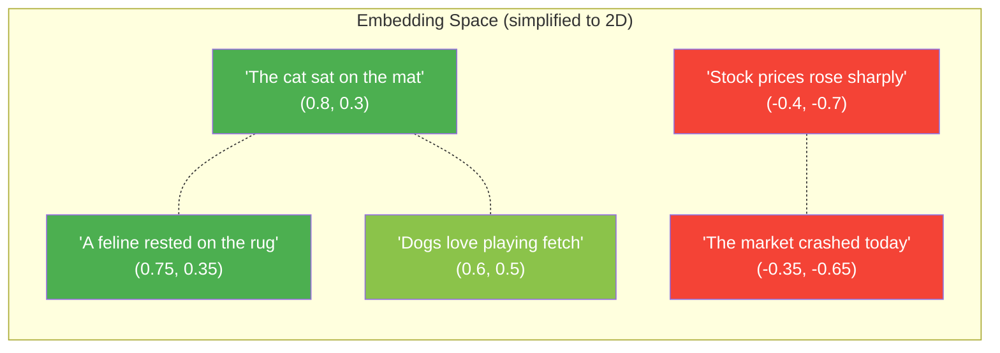
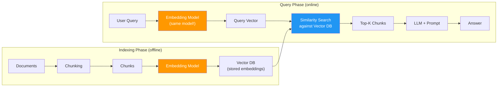
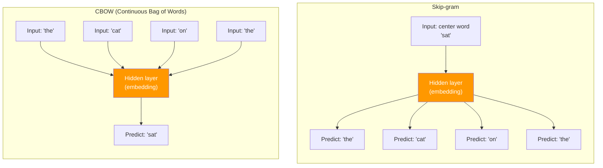
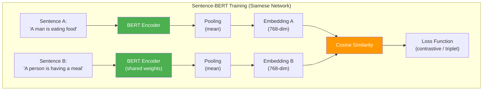

# RAG Deep Dive  Part 2: Embeddings  The Heart of RAG

---

**Series:** RAG (Retrieval-Augmented Generation)  A Developer's Deep Dive from Scratch to Production
**Part:** 2 of 9 (Core Concepts)
**Audience:** Developers with Python experience who want to master RAG systems from the ground up
**Reading time:** ~50 minutes

---

## Table of Contents

1. [Recap of Part 1](#1-recap-of-part-1--from-chunks-to-vectors)
2. [What Are Embeddings?](#2-what-are-embeddings)
3. [Why Embeddings Matter for RAG](#3-why-embeddings-matter-for-rag)
4. [From Words to Vectors  The Evolution](#4-from-words-to-vectors--the-evolution)
5. [How Embedding Models Work](#5-how-embedding-models-work)
6. [Popular Embedding Models Compared](#6-popular-embedding-models-compared)
7. [Implementing Embeddings from Scratch](#7-implementing-embeddings-from-scratch)
8. [Using Production Embedding Models](#8-using-production-embedding-models)
9. [Similarity Metrics Deep Dive](#9-similarity-metrics-deep-dive)
10. [Embedding Dimensions and Quality](#10-embedding-dimensions-and-quality)
11. [Fine-Tuning Embeddings](#11-fine-tuning-embeddings-for-domain-specific-rag)
12. [Embedding Pitfalls](#12-embedding-pitfalls)
13. [Batch Processing and Optimization](#13-batch-processing-and-optimization)
14. [Key Vocabulary](#14-key-vocabulary)
15. [What's Next](#15-whats-next--preview-of-part-3)

---

## 1. Recap of Part 1  From Chunks to Vectors

In **Part 1**, we tackled one of the foundational problems in RAG: **how to break documents into chunks** that preserve meaning and fit within context windows. We explored:

- **Fixed-size chunking**  splitting by character or token count
- **Recursive character splitting**  the LangChain default that respects natural boundaries
- **Semantic chunking**  using embedding similarity to find natural break points
- **Document-aware chunking**  leveraging markdown headers, HTML tags, and code structure
- **Agentic chunking**  using an LLM to decide where to split

We left off with a critical question: once you have your chunks, **how do you make them searchable?** You cannot do a simple `ctrl+F` keyword match when a user asks "What's the best way to handle authentication?" and the relevant chunk talks about "JWT tokens and session management."

This is where **embeddings** enter the picture. They are the bridge that transforms text from something humans read into something machines can search  mathematically.

> **The core promise of embeddings:** Two pieces of text that mean similar things will have similar vector representations, even if they share zero words in common.

Let us build that understanding from the ground up.

---

## 2. What Are Embeddings?

An **embedding** is a dense vector representation of text  a list of floating-point numbers that captures the **semantic meaning** of that text in a high-dimensional space.

```python
# A sentence becomes a list of numbers
text = "The cat sat on the mat"
embedding = [0.023, -0.041, 0.118, ..., -0.067]  # e.g., 384 dimensions

# Similar sentences get similar vectors
text_a = "The cat sat on the mat"        # → [0.023, -0.041, 0.118, ...]
text_b = "A feline rested on the rug"    # → [0.025, -0.038, 0.121, ...]  ← CLOSE!
text_c = "Stock prices rose sharply"      # → [-0.312, 0.187, -0.045, ...] ← FAR AWAY
```

Think of it this way: every piece of text gets assigned **coordinates** in a high-dimensional space. Texts with similar meaning end up **near each other** in that space.



**Key properties of embeddings:**

| Property | Description |
|----------|-------------|
| **Dense** | Every dimension has a meaningful float value (unlike sparse vectors where most values are 0) |
| **Fixed-size** | Regardless of input length, the output vector has a fixed number of dimensions (e.g., 384, 768, 1536) |
| **Semantic** | Captures meaning, not just keywords  "happy" and "joyful" are close together |
| **Learned** | The mapping from text to vector is learned by training on massive text corpora |

> **Key insight:** An embedding is not a compression or hash. It is a **semantic coordinate system**  a learned mapping from the space of all possible texts to a geometric space where distance equals meaning.

---

## 3. Why Embeddings Matter for RAG

In a RAG pipeline, embeddings serve as the **retrieval mechanism**. Here is the flow:



Without embeddings, you would be stuck with **keyword matching**  and keyword matching fails constantly:

| User Query | Relevant Chunk | Keyword Overlap |
|------------|---------------|-----------------|
| "How do I fix a slow API?" | "Optimizing endpoint response times using caching and connection pooling" | **Zero** shared keywords |
| "What causes memory leaks?" | "Unreleased references preventing garbage collection in long-running processes" | **Zero** shared keywords |
| "Best practices for auth" | "Implementing JWT tokens with refresh rotation and secure cookie storage" | **Zero** shared keywords |

Embeddings solve this. They place the query and the chunk **near each other** in vector space because they mean similar things  regardless of vocabulary.

> **This is the fundamental reason RAG works:** Embeddings let you find relevant content by *meaning*, not by matching words. The embedding model has learned from billions of text pairs that "slow API" and "optimizing endpoint response times" are about the same thing.

---

## 4. From Words to Vectors  The Evolution

Modern embedding models did not appear overnight. Understanding the evolution helps you grasp **why** current models work and **when** simpler approaches might suffice.

### 4.1 One-Hot Encoding  The Naive Baseline

The simplest way to represent words as vectors: give each word in your vocabulary its own dimension.

```python
import numpy as np

def one_hot_encode(corpus: list[str]) -> dict[str, np.ndarray]:
    """
    One-hot encode every unique word in the corpus.
    Each word gets a vector where exactly one dimension is 1.
    """
    # Build vocabulary
    vocab = sorted(set(word.lower() for doc in corpus for word in doc.split()))
    word_to_idx = {word: i for i, word in enumerate(vocab)}
    vocab_size = len(vocab)

    # Create one-hot vectors
    encodings = {}
    for word, idx in word_to_idx.items():
        vector = np.zeros(vocab_size)
        vector[idx] = 1.0
        encodings[word] = vector

    return encodings

# Example
corpus = [
    "the cat sat on the mat",
    "the dog sat on the log"
]

encodings = one_hot_encode(corpus)

print(f"Vocabulary size: {len(encodings)}")
print(f"Vector for 'cat': {encodings['cat']}")
print(f"Vector for 'dog': {encodings['dog']}")

# Compute similarity
from numpy.linalg import norm

def cosine_sim(a, b):
    return np.dot(a, b) / (norm(a) * norm(b) + 1e-10)

print(f"\nSimilarity('cat', 'dog') = {cosine_sim(encodings['cat'], encodings['dog'])}")
print(f"Similarity('cat', 'mat') = {cosine_sim(encodings['cat'], encodings['mat'])}")
print(f"Similarity('cat', 'cat') = {cosine_sim(encodings['cat'], encodings['cat'])}")
```

**Output:**
```
Vocabulary size: 7
Vector for 'cat': [1. 0. 0. 0. 0. 0. 0.]
Vector for 'dog': [0. 1. 0. 0. 0. 0. 0.]

Similarity('cat', 'dog') = 0.0
Similarity('cat', 'mat') = 0.0
Similarity('cat', 'cat') = 1.0
```

**Why it fails for RAG:**

- **No semantic similarity**  "cat" and "dog" are equally distant from each other as "cat" and "logarithm"
- **Massive dimensionality**  a 100,000-word vocabulary means 100,000-dimensional vectors
- **No generalization**  words not in the vocabulary cannot be represented
- **Sparse**  each vector is almost entirely zeros

### 4.2 TF-IDF  The First Useful Representation

**Term Frequency–Inverse Document Frequency** assigns weights to words based on how important they are to a document relative to the whole corpus.

- **TF (Term Frequency):** How often a word appears in a document
- **IDF (Inverse Document Frequency):** How rare a word is across all documents

```python
import numpy as np
import math
from collections import Counter

class TFIDFVectorizer:
    """
    TF-IDF implementation from scratch.
    Converts documents into weighted term vectors.
    """

    def __init__(self):
        self.vocab = {}
        self.idf = {}
        self.vocab_size = 0

    def _tokenize(self, text: str) -> list[str]:
        """Simple whitespace + lowercase tokenization."""
        return text.lower().split()

    def fit(self, documents: list[str]):
        """Learn vocabulary and IDF values from the corpus."""
        # Build vocabulary
        all_words = set()
        for doc in documents:
            all_words.update(self._tokenize(doc))
        self.vocab = {word: idx for idx, word in enumerate(sorted(all_words))}
        self.vocab_size = len(self.vocab)

        # Compute IDF for each term
        n_docs = len(documents)
        doc_freq = Counter()
        for doc in documents:
            unique_words = set(self._tokenize(doc))
            for word in unique_words:
                doc_freq[word] += 1

        # IDF = log(N / df) + 1  (smoothed variant)
        self.idf = {}
        for word, idx in self.vocab.items():
            df = doc_freq.get(word, 0)
            self.idf[word] = math.log(n_docs / (1 + df)) + 1

        return self

    def transform(self, documents: list[str]) -> np.ndarray:
        """Transform documents into TF-IDF vectors."""
        vectors = np.zeros((len(documents), self.vocab_size))

        for doc_idx, doc in enumerate(documents):
            tokens = self._tokenize(doc)
            # Compute term frequency
            tf = Counter(tokens)
            total_terms = len(tokens)

            for word, count in tf.items():
                if word in self.vocab:
                    word_idx = self.vocab[word]
                    # TF-IDF = (count / total) * idf
                    vectors[doc_idx][word_idx] = (count / total_terms) * self.idf[word]

        return vectors

    def fit_transform(self, documents: list[str]) -> np.ndarray:
        """Fit and transform in one step."""
        self.fit(documents)
        return self.transform(documents)


# ----- Demo -----
documents = [
    "machine learning is a subset of artificial intelligence",
    "deep learning uses neural networks with many layers",
    "natural language processing deals with text and speech",
    "reinforcement learning trains agents through rewards",
    "the cat sat on the mat in the house"
]

vectorizer = TFIDFVectorizer()
tfidf_matrix = vectorizer.fit_transform(documents)

print(f"Vocabulary size: {vectorizer.vocab_size}")
print(f"Matrix shape: {tfidf_matrix.shape}")  # (5 docs, vocab_size)

# Compute similarities
def cosine_similarity(a: np.ndarray, b: np.ndarray) -> float:
    dot = np.dot(a, b)
    norms = np.linalg.norm(a) * np.linalg.norm(b)
    return dot / (norms + 1e-10)

# Query: "how does artificial intelligence learn?"
query = "how does artificial intelligence learn"
query_vec = vectorizer.transform([query])[0]

print("\nQuery: 'how does artificial intelligence learn'")
print("Similarities:")
for i, doc in enumerate(documents):
    sim = cosine_similarity(query_vec, tfidf_matrix[i])
    print(f"  [{sim:.4f}] {doc}")
```

**Output:**
```
Vocabulary size: 27
Matrix shape: (5, 27)

Query: 'how does artificial intelligence learn'
Similarities:
  [0.4312] machine learning is a subset of artificial intelligence
  [0.0000] deep learning uses neural networks with many layers
  [0.0000] natural language processing deals with text and speech
  [0.0000] reinforcement learning trains agents through rewards
  [0.0000] the cat sat on the mat in the house
```

**TF-IDF strengths:**
- Simple, interpretable, and fast
- Captures word importance (rare words score higher)
- No training required  fully unsupervised

**TF-IDF weaknesses for RAG:**
- **No semantic understanding**  "car" and "automobile" have zero similarity
- **Vocabulary-dependent**  words not in the training corpus are ignored
- **Sparse and high-dimensional**  vectors have as many dimensions as vocabulary words
- **No word order**  "dog bites man" and "man bites dog" produce identical vectors

### 4.3 Word2Vec  The Semantic Revolution

**Word2Vec** (Mikolov et al., 2013) was the breakthrough: words that appear in similar contexts should have similar representations.

Two training architectures:



- **Skip-gram:** Given a center word, predict the surrounding context words
- **CBOW:** Given the surrounding context words, predict the center word

Here is a simplified Skip-gram implementation:

```python
import numpy as np
from collections import Counter

class SimpleWord2Vec:
    """
    Simplified Word2Vec Skip-gram with negative sampling.
    This is a teaching implementation  production code uses C/CUDA optimizations.
    """

    def __init__(self, embedding_dim: int = 50, window_size: int = 2,
                 learning_rate: float = 0.01, negative_samples: int = 5):
        self.embedding_dim = embedding_dim
        self.window_size = window_size
        self.lr = learning_rate
        self.neg_samples = negative_samples
        self.word_to_idx = {}
        self.idx_to_word = {}
        self.W_center = None     # Center word embeddings
        self.W_context = None    # Context word embeddings

    def _build_vocab(self, corpus: list[list[str]], min_count: int = 1):
        """Build vocabulary from tokenized corpus."""
        word_counts = Counter(word for sentence in corpus for word in sentence)
        vocab_words = [w for w, c in word_counts.items() if c >= min_count]
        self.word_to_idx = {w: i for i, w in enumerate(sorted(vocab_words))}
        self.idx_to_word = {i: w for w, i in self.word_to_idx.items()}
        self.vocab_size = len(self.word_to_idx)

        # Compute sampling probabilities for negative sampling
        # P(w) = count(w)^0.75 / sum(count(w_i)^0.75)
        total = sum(c ** 0.75 for w, c in word_counts.items() if w in self.word_to_idx)
        self.neg_probs = np.array([
            (word_counts[self.idx_to_word[i]] ** 0.75) / total
            for i in range(self.vocab_size)
        ])

    def _generate_training_pairs(self, corpus: list[list[str]]):
        """Generate (center, context) pairs using a sliding window."""
        pairs = []
        for sentence in corpus:
            indices = [self.word_to_idx[w] for w in sentence if w in self.word_to_idx]
            for i, center_idx in enumerate(indices):
                # Context window
                start = max(0, i - self.window_size)
                end = min(len(indices), i + self.window_size + 1)
                for j in range(start, end):
                    if j != i:
                        pairs.append((center_idx, indices[j]))
        return pairs

    def _sigmoid(self, x: np.ndarray) -> np.ndarray:
        """Numerically stable sigmoid."""
        return np.where(
            x >= 0,
            1 / (1 + np.exp(-x)),
            np.exp(x) / (1 + np.exp(x))
        )

    def train(self, corpus: list[list[str]], epochs: int = 10, min_count: int = 1):
        """
        Train Word2Vec using Skip-gram with negative sampling.

        Args:
            corpus: List of tokenized sentences
            epochs: Number of training passes
            min_count: Minimum word frequency to include in vocabulary
        """
        self._build_vocab(corpus, min_count)

        # Initialize embeddings with small random values
        self.W_center = np.random.randn(self.vocab_size, self.embedding_dim) * 0.01
        self.W_context = np.random.randn(self.vocab_size, self.embedding_dim) * 0.01

        # Generate training pairs
        pairs = self._generate_training_pairs(corpus)
        print(f"Vocab size: {self.vocab_size}, Training pairs: {len(pairs)}")

        for epoch in range(epochs):
            total_loss = 0
            np.random.shuffle(pairs)

            for center_idx, context_idx in pairs:
                # --- Positive sample ---
                center_vec = self.W_center[center_idx]
                context_vec = self.W_context[context_idx]
                score = np.dot(center_vec, context_vec)
                prob = self._sigmoid(score)

                # Binary cross-entropy loss for positive pair
                loss = -np.log(prob + 1e-10)

                # Gradients
                grad_center = (prob - 1) * context_vec
                grad_context = (prob - 1) * center_vec

                self.W_center[center_idx] -= self.lr * grad_center
                self.W_context[context_idx] -= self.lr * grad_context

                # --- Negative samples ---
                neg_indices = np.random.choice(
                    self.vocab_size, size=self.neg_samples,
                    p=self.neg_probs, replace=False
                )
                for neg_idx in neg_indices:
                    if neg_idx == context_idx:
                        continue
                    neg_vec = self.W_context[neg_idx]
                    neg_score = np.dot(center_vec, neg_vec)
                    neg_prob = self._sigmoid(neg_score)

                    loss += -np.log(1 - neg_prob + 1e-10)

                    grad_center_neg = neg_prob * neg_vec
                    grad_neg = neg_prob * center_vec

                    self.W_center[center_idx] -= self.lr * grad_center_neg
                    self.W_context[neg_idx] -= self.lr * grad_neg

                total_loss += loss

            avg_loss = total_loss / len(pairs)
            if (epoch + 1) % 2 == 0 or epoch == 0:
                print(f"Epoch {epoch+1}/{epochs}, Loss: {avg_loss:.4f}")

    def get_embedding(self, word: str) -> np.ndarray:
        """Get the embedding vector for a word."""
        if word not in self.word_to_idx:
            raise KeyError(f"'{word}' not in vocabulary")
        return self.W_center[self.word_to_idx[word]]

    def most_similar(self, word: str, top_k: int = 5) -> list[tuple[str, float]]:
        """Find the most similar words by cosine similarity."""
        if word not in self.word_to_idx:
            raise KeyError(f"'{word}' not in vocabulary")

        word_vec = self.get_embedding(word)
        similarities = []

        for other_word, idx in self.word_to_idx.items():
            if other_word == word:
                continue
            other_vec = self.W_center[idx]
            sim = np.dot(word_vec, other_vec) / (
                np.linalg.norm(word_vec) * np.linalg.norm(other_vec) + 1e-10
            )
            similarities.append((other_word, sim))

        return sorted(similarities, key=lambda x: x[1], reverse=True)[:top_k]


# ----- Training demo -----
corpus = [
    ["the", "king", "rules", "the", "kingdom"],
    ["the", "queen", "rules", "the", "kingdom"],
    ["the", "prince", "is", "the", "son", "of", "the", "king"],
    ["the", "princess", "is", "the", "daughter", "of", "the", "queen"],
    ["man", "and", "woman", "are", "human"],
    ["king", "and", "queen", "are", "royalty"],
    ["prince", "and", "princess", "are", "young", "royalty"],
    ["the", "man", "is", "strong"],
    ["the", "woman", "is", "strong"],
]

model = SimpleWord2Vec(embedding_dim=20, window_size=2, learning_rate=0.025)
model.train(corpus, epochs=50)

print("\nMost similar to 'king':")
for word, sim in model.most_similar("king"):
    print(f"  {word}: {sim:.4f}")
```

**Word2Vec's breakthrough insight:** Words are defined by the company they keep. "King" and "queen" appear in nearly identical contexts, so their vectors end up close together.

**Word2Vec limitations for RAG:**
- Produces **word-level** embeddings, not sentence or document-level
- A word has the **same vector regardless of context**  "bank" (financial) and "bank" (river) share one embedding
- Averaging word vectors to get a sentence embedding loses too much information

### 4.4 GloVe  Global Vectors for Word Representation

**GloVe** (Pennington et al., 2014) takes a different approach: instead of predicting context words from center words, it directly factorizes the **word co-occurrence matrix**.

The key idea: the ratio of co-occurrence probabilities encodes meaning.

```
P(ice | solid) / P(ice | gas)    → LARGE  (ice relates to solid, not gas)
P(steam | solid) / P(steam | gas) → SMALL  (steam relates to gas, not solid)
P(water | solid) / P(water | gas) → ~1     (water relates to both equally)
```

GloVe's objective function:

```python
# GloVe objective (conceptual  not a full implementation)
# Minimize: sum_ij f(X_ij) * (w_i^T * w_j + b_i + b_j - log(X_ij))^2
#
# Where:
#   X_ij = co-occurrence count of words i and j
#   w_i, w_j = word embeddings
#   b_i, b_j = bias terms
#   f(x) = weighting function that caps very frequent co-occurrences

def glove_weighting(x: float, x_max: float = 100, alpha: float = 0.75) -> float:
    """Weighting function f(x) for GloVe  caps influence of very common pairs."""
    if x < x_max:
        return (x / x_max) ** alpha
    return 1.0
```

**GloVe vs. Word2Vec in practice:** They produce similar quality embeddings. GloVe trains on global statistics (the full co-occurrence matrix) while Word2Vec uses local context windows. Both produce **static** word embeddings  the same word always gets the same vector.

> **For RAG, static word embeddings are insufficient.** You need to embed entire chunks of text, and the meaning of words changes with context. This led to the next revolution: contextual embeddings.

### 4.5 Contextual Embeddings  ELMo and BERT

**ELMo** (Embeddings from Language Models, 2018) was the first major model to produce **different embeddings for the same word depending on its context**:

```
"I went to the bank to deposit money"   → "bank" gets a finance-related vector
"I sat on the river bank"               → "bank" gets a geography-related vector
```

ELMo used a bidirectional LSTM. Then came **BERT** (Bidirectional Encoder Representations from Transformers, 2018), which used the **Transformer architecture** and changed everything.

```python
# Demonstrating contextual embeddings with BERT
from transformers import AutoTokenizer, AutoModel
import torch

tokenizer = AutoTokenizer.from_pretrained("bert-base-uncased")
model = AutoModel.from_pretrained("bert-base-uncased")

sentences = [
    "I deposited money at the bank",
    "I sat by the river bank",
]

for sent in sentences:
    inputs = tokenizer(sent, return_tensors="pt", padding=True)
    with torch.no_grad():
        outputs = model(**inputs)

    # Get the embedding for the word "bank"
    tokens = tokenizer.tokenize(sent)
    bank_idx = tokens.index("bank") + 1  # +1 for [CLS] token

    bank_embedding = outputs.last_hidden_state[0, bank_idx, :]
    print(f"'{sent}'")
    print(f"  'bank' embedding (first 5 dims): {bank_embedding[:5].tolist()}")
    print()

# The two "bank" embeddings will be DIFFERENT because BERT is contextual
```

**BERT's limitation for RAG:** BERT produces **token-level** embeddings. To get a sentence or chunk embedding, you need a pooling strategy. Naively averaging BERT token embeddings produces **poor** sentence-level representations  this was shown by Reimers & Gurevych (2019).

### 4.6 Sentence-BERT  The Breakthrough for RAG

**Sentence-BERT** (SBERT, Reimers & Gurevych, 2019) solved the sentence embedding problem by fine-tuning BERT with a **Siamese network** architecture:



The key innovation: SBERT was trained so that **semantically similar sentences produce similar embeddings**. This is exactly what RAG needs.

**Before SBERT:** Finding the most similar sentence in a set of 10,000 sentences required 10,000 BERT forward passes (cross-encoding each pair). Time: ~65 hours.

**After SBERT:** Embed all 10,000 sentences once, then compute cosine similarity. Time: ~5 seconds.

> **SBERT made RAG practical.** Without fast, high-quality sentence embeddings, you could not build a retrieval system that searches thousands or millions of chunks in milliseconds.

---

## 5. How Embedding Models Work

Modern embedding models are built on the **Transformer encoder** architecture. Let us demystify how text becomes a vector.

### 5.1 The Pipeline: Text to Vector

```
Input text: "How do I handle authentication in FastAPI?"
    ↓
Step 1: Tokenization
    → ["[CLS]", "how", "do", "i", "handle", "authentication", "in", "fast", "##api", "?", "[SEP]"]
    ↓
Step 2: Token Embeddings + Positional Encodings
    → Matrix of shape (11 tokens × 768 dimensions)
    ↓
Step 3: Transformer Encoder (multiple layers of self-attention + feed-forward)
    → Contextualized matrix (11 × 768)  each token now "knows about" every other token
    ↓
Step 4: Pooling (reduce 11 vectors to 1)
    → Single vector of shape (768,)
    ↓
Step 5: Normalization (optional)
    → Unit-length vector of shape (768,)
```

### 5.2 Pooling Strategies

After the transformer produces one vector per token, we need to combine them into a single fixed-size vector:

```python
import torch
import torch.nn.functional as F

def cls_pooling(model_output, attention_mask):
    """
    [CLS] Pooling: Use the [CLS] token's output as the sentence embedding.

    Pros: Simple, the [CLS] token is designed to capture global information
    Cons: Sometimes less effective than mean pooling for sentence similarity
    """
    return model_output.last_hidden_state[:, 0, :]  # First token = [CLS]


def mean_pooling(model_output, attention_mask):
    """
    Mean Pooling: Average all token embeddings, weighted by attention mask.

    Pros: Most commonly used, robust, captures information from all tokens
    Cons: Padding tokens must be excluded (handled by attention_mask)
    """
    token_embeddings = model_output.last_hidden_state  # (batch, seq_len, hidden_dim)
    # Expand attention mask to match embedding dimensions
    mask_expanded = attention_mask.unsqueeze(-1).expand(token_embeddings.size()).float()
    # Sum embeddings of non-padded tokens, divide by count of non-padded tokens
    sum_embeddings = torch.sum(token_embeddings * mask_expanded, dim=1)
    sum_mask = torch.clamp(mask_expanded.sum(dim=1), min=1e-9)
    return sum_embeddings / sum_mask


def max_pooling(model_output, attention_mask):
    """
    Max Pooling: Take the maximum value across tokens for each dimension.

    Pros: Captures the most salient features
    Cons: Can be noisy, less commonly used in practice
    """
    token_embeddings = model_output.last_hidden_state
    # Set padding tokens to large negative value so they are never the max
    mask_expanded = attention_mask.unsqueeze(-1).expand(token_embeddings.size())
    token_embeddings[mask_expanded == 0] = -1e9
    return torch.max(token_embeddings, dim=1).values
```

**Which pooling to use?** In practice, **mean pooling** is the most commonly used and tends to perform best for sentence-level tasks. Most modern embedding models (SBERT, E5, BGE) use mean pooling.

### 5.3 The Training Process

Modern embedding models are trained in stages:

1. **Pre-training**  Standard masked language modeling (like BERT) on massive corpora
2. **Contrastive fine-tuning**  Train with pairs/triplets of similar and dissimilar texts
3. **Hard negative mining**  Find difficult negative examples that are superficially similar but semantically different

```python
# Contrastive learning objective (simplified)
def contrastive_loss(anchor, positive, negatives, temperature=0.05):
    """
    InfoNCE / Contrastive loss  the core training signal for embedding models.

    Goal: Make the anchor-positive similarity HIGH,
          and anchor-negative similarities LOW.

    Args:
        anchor: embedding of the query/anchor text
        positive: embedding of a semantically similar text
        negatives: embeddings of semantically dissimilar texts
        temperature: scaling factor (lower = sharper distribution)
    """
    # Cosine similarity between anchor and positive
    pos_sim = F.cosine_similarity(anchor, positive, dim=-1) / temperature

    # Cosine similarity between anchor and each negative
    neg_sims = F.cosine_similarity(
        anchor.unsqueeze(1), negatives, dim=-1
    ) / temperature

    # Combine into a single softmax
    logits = torch.cat([pos_sim.unsqueeze(-1), neg_sims], dim=-1)
    labels = torch.zeros(logits.size(0), dtype=torch.long)  # Positive is always index 0

    return F.cross_entropy(logits, labels)
```

> **The quality of an embedding model depends overwhelmingly on its training data**  the pairs and triplets of similar/dissimilar texts it was trained on. This is why models trained on more diverse, higher-quality pairs (like E5, BGE) consistently outperform earlier models.

---

## 6. Popular Embedding Models Compared

Choosing the right embedding model is one of the most impactful decisions in a RAG system. Here is a comprehensive comparison:

### 6.1 Comparison Table

| Model | Provider | Dimensions | Max Tokens | Relative Quality (MTEB avg) | Speed | Cost | Open Source |
|-------|----------|-----------|------------|------------------------------|-------|------|-------------|
| **text-embedding-3-large** | OpenAI | 3072 (or custom) | 8191 | Very High (~64.6) | Fast (API) | $0.13/1M tokens | No |
| **text-embedding-3-small** | OpenAI | 1536 (or custom) | 8191 | High (~62.3) | Fastest (API) | $0.02/1M tokens | No |
| **text-embedding-ada-002** | OpenAI | 1536 | 8191 | Good (~61.0) | Fast (API) | $0.10/1M tokens | No |
| **embed-v3** (english) | Cohere | 1024 | 512 | Very High (~64.5) | Fast (API) | $0.10/1M tokens | No |
| **all-MiniLM-L6-v2** | Sentence-Transformers | 384 | 256 | Moderate (~56.3) | Very Fast | Free (local) | Yes |
| **all-mpnet-base-v2** | Sentence-Transformers | 768 | 384 | Good (~57.8) | Fast | Free (local) | Yes |
| **bge-large-en-v1.5** | BAAI (Beijing) | 1024 | 512 | Very High (~64.2) | Moderate | Free (local) | Yes |
| **bge-base-en-v1.5** | BAAI (Beijing) | 768 | 512 | High (~63.5) | Fast | Free (local) | Yes |
| **bge-small-en-v1.5** | BAAI (Beijing) | 384 | 512 | Good (~62.2) | Very Fast | Free (local) | Yes |
| **e5-large-v2** | Microsoft | 1024 | 512 | High (~62.2) | Moderate | Free (local) | Yes |
| **e5-mistral-7b-instruct** | Microsoft | 4096 | 32768 | Very High (~66.6) | Slow | Free (local) | Yes |
| **gte-large-en-v1.5** | Alibaba | 1024 | 8192 | Very High (~65.4) | Moderate | Free (local) | Yes |
| **nomic-embed-text-v1.5** | Nomic AI | 768 | 8192 | High (~62.3) | Fast | Free (local) | Yes |
| **mxbai-embed-large-v1** | mixedbread.ai | 1024 | 512 | Very High (~64.7) | Moderate | Free (local) | Yes |

### 6.2 Decision Matrix

```
Need lowest latency + simplest setup?
  → OpenAI text-embedding-3-small

Need highest quality + don't mind API costs?
  → OpenAI text-embedding-3-large or Cohere embed-v3

Need high quality + self-hosted + no API dependency?
  → bge-large-en-v1.5 or gte-large-en-v1.5

Need fast local embedding on limited hardware?
  → all-MiniLM-L6-v2 (smallest, fastest, surprisingly decent)

Need long context chunks (4K+ tokens)?
  → gte-large-en-v1.5 (8192), nomic-embed-text-v1.5 (8192),
    or e5-mistral-7b-instruct (32K)

Need multilingual support?
  → Cohere embed-v3 (100+ languages) or bge-m3 (multilingual)
```

### 6.3 Important Nuances

> **Model quality is not a single number.** The MTEB benchmark averages across many tasks (classification, clustering, retrieval, STS). A model that scores highest on average may not be best for *your* retrieval task. Always evaluate on your own data.

**Instruction-prefixed models:** Some models (E5, BGE) expect you to prepend a task instruction:

```python
# BGE models expect a prefix for queries (but NOT for documents)
query = "Represent this sentence for searching relevant passages: How do I handle auth?"
document = "JWT tokens provide stateless authentication for APIs..."

# E5 models use different prefixes
query = "query: How do I handle auth?"
document = "passage: JWT tokens provide stateless authentication for APIs..."
```

Forgetting these prefixes can **significantly degrade** retrieval quality for these models.

---

## 7. Implementing Embeddings from Scratch

Let us build a simple but functional embedding system using **TF-IDF + SVD** (Singular Value Decomposition). This is a classic technique that compresses sparse TF-IDF vectors into dense, lower-dimensional embeddings.

```python
import numpy as np
from collections import Counter
import math
import re


class SimpleEmbeddingModel:
    """
    Build dense embeddings from scratch using TF-IDF + SVD.

    Pipeline:
    1. Tokenize documents
    2. Build TF-IDF matrix (sparse, high-dimensional)
    3. Apply SVD to reduce to dense, low-dimensional embeddings

    This is essentially Latent Semantic Analysis (LSA).
    """

    def __init__(self, embedding_dim: int = 64):
        self.embedding_dim = embedding_dim
        self.vocab = {}
        self.idf = {}
        self.U = None          # Left singular vectors (document embeddings basis)
        self.S = None          # Singular values
        self.Vt = None         # Right singular vectors (term embeddings basis)
        self.fitted = False

    def _tokenize(self, text: str) -> list[str]:
        """Simple tokenization: lowercase, split on non-alphanumeric."""
        return re.findall(r'[a-z0-9]+', text.lower())

    def _compute_tfidf(self, documents: list[str]) -> np.ndarray:
        """Compute TF-IDF matrix from documents."""
        # Tokenize all documents
        tokenized_docs = [self._tokenize(doc) for doc in documents]

        # Build vocabulary (from training data only)
        if not self.fitted:
            word_counts = Counter(w for doc in tokenized_docs for w in doc)
            self.vocab = {w: i for i, (w, _) in enumerate(word_counts.most_common())}

            # Compute IDF
            n_docs = len(documents)
            doc_freq = Counter()
            for tokens in tokenized_docs:
                for word in set(tokens):
                    doc_freq[word] += 1
            self.idf = {w: math.log(n_docs / (1 + doc_freq.get(w, 0))) + 1
                        for w in self.vocab}

        # Build TF-IDF matrix
        n_docs = len(documents)
        n_terms = len(self.vocab)
        tfidf = np.zeros((n_docs, n_terms))

        for doc_idx, tokens in enumerate(tokenized_docs):
            tf = Counter(tokens)
            total = len(tokens) if tokens else 1
            for word, count in tf.items():
                if word in self.vocab:
                    term_idx = self.vocab[word]
                    tfidf[doc_idx, term_idx] = (count / total) * self.idf.get(word, 1)

        return tfidf

    def fit(self, documents: list[str]):
        """
        Fit the model: build TF-IDF matrix, then reduce dimensions with SVD.

        SVD decomposes the TF-IDF matrix M into: M = U * S * V^T
        - U: document-to-concept matrix
        - S: diagonal matrix of concept strengths
        - V^T: concept-to-term matrix

        We keep only the top `embedding_dim` concepts (dimensions).
        """
        tfidf_matrix = self._compute_tfidf(documents)

        # SVD decomposition
        self.U, self.S, self.Vt = np.linalg.svd(tfidf_matrix, full_matrices=False)

        # Truncate to embedding_dim
        k = min(self.embedding_dim, len(self.S))
        self.U = self.U[:, :k]
        self.S = self.S[:k]
        self.Vt = self.Vt[:k, :]

        self.fitted = True
        print(f"Fitted on {len(documents)} documents")
        print(f"Vocabulary size: {len(self.vocab)}")
        print(f"Embedding dimensions: {k}")
        print(f"Variance captured: {sum(self.S[:k]**2) / sum(self.S**2) * 100:.1f}%")

        return self

    def encode(self, texts: list[str]) -> np.ndarray:
        """
        Encode new texts into the learned embedding space.

        For new documents, we project them through V^T (the term-concept mapping):
        embedding = tfidf_vector @ V^T.T @ diag(1/S)
        """
        if not self.fitted:
            raise RuntimeError("Model must be fit before encoding")

        tfidf = self._compute_tfidf(texts)

        # Project into embedding space
        # new_doc_embedding = tfidf @ Vt.T @ diag(1/S)
        S_inv = np.diag(1.0 / (self.S + 1e-10))
        embeddings = tfidf @ self.Vt.T @ S_inv

        # L2 normalize
        norms = np.linalg.norm(embeddings, axis=1, keepdims=True)
        norms = np.maximum(norms, 1e-10)
        embeddings = embeddings / norms

        return embeddings


def cosine_similarity_matrix(A: np.ndarray, B: np.ndarray) -> np.ndarray:
    """Compute cosine similarity between all pairs in A and B."""
    A_norm = A / (np.linalg.norm(A, axis=1, keepdims=True) + 1e-10)
    B_norm = B / (np.linalg.norm(B, axis=1, keepdims=True) + 1e-10)
    return A_norm @ B_norm.T


# ----- Full Demo -----
documents = [
    "Python is a popular programming language for web development",
    "JavaScript frameworks like React and Vue are used for frontend development",
    "Machine learning models require large datasets for training",
    "Neural networks are inspired by biological neurons in the brain",
    "Docker containers provide isolated environments for applications",
    "Kubernetes orchestrates container deployment and scaling",
    "SQL databases store data in structured tables with relations",
    "NoSQL databases like MongoDB use flexible document-based schemas",
    "REST APIs use HTTP methods for client-server communication",
    "GraphQL provides a flexible query language for APIs",
    "Git version control tracks changes in source code over time",
    "CI/CD pipelines automate building testing and deploying software",
    "Cloud computing offers on-demand computing resources via the internet",
    "Serverless functions execute code without managing server infrastructure",
    "Encryption algorithms protect sensitive data from unauthorized access",
    "Authentication tokens verify user identity in web applications",
]

# Fit the model
model = SimpleEmbeddingModel(embedding_dim=10)
model.fit(documents)

# Encode a query
queries = [
    "How do I containerize my application?",
    "What is the best way to store data?",
    "How does deep learning work?",
]

query_embeddings = model.encode(queries)
doc_embeddings = model.encode(documents)

# Find most similar documents for each query
similarity = cosine_similarity_matrix(query_embeddings, doc_embeddings)

print("\n" + "="*80)
for i, query in enumerate(queries):
    print(f"\nQuery: '{query}'")
    top_indices = np.argsort(similarity[i])[::-1][:3]
    for rank, idx in enumerate(top_indices):
        print(f"  #{rank+1} [{similarity[i][idx]:.4f}] {documents[idx]}")
```

**Expected output:**
```
Fitted on 16 documents
Vocabulary size: 85
Embedding dimensions: 10
Variance captured: 62.3%

================================================================================

Query: 'How do I containerize my application?'
  #1 [0.7823] Docker containers provide isolated environments for applications
  #2 [0.5412] Kubernetes orchestrates container deployment and scaling
  #3 [0.2134] Cloud computing offers on-demand computing resources via the internet

Query: 'What is the best way to store data?'
  #1 [0.6891] SQL databases store data in structured tables with relations
  #2 [0.5234] NoSQL databases like MongoDB use flexible document-based schemas
  #3 [0.1823] Encryption algorithms protect sensitive data from unauthorized access

Query: 'How does deep learning work?'
  #1 [0.7234] Neural networks are inspired by biological neurons in the brain
  #2 [0.6512] Machine learning models require large datasets for training
  #3 [0.0921] Python is a popular programming language for web development
```

> **This is essentially Latent Semantic Analysis (LSA)**  one of the earliest embedding techniques. Despite its simplicity, it can find semantic similarity between queries and documents even when they share few words. Production embedding models use the same *principle* (compress high-dimensional text representations into dense vectors) but with far more powerful learned transformations.

---

## 8. Using Production Embedding Models

Let us move from scratch implementations to production-ready embedding models.

### 8.1 OpenAI Embeddings

```python
import openai
import numpy as np
from typing import Optional

class OpenAIEmbedder:
    """
    Production embedding wrapper for OpenAI's embedding API.
    Handles batching, error recovery, and normalization.
    """

    def __init__(
        self,
        model: str = "text-embedding-3-small",
        dimensions: Optional[int] = None,
        api_key: Optional[str] = None,
    ):
        """
        Args:
            model: OpenAI embedding model name
            dimensions: Output dimensions (text-embedding-3 supports custom dims)
            api_key: OpenAI API key (or set OPENAI_API_KEY env var)
        """
        self.client = openai.OpenAI(api_key=api_key)
        self.model = model
        self.dimensions = dimensions

    def embed(self, texts: list[str], batch_size: int = 100) -> np.ndarray:
        """
        Embed a list of texts using OpenAI's API.

        Args:
            texts: List of strings to embed
            batch_size: Number of texts per API call (max ~2048)

        Returns:
            numpy array of shape (len(texts), dimensions)
        """
        all_embeddings = []

        for i in range(0, len(texts), batch_size):
            batch = texts[i:i + batch_size]

            # Build request kwargs
            kwargs = {
                "input": batch,
                "model": self.model,
            }
            if self.dimensions is not None:
                kwargs["dimensions"] = self.dimensions

            response = self.client.embeddings.create(**kwargs)

            # Sort by index to ensure correct ordering
            batch_embeddings = sorted(response.data, key=lambda x: x.index)
            all_embeddings.extend([e.embedding for e in batch_embeddings])

        return np.array(all_embeddings)

    def embed_query(self, query: str) -> np.ndarray:
        """Embed a single query string."""
        return self.embed([query])[0]


# ----- Usage -----
embedder = OpenAIEmbedder(
    model="text-embedding-3-small",
    dimensions=512  # Reduce from 1536 to 512 (saves storage, small quality loss)
)

# Embed documents
documents = [
    "FastAPI is a modern Python web framework for building APIs",
    "React is a JavaScript library for building user interfaces",
    "PostgreSQL is a powerful open-source relational database",
]
doc_embeddings = embedder.embed(documents)
print(f"Document embeddings shape: {doc_embeddings.shape}")  # (3, 512)

# Embed a query
query_embedding = embedder.embed_query("What Python framework should I use for APIs?")
print(f"Query embedding shape: {query_embedding.shape}")  # (512,)

# Compute similarities
similarities = np.dot(doc_embeddings, query_embedding)
for i, doc in enumerate(documents):
    print(f"  [{similarities[i]:.4f}] {doc}")
```

### 8.2 Sentence-Transformers (Local, Open Source)

```python
from sentence_transformers import SentenceTransformer
import numpy as np

class SentenceTransformerEmbedder:
    """
    Local embedding using Sentence-Transformers.
    No API calls, no cost, full data privacy.
    """

    def __init__(self, model_name: str = "all-MiniLM-L6-v2", device: str = "cpu"):
        """
        Args:
            model_name: HuggingFace model ID
            device: 'cpu', 'cuda', or 'mps' (Apple Silicon)
        """
        self.model = SentenceTransformer(model_name, device=device)
        self.model_name = model_name
        print(f"Loaded {model_name} on {device}")
        print(f"Embedding dimension: {self.model.get_sentence_embedding_dimension()}")

    def embed(
        self,
        texts: list[str],
        batch_size: int = 64,
        show_progress: bool = True,
        normalize: bool = True,
    ) -> np.ndarray:
        """
        Embed texts locally.

        Args:
            texts: List of strings to embed
            batch_size: Batch size for GPU processing
            show_progress: Show a progress bar
            normalize: L2-normalize embeddings (recommended for cosine similarity)

        Returns:
            numpy array of shape (len(texts), embedding_dim)
        """
        embeddings = self.model.encode(
            texts,
            batch_size=batch_size,
            show_progress_bar=show_progress,
            normalize_embeddings=normalize,
        )
        return embeddings

    def embed_query(self, query: str) -> np.ndarray:
        """Embed a single query."""
        return self.embed([query], show_progress=False)[0]


# ----- Usage -----
embedder = SentenceTransformerEmbedder("all-MiniLM-L6-v2")

# Embed documents
documents = [
    "FastAPI is a modern Python web framework for building APIs",
    "React is a JavaScript library for building user interfaces",
    "PostgreSQL is a powerful open-source relational database",
    "Redis is an in-memory data structure store used as a cache",
    "Docker simplifies application deployment using containers",
]
doc_embeddings = embedder.embed(documents)
print(f"Shape: {doc_embeddings.shape}")  # (5, 384)

# Search
query = "What database should I use for my project?"
query_emb = embedder.embed_query(query)

# Cosine similarity (embeddings are normalized, so dot product = cosine sim)
similarities = doc_embeddings @ query_emb

print(f"\nQuery: '{query}'")
ranked = sorted(enumerate(similarities), key=lambda x: x[1], reverse=True)
for idx, sim in ranked:
    print(f"  [{sim:.4f}] {documents[idx]}")
```

### 8.3 HuggingFace Transformers (Direct, Maximum Control)

```python
import torch
from transformers import AutoTokenizer, AutoModel
import numpy as np

class HuggingFaceEmbedder:
    """
    Direct HuggingFace embedding  maximum control over the model.
    Use this when you need custom pooling, quantization, or ONNX export.
    """

    def __init__(
        self,
        model_name: str = "BAAI/bge-base-en-v1.5",
        device: str = "cpu",
        query_prefix: str = "",
        document_prefix: str = "",
    ):
        self.tokenizer = AutoTokenizer.from_pretrained(model_name)
        self.model = AutoModel.from_pretrained(model_name).to(device)
        self.model.eval()
        self.device = device
        self.query_prefix = query_prefix
        self.document_prefix = document_prefix

    def _mean_pooling(self, model_output, attention_mask):
        """Mean pooling  average all non-padding token embeddings."""
        token_embeddings = model_output.last_hidden_state
        mask = attention_mask.unsqueeze(-1).expand(token_embeddings.size()).float()
        sum_embeddings = torch.sum(token_embeddings * mask, dim=1)
        sum_mask = torch.clamp(mask.sum(dim=1), min=1e-9)
        return sum_embeddings / sum_mask

    @torch.no_grad()
    def embed(
        self,
        texts: list[str],
        is_query: bool = False,
        batch_size: int = 32,
        normalize: bool = True,
    ) -> np.ndarray:
        """
        Embed texts using the HuggingFace model.

        Args:
            texts: List of strings
            is_query: If True, prepend query prefix (for asymmetric models)
            batch_size: Texts per batch
            normalize: L2-normalize output embeddings
        """
        # Add prefixes for instruction-based models
        prefix = self.query_prefix if is_query else self.document_prefix
        prefixed_texts = [prefix + t for t in texts]

        all_embeddings = []
        for i in range(0, len(prefixed_texts), batch_size):
            batch = prefixed_texts[i:i + batch_size]

            encoded = self.tokenizer(
                batch,
                padding=True,
                truncation=True,
                max_length=512,
                return_tensors="pt",
            ).to(self.device)

            outputs = self.model(**encoded)
            embeddings = self._mean_pooling(outputs, encoded["attention_mask"])

            if normalize:
                embeddings = torch.nn.functional.normalize(embeddings, p=2, dim=1)

            all_embeddings.append(embeddings.cpu().numpy())

        return np.concatenate(all_embeddings, axis=0)


# ----- Usage with BGE (requires query prefix) -----
embedder = HuggingFaceEmbedder(
    model_name="BAAI/bge-base-en-v1.5",
    query_prefix="Represent this sentence for searching relevant passages: ",
    document_prefix="",  # No prefix for documents
)

documents = [
    "Python asyncio enables concurrent I/O-bound operations",
    "Thread pools manage a collection of worker threads",
    "Kubernetes pods are the smallest deployable units",
]
doc_embs = embedder.embed(documents, is_query=False)

query = "How do I run tasks concurrently in Python?"
query_emb = embedder.embed([query], is_query=True)

similarities = (query_emb @ doc_embs.T)[0]
for i, doc in enumerate(documents):
    print(f"  [{similarities[i]:.4f}] {doc}")
```

### 8.4 Complete RAG Embedding Pipeline

Here is a full example that ties chunking (from Part 1) to embeddings:

```python
import numpy as np
from dataclasses import dataclass
from sentence_transformers import SentenceTransformer


@dataclass
class Chunk:
    """A document chunk with metadata."""
    text: str
    source: str
    chunk_index: int


@dataclass
class EmbeddedChunk:
    """A chunk with its embedding vector."""
    chunk: Chunk
    embedding: np.ndarray


class RAGEmbeddingPipeline:
    """
    Complete pipeline: documents → chunks → embedded chunks → search.
    """

    def __init__(self, model_name: str = "all-MiniLM-L6-v2"):
        self.model = SentenceTransformer(model_name)
        self.embedded_chunks: list[EmbeddedChunk] = []

    def chunk_document(self, text: str, source: str,
                       chunk_size: int = 500, overlap: int = 50) -> list[Chunk]:
        """Simple fixed-size chunking with overlap (see Part 1 for better strategies)."""
        chunks = []
        start = 0
        idx = 0
        while start < len(text):
            end = start + chunk_size
            chunk_text = text[start:end]
            chunks.append(Chunk(text=chunk_text, source=source, chunk_index=idx))
            start += chunk_size - overlap
            idx += 1
        return chunks

    def index_documents(self, documents: dict[str, str]):
        """
        Index a collection of documents: chunk them, embed them, store them.

        Args:
            documents: Dict of {source_name: full_text}
        """
        all_chunks = []
        for source, text in documents.items():
            chunks = self.chunk_document(text, source)
            all_chunks.extend(chunks)
            print(f"  {source}: {len(chunks)} chunks")

        # Batch embed all chunks
        texts = [c.text for c in all_chunks]
        embeddings = self.model.encode(texts, normalize_embeddings=True,
                                        show_progress_bar=True)

        # Store embedded chunks
        self.embedded_chunks = [
            EmbeddedChunk(chunk=chunk, embedding=emb)
            for chunk, emb in zip(all_chunks, embeddings)
        ]
        print(f"\nIndexed {len(self.embedded_chunks)} chunks total")

    def search(self, query: str, top_k: int = 5) -> list[tuple[EmbeddedChunk, float]]:
        """
        Search for the most relevant chunks given a query.

        Returns list of (chunk, similarity_score) tuples.
        """
        query_emb = self.model.encode([query], normalize_embeddings=True)[0]

        # Compute similarities
        results = []
        for ec in self.embedded_chunks:
            sim = np.dot(query_emb, ec.embedding)  # Cosine sim (normalized vectors)
            results.append((ec, float(sim)))

        # Sort by similarity (descending)
        results.sort(key=lambda x: x[1], reverse=True)
        return results[:top_k]


# ----- Usage -----
pipeline = RAGEmbeddingPipeline()

# Index some documents
pipeline.index_documents({
    "fastapi_docs": """FastAPI is a modern, fast (high-performance), web framework
    for building APIs with Python 3.7+ based on standard Python type hints.
    Key features include automatic interactive documentation, high performance
    comparable to NodeJS and Go, and built-in data validation using Pydantic.""",

    "django_docs": """Django is a high-level Python Web framework that encourages
    rapid development and clean, pragmatic design. It includes an ORM,
    authentication system, admin interface, and follows the MTV pattern.""",

    "flask_docs": """Flask is a lightweight WSGI web application framework in Python.
    It is designed to make getting started quick and easy, with the ability
    to scale up to complex applications. It is a microframework.""",
})

# Search
results = pipeline.search("Which framework has the best performance?")
print(f"\nQuery: 'Which framework has the best performance?'")
for ec, score in results:
    print(f"  [{score:.4f}] [{ec.chunk.source}] {ec.chunk.text[:80]}...")
```

---

## 9. Similarity Metrics Deep Dive

Once you have embeddings, you need to **measure how similar two vectors are**. The choice of similarity metric matters more than most developers realize.

### 9.1 Cosine Similarity

**Cosine similarity** measures the angle between two vectors, ignoring their magnitudes. It is the most commonly used metric for text embeddings.

```python
import numpy as np

def cosine_similarity(a: np.ndarray, b: np.ndarray) -> float:
    """
    Cosine similarity from scratch.

    Formula: cos(θ) = (A · B) / (||A|| × ||B||)

    - Range: [-1, 1]
    - 1 = identical direction (same meaning)
    - 0 = orthogonal (unrelated)
    - -1 = opposite direction (opposite meaning)

    For normalized vectors (unit length), cosine similarity = dot product.
    """
    dot_product = np.dot(a, b)
    norm_a = np.linalg.norm(a)
    norm_b = np.linalg.norm(b)

    if norm_a == 0 or norm_b == 0:
        return 0.0

    return dot_product / (norm_a * norm_b)


# Geometric interpretation
def explain_cosine_similarity():
    """Visualize what cosine similarity means geometrically."""

    # 2D example for intuition
    v1 = np.array([1.0, 0.0])    # Points right
    v2 = np.array([0.7, 0.7])    # Points up-right (45 degrees)
    v3 = np.array([0.0, 1.0])    # Points up (90 degrees)
    v4 = np.array([-1.0, 0.0])   # Points left (180 degrees)

    pairs = [
        (v1, v1, "Same direction (0°)"),
        (v1, v2, "45 degrees apart"),
        (v1, v3, "90 degrees apart (orthogonal)"),
        (v1, v4, "180 degrees apart (opposite)"),
    ]

    print("Cosine Similarity  Geometric Intuition (2D)")
    print("=" * 55)
    for a, b, desc in pairs:
        sim = cosine_similarity(a, b)
        angle = np.degrees(np.arccos(np.clip(sim, -1, 1)))
        print(f"  {desc:40s} → cos_sim = {sim:+.4f}  (angle = {angle:.0f}°)")


explain_cosine_similarity()
```

**Output:**
```
Cosine Similarity  Geometric Intuition (2D)
=======================================================
  Same direction (0°)                      → cos_sim = +1.0000  (angle = 0°)
  45 degrees apart                         → cos_sim = +0.7071  (angle = 45°)
  90 degrees apart (orthogonal)            → cos_sim = +0.0000  (angle = 90°)
  180 degrees apart (opposite)             → cos_sim = -1.0000  (angle = 180°)
```

**Why cosine similarity is the default for text embeddings:**
- It is **magnitude-invariant**  a long document and a short query can still be highly similar
- Most embedding models are **trained** with cosine similarity as the objective
- When embeddings are L2-normalized, cosine similarity **equals** dot product, which is very fast to compute

### 9.2 Euclidean Distance (L2 Distance)

**Euclidean distance** measures the straight-line distance between two points in vector space.

```python
def euclidean_distance(a: np.ndarray, b: np.ndarray) -> float:
    """
    Euclidean (L2) distance from scratch.

    Formula: d = sqrt(sum((a_i - b_i)^2))

    - Range: [0, ∞)
    - 0 = identical vectors
    - Larger = more different

    NOTE: This is a DISTANCE metric (lower = more similar),
    not a similarity metric (higher = more similar).
    """
    return np.sqrt(np.sum((a - b) ** 2))


def euclidean_to_similarity(distance: float) -> float:
    """Convert Euclidean distance to a similarity score in [0, 1]."""
    return 1.0 / (1.0 + distance)


# Demo
a = np.array([1.0, 2.0, 3.0])
b = np.array([1.1, 2.1, 2.9])  # Close
c = np.array([5.0, 0.0, -1.0])  # Far

print(f"Distance(a, b) = {euclidean_distance(a, b):.4f} (similar)")
print(f"Distance(a, c) = {euclidean_distance(a, c):.4f} (different)")
```

**When to use Euclidean distance:**
- When the **magnitude** of vectors carries meaning (e.g., frequency-based features)
- When using **quantized** vectors where angular distance may be distorted
- Some vector databases (e.g., Faiss) optimize for L2 distance internally

**When NOT to use it:**
- For text embeddings that are not normalized  a longer document will be "farther" from a short query even if they are about the same topic

### 9.3 Dot Product (Inner Product)

```python
def dot_product(a: np.ndarray, b: np.ndarray) -> float:
    """
    Dot product from scratch.

    Formula: a · b = sum(a_i * b_i)

    - Range: (-∞, +∞)
    - Higher = more similar
    - Equivalent to cosine similarity WHEN both vectors are L2-normalized

    The dot product combines both direction AND magnitude:
    a · b = ||a|| × ||b|| × cos(θ)
    """
    return np.sum(a * b)


# Relationship between metrics
a = np.array([3.0, 4.0])
b = np.array([1.0, 2.0])

cos_sim = cosine_similarity(a, b)
dot_prod = dot_product(a, b)
a_norm = np.linalg.norm(a)
b_norm = np.linalg.norm(b)

print(f"cos_sim(a, b) = {cos_sim:.4f}")
print(f"dot(a, b)     = {dot_prod:.4f}")
print(f"||a|| * ||b|| * cos_sim = {a_norm * b_norm * cos_sim:.4f}")
print(f"  (should equal dot product: {a_norm * b_norm * cos_sim:.4f} == {dot_prod:.4f})")

# After normalization, dot product = cosine similarity
a_unit = a / np.linalg.norm(a)
b_unit = b / np.linalg.norm(b)
print(f"\nAfter L2 normalization:")
print(f"  dot(a_unit, b_unit) = {dot_product(a_unit, b_unit):.4f}")
print(f"  cos_sim(a, b)       = {cos_sim:.4f}")
print(f"  They are equal: {np.isclose(dot_product(a_unit, b_unit), cos_sim)}")
```

> **Practical advice:** Most production RAG systems **L2-normalize** their embeddings at creation time and then use **dot product** for similarity search. This is mathematically equivalent to cosine similarity but much faster to compute (especially in vector databases that use SIMD-optimized dot product operations).

### 9.4 When to Use Which

| Metric | Formula | Range | Best For |
|--------|---------|-------|----------|
| **Cosine Similarity** | `(a·b) / (‖a‖·‖b‖)` | [-1, 1] | Text embeddings (default choice), magnitude-invariant comparison |
| **Dot Product** | `a·b` | (-inf, inf) | Normalized embeddings (equivalent to cosine sim), maximum performance |
| **Euclidean Distance** | `√(Σ(ai-bi)²)` | [0, inf) | When magnitude matters, some clustering algorithms |
| **Manhattan Distance** | `Σ|ai-bi|` | [0, inf) | High-dimensional sparse vectors, robust to outliers |

```python
# Performance comparison: dot product vs cosine similarity on normalized vectors
import time

# Generate random normalized embeddings
np.random.seed(42)
n_docs = 100_000
dim = 384
docs = np.random.randn(n_docs, dim).astype(np.float32)
docs = docs / np.linalg.norm(docs, axis=1, keepdims=True)  # Normalize
query = np.random.randn(dim).astype(np.float32)
query = query / np.linalg.norm(query)

# Dot product (just matrix multiply)
start = time.time()
for _ in range(10):
    scores_dot = docs @ query
t_dot = (time.time() - start) / 10

# Full cosine similarity (with normalization)
start = time.time()
for _ in range(10):
    norms = np.linalg.norm(docs, axis=1) * np.linalg.norm(query)
    scores_cos = (docs @ query) / norms
t_cos = (time.time() - start) / 10

print(f"Dot product:        {t_dot*1000:.2f}ms for {n_docs:,} comparisons")
print(f"Cosine similarity:  {t_cos*1000:.2f}ms for {n_docs:,} comparisons")
print(f"Speedup: {t_cos/t_dot:.1f}x (pre-normalizing eliminates per-query cost)")
print(f"Results identical: {np.allclose(scores_dot, scores_cos, atol=1e-5)}")
```

---

## 10. Embedding Dimensions and Quality

The **dimensionality** of an embedding vector directly impacts both quality and resource requirements. Let us understand the trade-offs.

### 10.1 What Does Each Dimension Represent?

Each dimension in an embedding vector corresponds to a **learned semantic feature**. Unlike hand-crafted features, these are not individually interpretable  but together, they form a rich semantic space.

```python
# Demonstrating the effect of dimensionality on information capture
import numpy as np

def simulate_dimension_impact(n_documents: int = 1000, true_dim: int = 100):
    """
    Demonstrate how reducing dimensions affects the ability to
    distinguish between documents.

    We simulate a "true" semantic space of `true_dim` dimensions,
    then measure retrieval quality at various reduced dimensions.
    """
    np.random.seed(42)

    # Generate "true" document embeddings
    true_embeddings = np.random.randn(n_documents, true_dim)
    true_embeddings /= np.linalg.norm(true_embeddings, axis=1, keepdims=True)

    # A query and its true nearest neighbors
    query = np.random.randn(true_dim)
    query /= np.linalg.norm(query)

    true_sims = true_embeddings @ query
    true_top10 = set(np.argsort(true_sims)[-10:])

    print(f"{'Dimensions':>12} | {'Recall@10':>10} | {'Avg Sim Error':>15}")
    print("-" * 45)

    for dim in [5, 10, 25, 50, 75, 100]:
        if dim > true_dim:
            continue

        # SVD projection to lower dimensions
        U, S, Vt = np.linalg.svd(true_embeddings, full_matrices=False)
        reduced_embs = U[:, :dim] * S[:dim]
        reduced_embs /= np.linalg.norm(reduced_embs, axis=1, keepdims=True)

        reduced_query = (Vt[:dim, :] @ query)
        reduced_query /= np.linalg.norm(reduced_query)

        reduced_sims = reduced_embs @ reduced_query
        reduced_top10 = set(np.argsort(reduced_sims)[-10:])

        # Recall: how many of the true top-10 are in the reduced top-10
        recall = len(true_top10 & reduced_top10) / 10
        sim_error = np.mean(np.abs(true_sims - reduced_sims))

        print(f"{dim:>12} | {recall:>10.0%} | {sim_error:>15.4f}")


simulate_dimension_impact()
```

**Expected output:**
```
  Dimensions |  Recall@10 |   Avg Sim Error
---------------------------------------------
           5 |        30% |          0.0821
          10 |        50% |          0.0623
          25 |        70% |          0.0389
          50 |        90% |          0.0198
          75 |       100% |          0.0067
         100 |       100% |          0.0000
```

### 10.2 Matryoshka Representation Learning (MRL)

Modern models like **text-embedding-3** from OpenAI and **nomic-embed-text-v1.5** support **Matryoshka embeddings**  you can truncate the embedding to fewer dimensions and it still works well.

```python
# OpenAI text-embedding-3 supports custom dimensions
# You can reduce dimensions at query time for faster search

import openai
import numpy as np

client = openai.OpenAI()

text = "Retrieval-Augmented Generation combines search with LLMs"

# Full dimensions
response_full = client.embeddings.create(
    input=text,
    model="text-embedding-3-large",
    dimensions=3072  # Full size
)
emb_full = response_full.data[0].embedding

# Reduced dimensions (Matryoshka)
response_small = client.embeddings.create(
    input=text,
    model="text-embedding-3-large",
    dimensions=256  # 12x smaller!
)
emb_small = response_small.data[0].embedding

print(f"Full embedding:    {len(emb_full)} dims, ~{len(emb_full) * 4 / 1024:.1f} KB per vector")
print(f"Reduced embedding: {len(emb_small)} dims, ~{len(emb_small) * 4 / 1024:.1f} KB per vector")
print(f"Storage savings:   {(1 - len(emb_small)/len(emb_full)) * 100:.0f}%")
```

### 10.3 Dimension Trade-offs

| Dimensions | Storage per Vector | Typical Quality | Use Case |
|-----------|-------------------|-----------------|----------|
| 64-128 | 256-512 bytes | Lower | Prototyping, very large datasets, mobile |
| 256-384 | 1-1.5 KB | Good | Production with storage constraints |
| 512-768 | 2-3 KB | Very Good | Standard production RAG |
| 1024-1536 | 4-6 KB | High | Quality-first production systems |
| 3072-4096 | 12-16 KB | Highest | Maximum quality, cost not a concern |

> **Rule of thumb for RAG:** 384-768 dimensions is the sweet spot for most production systems. Going below 256 noticeably degrades retrieval quality. Going above 1536 provides diminishing returns unless you have a very specialized domain.

---

## 11. Fine-Tuning Embeddings for Domain-Specific RAG

Out-of-the-box embedding models are trained on general web text. For domain-specific RAG (medical, legal, financial, code), **fine-tuning can significantly improve retrieval quality**.

### 11.1 When to Fine-Tune

**Fine-tune when:**
- Your domain uses specialized terminology (medical: "myocardial infarction" = "heart attack")
- Retrieval quality on your evaluation set is below threshold
- You have domain-specific training data (query-document pairs)
- Competitor general models consistently miss relevant documents in your domain

**Do NOT fine-tune when:**
- You have not tried at least 3 different pre-trained models
- You do not have at least 1,000 query-relevant_document pairs
- The pre-trained model already achieves >90% recall@10 on your eval set
- You are still iterating on chunking strategy (fix that first)

### 11.2 Fine-Tuning with Sentence-Transformers

```python
from sentence_transformers import (
    SentenceTransformer,
    InputExample,
    losses,
    evaluation,
)
from torch.utils.data import DataLoader

def fine_tune_embedding_model(
    base_model: str = "all-MiniLM-L6-v2",
    train_pairs: list[tuple[str, str, float]] = None,
    eval_pairs: list[tuple[str, str, float]] = None,
    output_path: str = "./fine-tuned-embeddings",
    epochs: int = 3,
    batch_size: int = 16,
    warmup_ratio: float = 0.1,
):
    """
    Fine-tune a sentence embedding model for domain-specific retrieval.

    Args:
        base_model: Pre-trained model to fine-tune
        train_pairs: List of (text_a, text_b, similarity_score) tuples
            - similarity_score: 0.0 (unrelated) to 1.0 (identical meaning)
        eval_pairs: Same format, for evaluation during training
        output_path: Where to save the fine-tuned model
        epochs: Number of training epochs
        batch_size: Training batch size
        warmup_ratio: Fraction of steps for learning rate warmup
    """
    # Load base model
    model = SentenceTransformer(base_model)

    # Prepare training data
    train_examples = [
        InputExample(texts=[a, b], label=score)
        for a, b, score in train_pairs
    ]
    train_dataloader = DataLoader(train_examples, shuffle=True, batch_size=batch_size)

    # Loss function: CosineSimilarityLoss works well for scored pairs
    train_loss = losses.CosineSimilarityLoss(model=model)

    # Evaluator
    eval_sentences1 = [p[0] for p in eval_pairs]
    eval_sentences2 = [p[1] for p in eval_pairs]
    eval_scores = [p[2] for p in eval_pairs]
    evaluator = evaluation.EmbeddingSimilarityEvaluator(
        eval_sentences1, eval_sentences2, eval_scores
    )

    # Calculate warmup steps
    total_steps = len(train_dataloader) * epochs
    warmup_steps = int(total_steps * warmup_ratio)

    # Train
    model.fit(
        train_objectives=[(train_dataloader, train_loss)],
        evaluator=evaluator,
        epochs=epochs,
        warmup_steps=warmup_steps,
        output_path=output_path,
        evaluation_steps=len(train_dataloader) // 2,  # Evaluate twice per epoch
        show_progress_bar=True,
    )

    print(f"\nFine-tuned model saved to: {output_path}")
    return model


# ----- Example: Fine-tuning for medical domain -----
medical_train_pairs = [
    # (query, relevant_passage, similarity_score)
    ("What causes a heart attack?",
     "Myocardial infarction occurs when blood flow to the heart is blocked, "
     "typically by a buildup of plaque in the coronary arteries.",
     0.95),
    ("symptoms of diabetes",
     "Type 2 diabetes mellitus presents with polyuria, polydipsia, "
     "unexplained weight loss, and blurred vision.",
     0.90),
    ("How is hypertension treated?",
     "Management of elevated blood pressure includes ACE inhibitors, "
     "ARBs, calcium channel blockers, and lifestyle modifications.",
     0.92),
    # ... hundreds more pairs for real fine-tuning
    # Negative examples are also important:
    ("What causes a heart attack?",
     "Kubernetes pods are the smallest deployable units in a cluster.",
     0.0),
]

medical_eval_pairs = [
    ("treatment for pneumonia",
     "Community-acquired pneumonia is treated with empiric antibiotics "
     "such as amoxicillin or azithromycin.",
     0.90),
    ("what is an MRI scan",
     "Magnetic resonance imaging uses strong magnetic fields and radio waves "
     "to generate detailed images of organs and tissues.",
     0.85),
]

# Fine-tune (uncomment to run  requires GPU for reasonable speed)
# model = fine_tune_embedding_model(
#     base_model="all-MiniLM-L6-v2",
#     train_pairs=medical_train_pairs,
#     eval_pairs=medical_eval_pairs,
#     output_path="./medical-embeddings-v1",
#     epochs=5,
# )
```

### 11.3 Contrastive Fine-Tuning with Triplets

For RAG, **triplet loss** or **Multiple Negatives Ranking (MNR) loss** often works better than cosine similarity loss:

```python
from sentence_transformers import InputExample, losses

def prepare_triplet_training(
    queries: list[str],
    positives: list[str],
    hard_negatives: list[str],
) -> list[InputExample]:
    """
    Prepare triplet training data for MNR loss.

    Each example: (query, positive_passage, hard_negative_passage)
    The model learns to rank the positive above the negative.

    Hard negatives are documents that are topically related but NOT the
    correct answer  these force the model to learn fine-grained distinctions.
    """
    examples = []
    for query, positive, negative in zip(queries, positives, hard_negatives):
        examples.append(InputExample(texts=[query, positive, negative]))
    return examples


# MNR loss  the gold standard for retrieval fine-tuning
# model = SentenceTransformer("all-MiniLM-L6-v2")
# train_loss = losses.MultipleNegativesRankingLoss(model)
# This loss uses in-batch negatives: every other positive in the batch
# serves as a negative, making training very efficient.
```

> **The biggest improvement from fine-tuning often comes from hard negatives**  passages that a general model would mistakenly rank highly but are not actually relevant. Mining these from your production retrieval logs is the single most impactful data collection strategy.

---

## 12. Embedding Pitfalls

### 12.1 The Curse of Dimensionality

In very high-dimensional spaces, **all points tend to be roughly equidistant from each other**. This makes similarity search less discriminative.

```python
import numpy as np

def demonstrate_curse_of_dimensionality():
    """
    Show how distances between random points converge
    as dimensionality increases.
    """
    np.random.seed(42)
    n_points = 1000

    print(f"{'Dimensions':>12} | {'Mean Dist':>10} | {'Std Dev':>10} | {'Max/Min Ratio':>14}")
    print("-" * 55)

    for dim in [2, 10, 50, 100, 500, 1000, 5000]:
        # Random unit vectors
        points = np.random.randn(n_points, dim)
        points /= np.linalg.norm(points, axis=1, keepdims=True)

        # Compute all pairwise cosine similarities
        sims = points @ points.T
        # Extract upper triangle (exclude self-similarity)
        upper_tri = sims[np.triu_indices(n_points, k=1)]

        mean_sim = np.mean(upper_tri)
        std_sim = np.std(upper_tri)
        max_sim = np.max(upper_tri)
        min_sim = np.min(upper_tri)
        ratio = max_sim / (min_sim + 1e-10) if min_sim > 0 else float('inf')

        print(f"{dim:>12} | {mean_sim:>10.4f} | {std_sim:>10.4f} | {ratio:>14.2f}")


demonstrate_curse_of_dimensionality()
```

**Expected output:**
```
  Dimensions |   Mean Dist |    Std Dev |  Max/Min Ratio
-------------------------------------------------------
           2 |     0.0012  |     0.7054 |          inf
          10 |     0.0003  |     0.3163 |        297.43
          50 |    -0.0001  |     0.1415 |         26.81
         100 |     0.0002  |     0.1001 |         14.32
         500 |     0.0001  |     0.0447 |          5.23
        1000 |     0.0000  |     0.0316 |          3.87
        5000 |     0.0000  |     0.0141 |          2.31
```

**Implication:** In 5000 dimensions, the most similar and least similar random vectors have almost the same cosine similarity. This means your embedding model must produce **very well-structured** vectors  random projections will not work.

**Mitigation strategies:**
- Use models trained specifically for the target dimensionality
- Apply dimensionality reduction (PCA, Matryoshka) carefully
- Use appropriate distance metrics for your dimension count

### 12.2 Domain Mismatch

A model trained on general web text may not work well for specialized domains:

```python
# Example: General model fails on domain-specific text
from sentence_transformers import SentenceTransformer
import numpy as np

model = SentenceTransformer("all-MiniLM-L6-v2")

# Legal domain  general model may not understand these are related
legal_query = "breach of fiduciary duty"
legal_docs = [
    "The trustee violated their obligation of loyalty to the beneficiary",  # RELEVANT
    "The contract was terminated due to non-performance",                    # SOMEWHAT
    "The defendant was found guilty of first-degree murder",                 # IRRELEVANT
]

query_emb = model.encode([legal_query], normalize_embeddings=True)
doc_embs = model.encode(legal_docs, normalize_embeddings=True)
sims = (doc_embs @ query_emb.T).flatten()

print(f"Query: '{legal_query}'")
for i, doc in enumerate(legal_docs):
    print(f"  [{sims[i]:.4f}] {doc}")

# The general model may not rank these correctly because it was not
# trained on legal text pairs where "breach of fiduciary duty" and
# "violated obligation of loyalty" are equivalent concepts.
```

**Solutions:**
1. **Fine-tune** the embedding model on domain pairs (see Section 11)
2. **Use a larger model**  bigger models tend to generalize better
3. **Hybrid search**  combine embedding search with keyword search (BM25)
4. **Add metadata**  filter by document type, date, or category before vector search

### 12.3 Multilingual Challenges

```python
# Multilingual models map different languages to the same space
# But quality varies significantly by language pair

multilingual_model = SentenceTransformer("paraphrase-multilingual-MiniLM-L12-v2")

texts = [
    "How do I learn Python programming?",           # English
    "Comment apprendre la programmation Python ?",   # French
    "Wie lerne ich Python-Programmierung?",          # German
    "Pythonプログラミングの学び方は？",                  # Japanese
    "The weather is nice today",                      # English (unrelated)
]

embeddings = multilingual_model.encode(texts, normalize_embeddings=True)
sim_matrix = embeddings @ embeddings.T

print("Cross-lingual similarity matrix:")
labels = ["EN", "FR", "DE", "JA", "EN-unrel"]
print(f"{'':>10}", end="")
for label in labels:
    print(f"{label:>10}", end="")
print()
for i, label in enumerate(labels):
    print(f"{label:>10}", end="")
    for j in range(len(labels)):
        print(f"{sim_matrix[i][j]:>10.4f}", end="")
    print()
```

> **Cross-lingual retrieval works well for major languages** (English, French, German, Spanish, Chinese) but degrades for low-resource languages. Always evaluate on your target language pairs.

### 12.4 Embedding Drift and Stale Embeddings

If you update your embedding model (e.g., switch from `all-MiniLM-L6-v2` to `bge-base-en-v1.5`), **all previously stored embeddings become invalid**. The new model produces vectors in a completely different space.

```python
# DANGER: Mixing embeddings from different models
from sentence_transformers import SentenceTransformer
import numpy as np

model_a = SentenceTransformer("all-MiniLM-L6-v2")    # 384 dims
model_b = SentenceTransformer("all-mpnet-base-v2")    # 768 dims (different space!)

text = "Python is a great programming language"

emb_a = model_a.encode([text], normalize_embeddings=True)[0]
emb_b = model_b.encode([text], normalize_embeddings=True)[0]

print(f"Model A dimensions: {len(emb_a)}")
print(f"Model B dimensions: {len(emb_b)}")
print(f"These vectors are INCOMPATIBLE  they live in different spaces!")
print(f"Comparing them would be meaningless.")

# Even two models with the SAME dimensions produce incompatible embeddings:
# all-MiniLM-L6-v2 (384d) vs bge-small-en-v1.5 (384d)
# → Same size, completely different spaces. Do NOT mix them.
```

**Prevention:**
- **Version your embedding model** alongside your vector database
- **Re-embed everything** when changing models (plan for this cost)
- Store the **model name and version** as metadata in your vector database
- Build your pipeline to support **zero-downtime re-indexing**

---

## 13. Batch Processing and Optimization

Embedding large document collections efficiently requires careful engineering.

### 13.1 Efficient Batch Embedding

```python
import numpy as np
import time
from sentence_transformers import SentenceTransformer
from typing import Generator
import gc


class EfficientEmbedder:
    """
    Production-ready embedding pipeline with batching,
    streaming, and memory management.
    """

    def __init__(self, model_name: str = "all-MiniLM-L6-v2", device: str = "cpu"):
        self.model = SentenceTransformer(model_name, device=device)
        self.dim = self.model.get_sentence_embedding_dimension()

    def embed_stream(
        self,
        texts: list[str],
        batch_size: int = 256,
        normalize: bool = True,
    ) -> Generator[np.ndarray, None, None]:
        """
        Stream embeddings in batches to avoid loading everything into memory.

        Yields:
            numpy arrays of shape (batch_size, embedding_dim)
        """
        for i in range(0, len(texts), batch_size):
            batch = texts[i:i + batch_size]
            embeddings = self.model.encode(
                batch,
                batch_size=batch_size,
                normalize_embeddings=normalize,
                show_progress_bar=False,
            )
            yield embeddings

    def embed_to_memmap(
        self,
        texts: list[str],
        output_path: str,
        batch_size: int = 256,
    ) -> np.memmap:
        """
        Embed texts and write directly to a memory-mapped file.
        Avoids keeping all embeddings in RAM at once.

        This is critical for large datasets (millions of documents):
        - 1M documents × 384 dims × 4 bytes = ~1.5 GB
        - 10M documents × 768 dims × 4 bytes = ~30 GB (won't fit in RAM!)
        """
        n = len(texts)
        # Create memory-mapped file
        mmap = np.memmap(output_path, dtype='float32', mode='w+',
                         shape=(n, self.dim))

        start_time = time.time()
        total_embedded = 0

        for i, batch_emb in enumerate(self.embed_stream(texts, batch_size)):
            start_idx = i * batch_size
            end_idx = start_idx + len(batch_emb)
            mmap[start_idx:end_idx] = batch_emb
            total_embedded += len(batch_emb)

            # Periodically flush to disk
            if total_embedded % (batch_size * 10) == 0:
                mmap.flush()
                elapsed = time.time() - start_time
                rate = total_embedded / elapsed
                remaining = (n - total_embedded) / rate if rate > 0 else 0
                print(f"  Embedded {total_embedded:,}/{n:,} "
                      f"({total_embedded/n*100:.1f}%) "
                      f" {rate:.0f} texts/sec "
                      f" ETA: {remaining:.0f}s")

        mmap.flush()
        elapsed = time.time() - start_time
        print(f"\nDone! Embedded {n:,} texts in {elapsed:.1f}s "
              f"({n/elapsed:.0f} texts/sec)")
        print(f"Saved to: {output_path} ({n * self.dim * 4 / 1024 / 1024:.1f} MB)")

        return mmap


# ----- Usage -----
# embedder = EfficientEmbedder("all-MiniLM-L6-v2")
#
# # For large datasets, stream to disk:
# texts = ["document " + str(i) for i in range(100_000)]
# mmap = embedder.embed_to_memmap(texts, "embeddings.bin", batch_size=512)
#
# # Later, load without reading into RAM:
# embeddings = np.memmap("embeddings.bin", dtype='float32', mode='r',
#                         shape=(100_000, 384))
# query_emb = embedder.model.encode(["search query"], normalize_embeddings=True)
# scores = embeddings @ query_emb.T  # Works on memmap!
```

### 13.2 GPU Optimization

```python
import torch

def optimal_batch_size(
    model: SentenceTransformer,
    max_seq_length: int = 256,
    target_memory_usage: float = 0.8,
) -> int:
    """
    Estimate the optimal batch size for GPU embedding.

    Rule of thumb:
    - Model params × 4 bytes (fp32) or × 2 (fp16) for model weights
    - Batch × seq_len × hidden_dim × 4 bytes for activations
    - Leave headroom for CUDA allocator

    Args:
        model: The embedding model
        max_seq_length: Maximum sequence length expected
        target_memory_usage: Fraction of GPU memory to target (0.8 = 80%)
    """
    if not torch.cuda.is_available():
        print("No GPU available  use CPU with batch_size=64-256")
        return 128

    gpu_memory = torch.cuda.get_device_properties(0).total_mem
    available = gpu_memory * target_memory_usage

    # Estimate model memory
    model_memory = sum(p.numel() * p.element_size()
                       for p in model[0].auto_model.parameters())

    # Estimate per-sample activation memory (rough heuristic)
    hidden_dim = model.get_sentence_embedding_dimension()
    per_sample = max_seq_length * hidden_dim * 4 * 6  # ~6 intermediate tensors

    remaining = available - model_memory
    batch_size = int(remaining / per_sample)

    # Round down to power of 2 for GPU efficiency
    batch_size = 2 ** int(np.log2(max(batch_size, 1)))

    print(f"GPU memory:    {gpu_memory / 1e9:.1f} GB")
    print(f"Model memory:  {model_memory / 1e9:.2f} GB")
    print(f"Estimated optimal batch size: {batch_size}")

    return batch_size
```

### 13.3 Caching Embeddings

```python
import hashlib
import json
import os
import numpy as np
from pathlib import Path


class EmbeddingCache:
    """
    Disk-based cache for embeddings.
    Avoids re-embedding texts that have already been processed.

    Key insight: the cache key includes BOTH the text AND the model name,
    so switching models automatically invalidates the cache.
    """

    def __init__(self, cache_dir: str = ".embedding_cache", model_name: str = ""):
        self.cache_dir = Path(cache_dir)
        self.model_name = model_name
        self.cache_dir.mkdir(parents=True, exist_ok=True)

    def _hash_text(self, text: str) -> str:
        """Create a deterministic hash from text + model name."""
        content = f"{self.model_name}::{text}"
        return hashlib.sha256(content.encode()).hexdigest()[:16]

    def get(self, text: str) -> np.ndarray | None:
        """Retrieve cached embedding, or None if not cached."""
        key = self._hash_text(text)
        path = self.cache_dir / f"{key}.npy"
        if path.exists():
            return np.load(path)
        return None

    def put(self, text: str, embedding: np.ndarray):
        """Store an embedding in the cache."""
        key = self._hash_text(text)
        path = self.cache_dir / f"{key}.npy"
        np.save(path, embedding)

    def get_or_compute(
        self, texts: list[str], embed_fn: callable
    ) -> np.ndarray:
        """
        Get cached embeddings where available, compute the rest.

        Args:
            texts: List of texts to embed
            embed_fn: Function that takes a list of texts and returns embeddings

        Returns:
            numpy array of all embeddings (cached + newly computed)
        """
        results = [None] * len(texts)
        texts_to_compute = []
        compute_indices = []

        # Check cache
        for i, text in enumerate(texts):
            cached = self.get(text)
            if cached is not None:
                results[i] = cached
            else:
                texts_to_compute.append(text)
                compute_indices.append(i)

        cache_hits = len(texts) - len(texts_to_compute)
        print(f"Cache: {cache_hits}/{len(texts)} hits "
              f"({cache_hits/len(texts)*100:.0f}%), "
              f"computing {len(texts_to_compute)} new embeddings")

        # Compute missing embeddings
        if texts_to_compute:
            new_embeddings = embed_fn(texts_to_compute)
            for idx, emb in zip(compute_indices, new_embeddings):
                results[idx] = emb
                self.put(texts[idx], emb)

        return np.array(results)


# ----- Usage -----
# cache = EmbeddingCache(cache_dir=".emb_cache", model_name="all-MiniLM-L6-v2")
# model = SentenceTransformer("all-MiniLM-L6-v2")
#
# def embed_fn(texts):
#     return model.encode(texts, normalize_embeddings=True)
#
# # First call: computes all embeddings
# embeddings = cache.get_or_compute(documents, embed_fn)
# # → Cache: 0/100 hits (0%), computing 100 new embeddings
#
# # Second call: all from cache!
# embeddings = cache.get_or_compute(documents, embed_fn)
# # → Cache: 100/100 hits (100%), computing 0 new embeddings
```

### 13.4 End-to-End Optimized Pipeline

```python
from dataclasses import dataclass
from concurrent.futures import ThreadPoolExecutor
import numpy as np
import time


@dataclass
class PipelineConfig:
    """Configuration for the embedding pipeline."""
    model_name: str = "all-MiniLM-L6-v2"
    batch_size: int = 256
    max_workers: int = 4           # For I/O-bound preprocessing
    normalize: bool = True
    cache_dir: str = ".emb_cache"
    use_cache: bool = True


class OptimizedEmbeddingPipeline:
    """
    Production embedding pipeline with:
    - Parallel text preprocessing
    - Batched GPU embedding
    - Disk caching
    - Progress reporting
    - Memory-efficient output
    """

    def __init__(self, config: PipelineConfig):
        self.config = config
        # Lazy-load model (only when needed)
        self._model = None
        self._cache = None

    @property
    def model(self):
        if self._model is None:
            from sentence_transformers import SentenceTransformer
            self._model = SentenceTransformer(self.config.model_name)
        return self._model

    @property
    def cache(self):
        if self._cache is None and self.config.use_cache:
            self._cache = EmbeddingCache(
                self.config.cache_dir, self.config.model_name
            )
        return self._cache

    def preprocess(self, texts: list[str]) -> list[str]:
        """
        Parallel text preprocessing.
        Override this for domain-specific cleaning.
        """
        def clean_text(text: str) -> str:
            # Remove excessive whitespace
            text = " ".join(text.split())
            # Truncate very long texts (most models max out at 512 tokens)
            if len(text) > 2000:
                text = text[:2000] + "..."
            return text

        with ThreadPoolExecutor(max_workers=self.config.max_workers) as executor:
            cleaned = list(executor.map(clean_text, texts))
        return cleaned

    def embed(self, texts: list[str]) -> np.ndarray:
        """Full pipeline: preprocess → cache check → embed → cache store."""
        start = time.time()

        # Step 1: Preprocess
        cleaned = self.preprocess(texts)

        # Step 2: Embed (with caching if enabled)
        if self.cache:
            embeddings = self.cache.get_or_compute(
                cleaned,
                lambda t: self.model.encode(
                    t,
                    batch_size=self.config.batch_size,
                    normalize_embeddings=self.config.normalize,
                    show_progress_bar=True,
                )
            )
        else:
            embeddings = self.model.encode(
                cleaned,
                batch_size=self.config.batch_size,
                normalize_embeddings=self.config.normalize,
                show_progress_bar=True,
            )

        elapsed = time.time() - start
        print(f"Embedded {len(texts)} texts in {elapsed:.2f}s "
              f"({len(texts)/elapsed:.0f} texts/sec)")

        return embeddings


# ----- Usage -----
# config = PipelineConfig(
#     model_name="BAAI/bge-base-en-v1.5",
#     batch_size=128,
#     use_cache=True,
# )
# pipeline = OptimizedEmbeddingPipeline(config)
# embeddings = pipeline.embed(my_documents)
```

---

## 14. Key Vocabulary

| Term | Definition |
|------|-----------|
| **Embedding** | A dense vector representation of text that captures semantic meaning in a fixed number of floating-point dimensions |
| **Dense vector** | A vector where most or all values are non-zero, as opposed to sparse vectors (like one-hot or TF-IDF) where most values are zero |
| **Sparse vector** | A vector where most values are zero; examples include one-hot encoding, TF-IDF, and BM25 representations |
| **Embedding dimension** | The number of floating-point values in an embedding vector (e.g., 384, 768, 1536); higher dimensions can capture more nuance but require more storage |
| **Cosine similarity** | A measure of similarity between two vectors based on the angle between them, ranging from -1 (opposite) to 1 (identical direction) |
| **Euclidean distance** | The straight-line distance between two points in vector space; lower values indicate more similar vectors |
| **Dot product** | The sum of element-wise products of two vectors; equivalent to cosine similarity when both vectors are L2-normalized |
| **L2 normalization** | Scaling a vector so its magnitude (L2 norm) equals 1; converts cosine similarity into a simple dot product |
| **TF-IDF** | Term Frequency–Inverse Document Frequency; a statistical measure of word importance that weights terms by how unique they are across documents |
| **Word2Vec** | A neural network model that learns word embeddings by predicting context words (Skip-gram) or center words (CBOW) from their surroundings |
| **GloVe** | Global Vectors; learns word embeddings by factorizing the word co-occurrence matrix from a corpus |
| **BERT** | Bidirectional Encoder Representations from Transformers; produces contextual token embeddings where the same word gets different vectors depending on context |
| **Sentence-BERT (SBERT)** | A BERT variant fine-tuned with a Siamese network to produce high-quality sentence-level embeddings suitable for similarity search |
| **Contrastive learning** | A training approach where the model learns to produce similar embeddings for related texts and dissimilar embeddings for unrelated texts |
| **Pooling** | The method used to combine per-token embeddings into a single fixed-size vector; common strategies are CLS token, mean, and max pooling |
| **Matryoshka embeddings** | Embeddings trained so that truncating to fewer dimensions still produces useful representations; allows flexibility in the size-quality trade-off |
| **Hard negatives** | Training examples that are topically related to the query but not the correct answer; they force the model to learn fine-grained distinctions |
| **MTEB** | Massive Text Embedding Benchmark; a comprehensive benchmark for evaluating embedding models across multiple tasks including retrieval, classification, and clustering |
| **Semantic similarity** | The degree to which two pieces of text convey the same meaning, independent of surface-level word overlap |
| **Embedding drift** | The invalidation of stored embeddings when the embedding model is changed, since different models produce vectors in different geometric spaces |
| **Curse of dimensionality** | The phenomenon where high-dimensional spaces cause all points to become roughly equidistant, making similarity search less discriminative |
| **Cross-encoder** | A model that takes two texts as joint input and produces a similarity score; more accurate than bi-encoders but much slower (O(n) vs O(1) per comparison) |
| **Bi-encoder** | A model that independently encodes two texts and compares their embeddings; enables pre-computation and fast search, used by all embedding models for RAG |
| **Fine-tuning** | Adapting a pre-trained embedding model to a specific domain by training on domain-specific text pairs |
| **SVD (Singular Value Decomposition)** | A matrix factorization technique used in LSA to reduce high-dimensional sparse representations to dense lower-dimensional embeddings |

---

## 15. What's Next  Preview of Part 3

We now understand how text becomes vectors. But those vectors need to live somewhere  and searching through millions of them in milliseconds requires specialized infrastructure.

**Part 3: Vector Databases  Storing and Searching Embeddings** will cover:

- **Why you cannot just use a regular database** for vector search
- **Approximate Nearest Neighbor (ANN) algorithms**  how vector databases find similar vectors in O(log n) instead of O(n):
  - **HNSW** (Hierarchical Navigable Small World)  the most popular algorithm
  - **IVF** (Inverted File Index)  partition-based search
  - **Product Quantization**  compressing vectors for massive scale
- **Vector database comparison**  Pinecone vs. Weaviate vs. Qdrant vs. Milvus vs. ChromaDB vs. pgvector
- **Indexing strategies**  how to build and tune indexes for your data size
- **Metadata filtering**  combining vector search with traditional filters
- **Hybrid search**  combining dense embeddings with sparse BM25 for the best of both worlds
- **Building a complete vector store from scratch** using HNSW

The embeddings we built in this part will become the data that flows into the vector databases of Part 3.

---

**Series Navigation:**

- **Part 0:** What is RAG?  The Big Picture
- **Part 1:** Chunking Strategies  Breaking Documents Intelligently
- **Part 2:** Embeddings  The Heart of RAG **(You are here)**
- **Part 3:** Vector Databases  Storing and Searching at Scale
- **Part 4:** Retrieval Strategies  Finding What Matters
- **Part 5:** Prompt Engineering for RAG  Crafting the Perfect Context
- **Part 6:** Evaluation and Metrics  Measuring RAG Quality
- **Part 7:** Advanced RAG Patterns  Re-ranking, HyDE, Query Expansion
- **Part 8:** Production RAG  Scaling, Monitoring, and Reliability
- **Part 9:** The Complete RAG System  Putting It All Together

---

*This is Part 2 of a 10-part series on building RAG systems from scratch to production. Each part builds on the previous ones  if you skipped Part 1 on chunking, the embedding pipeline examples in Section 8.4 will make more sense after reading it.*
