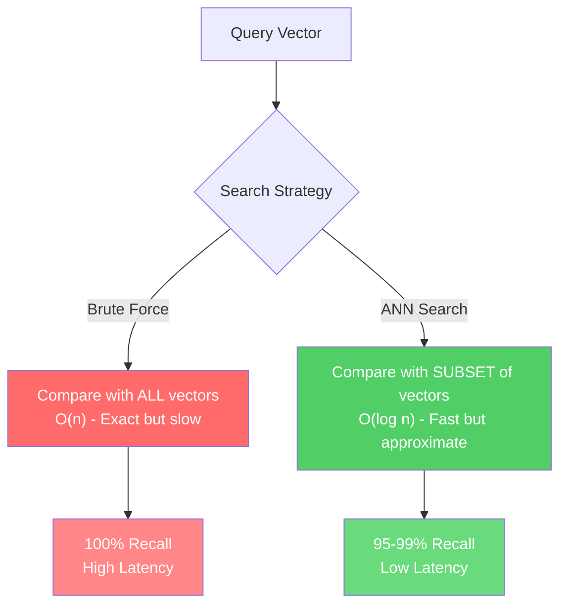
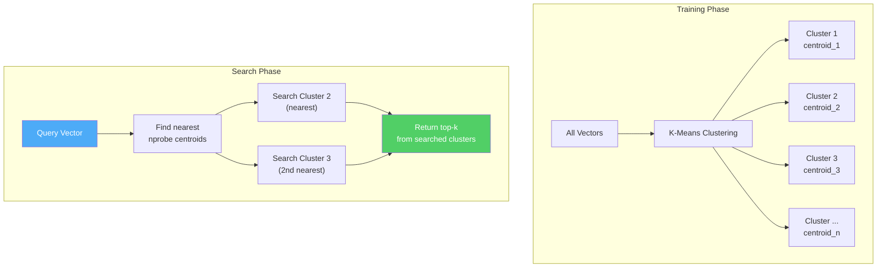
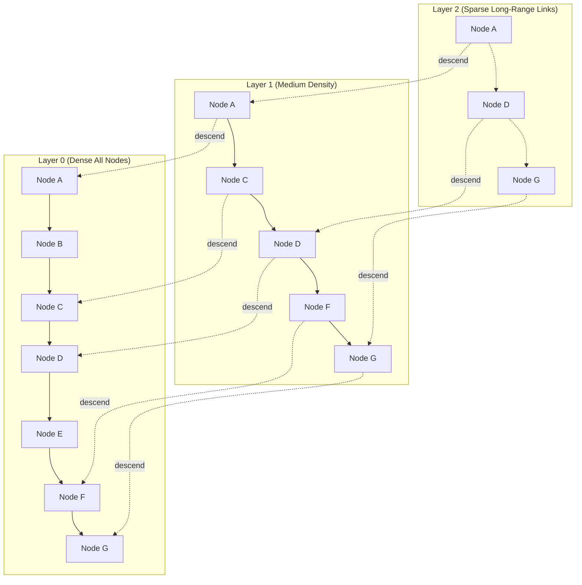
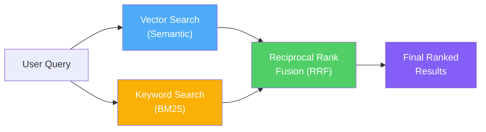
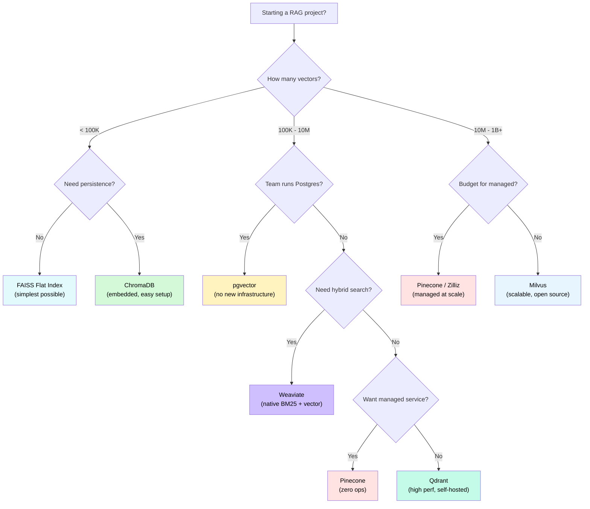

# RAG Deep Dive  Part 3: Vector Databases and Indexing  Where Your Knowledge Lives

---

**Series:** RAG (Retrieval-Augmented Generation)  A Developer's Deep Dive from Scratch to Production
**Part:** 3 of 9 (Infrastructure)
**Audience:** Developers with Python experience who want to master RAG systems from the ground up
**Reading time:** ~50 minutes

---

## Prerequisites from Previous Parts

Part 1 established why RAG exists: large language models hallucinate because their parametric knowledge is frozen at training time. RAG solves this by retrieving external knowledge at inference time and injecting it into the prompt. Part 2 went deep on **embeddings**  the mathematical foundation that makes retrieval possible. We learned how text gets transformed into dense vectors in high-dimensional space, how cosine similarity measures semantic closeness, and how models like `text-embedding-3-small` and `all-MiniLM-L6-v2` produce these vectors.

This part answers the question that naturally follows: **once you have millions of embedding vectors, where do you store them, and how do you search them fast enough for real-time applications?**

We will build indexing algorithms from scratch, benchmark them, and then explore every major vector database in the ecosystem  from FAISS to Pinecone to pgvector. By the end, you will understand not just *how* to use these tools, but *why* they work the way they do, and which one to choose for your specific use case.

---

## 1. Why Vector Databases?

### 1.1 The Problem with Traditional Databases

Suppose you have 10 million document chunks, each embedded into a 1536-dimensional vector (the output dimension of OpenAI's `text-embedding-3-small`). A user asks a question, you embed it into the same 1536-dimensional space, and now you need to find the 10 most similar vectors.

Could you use PostgreSQL? MySQL? MongoDB?

Technically, yes. You could store each vector as a JSON array or a binary blob, retrieve all 10 million vectors, compute cosine similarity in application code, sort, and return the top 10. Here is what that looks like:

```python
import numpy as np
import time

# Simulate 10 million vectors of dimension 1536
num_vectors = 10_000_000
dimension = 1536

# This alone requires ~57 GB of RAM (10M * 1536 * 4 bytes per float32)
# vectors = np.random.rand(num_vectors, dimension).astype('float32')

# Let's try with a smaller set: 1 million vectors
num_vectors = 1_000_000
vectors = np.random.rand(num_vectors, dimension).astype('float32')
query = np.random.rand(1, dimension).astype('float32')

# Brute force: compute cosine similarity against every vector
start = time.time()

# Normalize vectors for cosine similarity
norms = np.linalg.norm(vectors, axis=1, keepdims=True)
normalized = vectors / norms
query_norm = query / np.linalg.norm(query)

# Dot product of normalized vectors = cosine similarity
similarities = np.dot(normalized, query_norm.T).flatten()

# Get top 10
top_10_indices = np.argpartition(similarities, -10)[-10:]
top_10_indices = top_10_indices[np.argsort(similarities[top_10_indices])[::-1]]

elapsed = time.time() - start
print(f"Brute force search over {num_vectors:,} vectors: {elapsed:.3f} seconds")
print(f"Top 10 indices: {top_10_indices}")
print(f"Top 10 similarities: {similarities[top_10_indices]}")
```

**Output (approximate):**
```
Brute force search over 1,000,000 vectors: 2.847 seconds
Top 10 indices: [394821 772103 ...]
Top 10 similarities: [0.8234 0.8201 ...]
```

Nearly 3 seconds for 1 million vectors. For 10 million, you are looking at 30+ seconds. For a chatbot that needs to respond in under 2 seconds, this is a non-starter.

> **The core insight:** Traditional databases index data by exact values  B-trees for range queries, hash indexes for equality lookups. But similarity search has no exact match. You are asking "what is *close* to this?" in a 1536-dimensional space. This requires fundamentally different data structures.

### 1.2 What a Vector Database Actually Does

A **vector database** is a specialized storage system designed for three operations:

1. **Store** high-dimensional vectors alongside metadata
2. **Index** them using algorithms optimized for similarity search
3. **Query** them to find the K nearest neighbors in milliseconds, not seconds

The key innovation is the **index**  a data structure that organizes vectors so you do not need to compare against every single one. Instead of O(n) brute force, these indexes achieve O(log n) or even O(1) amortized lookup times, at the cost of occasionally missing the absolute nearest neighbor (hence **Approximate** Nearest Neighbor search).

### 1.3 ANN: The Tradeoff That Makes Everything Possible

**Approximate Nearest Neighbor (ANN)** search is the foundational concept. The insight is:

- **Exact** nearest neighbor search requires comparing against every vector: O(n) time
- **Approximate** nearest neighbor search pre-organizes vectors so you only compare against a small fraction, returning results that are *almost always* the true nearest neighbors

The tradeoff is **recall**  the fraction of true nearest neighbors that ANN actually finds. A well-tuned ANN index achieves 95-99% recall while searching only 1-5% of the dataset. That means:

| Approach | Vectors Compared | Time (1M vectors) | Recall |
|----------|-----------------|-------------------|--------|
| Brute force | 1,000,000 | ~3,000 ms | 100% |
| ANN (good config) | 10,000–50,000 | 1–10 ms | 95–99% |
| ANN (aggressive config) | 1,000–5,000 | 0.1–1 ms | 85–95% |

For RAG applications, 95-99% recall is almost always sufficient. The occasional document that gets missed at rank 8 instead of rank 7 does not meaningfully degrade the LLM's response quality.



---

## 2. How Vector Search Works  From First Principles

### 2.1 Distance Metrics Recap

Before diving into indexing algorithms, let us establish the distance metrics used in vector search. From Part 2:

**Cosine Similarity**  Measures the angle between two vectors. Ranges from -1 (opposite) to 1 (identical direction). Most common for text embeddings.

```python
import numpy as np

def cosine_similarity(a: np.ndarray, b: np.ndarray) -> float:
    return np.dot(a, b) / (np.linalg.norm(a) * np.linalg.norm(b))
```

**Euclidean Distance (L2)**  Straight-line distance between two points. Lower is more similar. Common for image embeddings.

```python
def euclidean_distance(a: np.ndarray, b: np.ndarray) -> float:
    return np.linalg.norm(a - b)
```

**Inner Product (Dot Product)**  When vectors are normalized, equivalent to cosine similarity. Slightly faster to compute since it skips the normalization step.

```python
def inner_product(a: np.ndarray, b: np.ndarray) -> float:
    return np.dot(a, b)
```

> **Practical tip:** If you plan to use inner product search, normalize your vectors at insert time. This converts inner product into cosine similarity and avoids subtle ranking bugs where vector magnitude affects results.

### 2.2 The Curse of Dimensionality

In low dimensions (2D, 3D), spatial indexing structures like KD-trees work beautifully. You can recursively partition space along axes and prune entire subtrees during search. But as dimensions increase, something breaks.

In 1536-dimensional space:
- Every point is approximately equidistant from every other point
- The ratio between the nearest and farthest neighbor approaches 1
- Spatial partitioning schemes run out of "structure" to exploit

This is the **curse of dimensionality**, and it is why KD-trees and R-trees  the workhorses of spatial databases  perform no better than brute force above ~20 dimensions. Every ANN algorithm we discuss below is specifically designed to handle high-dimensional data.

---

## 3. Indexing Algorithms Deep Dive

### 3.1 Flat Index (Brute Force Baseline)

The flat index stores all vectors in a contiguous array and compares every single one during search. It is the baseline against which all ANN algorithms are measured.

**Implementing a flat index from scratch:**

```python
import numpy as np
from typing import List, Tuple

class FlatIndex:
    """Brute force vector index  O(n) search, 100% recall."""

    def __init__(self, dimension: int):
        self.dimension = dimension
        self.vectors = []
        self.metadata = []
        self._matrix = None  # lazy-built numpy matrix

    def add(self, vector: np.ndarray, meta: dict = None):
        """Add a single vector with optional metadata."""
        assert vector.shape == (self.dimension,), \
            f"Expected dimension {self.dimension}, got {vector.shape}"
        self.vectors.append(vector)
        self.metadata.append(meta or {})
        self._matrix = None  # invalidate cache

    def add_batch(self, vectors: np.ndarray, metas: List[dict] = None):
        """Add multiple vectors at once."""
        assert vectors.shape[1] == self.dimension
        for i, vec in enumerate(vectors):
            self.vectors.append(vec)
            self.metadata.append(metas[i] if metas else {})
        self._matrix = None

    def _build_matrix(self):
        """Build numpy matrix from stored vectors for fast computation."""
        if self._matrix is None:
            self._matrix = np.array(self.vectors, dtype='float32')
            # Pre-normalize for cosine similarity
            norms = np.linalg.norm(self._matrix, axis=1, keepdims=True)
            norms[norms == 0] = 1  # avoid division by zero
            self._normalized = self._matrix / norms

    def search(self, query: np.ndarray, k: int = 10) -> List[Tuple[int, float, dict]]:
        """
        Find k nearest neighbors by cosine similarity.
        Returns: list of (index, similarity_score, metadata)
        """
        self._build_matrix()

        # Normalize query
        query_norm = query / np.linalg.norm(query)

        # Compute cosine similarity against all vectors
        similarities = np.dot(self._normalized, query_norm)

        # Get top-k indices
        if k >= len(similarities):
            top_k = np.argsort(similarities)[::-1]
        else:
            # np.argpartition is O(n) vs O(n log n) for full sort
            top_k = np.argpartition(similarities, -k)[-k:]
            top_k = top_k[np.argsort(similarities[top_k])[::-1]]

        results = []
        for idx in top_k:
            results.append((int(idx), float(similarities[idx]), self.metadata[idx]))
        return results

    def __len__(self):
        return len(self.vectors)


# Usage
index = FlatIndex(dimension=384)

# Add some vectors
np.random.seed(42)
for i in range(10000):
    vec = np.random.rand(384).astype('float32')
    index.add(vec, meta={"doc_id": i, "source": f"document_{i}.pdf"})

# Search
query = np.random.rand(384).astype('float32')
results = index.search(query, k=5)

for idx, score, meta in results:
    print(f"  Index: {idx}, Score: {score:.4f}, Source: {meta['source']}")
```

**When to use flat index:**
- Dataset has fewer than 50,000 vectors
- You need 100% recall (legal, medical, compliance applications)
- Building a prototype and do not want to tune ANN parameters
- As a reference to benchmark ANN accuracy

**When NOT to use flat index:**
- Dataset exceeds 100,000 vectors
- Latency requirements are under 100ms
- You need to handle concurrent queries

### 3.2 IVF (Inverted File Index)  Cluster-Based Search

The **Inverted File Index** is the first ANN technique most developers encounter. The idea is simple: cluster your vectors, and at search time, only scan vectors in the nearest clusters.

**How IVF works:**

1. **Training phase:** Run K-Means clustering on your vectors to produce `nlist` centroids
2. **Insert phase:** For each vector, assign it to its nearest centroid
3. **Search phase:** For a query, find the `nprobe` nearest centroids, then brute-force search only the vectors in those clusters



**Implementing IVF from scratch:**

```python
import numpy as np
from typing import List, Tuple, Dict
from collections import defaultdict

class IVFIndex:
    """
    Inverted File Index  cluster-based approximate nearest neighbor search.

    Parameters:
        dimension: vector dimensionality
        nlist: number of clusters (Voronoi cells)
        nprobe: number of clusters to search at query time (higher = better recall, slower)
    """

    def __init__(self, dimension: int, nlist: int = 100, nprobe: int = 10):
        self.dimension = dimension
        self.nlist = nlist
        self.nprobe = nprobe
        self.centroids = None  # shape: (nlist, dimension)
        self.inverted_lists: Dict[int, List[Tuple[int, np.ndarray]]] = defaultdict(list)
        self.is_trained = False
        self._next_id = 0

    def train(self, vectors: np.ndarray, n_iter: int = 20):
        """
        Train centroids using K-Means.
        vectors: shape (n, dimension)  training set
        """
        n = vectors.shape[0]
        assert vectors.shape[1] == self.dimension

        # Initialize centroids randomly (K-Means++)
        indices = np.random.choice(n, self.nlist, replace=False)
        self.centroids = vectors[indices].copy()

        for iteration in range(n_iter):
            # Assign each vector to nearest centroid
            # Compute distances: (n, nlist)
            distances = np.linalg.norm(
                vectors[:, np.newaxis, :] - self.centroids[np.newaxis, :, :],
                axis=2
            )
            assignments = np.argmin(distances, axis=1)

            # Update centroids
            new_centroids = np.zeros_like(self.centroids)
            counts = np.zeros(self.nlist)
            for i in range(n):
                cluster = assignments[i]
                new_centroids[cluster] += vectors[i]
                counts[cluster] += 1

            # Avoid division by zero for empty clusters
            for c in range(self.nlist):
                if counts[c] > 0:
                    new_centroids[c] /= counts[c]
                else:
                    # Reinitialize empty cluster with random vector
                    new_centroids[c] = vectors[np.random.randint(n)]

            self.centroids = new_centroids

        self.is_trained = True
        print(f"IVF trained: {self.nlist} clusters from {n} vectors")

    def add(self, vectors: np.ndarray):
        """Add vectors to the index. Must be trained first."""
        assert self.is_trained, "Must call train() before add()"
        assert vectors.shape[1] == self.dimension

        # Assign each vector to nearest centroid
        distances = np.linalg.norm(
            vectors[:, np.newaxis, :] - self.centroids[np.newaxis, :, :],
            axis=2
        )
        assignments = np.argmin(distances, axis=1)

        for i in range(vectors.shape[0]):
            cluster = int(assignments[i])
            self.inverted_lists[cluster].append((self._next_id, vectors[i]))
            self._next_id += 1

    def search(self, query: np.ndarray, k: int = 10) -> List[Tuple[int, float]]:
        """
        Search for k nearest neighbors.
        Returns: list of (vector_id, distance)
        """
        assert self.is_trained, "Must call train() before search()"

        # Step 1: Find nprobe nearest centroids
        centroid_distances = np.linalg.norm(self.centroids - query, axis=1)
        nearest_centroids = np.argsort(centroid_distances)[:self.nprobe]

        # Step 2: Brute-force search within selected clusters
        candidates = []
        for cluster_id in nearest_centroids:
            for vec_id, vec in self.inverted_lists[cluster_id]:
                # Cosine similarity
                sim = np.dot(query, vec) / (np.linalg.norm(query) * np.linalg.norm(vec))
                candidates.append((vec_id, sim))

        # Step 3: Return top-k
        candidates.sort(key=lambda x: x[1], reverse=True)
        return candidates[:k]


# Usage
dimension = 128
n_vectors = 100_000
nlist = 256  # number of clusters

# Generate random vectors
np.random.seed(42)
data = np.random.rand(n_vectors, dimension).astype('float32')
query = np.random.rand(dimension).astype('float32')

# Build index
ivf = IVFIndex(dimension=dimension, nlist=nlist, nprobe=16)
ivf.train(data[:10000])  # train on a subset
ivf.add(data)

# Search
import time
start = time.time()
results = ivf.search(query, k=5)
elapsed = time.time() - start

print(f"IVF search time: {elapsed*1000:.1f} ms")
for vec_id, score in results:
    print(f"  ID: {vec_id}, Similarity: {score:.4f}")
```

**Key parameters:**

| Parameter | Description | Typical Values | Effect |
|-----------|-------------|---------------|--------|
| `nlist` | Number of clusters | sqrt(n) to 4*sqrt(n) | More clusters = finer partitioning |
| `nprobe` | Clusters searched at query time | 1 to nlist/4 | Higher = better recall, slower |

> **Rule of thumb:** For 1 million vectors, use `nlist=1024` and `nprobe=32-64`. This searches ~3-6% of the dataset and typically achieves 95%+ recall.

### 3.3 HNSW (Hierarchical Navigable Small World)  The Algorithm That Changed Everything

**HNSW** is the most important indexing algorithm in the vector database ecosystem. It powers the default index in Qdrant, Weaviate, pgvector, and ChromaDB. It is the algorithm you will use most often.

#### 3.3.1 The Skip List Analogy

To understand HNSW, start with a **skip list**  the data structure used in Redis sorted sets.

A skip list is a linked list with multiple layers. The bottom layer contains all elements. Each higher layer contains a random subset of the elements below it. To search, you start at the top layer and "skip" across large sections of the list, then descend to finer-grained layers as you get closer to your target.

```
Layer 3:  [1] -----------------------------------------> [95]
Layer 2:  [1] ----------------> [42] -------------------> [95]
Layer 1:  [1] ------> [17] --> [42] ------> [68] -------> [95]
Layer 0:  [1]->[5]->[12]->[17]->[23]->[31]->[42]->[55]->[68]->[79]->[95]
```

HNSW applies this same principle to **graph-based nearest neighbor search**:

- **Bottom layer (Layer 0):** A graph connecting all vectors to their nearest neighbors
- **Higher layers:** Sparser graphs containing only a subset of vectors, connected by longer-range links
- **Search:** Start at the top layer, greedily navigate toward the query, then descend layer by layer, refining the search at each level



#### 3.3.2 Simplified HNSW Implementation

```python
import numpy as np
import heapq
from typing import List, Tuple, Dict, Set
import random
import math

class HNSWIndex:
    """
    Simplified Hierarchical Navigable Small World graph.

    Parameters:
        dimension: vector dimensionality
        M: max number of connections per node per layer (default: 16)
        ef_construction: size of dynamic candidate list during construction (default: 200)
        ef_search: size of dynamic candidate list during search (default: 50)
    """

    def __init__(self, dimension: int, M: int = 16, ef_construction: int = 200,
                 ef_search: int = 50):
        self.dimension = dimension
        self.M = M
        self.M_max0 = 2 * M  # max connections for layer 0
        self.ef_construction = ef_construction
        self.ef_search = ef_search
        self.ml = 1.0 / math.log(M)  # level generation factor

        # Storage
        self.vectors: Dict[int, np.ndarray] = {}
        self.graphs: Dict[int, Dict[int, Set[int]]] = {}  # layer -> {node -> set(neighbors)}
        self.node_levels: Dict[int, int] = {}  # node -> max layer
        self.max_level = -1
        self.entry_point = None
        self._next_id = 0

    def _distance(self, a: np.ndarray, b: np.ndarray) -> float:
        """L2 distance (lower = more similar)."""
        return float(np.linalg.norm(a - b))

    def _random_level(self) -> int:
        """Generate random level for a new node (geometric distribution)."""
        level = 0
        while random.random() < (1.0 / self.M) and level < 16:
            level += 1
        return level

    def _search_layer(self, query: np.ndarray, entry_point: int,
                      ef: int, layer: int) -> List[Tuple[float, int]]:
        """
        Search a single layer starting from entry_point.
        Returns ef nearest neighbors as (distance, node_id) sorted by distance.
        """
        visited = {entry_point}
        entry_dist = self._distance(query, self.vectors[entry_point])

        # candidates: min-heap (closest first)
        candidates = [(entry_dist, entry_point)]
        # results: max-heap (farthest first, for pruning)
        results = [(-entry_dist, entry_point)]

        while candidates:
            dist_c, c = heapq.heappop(candidates)

            # Farthest in results
            farthest_dist = -results[0][0]
            if dist_c > farthest_dist:
                break  # all remaining candidates are farther than our worst result

            # Explore neighbors of c in this layer
            neighbors = self.graphs.get(layer, {}).get(c, set())
            for neighbor in neighbors:
                if neighbor in visited:
                    continue
                visited.add(neighbor)

                dist_n = self._distance(query, self.vectors[neighbor])
                farthest_dist = -results[0][0]

                if dist_n < farthest_dist or len(results) < ef:
                    heapq.heappush(candidates, (dist_n, neighbor))
                    heapq.heappush(results, (-dist_n, neighbor))
                    if len(results) > ef:
                        heapq.heappop(results)

        # Convert results to (distance, node_id), sorted closest first
        return sorted([(-d, n) for d, n in results])

    def add(self, vector: np.ndarray) -> int:
        """Add a vector to the HNSW graph. Returns the assigned ID."""
        node_id = self._next_id
        self._next_id += 1
        self.vectors[node_id] = vector

        level = self._random_level()
        self.node_levels[node_id] = level

        # Initialize graph layers
        for l in range(level + 1):
            if l not in self.graphs:
                self.graphs[l] = {}
            self.graphs[l][node_id] = set()

        if self.entry_point is None:
            # First node
            self.entry_point = node_id
            self.max_level = level
            return node_id

        # Phase 1: Traverse from top layer down to level+1, finding entry point
        current_entry = self.entry_point
        for l in range(self.max_level, level, -1):
            results = self._search_layer(vector, current_entry, ef=1, layer=l)
            if results:
                current_entry = results[0][1]

        # Phase 2: From level down to 0, insert and connect
        for l in range(min(level, self.max_level), -1, -1):
            results = self._search_layer(
                vector, current_entry, ef=self.ef_construction, layer=l
            )

            # Select M best neighbors
            M_limit = self.M_max0 if l == 0 else self.M
            neighbors = [node for _, node in results[:M_limit]]

            # Bidirectional connections
            if l not in self.graphs:
                self.graphs[l] = {}
            if node_id not in self.graphs[l]:
                self.graphs[l][node_id] = set()

            for neighbor in neighbors:
                self.graphs[l][node_id].add(neighbor)
                if neighbor not in self.graphs[l]:
                    self.graphs[l][neighbor] = set()
                self.graphs[l][neighbor].add(node_id)

                # Prune neighbor's connections if over limit
                if len(self.graphs[l][neighbor]) > M_limit:
                    # Keep only the M closest
                    neighbor_vec = self.vectors[neighbor]
                    scored = [
                        (self._distance(neighbor_vec, self.vectors[n]), n)
                        for n in self.graphs[l][neighbor]
                    ]
                    scored.sort()
                    self.graphs[l][neighbor] = set(n for _, n in scored[:M_limit])

            if results:
                current_entry = results[0][1]

        # Update entry point if new node has higher level
        if level > self.max_level:
            self.max_level = level
            self.entry_point = node_id

        return node_id

    def search(self, query: np.ndarray, k: int = 10) -> List[Tuple[int, float]]:
        """
        Search for k nearest neighbors.
        Returns: list of (node_id, distance), sorted by distance ascending.
        """
        if self.entry_point is None:
            return []

        # Traverse from top to layer 1
        current_entry = self.entry_point
        for l in range(self.max_level, 0, -1):
            results = self._search_layer(query, current_entry, ef=1, layer=l)
            if results:
                current_entry = results[0][1]

        # Search layer 0 with ef_search
        results = self._search_layer(query, current_entry, ef=self.ef_search, layer=0)

        return [(node_id, dist) for dist, node_id in results[:k]]


# Usage
dimension = 64  # smaller dimension for demo
hnsw = HNSWIndex(dimension=dimension, M=16, ef_construction=100, ef_search=50)

# Build index
np.random.seed(42)
n_vectors = 5000

print("Building HNSW index...")
import time
start = time.time()
for i in range(n_vectors):
    vec = np.random.rand(dimension).astype('float32')
    hnsw.add(vec)
build_time = time.time() - start
print(f"Built in {build_time:.2f}s ({n_vectors/build_time:.0f} vectors/sec)")

# Search
query = np.random.rand(dimension).astype('float32')
start = time.time()
results = hnsw.search(query, k=5)
search_time = time.time() - start

print(f"\nSearch time: {search_time*1000:.2f} ms")
for node_id, dist in results:
    print(f"  Node {node_id}: distance = {dist:.4f}")
```

#### 3.3.3 Why HNSW Dominates

| Property | Value |
|----------|-------|
| Search complexity | O(log n) |
| Build complexity | O(n log n) |
| Memory overhead | ~1.5x the raw vector data |
| Recall at reasonable speed | 95-99% |
| Supports incremental inserts | Yes |
| Supports deletes | With tombstones (slow) |

HNSW's dominance comes from its **balance of properties**: fast search, high recall, incremental inserts, no training phase. Unlike IVF, you do not need to train on your data first. Unlike tree-based methods, it scales gracefully to high dimensions.

> **Key insight:** HNSW is the default choice for most RAG applications. Unless you have a specific reason to use something else (extreme scale, memory constraints, or the need for exact results), start with HNSW.

### 3.4 Product Quantization (PQ)  Compression for Memory Efficiency

When your dataset has hundreds of millions of vectors, even storing them in RAM becomes a challenge. A single float32 vector of dimension 1536 uses 6,144 bytes. One billion vectors = ~5.7 TB of RAM.

**Product Quantization** compresses vectors by splitting them into subvectors and quantizing each subvector independently.

**How PQ works:**

1. Split each D-dimensional vector into `m` sub-vectors of dimension `D/m`
2. For each sub-vector position, run K-Means to create a codebook of 256 centroids (1 byte per code)
3. Replace each sub-vector with the index of its nearest centroid
4. A 1536-dimensional vector compressed with m=192 becomes 192 bytes instead of 6144 bytes  a **32x** compression ratio

```python
import numpy as np
from typing import List, Tuple

class ProductQuantizer:
    """
    Product Quantization for vector compression.

    Parameters:
        dimension: original vector dimension
        m: number of sub-quantizers (must divide dimension evenly)
        k_sub: number of centroids per sub-quantizer (typically 256)
    """

    def __init__(self, dimension: int, m: int = 8, k_sub: int = 256):
        assert dimension % m == 0, f"dimension {dimension} must be divisible by m {m}"
        self.dimension = dimension
        self.m = m
        self.k_sub = k_sub
        self.ds = dimension // m  # sub-vector dimension
        self.codebooks = None  # shape: (m, k_sub, ds)
        self.is_trained = False

    def train(self, vectors: np.ndarray, n_iter: int = 20):
        """Train codebooks using K-Means on each sub-vector space."""
        n = vectors.shape[0]
        self.codebooks = np.zeros((self.m, self.k_sub, self.ds), dtype='float32')

        for i in range(self.m):
            # Extract sub-vectors for this segment
            sub_vectors = vectors[:, i * self.ds : (i + 1) * self.ds]

            # Simple K-Means
            indices = np.random.choice(n, self.k_sub, replace=False)
            centroids = sub_vectors[indices].copy()

            for _ in range(n_iter):
                # Assign
                dists = np.linalg.norm(
                    sub_vectors[:, np.newaxis, :] - centroids[np.newaxis, :, :],
                    axis=2
                )
                assignments = np.argmin(dists, axis=1)

                # Update
                for c in range(self.k_sub):
                    mask = assignments == c
                    if mask.sum() > 0:
                        centroids[c] = sub_vectors[mask].mean(axis=0)

            self.codebooks[i] = centroids

        self.is_trained = True
        print(f"PQ trained: {self.m} sub-quantizers x {self.k_sub} centroids")

    def encode(self, vectors: np.ndarray) -> np.ndarray:
        """Encode vectors to PQ codes. Returns uint8 array of shape (n, m)."""
        assert self.is_trained
        n = vectors.shape[0]
        codes = np.zeros((n, self.m), dtype='uint8')

        for i in range(self.m):
            sub_vectors = vectors[:, i * self.ds : (i + 1) * self.ds]
            dists = np.linalg.norm(
                sub_vectors[:, np.newaxis, :] - self.codebooks[i][np.newaxis, :, :],
                axis=2
            )
            codes[:, i] = np.argmin(dists, axis=1)

        return codes

    def decode(self, codes: np.ndarray) -> np.ndarray:
        """Decode PQ codes back to approximate vectors."""
        n = codes.shape[0]
        vectors = np.zeros((n, self.dimension), dtype='float32')

        for i in range(self.m):
            vectors[:, i * self.ds : (i + 1) * self.ds] = self.codebooks[i][codes[:, i]]

        return vectors

    def search_with_codes(self, query: np.ndarray, codes: np.ndarray,
                          k: int = 10) -> List[Tuple[int, float]]:
        """
        Asymmetric Distance Computation (ADC):
        Compare exact query against quantized database vectors.
        """
        # Precompute distance table: for each sub-quantizer, distance from
        # query sub-vector to each centroid
        dist_table = np.zeros((self.m, self.k_sub), dtype='float32')
        for i in range(self.m):
            query_sub = query[i * self.ds : (i + 1) * self.ds]
            dist_table[i] = np.linalg.norm(
                self.codebooks[i] - query_sub, axis=1
            ) ** 2  # squared L2

        # Compute distances using lookup table (very fast!)
        n = codes.shape[0]
        distances = np.zeros(n, dtype='float32')
        for i in range(self.m):
            distances += dist_table[i, codes[:, i]]
        distances = np.sqrt(distances)

        # Top-k
        top_k = np.argpartition(distances, k)[:k]
        top_k = top_k[np.argsort(distances[top_k])]

        return [(int(idx), float(distances[idx])) for idx in top_k]


# Usage demo
dimension = 128
n_vectors = 50000

np.random.seed(42)
data = np.random.rand(n_vectors, dimension).astype('float32')
query = np.random.rand(dimension).astype('float32')

# Train PQ
pq = ProductQuantizer(dimension=dimension, m=16, k_sub=256)
pq.train(data[:10000])

# Encode all vectors
codes = pq.encode(data)

print(f"Original size: {data.nbytes / 1024 / 1024:.1f} MB")
print(f"Compressed size: {codes.nbytes / 1024 / 1024:.1f} MB")
print(f"Compression ratio: {data.nbytes / codes.nbytes:.1f}x")

# Search
results = pq.search_with_codes(query, codes, k=5)
for idx, dist in results:
    print(f"  ID: {idx}, Distance: {dist:.4f}")
```

**Output:**
```
Original size: 24.4 MB
Compressed size: 0.8 MB
Compression ratio: 32.0x
```

### 3.5 ScaNN (Scalable Nearest Neighbors)  Google's Approach

**ScaNN** (released by Google Research) introduces **anisotropic vector quantization**  a quantization technique that accounts for the direction of error, not just its magnitude. Standard PQ minimizes the average reconstruction error, but ScaNN minimizes the error specifically in the direction that affects ranking.

The key insight: when you quantize a vector, the direction of the quantization error matters. Errors along the direction of the query vector change the inner product (and thus the ranking) more than errors perpendicular to it. ScaNN exploits this by weighting the quantization to minimize ranking errors.

ScaNN is available as a Python library:

```python
# pip install scann

import numpy as np

# Note: scann requires Linux. Install with: pip install scann
# import scann

# Example usage (conceptual  requires Linux):
"""
import scann

dimension = 768
num_vectors = 1_000_000
data = np.random.rand(num_vectors, dimension).astype('float32')

# Build ScaNN index
searcher = scann.scann_ops_pybind.builder(data, 10, "dot_product") \
    .tree(num_leaves=2000, num_leaves_to_search=100, training_sample_size=250000) \
    .score_ah(2, anisotropic_quantization_threshold=0.2) \
    .reorder(100) \
    .build()

# Search
query = np.random.rand(dimension).astype('float32')
neighbors, distances = searcher.search(query, final_num_neighbors=10)
print(f"Neighbors: {neighbors}")
print(f"Distances: {distances}")
"""
```

### 3.6 Algorithm Comparison Table

| Algorithm | Search Speed | Build Speed | Memory | Recall | Incremental Insert | Best For |
|-----------|-------------|-------------|--------|--------|-------------------|----------|
| **Flat** | O(n) - Slow | O(n) - Fast | 1x (raw vectors) | 100% | Yes | Small datasets, baselines |
| **IVF** | O(n/nlist * nprobe) | O(n) + training | 1x + centroids | 90-99% | Re-training needed | Medium datasets, known data distribution |
| **HNSW** | O(log n) | O(n log n) | ~1.5x | 95-99% | Yes | Most RAG applications |
| **PQ** | O(n) with table lookups | O(n) + training | 0.03-0.1x | 70-90% | Re-training needed | Memory-constrained environments |
| **IVF+PQ** | Fast | O(n) + training | 0.03-0.1x + centroids | 80-95% | Re-training needed | Large-scale (100M+ vectors) |
| **HNSW+PQ** | O(log n) | O(n log n) + training | ~0.1-0.5x | 85-95% | Partially | Large-scale with speed needs |
| **ScaNN** | Very fast | Moderate | ~0.1-0.5x | 95-99% | No | Google-scale datasets |

---

## 4. FAISS Deep Dive  Facebook AI Similarity Search

**FAISS** (Facebook AI Similarity Search) is the most widely-used low-level vector search library. It is not a database  it is a library of indexing algorithms that you embed into your application. Every major vector database either uses FAISS internally or implements the same algorithms.

### 4.1 Installation and Setup

```bash
# CPU version
pip install faiss-cpu

# GPU version (requires CUDA)
pip install faiss-gpu
```

### 4.2 Index Types

FAISS offers a string-based index factory that lets you compose index types:

```python
import faiss
import numpy as np
import time

dimension = 768
n_vectors = 500_000
n_queries = 100
k = 10

# Generate data
np.random.seed(42)
data = np.random.rand(n_vectors, dimension).astype('float32')
queries = np.random.rand(n_queries, dimension).astype('float32')

# ─── 1. Flat Index (Brute Force) ───
print("=" * 60)
print("1. IndexFlatL2 (Brute Force)")
index_flat = faiss.IndexFlatL2(dimension)
index_flat.add(data)
print(f"   Vectors in index: {index_flat.ntotal}")

start = time.time()
distances, indices = index_flat.search(queries, k)
flat_time = time.time() - start
print(f"   Search time ({n_queries} queries): {flat_time*1000:.1f} ms")
print(f"   Per query: {flat_time/n_queries*1000:.2f} ms")

# ─── 2. IndexFlatIP (Inner Product  use with normalized vectors) ───
print("\n" + "=" * 60)
print("2. IndexFlatIP (Inner Product / Cosine Similarity)")
# Normalize vectors for cosine similarity
faiss.normalize_L2(data)
faiss.normalize_L2(queries)

index_ip = faiss.IndexFlatIP(dimension)
index_ip.add(data)

start = time.time()
similarities, indices_ip = index_ip.search(queries, k)
ip_time = time.time() - start
print(f"   Search time: {ip_time*1000:.1f} ms")
print(f"   Top similarity for query 0: {similarities[0][0]:.4f}")

# ─── 3. IVF Index ───
print("\n" + "=" * 60)
print("3. IndexIVFFlat (IVF with flat quantizer)")
nlist = 1024  # number of clusters
quantizer = faiss.IndexFlatL2(dimension)
index_ivf = faiss.IndexIVFFlat(quantizer, dimension, nlist)

# IVF requires training
print("   Training...")
index_ivf.train(data)
index_ivf.add(data)
print(f"   Vectors in index: {index_ivf.ntotal}")

# Search with different nprobe values
for nprobe in [1, 8, 32, 128]:
    index_ivf.nprobe = nprobe
    start = time.time()
    distances_ivf, indices_ivf = index_ivf.search(queries, k)
    ivf_time = time.time() - start

    # Calculate recall vs flat index
    recall = np.mean([
        len(set(indices_ivf[i]) & set(indices[i])) / k
        for i in range(n_queries)
    ])
    print(f"   nprobe={nprobe:3d}: {ivf_time*1000:7.1f} ms, recall={recall:.3f}")

# ─── 4. HNSW Index ───
print("\n" + "=" * 60)
print("4. IndexHNSWFlat (HNSW)")
M = 32  # connections per node
index_hnsw = faiss.IndexHNSWFlat(dimension, M)
index_hnsw.hnsw.efConstruction = 200  # higher = better quality, slower build

print("   Building (this takes a while for 500K vectors)...")
start = time.time()
index_hnsw.add(data)
build_time = time.time() - start
print(f"   Build time: {build_time:.1f}s")

for ef_search in [16, 32, 64, 128]:
    index_hnsw.hnsw.efSearch = ef_search
    start = time.time()
    distances_hnsw, indices_hnsw = index_hnsw.search(queries, k)
    hnsw_time = time.time() - start

    recall = np.mean([
        len(set(indices_hnsw[i]) & set(indices[i])) / k
        for i in range(n_queries)
    ])
    print(f"   efSearch={ef_search:3d}: {hnsw_time*1000:7.1f} ms, recall={recall:.3f}")

# ─── 5. IVF + PQ (Compressed) ───
print("\n" + "=" * 60)
print("5. IndexIVFPQ (IVF + Product Quantization)")
nlist = 1024
m = 48  # number of sub-quantizers (must divide dimension)
nbits = 8  # bits per code (8 = 256 centroids per sub-quantizer)

index_ivfpq = faiss.IndexIVFPQ(quantizer, dimension, nlist, m, nbits)
print("   Training...")
index_ivfpq.train(data)
index_ivfpq.add(data)

# Memory comparison
flat_bytes = n_vectors * dimension * 4  # float32
pq_bytes = n_vectors * m * (nbits // 8)
print(f"   Flat memory:  {flat_bytes / 1024 / 1024:.1f} MB")
print(f"   IVFPQ memory: {pq_bytes / 1024 / 1024:.1f} MB")
print(f"   Compression:  {flat_bytes / pq_bytes:.1f}x")

index_ivfpq.nprobe = 32
start = time.time()
distances_pq, indices_pq = index_ivfpq.search(queries, k)
pq_time = time.time() - start

recall = np.mean([
    len(set(indices_pq[i]) & set(indices[i])) / k
    for i in range(n_queries)
])
print(f"   nprobe=32: {pq_time*1000:.1f} ms, recall={recall:.3f}")

# ─── 6. Index Factory (composable string syntax) ───
print("\n" + "=" * 60)
print("6. Index Factory Examples")
index_factories = {
    "Flat": "Flat",
    "IVF1024,Flat": "IVF1024,Flat",
    "IVF1024,PQ48": "IVF1024,PQ48",
    "HNSW32": "HNSW32",
    "IVF1024,HNSW32": "IVF1024,SQ8",  # IVF with scalar quantization
}

for name, factory_str in index_factories.items():
    try:
        idx = faiss.index_factory(dimension, factory_str)
        if not idx.is_trained:
            idx.train(data[:50000])  # train on subset for speed
        idx.add(data[:10000])  # add subset for demo
        print(f"   {name:20s} -> ntotal={idx.ntotal}, factory='{factory_str}'")
    except Exception as e:
        print(f"   {name:20s} -> Error: {e}")
```

### 4.3 Saving and Loading Indexes

```python
import faiss
import numpy as np

dimension = 768
data = np.random.rand(100_000, dimension).astype('float32')

# Build index
index = faiss.IndexHNSWFlat(dimension, 32)
index.add(data)

# Save to disk
faiss.write_index(index, "my_index.faiss")
print(f"Saved index with {index.ntotal} vectors")

# Load from disk
loaded_index = faiss.read_index("my_index.faiss")
print(f"Loaded index with {loaded_index.ntotal} vectors")

# Verify search results match
query = np.random.rand(1, dimension).astype('float32')
d1, i1 = index.search(query, 5)
d2, i2 = loaded_index.search(query, 5)
print(f"Results match: {np.array_equal(i1, i2)}")
```

### 4.4 FAISS with ID Mapping

By default, FAISS uses sequential integer IDs. To map to your own IDs:

```python
import faiss
import numpy as np

dimension = 768
n = 10000
data = np.random.rand(n, dimension).astype('float32')

# Custom IDs (e.g., document IDs from your database)
custom_ids = np.arange(1000, 1000 + n).astype('int64')

# Wrap any index with IndexIDMap
base_index = faiss.IndexFlatL2(dimension)
index = faiss.IndexIDMap(base_index)

# Add with custom IDs
index.add_with_ids(data, custom_ids)

# Search returns your custom IDs
query = np.random.rand(1, dimension).astype('float32')
distances, indices = index.search(query, 5)
print(f"Returned IDs: {indices[0]}")  # e.g., [4521, 7832, 1234, ...]
```

> **When to use FAISS:** When you need maximum control over indexing algorithms, are building a custom vector search pipeline, or need GPU-accelerated search. FAISS is a library, not a database  you manage persistence, metadata, and concurrency yourself.

---

## 5. ChromaDB  The Developer-Friendly Option

**ChromaDB** is the easiest vector database to get started with. It runs embedded (in-process) by default, requires zero infrastructure, and handles embedding generation automatically if you want.

### 5.1 Installation and Setup

```bash
pip install chromadb
```

### 5.2 Full Working Example

```python
import chromadb
from chromadb.config import Settings

# ─── 1. Client Setup ───

# Ephemeral (in-memory, data lost on restart)
client = chromadb.Client()

# Persistent (saves to disk)
client = chromadb.PersistentClient(path="./chroma_data")

# Client-server mode (for production)
# Start server: chroma run --path ./chroma_data --port 8000
# client = chromadb.HttpClient(host="localhost", port=8000)

# ─── 2. Create a Collection ───
collection = client.get_or_create_collection(
    name="technical_docs",
    metadata={
        "hnsw:space": "cosine",        # distance metric: cosine, l2, or ip
        "hnsw:M": 32,                   # HNSW connections per node
        "hnsw:construction_ef": 200,    # HNSW construction parameter
        "hnsw:search_ef": 100,          # HNSW search parameter
    }
)

# ─── 3. Add Documents ───
# ChromaDB can auto-generate embeddings using a default model (all-MiniLM-L6-v2)
collection.add(
    ids=["doc_1", "doc_2", "doc_3", "doc_4", "doc_5"],
    documents=[
        "Vector databases store high-dimensional embeddings for similarity search.",
        "HNSW is a graph-based algorithm for approximate nearest neighbor search.",
        "PostgreSQL is a relational database that supports ACID transactions.",
        "Kubernetes orchestrates containerized applications across clusters.",
        "RAG systems retrieve relevant documents to augment LLM responses.",
    ],
    metadatas=[
        {"source": "vector_db_guide.pdf", "chapter": 1, "category": "databases"},
        {"source": "ann_algorithms.pdf", "chapter": 3, "category": "algorithms"},
        {"source": "postgres_manual.pdf", "chapter": 1, "category": "databases"},
        {"source": "k8s_docs.pdf", "chapter": 1, "category": "infrastructure"},
        {"source": "rag_tutorial.pdf", "chapter": 2, "category": "ai"},
    ]
)

print(f"Collection has {collection.count()} documents")

# ─── 4. Query (Semantic Search) ───
results = collection.query(
    query_texts=["How do vector search algorithms work?"],
    n_results=3,
    include=["documents", "metadatas", "distances"]
)

print("\nQuery: 'How do vector search algorithms work?'")
for i, (doc, meta, dist) in enumerate(zip(
    results['documents'][0],
    results['metadatas'][0],
    results['distances'][0]
)):
    print(f"  {i+1}. [{dist:.4f}] {doc}")
    print(f"     Source: {meta['source']}, Category: {meta['category']}")

# ─── 5. Query with Metadata Filtering ───
results_filtered = collection.query(
    query_texts=["database technology"],
    n_results=3,
    where={"category": "databases"},  # only search within databases category
    include=["documents", "metadatas", "distances"]
)

print("\nQuery: 'database technology' (filtered: category=databases)")
for i, (doc, meta, dist) in enumerate(zip(
    results_filtered['documents'][0],
    results_filtered['metadatas'][0],
    results_filtered['distances'][0]
)):
    print(f"  {i+1}. [{dist:.4f}] {doc}")

# ─── 6. Advanced Filtering ───
# $and, $or, $gt, $lt, $gte, $lte, $ne, $in, $nin
results_advanced = collection.query(
    query_texts=["search technology"],
    n_results=5,
    where={
        "$or": [
            {"category": "databases"},
            {"category": "algorithms"}
        ]
    },
    include=["documents", "distances"]
)

# ─── 7. Update Documents ───
collection.update(
    ids=["doc_3"],
    documents=["PostgreSQL with pgvector extension enables vector similarity search."],
    metadatas=[{"source": "postgres_manual.pdf", "chapter": 1, "category": "databases",
                "updated": True}]
)

# ─── 8. Delete Documents ───
collection.delete(ids=["doc_4"])
print(f"\nAfter delete: {collection.count()} documents")

# ─── 9. Using Custom Embeddings ───
# If you want to use your own embedding model:
import numpy as np

custom_embeddings = np.random.rand(3, 384).tolist()  # 384-dim embeddings

collection_custom = client.get_or_create_collection(name="custom_embeddings")
collection_custom.add(
    ids=["custom_1", "custom_2", "custom_3"],
    embeddings=custom_embeddings,
    documents=["Doc A", "Doc B", "Doc C"],
    metadatas=[{"type": "a"}, {"type": "b"}, {"type": "c"}]
)

# Query with custom embedding
query_embedding = np.random.rand(384).tolist()
results = collection_custom.query(
    query_embeddings=[query_embedding],
    n_results=2
)
print(f"\nCustom embedding query results: {results['ids']}")

# ─── 10. List and Delete Collections ───
print(f"\nCollections: {[c.name for c in client.list_collections()]}")
# client.delete_collection("technical_docs")
```

### 5.3 ChromaDB with OpenAI Embeddings

```python
import chromadb
from chromadb.utils.embedding_functions import OpenAIEmbeddingFunction

# Use OpenAI embeddings instead of the default model
openai_ef = OpenAIEmbeddingFunction(
    api_key="sk-your-api-key-here",
    model_name="text-embedding-3-small"
)

client = chromadb.PersistentClient(path="./chroma_openai")
collection = client.get_or_create_collection(
    name="docs_openai",
    embedding_function=openai_ef  # 1536-dimensional embeddings
)

# Now .add() and .query() use OpenAI embeddings automatically
collection.add(
    ids=["1", "2", "3"],
    documents=[
        "The transformer architecture uses self-attention mechanisms.",
        "Convolutional neural networks are effective for image recognition.",
        "Recurrent neural networks process sequential data.",
    ]
)

results = collection.query(
    query_texts=["How does attention work in neural networks?"],
    n_results=2
)
```

> **When to use ChromaDB:** Prototyping, local development, small-to-medium datasets (under 10 million vectors), or when you want the simplest possible setup. ChromaDB is excellent for getting a RAG prototype working in minutes.

---

## 6. Pinecone  Managed Vector Database

**Pinecone** is a fully managed vector database  you do not run any infrastructure. It handles scaling, replication, and index optimization automatically.

### 6.1 Setup and Configuration

```bash
pip install pinecone-client
```

### 6.2 Full Working Example

```python
from pinecone import Pinecone, ServerlessSpec
import numpy as np
import time

# ─── 1. Initialize Client ───
pc = Pinecone(api_key="your-api-key-here")

# ─── 2. Create Index ───
index_name = "rag-documents"

# Check if index exists
if index_name not in pc.list_indexes().names():
    pc.create_index(
        name=index_name,
        dimension=1536,           # Match your embedding model's output dimension
        metric="cosine",          # cosine, euclidean, or dotproduct
        spec=ServerlessSpec(
            cloud="aws",
            region="us-east-1"
        )
    )
    # Wait for index to be ready
    while not pc.describe_index(index_name).status['ready']:
        time.sleep(1)

index = pc.Index(index_name)
print(f"Index stats: {index.describe_index_stats()}")

# ─── 3. Upsert Vectors ───
# Pinecone expects (id, vector, metadata) tuples
vectors_to_upsert = [
    (
        "doc_001",
        np.random.rand(1536).tolist(),
        {
            "text": "Vector databases enable fast similarity search over embeddings.",
            "source": "guide.pdf",
            "page": 42,
            "category": "technology"
        }
    ),
    (
        "doc_002",
        np.random.rand(1536).tolist(),
        {
            "text": "HNSW is the most popular ANN algorithm for vector search.",
            "source": "algorithms.pdf",
            "page": 15,
            "category": "algorithms"
        }
    ),
    (
        "doc_003",
        np.random.rand(1536).tolist(),
        {
            "text": "RAG combines retrieval with generation for accurate AI responses.",
            "source": "rag_paper.pdf",
            "page": 1,
            "category": "ai"
        }
    ),
]

# Upsert (insert or update)
index.upsert(vectors=vectors_to_upsert)

# Batch upsert for large datasets
def batch_upsert(index, vectors, batch_size=100):
    """Upsert vectors in batches to avoid API limits."""
    for i in range(0, len(vectors), batch_size):
        batch = vectors[i:i + batch_size]
        index.upsert(vectors=batch)
    print(f"Upserted {len(vectors)} vectors in {len(vectors) // batch_size + 1} batches")

# ─── 4. Query ───
query_vector = np.random.rand(1536).tolist()

results = index.query(
    vector=query_vector,
    top_k=3,
    include_metadata=True,
    include_values=False  # don't return the actual vectors (saves bandwidth)
)

print("\nQuery Results:")
for match in results['matches']:
    print(f"  ID: {match['id']}, Score: {match['score']:.4f}")
    print(f"  Text: {match['metadata']['text']}")
    print()

# ─── 5. Query with Metadata Filtering ───
results_filtered = index.query(
    vector=query_vector,
    top_k=3,
    include_metadata=True,
    filter={
        "category": {"$eq": "technology"},
        "page": {"$lte": 50}
    }
)

print("Filtered Results (category=technology, page<=50):")
for match in results_filtered['matches']:
    print(f"  ID: {match['id']}, Score: {match['score']:.4f}")

# ─── 6. Namespaces (Logical Partitioning) ───
# Namespaces let you partition data within the same index
index.upsert(
    vectors=[("ns_doc_1", np.random.rand(1536).tolist(), {"text": "In namespace A"})],
    namespace="project_alpha"
)

index.upsert(
    vectors=[("ns_doc_2", np.random.rand(1536).tolist(), {"text": "In namespace B"})],
    namespace="project_beta"
)

# Query within a specific namespace
results_ns = index.query(
    vector=np.random.rand(1536).tolist(),
    top_k=5,
    namespace="project_alpha",  # only searches project_alpha
    include_metadata=True
)

# ─── 7. Fetch by ID ───
fetched = index.fetch(ids=["doc_001", "doc_002"])
print(f"\nFetched {len(fetched['vectors'])} vectors by ID")

# ─── 8. Delete ───
# Delete by ID
index.delete(ids=["doc_003"])

# Delete by metadata filter
index.delete(filter={"category": {"$eq": "deprecated"}})

# Delete entire namespace
index.delete(delete_all=True, namespace="project_beta")

# ─── 9. Index Stats ───
stats = index.describe_index_stats()
print(f"\nIndex Stats:")
print(f"  Total vectors: {stats['total_vector_count']}")
print(f"  Dimension: {stats['dimension']}")
print(f"  Namespaces: {stats['namespaces']}")
```

> **When to use Pinecone:** When you want zero infrastructure management, need built-in high availability, or are building a production RAG system and want to focus on application logic rather than database operations. Pinecone is excellent for teams without dedicated infrastructure engineers.

---

## 7. Weaviate  Schema-Based Vector Search

**Weaviate** is an open-source vector database with a unique schema-based approach. It supports hybrid search (vector + keyword) natively and integrates directly with LLM providers.

### 7.1 Setup

```bash
pip install weaviate-client

# Run Weaviate locally with Docker
# docker run -d -p 8080:8080 -p 50051:50051 \
#   cr.weaviate.io/semitechnologies/weaviate:latest
```

### 7.2 Full Working Example

```python
import weaviate
import weaviate.classes as wvc
from weaviate.classes.config import Property, DataType, Configure
from weaviate.classes.query import MetadataQuery, Filter
import numpy as np

# ─── 1. Connect ───
# Local instance
client = weaviate.connect_to_local()  # localhost:8080

# Or Weaviate Cloud
# client = weaviate.connect_to_weaviate_cloud(
#     cluster_url="https://your-cluster.weaviate.network",
#     auth_credentials=wvc.init.Auth.api_key("your-api-key")
# )

try:
    # ─── 2. Create Collection (Schema) ───
    # Weaviate uses a typed schema  each property has a data type

    # Delete if exists
    if client.collections.exists("Document"):
        client.collections.delete("Document")

    documents = client.collections.create(
        name="Document",
        description="Technical documentation chunks for RAG",

        # Vector index configuration
        vectorizer_config=Configure.Vectorizer.none(),  # we provide our own vectors
        vector_index_config=Configure.VectorIndex.hnsw(
            distance_metric=wvc.config.VectorDistances.COSINE,
            ef_construction=200,
            max_connections=32,      # M parameter
            ef=100,                  # search ef
        ),

        # Properties (schema)
        properties=[
            Property(name="text", data_type=DataType.TEXT,
                     description="The document chunk text"),
            Property(name="source", data_type=DataType.TEXT,
                     description="Source file name"),
            Property(name="page", data_type=DataType.INT,
                     description="Page number"),
            Property(name="category", data_type=DataType.TEXT,
                     description="Document category"),
            Property(name="created_at", data_type=DataType.DATE,
                     description="Ingestion timestamp"),
        ],

        # Enable inverted index for keyword search (hybrid)
        inverted_index_config=Configure.inverted_index(
            bm25_b=0.75,
            bm25_k1=1.2,
        ),
    )

    # ─── 3. Insert Data ───
    dimension = 384

    docs_data = [
        {
            "text": "Vector databases store embeddings and enable fast similarity search using algorithms like HNSW.",
            "source": "vector_guide.pdf",
            "page": 12,
            "category": "databases",
        },
        {
            "text": "HNSW builds a hierarchical graph structure where higher layers contain long-range connections.",
            "source": "ann_algorithms.pdf",
            "page": 45,
            "category": "algorithms",
        },
        {
            "text": "PostgreSQL is the world's most advanced open source relational database.",
            "source": "postgres_docs.pdf",
            "page": 1,
            "category": "databases",
        },
        {
            "text": "RAG retrieves relevant context from a knowledge base before generating a response with an LLM.",
            "source": "rag_paper.pdf",
            "page": 3,
            "category": "ai",
        },
        {
            "text": "BM25 is a bag-of-words retrieval function that ranks documents based on term frequency.",
            "source": "ir_textbook.pdf",
            "page": 88,
            "category": "algorithms",
        },
    ]

    with documents.batch.dynamic() as batch:
        for doc in docs_data:
            vector = np.random.rand(dimension).tolist()
            batch.add_object(
                properties=doc,
                vector=vector
            )

    print(f"Inserted {documents.aggregate.over_all().total_count} documents")

    # ─── 4. Vector Search (Near Vector) ───
    query_vector = np.random.rand(dimension).tolist()

    response = documents.query.near_vector(
        near_vector=query_vector,
        limit=3,
        return_metadata=MetadataQuery(distance=True, certainty=True),
    )

    print("\nVector Search Results:")
    for obj in response.objects:
        print(f"  [{obj.metadata.distance:.4f}] {obj.properties['text'][:80]}...")
        print(f"    Source: {obj.properties['source']}, Page: {obj.properties['page']}")

    # ─── 5. Hybrid Search (Vector + BM25 Keyword) ───
    response_hybrid = documents.query.hybrid(
        query="vector similarity search algorithms",
        alpha=0.5,  # 0 = pure keyword, 1 = pure vector, 0.5 = balanced
        limit=3,
        return_metadata=MetadataQuery(score=True),
    )

    print("\nHybrid Search Results (alpha=0.5):")
    for obj in response_hybrid.objects:
        print(f"  [score={obj.metadata.score:.4f}] {obj.properties['text'][:80]}...")

    # ─── 6. Filtered Search ───
    response_filtered = documents.query.near_vector(
        near_vector=query_vector,
        limit=3,
        filters=Filter.by_property("category").equal("databases"),
        return_metadata=MetadataQuery(distance=True),
    )

    print("\nFiltered Search (category=databases):")
    for obj in response_filtered.objects:
        print(f"  [{obj.metadata.distance:.4f}] {obj.properties['text'][:80]}...")

    # ─── 7. BM25 Keyword Search ───
    response_bm25 = documents.query.bm25(
        query="PostgreSQL database",
        limit=3,
        return_metadata=MetadataQuery(score=True),
    )

    print("\nBM25 Keyword Search:")
    for obj in response_bm25.objects:
        print(f"  [score={obj.metadata.score:.4f}] {obj.properties['text'][:80]}...")

finally:
    client.close()
```

> **When to use Weaviate:** When you need native hybrid search (BM25 + vector), a typed schema for your data, or built-in integrations with embedding models. Weaviate is popular with teams that want both keyword and semantic search in a single query.

---

## 8. Qdrant  High-Performance Vector Search

**Qdrant** (pronounced "quadrant") is a Rust-based vector database focused on performance and advanced filtering. It is known for its fast filtered search and rich payload (metadata) capabilities.

### 8.1 Setup

```bash
pip install qdrant-client

# Run locally with Docker
# docker run -p 6333:6333 -p 6334:6334 qdrant/qdrant
```

### 8.2 Full Working Example

```python
from qdrant_client import QdrantClient
from qdrant_client.models import (
    Distance, VectorParams, PointStruct,
    Filter, FieldCondition, MatchValue, Range,
    SearchParams, HnswConfigDiff, OptimizersConfigDiff,
    PayloadSchemaType
)
import numpy as np
import uuid

# ─── 1. Connect ───
# In-memory (for testing)
client = QdrantClient(":memory:")

# Or connect to local Qdrant server
# client = QdrantClient(host="localhost", port=6333)

# Or Qdrant Cloud
# client = QdrantClient(
#     url="https://your-cluster.qdrant.io:6333",
#     api_key="your-api-key"
# )

# ─── 2. Create Collection ───
collection_name = "documents"

client.create_collection(
    collection_name=collection_name,
    vectors_config=VectorParams(
        size=768,                       # vector dimension
        distance=Distance.COSINE,       # COSINE, EUCLID, or DOT
        hnsw_config=HnswConfigDiff(
            m=32,                       # HNSW M parameter
            ef_construct=200,           # construction ef
        ),
        on_disk=False,                  # keep vectors in RAM
    ),
    optimizers_config=OptimizersConfigDiff(
        indexing_threshold=20000,       # build HNSW after this many vectors
    ),
)

# Create payload indexes for fast filtering
client.create_payload_index(
    collection_name=collection_name,
    field_name="category",
    field_schema=PayloadSchemaType.KEYWORD,
)
client.create_payload_index(
    collection_name=collection_name,
    field_name="page",
    field_schema=PayloadSchemaType.INTEGER,
)

# ─── 3. Upsert Points ───
dimension = 768

points = [
    PointStruct(
        id=str(uuid.uuid4()),
        vector=np.random.rand(dimension).tolist(),
        payload={
            "text": "Vector databases use HNSW for approximate nearest neighbor search.",
            "source": "vector_guide.pdf",
            "page": 12,
            "category": "databases",
            "tags": ["vector", "hnsw", "search"],
        }
    ),
    PointStruct(
        id=str(uuid.uuid4()),
        vector=np.random.rand(dimension).tolist(),
        payload={
            "text": "Product quantization compresses vectors for memory-efficient search.",
            "source": "compression.pdf",
            "page": 33,
            "category": "algorithms",
            "tags": ["pq", "compression", "memory"],
        }
    ),
    PointStruct(
        id=str(uuid.uuid4()),
        vector=np.random.rand(dimension).tolist(),
        payload={
            "text": "RAG pipelines retrieve context from external knowledge bases.",
            "source": "rag_paper.pdf",
            "page": 1,
            "category": "ai",
            "tags": ["rag", "retrieval", "llm"],
        }
    ),
    PointStruct(
        id=str(uuid.uuid4()),
        vector=np.random.rand(dimension).tolist(),
        payload={
            "text": "Cosine similarity measures the angle between two vectors.",
            "source": "math_reference.pdf",
            "page": 7,
            "category": "algorithms",
            "tags": ["cosine", "similarity", "distance"],
        }
    ),
]

client.upsert(
    collection_name=collection_name,
    points=points,
)

info = client.get_collection(collection_name)
print(f"Collection '{collection_name}': {info.points_count} points")

# ─── 4. Basic Search ───
query_vector = np.random.rand(dimension).tolist()

results = client.search(
    collection_name=collection_name,
    query_vector=query_vector,
    limit=3,
    search_params=SearchParams(
        hnsw_ef=128,  # higher = better recall, slower
        exact=False,   # use ANN (set True for brute force)
    ),
)

print("\nBasic Search:")
for result in results:
    print(f"  Score: {result.score:.4f}")
    print(f"  Text: {result.payload['text']}")
    print()

# ─── 5. Filtered Search ───
results_filtered = client.search(
    collection_name=collection_name,
    query_vector=query_vector,
    limit=3,
    query_filter=Filter(
        must=[
            FieldCondition(key="category", match=MatchValue(value="algorithms")),
            FieldCondition(key="page", range=Range(lte=50)),
        ]
    ),
)

print("Filtered Search (category=algorithms, page<=50):")
for result in results_filtered:
    print(f"  Score: {result.score:.4f}, Page: {result.payload['page']}")
    print(f"  Text: {result.payload['text']}")

# ─── 6. Search with OR filters ───
results_or = client.search(
    collection_name=collection_name,
    query_vector=query_vector,
    limit=3,
    query_filter=Filter(
        should=[  # OR logic
            FieldCondition(key="category", match=MatchValue(value="databases")),
            FieldCondition(key="category", match=MatchValue(value="ai")),
        ]
    ),
)

print("\nOR Filter (databases OR ai):")
for result in results_or:
    print(f"  [{result.payload['category']}] {result.payload['text'][:60]}...")

# ─── 7. Batch Search ───
query_vectors = [np.random.rand(dimension).tolist() for _ in range(3)]

from qdrant_client.models import SearchRequest

batch_results = client.search_batch(
    collection_name=collection_name,
    requests=[
        SearchRequest(vector=qv, limit=2) for qv in query_vectors
    ],
)

print(f"\nBatch search: {len(batch_results)} queries, "
      f"{sum(len(r) for r in batch_results)} total results")

# ─── 8. Scroll (Iterate All Points) ───
scroll_result = client.scroll(
    collection_name=collection_name,
    limit=10,
    with_payload=True,
    with_vectors=False,  # don't return vectors to save bandwidth
)

points_list, next_page = scroll_result
print(f"\nScrolled {len(points_list)} points")

# ─── 9. Delete Points ───
# Delete by ID
# client.delete(collection_name=collection_name, points_selector=[point_id])

# Delete by filter
client.delete(
    collection_name=collection_name,
    points_selector=Filter(
        must=[FieldCondition(key="category", match=MatchValue(value="deprecated"))]
    ),
)
```

> **When to use Qdrant:** When you need high-performance filtered search, rich payload queries, or a Rust-based engine for maximum throughput. Qdrant excels at combined vector + metadata queries where the filter is complex.

---

## 9. Milvus  Scalable Vector Database

**Milvus** is designed for massive-scale vector search. It separates compute from storage, supports multiple index types, and scales horizontally. It is the go-to choice when you have hundreds of millions to billions of vectors.

### 9.1 Setup

```bash
pip install pymilvus

# Run Milvus Lite (embedded, for development)
# Or use Docker:
# docker compose up -d  (using the official docker-compose.yml)
```

### 9.2 Working Example

```python
from pymilvus import (
    connections, Collection, CollectionSchema,
    FieldSchema, DataType, utility, MilvusClient
)
import numpy as np

# ─── 1. Connect (Milvus Lite  embedded mode) ───
client = MilvusClient("./milvus_demo.db")  # embedded mode, data saved to file

# Or connect to Milvus server:
# connections.connect("default", host="localhost", port="19530")

# ─── 2. Create Collection ───
collection_name = "rag_documents"

# Drop if exists
if client.has_collection(collection_name):
    client.drop_collection(collection_name)

# Create collection with schema
client.create_collection(
    collection_name=collection_name,
    dimension=768,  # vector dimension
)

# ─── 3. Insert Data ───
dimension = 768
n_docs = 1000

# Prepare data
data = [
    {
        "id": i,
        "vector": np.random.rand(dimension).tolist(),
        "text": f"Document chunk {i} about topic {i % 10}",
        "source": f"file_{i % 20}.pdf",
        "category": ["databases", "algorithms", "ai", "infrastructure", "ml"][i % 5],
        "page": i % 100,
    }
    for i in range(n_docs)
]

# Insert
result = client.insert(
    collection_name=collection_name,
    data=data,
)
print(f"Inserted {result['insert_count']} vectors")

# ─── 4. Search ───
query_vectors = [np.random.rand(dimension).tolist()]

results = client.search(
    collection_name=collection_name,
    data=query_vectors,
    limit=5,
    output_fields=["text", "source", "category", "page"],
)

print("\nSearch Results:")
for hits in results:
    for hit in hits:
        print(f"  ID: {hit['id']}, Distance: {hit['distance']:.4f}")
        print(f"  Text: {hit['entity']['text']}")
        print(f"  Source: {hit['entity']['source']}, Category: {hit['entity']['category']}")
        print()

# ─── 5. Filtered Search ───
results_filtered = client.search(
    collection_name=collection_name,
    data=query_vectors,
    limit=5,
    filter='category == "databases" and page < 50',
    output_fields=["text", "source", "category", "page"],
)

print("Filtered Search (category=databases, page<50):")
for hits in results_filtered:
    for hit in hits:
        print(f"  ID: {hit['id']}, Distance: {hit['distance']:.4f}, "
              f"Category: {hit['entity']['category']}, Page: {hit['entity']['page']}")

# ─── 6. Query by ID ───
result = client.get(
    collection_name=collection_name,
    ids=[0, 1, 2],
    output_fields=["text", "category"],
)
print(f"\nFetched by ID: {len(result)} results")

# ─── 7. Delete ───
client.delete(
    collection_name=collection_name,
    filter='category == "deprecated"',
)

# ─── 8. Collection Info ───
info = client.describe_collection(collection_name)
print(f"\nCollection info: {info}")

# Cleanup
client.close()
```

> **When to use Milvus:** When you need to scale beyond 100 million vectors, need multiple index types in the same deployment, or require separation of compute and storage for cost optimization. Milvus is the enterprise choice for large-scale vector search.

---

## 10. pgvector  Vector Search in PostgreSQL

**pgvector** adds vector similarity search to PostgreSQL. If your team already runs Postgres, pgvector lets you add vector search without introducing a new database into your stack.

### 10.1 Setup

```sql
-- Install the extension (requires pgvector installed on the server)
CREATE EXTENSION IF NOT EXISTS vector;
```

```bash
pip install psycopg2-binary pgvector
```

### 10.2 Full Working Example

```python
import psycopg2
from pgvector.psycopg2 import register_vector
import numpy as np

# ─── 1. Connect to PostgreSQL ───
conn = psycopg2.connect(
    host="localhost",
    port=5432,
    dbname="ragdb",
    user="postgres",
    password="postgres"
)
conn.autocommit = True
cur = conn.cursor()

# Register pgvector type
register_vector(conn)

# ─── 2. Create Table with Vector Column ───
cur.execute("CREATE EXTENSION IF NOT EXISTS vector;")

cur.execute("""
    DROP TABLE IF EXISTS documents;
    CREATE TABLE documents (
        id SERIAL PRIMARY KEY,
        text TEXT NOT NULL,
        source VARCHAR(255),
        page INTEGER,
        category VARCHAR(50),
        embedding vector(768),        -- 768-dimensional vector
        created_at TIMESTAMP DEFAULT NOW()
    );
""")

# ─── 3. Insert Data ───
dimension = 768
documents = [
    ("Vector databases use HNSW for similarity search.", "guide.pdf", 12, "databases"),
    ("Product quantization compresses vectors.", "compression.pdf", 33, "algorithms"),
    ("RAG retrieves context for LLM responses.", "rag_paper.pdf", 1, "ai"),
    ("PostgreSQL supports ACID transactions.", "postgres.pdf", 5, "databases"),
    ("BM25 ranks documents by term frequency.", "ir_book.pdf", 88, "algorithms"),
]

for text, source, page, category in documents:
    embedding = np.random.rand(dimension).astype('float32')
    cur.execute(
        """INSERT INTO documents (text, source, page, category, embedding)
           VALUES (%s, %s, %s, %s, %s)""",
        (text, source, page, category, embedding)
    )

print("Inserted 5 documents")

# ─── 4. Create HNSW Index ───
# This is critical for performance  without it, every query is a full table scan
cur.execute("""
    CREATE INDEX ON documents
    USING hnsw (embedding vector_cosine_ops)
    WITH (m = 32, ef_construction = 200);
""")
print("Created HNSW index")

# ─── 5. Vector Similarity Search ───
query_embedding = np.random.rand(dimension).astype('float32')

# Cosine distance (1 - cosine_similarity): lower is more similar
cur.execute("""
    SELECT id, text, source, page, category,
           1 - (embedding <=> %s::vector) AS cosine_similarity
    FROM documents
    ORDER BY embedding <=> %s::vector
    LIMIT 3;
""", (query_embedding, query_embedding))

print("\nVector Search Results:")
for row in cur.fetchall():
    id_, text, source, page, category, similarity = row
    print(f"  [{similarity:.4f}] {text}")
    print(f"    Source: {source}, Page: {page}")

# ─── 6. Vector Search with SQL Filtering ───
# This is the killer feature of pgvector  full SQL power for filtering
cur.execute("""
    SELECT id, text, source, page, category,
           1 - (embedding <=> %s::vector) AS cosine_similarity
    FROM documents
    WHERE category = 'databases'
      AND page < 50
    ORDER BY embedding <=> %s::vector
    LIMIT 3;
""", (query_embedding, query_embedding))

print("\nFiltered Search (category=databases, page<50):")
for row in cur.fetchall():
    id_, text, source, page, category, similarity = row
    print(f"  [{similarity:.4f}] {text}")

# ─── 7. Different Distance Metrics ───
# <->  L2 distance
# <#>  Inner product (negative, so use ORDER BY ... ASC)
# <=>  Cosine distance

# L2 distance search
cur.execute("""
    SELECT id, text, embedding <-> %s::vector AS l2_distance
    FROM documents
    ORDER BY embedding <-> %s::vector
    LIMIT 3;
""", (query_embedding, query_embedding))

print("\nL2 Distance Search:")
for row in cur.fetchall():
    print(f"  [L2={row[2]:.4f}] {row[1]}")

# ─── 8. Hybrid Search (Vector + Full Text) ───
# Enable full text search
cur.execute("""
    ALTER TABLE documents ADD COLUMN IF NOT EXISTS
        text_search tsvector GENERATED ALWAYS AS (to_tsvector('english', text)) STORED;
    CREATE INDEX IF NOT EXISTS idx_text_search ON documents USING gin(text_search);
""")

# Combine vector similarity with BM25-style text search
cur.execute("""
    WITH vector_results AS (
        SELECT id, text, source,
               1 - (embedding <=> %s::vector) AS vector_score
        FROM documents
        ORDER BY embedding <=> %s::vector
        LIMIT 10
    ),
    text_results AS (
        SELECT id, ts_rank(text_search, plainto_tsquery('english', %s)) AS text_score
        FROM documents
        WHERE text_search @@ plainto_tsquery('english', %s)
    )
    SELECT v.id, v.text, v.source,
           v.vector_score,
           COALESCE(t.text_score, 0) AS text_score,
           v.vector_score * 0.7 + COALESCE(t.text_score, 0) * 0.3 AS hybrid_score
    FROM vector_results v
    LEFT JOIN text_results t ON v.id = t.id
    ORDER BY hybrid_score DESC
    LIMIT 5;
""", (query_embedding, query_embedding, "vector similarity search", "vector similarity search"))

print("\nHybrid Search (70% vector + 30% keyword):")
for row in cur.fetchall():
    id_, text, source, vector_score, text_score, hybrid_score = row
    print(f"  [hybrid={hybrid_score:.4f}, vec={vector_score:.4f}, txt={text_score:.4f}]")
    print(f"    {text}")

# ─── 9. Tuning HNSW Search Parameters ───
# Set ef_search for the current session (higher = better recall, slower)
cur.execute("SET hnsw.ef_search = 100;")

# ─── 10. Check Index Usage ───
cur.execute("""
    EXPLAIN ANALYZE
    SELECT id FROM documents
    ORDER BY embedding <=> %s::vector
    LIMIT 5;
""", (query_embedding,))

print("\nQuery Plan:")
for row in cur.fetchall():
    print(f"  {row[0]}")

cur.close()
conn.close()
```

> **When to use pgvector:** When your team already runs PostgreSQL and you want to add vector search without introducing a new database. pgvector shines when you need to combine vector similarity with complex SQL queries (joins, aggregations, transactions). The tradeoff is that pgvector does not scale as well as purpose-built vector databases for very large datasets (100M+ vectors).

---

## 11. Vector Database Comparison Table

| Feature | **FAISS** | **ChromaDB** | **Pinecone** | **Weaviate** | **Qdrant** | **Milvus** | **pgvector** |
|---------|-----------|-------------|-------------|-------------|-----------|-----------|-------------|
| **Type** | Library | Embedded/Server | Managed Cloud | Self-hosted/Cloud | Self-hosted/Cloud | Self-hosted/Cloud | PostgreSQL Extension |
| **Language** | C++/Python | Python | N/A (API) | Go | Rust | Go/C++ | C |
| **Hosting** | Self-managed | Self-managed | Fully managed | Both | Both | Both | Self-managed |
| **Default Index** | Configurable | HNSW | Proprietary | HNSW | HNSW | Multiple | HNSW/IVFFlat |
| **Max Scale** | Billions (GPU) | Millions | Billions | Billions | Billions | Billions | Tens of millions |
| **Metadata Filtering** | No (manual) | Yes | Yes | Yes | Yes (advanced) | Yes | Yes (full SQL) |
| **Hybrid Search** | No | No | No | Yes (native) | Sparse vectors | Yes | Yes (with tsvector) |
| **CRUD Operations** | Limited | Full | Full | Full | Full | Full | Full (SQL) |
| **Persistence** | Manual (file) | Built-in | Cloud | Built-in | Built-in | Built-in | PostgreSQL |
| **Authentication** | N/A | Basic | API Key | API Key/OIDC | API Key | Token | PostgreSQL auth |
| **Multi-tenancy** | N/A | Collections | Namespaces | Tenants | Collections | Partitions | Schemas/Tables |
| **Free Tier** | Open source | Open source | Yes (limited) | Open source | Open source | Open source | Open source |
| **Ease of Setup** | Easy (pip) | Very Easy | Very Easy | Moderate | Easy | Moderate | Easy (if Postgres exists) |
| **Best For** | Custom pipelines, research | Prototyping, small apps | Production, no-ops | Hybrid search, schemas | Filtered search, perf | Large scale, enterprise | Postgres teams, SQL joins |

### Cost Comparison (Approximate, for 1M vectors, 768 dimensions)

| Database | Monthly Cost | Notes |
|----------|-------------|-------|
| **FAISS** | $0 (self-hosted) | You pay for compute only |
| **ChromaDB** | $0 (self-hosted) | You pay for compute only |
| **Pinecone** | $70-200/mo | Serverless pricing, varies with queries |
| **Weaviate Cloud** | $25-100/mo | Sandbox is free |
| **Qdrant Cloud** | $30-100/mo | Free tier available |
| **Milvus (Zilliz)** | $65-200/mo | Open source is free |
| **pgvector** | $0 (if Postgres exists) | Included in your Postgres cost |

---

## 12. Hybrid Search  Combining Vector Search with Keyword Search

### 12.1 Why Hybrid Search?

Vector search excels at **semantic** similarity  "automobile" matches "car." But it can fail on **exact** matches  searching for error code "ERR_CONNECTION_REFUSED" might not rank a document containing that exact string highly if the embedding model does not treat it as semantically prominent.

**Keyword search (BM25)** excels at exact term matching but misses semantic relationships. The combination of both is called **hybrid search**, and it consistently outperforms either approach alone in RAG benchmarks.



### 12.2 Reciprocal Rank Fusion (RRF)

The most common method to combine results from multiple search methods is **Reciprocal Rank Fusion**. It does not require normalized scores  it only uses the rank position.

```python
from typing import List, Dict, Tuple
from collections import defaultdict

def reciprocal_rank_fusion(
    result_lists: List[List[str]],
    k: int = 60,
    weights: List[float] = None
) -> List[Tuple[str, float]]:
    """
    Combine multiple ranked result lists using Reciprocal Rank Fusion.

    Args:
        result_lists: List of ranked result lists (each is a list of doc IDs)
        k: RRF constant (default 60, as in the original paper)
        weights: Optional weights for each result list

    Returns:
        List of (doc_id, rrf_score) sorted by score descending
    """
    if weights is None:
        weights = [1.0] * len(result_lists)

    scores: Dict[str, float] = defaultdict(float)

    for result_list, weight in zip(result_lists, weights):
        for rank, doc_id in enumerate(result_list, start=1):
            scores[doc_id] += weight * (1.0 / (k + rank))

    # Sort by score descending
    sorted_results = sorted(scores.items(), key=lambda x: x[1], reverse=True)
    return sorted_results


# Example: combining vector search and BM25 results
vector_results = ["doc_A", "doc_C", "doc_B", "doc_E", "doc_D"]  # ranked by vector similarity
bm25_results = ["doc_B", "doc_A", "doc_D", "doc_F", "doc_C"]    # ranked by BM25

fused = reciprocal_rank_fusion(
    [vector_results, bm25_results],
    k=60,
    weights=[0.7, 0.3]  # 70% weight on vector, 30% on keyword
)

print("Hybrid Search Results (RRF):")
for doc_id, score in fused[:5]:
    print(f"  {doc_id}: RRF score = {score:.6f}")
```

### 12.3 Full Hybrid Search Implementation

```python
import numpy as np
from typing import List, Dict, Tuple
from collections import defaultdict
import math

class HybridSearcher:
    """
    Combines vector similarity search with BM25 keyword search.
    """

    def __init__(self, dimension: int):
        self.dimension = dimension
        self.documents: Dict[str, Dict] = {}  # id -> {text, vector, metadata}
        self.df: Dict[str, int] = defaultdict(int)  # document frequency per term
        self.total_docs = 0
        self.avg_doc_length = 0

    def _tokenize(self, text: str) -> List[str]:
        """Simple whitespace tokenizer with lowercasing."""
        return text.lower().split()

    def add_document(self, doc_id: str, text: str, vector: np.ndarray,
                     metadata: dict = None):
        """Add a document to both vector and keyword indexes."""
        tokens = self._tokenize(text)

        # Build term frequency map
        tf = defaultdict(int)
        for token in tokens:
            tf[token] += 1

        self.documents[doc_id] = {
            "text": text,
            "vector": vector / np.linalg.norm(vector),  # normalize
            "tokens": tokens,
            "tf": dict(tf),
            "doc_length": len(tokens),
            "metadata": metadata or {},
        }

        # Update document frequency
        for token in set(tokens):
            self.df[token] += 1

        self.total_docs += 1
        self.avg_doc_length = sum(
            d["doc_length"] for d in self.documents.values()
        ) / self.total_docs

    def _bm25_score(self, query_tokens: List[str], doc_id: str,
                     k1: float = 1.2, b: float = 0.75) -> float:
        """Compute BM25 score for a document given query tokens."""
        doc = self.documents[doc_id]
        score = 0.0

        for token in query_tokens:
            if token not in doc["tf"]:
                continue

            tf = doc["tf"][token]
            df = self.df.get(token, 0)

            # IDF component
            idf = math.log((self.total_docs - df + 0.5) / (df + 0.5) + 1)

            # TF component with length normalization
            tf_norm = (tf * (k1 + 1)) / (
                tf + k1 * (1 - b + b * doc["doc_length"] / self.avg_doc_length)
            )

            score += idf * tf_norm

        return score

    def vector_search(self, query_vector: np.ndarray, k: int = 10) -> List[Tuple[str, float]]:
        """Pure vector similarity search."""
        query_norm = query_vector / np.linalg.norm(query_vector)

        scores = []
        for doc_id, doc in self.documents.items():
            similarity = float(np.dot(query_norm, doc["vector"]))
            scores.append((doc_id, similarity))

        scores.sort(key=lambda x: x[1], reverse=True)
        return scores[:k]

    def keyword_search(self, query: str, k: int = 10) -> List[Tuple[str, float]]:
        """Pure BM25 keyword search."""
        query_tokens = self._tokenize(query)

        scores = []
        for doc_id in self.documents:
            score = self._bm25_score(query_tokens, doc_id)
            if score > 0:
                scores.append((doc_id, score))

        scores.sort(key=lambda x: x[1], reverse=True)
        return scores[:k]

    def hybrid_search(self, query: str, query_vector: np.ndarray,
                      k: int = 10, alpha: float = 0.7,
                      vector_k: int = 20, keyword_k: int = 20) -> List[Tuple[str, float]]:
        """
        Hybrid search combining vector and keyword results using RRF.

        Args:
            query: text query for keyword search
            query_vector: embedding vector for similarity search
            k: number of final results
            alpha: weight for vector results (1-alpha for keyword)
            vector_k: number of vector results to consider
            keyword_k: number of keyword results to consider
        """
        vector_results = self.vector_search(query_vector, vector_k)
        keyword_results = self.keyword_search(query, keyword_k)

        # RRF fusion
        rrf_constant = 60
        scores = defaultdict(float)

        for rank, (doc_id, _) in enumerate(vector_results, 1):
            scores[doc_id] += alpha / (rrf_constant + rank)

        for rank, (doc_id, _) in enumerate(keyword_results, 1):
            scores[doc_id] += (1 - alpha) / (rrf_constant + rank)

        sorted_results = sorted(scores.items(), key=lambda x: x[1], reverse=True)
        return sorted_results[:k]


# ─── Usage ───
searcher = HybridSearcher(dimension=384)

# Add documents
docs = [
    ("doc1", "Vector databases use HNSW algorithm for fast similarity search over embeddings"),
    ("doc2", "PostgreSQL supports ACID transactions and is the most advanced open source database"),
    ("doc3", "The HNSW algorithm builds a hierarchical navigable small world graph for ANN search"),
    ("doc4", "Error code ERR_CONNECTION_REFUSED indicates the server refused the TCP connection"),
    ("doc5", "RAG combines vector retrieval with language model generation for accurate responses"),
    ("doc6", "BM25 is a probabilistic retrieval function used in information retrieval systems"),
]

for doc_id, text in docs:
    vector = np.random.rand(384).astype('float32')
    searcher.add_document(doc_id, text, vector)

query = "HNSW vector search algorithm"
query_vector = np.random.rand(384).astype('float32')

print("Vector-only results:")
for doc_id, score in searcher.vector_search(query_vector, k=3):
    print(f"  {doc_id} ({score:.4f}): {searcher.documents[doc_id]['text'][:60]}...")

print("\nKeyword-only results:")
for doc_id, score in searcher.keyword_search(query, k=3):
    print(f"  {doc_id} ({score:.4f}): {searcher.documents[doc_id]['text'][:60]}...")

print("\nHybrid results (alpha=0.7):")
for doc_id, score in searcher.hybrid_search(query, query_vector, k=3, alpha=0.7):
    print(f"  {doc_id} ({score:.6f}): {searcher.documents[doc_id]['text'][:60]}...")
```

---

## 13. Metadata Filtering  Pre-filtering vs Post-filtering

Metadata filtering is a critical but often misunderstood aspect of vector search. When you combine a vector query with a filter (e.g., "find similar documents WHERE category='engineering'"), the database has two strategies:

### 13.1 Post-filtering

1. Run the vector search to find the top-K nearest neighbors
2. Filter the results by metadata
3. Return whatever remains

**Problem:** If your filter is restrictive (e.g., only 1% of documents match), you might retrieve K=10 vector results and then filter them all out, returning zero results. Even increasing K does not reliably fix this.

### 13.2 Pre-filtering

1. Apply the metadata filter first to identify matching document IDs
2. Run vector search only within that filtered subset

**Problem:** You need an efficient way to intersect the metadata filter with the vector index. Naive implementations scan the entire filtered set with brute force.

### 13.3 How Each Database Handles It

| Database | Strategy | Implementation |
|----------|----------|---------------|
| **FAISS** | Manual (you implement it) | Use `IDSelector` to restrict search to filtered IDs |
| **ChromaDB** | Pre-filtering | Applies `where` filter before HNSW search |
| **Pinecone** | Pre-filtering | Builds inverted indexes on metadata fields |
| **Weaviate** | Pre-filtering (ACORN) | Uses a filtered HNSW traversal |
| **Qdrant** | Pre-filtering | Payload indexes + filtered HNSW |
| **Milvus** | Pre-filtering | Builds scalar indexes on filter fields |
| **pgvector** | SQL WHERE clause | PostgreSQL query planner decides strategy |

```python
# FAISS pre-filtering example using IDSelector
import faiss
import numpy as np

dimension = 128
n = 100_000
data = np.random.rand(n, dimension).astype('float32')

# Build index with ID map
base_index = faiss.IndexFlatL2(dimension)
index = faiss.IndexIDMap(base_index)
ids = np.arange(n).astype('int64')
index.add_with_ids(data, ids)

# Suppose we want to search only IDs in a certain category
# Category 0: IDs 0-9999, Category 1: IDs 10000-19999, etc.
category_filter = set(range(0, 10000))  # only category 0

# Create ID selector
id_array = np.array(list(category_filter), dtype='int64')
selector = faiss.IDSelectorArray(id_array)

# Search with selector
query = np.random.rand(1, dimension).astype('float32')
params = faiss.SearchParametersIVF()  # even works with flat index
params.sel = selector

# For flat index, use search_with_parameters is not directly available
# Instead, we use the IDSelectorRange or handle it manually:
# A simpler approach: build a separate index for each category
# Or use faiss.IndexIDMap with remove_ids to manage subsets

print("For production FAISS filtering, use a purpose-built vector DB")
print("or maintain per-category sub-indexes")
```

> **Practical advice:** If your RAG application requires metadata filtering (and most do), prefer a purpose-built vector database (Qdrant, Weaviate, Pinecone) over raw FAISS. Their pre-filtering implementations are highly optimized and handle edge cases that are painful to implement yourself.

---

## 14. Choosing the Right Vector Database  Decision Framework



### Decision Factors Summary

| Factor | Best Choice |
|--------|------------|
| **Simplest setup** | ChromaDB (pip install, 3 lines of code) |
| **Zero infrastructure** | Pinecone (fully managed) |
| **Already using PostgreSQL** | pgvector (no new database) |
| **Need hybrid search** | Weaviate (native BM25 + vector) |
| **Complex metadata filtering** | Qdrant (advanced payload filtering) |
| **Massive scale (1B+ vectors)** | Milvus (distributed architecture) |
| **Maximum algorithmic control** | FAISS (library, not a database) |
| **GPU-accelerated search** | FAISS (GPU support) or Milvus (GPU index) |
| **Real-time updates** | Qdrant or Weaviate (optimized for streaming inserts) |
| **Cost-sensitive** | pgvector (reuses existing Postgres) or ChromaDB (embedded) |

---

## 15. Production Considerations

### 15.1 Sizing Your Vector Database

```python
def estimate_memory(num_vectors: int, dimension: int,
                    bytes_per_float: int = 4,
                    metadata_bytes_per_vector: int = 500,
                    index_overhead: float = 1.5) -> dict:
    """
    Estimate memory requirements for a vector database.

    Args:
        num_vectors: number of vectors to store
        dimension: embedding dimension
        bytes_per_float: 4 for float32, 2 for float16
        metadata_bytes_per_vector: average metadata size per vector
        index_overhead: multiplier for index structures (1.5 for HNSW)
    """
    raw_vectors_bytes = num_vectors * dimension * bytes_per_float
    metadata_bytes = num_vectors * metadata_bytes_per_vector
    index_bytes = raw_vectors_bytes * (index_overhead - 1)
    total_bytes = raw_vectors_bytes + metadata_bytes + index_bytes

    return {
        "raw_vectors": f"{raw_vectors_bytes / 1024**3:.2f} GB",
        "metadata": f"{metadata_bytes / 1024**3:.2f} GB",
        "index_overhead": f"{index_bytes / 1024**3:.2f} GB",
        "total": f"{total_bytes / 1024**3:.2f} GB",
        "total_bytes": total_bytes,
    }

# Common scenarios
scenarios = [
    ("Small RAG app", 100_000, 768),
    ("Medium RAG app", 1_000_000, 768),
    ("Large RAG app", 10_000_000, 1536),
    ("Enterprise scale", 100_000_000, 1536),
    ("Massive scale", 1_000_000_000, 768),
]

print(f"{'Scenario':<25} {'Vectors':>12} {'Dim':>6} {'Total Memory':>15}")
print("-" * 62)
for name, n, d in scenarios:
    est = estimate_memory(n, d)
    print(f"{name:<25} {n:>12,} {d:>6} {est['total']:>15}")
```

**Output:**
```
Scenario                      Vectors    Dim    Total Memory
--------------------------------------------------------------
Small RAG app                 100,000    768         0.47 GB
Medium RAG app              1,000,000    768         4.72 GB
Large RAG app              10,000,000   1536        94.36 GB
Enterprise scale          100,000,000   1536       943.63 GB
Massive scale           1,000,000,000    768     4,718.14 GB
```

### 15.2 Embedding Dimension Selection

The embedding dimension directly impacts storage, speed, and recall quality:

| Model | Dimension | Relative Quality | Memory per 1M vectors |
|-------|-----------|-----------------|----------------------|
| `all-MiniLM-L6-v2` | 384 | Good | 1.4 GB |
| `text-embedding-3-small` | 1536 | Very Good | 5.7 GB |
| `text-embedding-3-large` | 3072 | Excellent | 11.4 GB |
| `text-embedding-3-small` (reduced) | 512 | Good+ | 1.9 GB |

> **Key insight:** OpenAI's `text-embedding-3-small` supports **Matryoshka embeddings**  you can truncate the vector from 1536 to 512 or even 256 dimensions with minimal quality loss. This can 3-6x your cost savings on storage and search speed.

---

## 16. Key Vocabulary

| Term | Definition |
|------|-----------|
| **ANN (Approximate Nearest Neighbor)** | Search technique that trades perfect accuracy for dramatically faster retrieval by comparing against a subset of vectors |
| **HNSW (Hierarchical Navigable Small World)** | Graph-based ANN algorithm using layered proximity graphs with skip-list-like navigation; the most popular indexing algorithm |
| **IVF (Inverted File Index)** | ANN technique that partitions vectors into clusters and searches only the nearest clusters |
| **Product Quantization (PQ)** | Compression technique that splits vectors into sub-vectors and replaces each with a centroid code, reducing memory 8-32x |
| **Recall** | The fraction of true nearest neighbors that an ANN search actually returns; higher recall = more accurate but slower |
| **nprobe** | In IVF indexes, the number of clusters to search at query time; higher nprobe = better recall |
| **ef_search** | In HNSW, the size of the dynamic candidate list during search; higher ef = better recall |
| **M** | In HNSW, the maximum number of connections per node per layer; affects build time, memory, and recall |
| **ef_construction** | In HNSW, the size of the candidate list during graph construction; higher values build a better graph |
| **Flat Index** | Brute-force index that compares against every vector; 100% recall but O(n) search time |
| **Cosine Similarity** | Similarity metric measuring the angle between two vectors; ranges from -1 to 1 |
| **L2 Distance (Euclidean)** | Distance metric measuring straight-line distance between two points in vector space |
| **Inner Product (Dot Product)** | When vectors are normalized, equivalent to cosine similarity; slightly faster to compute |
| **RRF (Reciprocal Rank Fusion)** | Method to combine ranked results from multiple retrieval methods using only rank positions |
| **Hybrid Search** | Combining vector similarity search with keyword search (typically BM25) for better retrieval quality |
| **BM25** | Probabilistic keyword ranking function based on term frequency and document length; the standard for keyword search |
| **Pre-filtering** | Applying metadata filters before vector search; ensures all results match the filter |
| **Post-filtering** | Applying metadata filters after vector search; can result in fewer results than requested |
| **Matryoshka Embeddings** | Embeddings designed to be truncatable  shorter prefixes are still useful, enabling flexible dimension/quality tradeoffs |
| **Curse of Dimensionality** | The phenomenon where distance metrics become less discriminative as dimension increases, making exact search impractical |
| **Vector Index** | A data structure that organizes vectors for efficient similarity search; examples include HNSW, IVF, and PQ |
| **Codebook** | In product quantization, the set of centroids used to represent sub-vectors |

---

## 17. What's Next  Part 4: Retrieval Strategies

In Part 4, we move from **infrastructure** (where and how vectors are stored and searched) to **strategy** (how to retrieve the right information for your RAG pipeline). We will cover:

- **Naive retrieval**  embed the query, search top-K, stuff into prompt. Why this is a terrible baseline.
- **Chunking strategies**  fixed-size, semantic, recursive, parent-child. How chunk size affects retrieval quality.
- **Query transformation**  HyDE (Hypothetical Document Embeddings), query decomposition, step-back prompting.
- **Multi-query retrieval**  generating multiple query variations and fusing results.
- **Contextual compression**  extracting only the relevant parts of retrieved documents.
- **Re-ranking**  using cross-encoders to re-rank the initial retrieval results for much higher precision.
- **Retrieval evaluation**  how to measure retrieval quality with MRR, NDCG, and recall@k.

The vector database you choose in Part 3 is the foundation. Part 4 is about what you *do* with it.

---

**Series Navigation:**

- **Part 0:** Why RAG? The Problem with LLMs
- **Part 1:** Architecture Overview  How RAG Systems Work
- **Part 2:** Embeddings  The Mathematical Foundation
- **Part 3:** Vector Databases and Indexing (You are here)
- **Part 4:** Retrieval Strategies  Getting the Right Context
- **Part 5:** Generation  Prompt Engineering for RAG
- **Part 6:** Evaluation  Measuring RAG Quality
- **Part 7:** Advanced RAG  Agents, Routing, and Multi-Step Retrieval
- **Part 8:** Production RAG  Scaling, Monitoring, and Deployment
- **Part 9:** Case Studies  Real-World RAG Systems

---

*Next up: [Part 4  Retrieval Strategies: Getting the Right Context →]*
