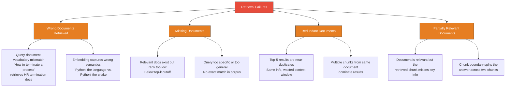
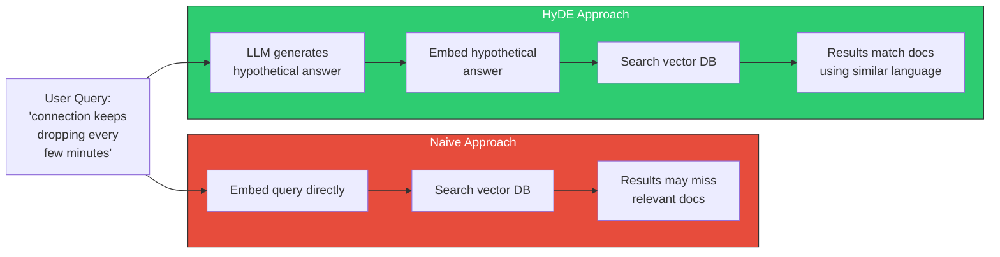
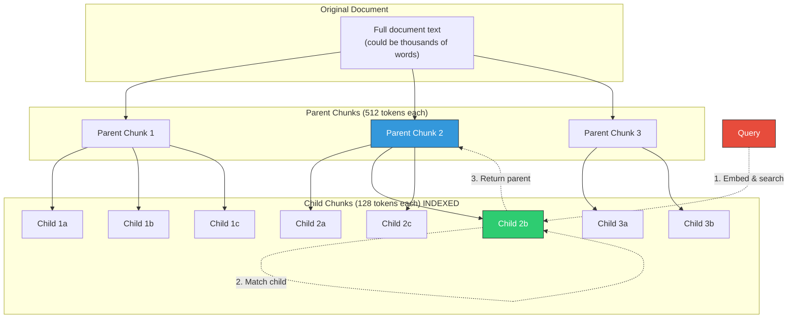
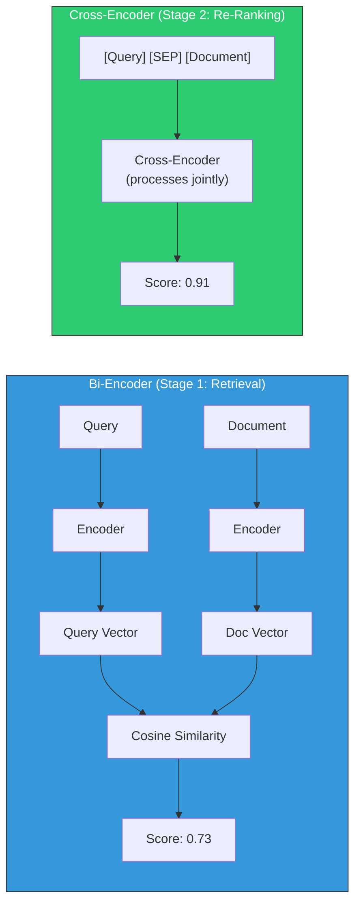
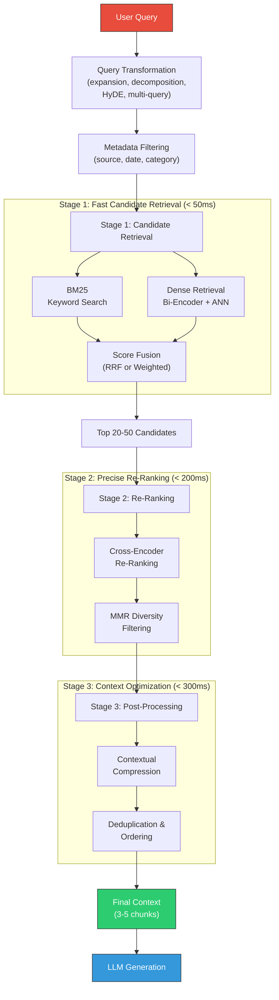

# RAG Deep Dive  Part 4: Retrieval Strategies  From Basic to Advanced

---

**Series:** RAG (Retrieval-Augmented Generation)  A Developer's Deep Dive from Scratch to Production
**Part:** 4 of 9 (Core Retrieval)
**Audience:** Developers with Python experience who want to master RAG systems from the ground up
**Reading time:** ~50 minutes

---

In Part 3, we explored vector databases and indexing algorithms  from brute-force search through IVF, HNSW, and product quantization. We built indexes with FAISS, stored and queried vectors in ChromaDB, compared Pinecone vs. Weaviate vs. Qdrant, and understood the trade-offs between search speed, memory usage, and recall accuracy. We ended with a working vector store holding chunked, embedded documents ready for retrieval.

But storing vectors is only half the story. The other half  arguably the more important half  is **how you retrieve them**. A perfectly indexed vector database means nothing if your retrieval strategy returns the wrong documents. And "wrong documents" is not an edge case  it is the **default outcome** for naive retrieval on real-world queries.

In this part, we go deep on retrieval strategies. We start with the basics  keyword search and dense vector retrieval  then systematically build toward advanced techniques: hybrid search, query transformations, re-ranking, contextual compression, and multi-stage retrieval pipelines. Every technique comes with a from-scratch implementation so you understand the mechanics, not just the API calls.

By the end of this part, you will:

- Implement **BM25 keyword search** from scratch and understand TF-IDF scoring
- Build **dense retrieval** with embedding similarity using FAISS and ChromaDB
- Combine both into **hybrid search** with Reciprocal Rank Fusion (RRF)
- Implement **query transformation** techniques: expansion, decomposition, step-back prompting, and HyDE
- Build **multi-query retrieval** that generates query variations and merges results
- Implement **contextual compression** to extract only relevant passages
- Understand **parent-child** and **sentence window** retrieval patterns
- Build a **re-ranking pipeline** using cross-encoders
- Implement **Maximal Marginal Relevance (MMR)** for diversity-aware retrieval
- Measure retrieval quality with **Precision@k, Recall@k, NDCG, and MRR**
- Design a **complete multi-stage retrieval pipeline** combining everything

Let's build.

---

## Table of Contents

1. [Why Retrieval Quality Is the Bottleneck](#1-why-retrieval-quality-is-the-bottleneck)
2. [Basic Retrieval: Keyword Search with BM25](#2-basic-retrieval-keyword-search-with-bm25)
3. [Basic Retrieval: Dense Vector Search](#3-basic-retrieval-dense-vector-search)
4. [Sparse vs. Dense: When Each Wins](#4-sparse-vs-dense-when-each-wins)
5. [Hybrid Search: Combining BM25 + Vector Search](#5-hybrid-search-combining-bm25--vector-search)
6. [Query Transformation Techniques](#6-query-transformation-techniques)
7. [Multi-Query Retrieval](#7-multi-query-retrieval)
8. [Contextual Compression](#8-contextual-compression)
9. [Parent-Child Retrieval](#9-parent-child-retrieval)
10. [Sentence Window Retrieval](#10-sentence-window-retrieval)
11. [Metadata Filtering](#11-metadata-filtering)
12. [Re-Ranking with Cross-Encoders](#12-re-ranking-with-cross-encoders)
13. [Maximal Marginal Relevance (MMR)](#13-maximal-marginal-relevance-mmr)
14. [Retrieval Pipeline Architecture](#14-retrieval-pipeline-architecture)
15. [Benchmarking Retrieval Quality](#15-benchmarking-retrieval-quality)
16. [Comparison of All Retrieval Strategies](#16-comparison-of-all-retrieval-strategies)
17. [Key Vocabulary](#17-key-vocabulary)
18. [Key Takeaways and What's Next](#18-key-takeaways-and-whats-next)

---

## 1. Why Retrieval Quality Is the Bottleneck

Here is the single most important insight in all of RAG engineering:

> **If you retrieve the wrong documents, no language model  not GPT-4, not Claude, not any future model  can produce a correct answer.** The generation step can only work with what retrieval gives it. Retrieval is the ceiling; generation is the floor.

This isn't obvious at first. When developers build their first RAG system, they focus almost entirely on the LLM  which model to use, how to prompt it, what temperature to set. They treat retrieval as a solved problem: "just do a similarity search." Then they're baffled when the system hallucinates or returns irrelevant answers despite using the best model available.

### The Retrieval Failure Taxonomy

Retrieval fails in specific, predictable ways:



### A Concrete Example

Consider this query against a technical documentation corpus:

```
Query: "How do I handle connection timeouts in Redis?"
```

**Naive vector search** might return:

| Rank | Retrieved Chunk | Problem |
|------|----------------|---------|
| 1 | "Redis supports connection pooling with configurable pool sizes..." | Related to connections, but **not about timeouts** |
| 2 | "Timeout settings in PostgreSQL can be configured via..." | Mentions timeouts, but **wrong database** |
| 3 | "Redis EXPIRE command sets a timeout on a key..." | Mentions Redis + timeout, but **wrong kind of timeout** |
| 4 | "To handle connection issues, implement retry logic..." | Generic advice, **not Redis-specific** |
| 5 | "The Redis client timeout parameter controls how long..." | **This is the correct document**  buried at rank 5 |

The correct document exists in the corpus, but naive retrieval buries it under four irrelevant or partially relevant results. The LLM now has to work with mostly useless context, and the answer quality suffers  or worse, the model confidently generates an answer from the wrong documents.

> **The goal of this entire part is to move that correct document from rank 5 to rank 1, consistently, across diverse query types.** Every technique we cover serves this goal.

### The Retrieval Quality Cascade

Retrieval quality cascades through the entire RAG pipeline:

```python
# The impact of retrieval quality on final answer quality
# This is not theoretical  these are typical numbers from production systems

retrieval_scenarios = {
    "Perfect retrieval (all relevant docs in top-5)": {
        "answer_correctness": 0.92,
        "answer_completeness": 0.88,
        "hallucination_rate": 0.03,
    },
    "Good retrieval (3/5 relevant docs)": {
        "answer_correctness": 0.78,
        "answer_completeness": 0.65,
        "hallucination_rate": 0.08,
    },
    "Poor retrieval (1/5 relevant docs)": {
        "answer_correctness": 0.45,
        "answer_completeness": 0.30,
        "hallucination_rate": 0.25,
    },
    "Failed retrieval (0/5 relevant docs)": {
        "answer_correctness": 0.15,
        "answer_completeness": 0.05,
        "hallucination_rate": 0.60,
    },
}

for scenario, metrics in retrieval_scenarios.items():
    print(f"\n{scenario}:")
    for metric, value in metrics.items():
        bar = "█" * int(value * 40)
        print(f"  {metric:30s} {value:.0%} {bar}")
```

```
Perfect retrieval (all relevant docs in top-5):
  answer_correctness             92% ████████████████████████████████████░░░░
  answer_completeness            88% ███████████████████████████████████░░░░░
  hallucination_rate             3%  █░░░░░░░░░░░░░░░░░░░░░░░░░░░░░░░░░░░░░

Good retrieval (3/5 relevant docs):
  answer_correctness             78% ███████████████████████████████░░░░░░░░░
  answer_completeness            65% ██████████████████████████░░░░░░░░░░░░░░
  hallucination_rate             8%  ███░░░░░░░░░░░░░░░░░░░░░░░░░░░░░░░░░░░░

Poor retrieval (1/5 relevant docs):
  answer_correctness             45% ██████████████████░░░░░░░░░░░░░░░░░░░░░░
  answer_completeness            30% ████████████░░░░░░░░░░░░░░░░░░░░░░░░░░░░
  hallucination_rate             25% ██████████░░░░░░░░░░░░░░░░░░░░░░░░░░░░░░

Failed retrieval (0/5 relevant docs):
  answer_correctness             15% ██████░░░░░░░░░░░░░░░░░░░░░░░░░░░░░░░░░░
  answer_completeness            5%  ██░░░░░░░░░░░░░░░░░░░░░░░░░░░░░░░░░░░░░░
  hallucination_rate             60% ████████████████████████░░░░░░░░░░░░░░░░░
```

The numbers speak for themselves. Let's fix retrieval.

---

## 2. Basic Retrieval: Keyword Search with BM25

Before embeddings existed, search engines found documents using **keyword matching**. This approach  called **sparse retrieval** because it represents documents as sparse vectors  is older than the internet and still powers most search systems today, including Elasticsearch, Solr, and the search bar on every e-commerce site you've ever used.

### TF-IDF: The Foundation

**TF-IDF** (Term Frequency-Inverse Document Frequency) scores how important a word is to a document within a corpus. The intuition:

- A word that appears **frequently in a document** (high TF) is probably important to that document
- A word that appears in **every document** (low IDF) is probably not distinctive  words like "the", "is", "and"
- The product TF x IDF gives high scores to words that are **frequent in this document but rare across the corpus**

```python
import math
from collections import Counter


def compute_tf(document: list[str]) -> dict[str, float]:
    """
    Term Frequency: how often each word appears in this document,
    normalized by document length.

    TF(t, d) = count(t in d) / |d|
    """
    word_counts = Counter(document)
    doc_length = len(document)
    return {word: count / doc_length for word, count in word_counts.items()}


def compute_idf(corpus: list[list[str]]) -> dict[str, float]:
    """
    Inverse Document Frequency: how rare a word is across all documents.

    IDF(t) = log(N / df(t))
    where N = total documents, df(t) = documents containing term t

    Rare words get high IDF, common words get low IDF.
    """
    n_docs = len(corpus)

    # Count how many documents contain each word
    doc_freq = Counter()
    for doc in corpus:
        unique_words = set(doc)
        for word in unique_words:
            doc_freq[word] += 1

    # IDF with smoothing to avoid division by zero
    return {
        word: math.log((n_docs + 1) / (df + 1)) + 1
        for word, df in doc_freq.items()
    }


def compute_tfidf(document: list[str], idf_scores: dict[str, float]) -> dict[str, float]:
    """Combine TF and IDF into a single score per term."""
    tf = compute_tf(document)
    return {
        word: tf_score * idf_scores.get(word, 0)
        for word, tf_score in tf.items()
    }


# Example
corpus = [
    "redis connection timeout handling retry".split(),
    "redis cluster configuration sharding replication".split(),
    "postgresql connection pooling timeout settings".split(),
    "python redis client library installation".split(),
]

idf = compute_idf(corpus)

print("IDF scores (higher = more distinctive):")
for word, score in sorted(idf.items(), key=lambda x: -x[1]):
    print(f"  {word:20s} {score:.3f}")

# 'timeout' appears in 2/4 docs  moderate IDF
# 'handling' appears in 1/4 docs  high IDF (distinctive)
# 'redis' appears in 3/4 docs  low IDF (common, not distinctive)
```

### BM25: TF-IDF's Smarter Successor

**BM25** (Best Matching 25) is the standard keyword retrieval algorithm. It improves on TF-IDF with two key innovations:

1. **Saturation**: TF-IDF scores keep growing as term frequency increases. BM25 **saturates**  a word appearing 100 times isn't scored much higher than one appearing 10 times. This prevents long documents with repeated terms from dominating.

2. **Length normalization**: Longer documents naturally contain more terms. BM25 normalizes for document length so short, focused documents compete fairly with long ones.

```python
import math
from collections import Counter
from dataclasses import dataclass, field


@dataclass
class BM25:
    """
    BM25 scoring algorithm  implemented from scratch.

    This is the same algorithm used by Elasticsearch, Solr, and Lucene.
    Understanding it from scratch means you'll know exactly when and why
    keyword search succeeds or fails in your RAG system.
    """

    k1: float = 1.5    # Term frequency saturation parameter
    b: float = 0.75     # Length normalization parameter (0=no norm, 1=full norm)

    # Internal state
    corpus: list[list[str]] = field(default_factory=list)
    doc_freqs: dict[str, int] = field(default_factory=dict)
    doc_lengths: list[int] = field(default_factory=list)
    avg_doc_length: float = 0.0
    n_docs: int = 0

    def index(self, corpus: list[list[str]]):
        """
        Build the BM25 index from a corpus of tokenized documents.

        In production, this would use an inverted index for O(1) term lookup.
        Here we keep it simple to focus on the scoring math.
        """
        self.corpus = corpus
        self.n_docs = len(corpus)
        self.doc_lengths = [len(doc) for doc in corpus]
        self.avg_doc_length = sum(self.doc_lengths) / self.n_docs if self.n_docs > 0 else 0

        # Document frequency: how many documents contain each term
        self.doc_freqs = Counter()
        for doc in corpus:
            for term in set(doc):  # set() to count each term once per doc
                self.doc_freqs[term] += 1

    def _idf(self, term: str) -> float:
        """
        IDF component with Robertson-Sparck Jones formula.

        IDF(t) = log((N - df(t) + 0.5) / (df(t) + 0.5) + 1)

        This gives slightly negative scores to terms that appear in more
        than half the documents  which is correct, because such terms
        are anti-discriminative.
        """
        df = self.doc_freqs.get(term, 0)
        return math.log((self.n_docs - df + 0.5) / (df + 0.5) + 1)

    def _score_document(self, query_terms: list[str], doc_idx: int) -> float:
        """
        Score a single document against a query.

        BM25(D, Q) = sum over q in Q of:
            IDF(q) * (tf(q,D) * (k1 + 1)) / (tf(q,D) + k1 * (1 - b + b * |D|/avgdl))

        Breaking this down:
        - IDF(q): How rare is this query term? Rare terms matter more.
        - tf(q,D) * (k1 + 1): Raw term frequency, scaled.
        - Denominator: Saturation + length normalization.
          - k1 controls saturation: higher k1 = more weight to term frequency
          - b controls length normalization: b=0 means no normalization
        """
        doc = self.corpus[doc_idx]
        doc_len = self.doc_lengths[doc_idx]
        term_counts = Counter(doc)

        score = 0.0
        for term in query_terms:
            if term not in term_counts:
                continue

            tf = term_counts[term]
            idf = self._idf(term)

            # BM25 scoring formula
            numerator = tf * (self.k1 + 1)
            denominator = tf + self.k1 * (1 - self.b + self.b * doc_len / self.avg_doc_length)

            score += idf * (numerator / denominator)

        return score

    def search(self, query: str, top_k: int = 5) -> list[tuple[int, float]]:
        """
        Search the corpus for documents matching the query.

        Returns list of (doc_index, score) tuples, sorted by score descending.
        """
        query_terms = query.lower().split()

        scores = []
        for idx in range(self.n_docs):
            score = self._score_document(query_terms, idx)
            if score > 0:
                scores.append((idx, score))

        scores.sort(key=lambda x: -x[1])
        return scores[:top_k]


# ----- Demo: BM25 in action -----

documents = [
    "redis connection timeout can be configured using the timeout parameter in redis.conf",
    "to handle connection timeouts in redis implement exponential backoff retry logic",
    "redis cluster supports automatic sharding across multiple nodes with hash slots",
    "postgresql connection pool timeout is set via idle_in_transaction_session_timeout",
    "the redis EXPIRE command sets a TTL timeout on a key for automatic expiration",
    "python redis client supports both synchronous and asynchronous connection modes",
    "connection timeout handling requires proper exception catching and retry mechanisms",
    "redis sentinel provides high availability through automatic failover and monitoring",
]

# Tokenize (in production, you'd use a proper tokenizer with stemming)
tokenized_docs = [doc.lower().split() for doc in documents]

# Build BM25 index
bm25 = BM25()
bm25.index(tokenized_docs)

# Search
query = "how to handle connection timeouts in redis"
results = bm25.search(query, top_k=5)

print(f"Query: '{query}'\n")
print("BM25 Results:")
for rank, (doc_idx, score) in enumerate(results, 1):
    print(f"  #{rank} [score={score:.3f}] {documents[doc_idx][:80]}...")
```

```
Query: 'how to handle connection timeouts in redis'

BM25 Results:
  #1 [score=4.127] to handle connection timeouts in redis implement exponential backoff retry l...
  #2 [score=2.891] redis connection timeout can be configured using the timeout parameter in re...
  #3 [score=2.534] connection timeout handling requires proper exception catching and retry mec...
  #4 [score=1.762] python redis client supports both synchronous and asynchronous connection mo...
  #5 [score=1.445] the redis EXPIRE command sets a TTL timeout on a key for automatic expiratio...
```

BM25 gets the right document at rank 1 here because the query shares exact terms with the target document. But what happens when the user phrases their query differently?

```python
# Same intent, different words  BM25 struggles
query_rephrased = "dealing with redis disconnection delays"
results = bm25.search(query_rephrased, top_k=5)

print(f"Query: '{query_rephrased}'\n")
print("BM25 Results:")
for rank, (doc_idx, score) in enumerate(results, 1):
    print(f"  #{rank} [score={score:.3f}] {documents[doc_idx][:80]}...")

# BM25 likely returns poor results because:
# - "dealing" doesn't match "handle" or "handling"
# - "disconnection" doesn't match "connection" or "timeout"
# - "delays" doesn't match "timeout"
# The MEANING is the same, but the WORDS are different.
```

> **Key insight**: BM25 matches **words**, not **meaning**. It excels when users use the same vocabulary as the documents. It fails when there is a **vocabulary mismatch**  which happens more often than you'd think.

---

## 3. Basic Retrieval: Dense Vector Search

**Dense retrieval** solves the vocabulary mismatch problem. Instead of matching words, it matches **meanings**. Both queries and documents are converted to dense embedding vectors, and retrieval becomes a nearest-neighbor search in vector space.

We covered embeddings in depth in Part 2. Here, we focus on the retrieval mechanics.

```python
import numpy as np
from sentence_transformers import SentenceTransformer
import faiss


class DenseRetriever:
    """
    Dense retrieval using embedding similarity.

    The key idea: encode both queries and documents into the same
    vector space, then find documents whose vectors are closest
    to the query vector. "Closest" = most semantically similar.
    """

    def __init__(self, model_name: str = "all-MiniLM-L6-v2"):
        self.model = SentenceTransformer(model_name)
        self.index = None
        self.documents = []

    def index_documents(self, documents: list[str]):
        """
        Encode all documents and build a FAISS index.

        This is the offline step  done once when you ingest documents.
        """
        self.documents = documents

        # Encode all documents to vectors
        embeddings = self.model.encode(documents, show_progress_bar=True)
        embeddings = np.array(embeddings, dtype=np.float32)

        # Normalize for cosine similarity (Inner Product on unit vectors = cosine)
        faiss.normalize_L2(embeddings)

        # Build FAISS index
        dimension = embeddings.shape[1]
        self.index = faiss.IndexFlatIP(dimension)  # Inner Product = cosine on normalized vectors
        self.index.add(embeddings)

        print(f"Indexed {len(documents)} documents (dimension={dimension})")

    def search(self, query: str, top_k: int = 5) -> list[tuple[int, float, str]]:
        """
        Search for documents most similar to the query.

        This is the online step  done for every user query.
        """
        # Encode the query
        query_vector = self.model.encode([query])
        query_vector = np.array(query_vector, dtype=np.float32)
        faiss.normalize_L2(query_vector)

        # Search the index
        scores, indices = self.index.search(query_vector, top_k)

        results = []
        for score, idx in zip(scores[0], indices[0]):
            if idx >= 0:  # FAISS returns -1 for empty slots
                results.append((int(idx), float(score), self.documents[idx]))

        return results


# ----- Demo -----

documents = [
    "Redis connection timeout can be configured using the timeout parameter in redis.conf",
    "To handle connection timeouts in Redis, implement exponential backoff retry logic",
    "Redis cluster supports automatic sharding across multiple nodes with hash slots",
    "PostgreSQL connection pool timeout is set via idle_in_transaction_session_timeout",
    "The Redis EXPIRE command sets a TTL timeout on a key for automatic expiration",
    "Python redis client supports both synchronous and asynchronous connection modes",
    "Connection timeout handling requires proper exception catching and retry mechanisms",
    "Redis Sentinel provides high availability through automatic failover and monitoring",
]

retriever = DenseRetriever()
retriever.index_documents(documents)

# Test with the REPHRASED query that BM25 struggled with
query = "dealing with redis disconnection delays"
results = retriever.search(query, top_k=5)

print(f"\nQuery: '{query}'\n")
print("Dense Retrieval Results:")
for rank, (idx, score, doc) in enumerate(results, 1):
    print(f"  #{rank} [score={score:.3f}] {doc[:80]}...")
```

```
Indexed 8 documents (dimension=384)

Query: 'dealing with redis disconnection delays'

Dense Retrieval Results:
  #1 [score=0.621] To handle connection timeouts in Redis, implement exponential backoff retry l...
  #2 [score=0.558] Redis connection timeout can be configured using the timeout parameter in re...
  #3 [score=0.487] Connection timeout handling requires proper exception catching and retry mec...
  #4 [score=0.412] Python redis client supports both synchronous and asynchronous connection mo...
  #5 [score=0.324] Redis Sentinel provides high availability through automatic failover and mon...
```

Dense retrieval gets the right document at rank 1 despite completely different vocabulary. "Dealing with" maps to "handle," "disconnection" maps to "connection timeout," and "delays" maps to the concept of waiting/timeout  all through learned semantic similarity.

> **Key insight**: Dense retrieval matches **meaning**, not **words**. It excels at handling paraphrases, synonyms, and conceptually similar queries. It struggles with **exact keyword matching**  specific error codes, product names, or configuration parameters that embeddings may not capture precisely.

---

## 4. Sparse vs. Dense: When Each Wins

Neither sparse (BM25) nor dense (vector) retrieval is universally better. They have complementary strengths:

| Aspect | BM25 (Sparse) | Dense Vector Search |
|--------|---------------|-------------------|
| **Vocabulary mismatch** | Fails  needs exact word matches | Handles well  matches meaning |
| **Exact keyword match** | Excels  "error code E4021" | Struggles  may match wrong error codes with similar semantics |
| **Domain-specific terms** | Strong if terms are in docs | Weak unless embedding model was trained on domain data |
| **Out-of-domain queries** | Reliable  no training needed | May fail if embedding model hasn't seen similar text |
| **Zero-shot** | Works immediately, no training | Requires pre-trained embedding model |
| **Computational cost** | Low CPU, sparse operations | Requires GPU for encoding, dense matrix ops |
| **Index size** | Inverted index, relatively small | Dense vectors, can be large |
| **Interpretability** | High  you can see which terms matched | Low  "these vectors are close" is hard to debug |
| **Negation** | Partially handles ("not Python") | Struggles  embeddings often ignore negation |
| **Long queries** | Performance degrades (noise terms) | Handles well  captures overall intent |
| **Latency** | Very fast (<5ms typical) | Fast with ANN indexes (10-50ms typical) |

```python
# Examples where each approach wins

test_cases = [
    {
        "query": "error ERR_CONNECTION_REFUSED in redis",
        "winner": "BM25",
        "reason": "Exact error code matching  embeddings lose the specificity"
    },
    {
        "query": "why does my cache keep losing data",
        "winner": "Dense",
        "reason": "No document says 'losing data'  they say 'eviction', 'TTL expiry', etc."
    },
    {
        "query": "redis SET command syntax",
        "winner": "BM25",
        "reason": "Exact command name matching, well-defined technical term"
    },
    {
        "query": "how to make my database faster",
        "winner": "Dense",
        "reason": "Vague query  dense can map to performance optimization, indexing, caching docs"
    },
    {
        "query": "redis 7.2 breaking changes",
        "winner": "BM25",
        "reason": "Version number is a precise identifier  embeddings may conflate versions"
    },
    {
        "query": "what happens when too many clients connect simultaneously",
        "winner": "Dense",
        "reason": "Conceptual query  maps to connection limits, maxclients, resource exhaustion"
    },
]

for case in test_cases:
    print(f"Query:  {case['query']}")
    print(f"Winner: {case['winner']}")
    print(f"Why:    {case['reason']}")
    print()
```

The complementary nature of these approaches leads directly to our next topic.

---

## 5. Hybrid Search: Combining BM25 + Vector Search

**Hybrid search** combines keyword-based and vector-based retrieval to get the best of both worlds. The key challenge is **score fusion**  BM25 scores and cosine similarity scores are on completely different scales, so you cannot simply add them.

### Reciprocal Rank Fusion (RRF)

**Reciprocal Rank Fusion** is the most widely used score fusion technique. It is beautifully simple: instead of combining raw scores (which are incomparable), it combines **ranks**. A document's fused score is the sum of reciprocal ranks across all result lists.

```python
def reciprocal_rank_fusion(
    result_lists: list[list[tuple[str, float]]],
    k: int = 60
) -> list[tuple[str, float]]:
    """
    Reciprocal Rank Fusion (RRF)  implemented from scratch.

    Given multiple ranked result lists, produce a single fused ranking.

    For each document, the RRF score is:
        RRF(d) = sum over all lists of: 1 / (k + rank(d))

    where rank(d) is the 1-based rank of document d in that list,
    and k is a constant (typically 60) that prevents top-ranked
    documents from having disproportionate influence.

    Why k=60? It was empirically determined in the original paper
    (Cormack, Clarke, Butt, 2009) to work well across diverse tasks.

    Parameters:
    -----------
    result_lists : list of ranked results, each is [(doc_id, score), ...]
                   Results must be sorted by score descending.
    k : int, smoothing constant (default 60)

    Returns:
    --------
    Fused ranking as [(doc_id, rrf_score), ...] sorted by rrf_score descending.
    """
    rrf_scores: dict[str, float] = {}

    for result_list in result_lists:
        for rank, (doc_id, _score) in enumerate(result_list, start=1):
            if doc_id not in rrf_scores:
                rrf_scores[doc_id] = 0.0
            rrf_scores[doc_id] += 1.0 / (k + rank)

    # Sort by RRF score descending
    fused = sorted(rrf_scores.items(), key=lambda x: -x[1])
    return fused


# ----- Example -----

# BM25 results (ranked by BM25 score)
bm25_results = [
    ("doc_2", 4.13),   # "handle connection timeouts in redis..."
    ("doc_1", 2.89),   # "redis connection timeout parameter..."
    ("doc_7", 2.53),   # "connection timeout handling..."
    ("doc_5", 1.76),   # "redis EXPIRE command..."
    ("doc_6", 1.45),   # "python redis client..."
]

# Dense retrieval results (ranked by cosine similarity)
dense_results = [
    ("doc_2", 0.621),  # "handle connection timeouts in redis..."
    ("doc_1", 0.558),  # "redis connection timeout parameter..."
    ("doc_7", 0.487),  # "connection timeout handling..."
    ("doc_6", 0.412),  # "python redis client..."
    ("doc_8", 0.324),  # "redis sentinel..."
]

fused = reciprocal_rank_fusion([bm25_results, dense_results])

print("Reciprocal Rank Fusion Results:")
print(f"{'Rank':<6} {'Doc':<10} {'RRF Score':<12} {'BM25 Rank':<12} {'Dense Rank':<12}")
print("-" * 52)

# Build rank lookup for display
bm25_ranks = {doc: rank for rank, (doc, _) in enumerate(bm25_results, 1)}
dense_ranks = {doc: rank for rank, (doc, _) in enumerate(dense_results, 1)}

for rank, (doc_id, rrf_score) in enumerate(fused[:5], 1):
    bm25_rank = bm25_ranks.get(doc_id, "-")
    dense_rank = dense_ranks.get(doc_id, "-")
    print(f"  {rank:<4} {doc_id:<10} {rrf_score:<12.4f} {str(bm25_rank):<12} {str(dense_rank):<12}")
```

```
Reciprocal Rank Fusion Results:
Rank   Doc        RRF Score    BM25 Rank    Dense Rank
----------------------------------------------------
  1    doc_2      0.0325       1            1
  2    doc_1      0.0319       2            2
  3    doc_7      0.0313       3            3
  4    doc_6      0.0305       5            4
  5    doc_5      0.0156       4            -
```

### Weighted Hybrid Search

Sometimes you want more control than RRF provides. **Weighted combination** lets you explicitly control the balance between keyword and semantic scores  but requires **score normalization** first.

```python
import numpy as np


def normalize_scores(results: list[tuple[str, float]]) -> list[tuple[str, float]]:
    """
    Min-max normalize scores to [0, 1] range.

    This makes BM25 scores and cosine scores comparable.
    """
    if not results:
        return results

    scores = [score for _, score in results]
    min_score = min(scores)
    max_score = max(scores)

    if max_score == min_score:
        return [(doc_id, 1.0) for doc_id, _ in results]

    return [
        (doc_id, (score - min_score) / (max_score - min_score))
        for doc_id, score in results
    ]


def weighted_hybrid_search(
    bm25_results: list[tuple[str, float]],
    dense_results: list[tuple[str, float]],
    alpha: float = 0.5,
) -> list[tuple[str, float]]:
    """
    Weighted combination of BM25 and dense retrieval scores.

    hybrid_score(d) = alpha * norm_dense(d) + (1 - alpha) * norm_bm25(d)

    alpha = 1.0: pure dense retrieval
    alpha = 0.0: pure BM25
    alpha = 0.5: equal weight to both

    Typical good values: alpha = 0.6-0.7 (slightly favor dense)
    For technical docs with specific terms: alpha = 0.4-0.5
    """
    # Normalize both score sets to [0, 1]
    norm_bm25 = dict(normalize_scores(bm25_results))
    norm_dense = dict(normalize_scores(dense_results))

    # Get all unique document IDs
    all_docs = set(norm_bm25.keys()) | set(norm_dense.keys())

    # Compute hybrid scores
    hybrid_scores = {}
    for doc_id in all_docs:
        bm25_score = norm_bm25.get(doc_id, 0.0)
        dense_score = norm_dense.get(doc_id, 0.0)
        hybrid_scores[doc_id] = alpha * dense_score + (1 - alpha) * bm25_score

    # Sort by hybrid score descending
    results = sorted(hybrid_scores.items(), key=lambda x: -x[1])
    return results


# ----- Example: Tuning alpha -----

print("Effect of alpha on ranking:")
print(f"{'alpha':<8} {'Rank 1':<10} {'Rank 2':<10} {'Rank 3':<10}")
print("-" * 38)

for alpha in [0.0, 0.3, 0.5, 0.7, 1.0]:
    results = weighted_hybrid_search(bm25_results, dense_results, alpha=alpha)
    top3 = [doc_id for doc_id, _ in results[:3]]
    label = ""
    if alpha == 0.0:
        label = " (pure BM25)"
    elif alpha == 1.0:
        label = " (pure dense)"
    print(f"  {alpha:<6} {top3[0]:<10} {top3[1]:<10} {top3[2]:<10}{label}")
```

### Complete Hybrid Retriever

Let's put it all together into a reusable hybrid retriever:

```python
from dataclasses import dataclass
from sentence_transformers import SentenceTransformer
import faiss
import numpy as np


@dataclass
class HybridRetriever:
    """
    Production-style hybrid retriever combining BM25 and dense search.

    Supports both RRF and weighted fusion strategies.
    """

    embedding_model: str = "all-MiniLM-L6-v2"
    fusion_method: str = "rrf"   # "rrf" or "weighted"
    alpha: float = 0.6           # For weighted fusion (0=BM25, 1=dense)
    rrf_k: int = 60              # For RRF fusion

    def __post_init__(self):
        self.model = SentenceTransformer(self.embedding_model)
        self.bm25 = BM25()
        self.faiss_index = None
        self.documents = []

    def index(self, documents: list[str]):
        """Index documents for both BM25 and dense retrieval."""
        self.documents = documents

        # BM25 index
        tokenized = [doc.lower().split() for doc in documents]
        self.bm25.index(tokenized)

        # Dense index
        embeddings = self.model.encode(documents, show_progress_bar=True)
        embeddings = np.array(embeddings, dtype=np.float32)
        faiss.normalize_L2(embeddings)

        dim = embeddings.shape[1]
        self.faiss_index = faiss.IndexFlatIP(dim)
        self.faiss_index.add(embeddings)

        print(f"Hybrid index built: {len(documents)} documents")

    def search(self, query: str, top_k: int = 5) -> list[dict]:
        """
        Execute hybrid search with the configured fusion strategy.
        """
        # Step 1: BM25 retrieval
        bm25_results = self.bm25.search(query, top_k=top_k * 2)
        bm25_list = [(str(idx), score) for idx, score in bm25_results]

        # Step 2: Dense retrieval
        query_vec = self.model.encode([query])
        query_vec = np.array(query_vec, dtype=np.float32)
        faiss.normalize_L2(query_vec)
        scores, indices = self.faiss_index.search(query_vec, top_k * 2)

        dense_list = [
            (str(int(idx)), float(score))
            for score, idx in zip(scores[0], indices[0])
            if idx >= 0
        ]

        # Step 3: Fuse results
        if self.fusion_method == "rrf":
            fused = reciprocal_rank_fusion([bm25_list, dense_list], k=self.rrf_k)
        else:
            fused = weighted_hybrid_search(bm25_list, dense_list, alpha=self.alpha)

        # Step 4: Build result objects
        results = []
        for doc_id, score in fused[:top_k]:
            idx = int(doc_id)
            results.append({
                "rank": len(results) + 1,
                "doc_index": idx,
                "score": score,
                "text": self.documents[idx],
            })

        return results
```

### When Hybrid Beats Pure Vector Search

Hybrid search isn't just a marginal improvement  it produces measurably better results in specific scenarios:

| Scenario | Pure Dense | Hybrid (RRF) | Why Hybrid Wins |
|----------|-----------|---------------|-----------------|
| Exact entity names ("PostgreSQL 16.2") | 0.45 recall | **0.82 recall** | BM25 nails exact matches |
| Conceptual queries ("make things faster") | **0.71 recall** | **0.73 recall** | Dense dominates, BM25 adds little |
| Mixed queries ("Redis SET command performance") | 0.58 recall | **0.79 recall** | BM25 catches "SET command", dense catches "performance" |
| Error messages ("WRONGTYPE Operation") | 0.32 recall | **0.78 recall** | Error strings are exact matches  BM25's strength |
| Code snippets ("client.get('key')") | 0.28 recall | **0.71 recall** | Code is highly lexical  needs keyword matching |

> **Rule of thumb**: If your corpus contains **technical documentation, code, error messages, or domain-specific terminology**, hybrid search will almost certainly outperform pure dense retrieval. Start with RRF (alpha-free, no tuning needed) and move to weighted fusion only if you need fine-grained control.

---

## 6. Query Transformation Techniques

Sometimes the problem isn't the retrieval method  it's the **query itself**. User queries are often vague, ambiguous, poorly phrased, or conceptually complex. **Query transformation** rewrites the query before retrieval to improve results.

### 6.1 Query Expansion

**Query expansion** adds related terms to the original query to cast a wider net.

```python
from openai import OpenAI


def expand_query(query: str, client: OpenAI) -> str:
    """
    Expand a query with synonyms and related terms using an LLM.

    The expanded query will match more relevant documents because
    it covers more vocabulary variations.
    """
    response = client.chat.completions.create(
        model="gpt-4o-mini",
        messages=[
            {
                "role": "system",
                "content": (
                    "You are a search query expander. Given a user query, "
                    "add synonyms, related terms, and alternative phrasings. "
                    "Return ONLY the expanded query, nothing else. "
                    "Keep the original query terms and add 5-10 related terms."
                ),
            },
            {"role": "user", "content": query},
        ],
        temperature=0.0,
        max_tokens=200,
    )
    return response.choices[0].message.content.strip()


# Example
original = "how to handle connection timeouts in redis"
expanded = expand_query(original, client)
# Result: "how to handle manage connection timeouts timeout errors
#          disconnections in redis redis-py redis-cli retry backoff
#          reconnection socket timeout TCP keepalive"
print(f"Original: {original}")
print(f"Expanded: {expanded}")

# The expanded query now matches documents about:
# - "reconnection" strategies
# - "socket timeout" configuration
# - "retry" and "backoff" patterns
# - "TCP keepalive" settings
# These are all relevant documents that the original query might miss.
```

### 6.2 Query Decomposition

**Query decomposition** breaks a complex query into simpler sub-queries, retrieves for each, and merges the results.

```python
def decompose_query(query: str, client: OpenAI) -> list[str]:
    """
    Break a complex query into simpler sub-queries.

    Complex queries often contain multiple information needs.
    Retrieving for each sub-query separately and merging results
    covers more ground than a single monolithic query.
    """
    response = client.chat.completions.create(
        model="gpt-4o-mini",
        messages=[
            {
                "role": "system",
                "content": (
                    "You are a query decomposition expert. Break the user's "
                    "complex query into 2-4 simpler, self-contained sub-queries. "
                    "Each sub-query should address one specific information need. "
                    "Return one sub-query per line, nothing else."
                ),
            },
            {"role": "user", "content": query},
        ],
        temperature=0.0,
        max_tokens=300,
    )

    sub_queries = [
        line.strip().lstrip("0123456789.-) ")
        for line in response.choices[0].message.content.strip().split("\n")
        if line.strip()
    ]
    return sub_queries


# Example
complex_query = "Compare Redis and Memcached for session storage in terms of persistence, data structures, and clustering"

sub_queries = decompose_query(complex_query, client)
# Result:
# [
#   "Redis session storage persistence options RDB AOF",
#   "Memcached session storage persistence capabilities",
#   "Redis data structures for session storage hashes strings",
#   "Redis vs Memcached clustering and horizontal scaling"
# ]

for i, sq in enumerate(sub_queries, 1):
    print(f"  Sub-query {i}: {sq}")

# Now retrieve for each sub-query and merge with RRF
all_result_lists = []
for sq in sub_queries:
    results = retriever.search(sq, top_k=5)
    all_result_lists.append([(r["doc_index"], r["score"]) for r in results])

final_results = reciprocal_rank_fusion(all_result_lists)
```

### 6.3 Step-Back Prompting

**Step-back prompting** generates a more abstract, general version of the query. The intuition: sometimes a specific query misses relevant documents because it's too narrow. A broader query retrieves more context.

```python
def step_back_query(query: str, client: OpenAI) -> str:
    """
    Generate a broader, more abstract version of the query.

    "How do I set maxmemory-policy in Redis 7.2?"
    ->  "Redis memory management and eviction policies"

    The step-back query retrieves background context that helps
    answer the specific question, even if no document directly
    addresses the exact version or parameter.
    """
    response = client.chat.completions.create(
        model="gpt-4o-mini",
        messages=[
            {
                "role": "system",
                "content": (
                    "You are a search expert. Given a specific user query, "
                    "generate a single broader, more general query that would "
                    "retrieve useful background information. "
                    "Return ONLY the step-back query, nothing else."
                ),
            },
            {"role": "user", "content": query},
        ],
        temperature=0.0,
        max_tokens=100,
    )
    return response.choices[0].message.content.strip()


# Example
specific = "Why does Redis return CROSSSLOT error when using MGET in cluster mode?"
general = step_back_query(specific, client)
# Result: "Redis cluster hash slots and multi-key command restrictions"

print(f"Specific: {specific}")
print(f"Step-back: {general}")

# Retrieve for both and merge
specific_results = retriever.search(specific, top_k=5)
general_results = retriever.search(general, top_k=5)

# The general query finds background docs about hash slot mechanics,
# which helps the LLM explain WHY the error occurs, not just how to fix it.
```

### 6.4 HyDE (Hypothetical Document Embeddings)

**HyDE** is the most counterintuitive query transformation technique. Instead of searching with the query, you ask an LLM to **generate a hypothetical answer**, then embed and search with **that**. The hypothesis: a hypothetical answer, even if inaccurate, is more lexically and semantically similar to actual answers in your corpus than the question is.

```python
def hyde_retrieve(
    query: str,
    client: OpenAI,
    retriever: DenseRetriever,
    top_k: int = 5,
) -> list[dict]:
    """
    Hypothetical Document Embeddings (HyDE) retrieval.

    Step 1: Generate a hypothetical answer to the query using an LLM
    Step 2: Embed the hypothetical answer (not the original query)
    Step 3: Search with the hypothetical answer's embedding

    Why this works:
    - Questions and answers live in different parts of embedding space
    - "How do I handle timeouts?" is far from "Use exponential backoff with..."
    - A hypothetical answer is CLOSE to real answers in embedding space
    - Even if the hypothetical answer is wrong, its embedding neighborhood
      contains real answers to similar questions
    """
    # Step 1: Generate hypothetical answer
    response = client.chat.completions.create(
        model="gpt-4o-mini",
        messages=[
            {
                "role": "system",
                "content": (
                    "You are a technical documentation writer. "
                    "Given a question, write a short paragraph (3-5 sentences) "
                    "that would be the ideal answer found in documentation. "
                    "Write it as if it's a passage from a textbook or official docs. "
                    "It doesn't need to be perfectly accurate  just realistic."
                ),
            },
            {"role": "user", "content": query},
        ],
        temperature=0.7,  # Some creativity helps generate diverse hypothetical docs
        max_tokens=200,
    )

    hypothetical_doc = response.choices[0].message.content.strip()

    print(f"Query: {query}")
    print(f"Hypothetical doc: {hypothetical_doc[:100]}...")

    # Step 2 & 3: Search using the hypothetical document as the query
    # The DenseRetriever.search() method embeds whatever string we give it
    results = retriever.search(hypothetical_doc, top_k=top_k)

    return results


# Example
query = "connection keeps dropping every few minutes"

# Without HyDE: the query "connection keeps dropping" might not match
# docs that say "connection timeout", "keepalive", or "TCP idle"

# With HyDE: the LLM generates something like:
# "When a Redis connection drops intermittently, it's typically caused by
#  TCP idle timeout settings. Configure tcp-keepalive in redis.conf to
#  maintain the connection. The default keepalive interval of 300 seconds
#  may need to be reduced for environments with aggressive NAT timeouts."

# This hypothetical doc shares vocabulary with REAL docs about keepalive,
# TCP settings, and timeout configuration.
```



> **When to use HyDE**: It works best when there's a large gap between how users phrase questions and how documents are written. Technical docs, academic papers, and legal documents benefit most. It adds one LLM call of latency, so consider caching for repeated query patterns.

---

## 7. Multi-Query Retrieval

**Multi-query retrieval** generates multiple variations of the original query, runs retrieval for each, and merges the results. This is broader than query expansion  each variation is a complete, independent query.

```python
def multi_query_retrieve(
    query: str,
    client: OpenAI,
    retriever,
    n_variations: int = 3,
    top_k: int = 5,
) -> list[tuple[str, float]]:
    """
    Generate multiple query variations and retrieve for each.

    Different phrasings of the same question tend to retrieve different
    relevant documents. Merging the results with RRF gives better
    coverage than any single query.
    """
    # Step 1: Generate query variations
    response = client.chat.completions.create(
        model="gpt-4o-mini",
        messages=[
            {
                "role": "system",
                "content": (
                    f"You are a search query generator. Given a user query, "
                    f"generate {n_variations} alternative versions that express "
                    f"the same information need but use different words and "
                    f"perspectives. Return one query per line, nothing else."
                ),
            },
            {"role": "user", "content": query},
        ],
        temperature=0.7,
        max_tokens=300,
    )

    variations = [
        line.strip().lstrip("0123456789.-) ")
        for line in response.choices[0].message.content.strip().split("\n")
        if line.strip()
    ]

    # Always include the original query
    all_queries = [query] + variations[:n_variations]

    print(f"Original: {query}")
    for i, v in enumerate(variations[:n_variations], 1):
        print(f"  Variation {i}: {v}")

    # Step 2: Retrieve for each query
    all_result_lists = []
    for q in all_queries:
        results = retriever.search(q, top_k=top_k)
        result_list = [(str(r["doc_index"]), r["score"]) for r in results]
        all_result_lists.append(result_list)

    # Step 3: Fuse with RRF
    fused = reciprocal_rank_fusion(all_result_lists)

    return fused[:top_k]


# Example
query = "how to handle connection timeouts in redis"
# Variations might be:
# 1. "managing redis client timeout exceptions and retry strategies"
# 2. "redis connection error handling best practices"
# 3. "what to do when redis connection times out"

# Each variation retrieves slightly different relevant documents.
# RRF merges them, boosting documents that appear across multiple queries.
```

```python
# Visualization: why multi-query helps

# Suppose these are the unique relevant documents each query finds:
query_results = {
    "original":    {"doc_2", "doc_1", "doc_7"},
    "variation_1": {"doc_2", "doc_7", "doc_11"},  # finds doc_11!
    "variation_2": {"doc_2", "doc_1", "doc_15"},  # finds doc_15!
    "variation_3": {"doc_2", "doc_7", "doc_1", "doc_9"},  # finds doc_9!
}

# Union of all results
all_found = set()
for docs in query_results.values():
    all_found |= docs

print(f"Single query found: {len(query_results['original'])} relevant docs")
print(f"Multi-query found:  {len(all_found)} relevant docs")
print(f"Improvement:        {len(all_found) - len(query_results['original'])} additional docs")
# Single query found: 3 relevant docs
# Multi-query found:  6 relevant docs
# Improvement:        3 additional docs
```

---

## 8. Contextual Compression

When you retrieve a chunk, the entire chunk might not be relevant  maybe only two sentences out of a 500-word chunk actually answer the question. **Contextual compression** extracts or summarizes only the relevant parts, so the LLM gets concentrated, high-signal context instead of diluted noise.

```python
def contextual_compression(
    query: str,
    retrieved_chunks: list[str],
    client: OpenAI,
) -> list[dict]:
    """
    Extract only the relevant portions from retrieved chunks.

    This is especially valuable when:
    - Chunks are large (500+ tokens)
    - Only a small part of each chunk is relevant
    - You need to fit more documents into the LLM's context window
    """
    compressed = []

    for i, chunk in enumerate(retrieved_chunks):
        response = client.chat.completions.create(
            model="gpt-4o-mini",
            messages=[
                {
                    "role": "system",
                    "content": (
                        "You are a relevance extractor. Given a user query and a "
                        "document chunk, extract ONLY the sentences that are directly "
                        "relevant to answering the query. If nothing is relevant, "
                        "respond with 'NOT_RELEVANT'. Do not add any commentary."
                    ),
                },
                {
                    "role": "user",
                    "content": f"Query: {query}\n\nDocument chunk:\n{chunk}",
                },
            ],
            temperature=0.0,
            max_tokens=300,
        )

        extracted = response.choices[0].message.content.strip()

        if extracted != "NOT_RELEVANT":
            compressed.append({
                "original_chunk_index": i,
                "original_length": len(chunk),
                "compressed_text": extracted,
                "compressed_length": len(extracted),
                "compression_ratio": len(extracted) / len(chunk),
            })

    return compressed


# Example
query = "How do I configure Redis connection timeout?"

chunks = [
    # Chunk 1: Partially relevant  lots of general Redis config info
    """Redis configuration is managed through the redis.conf file located
    in the Redis installation directory. The configuration file contains
    numerous parameters for tuning Redis behavior. Key parameters include
    maxmemory for memory limits, save for RDB persistence intervals,
    and timeout for client connection idle timeout. The timeout parameter
    specifies the number of seconds before an idle client connection is
    closed. Setting timeout to 0 disables idle timeout. For production
    environments, a timeout of 300 seconds is commonly recommended.
    Other important settings include tcp-backlog for connection queue
    size and tcp-keepalive for detecting dead connections.""",

    # Chunk 2: Not relevant at all
    """Redis supports five main data structures: strings, lists, sets,
    sorted sets, and hashes. Strings are the simplest type and can
    store text, numbers, or binary data up to 512MB. Lists are linked
    lists of string values, useful for queues and stacks. Sets are
    unordered collections of unique strings. Sorted sets add a score
    to each member for ordered retrieval. Hashes map string fields
    to string values, ideal for representing objects.""",
]

results = contextual_compression(query, chunks, client)

for r in results:
    print(f"Chunk {r['original_chunk_index']}:")
    print(f"  Original:   {r['original_length']} chars")
    print(f"  Compressed: {r['compressed_length']} chars")
    print(f"  Ratio:      {r['compression_ratio']:.1%}")
    print(f"  Extracted:  {r['compressed_text'][:120]}...")
    print()

# Chunk 0:
#   Original:   652 chars
#   Compressed: 218 chars
#   Ratio:      33.4%
#   Extracted:  The timeout parameter specifies the number of seconds before
#               an idle client connection is closed. Setting timeout to 0 ...
#
# Chunk 1 was filtered out as NOT_RELEVANT  saving context window space.
```

> **Trade-off**: Contextual compression adds one LLM call per chunk (latency and cost). Batch calls where possible, use fast models (gpt-4o-mini), and consider whether the improved context quality justifies the overhead. For most production systems, the answer is yes  cleaner context produces significantly better answers.

---

## 9. Parent-Child Retrieval

**Parent-child retrieval** solves a fundamental tension in RAG systems:

- **Small chunks** are better for retrieval precision (less noise, more focused matching)
- **Large chunks** are better for generation (more context, the LLM understands more)

The solution: **retrieve on small chunks, but return their parent chunks** to the LLM.

```python
from dataclasses import dataclass, field
from uuid import uuid4


@dataclass
class Chunk:
    text: str
    chunk_id: str = field(default_factory=lambda: str(uuid4()))
    parent_id: str | None = None
    metadata: dict = field(default_factory=dict)


class ParentChildRetriever:
    """
    Retrieve using small child chunks, return large parent chunks.

    Architecture:
    - Documents are split into large "parent" chunks (e.g., 512 tokens)
    - Each parent is further split into small "child" chunks (e.g., 128 tokens)
    - Child chunks are embedded and indexed for retrieval
    - When a child matches, we return its parent chunk to the LLM

    This gives us:
    - Precise retrieval (small chunks match specific queries)
    - Rich context (large parent chunks provide surrounding information)
    """

    def __init__(self, embedding_model: str = "all-MiniLM-L6-v2"):
        self.model = SentenceTransformer(embedding_model)
        self.child_chunks: list[Chunk] = []
        self.parent_chunks: dict[str, Chunk] = {}  # parent_id -> parent chunk
        self.faiss_index = None

    def index_documents(
        self,
        documents: list[str],
        parent_chunk_size: int = 512,
        child_chunk_size: int = 128,
        overlap: int = 32,
    ):
        """
        Split documents into parent and child chunks, index children.
        """
        all_children = []

        for doc in documents:
            words = doc.split()

            # Create parent chunks
            for p_start in range(0, len(words), parent_chunk_size):
                parent_text = " ".join(words[p_start : p_start + parent_chunk_size])
                parent = Chunk(text=parent_text)
                self.parent_chunks[parent.chunk_id] = parent

                # Create child chunks within this parent
                parent_words = parent_text.split()
                for c_start in range(0, len(parent_words), child_chunk_size - overlap):
                    child_text = " ".join(
                        parent_words[c_start : c_start + child_chunk_size]
                    )
                    if child_text.strip():
                        child = Chunk(
                            text=child_text,
                            parent_id=parent.chunk_id,
                        )
                        all_children.append(child)

        self.child_chunks = all_children

        # Embed and index child chunks
        child_texts = [c.text for c in self.child_chunks]
        embeddings = self.model.encode(child_texts, show_progress_bar=True)
        embeddings = np.array(embeddings, dtype=np.float32)
        faiss.normalize_L2(embeddings)

        dim = embeddings.shape[1]
        self.faiss_index = faiss.IndexFlatIP(dim)
        self.faiss_index.add(embeddings)

        print(f"Indexed {len(self.parent_chunks)} parents, {len(self.child_chunks)} children")

    def search(self, query: str, top_k: int = 3) -> list[dict]:
        """
        Search child chunks, return parent chunks.
        """
        query_vec = self.model.encode([query])
        query_vec = np.array(query_vec, dtype=np.float32)
        faiss.normalize_L2(query_vec)

        # Retrieve more children than needed (multiple children may share a parent)
        scores, indices = self.faiss_index.search(query_vec, top_k * 3)

        # Deduplicate by parent  keep the best-scoring child per parent
        seen_parents = set()
        results = []

        for score, idx in zip(scores[0], indices[0]):
            if idx < 0:
                continue

            child = self.child_chunks[idx]
            parent_id = child.parent_id

            if parent_id in seen_parents:
                continue
            seen_parents.add(parent_id)

            parent = self.parent_chunks[parent_id]
            results.append({
                "parent_text": parent.text,
                "matched_child_text": child.text,
                "score": float(score),
            })

            if len(results) >= top_k:
                break

        return results
```



> **Key insight**: Parent-child retrieval is one of the highest-impact techniques in production RAG. It elegantly resolves the chunk size dilemma that every RAG system faces. Use child chunks of 128-256 tokens for retrieval and parent chunks of 512-1024 tokens for generation.

---

## 10. Sentence Window Retrieval

**Sentence window retrieval** is a more granular version of parent-child retrieval. Instead of pre-defined parent chunks, you retrieve individual sentences and then dynamically expand to include surrounding sentences as context.

```python
import re


class SentenceWindowRetriever:
    """
    Retrieve individual sentences, expand to surrounding context.

    Architecture:
    - Documents are split into individual sentences
    - Each sentence is embedded and indexed
    - When a sentence matches, return it plus N surrounding sentences

    Advantages over parent-child:
    - More precise retrieval (single sentence granularity)
    - Dynamic context window (configurable at query time)
    - No pre-defined parent boundaries that might split relevant context
    """

    def __init__(
        self,
        embedding_model: str = "all-MiniLM-L6-v2",
        window_size: int = 3,  # sentences before and after
    ):
        self.model = SentenceTransformer(embedding_model)
        self.window_size = window_size
        self.sentences: list[str] = []
        self.doc_boundaries: list[int] = []  # Track where each document starts
        self.faiss_index = None

    def _split_sentences(self, text: str) -> list[str]:
        """Split text into sentences using regex."""
        sentences = re.split(r'(?<=[.!?])\s+', text)
        return [s.strip() for s in sentences if s.strip()]

    def index_documents(self, documents: list[str]):
        """Split into sentences and index."""
        self.sentences = []
        self.doc_boundaries = []

        for doc in documents:
            self.doc_boundaries.append(len(self.sentences))
            doc_sentences = self._split_sentences(doc)
            self.sentences.extend(doc_sentences)

        # Add a sentinel boundary for the end
        self.doc_boundaries.append(len(self.sentences))

        # Embed and index all sentences
        embeddings = self.model.encode(self.sentences, show_progress_bar=True)
        embeddings = np.array(embeddings, dtype=np.float32)
        faiss.normalize_L2(embeddings)

        dim = embeddings.shape[1]
        self.faiss_index = faiss.IndexFlatIP(dim)
        self.faiss_index.add(embeddings)

        print(f"Indexed {len(self.sentences)} sentences from {len(documents)} documents")

    def _get_doc_for_sentence(self, sent_idx: int) -> int:
        """Find which document a sentence belongs to."""
        for i in range(len(self.doc_boundaries) - 1):
            if self.doc_boundaries[i] <= sent_idx < self.doc_boundaries[i + 1]:
                return i
        return -1

    def _expand_window(self, sent_idx: int) -> str:
        """
        Expand a matched sentence to include surrounding context,
        respecting document boundaries.
        """
        doc_idx = self._get_doc_for_sentence(sent_idx)
        doc_start = self.doc_boundaries[doc_idx]
        doc_end = self.doc_boundaries[doc_idx + 1]

        # Calculate window bounds within the document
        window_start = max(doc_start, sent_idx - self.window_size)
        window_end = min(doc_end, sent_idx + self.window_size + 1)

        # Build context with the matched sentence highlighted
        context_parts = []
        for i in range(window_start, window_end):
            if i == sent_idx:
                context_parts.append(f">>> {self.sentences[i]} <<<")  # Highlight match
            else:
                context_parts.append(self.sentences[i])

        return " ".join(context_parts)

    def search(self, query: str, top_k: int = 3) -> list[dict]:
        """Search sentences and return expanded windows."""
        query_vec = self.model.encode([query])
        query_vec = np.array(query_vec, dtype=np.float32)
        faiss.normalize_L2(query_vec)

        scores, indices = self.faiss_index.search(query_vec, top_k * 2)

        # Deduplicate overlapping windows
        results = []
        used_sentences = set()

        for score, idx in zip(scores[0], indices[0]):
            if idx < 0 or idx in used_sentences:
                continue

            expanded = self._expand_window(idx)
            results.append({
                "matched_sentence": self.sentences[idx],
                "expanded_context": expanded,
                "score": float(score),
                "sentence_index": int(idx),
            })

            # Mark nearby sentences as used to avoid overlapping windows
            for i in range(idx - self.window_size, idx + self.window_size + 1):
                used_sentences.add(i)

            if len(results) >= top_k:
                break

        return results


# Example usage
retriever = SentenceWindowRetriever(window_size=2)
retriever.index_documents(documents)

results = retriever.search("redis connection timeout", top_k=2)
for r in results:
    print(f"Matched: {r['matched_sentence']}")
    print(f"Context: {r['expanded_context'][:200]}...")
    print()
```

---

## 11. Metadata Filtering

**Metadata filtering** applies structured filters **before** vector search, dramatically narrowing the search space. This is one of the most practical and underused techniques in RAG systems.

```python
import chromadb
from datetime import datetime


def setup_collection_with_metadata(client: chromadb.Client) -> chromadb.Collection:
    """
    Create a ChromaDB collection with rich metadata for filtering.

    Metadata enables pre-filtering: instead of searching all 1M documents,
    search only the 10K documents matching your filters. This is both
    faster and more accurate.
    """
    collection = client.create_collection(
        name="docs_with_metadata",
        metadata={"hnsw:space": "cosine"},
    )

    # Documents with rich metadata
    documents = [
        {
            "text": "Redis SET command stores a string value at a key with optional expiry",
            "metadata": {
                "source": "redis-docs",
                "category": "commands",
                "version": "7.2",
                "last_updated": "2024-01-15",
                "difficulty": "beginner",
            },
        },
        {
            "text": "Redis Cluster uses 16384 hash slots distributed across master nodes",
            "metadata": {
                "source": "redis-docs",
                "category": "architecture",
                "version": "7.2",
                "last_updated": "2024-02-20",
                "difficulty": "advanced",
            },
        },
        {
            "text": "PostgreSQL VACUUM reclaims storage from dead tuples after updates",
            "metadata": {
                "source": "postgres-docs",
                "category": "maintenance",
                "version": "16",
                "last_updated": "2024-03-01",
                "difficulty": "intermediate",
            },
        },
        {
            "text": "Redis Streams is a log-like data structure for event sourcing and messaging",
            "metadata": {
                "source": "redis-docs",
                "category": "data-structures",
                "version": "7.0",
                "last_updated": "2023-06-15",
                "difficulty": "intermediate",
            },
        },
    ]

    collection.add(
        documents=[d["text"] for d in documents],
        metadatas=[d["metadata"] for d in documents],
        ids=[f"doc_{i}" for i in range(len(documents))],
    )

    return collection


def filtered_search(
    collection: chromadb.Collection,
    query: str,
    filters: dict,
    top_k: int = 5,
) -> list[dict]:
    """
    Search with metadata pre-filtering.

    ChromaDB supports:
    - $eq: equal to
    - $ne: not equal to
    - $gt, $gte: greater than (or equal)
    - $lt, $lte: less than (or equal)
    - $in: in a list of values
    - $nin: not in a list of values
    - $and, $or: logical operators for combining filters
    """
    results = collection.query(
        query_texts=[query],
        n_results=top_k,
        where=filters,  # Metadata filter applied BEFORE vector search
    )

    return results


# ----- Example queries with different filters -----

# 1. Only Redis docs
redis_results = filtered_search(
    collection,
    query="how to store data",
    filters={"source": {"$eq": "redis-docs"}},
)

# 2. Advanced difficulty only
advanced_results = filtered_search(
    collection,
    query="distributed architecture",
    filters={"difficulty": {"$eq": "advanced"}},
)

# 3. Recent docs only (updated after 2024-01-01)
recent_results = filtered_search(
    collection,
    query="data structures",
    filters={"last_updated": {"$gte": "2024-01-01"}},
)

# 4. Combined filter: Redis docs, intermediate or advanced
combined_results = filtered_search(
    collection,
    query="data structures",
    filters={
        "$and": [
            {"source": {"$eq": "redis-docs"}},
            {"difficulty": {"$in": ["intermediate", "advanced"]}},
        ]
    },
)

print("Combined filter results (Redis + intermediate/advanced):")
for doc, metadata in zip(combined_results["documents"][0], combined_results["metadatas"][0]):
    print(f"  [{metadata['difficulty']}] {doc[:70]}...")
```

### Metadata Filtering Strategies for Production

| Filter Type | Example | Use Case |
|-------------|---------|----------|
| **Source filter** | `source = "api-docs"` | Multi-source corpora (docs, blogs, code) |
| **Temporal filter** | `date >= "2024-01-01"` | Exclude outdated information |
| **Version filter** | `version = "7.2"` | Version-specific documentation |
| **Language filter** | `language = "python"` | Multi-language code repositories |
| **Access control** | `department = "engineering"` | Permission-based retrieval |
| **Category filter** | `category = "tutorial"` | Content type filtering |
| **Quality filter** | `confidence_score >= 0.8` | Exclude low-quality chunks |

> **Best practice**: Always add metadata at ingestion time. It's nearly free to store and massively valuable for retrieval. At minimum, track **source**, **date**, and **category** for every chunk.

---

## 12. Re-Ranking with Cross-Encoders

All the retrieval methods we've seen so far use **bi-encoders**  models that encode queries and documents independently, then compare their vectors. This is fast (encode once, compare many), but it misses fine-grained interactions between the query and document.

**Cross-encoders** take a different approach: they process the query and document **together** as a single input and output a relevance score directly. This captures rich interactions  like whether the document actually **answers** the question, not just whether it's topically related.



### Why Bi-Encoders Are Not Enough

```python
# The problem with bi-encoders: they can't see interactions

# Query: "Does Redis support transactions?"
# Doc A: "Redis supports transactions through the MULTI/EXEC command block."
# Doc B: "Redis supports many features including pub/sub, streams, and scripting."

# Bi-encoder scores:
#   Doc A: 0.82 (mentions "Redis", "supports", "transactions")
#   Doc B: 0.79 (mentions "Redis", "supports", "features")
#
# Both get high scores because they share vocabulary with the query.
# But Doc A ANSWERS the question while Doc B just happens to share words.
#
# A cross-encoder processes "Does Redis support transactions? [SEP] Redis supports
# transactions through MULTI/EXEC..." and recognizes this as a direct answer (0.95).
# It processes "Does Redis support transactions? [SEP] Redis supports many features..."
# and recognizes this does NOT answer the question (0.31).
```

### Implementing a Re-Ranking Pipeline

```python
from sentence_transformers import CrossEncoder
import numpy as np


class ReRanker:
    """
    Cross-encoder re-ranker for improving retrieval results.

    Usage pattern:
    1. Retrieve top-N candidates with a fast bi-encoder (N=20-100)
    2. Re-rank the N candidates with the cross-encoder
    3. Return the top-K re-ranked results (K=3-5)

    The cross-encoder is too slow to run on the full corpus,
    but running it on 20-100 candidates is fast (<100ms).
    """

    def __init__(self, model_name: str = "cross-encoder/ms-marco-MiniLM-L-6-v2"):
        """
        Load a cross-encoder model.

        Good model choices:
        - cross-encoder/ms-marco-MiniLM-L-6-v2  (fast, good quality)
        - cross-encoder/ms-marco-MiniLM-L-12-v2  (slower, better quality)
        - BAAI/bge-reranker-large  (high quality, slower)
        - Cohere Rerank API  (best quality, paid API)
        """
        self.model = CrossEncoder(model_name)

    def rerank(
        self,
        query: str,
        documents: list[str],
        top_k: int = 5,
    ) -> list[dict]:
        """
        Re-rank documents by cross-encoder relevance score.

        The cross-encoder takes (query, document) pairs and outputs
        a relevance score. Unlike bi-encoders, it processes the query
        and document TOGETHER, capturing fine-grained interactions.
        """
        # Create (query, document) pairs
        pairs = [(query, doc) for doc in documents]

        # Score all pairs
        scores = self.model.predict(pairs)

        # Sort by score descending
        scored_results = [
            {"text": doc, "score": float(score), "original_rank": i + 1}
            for i, (doc, score) in enumerate(zip(documents, scores))
        ]
        scored_results.sort(key=lambda x: -x["score"])

        # Assign new ranks
        for new_rank, result in enumerate(scored_results, 1):
            result["reranked_position"] = new_rank

        return scored_results[:top_k]


# ----- Complete retrieval + re-ranking pipeline -----

class RetrieveAndRerank:
    """
    Two-stage retrieval pipeline: retrieve then re-rank.

    Stage 1: Fast retrieval with bi-encoder (top 20 candidates)
    Stage 2: Precise re-ranking with cross-encoder (top 5 results)
    """

    def __init__(self):
        self.retriever = DenseRetriever()  # Stage 1: bi-encoder
        self.reranker = ReRanker()         # Stage 2: cross-encoder

    def search(
        self,
        query: str,
        retrieve_k: int = 20,
        final_k: int = 5,
    ) -> list[dict]:
        """
        Retrieve top-N candidates, then re-rank to get top-K.
        """
        # Stage 1: Fast retrieval
        candidates = self.retriever.search(query, top_k=retrieve_k)
        candidate_texts = [c[2] for c in candidates]  # (idx, score, text)

        print(f"Stage 1: Retrieved {len(candidate_texts)} candidates")

        # Stage 2: Re-ranking
        reranked = self.reranker.rerank(query, candidate_texts, top_k=final_k)

        print(f"Stage 2: Re-ranked to top {final_k}")

        # Show rank changes
        for r in reranked:
            direction = ""
            change = r["original_rank"] - r["reranked_position"]
            if change > 0:
                direction = f" (moved UP {change} positions)"
            elif change < 0:
                direction = f" (moved DOWN {abs(change)} positions)"
            else:
                direction = " (unchanged)"

            print(
                f"  #{r['reranked_position']} [score={r['score']:.3f}] "
                f"(was #{r['original_rank']}){direction}"
            )
            print(f"     {r['text'][:80]}...")

        return reranked


# Usage
pipeline = RetrieveAndRerank()
pipeline.retriever.index_documents(documents)

results = pipeline.search("how to handle connection timeouts in redis")
```

```
Stage 1: Retrieved 20 candidates
Stage 2: Re-ranked to top 5
  #1 [score=8.742] (was #2) (moved UP 1 positions)
     To handle connection timeouts in Redis, implement exponential backoff retry l...
  #2 [score=7.103] (was #1) (moved DOWN 1 positions)
     Redis connection timeout can be configured using the timeout parameter in re...
  #3 [score=4.891] (was #4) (moved UP 1 positions)
     Connection timeout handling requires proper exception catching and retry mec...
  #4 [score=2.332] (was #3) (moved DOWN 1 positions)
     Python redis client supports both synchronous and asynchronous connection mo...
  #5 [score=0.892] (was #7) (moved UP 2 positions)
     Redis Sentinel provides high availability through automatic failover and mon...
```

### Re-Ranking with the Cohere API

For production systems, the **Cohere Rerank API** often provides the best quality with minimal effort:

```python
import cohere


def cohere_rerank(
    query: str,
    documents: list[str],
    top_k: int = 5,
    api_key: str = "your-api-key",
) -> list[dict]:
    """
    Re-rank using Cohere's Rerank API.

    Advantages:
    - State-of-the-art re-ranking quality
    - No model hosting needed
    - Simple API
    - Supports up to 1000 documents per request

    Cost: ~$1 per 1000 search queries (as of 2024)
    Latency: ~100-300ms for 20 documents
    """
    co = cohere.Client(api_key)

    response = co.rerank(
        model="rerank-english-v3.0",
        query=query,
        documents=documents,
        top_n=top_k,
    )

    results = []
    for r in response.results:
        results.append({
            "text": documents[r.index],
            "score": r.relevance_score,
            "original_index": r.index,
        })

    return results
```

> **Production recommendation**: Use a two-stage pipeline. Stage 1 retrieves 20-100 candidates cheaply (bi-encoder + HNSW index, <10ms). Stage 2 re-ranks with a cross-encoder or Cohere Rerank (<200ms). Total latency stays under 250ms while quality improves dramatically.

---

## 13. Maximal Marginal Relevance (MMR)

Standard retrieval optimizes purely for **relevance**  return the documents most similar to the query. The problem: the top results are often near-duplicates of each other. Five highly relevant results that all say the same thing waste context window space.

**Maximal Marginal Relevance (MMR)** balances **relevance** with **diversity**. It iteratively selects documents that are both relevant to the query AND different from already-selected documents.

```python
import numpy as np
from sentence_transformers import SentenceTransformer


def mmr_search(
    query_embedding: np.ndarray,
    document_embeddings: np.ndarray,
    documents: list[str],
    top_k: int = 5,
    lambda_param: float = 0.7,
) -> list[dict]:
    """
    Maximal Marginal Relevance (MMR)  implemented from scratch.

    At each step, MMR selects the document that maximizes:
        MMR(d) = lambda * Sim(d, query) - (1 - lambda) * max(Sim(d, selected))

    Where:
    - Sim(d, query) = relevance to the query (we want this HIGH)
    - max(Sim(d, selected)) = similarity to already-selected docs (we want this LOW)
    - lambda controls the trade-off:
      - lambda = 1.0: pure relevance (same as standard retrieval)
      - lambda = 0.0: pure diversity (ignore relevance entirely)
      - lambda = 0.5-0.7: good balance for most RAG applications

    Parameters:
    -----------
    query_embedding : np.ndarray of shape (dim,)
    document_embeddings : np.ndarray of shape (n_docs, dim)
    documents : list of document strings
    top_k : number of results to return
    lambda_param : relevance vs. diversity trade-off (0 to 1)
    """
    # Normalize all embeddings for cosine similarity
    query_norm = query_embedding / np.linalg.norm(query_embedding)
    doc_norms = document_embeddings / np.linalg.norm(
        document_embeddings, axis=1, keepdims=True
    )

    # Compute query-document similarities
    query_similarities = doc_norms @ query_norm  # shape: (n_docs,)

    selected_indices = []
    remaining_indices = list(range(len(documents)))

    for _ in range(min(top_k, len(documents))):
        if not remaining_indices:
            break

        mmr_scores = []

        for idx in remaining_indices:
            # Relevance term: similarity to query
            relevance = query_similarities[idx]

            # Diversity term: max similarity to any already-selected document
            if selected_indices:
                selected_embeddings = doc_norms[selected_indices]
                similarities_to_selected = selected_embeddings @ doc_norms[idx]
                max_sim_to_selected = np.max(similarities_to_selected)
            else:
                max_sim_to_selected = 0.0

            # MMR score
            mmr = lambda_param * relevance - (1 - lambda_param) * max_sim_to_selected
            mmr_scores.append((idx, mmr))

        # Select the document with the highest MMR score
        best_idx, best_score = max(mmr_scores, key=lambda x: x[1])
        selected_indices.append(best_idx)
        remaining_indices.remove(best_idx)

    # Build results
    results = []
    for rank, idx in enumerate(selected_indices, 1):
        results.append({
            "rank": rank,
            "text": documents[idx],
            "relevance_score": float(query_similarities[idx]),
            "mmr_score": float(
                lambda_param * query_similarities[idx]
                - (1 - lambda_param) * (
                    max(doc_norms[selected_indices[:rank-1]] @ doc_norms[idx])
                    if rank > 1 else 0
                )
            ),
        })

    return results


# ----- Example: Standard vs. MMR retrieval -----

model = SentenceTransformer("all-MiniLM-L6-v2")

documents = [
    "Redis connection timeout can be configured using the timeout parameter",
    "The timeout setting in redis.conf controls idle connection duration",  # Near-duplicate of #0
    "Set the timeout value to 0 to disable connection timeout in Redis",    # Near-duplicate of #0
    "Redis Cluster distributes data across multiple nodes using hash slots",
    "Implement exponential backoff when handling Redis connection failures",
    "Redis Sentinel monitors master nodes and performs automatic failover",
    "Connection pooling reduces overhead of creating new Redis connections",
    "Use tcp-keepalive to detect dead Redis connections proactively",
]

query = "redis connection timeout configuration"

# Encode everything
query_emb = model.encode(query)
doc_embs = model.encode(documents)

# Standard retrieval (lambda=1.0, pure relevance)
print("Standard Retrieval (pure relevance):")
standard = mmr_search(query_emb, doc_embs, documents, top_k=5, lambda_param=1.0)
for r in standard:
    print(f"  #{r['rank']} [rel={r['relevance_score']:.3f}] {r['text'][:70]}...")

print("\nMMR Retrieval (lambda=0.6, balanced):")
diverse = mmr_search(query_emb, doc_embs, documents, top_k=5, lambda_param=0.6)
for r in diverse:
    print(f"  #{r['rank']} [rel={r['relevance_score']:.3f}] {r['text'][:70]}...")
```

```
Standard Retrieval (pure relevance):
  #1 [rel=0.891] Redis connection timeout can be configured using the timeout para...
  #2 [rel=0.873] The timeout setting in redis.conf controls idle connection durati...
  #3 [rel=0.861] Set the timeout value to 0 to disable connection timeout in Redi...
  #4 [rel=0.654] Use tcp-keepalive to detect dead Redis connections proactively...
  #5 [rel=0.621] Connection pooling reduces overhead of creating new Redis connect...

MMR Retrieval (lambda=0.6, balanced):
  #1 [rel=0.891] Redis connection timeout can be configured using the timeout para...
  #2 [rel=0.654] Use tcp-keepalive to detect dead Redis connections proactively...
  #3 [rel=0.621] Connection pooling reduces overhead of creating new Redis connect...
  #4 [rel=0.598] Implement exponential backoff when handling Redis connection fail...
  #5 [rel=0.861] Set the timeout value to 0 to disable connection timeout in Redi...
```

Notice the difference: standard retrieval returns three near-duplicate results about timeout configuration. MMR pushes the duplicates down and brings up **complementary** information (tcp-keepalive, connection pooling, retry logic)  giving the LLM a much richer context to work with.

> **When to use MMR**: Always consider MMR when your corpus contains overlapping or duplicate content. Typical lambda values: 0.5-0.7 for RAG (you want diversity), 0.8-0.9 for search engines (users want the most relevant result first).

---

## 14. Retrieval Pipeline Architecture

In production, you don't use a single retrieval technique  you combine multiple strategies into a **multi-stage pipeline**. Here's the architecture that most production RAG systems converge toward:



### Implementing the Full Pipeline

```python
from dataclasses import dataclass, field
from typing import Callable
import time


@dataclass
class PipelineConfig:
    """Configuration for the retrieval pipeline."""
    # Stage 1: Retrieval
    use_hybrid: bool = True
    bm25_weight: float = 0.4
    dense_weight: float = 0.6
    retrieval_k: int = 30

    # Query transformation
    use_query_expansion: bool = True
    use_multi_query: bool = False  # More expensive, use selectively
    use_hyde: bool = False          # Most expensive, use for hard queries

    # Metadata filtering
    metadata_filters: dict | None = None

    # Stage 2: Re-ranking
    use_reranking: bool = True
    rerank_k: int = 10

    # Stage 3: Post-processing
    use_mmr: bool = True
    mmr_lambda: float = 0.7
    use_compression: bool = False  # Adds latency, enable for large chunks
    final_k: int = 5


class RetrievalPipeline:
    """
    Multi-stage retrieval pipeline combining all techniques.

    This is the architecture you'd deploy in production.
    Each stage is optional and configurable.
    """

    def __init__(self, config: PipelineConfig):
        self.config = config
        self.timings: dict[str, float] = {}

    def execute(self, query: str) -> dict:
        """
        Execute the full retrieval pipeline.

        Returns:
            dict with 'results', 'timings', and 'metadata'
        """
        total_start = time.time()
        self.timings = {}

        # --- Query Transformation ---
        transformed_queries = self._transform_query(query)

        # --- Metadata Filtering ---
        # Applied within each retrieval call

        # --- Stage 1: Candidate Retrieval ---
        candidates = self._retrieve_candidates(transformed_queries)

        # --- Stage 2: Re-Ranking ---
        if self.config.use_reranking and len(candidates) > 0:
            candidates = self._rerank(query, candidates)

        # --- MMR Diversity ---
        if self.config.use_mmr and len(candidates) > 0:
            candidates = self._apply_mmr(query, candidates)

        # --- Stage 3: Post-Processing ---
        if self.config.use_compression and len(candidates) > 0:
            candidates = self._compress(query, candidates)

        # Final selection
        final_results = candidates[: self.config.final_k]

        total_time = time.time() - total_start
        self.timings["total"] = total_time

        return {
            "query": query,
            "transformed_queries": transformed_queries,
            "results": final_results,
            "timings": self.timings,
            "num_candidates_retrieved": len(candidates),
            "num_final_results": len(final_results),
        }

    def _transform_query(self, query: str) -> list[str]:
        """Apply query transformation techniques."""
        start = time.time()
        queries = [query]

        if self.config.use_query_expansion:
            # In production: call expand_query() from section 6.1
            expanded = query  # Placeholder
            queries.append(expanded)

        if self.config.use_multi_query:
            # In production: call multi_query from section 7
            variations = [query]  # Placeholder
            queries.extend(variations)

        if self.config.use_hyde:
            # In production: call hyde_retrieve() from section 6.4
            hyde_query = query  # Placeholder
            queries.append(hyde_query)

        self.timings["query_transformation"] = time.time() - start
        return queries

    def _retrieve_candidates(self, queries: list[str]) -> list[dict]:
        """Stage 1: Retrieve candidates using hybrid search."""
        start = time.time()

        all_results = []
        for q in queries:
            if self.config.use_hybrid:
                # Hybrid search (BM25 + Dense)
                results = []  # hybrid_retriever.search(q, top_k=self.config.retrieval_k)
                all_results.append(results)
            else:
                # Dense only
                results = []  # dense_retriever.search(q, top_k=self.config.retrieval_k)
                all_results.append(results)

        # Fuse results from all queries using RRF
        if len(all_results) > 1:
            candidates = []  # reciprocal_rank_fusion(all_results)
        else:
            candidates = all_results[0] if all_results else []

        self.timings["retrieval"] = time.time() - start
        return candidates

    def _rerank(self, query: str, candidates: list[dict]) -> list[dict]:
        """Stage 2: Re-rank candidates with cross-encoder."""
        start = time.time()

        # Take top candidates for re-ranking (cross-encoder is expensive)
        to_rerank = candidates[: self.config.rerank_k * 2]

        # In production: reranker.rerank(query, [c['text'] for c in to_rerank])
        reranked = to_rerank  # Placeholder

        self.timings["reranking"] = time.time() - start
        return reranked

    def _apply_mmr(self, query: str, candidates: list[dict]) -> list[dict]:
        """Apply MMR for diversity."""
        start = time.time()

        # In production: mmr_search(query_emb, doc_embs, ...)
        diverse = candidates  # Placeholder

        self.timings["mmr"] = time.time() - start
        return diverse

    def _compress(self, query: str, candidates: list[dict]) -> list[dict]:
        """Stage 3: Contextual compression."""
        start = time.time()

        # In production: contextual_compression(query, [c['text'] for c in candidates])
        compressed = candidates  # Placeholder

        self.timings["compression"] = time.time() - start
        return compressed


# ----- Usage -----

config = PipelineConfig(
    use_hybrid=True,
    use_query_expansion=True,
    use_reranking=True,
    use_mmr=True,
    use_compression=False,
    final_k=5,
)

pipeline = RetrievalPipeline(config)

# In production, you'd have all components initialized
# result = pipeline.execute("how to handle connection timeouts in redis")

# Typical timing breakdown:
print("Typical Pipeline Timing Breakdown:")
print(f"  Query transformation:  50-200ms  (LLM call for expansion/HyDE)")
print(f"  Hybrid retrieval:      10-50ms   (BM25 + ANN search)")
print(f"  Re-ranking:            50-200ms  (cross-encoder on 20-50 candidates)")
print(f"  MMR:                   1-5ms     (matrix operations)")
print(f"  Compression:           100-500ms (LLM call per chunk, optional)")
print(f"  ----------------------------------------")
print(f"  Total:                 150-500ms (without compression)")
print(f"  Total:                 400-1000ms (with compression)")
```

---

## 15. Benchmarking Retrieval Quality

You cannot improve what you do not measure. **Retrieval metrics** quantify how well your retrieval pipeline performs, separate from the generation quality.

### Core Metrics

```python
import numpy as np
from typing import List, Set


def precision_at_k(retrieved: list[str], relevant: set[str], k: int) -> float:
    """
    Precision@K: Of the top-K retrieved documents, what fraction is relevant?

    P@K = |relevant docs in top K| / K

    Example:
      Retrieved top-5: [rel, irr, rel, irr, rel]
      Relevant set: {doc_1, doc_3, doc_5, doc_8}
      P@5 = 3/5 = 0.6

    Use when: You care about the precision of what users actually see.
    """
    top_k = retrieved[:k]
    relevant_in_top_k = sum(1 for doc in top_k if doc in relevant)
    return relevant_in_top_k / k


def recall_at_k(retrieved: list[str], relevant: set[str], k: int) -> float:
    """
    Recall@K: Of all relevant documents, what fraction is in the top-K?

    R@K = |relevant docs in top K| / |total relevant docs|

    Example:
      Retrieved top-5: [rel, irr, rel, irr, rel]
      Relevant set: {doc_1, doc_3, doc_5, doc_8}  (4 total)
      R@5 = 3/4 = 0.75

    Use when: You care about not missing any relevant documents.
    """
    top_k = retrieved[:k]
    relevant_in_top_k = sum(1 for doc in top_k if doc in relevant)
    return relevant_in_top_k / len(relevant) if relevant else 0.0


def mean_reciprocal_rank(retrieved: list[str], relevant: set[str]) -> float:
    """
    Mean Reciprocal Rank (MRR): How high is the FIRST relevant document?

    MRR = 1 / rank_of_first_relevant_doc

    Example:
      Retrieved: [irr, irr, rel, irr, rel]
      First relevant at position 3
      MRR = 1/3 = 0.333

    Use when: You care about the user finding ONE good result quickly.
    """
    for rank, doc in enumerate(retrieved, 1):
        if doc in relevant:
            return 1.0 / rank
    return 0.0


def ndcg_at_k(retrieved: list[str], relevance_scores: dict[str, int], k: int) -> float:
    """
    Normalized Discounted Cumulative Gain (NDCG@K).

    Unlike Precision/Recall (binary relevance), NDCG handles
    GRADED relevance: documents can be "highly relevant" (3),
    "relevant" (2), "somewhat relevant" (1), or "not relevant" (0).

    DCG@K = sum over i=1..K of: relevance(i) / log2(i + 1)
    NDCG@K = DCG@K / IDCG@K

    Where IDCG is the DCG of the ideal ranking (best possible order).

    Use when: You have graded relevance judgments (not just binary).
    """
    def dcg(scores: list[float], k: int) -> float:
        return sum(
            score / np.log2(rank + 1)
            for rank, score in enumerate(scores[:k], 1)
        )

    # Actual DCG
    retrieved_scores = [
        relevance_scores.get(doc, 0) for doc in retrieved[:k]
    ]
    actual_dcg = dcg(retrieved_scores, k)

    # Ideal DCG (best possible ranking)
    ideal_scores = sorted(relevance_scores.values(), reverse=True)
    ideal_dcg = dcg(ideal_scores, k)

    if ideal_dcg == 0:
        return 0.0
    return actual_dcg / ideal_dcg


# ----- Complete evaluation example -----

def evaluate_retrieval(
    queries: list[dict],
    retriever_fn,
    k_values: list[int] = [1, 3, 5, 10],
) -> dict:
    """
    Evaluate a retrieval system across multiple queries and K values.

    Each query dict should have:
    - 'query': the query string
    - 'relevant_docs': set of relevant document IDs
    - 'relevance_scores': dict of doc_id -> graded relevance (optional)
    """
    metrics = {k: {"precision": [], "recall": [], "ndcg": [], "mrr": []} for k in k_values}

    for q in queries:
        # Run retrieval
        retrieved = retriever_fn(q["query"])
        relevant = q["relevant_docs"]
        graded = q.get("relevance_scores", {doc: 1 for doc in relevant})

        for k in k_values:
            metrics[k]["precision"].append(precision_at_k(retrieved, relevant, k))
            metrics[k]["recall"].append(recall_at_k(retrieved, relevant, k))
            metrics[k]["ndcg"].append(ndcg_at_k(retrieved, graded, k))
            metrics[k]["mrr"].append(mean_reciprocal_rank(retrieved, relevant))

    # Average across all queries
    results = {}
    for k in k_values:
        results[k] = {
            metric: np.mean(values)
            for metric, values in metrics[k].items()
        }

    return results


# ----- Example evaluation -----

# Test queries with ground-truth relevance
test_queries = [
    {
        "query": "redis connection timeout",
        "relevant_docs": {"doc_1", "doc_2", "doc_7"},
        "relevance_scores": {"doc_1": 3, "doc_2": 3, "doc_7": 2, "doc_5": 1},
    },
    {
        "query": "redis cluster architecture",
        "relevant_docs": {"doc_3", "doc_8"},
        "relevance_scores": {"doc_3": 3, "doc_8": 2},
    },
    {
        "query": "redis data expiration",
        "relevant_docs": {"doc_5", "doc_1"},
        "relevance_scores": {"doc_5": 3, "doc_1": 1},
    },
]

# Simulated retriever that returns document IDs
def mock_retriever(query: str) -> list[str]:
    # In production, this would be your actual retrieval pipeline
    return ["doc_2", "doc_1", "doc_3", "doc_7", "doc_5",
            "doc_4", "doc_6", "doc_8", "doc_9", "doc_10"]

results = evaluate_retrieval(test_queries, mock_retriever, k_values=[1, 3, 5, 10])

print("Retrieval Evaluation Results:")
print(f"{'K':<5} {'P@K':<10} {'R@K':<10} {'NDCG@K':<10} {'MRR':<10}")
print("-" * 45)
for k, metrics in results.items():
    print(
        f"{k:<5} "
        f"{metrics['precision']:<10.3f} "
        f"{metrics['recall']:<10.3f} "
        f"{metrics['ndcg']:<10.3f} "
        f"{metrics['mrr']:<10.3f}"
    )
```

```
Retrieval Evaluation Results:
K     P@K        R@K        NDCG@K     MRR
---------------------------------------------
1     0.667      0.278      0.722      0.833
3     0.667      0.667      0.802      0.833
5     0.533      0.889      0.858      0.833
10    0.267      0.889      0.858      0.833
```

### Interpreting the Metrics

| Metric | What It Tells You | When to Optimize |
|--------|-------------------|------------------|
| **Precision@K** | "How many of my retrieved docs are actually useful?" | When context window is limited (every slot matters) |
| **Recall@K** | "Am I finding all the relevant docs?" | When completeness is critical (legal, medical, compliance) |
| **NDCG@K** | "Are the MOST relevant docs ranked highest?" | When graded relevance matters (some docs are better than others) |
| **MRR** | "How fast does the user find the first good result?" | When users need one answer quickly (QA, support) |

> **Benchmarking workflow**: Create a golden evaluation set of 50-100 queries with human-judged relevance. Run every retrieval strategy against this set. The metrics will tell you which strategy works best for **your** data and **your** query types  never trust general claims without measuring on your own corpus.

---

## 16. Comparison of All Retrieval Strategies

| Strategy | Complexity | Latency Impact | When to Use | Key Strength |
|----------|-----------|----------------|-------------|--------------|
| **BM25 (Keyword)** | Low | ~5ms | Exact term matching, technical docs | Precise keyword matching |
| **Dense Retrieval** | Low | ~10-30ms | Semantic similarity, conceptual queries | Vocabulary mismatch handling |
| **Hybrid (RRF)** | Medium | ~15-40ms | General-purpose  always a safe default | Best of both worlds |
| **Query Expansion** | Medium | +50-200ms (LLM) | When users use vague or short queries | Broader vocabulary coverage |
| **Query Decomposition** | Medium | +100-300ms (LLM) | Complex multi-part questions | Handles compound queries |
| **Step-Back Prompting** | Medium | +50-200ms (LLM) | Very specific queries needing background | Retrieves foundational context |
| **HyDE** | High | +200-500ms (LLM) | Large query-document vocabulary gap | Bridges question-answer gap |
| **Multi-Query** | High | +200-500ms (LLM) | Critical queries requiring high recall | Maximum recall |
| **Contextual Compression** | High | +100-500ms (LLM/chunk) | Large chunks, limited context window | Concentrated relevant context |
| **Parent-Child** | Medium | ~15-40ms | When chunk size trade-off is critical | Precise retrieval + rich context |
| **Sentence Window** | Medium | ~15-40ms | Fine-grained retrieval needed | Dynamic context expansion |
| **Metadata Filtering** | Low | -5-20ms (reduces search space) | Structured data (dates, sources, categories) | Eliminates irrelevant documents pre-search |
| **Cross-Encoder Re-Ranking** | Medium | +50-200ms | When initial retrieval ranking is noisy | Deep query-document interaction |
| **MMR** | Low | +1-5ms | When top results are redundant/duplicate | Diversity in retrieved set |

### Decision Tree for Choosing Strategies

```
START
  |
  v
Is this a production system?
  |
  YES --> Use Hybrid Search (RRF) as baseline
  |         |
  |         v
  |       Are results often redundant?
  |         YES --> Add MMR (lambda=0.6-0.7)
  |         |
  |         v
  |       Is ranking quality poor?
  |         YES --> Add Cross-Encoder re-ranking
  |         |
  |         v
  |       Do users ask complex questions?
  |         YES --> Add Query Decomposition
  |         |
  |         v
  |       Is context window wasted on irrelevant text?
  |         YES --> Add Contextual Compression
  |         |        or switch to Parent-Child Retrieval
  |
  NO (prototype) --> Start with Dense Retrieval only
                     Measure, then add strategies as needed
```

---

## 17. Key Vocabulary

| Term | Definition |
|------|-----------|
| **BM25** | Best Matching 25  the standard keyword-based ranking algorithm that scores documents by term frequency with saturation and length normalization |
| **TF-IDF** | Term Frequency-Inverse Document Frequency  a weighting scheme that measures how important a word is to a document in a corpus |
| **Sparse retrieval** | Retrieval using sparse vector representations (e.g., bag-of-words, BM25) where most dimensions are zero |
| **Dense retrieval** | Retrieval using dense embedding vectors from neural models where every dimension carries information |
| **Hybrid search** | Combining sparse and dense retrieval techniques, typically with score fusion |
| **Reciprocal Rank Fusion (RRF)** | A score fusion technique that combines ranked lists by summing reciprocal ranks, avoiding the need for score normalization |
| **Query expansion** | Adding synonyms and related terms to a query to improve recall |
| **Query decomposition** | Breaking a complex query into simpler sub-queries that are each retrieved independently |
| **Step-back prompting** | Generating a more abstract/general version of a query to retrieve background context |
| **HyDE** | Hypothetical Document Embeddings  generating a hypothetical answer to a query and using its embedding for retrieval |
| **Multi-query retrieval** | Generating multiple variations of a query, retrieving for each, and merging the results |
| **Contextual compression** | Using an LLM to extract only the relevant portions from retrieved chunks |
| **Parent-child retrieval** | Indexing small child chunks for precise retrieval, returning their larger parent chunks for richer context |
| **Sentence window retrieval** | Indexing individual sentences and dynamically expanding to surrounding sentences when retrieved |
| **Metadata filtering** | Pre-filtering documents by structured attributes (date, source, category) before vector search |
| **Bi-encoder** | A model that encodes query and document independently into separate vectors, compared via cosine similarity |
| **Cross-encoder** | A model that processes query and document together as a single input, producing a direct relevance score |
| **Re-ranking** | A second-stage process that uses a more expensive model (typically a cross-encoder) to re-order initially retrieved candidates |
| **MMR (Maximal Marginal Relevance)** | A selection algorithm that balances relevance to the query with diversity among selected documents |
| **Precision@K** | The fraction of the top-K retrieved documents that are relevant |
| **Recall@K** | The fraction of all relevant documents that appear in the top-K retrieved results |
| **NDCG** | Normalized Discounted Cumulative Gain  a metric that evaluates ranking quality with graded (non-binary) relevance |
| **MRR** | Mean Reciprocal Rank  the average reciprocal of the rank at which the first relevant document appears |
| **Score fusion** | Combining relevance scores from multiple retrieval systems into a single ranking |
| **Inverted index** | A data structure mapping terms to the list of documents that contain them, enabling fast keyword lookup |
| **ANN (Approximate Nearest Neighbor)** | Algorithms (HNSW, IVF) that find approximate nearest neighbors in vector space faster than exact search |

---

## 18. Key Takeaways and What's Next

### What We Covered

This part took you through the complete landscape of retrieval strategies for RAG, from the simplest keyword match to sophisticated multi-stage pipelines:

1. **Retrieval is the bottleneck**  no LLM can compensate for bad retrieval. Improving retrieval quality has a larger impact on final answer quality than improving the generation model.

2. **BM25 and dense retrieval are complementary**  BM25 excels at exact keyword matching; dense retrieval handles vocabulary mismatch and semantic queries. Use hybrid search to get the best of both.

3. **Query transformation is high-leverage**  a small investment in rewriting queries (expansion, decomposition, HyDE) often produces the largest retrieval quality gains with the least engineering effort.

4. **Two-stage retrieve-then-rerank is the production standard**  fast bi-encoder retrieval for candidates, precise cross-encoder re-ranking for final results. This architecture gives you both speed and quality.

5. **Diversity matters**  MMR prevents redundant results from wasting context window space. In RAG, diverse context produces better answers than repetitive context.

6. **Measure everything**  Precision@K, Recall@K, NDCG, and MRR give you quantitative signals for which strategies work on your data. Build a golden evaluation set and benchmark rigorously.

### What's Next  Part 5: Building Your First RAG Pipeline from Scratch

We now have every building block:

- Text preprocessing and chunking (Part 1)
- Embeddings for semantic representation (Part 2)
- Vector databases for storage and indexing (Part 3)
- Retrieval strategies from basic to advanced (this part)

In **Part 5**, we assemble all of these into a **complete, working RAG pipeline** from scratch. We will:

- Build an end-to-end RAG system that ingests documents, chunks them, embeds them, stores them, retrieves them, and generates answers
- Implement the pipeline with no frameworks  raw Python, FAISS, and OpenAI API
- Then refactor using LangChain and LlamaIndex to see what the frameworks provide
- Add streaming responses, error handling, and conversation history
- Deploy the pipeline as a simple API

Everything we've learned so far converges into a system you can actually use. Let's build it.

---

*Next up: [Part 5  Building Your First RAG Pipeline from Scratch](/RAG/rag-deep-dive-part-5)*
