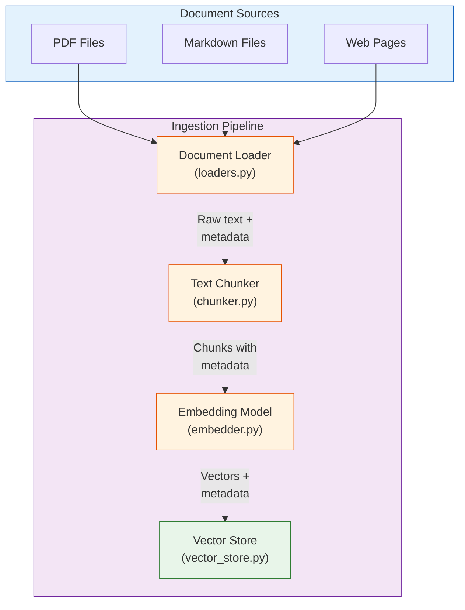
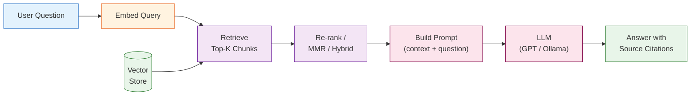
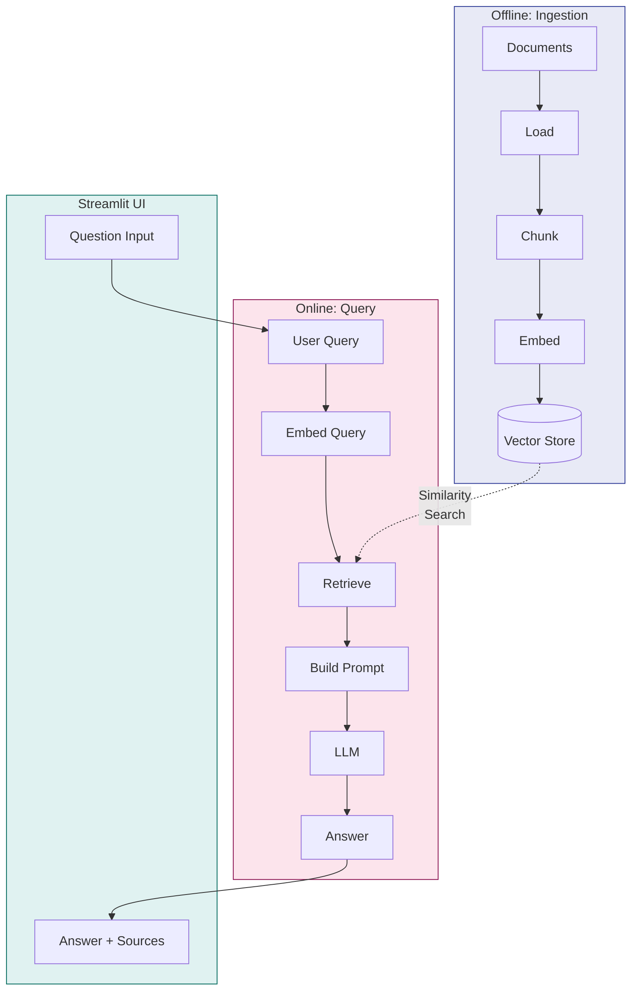
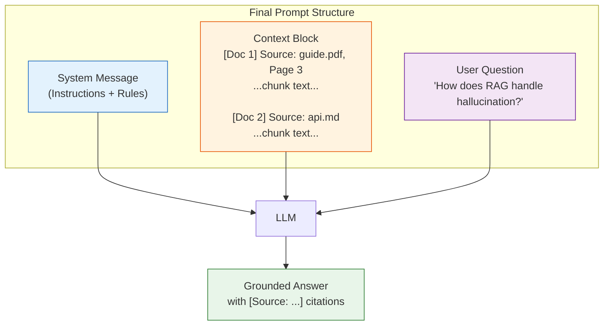

# RAG Deep Dive  Part 5: Building Your First RAG Pipeline from Scratch

---

**Series:** RAG (Retrieval-Augmented Generation)  A Developer's Deep Dive from Scratch to Production
**Part:** 5 of 9 (Hands-On Build)
**Audience:** Developers with Python experience who want to master RAG systems from the ground up
**Reading time:** ~55 minutes

---

## Table of Contents

1. [Recap of Parts 0–4](#recap-of-parts-04)
2. [Project Overview](#project-overview)
3. [Architecture Design](#architecture-design)
4. [Step 1: Document Ingestion Pipeline](#step-1-document-ingestion-pipeline)
5. [Step 2: Text Processing and Chunking](#step-2-text-processing-and-chunking)
6. [Step 3: Embedding Generation](#step-3-embedding-generation)
7. [Step 4: Vector Store Setup](#step-4-vector-store-setup)
8. [Step 5: Retrieval Implementation](#step-5-retrieval-implementation)
9. [Step 6: Prompt Engineering for RAG](#step-6-prompt-engineering-for-rag)
10. [Step 7: LLM Integration](#step-7-llm-integration)
11. [Step 8: Building the Complete Pipeline Class](#step-8-building-the-complete-pipeline-class)
12. [Step 9: Adding a Simple UI](#step-9-adding-a-simple-ui)
13. [Step 10: Testing Your Pipeline](#step-10-testing-your-pipeline)
14. [Complete Project Code](#complete-project-code)
15. [Common Issues and Fixes](#common-issues-and-fixes)
16. [Key Vocabulary](#key-vocabulary)
17. [What's Next  Part 6](#whats-next--part-6)

---

## Recap of Parts 0–4

Over the first five parts of this series (Parts 0 through 4), we have built a thorough understanding of every component that makes a RAG system work. Let us briefly recall what each part covered before we assemble them into a working pipeline.

**Part 0  Why RAG Exists** introduced the fundamental problem: large language models are powerful but their knowledge is frozen at training time, they hallucinate when they lack information, and fine-tuning is expensive. RAG solves this by giving an LLM access to external knowledge at inference time  retrieval first, then generation.

**Part 1  How Text Becomes Numbers** explored embeddings in depth. We learned how models like Sentence-BERT and OpenAI's `text-embedding-3-small` transform text into dense vectors in high-dimensional space, where semantic similarity maps to geometric proximity. We wrote embedding code from scratch, visualized vector spaces, and understood why embedding quality is the foundation of any RAG system.

**Part 2  Chunking Strategies** tackled the art and science of splitting documents into retrievable units. We implemented fixed-size chunking, recursive character splitting, semantic chunking, and document-structure-aware chunking. We learned that chunk size, overlap, and strategy directly determine retrieval quality  garbage chunks in, garbage answers out.

**Part 3  Vector Databases and Similarity Search** dove into how embeddings are stored, indexed, and searched. We explored brute-force search, Approximate Nearest Neighbor (ANN) algorithms like HNSW and IVF, and compared vector databases including ChromaDB, FAISS, Pinecone, Weaviate, and Qdrant. We understood the trade-offs between recall, latency, and memory.

**Part 4  Retrieval Strategies** covered the retrieval layer in depth: dense retrieval (vector search), sparse retrieval (BM25 / TF-IDF), hybrid retrieval (combining both), Maximal Marginal Relevance (MMR) for diversity, and re-ranking with cross-encoder models. We saw that retrieval is not a single step but a pipeline of increasing precision.

> **The key realization:** We now have all the individual pieces  embedding, chunking, vector storage, retrieval, and generation. What we have not done is wire them together into a functioning system. That changes today.

In this part, we build the complete RAG pipeline from scratch. Not a toy demo  a real, extensible system with multiple document loaders, configurable chunking, dual embedding support, two vector store backends, hybrid retrieval, prompt templates with citation support, streaming LLM integration, and a web UI. By the end, you will have a working codebase you can point at any document collection and start asking questions.

Let us begin.

---

## Project Overview

### What We Are Building

We are building a **document question-answering system**  a RAG pipeline that ingests a collection of documents (PDFs, Markdown files, web pages), processes them into searchable chunks, and answers natural language questions grounded in the document content.

Here is what the finished system will do:

1. **Ingest** documents from multiple formats (PDF, Markdown, HTML/web pages)
2. **Chunk** them intelligently with metadata preservation
3. **Embed** the chunks using either a free local model or the OpenAI API
4. **Store** the embeddings in a vector database (ChromaDB or FAISS)
5. **Retrieve** relevant chunks using similarity search, MMR, or hybrid BM25+vector search
6. **Generate** grounded answers with source citations using an LLM
7. **Present** everything through a clean Streamlit web interface

### Project Structure

```
rag_pipeline/
├── config.py              # Configuration and constants
├── loaders.py             # Document loading (PDF, Markdown, Web)
├── chunker.py             # Text chunking with metadata
├── embedder.py            # Embedding generation (local + OpenAI)
├── vector_store.py        # Vector store backends (ChromaDB, FAISS)
├── retriever.py           # Retrieval strategies (similarity, MMR, hybrid)
├── prompts.py             # Prompt templates for RAG
├── llm.py                 # LLM integration (OpenAI, Ollama)
├── pipeline.py            # Complete RAGPipeline class
├── app.py                 # Streamlit UI
├── test_pipeline.py       # Testing and evaluation
├── requirements.txt       # Dependencies
└── documents/             # Your document collection
    ├── sample.pdf
    ├── guide.md
    └── ...
```

### Dependencies

```txt
# requirements.txt
# Core
openai>=1.12.0
sentence-transformers>=2.5.0
chromadb>=0.4.22
faiss-cpu>=1.7.4
rank-bm25>=0.2.2

# Document loading
PyPDF2>=3.0.0
pymupdf>=1.23.0
beautifulsoup4>=4.12.0
requests>=2.31.0
markdown>=3.5.0

# UI
streamlit>=1.31.0

# Utilities
tiktoken>=0.6.0
numpy>=1.26.0
tqdm>=4.66.0
python-dotenv>=1.0.0
```

Install everything:

```bash
pip install openai sentence-transformers chromadb faiss-cpu rank-bm25 \
    PyPDF2 pymupdf beautifulsoup4 requests markdown tiktoken numpy tqdm \
    streamlit python-dotenv
```

> **Note on hardware:** The Sentence-Transformers model (`all-MiniLM-L6-v2`) runs comfortably on a CPU with 4GB of RAM. You do not need a GPU for this project. If you use the OpenAI embedding API instead, even the model download is unnecessary.

---

## Architecture Design

Before writing any code, let us visualize the full architecture. Understanding how data flows through the system will make every subsequent implementation decision clear.

### The Ingestion Pipeline (Offline)

The ingestion pipeline runs once (or whenever documents change). It transforms raw documents into searchable vector representations stored in a database.



### The Query Pipeline (Online)

The query pipeline runs every time a user asks a question. It retrieves relevant context and generates a grounded answer.



### Full System View



With the architecture clear, let us implement each component.

---

## Step 1: Document Ingestion Pipeline

The ingestion pipeline is the front door of your RAG system. It needs to handle multiple document formats reliably, extract clean text, and preserve metadata (source filename, page number, URL) that we will use later for citations.

### The Configuration Module

First, let us establish a shared configuration file that every module will import:

```python
"""
config.py
Central configuration for the RAG pipeline.
"""

import os
from pathlib import Path
from dotenv import load_dotenv

load_dotenv()

# --- Paths ---
PROJECT_ROOT = Path(__file__).parent
DOCUMENTS_DIR = PROJECT_ROOT / "documents"
VECTOR_STORE_DIR = PROJECT_ROOT / "vector_store_data"

# --- OpenAI ---
OPENAI_API_KEY = os.getenv("OPENAI_API_KEY", "")
OPENAI_EMBEDDING_MODEL = "text-embedding-3-small"
OPENAI_CHAT_MODEL = "gpt-4o-mini"

# --- Local Embedding Model ---
LOCAL_EMBEDDING_MODEL = "all-MiniLM-L6-v2"
EMBEDDING_DIMENSION = 384  # Dimension for all-MiniLM-L6-v2

# --- Chunking ---
CHUNK_SIZE = 512          # Target chunk size in characters
CHUNK_OVERLAP = 64        # Overlap between consecutive chunks
MIN_CHUNK_SIZE = 50       # Discard chunks smaller than this

# --- Retrieval ---
TOP_K = 5                 # Number of chunks to retrieve
MMR_LAMBDA = 0.7          # Diversity parameter for MMR (0=max diversity, 1=max relevance)
HYBRID_ALPHA = 0.7        # Weight for vector score in hybrid search (1-alpha for BM25)

# --- Vector Store ---
CHROMA_COLLECTION_NAME = "rag_documents"
```

### The Document Loader Module

Each document format requires its own loading logic. We abstract this behind a common interface: every loader returns a list of `Document` objects, each containing raw text and metadata.

```python
"""
loaders.py
Document loaders for PDF, Markdown, and web pages.
Each loader returns a list of Document objects with text and metadata.
"""

import re
from pathlib import Path
from dataclasses import dataclass, field
from typing import Optional

import fitz  # PyMuPDF  much better than PyPDF2 for complex PDFs
import markdown
import requests
from bs4 import BeautifulSoup


@dataclass
class Document:
    """
    A loaded document with its text content and metadata.
    This is the universal data structure that flows through the entire pipeline.
    """
    text: str
    metadata: dict = field(default_factory=dict)

    def __repr__(self):
        preview = self.text[:80].replace("\n", " ")
        return f"Document(text='{preview}...', metadata={self.metadata})"


class PDFLoader:
    """
    Loads PDF files using PyMuPDF (fitz).
    Returns one Document per page to preserve page-level metadata.
    """

    def load(self, file_path: str | Path) -> list[Document]:
        file_path = Path(file_path)
        if not file_path.exists():
            raise FileNotFoundError(f"PDF not found: {file_path}")

        documents = []
        pdf = fitz.open(str(file_path))

        for page_num in range(len(pdf)):
            page = pdf[page_num]
            text = page.get_text("text")  # Extract as plain text

            # Skip pages with negligible text (e.g., cover images)
            if len(text.strip()) < 20:
                continue

            # Clean up common PDF extraction artifacts
            text = self._clean_pdf_text(text)

            documents.append(Document(
                text=text,
                metadata={
                    "source": str(file_path),
                    "filename": file_path.name,
                    "page": page_num + 1,  # 1-indexed for human readability
                    "total_pages": len(pdf),
                    "format": "pdf",
                }
            ))

        pdf.close()
        print(f"  Loaded {len(documents)} pages from {file_path.name}")
        return documents

    def _clean_pdf_text(self, text: str) -> str:
        """Remove common PDF extraction artifacts."""
        # Fix hyphenated line breaks (e.g., "distribu-\nted" -> "distributed")
        text = re.sub(r"(\w)-\n(\w)", r"\1\2", text)
        # Collapse multiple newlines into double newlines (paragraph breaks)
        text = re.sub(r"\n{3,}", "\n\n", text)
        # Remove isolated page numbers
        text = re.sub(r"^\d+\s*$", "", text, flags=re.MULTILINE)
        return text.strip()


class MarkdownLoader:
    """
    Loads Markdown files, strips formatting to plain text,
    and preserves section headings as metadata.
    """

    def load(self, file_path: str | Path) -> list[Document]:
        file_path = Path(file_path)
        if not file_path.exists():
            raise FileNotFoundError(f"Markdown file not found: {file_path}")

        raw_text = file_path.read_text(encoding="utf-8")

        # Convert Markdown to HTML, then strip tags to get clean text
        html = markdown.markdown(raw_text, extensions=["tables", "fenced_code"])
        soup = BeautifulSoup(html, "html.parser")
        plain_text = soup.get_text(separator="\n")

        # Extract top-level heading if present
        title = ""
        title_match = re.match(r"^#\s+(.+)$", raw_text, re.MULTILINE)
        if title_match:
            title = title_match.group(1).strip()

        documents = [Document(
            text=plain_text.strip(),
            metadata={
                "source": str(file_path),
                "filename": file_path.name,
                "title": title,
                "format": "markdown",
            }
        )]

        print(f"  Loaded {len(plain_text)} chars from {file_path.name}")
        return documents


class WebLoader:
    """
    Loads web pages by fetching HTML and extracting main content.
    Strips navigation, headers, footers, and scripts.
    """

    def __init__(self, timeout: int = 15):
        self.timeout = timeout
        self.session = requests.Session()
        self.session.headers.update({
            "User-Agent": "RAGPipeline/1.0 (Educational Project)"
        })

    def load(self, url: str) -> list[Document]:
        try:
            response = self.session.get(url, timeout=self.timeout)
            response.raise_for_status()
        except requests.RequestException as e:
            raise ConnectionError(f"Failed to fetch {url}: {e}")

        soup = BeautifulSoup(response.text, "html.parser")

        # Remove non-content elements
        for tag in soup(["script", "style", "nav", "footer", "header",
                         "aside", "form", "iframe"]):
            tag.decompose()

        # Try to find the main content area
        main_content = (
            soup.find("main")
            or soup.find("article")
            or soup.find("div", {"role": "main"})
            or soup.find("div", class_=re.compile(r"content|article|post"))
            or soup.body
        )

        if main_content is None:
            raise ValueError(f"Could not extract content from {url}")

        text = main_content.get_text(separator="\n", strip=True)
        # Collapse excessive whitespace
        text = re.sub(r"\n{3,}", "\n\n", text)

        # Extract page title
        title_tag = soup.find("title")
        title = title_tag.get_text(strip=True) if title_tag else url

        documents = [Document(
            text=text,
            metadata={
                "source": url,
                "title": title,
                "format": "web",
            }
        )]

        print(f"  Loaded {len(text)} chars from {url}")
        return documents


class DocumentLoader:
    """
    Unified document loader that dispatches to the correct loader
    based on file extension or URL detection.
    """

    def __init__(self):
        self.pdf_loader = PDFLoader()
        self.md_loader = MarkdownLoader()
        self.web_loader = WebLoader()

    def load(self, source: str | Path) -> list[Document]:
        """Load a single document from a file path or URL."""
        source_str = str(source)

        if source_str.startswith(("http://", "https://")):
            return self.web_loader.load(source_str)

        path = Path(source_str)
        suffix = path.suffix.lower()

        if suffix == ".pdf":
            return self.pdf_loader.load(path)
        elif suffix in (".md", ".markdown"):
            return self.md_loader.load(path)
        elif suffix == ".txt":
            # Plain text  treat as simple document
            text = path.read_text(encoding="utf-8")
            return [Document(
                text=text,
                metadata={"source": str(path), "filename": path.name, "format": "txt"}
            )]
        else:
            raise ValueError(f"Unsupported file format: {suffix}")

    def load_directory(self, directory: str | Path,
                       extensions: Optional[list[str]] = None) -> list[Document]:
        """Load all supported documents from a directory."""
        directory = Path(directory)
        if not directory.is_dir():
            raise NotADirectoryError(f"Not a directory: {directory}")

        if extensions is None:
            extensions = [".pdf", ".md", ".markdown", ".txt"]

        all_documents = []
        files = sorted(f for f in directory.rglob("*") if f.suffix.lower() in extensions)

        print(f"Found {len(files)} files in {directory}")
        for file_path in files:
            try:
                docs = self.load(file_path)
                all_documents.extend(docs)
            except Exception as e:
                print(f"  WARNING: Failed to load {file_path.name}: {e}")

        print(f"Total: {len(all_documents)} documents loaded")
        return all_documents
```

### Testing the Loader

```python
# Quick test
if __name__ == "__main__":
    loader = DocumentLoader()

    # Load a single PDF
    docs = loader.load("documents/sample.pdf")
    for doc in docs[:3]:
        print(f"Page {doc.metadata['page']}: {doc.text[:100]}...")

    # Load a whole directory
    all_docs = loader.load_directory("documents/")
    print(f"Loaded {len(all_docs)} total documents")
```

> **Design decision:** Notice that `PDFLoader` returns one `Document` per page, while `MarkdownLoader` and `WebLoader` return one `Document` per file/URL. This is deliberate. PDFs have natural page boundaries that are useful for citation ("see page 42"), while Markdown and web content are better treated as continuous text that the chunker will split later.

---

## Step 2: Text Processing and Chunking

Raw documents are too large to embed and retrieve as whole units. We need to split them into chunks  small enough to be semantically focused, large enough to preserve context. We covered chunking strategies in depth in Part 2; now we implement the most practical approach: **recursive character splitting with overlap and metadata enrichment**.

### The Chunking Module

```python
"""
chunker.py
Text chunking with recursive splitting, overlap, and metadata enrichment.
"""

import re
import hashlib
from dataclasses import dataclass, field

from config import CHUNK_SIZE, CHUNK_OVERLAP, MIN_CHUNK_SIZE


@dataclass
class Chunk:
    """
    A text chunk with metadata for retrieval and citation.
    This is the atomic unit that gets embedded and stored.
    """
    text: str
    metadata: dict = field(default_factory=dict)
    chunk_id: str = ""

    def __post_init__(self):
        if not self.chunk_id:
            # Generate a deterministic ID from content + source
            content = self.text + str(self.metadata.get("source", ""))
            self.chunk_id = hashlib.md5(content.encode()).hexdigest()[:12]

    def __repr__(self):
        preview = self.text[:60].replace("\n", " ")
        return f"Chunk(id={self.chunk_id}, text='{preview}...', metadata={self.metadata})"


class RecursiveChunker:
    """
    Splits text recursively using a hierarchy of separators.

    The strategy:
    1. Try to split on paragraph breaks (double newlines)
    2. If chunks are still too large, split on single newlines
    3. If still too large, split on sentences (periods)
    4. Last resort: split on spaces (word boundaries)

    This preserves the most natural text boundaries possible.
    """

    def __init__(
        self,
        chunk_size: int = CHUNK_SIZE,
        chunk_overlap: int = CHUNK_OVERLAP,
        min_chunk_size: int = MIN_CHUNK_SIZE,
        separators: list[str] | None = None,
    ):
        self.chunk_size = chunk_size
        self.chunk_overlap = chunk_overlap
        self.min_chunk_size = min_chunk_size
        self.separators = separators or ["\n\n", "\n", ". ", " "]

    def chunk_documents(self, documents: list) -> list[Chunk]:
        """Chunk a list of Document objects, preserving and enriching metadata."""
        all_chunks = []

        for doc in documents:
            text = doc.text.strip()
            if len(text) < self.min_chunk_size:
                continue

            # Split the text into raw chunks
            raw_chunks = self._recursive_split(text, self.separators)

            # Apply overlap between consecutive chunks
            overlapped_chunks = self._apply_overlap(raw_chunks)

            # Wrap in Chunk objects with enriched metadata
            for i, chunk_text in enumerate(overlapped_chunks):
                if len(chunk_text.strip()) < self.min_chunk_size:
                    continue

                # Enrich metadata with chunk-specific information
                chunk_metadata = {
                    **doc.metadata,
                    "chunk_index": i,
                    "total_chunks": len(overlapped_chunks),
                    "char_count": len(chunk_text),
                }

                # Extract a heading if the chunk starts with one
                heading = self._extract_heading(chunk_text)
                if heading:
                    chunk_metadata["section_heading"] = heading

                all_chunks.append(Chunk(
                    text=chunk_text.strip(),
                    metadata=chunk_metadata,
                ))

        print(f"Created {len(all_chunks)} chunks from {len(documents)} documents")
        return all_chunks

    def _recursive_split(self, text: str, separators: list[str]) -> list[str]:
        """
        Recursively split text using the separator hierarchy.
        Each level tries to split on a coarser boundary first.
        """
        if len(text) <= self.chunk_size:
            return [text]

        # Try the first (most preferred) separator
        separator = separators[0]
        remaining_separators = separators[1:] if len(separators) > 1 else separators

        # Split the text on this separator
        parts = text.split(separator)

        chunks = []
        current_chunk = ""

        for part in parts:
            # If adding this part would exceed the limit
            candidate = current_chunk + separator + part if current_chunk else part

            if len(candidate) <= self.chunk_size:
                current_chunk = candidate
            else:
                # Save the current chunk if it has content
                if current_chunk:
                    chunks.append(current_chunk)

                # If this single part is still too large, split it with the
                # next separator in the hierarchy
                if len(part) > self.chunk_size and remaining_separators != separators:
                    sub_chunks = self._recursive_split(part, remaining_separators)
                    chunks.extend(sub_chunks)
                    current_chunk = ""
                else:
                    current_chunk = part

        if current_chunk:
            chunks.append(current_chunk)

        return chunks

    def _apply_overlap(self, chunks: list[str]) -> list[str]:
        """
        Add overlap between consecutive chunks.
        Each chunk gets the last `chunk_overlap` characters of the previous chunk
        prepended to it. This ensures that information at chunk boundaries
        is not lost during retrieval.
        """
        if self.chunk_overlap == 0 or len(chunks) <= 1:
            return chunks

        overlapped = [chunks[0]]  # First chunk has no previous overlap

        for i in range(1, len(chunks)):
            prev_chunk = chunks[i - 1]

            # Take the overlap from the end of the previous chunk,
            # but break at a word boundary
            overlap_text = prev_chunk[-self.chunk_overlap:]
            # Find the first space to avoid cutting mid-word
            space_idx = overlap_text.find(" ")
            if space_idx != -1:
                overlap_text = overlap_text[space_idx + 1:]

            overlapped.append(overlap_text + " " + chunks[i])

        return overlapped

    def _extract_heading(self, text: str) -> str:
        """Extract a Markdown heading from the start of a chunk, if present."""
        match = re.match(r"^(#{1,4})\s+(.+?)$", text, re.MULTILINE)
        if match:
            return match.group(2).strip()
        return ""


class MetadataEnricher:
    """
    Adds computed metadata fields to chunks after splitting.
    Metadata enrichment improves retrieval by giving the vector store
    additional filterable dimensions.
    """

    @staticmethod
    def enrich(chunks: list[Chunk]) -> list[Chunk]:
        """Add computed metadata to each chunk."""
        for chunk in chunks:
            text = chunk.text

            # Word count
            chunk.metadata["word_count"] = len(text.split())

            # Detect if the chunk contains code
            chunk.metadata["has_code"] = bool(
                re.search(r"```|def |class |import |function |const |var ", text)
            )

            # Detect if the chunk contains a table or list
            chunk.metadata["has_list"] = bool(
                re.search(r"^\s*[-*]\s|^\s*\d+\.\s", text, re.MULTILINE)
            )

            # Estimate information density (unique words / total words)
            words = text.lower().split()
            if words:
                chunk.metadata["lexical_diversity"] = round(
                    len(set(words)) / len(words), 3
                )

        return chunks
```

### Using the Chunker

```python
# Example usage
from loaders import DocumentLoader
from chunker import RecursiveChunker, MetadataEnricher

loader = DocumentLoader()
documents = loader.load_directory("documents/")

chunker = RecursiveChunker(chunk_size=512, chunk_overlap=64)
chunks = chunker.chunk_documents(documents)

# Enrich with computed metadata
chunks = MetadataEnricher.enrich(chunks)

# Inspect the results
for chunk in chunks[:3]:
    print(f"ID: {chunk.chunk_id}")
    print(f"Text: {chunk.text[:100]}...")
    print(f"Metadata: {chunk.metadata}")
    print("---")
```

Sample output:

```
ID: a3f8b2c1d4e5
Text: Retrieval-Augmented Generation (RAG) is an approach that combines the strengths of pre-trained...
Metadata: {'source': 'documents/rag_overview.pdf', 'filename': 'rag_overview.pdf',
           'page': 1, 'format': 'pdf', 'chunk_index': 0, 'total_chunks': 12,
           'char_count': 487, 'word_count': 72, 'has_code': False,
           'has_list': False, 'lexical_diversity': 0.847}
```

> **Why recursive splitting matters:** Consider a chunk boundary that falls in the middle of a sentence: "The vector database stores embeddings in a high-dimensional sp" / "ace where similar concepts are nearby." Neither chunk is useful on its own. Recursive splitting with sentence-level fallback prevents this  it tries paragraph breaks first, then line breaks, then sentence boundaries, and only splits mid-sentence as an absolute last resort.

---

## Step 3: Embedding Generation

Embeddings are the bridge between human-readable text and machine-searchable vectors. We provide two options: a **free local model** (Sentence-Transformers) for development and privacy-sensitive deployments, and the **OpenAI API** for production-grade quality.

### The Embedding Module

```python
"""
embedder.py
Embedding generation with local (Sentence-Transformers) and OpenAI backends.
Supports batch processing for efficiency.
"""

import numpy as np
from typing import Optional

from config import (
    OPENAI_API_KEY,
    OPENAI_EMBEDDING_MODEL,
    LOCAL_EMBEDDING_MODEL,
    EMBEDDING_DIMENSION,
)


class LocalEmbedder:
    """
    Generates embeddings using Sentence-Transformers (runs locally, no API key needed).
    Model: all-MiniLM-L6-v2  384-dimensional embeddings, ~80MB download.
    """

    def __init__(self, model_name: str = LOCAL_EMBEDDING_MODEL):
        from sentence_transformers import SentenceTransformer
        print(f"Loading local embedding model: {model_name}...")
        self.model = SentenceTransformer(model_name)
        self.dimension = self.model.get_sentence_embedding_dimension()
        print(f"  Model loaded. Embedding dimension: {self.dimension}")

    def embed_texts(self, texts: list[str], batch_size: int = 64) -> np.ndarray:
        """
        Embed a list of texts. Returns a numpy array of shape (n, dimension).
        Uses batching internally for memory efficiency on large datasets.
        """
        print(f"  Embedding {len(texts)} texts locally (batch_size={batch_size})...")
        embeddings = self.model.encode(
            texts,
            batch_size=batch_size,
            show_progress_bar=len(texts) > 100,
            normalize_embeddings=True,  # L2-normalize for cosine similarity
        )
        return np.array(embeddings, dtype=np.float32)

    def embed_query(self, query: str) -> np.ndarray:
        """Embed a single query string. Returns a 1D numpy array."""
        embedding = self.model.encode(
            [query],
            normalize_embeddings=True,
        )
        return np.array(embedding[0], dtype=np.float32)


class OpenAIEmbedder:
    """
    Generates embeddings using OpenAI's embedding API.
    Model: text-embedding-3-small  1536-dimensional embeddings.
    Requires OPENAI_API_KEY in environment or config.
    """

    def __init__(
        self,
        model: str = OPENAI_EMBEDDING_MODEL,
        api_key: Optional[str] = None,
    ):
        from openai import OpenAI
        self.client = OpenAI(api_key=api_key or OPENAI_API_KEY)
        self.model = model

        # Dimension depends on model
        self._dimension_map = {
            "text-embedding-3-small": 1536,
            "text-embedding-3-large": 3072,
            "text-embedding-ada-002": 1536,
        }
        self.dimension = self._dimension_map.get(model, 1536)
        print(f"OpenAI embedder initialized: {model} (dim={self.dimension})")

    def embed_texts(self, texts: list[str], batch_size: int = 100) -> np.ndarray:
        """
        Embed a list of texts using OpenAI API.
        Batches requests to stay within API limits (max 8191 tokens per text).
        """
        print(f"  Embedding {len(texts)} texts via OpenAI API...")
        all_embeddings = []

        for i in range(0, len(texts), batch_size):
            batch = texts[i:i + batch_size]

            # Truncate texts that are too long (OpenAI limit: 8191 tokens)
            batch = [t[:30000] for t in batch]  # Rough character limit

            response = self.client.embeddings.create(
                model=self.model,
                input=batch,
            )

            batch_embeddings = [item.embedding for item in response.data]
            all_embeddings.extend(batch_embeddings)

            if len(texts) > batch_size:
                print(f"    Batch {i // batch_size + 1}/"
                      f"{(len(texts) - 1) // batch_size + 1} complete")

        return np.array(all_embeddings, dtype=np.float32)

    def embed_query(self, query: str) -> np.ndarray:
        """Embed a single query string."""
        response = self.client.embeddings.create(
            model=self.model,
            input=[query],
        )
        return np.array(response.data[0].embedding, dtype=np.float32)


def get_embedder(use_openai: bool = False) -> LocalEmbedder | OpenAIEmbedder:
    """Factory function to get the appropriate embedder."""
    if use_openai:
        if not OPENAI_API_KEY:
            raise ValueError(
                "OPENAI_API_KEY not set. Set it in .env or environment variables."
            )
        return OpenAIEmbedder()
    return LocalEmbedder()
```

### Embedding Our Chunks

```python
from chunker import Chunk
from embedder import get_embedder

# Use local model (free, no API key)
embedder = get_embedder(use_openai=False)

# Extract texts from chunks
texts = [chunk.text for chunk in chunks]

# Generate embeddings  this is the most time-consuming step
embeddings = embedder.embed_texts(texts)

print(f"Generated {embeddings.shape[0]} embeddings of dimension {embeddings.shape[1]}")
# Output: Generated 847 embeddings of dimension 384
```

### Performance Comparison

| Property | all-MiniLM-L6-v2 (Local) | text-embedding-3-small (OpenAI) |
|---|---|---|
| **Dimension** | 384 | 1536 |
| **Speed (1000 chunks)** | ~5 seconds (CPU) | ~3 seconds (API) |
| **Cost** | Free | ~$0.02 per 1M tokens |
| **Quality (MTEB avg)** | 0.630 | 0.659 |
| **Privacy** | Data stays local | Data sent to OpenAI |
| **Offline capable** | Yes | No |
| **Max input length** | 256 tokens | 8191 tokens |

> **When to use which:** Use the local model for development, prototyping, and privacy-sensitive applications. Use OpenAI for production systems where retrieval quality is critical and you can afford the API cost. For most use cases, the local model performs surprisingly well  the gap is smaller than you might expect.

---

## Step 4: Vector Store Setup

With embeddings generated, we need a place to store them and search through them efficiently. We implement two backends: **ChromaDB** for simplicity and rapid prototyping, and **FAISS** for raw performance and control.

### The Vector Store Module

```python
"""
vector_store.py
Vector store backends for storing and searching embeddings.
Supports ChromaDB (simple) and FAISS (fast).
"""

import json
import pickle
from pathlib import Path
from abc import ABC, abstractmethod

import numpy as np

from config import (
    VECTOR_STORE_DIR,
    CHROMA_COLLECTION_NAME,
    EMBEDDING_DIMENSION,
)
from chunker import Chunk


class VectorStoreBase(ABC):
    """Abstract base class for vector store implementations."""

    @abstractmethod
    def add_chunks(self, chunks: list[Chunk], embeddings: np.ndarray) -> None:
        """Add chunks and their embeddings to the store."""
        pass

    @abstractmethod
    def search(self, query_embedding: np.ndarray, top_k: int = 5) -> list[dict]:
        """Search for the top-k most similar chunks."""
        pass

    @abstractmethod
    def count(self) -> int:
        """Return the number of stored chunks."""
        pass


class ChromaVectorStore(VectorStoreBase):
    """
    Vector store backed by ChromaDB.
    Pros: Simple API, built-in persistence, metadata filtering, no manual index management.
    Cons: Slower than FAISS for large datasets (>100K chunks).
    """

    def __init__(
        self,
        collection_name: str = CHROMA_COLLECTION_NAME,
        persist_directory: str | Path | None = None,
    ):
        import chromadb

        persist_dir = str(persist_directory or VECTOR_STORE_DIR / "chroma")
        Path(persist_dir).mkdir(parents=True, exist_ok=True)

        self.client = chromadb.PersistentClient(path=persist_dir)
        self.collection = self.client.get_or_create_collection(
            name=collection_name,
            metadata={"hnsw:space": "cosine"},  # Use cosine similarity
        )
        print(f"ChromaDB collection '{collection_name}': {self.collection.count()} existing docs")

    def add_chunks(self, chunks: list[Chunk], embeddings: np.ndarray) -> None:
        """Add chunks and embeddings to ChromaDB."""
        if len(chunks) == 0:
            return

        # ChromaDB requires string IDs, string/number metadata values
        ids = [chunk.chunk_id for chunk in chunks]
        documents = [chunk.text for chunk in chunks]
        metadatas = [self._sanitize_metadata(chunk.metadata) for chunk in chunks]

        # ChromaDB has a batch size limit, so we add in batches
        batch_size = 500
        for i in range(0, len(chunks), batch_size):
            end = min(i + batch_size, len(chunks))
            self.collection.add(
                ids=ids[i:end],
                embeddings=embeddings[i:end].tolist(),
                documents=documents[i:end],
                metadatas=metadatas[i:end],
            )

        print(f"  Added {len(chunks)} chunks to ChromaDB (total: {self.collection.count()})")

    def search(self, query_embedding: np.ndarray, top_k: int = 5) -> list[dict]:
        """Search ChromaDB for similar chunks."""
        results = self.collection.query(
            query_embeddings=[query_embedding.tolist()],
            n_results=top_k,
            include=["documents", "metadatas", "distances"],
        )

        # Convert ChromaDB results to our standard format
        search_results = []
        for i in range(len(results["ids"][0])):
            search_results.append({
                "chunk_id": results["ids"][0][i],
                "text": results["documents"][0][i],
                "metadata": results["metadatas"][0][i],
                "score": 1 - results["distances"][0][i],  # Convert distance to similarity
            })

        return search_results

    def count(self) -> int:
        return self.collection.count()

    def clear(self) -> None:
        """Delete all documents in the collection."""
        self.client.delete_collection(self.collection.name)
        self.collection = self.client.get_or_create_collection(
            name=self.collection.name,
            metadata={"hnsw:space": "cosine"},
        )

    @staticmethod
    def _sanitize_metadata(metadata: dict) -> dict:
        """ChromaDB only accepts str, int, float, or bool metadata values."""
        sanitized = {}
        for key, value in metadata.items():
            if isinstance(value, (str, int, float, bool)):
                sanitized[key] = value
            else:
                sanitized[key] = str(value)
        return sanitized


class FAISSVectorStore(VectorStoreBase):
    """
    Vector store backed by Facebook AI Similarity Search (FAISS).
    Pros: Extremely fast, supports GPU acceleration, mature and battle-tested.
    Cons: No built-in metadata storage (we handle it separately), no built-in persistence.
    """

    def __init__(
        self,
        dimension: int = EMBEDDING_DIMENSION,
        persist_directory: str | Path | None = None,
        use_ivf: bool = False,
    ):
        import faiss

        self.dimension = dimension
        self.persist_dir = Path(persist_directory or VECTOR_STORE_DIR / "faiss")
        self.persist_dir.mkdir(parents=True, exist_ok=True)

        self.use_ivf = use_ivf

        # Try to load existing index
        index_path = self.persist_dir / "index.faiss"
        meta_path = self.persist_dir / "metadata.pkl"

        if index_path.exists() and meta_path.exists():
            print("Loading existing FAISS index...")
            self.index = faiss.read_index(str(index_path))
            with open(meta_path, "rb") as f:
                self._metadata = pickle.load(f)
            print(f"  Loaded {self.index.ntotal} vectors")
        else:
            # Create a new index
            if use_ivf and dimension > 0:
                # IVF index for larger datasets (>10K chunks)
                # nlist = number of Voronoi cells (clusters)
                nlist = 100
                quantizer = faiss.IndexFlatIP(dimension)
                self.index = faiss.IndexIVFFlat(quantizer, dimension, nlist)
                print(f"Created FAISS IVF index (dim={dimension}, nlist={nlist})")
            else:
                # Flat index  exact search, best for <10K chunks
                self.index = faiss.IndexFlatIP(dimension)  # Inner product (cosine on normalized vecs)
                print(f"Created FAISS flat index (dim={dimension})")

            self._metadata: list[dict] = []

    def add_chunks(self, chunks: list[Chunk], embeddings: np.ndarray) -> None:
        """Add chunks and embeddings to FAISS."""
        if len(chunks) == 0:
            return

        # Normalize embeddings for cosine similarity via inner product
        faiss_module = __import__("faiss")
        faiss_module.normalize_L2(embeddings)

        # If using IVF and index is not yet trained, train it
        if self.use_ivf and not self.index.is_trained:
            print("  Training FAISS IVF index...")
            self.index.train(embeddings)

        self.index.add(embeddings)

        # Store metadata separately (FAISS does not support metadata natively)
        for chunk in chunks:
            self._metadata.append({
                "chunk_id": chunk.chunk_id,
                "text": chunk.text,
                "metadata": chunk.metadata,
            })

        self._save()
        print(f"  Added {len(chunks)} chunks to FAISS (total: {self.index.ntotal})")

    def search(self, query_embedding: np.ndarray, top_k: int = 5) -> list[dict]:
        """Search FAISS for similar chunks."""
        faiss_module = __import__("faiss")

        # Normalize query for cosine similarity
        query = query_embedding.reshape(1, -1).copy()
        faiss_module.normalize_L2(query)

        # If using IVF, set nprobe for search quality
        if self.use_ivf:
            self.index.nprobe = 10

        distances, indices = self.index.search(query, top_k)

        results = []
        for i, idx in enumerate(indices[0]):
            if idx == -1:  # FAISS returns -1 for missing results
                continue
            meta = self._metadata[idx]
            results.append({
                "chunk_id": meta["chunk_id"],
                "text": meta["text"],
                "metadata": meta["metadata"],
                "score": float(distances[0][i]),
            })

        return results

    def count(self) -> int:
        return self.index.ntotal

    def _save(self) -> None:
        """Persist the index and metadata to disk."""
        import faiss
        faiss.write_index(self.index, str(self.persist_dir / "index.faiss"))
        with open(self.persist_dir / "metadata.pkl", "wb") as f:
            pickle.dump(self._metadata, f)

    def clear(self) -> None:
        """Reset the index."""
        import faiss
        self.index = faiss.IndexFlatIP(self.dimension)
        self._metadata = []
        self._save()


def get_vector_store(
    backend: str = "chroma",
    dimension: int = EMBEDDING_DIMENSION,
) -> VectorStoreBase:
    """Factory function to get the appropriate vector store."""
    if backend == "chroma":
        return ChromaVectorStore()
    elif backend == "faiss":
        return FAISSVectorStore(dimension=dimension)
    else:
        raise ValueError(f"Unknown vector store backend: {backend}")
```

### ChromaDB vs FAISS  When to Use Which

| Feature | ChromaDB | FAISS |
|---|---|---|
| **Setup complexity** | One line | Requires metadata management |
| **Metadata filtering** | Built-in (`where` clause) | Manual implementation |
| **Persistence** | Built-in | Manual save/load |
| **Speed (10K chunks)** | ~15ms per query | ~2ms per query |
| **Speed (1M chunks)** | ~200ms per query | ~10ms per query |
| **GPU support** | No | Yes (faiss-gpu) |
| **Best for** | Prototyping, <50K chunks | Production, >50K chunks |

> **Recommendation:** Start with ChromaDB. It handles persistence, metadata filtering, and collection management out of the box. Switch to FAISS only when you have measured a performance bottleneck with ChromaDB, or when you need GPU-accelerated search at scale.

---

## Step 5: Retrieval Implementation

Retrieval is the heart of RAG. A brilliant LLM given the wrong context will produce confident, wrong answers. In Part 4 we studied multiple retrieval strategies; now we implement three of them: **similarity search** (the baseline), **Maximal Marginal Relevance** (for diversity), and **hybrid search** (combining vector and keyword-based retrieval).

### The Retrieval Module

```python
"""
retriever.py
Retrieval strategies: similarity search, MMR, and hybrid (BM25 + vector).
"""

import numpy as np
from rank_bm25 import BM25Okapi

from config import TOP_K, MMR_LAMBDA, HYBRID_ALPHA
from chunker import Chunk
from vector_store import VectorStoreBase


class Retriever:
    """
    Implements multiple retrieval strategies over a vector store.
    All methods return a list of result dicts with 'text', 'metadata', and 'score'.
    """

    def __init__(
        self,
        vector_store: VectorStoreBase,
        embedder,  # LocalEmbedder or OpenAIEmbedder
        chunks: list[Chunk] | None = None,
    ):
        self.vector_store = vector_store
        self.embedder = embedder

        # For hybrid search: build a BM25 index over chunk texts
        self._bm25_index = None
        self._bm25_chunks = None
        if chunks:
            self._build_bm25_index(chunks)

    def _build_bm25_index(self, chunks: list[Chunk]) -> None:
        """Build a BM25 keyword index for hybrid search."""
        self._bm25_chunks = chunks
        tokenized_corpus = [chunk.text.lower().split() for chunk in chunks]
        self._bm25_index = BM25Okapi(tokenized_corpus)
        print(f"  BM25 index built over {len(chunks)} chunks")

    # ------------------------------------------------------------------
    # Strategy 1: Basic Similarity Search
    # ------------------------------------------------------------------

    def similarity_search(self, query: str, top_k: int = TOP_K) -> list[dict]:
        """
        Standard vector similarity search.
        Embeds the query, finds the top-k nearest chunks in the vector store.
        """
        query_embedding = self.embedder.embed_query(query)
        results = self.vector_store.search(query_embedding, top_k=top_k)
        return results

    # ------------------------------------------------------------------
    # Strategy 2: Maximal Marginal Relevance (MMR)
    # ------------------------------------------------------------------

    def mmr_search(
        self,
        query: str,
        top_k: int = TOP_K,
        candidates_k: int = 20,
        lambda_param: float = MMR_LAMBDA,
    ) -> list[dict]:
        """
        Maximal Marginal Relevance search.

        MMR balances relevance and diversity:
        - Retrieve a larger candidate set (candidates_k)
        - Iteratively select chunks that are relevant to the query
          BUT dissimilar to already-selected chunks

        lambda_param controls the trade-off:
        - 1.0 = pure relevance (same as similarity search)
        - 0.0 = pure diversity (maximize difference from selected chunks)
        - 0.5-0.7 = good balance for most RAG applications
        """
        query_embedding = self.embedder.embed_query(query)

        # Get a larger candidate set
        candidates = self.vector_store.search(query_embedding, top_k=candidates_k)

        if not candidates:
            return []

        # Extract candidate embeddings (re-embed the candidate texts)
        candidate_texts = [c["text"] for c in candidates]
        candidate_embeddings = self.embedder.embed_texts(candidate_texts)

        # Normalize for cosine similarity
        query_norm = query_embedding / (np.linalg.norm(query_embedding) + 1e-10)
        cand_norms = candidate_embeddings / (
            np.linalg.norm(candidate_embeddings, axis=1, keepdims=True) + 1e-10
        )

        # Relevance scores: similarity between query and each candidate
        relevance_scores = cand_norms @ query_norm

        # Iteratively select chunks using MMR
        selected_indices = []
        remaining_indices = list(range(len(candidates)))

        for _ in range(min(top_k, len(candidates))):
            if not remaining_indices:
                break

            mmr_scores = []
            for idx in remaining_indices:
                # Relevance component
                relevance = relevance_scores[idx]

                # Diversity component: max similarity to any already-selected chunk
                if selected_indices:
                    selected_embeddings = cand_norms[selected_indices]
                    similarities = selected_embeddings @ cand_norms[idx]
                    max_similarity = float(np.max(similarities))
                else:
                    max_similarity = 0.0

                # MMR score = lambda * relevance - (1 - lambda) * max_similarity
                mmr_score = lambda_param * relevance - (1 - lambda_param) * max_similarity
                mmr_scores.append((idx, mmr_score))

            # Select the candidate with the highest MMR score
            best_idx, best_score = max(mmr_scores, key=lambda x: x[1])
            selected_indices.append(best_idx)
            remaining_indices.remove(best_idx)

        # Build results in selection order
        results = []
        for idx in selected_indices:
            result = candidates[idx].copy()
            result["score"] = float(relevance_scores[idx])
            results.append(result)

        return results

    # ------------------------------------------------------------------
    # Strategy 3: Hybrid Search (BM25 + Vector)
    # ------------------------------------------------------------------

    def hybrid_search(
        self,
        query: str,
        top_k: int = TOP_K,
        alpha: float = HYBRID_ALPHA,
    ) -> list[dict]:
        """
        Hybrid search combining vector similarity and BM25 keyword matching.

        alpha controls the blend:
        - 1.0 = pure vector search
        - 0.0 = pure BM25
        - 0.5-0.7 = good balance

        This excels when:
        - Queries contain specific technical terms or names
        - Documents have precise terminology that embeddings may under-weight
        - You need both semantic understanding AND keyword precision
        """
        if self._bm25_index is None:
            print("WARNING: BM25 index not built. Falling back to similarity search.")
            return self.similarity_search(query, top_k=top_k)

        # --- Vector search ---
        query_embedding = self.embedder.embed_query(query)
        vector_results = self.vector_store.search(query_embedding, top_k=top_k * 2)

        # --- BM25 keyword search ---
        tokenized_query = query.lower().split()
        bm25_scores = self._bm25_index.get_scores(tokenized_query)

        # Get top BM25 results
        bm25_top_indices = np.argsort(bm25_scores)[::-1][:top_k * 2]
        bm25_results = []
        for idx in bm25_top_indices:
            if bm25_scores[idx] > 0:
                chunk = self._bm25_chunks[idx]
                bm25_results.append({
                    "chunk_id": chunk.chunk_id,
                    "text": chunk.text,
                    "metadata": chunk.metadata,
                    "score": float(bm25_scores[idx]),
                })

        # --- Normalize scores to [0, 1] ---
        vector_scores = {r["chunk_id"]: r["score"] for r in vector_results}
        bm25_score_map = {r["chunk_id"]: r["score"] for r in bm25_results}

        # Min-max normalize each score set
        vector_scores = self._normalize_scores(vector_scores)
        bm25_score_map = self._normalize_scores(bm25_score_map)

        # --- Combine with weighted average ---
        all_chunk_ids = set(vector_scores.keys()) | set(bm25_score_map.keys())
        combined_scores = {}
        for chunk_id in all_chunk_ids:
            v_score = vector_scores.get(chunk_id, 0.0)
            b_score = bm25_score_map.get(chunk_id, 0.0)
            combined_scores[chunk_id] = alpha * v_score + (1 - alpha) * b_score

        # Sort by combined score
        sorted_ids = sorted(combined_scores, key=combined_scores.get, reverse=True)[:top_k]

        # Build result list
        all_results_map = {r["chunk_id"]: r for r in vector_results + bm25_results}
        results = []
        for chunk_id in sorted_ids:
            if chunk_id in all_results_map:
                result = all_results_map[chunk_id].copy()
                result["score"] = combined_scores[chunk_id]
                results.append(result)

        return results

    @staticmethod
    def _normalize_scores(scores: dict[str, float]) -> dict[str, float]:
        """Min-max normalize scores to [0, 1]."""
        if not scores:
            return scores
        values = list(scores.values())
        min_val = min(values)
        max_val = max(values)
        if max_val == min_val:
            return {k: 1.0 for k in scores}
        return {k: (v - min_val) / (max_val - min_val) for k, v in scores.items()}
```

### Using the Retriever

```python
from retriever import Retriever

retriever = Retriever(
    vector_store=vector_store,
    embedder=embedder,
    chunks=chunks,  # Needed for hybrid search BM25 index
)

query = "How does RAG handle hallucination?"

# Strategy 1: Basic similarity search
print("=== Similarity Search ===")
results = retriever.similarity_search(query, top_k=3)
for r in results:
    print(f"  Score: {r['score']:.4f} | {r['text'][:80]}...")

# Strategy 2: MMR (relevance + diversity)
print("\n=== MMR Search ===")
results = retriever.mmr_search(query, top_k=3, lambda_param=0.7)
for r in results:
    print(f"  Score: {r['score']:.4f} | {r['text'][:80]}...")

# Strategy 3: Hybrid (vector + BM25)
print("\n=== Hybrid Search ===")
results = retriever.hybrid_search(query, top_k=3, alpha=0.7)
for r in results:
    print(f"  Score: {r['score']:.4f} | {r['text'][:80]}...")
```

> **When to use which strategy:** Use basic similarity search when your documents are semantically homogeneous and your queries are natural language. Use MMR when you get redundant results (e.g., the top 5 chunks all say the same thing from slightly different parts of the document). Use hybrid search when your queries include specific technical terms, names, or identifiers that embeddings might not capture precisely  for example, "error code E4021" or "the Johnson patent."

---

## Step 6: Prompt Engineering for RAG

The prompt is where retrieval meets generation. A well-designed RAG prompt does four critical things: (1) instructs the LLM to use only the provided context, (2) injects the retrieved chunks clearly, (3) requests source citations, and (4) tells the model what to do when the context does not contain the answer.

### The Prompt Module

```python
"""
prompts.py
Prompt templates for RAG generation.
Includes system prompts, context formatting, and multiple template styles.
"""

from typing import Optional


class RAGPromptBuilder:
    """
    Builds prompts for RAG generation from retrieved context and user queries.
    Supports multiple template styles for different use cases.
    """

    # ------------------------------------------------------------------
    # Template 1: Standard Q&A with Citations
    # ------------------------------------------------------------------

    SYSTEM_PROMPT_STANDARD = """You are a helpful assistant that answers questions based on the provided context documents. Follow these rules strictly:

1. ONLY use information from the provided context to answer the question.
2. If the context does not contain enough information to answer the question, say "I don't have enough information in the provided documents to answer this question" and explain what information is missing.
3. When you use information from the context, cite the source using [Source: filename, page/section] format.
4. Be precise and factual. Do not add information beyond what the context provides.
5. If different sources provide conflicting information, acknowledge the conflict and present both views with their sources."""

    # ------------------------------------------------------------------
    # Template 2: Concise Answer (for chatbot-style responses)
    # ------------------------------------------------------------------

    SYSTEM_PROMPT_CONCISE = """You are a concise assistant. Answer the question using ONLY the provided context. Keep answers brief  ideally 1-3 sentences. If the context doesn't contain the answer, say "I don't have that information." Cite sources inline as [Source: filename]."""

    # ------------------------------------------------------------------
    # Template 3: Technical Documentation Assistant
    # ------------------------------------------------------------------

    SYSTEM_PROMPT_TECHNICAL = """You are a technical documentation assistant. Your job is to answer technical questions based on the provided documentation context. Follow these rules:

1. Answer using ONLY information from the provided context.
2. When relevant, include code examples or configuration snippets from the context.
3. Cite sources as [Source: filename, section].
4. If the context doesn't contain the answer, say "This isn't covered in the available documentation" and suggest what documentation might help.
5. Use technical terminology precisely as it appears in the source documents.
6. Structure longer answers with bullet points or numbered steps for clarity."""

    # ------------------------------------------------------------------
    # Template 4: Analytical / Reasoning
    # ------------------------------------------------------------------

    SYSTEM_PROMPT_ANALYTICAL = """You are an analytical assistant that synthesizes information from multiple sources. Based on the provided context:

1. Analyze the information across all provided sources.
2. Identify patterns, comparisons, or contradictions between sources.
3. Provide a well-reasoned answer that synthesizes the information.
4. Always cite which source supports each claim using [Source: filename] format.
5. If the context is insufficient, explain what additional information would be needed.
6. Distinguish between facts stated in the sources and your analytical inferences."""

    TEMPLATE_MAP = {
        "standard": SYSTEM_PROMPT_STANDARD,
        "concise": SYSTEM_PROMPT_CONCISE,
        "technical": SYSTEM_PROMPT_TECHNICAL,
        "analytical": SYSTEM_PROMPT_ANALYTICAL,
    }

    def __init__(self, template: str = "standard"):
        if template not in self.TEMPLATE_MAP:
            raise ValueError(
                f"Unknown template: {template}. "
                f"Available: {list(self.TEMPLATE_MAP.keys())}"
            )
        self.system_prompt = self.TEMPLATE_MAP[template]
        self.template_name = template

    def build_prompt(
        self,
        query: str,
        retrieved_chunks: list[dict],
        conversation_history: Optional[list[dict]] = None,
    ) -> list[dict]:
        """
        Build a complete prompt (list of messages) for the LLM.

        Args:
            query: The user's question
            retrieved_chunks: List of dicts with 'text', 'metadata', and 'score'
            conversation_history: Optional prior messages for multi-turn conversations

        Returns:
            List of message dicts in OpenAI chat format
        """
        # Format the retrieved context
        context_block = self._format_context(retrieved_chunks)

        # Build the user message with injected context
        user_message = f"""Context documents:
---
{context_block}
---

Question: {query}"""

        # Assemble messages
        messages = [{"role": "system", "content": self.system_prompt}]

        # Add conversation history if provided (for multi-turn)
        if conversation_history:
            messages.extend(conversation_history)

        messages.append({"role": "user", "content": user_message})

        return messages

    def _format_context(self, chunks: list[dict]) -> str:
        """
        Format retrieved chunks into a clear context block.
        Each chunk is labeled with its source for easy citation.
        """
        if not chunks:
            return "[No relevant documents found]"

        formatted_chunks = []
        for i, chunk in enumerate(chunks, 1):
            metadata = chunk.get("metadata", {})
            source = metadata.get("filename", metadata.get("source", "Unknown"))
            page = metadata.get("page", "")
            section = metadata.get("section_heading", "")
            score = chunk.get("score", 0)

            # Build source label
            source_parts = [f"Source: {source}"]
            if page:
                source_parts.append(f"Page {page}")
            if section:
                source_parts.append(f"Section: {section}")

            source_label = " | ".join(source_parts)

            formatted_chunks.append(
                f"[Document {i}] ({source_label}) (Relevance: {score:.2f})\n"
                f"{chunk['text']}"
            )

        return "\n\n".join(formatted_chunks)

    def build_no_context_response(self, query: str) -> list[dict]:
        """Build a prompt for when no relevant context was found."""
        messages = [
            {"role": "system", "content": self.system_prompt},
            {
                "role": "user",
                "content": (
                    f"Context documents:\n---\n"
                    f"[No relevant documents were found for this query]\n"
                    f"---\n\n"
                    f"Question: {query}"
                ),
            },
        ]
        return messages
```

### Context Injection Strategy Visualization



### Prompt Design Principles

Understanding why each element of the prompt template exists:

**1. "ONLY use information from the provided context"**  This is the single most important instruction. Without it, the LLM will happily fill gaps with its parametric knowledge (training data), which may be outdated or wrong. This instruction creates the **grounding constraint** that makes RAG trustworthy.

**2. Citation format `[Source: filename, page]`**  Explicit citation instructions serve two purposes: they give users verifiable references, and they force the LLM to mentally trace which context chunk supports each statement. This acts as an internal check against hallucination.

**3. "If the context does not contain enough information..."**  The "I don't know" instruction is critical. Without it, the LLM will attempt to answer every question, even when the retrieved context is irrelevant. A confident wrong answer is worse than an honest "I don't know."

**4. "If sources provide conflicting information..."**  Real document collections contain contradictions (outdated docs, different perspectives). The LLM needs explicit permission to surface conflicts rather than silently picking one version.

> **Pro tip:** Test your prompts with adversarial queries  questions that are related to your documents but are NOT answered by them. A good RAG prompt makes the LLM say "I don't have enough information" rather than confabulating an answer. This is the hardest thing to get right and the most important.

---

## Step 7: LLM Integration

The LLM is the generation engine  it takes the prompt (system instructions + context + query) and produces the final answer. We integrate two options: **OpenAI GPT** (cloud-based, high quality) and **Ollama** (local, private, free after setup).

### The LLM Module

```python
"""
llm.py
LLM integration for RAG generation.
Supports OpenAI GPT and Ollama (local open-source models).
"""

from typing import Generator, Optional

from config import OPENAI_API_KEY, OPENAI_CHAT_MODEL


class OpenAILLM:
    """
    LLM backend using OpenAI's chat completion API.
    Supports both standard and streaming responses.
    """

    def __init__(
        self,
        model: str = OPENAI_CHAT_MODEL,
        api_key: Optional[str] = None,
        temperature: float = 0.1,
        max_tokens: int = 1500,
    ):
        from openai import OpenAI
        self.client = OpenAI(api_key=api_key or OPENAI_API_KEY)
        self.model = model
        self.temperature = temperature
        self.max_tokens = max_tokens
        print(f"OpenAI LLM initialized: {model}")

    def generate(self, messages: list[dict]) -> str:
        """Generate a complete response (non-streaming)."""
        response = self.client.chat.completions.create(
            model=self.model,
            messages=messages,
            temperature=self.temperature,
            max_tokens=self.max_tokens,
        )
        return response.choices[0].message.content

    def generate_stream(self, messages: list[dict]) -> Generator[str, None, None]:
        """Generate a streaming response, yielding tokens as they arrive."""
        stream = self.client.chat.completions.create(
            model=self.model,
            messages=messages,
            temperature=self.temperature,
            max_tokens=self.max_tokens,
            stream=True,
        )
        for chunk in stream:
            if chunk.choices[0].delta.content:
                yield chunk.choices[0].delta.content


class OllamaLLM:
    """
    LLM backend using Ollama (local, open-source models).
    Requires Ollama to be installed and running: https://ollama.ai

    Popular models:
    - llama3.1:8b  Good balance of quality and speed
    - mistral:7b  Fast, solid quality
    - gemma2:9b  Strong reasoning
    - phi3:mini  Smallest, fastest
    """

    def __init__(
        self,
        model: str = "llama3.1:8b",
        base_url: str = "http://localhost:11434",
        temperature: float = 0.1,
        max_tokens: int = 1500,
    ):
        import requests
        self.model = model
        self.base_url = base_url
        self.temperature = temperature
        self.max_tokens = max_tokens

        # Verify Ollama is running
        try:
            resp = requests.get(f"{base_url}/api/tags", timeout=5)
            resp.raise_for_status()
            models = [m["name"] for m in resp.json().get("models", [])]
            if model not in models and f"{model}:latest" not in models:
                print(f"WARNING: Model '{model}' not found. Available: {models}")
                print(f"  Run: ollama pull {model}")
        except requests.ConnectionError:
            raise ConnectionError(
                "Ollama is not running. Start it with: ollama serve"
            )
        print(f"Ollama LLM initialized: {model}")

    def generate(self, messages: list[dict]) -> str:
        """Generate a complete response using Ollama's chat API."""
        import requests
        response = requests.post(
            f"{self.base_url}/api/chat",
            json={
                "model": self.model,
                "messages": messages,
                "stream": False,
                "options": {
                    "temperature": self.temperature,
                    "num_predict": self.max_tokens,
                },
            },
            timeout=120,
        )
        response.raise_for_status()
        return response.json()["message"]["content"]

    def generate_stream(self, messages: list[dict]) -> Generator[str, None, None]:
        """Generate a streaming response from Ollama."""
        import requests
        import json as json_module

        response = requests.post(
            f"{self.base_url}/api/chat",
            json={
                "model": self.model,
                "messages": messages,
                "stream": True,
                "options": {
                    "temperature": self.temperature,
                    "num_predict": self.max_tokens,
                },
            },
            stream=True,
            timeout=120,
        )
        response.raise_for_status()

        for line in response.iter_lines():
            if line:
                data = json_module.loads(line)
                if "message" in data and "content" in data["message"]:
                    token = data["message"]["content"]
                    if token:
                        yield token


class HuggingFaceLLM:
    """
    LLM backend using HuggingFace Transformers (fully local).
    Requires a GPU for reasonable performance with larger models.

    Good models for RAG:
    - microsoft/Phi-3-mini-4k-instruct  (3.8B params, fast)
    - mistralai/Mistral-7B-Instruct-v0.3
    - meta-llama/Meta-Llama-3.1-8B-Instruct (requires access request)
    """

    def __init__(
        self,
        model_name: str = "microsoft/Phi-3-mini-4k-instruct",
        temperature: float = 0.1,
        max_tokens: int = 1500,
        device: str = "auto",
    ):
        from transformers import AutoTokenizer, AutoModelForCausalLM, pipeline
        import torch

        print(f"Loading HuggingFace model: {model_name}...")
        self.tokenizer = AutoTokenizer.from_pretrained(model_name)
        self.model = AutoModelForCausalLM.from_pretrained(
            model_name,
            torch_dtype=torch.float16 if torch.cuda.is_available() else torch.float32,
            device_map=device,
        )
        self.pipe = pipeline(
            "text-generation",
            model=self.model,
            tokenizer=self.tokenizer,
        )
        self.temperature = temperature
        self.max_tokens = max_tokens
        print(f"  Model loaded on {self.model.device}")

    def generate(self, messages: list[dict]) -> str:
        """Generate using the HuggingFace pipeline."""
        # Convert messages to the model's chat template
        prompt = self.tokenizer.apply_chat_template(
            messages, tokenize=False, add_generation_prompt=True
        )

        outputs = self.pipe(
            prompt,
            max_new_tokens=self.max_tokens,
            temperature=self.temperature,
            do_sample=self.temperature > 0,
            return_full_text=False,
        )
        return outputs[0]["generated_text"]

    def generate_stream(self, messages: list[dict]) -> Generator[str, None, None]:
        """
        HuggingFace streaming via TextIteratorStreamer.
        """
        from transformers import TextIteratorStreamer
        import threading

        prompt = self.tokenizer.apply_chat_template(
            messages, tokenize=False, add_generation_prompt=True
        )
        inputs = self.tokenizer(prompt, return_tensors="pt").to(self.model.device)

        streamer = TextIteratorStreamer(
            self.tokenizer, skip_prompt=True, skip_special_tokens=True
        )

        generation_kwargs = {
            **inputs,
            "max_new_tokens": self.max_tokens,
            "temperature": self.temperature,
            "do_sample": self.temperature > 0,
            "streamer": streamer,
        }

        thread = threading.Thread(target=self.model.generate, kwargs=generation_kwargs)
        thread.start()

        for token in streamer:
            yield token

        thread.join()


def get_llm(backend: str = "openai", **kwargs):
    """Factory function to get the appropriate LLM backend."""
    if backend == "openai":
        return OpenAILLM(**kwargs)
    elif backend == "ollama":
        return OllamaLLM(**kwargs)
    elif backend == "huggingface":
        return HuggingFaceLLM(**kwargs)
    else:
        raise ValueError(f"Unknown LLM backend: {backend}")
```

### Quick Test

```python
from llm import get_llm

# Using OpenAI
llm = get_llm("openai")
response = llm.generate([
    {"role": "system", "content": "You are a helpful assistant."},
    {"role": "user", "content": "What is RAG in one sentence?"},
])
print(response)

# Streaming
for token in llm.generate_stream([
    {"role": "system", "content": "You are a helpful assistant."},
    {"role": "user", "content": "What is RAG in one sentence?"},
]):
    print(token, end="", flush=True)
```

---

## Step 8: Building the Complete Pipeline Class

Now we combine every component into a single, clean `RAGPipeline` class. This is the orchestrator  it manages the flow from document ingestion through to answer generation.

### The Pipeline Module

```python
"""
pipeline.py
The complete RAG pipeline  ingestion, retrieval, and generation in one class.
"""

import time
from pathlib import Path
from typing import Optional, Generator

from config import (
    CHUNK_SIZE, CHUNK_OVERLAP, TOP_K, DOCUMENTS_DIR,
)
from loaders import DocumentLoader, Document
from chunker import RecursiveChunker, MetadataEnricher, Chunk
from embedder import get_embedder, LocalEmbedder, OpenAIEmbedder
from vector_store import get_vector_store, VectorStoreBase
from retriever import Retriever
from prompts import RAGPromptBuilder
from llm import get_llm


class RAGPipeline:
    """
    Complete RAG pipeline that combines document ingestion, chunking,
    embedding, vector storage, retrieval, prompt building, and LLM generation.

    Usage:
        pipeline = RAGPipeline()
        pipeline.ingest("documents/")
        answer = pipeline.query("What is RAG?")
        print(answer["response"])
    """

    def __init__(
        self,
        embedding_backend: str = "local",     # "local" or "openai"
        vector_store_backend: str = "chroma",  # "chroma" or "faiss"
        llm_backend: str = "openai",           # "openai", "ollama", or "huggingface"
        retrieval_strategy: str = "similarity", # "similarity", "mmr", or "hybrid"
        prompt_template: str = "standard",     # "standard", "concise", "technical", "analytical"
        chunk_size: int = CHUNK_SIZE,
        chunk_overlap: int = CHUNK_OVERLAP,
        top_k: int = TOP_K,
        llm_kwargs: Optional[dict] = None,
    ):
        print("=" * 60)
        print("Initializing RAG Pipeline")
        print("=" * 60)

        # Store configuration
        self.retrieval_strategy = retrieval_strategy
        self.top_k = top_k
        self._chunks: list[Chunk] = []
        self._conversation_history: list[dict] = []

        # Initialize components
        print("\n[1/5] Setting up embedder...")
        use_openai_embed = embedding_backend == "openai"
        self.embedder = get_embedder(use_openai=use_openai_embed)

        print("\n[2/5] Setting up vector store...")
        dimension = self.embedder.dimension
        self.vector_store = get_vector_store(
            backend=vector_store_backend,
            dimension=dimension,
        )

        print("\n[3/5] Setting up chunker...")
        self.chunker = RecursiveChunker(
            chunk_size=chunk_size,
            chunk_overlap=chunk_overlap,
        )

        print("\n[4/5] Setting up LLM...")
        self.llm = get_llm(llm_backend, **(llm_kwargs or {}))

        print("\n[5/5] Setting up prompt builder...")
        self.prompt_builder = RAGPromptBuilder(template=prompt_template)

        # Retriever will be initialized after ingestion
        self.retriever: Optional[Retriever] = None

        print("\n" + "=" * 60)
        print("RAG Pipeline initialized successfully")
        print(f"  Embedding:  {embedding_backend} (dim={dimension})")
        print(f"  Store:      {vector_store_backend}")
        print(f"  LLM:        {llm_backend}")
        print(f"  Retrieval:  {retrieval_strategy}")
        print(f"  Prompt:     {prompt_template}")
        print(f"  Chunk size: {chunk_size} (overlap: {chunk_overlap})")
        print(f"  Top-K:      {top_k}")
        print("=" * 60)

    # ------------------------------------------------------------------
    # Ingestion
    # ------------------------------------------------------------------

    def ingest(
        self,
        source: str | Path | list[str],
        clear_existing: bool = False,
    ) -> dict:
        """
        Ingest documents into the pipeline.

        Args:
            source: A file path, directory path, URL, or list of any of these
            clear_existing: If True, clear the vector store before ingesting

        Returns:
            Dict with ingestion statistics
        """
        start_time = time.time()
        print("\n--- Starting Ingestion ---")

        if clear_existing:
            print("Clearing existing vector store...")
            self.vector_store.clear()
            self._chunks = []

        # Step 1: Load documents
        print("\n[Ingest 1/4] Loading documents...")
        loader = DocumentLoader()
        documents = []

        if isinstance(source, list):
            for s in source:
                try:
                    docs = loader.load(s)
                    documents.extend(docs)
                except Exception as e:
                    print(f"  WARNING: Failed to load {s}: {e}")
        else:
            source_path = Path(source)
            if source_path.is_dir():
                documents = loader.load_directory(source_path)
            else:
                documents = loader.load(source)

        if not documents:
            print("WARNING: No documents loaded!")
            return {"documents": 0, "chunks": 0, "time": 0}

        # Step 2: Chunk documents
        print(f"\n[Ingest 2/4] Chunking {len(documents)} documents...")
        chunks = self.chunker.chunk_documents(documents)
        chunks = MetadataEnricher.enrich(chunks)
        self._chunks.extend(chunks)

        # Step 3: Generate embeddings
        print(f"\n[Ingest 3/4] Generating embeddings for {len(chunks)} chunks...")
        texts = [chunk.text for chunk in chunks]
        embeddings = self.embedder.embed_texts(texts)

        # Step 4: Store in vector database
        print(f"\n[Ingest 4/4] Storing in vector database...")
        self.vector_store.add_chunks(chunks, embeddings)

        # Initialize retriever with updated chunks
        self.retriever = Retriever(
            vector_store=self.vector_store,
            embedder=self.embedder,
            chunks=self._chunks,
        )

        elapsed = time.time() - start_time
        stats = {
            "documents": len(documents),
            "chunks": len(chunks),
            "embeddings_shape": embeddings.shape,
            "vector_store_total": self.vector_store.count(),
            "time_seconds": round(elapsed, 2),
        }

        print(f"\n--- Ingestion Complete ---")
        print(f"  Documents loaded: {stats['documents']}")
        print(f"  Chunks created:   {stats['chunks']}")
        print(f"  Vector store:     {stats['vector_store_total']} total entries")
        print(f"  Time:             {stats['time_seconds']}s")

        return stats

    # ------------------------------------------------------------------
    # Query
    # ------------------------------------------------------------------

    def query(
        self,
        question: str,
        top_k: Optional[int] = None,
        strategy: Optional[str] = None,
        include_sources: bool = True,
    ) -> dict:
        """
        Query the RAG pipeline with a question.

        Args:
            question: The user's question
            top_k: Override default top_k for this query
            strategy: Override default retrieval strategy for this query
            include_sources: Whether to include source chunks in response

        Returns:
            Dict with 'response', 'sources', and 'metadata'
        """
        if self.retriever is None:
            return {
                "response": "No documents have been ingested yet. "
                            "Call pipeline.ingest() first.",
                "sources": [],
                "metadata": {},
            }

        start_time = time.time()
        k = top_k or self.top_k
        strat = strategy or self.retrieval_strategy

        # Step 1: Retrieve relevant chunks
        if strat == "mmr":
            retrieved = self.retriever.mmr_search(question, top_k=k)
        elif strat == "hybrid":
            retrieved = self.retriever.hybrid_search(question, top_k=k)
        else:
            retrieved = self.retriever.similarity_search(question, top_k=k)

        # Step 2: Build prompt
        if retrieved:
            messages = self.prompt_builder.build_prompt(
                query=question,
                retrieved_chunks=retrieved,
                conversation_history=self._conversation_history[-6:],  # Last 3 turns
            )
        else:
            messages = self.prompt_builder.build_no_context_response(question)

        # Step 3: Generate response
        response_text = self.llm.generate(messages)

        # Step 4: Update conversation history
        self._conversation_history.append({"role": "user", "content": question})
        self._conversation_history.append({"role": "assistant", "content": response_text})

        # Keep conversation history manageable
        if len(self._conversation_history) > 20:
            self._conversation_history = self._conversation_history[-10:]

        elapsed = time.time() - start_time

        result = {
            "response": response_text,
            "sources": [],
            "metadata": {
                "strategy": strat,
                "top_k": k,
                "chunks_retrieved": len(retrieved),
                "time_seconds": round(elapsed, 2),
            },
        }

        if include_sources:
            result["sources"] = [
                {
                    "text": r["text"][:200] + "..." if len(r["text"]) > 200 else r["text"],
                    "score": round(r["score"], 4),
                    "source": r["metadata"].get("filename", r["metadata"].get("source", "Unknown")),
                    "page": r["metadata"].get("page", ""),
                }
                for r in retrieved
            ]

        return result

    def query_stream(
        self,
        question: str,
        top_k: Optional[int] = None,
        strategy: Optional[str] = None,
    ) -> Generator[str, None, None]:
        """
        Query with streaming response  yields tokens as they are generated.
        Useful for real-time UI updates.
        """
        if self.retriever is None:
            yield "No documents have been ingested yet."
            return

        k = top_k or self.top_k
        strat = strategy or self.retrieval_strategy

        # Retrieve
        if strat == "mmr":
            retrieved = self.retriever.mmr_search(question, top_k=k)
        elif strat == "hybrid":
            retrieved = self.retriever.hybrid_search(question, top_k=k)
        else:
            retrieved = self.retriever.similarity_search(question, top_k=k)

        # Build prompt
        messages = self.prompt_builder.build_prompt(
            query=question,
            retrieved_chunks=retrieved,
        )

        # Stream response
        full_response = ""
        for token in self.llm.generate_stream(messages):
            full_response += token
            yield token

        # Update conversation history
        self._conversation_history.append({"role": "user", "content": question})
        self._conversation_history.append({"role": "assistant", "content": full_response})

    # ------------------------------------------------------------------
    # Utilities
    # ------------------------------------------------------------------

    def clear_history(self) -> None:
        """Clear conversation history."""
        self._conversation_history = []
        print("Conversation history cleared.")

    def get_stats(self) -> dict:
        """Get pipeline statistics."""
        return {
            "total_chunks": len(self._chunks),
            "vector_store_entries": self.vector_store.count(),
            "conversation_turns": len(self._conversation_history) // 2,
            "retrieval_strategy": self.retrieval_strategy,
        }
```

### Using the Complete Pipeline

```python
"""
example_usage.py
Demonstrates the complete RAG pipeline end-to-end.
"""

from pipeline import RAGPipeline

# --- Configuration ---
# Option A: Free local setup (no API keys needed for embedding, but needs OpenAI for LLM)
pipeline = RAGPipeline(
    embedding_backend="local",       # Free Sentence-Transformers
    vector_store_backend="chroma",   # Simple ChromaDB
    llm_backend="openai",           # OpenAI GPT-4o-mini
    retrieval_strategy="hybrid",    # Best of both worlds
    prompt_template="standard",     # Standard Q&A with citations
    chunk_size=512,
    chunk_overlap=64,
    top_k=5,
)

# Option B: Fully free local setup (requires Ollama running)
# pipeline = RAGPipeline(
#     embedding_backend="local",
#     vector_store_backend="chroma",
#     llm_backend="ollama",
#     llm_kwargs={"model": "llama3.1:8b"},
#     retrieval_strategy="hybrid",
#     prompt_template="standard",
# )

# --- Ingest documents ---
stats = pipeline.ingest("documents/")
print(f"\nIngested: {stats}")

# --- Ask questions ---
result = pipeline.query("What is retrieval-augmented generation?")
print(f"\nAnswer: {result['response']}")
print(f"\nSources:")
for source in result["sources"]:
    print(f"  - {source['source']} (page {source['page']})  score: {source['score']}")

# --- Multi-turn conversation ---
result2 = pipeline.query("Can you explain more about the retrieval step?")
print(f"\nFollow-up: {result2['response']}")

# --- Compare retrieval strategies ---
for strategy in ["similarity", "mmr", "hybrid"]:
    result = pipeline.query(
        "How do embeddings work?",
        strategy=strategy,
    )
    print(f"\n[{strategy}] Time: {result['metadata']['time_seconds']}s")
    print(f"  Answer preview: {result['response'][:100]}...")
```

---

## Step 9: Adding a Simple UI

A command-line interface is fine for development, but a proper UI makes the pipeline usable by non-developers and makes testing dramatically more pleasant. We use **Streamlit**  it is the fastest path from Python script to web app.

### The Streamlit App

```python
"""
app.py
Streamlit web interface for the RAG pipeline.
Run with: streamlit run app.py
"""

import streamlit as st
from pathlib import Path
from pipeline import RAGPipeline


# --- Page Configuration ---
st.set_page_config(
    page_title="RAG Pipeline",
    page_icon="📚",
    layout="wide",
)

st.title("RAG Document Q&A")
st.caption("Ask questions about your documents using Retrieval-Augmented Generation")


# --- Sidebar: Configuration ---
with st.sidebar:
    st.header("Configuration")

    embedding_backend = st.selectbox(
        "Embedding Model",
        ["local", "openai"],
        index=0,
        help="'local' uses all-MiniLM-L6-v2 (free). 'openai' uses text-embedding-3-small.",
    )

    vector_store_backend = st.selectbox(
        "Vector Store",
        ["chroma", "faiss"],
        index=0,
    )

    llm_backend = st.selectbox(
        "LLM Backend",
        ["openai", "ollama"],
        index=0,
    )

    if llm_backend == "ollama":
        ollama_model = st.text_input("Ollama Model", value="llama3.1:8b")

    retrieval_strategy = st.selectbox(
        "Retrieval Strategy",
        ["similarity", "mmr", "hybrid"],
        index=2,
        help="'hybrid' combines vector search with BM25 keyword matching.",
    )

    prompt_template = st.selectbox(
        "Prompt Style",
        ["standard", "concise", "technical", "analytical"],
        index=0,
    )

    top_k = st.slider("Top-K Results", min_value=1, max_value=20, value=5)
    chunk_size = st.slider("Chunk Size", min_value=128, max_value=2048, value=512, step=64)

    st.divider()
    st.header("Document Ingestion")

    doc_source = st.text_input(
        "Document path or URL",
        value="documents/",
        help="Enter a file path, directory path, or URL",
    )

    if st.button("Ingest Documents", type="primary"):
        with st.spinner("Ingesting documents..."):
            try:
                # Initialize pipeline with current settings
                llm_kwargs = {}
                if llm_backend == "ollama":
                    llm_kwargs["model"] = ollama_model

                pipeline = RAGPipeline(
                    embedding_backend=embedding_backend,
                    vector_store_backend=vector_store_backend,
                    llm_backend=llm_backend,
                    retrieval_strategy=retrieval_strategy,
                    prompt_template=prompt_template,
                    chunk_size=chunk_size,
                    top_k=top_k,
                    llm_kwargs=llm_kwargs if llm_kwargs else None,
                )
                stats = pipeline.ingest(doc_source)
                st.session_state.pipeline = pipeline
                st.session_state.stats = stats
                st.success(
                    f"Ingested {stats['documents']} documents, "
                    f"{stats['chunks']} chunks in {stats['time_seconds']}s"
                )
            except Exception as e:
                st.error(f"Ingestion failed: {e}")

    # Show stats if available
    if "stats" in st.session_state:
        stats = st.session_state.stats
        st.metric("Documents", stats["documents"])
        st.metric("Chunks", stats["chunks"])
        st.metric("Vector Store Size", stats["vector_store_total"])


# --- Main Area: Chat Interface ---
if "messages" not in st.session_state:
    st.session_state.messages = []

# Display chat history
for message in st.session_state.messages:
    with st.chat_message(message["role"]):
        st.markdown(message["content"])
        if "sources" in message:
            with st.expander("View Sources"):
                for src in message["sources"]:
                    st.markdown(
                        f"**{src['source']}** (page {src['page']})  "
                        f"relevance: {src['score']}"
                    )
                    st.text(src["text"])
                    st.divider()

# Chat input
if prompt := st.chat_input("Ask a question about your documents..."):
    # Display user message
    st.session_state.messages.append({"role": "user", "content": prompt})
    with st.chat_message("user"):
        st.markdown(prompt)

    # Generate response
    if "pipeline" not in st.session_state:
        with st.chat_message("assistant"):
            st.warning("Please ingest documents first using the sidebar.")
    else:
        with st.chat_message("assistant"):
            with st.spinner("Thinking..."):
                pipeline = st.session_state.pipeline
                result = pipeline.query(prompt)

                st.markdown(result["response"])

                # Show sources in an expander
                if result["sources"]:
                    with st.expander("View Sources"):
                        for src in result["sources"]:
                            st.markdown(
                                f"**{src['source']}** (page {src['page']})  "
                                f"relevance: {src['score']}"
                            )
                            st.text(src["text"])
                            st.divider()

                # Store message with sources
                st.session_state.messages.append({
                    "role": "assistant",
                    "content": result["response"],
                    "sources": result["sources"],
                })

                # Show timing info
                meta = result["metadata"]
                st.caption(
                    f"Strategy: {meta['strategy']} | "
                    f"Chunks: {meta['chunks_retrieved']} | "
                    f"Time: {meta['time_seconds']}s"
                )
```

### Running the UI

```bash
# Start the Streamlit app
streamlit run app.py

# Opens in browser at http://localhost:8501
```

The UI provides:
- A sidebar for configuration (embedding model, vector store, LLM, retrieval strategy)
- A document ingestion button with progress feedback
- A chat interface with streaming responses
- Expandable source citation panels for each answer
- Metadata display (strategy used, number of chunks, response time)

---

## Step 10: Testing Your Pipeline

Building a pipeline is only half the job. You need to verify it works correctly, understand its failure modes, and measure its quality. This section provides a structured testing approach.

### The Test Module

```python
"""
test_pipeline.py
Testing and evaluation for the RAG pipeline.
Tests document loading, chunking, retrieval quality, and end-to-end responses.
"""

import time
import json
from pathlib import Path

from pipeline import RAGPipeline
from loaders import DocumentLoader
from chunker import RecursiveChunker, MetadataEnricher


def test_document_loading():
    """Test that documents load correctly from different formats."""
    print("\n=== Test: Document Loading ===")
    loader = DocumentLoader()

    # Test each format if files exist
    test_files = {
        "documents/sample.pdf": "pdf",
        "documents/guide.md": "markdown",
    }

    for filepath, fmt in test_files.items():
        path = Path(filepath)
        if path.exists():
            docs = loader.load(path)
            assert len(docs) > 0, f"No documents loaded from {filepath}"
            assert all(d.text.strip() for d in docs), f"Empty text in {filepath}"
            assert all(d.metadata.get("format") == fmt for d in docs), \
                f"Wrong format metadata for {filepath}"
            print(f"  PASS: {filepath} loaded {len(docs)} documents")
        else:
            print(f"  SKIP: {filepath} not found")


def test_chunking_consistency():
    """Test that chunking produces consistent, valid results."""
    print("\n=== Test: Chunking ===")

    # Create a test document with known content
    from loaders import Document
    test_doc = Document(
        text="This is paragraph one about machine learning. " * 20 + "\n\n" +
             "This is paragraph two about natural language processing. " * 20 + "\n\n" +
             "This is paragraph three about computer vision. " * 20,
        metadata={"source": "test", "format": "txt"},
    )

    chunker = RecursiveChunker(chunk_size=256, chunk_overlap=32)
    chunks = chunker.chunk_documents([test_doc])
    chunks = MetadataEnricher.enrich(chunks)

    assert len(chunks) > 1, "Document should produce multiple chunks"

    for chunk in chunks:
        assert len(chunk.text) > 0, "Chunk text should not be empty"
        assert chunk.chunk_id, "Chunk should have an ID"
        assert "chunk_index" in chunk.metadata, "Chunk should have index metadata"
        assert "word_count" in chunk.metadata, "Chunk should have word count metadata"

    print(f"  PASS: Created {len(chunks)} chunks from test document")
    print(f"  Chunk sizes: {[len(c.text) for c in chunks]}")


def test_retrieval_strategies():
    """Test that different retrieval strategies return results."""
    print("\n=== Test: Retrieval Strategies ===")

    pipeline = RAGPipeline(
        embedding_backend="local",
        vector_store_backend="chroma",
        llm_backend="openai",
        retrieval_strategy="similarity",
        chunk_size=256,
        top_k=3,
    )

    # Ingest test documents
    pipeline.ingest("documents/", clear_existing=True)

    test_query = "What is machine learning?"

    for strategy in ["similarity", "mmr", "hybrid"]:
        result = pipeline.query(test_query, strategy=strategy)
        assert result["response"], f"No response from {strategy} strategy"
        assert len(result["sources"]) > 0, f"No sources from {strategy} strategy"
        print(f"  PASS: {strategy} returned {len(result['sources'])} sources "
              f"in {result['metadata']['time_seconds']}s")


def test_no_context_handling():
    """Test that the pipeline handles unanswerable questions gracefully."""
    print("\n=== Test: No-Context Handling ===")

    pipeline = RAGPipeline(
        embedding_backend="local",
        vector_store_backend="chroma",
        llm_backend="openai",
        retrieval_strategy="similarity",
    )

    # Ingest a minimal document
    from loaders import Document
    from chunker import Chunk

    pipeline.ingest("documents/", clear_existing=True)

    # Ask something completely unrelated
    result = pipeline.query("What is the capital of Mars?")

    response_lower = result["response"].lower()
    # The response should indicate uncertainty
    has_uncertainty = any(phrase in response_lower for phrase in [
        "don't have", "not enough information", "no information",
        "doesn't contain", "not covered", "cannot find",
        "unable to find", "not mentioned",
    ])

    if has_uncertainty:
        print("  PASS: Pipeline correctly indicated lack of information")
    else:
        print(f"  WARN: Pipeline may have hallucinated. Response: {result['response'][:200]}")


def benchmark_pipeline():
    """Benchmark ingestion and query performance."""
    print("\n=== Benchmark: Pipeline Performance ===")

    pipeline = RAGPipeline(
        embedding_backend="local",
        vector_store_backend="chroma",
        llm_backend="openai",
        retrieval_strategy="similarity",
    )

    # Benchmark ingestion
    start = time.time()
    stats = pipeline.ingest("documents/", clear_existing=True)
    ingest_time = time.time() - start

    print(f"  Ingestion: {stats['chunks']} chunks in {ingest_time:.2f}s "
          f"({stats['chunks'] / max(ingest_time, 0.01):.0f} chunks/sec)")

    # Benchmark queries
    test_queries = [
        "What is the main topic of this document?",
        "How does the system handle errors?",
        "What are the key components?",
        "Explain the architecture.",
        "What are the limitations?",
    ]

    query_times = []
    for q in test_queries:
        start = time.time()
        result = pipeline.query(q)
        elapsed = time.time() - start
        query_times.append(elapsed)

    avg_time = sum(query_times) / len(query_times)
    print(f"  Query avg: {avg_time:.2f}s over {len(test_queries)} queries")
    print(f"  Query range: {min(query_times):.2f}s - {max(query_times):.2f}s")


def compare_retrieval_quality():
    """Compare how different strategies retrieve for the same query."""
    print("\n=== Compare: Retrieval Quality ===")

    pipeline = RAGPipeline(
        embedding_backend="local",
        vector_store_backend="chroma",
        llm_backend="openai",
        retrieval_strategy="similarity",
    )
    pipeline.ingest("documents/", clear_existing=True)

    query = "How does the system process data?"

    print(f"\n  Query: '{query}'\n")

    for strategy in ["similarity", "mmr", "hybrid"]:
        result = pipeline.query(query, strategy=strategy)
        print(f"  [{strategy.upper()}]")
        print(f"  Response: {result['response'][:150]}...")
        print(f"  Sources: {[s['source'] for s in result['sources']]}")
        print(f"  Scores:  {[s['score'] for s in result['sources']]}")
        print()


if __name__ == "__main__":
    print("RAG Pipeline Test Suite")
    print("=" * 60)

    test_document_loading()
    test_chunking_consistency()

    # These require API keys and documents
    try:
        test_retrieval_strategies()
        test_no_context_handling()
        benchmark_pipeline()
        compare_retrieval_quality()
    except Exception as e:
        print(f"\n  Some tests require API keys or documents: {e}")

    print("\n" + "=" * 60)
    print("Testing complete.")
```

### Running the Tests

```bash
# Run all tests
python test_pipeline.py

# Expected output:
# RAG Pipeline Test Suite
# ============================================================
# === Test: Document Loading ===
#   PASS: documents/sample.pdf loaded 15 documents
#   PASS: documents/guide.md loaded 1 documents
# === Test: Chunking ===
#   PASS: Created 8 chunks from test document
#   Chunk sizes: [256, 271, 248, 265, 253, 278, 242, 198]
# === Test: Retrieval Strategies ===
#   PASS: similarity returned 3 sources in 1.23s
#   PASS: mmr returned 3 sources in 1.87s
#   PASS: hybrid returned 3 sources in 1.45s
# ...
```

### What to Look For When Testing

**Retrieval quality indicators:**
- Do the top-k retrieved chunks actually contain information relevant to the question?
- Are source citations in the LLM response accurate (do they match the actual chunks)?
- Does the pipeline say "I don't know" for questions outside the document scope?

**Performance indicators:**
- Ingestion should process ~100-500 chunks per second (embedding is the bottleneck)
- Queries should complete in 1-3 seconds (LLM generation is the bottleneck)
- Vector search itself should take <50ms for collections under 100K chunks

**Failure modes to test:**
- Empty documents (should be skipped gracefully)
- Very long documents (should chunk without memory issues)
- Questions in a language different from the documents
- Adversarial questions designed to trigger hallucination

---

## Complete Project Code

Here is the complete project structure with all files. Each file is self-contained and imports from its dependencies:

```
rag_pipeline/
├── config.py              # Configuration (shown in Step 1)
├── loaders.py             # Document loaders (shown in Step 1)
├── chunker.py             # Text chunking (shown in Step 2)
├── embedder.py            # Embedding generation (shown in Step 3)
├── vector_store.py        # Vector store backends (shown in Step 4)
├── retriever.py           # Retrieval strategies (shown in Step 5)
├── prompts.py             # Prompt templates (shown in Step 6)
├── llm.py                 # LLM integration (shown in Step 7)
├── pipeline.py            # RAGPipeline class (shown in Step 8)
├── app.py                 # Streamlit UI (shown in Step 9)
├── test_pipeline.py       # Tests (shown in Step 10)
├── requirements.txt       # Dependencies (shown in Project Overview)
├── .env                   # Environment variables (not committed to git)
└── documents/             # Your documents go here
```

### The `.env` File

```bash
# .env  Environment variables (do NOT commit this file)
OPENAI_API_KEY=sk-your-key-here

# Optional: Override defaults
# OPENAI_CHAT_MODEL=gpt-4o
# OPENAI_EMBEDDING_MODEL=text-embedding-3-large
```

### Quick Start Script

```python
"""
quickstart.py
Get the RAG pipeline running in 10 lines.
"""

from pipeline import RAGPipeline

# 1. Create the pipeline
pipeline = RAGPipeline(
    embedding_backend="local",
    vector_store_backend="chroma",
    llm_backend="openai",
    retrieval_strategy="hybrid",
)

# 2. Ingest your documents
pipeline.ingest("documents/")

# 3. Ask questions
while True:
    question = input("\nYour question (or 'quit'): ")
    if question.lower() in ("quit", "exit", "q"):
        break
    result = pipeline.query(question)
    print(f"\n{result['response']}")
    for src in result["sources"]:
        print(f"  Source: {src['source']} (score: {src['score']})")
```

### Running Everything

```bash
# Step 1: Install dependencies
pip install -r requirements.txt

# Step 2: Set your API key
echo "OPENAI_API_KEY=sk-your-key-here" > .env

# Step 3: Add documents to the documents/ folder
# (PDFs, Markdown files, or .txt files)

# Step 4: Run the command-line version
python quickstart.py

# Step 5: Or run the web UI
streamlit run app.py
```

---

## Common Issues and Fixes

Building a RAG pipeline involves many moving parts. Here are the issues you will encounter most often, why they happen, and how to fix them.

### Issue 1: "No module named 'chromadb'" or Similar Import Errors

**Cause:** Missing or incompatible dependencies.

**Fix:**

```bash
# Reinstall all dependencies
pip install -r requirements.txt --force-reinstall

# If there are version conflicts, use a virtual environment
python -m venv rag_env
source rag_env/bin/activate  # On Windows: rag_env\Scripts\activate
pip install -r requirements.txt
```

### Issue 2: FAISS Index Dimension Mismatch

**Cause:** You switched embedding models (e.g., from local 384-dim to OpenAI 1536-dim) without clearing the existing FAISS index.

**Fix:**

```python
# Clear the existing index before re-ingesting with a new embedding model
pipeline.ingest("documents/", clear_existing=True)

# Or manually delete the stored index
import shutil
shutil.rmtree("vector_store_data/faiss/", ignore_errors=True)
```

### Issue 3: Poor Retrieval Quality  Wrong Chunks Retrieved

**Cause:** This is the most common and most nuanced issue. Several factors contribute:

| Factor | Symptom | Fix |
|---|---|---|
| **Chunks too large** | Retrieved chunks contain irrelevant noise | Reduce `CHUNK_SIZE` to 256-512 |
| **Chunks too small** | Chunks lack context, confuse the LLM | Increase `CHUNK_SIZE` to 512-1024 |
| **No overlap** | Information at chunk boundaries is lost | Set `CHUNK_OVERLAP` to 10-20% of chunk size |
| **Wrong embedding model** | Semantic similarity is poor | Try `text-embedding-3-small` (OpenAI) |
| **Keyword-heavy queries** | Vector search misses exact terms | Switch to `hybrid` retrieval strategy |
| **Redundant results** | Top-k are all paraphrases of the same fact | Switch to `mmr` retrieval strategy |

### Issue 4: LLM Hallucinating Despite Having Context

**Cause:** The LLM is ignoring the provided context or the context does not actually contain the answer.

**Fix:**

```python
# 1. Strengthen the system prompt
# Add "You MUST cite sources for every claim" to the system prompt

# 2. Check what context is actually being sent
result = pipeline.query("your question")
for src in result["sources"]:
    print(f"Source: {src['source']}, Score: {src['score']}")
    print(f"Text: {src['text'][:200]}")
    print("---")

# 3. If scores are low (<0.3), the retrieval is failing  fix that first

# 4. Lower the LLM temperature
pipeline.llm.temperature = 0.0  # Maximum determinism
```

### Issue 5: Ollama Connection Refused

**Cause:** Ollama server is not running.

**Fix:**

```bash
# Start Ollama
ollama serve

# In another terminal, pull a model
ollama pull llama3.1:8b

# Verify it is running
curl http://localhost:11434/api/tags
```

### Issue 6: OpenAI Rate Limits During Embedding

**Cause:** Embedding too many chunks at once exceeds the API rate limit.

**Fix:**

```python
# Reduce batch size in the embedder
embedder = OpenAIEmbedder()
embeddings = embedder.embed_texts(texts, batch_size=50)  # Default is 100

# Or add a delay between batches (modify embedder.py)
import time
# Inside the batch loop:
time.sleep(0.5)  # 500ms delay between batches
```

### Issue 7: Memory Error with Large Document Collections

**Cause:** Loading all embeddings into memory at once.

**Fix:**

```python
# For FAISS: Use IVF index instead of Flat
store = FAISSVectorStore(dimension=384, use_ivf=True)

# For ChromaDB: It handles this automatically with disk-backed storage

# Process documents in batches
batch_size = 100
for i in range(0, len(documents), batch_size):
    batch_docs = documents[i:i+batch_size]
    chunks = chunker.chunk_documents(batch_docs)
    embeddings = embedder.embed_texts([c.text for c in chunks])
    vector_store.add_chunks(chunks, embeddings)
```

### Issue 8: PDF Text Extraction Produces Garbage

**Cause:** The PDF uses image-based text (scanned documents) or complex layouts (multi-column, tables).

**Fix:**

```python
# For scanned PDFs, use OCR
# pip install pytesseract pdf2image
import pytesseract
from pdf2image import convert_from_path

images = convert_from_path("scanned_doc.pdf")
text = ""
for img in images:
    text += pytesseract.image_to_string(img) + "\n\n"

# For complex layouts, use a layout-aware extractor
# pip install unstructured
from unstructured.partition.pdf import partition_pdf
elements = partition_pdf("complex_layout.pdf")
text = "\n\n".join([str(el) for el in elements])
```

---

## Key Vocabulary

| Term | Definition |
|---|---|
| **RAG Pipeline** | The complete system that combines retrieval and generation to answer questions grounded in external documents |
| **Ingestion Pipeline** | The offline process of loading, chunking, embedding, and storing documents |
| **Query Pipeline** | The online process of embedding a question, retrieving context, and generating an answer |
| **Document Loader** | A component that reads files (PDF, Markdown, web) and extracts raw text with metadata |
| **Chunk** | A segment of text small enough to embed and retrieve as a single unit, typically 256-1024 characters |
| **Recursive Chunking** | A splitting strategy that tries coarse boundaries (paragraphs) before fine ones (sentences, words) |
| **Chunk Overlap** | Repeating text from the end of one chunk at the start of the next, preventing information loss at boundaries |
| **Metadata Enrichment** | Adding computed fields (word count, has_code, section heading) to chunks for improved filtering and relevance |
| **Embedding** | A dense vector representation of text in high-dimensional space, where semantic similarity maps to geometric proximity |
| **Vector Store** | A database optimized for storing and searching dense vectors using approximate nearest neighbor algorithms |
| **ChromaDB** | An open-source vector database with a simple API, built-in persistence, and metadata filtering |
| **FAISS** | Facebook AI Similarity Search  a high-performance library for dense vector similarity search |
| **Similarity Search** | Finding the top-k vectors closest to a query vector using cosine similarity or inner product |
| **Maximal Marginal Relevance (MMR)** | A retrieval strategy that balances relevance to the query with diversity among selected results |
| **Hybrid Search** | Combining vector (semantic) search with keyword (BM25) search for both conceptual and lexical matching |
| **BM25** | Best Matching 25  a probabilistic keyword-based ranking function that scores documents by term frequency |
| **Prompt Template** | A structured format for constructing LLM prompts that include system instructions, context, and the user query |
| **Context Injection** | Inserting retrieved chunks into the LLM prompt so the model can ground its response in specific documents |
| **Source Attribution** | Including citations (filename, page, section) in generated answers so users can verify claims |
| **Grounding Constraint** | The instruction telling the LLM to ONLY use information from the provided context, preventing hallucination |
| **Streaming Response** | Delivering LLM output token-by-token as it is generated, rather than waiting for the complete response |
| **Conversation History** | Prior user-assistant message pairs included in the prompt for multi-turn context continuity |
| **Top-K** | The number of most-relevant chunks retrieved for each query; a critical hyperparameter affecting answer quality |
| **Re-ranking** | A second-stage scoring of retrieved candidates using a more expensive model (e.g., cross-encoder) for improved precision |

---

## What's Next  Part 6

We have built a complete, working RAG pipeline from scratch. You can ingest documents, ask questions, and get grounded answers with source citations. But this is a **baseline**  a solid foundation, not the final destination.

In **Part 6: Advanced RAG Patterns**, we will address the limitations of this basic pipeline and introduce the techniques that separate production-grade RAG from demos:

- **Query Transformation**  Rewriting user queries for better retrieval. The user's raw question is often a poor search query. Techniques like HyDE (Hypothetical Document Embeddings), query decomposition, and step-back prompting dramatically improve retrieval.

- **Advanced Chunking**  Moving beyond character-based splitting to semantic chunking (splitting where the topic actually changes), parent-child chunking (retrieving the small chunk but sending the larger parent to the LLM), and sliding window with overlap tuning.

- **Re-ranking and Cross-Encoders**  Using a cross-encoder model as a second-stage ranker to re-score retrieved chunks with much higher accuracy than bi-encoder similarity.

- **Self-RAG and Corrective RAG (CRAG)**  Making the pipeline self-aware: the LLM evaluates whether retrieved context is relevant before using it, and can trigger additional retrieval if needed.

- **Multi-Index RAG**  Routing queries to different vector stores based on content type (code vs. prose vs. tables), using metadata filters, and building specialized retrieval paths.

- **Agentic RAG**  Giving the retrieval step to an LLM agent that can decide how to search, what to search, and when it has enough context  turning retrieval from a fixed pipeline into an adaptive process.

The basic pipeline in this part gives you roughly 60-70% of what a production system achieves. The techniques in Part 6 close that gap. Understanding the baseline is essential before optimizing it  you cannot improve what you do not understand.

> **Before moving on:** Take this pipeline and test it with your own documents. Try different chunk sizes (256, 512, 1024). Compare retrieval strategies on the same queries. Adjust the prompt templates. The intuition you build by experimenting with your own data is more valuable than any amount of theory.

See you in Part 6.

---

*Next in the series:*
- **Part 6:** Advanced RAG Patterns  Query Transformation, Re-ranking, Self-RAG, and Agentic RAG
- **Part 7:** Evaluation and Metrics  Measuring RAG Quality Systematically
- **Part 8:** Production Deployment  Scaling, Monitoring, and Serving RAG Systems
- **Part 9:** Case Studies  Real-World RAG Implementations and Lessons Learned
