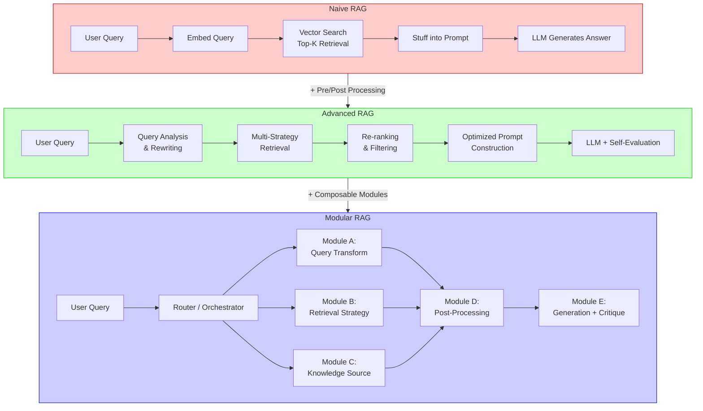
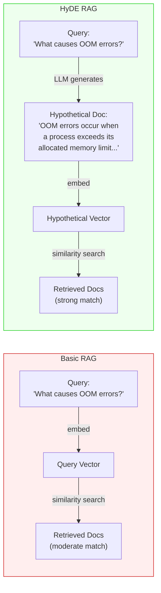
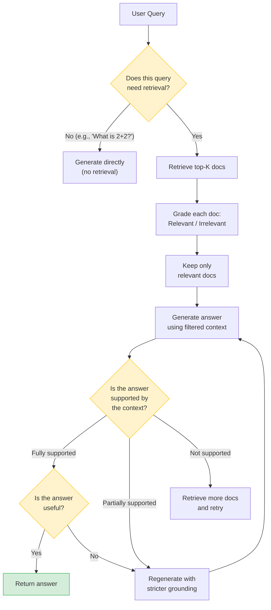
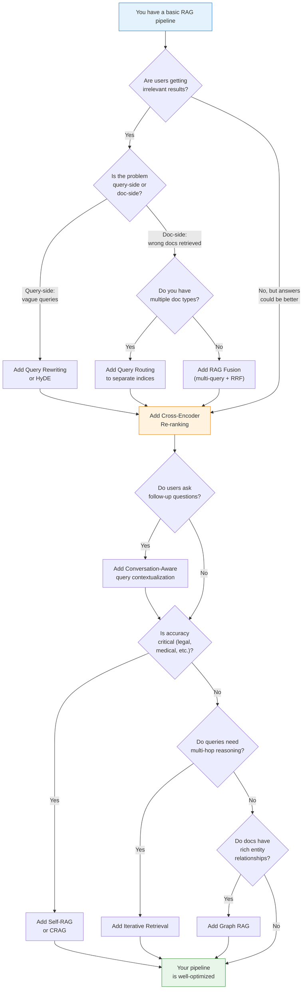

# RAG Deep Dive  Part 6: Advanced RAG Patterns  HyDE, Re-ranking, Fusion, and Beyond

---

**Series:** RAG (Retrieval-Augmented Generation)  A Developer's Deep Dive from Scratch to Production
**Part:** 6 of 9 (Advanced Techniques)
**Audience:** Developers with Python experience who want to master RAG systems from the ground up
**Reading time:** ~45 minutes

---

## Table of Contents

1. [Recap of Part 5](#1-recap-of-part-5)
2. [Why Basic RAG Is Not Enough](#2-why-basic-rag-is-not-enough)
3. [RAG Taxonomy  Naive to Modular](#3-rag-taxonomy--naive-to-modular)
4. [Pre-Retrieval Optimization](#4-pre-retrieval-optimization)
5. [Retrieval Optimization](#5-retrieval-optimization)
6. [Post-Retrieval Optimization](#6-post-retrieval-optimization)
7. [Self-RAG  Retrieval-Aware Generation](#7-self-rag--retrieval-aware-generation)
8. [Graph RAG  Knowledge Graphs Meet Vectors](#8-graph-rag--knowledge-graphs-meet-vectors)
9. [RAPTOR  Recursive Summarization Trees](#9-raptor--recursive-summarization-trees)
10. [Conversation-Aware RAG](#10-conversation-aware-rag)
11. [Pattern Comparison](#11-pattern-comparison)
12. [Decision Framework](#12-decision-framework)
13. [Key Vocabulary](#13-key-vocabulary)
14. [What's Next  Part 7](#14-whats-next--part-7)

---

## 1. Recap of Part 5

In Part 5, we assembled every component from Parts 0 through 4 into a **working RAG pipeline from scratch**. We built a document question-answering system with the following capabilities:

- **Document ingestion**  loaders for PDF, Markdown, and web pages that extract raw text with metadata
- **Chunking**  recursive character splitting with configurable size, overlap, and metadata enrichment
- **Embedding**  dual support for a free local model (Sentence-BERT) and the OpenAI API
- **Vector storage**  two backends (ChromaDB and FAISS) with full insert and query operations
- **Retrieval**  similarity search, MMR for diversity, and hybrid BM25 + vector search
- **Prompt engineering**  structured templates with context injection, grounding constraints, and citation support
- **LLM integration**  OpenAI and Ollama with streaming responses
- **Web UI**  a Streamlit interface for document upload, querying, and inspecting retrieved sources

That pipeline works. It answers questions, cites its sources, and avoids hallucination when the grounding constraint holds. It represents roughly 60-70% of what a production RAG system achieves.

This part closes the remaining gap. Every technique here takes the same pipeline architecture and makes it **smarter**  better at understanding queries, better at finding relevant chunks, and better at filtering noise before the LLM ever sees it.

> **The core principle of this part:** Basic RAG treats retrieval as a single pass  embed the query, find similar chunks, generate an answer. Advanced RAG treats retrieval as an **iterative, self-correcting, multi-strategy process** where the system adapts to the query's complexity.

---

## 2. Why Basic RAG Is Not Enough

The pipeline from Part 5 handles straightforward, factual questions well. Ask "What is the default chunk size in our pipeline?" and it retrieves the configuration file, returns `512`, and cites the source. But real users do not ask straightforward questions.

### 2.1 The Failure Modes

**Vocabulary mismatch.** The user asks "How do I terminate a background job?" but the documentation says "cancel an asynchronous task." Different words, same intent  low embedding similarity.

**Multi-hop reasoning.** "Which team owns the service that processes payment refunds?" requires two retrievals: find the service, then find the team. A single pass cannot do this.

**Ambiguous queries.** "Tell me about Python"  the language, the snake, or the comedy group? Without query analysis, retrieval shoots in the dark.

**Information spread.** The answer spans multiple chunks across different documents. A single top-k retrieval returns some but not all, producing partial answers.

**Noise sensitivity.** Of five retrieved chunks, only two are relevant. The three irrelevant chunks confuse the LLM  the "lost in the middle" problem.

### 2.2 What Users Actually Ask

Here is a real distribution of query types from a production RAG system over internal documentation:

| Query Type | Percentage | Basic RAG Performance |
|---|---|---|
| Simple factual ("What is X?") | 25% | Good |
| How-to procedural ("How do I do X?") | 20% | Moderate |
| Comparison ("X vs Y?") | 15% | Poor  needs multiple docs |
| Multi-hop ("Who owns the service that does X?") | 15% | Poor  needs chained retrieval |
| Vague / exploratory ("Tell me about X") | 10% | Poor  needs query clarification |
| Negative ("What does NOT happen when X?") | 5% | Very poor  embeddings miss negation |
| Temporal ("What changed in X last month?") | 5% | Very poor  needs metadata filtering |
| Aggregation ("How many services use X?") | 5% | Fails  needs structured query |

Basic RAG handles only a quarter of real queries well. Advanced patterns exist to cover the rest.

---

## 3. RAG Taxonomy  Naive to Modular

The research community categorizes RAG systems into three generations. Understanding where each technique sits helps you design your pipeline.



**Naive RAG** is the pipeline from Part 5  a linear flow from query to answer with no intermediate intelligence. It works but is brittle.

**Advanced RAG** adds processing stages before and after retrieval. Queries are rewritten for better matching. Retrieved chunks are re-ranked for precision. The LLM evaluates its own output. This is the focus of this article.

**Modular RAG** decomposes the pipeline into interchangeable, composable modules. A router decides which modules to activate based on the query. Different queries take different paths through the system. This is the architecture of production systems like those built with LangGraph or LlamaIndex's query pipelines.

> **Where we are going:** This article covers the techniques that transform Naive RAG into Advanced RAG. Part 8 will cover the production infrastructure that enables Modular RAG.

---

## 4. Pre-Retrieval Optimization

Pre-retrieval techniques transform the user's query **before** it hits the vector store. The idea is simple: the user's raw question is often a poor search query. Rewriting it can dramatically improve retrieval.

### 4.1 Query Rewriting with LLMs

The most straightforward pre-retrieval technique: use an LLM to rewrite the user's query into a form more likely to match relevant documents.

```python
from openai import OpenAI

client = OpenAI()

REWRITE_PROMPT = """You are a query rewriting assistant for a document search system.
Your job is to rewrite the user's question into a clearer, more specific search query
that will retrieve the most relevant documents.

Rules:
- Preserve the original intent exactly
- Expand abbreviations and acronyms
- Add relevant synonyms if the original is ambiguous
- Make implicit requirements explicit
- Output ONLY the rewritten query, nothing else

Examples:
  Input: "How do I kill a pod?"
  Output: "How to delete or terminate a Kubernetes pod using kubectl"

  Input: "What's the deal with auth?"
  Output: "How does authentication and authorization work in the system"
"""

def rewrite_query(user_query: str) -> str:
    """Rewrite a user query for better retrieval."""
    response = client.chat.completions.create(
        model="gpt-4o-mini",
        messages=[
            {"role": "system", "content": REWRITE_PROMPT},
            {"role": "user", "content": user_query},
        ],
        temperature=0.0,
        max_tokens=200,
    )
    return response.choices[0].message.content.strip()


# Example usage
original = "Why is the thing slow?"
rewritten = rewrite_query(original)
print(f"Original:  {original}")
print(f"Rewritten: {rewritten}")
# Original:  Why is the thing slow?
# Rewritten: What are the common causes of slow performance and latency issues in the system
```

**When to use it:** users write vague, abbreviated, or colloquial queries. Adds one LLM call (100-300ms) but can improve retrieval precision by 15-30%. Skip it when users already write precise, technical queries.

### 4.2 Query Routing to Different Indices

Not all queries should search the same index. A question about code should search a code index. A question about company policies should search a documents index. **Query routing** uses an LLM to classify the query and direct it to the appropriate retrieval path.

```python
from enum import Enum
from pydantic import BaseModel

class QueryCategory(str, Enum):
    CODE = "code"
    DOCUMENTATION = "documentation"
    API_REFERENCE = "api_reference"
    TROUBLESHOOTING = "troubleshooting"
    GENERAL = "general"

class RouteDecision(BaseModel):
    category: QueryCategory
    confidence: float
    reasoning: str

ROUTING_PROMPT = """Classify the following user query into exactly one category.
Respond in JSON with keys: category, confidence (0-1), reasoning.

Categories:
- code: Questions about code implementation, functions, classes, syntax
- documentation: Questions about processes, architecture, concepts
- api_reference: Questions about API endpoints, request/response formats
- troubleshooting: Questions about errors, bugs, debugging, performance
- general: Questions that don't fit other categories

Query: {query}"""

def route_query(query: str) -> RouteDecision:
    """Route a query to the appropriate retrieval index."""
    response = client.chat.completions.create(
        model="gpt-4o-mini",
        messages=[
            {"role": "user", "content": ROUTING_PROMPT.format(query=query)},
        ],
        response_format={"type": "json_object"},
        temperature=0.0,
    )
    data = json.loads(response.choices[0].message.content)
    return RouteDecision(**data)


# Route to the appropriate vector store
INDEX_MAP = {
    QueryCategory.CODE: "code_index",
    QueryCategory.DOCUMENTATION: "docs_index",
    QueryCategory.API_REFERENCE: "api_index",
    QueryCategory.TROUBLESHOOTING: "troubleshooting_index",
    QueryCategory.GENERAL: "docs_index",  # fallback
}

def retrieve_with_routing(query: str, vector_stores: dict, top_k: int = 5):
    """Retrieve from the appropriate index based on query classification."""
    route = route_query(query)
    index_name = INDEX_MAP[route.category]
    store = vector_stores[index_name]

    print(f"Query routed to '{index_name}' (confidence: {route.confidence:.2f})")
    print(f"Reasoning: {route.reasoning}")

    return store.similarity_search(query, k=top_k)
```

### 4.3 HyDE  Hypothetical Document Embeddings

HyDE is one of the most powerful pre-retrieval techniques. The intuition: **instead of embedding the question, embed a hypothetical answer and use that to search.**

Why does this work? Questions and answers live in different regions of embedding space. The question "What is the capital of France?" is semantically distant from a document that says "Paris is the capital of France"  they share words but have different structures. However, a hypothetical answer like "The capital of France is Paris, which is located in the Ile-de-France region" is much closer to the actual document in embedding space.



Here is the full implementation:

```python
import numpy as np
from openai import OpenAI
from sentence_transformers import SentenceTransformer

client = OpenAI()
embedder = SentenceTransformer("all-MiniLM-L6-v2")


HYDE_PROMPT = """You are a technical documentation expert.
Given the following question, write a short paragraph (3-5 sentences) that
would appear in a technical document answering this question.
Write as if you are the document  do NOT say "the answer is" or address the reader.
Just write the factual content that would answer the question.

Question: {question}

Document passage:"""


def generate_hypothetical_document(question: str) -> str:
    """Generate a hypothetical document passage that answers the question."""
    response = client.chat.completions.create(
        model="gpt-4o-mini",
        messages=[
            {"role": "user", "content": HYDE_PROMPT.format(question=question)},
        ],
        temperature=0.7,  # Some creativity to cover different phrasings
        max_tokens=200,
    )
    return response.choices[0].message.content.strip()


def hyde_embed(question: str, num_hypotheticals: int = 3) -> np.ndarray:
    """
    Generate multiple hypothetical documents, embed them,
    and return the average embedding as the search vector.

    Using multiple hypotheticals and averaging reduces the risk
    of a single bad generation derailing the search.
    """
    hypotheticals = []
    for _ in range(num_hypotheticals):
        hyp_doc = generate_hypothetical_document(question)
        hypotheticals.append(hyp_doc)
        print(f"  Hypothetical: {hyp_doc[:80]}...")

    # Embed all hypotheticals
    hyp_embeddings = embedder.encode(hypotheticals)

    # Average the embeddings  this is the HyDE search vector
    avg_embedding = np.mean(hyp_embeddings, axis=0)

    # Normalize to unit length for cosine similarity
    avg_embedding = avg_embedding / np.linalg.norm(avg_embedding)

    return avg_embedding


def hyde_retrieve(question: str, vector_store, top_k: int = 5):
    """
    Full HyDE retrieval pipeline:
    1. Generate hypothetical answer documents
    2. Embed and average them
    3. Search the vector store with the averaged embedding
    """
    print(f"Query: {question}")
    print(f"Generating hypothetical documents...")

    search_vector = hyde_embed(question, num_hypotheticals=3)

    # Use the HyDE vector instead of the raw query vector
    results = vector_store.search_by_vector(search_vector, k=top_k)

    return results


# Comparison: basic vs. HyDE
question = "What happens when a Kubernetes pod runs out of memory?"

# Basic: embed the question directly
basic_vector = embedder.encode(question)

# HyDE: embed hypothetical answer documents
hyde_vector = hyde_embed(question, num_hypotheticals=3)

print(f"\nBasic vector shape: {basic_vector.shape}")
print(f"HyDE vector shape:  {hyde_vector.shape}")
# Both are the same dimensionality  they go into the same vector store
```

**Key details about HyDE:**

- The hypothetical document does **not** need to be factually correct. It just needs to use the same vocabulary and structure as real documents. Even a wrong answer in the right "document language" pulls the search vector closer to relevant real documents.
- Generating 3-5 hypotheticals and averaging is more robust than using a single one.
- HyDE adds 1-3 LLM calls of latency. Use a fast, cheap model (GPT-4o-mini, Claude Haiku).
- Works best when there is a large **vocabulary gap** between queries and documents.

---

## 5. Retrieval Optimization

These techniques modify **how** retrieval works  going beyond a single similarity search to multi-query strategies, self-correction, and iterative refinement.

### 5.1 RAG Fusion  Multi-Query + Reciprocal Rank Fusion

RAG Fusion generates **multiple variations** of the user's query, retrieves results for each, and merges them using **Reciprocal Rank Fusion (RRF)**  a scoring method that rewards documents appearing across multiple query variations.

The intuition: different phrasings of the same question retrieve different but overlapping sets of documents. Documents that appear in multiple result sets are likely relevant. Documents that appear in only one set might be noise.

```python
import json
from collections import defaultdict

MULTI_QUERY_PROMPT = """You are an AI assistant that generates multiple search queries.
Given a user question, generate {n} different versions of the question that could be
used to search a document database. Each version should approach the question from a
different angle or use different vocabulary.

Output a JSON array of strings. Nothing else.

User question: {question}"""


def generate_multi_queries(question: str, n: int = 4) -> list[str]:
    """Generate n diverse query variations for the same question."""
    response = client.chat.completions.create(
        model="gpt-4o-mini",
        messages=[
            {
                "role": "user",
                "content": MULTI_QUERY_PROMPT.format(question=question, n=n),
            }
        ],
        response_format={"type": "json_object"},
        temperature=0.8,
    )

    content = response.choices[0].message.content
    data = json.loads(content)

    # Handle both {"queries": [...]} and direct [...] formats
    if isinstance(data, list):
        queries = data
    else:
        queries = data.get("queries", data.get("questions", list(data.values())[0]))

    return queries[:n]


def reciprocal_rank_fusion(
    result_lists: list[list[dict]],
    k: int = 60,
) -> list[dict]:
    """
    Merge multiple ranked result lists using Reciprocal Rank Fusion.

    RRF score for a document = sum over all lists of: 1 / (k + rank)

    where k is a constant (default 60) that dampens the effect of high rankings.
    Documents appearing in multiple lists get higher combined scores.

    Args:
        result_lists: List of ranked result lists. Each result is a dict
                      with at least 'id' and 'text' keys.
        k: RRF constant. Higher k = less emphasis on top ranks.

    Returns:
        Merged results sorted by RRF score (descending).
    """
    rrf_scores = defaultdict(float)
    doc_map = {}  # id -> full document dict

    for result_list in result_lists:
        for rank, doc in enumerate(result_list, start=1):
            doc_id = doc["id"]
            rrf_scores[doc_id] += 1.0 / (k + rank)
            doc_map[doc_id] = doc  # keep the latest version

    # Sort by RRF score descending
    sorted_ids = sorted(rrf_scores.keys(), key=lambda x: rrf_scores[x], reverse=True)

    fused_results = []
    for doc_id in sorted_ids:
        doc = doc_map[doc_id].copy()
        doc["rrf_score"] = rrf_scores[doc_id]
        fused_results.append(doc)

    return fused_results


def rag_fusion_retrieve(
    question: str,
    vector_store,
    num_queries: int = 4,
    top_k_per_query: int = 5,
    final_top_k: int = 5,
) -> list[dict]:
    """
    Full RAG Fusion pipeline:
    1. Generate multiple query variations
    2. Retrieve results for each
    3. Fuse results with RRF
    4. Return top-k fused results
    """
    # Step 1: Generate diverse queries
    queries = generate_multi_queries(question, n=num_queries)
    queries.append(question)  # Always include the original
    print(f"Generated {len(queries)} queries:")
    for i, q in enumerate(queries):
        print(f"  [{i}] {q}")

    # Step 2: Retrieve for each query
    all_results = []
    for q in queries:
        results = vector_store.similarity_search(q, k=top_k_per_query)
        all_results.append(results)
        print(f"  Query '{q[:40]}...' returned {len(results)} results")

    # Step 3: Fuse with RRF
    fused = reciprocal_rank_fusion(all_results)

    print(f"\nFused {sum(len(r) for r in all_results)} results into {len(fused)} unique docs")
    print(f"Returning top {final_top_k}")

    return fused[:final_top_k]
```

**Why RRF over score averaging?** Scores from different queries are not comparable (different query vectors, different score distributions). RRF uses **rank positions** instead of raw scores, which are always comparable.

### 5.2 CRAG  Corrective Retrieval-Augmented Generation

CRAG adds a **self-correction loop** to retrieval. After retrieving documents, the system evaluates whether the retrieved context actually answers the question. If it does not, the system tries alternative retrieval strategies or falls back to web search.

```python
from enum import Enum

class RelevanceGrade(str, Enum):
    RELEVANT = "relevant"
    PARTIALLY_RELEVANT = "partially_relevant"
    NOT_RELEVANT = "not_relevant"


GRADING_PROMPT = """You are a relevance grading assistant.
Given a user question and a retrieved document chunk, evaluate whether the
document contains information that helps answer the question.

Grade as one of:
- "relevant": The document directly helps answer the question
- "partially_relevant": The document has some related information but not a direct answer
- "not_relevant": The document does not help answer the question at all

Respond in JSON: {{"grade": "...", "reasoning": "..."}}

Question: {question}

Document:
{document}"""


def grade_document(question: str, document: str) -> dict:
    """Grade a single document's relevance to the question."""
    response = client.chat.completions.create(
        model="gpt-4o-mini",
        messages=[
            {
                "role": "user",
                "content": GRADING_PROMPT.format(
                    question=question, document=document
                ),
            }
        ],
        response_format={"type": "json_object"},
        temperature=0.0,
    )
    return json.loads(response.choices[0].message.content)


def corrective_retrieve(
    question: str,
    vector_store,
    top_k: int = 5,
    relevance_threshold: int = 2,
) -> dict:
    """
    CRAG pipeline:
    1. Initial retrieval
    2. Grade each document for relevance
    3. If enough relevant docs → use them
    4. If not enough → rewrite query and try again
    5. If still not enough → flag low confidence
    """
    # Step 1: Initial retrieval
    results = vector_store.similarity_search(question, k=top_k)

    # Step 2: Grade each document
    graded = []
    for doc in results:
        grade = grade_document(question, doc["text"])
        doc["relevance_grade"] = grade["grade"]
        doc["grade_reasoning"] = grade["reasoning"]
        graded.append(doc)

    relevant = [d for d in graded if d["relevance_grade"] == "relevant"]
    partial = [d for d in graded if d["relevance_grade"] == "partially_relevant"]

    print(f"Initial retrieval: {len(relevant)} relevant, {len(partial)} partial, "
          f"{len(graded) - len(relevant) - len(partial)} irrelevant")

    # Step 3: Enough relevant documents?
    if len(relevant) >= relevance_threshold:
        return {
            "documents": relevant + partial,
            "action": "direct_use",
            "confidence": "high",
        }

    # Step 4: Not enough  rewrite and retry
    print("Insufficient relevant documents. Rewriting query...")
    rewritten = rewrite_query(question)
    print(f"Rewritten query: {rewritten}")

    retry_results = vector_store.similarity_search(rewritten, k=top_k)

    for doc in retry_results:
        grade = grade_document(question, doc["text"])
        doc["relevance_grade"] = grade["grade"]

    retry_relevant = [d for d in retry_results if d["relevance_grade"] == "relevant"]

    # Merge unique relevant docs from both attempts
    all_relevant = relevant + [
        d for d in retry_relevant if d["id"] not in {r["id"] for r in relevant}
    ]

    if len(all_relevant) >= relevance_threshold:
        return {
            "documents": all_relevant,
            "action": "corrected_retrieval",
            "confidence": "medium",
        }

    # Step 5: Still not enough  return what we have with low confidence
    return {
        "documents": all_relevant + partial,
        "action": "low_confidence_fallback",
        "confidence": "low",
    }
```

**Key insight about CRAG:** the grading step uses an LLM as a **relevance judge**. This is expensive (one LLM call per document) but catches retrieval failures before they reach generation. In practice, you grade only the top-k (5-10) documents, so cost stays manageable.

### 5.3 Iterative Retrieval  Retrieve, Read, Retrieve Again

Some questions cannot be answered in a single retrieval pass. **Iterative retrieval** performs multiple rounds: retrieve, read the results, formulate a follow-up query based on what was found (or what is still missing), and retrieve again.

```python
FOLLOW_UP_PROMPT = """You are a research assistant performing iterative document search.
You received a question and some initial search results. Based on what you found,
determine if you have enough information to answer, or if you need to search again.

Question: {question}

Information found so far:
{context}

If the information is sufficient to answer the question, respond with:
{{"status": "sufficient", "answer_draft": "brief draft answer"}}

If more information is needed, respond with:
{{"status": "need_more", "follow_up_query": "specific search query for missing info",
  "what_is_missing": "description of what information is still needed"}}"""


def iterative_retrieve(
    question: str,
    vector_store,
    max_rounds: int = 3,
    docs_per_round: int = 3,
) -> dict:
    """
    Multi-round retrieval:
    1. Retrieve initial results
    2. Evaluate if we have enough
    3. If not, generate a follow-up query and retrieve more
    4. Repeat until sufficient or max rounds reached
    """
    all_documents = []
    queries_used = [question]

    for round_num in range(max_rounds):
        current_query = queries_used[-1]
        print(f"\n--- Round {round_num + 1} ---")
        print(f"Query: {current_query}")

        # Retrieve
        results = vector_store.similarity_search(current_query, k=docs_per_round)
        # Add only new documents (avoid duplicates)
        seen_ids = {d["id"] for d in all_documents}
        new_docs = [d for d in results if d["id"] not in seen_ids]
        all_documents.extend(new_docs)
        print(f"Retrieved {len(new_docs)} new documents (total: {len(all_documents)})")

        # Evaluate
        context = "\n\n".join(
            f"[Doc {i+1}]: {d['text'][:300]}"
            for i, d in enumerate(all_documents)
        )

        response = client.chat.completions.create(
            model="gpt-4o-mini",
            messages=[
                {
                    "role": "user",
                    "content": FOLLOW_UP_PROMPT.format(
                        question=question, context=context
                    ),
                }
            ],
            response_format={"type": "json_object"},
            temperature=0.0,
        )

        evaluation = json.loads(response.choices[0].message.content)

        if evaluation["status"] == "sufficient":
            print(f"Sufficient information found after {round_num + 1} rounds.")
            return {
                "documents": all_documents,
                "rounds": round_num + 1,
                "queries": queries_used,
                "draft_answer": evaluation.get("answer_draft", ""),
            }

        # Need more  use the follow-up query
        follow_up = evaluation["follow_up_query"]
        print(f"Need more: {evaluation['what_is_missing']}")
        print(f"Follow-up query: {follow_up}")
        queries_used.append(follow_up)

    print(f"Max rounds ({max_rounds}) reached.")
    return {
        "documents": all_documents,
        "rounds": max_rounds,
        "queries": queries_used,
        "draft_answer": "",
    }
```

**When it shines:** multi-hop questions, research-style queries, and queries requiring information from multiple documents.

---

## 6. Post-Retrieval Optimization

Post-retrieval techniques operate **after** chunks are retrieved but **before** they reach the LLM. The goal: improve precision, reduce noise, and order context for optimal generation.

### 6.1 Re-ranking with Cross-Encoders

This is the single highest-impact post-retrieval technique. We covered the concept in Part 4. Here is the production implementation.

**Why re-rank?** Bi-encoder search computes query and document embeddings independently  fast but imprecise. A **cross-encoder** takes the query and document as a **single input pair**, enabling deep token-level interaction for far more accurate relevance scores. It is too slow for the entire corpus, so we use it as a second stage: vector search retrieves top-50 candidates, the cross-encoder re-ranks them, we keep top-5.

```python
from sentence_transformers import CrossEncoder
import torch

class CrossEncoderReranker:
    """
    Re-rank retrieved documents using a cross-encoder model.

    Cross-encoders process (query, document) pairs jointly, producing
    a single relevance score. They are much more accurate than bi-encoder
    similarity but ~100x slower  hence the two-stage pipeline.
    """

    def __init__(self, model_name: str = "cross-encoder/ms-marco-MiniLM-L-6-v2"):
        """
        Initialize with a pre-trained cross-encoder.

        Popular models (speed vs. accuracy trade-off):
        - cross-encoder/ms-marco-TinyBERT-L-2-v2    fastest, least accurate
        - cross-encoder/ms-marco-MiniLM-L-6-v2       good balance (recommended)
        - cross-encoder/ms-marco-electra-base         most accurate, slowest
        """
        self.model = CrossEncoder(model_name)
        self.model_name = model_name

    def rerank(
        self,
        query: str,
        documents: list[dict],
        top_k: int = 5,
    ) -> list[dict]:
        """
        Re-rank documents by cross-encoder relevance score.

        Args:
            query: The user's question
            documents: List of dicts with at least a 'text' key
            top_k: Number of documents to return after re-ranking

        Returns:
            Top-k documents sorted by cross-encoder score (descending)
        """
        if not documents:
            return []

        # Create (query, document) pairs for the cross-encoder
        pairs = [(query, doc["text"]) for doc in documents]

        # Score all pairs in a single batch
        scores = self.model.predict(pairs, show_progress_bar=False)

        # Attach scores and sort
        for doc, score in zip(documents, scores):
            doc["cross_encoder_score"] = float(score)

        reranked = sorted(
            documents,
            key=lambda x: x["cross_encoder_score"],
            reverse=True,
        )

        return reranked[:top_k]


# Usage example
reranker = CrossEncoderReranker()

# Retrieve a broad set of candidates (over-retrieve)
candidates = vector_store.similarity_search(query, k=20)

# Re-rank to find the truly relevant ones
top_docs = reranker.rerank(query, candidates, top_k=5)

for i, doc in enumerate(top_docs):
    print(f"[{i+1}] Score: {doc['cross_encoder_score']:.4f}")
    print(f"    {doc['text'][:100]}...")
```

**The over-retrieve then re-rank pattern** is the most common two-stage architecture: Stage 1 retrieves top-50 with fast vector search (high recall), Stage 2 re-ranks those 50 with a cross-encoder and returns top-5 (high precision). In benchmarks, this improves NDCG@10 by 15-25% over vector search alone.

### 6.2 Contextual Compression

Retrieved chunks often contain a lot of text, but only a sentence or two actually answers the question. **Contextual compression** extracts just the relevant portions, reducing noise in the LLM's context window.

```python
COMPRESSION_PROMPT = """Given the following question and document, extract ONLY the
sentences or phrases from the document that are relevant to answering the question.
If nothing in the document is relevant, respond with "NOT_RELEVANT".
Do not add any information that is not in the document.
Preserve the exact wording from the document.

Question: {question}

Document:
{document}

Relevant extract:"""


def compress_document(question: str, document: str) -> str | None:
    """Extract only the relevant portion of a document."""
    response = client.chat.completions.create(
        model="gpt-4o-mini",
        messages=[
            {
                "role": "user",
                "content": COMPRESSION_PROMPT.format(
                    question=question, document=document
                ),
            }
        ],
        temperature=0.0,
        max_tokens=500,
    )
    result = response.choices[0].message.content.strip()
    if result == "NOT_RELEVANT":
        return None
    return result


def compress_retrieved_context(
    question: str,
    documents: list[dict],
) -> list[dict]:
    """Compress all retrieved documents, removing irrelevant ones."""
    compressed = []
    for doc in documents:
        extract = compress_document(question, doc["text"])
        if extract is not None:
            compressed_doc = doc.copy()
            compressed_doc["original_text"] = doc["text"]
            compressed_doc["text"] = extract
            compressed.append(compressed_doc)

    print(f"Compressed {len(documents)} docs → {len(compressed)} relevant extracts")
    return compressed
```

**Trade-off:** Compression adds one LLM call per document. Use it when your chunks are large (1000+ tokens) or when the LLM gets confused by irrelevant context.

### 6.3 Lost in the Middle  Document Ordering

Research from Stanford (2023) showed that LLMs attend most to information at the **beginning** and **end** of the context window, ignoring the **middle**. The optimal ordering strategy:

```python
def order_documents_for_attention(
    documents: list[dict],
) -> list[dict]:
    """
    Reorder documents to combat the 'lost in the middle' effect.

    Strategy: Place the most relevant documents at the BEGINNING and END
    of the context. Put less relevant ones in the middle where they are
    less likely to distract the LLM.

    Assumes documents are sorted by relevance (best first).
    """
    if len(documents) <= 2:
        return documents

    # Split into high-relevance and lower-relevance
    n = len(documents)
    high_relevance = documents[: n // 2]
    lower_relevance = documents[n // 2 :]

    # Interleave: high at start, low in middle, high at end
    reordered = []
    reordered.extend(high_relevance[:len(high_relevance) // 2])       # Best at start
    reordered.extend(lower_relevance)                                  # Lower in middle
    reordered.extend(high_relevance[len(high_relevance) // 2:])       # Good at end

    return reordered


# Example: 6 documents ranked by relevance [1=best, 6=worst]
docs = [{"rank": i, "text": f"Doc {i}"} for i in range(1, 7)]
reordered = order_documents_for_attention(docs)
print("Order:", [d["rank"] for d in reordered])
# Order: [1, 4, 5, 6, 2, 3]   best docs at positions 1, 5, 6
```

> **Practical note:** The effect is most pronounced in older models and long contexts (8k+ tokens). Newer models show less sensitivity, but ordering is a zero-cost optimization  no reason not to do it.

---

## 7. Self-RAG  Retrieval-Aware Generation

Self-RAG, introduced by Asai et al. (2023), goes beyond correcting retrieval. It makes the **generation** step itself retrieval-aware. The model decides:

1. **Whether to retrieve**  not every query needs retrieval
2. **Which documents are relevant**  grading retrieved chunks before using them
3. **Whether the generation is supported**  checking if the output is grounded in the context
4. **Whether the response is useful**  an overall quality check



Here is a simplified implementation of the Self-RAG decision loop:

```python
```python
NEEDS_RETRIEVAL_PROMPT = """Determine if this question requires searching external
documents or can be answered from general knowledge.
Respond with JSON: {{"needs_retrieval": true/false, "reasoning": "..."}}

Question: {question}"""

SUPPORT_CHECK_PROMPT = """Evaluate whether this answer is supported by the context.
Context:\n{context}\n\nAnswer:\n{answer}

Respond with JSON:
{{"support_level": "fully_supported|partially_supported|not_supported",
  "unsupported_claims": ["list of claims not in context"]}}"""


class SelfRAG:
    """Self-RAG: the model decides when and how to use retrieval."""

    def __init__(self, vector_store, reranker=None):
        self.vector_store = vector_store
        self.reranker = reranker

    def answer(self, question: str, max_retries: int = 2) -> dict:
        # Step 1: Does this question need retrieval?
        if not self._needs_retrieval(question):
            return {"answer": self._generate(question, []), "retrieval_used": False}

        # Step 2: Retrieve and grade
        docs = self._retrieve_and_grade(question)

        # Step 3: Generate → check support → retry if needed
        for attempt in range(max_retries + 1):
            answer = self._generate(question, docs)
            support = self._check_support(docs, answer)

            if support["support_level"] == "fully_supported":
                return {"answer": answer, "documents": docs,
                        "support": support, "attempts": attempt + 1}

            if attempt < max_retries:
                # Retrieve more docs for unsupported claims
                for claim in support.get("unsupported_claims", []):
                    docs.extend(self.vector_store.similarity_search(claim, k=2))

        return {"answer": answer, "documents": docs, "support": support,
                "warning": "Answer may not be fully supported"}

    def _needs_retrieval(self, question: str) -> bool:
        response = client.chat.completions.create(
            model="gpt-4o-mini",
            messages=[{"role": "user", "content": NEEDS_RETRIEVAL_PROMPT.format(question=question)}],
            response_format={"type": "json_object"}, temperature=0.0,
        )
        return json.loads(response.choices[0].message.content)["needs_retrieval"]

    def _retrieve_and_grade(self, question: str) -> list[dict]:
        docs = self.vector_store.similarity_search(question, k=10)
        if self.reranker:
            docs = self.reranker.rerank(question, docs, top_k=5)
        return [d for d in docs
                if grade_document(question, d["text"])["grade"] != "not_relevant"]

    def _generate(self, question: str, docs: list[dict]) -> str:
        context = "\n\n".join(d["text"] for d in docs) if docs else ""
        messages = [
            {"role": "system", "content": "Answer based on provided context. Cite sources."},
            {"role": "user", "content": f"Context:\n{context}\n\nQuestion: {question}"},
        ]
        response = client.chat.completions.create(
            model="gpt-4o", messages=messages, temperature=0.0,
        )
        return response.choices[0].message.content

    def _check_support(self, docs: list[dict], answer: str) -> dict:
        context = "\n\n".join(d["text"] for d in docs)
        response = client.chat.completions.create(
            model="gpt-4o-mini",
            messages=[{"role": "user",
                        "content": SUPPORT_CHECK_PROMPT.format(context=context, answer=answer)}],
            response_format={"type": "json_object"}, temperature=0.0,
        )
        return json.loads(response.choices[0].message.content)
```

> **Self-RAG is expensive.** A single query may trigger 5-15 LLM calls (retrieval decision, grading, generation, support check, possible retries). Use it for high-stakes applications where answer quality matters more than latency  legal research, medical Q&A, compliance systems.

---

## 8. Graph RAG  Knowledge Graphs Meet Vectors

Vector search finds documents that are **semantically similar** to the query. But some relationships are not about similarity  they are about **structure**. "Who reports to the VP of Engineering?" requires understanding an organizational hierarchy. "What services depend on the payment gateway?" requires understanding a dependency graph.

**Graph RAG** combines a knowledge graph (entities and relationships) with vector retrieval. The knowledge graph handles structural queries; the vector store handles semantic queries.

```python
import networkx as nx
from typing import Optional


class SimpleGraphRAG:
    """
    Graph RAG using NetworkX for relationship queries
    combined with a vector store for semantic queries.
    """

    def __init__(self, vector_store):
        self.graph = nx.DiGraph()
        self.vector_store = vector_store

    def add_entity(self, entity_id: str, entity_type: str, properties: dict):
        self.graph.add_node(entity_id, type=entity_type, **properties)

    def add_relationship(self, source: str, target: str, relation: str):
        self.graph.add_edge(source, target, relation=relation)

    def build_from_documents(self, documents: list[dict]):
        """Extract entities and relationships from documents using an LLM."""
        extraction_prompt = """Extract entities and relationships from this text.
Return JSON with:
{{"entities": [{{"id": "...", "type": "person|service|team|concept", "name": "..."}}],
  "relationships": [{{"source": "id", "target": "id", "relation": "manages|owns|depends_on|..."}}]}}

Text: {text}"""

        for doc in documents:
            response = client.chat.completions.create(
                model="gpt-4o-mini",
                messages=[
                    {"role": "user", "content": extraction_prompt.format(text=doc["text"])},
                ],
                response_format={"type": "json_object"},
                temperature=0.0,
            )
            data = json.loads(response.choices[0].message.content)

            for entity in data.get("entities", []):
                self.add_entity(entity["id"], entity["type"], {"name": entity["name"]})
            for rel in data.get("relationships", []):
                self.add_relationship(rel["source"], rel["target"], rel["relation"])

        print(f"Graph: {self.graph.number_of_nodes()} nodes, {self.graph.number_of_edges()} edges")

    def hybrid_query(self, question: str, top_k: int = 5) -> dict:
        """
        Combine graph traversal with vector search:
        1. Vector search for relevant documents
        2. Find entities mentioned in results
        3. Expand via graph edges (BFS to depth 2)
        """
        vector_results = self.vector_store.similarity_search(question, k=top_k)

        # Find entities mentioned in the question or retrieved docs
        all_text = (question + " " + " ".join(d["text"] for d in vector_results)).lower()
        mentioned = [
            nid for nid, data in self.graph.nodes(data=True)
            if data.get("name", nid).lower() in all_text
        ]

        # Expand via graph  BFS to depth 2
        graph_context = []
        visited = set()
        for entity_id in mentioned:
            queue = [(entity_id, 0)]
            while queue:
                current, depth = queue.pop(0)
                if depth >= 2:
                    continue
                for _, target, edata in self.graph.edges(current, data=True):
                    if target not in visited:
                        visited.add(target)
                        graph_context.append({
                            "entity": target,
                            "relation": edata.get("relation"),
                            "depth": depth + 1,
                            "properties": dict(self.graph.nodes[target]),
                        })
                        queue.append((target, depth + 1))

        return {
            "vector_results": vector_results,
            "graph_context": graph_context,
            "entities_found": mentioned,
        }
```

**When Graph RAG matters:** organizational data, technical system dependencies, compliance rules. If your data has rich entity relationships, Graph RAG captures information that vector search alone misses.

---

## 9. RAPTOR  Recursive Summarization Trees

RAPTOR (Recursive Abstractive Processing for Tree-Organized Retrieval) addresses a fundamental limitation of flat chunking: when you split a document into small chunks, you lose the **global context**. A question about the overall theme of a document cannot be answered by any single chunk.

RAPTOR solves this by building a **tree of summaries**:

1. Start with leaf-node chunks (the original document chunks)
2. Cluster similar chunks together
3. Summarize each cluster into a higher-level node
4. Repeat: cluster the summaries, create even higher-level summaries
5. Index **all levels** of the tree  leaf chunks AND summaries

At query time, you search across all levels. Detail questions match leaf chunks. Broad questions match higher-level summaries.

```python
from sklearn.cluster import KMeans


class RAPTORTree:
    """Simplified RAPTOR: build a recursive summary tree over document chunks."""

    def __init__(self, embedder, num_clusters: int = 5):
        self.embedder = embedder
        self.num_clusters = num_clusters
        self.tree_levels = []

    def build_tree(self, chunks: list[dict], max_levels: int = 3):
        """Build the RAPTOR tree from leaf chunks."""
        current_level = chunks
        self.tree_levels = [current_level]

        for level in range(max_levels):
            if len(current_level) <= self.num_clusters:
                break

            texts = [node["text"] for node in current_level]
            embeddings = self.embedder.encode(texts)

            n_clusters = min(self.num_clusters, len(current_level) // 2)
            labels = KMeans(n_clusters=n_clusters, random_state=42).fit_predict(embeddings)

            next_level = []
            for cluster_id in range(n_clusters):
                cluster_nodes = [current_level[i] for i in range(len(current_level))
                                 if labels[i] == cluster_id]
                summary = self._summarize_cluster(cluster_nodes)
                next_level.append({
                    "text": summary, "level": level + 1,
                    "children": [n.get("id", "") for n in cluster_nodes],
                })

            print(f"Level {level + 1}: {len(current_level)} nodes → {len(next_level)} summaries")
            self.tree_levels.append(next_level)
            current_level = next_level

    def _summarize_cluster(self, nodes: list[dict]) -> str:
        combined = "\n\n".join(n["text"] for n in nodes)
        response = client.chat.completions.create(
            model="gpt-4o-mini",
            messages=[
                {"role": "system", "content": "Summarize these passages into one coherent paragraph."},
                {"role": "user", "content": combined},
            ],
            temperature=0.0, max_tokens=300,
        )
        return response.choices[0].message.content.strip()

    def get_all_nodes(self) -> list[dict]:
        """Return all nodes across all levels for indexing."""
        return [node for level in self.tree_levels for node in level]
```

**The key insight of RAPTOR:** by indexing summaries alongside raw chunks, you create a retrieval system that works at **multiple levels of abstraction**. This is particularly valuable for long documents, research papers, and codebases where users ask both specific and high-level questions.

---

## 10. Conversation-Aware RAG

So far, every technique treats each query independently. But real users have **conversations**  they ask follow-up questions that depend on context from previous turns.

User: "What is the authentication service?"
System: "The authentication service handles user login and token management..."
User: "What database does it use?"
User: "Who is responsible for it?"

The second and third queries are ambiguous without conversational context. "It" refers to the authentication service. **Conversation-aware RAG** resolves these references before retrieval.

```python
CONTEXTUALIZE_PROMPT = """Given the following conversation history and a follow-up
question, rewrite the follow-up question to be a standalone question that
contains all necessary context.

Do NOT answer the question. ONLY rewrite it to be self-contained.

Chat history:
{history}

Follow-up question: {question}

Standalone question:"""


class ConversationAwareRAG:
    """RAG pipeline that handles multi-turn conversations."""

    def __init__(self, vector_store, reranker=None):
        self.vector_store = vector_store
        self.reranker = reranker
        self.conversation_history = []

    def ask(self, question: str) -> dict:
        """Process a question with conversation context."""
        # Step 1: Contextualize the question
        if self.conversation_history:
            standalone = self._contextualize(question)
            print(f"Original:     {question}")
            print(f"Standalone:   {standalone}")
        else:
            standalone = question

        # Step 2: Retrieve using the standalone question
        docs = self.vector_store.similarity_search(standalone, k=10)

        # Step 3: Re-rank if available
        if self.reranker:
            docs = self.reranker.rerank(standalone, docs, top_k=5)

        # Step 4: Generate answer with conversation history
        answer = self._generate(question, standalone, docs)

        # Step 5: Update conversation history
        self.conversation_history.append({"role": "user", "content": question})
        self.conversation_history.append({"role": "assistant", "content": answer})

        # Keep history bounded (last 10 turns)
        if len(self.conversation_history) > 20:
            self.conversation_history = self.conversation_history[-20:]

        return {"answer": answer, "documents": docs, "standalone_query": standalone}

    def _contextualize(self, question: str) -> str:
        """Rewrite a follow-up question as a standalone question."""
        history_str = "\n".join(
            f"{msg['role'].capitalize()}: {msg['content']}"
            for msg in self.conversation_history[-10:]  # Last 5 turns
        )

        response = client.chat.completions.create(
            model="gpt-4o-mini",
            messages=[
                {
                    "role": "user",
                    "content": CONTEXTUALIZE_PROMPT.format(
                        history=history_str, question=question
                    ),
                }
            ],
            temperature=0.0,
        )
        return response.choices[0].message.content.strip()

    def _generate(
        self,
        original_question: str,
        standalone_question: str,
        docs: list[dict],
    ) -> str:
        """Generate an answer using retrieved context and conversation history."""
        context = "\n\n".join(
            f"[Source {i+1}]: {d['text']}" for i, d in enumerate(docs)
        )

        messages = [
            {
                "role": "system",
                "content": (
                    "You are a helpful assistant that answers questions based on "
                    "provided context. Always cite your sources using [Source N] "
                    "notation. If the context doesn't contain the answer, say so."
                ),
            },
        ]

        # Include conversation history for continuity
        messages.extend(self.conversation_history[-10:])

        messages.append({
            "role": "user",
            "content": f"Context:\n{context}\n\nQuestion: {original_question}",
        })

        response = client.chat.completions.create(
            model="gpt-4o",
            messages=messages,
            temperature=0.0,
        )
        return response.choices[0].message.content

    def reset(self):
        """Clear conversation history."""
        self.conversation_history = []


# Usage
rag = ConversationAwareRAG(vector_store, reranker)

# Turn 1
result = rag.ask("What is the payment processing service?")
print(result["answer"])

# Turn 2  "it" refers to the payment processing service
result = rag.ask("What database does it use?")
print(f"Standalone: {result['standalone_query']}")
# Standalone: "What database does the payment processing service use?"
print(result["answer"])

# Turn 3  another follow-up
result = rag.ask("Who is the team lead responsible for it?")
print(f"Standalone: {result['standalone_query']}")
# Standalone: "Who is the team lead responsible for the payment processing service?"
```

Without contextualization, the vector store would search for "What database does it use?"  retrieving random database documents instead of documents about the payment service's database.

---

## 11. Pattern Comparison

Here is how every pattern covered in this article compares across the dimensions that matter for implementation decisions.

| Pattern | Stage | Latency Added | LLM Calls Added | Precision Gain | Best For |
|---|---|---|---|---|---|
| **Query Rewriting** | Pre-retrieval | +100-300ms | +1 | Moderate (+10-20%) | Vague or colloquial queries |
| **Query Routing** | Pre-retrieval | +100-200ms | +1 | High (when indices exist) | Multi-domain document stores |
| **HyDE** | Pre-retrieval | +300-900ms | +1-3 | High (+15-30%) | Large vocabulary gap between queries and docs |
| **RAG Fusion** | Retrieval | +500ms-2s | +1 (multi-query gen) | High (+15-25%) | Queries with multiple valid phrasings |
| **CRAG** | Retrieval | +1-5s | +K (grading per doc) | Very high | High-stakes, accuracy-critical |
| **Iterative Retrieval** | Retrieval | +2-10s | +1-3 per round | Very high | Multi-hop questions |
| **Cross-Encoder Re-ranking** | Post-retrieval | +50-200ms | 0 (local model) | High (+15-25%) | Any pipeline (universal improvement) |
| **Contextual Compression** | Post-retrieval | +500ms-2s | +K (per doc) | Moderate (+5-15%) | Large chunks, noisy context |
| **Document Ordering** | Post-retrieval | ~0ms | 0 | Low-Moderate (+5%) | Long context windows, free improvement |
| **Self-RAG** | End-to-end | +3-15s | +5-15 | Very high | Legal, medical, compliance |
| **Graph RAG** | Retrieval | +200ms-1s | +1 (extraction) | High for structured queries | Organizational, relational data |
| **RAPTOR** | Pre-processing | Offline only | +N (summaries) | High for broad queries | Long documents, multi-scale questions |
| **Conversation-Aware** | Pre-retrieval | +100-300ms | +1 (contextualize) | High for follow-ups | Chat interfaces, multi-turn |

> **The pattern you should implement first:** Cross-encoder re-ranking. It requires zero LLM calls (it is a local model), adds minimal latency (50-200ms), improves precision on almost every query, and works with any existing pipeline. It is the highest ROI optimization in this entire article.

---

## 12. Decision Framework

Use this flowchart to decide which pattern(s) to add to your pipeline.



**The practical sequence for most teams:**

1. **Start with the basic pipeline** (Part 5)
2. **Add re-ranking**  highest ROI, minimal complexity
3. **Add query rewriting or HyDE**  if users write vague queries
4. **Add conversation awareness**  if you have a chat interface
5. **Add RAG Fusion**  if precision still needs improvement
6. **Add CRAG or Self-RAG**  only if accuracy is mission-critical
7. **Add Graph RAG**  only if your data is inherently relational

Most production systems use 2-3 of these patterns, not all of them. Each one adds latency and complexity. Choose based on your failure modes, not on what sounds impressive.

---

## 13. Key Vocabulary

| Term | Definition |
|---|---|
| **Naive RAG** | The simplest RAG architecture: embed query, vector search, stuff context into prompt, generate answer. No pre- or post-processing. |
| **Advanced RAG** | RAG with optimization stages before and after retrieval: query rewriting, re-ranking, self-evaluation, etc. |
| **Modular RAG** | A composable RAG architecture where different query types activate different module combinations via a router. |
| **Query Rewriting** | Using an LLM to transform a user's raw question into a more effective search query before retrieval. |
| **Query Routing** | Classifying a query and directing it to the most appropriate retrieval index or strategy. |
| **HyDE** | Hypothetical Document Embeddings  generating a fake answer to a question and using its embedding (instead of the question's) for search. |
| **RAG Fusion** | Generating multiple query variations, retrieving results for each, and merging them with Reciprocal Rank Fusion. |
| **Reciprocal Rank Fusion (RRF)** | A rank-based score aggregation method: score = sum of 1/(k + rank) across all result lists. Rank-based, so scores from different queries are comparable. |
| **CRAG** | Corrective RAG  a self-correcting retrieval pattern that grades retrieved documents and retries with a rewritten query if results are insufficient. |
| **Iterative Retrieval** | Multiple retrieval rounds where each round's results inform the next round's query, used for multi-hop reasoning. |
| **Cross-Encoder** | A model that takes a (query, document) pair as joint input and outputs a relevance score. More accurate than bi-encoders but too slow for first-stage retrieval. |
| **Re-ranking** | A second-stage scoring step where a more accurate model (typically a cross-encoder) reorders candidates from first-stage retrieval. |
| **Contextual Compression** | Extracting only the relevant sentences from retrieved chunks, reducing noise before generation. |
| **Lost in the Middle** | The empirical finding that LLMs attend more to information at the beginning and end of the context window and tend to ignore the middle. |
| **Self-RAG** | A pattern where the model decides whether to retrieve, grades document relevance, generates an answer, and evaluates whether the answer is supported by the context. |
| **Graph RAG** | Combining a knowledge graph (entity-relationship structure) with vector retrieval to handle queries that require structural reasoning. |
| **RAPTOR** | Recursive Abstractive Processing for Tree-Organized Retrieval  building a tree of summaries at multiple abstraction levels and indexing all levels. |
| **Conversation-Aware RAG** | Rewriting follow-up questions into standalone queries using conversation history before retrieval. |
| **Over-Retrieve then Re-rank** | The two-stage retrieval pattern: retrieve a broad set of candidates with fast vector search, then re-rank with a slower, more accurate model. |

---

## 14. What's Next  Part 7

We now have a toolkit of advanced patterns that can dramatically improve RAG quality. But how do you **know** if they actually improved anything? How do you measure the difference between basic RAG and RAG Fusion? How do you catch regressions before they reach users?

In **Part 7: Evaluation and Debugging RAG Systems**, we tackle the measurement problem head-on:

- **Component-level metrics**  Precision@K, Recall@K, NDCG, and MRR for retrieval; faithfulness, relevance, and correctness for generation
- **End-to-end evaluation**  Building evaluation datasets with question-answer-context triples
- **LLM-as-judge**  Using language models to evaluate RAG output at scale (RAGAS, DeepEval)
- **Debugging frameworks**  Tracing failures through the pipeline, identifying which component caused a bad answer
- **A/B testing RAG**  Comparing pipeline configurations with statistical rigor
- **Continuous monitoring**  Dashboards, alerts, and feedback loops for production systems

The advanced patterns from this article are only as good as your ability to measure their impact. Part 7 gives you the tools to do exactly that.

> **Before Part 7:** Pick one pattern from this article (start with re-ranking) and integrate it into the pipeline from Part 5. Run the same set of test queries before and after. Note the differences qualitatively  does re-ranking consistently move the most relevant chunk to position 1? This hands-on comparison will give you intuition that makes Part 7's metrics much more concrete.

See you in Part 7.

---

*Next in the series:*
- **Part 7:** Evaluation and Debugging RAG Systems
- **Part 8:** Production Deployment  Scaling, Monitoring, and Serving RAG Systems
- **Part 9:** Case Studies  Real-World RAG Implementations and Lessons Learned
