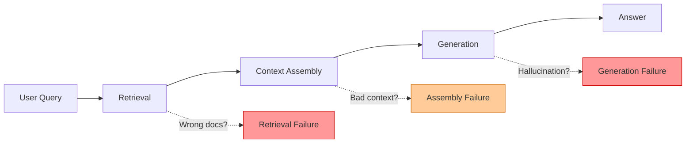
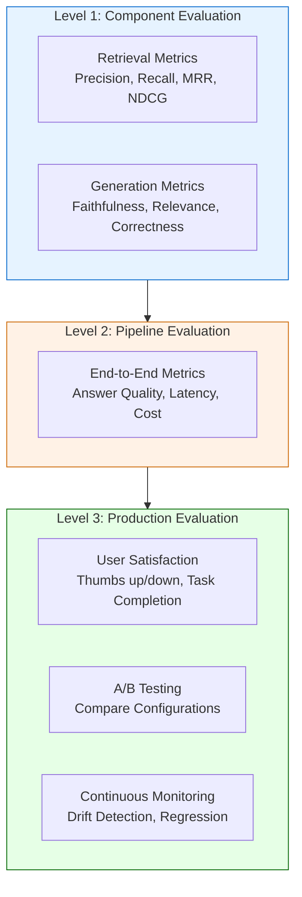
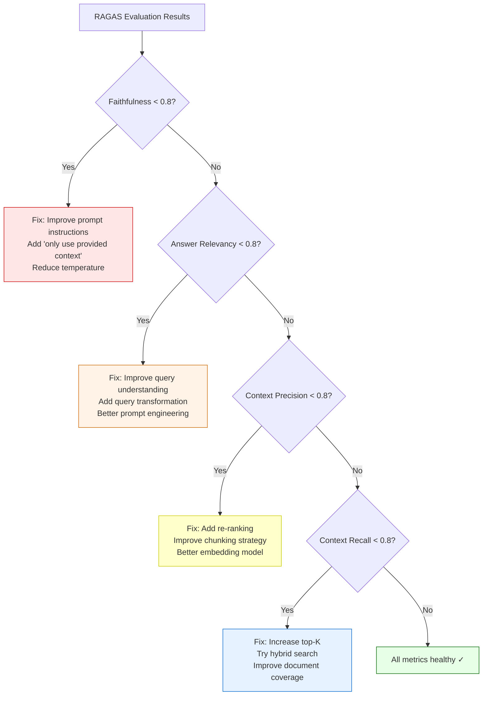
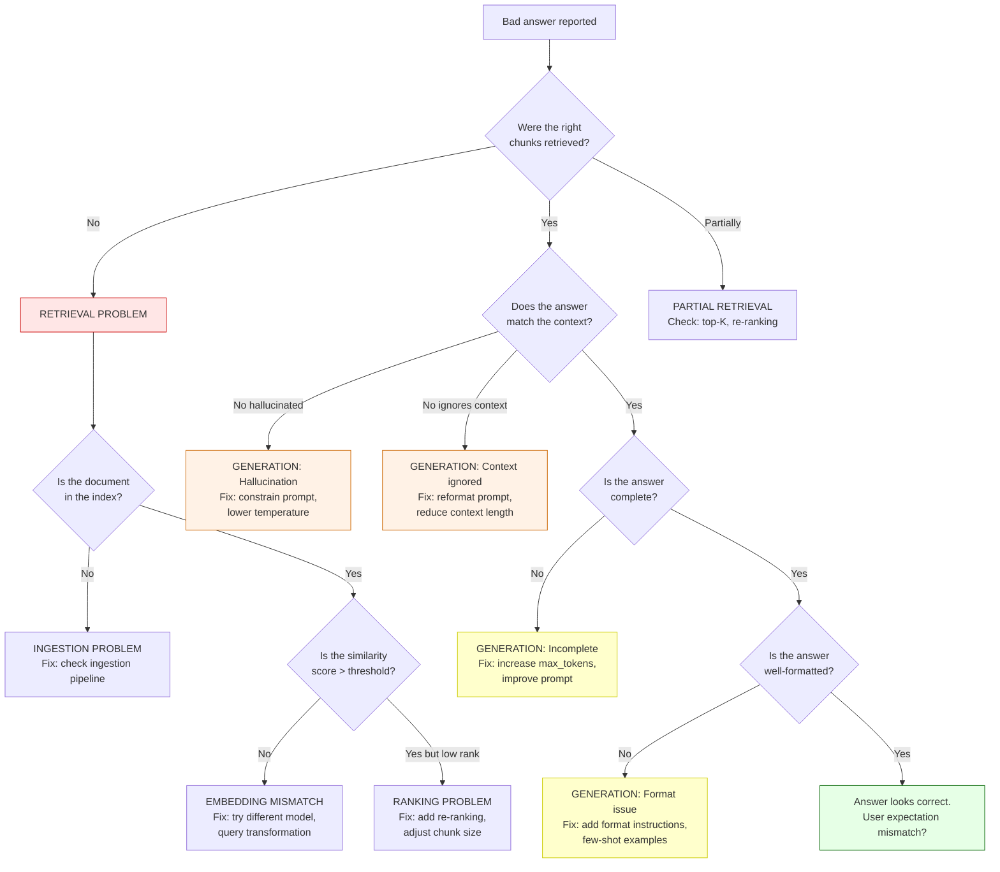

# RAG Deep Dive  Part 7: Evaluation and Debugging RAG Systems

---

**Series:** RAG (Retrieval-Augmented Generation)  A Developer's Deep Dive from Scratch to Production
**Part:** 7 of 9 (Quality Assurance)
**Audience:** Developers with Python experience who want to master RAG systems from the ground up
**Reading time:** ~50 minutes

---

## Prerequisites

Parts 0–6 of this series built the complete RAG pipeline this article now teaches you to measure and fix:

- **Part 0**  Series orientation: what RAG is and why it matters
- **Part 1**  Foundations: embeddings, vector similarity, and the retrieval concept
- **Part 2**  Chunking strategies: how to split documents for optimal retrieval
- **Part 3**  Vector stores: indexing, storage, and similarity search at scale
- **Part 4**  Retrieval strategies: sparse, dense, and hybrid search
- **Part 5**  Generation: prompt engineering, context injection, and LLM integration
- **Part 6**  Advanced RAG patterns: query transformation, re-ranking, and multi-step retrieval

This article assumes you have a working RAG pipeline. Every metric, debugging technique, and evaluation framework discussed here applies to the systems you built in Parts 1–6.

---

## 1. Recap: Where We Left Off

In Part 6, we explored advanced RAG patterns that push retrieval quality beyond basic vector search:

- **Query transformation**  Rewriting user queries for better retrieval (HyDE, multi-query, step-back prompting)
- **Re-ranking**  Using cross-encoders to reorder retrieved chunks by true relevance
- **Multi-step retrieval**  Breaking complex questions into sub-queries and merging results
- **Adaptive retrieval**  Routing queries to different retrieval strategies based on query type

These techniques can dramatically improve your RAG system  but how do you **know** they actually did? How do you measure the difference between your baseline pipeline and the advanced version? How do you catch failures before your users do?

That is what this article is about. **Evaluation and debugging are not optional add-ons  they are the foundation of every production RAG system.** Without them, you are flying blind.

> **The uncomfortable truth:** Most RAG systems in production today have no systematic evaluation. Teams ship based on vibes  "it seems to work better"  and discover failures through user complaints. This article gives you the tools to do better.

---

## 2. Why RAG Evaluation Is Hard

If you come from traditional software engineering, you are used to deterministic tests. A function takes input X and should produce output Y. If it does not, the test fails. Simple.

RAG evaluation is nothing like that. Here is why:

### 2.1 The Multi-Component Problem

A RAG pipeline has at least three stages, each of which can fail independently:



When a user gets a bad answer, **which component failed?** Did retrieval return the wrong documents? Did the context window get assembled poorly? Did the LLM hallucinate despite having correct context? You need separate metrics for each stage.

### 2.2 The Subjectivity Problem

Consider the question: "What is the best way to handle errors in Python?"

There is no single correct answer. A response discussing `try/except` blocks is valid. So is one covering custom exception classes. So is one about logging strategies. **Quality is subjective and context-dependent.**

### 2.3 The Ground Truth Problem

Traditional information retrieval has human-annotated relevance judgments. For your custom RAG system over your company's documents, **no such ground truth exists.** You need to create your own evaluation datasets  and that is expensive and time-consuming.

### 2.4 The Non-Determinism Problem

LLMs are stochastic. The same query with the same context can produce different answers across runs. Even with `temperature=0`, implementation details like floating-point arithmetic and batching can cause subtle variations. **Your evaluation must account for this variance.**

### 2.5 The Cost Problem

Every evaluation call that uses an LLM costs money and takes time. If you have 1,000 test queries and each evaluation requires 3 LLM calls (faithfulness, relevance, correctness), that is 3,000 API calls per evaluation run. At $0.01 per call, that is $30 every time you run your test suite. **Evaluation budgets are real.**

| Challenge | Traditional Testing | RAG Testing |
|---|---|---|
| Correctness | Binary (pass/fail) | Continuous (0.0–1.0 scores) |
| Ground truth | Known expected output | Must be created manually |
| Determinism | Same input → same output | Same input → varying output |
| Component isolation | Unit tests per function | Cascading failures across stages |
| Cost per test | Free (CPU only) | $0.001–$0.10 per evaluation |
| Speed | Milliseconds | Seconds to minutes |

---

## 3. The RAG Evaluation Framework

Before diving into code, let us establish a mental model. RAG evaluation happens at three levels:



**Level 1** tells you if individual components work. **Level 2** tells you if the whole pipeline works. **Level 3** tells you if users are happy and the system stays healthy over time.

We will implement all three levels in this article.

---

## 4. Retrieval Metrics  Implemented from Scratch

Retrieval evaluation answers one question: **did the system find the right documents?**

To measure this, you need:
1. A set of test queries
2. For each query, a set of **relevant documents** (ground truth)
3. For each query, the **retrieved documents** from your system

Let us start with the data structure:

```python
from dataclasses import dataclass, field
from typing import List, Dict, Set, Optional
import numpy as np


@dataclass
class RetrievalResult:
    """Represents the output of a single retrieval query."""
    query: str
    retrieved_doc_ids: List[str]        # Ordered by relevance score
    relevant_doc_ids: Set[str]          # Ground truth relevant docs
    relevance_scores: Optional[List[float]] = None  # Optional: graded relevance


@dataclass
class RetrievalEvaluation:
    """Container for evaluation results across multiple queries."""
    results: List[RetrievalResult] = field(default_factory=list)

    def add_result(self, result: RetrievalResult):
        self.results.append(result)
```

### 4.1 Precision@K

**Precision@K** answers: "Of the top K documents retrieved, how many are actually relevant?"

$$\text{Precision@K} = \frac{|\text{relevant documents in top K}|}{K}$$

A Precision@5 of 0.8 means 4 out of 5 retrieved documents are relevant. High precision means **low noise**  the user sees mostly useful results.

```python
def precision_at_k(retrieved: List[str], relevant: Set[str], k: int) -> float:
    """
    Calculate Precision@K.

    Args:
        retrieved: Ordered list of retrieved document IDs
        relevant: Set of ground truth relevant document IDs
        k: Number of top results to consider

    Returns:
        Precision score between 0.0 and 1.0
    """
    if k <= 0:
        raise ValueError("k must be positive")

    # Take only top-k results
    top_k = retrieved[:k]

    if not top_k:
        return 0.0

    # Count how many of the top-k are relevant
    relevant_in_top_k = sum(1 for doc_id in top_k if doc_id in relevant)

    return relevant_in_top_k / k


# --- Example ---
retrieved_docs = ["doc_3", "doc_1", "doc_7", "doc_4", "doc_2"]
relevant_docs = {"doc_1", "doc_2", "doc_3"}

print(f"Precision@1: {precision_at_k(retrieved_docs, relevant_docs, 1)}")  # 1.0
print(f"Precision@3: {precision_at_k(retrieved_docs, relevant_docs, 3)}")  # 0.667
print(f"Precision@5: {precision_at_k(retrieved_docs, relevant_docs, 5)}")  # 0.6
```

> **When to use Precision@K:** When your users see a fixed number of results (like a search page showing 10 results), and you want to minimize irrelevant results in that view.

### 4.2 Recall@K

**Recall@K** answers: "Of all relevant documents that exist, how many did we find in the top K?"

$$\text{Recall@K} = \frac{|\text{relevant documents in top K}|}{|\text{total relevant documents}|}$$

A Recall@10 of 0.5 means we found half of all relevant documents. High recall means **low miss rate**  we are not leaving important information behind.

```python
def recall_at_k(retrieved: List[str], relevant: Set[str], k: int) -> float:
    """
    Calculate Recall@K.

    Args:
        retrieved: Ordered list of retrieved document IDs
        relevant: Set of ground truth relevant document IDs
        k: Number of top results to consider

    Returns:
        Recall score between 0.0 and 1.0
    """
    if k <= 0:
        raise ValueError("k must be positive")

    if not relevant:
        return 0.0  # No relevant docs exist  recall is undefined, return 0

    top_k = retrieved[:k]
    relevant_in_top_k = sum(1 for doc_id in top_k if doc_id in relevant)

    return relevant_in_top_k / len(relevant)


# --- Example ---
retrieved_docs = ["doc_3", "doc_1", "doc_7", "doc_4", "doc_2"]
relevant_docs = {"doc_1", "doc_2", "doc_3", "doc_5"}  # 4 relevant docs total

print(f"Recall@3: {recall_at_k(retrieved_docs, relevant_docs, 3)}")  # 0.5 (found 2/4)
print(f"Recall@5: {recall_at_k(retrieved_docs, relevant_docs, 5)}")  # 0.75 (found 3/4)
```

> **The Precision-Recall Tradeoff:** Retrieving more documents (higher K) tends to increase recall but decrease precision. In RAG, **recall is often more important**  it is better to include an extra irrelevant chunk than to miss the one chunk containing the answer.

### 4.3 Mean Reciprocal Rank (MRR)

**MRR** answers: "How high up in the results is the first relevant document?"

$$\text{MRR} = \frac{1}{|Q|} \sum_{i=1}^{|Q|} \frac{1}{\text{rank}_i}$$

Where $\text{rank}_i$ is the position of the first relevant document for query $i$.

If the first relevant document is at position 1, the reciprocal rank is 1.0. At position 2, it is 0.5. At position 10, it is 0.1. **MRR cares most about whether the top result is correct.**

```python
def reciprocal_rank(retrieved: List[str], relevant: Set[str]) -> float:
    """
    Calculate the reciprocal rank for a single query.

    Returns 1/rank of the first relevant document, or 0 if none found.
    """
    for i, doc_id in enumerate(retrieved):
        if doc_id in relevant:
            return 1.0 / (i + 1)
    return 0.0


def mean_reciprocal_rank(results: List[RetrievalResult]) -> float:
    """
    Calculate Mean Reciprocal Rank across multiple queries.

    Args:
        results: List of RetrievalResult objects

    Returns:
        MRR score between 0.0 and 1.0
    """
    if not results:
        return 0.0

    rr_scores = [
        reciprocal_rank(r.retrieved_doc_ids, r.relevant_doc_ids)
        for r in results
    ]

    return np.mean(rr_scores)


# --- Example ---
results = [
    RetrievalResult(
        query="What is RAG?",
        retrieved_doc_ids=["doc_1", "doc_2", "doc_3"],
        relevant_doc_ids={"doc_1"}
    ),  # RR = 1/1 = 1.0
    RetrievalResult(
        query="How does chunking work?",
        retrieved_doc_ids=["doc_4", "doc_5", "doc_6"],
        relevant_doc_ids={"doc_5"}
    ),  # RR = 1/2 = 0.5
    RetrievalResult(
        query="Explain embeddings",
        retrieved_doc_ids=["doc_7", "doc_8", "doc_9"],
        relevant_doc_ids={"doc_9"}
    ),  # RR = 1/3 = 0.333
]

print(f"MRR: {mean_reciprocal_rank(results):.3f}")  # (1.0 + 0.5 + 0.333) / 3 = 0.611
```

> **When to use MRR:** When your RAG system primarily uses the top-1 retrieved chunk (common in simple RAG), MRR directly measures how often that top chunk is relevant.

### 4.4 Normalized Discounted Cumulative Gain (NDCG)

**NDCG** is the gold standard for ranking evaluation. Unlike Precision and Recall (which treat relevance as binary), NDCG supports **graded relevance**  a document can be "highly relevant" (score 3), "somewhat relevant" (score 2), "marginally relevant" (score 1), or "not relevant" (score 0).

The intuition: relevant documents near the top of the list contribute more to the score than relevant documents further down.

$$\text{DCG@K} = \sum_{i=1}^{K} \frac{2^{rel_i} - 1}{\log_2(i + 1)}$$

$$\text{NDCG@K} = \frac{\text{DCG@K}}{\text{IDCG@K}}$$

Where IDCG is the DCG of the ideal (perfect) ranking.

```python
def dcg_at_k(relevance_scores: List[float], k: int) -> float:
    """
    Calculate Discounted Cumulative Gain at K.

    Args:
        relevance_scores: Relevance score for each position (ordered by retrieval rank)
        k: Number of top results to consider

    Returns:
        DCG score
    """
    relevance_scores = relevance_scores[:k]

    dcg = 0.0
    for i, rel in enumerate(relevance_scores):
        # Position is 1-indexed: log2(1+1), log2(2+1), ...
        dcg += (2 ** rel - 1) / np.log2(i + 2)

    return dcg


def ndcg_at_k(relevance_scores: List[float], k: int) -> float:
    """
    Calculate Normalized Discounted Cumulative Gain at K.

    Args:
        relevance_scores: Relevance score for each position (ordered by retrieval rank)
        k: Number of top results to consider

    Returns:
        NDCG score between 0.0 and 1.0
    """
    dcg = dcg_at_k(relevance_scores, k)

    # Ideal DCG: sort relevance scores in descending order
    ideal_scores = sorted(relevance_scores, reverse=True)
    idcg = dcg_at_k(ideal_scores, k)

    if idcg == 0:
        return 0.0

    return dcg / idcg


# --- Example ---
# Graded relevance: 3 = highly relevant, 2 = relevant, 1 = marginal, 0 = not relevant

# Scenario: Good ranking  most relevant docs are at the top
good_ranking = [3, 2, 1, 0, 0]
print(f"NDCG@5 (good ranking):  {ndcg_at_k(good_ranking, 5):.3f}")  # ~1.0

# Scenario: Bad ranking  most relevant docs are buried
bad_ranking = [0, 0, 1, 2, 3]
print(f"NDCG@5 (bad ranking):   {ndcg_at_k(bad_ranking, 5):.3f}")   # ~0.5

# Scenario: Mixed ranking
mixed_ranking = [3, 0, 2, 0, 1]
print(f"NDCG@5 (mixed ranking): {ndcg_at_k(mixed_ranking, 5):.3f}") # ~0.85
```

> **When to use NDCG:** When document relevance is not binary. In RAG, some chunks contain the exact answer (highly relevant), some provide useful context (somewhat relevant), and some are tangentially related (marginally relevant). NDCG captures these distinctions.

### 4.5 Hit Rate

**Hit Rate** (also called **Hit@K**) is the simplest metric: "Did at least one relevant document appear in the top K?"

$$\text{Hit@K} = \frac{|\text{queries with at least one relevant doc in top K}|}{|\text{total queries}|}$$

```python
def hit_at_k(retrieved: List[str], relevant: Set[str], k: int) -> int:
    """
    Returns 1 if at least one relevant document is in top K, else 0.
    """
    top_k = set(retrieved[:k])
    return 1 if top_k & relevant else 0


def hit_rate_at_k(results: List[RetrievalResult], k: int) -> float:
    """
    Calculate Hit Rate@K across multiple queries.
    """
    if not results:
        return 0.0

    hits = sum(
        hit_at_k(r.retrieved_doc_ids, r.relevant_doc_ids, k)
        for r in results
    )

    return hits / len(results)


# --- Example ---
results = [
    RetrievalResult("q1", ["doc_1", "doc_2"], {"doc_1"}),       # Hit
    RetrievalResult("q2", ["doc_3", "doc_4"], {"doc_5"}),       # Miss
    RetrievalResult("q3", ["doc_6", "doc_7"], {"doc_7"}),       # Hit
    RetrievalResult("q4", ["doc_8", "doc_9"], {"doc_10"}),      # Miss
    RetrievalResult("q5", ["doc_11", "doc_12"], {"doc_11"}),    # Hit
]

print(f"Hit Rate@2: {hit_rate_at_k(results, 2):.2f}")  # 3/5 = 0.60
```

> **When to use Hit Rate:** As a quick sanity check. If your Hit Rate@10 is below 0.8, your retrieval has fundamental problems that fancy re-ranking cannot fix.

### 4.6 Context Relevance Score

The metrics above require binary or graded ground truth labels. **Context Relevance Score** uses an LLM to judge whether retrieved chunks are relevant to the query  no ground truth needed.

```python
import openai

client = openai.OpenAI()


def context_relevance_score(
    query: str,
    retrieved_chunks: List[str],
    model: str = "gpt-4o-mini"
) -> Dict[str, float]:
    """
    Use an LLM to score the relevance of each retrieved chunk to the query.

    Returns:
        Dictionary with overall score and per-chunk scores
    """
    per_chunk_scores = []

    for i, chunk in enumerate(retrieved_chunks):
        prompt = f"""Rate the relevance of the following text chunk to the given query.

Query: {query}

Text Chunk:
---
{chunk}
---

Rate relevance on a scale of 0 to 10:
- 0: Completely irrelevant
- 3: Tangentially related but not useful
- 5: Somewhat relevant, provides background
- 7: Relevant, contains useful information
- 10: Highly relevant, directly answers the query

Return ONLY a single integer score, nothing else."""

        response = client.chat.completions.create(
            model=model,
            messages=[{"role": "user", "content": prompt}],
            temperature=0,
            max_tokens=5,
        )

        try:
            score = int(response.choices[0].message.content.strip())
            score = max(0, min(10, score))  # Clamp to 0-10
        except ValueError:
            score = 0

        per_chunk_scores.append(score)

    return {
        "overall_score": np.mean(per_chunk_scores) / 10.0,  # Normalize to 0-1
        "per_chunk_scores": per_chunk_scores,
        "num_relevant": sum(1 for s in per_chunk_scores if s >= 7),
        "num_chunks": len(retrieved_chunks),
    }
```

### 4.7 Unified Retrieval Evaluator

Let us combine all metrics into a single evaluator class:

```python
class RetrievalEvaluator:
    """Comprehensive retrieval evaluation with all metrics."""

    def evaluate(self, results: List[RetrievalResult], k: int = 5) -> Dict:
        """
        Run all retrieval metrics on a set of results.

        Returns a dictionary of metric names to scores.
        """
        metrics = {
            "num_queries": len(results),
            "k": k,
            "precision_at_k": np.mean([
                precision_at_k(r.retrieved_doc_ids, r.relevant_doc_ids, k)
                for r in results
            ]),
            "recall_at_k": np.mean([
                recall_at_k(r.retrieved_doc_ids, r.relevant_doc_ids, k)
                for r in results
            ]),
            "mrr": mean_reciprocal_rank(results),
            "hit_rate_at_k": hit_rate_at_k(results, k),
        }

        # NDCG requires graded relevance  compute if available
        ndcg_scores = []
        for r in results:
            if r.relevance_scores:
                ndcg_scores.append(ndcg_at_k(r.relevance_scores, k))

        if ndcg_scores:
            metrics["ndcg_at_k"] = np.mean(ndcg_scores)

        return metrics

    def print_report(self, metrics: Dict):
        """Pretty-print evaluation results."""
        print("\n" + "=" * 50)
        print("  RETRIEVAL EVALUATION REPORT")
        print("=" * 50)
        print(f"  Queries evaluated: {metrics['num_queries']}")
        print(f"  K:                 {metrics['k']}")
        print("-" * 50)
        print(f"  Precision@{metrics['k']}:      {metrics['precision_at_k']:.4f}")
        print(f"  Recall@{metrics['k']}:         {metrics['recall_at_k']:.4f}")
        print(f"  MRR:               {metrics['mrr']:.4f}")
        print(f"  Hit Rate@{metrics['k']}:       {metrics['hit_rate_at_k']:.4f}")
        if "ndcg_at_k" in metrics:
            print(f"  NDCG@{metrics['k']}:          {metrics['ndcg_at_k']:.4f}")
        print("=" * 50 + "\n")


# --- Full example ---
evaluator = RetrievalEvaluator()

test_results = [
    RetrievalResult("What is RAG?",
        ["d1", "d5", "d3", "d8", "d2"], {"d1", "d3", "d2"}),
    RetrievalResult("How to chunk documents?",
        ["d4", "d1", "d6", "d7", "d9"], {"d4", "d6"}),
    RetrievalResult("Best embedding models?",
        ["d10", "d11", "d12", "d13", "d14"], {"d15", "d16"}),
    RetrievalResult("Vector database comparison",
        ["d20", "d21", "d22", "d23", "d24"], {"d20", "d21", "d22"}),
]

metrics = evaluator.evaluate(test_results, k=5)
evaluator.print_report(metrics)
```

---

## 5. Generation Metrics

Retrieval metrics tell you if you found the right documents. **Generation metrics** tell you if the LLM produced a good answer from those documents.

### 5.1 Faithfulness (Groundedness)

**Faithfulness** measures whether the generated answer is supported by the retrieved context. An unfaithful answer contains information the LLM invented  this is **hallucination**.

> **Faithfulness is the single most important generation metric for RAG.** The entire point of RAG is to ground LLM outputs in factual context. If faithfulness is low, your RAG system is failing at its core purpose.

```python
def evaluate_faithfulness(
    query: str,
    context: str,
    answer: str,
    model: str = "gpt-4o-mini"
) -> Dict:
    """
    Evaluate whether the answer is faithful to the provided context.

    Step 1: Extract claims from the answer.
    Step 2: Verify each claim against the context.

    Returns:
        Dictionary with faithfulness score and claim-level details.
    """
    # Step 1: Extract claims
    extraction_prompt = f"""Extract all factual claims from the following answer.
Return each claim on a separate line, prefixed with "- ".
Only extract factual statements, not opinions or hedging language.

Answer: {answer}

Claims:"""

    response = client.chat.completions.create(
        model=model,
        messages=[{"role": "user", "content": extraction_prompt}],
        temperature=0,
    )

    claims_text = response.choices[0].message.content.strip()
    claims = [
        line.strip().lstrip("- ").strip()
        for line in claims_text.split("\n")
        if line.strip().startswith("- ")
    ]

    if not claims:
        return {"score": 1.0, "claims": [], "details": "No claims extracted"}

    # Step 2: Verify each claim against context
    verified_claims = []
    for claim in claims:
        verification_prompt = f"""Given the following context, determine if the claim is supported.

Context:
---
{context}
---

Claim: {claim}

Is this claim supported by the context? Answer with exactly one word: "supported", "contradicted", or "unsupported".
"""
        response = client.chat.completions.create(
            model=model,
            messages=[{"role": "user", "content": verification_prompt}],
            temperature=0,
            max_tokens=10,
        )

        verdict = response.choices[0].message.content.strip().lower()
        verified_claims.append({
            "claim": claim,
            "verdict": verdict,
            "is_faithful": verdict == "supported",
        })

    faithful_count = sum(1 for c in verified_claims if c["is_faithful"])

    return {
        "score": faithful_count / len(verified_claims),
        "num_claims": len(verified_claims),
        "num_faithful": faithful_count,
        "claims": verified_claims,
    }
```

### 5.2 Answer Relevance

**Answer Relevance** measures whether the answer actually addresses the question. A faithful answer can still be irrelevant  it might accurately describe retrieved content that has nothing to do with what the user asked.

```python
def evaluate_answer_relevance(
    query: str,
    answer: str,
    model: str = "gpt-4o-mini"
) -> Dict:
    """
    Evaluate whether the answer is relevant to the query.

    Uses reverse question generation: if the answer is relevant,
    we should be able to generate similar questions from it.
    """
    # Generate questions that the answer could respond to
    gen_prompt = f"""Given the following answer, generate 3 questions that this answer
would be a good response to. Return each question on a separate line, prefixed with "Q: ".

Answer: {answer}

Questions:"""

    response = client.chat.completions.create(
        model=model,
        messages=[{"role": "user", "content": gen_prompt}],
        temperature=0.3,
    )

    generated_questions = [
        line.strip().lstrip("Q: ").strip()
        for line in response.choices[0].message.content.strip().split("\n")
        if line.strip().startswith("Q:")
    ]

    # Score similarity between original query and generated questions
    scoring_prompt = f"""Rate the semantic similarity between the original question and each
generated question on a scale of 0-10.

Original question: {query}

Generated questions:
{chr(10).join(f'{i+1}. {q}' for i, q in enumerate(generated_questions))}

For each generated question, respond with its number and score in format "N: score".
"""

    response = client.chat.completions.create(
        model=model,
        messages=[{"role": "user", "content": scoring_prompt}],
        temperature=0,
    )

    # Parse scores
    scores = []
    for line in response.choices[0].message.content.strip().split("\n"):
        try:
            parts = line.strip().split(":")
            if len(parts) >= 2:
                score = float(parts[-1].strip())
                scores.append(min(10, max(0, score)))
        except (ValueError, IndexError):
            continue

    overall_score = np.mean(scores) / 10.0 if scores else 0.0

    return {
        "score": overall_score,
        "generated_questions": generated_questions,
        "similarity_scores": scores,
    }
```

### 5.3 Answer Correctness

**Answer Correctness** measures factual accuracy against a known reference answer. This requires ground truth  a human-written "golden" answer.

```python
def evaluate_answer_correctness(
    query: str,
    generated_answer: str,
    reference_answer: str,
    model: str = "gpt-4o-mini"
) -> Dict:
    """
    Evaluate the correctness of a generated answer against a reference answer.

    Combines:
    - Semantic similarity (does it convey the same information?)
    - Factual overlap (does it contain the same facts?)
    """
    prompt = f"""Compare the generated answer with the reference answer for the given question.

Question: {query}

Reference Answer (ground truth):
{reference_answer}

Generated Answer:
{generated_answer}

Evaluate on three dimensions:
1. **Factual Overlap** (0-10): How many facts from the reference are present in the generated answer?
2. **Factual Accuracy** (0-10): Are the facts in the generated answer correct according to the reference?
3. **Completeness** (0-10): Does the generated answer cover all key points from the reference?

Respond in exactly this format:
Factual Overlap: <score>
Factual Accuracy: <score>
Completeness: <score>
Reasoning: <brief explanation>"""

    response = client.chat.completions.create(
        model=model,
        messages=[{"role": "user", "content": prompt}],
        temperature=0,
    )

    text = response.choices[0].message.content.strip()

    scores = {}
    reasoning = ""
    for line in text.split("\n"):
        line = line.strip()
        if line.startswith("Factual Overlap:"):
            scores["factual_overlap"] = float(line.split(":")[1].strip()) / 10
        elif line.startswith("Factual Accuracy:"):
            scores["factual_accuracy"] = float(line.split(":")[1].strip()) / 10
        elif line.startswith("Completeness:"):
            scores["completeness"] = float(line.split(":")[1].strip()) / 10
        elif line.startswith("Reasoning:"):
            reasoning = line.split(":", 1)[1].strip()

    # Overall correctness is a weighted combination
    if scores:
        overall = (
            0.4 * scores.get("factual_accuracy", 0)
            + 0.3 * scores.get("factual_overlap", 0)
            + 0.3 * scores.get("completeness", 0)
        )
    else:
        overall = 0.0

    return {
        "score": overall,
        "dimensions": scores,
        "reasoning": reasoning,
    }
```

### 5.4 Traditional NLP Metrics: BLEU and ROUGE

Before LLM-as-judge became practical, the NLP community used lexical overlap metrics. They are **fast and free** (no API calls), but they measure **surface-level similarity**, not semantic correctness.

```python
from collections import Counter
import math


def compute_bleu(reference: str, hypothesis: str, max_n: int = 4) -> float:
    """
    Compute BLEU score (simplified single-reference version).

    BLEU measures n-gram overlap between reference and hypothesis.
    Used in machine translation; borrowed for answer evaluation.
    """
    ref_tokens = reference.lower().split()
    hyp_tokens = hypothesis.lower().split()

    if not hyp_tokens:
        return 0.0

    # Brevity penalty
    bp = min(1.0, math.exp(1 - len(ref_tokens) / len(hyp_tokens)))

    precisions = []
    for n in range(1, max_n + 1):
        # Count n-grams in reference
        ref_ngrams = Counter()
        for i in range(len(ref_tokens) - n + 1):
            ngram = tuple(ref_tokens[i:i + n])
            ref_ngrams[ngram] += 1

        # Count n-grams in hypothesis
        hyp_ngrams = Counter()
        for i in range(len(hyp_tokens) - n + 1):
            ngram = tuple(hyp_tokens[i:i + n])
            hyp_ngrams[ngram] += 1

        # Clipped count
        clipped = sum(
            min(count, ref_ngrams.get(ngram, 0))
            for ngram, count in hyp_ngrams.items()
        )
        total = sum(hyp_ngrams.values())

        if total == 0:
            precisions.append(0)
        else:
            precisions.append(clipped / total)

    # Geometric mean of precisions
    if any(p == 0 for p in precisions):
        return 0.0

    log_avg = sum(math.log(p) for p in precisions) / len(precisions)

    return bp * math.exp(log_avg)


def compute_rouge_l(reference: str, hypothesis: str) -> Dict[str, float]:
    """
    Compute ROUGE-L score (Longest Common Subsequence based).

    ROUGE-L captures sentence-level structure similarity.
    """
    ref_tokens = reference.lower().split()
    hyp_tokens = hypothesis.lower().split()

    if not ref_tokens or not hyp_tokens:
        return {"precision": 0.0, "recall": 0.0, "f1": 0.0}

    # Compute LCS length using dynamic programming
    m, n = len(ref_tokens), len(hyp_tokens)
    dp = [[0] * (n + 1) for _ in range(m + 1)]

    for i in range(1, m + 1):
        for j in range(1, n + 1):
            if ref_tokens[i - 1] == hyp_tokens[j - 1]:
                dp[i][j] = dp[i - 1][j - 1] + 1
            else:
                dp[i][j] = max(dp[i - 1][j], dp[i][j - 1])

    lcs_length = dp[m][n]

    precision = lcs_length / n if n > 0 else 0.0
    recall = lcs_length / m if m > 0 else 0.0
    f1 = (2 * precision * recall / (precision + recall)) if (precision + recall) > 0 else 0.0

    return {"precision": precision, "recall": recall, "f1": f1}


# --- Example ---
reference = "RAG combines retrieval with generation to produce grounded answers"
hypothesis = "RAG uses retrieval and generation together for grounded responses"

print(f"BLEU: {compute_bleu(reference, hypothesis):.3f}")
print(f"ROUGE-L: {compute_rouge_l(reference, hypothesis)}")
```

> **The limitations of BLEU and ROUGE for RAG:** These metrics fail when semantically equivalent answers use different words. "The capital of France is Paris" and "Paris serves as France's capital city" convey the same information but have low lexical overlap. **Use LLM-based metrics for semantic evaluation.** Reserve BLEU/ROUGE for quick sanity checks or as complementary signals.

| Metric | What It Measures | Speed | Cost | Semantic Awareness |
|---|---|---|---|---|
| BLEU | N-gram overlap | Instant | Free | None |
| ROUGE-L | Longest common subsequence | Instant | Free | None |
| Faithfulness (LLM) | Grounded in context | Slow | $$$ | High |
| Answer Relevance (LLM) | Addresses the question | Slow | $$$ | High |
| Answer Correctness (LLM) | Factually correct | Slow | $$$ | High |

---

## 6. LLM-as-Judge Evaluation

The most powerful evaluation approach for RAG systems is **using LLMs to judge LLM outputs**. This sounds circular, but it works remarkably well when done correctly.

### 6.1 Why LLM-as-Judge Works

The key insight: **evaluation is easier than generation.** A student might struggle to write an essay, but a teacher can readily identify whether an essay is good. Similarly, an LLM may generate imperfect answers, but it can reliably identify quality issues in answers.

Research has shown that GPT-4 class models agree with human expert judgments 80-85% of the time  comparable to inter-annotator agreement between human experts themselves.

### 6.2 Designing Evaluation Prompts

The quality of LLM-as-judge evaluation depends entirely on **prompt design**. Poorly designed evaluation prompts produce unreliable scores.

**Principles for evaluation prompts:**

1. **Be specific**  Define exactly what you are evaluating
2. **Provide a rubric**  Give concrete criteria for each score level
3. **Include examples**  Show what a score of 1, 3, and 5 look like
4. **Require reasoning**  Force the judge to explain before scoring (reduces bias)
5. **Use structured output**  Parse scores reliably

### 6.3 Full LLM-as-Judge Implementation

```python
from enum import Enum
from typing import Optional
import json


class EvalDimension(Enum):
    FAITHFULNESS = "faithfulness"
    RELEVANCE = "relevance"
    COMPLETENESS = "completeness"
    COHERENCE = "coherence"
    CONCISENESS = "conciseness"


# Rubrics for each evaluation dimension
RUBRICS = {
    EvalDimension.FAITHFULNESS: {
        "description": "Does the answer only contain information supported by the context?",
        "scores": {
            1: "The answer contains multiple claims not found in the context (hallucination).",
            2: "The answer contains some claims not supported by the context.",
            3: "The answer mostly sticks to the context with minor unsupported additions.",
            4: "The answer is well-grounded in the context with at most one minor deviation.",
            5: "Every claim in the answer is directly supported by the provided context.",
        },
    },
    EvalDimension.RELEVANCE: {
        "description": "Does the answer address what the user actually asked?",
        "scores": {
            1: "The answer is completely off-topic or addresses a different question.",
            2: "The answer is tangentially related but misses the core question.",
            3: "The answer partially addresses the question but misses key aspects.",
            4: "The answer addresses the main question with minor gaps.",
            5: "The answer directly and completely addresses the user's question.",
        },
    },
    EvalDimension.COMPLETENESS: {
        "description": "Does the answer cover all important aspects of the question?",
        "scores": {
            1: "The answer is extremely incomplete, missing most relevant information.",
            2: "The answer covers some aspects but misses several important points.",
            3: "The answer covers the main points but lacks important details.",
            4: "The answer is thorough with only minor omissions.",
            5: "The answer comprehensively covers all aspects of the question.",
        },
    },
    EvalDimension.COHERENCE: {
        "description": "Is the answer well-organized and easy to follow?",
        "scores": {
            1: "The answer is incoherent, contradictory, or impossible to follow.",
            2: "The answer has significant organizational issues or contradictions.",
            3: "The answer is understandable but could be better organized.",
            4: "The answer is well-organized with clear logical flow.",
            5: "The answer is exceptionally clear, well-structured, and easy to follow.",
        },
    },
    EvalDimension.CONCISENESS: {
        "description": "Is the answer appropriately concise without unnecessary repetition?",
        "scores": {
            1: "The answer is extremely verbose with excessive repetition.",
            2: "The answer contains significant unnecessary content.",
            3: "The answer is adequate but could be more concise.",
            4: "The answer is mostly concise with minimal unnecessary content.",
            5: "The answer is perfectly concise  nothing to add, nothing to remove.",
        },
    },
}


class LLMJudge:
    """
    A configurable LLM-as-Judge evaluator for RAG systems.

    Evaluates answers across multiple dimensions using structured rubrics.
    """

    def __init__(self, model: str = "gpt-4o", temperature: float = 0.0):
        self.model = model
        self.temperature = temperature
        self.client = openai.OpenAI()

    def _build_eval_prompt(
        self,
        query: str,
        context: str,
        answer: str,
        dimension: EvalDimension,
    ) -> str:
        """Build the evaluation prompt with rubric."""
        rubric = RUBRICS[dimension]

        scores_text = "\n".join(
            f"  {score}: {desc}" for score, desc in rubric["scores"].items()
        )

        return f"""You are an expert evaluator for RAG (Retrieval-Augmented Generation) systems.

Your task is to evaluate the quality of an AI-generated answer along one specific dimension.

## Evaluation Dimension: {dimension.value.upper()}
{rubric["description"]}

## Scoring Rubric
{scores_text}

## Inputs

**User Question:**
{query}

**Retrieved Context:**
{context}

**Generated Answer:**
{answer}

## Instructions
1. First, analyze the answer carefully with respect to the evaluation dimension.
2. Provide your reasoning in 2-3 sentences.
3. Then assign a score from 1-5 based on the rubric above.

Respond in EXACTLY this JSON format:
{{"reasoning": "<your reasoning>", "score": <integer 1-5>}}"""

    def evaluate_dimension(
        self,
        query: str,
        context: str,
        answer: str,
        dimension: EvalDimension,
    ) -> Dict:
        """Evaluate a single dimension."""
        prompt = self._build_eval_prompt(query, context, answer, dimension)

        response = self.client.chat.completions.create(
            model=self.model,
            messages=[{"role": "user", "content": prompt}],
            temperature=self.temperature,
            response_format={"type": "json_object"},
        )

        result = json.loads(response.choices[0].message.content)

        return {
            "dimension": dimension.value,
            "score": result["score"],
            "normalized_score": result["score"] / 5.0,
            "reasoning": result["reasoning"],
        }

    def evaluate_all(
        self,
        query: str,
        context: str,
        answer: str,
        dimensions: Optional[List[EvalDimension]] = None,
    ) -> Dict:
        """Evaluate across all specified dimensions."""
        if dimensions is None:
            dimensions = list(EvalDimension)

        results = {}
        for dim in dimensions:
            results[dim.value] = self.evaluate_dimension(
                query, context, answer, dim
            )

        # Compute overall score (weighted average)
        weights = {
            "faithfulness": 0.30,
            "relevance": 0.25,
            "completeness": 0.20,
            "coherence": 0.15,
            "conciseness": 0.10,
        }

        overall = sum(
            results[dim]["normalized_score"] * weights.get(dim, 0.2)
            for dim in results
        )

        return {
            "overall_score": overall,
            "dimensions": results,
        }

    def print_report(self, evaluation: Dict):
        """Pretty-print the evaluation report."""
        print("\n" + "=" * 60)
        print("  LLM-AS-JUDGE EVALUATION REPORT")
        print("=" * 60)
        print(f"  Overall Score: {evaluation['overall_score']:.2f} / 1.00")
        print("-" * 60)

        for dim_name, dim_result in evaluation["dimensions"].items():
            bar = "█" * dim_result["score"] + "░" * (5 - dim_result["score"])
            print(f"  {dim_name:<15} [{bar}] {dim_result['score']}/5")
            print(f"    → {dim_result['reasoning']}")

        print("=" * 60 + "\n")


# --- Full usage example ---
judge = LLMJudge(model="gpt-4o")

query = "What are the benefits of using chunking in RAG systems?"
context = """Chunking is the process of breaking down large documents into smaller,
manageable pieces for vector storage and retrieval. Benefits include: 1) More precise
retrieval  smaller chunks allow finding the exact relevant passage rather than
returning entire documents. 2) Better embedding quality  embedding models have token
limits and perform better on focused text. 3) Efficient context window usage  smaller
chunks mean you can include more diverse sources in the LLM's context window."""

answer = """Chunking in RAG systems provides several key benefits:

1. **Precise retrieval**: By breaking documents into smaller pieces, the system can
   find the exact relevant passage instead of returning entire documents.
2. **Better embeddings**: Embedding models work better on focused, shorter text
   segments and have token limits that chunking respects.
3. **Efficient context usage**: Smaller chunks allow including information from
   multiple sources in the LLM's context window.
4. **Faster processing**: Smaller chunks are processed more quickly by the system."""

evaluation = judge.evaluate_all(query, context, answer)
judge.print_report(evaluation)
```

### 6.4 Pros and Cons of LLM-as-Judge

| Aspect | Advantage | Limitation |
|---|---|---|
| **Accuracy** | 80-85% agreement with human experts | Can be fooled by fluent but wrong answers |
| **Scalability** | Evaluates thousands of samples automatically | Costs $0.01-$0.10 per evaluation |
| **Flexibility** | Works with any domain, no labeled data needed | Prompt sensitivity  small prompt changes shift scores |
| **Speed** | Seconds per evaluation | Too slow for real-time production scoring |
| **Bias** | Consistent (no annotator fatigue) | Position bias, verbosity bias, self-preference bias |
| **Reproducibility** | High with temperature=0 | Not perfectly deterministic |

> **Known biases in LLM judges:**
> - **Verbosity bias**  LLMs tend to rate longer answers higher, even when the extra content adds no value
> - **Position bias**  When comparing two answers, the one presented first (or second, depending on the model) gets a slight advantage
> - **Self-preference bias**  GPT-4 rates GPT-4 outputs slightly higher than Claude outputs, and vice versa
>
> **Mitigation:** Use rubrics that explicitly penalize unnecessary verbosity. Randomize answer positions when doing pairwise comparisons. Use a different model family for evaluation than generation.

---

## 7. RAGAS Framework

**RAGAS** (Retrieval-Augmented Generation Assessment) is the most popular open-source framework for RAG evaluation. Rather than building everything from scratch, RAGAS provides battle-tested implementations of the key metrics.

### 7.1 Installation and Setup

```bash
pip install ragas datasets
```

### 7.2 Key RAGAS Metrics

RAGAS provides four core metrics:

| Metric | What It Measures | Range | Requires Ground Truth? |
|---|---|---|---|
| **Faithfulness** | Is the answer grounded in the context? | 0–1 | No |
| **Answer Relevancy** | Does the answer address the question? | 0–1 | No |
| **Context Precision** | Are relevant contexts ranked higher? | 0–1 | Yes (ground truth answer) |
| **Context Recall** | Are all relevant facts in the context? | 0–1 | Yes (ground truth answer) |

### 7.3 Full Working Example

```python
from ragas import evaluate
from ragas.metrics import (
    faithfulness,
    answer_relevancy,
    context_precision,
    context_recall,
)
from datasets import Dataset

# Prepare evaluation data
# RAGAS expects a HuggingFace Dataset with specific columns
eval_data = {
    "question": [
        "What is the capital of France?",
        "How does photosynthesis work?",
        "What are the benefits of RAG?",
    ],
    "answer": [
        "The capital of France is Paris, which is also the largest city in France.",
        "Photosynthesis is the process by which plants convert sunlight into energy. "
        "Plants use chlorophyll to absorb light, which drives the conversion of "
        "carbon dioxide and water into glucose and oxygen.",
        "RAG (Retrieval-Augmented Generation) provides several benefits: it reduces "
        "hallucination by grounding answers in factual documents, enables access to "
        "up-to-date information, and allows customization without fine-tuning.",
    ],
    "contexts": [
        [
            "Paris is the capital and most populous city of France. "
            "With an estimated population of 2.1 million residents, it is "
            "the center of the Île-de-France region."
        ],
        [
            "Photosynthesis is a process used by plants and other organisms to "
            "convert light energy into chemical energy. This chemical energy is "
            "stored in carbohydrate molecules, such as sugars and starches. "
            "Chlorophyll absorbs light, mostly in the blue and red wavelengths."
        ],
        [
            "Retrieval-Augmented Generation (RAG) combines information retrieval "
            "with text generation. Key benefits include: reduced hallucination, "
            "access to current information beyond training data, domain "
            "customization without expensive fine-tuning, and transparency "
            "through source attribution."
        ],
    ],
    "ground_truth": [
        "The capital of France is Paris.",
        "Photosynthesis is the process where plants use sunlight, water, and "
        "carbon dioxide to produce glucose and oxygen using chlorophyll.",
        "RAG benefits include reduced hallucination, access to current information, "
        "domain customization without fine-tuning, and source attribution.",
    ],
}

dataset = Dataset.from_dict(eval_data)

# Run evaluation
results = evaluate(
    dataset,
    metrics=[
        faithfulness,
        answer_relevancy,
        context_precision,
        context_recall,
    ],
)

# Print results
print("\n=== RAGAS Evaluation Results ===")
print(f"Faithfulness:      {results['faithfulness']:.4f}")
print(f"Answer Relevancy:  {results['answer_relevancy']:.4f}")
print(f"Context Precision: {results['context_precision']:.4f}")
print(f"Context Recall:    {results['context_recall']:.4f}")

# Convert to pandas DataFrame for detailed analysis
df = results.to_pandas()
print("\n=== Per-Question Results ===")
print(df.to_string(index=False))
```

### 7.4 Evaluating Your Own RAG Pipeline with RAGAS

Here is how to connect RAGAS to an existing RAG pipeline:

```python
from ragas import evaluate
from ragas.metrics import faithfulness, answer_relevancy
from datasets import Dataset


def evaluate_rag_pipeline(
    pipeline,  # Your RAG pipeline object
    test_questions: List[str],
    ground_truths: Optional[List[str]] = None,
) -> Dict:
    """
    Evaluate a RAG pipeline using RAGAS.

    Args:
        pipeline: Your RAG pipeline with a .query() method
        test_questions: List of test questions
        ground_truths: Optional list of reference answers
    """
    questions = []
    answers = []
    contexts = []

    for question in test_questions:
        # Run your pipeline
        result = pipeline.query(question)

        questions.append(question)
        answers.append(result["answer"])
        contexts.append(result["retrieved_chunks"])

    eval_data = {
        "question": questions,
        "answer": answers,
        "contexts": contexts,
    }

    if ground_truths:
        eval_data["ground_truth"] = ground_truths

    dataset = Dataset.from_dict(eval_data)

    # Select metrics based on available data
    metrics = [faithfulness, answer_relevancy]
    if ground_truths:
        from ragas.metrics import context_precision, context_recall
        metrics.extend([context_precision, context_recall])

    results = evaluate(dataset, metrics=metrics)

    return results
```

### 7.5 Interpreting RAGAS Results



**Score interpretation guide:**

| Score Range | Interpretation | Action |
|---|---|---|
| 0.9–1.0 | Excellent | Monitor for regression |
| 0.8–0.9 | Good | Minor improvements possible |
| 0.6–0.8 | Needs improvement | Targeted optimization required |
| 0.4–0.6 | Poor | Significant pipeline changes needed |
| 0.0–0.4 | Critical | Fundamental architecture issues |

---

## 8. Building an Evaluation Dataset

Every evaluation metric requires test data. The quality of your evaluation is **directly proportional to the quality of your test dataset.**

### 8.1 Manual Curation

The gold standard. Domain experts write questions and answers based on your actual document corpus.

**Process:**

1. **Sample documents**  Select a representative subset of your corpus
2. **Write questions**  For each document (or group of documents), write 3–5 questions at varying difficulty
3. **Write reference answers**  Provide the "ideal" answer for each question
4. **Tag relevant chunks**  Identify which chunks contain the answer

```python
import json
from dataclasses import dataclass, asdict
from typing import List, Optional


@dataclass
class EvalSample:
    """A single evaluation sample in the golden dataset."""
    question: str
    reference_answer: str
    relevant_chunk_ids: List[str]
    difficulty: str  # "easy", "medium", "hard"
    category: str    # Domain-specific category
    metadata: Optional[Dict] = None


class GoldenDataset:
    """Manage a golden evaluation dataset for RAG."""

    def __init__(self, filepath: str = "golden_dataset.json"):
        self.filepath = filepath
        self.samples: List[EvalSample] = []
        self._load()

    def _load(self):
        """Load dataset from disk."""
        try:
            with open(self.filepath, "r") as f:
                data = json.load(f)
                self.samples = [EvalSample(**s) for s in data]
        except FileNotFoundError:
            self.samples = []

    def save(self):
        """Persist dataset to disk."""
        with open(self.filepath, "w") as f:
            json.dump([asdict(s) for s in self.samples], f, indent=2)

    def add_sample(self, sample: EvalSample):
        """Add a new evaluation sample."""
        self.samples.append(sample)
        self.save()

    def get_by_difficulty(self, difficulty: str) -> List[EvalSample]:
        """Filter samples by difficulty level."""
        return [s for s in self.samples if s.difficulty == difficulty]

    def get_by_category(self, category: str) -> List[EvalSample]:
        """Filter samples by category."""
        return [s for s in self.samples if s.category == category]

    def summary(self) -> Dict:
        """Get dataset statistics."""
        from collections import Counter
        difficulties = Counter(s.difficulty for s in self.samples)
        categories = Counter(s.category for s in self.samples)
        return {
            "total_samples": len(self.samples),
            "by_difficulty": dict(difficulties),
            "by_category": dict(categories),
        }


# --- Usage ---
dataset = GoldenDataset("my_rag_eval_dataset.json")

dataset.add_sample(EvalSample(
    question="What chunking strategies work best for code documentation?",
    reference_answer="For code documentation, semantic chunking based on function "
        "or class boundaries works best. Fixed-size chunking can split code examples "
        "mid-function, losing context. Recursive chunking with code-aware separators "
        "(class definitions, function definitions, blank lines) preserves logical units.",
    relevant_chunk_ids=["chunk_042", "chunk_043", "chunk_108"],
    difficulty="medium",
    category="chunking",
))

print(dataset.summary())
```

### 8.2 Synthetic Test Generation Using LLMs

Manual curation is high-quality but expensive. For broader coverage, use LLMs to **generate test questions from your documents.**

```python
class SyntheticTestGenerator:
    """
    Generate synthetic evaluation data from document chunks.

    Uses an LLM to create question-answer pairs from your actual corpus,
    ensuring the test data matches your real use case.
    """

    def __init__(self, model: str = "gpt-4o"):
        self.client = openai.OpenAI()
        self.model = model

    def generate_from_chunk(
        self,
        chunk_text: str,
        chunk_id: str,
        num_questions: int = 3,
        difficulty: str = "mixed",
    ) -> List[EvalSample]:
        """
        Generate question-answer pairs from a single document chunk.
        """
        difficulty_instruction = ""
        if difficulty == "easy":
            difficulty_instruction = "Generate simple, factual questions that can be answered directly from the text."
        elif difficulty == "hard":
            difficulty_instruction = "Generate complex questions that require understanding, synthesis, or inference from the text."
        else:
            difficulty_instruction = "Generate a mix of simple factual and complex analytical questions."

        prompt = f"""You are generating evaluation data for a RAG (Retrieval-Augmented Generation) system.

Given the following document chunk, generate {num_questions} question-answer pairs.

{difficulty_instruction}

Document Chunk:
---
{chunk_text}
---

Requirements:
1. Questions should be natural  the kind a real user would ask.
2. Answers should be comprehensive but concise.
3. Answers must be fully supported by the chunk text.
4. Include a difficulty rating for each (easy, medium, hard).

Respond in this JSON format:
{{
  "pairs": [
    {{
      "question": "...",
      "answer": "...",
      "difficulty": "easy|medium|hard"
    }}
  ]
}}"""

        response = self.client.chat.completions.create(
            model=self.model,
            messages=[{"role": "user", "content": prompt}],
            temperature=0.7,
            response_format={"type": "json_object"},
        )

        data = json.loads(response.choices[0].message.content)

        samples = []
        for pair in data.get("pairs", []):
            samples.append(EvalSample(
                question=pair["question"],
                reference_answer=pair["answer"],
                relevant_chunk_ids=[chunk_id],
                difficulty=pair.get("difficulty", "medium"),
                category="synthetic",
            ))

        return samples

    def generate_multi_chunk_questions(
        self,
        chunks: List[Dict[str, str]],  # [{"id": "...", "text": "..."}, ...]
        num_questions: int = 5,
    ) -> List[EvalSample]:
        """
        Generate questions that require information from multiple chunks.
        These are harder and test the system's ability to aggregate context.
        """
        chunks_text = "\n\n".join(
            f"[Chunk {c['id']}]\n{c['text']}" for c in chunks
        )

        prompt = f"""You are generating evaluation data for a RAG system.

Given the following document chunks, generate {num_questions} questions that
require information from AT LEAST 2 different chunks to answer fully.

Chunks:
---
{chunks_text}
---

Requirements:
1. Each question must need information from multiple chunks.
2. Indicate which chunk IDs are needed for each question.
3. Provide a comprehensive reference answer.

Respond in this JSON format:
{{
  "pairs": [
    {{
      "question": "...",
      "answer": "...",
      "required_chunk_ids": ["chunk_id_1", "chunk_id_2"],
      "difficulty": "hard"
    }}
  ]
}}"""

        response = self.client.chat.completions.create(
            model=self.model,
            messages=[{"role": "user", "content": prompt}],
            temperature=0.7,
            response_format={"type": "json_object"},
        )

        data = json.loads(response.choices[0].message.content)

        samples = []
        for pair in data.get("pairs", []):
            samples.append(EvalSample(
                question=pair["question"],
                reference_answer=pair["answer"],
                relevant_chunk_ids=pair.get("required_chunk_ids", []),
                difficulty="hard",
                category="multi_chunk_synthetic",
            ))

        return samples

    def generate_dataset(
        self,
        chunks: List[Dict[str, str]],
        questions_per_chunk: int = 2,
        include_multi_chunk: bool = True,
    ) -> GoldenDataset:
        """
        Generate a complete evaluation dataset from a corpus of chunks.
        """
        dataset = GoldenDataset("synthetic_eval_dataset.json")

        # Single-chunk questions
        for chunk in chunks:
            samples = self.generate_from_chunk(
                chunk_text=chunk["text"],
                chunk_id=chunk["id"],
                num_questions=questions_per_chunk,
            )
            for sample in samples:
                dataset.add_sample(sample)

        # Multi-chunk questions (sample groups of 3-4 chunks)
        if include_multi_chunk and len(chunks) >= 3:
            import random
            for _ in range(len(chunks) // 3):
                chunk_group = random.sample(chunks, min(4, len(chunks)))
                samples = self.generate_multi_chunk_questions(chunk_group)
                for sample in samples:
                    dataset.add_sample(sample)

        return dataset


# --- Generate a full dataset ---
generator = SyntheticTestGenerator()

# Your actual document chunks
my_chunks = [
    {"id": "chunk_001", "text": "RAG (Retrieval-Augmented Generation) is an AI framework..."},
    {"id": "chunk_002", "text": "Vector databases store high-dimensional embeddings..."},
    {"id": "chunk_003", "text": "Chunking strategies include fixed-size, semantic, and recursive..."},
    # ... more chunks from your corpus
]

eval_dataset = generator.generate_dataset(
    chunks=my_chunks,
    questions_per_chunk=3,
    include_multi_chunk=True,
)

print(eval_dataset.summary())
```

> **Best practice for evaluation datasets:**
> - **Minimum 50 samples** for meaningful metrics (100+ is better)
> - **Mix difficulties:** 30% easy, 40% medium, 30% hard
> - **Cover all categories** in your document corpus
> - **Include adversarial questions**  questions that look similar to real questions but are unanswerable from your corpus
> - **Version your datasets**  Track changes as you add/modify samples
> - **Review synthetic data**  Always have a human review LLM-generated test data for quality

---

## 9. Debugging Common RAG Failures

When your RAG system produces bad answers, you need a systematic approach to diagnose the problem. This section provides a **debugging checklist** for the most common failures.

### 9.1 Retrieval Failures

**Symptom: The answer is wrong because the right documents were not retrieved.**

```
┌─────────────────────────────────────────────────────────────┐
│                    RETRIEVAL FAILURE TYPES                    │
├─────────────────────────────────────────────────────────────┤
│                                                              │
│  1. WRONG DOCUMENTS RETRIEVED                                │
│     → Query-document semantic mismatch                       │
│     → Embedding model not suitable for domain                │
│     → Chunks too large (mixing relevant + irrelevant text)   │
│                                                              │
│  2. RELEVANT DOCUMENTS MISSING FROM INDEX                    │
│     → Document not ingested                                  │
│     → Parsing failure (PDF, table, image)                    │
│     → Chunk fell below minimum size threshold                │
│                                                              │
│  3. RELEVANT DOCUMENTS IN INDEX BUT NOT RETRIEVED            │
│     → Top-K too small                                        │
│     → Similarity threshold too strict                        │
│     → Vocabulary mismatch (user says "ML", docs say          │
│       "machine learning")                                    │
│                                                              │
└─────────────────────────────────────────────────────────────┘
```

**Debugging retrieval step by step:**

```python
class RetrievalDebugger:
    """
    Debug retrieval failures by inspecting every stage.
    """

    def __init__(self, vector_store, embedding_model):
        self.vector_store = vector_store
        self.embedding_model = embedding_model

    def debug_query(
        self,
        query: str,
        expected_chunk_ids: Optional[List[str]] = None,
        top_k: int = 10,
    ) -> Dict:
        """
        Run a query with full diagnostic output.
        """
        report = {"query": query, "steps": []}

        # Step 1: Examine the query embedding
        query_embedding = self.embedding_model.encode(query)
        report["steps"].append({
            "step": "Query Embedding",
            "embedding_dim": len(query_embedding),
            "embedding_norm": float(np.linalg.norm(query_embedding)),
            "embedding_sample": query_embedding[:5].tolist(),
        })

        # Step 2: Retrieve with extended top-K to see what's being missed
        extended_k = top_k * 5
        results = self.vector_store.similarity_search_with_score(
            query_embedding, k=extended_k
        )

        report["steps"].append({
            "step": "Extended Retrieval",
            "total_results": len(results),
            "score_range": {
                "min": float(results[-1][1]) if results else None,
                "max": float(results[0][1]) if results else None,
            },
        })

        # Step 3: Analyze score distribution
        scores = [float(score) for _, score in results]
        report["steps"].append({
            "step": "Score Distribution",
            "mean": float(np.mean(scores)),
            "std": float(np.std(scores)),
            "top_k_min_score": float(scores[top_k - 1]) if len(scores) >= top_k else None,
            "gap_at_k": float(scores[top_k - 1] - scores[top_k]) if len(scores) > top_k else None,
        })

        # Step 4: Check if expected documents are in results
        if expected_chunk_ids:
            result_ids = [doc.metadata.get("chunk_id") for doc, _ in results]

            found = {}
            missing = []
            for expected_id in expected_chunk_ids:
                if expected_id in result_ids:
                    rank = result_ids.index(expected_id) + 1
                    score = float(scores[rank - 1])
                    found[expected_id] = {"rank": rank, "score": score, "in_top_k": rank <= top_k}
                else:
                    missing.append(expected_id)

            report["steps"].append({
                "step": "Expected Document Analysis",
                "found": found,
                "missing": missing,
                "all_in_top_k": all(v["in_top_k"] for v in found.values()),
            })

        # Step 5: Show top-K results for manual inspection
        top_results = []
        for doc, score in results[:top_k]:
            top_results.append({
                "chunk_id": doc.metadata.get("chunk_id", "unknown"),
                "score": float(score),
                "text_preview": doc.page_content[:200] + "...",
                "metadata": doc.metadata,
            })

        report["top_k_results"] = top_results

        return report

    def compare_embeddings(self, query: str, chunk_text: str) -> Dict:
        """
        Debug why a specific chunk is or isn't being retrieved for a query.
        """
        query_emb = self.embedding_model.encode(query)
        chunk_emb = self.embedding_model.encode(chunk_text)

        # Cosine similarity
        cosine_sim = float(
            np.dot(query_emb, chunk_emb)
            / (np.linalg.norm(query_emb) * np.linalg.norm(chunk_emb))
        )

        # Euclidean distance
        euclidean_dist = float(np.linalg.norm(query_emb - chunk_emb))

        return {
            "cosine_similarity": cosine_sim,
            "euclidean_distance": euclidean_dist,
            "query_norm": float(np.linalg.norm(query_emb)),
            "chunk_norm": float(np.linalg.norm(chunk_emb)),
            "diagnosis": self._diagnose_similarity(cosine_sim),
        }

    def _diagnose_similarity(self, cosine_sim: float) -> str:
        if cosine_sim > 0.85:
            return "STRONG MATCH  Should be retrieved in top results"
        elif cosine_sim > 0.70:
            return "MODERATE MATCH  May or may not appear in top-K depending on K"
        elif cosine_sim > 0.50:
            return "WEAK MATCH  Unlikely to be in top-K with typical settings"
        else:
            return "NO MATCH  Semantic gap too large. Consider query transformation."
```

### 9.2 Generation Failures

**Symptom: The right documents were retrieved, but the answer is still wrong.**

| Failure Type | Symptom | Common Causes | Fix |
|---|---|---|---|
| **Hallucination** | Answer contains facts not in context | Prompt does not constrain the LLM; temperature too high | Add explicit instruction: "Only use the provided context" |
| **Ignoring context** | Answer is generic, ignores retrieved info | Context placed poorly in prompt; too much context | Move context closer to the question; reduce chunk count |
| **Wrong format** | Answer format does not match expectation | No format instructions; conflicting instructions | Add explicit format examples in prompt |
| **Incomplete answer** | Answer misses key information from context | LLM focused on first chunks; context too long | Re-order chunks by relevance; summarize long contexts |
| **Contradictory answer** | Answer contradicts the context | Multiple conflicting chunks; LLM confused | Add chunk de-duplication; conflict resolution prompt |

```python
class GenerationDebugger:
    """Debug generation failures in a RAG pipeline."""

    def __init__(self, model: str = "gpt-4o"):
        self.client = openai.OpenAI()
        self.model = model

    def debug_generation(
        self,
        query: str,
        context_chunks: List[str],
        generated_answer: str,
        system_prompt: str = "",
    ) -> Dict:
        """
        Analyze why a generation might be failing.
        """
        report = {"query": query, "checks": []}

        # Check 1: Context coverage
        coverage_prompt = f"""Analyze whether the following context contains enough
information to answer the question.

Question: {query}

Context:
{chr(10).join(f'[Chunk {i+1}]: {c}' for i, c in enumerate(context_chunks))}

Respond in JSON:
{{
    "has_answer": true/false,
    "answer_location": "which chunk(s) contain the answer",
    "missing_info": "what information is missing, if any",
    "confidence": 0.0 to 1.0
}}"""

        response = self.client.chat.completions.create(
            model=self.model,
            messages=[{"role": "user", "content": coverage_prompt}],
            temperature=0,
            response_format={"type": "json_object"},
        )
        report["checks"].append({
            "check": "Context Coverage",
            "result": json.loads(response.choices[0].message.content),
        })

        # Check 2: Hallucination detection
        hallucination_prompt = f"""Identify any claims in the generated answer that are
NOT supported by the provided context.

Context:
{chr(10).join(context_chunks)}

Generated Answer:
{generated_answer}

List every unsupported claim. If all claims are supported, say "No hallucinations detected."

Respond in JSON:
{{
    "has_hallucinations": true/false,
    "unsupported_claims": ["claim 1", "claim 2"],
    "severity": "none|minor|major"
}}"""

        response = self.client.chat.completions.create(
            model=self.model,
            messages=[{"role": "user", "content": hallucination_prompt}],
            temperature=0,
            response_format={"type": "json_object"},
        )
        report["checks"].append({
            "check": "Hallucination Detection",
            "result": json.loads(response.choices[0].message.content),
        })

        # Check 3: Token budget analysis
        total_context_chars = sum(len(c) for c in context_chunks)
        estimated_context_tokens = total_context_chars // 4  # Rough estimate

        report["checks"].append({
            "check": "Token Budget",
            "result": {
                "num_chunks": len(context_chunks),
                "total_context_chars": total_context_chars,
                "estimated_context_tokens": estimated_context_tokens,
                "system_prompt_chars": len(system_prompt),
                "answer_chars": len(generated_answer),
                "warning": "Context may be too long" if estimated_context_tokens > 6000 else "OK",
            },
        })

        return report
```

### 9.3 Pipeline Failures

These are not about answer quality  they are about **operational health**.

```python
import time
from contextlib import contextmanager
from typing import Generator


class PipelineProfiler:
    """Profile latency and cost across RAG pipeline stages."""

    def __init__(self):
        self.timings: Dict[str, List[float]] = {}
        self.token_counts: Dict[str, List[int]] = {}

    @contextmanager
    def measure(self, stage_name: str) -> Generator:
        """Context manager to time a pipeline stage."""
        start = time.perf_counter()
        yield
        elapsed = time.perf_counter() - start

        if stage_name not in self.timings:
            self.timings[stage_name] = []
        self.timings[stage_name].append(elapsed)

    def record_tokens(self, stage_name: str, token_count: int):
        """Record token usage for a stage."""
        if stage_name not in self.token_counts:
            self.token_counts[stage_name] = []
        self.token_counts[stage_name].append(token_count)

    def report(self) -> Dict:
        """Generate a profiling report."""
        report = {}

        for stage, times in self.timings.items():
            report[stage] = {
                "count": len(times),
                "mean_ms": np.mean(times) * 1000,
                "p50_ms": np.percentile(times, 50) * 1000,
                "p95_ms": np.percentile(times, 95) * 1000,
                "p99_ms": np.percentile(times, 99) * 1000,
                "total_s": sum(times),
            }

            if stage in self.token_counts:
                tokens = self.token_counts[stage]
                report[stage]["mean_tokens"] = np.mean(tokens)
                report[stage]["total_tokens"] = sum(tokens)

        return report

    def print_report(self):
        """Pretty-print the profiling report."""
        report = self.report()

        print("\n" + "=" * 70)
        print("  RAG PIPELINE PERFORMANCE PROFILE")
        print("=" * 70)
        print(f"  {'Stage':<20} {'Count':>6} {'Mean':>10} {'P95':>10} {'Total':>10}")
        print("-" * 70)

        total_time = 0
        for stage, data in report.items():
            total_time += data["total_s"]
            print(
                f"  {stage:<20} {data['count']:>6} "
                f"{data['mean_ms']:>8.1f}ms {data['p95_ms']:>8.1f}ms "
                f"{data['total_s']:>8.2f}s"
            )

        print("-" * 70)
        print(f"  {'TOTAL':<20} {'':>6} {'':>10} {'':>10} {total_time:>8.2f}s")
        print("=" * 70 + "\n")


# --- Usage with a RAG pipeline ---
profiler = PipelineProfiler()

async def profiled_rag_query(query: str) -> Dict:
    """Example RAG query with profiling at each stage."""

    # Stage 1: Query embedding
    with profiler.measure("embedding"):
        query_vector = embedding_model.encode(query)

    # Stage 2: Vector search
    with profiler.measure("retrieval"):
        chunks = vector_store.similarity_search(query_vector, k=5)

    # Stage 3: Context assembly
    with profiler.measure("context_assembly"):
        context = "\n\n".join(chunk.page_content for chunk in chunks)

    # Stage 4: LLM generation
    with profiler.measure("generation"):
        response = client.chat.completions.create(
            model="gpt-4o",
            messages=[
                {"role": "system", "content": system_prompt},
                {"role": "user", "content": f"Context: {context}\n\nQuestion: {query}"},
            ],
        )
        profiler.record_tokens("generation", response.usage.total_tokens)

    return {"answer": response.choices[0].message.content}

# After running multiple queries:
# profiler.print_report()
```

### 9.4 Debugging Decision Tree

When a user reports a bad answer, follow this decision tree:



---

## 10. Tracing and Observability

In production, you cannot debug individual queries manually. You need **automated tracing** that captures everything about every request.

### 10.1 Custom RAG Tracer

```python
import uuid
import time
import json
import logging
from datetime import datetime, timezone
from typing import Any


class RAGTrace:
    """
    Captures a complete trace of a single RAG request.

    Records every stage: query, embedding, retrieval, context assembly,
    generation, and the final response  with timing and metadata.
    """

    def __init__(self, query: str, user_id: Optional[str] = None):
        self.trace_id = str(uuid.uuid4())
        self.query = query
        self.user_id = user_id
        self.timestamp = datetime.now(timezone.utc).isoformat()
        self.stages: List[Dict[str, Any]] = []
        self.metadata: Dict[str, Any] = {}
        self._current_stage: Optional[Dict] = None

    def start_stage(self, name: str):
        """Begin timing a pipeline stage."""
        self._current_stage = {
            "name": name,
            "start_time": time.perf_counter(),
            "data": {},
        }

    def end_stage(self, **data):
        """End timing and record stage data."""
        if self._current_stage:
            self._current_stage["duration_ms"] = (
                (time.perf_counter() - self._current_stage["start_time"]) * 1000
            )
            self._current_stage["data"] = data
            del self._current_stage["start_time"]
            self.stages.append(self._current_stage)
            self._current_stage = None

    def set_metadata(self, **kwargs):
        """Attach arbitrary metadata to the trace."""
        self.metadata.update(kwargs)

    def total_latency_ms(self) -> float:
        """Total time across all stages."""
        return sum(s["duration_ms"] for s in self.stages)

    def to_dict(self) -> Dict:
        """Serialize the trace for storage."""
        return {
            "trace_id": self.trace_id,
            "query": self.query,
            "user_id": self.user_id,
            "timestamp": self.timestamp,
            "total_latency_ms": self.total_latency_ms(),
            "stages": self.stages,
            "metadata": self.metadata,
        }

    def to_json(self) -> str:
        return json.dumps(self.to_dict(), indent=2, default=str)


class RAGTraceStore:
    """
    Persist and query RAG traces.

    In production, replace this with a proper observability backend
    (Elasticsearch, ClickHouse, etc.). This file-based implementation
    is for development and debugging.
    """

    def __init__(self, filepath: str = "rag_traces.jsonl"):
        self.filepath = filepath
        self.logger = logging.getLogger("rag_tracer")

    def store(self, trace: RAGTrace):
        """Append a trace to the store."""
        with open(self.filepath, "a") as f:
            f.write(json.dumps(trace.to_dict(), default=str) + "\n")
        self.logger.info(
            f"Trace {trace.trace_id} stored | "
            f"latency={trace.total_latency_ms():.0f}ms | "
            f"stages={len(trace.stages)}"
        )

    def load_all(self) -> List[Dict]:
        """Load all traces from the store."""
        traces = []
        try:
            with open(self.filepath, "r") as f:
                for line in f:
                    if line.strip():
                        traces.append(json.loads(line))
        except FileNotFoundError:
            pass
        return traces

    def find_slow_queries(self, threshold_ms: float = 5000) -> List[Dict]:
        """Find traces that exceeded the latency threshold."""
        return [
            t for t in self.load_all()
            if t["total_latency_ms"] > threshold_ms
        ]

    def find_by_query(self, query_substring: str) -> List[Dict]:
        """Search traces by query text."""
        return [
            t for t in self.load_all()
            if query_substring.lower() in t["query"].lower()
        ]

    def latency_summary(self) -> Dict:
        """Aggregate latency statistics across all traces."""
        traces = self.load_all()
        if not traces:
            return {"count": 0}

        latencies = [t["total_latency_ms"] for t in traces]

        # Per-stage breakdown
        stage_latencies: Dict[str, List[float]] = {}
        for trace in traces:
            for stage in trace["stages"]:
                name = stage["name"]
                if name not in stage_latencies:
                    stage_latencies[name] = []
                stage_latencies[name].append(stage["duration_ms"])

        return {
            "count": len(traces),
            "total_latency": {
                "mean_ms": float(np.mean(latencies)),
                "p50_ms": float(np.percentile(latencies, 50)),
                "p95_ms": float(np.percentile(latencies, 95)),
                "p99_ms": float(np.percentile(latencies, 99)),
            },
            "per_stage": {
                name: {
                    "mean_ms": float(np.mean(vals)),
                    "p95_ms": float(np.percentile(vals, 95)),
                }
                for name, vals in stage_latencies.items()
            },
        }


# --- Integrating the tracer with a RAG pipeline ---
trace_store = RAGTraceStore("rag_traces.jsonl")

def traced_rag_query(query: str, user_id: str = "anonymous") -> Dict:
    """RAG query with full tracing."""
    trace = RAGTrace(query=query, user_id=user_id)

    # Stage 1: Embedding
    trace.start_stage("embedding")
    query_vector = embedding_model.encode(query)
    trace.end_stage(embedding_dim=len(query_vector))

    # Stage 2: Retrieval
    trace.start_stage("retrieval")
    results = vector_store.similarity_search_with_score(query_vector, k=5)
    chunks = [doc.page_content for doc, _ in results]
    scores = [float(score) for _, score in results]
    trace.end_stage(
        num_results=len(results),
        top_score=scores[0] if scores else None,
        min_score=scores[-1] if scores else None,
        chunk_ids=[doc.metadata.get("id") for doc, _ in results],
    )

    # Stage 3: Context Assembly
    trace.start_stage("context_assembly")
    context = "\n\n---\n\n".join(chunks)
    trace.end_stage(
        num_chunks=len(chunks),
        total_context_chars=len(context),
        estimated_tokens=len(context) // 4,
    )

    # Stage 4: Generation
    trace.start_stage("generation")
    response = client.chat.completions.create(
        model="gpt-4o",
        messages=[
            {"role": "system", "content": "Answer based on the provided context."},
            {"role": "user", "content": f"Context:\n{context}\n\nQuestion: {query}"},
        ],
    )
    answer = response.choices[0].message.content
    trace.end_stage(
        model="gpt-4o",
        prompt_tokens=response.usage.prompt_tokens,
        completion_tokens=response.usage.completion_tokens,
        total_tokens=response.usage.total_tokens,
        estimated_cost_usd=(
            response.usage.prompt_tokens * 0.0025 / 1000
            + response.usage.completion_tokens * 0.01 / 1000
        ),
    )

    # Store the trace
    trace.set_metadata(answer_length=len(answer))
    trace_store.store(trace)

    return {
        "answer": answer,
        "trace_id": trace.trace_id,
        "latency_ms": trace.total_latency_ms(),
    }
```

### 10.2 Observability Tools Comparison

| Tool | Type | Best For | Cost | Self-Hosted? |
|---|---|---|---|---|
| **LangSmith** | LLM observability platform | LangChain-based pipelines | Freemium | No |
| **Weights & Biases** | ML experiment tracking | Comparing RAG configurations | Freemium | Yes (enterprise) |
| **Phoenix (Arize)** | LLM observability | Production monitoring, tracing | Open source | Yes |
| **Langfuse** | LLM observability | Open-source LangSmith alternative | Open source | Yes |
| **Custom logging** | DIY | Full control, small-scale | Free | Yes |
| **OpenTelemetry** | Distributed tracing standard | Integrating with existing infra | Free | Yes |

> **Recommendation:** Start with custom logging (as shown above) to understand what you need. Once you have 100+ daily queries, adopt a dedicated tool. **Langfuse** is the best open-source option. **LangSmith** is the best managed option if you use LangChain.

---

## 11. A/B Testing RAG Systems

When you change a component (new embedding model, different chunk size, re-ranking enabled), you need to measure whether it actually improves quality. **A/B testing** gives you statistical confidence.

### 11.1 A/B Testing Framework

```python
import random
import hashlib
from dataclasses import dataclass
from typing import Callable


@dataclass
class RAGVariant:
    """A specific RAG configuration to test."""
    name: str
    pipeline: Callable  # Function: query -> {"answer": str, "chunks": [...]}
    description: str = ""


class RAGABTest:
    """
    A/B testing framework for RAG configurations.

    Routes queries to different pipeline variants and tracks
    comparative metrics.
    """

    def __init__(
        self,
        variant_a: RAGVariant,
        variant_b: RAGVariant,
        traffic_split: float = 0.5,  # Fraction going to variant B
    ):
        self.variant_a = variant_a
        self.variant_b = variant_b
        self.traffic_split = traffic_split
        self.results_a: List[Dict] = []
        self.results_b: List[Dict] = []

    def _assign_variant(self, query: str, user_id: str) -> str:
        """
        Deterministically assign a variant based on user_id.
        Same user always gets the same variant (consistency).
        """
        hash_input = f"{user_id}:{self.variant_a.name}:{self.variant_b.name}"
        hash_value = int(hashlib.md5(hash_input.encode()).hexdigest(), 16)

        return "B" if (hash_value % 100) < (self.traffic_split * 100) else "A"

    def query(self, query: str, user_id: str = "default") -> Dict:
        """Route a query to the assigned variant."""
        variant = self._assign_variant(query, user_id)

        if variant == "A":
            result = self.variant_a.pipeline(query)
            result["variant"] = "A"
            result["variant_name"] = self.variant_a.name
            self.results_a.append(result)
        else:
            result = self.variant_b.pipeline(query)
            result["variant"] = "B"
            result["variant_name"] = self.variant_b.name
            self.results_b.append(result)

        return result

    def record_feedback(self, variant: str, score: float):
        """Record user feedback (thumbs up/down, rating, etc.)."""
        if variant == "A":
            self.results_a[-1]["user_score"] = score
        else:
            self.results_b[-1]["user_score"] = score

    def analyze(self) -> Dict:
        """Statistical comparison of the two variants."""
        scores_a = [r["user_score"] for r in self.results_a if "user_score" in r]
        scores_b = [r["user_score"] for r in self.results_b if "user_score" in r]

        if not scores_a or not scores_b:
            return {"error": "Not enough data with user feedback"}

        from scipy import stats

        mean_a = np.mean(scores_a)
        mean_b = np.mean(scores_b)

        # Two-sample t-test
        t_stat, p_value = stats.ttest_ind(scores_a, scores_b)

        # Effect size (Cohen's d)
        pooled_std = np.sqrt(
            (np.std(scores_a) ** 2 + np.std(scores_b) ** 2) / 2
        )
        cohens_d = (mean_b - mean_a) / pooled_std if pooled_std > 0 else 0

        return {
            "variant_a": {
                "name": self.variant_a.name,
                "n": len(scores_a),
                "mean_score": float(mean_a),
                "std_score": float(np.std(scores_a)),
            },
            "variant_b": {
                "name": self.variant_b.name,
                "n": len(scores_b),
                "mean_score": float(mean_b),
                "std_score": float(np.std(scores_b)),
            },
            "comparison": {
                "difference": float(mean_b - mean_a),
                "t_statistic": float(t_stat),
                "p_value": float(p_value),
                "significant": p_value < 0.05,
                "cohens_d": float(cohens_d),
                "winner": (
                    self.variant_b.name if mean_b > mean_a and p_value < 0.05
                    else self.variant_a.name if mean_a > mean_b and p_value < 0.05
                    else "No significant difference"
                ),
            },
        }


# --- Usage example ---
ab_test = RAGABTest(
    variant_a=RAGVariant(
        name="baseline",
        pipeline=baseline_rag_pipeline,
        description="Basic RAG with cosine similarity, top-5, no re-ranking",
    ),
    variant_b=RAGVariant(
        name="reranked",
        pipeline=reranked_rag_pipeline,
        description="RAG with hybrid search + cross-encoder re-ranking",
    ),
    traffic_split=0.5,
)
```

---

## 12. Continuous Evaluation Pipeline

Evaluation should not be a one-time activity. Build it into your **CI/CD pipeline** so every change is automatically evaluated before deployment.

### 12.1 Automated Evaluation in CI/CD

```python
import sys


class ContinuousEvaluator:
    """
    Automated RAG evaluation for CI/CD pipelines.

    Runs the evaluation suite against the current pipeline configuration
    and fails the build if metrics drop below thresholds.
    """

    def __init__(self, pipeline, golden_dataset: GoldenDataset):
        self.pipeline = pipeline
        self.dataset = golden_dataset
        self.judge = LLMJudge(model="gpt-4o-mini")  # Cheaper model for CI

    def run(
        self,
        thresholds: Optional[Dict[str, float]] = None,
    ) -> Dict:
        """
        Run the full evaluation suite.

        Args:
            thresholds: Minimum acceptable scores per metric.
                        Build fails if any metric is below threshold.
        """
        if thresholds is None:
            thresholds = {
                "faithfulness": 0.80,
                "relevance": 0.75,
                "hit_rate": 0.85,
                "mean_latency_ms": 3000,
            }

        results = {
            "samples_evaluated": 0,
            "faithfulness_scores": [],
            "relevance_scores": [],
            "retrieval_hits": [],
            "latencies_ms": [],
        }

        for sample in self.dataset.samples:
            start = time.perf_counter()

            # Run the pipeline
            pipeline_result = self.pipeline.query(sample.question)

            latency_ms = (time.perf_counter() - start) * 1000
            results["latencies_ms"].append(latency_ms)

            # Evaluate faithfulness
            context = "\n".join(pipeline_result.get("chunks", []))
            answer = pipeline_result.get("answer", "")

            faith_eval = self.judge.evaluate_dimension(
                sample.question, context, answer, EvalDimension.FAITHFULNESS
            )
            results["faithfulness_scores"].append(faith_eval["normalized_score"])

            rel_eval = self.judge.evaluate_dimension(
                sample.question, context, answer, EvalDimension.RELEVANCE
            )
            results["relevance_scores"].append(rel_eval["normalized_score"])

            # Check retrieval hit
            retrieved_ids = set(pipeline_result.get("chunk_ids", []))
            expected_ids = set(sample.relevant_chunk_ids)
            hit = 1 if retrieved_ids & expected_ids else 0
            results["retrieval_hits"].append(hit)

            results["samples_evaluated"] += 1

        # Aggregate metrics
        metrics = {
            "faithfulness": float(np.mean(results["faithfulness_scores"])),
            "relevance": float(np.mean(results["relevance_scores"])),
            "hit_rate": float(np.mean(results["retrieval_hits"])),
            "mean_latency_ms": float(np.mean(results["latencies_ms"])),
            "p95_latency_ms": float(np.percentile(results["latencies_ms"], 95)),
        }

        # Check thresholds
        failures = []
        for metric_name, threshold in thresholds.items():
            actual = metrics.get(metric_name, 0)
            if metric_name.endswith("latency_ms"):
                # For latency, lower is better
                if actual > threshold:
                    failures.append(
                        f"{metric_name}: {actual:.1f} > {threshold:.1f} (threshold)"
                    )
            else:
                # For quality metrics, higher is better
                if actual < threshold:
                    failures.append(
                        f"{metric_name}: {actual:.3f} < {threshold:.3f} (threshold)"
                    )

        return {
            "metrics": metrics,
            "thresholds": thresholds,
            "passed": len(failures) == 0,
            "failures": failures,
            "samples_evaluated": results["samples_evaluated"],
        }

    def run_and_exit(self, thresholds: Optional[Dict[str, float]] = None):
        """Run evaluation and exit with appropriate code for CI/CD."""
        result = self.run(thresholds)

        print("\n" + "=" * 60)
        print("  RAG CONTINUOUS EVALUATION RESULTS")
        print("=" * 60)
        print(f"  Samples evaluated: {result['samples_evaluated']}")
        print("-" * 60)

        for metric, value in result["metrics"].items():
            threshold = result["thresholds"].get(metric, "N/A")
            status = "PASS" if metric not in [f.split(":")[0] for f in result["failures"]] else "FAIL"
            print(f"  {metric:<25} {value:>10.3f}  (threshold: {threshold})  [{status}]")

        print("-" * 60)

        if result["passed"]:
            print("  RESULT: ALL CHECKS PASSED")
            print("=" * 60 + "\n")
            sys.exit(0)
        else:
            print("  RESULT: CHECKS FAILED")
            for failure in result["failures"]:
                print(f"    - {failure}")
            print("=" * 60 + "\n")
            sys.exit(1)
```

### 12.2 CI/CD Integration Script

```yaml
# .github/workflows/rag-eval.yml
name: RAG Evaluation

on:
  pull_request:
    paths:
      - 'rag/**'
      - 'prompts/**'
      - 'config/**'

jobs:
  evaluate:
    runs-on: ubuntu-latest
    steps:
      - uses: actions/checkout@v4

      - name: Set up Python
        uses: actions/setup-python@v5
        with:
          python-version: '3.11'

      - name: Install dependencies
        run: pip install -r requirements.txt

      - name: Run RAG evaluation suite
        env:
          OPENAI_API_KEY: ${{ secrets.OPENAI_API_KEY }}
        run: python scripts/run_evaluation.py

      - name: Upload evaluation report
        if: always()
        uses: actions/upload-artifact@v4
        with:
          name: rag-eval-report
          path: eval_report.json
```

```python
# scripts/run_evaluation.py
"""
CI/CD script for RAG evaluation.
Exits with code 1 if any metric falls below threshold.
"""
from rag_pipeline import RAGPipeline
from evaluation import ContinuousEvaluator, GoldenDataset

# Load pipeline with current configuration
pipeline = RAGPipeline.from_config("config/rag_config.yaml")

# Load golden evaluation dataset
dataset = GoldenDataset("eval_data/golden_dataset.json")

# Define quality gates
thresholds = {
    "faithfulness": 0.80,
    "relevance": 0.75,
    "hit_rate": 0.85,
    "mean_latency_ms": 3000,
}

# Run and exit (sys.exit(0) on pass, sys.exit(1) on fail)
evaluator = ContinuousEvaluator(pipeline, dataset)
evaluator.run_and_exit(thresholds)
```

---

## 13. Comparison Table  All Evaluation Approaches

| Approach | What It Measures | Cost | Speed | Requires Ground Truth | Best For |
|---|---|---|---|---|---|
| **Precision@K** | Retrieval noise | Free | Instant | Yes (relevant docs) | Measuring retrieval purity |
| **Recall@K** | Retrieval coverage | Free | Instant | Yes (relevant docs) | Ensuring nothing is missed |
| **MRR** | Top-result quality | Free | Instant | Yes (relevant docs) | Systems using top-1 chunk |
| **NDCG** | Ranking quality (graded) | Free | Instant | Yes (graded relevance) | Fine-grained ranking eval |
| **Hit Rate** | Basic retrieval success | Free | Instant | Yes (relevant docs) | Quick sanity checks |
| **BLEU/ROUGE** | Lexical overlap | Free | Instant | Yes (reference answer) | Quick NLP baseline |
| **Faithfulness (LLM)** | Hallucination detection | $$$ | Slow | No | Catching fabricated content |
| **Answer Relevance (LLM)** | Question-answer alignment | $$$ | Slow | No | Ensuring answers are on-topic |
| **Answer Correctness (LLM)** | Factual accuracy | $$$ | Slow | Yes (reference answer) | Measuring factual quality |
| **LLM-as-Judge (multi-dim)** | Multiple quality dimensions | $$$$ | Slow | No | Comprehensive quality audit |
| **RAGAS** | Full RAG pipeline quality | $$$ | Slow | Partial | Standardized benchmarking |
| **A/B Testing** | Comparative improvement | Varies | Days/weeks | No (uses user feedback) | Validating changes in production |
| **Continuous Eval (CI/CD)** | Regression detection | $$$ | Minutes | Yes | Preventing quality regressions |

---

## 14. Key Vocabulary

| Term | Definition |
|---|---|
| **Precision@K** | Fraction of top-K retrieved documents that are relevant |
| **Recall@K** | Fraction of all relevant documents found in top-K |
| **MRR** | Mean Reciprocal Rank  average of 1/rank of first relevant result across queries |
| **NDCG** | Normalized Discounted Cumulative Gain  ranking quality with graded relevance |
| **Hit Rate** | Fraction of queries where at least one relevant document appears in top-K |
| **Faithfulness** | Degree to which the generated answer is supported by the retrieved context |
| **Answer Relevance** | Degree to which the answer addresses the original question |
| **Hallucination** | Generated content not supported by the provided context or facts |
| **LLM-as-Judge** | Using a language model to evaluate the output of another language model |
| **RAGAS** | Retrieval-Augmented Generation Assessment  open-source RAG evaluation framework |
| **Golden Dataset** | A curated set of questions with known correct answers for evaluation |
| **Synthetic Test Data** | Evaluation data generated by LLMs from your document corpus |
| **Context Precision** | Whether the most relevant contexts are ranked higher in retrieved results |
| **Context Recall** | Whether all ground truth facts are covered by the retrieved contexts |
| **Graded Relevance** | Relevance scoring with multiple levels (e.g., 0–3) instead of binary |
| **Brevity Penalty** | BLEU score adjustment penalizing answers shorter than the reference |
| **Rubric** | A structured scoring guide defining criteria for each score level |
| **A/B Testing** | Comparing two system variants by splitting live traffic between them |
| **Observability** | The ability to understand system behavior through logs, metrics, and traces |
| **Trace** | A complete record of all stages and data in a single RAG request |
| **Quality Gate** | A minimum metric threshold that must be met before deployment |

---

## 15. What's Next  Part 8: Production RAG

You now have the tools to **measure, debug, and continuously evaluate** your RAG system. In Part 8, we shift from quality assurance to **production deployment**:

- **Serving architecture**  How to deploy RAG systems for low-latency, high-throughput serving
- **Caching strategies**  Semantic caching to reduce cost and latency for repeated queries
- **Scaling retrieval**  Sharding vector stores, read replicas, and approximate nearest neighbor tuning
- **Rate limiting and cost control**  Budgets, quotas, and fallback strategies
- **Monitoring in production**  Alerts, dashboards, and automated anomaly detection
- **Document update pipelines**  How to handle new, updated, and deleted documents without downtime
- **Multi-tenancy**  Isolating data and configuration across different users or organizations
- **Security**  Prompt injection defense, PII filtering, and access control

> **The gap between "it works on my laptop" and "it works in production" is enormous.** Part 8 closes that gap.

---

*This is Part 7 of a 10-part series on RAG systems. Navigate the series:*

- **Part 0**  Series Introduction and RAG Overview
- **Part 1**  Embeddings and Vector Similarity
- **Part 2**  Chunking Strategies
- **Part 3**  Vector Stores
- **Part 4**  Retrieval Strategies
- **Part 5**  Generation and Prompt Engineering
- **Part 6**  Advanced RAG Patterns
- **Part 7**  Evaluation and Debugging *(you are here)*
- **Part 8**  Production RAG
- **Part 9**  Future of RAG
