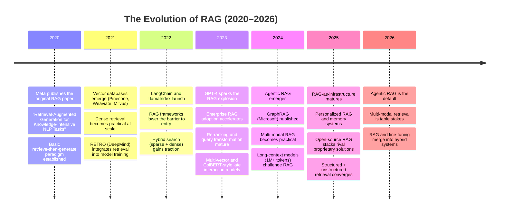
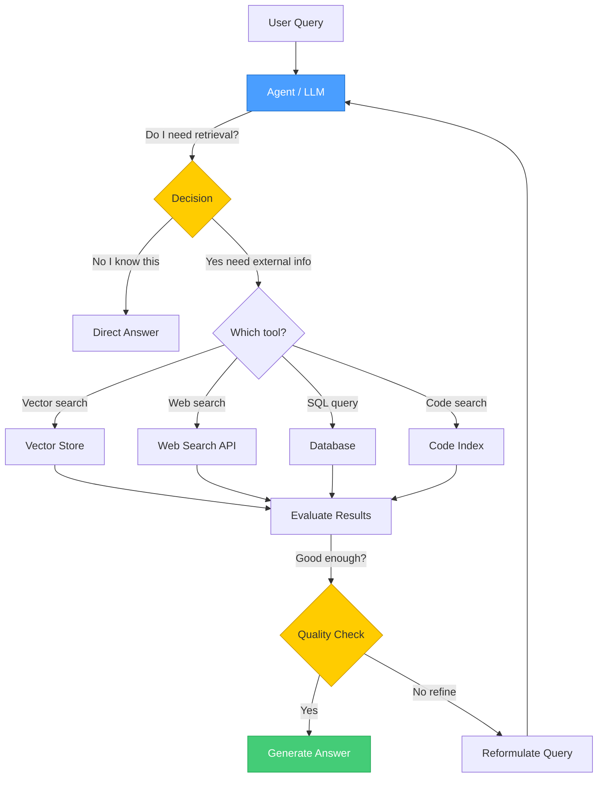
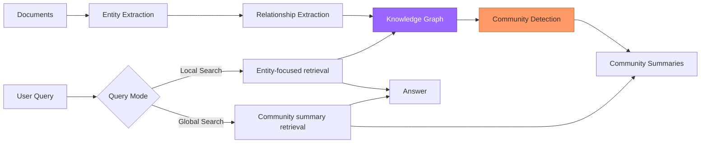
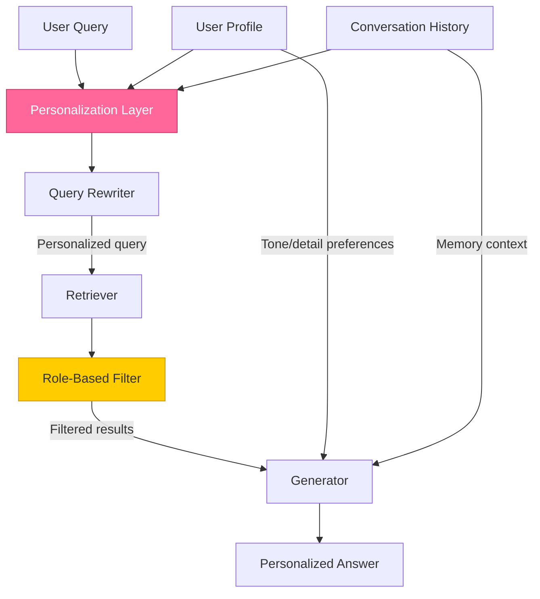

# RAG Deep Dive  Part 9: Multi-Modal RAG, Agentic RAG, and The Future

---

**Series:** RAG (Retrieval-Augmented Generation)  A Developer's Deep Dive from Scratch to Production
**Part:** 9 of 9 (The Frontier)
**Audience:** Developers with Python experience who want to master RAG systems from the ground up
**Reading time:** ~45 minutes

---

## Prerequisites

Parts 0–8 of this series built, evaluated, and productionized a complete RAG pipeline. This final article assumes familiarity with the entire journey:

- **Part 0**  Series orientation: what RAG is and why it matters
- **Part 1**  Foundations: embeddings, vector similarity, and the retrieval concept
- **Part 2**  Chunking strategies: how to split documents for optimal retrieval
- **Part 3**  Vector stores: indexing, storage, and similarity search at scale
- **Part 4**  Retrieval strategies: sparse, dense, and hybrid search
- **Part 5**  Generation: prompt engineering, context injection, and LLM integration
- **Part 6**  Advanced RAG patterns: query transformation, re-ranking, and multi-step retrieval
- **Part 7**  Evaluation and debugging RAG systems
- **Part 8**  Production RAG: deployment, scaling, monitoring, and cost optimization

This article takes everything you have learned and shows you where the field is heading. Every technique here builds on the foundations from earlier parts.

---

## 1. Recap: Where We Left Off

In Part 8, we covered the operational side of running RAG in production:

- **Deployment architectures**  Containerized services, serverless RAG, and microservice patterns
- **Scaling strategies**  Horizontal scaling of vector stores, caching layers, and load balancing
- **Monitoring and observability**  Tracking latency, retrieval quality, and cost per query in real time
- **Cost optimization**  Embedding caching, tiered storage, model routing, and batch processing

With a production-grade RAG system running reliably, you might ask: **is this as good as it gets?**

Not even close. The RAG landscape is evolving at breakneck speed. Multi-modal retrieval, agentic architectures, knowledge graphs, and new embedding paradigms are reshaping what RAG can do. This final article covers the frontier  the techniques that will define the next generation of RAG systems.

> **Why this matters now:** The gap between "standard RAG" and "frontier RAG" is widening every month. Teams that stay on basic vector-search-plus-LLM pipelines will fall behind as users expect systems that can reason over images, correct their own mistakes, and navigate complex multi-source knowledge bases.

---

## 2. The Evolution of RAG

Before diving into frontier techniques, let us zoom out and appreciate how far RAG has come.



The key insight from this timeline: **RAG is not a static technique  it is a rapidly expanding paradigm.** What counted as "advanced RAG" in 2023 is now baseline. Let us explore the frontier.

---

## 3. Multi-Modal RAG

Standard RAG retrieves text chunks and feeds them to an LLM. But real-world knowledge lives in **images, tables, code, diagrams, PDFs with mixed content, and video**. Multi-modal RAG bridges this gap.

### 3.1 RAG Over Images  CLIP Embeddings and Visual QA

The core idea: embed images into the **same vector space** as text, so a text query can retrieve relevant images (and vice versa).

**CLIP** (Contrastive Language–Image Pre-training) from OpenAI is the foundational model here. It produces aligned embeddings for both text and images, meaning you can compute cosine similarity between a text query and an image embedding directly.

```python
"""
Multi-Modal RAG: Image retrieval using CLIP embeddings.
Embed images and text into a shared vector space, then retrieve
images by text query using cosine similarity.
"""

import torch
from PIL import Image
from transformers import CLIPProcessor, CLIPModel
import numpy as np
from pathlib import Path


class ImageRAG:
    """RAG system that retrieves images by text query using CLIP."""

    def __init__(self, model_name: str = "openai/clip-vit-base-patch32"):
        self.model = CLIPModel.from_pretrained(model_name)
        self.processor = CLIPProcessor.from_pretrained(model_name)
        self.image_embeddings: list[np.ndarray] = []
        self.image_metadata: list[dict] = []

    def index_images(self, image_dir: str) -> int:
        """Embed all images in a directory and store them for retrieval."""
        image_paths = list(Path(image_dir).glob("*.png")) + \
                      list(Path(image_dir).glob("*.jpg"))

        for path in image_paths:
            image = Image.open(path).convert("RGB")
            inputs = self.processor(images=image, return_tensors="pt")

            with torch.no_grad():
                embedding = self.model.get_image_features(**inputs)
                # Normalize for cosine similarity
                embedding = embedding / embedding.norm(p=2, dim=-1, keepdim=True)

            self.image_embeddings.append(embedding.squeeze().numpy())
            self.image_metadata.append({
                "path": str(path),
                "filename": path.name,
            })

        print(f"Indexed {len(self.image_embeddings)} images.")
        return len(self.image_embeddings)

    def search(self, query: str, top_k: int = 5) -> list[dict]:
        """Retrieve the most relevant images for a text query."""
        # Embed the text query into the same space as images
        inputs = self.processor(text=[query], return_tensors="pt", padding=True)

        with torch.no_grad():
            text_embedding = self.model.get_text_features(**inputs)
            text_embedding = text_embedding / text_embedding.norm(
                p=2, dim=-1, keepdim=True
            )

        text_emb = text_embedding.squeeze().numpy()

        # Compute cosine similarities against all indexed images
        similarities = [
            float(np.dot(text_emb, img_emb))
            for img_emb in self.image_embeddings
        ]

        # Rank and return top-k
        ranked = sorted(
            enumerate(similarities), key=lambda x: x[1], reverse=True
        )[:top_k]

        return [
            {**self.image_metadata[idx], "score": score}
            for idx, score in ranked
        ]


# --- Usage ---
rag = ImageRAG()
rag.index_images("./product_images")

results = rag.search("red running shoes with white sole")
for r in results:
    print(f"  {r['filename']}  score: {r['score']:.4f}")
```

> **Key insight:** CLIP embeddings are not as high-dimensional or semantically rich as text-only embeddings for nuanced language. But they excel at **cross-modal retrieval**  finding images that match text descriptions and vice versa. For production systems, combine CLIP retrieval with a vision-language model (like GPT-4o or LLaVA) that can describe retrieved images in the final generation step.

### 3.2 RAG Over Tables  Structured Retrieval

Tables are everywhere in enterprise documents: financial reports, research papers, product specs. Standard chunking destroys table structure. Here is a pipeline that preserves it.

```python
"""
Table-aware RAG: Extract tables from documents, embed them
as structured text, and retrieve with table-specific formatting.
"""

import pandas as pd
from dataclasses import dataclass


@dataclass
class TableChunk:
    """A chunk representing a table extracted from a document."""
    table_id: str
    source_doc: str
    caption: str
    headers: list[str]
    data: list[list[str]]
    markdown: str  # Table rendered as markdown for embedding

    def to_embedding_text(self) -> str:
        """Convert table to text optimized for embedding."""
        # Include caption + headers + sample rows for semantic meaning
        header_text = " | ".join(self.headers)
        sample_rows = "\n".join(
            " | ".join(row) for row in self.data[:5]  # First 5 rows
        )
        return (
            f"Table: {self.caption}\n"
            f"Columns: {header_text}\n"
            f"Sample data:\n{sample_rows}"
        )


def extract_tables_from_html(html_content: str, source: str) -> list[TableChunk]:
    """Extract tables from HTML and convert to TableChunk objects."""
    dfs = pd.read_html(html_content)
    chunks = []

    for i, df in enumerate(dfs):
        markdown = df.to_markdown(index=False)
        chunks.append(TableChunk(
            table_id=f"{source}_table_{i}",
            source_doc=source,
            caption=f"Table {i+1} from {source}",
            headers=list(df.columns),
            data=df.astype(str).values.tolist(),
            markdown=markdown,
        ))

    return chunks


def table_aware_retrieval(
    query: str,
    table_chunks: list[TableChunk],
    embed_fn,       # Your embedding function
    top_k: int = 3,
) -> list[dict]:
    """Retrieve tables relevant to a query, return full markdown."""
    query_emb = embed_fn(query)

    results = []
    for chunk in table_chunks:
        chunk_emb = embed_fn(chunk.to_embedding_text())
        score = cosine_similarity(query_emb, chunk_emb)
        results.append({"chunk": chunk, "score": score})

    results.sort(key=lambda x: x["score"], reverse=True)

    # Return full markdown tables (not truncated embedding text)
    return [
        {
            "table_id": r["chunk"].table_id,
            "markdown": r["chunk"].markdown,
            "caption": r["chunk"].caption,
            "score": r["score"],
        }
        for r in results[:top_k]
    ]
```

**The trick with table RAG:** Embed a compressed representation (caption + headers + sample rows) for retrieval, but pass the **full markdown table** to the LLM for generation. This gives you the best of both worlds  semantic search on structure, complete data for answering.

### 3.3 RAG Over Code  AST-Aware Chunking

Code is not prose. Splitting code by character count or even line count produces broken, meaningless chunks. **AST-aware chunking** uses the Abstract Syntax Tree to split code at natural boundaries.

```python
"""
Code RAG: AST-aware chunking that respects function and class boundaries.
Produces semantically meaningful code chunks for embedding and retrieval.
"""

import ast
from dataclasses import dataclass


@dataclass
class CodeChunk:
    """A semantically meaningful chunk of code."""
    chunk_type: str       # "function", "class", "module_header"
    name: str             # Function/class name
    source: str           # Raw source code
    docstring: str | None # Extracted docstring
    file_path: str
    start_line: int
    end_line: int

    def to_embedding_text(self) -> str:
        """Combine docstring + signature for rich embedding."""
        parts = [f"{self.chunk_type}: {self.name}"]
        if self.docstring:
            parts.append(f"Description: {self.docstring}")
        parts.append(f"Code:\n{self.source}")
        return "\n".join(parts)


def chunk_python_file(file_path: str) -> list[CodeChunk]:
    """Parse a Python file and extract function/class chunks."""
    with open(file_path, "r") as f:
        source = f.read()

    tree = ast.parse(source)
    lines = source.splitlines()
    chunks = []

    for node in ast.walk(tree):
        if isinstance(node, (ast.FunctionDef, ast.AsyncFunctionDef)):
            chunk_type = "function"
        elif isinstance(node, ast.ClassDef):
            chunk_type = "class"
        else:
            continue

        start = node.lineno - 1
        end = node.end_lineno or start + 1
        code_text = "\n".join(lines[start:end])
        docstring = ast.get_docstring(node)

        chunks.append(CodeChunk(
            chunk_type=chunk_type,
            name=node.name,
            source=code_text,
            docstring=docstring,
            file_path=file_path,
            start_line=node.lineno,
            end_line=end,
        ))

    return chunks


# --- Usage ---
chunks = chunk_python_file("my_project/utils.py")
for c in chunks:
    print(f"  [{c.chunk_type}] {c.name} (lines {c.start_line}-{c.end_line})")
    if c.docstring:
        print(f"    Doc: {c.docstring[:80]}...")
```

> **Production tip:** For multi-language code RAG, use **tree-sitter** instead of Python's `ast` module. Tree-sitter supports 100+ languages with consistent AST parsing, letting you build a single chunking pipeline for Python, JavaScript, Go, Rust, and more.

### 3.4 Multi-Modal Embedding Models Overview

| Model | Modalities | Dim | Open Source? | Best For |
|-------|-----------|-----|-------------|----------|
| **CLIP** (OpenAI) | Text + Image | 512 | Yes | Cross-modal image search |
| **SigLIP** (Google) | Text + Image | 768 | Yes | Higher quality image-text matching |
| **ImageBind** (Meta) | Text + Image + Audio + Video + Depth + IMU | 1024 | Yes | Universal multi-modal embedding |
| **Nomic Embed Vision** | Text + Image | 768 | Yes | Unified text-image embedding |
| **Voyage Multimodal** | Text + Image + Code | 1024 | No (API) | Production multi-modal RAG |
| **Jina CLIP v2** | Text + Image | 1024 | Yes | Multilingual image-text retrieval |

**The trend:** We are moving from separate embedding models per modality toward **unified embedding spaces** where text, images, code, and structured data all live in the same vector space. This simplifies multi-modal RAG architectures enormously.

---

## 4. Agentic RAG

This is the single biggest paradigm shift in RAG since the original 2020 paper. Standard RAG follows a fixed pipeline: query → retrieve → generate. **Agentic RAG** gives the LLM agency to decide **when**, **what**, and **how** to retrieve.

### 4.1 What Makes RAG "Agentic"?



The key differences from standard RAG:

| Aspect | Standard RAG | Agentic RAG |
|--------|-------------|-------------|
| **Retrieval trigger** | Always retrieves | Agent decides if retrieval is needed |
| **Source selection** | Single pre-configured source | Agent picks from multiple tools/sources |
| **Query formulation** | User query passed directly | Agent may reformulate or decompose the query |
| **Quality control** | None  pass-through | Agent evaluates retrieved results and retries |
| **Multi-step** | Single retrieval pass | Multiple retrieval rounds as needed |
| **Error handling** | Fails silently | Agent detects failures and self-corrects |

### 4.2 Tool-Use RAG with Function Calling

Here is a working agentic RAG system using OpenAI's function calling. The agent has access to multiple retrieval tools and decides which to use.

```python
"""
Agentic RAG: An LLM agent that decides when and how to retrieve,
with access to multiple retrieval tools and self-correction.
"""

import json
import openai

client = openai.OpenAI()

# --- Define the tools the agent can use ---
TOOLS = [
    {
        "type": "function",
        "function": {
            "name": "search_knowledge_base",
            "description": (
                "Search the internal knowledge base using semantic vector search. "
                "Best for questions about company policies, product docs, and FAQs."
            ),
            "parameters": {
                "type": "object",
                "properties": {
                    "query": {
                        "type": "string",
                        "description": "The search query",
                    },
                    "top_k": {
                        "type": "integer",
                        "description": "Number of results to return",
                        "default": 5,
                    },
                },
                "required": ["query"],
            },
        },
    },
    {
        "type": "function",
        "function": {
            "name": "search_web",
            "description": (
                "Search the web for current information. "
                "Best for recent events, pricing, or facts not in the knowledge base."
            ),
            "parameters": {
                "type": "object",
                "properties": {
                    "query": {"type": "string", "description": "Web search query"},
                },
                "required": ["query"],
            },
        },
    },
    {
        "type": "function",
        "function": {
            "name": "query_database",
            "description": (
                "Run a SQL query against the product database. "
                "Best for structured data: inventory, orders, user accounts."
            ),
            "parameters": {
                "type": "object",
                "properties": {
                    "sql": {"type": "string", "description": "SQL SELECT query"},
                },
                "required": ["sql"],
            },
        },
    },
]


# --- Tool implementations (stubs  replace with real backends) ---
def search_knowledge_base(query: str, top_k: int = 5) -> str:
    """Vector search against your document store."""
    # In production: call your vector DB (Qdrant, Pinecone, etc.)
    return json.dumps([
        {"text": "Our return policy allows returns within 30 days...", "score": 0.92},
        {"text": "Refunds are processed within 5-7 business days...", "score": 0.87},
    ])


def search_web(query: str) -> str:
    """Web search for current information."""
    # In production: call Tavily, Serper, or Brave Search API
    return json.dumps([
        {"title": "Latest pricing update", "snippet": "Prices updated March 2026..."},
    ])


def query_database(sql: str) -> str:
    """Execute a read-only SQL query."""
    # In production: execute against your DB with strict read-only permissions
    return json.dumps({"columns": ["product", "stock"], "rows": [["Widget A", 142]]})


TOOL_DISPATCH = {
    "search_knowledge_base": search_knowledge_base,
    "search_web": search_web,
    "query_database": query_database,
}


def agentic_rag(user_query: str, max_iterations: int = 5) -> str:
    """
    Run an agentic RAG loop. The LLM decides which tools to call
    and when it has enough information to answer.
    """
    messages = [
        {
            "role": "system",
            "content": (
                "You are a helpful assistant with access to retrieval tools. "
                "Use the tools when you need information to answer accurately. "
                "If the retrieved results are insufficient, try a different tool "
                "or reformulate your query. Only answer when you are confident."
            ),
        },
        {"role": "user", "content": user_query},
    ]

    for iteration in range(max_iterations):
        response = client.chat.completions.create(
            model="gpt-4o",
            messages=messages,
            tools=TOOLS,
            tool_choice="auto",
        )

        msg = response.choices[0].message
        messages.append(msg)

        # If no tool calls, the agent is ready to answer
        if not msg.tool_calls:
            return msg.content

        # Execute each tool call
        for tool_call in msg.tool_calls:
            fn_name = tool_call.function.name
            fn_args = json.loads(tool_call.function.arguments)

            print(f"  [Iteration {iteration+1}] Calling {fn_name}({fn_args})")

            result = TOOL_DISPATCH[fn_name](**fn_args)

            messages.append({
                "role": "tool",
                "tool_call_id": tool_call.id,
                "content": result,
            })

    return "I was unable to find a confident answer after multiple attempts."


# --- Usage ---
answer = agentic_rag("What is our return policy, and how many Widget A's are in stock?")
print(f"\nFinal Answer:\n{answer}")
```

Notice what happens with the query "What is our return policy, and how many Widget A's are in stock?"  the agent will likely call **both** `search_knowledge_base` (for the return policy) **and** `query_database` (for inventory), combining results from multiple sources. A standard RAG pipeline could not do this.

### 4.3 Self-Correcting RAG

One of the most powerful agentic patterns is **self-correction**: the agent evaluates its own retrieved context and decides whether to retry.

```python
"""
Self-correcting RAG: The agent evaluates retrieval quality
and reformulates queries when results are insufficient.
"""


def self_correcting_retrieve(
    query: str,
    retriever,
    llm,
    max_retries: int = 3,
) -> dict:
    """
    Retrieve with self-correction. If the LLM judges the results
    as insufficient, it reformulates the query and tries again.
    """
    attempts = []
    current_query = query

    for attempt in range(max_retries):
        # Step 1: Retrieve
        results = retriever.search(current_query, top_k=5)
        context = "\n\n".join([r["text"] for r in results])

        # Step 2: Ask the LLM to evaluate retrieval quality
        eval_prompt = f"""Given the user's original question and retrieved context,
evaluate whether the context contains enough information to answer.

Original question: {query}
Current search query: {current_query}
Retrieved context:
{context}

Respond in JSON:
{{
    "is_sufficient": true/false,
    "reason": "why sufficient or not",
    "suggested_query": "reformulated query if not sufficient"
}}"""

        evaluation = llm.generate(eval_prompt)
        eval_data = json.loads(evaluation)

        attempts.append({
            "query": current_query,
            "num_results": len(results),
            "sufficient": eval_data["is_sufficient"],
        })

        if eval_data["is_sufficient"]:
            return {
                "context": context,
                "results": results,
                "attempts": attempts,
                "final_query": current_query,
            }

        # Step 3: Reformulate and retry
        current_query = eval_data["suggested_query"]
        print(f"  Retry {attempt+1}: Reformulated to '{current_query}'")

    # Exhausted retries  return best effort
    return {
        "context": context,
        "results": results,
        "attempts": attempts,
        "final_query": current_query,
    }
```

> **Why self-correction matters:** In production RAG systems, retrieval failure is the #1 cause of bad answers (as we covered in Part 7). Self-correcting RAG catches these failures **before** they reach the user, automatically trying alternative queries. In benchmarks, this pattern alone can improve answer accuracy by 15-25%.

---

## 5. Knowledge Graphs + RAG (GraphRAG)

Standard RAG retrieves individual chunks. But some questions require understanding **relationships** between entities: "How are departments X and Y connected?" or "What is the chain of events that led to outcome Z?" This is where **GraphRAG** shines.

### 5.1 The GraphRAG Approach

Microsoft's GraphRAG (published 2024) introduced a pipeline that extracts a knowledge graph from documents and uses graph structure to improve retrieval.



**Two retrieval modes:**

- **Local search**  Find specific entities mentioned in the query, traverse their graph neighborhood, and retrieve connected chunks. Great for factual questions about specific topics.
- **Global search**  Retrieve pre-computed summaries of entity communities (clusters of related entities). Great for broad, thematic questions like "What are the main themes in this document collection?"

### 5.2 Building a Simple GraphRAG Pipeline

```python
"""
GraphRAG: Extract entities and relationships from text,
build a knowledge graph, detect communities, and use
graph structure for retrieval.
"""

import json
import networkx as nx
from collections import defaultdict
from openai import OpenAI

client = OpenAI()


def extract_entities_and_relations(text: str) -> dict:
    """Use an LLM to extract entities and relationships from text."""
    prompt = f"""Extract all entities and relationships from this text.

Text: {text}

Return JSON:
{{
    "entities": [
        {{"name": "Entity Name", "type": "PERSON|ORG|CONCEPT|PRODUCT|EVENT", "description": "brief desc"}}
    ],
    "relationships": [
        {{"source": "Entity A", "target": "Entity B", "relation": "relationship type", "description": "details"}}
    ]
}}"""

    response = client.chat.completions.create(
        model="gpt-4o-mini",
        messages=[{"role": "user", "content": prompt}],
        response_format={"type": "json_object"},
    )
    return json.loads(response.choices[0].message.content)


def build_knowledge_graph(documents: list[str]) -> nx.Graph:
    """Build a knowledge graph from a list of documents."""
    G = nx.Graph()

    for doc_id, doc in enumerate(documents):
        extracted = extract_entities_and_relations(doc)

        # Add entity nodes
        for entity in extracted["entities"]:
            name = entity["name"]
            if G.has_node(name):
                # Merge: increment mention count
                G.nodes[name]["mentions"] = G.nodes[name].get("mentions", 1) + 1
            else:
                G.add_node(
                    name,
                    type=entity["type"],
                    description=entity["description"],
                    mentions=1,
                    source_docs=[doc_id],
                )

        # Add relationship edges
        for rel in extracted["relationships"]:
            if G.has_edge(rel["source"], rel["target"]):
                # Strengthen existing edge
                G[rel["source"]][rel["target"]]["weight"] += 1
            else:
                G.add_edge(
                    rel["source"],
                    rel["target"],
                    relation=rel["relation"],
                    description=rel["description"],
                    weight=1,
                )

    return G


def detect_communities(G: nx.Graph) -> dict[int, list[str]]:
    """Detect communities (clusters of related entities) in the graph."""
    from networkx.algorithms.community import greedy_modularity_communities

    communities = greedy_modularity_communities(G)
    community_map = {}
    for idx, community in enumerate(communities):
        community_map[idx] = list(community)

    return community_map


def graph_local_search(
    query: str,
    G: nx.Graph,
    query_entities: list[str],
    hop_depth: int = 2,
) -> str:
    """Local search: find entities in the query, traverse their neighborhood."""
    context_parts = []
    visited = set()

    for entity in query_entities:
        if entity not in G:
            continue

        # BFS traversal up to hop_depth
        for depth in range(hop_depth + 1):
            if depth == 0:
                neighbors = {entity}
            else:
                neighbors = set()
                for n in visited:
                    neighbors.update(G.neighbors(n))

            for node in neighbors:
                if node in visited:
                    continue
                visited.add(node)

                node_data = G.nodes[node]
                context_parts.append(
                    f"Entity: {node} (type: {node_data.get('type', 'unknown')})\n"
                    f"  Description: {node_data.get('description', 'N/A')}"
                )

                # Add edge info
                for neighbor in G.neighbors(node):
                    edge = G[node][neighbor]
                    context_parts.append(
                        f"  Relationship: {node} --[{edge.get('relation', '?')}]--> {neighbor}"
                    )

    return "\n".join(context_parts)


# --- Usage ---
documents = [
    "Acme Corp was founded by Jane Smith in 2019. The company develops AI-powered "
    "search tools. Jane previously worked at Google on the BERT team.",
    "Acme Corp acquired DataFlow Inc in 2023. DataFlow's CEO Bob Lee joined Acme "
    "as VP of Engineering. The acquisition was funded by Sequoia Capital.",
    "Jane Smith presented Acme's new product, SearchPro, at the 2024 AI Summit. "
    "SearchPro uses a novel retrieval architecture inspired by ColBERT.",
]

# Build graph
G = build_knowledge_graph(documents)
print(f"Graph: {G.number_of_nodes()} nodes, {G.number_of_edges()} edges")

# Detect communities
communities = detect_communities(G)
for cid, members in communities.items():
    print(f"  Community {cid}: {members}")

# Local search
context = graph_local_search(
    query="How is Jane Smith connected to DataFlow?",
    G=G,
    query_entities=["Jane Smith", "DataFlow Inc"],
    hop_depth=2,
)
print(f"\nRetrieved context:\n{context}")
```

### 5.3 When GraphRAG Beats Standard RAG

| Query Type | Standard RAG | GraphRAG | Winner |
|-----------|-------------|---------|--------|
| Specific fact lookup | Fast, accurate if chunk exists | Slower, over-engineered | Standard RAG |
| Multi-hop reasoning | Often misses connections | Traverses relationships naturally | **GraphRAG** |
| "How are X and Y related?" | Retrieves separate chunks, LLM must infer | Directly provides relationship paths | **GraphRAG** |
| Broad thematic questions | Retrieves random relevant chunks | Community summaries capture themes | **GraphRAG** |
| Simple Q&A at scale | Low latency, scales well | Higher latency, graph overhead | Standard RAG |
| Small document collection | Works fine | Overkill | Standard RAG |
| Large heterogeneous corpus | Struggles with connections | Excels at cross-document synthesis | **GraphRAG** |

> **The honest take:** GraphRAG is powerful but expensive. Entity extraction requires LLM calls per document, graph construction adds a preprocessing step, and community detection adds complexity. Use it when your questions genuinely require understanding **relationships** between entities. For straightforward factual QA, standard RAG with good chunking and re-ranking is simpler and faster.

---

## 6. Long-Context Models vs. RAG

With models supporting 1M+ token context windows (Gemini 1.5, GPT-4.1), a natural question arises: **do we even need RAG anymore?**

### 6.1 The Comparison

| Factor | Long-Context (Stuff Everything In) | RAG (Retrieve Then Generate) |
|--------|-----------------------------------|------------------------------|
| **Latency** | High  processing 1M tokens is slow | Low  only process top-k chunks |
| **Cost** | Very high  pay per token for entire corpus | Low  only embed once, retrieve cheaply |
| **Accuracy (needle-in-haystack)** | Degrades with context size | Consistent  retriever focuses on relevant chunks |
| **Accuracy (synthesis)** | Good  model sees everything | Depends on retrieval quality |
| **Corpus size limit** | Hard cap at context window | Unlimited  vector store scales independently |
| **Freshness** | Must re-send entire corpus each query | Just index new documents incrementally |
| **Privacy** | All data sent to LLM every time | Only relevant chunks sent to LLM |
| **Explainability** | Hard to trace which part informed the answer | Source chunks are explicitly tracked |

### 6.2 When RAG Still Wins

Despite the allure of "just stuff it all in the context," RAG remains superior for:

1. **Large corpora**  If your knowledge base exceeds the context window (most enterprise cases), RAG is the only option. Even 1M tokens is roughly 750K words  a single large codebase or document collection easily exceeds this.

2. **Cost-sensitive applications**  Sending 1M tokens per query at $0.01/1K tokens = $10/query. RAG typically costs $0.01-0.05/query total.

3. **Low-latency requirements**  Processing 1M tokens takes 30-60 seconds. RAG with a fast vector store returns in 200-500ms.

4. **Frequently updated knowledge**  RAG lets you add/remove documents without reprocessing. Long-context requires reconstructing the entire prompt.

5. **Auditability**  RAG explicitly returns source chunks. Long-context makes it nearly impossible to trace which part of the million-token input influenced the answer.

> **The pragmatic answer:** Long-context and RAG are **complementary, not competing**. The best systems use RAG to select the most relevant documents, then feed a generous context window to the LLM. This gives you focused retrieval AND rich context for generation. The "RAG is dead" takes are premature.

---

## 7. RAG Over Structured Data  Text-to-SQL

Not all knowledge lives in documents. Databases hold structured data that text-based RAG cannot access. **Text-to-SQL RAG** bridges this gap: translate natural language questions into SQL queries, execute them, and use the results to generate answers.

```python
"""
Text-to-SQL RAG: Convert natural language questions to SQL,
execute against a database, and generate natural language answers.
"""

import sqlite3
import json
from openai import OpenAI

client = OpenAI()


def get_schema_description(db_path: str) -> str:
    """Extract the database schema as a human-readable description."""
    conn = sqlite3.connect(db_path)
    cursor = conn.cursor()

    cursor.execute("SELECT name FROM sqlite_master WHERE type='table';")
    tables = cursor.fetchall()

    schema_parts = []
    for (table_name,) in tables:
        cursor.execute(f"PRAGMA table_info({table_name});")
        columns = cursor.fetchall()
        col_descs = [f"  - {col[1]} ({col[2]})" for col in columns]

        # Get sample rows for context
        cursor.execute(f"SELECT * FROM {table_name} LIMIT 3;")
        sample_rows = cursor.fetchall()

        schema_parts.append(
            f"Table: {table_name}\nColumns:\n"
            + "\n".join(col_descs)
            + f"\nSample rows: {sample_rows}"
        )

    conn.close()
    return "\n\n".join(schema_parts)


def text_to_sql(question: str, schema: str) -> str:
    """Use an LLM to convert a natural language question to SQL."""
    response = client.chat.completions.create(
        model="gpt-4o-mini",
        messages=[
            {
                "role": "system",
                "content": (
                    "You are a SQL expert. Convert the user's question to a "
                    "SQLite-compatible SELECT query. Return ONLY the SQL query, "
                    "no explanation. Use only tables and columns from the schema."
                ),
            },
            {
                "role": "user",
                "content": f"Schema:\n{schema}\n\nQuestion: {question}",
            },
        ],
    )
    sql = response.choices[0].message.content.strip()
    # Remove markdown code fences if present
    sql = sql.replace("```sql", "").replace("```", "").strip()
    return sql


def execute_and_answer(
    question: str, db_path: str = "products.db"
) -> dict:
    """Full Text-to-SQL RAG pipeline."""
    # Step 1: Get schema
    schema = get_schema_description(db_path)

    # Step 2: Generate SQL
    sql = text_to_sql(question, schema)
    print(f"  Generated SQL: {sql}")

    # Step 3: Execute (with safety: read-only)
    conn = sqlite3.connect(db_path)
    conn.execute("PRAGMA query_only = ON;")  # Read-only mode
    try:
        cursor = conn.execute(sql)
        columns = [desc[0] for desc in cursor.description] if cursor.description else []
        rows = cursor.fetchall()
    except Exception as e:
        conn.close()
        return {"error": str(e), "sql": sql}
    conn.close()

    # Step 4: Generate natural language answer
    result_text = json.dumps({"columns": columns, "rows": rows[:50]})

    response = client.chat.completions.create(
        model="gpt-4o-mini",
        messages=[
            {
                "role": "system",
                "content": (
                    "Answer the user's question using the SQL query results. "
                    "Be concise and specific. If the data is empty, say so."
                ),
            },
            {
                "role": "user",
                "content": (
                    f"Question: {question}\n"
                    f"SQL: {sql}\n"
                    f"Results: {result_text}"
                ),
            },
        ],
    )

    return {
        "question": question,
        "sql": sql,
        "raw_results": {"columns": columns, "rows": rows[:50]},
        "answer": response.choices[0].message.content,
    }


# --- Usage ---
result = execute_and_answer("What are the top 5 products by revenue this quarter?")
print(f"Answer: {result['answer']}")
```

**Security note:** Always enforce read-only mode and parameterized queries. Never let LLM-generated SQL run UPDATE, DELETE, or DROP statements. In production, use a dedicated read replica with restricted permissions.

---

## 8. Personalized RAG  User-Specific Retrieval

Standard RAG treats every user the same. **Personalized RAG** tailors retrieval and generation based on who is asking, their history, preferences, and role.

### 8.1 Architecture



### 8.2 Implementation

```python
"""
Personalized RAG: User-specific retrieval with memory,
role-based filtering, and preference-aware generation.
"""

from dataclasses import dataclass, field
from datetime import datetime


@dataclass
class UserProfile:
    """Stores user preferences and context for personalization."""
    user_id: str
    role: str                                  # "admin", "developer", "analyst"
    expertise_level: str                       # "beginner", "intermediate", "expert"
    department: str
    preferences: dict = field(default_factory=dict)  # e.g., {"detail_level": "concise"}
    access_tags: list[str] = field(default_factory=list)  # For role-based filtering


@dataclass
class ConversationMemory:
    """Short-term and long-term memory for a user's interactions."""
    user_id: str
    short_term: list[dict] = field(default_factory=list)   # Recent messages
    long_term_facts: list[str] = field(default_factory=list)  # Extracted persistent facts

    def add_interaction(self, query: str, answer: str):
        self.short_term.append({
            "query": query,
            "answer": answer,
            "timestamp": datetime.now().isoformat(),
        })
        # Keep only last 20 interactions in short-term memory
        self.short_term = self.short_term[-20:]

    def add_fact(self, fact: str):
        """Store a long-term fact about the user."""
        if fact not in self.long_term_facts:
            self.long_term_facts.append(fact)

    def get_context(self, max_recent: int = 5) -> str:
        """Build a memory context string for the LLM."""
        parts = []
        if self.long_term_facts:
            parts.append("Known facts about this user:\n" +
                         "\n".join(f"- {f}" for f in self.long_term_facts))
        if self.short_term:
            recent = self.short_term[-max_recent:]
            parts.append("Recent conversation:\n" +
                         "\n".join(f"Q: {m['query']}\nA: {m['answer'][:100]}..."
                                   for m in recent))
        return "\n\n".join(parts)


class PersonalizedRAG:
    """RAG system that adapts to individual users."""

    def __init__(self, retriever, llm):
        self.retriever = retriever
        self.llm = llm
        self.memories: dict[str, ConversationMemory] = {}

    def get_memory(self, user_id: str) -> ConversationMemory:
        if user_id not in self.memories:
            self.memories[user_id] = ConversationMemory(user_id=user_id)
        return self.memories[user_id]

    def personalized_query(self, query: str, profile: UserProfile) -> str:
        """Rewrite the query with user context for better retrieval."""
        context_hints = f" (context: {profile.department} department, {profile.role} role)"
        return query + context_hints

    def filter_by_access(
        self, results: list[dict], profile: UserProfile
    ) -> list[dict]:
        """Filter retrieval results based on user's access permissions."""
        return [
            r for r in results
            if not r.get("access_tags")  # Public docs pass through
            or any(tag in profile.access_tags for tag in r["access_tags"])
        ]

    def query(self, query: str, profile: UserProfile) -> str:
        """Full personalized RAG pipeline."""
        memory = self.get_memory(profile.user_id)

        # Step 1: Personalize the retrieval query
        enhanced_query = self.personalized_query(query, profile)

        # Step 2: Retrieve
        results = self.retriever.search(enhanced_query, top_k=10)

        # Step 3: Filter by access control
        filtered = self.filter_by_access(results, profile)
        context = "\n\n".join(r["text"] for r in filtered[:5])

        # Step 4: Build personalized prompt
        memory_context = memory.get_context()
        detail = profile.preferences.get("detail_level", "standard")

        system_prompt = f"""You are a helpful assistant. Adapt your response:
- User expertise: {profile.expertise_level}
- Detail level preference: {detail}
- Department: {profile.department}

{memory_context}
"""

        # Step 5: Generate
        answer = self.llm.generate(
            system_prompt=system_prompt,
            user_message=f"Context:\n{context}\n\nQuestion: {query}",
        )

        # Step 6: Update memory
        memory.add_interaction(query, answer)

        return answer
```

**The key personalization levers:**

1. **Query rewriting**  Add user context to improve retrieval relevance
2. **Access-based filtering**  Only show documents the user is authorized to see
3. **Memory**  Remember past interactions to avoid repetition and build on prior context
4. **Tone adaptation**  Adjust complexity, verbosity, and style based on user preferences

---

## 9. The Open-Source RAG Stack

You do not need proprietary APIs to build a production-grade RAG system. Here is a complete open-source stack.

### 9.1 The Stack

| Layer | Tool | Role | License |
|-------|------|------|---------|
| **Embeddings** | Sentence-Transformers | Encode text to vectors | Apache 2.0 |
| **Vector Store** | Qdrant | Store and search vectors | Apache 2.0 |
| **LLM** | Ollama (Llama 3, Mistral) | Generate answers locally | MIT |
| **Framework** | LangChain | Orchestration and chaining | MIT |
| **Re-ranker** | CrossEncoder (SBERT) | Re-rank retrieved results | Apache 2.0 |
| **UI** | Gradio / Streamlit | User interface | Apache 2.0 |

### 9.2 Complete Working Example

```python
"""
Full open-source RAG stack:
Sentence-Transformers + Qdrant + Ollama + LangChain

Zero proprietary API calls. Runs entirely on your machine.
"""

# --- Install ---
# pip install sentence-transformers qdrant-client langchain langchain-community ollama

from sentence_transformers import SentenceTransformer, CrossEncoder
from qdrant_client import QdrantClient
from qdrant_client.models import Distance, VectorParams, PointStruct
import ollama
import uuid


# --- 1. Initialize embedding model (runs locally) ---
embedder = SentenceTransformer("all-MiniLM-L6-v2")  # 384-dim, fast
reranker = CrossEncoder("cross-encoder/ms-marco-MiniLM-L-6-v2")

# --- 2. Initialize Qdrant (in-memory for demo, use Docker for production) ---
qdrant = QdrantClient(":memory:")  # Use "localhost" for Docker deployment

COLLECTION = "documents"
qdrant.create_collection(
    collection_name=COLLECTION,
    vectors_config=VectorParams(size=384, distance=Distance.COSINE),
)


# --- 3. Index documents ---
def index_documents(documents: list[dict]):
    """Index documents into Qdrant with sentence-transformer embeddings."""
    points = []
    for doc in documents:
        embedding = embedder.encode(doc["text"]).tolist()
        points.append(PointStruct(
            id=str(uuid.uuid4()),
            vector=embedding,
            payload={"text": doc["text"], "source": doc.get("source", "unknown")},
        ))

    qdrant.upsert(collection_name=COLLECTION, points=points)
    print(f"Indexed {len(points)} documents.")


# --- 4. Retrieve + Re-rank ---
def retrieve(query: str, top_k: int = 10, rerank_top_k: int = 3) -> list[dict]:
    """Retrieve from Qdrant, then re-rank with a cross-encoder."""
    query_embedding = embedder.encode(query).tolist()

    hits = qdrant.search(
        collection_name=COLLECTION,
        query_vector=query_embedding,
        limit=top_k,
    )

    # Re-rank with cross-encoder
    candidates = [hit.payload["text"] for hit in hits]
    pairs = [[query, candidate] for candidate in candidates]
    rerank_scores = reranker.predict(pairs)

    ranked = sorted(
        zip(candidates, rerank_scores, hits),
        key=lambda x: x[1],
        reverse=True,
    )

    return [
        {
            "text": text,
            "rerank_score": float(score),
            "source": hit.payload.get("source", "unknown"),
        }
        for text, score, hit in ranked[:rerank_top_k]
    ]


# --- 5. Generate with Ollama (local LLM) ---
def generate(query: str, context: list[dict]) -> str:
    """Generate an answer using a local LLM via Ollama."""
    context_text = "\n\n".join(
        f"[Source: {c['source']}]\n{c['text']}" for c in context
    )

    response = ollama.chat(
        model="llama3.1:8b",  # Or "mistral", "gemma2", etc.
        messages=[
            {
                "role": "system",
                "content": (
                    "Answer the question using ONLY the provided context. "
                    "If the context does not contain the answer, say so. "
                    "Cite sources when possible."
                ),
            },
            {
                "role": "user",
                "content": f"Context:\n{context_text}\n\nQuestion: {query}",
            },
        ],
    )
    return response["message"]["content"]


# --- 6. Full pipeline ---
def rag_query(query: str) -> str:
    """End-to-end open-source RAG pipeline."""
    results = retrieve(query)
    answer = generate(query, results)

    sources = set(r["source"] for r in results)
    return f"{answer}\n\nSources: {', '.join(sources)}"


# --- Usage ---
index_documents([
    {"text": "Python 3.12 introduced type parameter syntax for generic classes.",
     "source": "python-docs"},
    {"text": "The GIL in CPython prevents true multi-threading for CPU-bound tasks.",
     "source": "python-docs"},
    {"text": "FastAPI uses Pydantic for request validation and serialization.",
     "source": "fastapi-docs"},
])

answer = rag_query("How does FastAPI handle request validation?")
print(answer)
```

**To run this stack in production with Docker:**

```yaml
# docker-compose.yml  Production open-source RAG stack
version: "3.8"

services:
  qdrant:
    image: qdrant/qdrant:latest
    ports:
      - "6333:6333"
    volumes:
      - qdrant_data:/qdrant/storage

  ollama:
    image: ollama/ollama:latest
    ports:
      - "11434:11434"
    volumes:
      - ollama_data:/root/.ollama
    deploy:
      resources:
        reservations:
          devices:
            - driver: nvidia
              count: 1
              capabilities: [gpu]

  rag-api:
    build: .
    ports:
      - "8000:8000"
    depends_on:
      - qdrant
      - ollama
    environment:
      - QDRANT_HOST=qdrant
      - OLLAMA_HOST=ollama

volumes:
  qdrant_data:
  ollama_data:
```

> **The open-source advantage:** This entire stack runs on a single machine with a decent GPU (16GB+ VRAM for Llama 3.1 8B). No API keys, no per-token costs, no data leaving your network. For organizations with strict data privacy requirements, this is often the only viable path.

---

## 10. The Future of RAG

The field is moving fast. Here are the trends that will shape RAG over the next 2-3 years:

### 10.1 RAG and Fine-Tuning Will Merge

Today, RAG and fine-tuning are treated as separate approaches. In the future, they converge:

- **RETRO-style models** (DeepMind) bake retrieval into the model architecture itself  the model learns to attend to a retrieval database during training.
- **Retrieval-aware fine-tuning** teaches models to better use retrieved context, reducing hallucination and improving source attribution.
- **Adaptive retrieval models** learn when to retrieve and when to rely on parametric knowledge, eliminating the "always retrieve" overhead.

### 10.2 Embedding Models Will Become Task-Aware

Current embedding models produce a single general-purpose vector per text. Future models will produce **task-specific embeddings** that adapt based on the retrieval objective:

- "Find documents that *answer* this question" (QA embedding)
- "Find documents that *contradict* this claim" (fact-checking embedding)
- "Find documents that are *similar in style*" (style-matching embedding)

Early examples like **Instructor** and **E5-Mistral** already support task-prefixed embeddings. This trend will accelerate.

### 10.3 RAG Will Become Invisible

The best infrastructure is invisible. RAG will follow the same path:

- **Every LLM API will have built-in retrieval**  Upload documents, ask questions. No pipeline to build. (OpenAI's Assistants API and file search already point in this direction.)
- **Databases will embed natively**  PostgreSQL with pgvector is the beginning. Soon, every database will offer semantic search as a first-class feature.
- **RAG-as-a-service** will abstract away chunking, embedding, indexing, and retrieval entirely.

### 10.4 Evaluation Will Become Automated

Manual evaluation does not scale. The future is:

- **Continuous evaluation pipelines** that run on every document ingestion and model update
- **LLM-as-judge** systems (covered in Part 7) becoming more reliable and standardized
- **Benchmark suites** specific to your domain, auto-generated from your document corpus

### 10.5 Privacy-Preserving RAG

As RAG handles increasingly sensitive data:

- **Federated RAG**  Retrieve across multiple organizations without sharing raw data
- **Encrypted vector search**  Homomorphic encryption allows similarity search on encrypted vectors (still early but actively researched)
- **Differential privacy for embeddings**  Add noise to embeddings to prevent reconstruction of source text

### 10.6 Real-Time RAG

Moving from batch-indexed to streaming knowledge bases:

- **Change Data Capture (CDC)** pipelines that embed and index documents as they are created or updated
- **Streaming vector databases** that support real-time inserts without re-indexing
- **Event-driven RAG** where the system proactively retrieves and surfaces relevant information as events occur (notifications, alerts)

---

## 11. Series Conclusion

Over nine articles, we built a complete RAG system from scratch and pushed it to the frontier. Let us review the journey:

| Part | Topic | What You Learned |
|------|-------|-----------------|
| **0** | Orientation | What RAG is, why it matters, and the mental model for the series |
| **1** | Foundations | Embeddings, vector similarity, cosine distance, and the core retrieval concept |
| **2** | Chunking | Token-based, semantic, recursive, and document-aware chunking strategies |
| **3** | Vector Stores | FAISS, Pinecone, Qdrant, Weaviate  indexing, HNSW, and scaling |
| **4** | Retrieval | Sparse (BM25), dense, and hybrid search  when to use each |
| **5** | Generation | Prompt engineering, context injection, citation, and LLM integration |
| **6** | Advanced Patterns | Query transformation, re-ranking, multi-step retrieval, adaptive routing |
| **7** | Evaluation | Retrieval metrics, generation metrics, RAGAS, debugging techniques |
| **8** | Production | Deployment, scaling, monitoring, cost optimization, and operational best practices |
| **9** | The Frontier | Multi-modal RAG, agentic RAG, GraphRAG, Text-to-SQL, personalization, and the future |

### What We Believe About RAG

After this deep dive, here are the principles that hold up:

1. **RAG is not a hack  it is an architecture.** It solves the fundamental problem of connecting LLMs to external knowledge. This problem does not go away with larger context windows or better models.

2. **Retrieval quality is everything.** The best LLM in the world cannot generate a good answer from bad context. Invest more in chunking, embedding, and retrieval than in generation.

3. **Start simple, add complexity when you can measure.** Begin with basic dense retrieval. Add re-ranking when you have evaluation metrics that show it helps. Add agentic patterns when simple retrieval demonstrably fails on your query distribution.

4. **Evaluation is non-negotiable.** If you cannot measure it, you cannot improve it. Set up automated evaluation (Part 7) before you optimize.

5. **The field is moving fast  but the fundamentals are stable.** Embeddings, vector search, chunking, and prompt engineering will matter for years. The specific models and tools will change, but the concepts from this series will not.

> **To every developer who followed this series from Part 0 to Part 9:** You now have a deeper understanding of RAG than most engineers shipping production systems. The gap between "I used a RAG template" and "I understand every layer of the pipeline" is enormous  and you have crossed it. Go build something remarkable.

---

## 12. Key Vocabulary

| Term | Definition |
|------|-----------|
| **Multi-Modal RAG** | RAG systems that retrieve and reason over multiple content types: text, images, tables, code, audio, and video |
| **CLIP** | Contrastive Language–Image Pre-training; a model that embeds text and images into a shared vector space |
| **AST-Aware Chunking** | Splitting code using Abstract Syntax Tree boundaries (functions, classes) instead of arbitrary character/line counts |
| **Agentic RAG** | RAG where an LLM agent decides when, what, and how to retrieve  including tool selection and self-correction |
| **Self-Correcting RAG** | An agentic pattern where the system evaluates its own retrieval quality and retries with reformulated queries |
| **GraphRAG** | RAG augmented with knowledge graphs; uses entity extraction, relationship mapping, and community detection for retrieval |
| **Community Detection** | Graph algorithm that identifies clusters of densely connected entities; used in GraphRAG for thematic summarization |
| **Text-to-SQL RAG** | Converting natural language queries to SQL, executing against a database, and generating natural language answers |
| **Personalized RAG** | RAG systems that adapt retrieval and generation based on user identity, preferences, history, and access permissions |
| **Federated RAG** | Retrieval across multiple data sources or organizations without centralizing raw data |
| **RETRO** | Retrieval-Enhanced Transformer; a DeepMind model architecture that integrates retrieval directly into the training process |
| **Long-Context Models** | LLMs with context windows of 1M+ tokens that can process entire documents without chunking |
| **Memory-Augmented RAG** | RAG systems with short-term (conversation history) and long-term (persistent facts) memory per user |
| **Tool-Use RAG** | Agentic RAG pattern where the LLM selects from multiple retrieval tools (vector search, web search, SQL, etc.) |
| **Real-Time RAG** | RAG with streaming document ingestion and indexing via change data capture pipelines |

---

## Further Reading

- [Lewis et al., 2020  "Retrieval-Augmented Generation for Knowledge-Intensive NLP Tasks"](https://arxiv.org/abs/2005.11401)  The original RAG paper
- [Microsoft GraphRAG](https://github.com/microsoft/graphrag)  Knowledge graph-augmented retrieval
- [CLIP: Learning Transferable Visual Models](https://arxiv.org/abs/2103.00020)  Foundation for multi-modal embeddings
- [Borgeaud et al., 2022  RETRO](https://arxiv.org/abs/2112.04426)  Retrieval-integrated training
- [Qdrant Documentation](https://qdrant.tech/documentation/)  Open-source vector database
- [Ollama](https://ollama.ai/)  Run LLMs locally
- [Sentence-Transformers](https://www.sbert.net/)  Open-source embedding models
- [LangChain RAG Documentation](https://python.langchain.com/docs/tutorials/rag/)  Framework documentation

---

**End of Series.** Thank you for reading all nine parts. The complete series is available in the `RAG/` directory of this repository.
