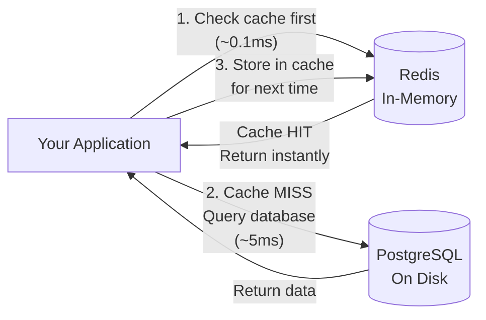
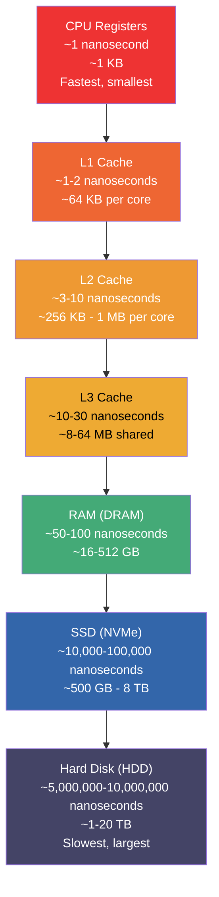
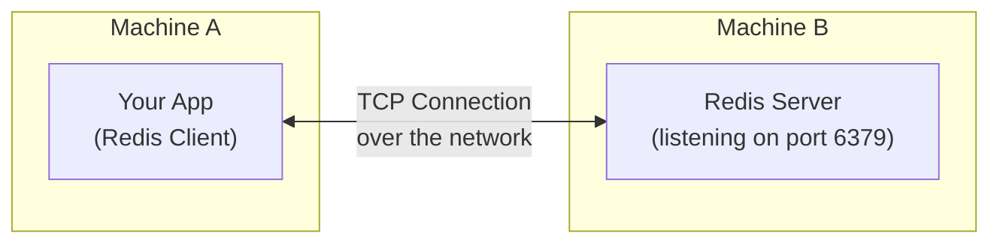
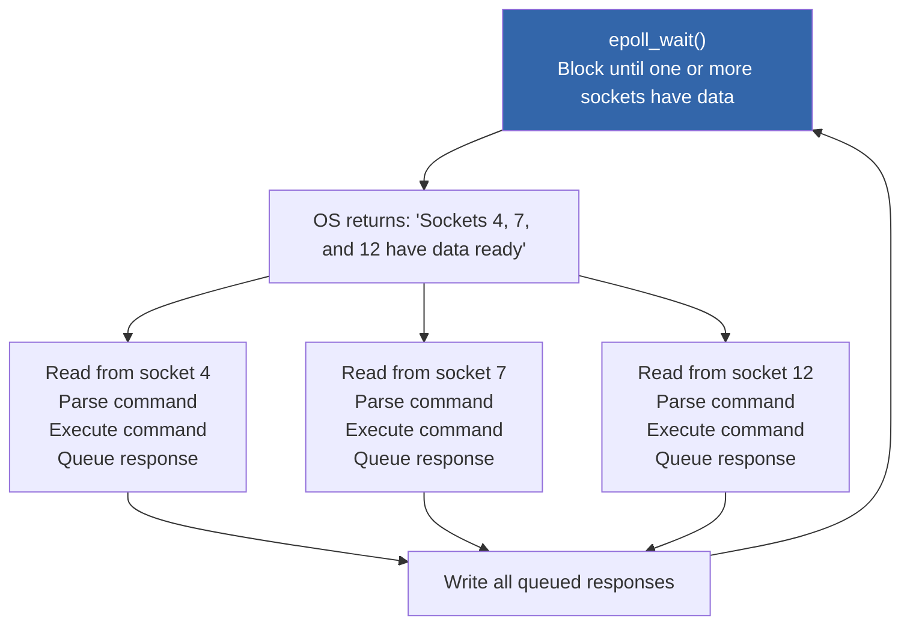
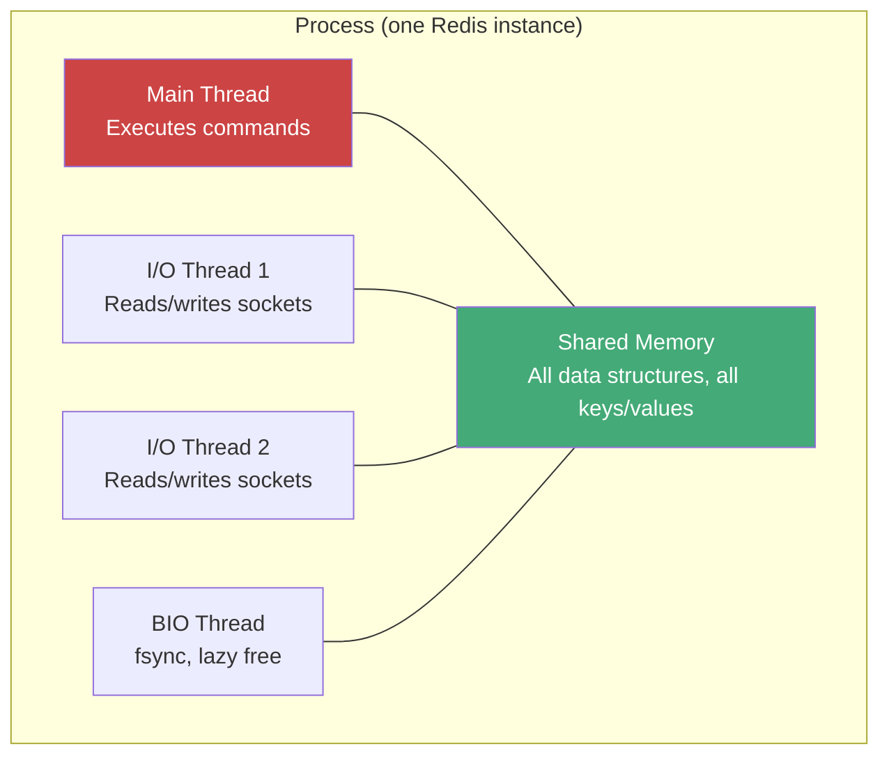
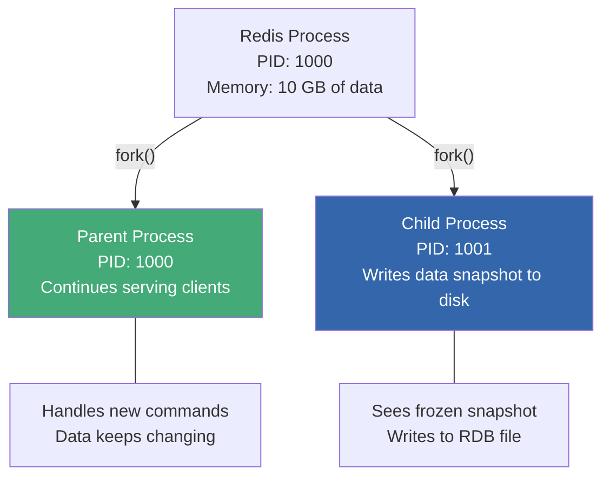

# Redis Deep Dive Series  Part 0: The Foundation You Need Before Going Deep

---

**Series:** Redis Deep Dive  Engineering the World's Most Misunderstood Data Structure Server
**Part:** 0 of 10 (Foundation)
**Audience:** Engineers with 1-3 years of experience preparing for the deep dive, or senior engineers who want to refresh systems fundamentals
**Reading time:** ~40 minutes

---

## Why This Part Exists

Part 1 of this series dives straight into Redis's event loop, I/O multiplexing, C struct internals, and CPU cache behavior. If you read sentences like "Redis uses `epoll` in level-triggered mode with O(1) event notification" or "the `EMBSTR` encoding fits in a single 64-byte cache line" and feel lost  this part is for you.

This is not a Redis tutorial. You won't learn `SET` and `GET` here. Instead, this article builds the **systems foundation** that makes the rest of the series make sense. We'll cover:

- How computers actually store and access data (memory hierarchy)
- How programs talk to each other over a network (sockets, TCP, client-server)
- How the operating system manages work (processes, threads, context switches)
- How servers handle many clients at once (I/O multiplexing, event loops)
- What data structures really cost in practice (not just Big-O theory)
- How data survives crashes (persistence)
- Where Redis fits in a real system and what problem it actually solves

Every concept here directly connects to something in Part 1 and beyond. Nothing is filler.

Let's build the foundation.

---

## 1. What Redis Actually Is (And Why It Exists)

Before understanding *how* Redis works, you need to understand *what problem it solves*.

### The Problem: Databases Are Slow for Repeated Reads

Imagine you're building a social media application. A user opens their feed, and your application needs to fetch:
- The user's profile data
- Their list of friends
- Recent posts from those friends
- Like counts for each post
- Whether this user has already liked each post

That's potentially 50-100 database queries per page load. Your PostgreSQL database stores all this data on disk. Even with good indexes, each query takes 1-5 milliseconds. Multiply by 50 queries, and your page load takes 50-250ms  just for database work.

Now imagine 10,000 users loading their feed simultaneously. That's 500,000-1,000,000 database queries per second. Your PostgreSQL server collapses.

Here's the key insight: **most of this data doesn't change between requests**. The user's profile, their friend list, and most post data are the same as they were 5 seconds ago. You're hitting the database repeatedly for the same answers.

### The Solution: Keep Frequently Accessed Data in Memory

What if you stored the answers to common queries in RAM, where access is nearly instant? That's what a **cache** does. And Redis is, at its core, an extremely fast in-memory data store that serves as a cache (among other things).



With Redis in front of your database:
- First request: goes to PostgreSQL (5ms), stores the result in Redis
- All subsequent requests: served from Redis (0.1ms)  **50x faster**
- Your database sees far fewer queries and doesn't collapse under load

### But Redis Is More Than a Cache

Unlike simple caches (like Memcached, which only stores text blobs), Redis supports rich data structures:

| Data Type | What It Stores | Real-World Use |
|---|---|---|
| **String** | Text, numbers, binary data | Cache a user's profile JSON, store a counter |
| **List** | Ordered sequence of strings | Recent activity feed, job queue |
| **Set** | Unordered collection of unique strings | Tags on a post, unique visitors |
| **Sorted Set** | Set with a score per member | Leaderboard, priority queue |
| **Hash** | Field-value pairs (like a small dictionary) | User object with name, email, age |
| **Stream** | Append-only log of entries | Event streaming, activity log |

This makes Redis useful for more than just caching: rate limiting, session storage, real-time leaderboards, pub/sub messaging, distributed locks, and more.

### The Catch

All Redis data lives in RAM. RAM is fast, but:
- **It's expensive**  64 GB of RAM costs 10-20x more than 64 GB of SSD
- **It's limited**  your server might have 64 GB of RAM but 2 TB of disk
- **It's volatile**  if the power goes out, RAM is wiped clean (Redis has persistence options to mitigate this, covered later)

Redis is not a replacement for your database. It's a **complement**  a fast layer that sits between your application and your slower, durable data store.

Understanding what Redis is tells you *why* it exists. But to understand *why it's fast*, we need to look at how computers store and access data  which brings us to the memory hierarchy.

---

## 2. The Memory Hierarchy: Why "In-Memory" Means "Fast"

When someone says "Redis is fast because it's in-memory," that's true but incomplete. To understand *how much faster* in-memory really is  and why Redis's internal data structure choices matter so much (a topic we'll explore in depth in Part 2)  you need to understand the memory hierarchy.

### The Hierarchy



Let's make these numbers concrete with an analogy. If an L1 cache access (1 nanosecond) were **1 second** in human time:

| Storage Level | Access Time (ns) | Human Analogy |
|---|---|---|
| L1 Cache | 1 ns | 1 second |
| L2 Cache | 5 ns | 5 seconds |
| L3 Cache | 20 ns | 20 seconds |
| RAM | 100 ns | 1.5 minutes |
| SSD (NVMe) | 20,000 ns | 5.5 hours |
| HDD (random) | 5,000,000 ns | 58 days |

Read that again. If reading from L1 cache takes 1 second, reading the same data from a hard disk takes **58 days**. Reading from RAM takes 1.5 minutes  still much slower than cache, but nothing compared to disk.

### Why This Matters for Redis

**Traditional databases (PostgreSQL, MySQL)** store data on disk (SSD or HDD). Even with careful use of OS caching and buffer pools, many operations require disk access  especially under memory pressure or for data accessed infrequently.

**Redis** stores all data in RAM. Every operation  every `GET`, every `SET`, every hash lookup  accesses RAM, not disk. That's the 100-nanosecond tier, not the 10,000+ nanosecond tier.

This single fact  data in RAM vs. data on disk  accounts for the majority of Redis's speed advantage over traditional databases.

### Cache Lines: How the CPU Actually Reads Memory

The CPU doesn't read individual bytes from RAM. It reads in chunks called **cache lines**, typically 64 bytes. When you access a single byte at memory address 1000, the CPU fetches bytes 960-1023 (the aligned 64-byte block containing that address) into L1 cache.

Why does this matter? Because if you store related data close together in memory, the CPU fetches it all in one operation. This is called **spatial locality**  and it's one of the reasons Redis's internal data structure choices matter so much. A compact, contiguous data structure (like Redis's listpack) that fits in a few cache lines is dramatically faster to scan than a pointer-heavy structure (like a linked list) where each node could be anywhere in memory.

Part 1 mentions that Redis's `EMBSTR` encoding "fits in a single 64-byte cache line." Now you know why that's significant: the entire string, including its metadata, is fetched in one trip to RAM.

### Page Cache: How the OS Caches Disk Data

The operating system maintains a **page cache**  a region of RAM used to cache recently read or written disk data. When a program reads a file, the OS copies the file's contents into the page cache. If the same file is read again, the OS serves it from RAM instead of going to disk.

This is relevant because:
1. Redis's persistence mechanism (RDB files, AOF files) writes to disk through the page cache  we'll explore this in detail in Part 3
2. When Part 1 discusses `BGSAVE` and fork behavior, the page cache is involved
3. Many other systems (including Kafka) deliberately exploit the page cache for performance

Now we know *where* Redis stores data (RAM) and *why* that makes it fast (100-1000x faster than disk). But there's a missing piece: your application and Redis are typically different processes, often on different machines. How does your application actually *talk* to Redis? To answer that, we need to understand network communication.

---

## 3. How Programs Talk Over a Network: Sockets, TCP, and Client-Server

Redis doesn't magically appear inside your application. It's a **server process**  a separate program listening for connections on a network port (6379 by default). Your application connects to it as a **client**, sends commands, and receives responses. Understanding this communication model is essential because it directly shapes how Redis's event loop works, which we'll dissect in Part 1.

### Client-Server Model



Your application (the **client**) sends commands to the Redis process (the **server**). The server processes the command and sends back a response. This communication happens over a **TCP connection**.

### What Is a Socket?

A **socket** is the programming interface for network communication. Think of it as a phone line between two programs:

1. The server creates a socket and **binds** it to a port (Redis uses port 6379 by default)
2. The server **listens** for incoming connections on that socket
3. A client creates its own socket and **connects** to the server's address and port
4. Once connected, both sides can **send** and **receive** data through their sockets
5. When done, either side **closes** the connection

In code (simplified):

```
Server side:                        Client side:
1. socket()    → create socket      1. socket()     → create socket
2. bind(6379)  → claim port 6379    2. connect(server:6379)  → connect
3. listen()    → wait for clients
4. accept()    → accept connection
5. read()/write() ↔ communicate ↔   3. write()/read()
6. close()                          4. close()
```

### What Is a File Descriptor?

In Linux (and most Unix systems), **everything is a file**  including network connections. When a program opens a file, creates a socket, or accepts a connection, the operating system gives it a **file descriptor (fd)**  a small integer that acts as a handle to that resource.

```
fd 0 → standard input (keyboard)
fd 1 → standard output (screen)
fd 2 → standard error
fd 3 → the listening socket (port 6379)
fd 4 → connection from Client A
fd 5 → connection from Client B
fd 6 → connection from Client C
...
```

When Part 1 says "Redis registers a read file event for the new fd," it means: Redis tells the operating system "notify me when there's data to read on this connection (identified by this number)."

### TCP Basics: Reliable, Ordered Delivery

TCP (Transmission Control Protocol) provides:
- **Reliability**  lost packets are retransmitted automatically
- **Ordering**  data arrives in the same order it was sent
- **Flow control**  the sender slows down if the receiver can't keep up

When your application sends a Redis command like `SET user:1 "Alice"`, TCP guarantees that the bytes arrive at the Redis server in order and without corruption. You don't need to worry about lost or reordered packets.

### Nagle's Algorithm and TCP_NODELAY

TCP has an optimization called **Nagle's algorithm**: instead of sending many tiny packets (which wastes bandwidth due to TCP/IP header overhead), it batches small writes together and sends them as one larger packet.

This is great for bulk data transfers but terrible for Redis. Redis commands and responses are often small (a few bytes), and you want them sent *immediately*, not delayed by up to 40 milliseconds while TCP waits for more data to batch.

That's why Part 1 mentions Redis disables Nagle's algorithm using `TCP_NODELAY`. This tells the OS: "send every write immediately, don't wait to batch."

### Blocking vs. Non-Blocking I/O

By default, when a program calls `read()` on a socket, the call **blocks**  the program pauses and waits until data arrives. This is called **blocking I/O**.

```
# Blocking I/O  program is stuck until data arrives
data = read(client_socket)    # ← program stops here, waiting...
                               #    could be microseconds or minutes
process(data)                  # ← only runs after data arrives
```

This is fine for a program handling one client. But Redis handles thousands of clients simultaneously. If it blocked waiting for data from Client A, it couldn't serve Client B, C, D, or any other client during that time.

The solution is **non-blocking I/O**: you tell the OS "if there's no data ready, don't wait  return immediately and tell me there's nothing yet."

```
# Non-blocking I/O  never waits
data = read(client_socket)    # ← returns immediately
if data:
    process(data)             # ← only if there was data
else:
    # no data yet  go do something else
```

But this creates a new problem: how do you know *when* data is ready, without checking every socket constantly (busy-waiting)?

This is exactly the question that leads us to Redis's core architectural decision  and arguably the most important concept in this entire series.

---

## 4. Handling Many Clients: I/O Multiplexing and the Event Loop

In Part 1, we'll spend significant time inside Redis's event loop  the `ae` library that processes every client command. This section builds the conceptual foundation for understanding *why* Redis chose an event-driven model over threads, and *how* that model works at the operating system level.

### The Problem: 10,000 Clients, One Thread

Redis might have 10,000 clients connected simultaneously. It needs to:
- Read commands from any client that has sent data
- Execute those commands
- Write responses back

How do you handle 10,000 connections efficiently?

### Approach 1: Thread Per Connection (What Redis Doesn't Do)

The traditional approach: create a separate thread for each client.

```
Client A connects → spawn Thread A → Thread A handles Client A
Client B connects → spawn Thread B → Thread B handles Client B
Client C connects → spawn Thread C → Thread C handles Client C
...
Client #10,000 connects → spawn Thread #10,000
```

Problems:
- **Memory overhead:** each thread needs its own stack (typically 1-8 MB). 10,000 threads = 10-80 GB just for stacks
- **Context switching:** the OS constantly switches between threads, each switch costing 1-10 microseconds
- **Synchronization:** if multiple threads access shared data, you need locks, which add complexity and overhead

This model works for databases like PostgreSQL (which uses processes, not threads, but the concept is similar) because each query takes milliseconds of CPU work  the overhead of thread management is small relative to query execution. But for Redis, where each operation takes *nanoseconds*, the thread management overhead would dwarf the actual work.

### Approach 2: I/O Multiplexing (What Redis Does)

Instead of one thread per client, use **one thread** that asks the operating system: "tell me which of these 10,000 sockets have data ready to read."

The OS provides system calls for this:

| Mechanism | How It Works | Scalability |
|---|---|---|
| `select()` | Pass a list of file descriptors, OS returns which are ready | O(n) per call  scans all fds every time. Limit: ~1024 fds |
| `poll()` | Similar to `select`, fewer limitations | O(n) per call  scans all fds every time |
| **`epoll()`** | Register fds once, OS notifies only when something changes | **O(1)** for notifications  only returns *ready* fds |
| `kqueue()` | BSD/macOS equivalent of epoll | O(1) |

Redis uses `epoll` on Linux (the most common production environment). Here's the conceptual flow:



This is the **event loop**  an infinite loop of:
1. Wait for events (data ready to read, socket ready to write)
2. Process each event
3. Go back to waiting

With `epoll`, Redis can handle 10,000 connected clients on a single thread, because:
- It only does work for clients that actually have data to send (not all 10,000)
- There's no thread overhead (no stacks, no context switching, no locks)
- The `epoll_wait()` call is the only time the thread is idle  otherwise, it's executing commands at full CPU speed

### Why "Event-Driven" Instead of "Multi-Threaded"?

The event-driven model works when each individual operation is fast. Redis operations typically take nanoseconds to microseconds. Processing one client's command is so quick that by the time you've handled it, the next client's data is ready.

The model breaks down when a single operation takes a long time  that one slow operation blocks all other clients. Part 1 explains this in detail with the `KEYS *` example, and Part 4 covers systematic latency diagnosis techniques for identifying these bottlenecks.

We've been using words like "thread" and "process" throughout this section. These terms have precise meanings in systems programming, and understanding them is critical for reasoning about Redis's single-threaded execution model and its persistence strategy (which uses *forking*  a concept most application developers rarely encounter directly).

---

## 5. Processes, Threads, and Forking

The previous section explained *why* Redis uses a single-threaded event loop instead of multiple threads. But what exactly *is* a thread? How does it differ from a process? And what is this "forking" operation that Redis uses for background persistence (a topic we'll explore deeply in Part 3)?

### What Is a Process?

A **process** is a running program. When you start the Redis server, the OS creates a process for it. Each process has:
- Its own **memory space** (the code, variables, data structures  all private)
- Its own set of **file descriptors** (open files, network sockets)
- One or more **threads** of execution
- A **process ID (PID)**  a unique number identifying it

Two processes cannot directly access each other's memory. This isolation is a safety feature.

### What Is a Thread?

A **thread** is a path of execution within a process. A process starts with one thread (the "main thread") and can create additional threads. All threads within a process share the same memory space.



**Key insight:** because threads share memory, they can all read and write the same data. This is powerful (no need to copy data between threads) but dangerous  two threads writing to the same data simultaneously can cause corruption. This is a **race condition**.

### Locks, Mutexes, and Why Redis Avoids Them

To prevent race conditions, programmers use **locks** (also called mutexes). A lock works like a bathroom door lock:

1. Thread A acquires the lock ("locked  occupied")
2. Thread A reads/writes the shared data safely
3. Thread A releases the lock ("unlocked  available")
4. If Thread B tries to acquire the lock while Thread A holds it, Thread B must **wait**

This waiting is the problem. For Redis, where operations take ~100 nanoseconds, a lock acquisition/release cycle (25-50 nanoseconds even without contention) adds 25-50% overhead to every operation. Under contention (multiple threads fighting for the same lock), it gets much worse  threads can wait microseconds or more.

Redis's solution: **don't share data between threads**. One thread handles all command execution. No sharing means no locks needed. This is why Part 1 emphasizes that Redis is "single-threaded for command execution."

### What Is Forking?

**Forking** is a Unix operation where a process creates a copy of itself. The `fork()` system call:
1. Creates a new child process
2. The child is an exact copy of the parent: same memory, same state, same everything
3. Both processes continue executing from the point of the fork
4. The parent and child have separate memory spaces  changes in one don't affect the other



Redis uses forking for persistence (saving data to disk). The parent continues serving clients while the child writes a snapshot of the data to a file. This is the `BGSAVE` (Background Save) operation mentioned throughout Part 1.

### Copy-on-Write: Why Forking Doesn't Double Memory

You might wonder: if the child process is a copy of the parent, and the parent has 10 GB of data, does forking use 20 GB? Not immediately.

The OS uses **copy-on-write (CoW)**: the parent and child initially *share* the same physical memory pages. Only when one of them *writes* to a page does the OS create a separate copy of that page.

- If Redis is mostly idle during the snapshot: minimal extra memory
- If Redis is handling heavy writes during the snapshot: many pages get copied, and memory usage can temporarily nearly double

This is why Part 1 warns about fork memory overhead under write-heavy workloads, and Part 3 dedicates an entire section to measuring and minimizing copy-on-write amplification.

Now, in the previous section on threads, we mentioned that multi-threaded servers suffer from "context switching overhead." We claimed this is why Redis avoids threads for command execution. Let's make that claim concrete by understanding what a context switch actually costs.

---

## 6. Context Switches and Why They Matter

### What Is a Context Switch?

When the OS switches from running one thread (or process) to another, it must:
1. Save the current thread's state (CPU registers, program counter, stack pointer)
2. Load the next thread's state
3. Switch the memory mappings (for processes, not threads)
4. Resume the next thread

This operation takes roughly **1-10 microseconds**  which seems tiny until you realize Redis operations take 100-200 *nanoseconds*. A single context switch costs the equivalent of 10-100 Redis operations.

### Why Redis Cares

In a multi-threaded server with 100 threads:
- The OS switches between threads constantly (every few milliseconds)
- Each switch costs 1-10 microseconds
- Cache lines (the CPU's fast memory) get evicted because each thread works on different data
- After a switch, the new thread has "cold" caches and must re-fetch data from RAM

Redis's single-threaded model avoids almost all of this:
- One main thread, no switching needed
- CPU caches stay "warm"  the same data structures stay in fast cache
- Predictable, consistent latency

This is what Part 1 means by "CPU cache locality"  the data Redis is working with stays in the fastest tier of the memory hierarchy (from Section 2) because no other threads are evicting it.

We've now established the mechanical reasons Redis is fast: in-memory data access, event-driven I/O, and single-threaded execution with excellent cache behavior. But when engineers discuss Redis performance, they use specific vocabulary  "p99 latency," "ops/sec," "throughput"  that you'll encounter throughout this series. Let's define these terms precisely, because misunderstanding them leads to bad architectural decisions.

---

## 7. Understanding Latency and Throughput

Throughout this series  especially in Part 1 (performance analysis), Part 4 (benchmarking and latency diagnosis), and Part 8 (production monitoring)  we use these metrics to reason about Redis behavior. Getting the vocabulary right now will pay dividends later.

### Latency: How Long One Operation Takes

**Latency** is the time from when you send a request to when you receive a response. For a Redis `GET`:

```
Time →
|--- Network to server ---|--- Redis processes ---|--- Network back ---|
       ~0.1 ms                  ~0.01 ms               ~0.1 ms

Total latency: ~0.2 ms (200 microseconds)
```

### Throughput: How Many Operations Per Second

**Throughput** (often measured in ops/sec) is how many operations the system can handle per second.

A common confusion: low latency does not automatically mean high throughput, and vice versa. You can have:
- **Low latency, low throughput:** one client sending one command at a time, getting fast responses, but only doing 5,000 ops/sec because of network round-trip overhead
- **Low latency, high throughput:** many clients or pipelining (sending multiple commands without waiting), achieving 500,000 ops/sec
- **High latency, high throughput:** a batch processing system that takes seconds per batch but processes millions of records per batch

### Percentile Latencies: p50, p99, p999

When you measure latency across many requests, you get a distribution  not a single number. Percentile metrics describe this distribution:

| Metric | Meaning | Why It Matters |
|---|---|---|
| **p50 (median)** | 50% of requests are faster than this | The "typical" experience |
| **p99** | 99% of requests are faster than this | 1 in 100 requests is slower |
| **p999** | 99.9% of requests are faster than this | 1 in 1,000 requests is slower |

For Redis, you might see:
- p50: 0.1 ms
- p99: 0.5 ms
- p999: 2 ms

The p99 and p999 are often the most important. If your service makes 100 Redis calls per page load, and Redis p99 is 5ms, then on roughly every page load, at least one Redis call takes >5ms. Tail latencies compound in distributed systems.

When Part 1 says "p99 and p999 latencies closely track the median," it means Redis's latency distribution is very tight  there are very few slow outliers. This is a direct benefit of the single-threaded, event-driven architecture.

### Units of Time: Keeping Your ns, µs, and ms Straight

| Unit | Abbreviation | In Seconds | Example |
|---|---|---|---|
| Nanosecond | ns | 0.000000001 s | CPU cache access |
| Microsecond | µs (or "us") | 0.000001 s | Redis command execution |
| Millisecond | ms | 0.001 s | Network round trip, disk I/O |
| Second | s | 1 s | Slow database query |

Key relationships:
- 1 millisecond = 1,000 microseconds
- 1 microsecond = 1,000 nanoseconds
- 1 millisecond = 1,000,000 nanoseconds

When Part 1 says an operation takes "100 nanoseconds," that is 0.1 microseconds or 0.0001 milliseconds  imperceptibly fast for a human, but meaningful when you're doing millions of them per second.

Now that we can *measure* Redis's speed, let's talk about how to *predict* it. When Part 1 says a command is "O(1)" or warns that another is "O(n)," it's making a claim about how performance scales with data size. If those terms feel abstract, the next section will ground them with Redis-specific examples  and explain why a single O(n) command can take down your entire server.

---

## 8. Big-O Notation: What It Means in Practice

We've talked about latency in absolute terms  nanoseconds, microseconds, milliseconds. But absolute numbers depend on hardware: what's fast on your laptop might be slow on a Raspberry Pi. Big-O notation captures something hardware-independent: how an operation's cost *grows* as data grows. This distinction matters enormously in Redis, where a command that's harmless on 100 keys can be catastrophic on 10 million.

### What Big-O Actually Tells You

Big-O notation describes how an operation's cost **scales** with the size of the input:

| Notation | Meaning | Example in Redis | Practical Feel |
|---|---|---|---|
| **O(1)** | Constant  doesn't matter how big the data is | `GET key`, `SET key value`, `HGET hash field` | Always fast |
| **O(log n)** | Grows slowly as data grows | `ZADD` (sorted set insert), `ZRANGEBYSCORE` | Fast even with millions of items |
| **O(n)** | Grows linearly  double the data, double the time | `KEYS *`, `SMEMBERS`, `HGETALL` | Dangerous on large data |
| **O(n log n)** | Slightly worse than linear | `SORT` on a large collection | Avoid on large data |

### Why O(n) Is Dangerous in Redis

In a single-threaded system, an O(n) command doesn't just take time for the client that issued it  it **blocks every other client** for that duration.

Concrete example:
- You have a Redis set with 1 million members
- `SCARD mySet` is O(1)  instant, returns the count
- `SMEMBERS mySet` is O(n)  must read and serialize all 1 million members

If serializing 1 million members takes 50ms, that's 50ms where Redis cannot serve any other client. At 200,000 ops/sec, that's 10,000 operations that had to wait.

This is why Part 1 says `KEYS *` is dangerous and recommends `SCAN` instead: `SCAN` breaks the work into small batches, processing a few keys at a time and giving the event loop a chance to serve other clients between batches.

### Amortized O(1)

Part 1 mentions "amortized O(1)" for hash table operations. This means: most operations are O(1), but occasionally one operation is more expensive (the rehash), and when you average the cost over many operations, it works out to O(1) per operation.

Think of it like a jar of coins. You put one coin in the jar each day (O(1)). Every 100 days, you take all the coins to the bank and deposit them (O(n)). Averaged over 100 days, each day's cost is O(1)  one coin plus 1/100th of a bank trip.

Redis's hash table rehashing works this way: rather than doing one massive O(n) rehash (which would block all clients), it spreads the rehash work across many operations  a few bucket migrations per lookup/insert. Each individual operation is slightly more expensive during rehashing, but no single operation causes a visible latency spike.

You now know *how* to reason about operation costs. But the cost of an operation depends heavily on the *data structure* it operates on. A lookup in a hash table is O(1); the same lookup in a linked list is O(n). Redis's choice of data structures  and the way it dynamically switches between them  is one of its most important design decisions. Let's meet the structures you'll encounter throughout this series.

---

## 9. Data Structures You Need to Know

Section 1 showed that Redis supports rich data types (strings, lists, sets, sorted sets, hashes, streams). But there's a crucial distinction between the *logical* data type you see as a user and the *physical* data structure Redis uses internally to store it. Part 1 introduces this "encoding duality" concept, and Part 2 dedicates an entire article to the internal encodings. This section gives you the foundational data structure knowledge you'll need to follow those discussions.

### Hash Table

A **hash table** maps keys to values with O(1) average lookup time. It works by:
1. Computing a **hash** of the key (a mathematical function that converts the key to a number)
2. Using that number to index into an array of "buckets"
3. Storing the key-value pair in the appropriate bucket

```
Key: "user:42"
Hash: hash("user:42") = 7,382,491
Index: 7,382,491 % 16 = 11    (16 buckets)
→ Store in bucket 11
```

Redis uses a hash table as its primary key-value store. When you do `GET user:42`, Redis hashes the key, jumps to the right bucket, and returns the value  O(1).

**Hash collisions** happen when two different keys map to the same bucket. Redis handles this with chaining (each bucket is a linked list of entries). Good hash functions make collisions rare, but they do happen  and when too many collisions occur, performance degrades. This is why Redis rehashes (resizes) its table when it gets too full.

### Linked List

A **linked list** is a sequence of nodes where each node contains data and a pointer to the next node. Linked lists allow O(1) insertion and deletion at known positions but O(n) random access (to find the 500th element, you must traverse 499 nodes).

Redis used linked lists for lists internally in older versions. The downside: each node is a separate memory allocation, spread across RAM, causing poor CPU cache performance. This is why Redis moved to more cache-friendly structures.

### Skip List

A **skip list** is a probabilistic data structure that supports O(log n) search, insert, and delete  similar to a balanced binary tree, but simpler to implement and with better cache behavior.

Imagine a sorted linked list. To find an element, you must scan from the beginning  O(n). A skip list adds "express lanes": some nodes have pointers that skip ahead by many positions, allowing you to traverse the list much faster.

```
Level 3:  HEAD ─────────────────────────────────────→ 50 ──────────→ NIL
Level 2:  HEAD ──────────→ 20 ──────────────────────→ 50 ──→ 70 ──→ NIL
Level 1:  HEAD ──→ 10 ──→ 20 ──→ 30 ──→ 40 ──→ 50 ──→ 60 ──→ 70 ──→ NIL
```

To find 40: start at Level 3 → jump to 50 (too far) → drop to Level 2 → jump to 20 → 50 (too far) → drop to Level 1 → 30 → 40. Found! Only 5 comparisons instead of 7.

Redis uses skip lists for **sorted sets**  the data type that lets you store members with scores and retrieve them in sorted order. Part 1 mentions that Redis chose skip lists over balanced trees (like red-black trees) because skip lists have better cache behavior and are simpler to implement.

### Array (and Listpack / Ziplist)

An **array** is a contiguous block of memory where elements are stored side by side. Arrays have excellent cache performance (the CPU prefetches adjacent memory automatically) but are expensive to insert into (you must shift all subsequent elements).

Redis's **listpack** (previously called **ziplist**) is a compact array-like encoding for small collections. Instead of storing each element as a separate allocation with pointers, it packs all elements into a single contiguous block of bytes.

```
Hash table encoding:                    Listpack encoding:
┌────────┐                              ┌─────────────────────────────┐
│ bucket0 │→ Node("name","Alice")       │ name Alice age 30 city NYC  │
│ bucket1 │→ Node("age","30")           └─────────────────────────────┘
│ bucket2 │→ Node("city","NYC")            One contiguous memory block
└────────┘                                 No pointers, no overhead
  3 allocations, pointers everywhere       Cache-friendly
```

For small collections (≤128 entries by default), the listpack is 2-3x more memory-efficient than a hash table. The tradeoff: scanning a listpack is O(n), so it's only efficient for small collections. When a collection grows past the threshold, Redis automatically converts it to a hash table or skip list.

This is the "encoding duality" that Part 1 describes in Section 5.

We've now covered how Redis stores and accesses data in memory  the hash tables, skip lists, and compact encodings that make operations fast. But there's an elephant in the room: RAM is volatile. If the power goes out, everything vanishes. How does Redis  a system that keeps all data in RAM  protect against data loss? The answer involves persistence mechanisms that build directly on the forking and copy-on-write concepts from Section 5, and that Part 3 will explore in exhaustive detail.

---

## 10. How Data Survives Crashes: Persistence Fundamentals

We introduced forking and copy-on-write in Section 5 as abstract operating system concepts. Here's where they become concrete: Redis's persistence strategy depends on them entirely. Understanding these fundamentals now will make Part 3's deep dive into RDB internals, AOF rewrite mechanics, and multi-part AOF (Redis 7.0+) much more approachable.

### The Problem

```
Normal operation:        After crash (no persistence):
┌─────────────┐          ┌─────────────┐
│ Redis (RAM) │          │ Redis (RAM) │
│ user:1=Alice│  crash!  │   (empty)   │
│ user:2=Bob  │  ──────→ │             │
│ counter=42  │          │ All data    │
│             │          │ is gone     │
└─────────────┘          └─────────────┘
```

### Approach 1: RDB Snapshots

An **RDB snapshot** saves the entire contents of Redis to a binary file at a point in time. Think of it like taking a photograph of all your data.

```
Time: 12:00:00  RDB snapshot taken
   (All data saved to dump.rdb)

Time: 12:00:01-12:05:00  10,000 new writes happen

Time: 12:05:01  Redis crashes!
   On restart, Redis loads dump.rdb (from 12:00:00)
   → The 10,000 writes between 12:00:00 and 12:05:01 are LOST
```

**Pros:** Compact file, fast restarts (loading binary data is fast), minimal performance impact during operation
**Cons:** You can lose minutes of data between snapshots

The `BGSAVE` command triggers a snapshot using the fork mechanism described in Section 5: the child process writes the snapshot while the parent continues serving clients.

### Approach 2: AOF (Append-Only File)

The **AOF** (Append-Only File) logs every write command that Redis executes. Instead of saving a point-in-time snapshot, it saves the *history* of changes.

```
AOF file contents:
SET user:1 "Alice"
SET user:2 "Bob"
INCR counter
INCR counter
SET user:3 "Carol"
DEL user:2
INCR counter
...
```

On restart, Redis replays every command in the AOF to reconstruct the dataset.

**Pros:** Can be configured to lose at most 1 second of data (with `appendfsync everysec`)
**Cons:** Larger files than RDB, slower restarts (must replay all commands), I/O overhead for writing every command

### What Is fsync?

When a program writes to a file, the data doesn't immediately go to disk  it first goes to the OS page cache (a RAM buffer). The OS will flush it to disk eventually, but if the system crashes before the flush, the data is lost.

**`fsync()`** is a system call that forces the OS to flush a file's buffered data to physical disk. It guarantees the data is durable  but it's slow (a disk write).

Redis's AOF `fsync` policy controls the durability-performance tradeoff:
- `appendfsync always`: `fsync` after every command  safest, slowest
- `appendfsync everysec`: `fsync` once per second  good balance
- `appendfsync no`: let the OS decide when to flush  fastest, least durable

Part 1 mentions that AOF `fsync` runs on a background thread (`bio`), so the main thread isn't blocked by disk writes. Now you understand why that matters: blocking on `fsync` would stall the entire event loop.

We've now covered what happens *inside* Redis (data structures, memory) and what happens *to disk* (persistence). But we haven't looked closely at the layer *between* your application and Redis: the wire protocol. When your application sends `SET user:1 "Alice"`, what bytes actually travel over the network? Understanding this protocol will help you reason about pipelining performance (Part 4), debug replication issues (Part 5), and understand why Redis can parse commands so much faster than a SQL database.

---

## 11. The Wire Protocol: How Clients and Redis Communicate

Section 3 explained that your application talks to Redis over TCP sockets. But TCP just delivers raw bytes  it doesn't know anything about Redis commands. There needs to be a shared language, a way to structure those bytes so that both sides agree on where one command ends and the next begins. That shared language is RESP.

### What Is a Protocol?

A **protocol** is a set of rules for how two programs exchange data. Just like human languages have grammar rules, network protocols define the format and sequence of messages.

When your application sends `SET user:1 "Alice"` to Redis, it doesn't send that literal string. It sends a structured message in **RESP (REdis Serialization Protocol)** format:

```
*3\r\n$3\r\nSET\r\n$7\r\nuser:1\r\n$5\r\nAlice\r\n
```

Breaking this down:
- `*3\r\n`  "this is an array of 3 elements"
- `$3\r\nSET\r\n`  "a string of 3 bytes: SET"
- `$7\r\nuser:1\r\n`  "a string of 7 bytes: user:1"
- `$5\r\nAlice\r\n`  "a string of 5 bytes: Alice"

(`\r\n` is a line break  carriage return + newline)

Redis responds with:
```
+OK\r\n
```
- `+` means "simple string response"
- `OK` is the response value

### Why Is This Relevant?

Part 1 dives into how Redis **parses** RESP messages. Key points that now make sense:

1. **The parser is incremental:** a large command might arrive in multiple TCP packets. Redis reads whatever is available, parses what it can, and waits for more data on the next event loop iteration. It doesn't block waiting for a complete message.

2. **RESP is trivially parseable:** the format is prefix-coded (you know the length of every element before reading it). This makes parsing extremely fast  nanoseconds, not microseconds. Compare this to parsing SQL, which requires lexing, tokenization, and grammar analysis.

3. **Pipelining works because of the protocol:** a client can send multiple RESP commands back-to-back without waiting for responses. Redis reads them all from the socket buffer, processes them sequentially, and sends all responses back in one batch. This dramatically improves throughput by amortizing network round-trip costs.

Over the past 11 sections, we've built up every layer of Redis's architecture: memory hierarchy, networking, I/O multiplexing, event loops, processes/threads, data structures, persistence, and the wire protocol. Each concept was introduced in isolation. Now let's see how they all work together by tracing a single command from your application to Redis and back.

---

## 12. Putting It All Together: How Redis Serves a Command

This is the payoff for everything above. If you can follow this end-to-end trace and understand *why* each step works the way it does, you have the foundation to go deep in Part 1 and beyond.

```mermaid
flowchart TD
    CLIENT["1. Your app calls redis.get('user:42')<br/>Client library encodes to RESP:<br/>*2\\r\\n$3\\r\\nGET\\r\\n$7\\r\\nuser:42\\r\\n"]

    TCP["2. Bytes travel over TCP<br/>→ TCP guarantees delivery and order<br/>→ TCP_NODELAY: sent immediately, no Nagle delay"]

    EPOLL["3. epoll_wait() returns<br/>→ 'Socket fd=7 has data ready to read'<br/>→ Main thread wakes up"]

    READ["4. read() syscall on fd=7<br/>→ Bytes copied from kernel buffer to Redis query buffer<br/>→ Non-blocking: returns immediately with available data"]

    PARSE["5. RESP Parser<br/>→ Reads *2: array of 2 elements<br/>→ Reads $3: 'GET' (3 bytes)<br/>→ Reads $7: 'user:42' (7 bytes)<br/>→ Incremental: handles partial data"]

    LOOKUP["6. Command Execution<br/>→ Look up 'GET' in command table: O(1) hash lookup<br/>→ Look up 'user:42' in keyspace: O(1) hash lookup<br/>→ Follow pointer to value: ~100ns (RAM speed)<br/>→ Total: ~100-200 nanoseconds"]

    RESPOND["7. Generate Response<br/>→ Value is 'Alice' → encode as $5\\r\\nAlice\\r\\n<br/>→ Write to client output buffer (in memory, not socket yet)"]

    WRITE["8. beforeSleep → writeToClient()<br/>→ write() syscall sends response to socket<br/>→ Data flows through TCP back to client"]

    DONE["9. Your app receives 'Alice'<br/>Total round-trip: ~0.1-0.5ms<br/>(mostly network, not Redis processing)"]

    CLIENT --> TCP --> EPOLL --> READ --> PARSE --> LOOKUP --> RESPOND --> WRITE --> DONE

    style LOOKUP fill:#4a7,color:#fff
    style EPOLL fill:#36a,color:#fff
```



Every step in this diagram maps to a concept from this article:
- **Step 1:** Wire protocol (Section 11)
- **Step 2:** TCP and TCP_NODELAY (Section 3)
- **Step 3:** I/O multiplexing with epoll (Section 4)
- **Step 4:** Non-blocking I/O and file descriptors (Section 3)
- **Step 5:** RESP protocol parsing (Section 11)
- **Step 6:** Hash table lookup in RAM (Sections 2, 9)
- **Step 7-8:** Event loop response handling (Section 4)

---

## 13. Vocabulary Cheat Sheet

Here's a quick-reference for terms you'll encounter throughout the series:

| Term | Meaning |
|---|---|
| **fd (File Descriptor)** | An integer handle to an open file, socket, or connection |
| **Socket** | An endpoint for network communication |
| **TCP** | Protocol that guarantees reliable, ordered data delivery |
| **TCP_NODELAY** | Disables Nagle's algorithm; sends data immediately |
| **Syscall** | A function call from a program into the OS kernel |
| **epoll** | Linux mechanism for efficiently monitoring many sockets |
| **Event Loop** | Infinite loop: wait for events → process events → repeat |
| **Non-blocking I/O** | I/O calls return immediately, even if no data is ready |
| **Thread** | A path of execution within a process; shares memory with other threads |
| **Process** | A running program; has its own isolated memory |
| **Fork** | Creating a child process that copies the parent |
| **Copy-on-Write (CoW)** | Memory sharing between forked processes; copies only on modification |
| **Context Switch** | OS saving one thread's state and loading another's |
| **Mutex / Lock** | Synchronization primitive preventing concurrent access |
| **Race Condition** | Bug caused by two threads accessing shared data simultaneously |
| **Cache Line** | The unit of data transfer between RAM and CPU cache (64 bytes) |
| **Page Cache** | OS-level RAM cache for file data |
| **Latency** | Time for one operation (request → response) |
| **Throughput** | Number of operations per second (ops/sec) |
| **p99 Latency** | The latency at the 99th percentile; 1 in 100 requests is slower |
| **O(1)** | Constant time  doesn't grow with data size |
| **O(n)** | Linear time  doubles when data doubles |
| **O(log n)** | Logarithmic  grows very slowly with data size |
| **RESP** | Redis Serialization Protocol  wire format between client and server |
| **Pipelining** | Sending multiple commands without waiting for each response |
| **RDB** | Point-in-time snapshot persistence |
| **AOF** | Append-Only File  log of all write commands |
| **fsync** | System call forcing data from page cache to disk |
| **Keyspace** | The collection of all keys stored in a Redis database |
| **TTL** | Time-to-Live  how long until a key automatically expires |
| **Eviction** | Redis removing keys to stay under memory limits |

---

## Key Takeaways

1. **Redis is an in-memory data structure server** that sits between your application and your database, providing nanosecond-speed access to frequently used data.

2. **Memory hierarchy is the reason Redis is fast.** RAM is 100-1,000x faster than disk for random access. Redis keeps everything in RAM.

3. **Redis uses a single-threaded event loop** to handle thousands of clients. Instead of one thread per client (expensive), it uses I/O multiplexing (`epoll`) to serve all clients from one thread.

4. **This single-threaded design means no locks needed**  which eliminates a huge source of overhead and complexity. But it also means one slow operation blocks everyone.

5. **Forking enables persistence without blocking.** Redis can snapshot data to disk by forking a child process, while the parent continues serving clients. Copy-on-write minimizes memory overhead.

6. **Understanding latency and Big-O matters** because in a single-threaded server, every microsecond of command execution is a microsecond where other clients wait.

7. **Data structures matter at the implementation level.** Not just the abstract concept (hash table, list) but the physical layout in memory (contiguous arrays vs. scattered pointers) determines real-world performance.

---

## What Comes Next

You now have the systems foundation that the rest of this series builds on. Here's how each concept you've learned maps to what's ahead:

| Foundation (This Part) | Where It Goes Deep |
|---|---|
| Memory hierarchy, cache lines | **Part 1**  how Redis's EMBSTR encoding exploits cache lines; **Part 2**  encoding choices that maximize spatial locality |
| Sockets, TCP, non-blocking I/O | **Part 1**  the `ae` event loop internals; **Part 4**  threaded I/O, pipelining performance, and connection pooling; **Part 5**  the persistent TCP connection a replica opens to its master for the PSYNC replication stream; **Part 6**  the gossip TCP mesh that keeps Cluster nodes synchronized |
| I/O multiplexing, event loop | **Part 1**  `aeMain()`, `aeProcessEvents()`, the entire client request lifecycle |
| Processes, threads, forking, CoW | **Part 3**  BGSAVE internals, CoW amplification measurement, jemalloc's role in fork efficiency; **Part 5**  how a full replication resync triggers BGSAVE and ships the resulting RDB snapshot to the replica over TCP |
| Context switches, cache locality | **Part 1**  why single-threaded beats multi-threaded for Redis's workload; **Part 4**  threaded I/O tradeoffs |
| Latency, throughput, percentiles | **Part 4**  `redis-benchmark`, `LATENCY` framework, `SLOWLOG`; **Part 6**  cross-slot redirect overhead and intra-cluster network hop costs; **Part 8**  production monitoring dashboards and alert thresholds |
| Big-O notation, amortized cost | **Part 1**  incremental rehashing; **Part 2**  every data type's operation complexity; **Part 7**  choosing the right data structure for each use-case pattern (sorted set for leaderboards, list for queues, string for counters) |
| Data structures | **Part 2**  the full encoding duality system, from listpack to skip list; **Part 7**  how each canonical Redis pattern maps to a specific data type: distributed locks (string + NX/EX), rate limiters (sorted set + Lua), session storage (hash), real-time leaderboards (sorted set), and durable queues (list and stream) |
| Hashing and hash tables | **Part 6**  how Redis Cluster uses CRC16 to assign every key to one of 16,384 hash slots, why multi-key commands break across slot boundaries, and how resharding migrates slots between nodes |
| Persistence (RDB, AOF, fsync) | **Part 3**  multi-part AOF, RDB format internals, fsync thread mechanics; **Part 5**  RDB snapshot transfer as the first step of full replication resynchronization; **Part 8**  persistence configuration in production and the durability trade-offs for each workload type |
| RESP wire protocol | **Part 4**  RESP3, inline commands, protocol-level pipelining |
| Client-server model, distributed coordination | **Part 5**  replication asynchrony, the consistency gaps that cause data loss, and how Sentinel uses a quorum of monitors to automate failover; **Part 6**  Cluster's CAP trade-offs, split-brain behavior, and the conditions under which it prioritizes availability over consistency; **Part 7**  Redlock, the Martin Kleppmann controversy, and the inherent limits of distributed coordination with a single-threaded, eventually-consistent store |

Part 1 picks up exactly where we left off: it opens Redis's event loop and walks through the code that makes all of these concepts real. Everything abstract in this article becomes concrete in the next.

Go read [Part 1: Architecture & Event Loop Internals](redis-deep-dive-part-1.md).

---

*This is Part 0 (Foundation) of the Redis Deep Dive series. It builds the systems vocabulary and mental models that Parts 1-8 assume you have. If you already know everything here, skip straight to Part 1  but consider keeping the vocabulary cheat sheet in Section 13 handy as a reference.*
