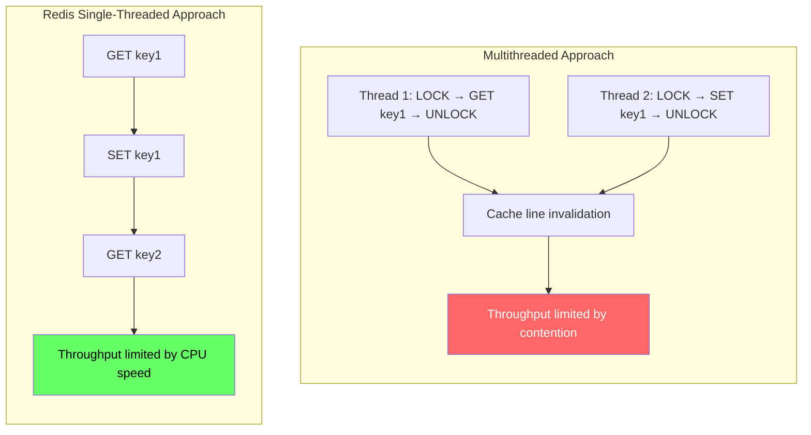
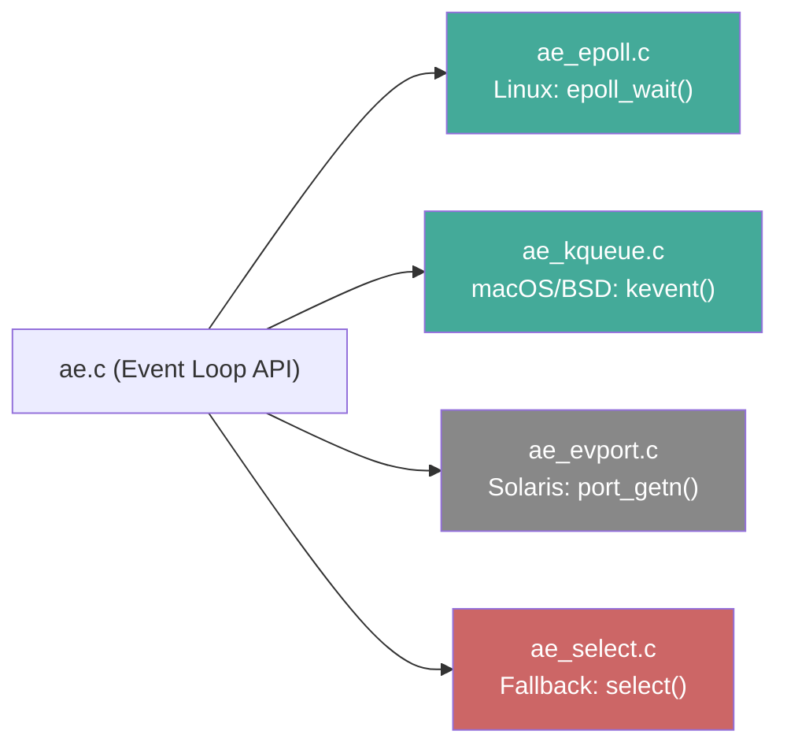
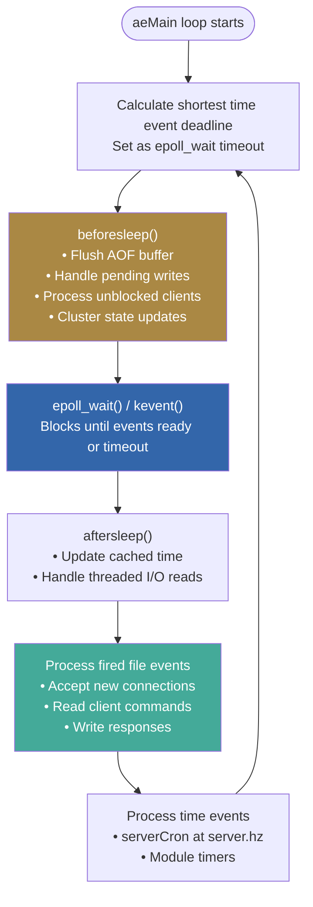
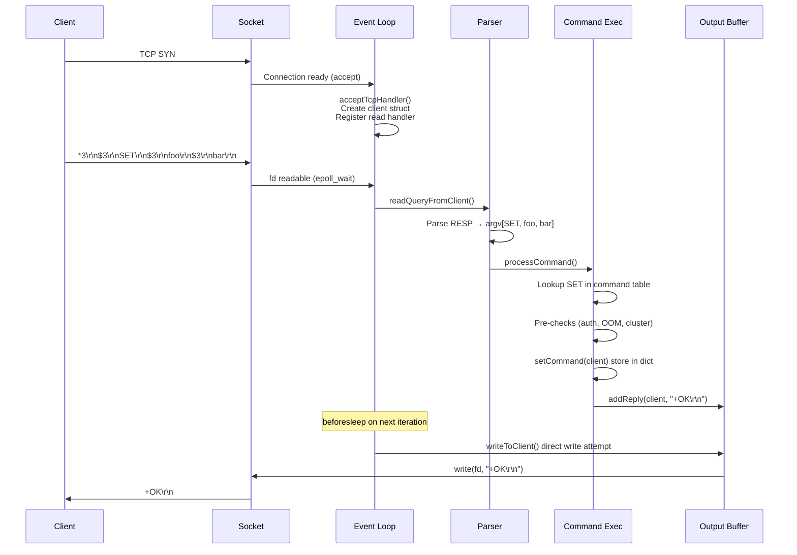
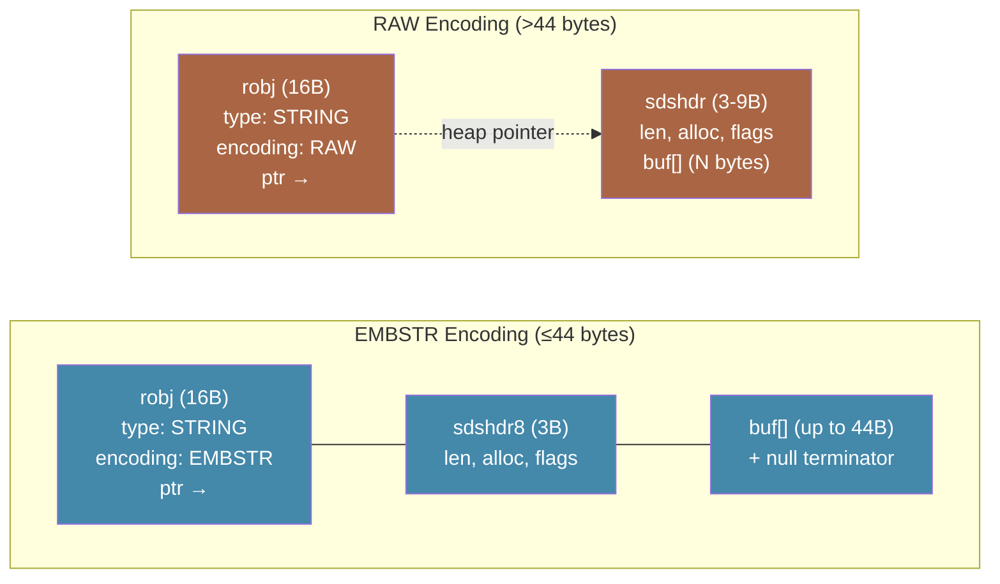
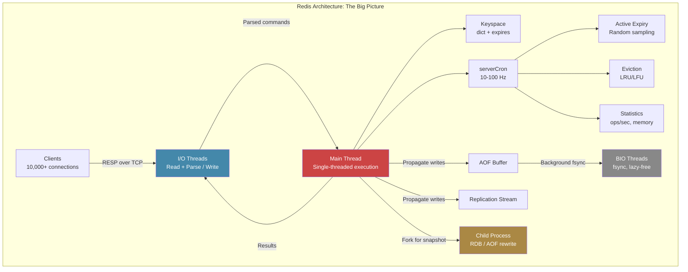

# Redis Deep Dive Series  Part 1: Architecture & Event Loop Internals

---

**Series:** Redis Deep Dive Engineering the World's Most Misunderstood Data Structure Server
**Part:** 1 of 10
**Audience:** Senior backend engineers, distributed systems engineers, infrastructure architects
**Reading time:** ~35 minutes

---

## Where We Are in the Series

In Part 0, we built the systems foundation: the memory hierarchy that explains *why* in-memory is fast, the socket/TCP model that connects your application to Redis, I/O multiplexing and event loops that let one thread handle thousands of clients, the forking/copy-on-write mechanism that enables persistence without blocking, and the data structures (hash tables, skip lists, listpacks) that Redis uses internally.

Now we go inside Redis itself. This article dissects the architecture  the event loop code, the client lifecycle, the internal object system, and the performance engineering that makes Redis handle 200,000+ ops/sec on a single thread. By the end of this article, you'll understand *exactly* what happens when your application sends a command to Redis, from the TCP packet hitting the socket to the response bytes flowing back.

### Who This Series Is For

This series targets engineers who already use Redis in production and want to understand *why* it behaves the way it does  not just *how* to use it. If you've ever stared at a `SLOWLOG` entry wondering why a single `KEYS *` brought your p99 latency from 0.1ms to 800ms, or debated whether Redis Cluster can actually guarantee consistency under partition, or tried to reason about whether your `MULTI/EXEC` block is truly atomic  this series is for you.

We will go deep into Redis internals: its source architecture, data structure implementations, persistence mechanics, replication protocol, cluster consensus, and the engineering tradeoffs that make Redis simultaneously brilliant and dangerous in production systems.

### What You Will Learn

- The architectural philosophy behind Redis's single-threaded design and why it outperforms multithreaded competitors in specific workloads
- How the event loop, I/O multiplexing, and command pipeline actually work at the system-call level
- Internal memory representations (`redisObject`, SDS, ziplist, quicklist, dict) and why they matter for your memory budget
- The real consistency guarantees (and gaps) in replication and cluster mode
- Persistence tradeoffs that most engineers get wrong
- How to reason about Redis failure modes before they happen in production
- System design patterns where Redis is the right tool  and where it's a ticking time bomb

### Prerequisites

If you're comfortable with the concepts in Part 0  file descriptors, epoll, sockets, processes vs. threads, Big-O notation, and basic data structures  you're ready. If terms like "copy-on-write" or "cache line" feel unfamiliar, read Part 0 first; this article assumes that vocabulary.

### Why Redis Matters in Modern Architecture

Redis sits at a peculiar intersection in the infrastructure stack. It's not a database in the traditional sense  it doesn't prioritize durability. It's not a simple cache  it has rich data structures, scripting, pub/sub, and streams. It's not a message broker  but it can behave like one. This ambiguity is both its greatest strength and its most common source of production incidents.

As of 2025, Redis processes an estimated trillions of operations per day across production deployments worldwide. It backs session stores at scale, rate limiters handling millions of requests per second, real-time leaderboards, distributed locks (with all their subtlety), feature flags, and caching layers that sit between applications and databases that would otherwise collapse under read load.

Understanding Redis at the architectural level isn't academic  it's the difference between a system that handles 200,000 ops/sec with sub-millisecond latency and one that falls over at 2 AM when a background save collides with a memory spike during peak traffic.

Let's begin.

---

## 1. The Single-Threaded Philosophy: A Deliberate Constraint

The first thing every engineer learns about Redis is that it's "single-threaded." The second thing most engineers do is misunderstand what that means.

Redis is **single-threaded for command execution**. The main event loop  the core of Redis  runs on a single thread. Every client command, from a simple `GET` to a complex `ZUNIONSTORE`, executes sequentially on this one thread. There is no concurrent access to data structures, no locking, no lock-free algorithms for the core data path.

But Redis is not *entirely* single-threaded. Since Redis 4.0 and significantly expanded in Redis 6.0+, auxiliary work happens on background threads:

| Component | Threading Model |
|---|---|
| Command execution | Single-threaded (main event loop) |
| I/O reading/writing (6.0+) | Multi-threaded (configurable via `io-threads`) |
| `UNLINK` / lazy free | Background thread (`bio`  background I/O) |
| RDB persistence (`BGSAVE`) | Forked child process (not a thread) |
| AOF rewrite | Forked child process |
| AOF `fsync` | Background thread (`bio`) |
| Module blocking commands | Thread pool (module API) |

This distinction matters enormously. The single-threaded command execution is what gives Redis its simplicity guarantees: no race conditions on data, no need for application-level distributed locking *within a single instance*, predictable latency for individual operations (assuming no slow commands). The multi-threaded I/O is what allows Redis to saturate modern network hardware without the command execution model becoming the bottleneck.

### Why Not Just Use Threads for Everything?

The conventional wisdom in database engineering is that concurrency requires threads. Traditional RDBMS engines use thread-per-connection or thread pool models. Memcached uses a multithreaded architecture with fine-grained locking. So why did Salvatore Sanfilippo (antirez) choose single-threaded execution?

The answer comes down to a fundamental observation about Redis's workload profile:

**For an in-memory data store doing sub-microsecond operations, the cost of lock contention exceeds the cost of sequential execution.**

Consider what happens in a multithreaded data store when two threads try to modify the same hash table:

1. Thread A acquires a lock (or attempts a CAS operation)
2. Thread B spins or blocks waiting for the lock
3. Thread A completes its operation and releases the lock
4. Thread B acquires the lock and proceeds
5. Both threads experience cache line invalidation because the shared data was modified

For an operation that takes 100 nanoseconds in Redis (a simple `GET`), the overhead of a mutex lock/unlock cycle (typically 25-50ns uncontended on modern hardware, potentially microseconds under contention) and the resulting cache line bouncing between CPU cores represents a *significant* fraction of the total operation time. In disk-based databases where operations take milliseconds, this overhead is negligible. In an in-memory system, it dominates.

Redis's design says: rather than paying the synchronization tax on every operation, execute everything sequentially and ensure the single thread is *never blocked on anything slow*. This is where the event loop enters the picture  the mechanism we introduced conceptually in Part 0, Section 4, and will now examine at the code level.



### The Performance Implications of Sequential Execution

Single-threaded execution gives Redis a property that is surprisingly rare in data systems: **operation latency is almost entirely deterministic** for a given operation type and data size. There are no lock waits, no thread scheduling jitters, no priority inversions. The p99 and p999 latencies closely track the median  until you hit one of Redis's well-known latency cliffs (which we'll cover in Part 8).

This also means Redis can fully exploit CPU cache locality (recall the cache line discussion from Part 0, Section 2). The main thread's working set  the event loop state, the currently-executing command's arguments, the data structure being accessed  stays hot in L1/L2 cache. In a multithreaded model, context switches between threads accessing different keys would thrash the cache hierarchy (the overhead we quantified in Part 0, Section 6). Redis avoids this entirely.

However, this design has a critical implication that engineers frequently underestimate:

> **Any single slow command blocks every other client.**

A `KEYS *` on a keyspace of 10 million entries doesn't just slow down the client that issued it  it blocks *all* command execution for the duration. An `LRANGE` returning 100,000 elements serializes 100,000 items while every other client waits. A Lua script running for 500ms is 500ms of complete service unavailability.

This is not a bug  it's the fundamental tradeoff of the architecture. And it's why understanding the event loop is essential for running Redis in production.

Now that we understand *why* Redis chose single-threaded execution, let's look at *how* it actually works. The event loop is the mechanism that makes the single-thread model viable  it's how one thread serves thousands of clients without blocking.

---

## 2. The Event Loop: ae Library Internals

Redis's event loop is implemented in a custom library called `ae` (a simple event-driven programming library), found in `ae.c` and `ae.h` in the Redis source. Unlike many modern servers that use libuv, libevent, or libev, Redis uses its own minimal event loop implementation. This is a deliberate choice: `ae` is roughly 700 lines of C, trivially auditable, and tailored to Redis's exact needs.

### The Core Event Loop Structure

The central data structure is `aeEventLoop`:

```c
typedef struct aeEventLoop {
    int maxfd;                  /* highest file descriptor currently tracked */
    int setsize;                /* max number of file descriptors tracked */
    long long timeEventNextId;  /* next time event unique ID */
    aeFileEvent *events;        /* registered file events (indexed by fd) */
    aeFiredEvent *fired;        /* fired events after poll returns */
    aeTimeEvent *timeEventHead; /* linked list of time events */
    int stop;                   /* stop flag for the event loop */
    void *apidata;              /* backend-specific data (epoll/kqueue/select) */
    aeBeforeSleepProc *beforesleep;  /* called before each blocking wait */
    aeBeforeSleepProc *aftersleep;   /* called after each blocking wait */
} aeEventLoop;
```

The event loop manages two kinds of events:

1. **File events**  I/O readiness on file descriptors (client sockets, listening sockets, replication connections, cluster bus connections, module pipes)
2. **Time events**  Periodic callbacks (the `serverCron` function being the most important, running at `server.hz` frequency, default 10 Hz)

### I/O Multiplexing Backends

Redis abstracts the platform-specific I/O multiplexing syscall behind a common API. At compile time, it selects the best available backend:



The selection priority is: `evport` > `epoll` > `kqueue` > `select`. In production Linux deployments, you are effectively always running on `epoll`.

Why does this matter? Because `epoll` operates in O(1) for event notification  regardless of how many file descriptors are registered, `epoll_wait()` returns only the *ready* descriptors. This is critical for Redis servers handling 10,000+ concurrent connections. With `select()`, the kernel must scan the entire fd_set on every call  O(n) per invocation. With `epoll`, the kernel maintains a ready list and returns results in O(number of ready events).

Redis uses `epoll` in level-triggered mode (not edge-triggered), which means it will continue to report a file descriptor as ready as long as there is data available to read. This is simpler to reason about and less prone to subtle bugs where events get lost.

### The Main Loop: aeMain and aeProcessEvents

The Redis server's `main()` function, after initialization, calls `aeMain()`:

```c
void aeMain(aeEventLoop *eventLoop) {
    eventLoop->stop = 0;
    while (!eventLoop->stop) {
        aeProcessEvents(eventLoop, AE_ALL_EVENTS | AE_CALL_BEFORE_SLEEP | AE_CALL_AFTER_SLEEP);
    }
}
```

That's it. An infinite loop calling `aeProcessEvents()`. The entire Redis server is this loop.

`aeProcessEvents` does the following on each iteration:

1. **Calculate the timeout for the blocking wait.** Find the nearest time event deadline. If a time event is due in 50ms, the `epoll_wait` timeout is set to 50ms. This ensures time events fire on schedule without busy-waiting.

2. **Call `beforesleep`.** This is where Redis does critical pre-poll work:
   - Flushes the AOF buffer to disk (if AOF is enabled)
   - Handles clients that have pending writes in their output buffers
   - Processes clients that were paused or unblocked
   - Handles cluster-related state updates
   - Processes modules' pending work

3. **Call the I/O multiplexing backend** (`epoll_wait` / `kevent` / `select`). This is the *only* blocking point in the main thread. Redis sleeps here until either a file descriptor becomes ready or the timeout expires.

4. **Call `aftersleep`.** Post-poll bookkeeping, including updating the cached time (`server.mstime`, `server.unixtime`) so that commands don't need to call `gettimeofday()` on every execution.

5. **Process fired file events.** For each ready file descriptor, invoke the registered callback  either a read handler or a write handler.

6. **Process time events.** Walk the time event linked list and fire any that are due.



### serverCron: The Heartbeat

The most important time event is `serverCron`, which runs by default at 10 Hz (every 100ms), configurable via the `hz` parameter (1-500). This function is Redis's background maintenance heartbeat:

- **Memory management:** Sample random keys for expiry (lazy + active expiration), check memory usage against `maxmemory`, trigger eviction if needed
- **Persistence:** Check if `BGSAVE` or `BGREWRITEAOF` conditions are met, monitor child process status
- **Replication:** Send `REPLCONF ACK` to master, handle partial resync state
- **Statistics:** Update ops/sec counters, memory stats, client activity
- **Cluster:** Housekeeping for cluster state, failure detection
- **Watchdog:** Check if the main loop is stalling (latency monitoring)

The `hz` parameter has a direct impact on expiry precision and memory reclamation speed. At `hz 10`, Redis samples expired keys 10 times per second. If your application creates millions of short-TTL keys, increasing `hz` to 100 or higher can improve memory reclamation  at the cost of more CPU time spent on housekeeping.

```
# redis.conf
hz 10              # Default: 10 cycles per second
dynamic-hz yes     # Adjust hz based on connected clients (Redis 5.0+)
```

With `dynamic-hz yes`, Redis scales the effective `hz` proportionally to the number of connected clients, improving expiry throughput under load without wasting CPU when idle.

We've now seen the event loop's internal structure  the `aeEventLoop`, the `aeProcessEvents` cycle, and the `serverCron` heartbeat. But the event loop is a general-purpose machine. To understand what Redis *does* with it, we need to follow a single client command from socket to response.

---

## 3. The Client Request Lifecycle

Understanding how a single command travels from the client's socket to the response buffer is fundamental to reasoning about Redis performance. In Part 0, Section 12, we traced this journey at a high level. Now we go inside the code.

### Phase 1: Connection Acceptance

When a client connects to Redis (default port 6379), the listening socket's file event fires. Redis calls `acceptTcpHandler`, which:

1. Calls `accept()` (or `accept4()` on Linux for atomic `SOCK_NONBLOCK`) to accept the connection
2. Creates a `client` structure (a substantial struct  roughly 1-2 KB per connected client, not counting buffers)
3. Sets the socket to non-blocking mode
4. Disables Nagle's algorithm (`TCP_NODELAY`)  **this is critical**: Nagle's algorithm batches small writes to reduce packet count, which would add up to 40ms latency on small responses. Redis always disables it.
5. Registers a read file event for the new fd, with `readQueryFromClient` as the callback
6. Sets default client flags, authentication state, and database index

### Phase 2: Reading the Command

When data arrives on a client's socket, `epoll_wait` returns the fd as readable, and `readQueryFromClient` fires:

1. **Read from socket into the query buffer** (`client->querybuf`). Redis calls `read()` (or `connRead()` in the connection abstraction layer), appending data to the client's input buffer. The read buffer grows dynamically  it starts small and expands as needed, up to `client-query-buffer-limit` (default 1 GB).

2. **Parse the RESP protocol.** Redis uses the RESP (REdis Serialization Protocol) wire format. The parser in `processInputBuffer` handles both inline commands (`GET foo\r\n`) and the standard multi-bulk format:
   ```
   *3\r\n$3\r\nSET\r\n$3\r\nfoo\r\n$3\r\nbar\r\n
   ```
   This is a RESP array of 3 bulk strings: `SET`, `foo`, `bar`. The parser is incremental  it can handle partial reads across multiple event loop iterations, which is essential for large commands that arrive in multiple TCP segments.

3. **Construct the argument vector.** The parsed command arguments are stored as `robj` (Redis objects) in `client->argv`, with `client->argc` holding the count.

### Phase 3: Command Lookup and Execution

Once a complete command is parsed, `processCommand` takes over:

1. **Command lookup.** Redis looks up the command name in the command table (`server.commands`), a hash table mapping command names to `redisCommand` structures. Each `redisCommand` defines:
   - The implementation function pointer
   - Arity (expected argument count)
   - Flags (`CMD_WRITE`, `CMD_READONLY`, `CMD_FAST`, `CMD_SLOW`, etc.)
   - Key position specifications (for cluster routing and ACL checking)

2. **Pre-execution checks.** Before calling the implementation, Redis validates:
   - Authentication (`AUTH` / ACL permissions)
   - `OOM` conditions (if `maxmemory` is set and the command writes data)
   - Command is not blocked (e.g., during `LOADING` state, or if the client is in `MULTI` and sends a non-queued command)
   - Cluster redirection (if the key hashes to a slot owned by another node)
   - Replication state (blocking writes on replicas, unless `replica-read-only no`)

3. **Call the command implementation.** The `call()` function wraps the actual execution:
   - Records the start time (for slowlog tracking)
   - Invokes `cmd->proc(client)`  the actual C function implementing the command
   - Measures duration
   - Propagates the command to AOF and replicas if it modified data
   - Updates statistics (`server.stat_numcommands`, per-command call counts, latency histogram)

4. **Generate the response.** The command implementation writes the response to the client's output buffer (`client->buf` for small responses, `client->reply` linked list for larger ones) using functions like `addReply`, `addReplyBulk`, `addReplyLongLong`.

### Phase 4: Writing the Response

Responses are not written to the socket immediately. Instead:

1. During command execution, data is appended to the client's output buffer
2. The client is added to `server.clients_pending_write`  a list of clients with pending output
3. In `beforeSleep` (before the next `epoll_wait`), Redis attempts to write directly from the output buffer to the socket via `writeToClient`
4. If the full response couldn't be written (socket buffer full), Redis installs a write file event for the fd, so `epoll_wait` will notify when the socket is writable again
5. When the write event fires, `sendReplyToClient` drains more of the output buffer

This "write in `beforeSleep` first, install write handler only if needed" pattern is an optimization. For the common case (small responses, uncongested sockets), the response is sent immediately without involving `epoll` for the write side at all. This eliminates an `epoll_ctl` syscall for the vast majority of commands  an example of the "efficient syscall patterns" we'll quantify in Section 6.



The lifecycle above assumes all I/O happens on the main thread  the pre-Redis 6.0 model. But as network hardware got faster and workloads got larger, the I/O serialization on the main thread became a bottleneck. Redis 6.0 introduced a solution that preserves the single-threaded execution guarantee while parallelizing the I/O work.

---

## 4. The Networking Model: From Single-Threaded to Threaded I/O

### Pre-6.0: Pure Single-Threaded I/O

Before Redis 6.0, all network I/O happened on the main thread. This meant:
- `read()` from client sockets: main thread
- RESP parsing: main thread
- Command execution: main thread
- `write()` to client sockets: main thread

For most workloads, this was not a bottleneck. A single CPU core can handle 100,000+ `GET`/`SET` operations per second with small values, and the network I/O for these operations is trivial. But as network hardware improved (10 Gbps, 25 Gbps, 100 Gbps NICs became common), and as workloads shifted toward larger values or high client counts, I/O processing started consuming a significant fraction of the main thread's time.

### Redis 6.0+ Threaded I/O

Redis 6.0 introduced multi-threaded I/O, configurable with:

```
# redis.conf
io-threads 4              # Number of I/O threads (including main thread)
io-threads-do-reads yes   # Also parallelize reading (not just writing)
```

The critical design decision: **I/O threads handle socket reads and writes, but command execution remains single-threaded.** This preserves the lock-free data access model while offloading the I/O serialization work.

Here's how it works:

1. The main thread collects all clients with pending reads (data available on their sockets)
2. These clients are distributed across I/O threads in a round-robin fashion
3. Each I/O thread calls `read()` and performs RESP parsing for its assigned clients  in parallel
4. The main thread waits (busy-spins) until all I/O threads finish reading
5. The main thread processes all parsed commands sequentially (single-threaded execution)
6. After execution, clients with pending writes are distributed to I/O threads
7. I/O threads perform the `write()` calls in parallel
8. The main thread waits until all writes complete

```mermaid
flowchart TD
    subgraph "Main Thread"
        A[Collect clients with pending reads] --> B[Distribute to I/O threads]
        B --> C[Wait for I/O threads to finish reads]
        C --> D["Execute ALL commands sequentially<br/>(single-threaded  the critical section)"]
        D --> E[Distribute pending writes to I/O threads]
        E --> F[Wait for I/O threads to finish writes]
        F --> A
    end

    subgraph "I/O Thread 1"
        IO1_R[read() + parse RESP] -.-> IO1_W[write() responses]
    end

    subgraph "I/O Thread 2"
        IO2_R[read() + parse RESP] -.-> IO2_W[write() responses]
    end

    subgraph "I/O Thread 3"
        IO3_R[read() + parse RESP] -.-> IO3_W[write() responses]
    end

    B --> IO1_R
    B --> IO2_R
    B --> IO3_R
    E --> IO1_W
    E --> IO2_W
    E --> IO3_W

    style D fill:#e44,color:#fff
```

This model is not free of tradeoffs:

- **The main thread busy-spins** while waiting for I/O threads. This burns CPU cycles but avoids the latency of condition variable signaling. For high-throughput workloads, this is correct  the wait is typically microseconds.
- **The I/O threads are only active during the read/write phases.** They idle during command execution. This limits the achievable parallelism to I/O-bound workloads.
- **Threaded I/O doesn't help with slow commands.** If a single `LRANGE` takes 5ms to execute, threaded I/O doesn't reduce that  it only helps when aggregate I/O volume (not command execution) is the bottleneck.

In practice, `io-threads 4` on a modern server with large-value workloads can improve throughput by 2x. For small-value, low-client-count workloads, the overhead of thread coordination can actually *reduce* performance. **Benchmark before enabling.** Part 4 covers systematic benchmarking techniques with `redis-benchmark` and latency diagnosis tools.

We've now covered how Redis processes commands (event loop) and how it moves bytes in and out (networking). The next question is: what do those bytes *become* once they're inside Redis? When you `SET user:42 "Alice"`, what data structure actually holds the value in memory?

---

## 5. Internal Object Representation: redisObject and Type Encodings

Every value stored in Redis is wrapped in a `redisObject` (typedef'd as `robj`):

```c
typedef struct redisObject {
    unsigned type:4;        /* REDIS_STRING, REDIS_LIST, REDIS_SET, etc. */
    unsigned encoding:4;    /* Internal encoding (e.g., INT, EMBSTR, HT, ZIPLIST) */
    unsigned lru:LRU_BITS;  /* LRU time or LFU data (for eviction) */
    int refcount;           /* Reference counting for memory management */
    void *ptr;              /* Pointer to the actual data structure */
} robj;
```

This struct is 16 bytes on 64-bit systems. The `type` field indicates the Redis data type visible to the user. The `encoding` field indicates the *internal representation*  and this is where Redis's memory efficiency story gets interesting.

### The Encoding Duality

Redis does not use a single data structure for each type. Instead, it selects the most memory-efficient encoding based on the data's characteristics:

| Type | Small/Simple Encoding | Large/Complex Encoding | Transition Threshold |
|---|---|---|---|
| String | `OBJ_ENCODING_INT` (integer) or `OBJ_ENCODING_EMBSTR` (≤44 bytes) | `OBJ_ENCODING_RAW` (SDS) | 44 bytes |
| List | `OBJ_ENCODING_LISTPACK` (dense packed) | `OBJ_ENCODING_QUICKLIST` (linked list of listpacks) | `list-max-listpack-size` (default 128 entries or 8KB) |
| Set | `OBJ_ENCODING_LISTPACK` (small sets) or `OBJ_ENCODING_INTSET` (all integers) | `OBJ_ENCODING_HT` (hash table) | `set-max-listpack-entries` (default 128) |
| Hash | `OBJ_ENCODING_LISTPACK` | `OBJ_ENCODING_HT` (hash table) | `hash-max-listpack-entries` (default 128) / `hash-max-listpack-value` (default 64 bytes) |
| Sorted Set | `OBJ_ENCODING_LISTPACK` | `OBJ_ENCODING_SKIPLIST` + `OBJ_ENCODING_HT` | `zset-max-listpack-entries` (default 128) / `zset-max-listpack-value` (default 64 bytes) |

This two-encoding strategy is critical for memory efficiency. A hash with 5 small fields stored as a listpack uses roughly 100-200 bytes. The same hash stored as a hash table uses 400-600 bytes due to hash table overhead (pointers, allocated buckets, dict metadata). When you have millions of small hashes, this 2-3x difference determines whether your data fits in RAM.

### SDS: Simple Dynamic Strings

Redis strings are not C strings. They use SDS (Simple Dynamic Strings), defined in `sds.h`:

```c
struct __attribute__ ((__packed__)) sdshdr8 {
    uint8_t len;        /* used length */
    uint8_t alloc;      /* allocated length (excluding header and null terminator) */
    unsigned char flags; /* type flag: SDS_TYPE_5, SDS_TYPE_8, etc. */
    char buf[];          /* the actual string data */
};
```

SDS provides several advantages over C strings:

1. **O(1) length retrieval**  `len` is stored, not computed via `strlen()`
2. **Binary safety**  SDS can contain null bytes; length is explicit, not null-terminated
3. **Bounds checking**  the `alloc` field prevents buffer overflows on append operations
4. **Reduced reallocations**  SDS pre-allocates extra space on growth (space pre-allocation) and doesn't shrink on truncation (lazy free)
5. **Multiple header sizes**  `sdshdr5`, `sdshdr8`, `sdshdr16`, `sdshdr32`, `sdshdr64` minimize overhead for different string lengths. A string under 256 bytes uses `sdshdr8` (3 bytes overhead); under 32 bytes can use `sdshdr5` (1 byte overhead)

The `EMBSTR` encoding is a further optimization: for strings ≤44 bytes, the `robj` header and the SDS string are allocated in a single contiguous memory block. This means one `malloc` call instead of two, and the entire object fits in a single cache line (64 bytes). For small strings  which dominate most workloads  this is a substantial performance win.



### The Dictionary: Redis's Hash Table

The primary key-value store in Redis is a `dict`  a hash table with incremental rehashing. Each Redis database is essentially:

```c
typedef struct redisDb {
    dict *dict;      /* keyspace: all key-value pairs */
    dict *expires;   /* keys with TTL: key → expiry timestamp */
    // ... other fields
} redisDb;
```

The `dict` implementation uses two hash tables (`ht_table[0]` and `ht_table[1]`) to support **incremental rehashing**. When the load factor exceeds a threshold (typically 1.0, or 5.0 during `BGSAVE` to avoid triggering copy-on-write), Redis begins rehashing:

1. Allocate `ht_table[1]` with double the size of `ht_table[0]`
2. On each dictionary operation (lookup, insert, delete), migrate a small number of buckets from `ht_table[0]` to `ht_table[1]`
3. When migration completes, swap the tables and free the old one

This incremental approach avoids the latency spike of a full rehash. A dictionary with 10 million entries would take milliseconds to rehash all at once  unacceptable for Redis's latency requirements. By spreading the work across operations, each individual rehash step costs microseconds.

However, during rehashing, every lookup must check *both* hash tables, and memory usage temporarily doubles for the hash table (not the values  those are shared). This is a known source of memory spikes and is particularly dangerous near `maxmemory` limits. Part 3 goes deep into memory management  jemalloc internals, fragmentation, and the `MEMORY` command for diagnosing exactly these kinds of issues.

We've now dissected Redis's internal object system  the `redisObject` wrapper, encoding duality, SDS strings, and the dictionary with incremental rehashing. Part 2 will go much deeper into each data structure's internal layout. But first, let's step back and synthesize: across everything we've covered (the event loop, the networking model, the object system), *why* is Redis actually fast? The answer involves every layer working together.

---

## 6. Why Redis Is Fast: A Systems-Level Analysis

"Redis is fast" is almost a truism, but the *reasons* are frequently misunderstood. Let's decompose the performance into its contributing factors, ordered by impact. Many of these build on the systems fundamentals from Part 0  now you'll see them manifest in Redis's actual design.

### Factor 1: In-Memory Data Access

The single largest contributor to Redis's speed is that all data resides in RAM. A modern DDR4/DDR5 memory access is ~100 nanoseconds. An NVMe SSD random read is ~10-20 microseconds. A spinning disk seek is ~5-10 milliseconds. Redis operates at the memory tier  100-1000x faster than disk-based databases for random access patterns.

This is not unique to Redis (Memcached, Hazelcast, and others share this property), but it's the foundation upon which all other optimizations build.

### Factor 2: No Kernel-to-User Context Switch per Operation

In traditional database architectures (PostgreSQL, MySQL), each query involves:
- Parsing SQL
- Planning/optimizing the query
- Traversing B-tree indexes (potentially hitting disk)
- Buffer pool management
- MVCC version checking
- Lock acquisition/release
- WAL logging

Each of these steps involves orders of magnitude more CPU work than a Redis command. A Redis `GET` is roughly: hash lookup → follow pointer → return value. The command execution itself is ~100-200 nanoseconds.

### Factor 3: Efficient Syscall Patterns

Redis minimizes syscalls per operation:

- **Epoll-based multiplexing:** One `epoll_wait()` call handles all ready file descriptors. Not one-syscall-per-client.
- **Read/write batching:** Multiple commands from the same client can be read in a single `read()` call. Multiple responses can be written in a single `write()` call.
- **Pipeline support:** Clients can send multiple commands without waiting for responses, allowing Redis to read them all in one `read()`, execute them sequentially, and write all responses in one `write()`. This amortizes the syscall overhead across multiple operations.

With pipelining, Redis can achieve 500,000-1,000,000+ operations per second on a single core because the per-operation overhead drops to near zero  it's essentially memcpy-speed for small values.

### Factor 4: CPU Cache Locality

The single-threaded model ensures the main thread's working set stays hot in L1/L2 cache:

- The event loop state (~hundreds of bytes) stays in L1
- Recently accessed hash table buckets stay in L2/L3
- The `robj` → SDS pointer chase is typically 1-2 cache misses for small values (and zero for `EMBSTR` encoding)
- No cache line invalidation from other threads modifying shared data

In a multithreaded design, false sharing and cache coherency traffic between cores can cost 50-100ns per cache line transfer  comparable to the entire operation time in Redis.

### Factor 5: Optimized Data Structures

Redis's data structures are optimized for the in-memory case, not the on-disk case:

- **Listpacks** (successor to ziplists) store small collections as contiguous byte arrays  excellent for cache prefetching, zero pointer overhead
- **Skip lists** for sorted sets provide O(log n) lookup with better cache behavior than balanced trees (which have poor locality due to pointer chasing)
- **Intsets** store small integer sets as sorted arrays  compact and binary-searchable
- **Hash tables with incremental rehashing**  amortized O(1) operations without latency spikes

### Factor 6: Simple Protocol

RESP is trivially parseable. There's no SQL parsing, no query planning, no cost-based optimization. The parse overhead per command is measured in nanoseconds, not microseconds.

### What Does NOT Make Redis Fast

Some commonly cited reasons that are actually secondary or misleading:

- **"It's written in C"**  The language matters less than the architecture. A poorly designed C server would still be slow. Rust, C++, or even well-optimized Go/Java could achieve similar raw performance for the data access path. The C implementation is efficient, but the *design decisions* (in-memory, single-threaded, multiplexed I/O) are what matter.
- **"It uses zero-copy"**  Redis does not use `sendfile()` or `splice()` for normal command responses. Data is copied from internal structures into the output buffer, then `write()`'d to the socket. There is no zero-copy path in standard Redis command processing. (Modules and RDB transfer over sockets may use different paths, but the hot path is not zero-copy.)
- **"It's non-blocking"**  The I/O is non-blocking, yes, but the data operations are not "non-blocking" in the concurrent-programming sense. They're sequential. The correct framing is "event-driven with non-blocking I/O."

Now that we understand *why* Redis is fast, a natural question arises: when should you use Redis vs. the alternatives? The answer depends on which of these performance factors matter for your workload  and what tradeoffs you're willing to accept.

---

## 7. Redis vs. The Alternatives: Engineering Tradeoffs

### Redis vs. Memcached

Memcached is often Redis's most direct comparison. Both are in-memory, key-value, sub-millisecond latency systems. But their design philosophies diverge significantly:

| Dimension | Redis | Memcached |
|---|---|---|
| Threading | Single-threaded execution, multi-threaded I/O | Multi-threaded from the ground up |
| Data structures | Strings, lists, sets, sorted sets, hashes, streams, HyperLogLog, bitmaps, geospatial | Strings only (binary blobs) |
| Persistence | RDB snapshots, AOF log | None (pure cache) |
| Memory efficiency | jemalloc, encoding optimizations, object sharing | Slab allocator, no encoding tricks |
| Max value size | 512 MB | 1 MB (default, configurable) |
| Cluster mode | Redis Cluster (hash slots, auto-sharding) | Client-side consistent hashing |
| Atomic operations | MULTI/EXEC, Lua scripting, single-command atomicity | CAS (compare-and-swap) only |

**When Memcached wins:**
- Pure caching workloads with string-only values. Memcached's multi-threaded architecture can utilize all CPU cores for a single instance, whereas Redis requires multiple instances to use multiple cores.
- Extreme simplicity requirements. Memcached has fewer operational knobs to misconfigure.
- When you explicitly want *no* persistence. Redis's persistence features, even when disabled, add operational complexity (background save state, fork behavior, etc.).

**When Redis wins:**
- Any workload requiring data structures beyond simple strings
- When you need atomicity guarantees beyond simple CAS
- When you need persistence as a durability layer (acknowledging the limitations)
- Pub/sub, streams, or Lua scripting requirements

### Redis vs. Traditional Databases as Cache

Engineers sometimes ask: "Why not just use PostgreSQL with `UNLOGGED` tables, or MySQL's `MEMORY` engine, or SQLite with `:memory:`?"

The answer is latency distribution. A PostgreSQL query for a cached value, even from shared buffers, involves:
1. Client → server round trip via PostgreSQL wire protocol
2. SQL parsing (even with prepared statements, there's overhead)
3. Query planning (trivial for point lookups, but nonzero)
4. Buffer pool lookup
5. Tuple header processing (MVCC visibility check, null bitmap)
6. Result serialization

This typically takes 200-500 microseconds per query, even for cached data. Redis does the equivalent in 10-50 microseconds. For a high-fan-out service making 50 cache lookups per request, this difference (10ms vs. 1ms) is the difference between a responsive service and a sluggish one.

### Redis vs. Modern Distributed Caches

Systems like Apache Ignite, Hazelcast, and Aerospike offer distributed, in-memory caching with richer consistency models. Dragonfly positions itself as a multi-threaded, Redis-compatible alternative.

**Redis's advantages:**
- Operational simplicity (a single-process, well-understood failure model)
- Ecosystem depth (client libraries, monitoring tools, operational knowledge)
- Low overhead per operation (no distributed coordination for single-key operations)

**Where alternatives shine:**
- Dragonfly: multi-threaded, Redis-compatible, better multi-core utilization per instance
- Hazelcast/Ignite: embedded caching with distributed compute capabilities
- Aerospike: hybrid memory/SSD storage for datasets exceeding RAM

Choosing Redis means accepting its constraints. The next section examines what those constraints look like in practice  the bottlenecks, limits, and anti-patterns that trip up production deployments. Part 8 goes even deeper with real-world war stories and production checklists.

---

## 8. Production Realities: Bottlenecks, Limits, and Anti-Patterns

### Scaling Limits of a Single Redis Node

A single Redis instance on modern hardware (say, a 32-core machine with 256 GB RAM) is bounded by:

- **CPU (single-core):** ~100,000-200,000 ops/sec for complex commands; up to ~1,000,000 ops/sec for simple GET/SET with pipelining. The main thread can only saturate one core.
- **Memory:** Limited by the physical RAM and `maxmemory` configuration. Account for overhead: Redis uses ~1.5-3x the raw data size due to pointers, hash table overhead, `robj` wrappers, and SDS headers. During `BGSAVE`, copy-on-write can temporarily double memory usage.
- **Network:** With threaded I/O, a single instance can saturate a 10 Gbps NIC. Without threaded I/O, network serialization on the main thread typically limits throughput before CPU does for large-value workloads.
- **Client connections:** Default `maxclients` is 10,000. Each connection consumes ~10-20 KB with default buffers. 10,000 connections = ~100-200 MB just for connection state.

### Common Performance Bottlenecks

1. **Slow commands.** Commands with O(n) or worse complexity on large datasets: `KEYS *`, `SMEMBERS` on large sets, `HGETALL` on large hashes, `LRANGE 0 -1` on large lists, `SORT` on large collections. Use `SCAN` family commands for iteration. Monitor with `SLOWLOG`.

2. **Big keys.** A single hash with 1 million fields, or a sorted set with 10 million members. These cause:
   - Slow access (serialization time)
   - Slow deletion (memory reclamation blocks the event loop  use `UNLINK` instead of `DEL` for async deletion)
   - Memory fragmentation
   - Replication amplification (the entire big key is reserialized on every modification)

3. **Fork latency.** `BGSAVE` and `BGREWRITEAOF` fork the Redis process (the forking mechanism described in Part 0, Section 5). On a machine with 100 GB of RSS, the fork itself takes 10-20ms on Linux (page table duplication). During the fork, the main thread is blocked. After the fork, copy-on-write semantics mean that *any write* to a memory page duplicates that page. Under write-heavy workloads during a background save, memory can spike dramatically. Part 3 provides detailed CoW measurement techniques and mitigation strategies.

4. **Expiry pressure.** When a large number of keys expire simultaneously (e.g., a cache stampede after a mass TTL set at the same time), the active expiry cycle in `serverCron` can consume significant CPU. Redis samples 20 random keys per cycle and continues if >25% are expired, up to a time limit. Under extreme expiry load, this can cause latency spikes.

5. **Memory fragmentation.** After extensive key creation/deletion, the allocator (jemalloc) may have significant internal fragmentation. Monitor via `INFO memory`  `mem_fragmentation_ratio` above 1.5 indicates concern. Redis 4.0+ supports active defragmentation (`activedefrag yes`), which moves values to reduce fragmentation, but this consumes CPU. Part 3 covers jemalloc's size classes and fragmentation patterns in detail.

### When Redis Becomes a Bad Choice

Redis is not a good fit when:

- **Data exceeds available RAM.** Redis is fundamentally an in-memory system. While Redis on Flash (Enterprise) exists, open-source Redis requires the full dataset in memory. If your cache is 500 GB and your server has 128 GB of RAM, Redis is not the answer.

- **You need strong consistency.** Redis replication is asynchronous by default. A network partition or master failure *will* lose acknowledged writes. `WAIT` provides synchronous replication but does not prevent split-brain scenarios (Part 5 covers the replication consistency model in detail, and Part 6 examines cluster-level consistency guarantees). If you need linearizable reads or compare-and-swap semantics across replicas, Redis is the wrong tool.

- **Your workload is write-heavy with persistence.** The fork-based persistence model means every `BGSAVE` is a full snapshot. Under high write rates, copy-on-write amplification can double memory usage and the RDB file lags behind the current state. AOF with `everysec` fsync provides better durability but adds I/O overhead and requires periodic rewrites.

- **You need multi-key transactions across different nodes.** Redis Cluster does not support cross-slot transactions (Part 6 explains hash slots and the `{hashtag}` workaround for co-locating related keys). `MULTI/EXEC` works on a single node for keys in the same hash slot. If your transaction needs to atomically modify keys on different cluster nodes, you need a different system.

- **You're using it as a primary database for critical data.** Despite persistence capabilities, Redis's durability guarantees are weaker than any traditional RDBMS or systems like CockroachDB/TiKV. If you cannot afford to lose the last second (or more) of writes, do not use Redis as your primary data store.

### Common Misconceptions

**"Redis MULTI/EXEC is like a database transaction."**
No. Redis transactions provide *isolation* (commands execute sequentially without interleaving) and *atomicity* (all-or-nothing execution), but no *rollback*. If a command within a MULTI/EXEC block fails (runtime error), the other commands still execute. There is no `ROLLBACK`. Additionally, there is no constraint checking  if you `INCR` a key that contains a string, the error occurs but the transaction continues.

**"Redis is single-threaded, so it can only use one CPU core."**
Partially true for command execution, but background threads, I/O threads, and child processes for persistence use additional cores. A Redis instance under load with `io-threads 4` and `BGSAVE` running can use 5-6 cores.

**"Setting `maxmemory` prevents Redis from using more memory than configured."**
`maxmemory` controls when Redis starts evicting keys (or rejecting writes). But memory accounting is imperfect: overhead from the output buffers of connected clients, replication backlog, Lua script memory, and allocator fragmentation are partially or fully *excluded* from the maxmemory accounting. A Redis instance configured with `maxmemory 8gb` on a server with 8 GB of RAM can still OOM-kill.

Set `maxmemory` to roughly 75% of available RAM, reserving headroom for output buffers, fork CoW, and allocator overhead.

**"Pipelining is just batching."**
Pipelining and batching (e.g., `MGET`) are related but distinct. Pipelining sends multiple commands without waiting for individual responses, amortizing network round-trip time. `MGET` is a single command that operates on multiple keys. Pipelining works for *any* command sequence. `MGET` only works for string gets. Both reduce latency for bulk operations, but through different mechanisms. Use both when applicable.

---

## 9. Practical Configuration for Production

Here is an annotated configuration fragment reflecting the decisions discussed in this article:

```
# NETWORKING
bind 0.0.0.0
port 6379
tcp-backlog 511                    # Increase if connection rate is high
timeout 300                        # Close idle clients after 5 minutes
tcp-keepalive 60                   # Detect dead connections

# THREADING (Redis 6.0+)
io-threads 4                       # Enable for >50k ops/sec or large values
io-threads-do-reads yes            # Parallelize reads, not just writes

# MEMORY
maxmemory 6gb                      # Set below physical RAM (leave ~25% headroom)
maxmemory-policy allkeys-lru       # Eviction policy  choose based on workload
# Options: volatile-lru, allkeys-lru, volatile-lfu, allkeys-lfu,
#          volatile-random, allkeys-random, volatile-ttl, noeviction

# PERFORMANCE TUNING
hz 10                              # serverCron frequency; increase to 100 for
                                   # high-TTL-churn workloads
dynamic-hz yes                     # Scale hz with client count
activedefrag yes                   # Enable active defragmentation (jemalloc only)
active-defrag-enabled yes
active-defrag-ignore-bytes 100mb   # Start defrag above this fragmentation threshold
active-defrag-threshold-lower 10   # Start when fragmentation > 10%
active-defrag-threshold-upper 100  # Max CPU effort when fragmentation > 100%

# LATENCY MONITORING
latency-monitor-threshold 5        # Log events exceeding 5ms
slowlog-log-slower-than 10000      # Log commands slower than 10ms (in µs)
slowlog-max-len 256                # Keep 256 slow log entries

# CLIENT MANAGEMENT
maxclients 10000
client-output-buffer-limit normal 0 0 0
client-output-buffer-limit replica 256mb 64mb 60
client-output-buffer-limit pubsub 32mb 8mb 60

# ENCODING THRESHOLDS (tune based on your data patterns)
hash-max-listpack-entries 128
hash-max-listpack-value 64
list-max-listpack-size -2          # Max listpack size in KB (negative = size-based)
set-max-listpack-entries 128
zset-max-listpack-entries 128
zset-max-listpack-value 64
```

---

## 10. Summary: The Redis Execution Model

Redis's architecture is a masterclass in *designing for constraints*. By accepting the constraint of single-threaded command execution, Redis eliminates an entire class of complexity (locks, race conditions, deadlocks) and gains:

- Predictable latency for individual operations
- Sequential consistency for all operations within a single instance
- Excellent CPU cache utilization
- Trivial reasoning about atomicity (every command is atomic by default)

The cost is equally clear:

- Any slow command blocks everything
- A single instance cannot utilize multiple cores for computation
- Scaling requires multiple instances (with the complexity of sharding)
- The fork-based persistence model has inherent memory amplification

Understanding this tradeoff  and engineering around the constraints rather than fighting them  is the difference between a Redis deployment that hums along at 200,000 ops/sec with p99 < 1ms and one that pages your team at 3 AM.



---

## Coming Up in Part 2: Data Structures Deep Dive

In this article, we introduced the `redisObject` wrapper and the encoding duality concept  the idea that each Redis data type uses different internal encodings depending on the data's characteristics. Part 2 takes this to its logical conclusion, examining every data type's internal representation in detail:

- **The encoding system**  how `OBJECT ENCODING` reveals what's happening inside, and why the same `HSET` command can trigger completely different code paths
- **String encodings**  INT, EMBSTR, and RAW, with byte-level analysis of the 44-byte EMBSTR threshold
- **Lists**  from listpack to quicklist, and why Redis replaced ziplist + linkedlist with this hybrid structure
- **Hashes and Sets**  listpack vs. hashtable, intset for integer-only sets, and the memory savings of each
- **Sorted Sets**  the skip list + dict dual structure, how `ZADD` maintains both, and why skip lists beat red-black trees for this workload
- **Streams**  radix trees and the append-only log structure that makes Streams feel like Kafka
- **HyperLogLog, Bitmaps, and Geospatial**  the probabilistic and bit-level structures behind Redis's specialized types

We'll also provide a practical data structure selection guide and encoding configuration tuning advice.

---

*This is Part 1 of the Redis Deep Dive series. Each subsequent part builds on the mental models established here. Part 2 takes us inside the data structures; Part 3 covers memory management and persistence; and by Part 5, we'll move beyond a single Redis instance into the distributed world of replication and high availability.*
