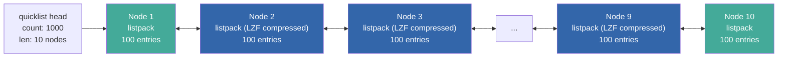
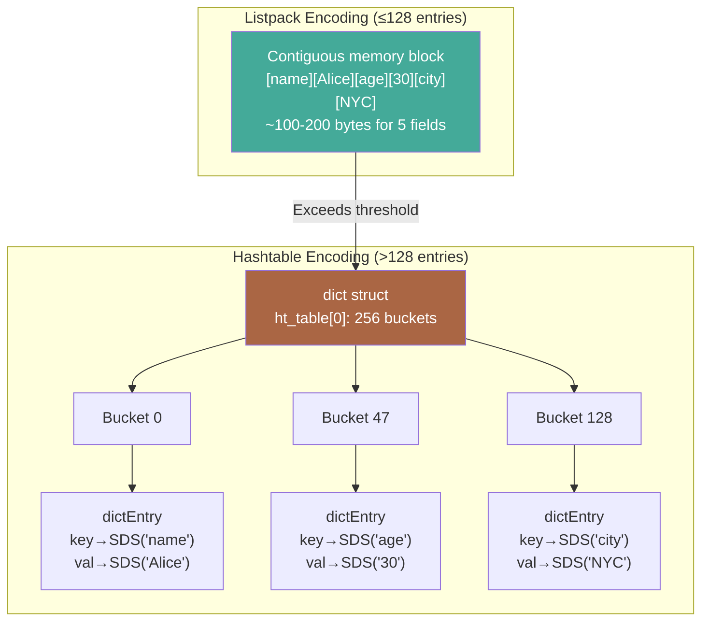
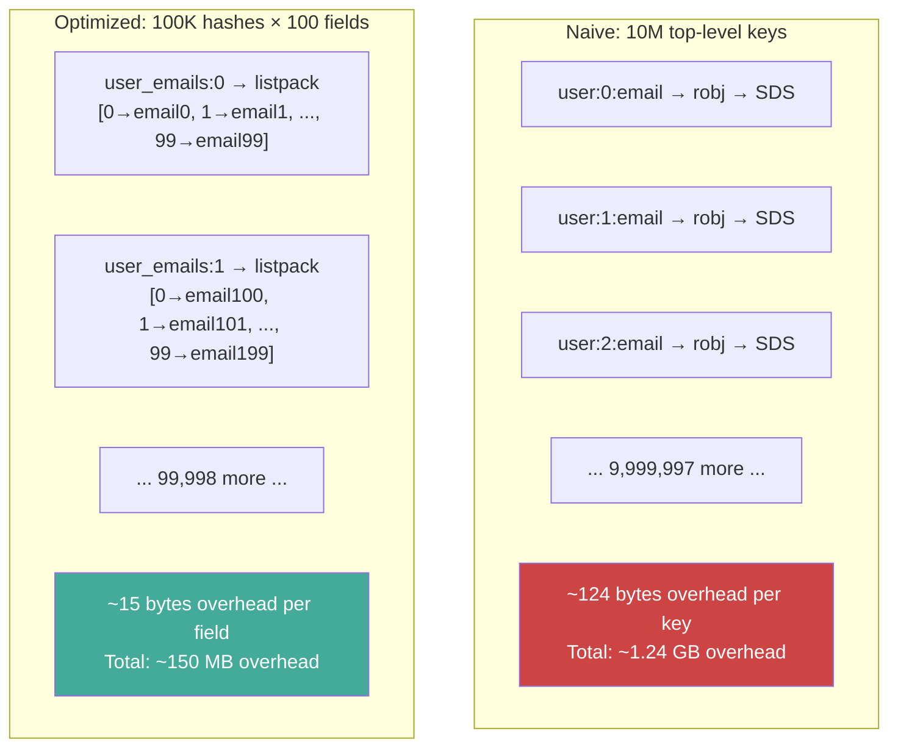
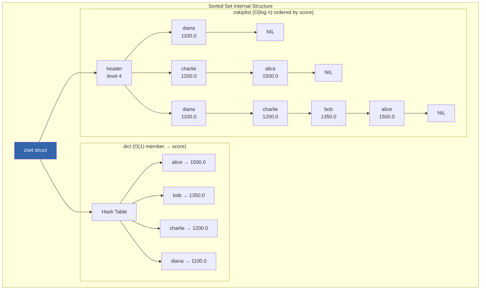
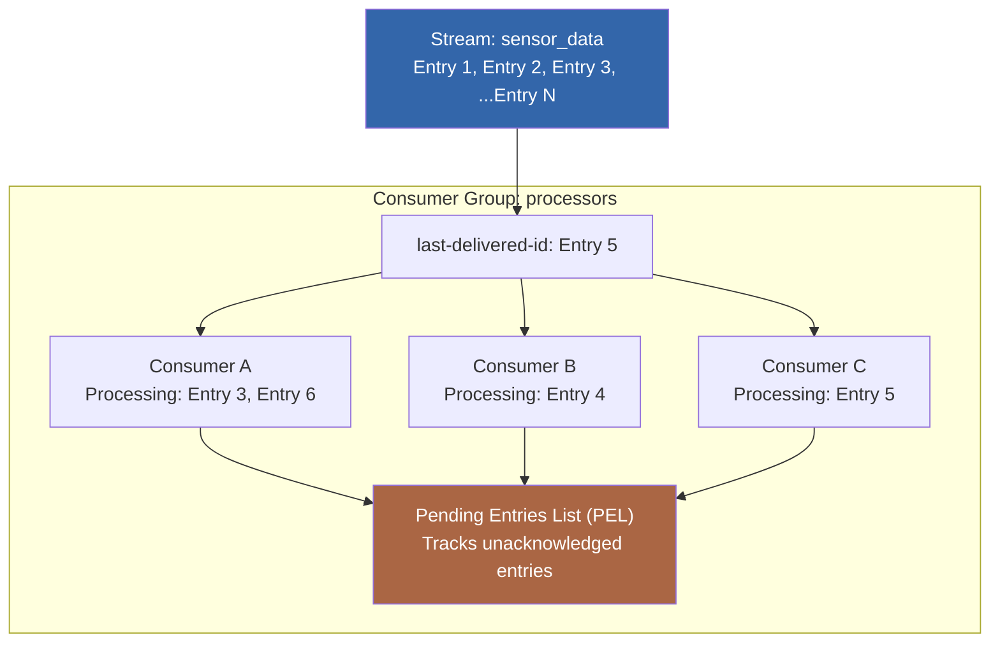
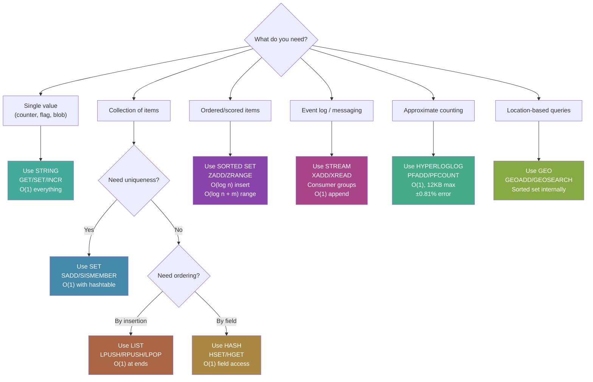

# Redis Deep Dive Series  Part 2: Redis Data Structures Deep Dive (Internal Encoding + Complexity)

---

**Series:** Redis Deep Dive  Engineering the World's Most Misunderstood Data Structure Server
**Part:** 2 of 10
**Audience:** Senior backend engineers, distributed systems engineers, infrastructure architects
**Reading time:** ~50 minutes

---

## Where We Are in the Series

In Part 0, we built the systems foundation  memory hierarchy, cache lines, data structure fundamentals. In Part 1, we dissected Redis's architecture: the `ae` event loop, the client request lifecycle, threaded I/O, and the `redisObject` wrapper with its encoding duality concept. Part 1 showed that each Redis data type has multiple internal representations, and hinted at why this matters for memory efficiency.

Now we go inside those representations. This article dismantles every Redis data type to the byte level. You'll learn exactly how a sorted set with 50 members is stored differently from one with 50,000 members, why a hash with small values uses 3x less memory than you'd expect, and how to exploit these internals to dramatically reduce your memory footprint in production.

By the end, you'll be able to look at `OBJECT ENCODING` output and immediately understand the memory implications, predict encoding transitions, and tune thresholds for your specific workload. This knowledge feeds directly into Part 3, where we'll examine how Redis manages the *memory* that holds all these structures.

---

## 1. The Encoding System: Why Redis Has Multiple Implementations Per Type

Every value in Redis is wrapped in a `redisObject`:

```c
typedef struct redisObject {
    unsigned type:4;        // STRING, LIST, SET, HASH, ZSET, STREAM
    unsigned encoding:4;    // The internal representation
    unsigned lru:LRU_BITS;  // Eviction metadata (24 bits)
    int refcount;           // Reference count for memory management
    void *ptr;              // Pointer to the actual data
} robj;  // 16 bytes on 64-bit systems
```

The `encoding` field is the key insight. Redis doesn't use a single data structure per type  it selects the most memory-efficient encoding based on the data's size and characteristics. This is not a premature optimization; it's a fundamental design decision that reduces memory usage by 2-10x for typical workloads.

### Why Two Encodings?

Consider a hash representing a user profile with 5 fields:

```
HSET user:1 name "Alice" age "30" city "NYC" role "engineer" active "true"
```

**Option A: Hash table encoding**
- Hash table struct: ~96 bytes (dict header, two ht tables, metadata)
- 8 buckets minimum: 64 bytes (8 pointers)
- 5 dictEntry nodes: 5 × 32 bytes = 160 bytes (key pointer, value pointer, next pointer, metadata)
- 5 key SDS strings: ~5 × 24 bytes = 120 bytes
- 5 value SDS strings: ~5 × 24 bytes = 120 bytes
- **Total: ~560 bytes**

**Option B: Listpack encoding**
- Listpack header: 7 bytes (total bytes + num entries)
- 10 entries (5 field-value pairs) packed contiguously
- Each entry: ~5-15 bytes (length prefix + data + backlen)
- **Total: ~120-180 bytes**

The listpack uses 3-4x less memory. For a system storing 10 million user profiles, this difference is 5.6 GB vs 1.5 GB  the difference between needing a larger instance class and fitting comfortably.

The tradeoff: listpack access is O(n) (sequential scan), while hash table access is O(1). But for small collections (≤128 entries by default), the sequential scan is faster in absolute terms because the data fits in 1-3 CPU cache lines and requires no pointer chasing.

### Inspecting Encodings in Production

```bash
# Redis CLI
127.0.0.1:6379> SET mykey "hello"
OK
127.0.0.1:6379> OBJECT ENCODING mykey
"embstr"

127.0.0.1:6379> SET mykey 12345
OK
127.0.0.1:6379> OBJECT ENCODING mykey
"int"

127.0.0.1:6379> HSET myhash f1 v1 f2 v2
(integer) 2
127.0.0.1:6379> OBJECT ENCODING myhash
"listpack"

127.0.0.1:6379> OBJECT HELP
1) "ENCODING <key> - Return the encoding of the object"
2) "FREQ <key> - Return the access frequency of the key (LFU policy)"
3) "HELP - Return this help message"
4) "IDLETIME <key> - Return the idle time of the key (LRU policy)"
5) "REFCOUNT <key> - Return the reference count of the object"
```

---

## 2. Strings: Three Encodings, One Type

Strings are Redis's most fundamental type. Every key in Redis is a string. Values can be strings, and many other types store their elements as strings internally.

### Encoding: INT (OBJ_ENCODING_INT)

When a string value is a valid 64-bit signed integer, Redis stores it directly in the `ptr` field of the `redisObject`  no separate allocation needed.

```c
// Instead of:  robj->ptr → SDS("12345")    [16 + ~24 bytes]
// Redis does:  robj->ptr = (void*)12345     [16 bytes total]
```

This means integer strings use exactly 16 bytes (the `robj` struct itself). No SDS, no extra allocation.

Redis also maintains a pool of shared integer objects for values 0-9999. When you `SET counter 42`, Redis doesn't even allocate a new `robj`  it reuses the pre-existing object for 42. This is pure free memory savings for small integer values that appear frequently.

```bash
# Verify INT encoding
127.0.0.1:6379> SET myint 42
OK
127.0.0.1:6379> OBJECT ENCODING myint
"int"

# Boundary: largest INT-encoded value
127.0.0.1:6379> SET myint 9223372036854775807
OK
127.0.0.1:6379> OBJECT ENCODING myint
"int"

# Non-integer forces different encoding
127.0.0.1:6379> SET myint 42.5
OK
127.0.0.1:6379> OBJECT ENCODING myint
"embstr"
```

**Complexity for INT strings:**
- `GET`: O(1)  return the integer value
- `SET`: O(1)  store in ptr field
- `INCR`/`DECR`: O(1)  arithmetic on the integer directly (no parse-modify-serialize cycle)
- `APPEND`: Forces conversion to RAW encoding (the value is no longer a pure integer)

### Encoding: EMBSTR (OBJ_ENCODING_EMBSTR)

For strings ≤44 bytes, Redis uses EMBSTR  a single contiguous allocation containing both the `robj` header and the SDS string data.

```
┌──────────────────────────────────────────────────────────────┐
│ robj (16B)                   │ sdshdr8 (3B)  │ buf (≤44B) │\0│
│ type=STRING, encoding=EMBSTR │ len,alloc,flags│ "hello..."  │  │
│ lru, refcount, ptr──────────→│               │             │  │
└──────────────────────────────────────────────────────────────┘
                        One malloc() call. One cache line (64B).
```

Why 44 bytes? The math:
- `robj`: 16 bytes
- `sdshdr8`: 3 bytes (len + alloc + flags)
- Null terminator: 1 byte
- Total overhead: 20 bytes
- jemalloc allocates in size classes. The 64-byte class fits 64 - 20 = 44 bytes of actual string data.

A 44-byte EMBSTR string uses exactly 64 bytes  one cache line. The CPU fetches it in a single memory access.

**EMBSTR is read-only.** If you modify an EMBSTR string (e.g., with `APPEND`), Redis converts it to RAW encoding. This is because modifying the string might require resizing, which would need reallocation  and since the `robj` and SDS are in one block, you can't resize the SDS independently.

```bash
127.0.0.1:6379> SET greeting "hello"
OK
127.0.0.1:6379> OBJECT ENCODING greeting
"embstr"

127.0.0.1:6379> APPEND greeting " world"
(integer) 11
127.0.0.1:6379> OBJECT ENCODING greeting
"embstr"    # Still fits! ≤44 bytes  but wait...

# Actually, APPEND always converts to RAW regardless of final size
127.0.0.1:6379> OBJECT ENCODING greeting
"raw"
```

### Encoding: RAW (OBJ_ENCODING_RAW)

For strings >44 bytes, or strings that have been modified, Redis uses RAW encoding  the `robj` and SDS are separate allocations.

```
┌────────────────┐     ┌──────────────────────────────────┐
│ robj (16B)     │     │ sdshdr16/32/64                   │
│ ptr ───────────│────→│ len, alloc, flags                │
│                │     │ buf["the actual string data..."] │
└────────────────┘     └──────────────────────────────────┘
     Allocation 1              Allocation 2
```

Two allocations mean two potential cache misses. The pointer chase from `robj->ptr` to the SDS header is typically 50-100ns of additional latency compared to EMBSTR.

SDS uses different header sizes based on string length:

| SDS Type | Max Length | Header Size | Total Overhead |
|---|---|---|---|
| `sdshdr5` | 31 bytes | 1 byte | Rarely used (mainly internal) |
| `sdshdr8` | 255 bytes | 3 bytes | 19 bytes (robj + sds) |
| `sdshdr16` | 65,535 bytes | 5 bytes | 21 bytes |
| `sdshdr32` | 4,294,967,295 bytes | 9 bytes | 25 bytes |
| `sdshdr64` | 2^64 bytes | 17 bytes | 33 bytes |

### SDS Space Pre-allocation

When an SDS string grows (via `APPEND`, `SETRANGE`, etc.), Redis pre-allocates extra space to avoid frequent reallocations:

- If the new length is < 1 MB: allocate double the length
- If the new length is ≥ 1 MB: allocate an extra 1 MB

```bash
# Start with 10-byte string
SET mystr "0123456789"

# Append 5 bytes
APPEND mystr "abcde"
# New len = 15, alloc = 30 (doubled)

# Append 10 more bytes
APPEND mystr "0123456789"
# New len = 25, still fits in alloc = 30, no reallocation needed!

# Append 10 more bytes
APPEND mystr "0123456789"
# New len = 35, exceeds alloc = 30, reallocate to 70
```

This amortizes the cost of growth: while individual appends may trigger reallocation, the amortized cost over many appends is O(1) per append.

### String Operations Complexity Summary

| Command | Complexity | Notes |
|---|---|---|
| `SET` | O(1) | May trigger encoding selection |
| `GET` | O(1) | Follows ptr to SDS or returns INT directly |
| `APPEND` | Amortized O(1) | Forces RAW encoding; pre-allocates space |
| `STRLEN` | O(1) | SDS stores length; no `strlen()` scan |
| `GETRANGE` | O(n) | n = length of returned substring |
| `SETRANGE` | O(1) if within alloc | O(n) if needs reallocation + zeroing |
| `INCR`/`DECR` | O(1) | Only works on INT encoding |
| `MGET` | O(n) | n = number of keys |
| `MSET` | O(n) | n = number of keys |

### Real-World: String Encoding Impact

```python
import redis

r = redis.Redis()

# Store 1 million user IDs as integers vs strings
# Approach 1: Integer encoding (efficient)
for i in range(1_000_000):
    r.set(f"uid:{i}", i)  # INT encoding: 16 bytes per value

# Approach 2: JSON string encoding (wasteful)
import json
for i in range(1_000_000):
    r.set(f"user:{i}", json.dumps({"id": i, "name": f"user_{i}"}))
    # RAW encoding: 16 + 40+ bytes per value

# Check memory impact
info = r.info("memory")
print(f"Used memory: {info['used_memory_human']}")
```

```javascript
// Node.js (ioredis)
const Redis = require('ioredis');
const redis = new Redis();

async function demonstrateEncodings() {
    // INT encoding - most efficient for counters
    await redis.set('counter', '42');
    console.log(await redis.object('ENCODING', 'counter'));  // "int"

    // EMBSTR encoding - efficient for short strings
    await redis.set('session', 'abc123def456');
    console.log(await redis.object('ENCODING', 'session'));  // "embstr"

    // RAW encoding - for longer strings
    await redis.set('payload', 'x'.repeat(100));
    console.log(await redis.object('ENCODING', 'payload'));  // "raw"

    // Memory usage comparison
    console.log(await redis.memory('USAGE', 'counter'));   // ~56 bytes
    console.log(await redis.memory('USAGE', 'session'));   // ~72 bytes
    console.log(await redis.memory('USAGE', 'payload'));   // ~168 bytes
}
```

Strings are the simplest Redis type  one key, one value, three possible encodings. But Redis's data structure story gets much more interesting when values contain *collections* of elements. Lists are the first collection type, and they introduce the pattern you'll see repeated through every collection type in this article: a compact encoding for small collections that auto-converts to a more scalable encoding as the data grows.

---

## 3. Lists: From Listpack to Quicklist

Redis lists are ordered sequences of strings, supporting push/pop at both ends (O(1)) and random access by index (O(n)). They're used for activity feeds, job queues, and bounded logs  patterns we'll explore in detail in Part 7.

### Encoding: LISTPACK (Small Lists)

For small lists, Redis uses a **listpack**  a contiguous byte array where all elements are packed together without pointers.

```
Listpack binary layout:
┌────────────┬─────────────┬─────────────┬─────┬─────────────┬─────┐
│ Total Bytes│ Num Elements│  Entry 1    │ ... │  Entry N    │ EOF │
│  (4 bytes) │  (2 bytes)  │             │     │             │(0xFF)│
└────────────┴─────────────┴─────────────┴─────┴─────────────┴─────┘

Each entry:
┌──────────────┬──────────────┬────────────┐
│ Encoding byte│ Data         │ Backlen    │
│ (1-9 bytes)  │ (variable)   │ (1-5 bytes)│
└──────────────┴──────────────┴────────────┘
```

The **encoding byte** describes the type and length of the data:
- Small integers (0-127): encoded in the encoding byte itself (1 byte total!)
- 13-bit integers: 2 bytes
- 16/24/32/64-bit integers: 3/4/5/9 bytes
- Small strings (≤63 bytes): 1-byte length prefix + data
- Large strings (≤16383 bytes): 2-byte length prefix + data

The **backlen** field stores the total entry length, enabling reverse traversal (from tail to head).

#### Why Listpacks Are Fast for Small Collections

For a list with 10 elements, the entire listpack might be 200-300 bytes. That's 3-5 cache lines. Scanning all 10 elements is a sequential memory access  the CPU prefetcher predicts the access pattern and loads cache lines ahead of time. Compare this to a linked list where each node is a separate allocation, potentially scattered across memory  every node access is a potential cache miss.

```
Listpack: [A][B][C][D][E][F][G][H][I][J]   ← sequential, prefetchable
           ↓ one cache line ↓

Linked list: A→ ? →B→ ? →C→ ? →D→ ...      ← random, cache-hostile
             ↓           ↓
         0x7f3a01    0x7f8b42  (scattered in memory)
```

### Encoding: QUICKLIST (Large Lists)

When a list exceeds `list-max-listpack-size`, Redis converts it to a **quicklist**  a doubly-linked list where each node contains a listpack (optionally compressed with LZF).



The quicklist data structure:

```c
typedef struct quicklist {
    quicklistNode *head;
    quicklistNode *tail;
    unsigned long count;        /* total entry count across all nodes */
    unsigned long len;          /* number of quicklist nodes */
    signed int fill : QL_FILL_BITS;     /* listpack max size per node */
    unsigned int compress : QL_COMP_BITS; /* depth of nodes NOT to compress */
    unsigned int bookmark_count: QL_BM_BITS;
    quicklistBookmark bookmarks[];
} quicklist;

typedef struct quicklistNode {
    struct quicklistNode *prev;
    struct quicklistNode *next;
    unsigned char *entry;       /* pointer to listpack (or compressed data) */
    size_t sz;                  /* entry size in bytes */
    unsigned int count : 16;    /* count of items in listpack */
    unsigned int encoding : 2;  /* RAW==1 or LZF==2 */
    unsigned int container : 2; /* PLAIN==1 or PACKED==2 */
    unsigned int recompress : 1;/* was this node previously compressed? */
    unsigned int attempted_compress : 1;
    unsigned int dont_compress : 1;
    unsigned int extra : 9;
} quicklistNode;
```

#### Compression in Quicklists

The `list-compress-depth` configuration controls which nodes are compressed:

```
list-compress-depth 0    # No compression (default)
list-compress-depth 1    # Head and tail nodes uncompressed, all middle compressed
list-compress-depth 2    # 2 head + 2 tail nodes uncompressed, rest compressed
```

This is optimized for the common access pattern: most list operations touch the head or tail (LPUSH/RPUSH/LPOP/RPOP). Middle elements are accessed rarely and can be compressed to save memory.

LZF compression typically achieves 2-5x compression on text data, making this very effective for lists storing JSON, log entries, or message payloads.

#### Configuration: list-max-listpack-size

This controls the maximum size of each listpack node in the quicklist:

```
list-max-listpack-size -2    # (default) Max 8 KB per listpack
list-max-listpack-size -1    # Max 4 KB per listpack
list-max-listpack-size -3    # Max 16 KB per listpack
list-max-listpack-size -4    # Max 32 KB per listpack
list-max-listpack-size -5    # Max 64 KB per listpack
list-max-listpack-size 128   # Max 128 entries per listpack (positive = count)
```

Negative values specify byte size limits; positive values specify entry count limits. The default `-2` (8 KB) is a good balance between memory efficiency and CPU cost of scanning within each node.

### List Operations Complexity

| Command | Complexity | Internal Mechanism |
|---|---|---|
| `LPUSH`/`RPUSH` | O(1) per element | Append to head/tail listpack node |
| `LPOP`/`RPOP` | O(1) | Remove from head/tail listpack node |
| `LINDEX` | O(n) | Walk through quicklist nodes + scan within listpack |
| `LINSERT` | O(n) | Find position, split listpack node if needed |
| `LLEN` | O(1) | Stored in quicklist header |
| `LRANGE` | O(S+N) | S=start offset, N=elements returned |
| `LSET` | O(n) | Walk to index, modify in-place if possible |
| `LPOS` | O(n) | Sequential scan through all nodes |
| `LREM` | O(n) | Scan and remove matching entries |

### Real-World: List Design Patterns

```python
import redis

r = redis.Redis()

# Pattern 1: Bounded activity feed (keep last 1000 events)
def add_activity(user_id, event):
    key = f"activity:{user_id}"
    pipe = r.pipeline()
    pipe.lpush(key, event)
    pipe.ltrim(key, 0, 999)  # Keep only 1000 most recent
    pipe.execute()

# Pattern 2: Simple job queue
def enqueue(queue_name, job_data):
    r.rpush(f"queue:{queue_name}", job_data)

def dequeue(queue_name, timeout=0):
    # BLPOP: blocking pop  waits for data, prevents busy-polling
    result = r.blpop(f"queue:{queue_name}", timeout=timeout)
    return result[1] if result else None

# Pattern 3: Circular buffer for metrics
def record_latency(service, latency_ms):
    key = f"latency:{service}"
    pipe = r.pipeline()
    pipe.rpush(key, latency_ms)
    pipe.ltrim(key, -1000, -1)  # Keep last 1000 samples
    pipe.execute()

def get_avg_latency(service):
    samples = r.lrange(f"latency:{service}", 0, -1)
    if not samples:
        return 0
    return sum(float(s) for s in samples) / len(samples)
```

```javascript
// Node.js  reliable queue with BRPOPLPUSH
const Redis = require('ioredis');
const redis = new Redis();

async function reliableDequeue(sourceQueue, processingQueue) {
    // Atomically pop from source and push to processing list
    // If worker crashes, item is still in processing list for recovery
    const item = await redis.brpoplpush(
        `queue:${sourceQueue}`,
        `queue:${processingQueue}`,
        0  // Block indefinitely
    );
    return item;
}

async function acknowledgeProcessed(processingQueue, item) {
    // Remove from processing queue after successful processing
    await redis.lrem(`queue:${processingQueue}`, 1, item);
}
```

Lists store *ordered sequences* where elements are identified by position. But many real-world objects are better represented as *named fields*  a user has a `name`, an `email`, an `age`. That's what hashes are for, and they follow the same listpack-to-hashtable encoding pattern we just saw with lists.

---

## 4. Hashes: Field-Value Pairs with Dual Encoding

Redis hashes store collections of field-value pairs, similar to Python dicts or JavaScript objects. They're the idiomatic way to represent structured objects in Redis. If you're storing user profiles, product catalog entries, or configuration settings, hashes are almost always the right choice over serialized JSON in a string.

### Encoding: LISTPACK (Small Hashes)

For hashes with fewer than `hash-max-listpack-entries` (default 128) entries and all values shorter than `hash-max-listpack-value` (default 64 bytes), Redis stores the hash as a listpack.

The layout is simply alternating field-value pairs packed sequentially:

```
Listpack: [field1][value1][field2][value2][field3][value3]...

Concrete example (HSET user:1 name Alice age 30 city NYC):
┌──────┬───────┬───────┬───────┬─────┬───────┬──────┬─────┬──────┬─────┐
│Header│"name" │"Alice"│ "age" │"30" │"city" │"NYC" │     │      │ EOF │
│ 7B   │ entry │ entry │ entry │entry│ entry │entry │     │      │0xFF │
└──────┴───────┴───────┴───────┴─────┴───────┴──────┴─────┴──────┴─────┘
```

**HGET lookup in listpack:** scan sequentially through entries, comparing field names. O(n) where n is the number of fields. For 128 fields or fewer, this sequential scan is typically faster than a hash table lookup because:

1. No hash computation needed
2. No pointer chasing
3. The entire data structure fits in a few cache lines
4. Sequential memory access benefits from CPU prefetching

### Encoding: HASHTABLE (Large Hashes)

When a hash exceeds the listpack thresholds, Redis converts it to a hash table (dict). This is the same `dict` structure used for the keyspace.



### The Encoding Transition

The transition from listpack to hashtable is **one-way and irreversible**. Once a hash is converted to a hashtable, it stays as a hashtable even if you delete fields to bring it below the threshold. This is by design  the transition itself has a cost (O(n) to rebuild the hashtable), and Redis assumes that if the hash grew large once, it's likely to do so again.

```bash
# Demonstrate the transition
127.0.0.1:6379> CONFIG SET hash-max-listpack-entries 3

# Create a small hash (listpack)
127.0.0.1:6379> HSET test f1 v1 f2 v2 f3 v3
(integer) 3
127.0.0.1:6379> OBJECT ENCODING test
"listpack"

# Add one more field  triggers conversion
127.0.0.1:6379> HSET test f4 v4
(integer) 1
127.0.0.1:6379> OBJECT ENCODING test
"hashtable"

# Remove fields to get back under threshold
127.0.0.1:6379> HDEL test f3 f4
(integer) 2
127.0.0.1:6379> OBJECT ENCODING test
"hashtable"    # Still hashtable! Transition is irreversible
```

### Hash Operations Complexity

| Command | Listpack | Hashtable | Notes |
|---|---|---|---|
| `HSET` | O(n) scan + O(1) insert | O(1) amortized | Listpack scans to check for existing field |
| `HGET` | O(n) scan | O(1) | Listpack linear scan |
| `HDEL` | O(n) scan + O(n) shift | O(1) | Listpack must shift bytes after deletion |
| `HEXISTS` | O(n) scan | O(1) | |
| `HLEN` | O(1) | O(1) | Stored in header |
| `HGETALL` | O(n) | O(n) | Must traverse all entries |
| `HKEYS`/`HVALS` | O(n) | O(n) | |
| `HINCRBY` | O(n) scan | O(1) | Listpack: find field, update in-place or rewrite |
| `HSCAN` | O(n) per page | O(1) per bucket | Cursor-based iteration |

### Memory Optimization: The Hash-as-Hash Trick

One of the most powerful memory optimization techniques is to split large keyspaces into hash buckets. Instead of millions of top-level keys, group them into hashes that stay under the listpack threshold.

```python
# BAD: 10 million top-level keys
# Each key has: robj (16B) + SDS key (~30B) + robj value (16B) + SDS value (~30B)
# Plus dictEntry (24B) + hash table bucket pointer (8B)
# Total per key: ~124 bytes overhead
for i in range(10_000_000):
    r.set(f"user:{i}:email", f"user{i}@example.com")
# Overhead: ~1.24 GB just for metadata

# GOOD: Group into hashes of 100 entries each
# 100,000 top-level keys, each a hash with 100 fields
# Listpack encoding: ~10-20 bytes overhead per field
for i in range(10_000_000):
    bucket = i // 100
    field = i % 100
    r.hset(f"user_emails:{bucket}", str(field), f"user{i}@example.com")
# Overhead: ~200 MB  6x less!
```

Instagram famously used this technique to store 300 million user ID → profile URL mappings in Redis, reducing memory from 70 GB (one key per mapping) to 10 GB (hashes of ~1000 entries each).



Hashes give you named field access. But sometimes you don't need field names or ordering  you just need to know whether an element is *in the collection or not*. That's the domain of sets. Sets add an interesting twist to the encoding story: in addition to listpack and hashtable, they have a third encoding  `intset`  optimized for the common case where all members are integers.

---

## 5. Sets: From Intset to Listpack to Hashtable

Redis sets are unordered collections of unique strings. They support membership testing, set algebra (union, intersection, difference), and random element selection.

### Encoding: INTSET (All-Integer Sets)

When all members of a set are integers, Redis uses an **intset**  a sorted array of integers with uniform encoding width.

```c
typedef struct intset {
    uint32_t encoding;  // INTSET_ENC_INT16, INT32, or INT64
    uint32_t length;    // Number of elements
    int8_t contents[];  // Sorted array of integers
} intset;
```

The encoding width is determined by the largest integer in the set:

| Encoding | Integer Range | Bytes per Element |
|---|---|---|
| `INT16` | -32,768 to 32,767 | 2 bytes |
| `INT32` | -2^31 to 2^31-1 | 4 bytes |
| `INT64` | -2^63 to 2^63-1 | 8 bytes |

If you add a large integer to a set of small integers, the entire intset is **upgraded**  all existing elements are widened to the new encoding width.

```bash
# Intset with INT16 encoding
127.0.0.1:6379> SADD myset 1 2 3 100 200
(integer) 5
127.0.0.1:6379> OBJECT ENCODING myset
"intset"

# Adding a large integer upgrades to INT64
127.0.0.1:6379> SADD myset 9999999999
(integer) 1
127.0.0.1:6379> OBJECT ENCODING myset
"intset"
# Still intset, but now INT64 encoding (8 bytes per element instead of 2)

# Adding a non-integer converts to listpack or hashtable
127.0.0.1:6379> SADD myset "hello"
(integer) 1
127.0.0.1:6379> OBJECT ENCODING myset
"listpack"   # or "hashtable" depending on size
```

**Intset operations use binary search** since the array is sorted:

| Command | Complexity | Mechanism |
|---|---|---|
| `SADD` | O(n) worst case | Binary search + shift elements to insert |
| `SISMEMBER` | O(log n) | Binary search |
| `SREM` | O(n) | Binary search + shift elements to fill gap |
| `SCARD` | O(1) | Stored in header |
| `SMEMBERS` | O(n) | Return all elements |
| `SRANDMEMBER` | O(1) | Random index into array |

Intsets are remarkably memory-efficient. A set of 500 small integers uses ~1008 bytes (intset header + 500 × 2 bytes). The same set as a hashtable would use ~20,000 bytes.

### Encoding: LISTPACK (Small Non-Integer Sets)

Since Redis 7.2, small sets with non-integer members (or mixed) use listpack encoding:

```bash
127.0.0.1:6379> SADD tags "redis" "cache" "database"
(integer) 3
127.0.0.1:6379> OBJECT ENCODING tags
"listpack"
```

Membership test in listpack is O(n)  linear scan. But for ≤128 entries in contiguous memory, this is still fast due to cache efficiency.

### Encoding: HASHTABLE (Large Sets)

For sets exceeding `set-max-listpack-entries` (default 128) or `set-max-intset-entries` (default 512), Redis uses a hashtable where each member is a key with a NULL value.

```c
// Internally, a set member "alice" is stored as:
// dictEntry { key: SDS("alice"), value: NULL, next: ... }
```

This wastes some space (the NULL value pointer) but provides O(1) membership testing.

### Set Operations: The Expensive Ones

Set algebra operations are where complexity gets interesting:

| Command | Complexity | Notes |
|---|---|---|
| `SUNION` | O(N) | N = total members across all sets |
| `SINTER` | O(N×M) worst case | N = smallest set size, M = number of sets. Redis iterates the smallest set and checks membership in all others |
| `SDIFF` | O(N) | N = total members of all sets |
| `SUNIONSTORE` | O(N) | Same as SUNION + write result |
| `SINTERSTORE` | O(N×M) | Same as SINTER + write result |
| `SINTERCARD` | O(N×M) with LIMIT | Can bail early if only counting |

**Production warning:** `SINTER` on large sets is one of the most dangerous operations in Redis. If you intersect a set of 1 million members with a set of 2 million members, Redis must check each of the 1 million members against the 2 million-member hashtable. That's 1 million hash lookups  potentially 10-50ms of blocked execution.

```python
# DANGER: Intersecting large sets on the main thread
# r.sinter("large_set_1", "large_set_2")  # Could block for 50ms+

# SAFER: Use SINTERCARD if you only need the count
count = r.sintercard(2, ["large_set_1", "large_set_2"], limit=1000)

# SAFEST: Use SSCAN and do the intersection client-side
def safe_intersection(r, key1, key2):
    """Client-side intersection using SSCAN  doesn't block Redis"""
    result = set()
    cursor = 0
    while True:
        cursor, members = r.sscan(key1, cursor, count=1000)
        for member in members:
            if r.sismember(key2, member):
                result.add(member)
        if cursor == 0:
            break
    return result
```

---

## 6. Sorted Sets: The Most Complex Data Structure

Sets give you membership testing but no ordering. What if you need elements *ranked*  sorted by a score, with the ability to ask "who's in the top 10?" or "what's my rank?" This is the sorted set, and it's Redis's most architecturally interesting data type. While other types use a single data structure for their large encoding, sorted sets use *two simultaneously*  a skip list and a hash table  to provide O(log n) range queries *and* O(1) member lookups.

### Encoding: LISTPACK (Small Sorted Sets)

For sorted sets with fewer than `zset-max-listpack-entries` (default 128) entries and all members shorter than `zset-max-listpack-value` (default 64 bytes), Redis uses a listpack with alternating member-score pairs:

```
Listpack: [member1][score1][member2][score2]...[memberN][scoreN]

Example (leaderboard):
[alice][1500.0][bob][1350.0][charlie][1200.0]
```

The entries are stored **sorted by score** within the listpack. Insertion requires finding the correct position (O(n) scan) and shifting subsequent entries (O(n) bytes shifted).

### Encoding: SKIPLIST + HASHTABLE (Large Sorted Sets)

For larger sorted sets, Redis uses a **dual data structure**: a skip list for ordered access plus a hashtable for O(1) member lookups.

```c
typedef struct zset {
    dict *dict;      // member → score mapping (O(1) lookup by member)
    zskiplist *zsl;  // score-ordered skip list (O(log n) range operations)
} zset;
```

This dual structure means every member is stored twice  once in the dict and once in the skip list. The memory cost is higher, but it enables both O(1) score lookups by member and O(log n) range queries by score.



### Skip List Internals

The skip list is defined as:

```c
typedef struct zskiplist {
    struct zskiplistNode *header, *tail;
    unsigned long length;    // Number of elements
    int level;               // Current maximum level
} zskiplist;

typedef struct zskiplistNode {
    sds ele;                 // The member string
    double score;            // The score
    struct zskiplistNode *backward;  // Previous node (for reverse traversal)
    struct zskiplistLevel {
        struct zskiplistNode *forward;  // Next node at this level
        unsigned long span;             // Distance to next node (for rank calculation)
    } level[];               // Flexible array of forward pointers
} zskiplistNode;
```

Key design details:

1. **Maximum 32 levels.** Each node has a randomly determined level (higher levels are exponentially rarer). The probability is p=0.25  each additional level has a 25% chance. This means ~75% of nodes are level 1, ~18.75% are level 2, ~4.7% are level 3, etc.

2. **Span tracking.** Each forward pointer also stores the span  the number of nodes skipped. This enables O(log n) rank calculations: to find the rank of a node, sum the spans along the traversal path.

3. **Why skip lists over balanced trees (Red-Black, AVL)?**
   - **Range queries are natural.** Once you find the start of a range, you just follow forward pointers. In a BST, in-order traversal requires stack management or parent pointers.
   - **Simpler implementation.** Skip lists are ~150 lines of C in Redis. A red-black tree with the same features would be 300-400+ lines with complex rotation logic.
   - **Better cache behavior in practice.** Skip list nodes at level 1 form a linked list that's often allocated in sequence by jemalloc. The sequential allocation pattern gives better cache locality than tree nodes allocated at unpredictable times.
   - **Concurrent-friendly (though Redis doesn't exploit this).** Skip lists can be made lock-free more easily than balanced trees.

### Sorted Set Operations Complexity

| Command | Complexity | Mechanism |
|---|---|---|
| `ZADD` | O(log n) | Skip list insertion + dict insertion |
| `ZREM` | O(log n) | Skip list deletion + dict deletion |
| `ZSCORE` | O(1) | Dict lookup (member → score) |
| `ZRANK` | O(log n) | Skip list traversal, summing spans |
| `ZRANGE` | O(log n + m) | Skip list traversal to start + m forward steps |
| `ZRANGEBYSCORE` | O(log n + m) | Skip list find + forward traversal |
| `ZRANGEBYLEX` | O(log n + m) | Lexicographic variant, same structure |
| `ZCARD` | O(1) | Stored in skip list header |
| `ZINCRBY` | O(log n) | Remove + re-insert with new score |
| `ZCOUNT` | O(log n) | Find start + count spans to end |
| `ZUNIONSTORE` | O(N) + O(M log M) | Aggregate + sort |
| `ZINTERSTORE` | O(N×K) + O(M log M) | N = smallest set, K = sets, M = result size |
| `ZPOPMIN`/`ZPOPMAX` | O(log n) | Remove head/tail of skip list |

### Real-World: Leaderboard System

```python
import redis
import time

r = redis.Redis()

class Leaderboard:
    def __init__(self, name, max_size=1000):
        self.key = f"leaderboard:{name}"
        self.max_size = max_size

    def update_score(self, player_id, score):
        """Add or update a player's score. O(log n)."""
        r.zadd(self.key, {player_id: score})
        # Trim to max size (keep top scores)
        r.zremrangebyrank(self.key, 0, -(self.max_size + 1))

    def increment_score(self, player_id, delta):
        """Atomically increment a player's score. O(log n)."""
        return r.zincrby(self.key, delta, player_id)

    def get_rank(self, player_id):
        """Get 0-based rank (0 = highest score). O(log n)."""
        rank = r.zrevrank(self.key, player_id)
        return rank  # None if player not in leaderboard

    def get_top(self, n=10):
        """Get top N players with scores. O(log n + N)."""
        return r.zrevrange(self.key, 0, n - 1, withscores=True)

    def get_around(self, player_id, window=5):
        """Get players around a given player. O(log n + window)."""
        rank = r.zrevrank(self.key, player_id)
        if rank is None:
            return []
        start = max(0, rank - window)
        end = rank + window
        return r.zrevrange(self.key, start, end, withscores=True)

    def get_score(self, player_id):
        """Get a player's score. O(1)  dict lookup!"""
        return r.zscore(self.key, player_id)


# Usage
lb = Leaderboard("weekly_pvp")
lb.update_score("player:42", 2500)
lb.update_score("player:7", 3100)
lb.increment_score("player:42", 150)  # Won a match

top_10 = lb.get_top(10)
my_rank = lb.get_rank("player:42")
nearby = lb.get_around("player:42", window=3)
```

```javascript
// Node.js  Real-time leaderboard with ioredis
const Redis = require('ioredis');
const redis = new Redis();

class Leaderboard {
    constructor(name) {
        this.key = `leaderboard:${name}`;
    }

    async updateScore(playerId, score) {
        await redis.zadd(this.key, score, playerId);
    }

    async getTopN(n = 10) {
        // ZREVRANGE returns highest scores first
        const results = await redis.zrevrange(this.key, 0, n - 1, 'WITHSCORES');
        const leaderboard = [];
        for (let i = 0; i < results.length; i += 2) {
            leaderboard.push({
                player: results[i],
                score: parseFloat(results[i + 1]),
                rank: i / 2 + 1
            });
        }
        return leaderboard;
    }

    async getRankAndScore(playerId) {
        const [rank, score] = await Promise.all([
            redis.zrevrank(this.key, playerId),
            redis.zscore(this.key, playerId)
        ]);
        return { rank: rank !== null ? rank + 1 : null, score: parseFloat(score) };
    }
}
```

The five data types we've covered so far  strings, lists, hashes, sets, and sorted sets  are Redis's "classic" types, available since the earliest versions. Redis 5.0 introduced a fundamentally different data structure: Streams. While the classic types map to familiar computer science structures, Streams introduce an entirely new internal architecture  a radix tree  to support a use case that was previously awkward to model in Redis: ordered, consumer-group-aware event streaming.

---

## 7. Streams: The Append-Only Log

Redis Streams are an append-only log data structure designed for event streaming, messaging, and activity feeds. They provide functionality similar to Apache Kafka but with Redis's operational simplicity. Part 7 covers practical stream-based patterns like job queues and event processing pipelines.

### Internal Structure: Radix Tree of Listpacks

Streams are implemented as a **radix tree** (also called a compact trie or patricia trie) where each node contains a listpack of stream entries.

```c
typedef struct stream {
    rax *rax;               // Radix tree of stream entries
    uint64_t length;        // Number of entries
    streamID last_id;       // ID of the last entry
    streamID first_id;      // ID of the first entry
    streamID max_deleted_entry_id;  // Max ID among deleted entries
    uint64_t entries_added; // Total entries ever added
    rax *cgroups;           // Consumer groups (also a radix tree)
} stream;
```

Each stream entry has an ID in the format `<millisecondsTime>-<sequenceNumber>`:

```bash
127.0.0.1:6379> XADD mystream * sensor-id 1234 temperature 23.5
"1609459200000-0"
#  ↑ timestamp (ms)    ↑ sequence

127.0.0.1:6379> XADD mystream * sensor-id 1234 temperature 24.1
"1609459200001-0"
```

The radix tree uses the entry ID (128 bits: 64-bit milliseconds + 64-bit sequence) as the key. Each radix tree node contains a listpack with multiple consecutive entries. This provides:

- O(log n) lookup by ID (radix tree traversal)
- O(1) append (always at the tail)
- Efficient range queries (traverse tree nodes in order)
- Memory-efficient storage (entries within each listpack are delta-encoded)

### Stream Entry Encoding

Within each listpack node, entries are **delta-encoded**  only the differences from a "master entry" are stored:

```
Master entry: [num-fields][field1-name][field2-name]...[0]
              [entry1-ms-delta][entry1-seq-delta][field1-value][field2-value]...
              [entry2-ms-delta][entry2-seq-delta][field1-value][field2-value]...
```

If all entries have the same field names (common in practice  e.g., all entries have "sensor-id" and "temperature"), the field names are stored only once in the master entry. Subsequent entries only store their values. This can reduce memory usage by 50-70% for streams with consistent schemas.

### Consumer Groups

Consumer groups enable parallel processing of stream entries across multiple consumers, with exactly-once delivery semantics (within the group):



```python
import redis

r = redis.Redis()

# Create a stream and consumer group
r.xgroup_create("events", "processors", id="0", mkstream=True)

# Producer: Add events
r.xadd("events", {"type": "click", "user": "alice", "page": "/home"})
r.xadd("events", {"type": "purchase", "user": "bob", "item": "widget"})

# Consumer A: Read new events assigned to this consumer
events = r.xreadgroup(
    groupname="processors",
    consumername="consumer-A",
    streams={"events": ">"},  # ">" means only new, undelivered entries
    count=10,
    block=5000  # Block for 5 seconds if no new data
)

# After processing, acknowledge
for stream_name, entries in events:
    for entry_id, fields in entries:
        # Process the event...
        r.xack("events", "processors", entry_id)

# Check pending entries (unacknowledged)
pending = r.xpending("events", "processors")
# Returns: [total_pending, min_id, max_id, [[consumer, count], ...]]
```

### Streams vs Kafka

| Dimension | Redis Streams | Apache Kafka |
|---|---|---|
| **Storage** | In-memory (bounded by RAM) | Disk-based (bounded by disk) |
| **Retention** | MAXLEN/MINID trimming | Time or size-based retention |
| **Throughput** | ~100K-500K msg/sec per instance | ~1M+ msg/sec per partition |
| **Latency** | Sub-millisecond | 1-10ms typical |
| **Consumer groups** | Built-in, simple | Built-in, mature |
| **Ordering** | Total order within stream | Per-partition ordering |
| **Exactly-once** | At-least-once (with manual ack) | Exactly-once (with transactions) |
| **Persistence** | Optional (RDB/AOF) | Always persisted |
| **Operational complexity** | Low (single process) | High (ZooKeeper/KRaft, brokers, topics) |
| **Backpressure** | MAXLEN truncation | Consumer lag management |

**Use Redis Streams when:**
- You need sub-millisecond latency
- Total data volume fits in memory
- You want simple operational model
- Message ordering within a single stream is sufficient

**Use Kafka when:**
- Data volume exceeds RAM
- You need durable, replayed event logs
- You need exactly-once processing guarantees
- You need multi-datacenter replication
- Throughput requirements exceed single-node capacity

### Stream Operations Complexity

| Command | Complexity | Notes |
|---|---|---|
| `XADD` | O(1) amortized | Append to radix tree tail |
| `XLEN` | O(1) | Stored in stream header |
| `XRANGE` | O(log n + m) | Radix tree seek + m entries |
| `XREAD` | O(log n + m) | Per stream; can block |
| `XREADGROUP` | O(log n + m) | Per stream; tracks per-consumer state |
| `XACK` | O(1) per ID | Remove from PEL |
| `XTRIM` | O(n) | n = entries removed |
| `XINFO` | O(1) or O(n) | Depends on subcommand |

The seven core data types we've covered handle exact storage and retrieval. But some problems  counting unique visitors, tracking feature usage across billions of events  don't need exact answers. They need *approximate* answers with bounded error, using dramatically less memory. Redis offers three specialized types for these use cases: HyperLogLog for cardinality estimation, Bitmaps for bit-level operations, and Geospatial indexes for location queries.

---

## 8. HyperLogLog: Probabilistic Counting

HyperLogLog (HLL) is a probabilistic data structure for cardinality estimation  counting unique elements with O(1) space regardless of the number of elements. Part 7 demonstrates real-world HyperLogLog patterns for analytics and unique visitor counting.

### How It Works (Simplified)

1. Hash each input element to a uniform 64-bit value
2. Observe the position of the leftmost 1-bit in the hash
3. Use the maximum observed position across many elements to estimate cardinality
4. Split into 16,384 registers (buckets) for better accuracy

```
Element "alice" → hash → 0b00001... → leftmost 1 at position 5
Element "bob"   → hash → 0b1...     → leftmost 1 at position 1
Element "carol" → hash → 0b0000001. → leftmost 1 at position 7

Max position = 7 → estimated cardinality ≈ 2^7 = 128
(With 16K registers and bias correction, accuracy is ±0.81%)
```

### Memory: Two Encodings

1. **Sparse encoding:** For small cardinalities, Redis uses a compact representation that stores only non-zero registers. A HLL with 100 unique elements might use ~200 bytes.

2. **Dense encoding:** After ~10,000 unique elements, Redis switches to the full 16,384-register representation. Each register is 6 bits → 16,384 × 6 / 8 = **12,288 bytes (12 KB)**. Always 12 KB, whether you've added 10,000 or 10 billion elements.

```bash
127.0.0.1:6379> PFADD visitors "alice" "bob" "charlie"
(integer) 1
127.0.0.1:6379> PFCOUNT visitors
(integer) 3
127.0.0.1:6379> MEMORY USAGE visitors
(integer) 216    # Sparse encoding  very compact

# Add many elements
127.0.0.1:6379> eval "for i=1,100000 do redis.call('PFADD','visitors','user:'..i) end" 0
(nil)
127.0.0.1:6379> PFCOUNT visitors
(integer) 99723    # ±0.81% error: actual=100,003, estimated≈99,723
127.0.0.1:6379> MEMORY USAGE visitors
(integer) 14408    # Dense encoding  always ~14 KB
```

### Real-World: Unique Visitor Counting

```python
import redis
from datetime import datetime

r = redis.Redis()

def track_page_view(page, user_id):
    """Track unique visitors per page per day. O(1) time, O(12KB) space."""
    today = datetime.now().strftime("%Y-%m-%d")
    key = f"pageviews:{page}:{today}"
    r.pfadd(key, user_id)
    r.expire(key, 86400 * 7)  # Keep 7 days

def get_unique_visitors(page, date):
    """Get approximate unique visitor count. O(1)."""
    key = f"pageviews:{page}:{date}"
    return r.pfcount(key)

def get_weekly_uniques(page):
    """Merge 7 days of HLLs for weekly unique count. O(1)."""
    keys = [f"pageviews:{page}:{d}" for d in get_last_7_days()]
    weekly_key = f"pageviews:{page}:weekly"
    r.pfmerge(weekly_key, *keys)
    return r.pfcount(weekly_key)
```

**Why not just use a set?** For a page with 10 million daily unique visitors:
- SET: 10 million members × ~50 bytes each = ~500 MB
- HyperLogLog: 12 KB (fixed)
- Error: ±0.81% (which is perfectly acceptable for analytics)

Companies like Google (for BigQuery), Twitter, and Cloudflare use HyperLogLog-based counting for analytics at scale.

---

## 9. Bitmaps and Bitfields: Bit-Level Operations

### Bitmaps

Redis bitmaps are not a separate data type  they're regular strings operated on at the bit level.

```bash
# Track daily active users (1 bit per user ID)
127.0.0.1:6379> SETBIT active:2025-01-15 1000 1    # User 1000 was active
127.0.0.1:6379> SETBIT active:2025-01-15 2500 1    # User 2500 was active
127.0.0.1:6379> SETBIT active:2025-01-15 1000000 1 # User 1000000 was active

# Count active users
127.0.0.1:6379> BITCOUNT active:2025-01-15
(integer) 3

# Users active on BOTH days (bitwise AND)
127.0.0.1:6379> BITOP AND active:both active:2025-01-15 active:2025-01-16
(integer) 125001    # Result size in bytes

# Users active on EITHER day (bitwise OR)
127.0.0.1:6379> BITOP OR active:either active:2025-01-15 active:2025-01-16
```

**Memory math:** For 10 million users, a bitmap uses 10,000,000 / 8 = 1.25 MB. A set of user IDs would use ~80 MB. But if only 1000 users out of 10 million are active, the bitmap wastes space  it's most efficient when the cardinality is high relative to the ID space.

### Bitfields

`BITFIELD` allows treating a string as an array of fixed-width integers:

```bash
# Store an array of 8-bit unsigned counters
127.0.0.1:6379> BITFIELD counters SET u8 0 42     # counter[0] = 42
127.0.0.1:6379> BITFIELD counters SET u8 8 100    # counter[1] = 100
127.0.0.1:6379> BITFIELD counters INCRBY u8 0 1   # counter[0]++
1) (integer) 43
127.0.0.1:6379> BITFIELD counters GET u8 0 GET u8 8
1) (integer) 43
2) (integer) 100
```

Bitfields are used for compact counter arrays, feature flags, and compact representations of fixed-schema data.

---

## 10. Geospatial Indexes: Sorted Sets in Disguise

Redis geospatial commands (`GEOADD`, `GEOSEARCH`, `GEODIST`) are implemented on top of sorted sets, using **geohash** as the score.

### How Geohash Works

A geohash converts a (latitude, longitude) pair into a single 52-bit integer by interleaving the bits of the quantized latitude and longitude:

```
Latitude:  40.7128° → quantized → 0b10110100...
Longitude: -74.0060° → quantized → 0b01001011...

Interleaved: 0b0110100110001101...  (52 bits)
Score: 1791873972.0 (as a double)
```

This interleaved representation has a crucial property: **nearby points have similar geohashes**. This means range queries on the sorted set (by score) naturally return geographically nearby points.

```bash
127.0.0.1:6379> GEOADD restaurants -73.985428 40.748817 "Empire State Building"
127.0.0.1:6379> GEOADD restaurants -74.044502 40.689247 "Statue of Liberty"

# Find restaurants within 5 km of a point
127.0.0.1:6379> GEOSEARCH restaurants FROMLONLAT -73.990 40.750 BYRADIUS 5 km ASC
1) "Empire State Building"

# Get distance between two members
127.0.0.1:6379> GEODIST restaurants "Empire State Building" "Statue of Liberty" km
"8.4621"

# Under the hood, it's a sorted set
127.0.0.1:6379> OBJECT ENCODING restaurants
"listpack"    # or "skiplist" if large
```

### Complexity

| Command | Complexity | Notes |
|---|---|---|
| `GEOADD` | O(log n) per member | Sorted set ZADD |
| `GEODIST` | O(1) | Two score lookups + haversine |
| `GEOSEARCH` | O(n + log m) | n = elements in search area, m = sorted set size |
| `GEOPOS` | O(1) per member | Decode score back to lat/lon |
| `GEOHASH` | O(1) per member | Return geohash string |

### Real-World: Ride-Hailing Service

```python
import redis

r = redis.Redis()

class DriverLocator:
    KEY = "drivers:locations"

    def update_location(self, driver_id, longitude, latitude):
        """Update driver's position. O(log n)."""
        r.geoadd(self.KEY, (longitude, latitude, driver_id))

    def find_nearby_drivers(self, longitude, latitude, radius_km=5, limit=10):
        """Find closest drivers. O(n + log m)."""
        return r.geosearch(
            self.KEY,
            longitude=longitude,
            latitude=latitude,
            radius=radius_km,
            unit="km",
            sort="ASC",
            count=limit,
            withcoord=True,
            withdist=True
        )

    def remove_driver(self, driver_id):
        """Remove driver from index. O(log n)."""
        r.zrem(self.KEY, driver_id)

# Uber-like pattern: update driver positions every 4 seconds
locator = DriverLocator()
locator.update_location("driver:42", -73.985, 40.748)
nearby = locator.find_nearby_drivers(-73.990, 40.750, radius_km=2)
```

We've now covered all of Redis's data types  from strings to geospatial indexes. Each has its own encoding mechanics, complexity characteristics, and sweet spots. But in practice, the challenge isn't understanding individual types  it's knowing *which one to use* for a given problem. The following guide synthesizes everything above into a practical decision framework.

---

## 11. Data Structure Selection Guide

Choosing the right data structure is critical for both performance and memory efficiency. Here's a decision framework:



### Memory Cost Comparison

For 1 million items (approximate, varies by data size):

| Structure | Encoding | Per-Item Overhead | 1M Items |
|---|---|---|---|
| String (INT) | INT | ~56 bytes (incl. key) | ~56 MB |
| String (EMBSTR) | EMBSTR | ~72 bytes (incl. key) | ~72 MB |
| String (RAW, 100B value) | RAW | ~168 bytes (incl. key) | ~168 MB |
| Hash (5 fields, listpack) | Listpack | ~200 bytes per hash | ~200 MB |
| Hash (500 fields, hashtable) | Hashtable | ~60 bytes per field | ~30 GB |
| Set (integers, intset) | Intset | ~8 bytes per member | ~8 MB |
| Set (strings, hashtable) | Hashtable | ~70 bytes per member | ~70 MB |
| Sorted Set (listpack) | Listpack | ~30 bytes per member | ~30 MB |
| Sorted Set (skiplist) | Skiplist+dict | ~100 bytes per member | ~100 MB |
| Stream entry | Radix+listpack | ~30-60 bytes per entry | ~30-60 MB |
| HyperLogLog | Dense | 12 KB total (!) | 12 KB |

---

## 12. Encoding Configuration and Tuning

### Key Configuration Parameters

```
# Hash encoding thresholds
hash-max-listpack-entries 128    # Max fields before switching to hashtable
hash-max-listpack-value 64       # Max field/value size (bytes)

# List encoding
list-max-listpack-size -2        # Max listpack size per quicklist node
                                 # -1: 4KB, -2: 8KB (default), -3: 16KB, -4: 32KB, -5: 64KB
list-compress-depth 0            # Nodes to leave uncompressed at each end

# Set encoding thresholds
set-max-intset-entries 512       # Max intset entries before hashtable
set-max-listpack-entries 128     # Max listpack entries before hashtable

# Sorted set encoding thresholds
zset-max-listpack-entries 128    # Max entries before skiplist+hashtable
zset-max-listpack-value 64       # Max member size (bytes)
```

### Tuning Strategy

1. **Profile your data.** Use `OBJECT ENCODING` and `MEMORY USAGE` on representative keys to understand your current encoding distribution.

2. **Increase listpack thresholds cautiously.** If your hashes typically have 200 fields with short values, setting `hash-max-listpack-entries 256` saves significant memory. But listpack operations are O(n)  at 256 entries, each HGET requires scanning ~256 entries. Profile the latency impact.

3. **Monitor encoding transitions.** Use `INFO commandstats` to track command latencies. If `HSET` latency spikes at certain key sizes, you may be hitting encoding transitions.

4. **Use `MEMORY DOCTOR`** (Redis 4.0+) for automated memory analysis and recommendations.

```bash
127.0.0.1:6379> MEMORY DOCTOR
"Sam, I have a few things to report:
 * Peak memory: In the past this instance used more than 150% the memory
   that is currently using. The allocator is normally not able to release memory
   back to the system. Consider restarting the instance to reclaim used memory."
```

---

## 13. Complexity Cheat Sheet

| Command | Time Complexity | Space | Notes |
|---|---|---|---|
| **Strings** | | | |
| SET/GET | O(1) | O(1) | |
| MSET/MGET | O(n) | O(n) | n = number of keys |
| INCR/DECR | O(1) | O(1) | INT encoding only |
| APPEND | Amortized O(1) | O(1) | Forces RAW encoding |
| **Lists** | | | |
| LPUSH/RPUSH | O(1) per element | O(1) | |
| LPOP/RPOP | O(1) | O(1) | |
| LINDEX | O(n) | O(1) | Walk through quicklist |
| LRANGE | O(S+N) | O(N) | S=start, N=count |
| LLEN | O(1) | O(1) | Cached count |
| **Hashes** | | | |
| HSET/HGET | O(1) / O(n) LP | O(1) | Listpack: O(n) scan |
| HGETALL | O(n) | O(n) | Returns all fields+values |
| HINCRBY | O(1) / O(n) LP | O(1) | |
| HLEN | O(1) | O(1) | |
| **Sets** | | | |
| SADD | O(1) / O(n) intset | O(1) | Intset: insertion sort |
| SISMEMBER | O(1) / O(log n) IS | O(1) | Intset: binary search |
| SINTER | O(N×M) | O(min) | N=smallest, M=sets |
| SUNION | O(N) | O(N) | N=total elements |
| **Sorted Sets** | | | |
| ZADD | O(log n) | O(1) | Skip list insert |
| ZSCORE | O(1) | O(1) | Dict lookup |
| ZRANK | O(log n) | O(1) | Span accumulation |
| ZRANGE | O(log n + m) | O(m) | Skip list traverse |
| ZRANGEBYSCORE | O(log n + m) | O(m) | |
| **Streams** | | | |
| XADD | O(1) amortized | O(1) | Radix tree append |
| XRANGE | O(log n + m) | O(m) | |
| XREADGROUP | O(log n + m) | O(m) | |
| **HyperLogLog** | | | |
| PFADD | O(1) | O(1) | Up to 12KB total |
| PFCOUNT | O(1) | O(1) | Single key |
| PFCOUNT (multi) | O(n) | O(n) | Merge + count |
| PFMERGE | O(n) | O(1) | Merge n HLLs |

---

## 14. Best Practices Summary

1. **Keep collections small for listpack benefits.** Hashes with ≤128 fields and ≤64-byte values use 2-4x less memory than hashtable encoding.

2. **Use the hash-bucketing trick for millions of small objects.** Group related data into hashes of ~100 entries each instead of individual top-level keys.

3. **Prefer integers when possible.** INT-encoded strings and intsets are dramatically more memory-efficient.

4. **Avoid storing large blobs in Redis.** A 10 MB value in Redis wastes memory and blocks the event loop during serialization. Store large blobs in S3/disk; store the reference in Redis.

5. **Use `MEMORY USAGE` to audit key memory costs.** You'd be surprised how much overhead a seemingly small key carries.

6. **Monitor encoding distributions.** If most of your hashes are in hashtable encoding, you're using 2-3x more memory than necessary. Either reduce hash sizes or increase thresholds.

7. **Use `OBJECT ENCODING` during development.** Understanding your data's encoding at development time prevents memory surprises in production.

8. **Choose the right data structure.** A sorted set for a leaderboard is natural; a list for the same purpose requires manual sorting and is O(n log n) on every update.

9. **Be cautious with set operations on large sets.** `SINTER`, `SUNION`, and `SDIFF` on sets with millions of members can block Redis for hundreds of milliseconds.

10. **Use streams instead of lists for event processing.** Streams provide consumer groups, message IDs, and better delivery guarantees than list-based queues.

---

## Coming Up in Part 3: Memory Management, Persistence, and Storage Mechanics

This article showed you *what* Redis stores and *how* it encodes that data. But we've been taking memory for granted  allocating it freely, assuming it's always available. In production, memory is the scarcest resource for Redis, and managing it is the difference between a stable deployment and a 3 AM OOM kill.

Part 3 goes deep into the memory layer:

- **jemalloc internals**  arena management, size classes, and why the allocator's behavior directly affects the encoding choices we discussed here
- **Key expiration and eviction**  the lazy + active expiry dance, LRU vs LFU algorithms, and why `maxmemory` doesn't mean what you think
- **Memory fragmentation**  how the create/delete patterns from this article cause fragmentation, and how active defragmentation fixes it
- **RDB persistence**  the fork + CoW mechanism (from Part 0) in full detail, with binary format analysis
- **AOF persistence**  append-only file mechanics, fsync strategies, AOF rewrite, and the hybrid RDB+AOF model
- **Copy-on-write measurement**  how to quantify CoW amplification during BGSAVE and minimize its impact

---

*This is Part 2 of the Redis Deep Dive series. Part 1 established the event loop and architecture. This part gave you the data structure internals. Part 3 will show you how Redis manages the memory that holds all these structures  and what happens when it runs out.*
