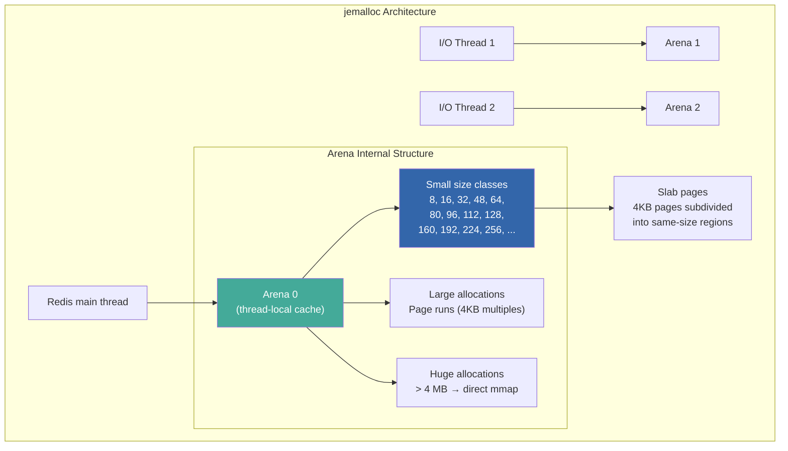
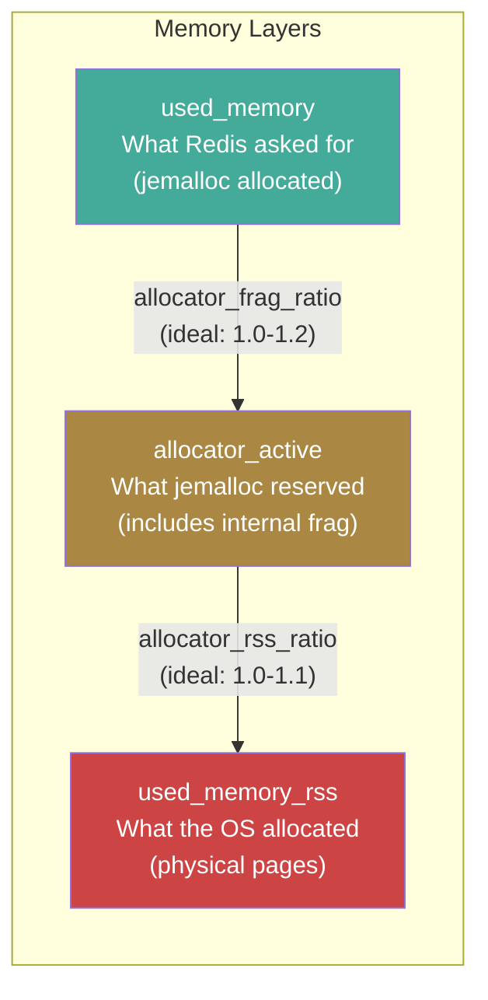
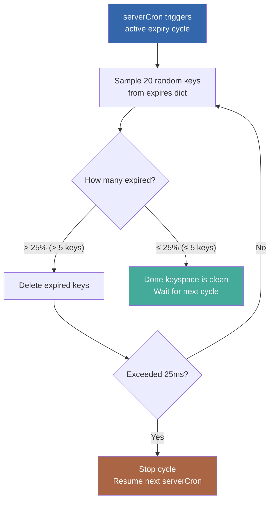
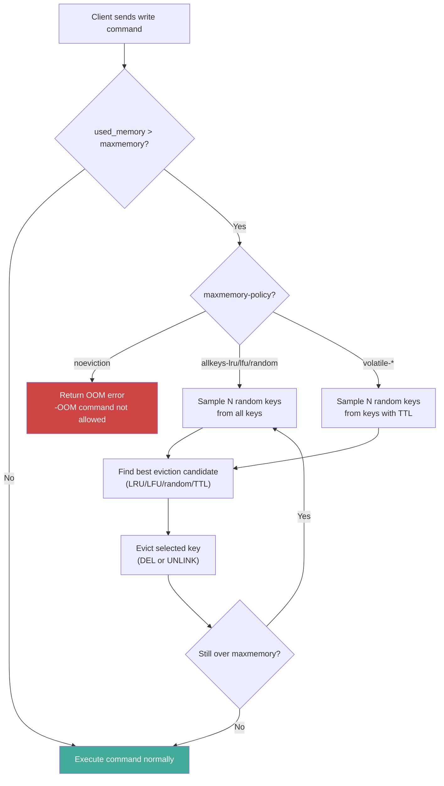
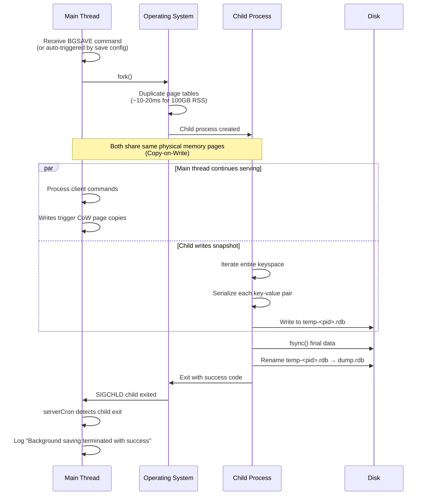
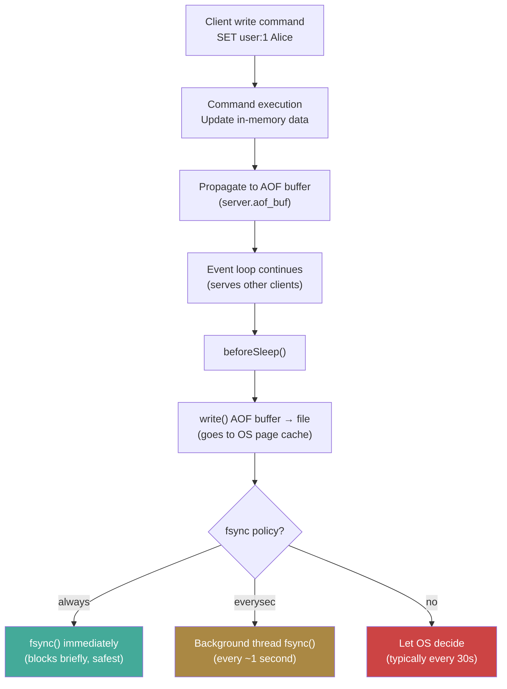
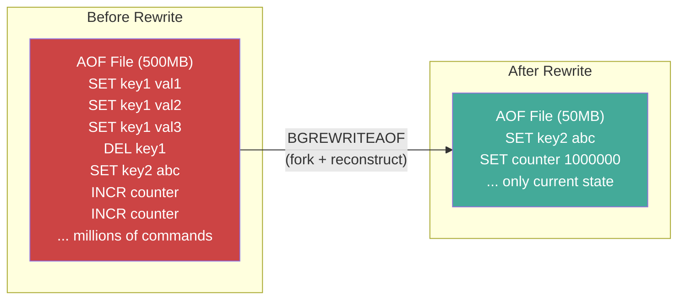
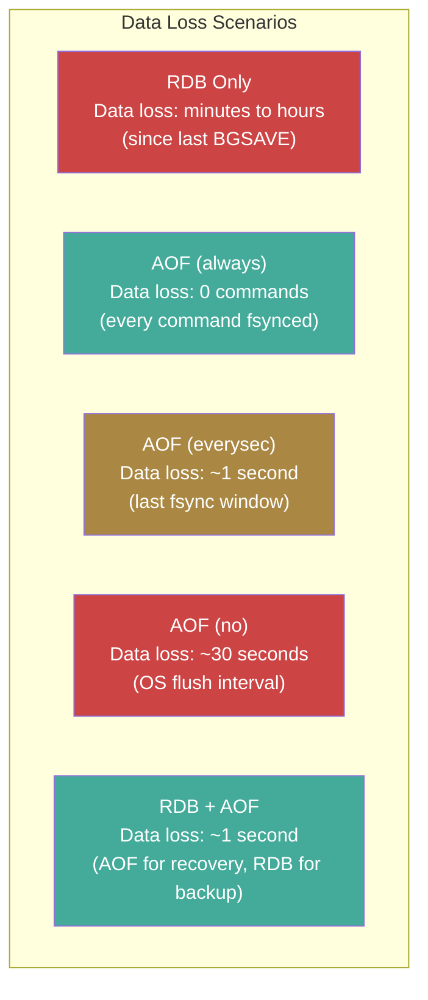

# Redis Deep Dive Series  Part 3: Memory Management, Persistence, and Storage Mechanics

---

**Series:** Redis Deep Dive  Engineering the World's Most Misunderstood Data Structure Server
**Part:** 3 of 10
**Audience:** Senior backend engineers, distributed systems engineers, infrastructure architects
**Reading time:** ~50 minutes

---

## Where We Are in the Series

Part 1 gave us the event loop, the client lifecycle, and the `redisObject` system. Part 2 went inside every data type  strings (INT/EMBSTR/RAW), lists (listpack/quicklist), hashes, sets, sorted sets (skip list + dict), and streams (radix tree). We saw how Redis's encoding duality saves 2-4x memory for small collections by using compact, cache-friendly structures.

But throughout Part 2, we kept saying things like "jemalloc allocates in 64-byte size classes" and "the encoding transition happens at 128 entries" without explaining *why* these numbers matter at the allocator level. We also deferred the question that every production engineer eventually asks: what happens when you run out of memory? And how does in-memory data survive a crash?

This part answers all of those questions. We'll cover the complete lifecycle of memory in Redis  from allocation (jemalloc) through expiration and eviction (what happens when memory runs out) to disk persistence (RDB snapshots and AOF logs)  with kernel-level mechanics, production telemetry analysis, and real failure scenarios.

---

## 1. jemalloc: The Memory Allocator Behind Redis

Redis does not call `malloc()` from glibc directly. By default, it uses **jemalloc**  a memory allocator designed by Jason Evans (originally for FreeBSD) that provides low fragmentation, scalable concurrent allocation, and detailed introspection.

### Why jemalloc Matters

The choice of allocator directly affects:
- **Memory fragmentation:** How much memory is wasted on overhead and unused space within allocated blocks
- **Allocation speed:** How fast Redis can allocate/free memory for new keys, expired keys, and internal buffers
- **Peak memory usage:** Whether memory spikes during rehashing or persistence operations
- **Observability:** Whether Redis can report accurate memory statistics

### jemalloc Architecture



Key concepts:

1. **Size classes.** jemalloc rounds up allocation requests to the nearest size class. For example, if Redis requests 40 bytes, jemalloc allocates 48 bytes (the nearest size class). The 8-byte difference is **internal fragmentation**  wasted space within the allocation.

2. **Arenas.** Each thread is bound to an arena to minimize lock contention. Redis's main thread uses one arena; I/O threads use others.

3. **Thread-local caches (tcache).** Small allocations are served from per-thread caches without any locking. This is crucial for Redis's performance  most Redis operations allocate and free small objects (SDS strings, robj wrappers, dictEntry nodes).

4. **Page runs.** Medium allocations come from page runs  contiguous groups of 4 KB pages. Large allocations (>4 MB by default) use direct `mmap()` calls.

### jemalloc Size Classes and Redis

Understanding size classes explains why EMBSTR uses 44 bytes for the string portion. The calculation:

```
robj:     16 bytes
sdshdr8:   3 bytes (len + alloc + flags)
data:     44 bytes (max EMBSTR data)
null:      1 byte (C string terminator)
Total:    64 bytes → jemalloc size class 64
```

If the total were 65 bytes, jemalloc would round up to 80 bytes  wasting 15 bytes (19% overhead). The 44-byte EMBSTR limit is specifically chosen to hit the 64-byte size class exactly.

### Inspecting jemalloc Stats

```bash
127.0.0.1:6379> MEMORY MALLOC-STATS
___ Begin jemalloc statistics ___
Version: 5.3.0-0-g...
...
Allocated: 1024768, active: 1216512, metadata: 2064384
resident: 3280896, mapped: 4194304, retained: 0
...

# Key metrics:
# Allocated: bytes actually requested by Redis
# Active: bytes in active pages (includes internal fragmentation)
# Resident: bytes in physical RAM (RSS)
# Mapped: bytes mapped from OS (may exceed resident due to lazy mapping)
```

The ratio `active / allocated` indicates internal fragmentation from size class rounding. A ratio of 1.0 is perfect (impossible in practice); 1.1-1.2 is healthy; above 1.5 indicates significant fragmentation.

Understanding jemalloc's size classes explains many of the "magic numbers" from Part 2  like why EMBSTR's 44-byte threshold aligns with a 64-byte size class. But knowing how the allocator works is only half the picture. You also need to know what Redis *reports* about its memory usage, and crucially, what it *doesn't* report.

---

## 2. Memory Accounting: What INFO Memory Actually Reports

The `INFO memory` command is your primary tool for understanding Redis memory usage. But its fields are frequently misunderstood  and misunderstanding them is one of the most common causes of production OOM kills (Part 1, Section 8 warned about `maxmemory` not meaning what you think).

```bash
127.0.0.1:6379> INFO memory
# Memory
used_memory:1024768                    # Bytes allocated by Redis (jemalloc allocated)
used_memory_human:1000.75K
used_memory_rss:3280896                # Resident Set Size from OS (actual RAM used)
used_memory_rss_human:3.13M
used_memory_peak:2048576               # Peak used_memory since start
used_memory_peak_human:2.00M
used_memory_peak_perc:50.02%           # Current as % of peak
used_memory_overhead:524288            # Memory used for non-data overhead
used_memory_startup:524288             # Memory used at startup (baseline)
used_memory_dataset:500480             # used_memory - used_memory_overhead
used_memory_dataset_perc:48.85%
allocator_allocated:1024768            # jemalloc allocated
allocator_active:1216512               # jemalloc active pages
allocator_resident:3280896             # jemalloc resident
total_system_memory:16777216000        # Total system RAM
total_system_memory_human:15.63G
used_memory_lua:37888                  # Lua engine memory
used_memory_scripts:0                  # Cached Lua scripts memory
number_of_cached_scripts:0
maxmemory:0                            # 0 = no limit
maxmemory_human:0B
maxmemory_policy:noeviction
allocator_frag_ratio:1.19              # active/allocated (jemalloc internal fragmentation)
allocator_frag_bytes:191744
allocator_rss_ratio:2.70               # resident/active (OS-level fragmentation)
allocator_rss_bytes:2064384
rss_overhead_ratio:1.00                # rss from OS / jemalloc resident
rss_overhead_bytes:0
mem_fragmentation_ratio:3.20           # used_memory_rss / used_memory
mem_fragmentation_bytes:2256128
mem_allocator:jemalloc-5.3.0
active_defrag_running:0
lazyfree_pending_objects:0
lazyfreed_objects:0
```

### The Critical Metrics



**`mem_fragmentation_ratio` = `used_memory_rss` / `used_memory`**

This is the most watched metric:

| Ratio | Meaning | Action |
|---|---|---|
| < 1.0 | Redis is using swap (RSS < allocated). **Critical!** | Add RAM immediately; swap destroys performance |
| 1.0 - 1.5 | Healthy fragmentation | Normal operation |
| 1.5 - 2.0 | Elevated fragmentation | Consider `activedefrag`; investigate allocation patterns |
| > 2.0 | Severe fragmentation | Enable active defrag; consider restart; investigate root cause |

### What used_memory Does NOT Include

This is a source of frequent production incidents:

1. **Client output buffers.** Each connected client has an output buffer. Under backpressure (slow consumers, large MONITOR sessions), these can grow to hundreds of MB. They're tracked separately as `client_recent_max_output_buffer`.

2. **Replication backlog.** Configured via `repl-backlog-size` (default 1 MB). This is a circular buffer for partial resynchronization.

3. **AOF buffer.** Writes pending flush to the AOF file. Under heavy write load, this can be several MB.

4. **OS page cache for persistence files.** RDB and AOF files are cached by the OS in RAM. This doesn't show up in Redis metrics but consumes physical memory.

5. **Copy-on-write pages during BGSAVE.** When a background save is running, written pages are duplicated. This memory is charged to the child process, not the parent  so `used_memory_rss` may not reflect the true memory pressure.

**The safe formula for `maxmemory`:**

```
maxmemory = Total RAM
          - OS and other processes (~1-2 GB)
          - Replication backlog (repl-backlog-size)
          - Client output buffers (estimate based on client count × average buffer size)
          - CoW headroom (20-50% of used_memory during BGSAVE)
          - Safety margin (~10%)

# Example: 64 GB server
maxmemory ≈ 64 GB - 2 GB - 1 MB - 500 MB - 10 GB - 5 GB ≈ 46 GB
# Conservative: set maxmemory to ~45 GB (70% of total RAM)
```

Now that we understand how memory is allocated and accounted for, the next question is: how does memory get *freed*? Redis has two mechanisms for reclaiming memory  expiration (keys with a TTL that have outlived their usefulness) and eviction (forced removal when memory runs out). Let's start with expiration.

---

## 3. Key Expiration: Two Strategies Working Together

Redis supports key expiration via TTL (Time-To-Live). Understanding the expiration mechanism is critical because it affects latency, memory reclamation speed, and correctness. Part 1 mentioned `serverCron`'s role in active expiry sampling  here we'll see exactly how that algorithm works.

### Strategy 1: Lazy Expiration (Passive)

When a client accesses a key, Redis checks if it has expired before returning the value. If expired, the key is deleted and the client receives a "nil" response.

```c
// Simplified: called before every key access
int expireIfNeeded(redisDb *db, robj *key) {
    if (!keyHasExpiry(db, key)) return 0;
    if (getExpireTime(db, key) > mstime()) return 0;
    // Key has expired
    deleteKey(db, key);
    propagateExpire(db, key);  // Tell replicas and AOF
    return 1;
}
```

**The problem with lazy-only expiration:** if a key expires but is never accessed again, it stays in memory forever. If you set 10 million keys with a 1-hour TTL, and most of them are never accessed after expiry, you have 10 million expired-but-alive keys consuming RAM.

### Strategy 2: Active Expiration (Periodic)

`serverCron` runs an active expiration cycle at `server.hz` frequency (default 10 Hz). The algorithm:

```
Every 100ms (at hz=10):
1. Sample 20 random keys from the "expires" dict
2. Delete all expired keys in the sample
3. If >25% of the sample was expired:
   - Repeat from step 1 (more keys likely expired)
   - But don't exceed 25ms of wall-clock time (ACTIVE_EXPIRE_CYCLE_SLOW_TIME_PERC)
4. If ≤25% expired, stop  the key space is reasonably clean
```



### Expiration Precision and Edge Cases

1. **Expiration is not precise.** A key with TTL of exactly 60 seconds might live for 60.0 to 60.1 seconds, depending on when the active expiry cycle runs. For most applications, this imprecision is irrelevant.

2. **Mass expiration can cause latency spikes.** If you set millions of keys with the same TTL at the same time (e.g., cache warming after a deploy), they all expire simultaneously. The active expiry cycle goes into overdrive, potentially consuming 25ms per serverCron invocation  visible as latency jitter.

   **Mitigation:** Add random jitter to TTLs:
   ```python
   import random

   base_ttl = 3600  # 1 hour
   jitter = random.randint(0, 300)  # ±5 minutes
   r.setex(key, base_ttl + jitter, value)
   ```

3. **Replicas don't expire keys independently.** On a replica, expired keys are only deleted when the master sends an explicit `DEL` command via the replication stream. This means replicas may temporarily serve expired keys if the master's active expiry hasn't processed them yet. This is by design  it prevents replication divergence  but can surprise applications that expect identical behavior from master and replica.

4. **AOF and expiration.** When a key expires, Redis writes a `DEL` command to the AOF. On replay (restart), the keys that expired before the crash are correctly deleted. But keys that would have expired *during* the crash window (between last AOF flush and crash) may reappear  they're re-created by the AOF but have past-timestamp expiries, so they're lazily deleted on first access.

### Monitoring Expiration

```bash
# Check how many keys have TTLs
127.0.0.1:6379> INFO keyspace
# Keyspace
db0:keys=1000000,expires=800000,avg_ttl=3600000

# If avg_ttl is very low and expires count is high,
# active expiry is under pressure.

# Check expired keys rate
127.0.0.1:6379> INFO stats
...
expired_keys:12345678           # Total expired since start
expired_stale_perc:0.50         # % of keys expired in last active cycle
expired_time_cap_reached_count:0 # Times the 25ms time cap was hit
...
```

If `expired_time_cap_reached_count` is increasing, active expiry is hitting its time limit  meaning there are more expired keys than the cycle can clean in 25ms. Solutions:
- Increase `hz` (e.g., to 100) to run expiry more frequently
- Add TTL jitter to avoid mass expiration
- Reduce the number of keys with very short TTLs

Expiration handles keys that were *designed* to be temporary. But what happens when memory fills up with keys that haven't expired  or keys that have no TTL at all? That's the domain of eviction: the last line of defense before Redis starts rejecting writes.

---

## 4. Memory Eviction: What Happens When Memory Runs Out

When Redis's `used_memory` exceeds `maxmemory`, it must either reject new writes or evict existing keys. The behavior is controlled by `maxmemory-policy`. Getting this wrong is one of the most common production issues with Redis (Part 8's war stories include an OOM kill scenario caused by a misconfigured eviction policy).

### Eviction Policies

| Policy | Behavior | Use When |
|---|---|---|
| `noeviction` | Reject all write commands with OOM error | Data loss is never acceptable; you manage capacity externally |
| `allkeys-lru` | Evict least recently used key from all keys | General-purpose caching |
| `volatile-lru` | Evict LRU key only from keys with TTL set | Mix of cache (with TTL) and persistent data (no TTL) |
| `allkeys-lfu` | Evict least frequently used key from all keys | Better cache hit rate for non-uniform access patterns |
| `volatile-lfu` | Evict LFU key only from keys with TTL set | |
| `allkeys-random` | Evict random key from all keys | Uniform access patterns |
| `volatile-random` | Evict random key only from keys with TTL | |
| `volatile-ttl` | Evict key with shortest remaining TTL | Priority-based expiration |

### LRU: Approximated, Not Exact

Redis does not maintain a true LRU (Least Recently Used) linked list  that would require O(1) bookkeeping per access but significant pointer overhead per key (16 bytes for prev/next pointers × millions of keys = significant memory).

Instead, Redis uses **approximated LRU**: when eviction is needed, it samples `maxmemory-samples` (default 5) random keys from the keyspace and evicts the one that was accessed least recently among the samples.

```
True LRU:
Access: A, B, C, D, A, E, B
State:  [B, E, A, D, C] ← exact ordering, high overhead

Approximated LRU (sample 5):
- Need to evict → sample 5 random keys
- Got: {A (used 10s ago), D (used 50s ago), X (used 30s ago), B (used 5s ago), Q (used 45s ago)}
- Evict D (used 50s ago)  oldest in sample
```

The accuracy improves with larger sample sizes:

```bash
# Default: 5 samples (fast but less accurate)
maxmemory-samples 5

# Better accuracy: 10 samples
maxmemory-samples 10

# Near-perfect LRU behavior: 16+ samples (but slower eviction)
maxmemory-samples 16
```

Redis 3.0+ introduced an **eviction pool** that improves accuracy further: instead of comparing only the current sample, it maintains a pool of 16 eviction candidates across multiple sampling rounds. The worst candidate in the pool is evicted. This gives near-true-LRU behavior with `maxmemory-samples 10`.

### LFU: Frequency-Based Eviction (Redis 4.0+)

LFU (Least Frequently Used) evicts keys that are accessed infrequently, regardless of when the last access occurred. This is better than LRU for workloads where a "hot" key might not be accessed for a few seconds but should not be evicted because it will be accessed many times in the near future.

Redis LFU uses a **logarithmic counter** with **time decay**:

```c
// The lru field (24 bits) is repurposed for LFU:
// [16 bits: decrement time] [8 bits: logarithmic counter]

// Counter increment probability:
// p = 1 / (counter * lfu_log_factor + 1)
// Default lfu_log_factor = 10

// With factor=10:
// Counter 0→1: 100% probability
// Counter 1→2: ~9% probability
// Counter 10→11: ~1% probability
// Counter 100→101: ~0.1% probability
// Counter 255 (max): essentially never increments
```

The logarithmic counter means a key accessed 1 million times has a counter of ~255, while a key accessed 100 times has a counter of ~20. The **time decay** gradually reduces the counter over time  a key that was hot an hour ago but hasn't been accessed since will have its counter decayed, making it eligible for eviction.

```bash
# LFU configuration
lfu-log-factor 10           # Higher = slower counter growth
lfu-decay-time 1            # Minutes between counter decay steps

# Check a key's LFU frequency
127.0.0.1:6379> OBJECT FREQ mykey
(integer) 42    # Logarithmic frequency counter value
```

### Eviction Process Flow



### Production Considerations

1. **`volatile-*` policies can fail silently.** If you use `volatile-lru` but no keys have TTLs set, Redis has nothing to evict  it behaves like `noeviction` and rejects writes. This is a common misconfiguration.

2. **Eviction is synchronous (by default).** When Redis evicts a key, it frees the memory in the main thread. For a hash with 1 million fields, this can take milliseconds  blocking all other clients. Redis 4.0+ offers **lazy eviction** (`lazyfree-lazy-eviction yes`) which delegates the actual memory free to a background thread.

3. **Eviction creates write amplification.** Every evicted key generates a `DEL` command propagated to replicas and AOF. Under heavy eviction pressure, the replication stream becomes dominated by `DEL` commands.

4. **Monitor eviction rate:**
   ```bash
   127.0.0.1:6379> INFO stats
   evicted_keys:0    # If this is growing, you're under memory pressure
   ```

---

## 5. Memory Fragmentation and Active Defragmentation

### What Causes Fragmentation?

Memory fragmentation occurs when the allocator has free space that can't be used for new allocations because it's scattered in small, non-contiguous chunks.

```
Ideal memory layout:
[████████████████████████████████] ← all allocated, contiguous

Fragmented memory layout:
[███░░███░███░░░░███░░███░░░███░] ← allocated blocks with gaps
 ↑ used  ↑ free (fragmented  can't be combined)
```

Redis fragmentation is caused by:

1. **Mixed allocation sizes.** When small and large keys are created and deleted intermittently, the freed space from small keys can't be reused for large allocations.

2. **Key deletion patterns.** Deleting keys doesn't return memory to the OS  jemalloc keeps it in its pools. The memory is reusable for new allocations of similar sizes, but appears as "wasted" in RSS.

3. **Encoding transitions.** When a hash transitions from listpack to hashtable, the listpack memory is freed and new hashtable memory is allocated  at a different size class. The freed listpack slots may not be reusable.

4. **SDS growth.** When strings grow (via `APPEND` or `SETRANGE`), the old SDS is freed and a new, larger one is allocated elsewhere. The old location becomes a fragment.

### Monitoring Fragmentation

```bash
# Primary fragmentation ratio
127.0.0.1:6379> INFO memory
mem_fragmentation_ratio:1.35
# 1.35 means RSS is 35% larger than used_memory
# i.e., 35% of RSS is fragmentation overhead

# jemalloc-specific fragmentation
allocator_frag_ratio:1.10     # Internal (size class rounding)
allocator_rss_ratio:1.22      # External (OS pages with partial usage)
```

### Active Defragmentation (Redis 4.0+)

Redis can **actively defragment** memory without stopping the event loop. The defragmenter runs as part of `serverCron` and works by:

1. Scanning the keyspace incrementally (using the SCAN-like mechanism)
2. For each key, checking if its allocations are fragmented (jemalloc provides per-pointer fragmentation info via `je_malloc_usable_size()`)
3. If a pointer is in a fragmented page, allocating new memory, copying the data, and freeing the old location
4. The new allocation is likely to be placed in a less fragmented region

```bash
# Enable active defragmentation
CONFIG SET activedefrag yes

# When to start defragging
CONFIG SET active-defrag-ignore-bytes 100mb       # Don't bother unless > 100MB fragmentation
CONFIG SET active-defrag-threshold-lower 10       # Start when fragmentation > 10%
CONFIG SET active-defrag-threshold-upper 100       # Use max CPU when fragmentation > 100%

# CPU budget for defrag
CONFIG SET active-defrag-cycle-min 1              # Min CPU% for defrag (when at lower threshold)
CONFIG SET active-defrag-cycle-max 25             # Max CPU% for defrag (when at upper threshold)

# Monitoring defrag progress
127.0.0.1:6379> INFO memory
active_defrag_running:1                 # Currently defragmenting?
active_defrag_hits:123456               # Pointers successfully relocated
active_defrag_misses:654321             # Pointers checked but not fragmented
active_defrag_key_hits:12345            # Keys with at least one relocated pointer
active_defrag_key_misses:98765          # Keys checked but not needing relocation
```

**Important limitation:** Active defragmentation only works with jemalloc. If Redis was compiled with libc malloc or tcmalloc, this feature is unavailable.

We've now covered how Redis manages memory during normal operation: allocating it (jemalloc), accounting for it (INFO memory), reclaiming it (expiry and eviction), and compacting it (defragmentation). But all of this is in RAM  which is volatile. If Redis crashes, everything is gone.

The next three sections cover Redis's two persistence mechanisms  RDB and AOF  which solve this problem using the forking and copy-on-write concepts we introduced back in Part 0, Section 5.

---

## 6. RDB Persistence: Point-in-Time Snapshots

RDB (Redis Database) persistence creates a binary snapshot of the entire dataset at a point in time. Part 0 introduced the basic concept; here we go deep into the mechanics.

### The BGSAVE Process



### Fork Mechanics and Copy-on-Write

When Redis calls `fork()`, the operating system:

1. **Duplicates the page table**  a mapping from virtual addresses to physical memory pages. For a Redis process with 100 GB RSS, the page table itself might be 200 MB (one 8-byte entry per 4 KB page = 8 × 100GB/4KB = 200 MB). This duplication takes 10-20ms on modern hardware and **blocks the main thread**.

2. **Marks all pages as copy-on-write (CoW).** Both parent and child share the same physical pages. When either process writes to a page, the kernel:
   - Traps the write (page fault)
   - Copies the 4 KB page to a new physical location
   - Updates the writing process's page table to point to the copy
   - Allows the write to proceed

This means:
- **Read-only workload during BGSAVE:** Near-zero memory overhead. Parent and child share everything.
- **Heavy write workload during BGSAVE:** Each written page is duplicated. In the worst case (all pages written), memory usage doubles.

### Measuring CoW Amplification

```bash
# Check CoW bytes during BGSAVE (Redis 5.0+)
127.0.0.1:6379> INFO persistence
rdb_last_cow_size:52428800    # 50 MB of pages copied during last BGSAVE

# From the Redis log:
# Background saving started by pid 12345
# DB saved on disk
# RDB: 50 MB of memory used by copy-on-write

# OS-level monitoring (Linux)
# While BGSAVE is running, check the child process:
cat /proc/<child_pid>/smaps_rollup | grep Private
# Private_Clean:     0 kB
# Private_Dirty:  51200 kB    ← CoW pages (50 MB)
```

### Reducing CoW Impact

1. **Schedule BGSAVE during low-write periods.** If your write rate drops at 3 AM, schedule persistence then.

2. **Use `save ""` to disable automatic saves; trigger `BGSAVE` manually or via cron.**

3. **Consider `jemalloc` huge page settings.** Linux Transparent Huge Pages (THP) amplify CoW: instead of copying 4 KB pages, the kernel copies 2 MB pages. A single byte write to a 2 MB huge page duplicates the entire 2 MB.

   ```bash
   # Disable THP for Redis (CRITICAL for production)
   echo never > /sys/kernel/mm/transparent_hugepages/enabled
   echo never > /sys/kernel/mm/transparent_hugepages/defrag
   ```

   Redis will warn you at startup if THP is enabled:
   ```
   WARNING you have Transparent Huge Pages (THP) support enabled in your kernel.
   This will create latency and memory usage issues with Redis.
   ```

4. **Set `rdb-del-sync-files yes`** (Redis 6.2+) to delete temporary RDB files synchronously instead of relying on background cleanup.

### RDB File Format

The RDB file is a compact binary format:

```
┌───────────┬─────────┬──────────────────────┬─────┬──────────────────────┬─────┐
│ REDIS0011 │ AUX     │ SELECTDB 0           │ ... │ Key-Value Pairs      │ EOF │
│ (magic)   │ fields  │ DB resize info       │     │ (type-encoded data)  │ CRC │
│ 9 bytes   │         │ (hash table sizes)   │     │                      │ 8B  │
└───────────┴─────────┴──────────────────────┴─────┴──────────────────────┘
```

Each key-value pair is stored as:
```
[EXPIRETIME_MS (optional)] [TYPE_BYTE] [KEY (string-encoded)] [VALUE (type-specific)]
```

The TYPE_BYTE encodes both the Redis type and the internal encoding (e.g., `RDB_TYPE_HASH_LISTPACK = 16`, `RDB_TYPE_ZSET_SKIPLIST = 5`).

### RDB Configuration

```bash
# Automatic save triggers (any condition triggers BGSAVE)
save 3600 1        # Save if at least 1 key changed in 3600 seconds
save 300 100       # Save if at least 100 keys changed in 300 seconds
save 60 10000      # Save if at least 10000 keys changed in 60 seconds
save ""            # Disable automatic saves entirely

# RDB compression
rdbcompression yes          # LZF compress string values > 20 bytes
rdbchecksum yes             # CRC64 checksum at end of file

# Stop accepting writes if BGSAVE fails
stop-writes-on-bgsave-error yes   # Safety: prevent data divergence if disk is full

# File path
dbfilename dump.rdb
dir /var/lib/redis/
```

RDB gives you compact snapshots but with a data loss window between snapshots. If you need finer-grained durability  losing at most 1 second of data instead of minutes  you need AOF.

---

## 7. AOF Persistence: Write-Ahead Logging

AOF (Append-Only File) takes a fundamentally different approach from RDB. Instead of capturing the *state* at a point in time, it captures the *operations*  every write command received by the server. On restart, Redis replays the AOF to reconstruct the dataset. Part 0, Section 10 introduced the basic concept; here we cover the full mechanics including the AOF rewrite process and the hybrid RDB+AOF model.

### AOF Write Path



### fsync Strategies Compared

| Strategy | Data Loss Window | Performance Impact | Use When |
|---|---|---|---|
| `always` | Zero (every command synced) | Significant: fsync on every write | Maximum durability required; low write rate |
| `everysec` | ~1 second | Minimal: background thread fsync | **Default.** Good balance for most workloads |
| `no` | Up to 30 seconds (OS dependent) | None from Redis | Pure cache; durability not needed |

**`appendfsync everysec` internals:** The main thread writes to the AOF file (which goes to OS page cache). Every ~1 second, the BIO (background I/O) thread calls `fsync()`. If the previous `fsync` is still in progress when a new one is due, Redis may block the main thread briefly to prevent unbounded page cache buildup. This is called **AOF delayed fsync** and is logged when it happens.

```bash
# In Redis logs:
# Asynchronous AOF fsync is taking too long (disk is busy?).
# Writing the AOF buffer without waiting for fsync to complete,
# this may slow down Redis.
```

### AOF Rewrite: Compacting the Log

The AOF file grows indefinitely as commands accumulate. An `INCR counter` executed 1 million times produces 1 million lines in the AOF  but the final state is just `SET counter 1000000`. AOF rewriting compacts the log:



The rewrite process:
1. Redis forks (same CoW mechanics as BGSAVE)
2. The child writes a new AOF from the in-memory dataset (not by reading the old AOF)
3. While the child writes, the parent continues serving clients and logs new commands to both the old AOF and an **AOF rewrite buffer**
4. When the child finishes, the parent appends the rewrite buffer to the new AOF
5. Atomically replaces the old AOF with the new one

```bash
# Automatic rewrite triggers
auto-aof-rewrite-percentage 100   # Rewrite when AOF is 100% larger than after last rewrite
auto-aof-rewrite-min-size 64mb    # Don't rewrite if AOF is smaller than 64MB

# Manual trigger
127.0.0.1:6379> BGREWRITEAOF

# Check status
127.0.0.1:6379> INFO persistence
aof_enabled:1
aof_rewrite_in_progress:0
aof_last_rewrite_time_sec:5
aof_current_rewrite_time_sec:-1
aof_last_bgrewrite_status:ok
aof_current_size:104857600         # Current AOF size: 100 MB
aof_base_size:52428800             # AOF size after last rewrite: 50 MB
```

### Multi-Part AOF (Redis 7.0+)

Redis 7.0 redesigned AOF persistence with **multi-part AOF**:

```
appendonlydir/
├── appendonly.aof.1.base.rdb      ← Base: RDB snapshot at rewrite time
├── appendonly.aof.1.incr.aof      ← Incremental: commands since last base
├── appendonly.aof.2.incr.aof      ← Another increment
└── appendonly.aof.manifest        ← Metadata: which files to load in order
```

Benefits:
- **Atomic rewrite completion.** The new base file is written completely before the manifest is updated  no risk of partial rewrites.
- **RDB preamble by default.** The base file uses RDB format for faster loading.
- **Incremental files are smaller.** Only new commands since the last rewrite.

---

## 8. RDB vs AOF: The Complete Tradeoff Analysis

### Durability Comparison



### Full Comparison Table

| Dimension | RDB | AOF (everysec) | Both (Recommended) |
|---|---|---|---|
| **Data loss** | Minutes-hours | ~1 second | ~1 second |
| **Restart speed** | Fast (binary load) | Slow (replay commands) | Moderate (RDB base + AOF tail) |
| **File size** | Compact (compressed) | Large (command log) | Both present |
| **CPU during save** | Fork + serialize | Minimal (write + bg fsync) | Fork + write |
| **Memory during save** | CoW overhead | Minimal | CoW overhead |
| **Suitable for backup** | Yes (point-in-time) | No (hard to restore specific point) | Use RDB for backups |
| **Data integrity** | CRC64 checksum | Partial write detection | Best of both |
| **I/O pattern** | Burst (during save) | Continuous (every write) | Both |

### Recommended Production Configuration

```bash
# Enable both RDB and AOF
appendonly yes
appendfsync everysec

# Use RDB preamble in AOF (faster recovery)
aof-use-rdb-preamble yes

# RDB snapshots for backup (separate from AOF)
save 3600 1
save 300 100

# Disable auto-triggered BGSAVE if AOF is primary
# (AOF rewrite already uses RDB preamble)
# save ""    # Only if using AOF exclusively

# AOF rewrite thresholds
auto-aof-rewrite-percentage 100
auto-aof-rewrite-min-size 64mb
```

Both RDB and AOF use forking for their background operations  BGSAVE for RDB, and AOF rewrite for compacting the AOF. Part 0 introduced copy-on-write conceptually. Now let's go to the kernel level and understand exactly what happens to memory pages during these operations  because this is where the most common Redis production memory problems originate.

---

## 9. Copy-on-Write Deep Dive: The Kernel's Role

Understanding CoW at the kernel level is essential for managing Redis memory during persistence. This section makes concrete the concepts we introduced abstractly in Part 0, Section 5.

### Virtual Memory and Page Tables

Each process has a virtual address space mapped to physical memory through a **page table**:

```
Virtual Address Space (Parent)     Physical Memory         Virtual Address Space (Child)
┌──────────────────┐              ┌──────────────┐        ┌──────────────────┐
│ Page 0 (code)    │──────────────│ Phys Page 100│←───────│ Page 0 (code)    │
│ Page 1 (data)    │──────────────│ Phys Page 200│←───────│ Page 1 (data)    │
│ Page 2 (data)    │──────────────│ Phys Page 300│←───────│ Page 2 (data)    │
│ Page 3 (data)    │──────────────│ Phys Page 400│←───────│ Page 3 (data)    │
│ Page 4 (stack)   │──────────────│ Phys Page 500│←───────│ Page 4 (stack)   │
└──────────────────┘              └──────────────┘        └──────────────────┘
                                  All pages marked read-only (CoW)
```

When the parent writes to Page 2:

```
Virtual Address Space (Parent)     Physical Memory         Virtual Address Space (Child)
┌──────────────────┐              ┌──────────────┐        ┌──────────────────┐
│ Page 0 (code)    │──────────────│ Phys Page 100│←───────│ Page 0 (code)    │
│ Page 1 (data)    │──────────────│ Phys Page 200│←───────│ Page 1 (data)    │
│ Page 2 (data)    │───┐          │ Phys Page 300│←───────│ Page 2 (data)    │
│ Page 3 (data)    │──────────────│ Phys Page 400│←───────│ Page 3 (data)    │
│ Page 4 (stack)   │──────────────│ Phys Page 500│←───────│ Page 4 (stack)   │
└──────────────────┘   │          └──────────────┘        └──────────────────┘
                       │          ┌──────────────┐
                       └──────────│ Phys Page 600│  ← New copy of Page 2
                                  │ (parent's    │
                                  │  modified    │
                                  │  version)    │
                                  └──────────────┘
```

### Why THP (Transparent Huge Pages) Is Catastrophic

With standard 4 KB pages, a single-byte write during BGSAVE copies 4 KB. With THP enabled, pages are 2 MB. A single-byte write copies **2 MB**. If Redis touches one byte in each of 1000 huge pages, CoW copies 2 GB instead of 4 MB.

```
Standard 4KB pages:
- 100 GB Redis, 10% pages written during BGSAVE
- CoW overhead: 10 GB (10% of 100 GB at 4 KB granularity)

With 2 MB THP:
- Same 100 GB Redis, same 10% write rate
- But each write touches a different 2 MB page
- CoW overhead: up to 100 GB (every huge page eventually touched)
```

### Practical CoW Monitoring Script

```python
import redis
import time

r = redis.Redis()

def monitor_bgsave_cow():
    """Monitor CoW overhead during BGSAVE."""
    # Trigger BGSAVE
    r.bgsave()

    while True:
        info = r.info("persistence")
        if info.get("rdb_bgsave_in_progress"):
            cow_size = info.get("rdb_last_cow_size", 0)
            used_memory = r.info("memory")["used_memory"]
            cow_ratio = cow_size / used_memory if used_memory > 0 else 0

            print(f"BGSAVE in progress | "
                  f"CoW: {cow_size / 1024 / 1024:.1f} MB | "
                  f"Ratio: {cow_ratio:.2%} | "
                  f"Used Memory: {used_memory / 1024 / 1024:.1f} MB")
            time.sleep(1)
        else:
            print(f"BGSAVE complete | "
                  f"Last CoW: {info.get('rdb_last_cow_size', 0) / 1024 / 1024:.1f} MB")
            break
```

---

## 10. MEMORY Command: Production Diagnostics

Redis 4.0 introduced the `MEMORY` command family for production memory analysis.

### MEMORY USAGE

```bash
# Per-key memory usage (includes overhead)
127.0.0.1:6379> MEMORY USAGE mykey
(integer) 72    # Total bytes including robj, SDS, dictEntry, etc.

# With SAMPLES for aggregate types
127.0.0.1:6379> MEMORY USAGE myhash SAMPLES 0    # Exact count (scan all elements)
(integer) 45231

127.0.0.1:6379> MEMORY USAGE myhash SAMPLES 5    # Approximate (sample 5 elements)
(integer) 44800
```

### MEMORY DOCTOR

```bash
127.0.0.1:6379> MEMORY DOCTOR
"Sam, I have a few things to report..."
# Common diagnoses:
# - Peak memory significantly higher than current (fragmentation risk)
# - High fragmentation ratio (consider defrag or restart)
# - RSS much higher than used_memory (allocator fragmentation)
```

### MEMORY STATS

```bash
127.0.0.1:6379> MEMORY STATS
 1) "peak.allocated"
 2) (integer) 1048576
 3) "total.allocated"
 4) (integer) 524288
 5) "startup.allocated"
 6) (integer) 262144
 7) "replication.backlog"
 8) (integer) 1048576
 9) "clients.slaves"
10) (integer) 0
11) "clients.normal"
12) (integer) 49694
13) "aof.buffer"
14) (integer) 0
15) "db.0"
16) 1) "overhead.hashtable.main"
    2) (integer) 1024
    3) "overhead.hashtable.expires"
    4) (integer) 512
...
```

### MEMORY PURGE

```bash
# Force jemalloc to release unused memory back to OS
127.0.0.1:6379> MEMORY PURGE
OK
# Uses jemalloc's arena purging  releases pages that are fully empty
# Does NOT free fragmented pages (use activedefrag for that)
```

---

## 11. Production Memory Management Patterns

### Pattern 1: Memory Budget Planning

```python
def estimate_redis_memory(num_keys, avg_key_size, avg_value_size, data_type="string"):
    """Estimate Redis memory usage for capacity planning."""

    # Per-key overhead (dictEntry + key robj + key SDS)
    key_overhead = 56  # bytes (approximate)

    if data_type == "string":
        if avg_value_size <= 44:
            value_overhead = 16  # EMBSTR (robj includes SDS)
        else:
            value_overhead = 16 + avg_value_size + 9  # RAW (robj + SDS header + data)
    elif data_type == "hash":
        # Assume listpack encoding with avg fields
        value_overhead = avg_value_size  # Rough: listpack is compact

    raw_data = num_keys * (key_overhead + avg_key_size + value_overhead + avg_value_size)

    # Account for hash table overhead (load factor ~1.0)
    hash_table_overhead = num_keys * 8  # One pointer per bucket

    # Fragmentation (typical 1.2x)
    fragmentation_factor = 1.2

    # CoW headroom (for BGSAVE)
    cow_headroom = 1.3  # 30% extra for write-during-save scenarios

    total = (raw_data + hash_table_overhead) * fragmentation_factor * cow_headroom

    return {
        "raw_data_bytes": raw_data,
        "with_fragmentation": int(raw_data * fragmentation_factor),
        "with_cow_headroom": int(total),
        "recommended_maxmemory": int(total * 0.85),  # 85% of total
        "recommended_server_ram": int(total * 1.25)   # 25% OS headroom
    }

# Example: 50 million user sessions
result = estimate_redis_memory(
    num_keys=50_000_000,
    avg_key_size=20,  # "session:abc123xyz"
    avg_value_size=200  # Session JSON
)
print(f"Recommended server RAM: {result['recommended_server_ram'] / 1e9:.1f} GB")
```

### Pattern 2: Memory Pressure Alerting

```python
import redis

def check_memory_health(r):
    """Production memory health check."""
    info = r.info("memory")
    stats = r.info("stats")

    alerts = []

    # Check fragmentation
    frag = info["mem_fragmentation_ratio"]
    if frag < 1.0:
        alerts.append(f"CRITICAL: Redis is using swap! frag_ratio={frag}")
    elif frag > 2.0:
        alerts.append(f"WARNING: High fragmentation ratio: {frag}")

    # Check memory usage vs maxmemory
    if info["maxmemory"] > 0:
        usage_pct = info["used_memory"] / info["maxmemory"] * 100
        if usage_pct > 90:
            alerts.append(f"WARNING: Memory usage at {usage_pct:.1f}% of maxmemory")
        if usage_pct > 95:
            alerts.append(f"CRITICAL: Memory usage at {usage_pct:.1f}%  eviction imminent")

    # Check eviction rate
    if stats.get("evicted_keys", 0) > 0:
        alerts.append(f"INFO: {stats['evicted_keys']} keys evicted total")

    # Check peak memory
    peak_ratio = info["used_memory_peak"] / info["used_memory"] if info["used_memory"] > 0 else 1
    if peak_ratio > 2.0:
        alerts.append(f"INFO: Peak memory is {peak_ratio:.1f}x current  consider MEMORY PURGE")

    return alerts
```

### Pattern 3: Key Size Auditing

```bash
# Find the largest keys (Redis 4.0+)
redis-cli --bigkeys
# Scanning the entire keyspace to find biggest keys...
# -------- summary -------
# Biggest string found 'cache:page:home' has 524288 bytes
# Biggest hash found 'user:preferences:global' has 15000 fields
# Biggest list found 'queue:emails' has 2500000 entries

# More detailed analysis with SCAN + MEMORY USAGE
redis-cli --memkeys
# Reports per-key memory usage for the top consumers
```

```python
def audit_memory_by_prefix(r, prefixes, sample_size=1000):
    """Audit memory usage by key prefix."""
    results = {}
    for prefix in prefixes:
        cursor = 0
        count = 0
        total_memory = 0
        while count < sample_size:
            cursor, keys = r.scan(cursor, match=f"{prefix}*", count=100)
            for key in keys:
                mem = r.memory_usage(key)
                if mem:
                    total_memory += mem
                    count += 1
            if cursor == 0:
                break

        if count > 0:
            avg_memory = total_memory / count
            # Estimate total for this prefix
            prefix_count = 0
            cursor = 0
            while True:
                cursor, keys = r.scan(cursor, match=f"{prefix}*", count=10000)
                prefix_count += len(keys)
                if cursor == 0:
                    break

            results[prefix] = {
                "sample_count": count,
                "avg_bytes_per_key": avg_memory,
                "estimated_total_keys": prefix_count,
                "estimated_total_mb": prefix_count * avg_memory / 1024 / 1024
            }

    return results
```

---

## 12. Real-World Failure Scenarios

### Scenario 1: OOM Kill During BGSAVE

**What happened:** A Redis instance with 50 GB of data and `maxmemory 55gb` on a 64 GB server. During BGSAVE, a write-heavy workload triggered extensive CoW, pushing total memory (parent + child CoW pages) above 64 GB. The Linux OOM killer terminated Redis.

**Why:** The operator calculated maxmemory based on total RAM without accounting for CoW during persistence.

**Fix:**
```bash
# Before (wrong)
maxmemory 55gb    # 86% of 64 GB  no headroom for CoW

# After (correct)
maxmemory 40gb    # 62% of 64 GB  24 GB headroom for CoW + OS + buffers
```

### Scenario 2: Latency Spike from Mass Expiration

**What happened:** A cache-warming job ran at midnight, setting 5 million keys with TTL=3600 (1 hour). At 1 AM, all 5 million keys expired simultaneously. The active expiry cycle consumed 25ms per serverCron call, causing p99 latency to spike from 0.5ms to 30ms.

**Fix:**
```python
# Add jitter to TTLs
import random
for key, value in cache_data.items():
    ttl = 3600 + random.randint(-300, 300)  # 55-65 minutes
    r.setex(key, ttl, value)
```

### Scenario 3: Memory Fragmentation After Months of Operation

**What happened:** A Redis instance running for 6 months showed `mem_fragmentation_ratio: 2.8`  RSS was 2.8x the actual data size. The instance had 10 GB of data but consumed 28 GB of RSS.

**Root cause:** Frequent creation and deletion of variable-size keys caused jemalloc fragmentation. Old freed slots couldn't accommodate new allocations of different sizes.

**Fix:**
```bash
# Short-term: Enable active defrag
CONFIG SET activedefrag yes
CONFIG SET active-defrag-threshold-lower 10

# Long-term: Schedule periodic restarts during maintenance windows
# (Redis restart with RDB reload eliminates all fragmentation)

# Prevention: Use consistent value sizes when possible
# Store fixed-size hashes instead of variable-length strings
```

---

## 13. Comparison: Redis Persistence vs Traditional Databases

| Dimension | Redis (RDB+AOF) | PostgreSQL (WAL) | MySQL (InnoDB redo log) |
|---|---|---|---|
| **Write path** | In-memory first, async to disk | WAL first (write-ahead), then data pages | Redo log first, then tablespace |
| **Durability default** | AOF everysec (~1s loss) | Synchronous commit (0 loss) | innodb_flush_log_at_trx_commit=1 (0 loss) |
| **Recovery time** | Seconds (RDB) to minutes (AOF replay) | Minutes (WAL replay from checkpoint) | Minutes (redo log replay) |
| **Space overhead** | RDB: compact; AOF: can grow large | WAL: managed by checkpoints | Redo log: fixed-size circular buffer |
| **CPU overhead** | Fork for snapshot (one-time per save) | Continuous WAL writing, checkpointing | Continuous redo logging, flushing |
| **Consistency model** | Eventual (async by default) | ACID (serializable available) | ACID |

### The Fundamental Difference

Traditional databases are **disk-first, cache-second**: data is on disk; memory is an optimization. Redis is **memory-first, disk-second**: data is in memory; disk is a recovery mechanism.

This inversion means:
- Redis is 10-100x faster for reads/writes
- Redis cannot store more data than available RAM
- Redis has weaker durability guarantees by default
- Redis persistence is a background concern, not the critical path

---

## 14. Best Practices Summary

1. **Set `maxmemory` to 60-75% of available RAM.** Account for CoW during BGSAVE, client buffers, replication backlog, and OS overhead.

2. **Always disable Transparent Huge Pages.** THP amplifies CoW by 500x (2 MB vs 4 KB page copies).

3. **Use AOF with `everysec` fsync for durability.** Enable `aof-use-rdb-preamble yes` for faster recovery.

4. **Add TTL jitter to prevent mass expiration.** Random ±5-10% jitter on TTLs prevents expiry storms.

5. **Monitor `mem_fragmentation_ratio`.** Below 1.0 means swap (critical); above 2.0 means significant fragmentation (enable active defrag).

6. **Use `MEMORY USAGE` to audit key costs.** You might be surprised by the overhead of millions of small keys.

7. **Monitor `evicted_keys` and `expired_time_cap_reached_count`.** Rising eviction means memory pressure. Rising cap-reached means expiry can't keep up.

8. **Schedule BGSAVE during low-write periods** to minimize CoW amplification.

9. **Use `lazyfree-lazy-eviction yes`** to avoid blocking the main thread during eviction of large keys.

10. **Set `stop-writes-on-bgsave-error yes`** to prevent silent data divergence if persistence fails.

---

## Coming Up in Part 4: Networking, Transactions, and Performance Engineering

Parts 1-3 covered Redis's internals: the event loop, data structures, memory management, and persistence. You now understand what happens *inside* Redis when it stores, manages, and persists data. But there's a critical layer we've only touched on: the interface between your application and Redis  the wire protocol, pipelining, transactions, and scripting.

Part 4 goes deep into this layer:

- **RESP3 protocol**  the next-generation wire format with typed responses, and how it changes client library design
- **Pipelining deep dive**  how pipelining interacts with the event loop and why it can 10x your throughput
- **Transactions (MULTI/EXEC)**  the real atomicity guarantees, why they're not "database transactions," and the WATCH optimistic locking pattern
- **Lua scripting internals**  how Redis executes Lua atomically, the performance implications, and the transition to Redis Functions (7.0+)
- **Connection management**  pooling strategies, `CLIENT` commands, and Pub/Sub internals
- **Performance benchmarking**  using `redis-benchmark` correctly and interpreting results
- **Latency diagnosis**  `LATENCY` framework, `SLOWLOG`, and systematic debugging of the bottlenecks we identified in Part 1

---

*This is Part 3 of the Redis Deep Dive series. Parts 1-3 form the "single-node internals" trilogy  architecture, data structures, and memory/persistence. Starting with Part 4, we shift focus from *how Redis works internally* to *how to use it effectively*, and by Part 5, we'll leave the single-node world entirely for replication and high availability.*
