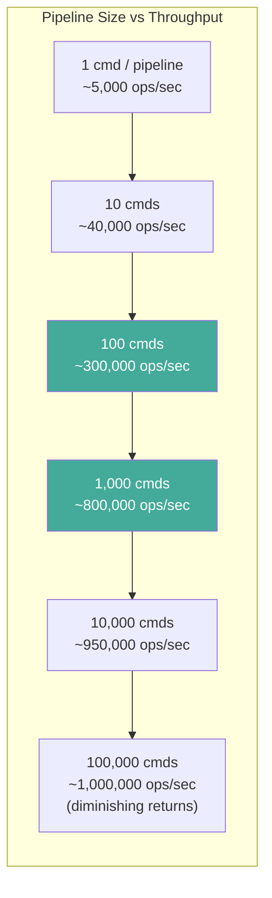
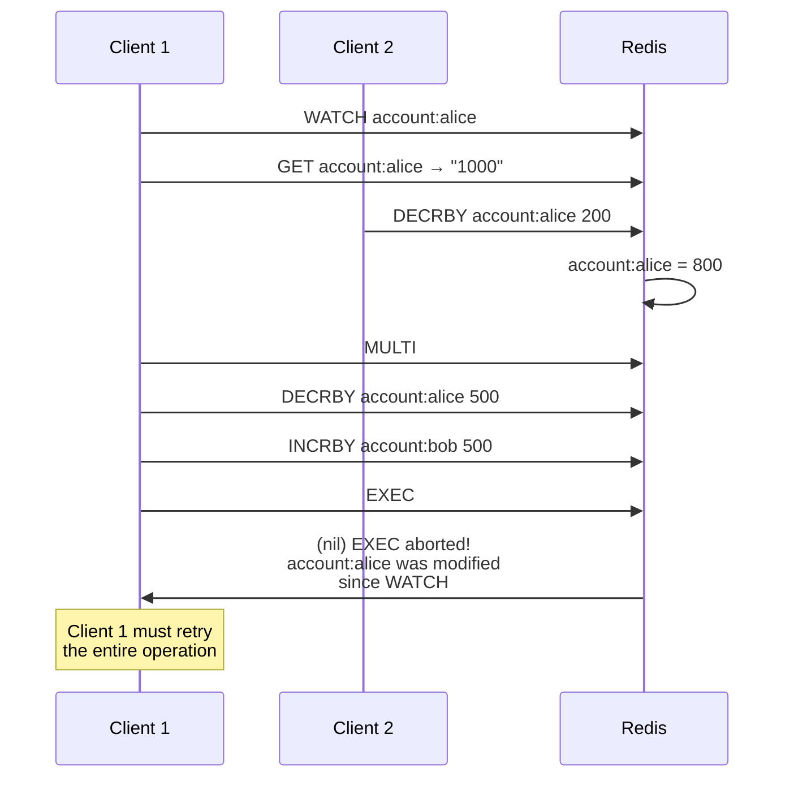
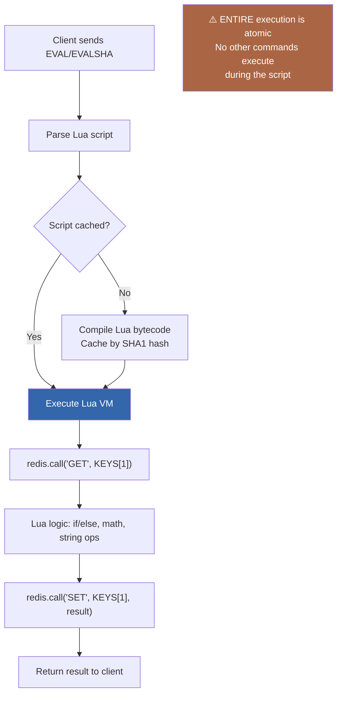
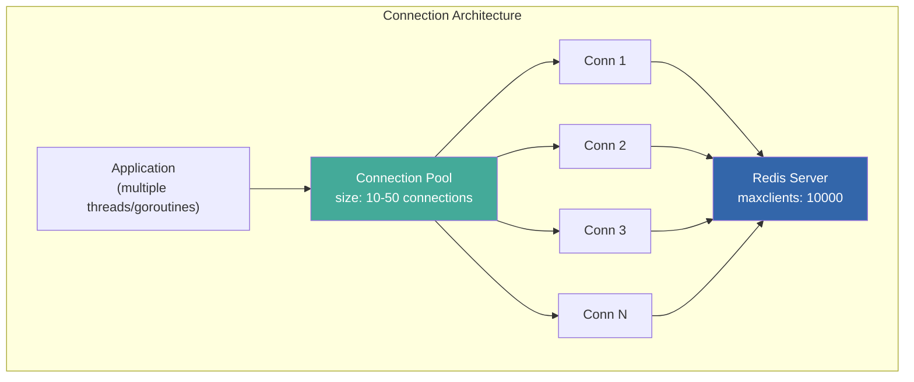
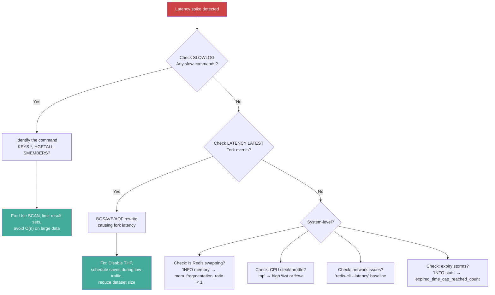
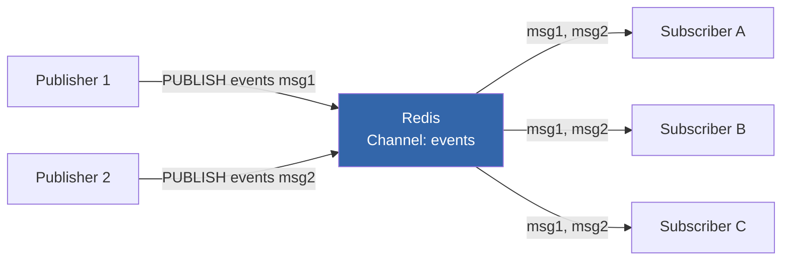

# Redis Deep Dive Series  Part 4: Networking Model, Event Loop, and Performance Engineering

---

**Series:** Redis Deep Dive  Engineering the World's Most Misunderstood Data Structure Server
**Part:** 4 of 10
**Audience:** Senior backend engineers, distributed systems engineers, infrastructure architects
**Reading time:** ~45 minutes

---

## Where We Are in the Series

Parts 1-3 formed the "single-node internals" trilogy. Part 1 showed us the event loop and architecture. Part 2 dismantled every data structure to the byte level. Part 3 covered memory management  jemalloc, expiration, eviction  and how Redis persists data to disk without blocking the main thread.

Those three parts explained *how Redis works internally*. This part shifts to *how to use Redis effectively*. We'll cover the client-facing layer: the wire protocol that carries your commands, pipelining that multiplies throughput, transactions and Lua scripting that provide atomicity guarantees, and the diagnostic tools that help you find and fix performance problems in production.

By the end, you'll be able to identify and fix the most common Redis performance bottlenecks, design client architectures that maximize throughput, and systematically debug latency spikes.

---

## 1. RESP: The Wire Protocol

Part 0, Section 11 introduced RESP conceptually  how commands are encoded as arrays of bulk strings. Part 1, Section 3 showed how the parser handles partial reads across event loop iterations. Here we cover both RESP2 and RESP3 in full detail.

### RESP2 (Default through Redis 5.x)

RESP (REdis Serialization Protocol) is intentionally simple  designed for trivial parsing at the speed of `memcpy`. Every RESP message begins with a type byte:

| Type Byte | Meaning | Example |
|---|---|---|
| `+` | Simple String | `+OK\r\n` |
| `-` | Error | `-ERR unknown command\r\n` |
| `:` | Integer | `:42\r\n` |
| `$` | Bulk String | `$5\r\nhello\r\n` |
| `*` | Array | `*2\r\n$3\r\nGET\r\n$3\r\nfoo\r\n` |

A client command is always sent as a RESP Array of Bulk Strings:

```
Client sends: SET mykey myvalue

Wire format:
*3\r\n        ← Array of 3 elements
$3\r\n        ← Bulk string, 3 bytes
SET\r\n       ← "SET"
$5\r\n        ← Bulk string, 5 bytes
mykey\r\n     ← "mykey"
$7\r\n        ← Bulk string, 7 bytes
myvalue\r\n   ← "myvalue"

Server responds:
+OK\r\n       ← Simple string "OK"
```

### RESP3 (Redis 6.0+)

RESP3 adds richer type information to responses, eliminating the need for client-side type inference:

| Type Byte | Meaning | RESP2 Equivalent |
|---|---|---|
| `_` | Null | `$-1\r\n` (Bulk Null) |
| `#` | Boolean | (encoded as integer) |
| `,` | Double | (encoded as bulk string) |
| `(` | Big Number | (encoded as bulk string) |
| `=` | Verbatim String | (plain bulk string) |
| `~` | Set | (array) |
| `%` | Map | (array of key-value pairs) |
| `>` | Push (server-initiated) | (not available) |
| `|` | Attribute | (not available) |

RESP3's **push type** (`>`) is particularly important: it enables server-initiated messages (pub/sub, key-space notifications) on the same connection without interfering with command responses. In RESP2, a pub/sub connection could not execute normal commands.

```bash
# Switch to RESP3
127.0.0.1:6379> HELLO 3
1# "server" => "redis"
2# "version" => "7.2.0"
3# "proto" => (integer) 3
4# "id" => (integer) 42
5# "mode" => "standalone"
6# "role" => "master"
7# "modules" => (empty array)
```

### Protocol Performance Characteristics

RESP parsing is dominated by `memcpy` and `atoi`  there are no escape sequences, no string delimiters to scan for, and no recursion. The length-prefixed format means the parser always knows exactly how many bytes to read next.

```
Parse cost comparison:
RESP:    ~10-50 nanoseconds per command (length-prefixed, trivial parse)
JSON:    ~500-5000 nanoseconds per command (recursive parse, string escaping)
SQL:     ~10,000-100,000 nanoseconds per query (lexer + parser + optimizer)
```

This parsing speed is why Redis can achieve >1M ops/sec  the protocol processing overhead per command is negligible compared to the actual data operation.

---

## 2. Pipelining: Amortizing Network Round-Trips

### The Problem: Round-Trip Time Dominates

A simple Redis command flow without pipelining:

```
Client                    Network                    Redis
  |--- SET key1 val1 ------→  (0.1ms)  ------→   |
  |                                                | Process (0.01ms)
  |←------ +OK ----------  (0.1ms)  ←-----------  |
  |--- SET key2 val2 ------→  (0.1ms)  ------→   |
  |                                                | Process (0.01ms)
  |←------ +OK ----------  (0.1ms)  ←-----------  |
  |--- SET key3 val3 ------→  (0.1ms)  ------→   |
  |                                                | Process (0.01ms)
  |←------ +OK ----------  (0.1ms)  ←-----------  |

3 commands × (0.1ms + 0.01ms + 0.1ms) = 0.63ms total
Throughput: 3 / 0.63ms ≈ 4,762 ops/sec
```

For 0.1ms network RTT, the client spends **95% of its time waiting for network round-trips** and 5% on actual Redis processing.

### The Solution: Pipeline Multiple Commands

```
Client                    Network                    Redis
  |--- SET key1 val1 ------→                         |
  |--- SET key2 val2 ------→  (0.1ms)  ------→      |
  |--- SET key3 val3 ------→                         |
  |                                                   | Process all 3 (0.03ms)
  |←------ +OK -----------                           |
  |←------ +OK -----------  (0.1ms)  ←-----------    |
  |←------ +OK -----------                           |

Total: 0.1ms + 0.03ms + 0.1ms = 0.23ms
Throughput: 3 / 0.23ms ≈ 13,043 ops/sec (2.7x improvement)
```

With 1000 commands in a pipeline:

```
Total: 0.1ms + 1ms + 0.1ms = 1.2ms
Throughput: 1000 / 1.2ms ≈ 833,333 ops/sec
```

### Pipeline Mechanics

Pipelining works because:
1. The client sends multiple commands without waiting for responses
2. Redis reads them all from the socket buffer in one `read()` call
3. Redis processes each command sequentially (normal single-threaded execution)
4. Redis writes all responses to the client's output buffer
5. The output buffer is flushed in one `write()` call

**No special server support is needed.** Pipelining is entirely a client-side optimization  the client simply doesn't wait for responses between sends. Redis doesn't even know the difference between pipelined and non-pipelined commands; they're just bytes in the socket buffer.

### Pipeline Implementation

```python
import redis

r = redis.Redis()

# Without pipelining: 1000 sequential round-trips
for i in range(1000):
    r.set(f"key:{i}", f"value:{i}")  # Each call blocks until response
# Time: ~1000 × 0.2ms = ~200ms

# With pipelining: 1 round-trip for all 1000 commands
pipe = r.pipeline(transaction=False)  # Non-transactional pipeline
for i in range(1000):
    pipe.set(f"key:{i}", f"value:{i}")
results = pipe.execute()  # Send all at once, collect all responses
# Time: ~1ms + 0.2ms ≈ 1.2ms (166x faster!)
```

```javascript
// Node.js (ioredis)  Automatic pipelining
const Redis = require('ioredis');
const redis = new Redis();

// ioredis automatically pipelines commands issued in the same event loop tick
async function batchInsert() {
    const pipeline = redis.pipeline();
    for (let i = 0; i < 1000; i++) {
        pipeline.set(`key:${i}`, `value:${i}`);
    }
    const results = await pipeline.exec();
    // results is [[null, 'OK'], [null, 'OK'], ...]
}

// ioredis also supports auto-pipelining
const redis2 = new Redis({ enableAutoPipelining: true });
// Now individual calls within the same tick are automatically batched:
await Promise.all([
    redis2.set('a', '1'),
    redis2.set('b', '2'),
    redis2.get('a'),
]);
// These 3 commands are sent as a single pipeline automatically
```

### Pipeline Sizing

Pipelines should not be unbounded. Consider:

1. **Client memory:** Each pipelined command's arguments are buffered in the client. 1 million SET commands with 1 KB values = 1 GB of client-side memory.

2. **Redis output buffer:** All responses are buffered before sending. 1 million GET responses of 1 KB each = 1 GB in Redis's client output buffer  potentially triggering `client-output-buffer-limit`.

3. **Atomic execution is NOT guaranteed.** Unlike `MULTI/EXEC`, pipelining does not wrap commands in a transaction. Other clients' commands can interleave between your pipelined commands. Use `MULTI/EXEC` within a pipeline if you need atomicity.

**Recommended pipeline size:** 100-10,000 commands per pipeline batch. Larger pipelines have diminishing returns (network RTT is already amortized) and increase memory pressure.



Pipelining is purely a performance optimization  it sends multiple independent commands in batch. But what if your commands *depend on each other*  if you need to read a value, modify it, and write it back *atomically*, without another client sneaking in between? That's the domain of transactions and Lua scripting.

---

## 3. Transactions: MULTI/EXEC

Part 1 warned that Redis MULTI/EXEC is not like a database transaction. Let's see exactly what it provides  and what it doesn't.

### What Transactions Are (and Aren't)

Redis transactions via `MULTI/EXEC` provide:
- **Isolation:** No other client's commands execute between MULTI and EXEC
- **Atomicity:** All commands in the block execute, or none do (if the connection drops before EXEC)

Redis transactions do NOT provide:
- **Rollback:** If a command within the transaction fails at runtime, other commands still execute
- **Constraint checking:** No foreign keys, no CHECK constraints, no uniqueness enforcement
- **Repeatable reads:** You cannot read a value inside MULTI and use it in a subsequent command within the same transaction (all commands are queued, not executed)

```bash
127.0.0.1:6379> MULTI
OK
127.0.0.1:6379(TX)> SET key1 "hello"
QUEUED
127.0.0.1:6379(TX)> INCR key1              # This will fail (INCR on string)
QUEUED
127.0.0.1:6379(TX)> SET key2 "world"
QUEUED
127.0.0.1:6379(TX)> EXEC
1) OK                    # SET key1 succeeded
2) (error) ERR value is not an integer or out of range  # INCR failed
3) OK                    # SET key2 succeeded  NO ROLLBACK
```

### WATCH: Optimistic Locking

`WATCH` enables optimistic locking  check-and-set (CAS) semantics:

```python
def transfer_funds(r, from_account, to_account, amount):
    """Atomic fund transfer using WATCH for optimistic locking."""
    while True:
        try:
            # Watch the source account for changes
            r.watch(from_account)

            # Read current balance (outside transaction  actual read)
            balance = int(r.get(from_account) or 0)
            if balance < amount:
                r.unwatch()
                raise ValueError("Insufficient funds")

            # Start transaction
            pipe = r.pipeline(True)  # True = transactional pipeline
            pipe.decrby(from_account, amount)
            pipe.incrby(to_account, amount)
            pipe.execute()  # If from_account changed since WATCH, raises WatchError
            return True

        except redis.WatchError:
            # Another client modified from_account  retry
            continue
```



### Performance: MULTI/EXEC vs Pipeline

`MULTI/EXEC` adds overhead compared to a plain pipeline:
- `MULTI` command: queued
- Each command: parsed, validated, and queued (not executed)
- `EXEC`: executes all queued commands

For pure throughput without atomicity requirements, use non-transactional pipelines. For atomicity, use `MULTI/EXEC` within a pipeline:

```python
# Best of both worlds: transactional pipeline
pipe = r.pipeline(transaction=True)  # MULTI/EXEC wrapper
pipe.set("key1", "val1")
pipe.set("key2", "val2")
pipe.incr("counter")
results = pipe.execute()
# Sends: MULTI → SET → SET → INCR → EXEC (all pipelined, atomic)
```

MULTI/EXEC provides isolation and atomicity, but with a significant constraint: commands are queued *before* execution, so you can't use one command's result as input to another. This makes conditional logic impossible within a transaction. Lua scripting removes this limitation entirely  and introduces its own tradeoffs.

---

## 4. Lua Scripting: Server-Side Atomicity

### Why Lua?

`MULTI/EXEC` has a fundamental limitation: you cannot use the result of one command as input to another within the same transaction (commands are queued, not executed). Lua scripting solves this by running arbitrary logic *inside Redis*, with the same atomicity guarantee. Part 7 uses Lua extensively for rate limiting, distributed locking, and other patterns that require conditional reads-then-writes.

```lua
-- Atomic rate limiter: check-and-increment in one operation
-- KEYS[1] = rate limit key
-- ARGV[1] = limit
-- ARGV[2] = window in seconds

local current = redis.call('GET', KEYS[1])
if current and tonumber(current) >= tonumber(ARGV[1]) then
    return 0  -- Rate limited
end
local result = redis.call('INCR', KEYS[1])
if result == 1 then
    redis.call('EXPIRE', KEYS[1], ARGV[2])
end
return 1  -- Allowed
```

### Lua Execution Model

Redis executes Lua scripts **atomically**  the entire script runs without any other client's commands interleaving. This is the same guarantee as `MULTI/EXEC` but with the ability to use intermediate results.



### EVAL vs EVALSHA

```python
# EVAL: send the script text every time (wasteful for repeated calls)
r.eval("""
    local val = redis.call('GET', KEYS[1])
    redis.call('SET', KEYS[1], val .. ARGV[1])
    return redis.call('GET', KEYS[1])
""", 1, "mykey", " appended")

# EVALSHA: send only the SHA1 hash (efficient for repeated calls)
# First, load the script
sha = r.script_load("""
    local val = redis.call('GET', KEYS[1])
    redis.call('SET', KEYS[1], val .. ARGV[1])
    return redis.call('GET', KEYS[1])
""")

# Then call by hash
result = r.evalsha(sha, 1, "mykey", " appended")
```

### Lua Performance Considerations

1. **Script execution blocks all clients.** A Lua script running for 100ms blocks every client for 100ms. Keep scripts fast  aim for <1ms execution.

2. **`redis.call` vs `redis.pcall`:** `redis.call()` propagates errors (aborts the script). `redis.pcall()` returns errors as values (script continues). Use `pcall` when you want to handle errors gracefully within the script.

3. **No external I/O.** Lua scripts cannot make network calls, read files, or access system resources. They can only call Redis commands and perform computation.

4. **Determinism requirement.** Scripts must be deterministic for replication  the same inputs must produce the same outputs. Avoid `TIME`, `RANDOMKEY`, or other non-deterministic commands within scripts. (Redis 7.0+ relaxes this with "no-writes" script flags.)

5. **Script timeout.** By default, Redis kills scripts running longer than `lua-time-limit` (default 5000ms = 5 seconds). During this time, Redis responds to all commands with `BUSY` errors.

### Real-World: Distributed Rate Limiter

```python
import redis
import time

RATE_LIMIT_SCRIPT = """
-- Sliding window rate limiter
-- KEYS[1] = rate limit key (e.g., "ratelimit:user:42:api")
-- ARGV[1] = max requests
-- ARGV[2] = window size in milliseconds
-- ARGV[3] = current timestamp in milliseconds

local key = KEYS[1]
local max_requests = tonumber(ARGV[1])
local window_ms = tonumber(ARGV[2])
local now = tonumber(ARGV[3])
local window_start = now - window_ms

-- Remove entries outside the window
redis.call('ZREMRANGEBYSCORE', key, '-inf', window_start)

-- Count current entries
local current = redis.call('ZCARD', key)

if current < max_requests then
    -- Add this request
    redis.call('ZADD', key, now, now .. ':' .. math.random(1000000))
    redis.call('PEXPIRE', key, window_ms)
    return 1  -- Allowed
else
    return 0  -- Rate limited
end
"""

class RateLimiter:
    def __init__(self, redis_client, max_requests=100, window_seconds=60):
        self.r = redis_client
        self.max_requests = max_requests
        self.window_ms = window_seconds * 1000
        self.script_sha = self.r.script_load(RATE_LIMIT_SCRIPT)

    def is_allowed(self, identifier):
        """Check if request is allowed. Returns True/False."""
        now_ms = int(time.time() * 1000)
        result = self.r.evalsha(
            self.script_sha, 1,
            f"ratelimit:{identifier}",
            self.max_requests,
            self.window_ms,
            now_ms
        )
        return bool(result)

# Usage
r = redis.Redis()
limiter = RateLimiter(r, max_requests=100, window_seconds=60)

if limiter.is_allowed("user:42:api"):
    # Process request
    pass
else:
    # Return 429 Too Many Requests
    pass
```

---

## 5. Connection Management

### Connection Overhead

Each Redis connection has a non-trivial memory cost:

```
Per-connection memory:
- client struct:          ~1.5 KB
- Query buffer (initial): 0 bytes (grows on demand, up to 1 GB)
- Output buffer (normal): 16 KB default reserved
- Authentication state:   ~100 bytes
- Total baseline:         ~17 KB per idle connection

10,000 connections × 17 KB = ~170 MB just for idle connections
```

### Connection Pooling

Never create a new Redis connection per request. Use connection pools:

```python
import redis

# Connection pool (Python redis-py)
pool = redis.ConnectionPool(
    host='localhost',
    port=6379,
    max_connections=50,          # Max pool size
    socket_timeout=5,            # Read timeout (seconds)
    socket_connect_timeout=2,    # Connection timeout
    socket_keepalive=True,       # TCP keepalive
    health_check_interval=30,    # Check connection health every 30s
    retry_on_timeout=True,       # Auto-retry on timeout
)
r = redis.Redis(connection_pool=pool)

# Each r.get() borrows a connection from the pool and returns it after
```

```javascript
// Node.js (ioredis)  Built-in connection pool
const Redis = require('ioredis');

// Single connection (for most use cases)
const redis = new Redis({
    host: 'localhost',
    port: 6379,
    maxRetriesPerRequest: 3,
    enableReadyCheck: true,
    lazyConnect: false,
    keepAlive: 30000,  // TCP keepalive interval (ms)
});

// Cluster mode has built-in pool per node
const cluster = new Redis.Cluster([
    { host: 'node1', port: 6379 },
    { host: 'node2', port: 6379 },
], {
    scaleReads: 'slave',           // Read from replicas
    redisOptions: {
        maxRetriesPerRequest: 3
    }
});
```

### Client-Side Best Practices



**Pool sizing formula:**

```
Pool size = max(
    number_of_concurrent_threads,
    expected_ops_per_second × average_latency_seconds
)

Example:
- 20 application threads
- 10,000 ops/sec expected
- 0.5ms average latency
- Pool size = max(20, 10000 × 0.0005) = max(20, 5) = 20
```

Over-provisioning connections wastes server memory. Under-provisioning causes connection contention in the pool.

---

## 6. Performance Benchmarking

### redis-benchmark: The Built-in Tool

```bash
# Basic benchmark: 100,000 requests, 50 concurrent clients
redis-benchmark -n 100000 -c 50

# Specific commands only
redis-benchmark -n 100000 -c 50 -t set,get,incr,lpush,rpush

# With pipelining (16 commands per pipeline)
redis-benchmark -n 100000 -c 50 -P 16

# With specific data size (256-byte values)
redis-benchmark -n 100000 -c 50 -d 256

# Show latency histogram
redis-benchmark -n 100000 -c 50 --csv

# Test with specific key pattern
redis-benchmark -n 100000 -c 50 -t set -r 1000000
# -r 1000000: use random keys from keyspace of 1M
```

### Interpreting Results

```
====== SET ======
  100000 requests completed in 1.25 seconds
  50 parallel clients
  3 bytes payload
  keep alive: 1
  host configuration "save": 3600 1 300 100 60 10000
  host configuration "appendonly": no
  multi-thread: no

Latency by percentile distribution:
0.000% <= 0.103 milliseconds (cumulative count 1)
50.000% <= 0.167 milliseconds (cumulative count 50489)
75.000% <= 0.183 milliseconds (cumulative count 75124)
90.000% <= 0.215 milliseconds (cumulative count 90087)
99.000% <= 0.319 milliseconds (cumulative count 99002)
99.900% <= 0.559 milliseconds (cumulative count 99902)
99.990% <= 1.015 milliseconds (cumulative count 99990)
100.000% <= 1.263 milliseconds (cumulative count 100000)

80000.00 requests per second (80K ops/sec)
```

Key metrics to watch:
- **Throughput (ops/sec):** Baseline for your hardware
- **p50 latency:** Typical response time
- **p99 latency:** Tail latency  usually 2-3x p50
- **p99.9 latency:** Extreme tail  indicates jitter sources (GC, CoW, slow commands)

### Common Benchmarking Mistakes

1. **Benchmarking over a real network.** If you benchmark from a different machine, you're measuring network latency, not Redis performance. For Redis-specific benchmarking, run `redis-benchmark` on the same host.

2. **Not using pipelining.** Without pipelining, you're benchmarking round-trip time, not Redis throughput. Use `-P 16` or higher to see Redis's actual capacity.

3. **Using default data sizes.** The default 3-byte payload is unrealistic. Benchmark with your actual payload sizes.

4. **Ignoring the `save` configuration.** If RDB saves are enabled, `BGSAVE` during benchmarking can skew results. Disable saves for pure performance testing.

5. **Not warming up.** The first few thousand operations may be slower (JIT compilation in client libraries, TCP slow start, etc.). Ignore the first 10% of results.

### Realistic Benchmark Script

```python
import redis
import time
import statistics

def benchmark_redis(r, operation, num_ops=10000, pipeline_size=100, value_size=256):
    """Realistic Redis benchmark with latency distribution."""
    value = "x" * value_size
    latencies = []

    # Warmup
    for i in range(1000):
        r.set(f"bench:warmup:{i}", value)

    start = time.perf_counter()

    if pipeline_size == 1:
        # No pipelining
        for i in range(num_ops):
            t0 = time.perf_counter()
            if operation == "set":
                r.set(f"bench:{i}", value)
            elif operation == "get":
                r.get(f"bench:{i % 1000}")
            latencies.append((time.perf_counter() - t0) * 1000)  # ms
    else:
        # With pipelining
        for batch_start in range(0, num_ops, pipeline_size):
            pipe = r.pipeline(transaction=False)
            t0 = time.perf_counter()
            for i in range(batch_start, min(batch_start + pipeline_size, num_ops)):
                if operation == "set":
                    pipe.set(f"bench:{i}", value)
                elif operation == "get":
                    pipe.get(f"bench:{i % 1000}")
            pipe.execute()
            batch_latency = (time.perf_counter() - t0) * 1000
            latencies.append(batch_latency)

    total_time = time.perf_counter() - start
    ops_per_sec = num_ops / total_time

    latencies.sort()
    print(f"\n{operation.upper()} Benchmark ({num_ops} ops, pipeline={pipeline_size}, value={value_size}B)")
    print(f"  Throughput: {ops_per_sec:,.0f} ops/sec")
    print(f"  p50:  {latencies[len(latencies)//2]:.3f} ms")
    print(f"  p99:  {latencies[int(len(latencies)*0.99)]:.3f} ms")
    print(f"  p99.9: {latencies[int(len(latencies)*0.999)]:.3f} ms")
    print(f"  max:  {max(latencies):.3f} ms")

r = redis.Redis()
benchmark_redis(r, "set", num_ops=100000, pipeline_size=1, value_size=256)
benchmark_redis(r, "set", num_ops=100000, pipeline_size=100, value_size=256)
benchmark_redis(r, "get", num_ops=100000, pipeline_size=100, value_size=256)
```

---

## 7. Latency Diagnosis: Finding the Bottleneck

### The LATENCY Framework

Redis 2.8.13+ includes a built-in latency monitoring system:

```bash
# Enable latency monitoring (log events > 5ms)
CONFIG SET latency-monitor-threshold 5

# View latency events
127.0.0.1:6379> LATENCY LATEST
1) 1) "command"            # Event name
   2) (integer) 1609459200 # Timestamp of latest event
   3) (integer) 15         # Latest latency (ms)
   4) (integer) 42         # Maximum latency ever recorded (ms)

# View latency history for a specific event
127.0.0.1:6379> LATENCY HISTORY command
1) 1) (integer) 1609459100
   2) (integer) 8
2) 1) (integer) 1609459200
   2) (integer) 15

# Human-readable report
127.0.0.1:6379> LATENCY DOCTOR
"I have a few latency reports to share with you:

Command: 3 latency spikes in the last 60 seconds.
  Worst: 42ms at 12:00:00
  Average: 22ms
  Suggestion: Check SLOWLOG for expensive commands.

AOF-fsync: 1 event in the last 60 seconds.
  Worst: 8ms
  Suggestion: Consider appendfsync everysec if using always."
```

### Latency Event Types

| Event | Cause | Fix |
|---|---|---|
| `command` | Slow command execution | Check SLOWLOG; avoid O(n) commands on large datasets |
| `fast-command` | Even "fast" commands are slow | System-level issue (swap, CPU throttle) |
| `fork` | Fork for BGSAVE/BGREWRITEAOF | Reduce dataset size; disable THP |
| `aof-fsync-always` | fsync after every command | Switch to `appendfsync everysec` |
| `aof-write` | Slow AOF file write | Check disk I/O; use faster storage |
| `aof-write-pending-fsync` | Write delayed by pending fsync | Background fsync still running |
| `aof-rewrite-diff-write` | Slow write during AOF rewrite | Disk contention |
| `rdb-unlink-temp-file` | Slow temp file deletion | Disk I/O |
| `expire-cycle` | Active expiry consuming CPU | Add TTL jitter; increase `hz` |

### SLOWLOG: Command-Level Diagnosis

```bash
# Configure slow log
CONFIG SET slowlog-log-slower-than 10000   # Log commands > 10ms (in µs)
CONFIG SET slowlog-max-len 256             # Keep 256 entries

# View slow log
127.0.0.1:6379> SLOWLOG GET 10
1) 1) (integer) 42                         # Entry ID
   2) (integer) 1609459200                  # Timestamp
   3) (integer) 15234                       # Duration (µs) = 15.2ms
   4) 1) "KEYS"                            # Command
      2) "*"                                # Arguments
   5) "127.0.0.1:49152"                    # Client address
   6) "myapp"                              # Client name (if set)

2) 1) (integer) 41
   2) (integer) 1609459180
   3) (integer) 8721
   4) 1) "HGETALL"
      2) "big_hash_with_50000_fields"
   5) "127.0.0.1:49153"
   6) "worker-3"
```

### Systematic Latency Debugging



### The redis-cli Latency Tools

```bash
# Continuous latency measurement (ping-pong)
redis-cli --latency
# min: 0, max: 1, avg: 0.12 (1892 samples)

# Latency history (one sample per 15 seconds)
redis-cli --latency-history -i 15
# min: 0, max: 1, avg: 0.11 (932 samples) -- 15.01 seconds range
# min: 0, max: 2, avg: 0.13 (945 samples) -- 15.00 seconds range

# Latency distribution
redis-cli --latency-dist
# Displays a spectrum of latency values using color coding

# Intrinsic latency (baseline  what the hardware can do)
redis-cli --intrinsic-latency 5
# Max latency so far: 1 microseconds
# (run for 5 seconds, measure the minimum achievable latency)
```

---

## 8. CLIENT Commands: Connection Diagnostics

### CLIENT LIST: See Who's Connected

```bash
127.0.0.1:6379> CLIENT LIST
id=42 addr=10.0.1.5:49152 laddr=10.0.1.1:6379 fd=8 name=web-app-1
  db=0 sub=0 psub=0 ssub=0 multi=-1
  qbuf=26 qbuf-free=20448 argv-mem=10 multi-mem=0
  rbs=1024 rbp=0 obl=0 oll=0 omem=0
  tot-mem=22426 events=r cmd=ping user=default
  lib-name=redis-py lib-ver=5.0.0 resp=2

# Key fields:
# qbuf: query buffer size (bytes of pending input)
# obl: output buffer length (bytes pending write)
# oll: output list length (number of response objects pending)
# omem: output memory usage
# tot-mem: total memory consumed by this client
# cmd: last command executed
# idle: seconds since last command
```

### CLIENT NO-EVICT: Protect Critical Connections

```bash
# Prevent a monitoring client from being evicted during memory pressure
CLIENT NO-EVICT on
```

### CLIENT SETNAME: Label Connections

```python
# Always set client names for debuggability
r = redis.Redis(client_name="payment-service-worker-3")

# Or after connection
r.client_setname("payment-service-worker-3")
```

This makes `CLIENT LIST` output much more useful  instead of mystery IP addresses, you see service names.

---

## 9. Pub/Sub: Real-Time Messaging

### Architecture

Redis Pub/Sub provides fire-and-forget messaging:



### Key Characteristics

1. **Fire-and-forget.** If a subscriber is not connected when a message is published, the message is lost. There is no message queue, no retry, no durability.

2. **No acknowledgment.** Redis doesn't know if subscribers received the message. `PUBLISH` returns the number of subscribers that received the message, but not whether they processed it.

3. **Memory pressure risk.** If a subscriber is slow (can't read messages fast enough), messages queue in its output buffer. The `client-output-buffer-limit pubsub` configuration controls when Redis disconnects slow subscribers.

4. **Cluster behavior.** In Redis Cluster, pub/sub messages are broadcast to all nodes  every subscriber on every node receives every message. This can be a significant bandwidth overhead in large clusters. Redis 7.0+ introduced **sharded pub/sub** (`SSUBSCRIBE`) which routes messages only to the node owning the channel's hash slot.

### When to Use Pub/Sub vs Streams

| Dimension | Pub/Sub | Streams |
|---|---|---|
| **Delivery** | Fire-and-forget | At-least-once (with consumer groups) |
| **History** | None  missed messages are lost | Full history (until trimmed) |
| **Consumer groups** | No | Yes |
| **Backpressure** | Slow consumers get disconnected | Consumers read at their own pace |
| **Use case** | Real-time notifications, cache invalidation | Event sourcing, job queues, activity feeds |

```python
# Pub/Sub: Cache invalidation notifications
import redis
import threading

r = redis.Redis()

def cache_invalidation_listener():
    pubsub = r.pubsub()
    pubsub.subscribe("cache:invalidate")
    for message in pubsub.listen():
        if message["type"] == "message":
            key = message["data"].decode()
            local_cache.pop(key, None)  # Remove from local cache

# Start listener in background thread
thread = threading.Thread(target=cache_invalidation_listener, daemon=True)
thread.start()

# Publisher: notify all instances when cache entry changes
def update_user(user_id, data):
    r.hset(f"user:{user_id}", mapping=data)
    r.publish("cache:invalidate", f"user:{user_id}")
```

Section 4 covered Lua scripting via `EVAL`/`EVALSHA`. While powerful, this approach has operational pain points: scripts are stored by SHA hash (not by name), they aren't persisted across restarts (unless replicated), and there's no concept of libraries or versioning. Redis 7.0 introduced Functions to address all of these issues.

---

## 10. Redis Functions (Redis 7.0+)

Redis Functions replace `EVAL`/`EVALSHA` with a more structured, manageable approach to server-side scripting:

```lua
-- Register a function library
#!lua name=mylib

-- Rate limiter function
redis.register_function('rate_limit', function(keys, args)
    local key = keys[1]
    local limit = tonumber(args[1])
    local window = tonumber(args[2])

    local current = tonumber(redis.call('GET', key) or '0')
    if current >= limit then
        return 0
    end

    local new_val = redis.call('INCR', key)
    if new_val == 1 then
        redis.call('EXPIRE', key, window)
    end
    return 1
end)

-- Atomic counter with custom logic
redis.register_function('smart_incr', function(keys, args)
    local key = keys[1]
    local max_val = tonumber(args[1])

    local current = tonumber(redis.call('GET', key) or '0')
    if current >= max_val then
        return redis.error_reply('Counter at maximum')
    end

    return redis.call('INCR', key)
end)
```

```bash
# Load the library
cat mylib.lua | redis-cli -x FUNCTION LOAD REPLACE

# Call the function
127.0.0.1:6379> FCALL rate_limit 1 "api:user:42" 100 60
(integer) 1

# List loaded functions
127.0.0.1:6379> FUNCTION LIST
1) 1) "library_name"
   2) "mylib"
   3) "engine"
   4) "LUA"
   5) "functions"
   6) 1) 1) "name"
         2) "rate_limit"
         3) "description"
         4) (nil)
         5) "flags"
         6) (empty array)
```

**Advantages over EVAL:**
- Functions are registered once and persist across restarts
- Libraries group related functions together
- Explicit function names instead of SHA1 hashes
- Functions are replicated to replicas automatically
- Better debugging and error reporting

---

## 11. Performance Anti-Patterns and Fixes

### Anti-Pattern 1: One Connection Per Request

```python
# WRONG: Create connection per request
def handle_request():
    r = redis.Redis()  # New TCP connection every time!
    data = r.get("key")
    r.close()

# RIGHT: Shared connection pool
pool = redis.ConnectionPool(max_connections=50)
r = redis.Redis(connection_pool=pool)

def handle_request():
    data = r.get("key")  # Borrows from pool
```

### Anti-Pattern 2: Storing Large Values

```python
# WRONG: 10 MB JSON blob in Redis
r.set("user:42:feed", json.dumps(giant_feed_data))  # 10 MB

# RIGHT: Store individual items and assemble
for item in feed_items:
    r.zadd("feed:user:42", {json.dumps(item): item["timestamp"]})

# Retrieve only what's needed
recent = r.zrevrange("feed:user:42", 0, 19)  # Top 20 items
```

### Anti-Pattern 3: Using KEYS in Production

```python
# WRONG: Blocks Redis for seconds on large keyspaces
keys = r.keys("user:*")

# RIGHT: Use SCAN for incremental iteration
def scan_keys(r, pattern, count=1000):
    cursor = 0
    while True:
        cursor, keys = r.scan(cursor, match=pattern, count=count)
        for key in keys:
            yield key
        if cursor == 0:
            break

for key in scan_keys(r, "user:*"):
    process(key)
```

### Anti-Pattern 4: Not Using Pipelining for Bulk Operations

```python
# WRONG: 1000 sequential round-trips
for user_id in user_ids:
    r.hgetall(f"user:{user_id}")

# RIGHT: Pipeline batch
pipe = r.pipeline(transaction=False)
for user_id in user_ids:
    pipe.hgetall(f"user:{user_id}")
results = pipe.execute()
```

### Anti-Pattern 5: Using DEL on Big Keys

```python
# WRONG: DEL on a hash with 1M fields blocks for ~1 second
r.delete("big_hash")

# RIGHT: UNLINK for async deletion
r.unlink("big_hash")  # Returns immediately; memory freed in background
```

---

## 12. Observability: What to Monitor

### Key Metrics Dashboard

```bash
# Essential metrics from INFO
redis-cli INFO stats | grep -E "total_commands|ops_per_sec|keyspace_hits|keyspace_misses|evicted"
redis-cli INFO memory | grep -E "used_memory:|fragmentation|maxmemory"
redis-cli INFO clients | grep -E "connected_clients|blocked_clients"
redis-cli INFO replication | grep -E "role|connected_slaves|repl_backlog"
redis-cli INFO persistence | grep -E "rdb_|aof_"
```

### Recommended Alerting Thresholds

| Metric | Warning | Critical |
|---|---|---|
| `used_memory` / `maxmemory` | > 80% | > 95% |
| `mem_fragmentation_ratio` | > 1.5 or < 1.0 | > 2.0 or < 0.8 |
| `evicted_keys` (rate) | > 0 / sec sustained | > 100 / sec |
| `connected_clients` | > 80% of maxclients | > 95% of maxclients |
| `blocked_clients` | > 10 | > 50 |
| `instantaneous_ops_per_sec` |  | Sudden drop > 50% |
| Cache hit rate | < 90% | < 80% |
| `rdb_last_bgsave_status` |  | `err` |
| `aof_last_bgrewrite_status` |  | `err` |
| `rejected_connections` | > 0 | Sustained |

### Cache Hit Rate Calculation

```python
def get_cache_hit_rate(r):
    info = r.info("stats")
    hits = info["keyspace_hits"]
    misses = info["keyspace_misses"]
    total = hits + misses
    if total == 0:
        return 1.0
    return hits / total

# A cache hit rate below 80% usually means:
# 1. TTLs are too short
# 2. Working set exceeds maxmemory (eviction before reuse)
# 3. Cache keys don't match access patterns
```

---

## 13. Best Practices Summary

1. **Always use connection pools.** One connection per request is a performance and resource disaster.

2. **Pipeline everything you can.** Batch 100-1000 commands per pipeline for maximum throughput.

3. **Use `EVALSHA` (not `EVAL`) for Lua scripts.** Avoid transmitting script text repeatedly.

4. **Keep Lua scripts under 1ms execution time.** They block all clients.

5. **Set `client-name` on every connection** for operational visibility.

6. **Use `UNLINK` instead of `DEL`** for large keys to avoid blocking.

7. **Monitor SLOWLOG continuously.** A slow command is the #1 cause of Redis latency spikes.

8. **Set `latency-monitor-threshold`** to detect system-level latency sources (fork, fsync, expire).

9. **Benchmark with realistic data sizes and pipelining.** Default benchmarks are misleading.

10. **Use Redis Functions (7.0+) over EVAL/EVALSHA** for production Lua code.

---

## Coming Up in Part 5: Replication, High Availability, and Sentinel Architecture

Everything we've covered in Parts 1-4 assumes a single Redis instance. In production, a single instance is a single point of failure  if it crashes, your cache is cold and your application is blind. Part 5 is where Redis stops being a single-node story and enters the distributed world.

We'll cover:

- **Replication internals**  full sync vs partial sync (PSYNC2), the replication stream, and the replication backlog
- **Consistency guarantees**  what "eventually consistent" actually means, and the data loss window between master writes and replica acknowledgment
- **Sentinel architecture**  failure detection (SDOWN/ODOWN), leader election, and automatic failover
- **Split-brain scenarios**  when Redis thinks it has two masters, and the `min-replicas-*` safety net
- **Replica configurations**  read replicas, replica-of-replica chains, and diskless replication
- **The WAIT command**  synchronous replication for when eventual consistency isn't enough

---

*This is Part 4 of the Redis Deep Dive series. Parts 1-4 complete the single-instance story: architecture, data structures, memory/persistence, and performance engineering. Part 5 takes us into the distributed world  replication, Sentinel, and the complexity that comes with running Redis across multiple machines.*
