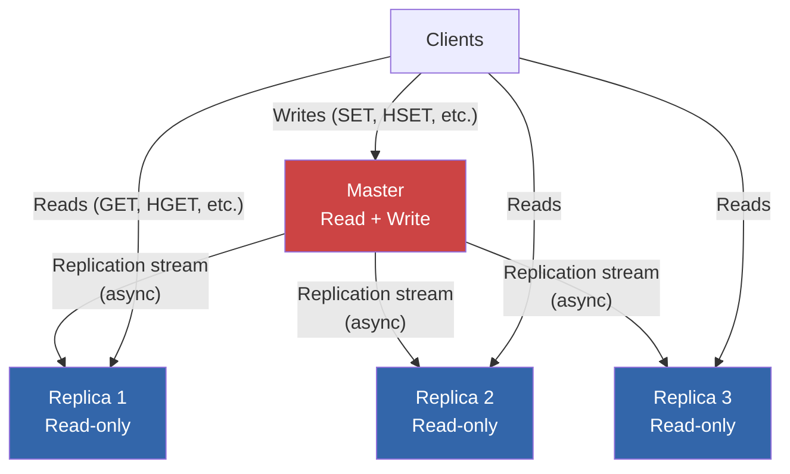
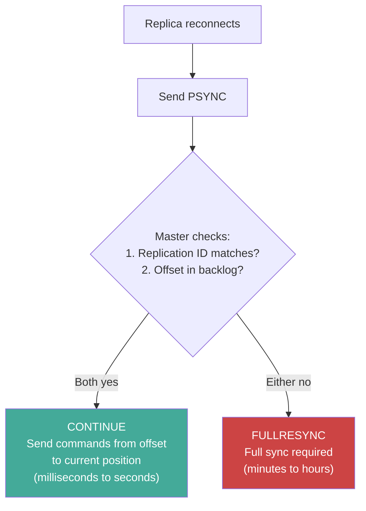
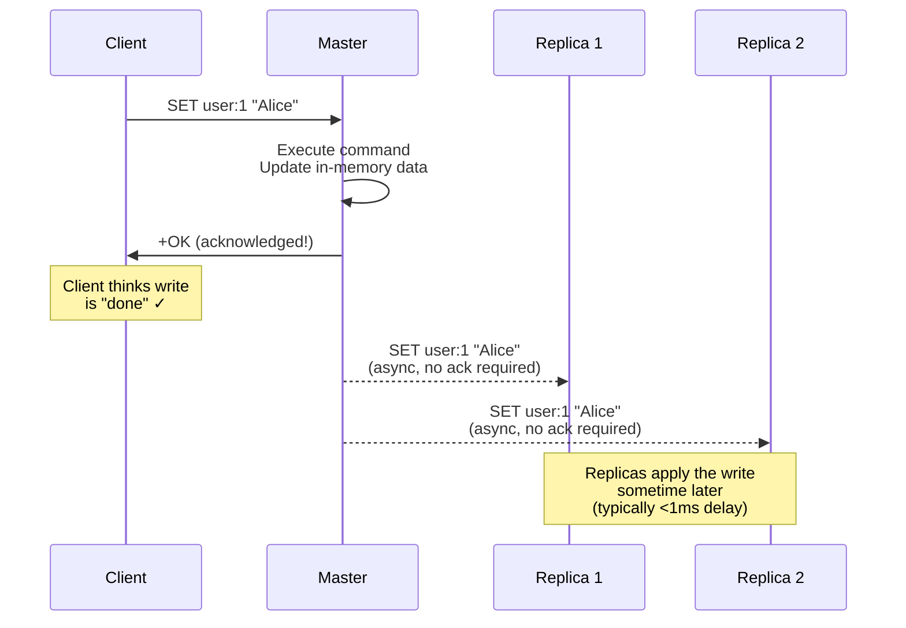
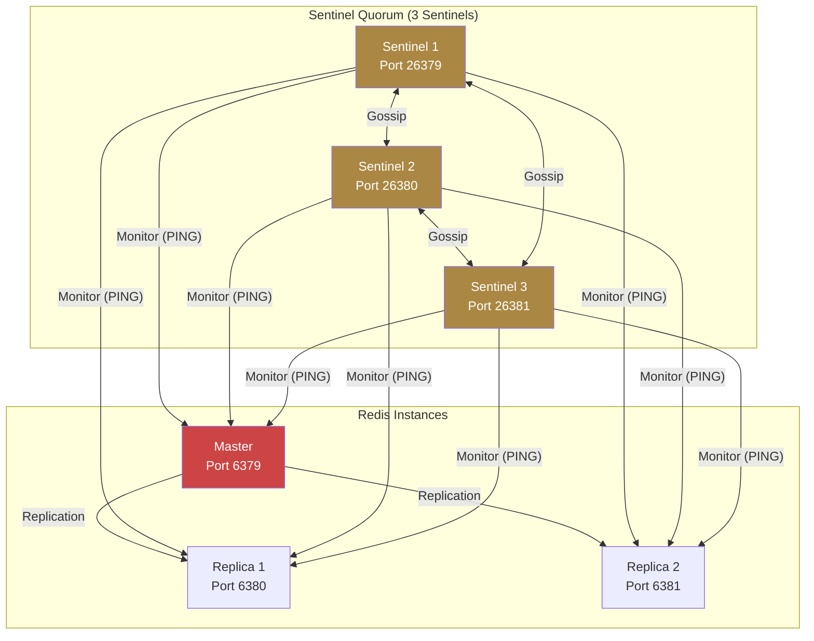
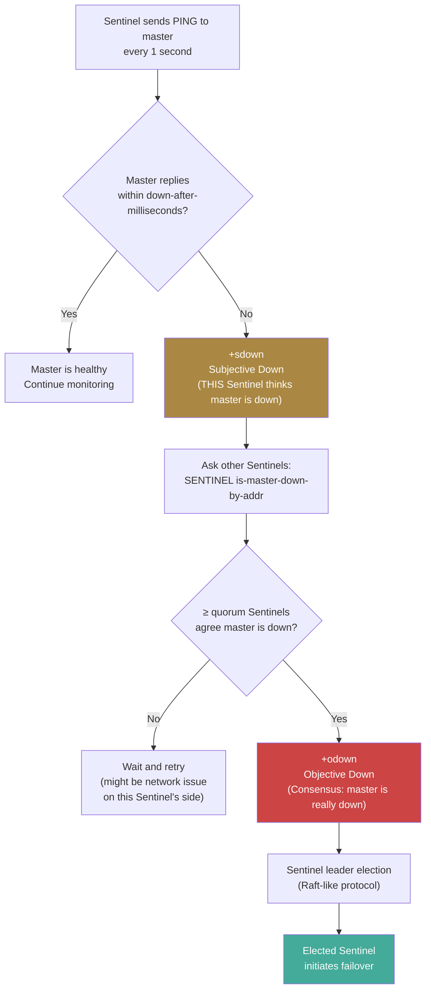
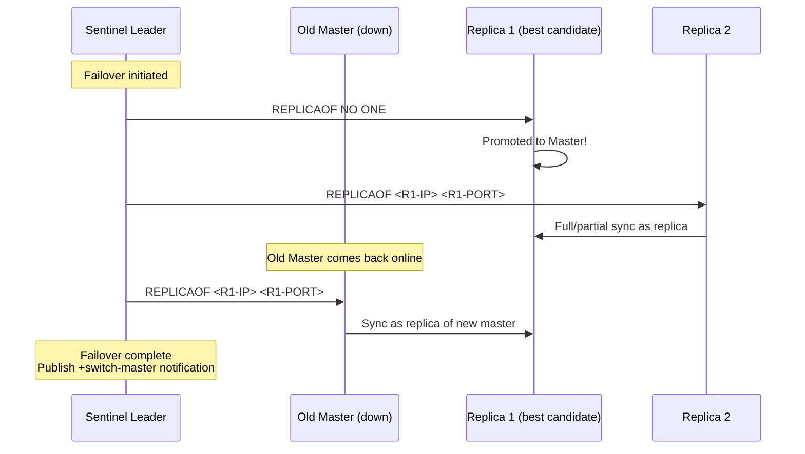
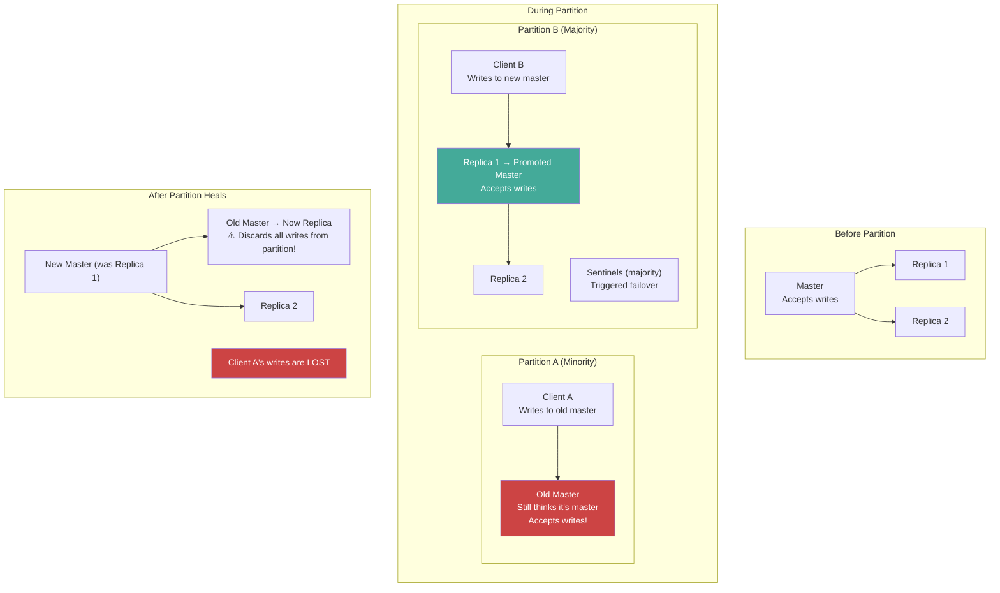
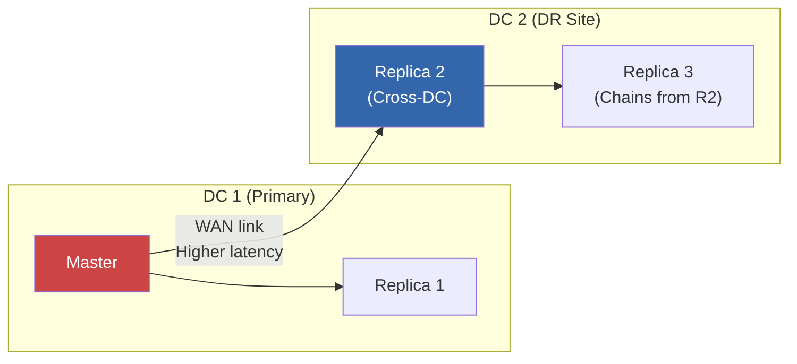
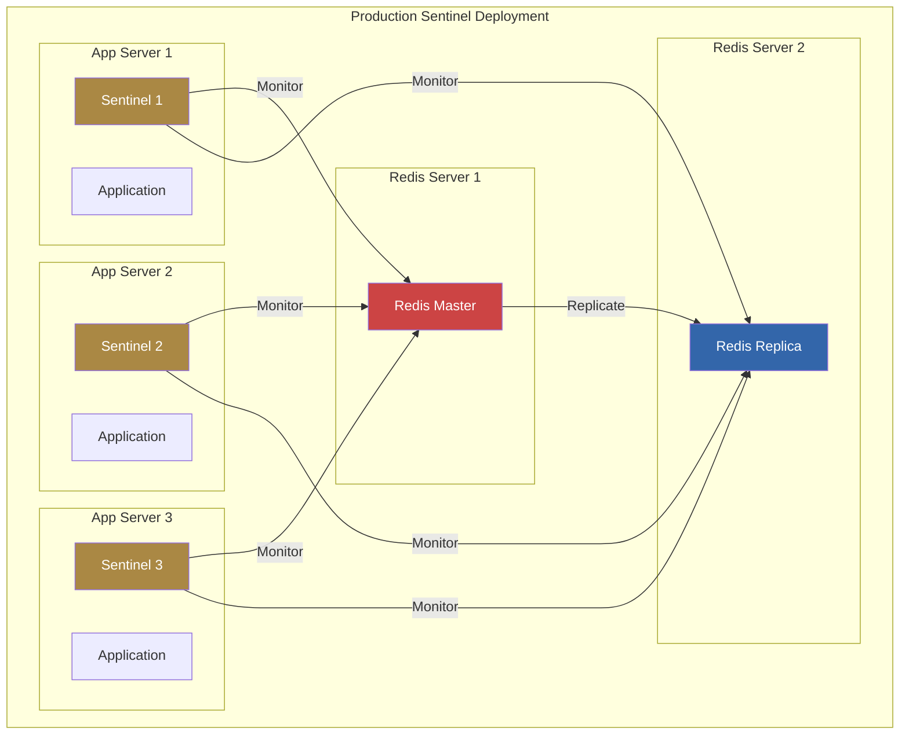

# Redis Deep Dive Series  Part 5: Replication, High Availability, and Sentinel Architecture

---

**Series:** Redis Deep Dive  Engineering the World's Most Misunderstood Data Structure Server
**Part:** 5 of 10
**Audience:** Senior backend engineers, distributed systems engineers, infrastructure architects
**Reading time:** ~50 minutes

---

## Where We Are in the Series

Parts 1-4 treated Redis as a single-node system. We mastered the event loop (Part 1), internal data structures (Part 2), memory management and persistence (Part 3), and the client-facing layer  protocol, pipelining, transactions, scripting, and performance tools (Part 4).

But a single Redis instance is a single point of failure. If it crashes, you lose your cache. If its server dies, you lose everything that wasn't persisted. Even with perfect RDB/AOF configuration, recovery means minutes of downtime while Redis loads data from disk.

This is where replication and high availability enter the picture. This part answers three questions:
1. **How does Redis copy data to other machines?** (Replication  the PSYNC protocol)
2. **How does Redis detect and recover from failures?** (Sentinel  automatic failover)
3. **What data can Redis lose, and when?** (Consistency model  the gaps that bite in production)

Part 1 warned that Redis replication is asynchronous and can lose data. Here we'll see exactly *how* data loss happens, *how much* you can lose, and *what you can do about it*.

---

## 1. Replication Fundamentals

### The Replication Model

Redis uses **asynchronous, single-leader replication**. One instance is the master (primary); zero or more instances are replicas (slaves). All writes go to the master; the master propagates writes to replicas.



Key properties:
- **Writes are only accepted by the master** (by default; replicas reject writes unless `replica-read-only no` is set)
- **Replication is asynchronous**  the master does not wait for replicas to acknowledge writes before responding to the client
- **Replicas can serve reads**  enabling horizontal read scaling
- **A replica can be a master to other replicas**  forming a replication chain

### Configuring Replication

```bash
# On the replica:
# redis.conf
replicaof 192.168.1.10 6379

# Or dynamically:
127.0.0.1:6380> REPLICAOF 192.168.1.10 6379
OK

# Promote a replica to master (stop replication):
127.0.0.1:6380> REPLICAOF NO ONE
OK
```

---

## 2. The Replication Protocol: Full Sync and Partial Sync

### Initial Full Synchronization

When a replica connects to a master for the first time (or after a long disconnection), it must receive the entire dataset. This is **full synchronization**:

```mermaid
sequenceDiagram
    participant R as Replica
    participant M as Master

    R->>M: PSYNC ? -1<br/>("I have no replication ID;<br/>I need a full sync")
    M->>R: +FULLRESYNC <replid> <offset><br/>("Starting full sync;<br/>here's my replication ID")

    Note over M: Master triggers BGSAVE<br/>(fork + RDB snapshot)

    par Master continues serving clients
        M->>M: Process writes<br/>Buffer new commands<br/>in replication backlog
    and RDB transfer
        M->>R: Transfer RDB file<br/>(could be GBs over network)
    end

    R->>R: Flush existing data<br/>Load RDB file
    M->>R: Send buffered commands<br/>(accumulated during RDB transfer)
    R->>R: Apply buffered commands

    Note over R,M: Replica is now in sync<br/>Ongoing replication via command stream
    loop Continuous replication
        M->>R: Propagate each write command
    end
```

#### The Cost of Full Sync

Full synchronization is expensive:

1. **Master CPU:** Fork for BGSAVE (blocked for 10-20ms on large datasets)
2. **Master memory:** CoW overhead during BGSAVE under writes
3. **Master disk I/O:** Writing RDB to disk (can be avoided with diskless sync)
4. **Network bandwidth:** Transferring the entire RDB file (GBs)
5. **Replica downtime:** The replica discards its existing data and loads the new RDB, during which it cannot serve reads

For a 50 GB dataset, full sync can take 5-15 minutes depending on network and disk speed. During this time, the replica is unavailable for reads.

### Partial Resynchronization (PSYNC)

When a replica disconnects briefly (network glitch, restart), it doesn't need a full sync  it just needs the commands it missed. This is **partial resynchronization**, introduced in Redis 2.8 and improved with PSYNC2 in Redis 4.0.

The mechanism relies on two components:

1. **Replication ID:** A 40-character hex string identifying a specific replication history. The master generates one at startup; replicas learn it during sync.

2. **Replication offset:** A monotonically increasing byte counter tracking the position in the replication stream. Both master and replica track their offsets.

3. **Replication backlog:** A circular buffer (default 1 MB) on the master that stores the most recent commands. When a replica reconnects, the master checks if the replica's offset is still within the backlog.



### Replication Backlog Sizing

```bash
# Default: 1 MB (too small for most production deployments)
repl-backlog-size 1mb

# Recommended: size based on write rate × maximum expected disconnect duration
# Formula: backlog_size = write_rate_bytes_per_sec × max_disconnect_seconds
#
# Example: 10 MB/sec write rate, tolerate 60-second disconnects
# backlog_size = 10 MB/sec × 60 sec = 600 MB
repl-backlog-size 512mb

# How long to keep the backlog after all replicas disconnect
repl-backlog-ttl 3600    # 1 hour
```

The backlog is a **circular buffer**  when it fills, oldest entries are overwritten. If a replica is disconnected longer than the backlog can cover, partial sync fails and a full sync is required.

### PSYNC2: Surviving Failovers

The original PSYNC protocol failed after failovers because the new master had a different replication ID. Redis 4.0's PSYNC2 fixes this by maintaining **two replication IDs**:

```bash
127.0.0.1:6379> INFO replication
role:master
master_replid:8371445ee72c61c3a1d4c8dc15be116ac3bbbeab    # Current replication ID
master_replid2:0000000000000000000000000000000000000000    # Previous replication ID
master_repl_offset:1234567
second_repl_offset:-1
```

When a replica is promoted to master:
1. It keeps its old replication ID as `master_replid2`
2. It generates a new `master_replid`
3. Other replicas connecting with the old replication ID can still partial-sync using `master_replid2`

This means failovers no longer trigger full resyncs on all replicas  a massive operational improvement.

### Diskless Replication

By default, full sync writes the RDB to disk on the master, then transfers the file. With **diskless replication**, the master streams the RDB directly to the replica's socket, bypassing disk:

```bash
# Master config
repl-diskless-sync yes        # Stream RDB directly to replica (no disk write)
repl-diskless-sync-delay 5    # Wait 5 seconds for more replicas before starting
                               # (so one RDB generation serves multiple replicas)

# Replica config
repl-diskless-load on-empty-db  # Load RDB directly from socket (no temp file on replica)
# Options: disabled, on-empty-db, swapdb
```

Diskless replication is beneficial when:
- Disk I/O is slow or limited
- Network is fast (10 Gbps+)
- Multiple replicas need syncing simultaneously (one RDB stream serves all)

We've now seen the mechanical details of how data flows from master to replica. But understanding the *mechanics* isn't enough  you need to understand the *guarantees*. When your application writes to Redis and receives `+OK`, is that data safe? The answer is nuanced, and getting it wrong leads to the kind of data loss that's invisible until a failure event.

---

## 3. The Consistency Model: What "Asynchronous" Actually Means

Part 1, Section 8 warned: "Redis replication is asynchronous by default. A network partition or master failure *will* lose acknowledged writes." Let's make that concrete with exact timelines and failure scenarios.

### Write Acknowledgment Flow



The critical gap: **the master acknowledges the write before replicas have received it.** If the master crashes between the `+OK` response and the replica receiving the command, that write is **lost**.

### Data Loss Window

```
Timeline:
T=0:     Client sends SET key value
T=0.01ms: Master applies SET, responds +OK
T=0.05ms: Master sends SET to replication stream
T=0.10ms: Replica receives SET
T=0.15ms: Replica applies SET

If master crashes between T=0.01ms and T=0.10ms:
→ Client received +OK (thinks data is saved)
→ Replica never received the write
→ After failover, the write is LOST
```

### The WAIT Command: Synchronous Replication

`WAIT` allows a client to block until a specified number of replicas have acknowledged the write:

```bash
# Write with synchronous replication to at least 2 replicas, timeout 1000ms
127.0.0.1:6379> SET important_key critical_value
OK
127.0.0.1:6379> WAIT 2 1000
(integer) 2    # 2 replicas acknowledged
```

```python
# Python: synchronous replication
def reliable_write(r, key, value, num_replicas=1, timeout_ms=1000):
    r.set(key, value)
    acked = r.wait(num_replicas, timeout_ms)
    if acked < num_replicas:
        raise Exception(f"Only {acked}/{num_replicas} replicas acknowledged")
    return True
```

**WAIT caveats:**
1. WAIT blocks the calling client but does NOT block other clients
2. WAIT guarantees the replica received the data, but NOT that it persisted to disk on the replica
3. **WAIT does not prevent split-brain data loss.** If a network partition causes a replica to be promoted to master, writes to the old master (even with WAIT) can be lost when the old master rejoins as a replica

### Stale Reads from Replicas

Since replication is asynchronous, reads from replicas may return stale data:

```
T=0:    Master: SET key "version2"
T=0ms:  Master responds +OK to client
T=0-1ms: Replica still has key = "version1" (stale!)
T=1ms:  Replica receives and applies SET key "version2"
```

For most caching and read-heavy workloads, this staleness window (typically <1ms within the same datacenter) is acceptable. For use cases requiring strong consistency (e.g., "read-your-writes"), always read from the master.

```python
# Pattern: Read-your-writes consistency
class ConsistentRedisClient:
    def __init__(self, master, replica):
        self.master = master
        self.replica = replica
        self.recent_writes = {}  # key → timestamp

    def write(self, key, value, ttl=None):
        if ttl:
            self.master.setex(key, ttl, value)
        else:
            self.master.set(key, value)
        self.recent_writes[key] = time.time()

    def read(self, key, consistency_window=0.1):
        """Read from replica unless we wrote this key recently."""
        last_write = self.recent_writes.get(key, 0)
        if time.time() - last_write < consistency_window:
            return self.master.get(key)  # Read from master
        return self.replica.get(key)     # Read from replica
```

Replication gives you data redundancy and read scaling. The consistency model tells you what can go wrong. But there's still a manual step: if the master fails, *someone* needs to promote a replica to master and reconfigure the other replicas. Doing this manually at 3 AM is error-prone. Sentinel automates the entire process.

---

## 4. Sentinel: Automatic Failover

Redis Sentinel is a separate process that monitors Redis instances and performs automatic failover when a master becomes unavailable.

### Sentinel Architecture



### Sentinel Configuration

```bash
# sentinel.conf
port 26379

# Monitor a master named "mymaster" at 192.168.1.10:6379
# Quorum of 2  at least 2 Sentinels must agree the master is down
sentinel monitor mymaster 192.168.1.10 6379 2

# Consider master down after 5 seconds of no response
sentinel down-after-milliseconds mymaster 5000

# During failover, only 1 replica syncs with new master at a time
# (to avoid all replicas being unavailable during resync)
sentinel parallel-syncs mymaster 1

# Failover must complete within 60 seconds, or it's aborted
sentinel failover-timeout mymaster 60000

# Authentication
sentinel auth-pass mymaster your-redis-password
```

### Failure Detection: Two-Phase Process

Sentinel uses a two-phase failure detection process to avoid false positives:



**Subjective Down (+sdown):** A single Sentinel believes the master is down because it hasn't responded to PING within `down-after-milliseconds`. This is a local opinion  the Sentinel's own network might be the problem.

**Objective Down (+odown):** At least `quorum` Sentinels agree the master is down. This requires consensus  reducing the probability of false failovers due to network issues affecting a single Sentinel.

### Failover Process

Once `+odown` is declared:

1. **Leader Election:** Sentinels elect a leader to coordinate the failover. This uses a Raft-like epoch-based voting protocol:
   - Each Sentinel has a configuration epoch (monotonically increasing counter)
   - A Sentinel requesting to be leader increments its epoch and asks others for votes
   - Each Sentinel votes for the first candidate it sees in a given epoch
   - The candidate with majority votes becomes leader

2. **Replica Selection:** The leader Sentinel selects the best replica to promote:
   - Filter out replicas that are disconnected or have too much replication lag
   - Sort by priority (`replica-priority`; lower = preferred; 0 = never promote)
   - Among equal priority, sort by replication offset (most up-to-date wins)
   - Among equal offset, sort by run ID (lexicographic  deterministic tiebreaker)

3. **Promotion:** The leader sends `REPLICAOF NO ONE` to the selected replica, making it a master.

4. **Reconfiguration:** The leader instructs the remaining replicas to replicate from the new master (`REPLICAOF <new-master-ip> <new-master-port>`).

5. **Notification:** The old master (if it comes back) is reconfigured as a replica of the new master.



### Sentinel API: Client Integration

Clients should query Sentinel to discover the current master:

```python
from redis.sentinel import Sentinel

# Connect to Sentinel cluster
sentinel = Sentinel([
    ('sentinel-1.example.com', 26379),
    ('sentinel-2.example.com', 26379),
    ('sentinel-3.example.com', 26379),
], socket_timeout=0.5)

# Get a connection to the current master
master = sentinel.master_for('mymaster', socket_timeout=0.5)
master.set('key', 'value')

# Get a connection to a replica (for reads)
replica = sentinel.slave_for('mymaster', socket_timeout=0.5)
value = replica.get('key')
```

```javascript
// Node.js (ioredis)  Sentinel support
const Redis = require('ioredis');

const redis = new Redis({
    sentinels: [
        { host: 'sentinel-1.example.com', port: 26379 },
        { host: 'sentinel-2.example.com', port: 26379 },
        { host: 'sentinel-3.example.com', port: 26379 },
    ],
    name: 'mymaster',  // Sentinel master name
    role: 'master',    // or 'slave' for read replicas
    sentinelRetryStrategy: (times) => Math.min(times * 100, 3000),
});

redis.on('error', (err) => console.error('Redis error:', err));
redis.on('+switch-master', () => console.log('Master switched!'));
```

Sentinel handles the common failure case well: master dies, a replica is promoted, and the system continues. But there's a far more dangerous failure mode  one that Sentinel cannot fully prevent, and that has caused real data loss at production companies. It's the scenario where *both* the old master and the new master accept writes simultaneously.

---

## 5. Split-Brain: The Nightmare Scenario

### What Is Split-Brain?

A **split-brain** occurs when a network partition causes both the old master and a newly promoted replica to accept writes simultaneously. When the partition heals, one side's writes are lost.



### Mitigating Split-Brain

#### Option 1: min-replicas-to-write

```bash
# Master stops accepting writes if fewer than N replicas are connected
min-replicas-to-write 1        # Require at least 1 connected replica
min-replicas-max-lag 10        # Replica must have ACKed within 10 seconds
```

With these settings, when the old master is partitioned from all replicas, it stops accepting writes  preventing the split-brain write divergence.

**Tradeoff:** If replicas go down (not just partitioned), the master also stops accepting writes. This reduces availability for the sake of consistency  a deliberate trade per the CAP theorem.

#### Option 2: Client-Side Detection

```python
def safe_write(sentinel_client, key, value):
    """Write with split-brain detection."""
    master = sentinel_client.master_for('mymaster')

    # Check that the master actually has connected replicas
    info = master.info('replication')
    connected_replicas = info.get('connected_slaves', 0)

    if connected_replicas == 0:
        raise Exception("No replicas connected  possible split-brain!")

    master.set(key, value)

    # Optionally, wait for replication
    acked = master.wait(1, 500)  # Wait for 1 replica, 500ms timeout
    if acked == 0:
        raise Exception("Write not replicated  possible data loss risk")
```

---

## 6. Replication Chain Topologies

### Simple Master-Replica

```
Master → Replica 1
       → Replica 2
       → Replica 3
```

Best for most use cases. Each replica connects directly to the master.

### Chained Replication

```
Master → Replica 1 → Replica 3
                    → Replica 4
       → Replica 2 → Replica 5
```

```bash
# Replica 3 replicates from Replica 1, not the master
# On Replica 3:
REPLICAOF replica-1-ip 6379
```

Benefits:
- Reduces load on the master (fewer direct connections, less bandwidth)
- Useful for cross-datacenter replication (chain through a local relay)

Drawbacks:
- Higher replication lag (each hop adds delay)
- If the intermediate replica fails, downstream replicas lose their source

### Cross-Datacenter Replication



For cross-datacenter setups:
- Use a single replica in DC 2 that chains from the master
- Local replicas in DC 2 chain from this relay replica
- This reduces WAN bandwidth (one stream instead of N)
- Set higher `repl-backlog-size` to account for WAN latency spikes

---

## 7. Replica Configuration Deep Dive

### Read-Only Replicas

```bash
# Default: replicas reject writes
replica-read-only yes

# If you set replica-read-only no, writes to replicas are LOCAL ONLY:
# - They are NOT replicated back to the master
# - They will be OVERWRITTEN on the next full sync
# - There is almost no valid reason to do this
```

### Serving Stale Data

```bash
# What happens when a replica loses connection to the master?
replica-serve-stale-data yes    # Default: continue serving reads (stale data)
replica-serve-stale-data no     # Reject all reads except INFO, PING, etc.
```

Setting `replica-serve-stale-data no` is safer for consistency but reduces availability  reads fail during master disconnection even though the replica has data.

### Lazy Expiry on Replicas

```bash
# Replicas don't independently expire keys (to avoid divergence)
# They rely on DEL commands from the master's active expiry
# But in Redis 6.0+:
replica-lazy-expire yes    # Replica can lazily mark keys as expired
                            # (won't serve them, but won't DEL independently)
```

### Replication Timeout

```bash
# If the master doesn't send any data (including PINGs) within this timeout,
# the replica considers the connection broken
repl-timeout 60    # Default: 60 seconds

# During BGSAVE (which can take minutes for large datasets),
# the master doesn't send data to replicas until the RDB is ready.
# Ensure repl-timeout > bgsave_duration, or replicas will disconnect
# during full sync and trigger another full sync (infinite loop!)
```

---

## 8. Monitoring Replication Health

### Essential Metrics

```bash
# On the master:
127.0.0.1:6379> INFO replication
role:master
connected_slaves:2
slave0:ip=10.0.1.11,port=6379,state=online,offset=1234567,lag=0
slave1:ip=10.0.1.12,port=6379,state=online,offset=1234500,lag=1
master_replid:8371445ee72c61c3a1d4c8dc15be116ac3bbbeab
master_repl_offset:1234567
repl_backlog_active:1
repl_backlog_size:536870912
repl_backlog_first_byte_offset:700000
repl_backlog_histlen:534567
```

**Key metrics to alert on:**

| Metric | What It Means | Alert Threshold |
|---|---|---|
| `connected_slaves` | Number of connected replicas | Drop from expected count |
| `slave[N]:lag` | Seconds since last ACK from replica | > 10 seconds |
| `slave[N]:offset` vs `master_repl_offset` | Replication byte lag | Offset difference > backlog size |
| `slave[N]:state` | Connection state (online/wait_bgsave/etc.) | Not "online" |
| `repl_backlog_histlen` | How much backlog is available | < expected_disconnect_coverage |

### Replication Lag Monitoring

```python
def check_replication_lag(r):
    """Monitor replication lag across all replicas."""
    info = r.info("replication")

    if info["role"] != "master":
        return

    master_offset = info["master_repl_offset"]
    alerts = []

    for i in range(info.get("connected_slaves", 0)):
        slave_info = info.get(f"slave{i}")
        if slave_info:
            # Parse the slave info string
            parts = dict(kv.split("=") for kv in slave_info.split(","))
            slave_offset = int(parts["offset"])
            slave_lag = int(parts["lag"])

            offset_lag = master_offset - slave_offset
            if offset_lag > 1_000_000:  # > 1 MB behind
                alerts.append(
                    f"Replica {parts['ip']}:{parts['port']} is {offset_lag:,} bytes behind"
                )
            if slave_lag > 5:
                alerts.append(
                    f"Replica {parts['ip']}:{parts['port']} ACK lag: {slave_lag}s"
                )

    return alerts
```

---

## 9. Sentinel Deployment Patterns

### Minimum: 3 Sentinels

Never deploy fewer than 3 Sentinels. With 2 Sentinels and quorum 2, if one Sentinel goes down, failover becomes impossible. With 3 Sentinels and quorum 2, one can fail and failover still works.



**Important:** Place Sentinels on separate machines from Redis instances. If the Redis server hardware fails, you don't want the Sentinel on the same machine to fail too.

### Co-Locating Sentinels with Application Servers

A common pattern is to run Sentinels on the same machines as application servers. This works because:
- Application servers are typically distributed across multiple machines
- The network path between app servers and Redis is the path that matters for partition detection
- No dedicated "Sentinel servers" needed

### Sentinel with NAT/Docker

Sentinel announces instance addresses to other Sentinels. Behind NAT or in Docker, the internal IP/port may differ from the external one:

```bash
# If Redis is in Docker with port mapping:
sentinel announce-ip 10.0.1.10      # External IP
sentinel announce-port 26379         # External port

# Redis instance equivalent:
replica-announce-ip 10.0.1.10
replica-announce-port 6379
```

---

## 10. Real-World Failure Scenarios

### Scenario 1: Failover During High Write Load

**What happened:** A master serving 50,000 writes/sec crashed. Sentinel promoted a replica. During the 5-second detection window + 2-second failover, 50,000 × 7 = 350,000 writes were either lost or errored.

**Root cause:** `down-after-milliseconds` was set to 5000ms (5 seconds). The detection window plus failover time created a 7-second gap.

**Fix:**
```bash
# Faster detection (but higher false-positive risk)
sentinel down-after-milliseconds mymaster 2000

# Client-side retry with exponential backoff
# Client libraries should retry failed writes after discovering the new master
```

### Scenario 2: Full Resync Storm

**What happened:** A master with 100 GB of data had a brief network glitch (30 seconds). The replication backlog was 1 MB (default). When replicas reconnected, the backlog was insufficient for partial sync, triggering 3 simultaneous full resyncs. Each full resync required a BGSAVE (fork + 100 GB RDB), and the master ran out of memory due to CoW during 3 concurrent BGSAVE children.

**Fix:**
```bash
# Size backlog for expected disconnect duration
repl-backlog-size 1gb    # write_rate × max_disconnect_time

# Limit concurrent syncs
sentinel parallel-syncs mymaster 1    # Only 1 replica syncs at a time

# Use diskless replication to reduce memory pressure
repl-diskless-sync yes
```

### Scenario 3: Sentinel Disagrees on Master

**What happened:** A network partition split the Sentinel quorum. Two Sentinels were on one side with the master; one Sentinel was on the other side with one replica. The lone Sentinel couldn't trigger failover (needed quorum of 2). But when the partition healed, the Sentinels had different views of the topology, causing confusion and incorrect client routing.

**Fix:** Ensure an odd number of Sentinels (3 or 5) distributed so that a majority can always agree. Never deploy exactly 2 Sentinels.

---

## 11. Redis Replication vs Other Systems

| Dimension | Redis | PostgreSQL | MySQL (Group Replication) | MongoDB |
|---|---|---|---|---|
| **Model** | Async (single-leader) | Sync or async (single-leader) | Semi-sync (multi-leader optional) | Async or majority (replica set) |
| **Consistency** | Eventually consistent | Configurable (sync commit) | Configurable | Configurable (read concern) |
| **Failover** | Sentinel (external) | Patroni/PgBouncer (external) | Built-in (group replication) | Built-in (replica set election) |
| **Replication lag** | Sub-millisecond typical | Sub-millisecond (sync) | Sub-millisecond to seconds | Milliseconds to seconds |
| **Data loss on failover** | Possible (async window) | Zero (with sync replication) | Configurable | Configurable (w:majority) |
| **Read scaling** | Read from replicas | Read from replicas | Read from any member | Read from secondaries |

### CAP Theorem Position

Redis Sentinel is an **AP system** (Availability + Partition tolerance, sacrificing Consistency):
- During normal operation: looks consistent (master handles all writes)
- During partition: prioritizes availability (clients can still write to the master on their side)
- After partition heals: consistency may be violated (lost writes)

With `min-replicas-to-write`, Redis trades some availability for consistency:
- During partition: master refuses writes if replicas are unreachable (reduced availability)
- After partition heals: no divergent writes to reconcile (preserved consistency)

---

## 12. Best Practices Summary

1. **Always use Sentinel (or Cluster) in production.** A single Redis instance is a single point of failure.

2. **Deploy 3 or 5 Sentinels**, never 2. Place them on separate machines from Redis.

3. **Size `repl-backlog-size` based on write rate × expected disconnect duration.** The default 1 MB is almost always too small.

4. **Set `min-replicas-to-write 1`** to prevent split-brain data loss, unless your application can tolerate it.

5. **Monitor replication lag** (`slave[N]:lag` and offset differences). Alert on lag > 10 seconds.

6. **Disable THP** on all Redis machines (master and replicas).

7. **Set `repl-timeout` higher than your expected BGSAVE duration** to avoid replicas disconnecting during full sync.

8. **Use PSYNC2** (Redis 4.0+) to avoid full resyncs after failovers.

9. **Test failovers regularly** in staging. Use `SENTINEL FAILOVER mymaster` to trigger a manual failover and verify your application handles it correctly.

10. **Client libraries must support Sentinel.** The library should query Sentinel for the current master and automatically reconnect on failover.

---

## Coming Up in Part 6: Redis Cluster and Distributed Systems Concepts

Sentinel + replication solves the single-point-of-failure problem: if the master dies, a replica takes over. But it doesn't solve the *capacity* problem. You still have one master holding all the data. When your dataset exceeds what a single node can hold in RAM, or when your write throughput exceeds what a single thread can handle, you need to *shard*  split the data across multiple masters.

That's what Redis Cluster does. Part 6 covers:

- **Hash slots and data distribution**  how 16,384 slots map keys to nodes, and the `CRC16(key) mod 16384` formula
- **Cluster topology and gossip protocol**  how nodes discover each other and propagate state without a central coordinator
- **Resharding**  moving slots between nodes without downtime, and the ASK/MOVED redirection dance
- **Cluster failover**  how Cluster handles node failures differently from Sentinel (built-in, no separate process)
- **Cross-slot operations**  why `MULTI/EXEC` doesn't work across slots, and how hash tags (`{...}`) provide a workaround
- **CAP tradeoffs**  the real consistency guarantees (spoiler: Redis Cluster is AP, not CP)

---

*This is Part 5 of the Redis Deep Dive series. Parts 1-4 covered Redis as a single node. This part introduced replication and Sentinel for high availability. Part 6 takes us from "one master, many replicas" to "many masters, each owning a slice of the data"  the fully distributed Redis Cluster.*
