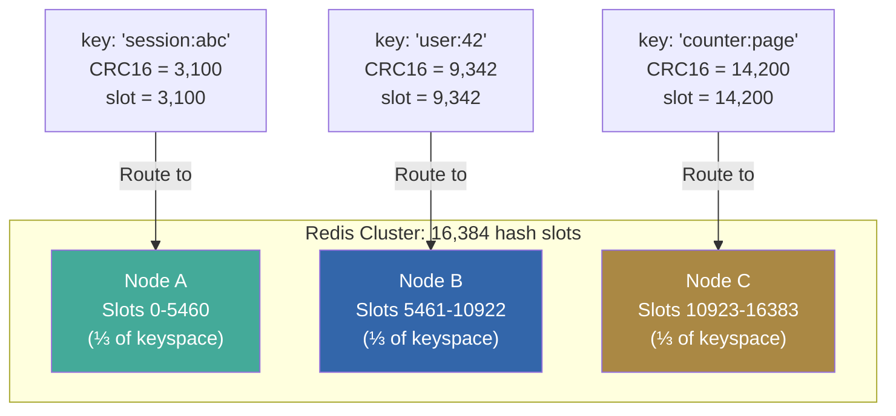
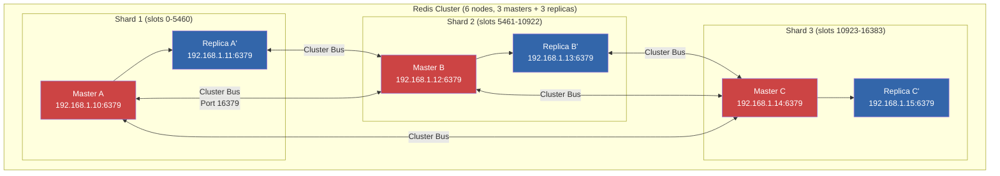
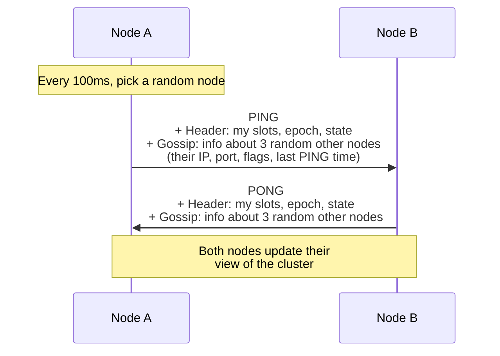
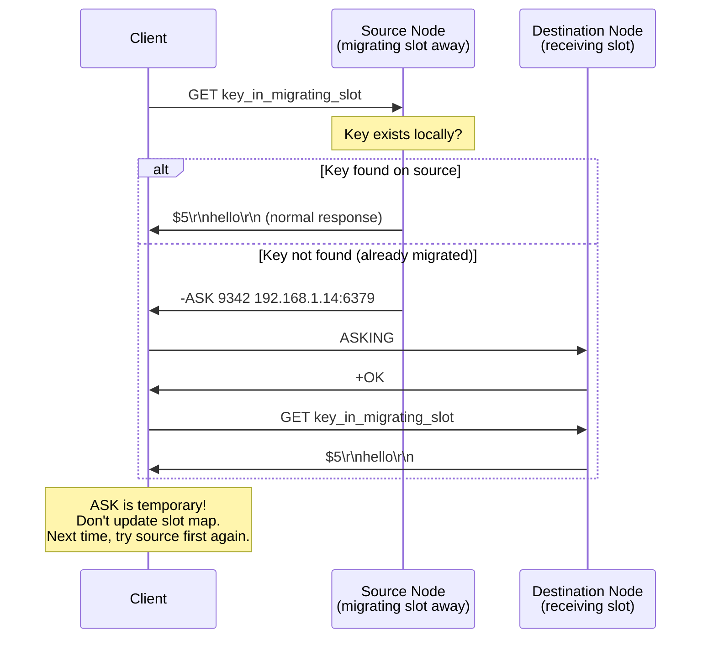
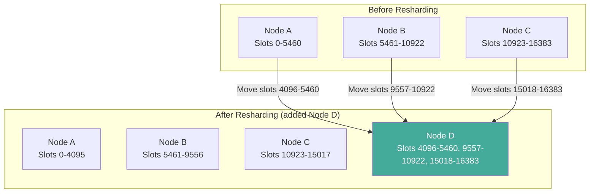
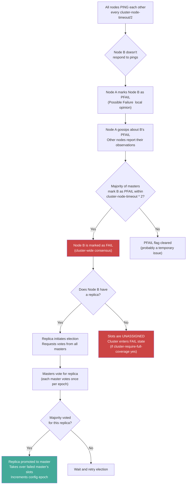
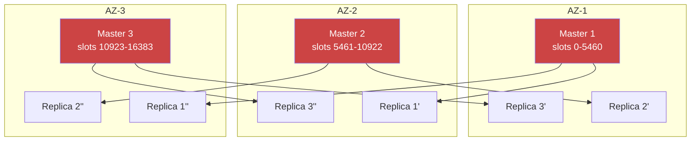

# Redis Deep Dive Series  Part 6: Redis Cluster and Distributed Systems Concepts

---

**Series:** Redis Deep Dive  Engineering the World's Most Misunderstood Data Structure Server
**Part:** 6 of 10
**Audience:** Senior backend engineers, distributed systems engineers, infrastructure architects
**Reading time:** ~50 minutes

---

## Where We Are in the Series

Part 5 introduced the distributed world: replication copies data from one master to multiple replicas, and Sentinel automates failover when the master dies. This solved the *availability* problem  your Redis deployment survives a single node failure.

But Sentinel doesn't solve the *capacity* problem. You still have one master holding all the data. Its memory is bounded by a single machine. Its write throughput is bounded by a single thread. When your dataset exceeds 100 GB, or your write load exceeds 200,000 ops/sec, Sentinel + replicas can't help  you need to split the data across multiple masters.

Redis Cluster is Redis's built-in sharding solution. This part covers the complete architecture: the 16,384 hash slot model that distributes keys, the gossip protocol that coordinates nodes, the resharding process that rebalances data, and the consistency tradeoffs (spoiler: Redis Cluster prioritizes availability over consistency in a partition) that you must understand before deploying Cluster in production.

---

## 1. Why Cluster? The Limits of Single-Master

### Scaling Walls

A single Redis master hits three walls:

1. **Memory wall:** A single machine can hold 256-512 GB of RAM practically. If your dataset exceeds this, you need multiple machines.

2. **CPU wall:** Command execution is single-threaded. One core can handle ~100,000-500,000 ops/sec depending on command complexity. For write-heavy workloads, this is the bottleneck.

3. **Network wall:** Even with threaded I/O, a single instance maxes out at ~10-25 Gbps. For workloads with large values, this can be the limit.

### Sharding Approaches

Before Cluster, engineers sharded Redis manually:

| Approach | How It Works | Drawbacks |
|---|---|---|
| **Client-side sharding** | Client hashes the key and routes to the correct Redis instance | No automatic rebalancing; client must know all instances; no multi-key operations across shards |
| **Proxy-based sharding** (Twemproxy, Codis) | A proxy layer hashes and routes commands | Added latency hop; single point of failure; operational complexity |
| **Redis Cluster** | Built-in: nodes know the hash slot mapping and redirect clients | Limited multi-key support; more complex client library requirements |

Redis Cluster is the official solution and the one most new deployments should use.

---

## 2. Hash Slots: The Data Distribution Model

### 16,384 Hash Slots

Redis Cluster divides the keyspace into **16,384 hash slots** (numbered 0 to 16,383). Each key belongs to exactly one slot, determined by:

```
slot = CRC16(key) mod 16384
```

Each cluster node is responsible for a subset of these slots. In a 3-master cluster:



### Why 16,384 Slots?

The number 16,384 (2^14) was chosen as a balance:
- **Enough slots for scalability:** 16,384 slots across even 1,000 nodes means ~16 slots per node (minimum practical distribution)
- **Small enough for efficient bitmap:** The cluster state includes a bitmap of slot assignments. 16,384 bits = 2 KB, which is transmitted in gossip messages. A larger number would increase gossip overhead.
- **Powers-of-two math:** CRC16 mod 16,384 is efficient

### Hash Tags: Controlling Slot Assignment

By default, the entire key is hashed. But sometimes you need related keys on the same slot (for multi-key operations). **Hash tags** solve this:

```bash
# Without hash tags: each key may land on different slots
SET user:42:name "Alice"       # slot = CRC16("user:42:name") mod 16384
SET user:42:email "a@b.com"    # slot = CRC16("user:42:email") mod 16384
# These could be on different nodes!

# With hash tags: only the content inside {} is hashed
SET {user:42}:name "Alice"     # slot = CRC16("user:42") mod 16384
SET {user:42}:email "a@b.com"  # slot = CRC16("user:42") mod 16384
# Same slot! Same node! Multi-key operations work!

# Now you can do:
MGET {user:42}:name {user:42}:email    # Works  same slot
```

**Warning:** Hash tags can create **hot slots** if many keys share the same tag. If `{user:42}` is a power user with millions of associated keys, all those keys land on one node.

```bash
# Find which slot a key belongs to:
127.0.0.1:6379> CLUSTER KEYSLOT user:42
(integer) 9342

127.0.0.1:6379> CLUSTER KEYSLOT {user:42}:name
(integer) 9342

127.0.0.1:6379> CLUSTER KEYSLOT {user:42}:email
(integer) 9342
```

Hash slots define *where* data lives. But how do the nodes coordinate? How does a node that just joined the cluster learn which other nodes exist and which slots they own? And how does the cluster detect failures without a central coordinator? The answer is the gossip protocol  a decentralized communication mechanism inspired by the way epidemics spread.

---

## 3. Cluster Topology and the Gossip Protocol

### Node Types

Each Redis Cluster node is either a **master** (owns hash slots, accepts reads/writes) or a **replica** (replicates a master, can serve reads with `READONLY`). Unlike Sentinel (Part 5), there's no separate monitoring process  every cluster node participates in failure detection and configuration propagation.



### The Cluster Bus

Every cluster node opens a second TCP port (by default: data port + 10000, e.g., 16379) for the **cluster bus**. This is a node-to-node binary protocol used for:

- **Gossip messages:** Sharing knowledge about other nodes' state
- **Failure detection:** PING/PONG heartbeats
- **Configuration updates:** Slot ownership changes
- **Failover coordination:** Voting for replica promotion

### Gossip Protocol: How Nodes Discover State

Redis Cluster uses a **gossip protocol** for decentralized state propagation. Each node periodically (every 100ms) selects a random node and exchanges gossip messages:



The gossip section of each message contains information about a subset of other nodes (typically 1/10th of all nodes, minimum 3). This creates **eventual consistency**  every node eventually learns about every other node, even in large clusters. The propagation time for a state change is approximately O(log N) message rounds, where N is the cluster size.

### Cluster State: Epochs and Configuration

Each cluster node maintains:

```bash
127.0.0.1:6379> CLUSTER INFO
cluster_enabled:1
cluster_state:ok                        # "ok" or "fail"
cluster_slots_assigned:16384            # All 16384 slots assigned?
cluster_slots_ok:16384                  # Slots with reachable masters
cluster_slots_pfail:0                   # Slots with PFAIL masters
cluster_slots_fail:0                    # Slots with FAIL masters
cluster_known_nodes:6                   # Total known nodes
cluster_size:3                          # Number of masters serving slots
cluster_current_epoch:6                 # Current configuration epoch
cluster_my_epoch:2                      # This node's config epoch
cluster_stats_messages_ping_sent:12345
cluster_stats_messages_pong_sent:12345
cluster_stats_messages_sent:24690
cluster_stats_messages_received:24690
```

**Configuration epochs** are monotonically increasing integers that represent the "version" of a node's configuration. When a slot ownership changes (e.g., during resharding or failover), the epoch increments. The highest epoch wins in conflicts  this is how cluster nodes resolve disagreements about slot ownership.

### CLUSTER NODES: The Full Picture

```bash
127.0.0.1:6379> CLUSTER NODES
07c37dfeb235213a872192d90877d0cd55635b91 192.168.1.10:6379@16379 myself,master - 0 0 1 connected 0-5460
67ed2db8d677e59ec4a4cefb06858cf2a1a89fa1 192.168.1.11:6379@16379 slave 07c37dfe... 0 0 1 connected
7e58b74d9872f38e4ac6a8e4e7f3a4cd3c3bf7a9 192.168.1.12:6379@16379 master - 0 0 2 connected 5461-10922
292f8b365bb7edb5e285caf0b7e6ddc7265d2f4f 192.168.1.13:6379@16379 slave 7e58b74d... 0 0 2 connected
783a29e2c274e4cd2c745d1e91c5ba7b7e6b2c8a 192.168.1.14:6379@16379 master - 0 0 3 connected 10923-16383
1a5c2e3d4f6a7b8c9d0e1f2a3b4c5d6e7f8a9b0c 192.168.1.15:6379@16379 slave 783a29e2... 0 0 3 connected
```

Each line contains: node ID, address, flags (master/slave, status), master ID (if slave), ping-sent, pong-recv, config epoch, link state, slot ranges.

We now know how data is distributed (hash slots) and how nodes coordinate (gossip). But what happens when a client connects to the "wrong" node  one that doesn't own the slot for the requested key? In a non-clustered setup, every key lives on the same node. In Cluster mode, the client needs to learn the slot-to-node mapping and handle redirections gracefully.

---

## 4. Client Redirection: MOVED and ASK

### MOVED: Permanent Redirection

When a client sends a command to a node that doesn't own the key's slot, the node responds with a `MOVED` error:

```bash
# Client connects to Node A (slots 0-5460)
# Sends a command for key in slot 9342 (owned by Node B)
127.0.0.1:6379> GET user:42
(error) MOVED 9342 192.168.1.12:6379
```

The client should:
1. Cache the slot-to-node mapping
2. Reconnect to the correct node
3. Retry the command
4. Future commands for slot 9342 go directly to Node B

Smart clients (like ioredis, redis-py, Jedis) automatically handle MOVED redirections and cache the slot map:

```python
from redis.cluster import RedisCluster

# redis-py cluster client handles redirections automatically
rc = RedisCluster(
    host='192.168.1.10',    # Any cluster node (seed node)
    port=6379,
    decode_responses=True
)

# Client internally:
# 1. Queries CLUSTER SLOTS to get full slot mapping
# 2. Routes commands to the correct node directly
# 3. On MOVED, updates slot map and retries
rc.set('user:42', 'Alice')   # Automatically routes to correct node
```

```javascript
// Node.js (ioredis)  built-in cluster support
const Redis = require('ioredis');

const cluster = new Redis.Cluster([
    { host: '192.168.1.10', port: 6379 },  // Seed nodes
    { host: '192.168.1.12', port: 6379 },
], {
    scaleReads: 'slave',           // Read from replicas
    enableReadyCheck: true,
    redisOptions: {
        password: 'your-password'
    },
    // Refresh slot mapping periodically
    slotsRefreshTimeout: 2000,
    slotsRefreshInterval: 5000,
});

// Automatic routing  client handles MOVED/ASK
await cluster.set('user:42', 'Alice');
const value = await cluster.get('user:42');
```

### ASK: Temporary Redirection (During Resharding)

During slot migration (resharding), a slot is in a transitional state  some keys are on the source node, some are on the destination. The `ASK` redirect handles this:



The difference between MOVED and ASK:
- **MOVED:** "This slot permanently lives on another node. Update your routing table."
- **ASK:** "This specific key might be on another node temporarily. Check there, but don't update your routing table  the migration is still in progress."

---

## 5. Resharding: Moving Slots Between Nodes

Resharding (moving hash slots from one node to another) is how you scale Redis Cluster  add a new node and move some slots to it.

### The Resharding Process



### Slot Migration Steps

For each slot being migrated from source to destination:

1. **Set slot state on destination:** `CLUSTER SETSLOT <slot> IMPORTING <source-node-id>`
2. **Set slot state on source:** `CLUSTER SETSLOT <slot> MIGRATING <destination-node-id>`
3. **Migrate keys one by one:** For each key in the slot on the source:
   ```bash
   MIGRATE <dest-host> <dest-port> <key> 0 <timeout> REPLACE
   ```
   `MIGRATE` atomically transfers a key: it serializes the value on the source, sends it to the destination, the destination loads it, and the source deletes it.
4. **Finalize:** `CLUSTER SETSLOT <slot> NODE <destination-node-id>` on all nodes

During migration:
- Reads for keys still on the source work normally
- Reads for keys already migrated return ASK redirections
- Writes to the migrating slot go to the source (unless the key was already migrated)

### Using redis-cli for Resharding

```bash
# Interactive resharding
redis-cli --cluster reshard 192.168.1.10:6379

# Automated resharding (move 4096 slots to new node)
redis-cli --cluster reshard 192.168.1.10:6379 \
    --cluster-from <source-node-id> \
    --cluster-to <destination-node-id> \
    --cluster-slots 4096 \
    --cluster-yes

# Add a new node to the cluster
redis-cli --cluster add-node 192.168.1.16:6379 192.168.1.10:6379

# Add a new replica
redis-cli --cluster add-node 192.168.1.17:6379 192.168.1.10:6379 \
    --cluster-slave --cluster-master-id <master-node-id>
```

### Resharding Performance Impact

Slot migration is **online**  the cluster continues serving requests during resharding. But there are performance implications:

1. **MIGRATE commands use the main thread.** Each key migration serializes the value and sends it over the network. Large values (>1 MB) can cause noticeable latency.

2. **ASK redirections add latency.** During migration, some requests require two round-trips instead of one.

3. **Network bandwidth.** Migrating 10 GB of data takes time. On a 1 Gbps link, ~80 seconds minimum.

**Best practice:** Reshard during low-traffic periods. Use `redis-cli --cluster reshard` with `--cluster-pipeline` to batch MIGRATE operations.

---

## 6. Cluster Failover

### Automatic Failover

Redis Cluster has built-in failure detection and failover  no Sentinel needed.



### Failover Timing

```bash
# cluster-node-timeout: how long before a node is considered failing
cluster-node-timeout 15000    # Default: 15 seconds

# Typical failover timeline:
# T=0:       Master B becomes unreachable
# T=7.5s:    Nodes start marking B as PFAIL (timeout/2)
# T=15s:     Majority of masters agree B is PFAIL → FAIL
# T=15-16s:  Replica of B starts election
# T=16-17s:  Replica wins election, promoted to master
# T=17s:     Cluster is fully operational again
#
# Total failover time: ~15-17 seconds with default settings
```

Reducing `cluster-node-timeout` to 5000ms reduces failover time to ~5-7 seconds but increases the risk of false positives (marking healthy nodes as failed due to temporary network delays).

### Manual Failover

```bash
# On the replica you want to promote:
127.0.0.1:6380> CLUSTER FAILOVER
OK
# The replica waits for the master to be in sync,
# then promotes itself. Zero data loss.

# Force failover (when master is unreachable):
127.0.0.1:6380> CLUSTER FAILOVER FORCE
OK
# Promotes immediately without waiting for master sync.
# May lose data that the master had but the replica didn't.

# Takeover (when even other masters are unreachable):
127.0.0.1:6380> CLUSTER FAILOVER TAKEOVER
OK
# Doesn't require voting. Uses in extreme scenarios only.
```

---

## 7. Consistency Guarantees in Cluster Mode

### Write Safety

Redis Cluster provides **no strong consistency guarantees**. Writes can be lost in two scenarios:

#### Scenario 1: Asynchronous Replication Loss

```
T=0:   Client writes to Master B → Master B responds +OK
T=1ms: Master B crashes before replicating the write
       → Write is lost
       → Replica B' is promoted, doesn't have the write
```

This is the same as standalone replication (Part 5). WAIT can reduce but not eliminate this window.

#### Scenario 2: Network Partition

```
Partition:
  Side A: Master B + Client (minority partition)
  Side B: All other masters + Replica B' (majority partition)

Side B: Replica B' is promoted to master (has majority)
Side A: Master B still accepts writes from Client (doesn't know about partition)

After partition heals:
  Master B becomes replica of B'
  All writes to Master B during partition are LOST
```

**Mitigation:** `cluster-node-timeout` bounds the window. After `cluster-node-timeout` seconds, nodes in the minority partition stop accepting writes (because they can't reach a majority). However, writes during the initial detection window are still at risk.

### Cluster-Allow-Reads-When-Down

```bash
# Default: cluster enters FAIL state if any slot is uncovered
cluster-require-full-coverage yes

# Allow reads even when some slots are down
cluster-require-full-coverage no
# Reads to healthy slots still work; reads to failed slots return errors

# Redis 7.0+: fine-grained control
cluster-allow-reads-when-down yes   # Allow reads even on failing nodes
cluster-allow-pubsubshard-when-down yes
```

---

## 8. Multi-Key Operations in Cluster

### The Cross-Slot Problem

In Cluster mode, commands that operate on multiple keys require **all keys to be in the same hash slot**:

```bash
# Works  same hash tag → same slot
MGET {user:42}:name {user:42}:email

# Fails  different slots
MGET user:42:name user:43:name
(error) CROSSSLOT Keys in request don't hash to the same slot
```

Commands affected: `MGET`, `MSET`, `DEL` (multi-key), `SUNION`, `SINTER`, `SDIFF`, `ZUNIONSTORE`, `ZINTERSTORE`, `RENAME`, `RPOPLPUSH`, and any Lua script accessing multiple keys.

### Workarounds

#### 1. Hash Tags

```python
# Group related keys with hash tags
def get_user_profile(rc, user_id):
    pipe = rc.pipeline()
    pipe.hgetall(f"{{user:{user_id}}}:profile")
    pipe.smembers(f"{{user:{user_id}}}:friends")
    pipe.zrevrange(f"{{user:{user_id}}}:posts", 0, 9)
    return pipe.execute()
```

#### 2. Client-Side Aggregation

```python
# For cross-slot operations, aggregate on the client
def multi_user_get(rc, user_ids):
    """Get data for multiple users across different slots."""
    pipe = rc.pipeline()
    for uid in user_ids:
        pipe.hgetall(f"user:{uid}")
    return pipe.execute()
    # redis-py cluster client handles multi-slot pipelines by
    # grouping commands by slot and pipelining to each node separately
```

#### 3. Lua Scripts (Same-Slot Only)

```lua
-- This only works if KEYS[1] and KEYS[2] are in the same slot
local a = redis.call('GET', KEYS[1])
local b = redis.call('GET', KEYS[2])
return a .. ':' .. b
```

### Cross-Slot Pipeline Support

Modern clients like `redis-py` and `ioredis` support pipelines across slots  they automatically split the pipeline into per-node sub-pipelines:

```python
# redis-py handles this transparently in cluster mode
rc = RedisCluster(host='localhost', port=6379)
pipe = rc.pipeline()

# These keys are on different slots/nodes
for i in range(1000):
    pipe.set(f"key:{i}", f"value:{i}")

results = pipe.execute()
# Internally: groups commands by slot → sends to correct nodes → merges results
```

---

## 9. Cluster Administration

### Creating a Cluster

```bash
# Start 6 Redis instances (3 masters + 3 replicas)
redis-server --port 6379 --cluster-enabled yes --cluster-config-file nodes-6379.conf
redis-server --port 6380 --cluster-enabled yes --cluster-config-file nodes-6380.conf
redis-server --port 6381 --cluster-enabled yes --cluster-config-file nodes-6381.conf
redis-server --port 6382 --cluster-enabled yes --cluster-config-file nodes-6382.conf
redis-server --port 6383 --cluster-enabled yes --cluster-config-file nodes-6383.conf
redis-server --port 6384 --cluster-enabled yes --cluster-config-file nodes-6384.conf

# Create the cluster
redis-cli --cluster create \
    127.0.0.1:6379 127.0.0.1:6380 127.0.0.1:6381 \
    127.0.0.1:6382 127.0.0.1:6383 127.0.0.1:6384 \
    --cluster-replicas 1
```

### Cluster Health Checks

```bash
# Check cluster health
redis-cli --cluster check 192.168.1.10:6379

# Expected output:
# 192.168.1.10:6379 (07c37dfe...) -> 5461 keys | 5461 slots | 1 slaves
# 192.168.1.12:6379 (7e58b74d...) -> 5462 keys | 5462 slots | 1 slaves
# 192.168.1.14:6379 (783a29e2...) -> 5461 keys | 5461 slots | 1 slaves
# [OK] 16384 keys in 3 masters.
# [OK] All nodes agree about slots configuration.
# [OK] All 16384 slots covered.

# Fix cluster issues
redis-cli --cluster fix 192.168.1.10:6379

# Rebalance slots across nodes
redis-cli --cluster rebalance 192.168.1.10:6379
```

### Scaling Out: Adding Nodes

```bash
# 1. Start the new Redis instance with cluster mode
redis-server --port 6385 --cluster-enabled yes --cluster-config-file nodes-6385.conf

# 2. Add it to the cluster (as empty master)
redis-cli --cluster add-node 192.168.1.16:6385 192.168.1.10:6379

# 3. Reshard slots to the new node
redis-cli --cluster reshard 192.168.1.10:6379

# 4. Add a replica for the new master
redis-cli --cluster add-node 192.168.1.17:6386 192.168.1.10:6379 \
    --cluster-slave --cluster-master-id <new-master-node-id>
```

### Scaling In: Removing Nodes

```bash
# 1. Reshard all slots away from the node being removed
redis-cli --cluster reshard 192.168.1.10:6379 \
    --cluster-from <removing-node-id> \
    --cluster-to <destination-node-id> \
    --cluster-slots 5461 \
    --cluster-yes

# 2. Remove the empty node
redis-cli --cluster del-node 192.168.1.10:6379 <removing-node-id>
```

---

## 10. Cluster Configuration

### Essential Settings

```bash
# Enable cluster mode
cluster-enabled yes

# Cluster state file (auto-maintained by Redis)
cluster-config-file nodes-6379.conf

# Failure detection timeout
cluster-node-timeout 15000          # 15 seconds (default)

# Should all 16384 slots be covered for cluster to accept writes?
cluster-require-full-coverage yes    # Default: yes
# Set to "no" for availability over consistency

# Allow reads even when node's master is down
cluster-allow-reads-when-down no

# Replica migration: automatically rebalance replicas
# If a master has 2+ replicas and another master has 0,
# one replica migrates to the orphaned master
cluster-migration-barrier 1          # Keep at least 1 replica per master

# Cluster bus port
cluster-port 16379                   # Default: data port + 10000

# Announce IP/port (for NAT/Docker/Kubernetes)
cluster-announce-ip 10.0.1.10
cluster-announce-port 6379
cluster-announce-bus-port 16379
```

---

## 11. Cluster vs Sentinel: When to Use Which

| Dimension | Sentinel | Cluster |
|---|---|---|
| **Use case** | High availability for a single shard | Horizontal scaling + high availability |
| **Data model** | All data on one master | Data sharded across multiple masters |
| **Max data size** | Limited by single machine's RAM | Sum of all masters' RAM |
| **Max write throughput** | Single-core limited | Scales with masters |
| **Multi-key operations** | Full support (single node) | Same-slot only (hash tags) |
| **Operational complexity** | Lower | Higher |
| **Minimum nodes** | 3 Sentinels + 1 master + 1 replica = 5 | 3 masters + 3 replicas = 6 |
| **Client support** | Most clients support Sentinel | Most modern clients support Cluster |
| **Lua scripting** | Unrestricted | Same-slot keys only |
| **Transactions** | Full MULTI/EXEC | Same-slot keys only |

**Choose Sentinel when:**
- Your dataset fits on one machine
- You need full multi-key operation support
- Operational simplicity is a priority
- You need complex Lua scripts or transactions across many keys

**Choose Cluster when:**
- Your dataset exceeds single-machine RAM
- You need to scale write throughput beyond one core
- You can design your data model around hash tags
- You're running at scale where horizontal scaling is necessary

---

## 12. Production Deployment Patterns

### Pattern 1: Single-Region Cluster



**Key principle:** Distribute masters and their replicas across different availability zones. If AZ-1 goes down, replicas in AZ-2 and AZ-3 can be promoted.

### Pattern 2: Read Scaling with Replica Reads

```bash
# On the client side, direct reads to replicas
# ioredis:
const cluster = new Redis.Cluster([...], {
    scaleReads: 'slave',     // Read from replicas
    // Options: 'master' (default), 'slave', 'all'
});

# redis-py:
from redis.cluster import RedisCluster
rc = RedisCluster(host='...', port=6379, read_from_replicas=True)
```

On the replica:
```bash
# Replicas must be told to accept reads (cluster mode)
127.0.0.1:6380> READONLY
OK
# Now this replica serves reads for its master's slots
```

### Kubernetes Deployment Considerations

```bash
# Essential for Kubernetes:
cluster-announce-ip <pod-ip>          # Pod IP, not container-local
cluster-announce-port 6379
cluster-announce-bus-port 16379

# Use StatefulSet for stable network identities
# Use PersistentVolumeClaims for data persistence
# Use headless Service for DNS-based discovery
```

---

## 13. Real-World Failure Scenarios

### Scenario 1: Hot Slot

**Problem:** All keys for a popular feature use the hash tag `{trending}`, putting thousands of QPS on one slot (one node).

**Symptoms:** One master at 100% CPU; others at 20%.

**Fix:** Distribute the data across slots:
```python
# Instead of: {trending}:item:42
# Use: trending:{42}:item  (42 distributes across slots)
# Or: shard the data manually across multiple slot groups
```

### Scenario 2: Cluster FAIL During Resharding

**Problem:** A master fails while slots are being migrated to it. The migrating slots are in an intermediate state.

**Fix:** `redis-cli --cluster fix` automatically resolves stuck migrations by completing or reverting them.

### Scenario 3: Full Resync Storm After Network Partition

**Problem:** A network partition lasting 60 seconds causes all replicas in one AZ to disconnect. When the partition heals, all replicas need to resync. If the backlog is too small, full resyncs trigger, causing massive I/O and memory pressure.

**Fix:**
```bash
# Size backlog for expected partition duration
repl-backlog-size 1gb

# Limit concurrent syncs
cluster-migration-barrier 1
```

---

## 14. Best Practices Summary

1. **Minimum 6 nodes** for a production cluster (3 masters + 3 replicas). Distribute across AZs.

2. **Design your key schema around hash tags** from day one. Retrofitting hash tags into an existing key schema is painful.

3. **Size `cluster-node-timeout`** based on your availability requirements. Lower = faster failover but more false positives.

4. **Monitor slot distribution** to avoid hot spots. Use `redis-cli --cluster check` regularly.

5. **Set `cluster-require-full-coverage no`** if you can tolerate partial failures (most applications can).

6. **Use `READONLY` on replicas** for read scaling. Modern cluster clients handle this automatically.

7. **Size the replication backlog generously** (`repl-backlog-size`) to avoid full resyncs after network issues.

8. **Test resharding in staging** before production. Understand the performance impact.

9. **Use `cluster-migration-barrier 1`** to ensure every master always has at least one replica.

10. **Don't over-shard.** Start with the minimum number of masters needed. You can always add more. Over-sharding increases operational complexity without benefit.

---

## Coming Up in Part 7: Advanced Use Cases and Real-World System Design Patterns

Parts 1-6 built your understanding of *how Redis works*  from the event loop and data structures through memory management, persistence, replication, and clustering. You now understand the complete infrastructure story: a single Redis instance, replicated for availability, potentially clustered for scale.

Part 7 shifts perspective entirely: from *how Redis works* to *how engineers use Redis to solve real problems*. We'll take the concepts from every previous part  Lua scripting (Part 4), consistency guarantees (Part 5), hash tags (Part 6)  and apply them to concrete system design patterns:

- **Distributed locking**  the simple lock, Redlock algorithm, fencing tokens, and Martin Kleppmann's famous critique
- **Rate limiting**  fixed window, sliding window, and token bucket implementations using Lua scripts
- **Caching patterns**  cache-aside, write-through, write-behind, and the cache stampede problem
- **Real-time analytics**  using HyperLogLog (Part 2), bitmaps, and sorted sets for dashboards
- **Job queues**  from simple lists to Streams with consumer groups
- **How Netflix, Uber, Twitter, GitHub, Instagram, and Cloudflare use Redis**  real architecture patterns at scale

---

*This is Part 6 of the Redis Deep Dive series. Parts 5-6 form the "distributed Redis" duo: replication/Sentinel for availability, Cluster for horizontal scaling. Part 7 takes everything we've built and applies it to real-world engineering challenges.*
