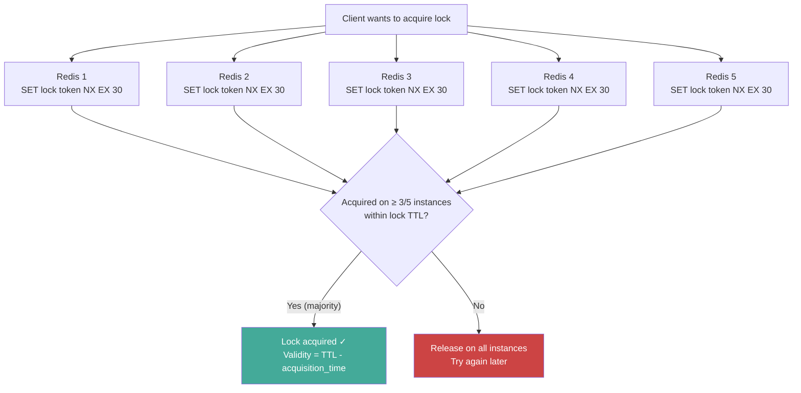
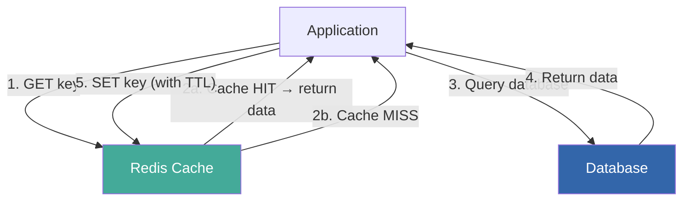
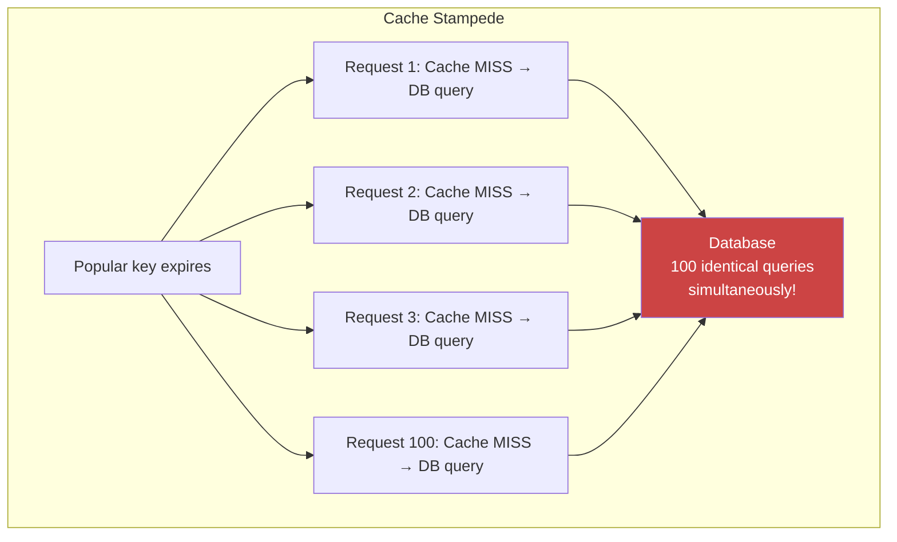
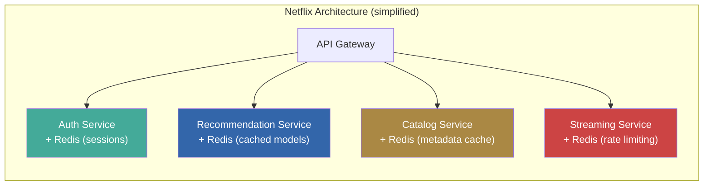

# Redis Deep Dive Series  Part 7: Advanced Use Cases and Real-World System Design Patterns

---

**Series:** Redis Deep Dive  Engineering the World's Most Misunderstood Data Structure Server
**Part:** 7 of 10
**Audience:** Senior backend engineers, distributed systems engineers, infrastructure architects
**Reading time:** ~55 minutes

---

## Where We Are in the Series

Parts 1-3 covered Redis's single-node internals: event loop, data structures, memory, and persistence. Part 4 showed you the client-facing layer: protocol, pipelining, transactions, and Lua scripting. Parts 5-6 took us into the distributed world: replication, Sentinel, and Cluster.

You now understand *how Redis works* at every layer  from the jemalloc size classes that store a single string to the gossip protocol that coordinates a 100-node cluster. This part answers the question that follows naturally: *what do you build with it?*

We'll cover the canonical Redis use cases in depth: distributed locking (and its famous controversies), rate limiting at scale, caching strategies that prevent stampedes, session management, real-time analytics, and job queues with delivery guarantees. For each pattern, we'll connect back to the internals  showing how the Lua scripting from Part 4, the consistency model from Part 5, and the hash tags from Part 6 make these patterns possible (and where they break down).

---

## 1. Distributed Locking

### The Problem

In distributed systems, multiple processes need to coordinate access to shared resources. A distributed lock ensures that only one process performs a critical section at a time  preventing double-processing, race conditions, and resource conflicts.

### Simple Lock (Single Redis Instance)

The simplest Redis lock uses `SET` with `NX` (only set if not exists) and `EX` (expiry):

```python
import redis
import uuid
import time

class SimpleRedisLock:
    def __init__(self, redis_client, name, timeout=10):
        self.r = redis_client
        self.name = f"lock:{name}"
        self.timeout = timeout
        self.token = str(uuid.uuid4())  # Unique token per lock holder

    def acquire(self, blocking=True, blocking_timeout=None):
        """Acquire the lock. Returns True if acquired."""
        start = time.time()
        while True:
            # SET NX EX: atomic "set if not exists" with expiry
            if self.r.set(self.name, self.token, nx=True, ex=self.timeout):
                return True
            if not blocking:
                return False
            if blocking_timeout and (time.time() - start) >= blocking_timeout:
                return False
            time.sleep(0.01)  # Retry every 10ms

    def release(self):
        """Release the lock. Only the holder can release."""
        # MUST use Lua for atomic check-and-delete
        # Otherwise: race condition between GET and DEL
        script = """
        if redis.call('GET', KEYS[1]) == ARGV[1] then
            return redis.call('DEL', KEYS[1])
        else
            return 0
        end
        """
        return self.r.eval(script, 1, self.name, self.token)

    def __enter__(self):
        if not self.acquire():
            raise Exception("Could not acquire lock")
        return self

    def __exit__(self, *args):
        self.release()

# Usage
r = redis.Redis()
with SimpleRedisLock(r, "payment-processing", timeout=30):
    process_payment()
```

**Why the unique token matters:** Without it, Process A could accidentally release Process B's lock:

```
T=0:   Process A acquires lock (token=A)
T=9.9s: Process A's work takes longer than expected
T=10s:  Lock expires (timeout=10s)
T=10.1s: Process B acquires lock (token=B)
T=10.2s: Process A finishes, calls DEL lock
         → Process A just released Process B's lock!
```

The Lua script prevents this by checking that the token matches before deleting.

### Redlock: Distributed Lock Across Multiple Instances

The simple lock has a single point of failure: if the Redis instance goes down, the lock is lost. **Redlock** extends locking across N independent Redis instances (recommended N=5):



```python
import redis
import time
import uuid

class Redlock:
    def __init__(self, redis_instances, retry_count=3, retry_delay=0.2):
        self.instances = redis_instances  # List of Redis connections
        self.quorum = len(redis_instances) // 2 + 1  # Majority
        self.retry_count = retry_count
        self.retry_delay = retry_delay

    def acquire(self, resource, ttl=30000):
        """Acquire lock on majority of instances. ttl in milliseconds."""
        token = str(uuid.uuid4())

        for attempt in range(self.retry_count):
            acquired = 0
            start_time = time.time() * 1000  # ms

            # Try to acquire on each instance
            for r in self.instances:
                try:
                    if r.set(f"lock:{resource}", token, nx=True, px=ttl):
                        acquired += 1
                except redis.RedisError:
                    pass  # Instance down  skip

            elapsed = time.time() * 1000 - start_time
            validity = ttl - elapsed  # Remaining lock validity

            if acquired >= self.quorum and validity > 0:
                return {"token": token, "validity": validity}

            # Failed  release on all instances
            self._release_all(resource, token)
            time.sleep(self.retry_delay)

        return None  # Could not acquire lock

    def release(self, resource, token):
        self._release_all(resource, token)

    def _release_all(self, resource, token):
        script = """
        if redis.call('GET', KEYS[1]) == ARGV[1] then
            return redis.call('DEL', KEYS[1])
        end
        return 0
        """
        for r in self.instances:
            try:
                r.eval(script, 1, f"lock:{resource}", token)
            except redis.RedisError:
                pass

# Usage
instances = [redis.Redis(host=h) for h in ['redis1', 'redis2', 'redis3', 'redis4', 'redis5']]
lock = Redlock(instances)

result = lock.acquire("payment:order:42", ttl=30000)
if result:
    try:
        process_payment()
    finally:
        lock.release("payment:order:42", result["token"])
```

### The Redlock Controversy

Martin Kleppmann's famous critique ("How to do distributed locking") identified several concerns:

1. **Clock drift:** Redlock assumes reasonable clock behavior. If a Redis instance's clock jumps forward, it might expire a lock early.

2. **Process pauses:** If a client acquires a lock, then gets paused (GC, page fault, swap), the lock might expire before the client uses it  and another client acquires it.

3. **Network delays:** Long network delays can cause a client to believe it has a valid lock when it's already expired.

**When Redlock is appropriate:**
- Efficiency locks (preventing duplicate work  if two workers process the same job, it's wasteful but not catastrophic)
- Best-effort mutual exclusion

**When Redlock is NOT appropriate:**
- Correctness locks (where violations cause data corruption or financial loss)
- Use a consensus system instead (ZooKeeper, etcd, or a database with serializable transactions)

### Lock Pattern: Fencing Tokens

To protect against process pauses, use **fencing tokens**  a monotonically increasing counter that the lock service provides:

```python
# Lock with fencing token
FENCING_SCRIPT = """
local lock_key = KEYS[1]
local token_key = KEYS[2]
local value = ARGV[1]
local ttl = ARGV[2]

if redis.call('SET', lock_key, value, 'NX', 'PX', ttl) then
    local fence = redis.call('INCR', token_key)
    return fence
end
return nil
"""

def acquire_with_fence(r, resource, ttl=30000):
    token = str(uuid.uuid4())
    fence = r.eval(FENCING_SCRIPT, 2,
                   f"lock:{resource}",
                   f"fence:{resource}",
                   token, ttl)
    if fence:
        return {"token": token, "fence": int(fence)}
    return None

# The downstream service rejects requests with stale fencing tokens:
# if request.fence_token < last_seen_fence_token:
#     reject()  # This request is from a stale lock holder
```

Distributed locking is about *mutual exclusion*  ensuring only one process runs a critical section. Rate limiting is about *throttling*  ensuring a resource isn't overwhelmed. Both rely heavily on Redis's atomicity guarantees (Part 4's Lua scripting) and sub-millisecond latency, but rate limiting is more forgiving of the consistency gaps we identified in Part 5.

---

## 2. Rate Limiting

### Pattern 1: Fixed Window Counter

The simplest rate limiter: count requests in fixed time windows.

```python
def fixed_window_rate_limit(r, key, limit, window_seconds):
    """Allow `limit` requests per `window_seconds`."""
    current = r.incr(key)
    if current == 1:
        r.expire(key, window_seconds)
    return current <= limit

# Usage
allowed = fixed_window_rate_limit(r, f"ratelimit:{user_id}:{minute}", 100, 60)
```

**Problem:** Boundary burst. At 23:59:59, a user sends 100 requests (allowed). At 00:00:01, they send 100 more (new window, allowed). Result: 200 requests in 2 seconds.

### Pattern 2: Sliding Window Log

Track every request timestamp; count requests within the window.

```python
SLIDING_WINDOW_SCRIPT = """
local key = KEYS[1]
local now = tonumber(ARGV[1])
local window = tonumber(ARGV[2])
local limit = tonumber(ARGV[3])

-- Remove entries outside the window
redis.call('ZREMRANGEBYSCORE', key, 0, now - window)

-- Count current entries
local count = redis.call('ZCARD', key)

if count < limit then
    -- Add this request
    redis.call('ZADD', key, now, now .. ':' .. math.random(1000000))
    redis.call('PEXPIRE', key, window)
    return 1  -- Allowed
else
    return 0  -- Rate limited
end
"""

class SlidingWindowRateLimiter:
    def __init__(self, r, max_requests, window_ms):
        self.r = r
        self.max_requests = max_requests
        self.window_ms = window_ms
        self.sha = r.script_load(SLIDING_WINDOW_SCRIPT)

    def is_allowed(self, identifier):
        now_ms = int(time.time() * 1000)
        return bool(self.r.evalsha(
            self.sha, 1,
            f"ratelimit:{identifier}",
            now_ms, self.window_ms, self.max_requests
        ))

# 100 requests per 60 seconds, sliding window
limiter = SlidingWindowRateLimiter(r, max_requests=100, window_ms=60000)
if limiter.is_allowed("user:42"):
    serve_request()
else:
    return_429()
```

**Memory cost:** One sorted set entry per request. For 1000 requests/minute × 1M users with active rate limits = ~1 billion entries. This can be expensive. Use fixed window or token bucket for high-volume scenarios.

### Pattern 3: Token Bucket

```python
TOKEN_BUCKET_SCRIPT = """
local key = KEYS[1]
local max_tokens = tonumber(ARGV[1])
local refill_rate = tonumber(ARGV[2])  -- tokens per second
local now = tonumber(ARGV[3])
local requested = tonumber(ARGV[4])

local bucket = redis.call('HMGET', key, 'tokens', 'last_refill')
local tokens = tonumber(bucket[1]) or max_tokens
local last_refill = tonumber(bucket[2]) or now

-- Calculate tokens to add since last refill
local elapsed = now - last_refill
local new_tokens = math.min(max_tokens, tokens + elapsed * refill_rate)

if new_tokens >= requested then
    new_tokens = new_tokens - requested
    redis.call('HMSET', key, 'tokens', new_tokens, 'last_refill', now)
    redis.call('PEXPIRE', key, math.ceil(max_tokens / refill_rate * 1000) + 1000)
    return 1  -- Allowed
else
    redis.call('HMSET', key, 'tokens', new_tokens, 'last_refill', now)
    redis.call('PEXPIRE', key, math.ceil(max_tokens / refill_rate * 1000) + 1000)
    return 0  -- Rate limited
end
"""
```

Token bucket allows bursts (up to `max_tokens`) while maintaining a long-term rate. This is what most API rate limiters use  it's the pattern behind GitHub's API rate limiting, Stripe's rate limits, and Cloudflare's rate limiting.

### How Companies Implement Rate Limiting

**Cloudflare:** Uses a combination of in-memory counters at the edge and Redis for state coordination. Each PoP maintains local counters; Redis provides global coordination for per-account limits.

**GitHub:** Uses Redis-backed token bucket for API rate limiting. Each authenticated request checks the bucket; the `X-RateLimit-Remaining` header shows the token count.

**Stripe:** Uses a sliding window approach with Redis for tracking per-API-key request rates.

Distributed locking and rate limiting are *coordination* patterns  they use Redis's atomicity to enforce rules. Caching is fundamentally different: it's about *performance*  keeping frequently accessed data close to your application so you don't hit your database. Caching was Redis's original use case (Part 0, Section 1), and it remains the most common one. But doing it well requires understanding invalidation, consistency, and failure modes.

---

## 3. Caching Patterns

### Pattern 1: Cache-Aside (Lazy Loading)

The most common caching pattern. Part 0, Section 1 showed the basic flow; here we cover the implementation details and failure modes:



```python
def get_user(user_id):
    cache_key = f"user:{user_id}"

    # Step 1: Check cache
    cached = r.get(cache_key)
    if cached:
        return json.loads(cached)  # Cache hit

    # Step 2: Cache miss  query database
    user = db.query("SELECT * FROM users WHERE id = %s", user_id)

    # Step 3: Populate cache with TTL
    r.setex(cache_key, 3600, json.dumps(user))  # Cache for 1 hour

    return user
```

**Advantages:** Simple, only caches what's actually requested, cache misses are lazy
**Disadvantages:** First request always slow (cache miss), stale data possible until TTL expires

### Pattern 2: Write-Through

Write to both cache and database on every write:

```python
def update_user(user_id, data):
    # Update database
    db.execute("UPDATE users SET ... WHERE id = %s", user_id)

    # Update cache
    r.setex(f"user:{user_id}", 3600, json.dumps(data))
```

**Advantages:** Cache is always up-to-date
**Disadvantages:** Write latency increases (must write to both); cache may contain data that's never read

### Pattern 3: Write-Behind (Write-Back)

Write to cache first; asynchronously flush to database:

```python
def update_user(user_id, data):
    # Write to cache immediately
    r.setex(f"user:{user_id}", 3600, json.dumps(data))

    # Queue for async database write
    r.rpush("write_queue", json.dumps({
        "table": "users",
        "id": user_id,
        "data": data,
        "timestamp": time.time()
    }))

# Background worker: process write queue
def write_behind_worker():
    while True:
        item = r.blpop("write_queue", timeout=1)
        if item:
            write_to_database(json.loads(item[1]))
```

**Advantages:** Very fast writes (only cache hit), database write batching possible
**Disadvantages:** Data loss risk (cache crash before flush), complexity, eventual consistency

### Cache Stampede Prevention

A **cache stampede** (thundering herd) occurs when a popular cached item expires and hundreds of requests simultaneously miss the cache and hit the database.



#### Solution 1: Lock-Based Recomputation

```python
def get_with_lock(key, compute_fn, ttl=3600, lock_timeout=5):
    """Only one process recomputes; others wait or get stale data."""
    cached = r.get(key)
    if cached:
        return json.loads(cached)

    lock_key = f"lock:recompute:{key}"
    lock = SimpleRedisLock(r, lock_key, timeout=lock_timeout)

    if lock.acquire(blocking=False):
        try:
            # Recompute and cache
            value = compute_fn()
            r.setex(key, ttl, json.dumps(value))
            return value
        finally:
            lock.release()
    else:
        # Another process is recomputing  wait and retry
        time.sleep(0.1)
        cached = r.get(key)
        if cached:
            return json.loads(cached)
        return compute_fn()  # Fallback
```

#### Solution 2: Probabilistic Early Expiration

Recompute the cache before it expires, with increasing probability as TTL approaches zero:

```python
import math
import random

def get_with_early_recompute(key, compute_fn, ttl=3600, beta=1.0):
    """Probabilistic early recomputation (XFetch algorithm)."""
    value = r.get(key)
    remaining_ttl = r.ttl(key)

    if value and remaining_ttl > 0:
        # Should we recompute early?
        # As TTL decreases, probability of recompute increases
        delta = ttl * beta
        if remaining_ttl - delta * math.log(random.random()) > 0:
            return json.loads(value)  # Still fresh enough

    # Recompute
    new_value = compute_fn()
    r.setex(key, ttl, json.dumps(new_value))
    return new_value
```

#### Solution 3: Background Refresh

Don't let keys expire  proactively refresh them:

```python
# Background worker refreshes popular keys before they expire
def cache_refresher():
    while True:
        for key in get_popular_keys():
            ttl = r.ttl(key)
            if ttl < 300:  # Less than 5 minutes remaining
                value = compute_value_for(key)
                r.setex(key, 3600, json.dumps(value))
        time.sleep(60)
```

### Cache Invalidation Patterns

**Event-Driven Invalidation:**
```python
# When data changes, publish invalidation event
def update_user(user_id, data):
    db.update(user_id, data)
    r.delete(f"user:{user_id}")       # Delete cached copy
    r.publish("cache:invalidate", f"user:{user_id}")  # Notify other instances
```

**Tag-Based Invalidation:**
```python
# Group related cache entries with tags
def cache_with_tags(key, value, tags, ttl=3600):
    pipe = r.pipeline()
    pipe.setex(key, ttl, value)
    for tag in tags:
        pipe.sadd(f"tag:{tag}", key)
        pipe.expire(f"tag:{tag}", ttl)
    pipe.execute()

def invalidate_tag(tag):
    """Invalidate all cache entries with this tag."""
    keys = r.smembers(f"tag:{tag}")
    if keys:
        r.delete(*keys)
    r.delete(f"tag:{tag}")

# Usage
cache_with_tags("product:42", product_json, ["products", "category:electronics"])
invalidate_tag("category:electronics")  # Invalidate all electronics products
```

---

## 4. Session Management

### Why Redis for Sessions

Traditional session storage options:
- **Server memory:** Doesn't work with multiple servers or horizontal scaling
- **Database:** Too slow for per-request reads (200-500µs per query vs ~100µs for Redis)
- **Cookie-based:** Size-limited (4 KB), security concerns, bandwidth overhead

Redis is ideal: sub-millisecond access, automatic TTL for session expiry, and shared across all application servers.

### Implementation

```python
import redis
import uuid
import json

class RedisSessionStore:
    def __init__(self, redis_client, prefix="session", ttl=1800):
        self.r = redis_client
        self.prefix = prefix
        self.ttl = ttl  # 30 minutes default

    def create(self, data=None):
        """Create a new session. Returns session ID."""
        session_id = str(uuid.uuid4())
        key = f"{self.prefix}:{session_id}"
        if data:
            self.r.hset(key, mapping=data)
        self.r.expire(key, self.ttl)
        return session_id

    def get(self, session_id):
        """Retrieve session data. Refreshes TTL."""
        key = f"{self.prefix}:{session_id}"
        data = self.r.hgetall(key)
        if data:
            self.r.expire(key, self.ttl)  # Refresh TTL on access
        return data or None

    def update(self, session_id, data):
        """Update session fields."""
        key = f"{self.prefix}:{session_id}"
        if self.r.exists(key):
            self.r.hset(key, mapping=data)
            self.r.expire(key, self.ttl)
            return True
        return False

    def destroy(self, session_id):
        """Delete a session."""
        return self.r.delete(f"{self.prefix}:{session_id}")

    def get_active_count(self):
        """Approximate count of active sessions."""
        count = 0
        cursor = 0
        while True:
            cursor, keys = self.r.scan(cursor, match=f"{self.prefix}:*", count=1000)
            count += len(keys)
            if cursor == 0:
                break
        return count
```

```javascript
// Node.js Express middleware with Redis sessions
const session = require('express-session');
const RedisStore = require('connect-redis').default;
const Redis = require('ioredis');

const redisClient = new Redis({
    host: 'redis-server',
    port: 6379,
});

app.use(session({
    store: new RedisStore({ client: redisClient }),
    secret: 'your-secret-key',
    resave: false,
    saveUninitialized: false,
    cookie: {
        secure: true,
        httpOnly: true,
        maxAge: 1800000,  // 30 minutes
        sameSite: 'strict'
    }
}));
```

### Session Scaling Considerations

- **Memory per session:** ~200-500 bytes for a typical web session (hash with 5-10 fields)
- **1 million concurrent sessions:** ~200-500 MB
- **Session TTL refresh:** Use `EXPIRE` on every access, not `GET` + `SETEX`
- **Session ID security:** Use cryptographically random IDs (UUID v4 or `secrets.token_hex(32)`). Never use predictable or sequential IDs.

The patterns above  locking, rate limiting, caching, sessions  are the "bread and butter" of Redis usage. The next two sections cover more specialized use cases that exploit Redis's unique data structures: the probabilistic types (HyperLogLog, bitmaps) we met in Part 2, and the Streams data type for event processing.

---

## 5. Real-Time Analytics

Part 2, Sections 8-9 introduced HyperLogLog and bitmaps at the data structure level. Here's how to put them to work for real-time analytics  dashboards that update in milliseconds, not minutes.

### Unique Visitor Counting with HyperLogLog

```python
from datetime import datetime

class AnalyticsTracker:
    def __init__(self, r):
        self.r = r

    def track_page_view(self, page, user_id):
        """Track unique visitors per page per hour. O(1) time, O(12KB) space max."""
        hour = datetime.now().strftime("%Y-%m-%d:%H")
        keys = [
            f"pageviews:{page}:hourly:{hour}",    # Per-hour unique visitors
            f"pageviews:{page}:daily:{hour[:10]}", # Per-day unique visitors
            f"pageviews:total:daily:{hour[:10]}",  # Total site unique visitors
        ]
        pipe = self.r.pipeline()
        for key in keys:
            pipe.pfadd(key, user_id)
            pipe.expire(key, 86400 * 30)  # Keep 30 days
        pipe.execute()

    def get_unique_visitors(self, page, date):
        """Get approximate unique visitor count. O(1)."""
        return self.r.pfcount(f"pageviews:{page}:daily:{date}")

    def get_unique_visitors_range(self, page, dates):
        """Get unique visitors across multiple days (merged). O(N)."""
        keys = [f"pageviews:{page}:daily:{d}" for d in dates]
        temp_key = f"temp:merge:{uuid.uuid4()}"
        self.r.pfmerge(temp_key, *keys)
        count = self.r.pfcount(temp_key)
        self.r.delete(temp_key)
        return count
```

### Daily Active Users with Bitmaps

```python
class DAUTracker:
    def __init__(self, r):
        self.r = r

    def mark_active(self, user_id, date=None):
        """Mark a user as active. O(1). 1 bit per user."""
        date = date or datetime.now().strftime("%Y-%m-%d")
        self.r.setbit(f"dau:{date}", user_id, 1)

    def is_active(self, user_id, date=None):
        """Check if user was active. O(1)."""
        date = date or datetime.now().strftime("%Y-%m-%d")
        return bool(self.r.getbit(f"dau:{date}", user_id))

    def count_active(self, date=None):
        """Count daily active users. O(N/8) where N = max user ID."""
        date = date or datetime.now().strftime("%Y-%m-%d")
        return self.r.bitcount(f"dau:{date}")

    def count_active_both_days(self, date1, date2):
        """Users active on BOTH days (AND). O(N/8)."""
        dest = f"temp:dau_and:{date1}:{date2}"
        self.r.bitop("AND", dest, f"dau:{date1}", f"dau:{date2}")
        count = self.r.bitcount(dest)
        self.r.delete(dest)
        return count

    def count_active_either_day(self, date1, date2):
        """Users active on EITHER day (OR). O(N/8)."""
        dest = f"temp:dau_or:{date1}:{date2}"
        self.r.bitop("OR", dest, f"dau:{date1}", f"dau:{date2}")
        count = self.r.bitcount(dest)
        self.r.delete(dest)
        return count

    def retention_rate(self, date1, date2):
        """What % of day1 users returned on day2?"""
        day1_users = self.count_active(date1)
        both_days = self.count_active_both_days(date1, date2)
        return both_days / day1_users if day1_users > 0 else 0

# Memory: 10M users = 10M bits = 1.25 MB per day
# Compare: SET of user IDs = ~80 MB per day
```

### Real-Time Leaderboard

```python
class RealTimeLeaderboard:
    def __init__(self, r, name):
        self.r = r
        self.key = f"leaderboard:{name}"

    def update(self, player_id, score):
        """Update player score. O(log N)."""
        self.r.zadd(self.key, {player_id: score})

    def increment(self, player_id, delta):
        """Increment player score atomically. O(log N)."""
        return self.r.zincrby(self.key, delta, player_id)

    def get_rank(self, player_id):
        """Get player rank (0-indexed, 0 = top). O(log N)."""
        return self.r.zrevrank(self.key, player_id)

    def get_top(self, n=10):
        """Get top N players. O(log N + M)."""
        return self.r.zrevrange(self.key, 0, n - 1, withscores=True)

    def get_around_player(self, player_id, window=5):
        """Get players around a player's rank. O(log N + window)."""
        rank = self.r.zrevrank(self.key, player_id)
        if rank is None:
            return []
        start = max(0, rank - window)
        end = rank + window
        return self.r.zrevrange(self.key, start, end, withscores=True)

    def count_players(self):
        """Total players. O(1)."""
        return self.r.zcard(self.key)

    def get_percentile(self, player_id):
        """Player's percentile ranking. O(log N)."""
        rank = self.r.zrevrank(self.key, player_id)
        total = self.r.zcard(self.key)
        if rank is None or total == 0:
            return None
        return (1 - rank / total) * 100
```

---

## 6. Job Queues and Task Processing

Job queues are one of the most common Redis use cases, but also one of the most commonly *mis-implemented*. Part 2 showed that lists support O(1) push/pop at both ends, making them natural queues. But a production job queue needs more: acknowledgment, retry logic, dead-letter handling, and exactly-once processing. Redis Streams (Part 2, Section 7) address most of these gaps  but simple list-based queues are still appropriate for many workloads.

### Pattern 1: Simple Queue with Lists

```python
# Producer
def enqueue_job(queue_name, job_data):
    r.rpush(f"queue:{queue_name}", json.dumps(job_data))

# Consumer
def dequeue_job(queue_name, timeout=0):
    result = r.blpop(f"queue:{queue_name}", timeout=timeout)
    if result:
        return json.loads(result[1])
    return None
```

**Problem:** If the worker crashes after `BLPOP` but before completing the job, the job is lost.

### Pattern 2: Reliable Queue with BRPOPLPUSH

```python
def reliable_dequeue(queue_name, processing_queue, timeout=0):
    """Atomically move job from queue to processing list."""
    result = r.brpoplpush(
        f"queue:{queue_name}",
        f"processing:{processing_queue}",
        timeout=timeout
    )
    return json.loads(result) if result else None

def acknowledge_job(processing_queue, job_data):
    """Remove job from processing list after successful completion."""
    r.lrem(f"processing:{processing_queue}", 1, json.dumps(job_data))

def recover_stuck_jobs(processing_queue, queue_name, max_age_seconds=300):
    """Move stuck jobs (worker crashed) back to the main queue."""
    stuck_jobs = r.lrange(f"processing:{processing_queue}", 0, -1)
    for job in stuck_jobs:
        job_data = json.loads(job)
        if time.time() - job_data.get("enqueued_at", 0) > max_age_seconds:
            pipe = r.pipeline()
            pipe.lrem(f"processing:{processing_queue}", 1, job)
            pipe.rpush(f"queue:{queue_name}", job)
            pipe.execute()
```

### Pattern 3: Streams-Based Queue (Recommended)

Redis Streams provide the best queue semantics  consumer groups, acknowledgment, and dead letter handling:

```python
class StreamQueue:
    def __init__(self, r, stream_name, group_name):
        self.r = r
        self.stream = stream_name
        self.group = group_name
        self._ensure_group()

    def _ensure_group(self):
        try:
            self.r.xgroup_create(self.stream, self.group, id='0', mkstream=True)
        except redis.ResponseError as e:
            if "BUSYGROUP" not in str(e):
                raise  # Group already exists  OK

    def enqueue(self, data):
        """Add a job to the stream. O(1)."""
        return self.r.xadd(self.stream, data, maxlen=1000000)

    def dequeue(self, consumer_name, count=1, block_ms=5000):
        """Read new jobs for this consumer. O(log N)."""
        results = self.r.xreadgroup(
            self.group, consumer_name,
            {self.stream: '>'},
            count=count,
            block=block_ms
        )
        if results:
            return [(msg_id, fields) for stream, messages in results
                    for msg_id, fields in messages]
        return []

    def acknowledge(self, *message_ids):
        """Acknowledge processed messages. O(1) per message."""
        self.r.xack(self.stream, self.group, *message_ids)

    def get_pending(self, consumer_name=None, count=100):
        """Get pending (unacknowledged) messages."""
        if consumer_name:
            return self.r.xpending_range(
                self.stream, self.group,
                min='-', max='+',
                count=count,
                consumername=consumer_name
            )
        return self.r.xpending(self.stream, self.group)

    def claim_stale(self, consumer_name, min_idle_ms=60000, count=100):
        """Claim messages stuck with dead consumers."""
        return self.r.xautoclaim(
            self.stream, self.group, consumer_name,
            min_idle_time=min_idle_ms,
            start_id='0-0',
            count=count
        )

    def trim(self, maxlen=100000):
        """Trim old messages."""
        self.r.xtrim(self.stream, maxlen=maxlen)

# Worker
queue = StreamQueue(r, "jobs:emails", "email-workers")

while True:
    messages = queue.dequeue("worker-1", count=10, block_ms=5000)
    for msg_id, fields in messages:
        try:
            send_email(fields)
            queue.acknowledge(msg_id)
        except Exception as e:
            log.error(f"Failed to process {msg_id}: {e}")
            # Message stays in pending  will be retried or claimed
```

---

## 7. How Companies Use Redis

### Netflix: Session and Caching at Scale

Netflix uses Redis for:
- **Session storage:** Millions of concurrent user sessions stored in Redis with TTL-based expiry
- **Caching layer:** Cached API responses, metadata, and personalization data
- **Distributed data structures:** Rate limiting, feature flags, and A/B test assignments

Architecture pattern: Each microservice has its own Redis cluster, isolated by service boundary. Cross-service data sharing goes through APIs, not shared Redis instances.



### Twitter/X: Timeline and Fanout

Twitter uses Redis for:
- **Timeline caching:** Each user's home timeline is pre-computed and stored in a Redis list
- **Fanout on write:** When a user tweets, the tweet ID is fanned out to all followers' timeline lists in Redis
- **Rate limiting:** API rate limits enforced via Redis counters

The "fanout" pattern:
```python
def post_tweet(author_id, tweet_id):
    # Store tweet
    r.hset(f"tweet:{tweet_id}", mapping=tweet_data)

    # Fan out to all followers' timelines
    followers = get_follower_ids(author_id)
    pipe = r.pipeline()
    for follower_id in followers:
        pipe.lpush(f"timeline:{follower_id}", tweet_id)
        pipe.ltrim(f"timeline:{follower_id}", 0, 799)  # Keep last 800 tweets
    pipe.execute()

# For celebrities with millions of followers, fanout is done asynchronously
# via a job queue (also backed by Redis)
```

### GitHub: Cache and Feature Flags

GitHub uses Redis for:
- **Page fragment caching:** Rendered HTML fragments cached in Redis
- **Repository metadata:** Cached stats, contributor lists, and file trees
- **Feature flags:** Redis-backed feature flag system for gradual rollouts
- **Background job queues:** Resque (Ruby job queue backed by Redis)

### Uber: Geospatial and Real-Time

Uber uses Redis for:
- **Driver location tracking:** Geospatial indexes for nearby driver queries
- **Real-time dispatch:** Sorted sets for matching riders with drivers
- **Rate limiting:** Per-API, per-user, per-city rate limits
- **Surge pricing:** Real-time supply/demand calculations using Redis counters

```python
# Uber-like driver matching (simplified)
class DriverMatcher:
    def __init__(self, r):
        self.r = r

    def update_driver_location(self, driver_id, lat, lon, city):
        self.r.geoadd(f"drivers:{city}", (lon, lat, driver_id))
        self.r.setex(f"driver:active:{driver_id}", 60, "1")  # Active for 60s

    def find_nearest_drivers(self, lat, lon, city, radius_km=5, limit=10):
        candidates = self.r.geosearch(
            f"drivers:{city}",
            longitude=lon, latitude=lat,
            radius=radius_km, unit="km",
            sort="ASC", count=limit * 2,  # Over-fetch for filtering
            withcoord=True, withdist=True
        )
        # Filter to only active drivers
        active = []
        for member, dist, coord in candidates:
            if self.r.exists(f"driver:active:{member}"):
                active.append({"id": member, "distance_km": dist})
            if len(active) >= limit:
                break
        return active
```

### Instagram: Counter Storage Optimization

Instagram's famous use case: storing 300 million user ID → media count mappings. Using individual keys would require ~70 GB. By bucketing into hashes of ~1000 entries each (keeping under listpack threshold), they reduced memory to ~10 GB.

```python
# Instagram's hash-bucketing pattern
def set_media_count(user_id, count):
    bucket = user_id // 1000
    field = user_id % 1000
    r.hset(f"media_count:{bucket}", str(field), count)

def get_media_count(user_id):
    bucket = user_id // 1000
    field = user_id % 1000
    return r.hget(f"media_count:{bucket}", str(field))
```

### Cloudflare: Edge Rate Limiting

Cloudflare uses Redis at the edge for:
- **Per-IP rate limiting:** Sliding window counters per IP per endpoint
- **Bot detection:** Tracking request patterns using sorted sets
- **DDoS mitigation:** Real-time counting and threshold detection

---

## 8. Feature Flags

```python
class FeatureFlags:
    def __init__(self, r, prefix="feature"):
        self.r = r
        self.prefix = prefix

    def enable(self, flag, percentage=100):
        """Enable a feature flag."""
        self.r.hset(f"{self.prefix}:{flag}", mapping={
            "enabled": "1",
            "percentage": str(percentage),
            "updated_at": str(time.time())
        })

    def disable(self, flag):
        self.r.hset(f"{self.prefix}:{flag}", "enabled", "0")

    def is_enabled(self, flag, user_id=None):
        """Check if a feature is enabled for a user."""
        data = self.r.hgetall(f"{self.prefix}:{flag}")
        if not data or data.get(b"enabled") != b"1":
            return False

        percentage = int(data.get(b"percentage", b"100"))
        if percentage >= 100:
            return True

        if user_id:
            # Deterministic assignment: same user always gets same result
            import hashlib
            hash_val = int(hashlib.md5(
                f"{flag}:{user_id}".encode()
            ).hexdigest(), 16) % 100
            return hash_val < percentage

        return False

    def enable_for_users(self, flag, user_ids):
        """Enable for specific users."""
        self.r.sadd(f"{self.prefix}:{flag}:users", *user_ids)

    def is_enabled_for_user(self, flag, user_id):
        """Check specific user enablement."""
        if self.r.sismember(f"{self.prefix}:{flag}:users", user_id):
            return True
        return self.is_enabled(flag, user_id)
```

---

## 9. Pub/Sub for Cache Invalidation

A common pattern in multi-instance deployments: each application server maintains a local in-memory cache (L1) backed by Redis (L2). When data changes, use Redis pub/sub to invalidate L1 across all instances.

```python
import threading
from functools import lru_cache

class TwoLevelCache:
    def __init__(self, r, l1_max_size=10000):
        self.r = r
        self.l1 = {}  # Local in-memory cache
        self.l1_max_size = l1_max_size
        self._start_invalidation_listener()

    def _start_invalidation_listener(self):
        def listener():
            pubsub = self.r.pubsub()
            pubsub.subscribe("cache:invalidate")
            for message in pubsub.listen():
                if message["type"] == "message":
                    key = message["data"].decode()
                    self.l1.pop(key, None)

        thread = threading.Thread(target=listener, daemon=True)
        thread.start()

    def get(self, key):
        # L1 check (local memory  nanoseconds)
        if key in self.l1:
            return self.l1[key]

        # L2 check (Redis  ~100 microseconds)
        value = self.r.get(key)
        if value:
            self.l1[key] = value
            return value

        return None

    def set(self, key, value, ttl=3600):
        # Update both levels
        self.r.setex(key, ttl, value)
        self.l1[key] = value

    def invalidate(self, key):
        # Delete from L2 and notify all instances to clear L1
        self.r.delete(key)
        self.r.publish("cache:invalidate", key)
```

---

## 10. Best Practices Summary

1. **Use Lua scripts for atomic operations** involving read-then-write logic. `MULTI/EXEC` cannot use read results.

2. **Don't use Redlock for correctness-critical locking.** Use etcd, ZooKeeper, or database locks instead. Redlock is fine for efficiency locks.

3. **Add TTL jitter to cache entries** (±5-10%) to prevent thundering herd on expiry.

4. **Use Streams over Lists for job queues.** Streams provide consumer groups, acknowledgment, and dead-letter handling.

5. **Use HyperLogLog for counting** uniques when ±0.81% error is acceptable. It uses 12 KB vs potentially GBs for exact counting.

6. **Use bitmaps for boolean per-user tracking** (DAU, feature flags) when user IDs are sequential integers.

7. **Bucket small objects into hashes** to exploit listpack encoding. Instagram's pattern saves 5-7x memory.

8. **Monitor cache hit rates.** Below 80% usually means your TTLs are too aggressive or your working set exceeds memory.

9. **Design for cache failure.** Every cache read should have a fallback to the source of truth. Redis going down should degrade performance, not cause outages.

10. **Use pipeline with cluster-aware clients** for cross-slot operations. The client splits the pipeline by slot automatically.

---

## Coming Up in Part 8: Production Engineering, Scaling, Failures, and War Stories

This article gave you the patterns. Part 8 gives you the operational wisdom to run them in production  and the war stories that show what happens when things go wrong.

The final part of this series brings everything together:

- **Production deployment checklist**  OS tuning (THP, overcommit, swappiness), Redis configuration, and the settings that prevent 3 AM pages
- **Capacity planning**  formulas for estimating memory, the "Part 2 encoding + Part 3 jemalloc" knowledge applied to real sizing decisions
- **Monitoring and alerting**  a complete metrics dashboard with Tier 1/Tier 2 alerts and Prometheus queries
- **Disaster recovery**  RDB backup strategies, AOF shipping, cross-region replication
- **Scaling strategies**  vertical, read replicas, cluster, and application-level sharding (which Parts 5-6 concepts to apply when)
- **War stories**  six real production failures: OOM kills, `KEYS *` outages, cache stampedes, replication infinite loops, hot key meltdowns, and split-brain data loss
- **The Valkey fork and Redis's future**  the licensing change and what it means for your architecture decisions

---

*This is Part 7 of the Redis Deep Dive series. Parts 1-6 built your understanding of Redis internals and distributed architecture. This part applied that knowledge to real-world patterns. Part 8  the final part  gives you the production engineering playbook, complete with the hard-won lessons that only come from running Redis at scale.*
