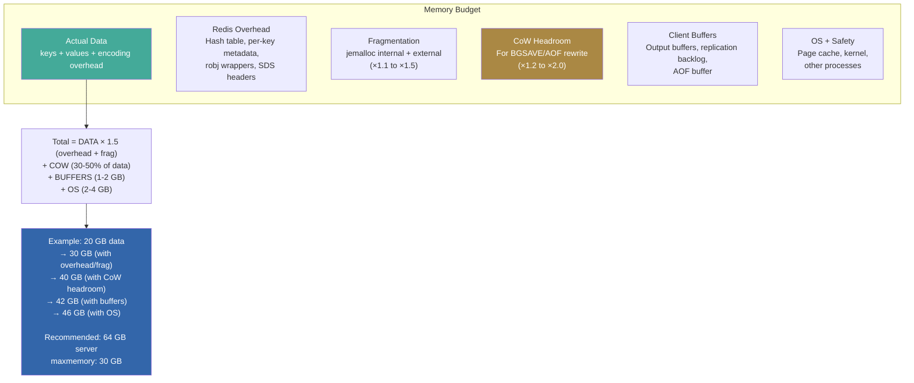
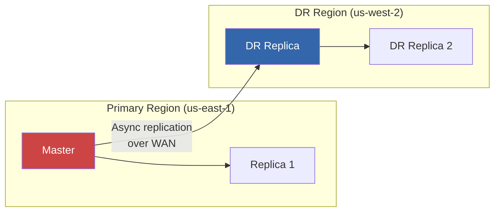
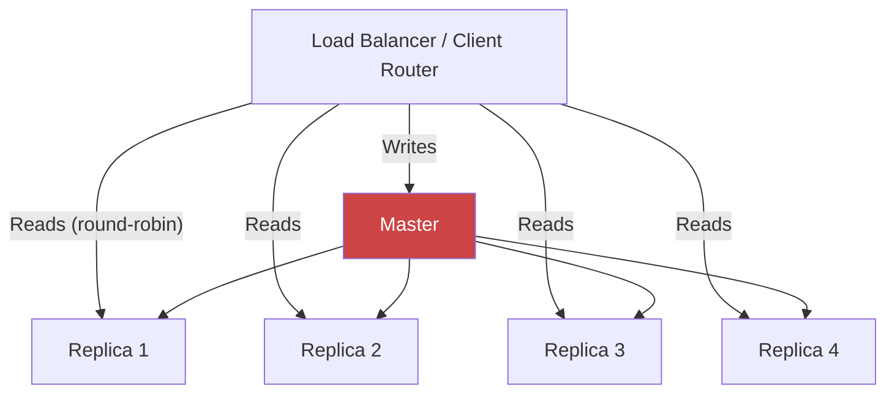
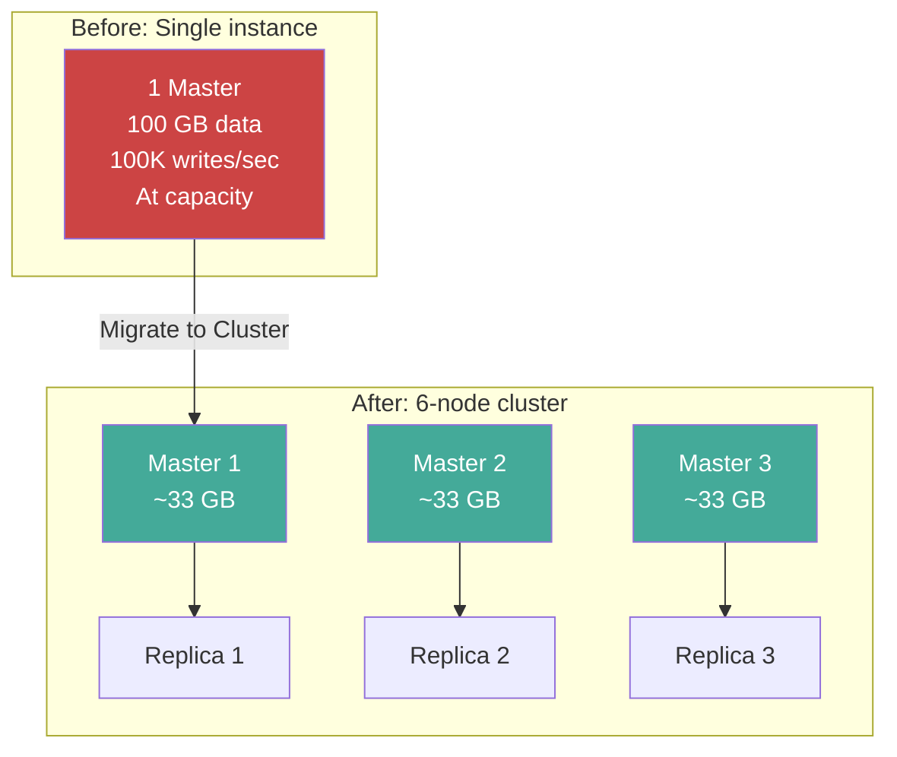
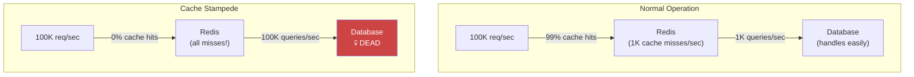
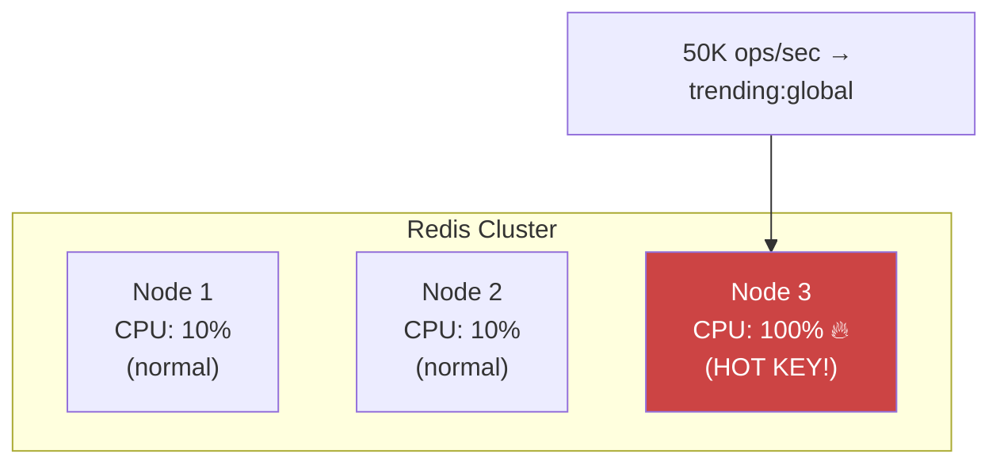
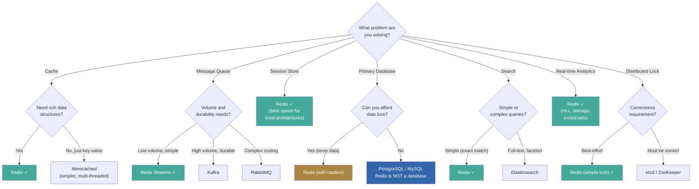

# Redis Deep Dive Series  Part 8: Production Engineering, Scaling, Failures, and War Stories

---

**Series:** Redis Deep Dive  Engineering the World's Most Misunderstood Data Structure Server
**Part:** 8 of 10 (Final Technical Part)
**Audience:** Senior backend engineers, distributed systems engineers, infrastructure architects
**Reading time:** ~55 minutes

---

## Where We Are in the Series

Part 0 built the systems foundation. Parts 1-3 dissected Redis's single-node internals: event loop, data structures, memory management, and persistence. Part 4 covered the client layer  protocol, pipelining, scripting, and performance tooling. Parts 5-6 entered the distributed world: replication, Sentinel, and Cluster. Part 7 applied everything to real-world patterns: locking, rate limiting, caching, and queues.

This is the final part  the capstone that ties everything together. Parts 1-7 gave you the knowledge; this part gives you the *experience*  or the closest thing to it without running Redis in production for 5 years.

We'll cover the complete production engineering lifecycle: deployment checklists (the OS settings that prevent Part 3's fork failures), capacity planning (applying Part 2's encoding knowledge and Part 3's jemalloc awareness to real sizing), monitoring dashboards (the metrics from Parts 1, 3, and 5 organized into actionable alerts), disaster recovery, scaling strategies, and  the heart of this article  six detailed war stories. Each war story connects back to specific concepts from earlier parts, showing what happens when those concepts are ignored in production.

---

## 1. Production Deployment Checklist

Before putting Redis into production, verify every item on this list.

### Operating System Configuration

```bash
# 1. Disable Transparent Huge Pages (CRITICAL)
echo never > /sys/kernel/mm/transparent_hugepages/enabled
echo never > /sys/kernel/mm/transparent_hugepages/defrag
# Make permanent: add to /etc/rc.local or systemd unit

# 2. Set overcommit memory
echo 1 > /proc/sys/vm/overcommit_memory
# Without this, fork() for BGSAVE can fail when the system
# doesn't have enough free memory to "promise" to the child,
# even though copy-on-write means it won't actually use it.

# 3. Increase max open files
# /etc/security/limits.conf:
redis    soft    nofile    65536
redis    hard    nofile    65536
# Or in systemd unit: LimitNOFILE=65536

# 4. Increase TCP backlog
echo 511 > /proc/sys/net/core/somaxconn
# Must match or exceed redis.conf's tcp-backlog setting

# 5. Disable swap (or set swappiness very low)
echo 0 > /proc/sys/vm/swappiness
# Redis + swap = unpredictable multi-millisecond latency spikes

# 6. Set appropriate net.core.netdev_max_backlog for high throughput
echo 5000 > /proc/sys/net/core/netdev_max_backlog

# 7. Enable TCP keepalive
echo 60 > /proc/sys/net/ipv4/tcp_keepalive_time
```

### Redis Configuration

```bash
# --- Security ---
requirepass "strong-random-password-here"
rename-command FLUSHDB ""           # Disable dangerous commands
rename-command FLUSHALL ""
rename-command KEYS ""              # Force use of SCAN
rename-command DEBUG ""
# Note: renaming commands breaks client libraries that use them.
# For Redis 6.0+, use ACLs instead:
# user default on >password ~* +@all -@dangerous

# --- Memory ---
maxmemory 48gb                       # 75% of 64 GB server
maxmemory-policy allkeys-lfu         # or allkeys-lru for cache workloads
maxmemory-samples 10                 # Better eviction accuracy

# --- Persistence ---
appendonly yes
appendfsync everysec
aof-use-rdb-preamble yes
auto-aof-rewrite-percentage 100
auto-aof-rewrite-min-size 64mb
save 3600 1                          # RDB backup every hour (in addition to AOF)

# --- Networking ---
bind 0.0.0.0
port 6379
tcp-backlog 511
timeout 300
tcp-keepalive 60

# --- Performance ---
io-threads 4                         # Enable for >50k ops/sec
io-threads-do-reads yes
hz 10
dynamic-hz yes
lazyfree-lazy-eviction yes           # Background eviction
lazyfree-lazy-expire yes             # Background expiry deletion
lazyfree-lazy-server-del yes         # Background implicit DEL
lazyfree-lazy-user-del yes           # UNLINK as default for DEL

# --- Replication ---
repl-backlog-size 512mb              # Size for your write rate × disconnect tolerance
repl-diskless-sync yes               # If network is faster than disk
min-replicas-to-write 1              # Prevent split-brain writes
min-replicas-max-lag 10

# --- Monitoring ---
latency-monitor-threshold 5          # Log events > 5ms
slowlog-log-slower-than 10000        # Log commands > 10ms
slowlog-max-len 256

# --- Encoding Thresholds ---
hash-max-listpack-entries 128
hash-max-listpack-value 64
list-max-listpack-size -2
set-max-intset-entries 512
set-max-listpack-entries 128
zset-max-listpack-entries 128
zset-max-listpack-value 64

# --- Active Defragmentation ---
activedefrag yes
active-defrag-ignore-bytes 100mb
active-defrag-threshold-lower 10
active-defrag-threshold-upper 100
active-defrag-cycle-min 1
active-defrag-cycle-max 25
```

The deployment checklist gets you to day 1. Capacity planning determines whether you're still standing on day 100  when your dataset has grown 10x and your traffic has tripled.

---

## 2. Capacity Planning

This is where Part 2's encoding knowledge and Part 3's jemalloc understanding pay off directly. You can't plan capacity without knowing how much memory your data actually uses.

### Memory Estimation



### Quick Estimation Rules

| Component | Memory Cost |
|---|---|
| Top-level key (with small string value) | ~80-120 bytes per key |
| Hash field (listpack encoding) | ~15-30 bytes per field |
| Hash field (hashtable encoding) | ~60-100 bytes per field |
| Set member (intset) | 2-8 bytes per member |
| Set member (hashtable) | ~60-80 bytes per member |
| Sorted set member (listpack) | ~20-40 bytes per member |
| Sorted set member (skiplist) | ~80-120 bytes per member |
| List element (quicklist) | ~20-40 bytes per element |
| Stream entry (with consistent schema) | ~30-60 bytes per entry |
| HyperLogLog | 12 KB maximum (dense), <200 bytes (sparse) |
| Per-client connection | ~17 KB idle, up to MBs under load |

### Capacity Planning Formula

```python
def plan_capacity(
    num_keys,
    avg_key_size_bytes,
    avg_value_size_bytes,
    data_type="string",
    write_heavy=False,
    persistence=True
):
    """Production capacity planning for Redis."""

    # Base data size
    per_key_overhead = 80  # dictEntry + robj + SDS key
    if data_type == "string":
        per_value_overhead = 16 + max(0, avg_value_size_bytes - 44) * 1.1
    elif data_type == "hash_listpack":
        per_value_overhead = avg_value_size_bytes * 1.3
    else:
        per_value_overhead = avg_value_size_bytes * 2.0

    raw_data = num_keys * (per_key_overhead + avg_key_size_bytes + per_value_overhead)

    # Fragmentation multiplier
    fragmentation = 1.3  # Conservative

    # CoW headroom
    cow = 1.5 if write_heavy and persistence else 1.2 if persistence else 1.0

    # Fixed overheads
    buffers = 2 * 1024 ** 3  # 2 GB for client buffers + replication backlog
    os_overhead = 3 * 1024 ** 3  # 3 GB for OS

    total_ram = raw_data * fragmentation * cow + buffers + os_overhead
    maxmemory = raw_data * fragmentation  # Only the data portion

    return {
        "raw_data_gb": raw_data / 1024 ** 3,
        "maxmemory_gb": maxmemory / 1024 ** 3,
        "total_ram_gb": total_ram / 1024 ** 3,
        "recommendation": f"Use a server with {int(total_ram / 1024**3 * 1.25)} GB RAM"
    }

# Example: 50M user sessions, 500 bytes each
result = plan_capacity(
    num_keys=50_000_000,
    avg_key_size_bytes=25,
    avg_value_size_bytes=500,
    data_type="string",
    write_heavy=True,
    persistence=True
)
print(result)
# raw_data_gb: ~27 GB
# maxmemory_gb: ~35 GB
# total_ram_gb: ~60 GB
# recommendation: Use a server with 75 GB RAM
```

### When to Shard

Shard (use Redis Cluster) when:
1. **Dataset exceeds 75% of available RAM** on a single server
2. **Write throughput exceeds 100,000 ops/sec** per instance
3. **You need fault isolation**  different data domains on different shards
4. **Your latency budget requires it**  reducing dataset size per node reduces BGSAVE fork time

Don't shard prematurely. A single Redis instance with 64 GB RAM and proper tuning handles the vast majority of use cases.

---

## 3. The Complete Monitoring Dashboard

### Tier 1: Critical Alerts (Page On-Call)

| Metric | Query | Warning | Critical |
|---|---|---|---|
| Instance down | `redis_up == 0` |  | Immediate |
| Memory usage | `used_memory / maxmemory` | > 80% | > 95% |
| Swap usage | `mem_fragmentation_ratio < 1` | < 0.95 | < 0.8 |
| Evictions | `rate(evicted_keys)` | > 0 sustained | > 100/sec |
| Connected clients | `connected_clients / maxclients` | > 80% | > 95% |
| Rejected connections | `rate(rejected_connections)` | > 0 | > 10/sec |
| Master link down (replica) | `master_link_status != ok` | After 10s | After 60s |
| BGSAVE failure | `rdb_last_bgsave_status != ok` |  | Immediate |
| AOF error | `aof_last_bgrewrite_status != ok` |  | Immediate |

### Tier 2: Warning Alerts (Investigate During Business Hours)

| Metric | Query | Threshold |
|---|---|---|
| Fragmentation ratio | `mem_fragmentation_ratio` | > 1.5 or < 1.0 |
| Replication lag | `master_repl_offset - slave_offset` | > 10 MB |
| Slow commands | `rate(slowlog entries)` | > 1/min |
| Cache hit rate | `keyspace_hits / (hits + misses)` | < 85% |
| Fork latency | `latest_fork_usec` | > 50ms |
| Expired keys rate | `rate(expired_keys)` | Sudden spike |
| Peak memory ratio | `used_memory_peak / used_memory` | > 2.0 |
| Active defrag running | `active_defrag_running` | Sustained |
| Blocked clients | `blocked_clients` | > 10 |

### Prometheus + Grafana Setup

```yaml
# prometheus.yml - Redis exporter configuration
scrape_configs:
  - job_name: 'redis'
    static_configs:
      - targets:
        - 'redis-exporter-1:9121'
        - 'redis-exporter-2:9121'
    metrics_path: /metrics
    scrape_interval: 15s
```

```python
# Key Prometheus queries for Redis monitoring

# Memory utilization percentage
redis_memory_used_bytes / redis_memory_max_bytes * 100

# Operations per second
rate(redis_commands_processed_total[1m])

# Cache hit rate
rate(redis_keyspace_hits_total[5m]) /
(rate(redis_keyspace_hits_total[5m]) + rate(redis_keyspace_misses_total[5m]))

# Command latency (from redis-exporter with latency tracking)
redis_commands_duration_seconds_total / redis_commands_total

# Connected clients trend
redis_connected_clients

# Replication offset lag
redis_master_repl_offset - on(instance) redis_slave_repl_offset
```

### Key INFO Sections to Monitor

```bash
# Run this every 15 seconds and ship to your monitoring system
redis-cli INFO all

# Essential sections:
INFO server      # Version, uptime, config
INFO clients     # Connected clients, blocked clients, buffers
INFO memory      # Used memory, RSS, fragmentation, peak, eviction
INFO persistence # RDB/AOF status, last save times, CoW sizes
INFO stats       # Ops/sec, hits/misses, evicted keys, expired keys
INFO replication # Role, connected replicas, offset, lag
INFO cpu         # User/system CPU usage
INFO keyspace    # Per-database key count, expires, avg TTL
INFO commandstats # Per-command call count, total time, avg time
```

---

## 4. Disaster Recovery

### Backup Strategies

#### Strategy 1: RDB Snapshots to Object Storage

```bash
# Automated RDB backup script
#!/bin/bash
REDIS_HOST=localhost
REDIS_PORT=6379
BACKUP_DIR=/backups/redis
S3_BUCKET=s3://company-redis-backups
DATE=$(date +%Y%m%d_%H%M%S)

# Trigger BGSAVE
redis-cli -h $REDIS_HOST -p $REDIS_PORT BGSAVE

# Wait for completion
while [ "$(redis-cli -h $REDIS_HOST -p $REDIS_PORT LASTSAVE)" = "$LAST_SAVE" ]; do
    sleep 1
done

# Copy RDB file
cp /var/lib/redis/dump.rdb $BACKUP_DIR/dump_${DATE}.rdb

# Upload to S3
aws s3 cp $BACKUP_DIR/dump_${DATE}.rdb $S3_BUCKET/daily/dump_${DATE}.rdb

# Cleanup local backups older than 7 days
find $BACKUP_DIR -name "dump_*.rdb" -mtime +7 -delete

# Verify backup integrity
redis-check-rdb $BACKUP_DIR/dump_${DATE}.rdb
```

#### Strategy 2: Continuous AOF Shipping

For minimal data loss, ship AOF incremental files to remote storage:

```bash
# With Redis 7.0+ multi-part AOF:
# Ship the appendonlydir/ directory to remote storage periodically
rsync -avz /var/lib/redis/appendonlydir/ backup-server:/backups/redis/aof/
```

#### Strategy 3: Cross-Region Replica



### Recovery Procedures

#### Recovering from RDB Backup

```bash
# 1. Stop Redis
redis-cli SHUTDOWN NOSAVE

# 2. Replace dump.rdb
cp /backups/redis/dump_20250115_030000.rdb /var/lib/redis/dump.rdb
chown redis:redis /var/lib/redis/dump.rdb

# 3. Disable AOF temporarily (to avoid conflicts)
# In redis.conf: appendonly no

# 4. Start Redis
redis-server /etc/redis/redis.conf

# 5. Verify data
redis-cli DBSIZE
redis-cli INFO keyspace

# 6. Re-enable AOF
redis-cli CONFIG SET appendonly yes
# Redis will create a fresh AOF from current state
```

#### Point-in-Time Recovery (with AOF)

```bash
# 1. Restore the RDB base
cp backup/appendonly.aof.1.base.rdb /var/lib/redis/appendonlydir/

# 2. Restore AOF incrementals up to desired timestamp
cp backup/appendonly.aof.1.incr.aof /var/lib/redis/appendonlydir/
cp backup/appendonly.aof.2.incr.aof /var/lib/redis/appendonlydir/

# 3. Edit the manifest to include only desired files
# 4. Start Redis  it replays RDB base + AOF increments
```

### Recovery Time Objectives

| Data Size | RDB Load Time | AOF Replay Time | Notes |
|---|---|---|---|
| 1 GB | ~2-5 seconds | ~10-30 seconds | Trivial |
| 10 GB | ~20-60 seconds | ~2-5 minutes | Manageable |
| 50 GB | ~2-5 minutes | ~10-30 minutes | Plan for downtime |
| 100 GB | ~5-15 minutes | ~30-60 minutes | Consider diskless |
| 500 GB | ~30-60 minutes | Hours | Needs architectural review |

Disaster recovery protects you from catastrophic failures. But most scaling problems aren't catastrophic  they're gradual. Traffic increases, datasets grow, and the strategies from Parts 5-6 (replication, Cluster) need to be applied in the right order.

---

## 5. Scaling Strategies

The scaling options below follow a natural progression. Start with vertical scaling; move to read replicas (Part 5's replication) when reads are the bottleneck; graduate to Redis Cluster (Part 6) when writes or memory exceed a single node; and consider application-level sharding only when Cluster's constraints (cross-slot limitations, gossip overhead) become problematic.

### Vertical Scaling

Before adding complexity, scale up:

1. **More RAM:** The simplest scaling. Go from 64 GB to 256 GB.
2. **Faster CPU:** Higher single-core clock speed directly improves ops/sec.
3. **Faster network:** 25 Gbps NIC for large-value workloads.
4. **NVMe storage:** Faster BGSAVE, faster AOF writes, faster restarts.

### Horizontal Scaling: Read Replicas

Add read replicas to scale read throughput:



This scales reads linearly but doesn't help with:
- Write throughput (still single master)
- Dataset size (still limited by single machine's RAM)

### Horizontal Scaling: Redis Cluster

For true horizontal scaling:



### Application-Level Sharding

For workloads that don't fit Redis Cluster's model (cross-key transactions, complex Lua scripts), use application-level sharding:

```python
import hashlib

class ApplicationShardedRedis:
    def __init__(self, shard_configs):
        """
        shard_configs: [
            {"host": "redis-1", "port": 6379},
            {"host": "redis-2", "port": 6379},
            {"host": "redis-3", "port": 6379},
        ]
        """
        self.shards = [redis.Redis(**config) for config in shard_configs]
        self.num_shards = len(self.shards)

    def _get_shard(self, key):
        """Consistent mapping from key to shard."""
        hash_val = int(hashlib.md5(key.encode()).hexdigest(), 16)
        return self.shards[hash_val % self.num_shards]

    def get(self, key):
        return self._get_shard(key).get(key)

    def set(self, key, value, **kwargs):
        return self._get_shard(key).set(key, value, **kwargs)

    def pipeline_by_shard(self, key_value_pairs):
        """Group operations by shard for efficient pipelining."""
        shard_batches = {}
        for key, value in key_value_pairs:
            shard_idx = int(hashlib.md5(key.encode()).hexdigest(), 16) % self.num_shards
            shard_batches.setdefault(shard_idx, []).append((key, value))

        results = {}
        for shard_idx, batch in shard_batches.items():
            pipe = self.shards[shard_idx].pipeline(transaction=False)
            for key, value in batch:
                pipe.set(key, value)
            pipe.execute()
        return results
```

Every concept from the previous parts is a potential failure mode waiting to happen in production. The war stories below are composites of real incidents  each one traces back to a specific concept from this series.

---

## 6. War Stories: Real Production Failures

### War Story 1: The 3 AM OOM Kill

*Root cause concept: Part 3 (CoW amplification during BGSAVE) + Part 3 (maxmemory accounting gaps)*

**Setup:** E-commerce platform. Redis with 80 GB dataset on a 128 GB server. `maxmemory` set to 100 GB.

**What happened:** At 3 AM, the nightly analytics job wrote 5 million keys with 1-hour TTL. This pushed `used_memory` to 95 GB. Simultaneously, the scheduled BGSAVE triggered. Under write load, CoW duplicated ~30 GB of pages (exactly the scenario Part 3, Section 9 warned about). Total memory: 95 GB + 30 GB = 125 GB. Linux OOM killer terminated Redis. The application was down for 20 minutes during recovery.

**Root cause analysis:**
1. `maxmemory` was set too high (78% of RAM  no CoW headroom)
2. The analytics job created a massive memory spike
3. BGSAVE coincided with peak write activity
4. THP was enabled, amplifying CoW by 500x

**Fix:**
```bash
# 1. Reduce maxmemory
maxmemory 60gb    # 47% of 128 GB  generous CoW headroom

# 2. Disable THP
echo never > /sys/kernel/mm/transparent_hugepages/enabled

# 3. Move analytics job to a read replica
# Analytics reads don't need to be on the master

# 4. Schedule BGSAVE during low-write periods
save ""
# Trigger BGSAVE via cron at 4 AM when write rate is lowest

# 5. Add memory alerting
# Alert at 70% maxmemory  gives time to react
```

**Lesson:** Always calculate your memory budget including worst-case CoW. Formula: `maxmemory ≤ total_RAM × 0.5` for write-heavy workloads with persistence.

---

### War Story 2: The Slow KEYS Command

*Root cause concept: Part 1 (any slow command blocks everyone) + Part 0 (Big-O notation, O(n) danger)*

**Setup:** Microservices architecture. One Redis instance shared by 12 services. 50 million keys.

**What happened:** A developer in Service X added debug logging that called `KEYS cache:service_x:*` on every error. During a brief spike of errors (500 per minute), this generated 500 `KEYS` commands per minute on a 50-million-key keyspace. Each `KEYS` command took ~800ms (an O(n) operation on 50M keys, exactly the scenario Part 1, Section 1 warned about), blocking all other clients. p99 latency across all 12 services jumped from 1ms to 900ms. Multiple services hit their timeout thresholds and started failing.

**Root cause:**
1. `KEYS` is O(n) and blocks the event loop
2. 500 calls/minute × 800ms = 400 seconds of blocked time per minute (6.67 seconds per second  more than 100% of available time, creating a queue)

**Fix:**
```bash
# 1. Immediate: rename KEYS command
rename-command KEYS ""

# 2. Long-term: use SCAN for any pattern-matching needs
# Replace: KEYS cache:service_x:*
# With: SCAN 0 MATCH cache:service_x:* COUNT 100

# 3. Separate Redis instances per service
# Service isolation prevents one service from impacting others

# 4. Code review policy: grep for KEYS in all codebases
grep -r "\.keys(" --include="*.py" --include="*.js" .
```

**Lesson:** `KEYS` is the most dangerous command in Redis. Disable it in production. Always use `SCAN`.

---

### War Story 3: The Cache Stampede

*Root cause concept: Part 7 (caching patterns  cache stampede prevention) + Part 3 (key expiration)*

**What happened:** A deployment bug caused all cache entries to be set with the same TTL (3600 seconds) at exactly the same time (cache warming on deploy). One hour later, all entries expired simultaneously. 100,000 requests/sec hit the database directly. The database collapsed under load. Response times went from 50ms to 30 seconds. The site was effectively down for 15 minutes.



**Fix:**
```python
# 1. Add TTL jitter to all cache entries
import random

def cache_with_jitter(key, value, base_ttl=3600):
    jitter = random.randint(-300, 300)  # ±5 minutes
    r.setex(key, base_ttl + jitter, value)

# 2. Implement lock-based recomputation
def get_with_stampede_protection(key, compute_fn, ttl=3600):
    value = r.get(key)
    if value:
        return json.loads(value)

    lock_key = f"lock:{key}"
    if r.set(lock_key, "1", nx=True, ex=30):
        try:
            value = compute_fn()
            cache_with_jitter(key, json.dumps(value), ttl)
            return value
        finally:
            r.delete(lock_key)
    else:
        time.sleep(0.1)
        value = r.get(key)
        return json.loads(value) if value else compute_fn()

# 3. Implement circuit breaker for database
# If database error rate > 50%, serve stale cache instead of hammering DB
```

**Lesson:** Never set identical TTLs on bulk cache operations. Always add jitter.

---

### War Story 4: The Replication Infinite Loop

*Root cause concept: Part 5 (PSYNC partial resync, replication backlog sizing)*

**Setup:** Master with 200 GB dataset, 2 replicas. `repl-backlog-size` at default 1 MB.

**What happened:** A 30-second network glitch disconnected both replicas. When the network recovered, replicas attempted partial resync. The replication backlog (1 MB) was far too small to cover 30 seconds of writes (~50 MB/sec write rate = 1.5 GB during disconnection). Partial resync failed → full resync triggered.

Full resync on a 200 GB dataset took 10 minutes (BGSAVE + transfer). During those 10 minutes, the backlog filled up again. When the first replica finished syncing, the second one's partial resync also failed (it had been disconnected for 10 minutes). This created a cascade where replicas kept triggering full resyncs, consuming master CPU and network bandwidth continuously.

**Root cause:**
1. Replication backlog was 1 MB (default)  absurdly small for a 50 MB/sec write rate
2. Full resync time (10 min) exceeded backlog coverage (0.02 seconds)

**Fix:**
```bash
# Size backlog for write rate × max expected disconnect + full sync time
# 50 MB/sec × (30 sec disconnect + 600 sec full sync) = 31.5 GB
# Practically:
repl-backlog-size 2gb    # Cover reasonable disconnect + resync time

# Also: limit concurrent syncs
# If using Sentinel:
sentinel parallel-syncs mymaster 1
```

**Lesson:** Always calculate `repl-backlog-size = write_rate × (max_disconnect + resync_duration)`. The default 1 MB is almost never correct.

---

### War Story 5: The Hot Key Meltdown

*Root cause concept: Part 6 (hash slot distribution  all keys with the same name go to the same slot) + Part 1 (single-threaded CPU bottleneck)*

**Setup:** Redis Cluster with 6 masters. A social media feature storing "trending topics" in a single sorted set: `trending:global`.

**What happened:** A viral event caused the trending topics sorted set to receive 50,000 ZINCRBY operations per second  all to the same key, on the same cluster node (because in Cluster mode, a key's slot is determined by CRC16 of the key name  Part 6, Section 2). That single node's CPU hit 100%. Other nodes were at 10% utilization. The application experienced 500ms+ latency for any operation touching that shard.



**Fix:**
```python
# Pattern: Shard the hot key across multiple sub-keys
import random

class ShardedCounter:
    def __init__(self, r, key, num_shards=16):
        self.r = r
        self.key = key
        self.num_shards = num_shards

    def increment(self, member, delta=1):
        """Distribute increments across shards. O(log N) per shard."""
        shard = random.randint(0, self.num_shards - 1)
        self.r.zincrby(f"{self.key}:shard:{shard}", delta, member)

    def get_top(self, n=10):
        """Merge all shards and return top N. O(S × M log M)."""
        # Aggregate scores from all shards
        scores = {}
        for i in range(self.num_shards):
            shard_data = self.r.zrange(
                f"{self.key}:shard:{i}", 0, -1, withscores=True
            )
            for member, score in shard_data:
                scores[member] = scores.get(member, 0) + score

        # Sort and return top N
        sorted_scores = sorted(scores.items(), key=lambda x: x[1], reverse=True)
        return sorted_scores[:n]

# Usage: distribute 50K/sec across 16 shards = ~3K/sec per shard
counter = ShardedCounter(r, "trending:global", num_shards=16)
counter.increment("topic:redis", 1)
top_trending = counter.get_top(10)
```

**Alternative:** Use a local counter aggregation layer:
```python
# Aggregate locally, flush to Redis periodically
from collections import defaultdict
import threading

class BufferedCounter:
    def __init__(self, r, key, flush_interval=1.0):
        self.r = r
        self.key = key
        self.buffer = defaultdict(float)
        self.lock = threading.Lock()
        self._start_flusher(flush_interval)

    def increment(self, member, delta=1):
        with self.lock:
            self.buffer[member] += delta

    def _flush(self):
        with self.lock:
            to_flush = dict(self.buffer)
            self.buffer.clear()

        if to_flush:
            pipe = self.r.pipeline()
            for member, score in to_flush.items():
                pipe.zincrby(self.key, score, member)
            pipe.execute()

    def _start_flusher(self, interval):
        def run():
            while True:
                time.sleep(interval)
                self._flush()
        threading.Thread(target=run, daemon=True).start()
```

**Lesson:** A single hot key can bring down an entire shard. Design for distribution.

---

### War Story 6: The Split-Brain Data Loss

*Root cause concept: Part 5 (split-brain scenario, async replication data loss window, min-replicas-to-write)*

**Setup:** Redis Sentinel with 1 master, 2 replicas, 3 Sentinels. `min-replicas-to-write` was NOT configured.

**What happened:** A network partition isolated the master from everything else (Sentinels and replicas on the other side). Sentinels detected the master as down and promoted Replica 1. Meanwhile, the isolated master continued accepting writes from clients on its side of the partition  the exact split-brain scenario described in Part 5, Section 5.

After 2 minutes, the partition healed. The old master discovered it was no longer the master and became a replica of the new master. All writes accepted by the old master during the 2-minute partition were **silently discarded**.

Result: 120 seconds × ~5000 writes/sec = ~600,000 writes lost. These included financial transaction records.

**Fix:**
```bash
# 1. Enable min-replicas-to-write
min-replicas-to-write 1
min-replicas-max-lag 10

# With these settings, the isolated master would have STOPPED
# accepting writes as soon as its replica disconnected (within 10 seconds).

# 2. Application-level: write-through to database for critical data
# Never use Redis as the sole store for data you can't afford to lose

# 3. WAIT for critical writes
def critical_write(r, key, value):
    r.set(key, value)
    acked = r.wait(1, 1000)
    if acked == 0:
        raise Exception("Write not replicated  refusing to proceed")
```

**Lesson:** `min-replicas-to-write` is essential for preventing split-brain data loss. It should be enabled on every production deployment unless you explicitly accept the risk.

---

## 7. Redis Modules

Redis modules extend Redis with custom data types and commands written in C:

### Popular Modules

| Module | Purpose | Key Use Case |
|---|---|---|
| **RedisJSON** | Native JSON storage with path-based queries | Store and query JSON documents without serialization |
| **RediSearch** | Full-text search and secondary indexing | Search across Redis data without external search engine |
| **RedisTimeSeries** | Time-series data with downsampling | IoT metrics, monitoring, financial data |
| **RedisBloom** | Bloom filter, cuckoo filter, count-min sketch | Probabilistic membership testing, heavy hitter detection |
| **RedisGraph** | Graph database on Redis | Social graphs, recommendation engines |
| **RedisAI** | ML model serving | Real-time inference with TensorFlow/PyTorch models |

### When to Use Modules

Use modules when:
- The use case exactly matches the module's purpose (e.g., full-text search → RediSearch)
- You need performance that external solutions can't match (sub-millisecond latency)
- The operational simplicity of "one system" outweighs the complexity of multiple systems

Avoid modules when:
- The module is not actively maintained
- You need features beyond what the module supports
- A dedicated system (Elasticsearch, TimescaleDB, Neo4j) provides better fit

---

## 8. Redis vs The Alternatives: Decision Framework



### Quick Comparison Table

| Dimension | Redis | Memcached | PostgreSQL | Kafka | etcd |
|---|---|---|---|---|---|
| **Latency** | <1ms | <1ms | 1-10ms | 1-10ms | 1-10ms |
| **Throughput** | 100K-1M ops/sec | 100K-1M ops/sec | 10K-100K qps | 1M+ msg/sec | 10K-50K ops/sec |
| **Durability** | Configurable (weak to moderate) | None | Strong (ACID) | Strong | Strong (Raft) |
| **Data model** | Rich structures | Key-value only | Relational | Log/stream | Key-value |
| **Scaling** | Cluster (sharding) | Client sharding | Read replicas | Partitions | Raft cluster |
| **Best for** | Cache, sessions, real-time | Pure cache | ACID transactions | Event streaming | Coordination |

---

## 9. The Valkey Fork and Redis Licensing

In March 2024, Redis Ltd changed Redis's license from BSD to a dual-license model (RSALv2 + SSPLv1), restricting how cloud providers could offer Redis as a service. In response, the Linux Foundation forked Redis 7.2 as **Valkey**  an open-source, BSD-licensed continuation.

### What This Means for Engineers

1. **API compatibility:** Valkey is wire-compatible with Redis. Your applications, client libraries, and tooling work with both. Everything in this series applies equally to Valkey  the event loop (Part 1), data structures (Part 2), persistence mechanics (Part 3), and distributed architecture (Parts 5-6) are identical in both codebases.

2. **Feature divergence:** Over time, Redis (the company's product) and Valkey (the community fork) will develop different features. Valkey 8.0 introduced multi-threaded command execution for certain workloads  a significant departure from the single-threaded model we covered in Part 1. Redis 8.0 is also evolving with new capabilities under the new license.

3. **Cloud provider alignment:** AWS (ElastiCache/MemoryDB), Google Cloud, and others have adopted Valkey for their managed offerings. Redis Ltd offers Redis Cloud and Redis Stack.

4. **Practical advice:** The choice between Redis and Valkey is primarily a licensing and vendor decision, not a technical one. Both are excellent for production use. The internals knowledge from this series gives you a foundation that transcends the fork  whether you run Redis, Valkey, or Dragonfly, the concepts of event-driven I/O, encoding duality, CoW persistence, and async replication remain the same.

---

## 10. Performance Tuning Cheat Sheet

### CPU Optimization

```bash
# Pin Redis to specific CPU cores (avoid NUMA effects)
taskset -c 0-3 redis-server /etc/redis/redis.conf

# Or in systemd:
# [Service]
# CPUAffinity=0 1 2 3

# Enable threaded I/O for high-throughput workloads
io-threads 4
io-threads-do-reads yes

# Increase hz for workloads with many short-TTL keys
hz 100
dynamic-hz yes
```

### Memory Optimization

```bash
# Use LFU eviction (better hit rate than LRU for most workloads)
maxmemory-policy allkeys-lfu
lfu-log-factor 10
lfu-decay-time 1

# Enable lazy free for background deletion
lazyfree-lazy-eviction yes
lazyfree-lazy-expire yes
lazyfree-lazy-server-del yes

# Tune encoding thresholds based on your data
# Profile with: OBJECT ENCODING <key> and MEMORY USAGE <key>
```

### Network Optimization

```bash
# Client-side: use pipelining everywhere
# Client-side: enable connection pooling (10-50 connections per app instance)
# Client-side: use RESP3 for richer type information (Redis 6.0+)

# Server-side:
tcp-keepalive 60
timeout 300            # Close idle connections after 5 minutes
tcp-backlog 511        # Increase for high connection rates
```

### Persistence Optimization

```bash
# AOF: use everysec fsync (best tradeoff)
appendfsync everysec
aof-use-rdb-preamble yes

# Reduce BGSAVE frequency for write-heavy workloads
save 3600 1            # Once per hour at most

# Use diskless replication if network > disk speed
repl-diskless-sync yes
repl-diskless-sync-delay 5
```

---

## 11. Final Best Practices Summary

### Architecture

1. **Redis is a cache and auxiliary data store, not a primary database.** Always have a source of truth elsewhere.
2. **One Redis instance per service** (or per bounded context). Don't share Redis across unrelated services.
3. **Design for Redis failure.** Your application should degrade gracefully (slower, not broken) if Redis is unavailable.
4. **Use Redis Cluster only when you've outgrown a single instance.** Don't pre-optimize with clustering.

### Operations

5. **Disable THP, enable overcommit, set swappiness to 0.** These OS settings are non-negotiable.
6. **Set `maxmemory` to ≤75% of available RAM.** Account for CoW, buffers, and OS overhead.
7. **Use `min-replicas-to-write 1`** to prevent split-brain data loss.
8. **Monitor the 5 critical metrics:** memory usage, fragmentation ratio, eviction rate, replication lag, and slow log.
9. **Automate RDB backups** to object storage. Test recovery procedures quarterly.
10. **Rename or ACL-restrict dangerous commands:** `KEYS`, `FLUSHDB`, `FLUSHALL`, `DEBUG`.

### Development

11. **Always use connection pools.** Never create connections per request.
12. **Always use pipelining** for bulk operations (100-1000 commands per batch).
13. **Always add TTL jitter** (±5-10%) to prevent mass expiration.
14. **Use `SCAN` instead of `KEYS`.** In all contexts, always.
15. **Use `UNLINK` instead of `DEL`** for large keys.
16. **Keep Lua scripts under 1ms execution time.** They block everything.
17. **Use `MEMORY USAGE`** to understand per-key memory costs during development.

### Data Modeling

18. **Exploit encoding thresholds.** Keep hashes under 128 fields and 64-byte values for listpack encoding.
19. **Use the hash-bucketing trick** for millions of small objects (Instagram pattern).
20. **Choose the right data structure.** Don't force a string when a sorted set is natural.

---

## Conclusion: The Redis Engineer's Mindset

After 9 articles  from the memory hierarchy (Part 0) to production war stories (this part)  the core message is simple:

**Redis is a beautifully designed system with sharp edges.**

Its single-threaded model (Part 1) gives you predictable performance  until one slow command blocks everyone (War Story 2). Its in-memory architecture gives you microsecond latency  until you run out of RAM (War Story 1). Its encoding duality (Part 2) gives you remarkable memory efficiency  until a misconfigured threshold wastes 3x memory. Its simple replication (Part 5) gives you read scaling  until a network partition causes data loss (War Story 6).

The difference between a Redis deployment that "just works" and one that wakes you up at 3 AM comes down to understanding these tradeoffs and engineering around them:

- **Know what can go wrong.** This series covered every major failure mode  from fork CoW amplification to split-brain data loss.
- **Monitor proactively.** The dashboards in Section 3 detect problems before users do. The `LATENCY` and `SLOWLOG` tools from Part 4 tell you exactly where time is going.
- **Design for failure.** Redis going down should be a performance degradation, not an outage. The caching patterns in Part 7 include fallbacks to the source of truth.
- **Keep it simple.** The most reliable Redis deployment is the one with the fewest moving parts. Start with Sentinel (Part 5) before Cluster (Part 6). Start with single-instance before sharding. Add complexity only when the data demands it.

---

## Series Recap

| Part | Topic | Key Takeaway |
|---|---|---|
| **Part 0** | Foundation | Systems fundamentals: memory hierarchy, sockets, event loops, forking, Big-O |
| **Part 1** | Architecture & Event Loop | Single-threaded execution, `ae` library, `redisObject`, RESP protocol |
| **Part 2** | Data Structures Deep Dive | Encoding duality, listpack/quicklist/skiplist, streams, HyperLogLog |
| **Part 3** | Memory & Persistence | jemalloc, expiry/eviction, RDB vs AOF, CoW mechanics |
| **Part 4** | Networking & Performance | Pipelining, MULTI/EXEC, Lua scripting, latency diagnosis |
| **Part 5** | Replication & Sentinel | Async replication, PSYNC2, failover, split-brain, WAIT |
| **Part 6** | Redis Cluster | Hash slots, gossip protocol, resharding, MOVED/ASK, consistency |
| **Part 7** | Use Cases & Patterns | Locking, rate limiting, caching, analytics, queues, company architectures |
| **Part 8** | Production Engineering | Deployment, capacity planning, monitoring, disaster recovery, war stories |

Each part built on the previous ones  the memory hierarchy from Part 0 explained why EMBSTR matters in Part 2, the forking from Part 0 powered the persistence in Part 3, the Lua scripting from Part 4 enabled the locking patterns in Part 7, and the replication model from Part 5 explained the war stories in this part. Redis is a system where everything connects.

---

*This concludes the Redis Deep Dive series. You now have the knowledge to design, deploy, and operate Redis at any scale  from a single-instance cache to a multi-region distributed deployment. The rest is practice, monitoring, and learning from your own production experiences.*
