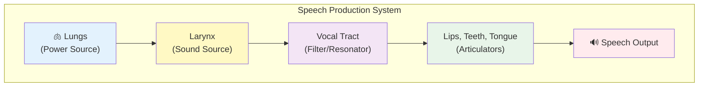
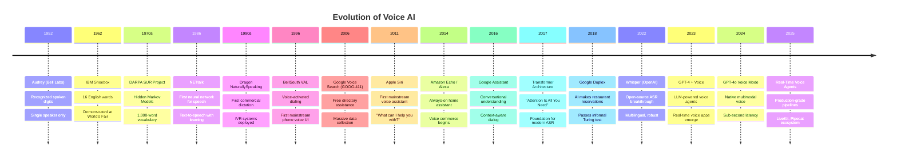
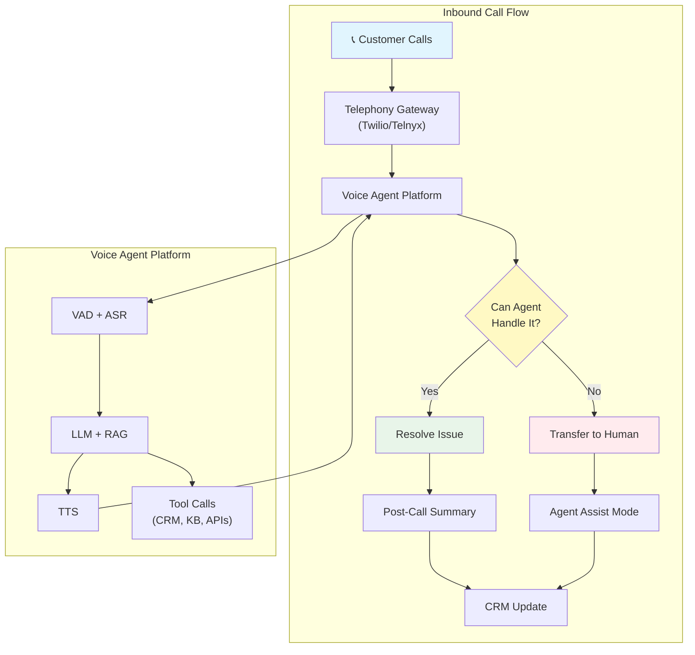
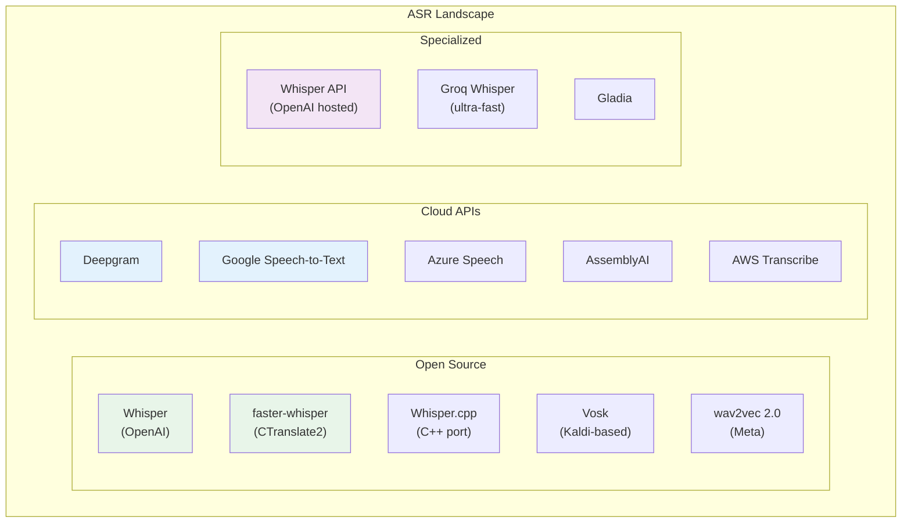

# Voice Agents Deep Dive  Part 0: The Voice AI Landscape  How Machines Hear, Understand, and Speak

---

**Series:** Building Voice Agents  A Developer's Deep Dive from Audio Fundamentals to Production
**Part:** 0 of 19 (Foundation)
**Audience:** Developers with Python experience who want to build voice-powered AI agents from the ground up
**Reading time:** ~45 minutes

---

## Table of Contents

1. [What Voice AI Actually Is](#1-what-voice-ai-actually-is)
2. [How Humans Produce and Perceive Speech](#2-how-humans-produce-and-perceive-speech)
3. [History of Voice AI](#3-history-of-voice-ai)
4. [Types of Voice Applications](#4-types-of-voice-applications)
5. [The Latency Challenge](#5-the-latency-challenge)
6. [The Current Ecosystem](#6-the-current-ecosystem)
7. [Demo: Your First Voice Interaction in Python](#7-demo-your-first-voice-interaction-in-python)
8. [Hello World Voice Agent](#8-hello-world-voice-agent)
9. [Setup Instructions](#9-setup-instructions)
10. [What You'll Build in This Series](#10-what-youll-build-in-this-series)
11. [Vocabulary Cheat Sheet](#11-vocabulary-cheat-sheet)
12. [What's Next  Preview of Part 1](#12-whats-next--preview-of-part-1)

---

## 1. What Voice AI Actually Is

When most people hear "voice AI," they picture Siri answering a question or Alexa setting a timer. That mental model is dangerously incomplete. A voice agent is not a chatbot with a microphone taped to it. It is a **real-time, multi-stage signal processing and reasoning pipeline** that transforms acoustic pressure waves into meaningful action and back again  all within the brutally tight window of human conversational expectations.

Let us break down what a voice agent actually does.

### 1.1 The Six Pillars of Voice AI

A production voice agent draws on six distinct technical disciplines. Each one is its own field of research. Building a voice agent means orchestrating all six in real time.

| Pillar | What It Does | Key Challenge |
|--------|-------------|---------------|
| **Speech Recognition (ASR)** | Converts audio waveforms into text | Accents, noise, domain vocabulary |
| **Speech Synthesis (TTS)** | Converts text into natural-sounding audio | Latency, naturalness, emotion |
| **Voice Activity Detection (VAD)** | Determines when someone is speaking vs. silence | Background noise, music, cross-talk |
| **Speaker Identification** | Determines *who* is speaking | Similar voices, channel distortion |
| **Emotion/Sentiment Detection** | Reads tone, pitch, pace for emotional cues | Cultural variation, subtlety |
| **Dialog Management** | Controls conversation flow, turn-taking, context | Interruptions, multi-turn reasoning |

> **Key Insight:** Most tutorials skip straight to "pipe audio into Whisper, send text to GPT, play back TTS." That gets you a demo. It does not get you a voice agent. The difference is everything in the table above that is *not* ASR or TTS.

### 1.2 The Voice Agent Pipeline

Every voice agent  from the simplest prototype to a production system handling thousands of concurrent calls  follows the same fundamental pipeline:


Let us walk through each stage:

#### Stage 1: Microphone (Audio Capture)

The journey begins with raw audio. A microphone converts air pressure variations into an electrical signal, which is then digitized by an **Analog-to-Digital Converter (ADC)**. The key parameters are:

- **Sample Rate:** How many times per second the signal is measured (typically 16,000 Hz for speech, 44,100 Hz for music)
- **Bit Depth:** The precision of each sample (typically 16-bit, giving 65,536 possible values)
- **Channels:** Mono (1) or stereo (2)  speech processing almost always uses mono

```python
# What raw audio data looks like
import numpy as np

sample_rate = 16000  # 16 kHz  standard for speech
duration = 1.0       # 1 second
bit_depth = 16       # 16-bit PCM

# 1 second of audio = 16,000 samples
# Each sample is a 16-bit integer (-32768 to 32767)
num_samples = int(sample_rate * duration)
print(f"Samples per second: {num_samples:,}")
print(f"Bytes per second: {num_samples * (bit_depth // 8):,}")
print(f"Bytes per minute: {num_samples * (bit_depth // 8) * 60:,}")

# Output:
# Samples per second: 16,000
# Bytes per second: 32,000
# Bytes per minute: 1,920,000
```

That is roughly **1.9 MB per minute** of uncompressed mono speech audio. Not much data by modern standards, but when you are processing it in real time with sub-300ms latency targets, every byte and every millisecond matters.

#### Stage 2: Voice Activity Detection (VAD)

Before you transcribe anything, you need to know *when someone is actually speaking*. VAD is the unsung hero of voice agents. Without it, you would be sending silence, background noise, and your own agent's TTS output back into the ASR engine  creating a feedback loop of nonsense.

A good VAD answers three questions:
1. **Is someone speaking right now?** (speech vs. non-speech)
2. **When did they start?** (speech onset detection)
3. **When did they stop?** (endpoint detection  critical for knowing when to respond)

```python
# Silero VAD  the most popular open-source VAD model
# We will explore this in depth in Part 3
import torch

model, utils = torch.hub.load(
    repo_or_dir="snakers4/silero-vad",
    model="silero_vad",
    force_reload=False
)

(get_speech_timestamps, _, read_audio, _, _) = utils

# Read an audio file and detect speech segments
wav = read_audio("conversation.wav", sampling_rate=16000)
speech_timestamps = get_speech_timestamps(wav, model, sampling_rate=16000)

# Result: list of {start: sample_index, end: sample_index}
for segment in speech_timestamps:
    start_sec = segment["start"] / 16000
    end_sec = segment["end"] / 16000
    print(f"Speech detected: {start_sec:.2f}s - {end_sec:.2f}s")
```

#### Stage 3: Automatic Speech Recognition (ASR)

ASR is the big one  converting audio into text. Modern ASR uses deep neural networks (typically Transformer-based architectures) trained on hundreds of thousands of hours of transcribed speech.

The two dominant approaches today:

| Approach | Example | Pros | Cons |
|----------|---------|------|------|
| **Cloud API** | Deepgram, Google, Azure | Low latency, high accuracy, streaming | Cost, data privacy, internet required |
| **Local Model** | Whisper, faster-whisper | Free, private, offline capable | Higher latency, requires GPU, less accurate on edge cases |

```python
# Whisper  OpenAI's open-source ASR model
import whisper

model = whisper.load_model("base")  # Options: tiny, base, small, medium, large
result = model.transcribe("speech.wav")

print(result["text"])
# "Hello, I'd like to book a table for two at seven PM tonight."

# The result also contains word-level timestamps
for segment in result["segments"]:
    print(f"[{segment['start']:.1f}s - {segment['end']:.1f}s] {segment['text']}")
```

#### Stage 4: Natural Language Understanding (NLU)

Once you have text, you need to understand what the user *means*. This goes beyond the literal words:

- **Intent Classification:** What does the user want to do? (book_table, cancel_reservation, ask_hours)
- **Entity Extraction:** What are the key details? (party_size=2, time=19:00, date=tonight)
- **Sentiment Analysis:** Is the user happy, frustrated, confused?
- **Context Resolution:** "Make it for three instead"  what does "it" refer to?

In modern voice agents, this is increasingly handled by the LLM itself, but understanding the NLU layer is critical for building reliable systems.

#### Stage 5: Dialog Manager

The dialog manager is the conductor of the conversation. It tracks:

- **Conversation State:** Where are we in the flow? (greeting → gathering info → confirming → executing)
- **Context Window:** What has been said so far?
- **Turn-Taking:** When should the agent speak? When should it listen? How does it handle interruptions?
- **Fallback Logic:** What happens when the ASR output is garbage or the user says something unexpected?

```python
# Simplified dialog state machine
from enum import Enum
from dataclasses import dataclass, field
from typing import Optional


class ConversationState(Enum):
    GREETING = "greeting"
    GATHERING_INFO = "gathering_info"
    CONFIRMING = "confirming"
    EXECUTING = "executing"
    CLOSING = "closing"


@dataclass
class DialogContext:
    state: ConversationState = ConversationState.GREETING
    turns: list = field(default_factory=list)
    entities: dict = field(default_factory=dict)
    confirmed: bool = False

    def add_turn(self, role: str, text: str) -> None:
        self.turns.append({"role": role, "text": text})

    def update_entity(self, key: str, value: str) -> None:
        self.entities[key] = value

    def transition(self, new_state: ConversationState) -> None:
        print(f"State transition: {self.state.value} → {new_state.value}")
        self.state = new_state


# Usage
ctx = DialogContext()
ctx.add_turn("user", "I'd like to book a table for two")
ctx.update_entity("party_size", "2")
ctx.transition(ConversationState.GATHERING_INFO)
```

#### Stage 6: LLM / Business Logic

This is where the reasoning happens. The LLM receives the conversation context, the extracted entities, and any system instructions, and generates a response. In a voice agent, the LLM prompt typically includes:

- A **system prompt** defining the agent's persona, capabilities, and constraints
- The **conversation history** (often summarized to save tokens)
- Any **tool/function definitions** the agent can call (book a table, look up inventory, transfer to a human)
- **Response format instructions** (keep it concise  people cannot re-read voice output)

> **Key Insight:** Responses for voice must be fundamentally different from text chat responses. No bullet points. No markdown. No "Here are 5 options." Voice responses must be conversational, concise, and structured for the ear, not the eye.

#### Stage 7: Text-to-Speech (TTS)

The LLM's text response is converted back into audio. Modern TTS has gotten remarkably good  ElevenLabs and OpenAI's TTS models produce speech that is nearly indistinguishable from human recordings. The key metrics:

- **Time to First Byte (TTFB):** How quickly the first audio chunk is ready to play
- **Naturalness:** Does it sound like a human or a robot?
- **Prosody:** Are the stress patterns, intonation, and rhythm correct?
- **Emotion:** Can it convey warmth, urgency, empathy?
- **Streaming:** Can it start playing before the entire response is synthesized?

#### Stage 8: Speaker (Audio Output)

The synthesized audio is sent to a speaker (or back through a phone line, WebRTC connection, etc.). This seems trivial, but in production you must handle:

- **Audio format conversion** (sample rate, bit depth, codec)
- **Buffer management** (underrun = clicks/silence, overrun = delays)
- **Echo cancellation** (preventing the agent from hearing its own voice)
- **Barge-in** (user interrupts the agent mid-sentence  you must stop playback immediately)

### 1.3 The Pipeline in Motion

Here is what happens in real time when a user says "Book me a flight to Tokyo":

```
Time    Event
─────   ─────────────────────────────────────────
0ms     User starts speaking
50ms    VAD detects speech onset → start buffering audio
1200ms  User stops speaking
1300ms  VAD confirms endpoint (100ms silence threshold)
1350ms  Buffered audio sent to ASR
1900ms  ASR returns: "Book me a flight to Tokyo"
1950ms  NLU extracts: intent=book_flight, destination=Tokyo
2000ms  Dialog manager updates state, sends to LLM
2800ms  LLM starts streaming: "I'd be happy to help you book..."
2900ms  First TTS chunk ready, starts playing
3100ms  User hears agent start responding

Total perceived latency: ~1900ms (from end of speech to hearing response)
```

That 1.9 seconds is *too slow* for a natural conversation. Optimizing this pipeline  through streaming, parallelization, model selection, and architectural choices  is the central engineering challenge of voice AI. We will spend several parts of this series attacking this problem from every angle.

---

## 2. How Humans Produce and Perceive Speech

To build systems that process speech, you need a working mental model of how speech is produced and heard. You do not need a degree in linguistics or audiology  but you do need enough understanding to know *why* certain engineering decisions matter.

### 2.1 Speech Production: The Human Voice as an Instrument

Your voice is a wind instrument. Seriously. The physics are nearly identical to a clarinet or trumpet.

#### The Three Systems



**1. The Power Source (Lungs and Diaphragm)**

Your lungs push air upward through the trachea. This airflow is the raw energy that drives speech  no air, no sound. The rate and pressure of airflow control **volume** (loudness). Try whispering versus shouting  the difference is almost entirely in how much air pressure you apply.

**2. The Sound Source (Larynx and Vocal Cords)**

The larynx (voice box) sits at the top of the trachea. Inside it are the **vocal folds** (commonly called vocal cords)  two small flaps of tissue that can vibrate when air passes through them.

- When relaxed and open: air passes freely → breathing (no sound)
- When brought together: air pressure builds below, forces them apart, they snap back → vibration → sound
- Vibration rate = **fundamental frequency (F0)** = perceived as **pitch**

| Speaker Type | Typical F0 Range |
|-------------|-----------------|
| Adult male | 85–180 Hz |
| Adult female | 165–255 Hz |
| Child | 250–400 Hz |

The fundamental frequency is critical for voice AI:
- It helps with **speaker identification** (everyone has a characteristic F0 range)
- It carries **intonation** (rising pitch = question, falling = statement)
- It encodes **emotion** (higher F0 + wider range = excitement/anger, lower + narrow = sadness/calm)

```python
# Estimating fundamental frequency from audio
# We'll cover this in depth in Part 2
import numpy as np
from scipy.signal import correlate


def estimate_f0(audio: np.ndarray, sample_rate: int = 16000) -> float:
    """
    Estimate fundamental frequency using autocorrelation.

    The idea: if a signal is periodic with period T,
    then the autocorrelation will peak at lag T.
    """
    # Autocorrelation
    corr = correlate(audio, audio, mode="full")
    corr = corr[len(corr) // 2:]  # Take positive lags only

    # Find the first peak after the initial decline
    # F0 for speech is typically 80-400 Hz
    min_lag = sample_rate // 400  # Maximum F0 = 400 Hz
    max_lag = sample_rate // 80   # Minimum F0 = 80 Hz

    # Search for peak in the valid range
    segment = corr[min_lag:max_lag]
    if len(segment) == 0:
        return 0.0

    peak_lag = np.argmax(segment) + min_lag
    f0 = sample_rate / peak_lag
    return f0


# Example: 160 Hz would indicate an adult male speaker
# Example: 220 Hz would indicate an adult female speaker
```

**3. The Filter (Vocal Tract)**

The vocal tract  the tube from your larynx to your lips  shapes the raw buzzing sound into recognizable speech sounds. It acts as a **resonant filter**, amplifying certain frequencies and dampening others.

The frequencies that get amplified are called **formants**:
- **F1** (first formant): ~300–1000 Hz, controlled mainly by jaw openness
- **F2** (second formant): ~800–2500 Hz, controlled mainly by tongue position (front/back)
- **F3** (third formant): ~1500–3500 Hz, helps distinguish specific consonants

> **Why This Matters for Developers:** Formants are the reason the Mel scale exists. The Mel scale warps frequency to match how humans perceive pitch  and it is the foundation of virtually every speech processing feature (MFCCs, mel spectrograms, etc.). Understanding formants helps you understand why mel spectrograms look the way they do.

**4. The Articulators (Lips, Teeth, Tongue, Palate)**

These shape the vocal tract into different configurations, producing different speech sounds:

| Articulator | What It Controls | Example Sounds |
|------------|-----------------|----------------|
| Lips | Rounding, closure | /p/, /b/, /m/, /w/, /u/ |
| Tongue tip | Contact with teeth/ridge | /t/, /d/, /n/, /s/, /l/ |
| Tongue body | Vocal tract shape | vowels, /k/, /g/ |
| Soft palate | Nasal airflow | /m/, /n/, /ng/ |
| Jaw | Openness | vowel height |

#### Voiced vs. Unvoiced Sounds

This distinction is crucial for speech processing:

- **Voiced sounds:** Vocal cords vibrate. Includes all vowels and consonants like /b/, /d/, /g/, /z/, /v/. These have periodic waveforms and clear pitch.
- **Unvoiced sounds:** Vocal cords do not vibrate. Includes /p/, /t/, /k/, /s/, /f/, /sh/. These look like noise  aperiodic, no clear pitch.

```python
# Visualizing voiced vs. unvoiced sounds
import numpy as np
import matplotlib.pyplot as plt


def demonstrate_voiced_vs_unvoiced():
    """
    Generate synthetic examples of voiced and unvoiced sounds.
    """
    sample_rate = 16000
    duration = 0.05  # 50ms window  enough to see periodicity
    t = np.linspace(0, duration, int(sample_rate * duration), endpoint=False)

    # Voiced sound: periodic signal (like a vowel)
    f0 = 150  # Hz  typical male fundamental frequency
    voiced = np.zeros_like(t)
    for harmonic in range(1, 20):
        amplitude = 1.0 / harmonic  # Harmonics decrease in amplitude
        voiced += amplitude * np.sin(2 * np.pi * f0 * harmonic * t)

    # Unvoiced sound: noise-like signal (like /s/ or /f/)
    unvoiced = np.random.randn(len(t)) * 0.3

    fig, axes = plt.subplots(2, 1, figsize=(12, 6))

    axes[0].plot(t * 1000, voiced, color="steelblue", linewidth=0.8)
    axes[0].set_title("Voiced Sound (e.g., vowel /a/)  Periodic", fontsize=13)
    axes[0].set_ylabel("Amplitude")
    axes[0].set_xlabel("Time (ms)")
    axes[0].grid(True, alpha=0.3)

    axes[1].plot(t * 1000, unvoiced, color="coral", linewidth=0.8)
    axes[1].set_title("Unvoiced Sound (e.g., /s/)  Aperiodic (Noise)", fontsize=13)
    axes[1].set_ylabel("Amplitude")
    axes[1].set_xlabel("Time (ms)")
    axes[1].grid(True, alpha=0.3)

    plt.tight_layout()
    plt.savefig("voiced_vs_unvoiced.png", dpi=150)
    plt.show()


demonstrate_voiced_vs_unvoiced()
```

### 2.2 Speech Perception: The Human Ear as an Analyzer

Understanding how humans hear speech directly informs how we engineer speech processing systems. In fact, most of modern speech AI is an attempt to replicate what the ear does.

#### The Ear as a Spectrum Analyzer

```
Sound Wave → Outer Ear → Eardrum → Ossicles → Cochlea → Auditory Nerve → Brain
             (collect)   (vibrate)  (amplify)   (analyze)  (encode)       (interpret)
```

The **cochlea** is the star of the show. It is a spiral-shaped, fluid-filled tube lined with thousands of tiny hair cells. Here is the critical part:

- Hair cells at the **base** of the cochlea respond to **high frequencies** (~20,000 Hz)
- Hair cells at the **apex** respond to **low frequencies** (~20 Hz)
- The spacing is **logarithmic**, not linear

This means the cochlea is literally performing a **frequency analysis** of the incoming sound  similar to a Fourier Transform, but with logarithmic frequency spacing.

> **Why This Matters:** This logarithmic frequency sensitivity is why we use the **Mel scale** in speech processing. The Mel scale is a perceptual scale that maps physical frequency (Hz) to perceived pitch (Mels). It is approximately linear below 1000 Hz and logarithmic above 1000 Hz  matching how the cochlea works.

```python
# The Mel scale: mapping Hz to human perception
import numpy as np


def hz_to_mel(hz: float) -> float:
    """Convert frequency in Hz to Mel scale."""
    return 2595.0 * np.log10(1.0 + hz / 700.0)


def mel_to_hz(mel: float) -> float:
    """Convert Mel scale back to Hz."""
    return 700.0 * (10.0 ** (mel / 2595.0) - 1.0)


# Show how Mel scale compresses high frequencies
frequencies = [100, 200, 500, 1000, 2000, 4000, 8000, 16000]
print(f"{'Hz':>8}  {'Mel':>8}  {'Ratio to previous':>20}")
print("-" * 40)

prev_mel = 0
for hz in frequencies:
    mel = hz_to_mel(hz)
    ratio = mel / prev_mel if prev_mel > 0 else float("inf")
    print(f"{hz:>8,}  {mel:>8.1f}  {ratio:>20.2f}")
    prev_mel = mel

# Output:
#       Hz       Mel    Ratio to previous
# ----------------------------------------
#      100     150.5                  inf
#      200     283.2                 1.88
#      500     607.5                 2.15
#    1,000   1,000.0                 1.65
#    2,000   1,521.1                 1.52
#    4,000   2,146.1                 1.41
#    8,000   2,840.0                 1.32
#   16,000   3,564.4                 1.25

# Notice: doubling Hz does NOT double Mel
# The ratio gets smaller at higher frequencies
# This is logarithmic compression in action
```

#### Key Perceptual Facts for Voice AI Engineers

| Human Hearing Property | Engineering Implication |
|----------------------|----------------------|
| Frequency range: 20 Hz – 20,000 Hz | Speech energy is mostly in 300–3,400 Hz (telephone band) |
| Most sensitive: 1,000 – 4,000 Hz | This is where consonant clarity lives  critical for intelligibility |
| Logarithmic frequency perception | Use Mel scale or log frequency in feature extraction |
| Temporal resolution: ~2–3 ms | We can hear clicks as short as 2ms  explains why audio glitches are so noticeable |
| Gap detection: ~2–3 ms | Silence gaps shorter than 2ms are not perceived as silence |
| Cocktail party effect | Humans can focus on one speaker in noise  a massive challenge for ASR |
| McGurk effect | Visual cues (lip reading) alter what we *hear*  multimodal processing is real |

### 2.3 Why This Biology Matters for Code

You might be wondering why a developer needs to know about vocal cords and cochlea. Here is the direct connection:

1. **Mel spectrograms** (the primary input to most ASR models) are designed to mimic the cochlea's frequency analysis
2. **Pitch tracking** (used in speaker ID and emotion detection) requires understanding F0 and harmonics
3. **VAD algorithms** exploit the difference between voiced sounds (periodic) and noise (aperiodic)
4. **TTS systems** must model the vocal tract's resonances (formants) to sound natural
5. **Noise robustness** requires understanding which frequency bands carry speech information vs. noise

The biology gives you intuition. Intuition lets you make better engineering decisions. That is why we start here.

---

## 3. History of Voice AI

Voice AI did not spring into existence with ChatGPT. It has been a 70+ year journey of incremental breakthroughs, dead ends, and paradigm shifts. Understanding this history helps you appreciate why the current landscape looks the way it does  and where it is heading.

### 3.1 The Timeline



### 3.2 Era-by-Era Breakdown

#### Era 1: The Rule-Based Era (1950s–1980s)

**The problem being solved:** Can a machine recognize any spoken words at all?

The first speech recognition system, **Audrey** (1952, Bell Labs), could recognize spoken digits (0–9) from a single speaker. It used analog circuits to match formant frequencies. No learning, no statistics  pure electrical engineering.

Key limitations:
- Single speaker only
- Isolated words only (you had to pause between each word)
- Tiny vocabularies (10–100 words)
- Quiet room required

**Why it matters today:** These systems established the fundamental approach of converting speech to frequency representations and matching patterns  the same basic idea behind modern ASR, just implemented with neural networks instead of hand-crafted rules.

#### Era 2: The Statistical Era (1980s–2010s)

**The problem being solved:** Can we handle continuous speech from any speaker?

The breakthrough came from **Hidden Markov Models (HMMs)** combined with **Gaussian Mixture Models (GMMs)**. Instead of hand-crafting rules for every sound, these systems learned statistical patterns from data.

```python
# Conceptual overview of HMM-based ASR (simplified)
# This is how speech recognition worked for ~30 years

# Step 1: Extract features (MFCCs) from audio frames
#   - 25ms windows, 10ms hop
#   - 13 MFCC coefficients per frame
#   - Plus deltas and delta-deltas = 39 features per frame

# Step 2: For each word in vocabulary, train an HMM
#   - States represent sub-phonetic units
#   - Transitions model temporal progression
#   - GMMs model the distribution of features in each state

# Step 3: At recognition time, compute probability of
#   observation sequence given each word's HMM
#   P(observations | word_model) for each word

# Step 4: Pick the word with highest probability
#   (with language model probability as prior)

# This is Bayes' theorem in action:
# P(word | audio) ∝ P(audio | word) × P(word)
#   acoustic model      language model
```

The landmark products of this era:

| Product | Year | Significance |
|---------|------|-------------|
| Dragon NaturallySpeaking | 1997 | First consumer dictation software. Required "training"  reading text aloud for 30+ minutes so it could learn your voice. |
| IVR Systems | 1990s | "Press 1 for billing, or say 'billing.'" The first time most people talked to a machine. Universally despised. |
| Google Voice Search | 2007 | GOOG-411: free directory assistance. The hidden purpose was collecting massive voice data for training. |

> **Key Insight:** Google's 411 service was perhaps the most brilliant data collection strategy in AI history. They offered a useful free service specifically to collect the voice data they needed to build better speech recognition. By the time they launched Google Voice Search on Android, they had a huge head start.

#### Era 3: The Deep Learning Revolution (2012–2020)

**The problem being solved:** Can we get close to human-level accuracy?

Deep neural networks replaced GMMs for acoustic modeling, then gradually replaced HMMs entirely. Key milestones:

- **2012:** Deep neural networks for acoustic modeling (Microsoft, Google)  30% relative error reduction overnight
- **2014:** Baidu's DeepSpeech  end-to-end neural ASR (audio in, text out, no phonemes)
- **2016:** CTC loss function enables training without pre-aligned transcripts
- **2017:** Transformers ("Attention Is All You Need")  would eventually reshape everything
- **2018:** Google Duplex  an AI system that could call restaurants and book reservations, complete with "um" and "uh"  the first time an AI passed an informal Turing test in conversation

```python
# The shift from HMM to end-to-end deep learning
# Before: Audio → Features → Acoustic Model → Phonemes → Lexicon → Words
# After:  Audio → Neural Network → Words (or characters)

# This is a simplified illustration of the CTC (Connectionist Temporal
# Classification) approach used by DeepSpeech and early end-to-end models

import torch
import torch.nn as nn


class SimpleCTCModel(nn.Module):
    """
    Simplified CTC-based ASR model (conceptual illustration).
    Real models are much deeper and use attention mechanisms.
    """
    def __init__(self, input_dim: int = 80, hidden_dim: int = 512,
                 num_classes: int = 29):  # 26 letters + space + apostrophe + blank
        super().__init__()
        self.encoder = nn.LSTM(
            input_dim, hidden_dim,
            num_layers=5,
            batch_first=True,
            bidirectional=True,
            dropout=0.1
        )
        self.classifier = nn.Linear(hidden_dim * 2, num_classes)

    def forward(self, mel_spectrogram: torch.Tensor) -> torch.Tensor:
        """
        Args:
            mel_spectrogram: (batch, time, n_mels)
        Returns:
            log_probs: (batch, time, num_classes)
        """
        encoded, _ = self.encoder(mel_spectrogram)
        logits = self.classifier(encoded)
        log_probs = torch.log_softmax(logits, dim=-1)
        return log_probs

# The CTC loss allows training with unaligned pairs:
# Input: mel spectrogram of "hello"
# Target: [h, e, l, l, o]
# The model learns to output the right characters at roughly
# the right times, with a special "blank" token for silence
```

#### Era 4: The Voice Assistant Era (2011–2023)

**The problem being solved:** Can speech be a primary interface for consumers?

| Assistant | Year | Key Innovation |
|-----------|------|---------------|
| **Siri** | 2011 | First mainstream mobile voice assistant. Proved consumers would talk to phones. |
| **Google Now** | 2012 | Proactive information cards. Voice as search interface. |
| **Alexa** | 2014 | Always-on home device. Skills ecosystem. Voice commerce. |
| **Google Assistant** | 2016 | Multi-turn conversation. Context awareness. |
| **Google Duplex** | 2018 | AI making phone calls. Conversational AI that fooled humans. |

These systems proved the market but exposed the fundamental limitations of pipeline architectures: rigid intent classification, brittle slot-filling, and an inability to handle unexpected inputs gracefully.

#### Era 5: The LLM Revolution (2023–Present)

**The problem being solved:** Can voice agents actually *reason* and handle open-ended conversation?

The integration of Large Language Models changed everything:

- **GPT-4 + voice** (2023): LLMs replace the rigid NLU/dialog manager with flexible reasoning
- **GPT-4o** (May 2024): Native multimodal model  speech in, speech out, without separate ASR/TTS pipeline
- **Real-time Voice API** (October 2024): OpenAI's API for building voice agents with GPT-4o's native voice
- **Open-source frameworks** (2024–2025): LiveKit Agents, Pipecat, Vocode make it possible to build production voice agents
- **Specialized models** (2025): Dedicated voice agent models optimized for low latency and natural conversation

> **Key Insight:** We are in the middle of a fundamental architecture shift. The pipeline approach (ASR → LLM → TTS) is being challenged by end-to-end multimodal models that process audio natively. Both approaches have trade-offs, and both will coexist for years. This series covers both.

---

## 4. Types of Voice Applications

Voice AI is not one market  it is a dozen different markets with different requirements, constraints, and success metrics. Understanding the landscape helps you choose the right architecture for your use case.

### 4.1 Application Categories

| Category | Examples | Key Requirement | Typical Latency Target | Scale |
|----------|---------|----------------|----------------------|-------|
| **Virtual Assistants** | Siri, Alexa, Google Assistant | Broad knowledge, multi-domain | < 1s | Billions of queries/day |
| **Call Center Agents** | Customer support, collections, surveys | Domain expertise, compliance | < 1.5s | Millions of calls/day |
| **Voice-Controlled Devices** | Smart home, car infotainment, IoT | Reliability, offline capability | < 500ms | Always-on |
| **Accessibility Tools** | Screen readers, voice dictation, AAC | Accuracy, low latency | < 200ms | Continuous |
| **Healthcare** | Clinical documentation, patient intake | Medical vocabulary, HIPAA compliance | < 2s | Per-encounter |
| **Gaming & Entertainment** | NPC dialog, voice commands, karaoke | Immersion, low latency | < 300ms | Per-session |
| **Voice Commerce** | Ordering, payments, loyalty programs | Transaction accuracy, trust | < 1.5s | Per-transaction |
| **Education** | Language learning, tutoring, reading help | Pronunciation assessment, patience | < 2s | Per-session |
| **Security** | Voice biometrics, authentication | False reject/accept rates | < 1s | Per-authentication |

### 4.2 Deep Dive: Call Center Agents

Call center automation is currently the largest commercial application of voice AI. Let us look at why and what it involves.



**Why voice agents are transforming call centers:**

- Average human agent cost: **$15–25/hour** (US), **$8–15/hour** (offshore)
- Average AI agent cost: **$0.10–0.50/minute** of conversation
- AI agents handle **60–80%** of routine queries without human intervention
- Available **24/7** with consistent quality
- Can handle **thousands of concurrent calls** (no hold music)

**The hard problems:**

1. **Interruption handling:** Customers talk over the agent constantly. The system must stop speaking, listen, and adapt.
2. **Emotion detection:** An angry customer needs empathy, not efficiency. Detecting frustration and adjusting tone is critical.
3. **Compliance:** "This call may be recorded..." is a legal requirement. Certain industries (healthcare, finance) have strict rules about what an AI can and cannot say.
4. **Escalation intelligence:** Knowing *when* to transfer to a human is as important as handling the call.
5. **Telephony integration:** Working with SIP, PSTN, hold/transfer/conference  a whole world of complexity.

### 4.3 Deep Dive: Real-Time Voice Assistants

Consumer voice assistants (Siri, Alexa) face a different set of challenges:

- **Wake word detection:** Always listening for "Hey Siri" or "Alexa" without draining the battery or sending all audio to the cloud
- **Multi-domain understanding:** Must handle weather, timers, music, smart home, knowledge questions, and thousands of skills
- **Personalization:** Recognizing different family members and adjusting responses
- **Privacy:** Processing as much as possible on-device to minimize data transmission

---

## 5. The Latency Challenge

This section is the most important in Part 0. If you take away one thing from this article, let it be this: **latency is the defining technical challenge of voice AI.**

### 5.1 Why Latency Matters More Than Accuracy

In a text chatbot, a response that takes 3 seconds is fine. Users are reading on a screen; they expect some delay. But voice conversations operate on a different timescale entirely.

Research in conversational analysis has established these benchmarks:

| Response Delay | Human Perception |
|---------------|-----------------|
| 0–200ms | Natural, comfortable  this is the normal gap between turns in conversation |
| 200–500ms | Noticeable but acceptable  listener may feel slight unease |
| 500–1000ms | Awkward  feels like the agent is slow or confused |
| 1000–2000ms | Frustrating  listener starts to wonder if connection is lost |
| > 2000ms | Broken  listener will repeat themselves or hang up |

The average turn-taking gap in human conversation is approximately **200 milliseconds**. Some studies measure it at 200–300ms. This means that in natural conversation, the listener begins formulating their response *before the speaker finishes*  they are predicting the endpoint and pre-planning their reply.

A voice agent cannot do that (yet). It must wait for the speaker to finish, then process everything sequentially. This is the fundamental disadvantage.

### 5.2 The Latency Budget

Let us break down where time is spent in a typical voice agent pipeline:

```
┌─────────────────────────────────────────────────────────────────┐
│                    VOICE AGENT LATENCY BUDGET                   │
├──────────────────────┬──────────────────┬───────────────────────┤
│ Stage                │ Typical Range    │ Optimized Range       │
├──────────────────────┼──────────────────┼───────────────────────┤
│ VAD (endpoint        │ 100 – 500ms      │ 50 – 200ms            │
│   detection)         │                  │                       │
├──────────────────────┼──────────────────┼───────────────────────┤
│ Network (to cloud)   │ 20 – 100ms       │ 10 – 30ms             │
├──────────────────────┼──────────────────┼───────────────────────┤
│ ASR                  │ 300 – 800ms      │ 100 – 300ms           │
│                      │                  │ (streaming)           │
├──────────────────────┼──────────────────┼───────────────────────┤
│ LLM (TTFT)           │ 500 – 2000ms     │ 200 – 500ms           │
│                      │                  │ (optimized model)     │
├──────────────────────┼──────────────────┼───────────────────────┤
│ TTS (TTFB)           │ 200 – 500ms      │ 50 – 150ms            │
│                      │                  │ (streaming)           │
├──────────────────────┼──────────────────┼───────────────────────┤
│ Network (back)       │ 20 – 100ms       │ 10 – 30ms             │
├──────────────────────┼──────────────────┼───────────────────────┤
│ Audio playback       │ ~50ms            │ ~20ms                 │
│   buffer             │                  │                       │
├──────────────────────┼──────────────────┼───────────────────────┤
│ TOTAL                │ 1,190 – 4,050ms  │ 440 – 1,230ms         │
└──────────────────────┴──────────────────┴───────────────────────┘
```

The naive total of **1.2–4 seconds** is clearly too slow. The optimized total of **440ms–1.2s** is achievable but requires careful engineering at every stage.

### 5.3 Optimization Strategies Preview

We will cover each of these in detail throughout the series, but here is a preview:

```python
# Strategy 1: Streaming ASR
# Don't wait for the user to finish speaking.
# Transcribe incrementally as they talk.

# Without streaming:
#   User speaks for 3 seconds → wait → process all 3 seconds → get text
#   ASR latency: 800ms (after speech ends)

# With streaming:
#   User speaks → ASR processes in real-time → text available immediately
#   ASR latency: ~0ms (text arrives as they speak)
#   You still need to wait for endpoint, but ASR is no longer a bottleneck


# Strategy 2: LLM streaming + TTS streaming (pipeline parallelism)
# Don't wait for the full LLM response before starting TTS.

# Without streaming:
#   LLM generates full response (2s) → TTS synthesizes full audio (500ms)
#   Total: 2.5 seconds

# With streaming:
#   LLM generates first sentence (300ms) → TTS starts immediately
#   User hears audio while LLM is still generating the rest
#   Total perceived: 300ms + TTS TTFB ≈ 450ms


# Strategy 3: Speculative execution
# Start generating a response before you're sure the user is done speaking.
# If they keep talking, discard and restart.
# Risky but can shave 200-500ms off perceived latency.


# Strategy 4: Reduced VAD endpoint threshold
# Default: wait 500ms of silence before assuming user is done
# Aggressive: wait 200ms
# Trade-off: more false endpoints (thinking the user is done when they're just pausing)
```

### 5.4 The Latency Equation

Here is the formula we will reference throughout the series:

```
Perceived Latency = VAD_endpoint + max(ASR_remaining, 0) + LLM_TTFT + TTS_TTFB + Network_RTT

Where:
  VAD_endpoint    = silence duration before declaring end-of-speech
  ASR_remaining   = time to finish transcription after speech ends (0 if streaming)
  LLM_TTFT        = time to first token from the language model
  TTS_TTFB        = time to first byte of audio from TTS
  Network_RTT     = round-trip network latency (doubled for cloud services)
```

> **Key Insight:** In a fully streaming pipeline, the latency is dominated by **VAD endpoint detection** and **LLM TTFT**. ASR and TTS become nearly invisible. This is why so much optimization effort focuses on faster LLM inference and smarter endpoint detection.

---

## 6. The Current Ecosystem

The voice AI ecosystem in 2025 is rich, fragmented, and evolving fast. Here is a comprehensive map of the tools, services, and frameworks you will encounter throughout this series.

### 6.1 Automatic Speech Recognition (ASR)



#### ASR Comparison Table

| Service | Streaming | Latency | Accuracy (WER) | Cost | Best For |
|---------|-----------|---------|----------------|------|----------|
| **Whisper (local)** | No* | 800ms–3s | 5–10% | Free (GPU cost) | Batch processing, privacy |
| **faster-whisper** | No* | 200ms–1s | 5–10% | Free (GPU cost) | Faster local processing |
| **Deepgram** | Yes | 100–300ms | 5–8% | $0.0043/min | Production streaming |
| **Google STT** | Yes | 100–300ms | 5–8% | $0.006/min | Google ecosystem |
| **Azure Speech** | Yes | 100–300ms | 5–8% | $0.01/min | Enterprise, Microsoft ecosystem |
| **AssemblyAI** | Yes | 150–400ms | 4–7% | $0.0065/min | Best accuracy, async features |
| **Groq Whisper** | No | 50–200ms | 5–10% | Pay per use | Ultra-fast batch |

*\*Whisper does not natively support streaming, but chunked processing can approximate it.*

> **Recommendation for this series:** We will primarily use **Whisper** (for learning and offline use) and **Deepgram** (for real-time streaming). Deepgram offers a generous free tier and has excellent streaming support.

### 6.2 Text-to-Speech (TTS)

| Service | Streaming | Latency (TTFB) | Quality | Cost | Best For |
|---------|-----------|----------------|---------|------|----------|
| **ElevenLabs** | Yes | 150–300ms | Excellent | $0.18/1K chars | Highest quality, cloning |
| **OpenAI TTS** | Yes | 200–400ms | Very Good | $0.015/1K chars | Good quality, affordable |
| **Cartesia** | Yes | 50–100ms | Very Good | Pay per use | Ultra-low latency |
| **Azure TTS** | Yes | 100–200ms | Good | $0.016/1K chars | Enterprise, many languages |
| **Google TTS** | Yes | 100–200ms | Good | $0.016/1K chars | Google ecosystem |
| **Piper** | Local | 20–50ms | Decent | Free | Offline, edge devices |
| **Coqui TTS** | Local | 50–200ms | Good | Free | Open source, customizable |

> **Recommendation for this series:** We will use **OpenAI TTS** (good balance of quality and cost), **ElevenLabs** (when quality matters most), and **Piper** (for offline/edge scenarios).

### 6.3 Voice Agent Frameworks

These frameworks handle the orchestration  connecting ASR, LLM, and TTS into a working pipeline with proper streaming, interruption handling, and turn-taking.

| Framework | Type | Key Features | Best For |
|-----------|------|-------------|----------|
| **LiveKit Agents** | Open source | WebRTC transport, plugin architecture, production-ready | Production real-time agents |
| **Pipecat** | Open source | Pipeline-based, flexible, many integrations | Rapid prototyping, custom pipelines |
| **Vocode** | Open source | Telephony focus, conversation management | Phone-based agents |
| **Retell AI** | Managed | End-to-end platform, no infrastructure to manage | Quick deployment, non-technical teams |
| **Vapi** | Managed | API-first, telephony integration | Developer-friendly managed solution |
| **Bland AI** | Managed | Enterprise phone agents, high concurrency | Enterprise call center automation |

### 6.4 Telephony Providers

If your voice agent needs to make or receive phone calls:

| Provider | WebSocket Streaming | SIP Trunking | Pricing | Notes |
|----------|-------------------|-------------|---------|-------|
| **Twilio** | Yes (Media Streams) | Yes | ~$0.013/min | Market leader, extensive docs |
| **Telnyx** | Yes | Yes | ~$0.005/min | Lower cost, good reliability |
| **Vonage** | Yes | Yes | ~$0.01/min | Part of Ericsson |
| **SignalWire** | Yes (FreeSWITCH) | Yes | ~$0.005/min | Built by FreeSWITCH creators |

### 6.5 Supporting Technologies

| Category | Tools |
|----------|-------|
| **Voice Activity Detection** | Silero VAD, WebRTC VAD, py-webrtcvad |
| **Speaker Diarization** | pyannote.audio, NeMo, Azure Speaker ID |
| **Audio Processing** | librosa, soundfile, pydub, ffmpeg |
| **WebRTC** | aiortc, Janus, mediasoup, LiveKit |
| **Audio I/O** | sounddevice, pyaudio, portaudio |
| **Embeddings / Vector Search** | speaker embeddings (ECAPA-TDNN), voice fingerprinting |

---

## 7. Demo: Your First Voice Interaction in Python

Enough theory. Let us write code. In this section, you will record audio from your microphone, play it back, and visualize the waveform. This is the "Hello World" of audio programming.

### 7.1 Prerequisites

Before running the code, install these packages:

```bash
pip install sounddevice numpy matplotlib scipy
```

Make sure you have a working microphone connected to your computer.

### 7.2 Recording and Playing Audio

```python
"""
Demo 1: Record audio from microphone, play it back, and visualize.

This is the simplest possible audio interaction in Python.
Run this script and speak into your microphone for 3 seconds.
"""

import sounddevice as sd
import numpy as np
import matplotlib.pyplot as plt
from scipy.io import wavfile

# ── Configuration ──────────────────────────────────────────────
SAMPLE_RATE = 16000   # 16 kHz  standard for speech processing
DURATION = 3.0        # Record for 3 seconds
CHANNELS = 1          # Mono audio (single channel)
DTYPE = "int16"       # 16-bit PCM  CD quality for speech

# ── Step 1: Record ─────────────────────────────────────────────
print(f"Recording {DURATION} seconds of audio...")
print("Speak now!")

audio = sd.rec(
    frames=int(SAMPLE_RATE * DURATION),
    samplerate=SAMPLE_RATE,
    channels=CHANNELS,
    dtype=DTYPE,
)
sd.wait()  # Block until recording is complete

print(f"Recording complete. Shape: {audio.shape}")
print(f"  Samples: {audio.shape[0]:,}")
print(f"  Duration: {audio.shape[0] / SAMPLE_RATE:.2f}s")
print(f"  Size: {audio.nbytes:,} bytes")

# ── Step 2: Play it back ───────────────────────────────────────
print("\nPlaying back...")
sd.play(audio, samplerate=SAMPLE_RATE)
sd.wait()
print("Playback complete.")

# ── Step 3: Save to WAV file ──────────────────────────────────
output_path = "my_recording.wav"
wavfile.write(output_path, SAMPLE_RATE, audio)
print(f"\nSaved to {output_path}")

# ── Step 4: Visualize the waveform ─────────────────────────────
audio_float = audio.astype(np.float32).flatten()
time_axis = np.arange(len(audio_float)) / SAMPLE_RATE

fig, axes = plt.subplots(3, 1, figsize=(14, 10))

# Plot 1: Full waveform
axes[0].plot(time_axis, audio_float, color="steelblue", linewidth=0.5)
axes[0].set_title("Full Waveform", fontsize=14)
axes[0].set_xlabel("Time (seconds)")
axes[0].set_ylabel("Amplitude")
axes[0].grid(True, alpha=0.3)
axes[0].set_xlim(0, DURATION)

# Plot 2: Zoomed in (first 50ms)  shows individual oscillations
zoom_samples = int(0.05 * SAMPLE_RATE)  # 50ms
axes[1].plot(
    time_axis[:zoom_samples] * 1000,  # Convert to milliseconds
    audio_float[:zoom_samples],
    color="coral",
    linewidth=1.0,
)
axes[1].set_title("Zoomed In: First 50ms  Individual Oscillations", fontsize=14)
axes[1].set_xlabel("Time (milliseconds)")
axes[1].set_ylabel("Amplitude")
axes[1].grid(True, alpha=0.3)

# Plot 3: Amplitude envelope (RMS energy over time)
frame_length = int(0.025 * SAMPLE_RATE)  # 25ms frames
hop_length = int(0.010 * SAMPLE_RATE)    # 10ms hop

rms_values = []
for start in range(0, len(audio_float) - frame_length, hop_length):
    frame = audio_float[start : start + frame_length]
    rms = np.sqrt(np.mean(frame ** 2))
    rms_values.append(rms)

rms_time = np.arange(len(rms_values)) * (hop_length / SAMPLE_RATE)
axes[2].plot(rms_time, rms_values, color="forestgreen", linewidth=1.5)
axes[2].fill_between(rms_time, rms_values, alpha=0.3, color="forestgreen")
axes[2].set_title("Amplitude Envelope (RMS Energy)", fontsize=14)
axes[2].set_xlabel("Time (seconds)")
axes[2].set_ylabel("RMS Amplitude")
axes[2].grid(True, alpha=0.3)

plt.tight_layout()
plt.savefig("waveform_analysis.png", dpi=150, bbox_inches="tight")
plt.show()

print("\nWaveform visualization saved to waveform_analysis.png")
```

### 7.3 Understanding the Output

When you run this code and say "Hello, world," here is what you should see:

1. **Full waveform:** The overall shape of your speech  louder parts have larger oscillations, silences are flat
2. **Zoomed view:** Individual pressure oscillations  you can see the periodicity of voiced sounds
3. **RMS envelope:** The "volume" over time  you can clearly see where speech starts and stops (this is basically what VAD does)

### 7.4 Exploring Audio Properties

```python
"""
Demo 2: Explore properties of recorded audio.

Understanding these properties is essential for configuring
ASR models, VAD, and audio streaming pipelines.
"""

import numpy as np
from scipy.io import wavfile


def analyze_audio(filepath: str) -> dict:
    """Compute basic audio statistics."""
    sample_rate, audio = wavfile.read(filepath)

    # Convert to float for analysis
    if audio.dtype == np.int16:
        audio_float = audio.astype(np.float32) / 32768.0
    else:
        audio_float = audio.astype(np.float32)

    if audio_float.ndim > 1:
        audio_float = audio_float[:, 0]  # Take first channel

    duration = len(audio_float) / sample_rate

    # Peak amplitude
    peak = np.max(np.abs(audio_float))

    # RMS (average loudness)
    rms = np.sqrt(np.mean(audio_float ** 2))

    # Dynamic range (ratio of peak to RMS, in dB)
    crest_factor_db = 20 * np.log10(peak / rms) if rms > 0 else 0

    # Zero crossing rate (higher = more high-frequency content / noise)
    zero_crossings = np.sum(np.abs(np.diff(np.sign(audio_float))) > 0)
    zcr = zero_crossings / len(audio_float)

    # Silence ratio (frames below -40 dB)
    frame_length = int(0.025 * sample_rate)
    hop_length = int(0.010 * sample_rate)
    silent_frames = 0
    total_frames = 0

    for start in range(0, len(audio_float) - frame_length, hop_length):
        frame = audio_float[start : start + frame_length]
        frame_rms = np.sqrt(np.mean(frame ** 2))
        frame_db = 20 * np.log10(frame_rms + 1e-10)
        total_frames += 1
        if frame_db < -40:
            silent_frames += 1

    silence_ratio = silent_frames / total_frames if total_frames > 0 else 0

    return {
        "sample_rate": sample_rate,
        "duration_seconds": round(duration, 2),
        "num_samples": len(audio_float),
        "peak_amplitude": round(peak, 4),
        "rms_amplitude": round(rms, 4),
        "crest_factor_db": round(crest_factor_db, 1),
        "zero_crossing_rate": round(zcr, 4),
        "silence_ratio": round(silence_ratio, 2),
        "estimated_snr_db": round(-20 * np.log10(silence_ratio + 0.01), 1),
    }


# Analyze our recording
stats = analyze_audio("my_recording.wav")

print("Audio Analysis Results")
print("=" * 45)
for key, value in stats.items():
    label = key.replace("_", " ").title()
    print(f"  {label:.<30} {value}")

# Example output:
# Audio Analysis Results
# =============================================
#   Sample Rate.................. 16000
#   Duration Seconds............. 3.0
#   Num Samples.................. 48000
#   Peak Amplitude............... 0.7234
#   Rms Amplitude................ 0.0892
#   Crest Factor Db.............. 18.2
#   Zero Crossing Rate........... 0.0823
#   Silence Ratio................ 0.45
#   Estimated Snr Db............. 13.5
```

---

## 8. Hello World Voice Agent

Now let us build the simplest possible voice agent: record speech, transcribe it with Whisper, generate a response with an LLM, and speak the response with TTS.

### 8.1 The Simplest Voice Agent

```python
"""
Hello World Voice Agent

The simplest possible voice agent:
1. Record audio from microphone
2. Transcribe with Whisper (ASR)
3. Generate response with GPT (LLM)
4. Speak response with OpenAI TTS

Requirements:
    pip install sounddevice numpy openai whisper

Environment:
    export OPENAI_API_KEY="your-key-here"
"""

import io
import time
import tempfile
import sounddevice as sd
import numpy as np
from scipy.io import wavfile

# ── Configuration ──────────────────────────────────────────────
SAMPLE_RATE = 16000
RECORD_SECONDS = 5
WHISPER_MODEL = "base"  # tiny, base, small, medium, large


def record_audio(duration: float = RECORD_SECONDS) -> np.ndarray:
    """Record audio from the default microphone."""
    print(f"\n🎤 Recording for {duration} seconds... Speak now!")
    audio = sd.rec(
        frames=int(SAMPLE_RATE * duration),
        samplerate=SAMPLE_RATE,
        channels=1,
        dtype="float32",
    )
    sd.wait()
    print("   Recording complete.")
    return audio.flatten()


def transcribe(audio: np.ndarray) -> str:
    """Transcribe audio using Whisper."""
    import whisper

    print("\n📝 Transcribing with Whisper...")
    start = time.time()

    model = whisper.load_model(WHISPER_MODEL)

    # Whisper expects float32 audio normalized to [-1, 1]
    # and padded/trimmed to 30 seconds
    result = model.transcribe(audio, fp16=False)
    text = result["text"].strip()

    elapsed = time.time() - start
    print(f"   Transcription ({elapsed:.1f}s): \"{text}\"")
    return text


def generate_response(user_text: str) -> str:
    """Generate a conversational response using GPT."""
    from openai import OpenAI

    print("\n🤖 Generating response...")
    start = time.time()

    client = OpenAI()
    response = client.chat.completions.create(
        model="gpt-4o-mini",
        messages=[
            {
                "role": "system",
                "content": (
                    "You are a friendly voice assistant. Keep responses "
                    "short (1-2 sentences) and conversational. Do not use "
                    "markdown, bullet points, or formatting  your response "
                    "will be spoken aloud."
                ),
            },
            {"role": "user", "content": user_text},
        ],
        max_tokens=150,
    )

    reply = response.choices[0].message.content.strip()
    elapsed = time.time() - start
    print(f"   Response ({elapsed:.1f}s): \"{reply}\"")
    return reply


def speak(text: str) -> None:
    """Convert text to speech using OpenAI TTS and play it."""
    from openai import OpenAI

    print("\n🔊 Speaking...")
    start = time.time()

    client = OpenAI()
    response = client.audio.speech.create(
        model="tts-1",
        voice="nova",      # Options: alloy, echo, fable, onyx, nova, shimmer
        input=text,
        response_format="wav",
    )

    # Save to a temporary file and play
    with tempfile.NamedTemporaryFile(suffix=".wav", delete=False) as f:
        f.write(response.content)
        temp_path = f.name

    # Read and play the audio
    sr, audio_data = wavfile.read(temp_path)
    sd.play(audio_data, samplerate=sr)
    sd.wait()

    elapsed = time.time() - start
    print(f"   Speech complete ({elapsed:.1f}s)")


def main():
    """Run the voice agent loop."""
    print("=" * 50)
    print("  HELLO WORLD VOICE AGENT")
    print("  Speak and I'll respond!")
    print("=" * 50)

    while True:
        try:
            # Step 1: Listen
            audio = record_audio()

            # Step 2: Transcribe
            user_text = transcribe(audio)

            if not user_text or user_text.lower() in ["", "you", "thank you"]:
                print("\n   (No speech detected, try again)")
                continue

            # Step 3: Think
            response_text = generate_response(user_text)

            # Step 4: Speak
            speak(response_text)

            # Check for exit
            if any(word in user_text.lower() for word in ["goodbye", "bye", "exit", "quit"]):
                print("\nGoodbye!")
                break

        except KeyboardInterrupt:
            print("\n\nSession ended by user.")
            break


if __name__ == "__main__":
    main()
```

### 8.2 Measuring the Latency

Let us instrument our voice agent to measure the latency at each stage:

```python
"""
Instrumented Voice Agent  Measures latency at each pipeline stage.

This version adds timing measurements to understand where
time is being spent. This is the first step toward optimization.
"""

import time
import tempfile
from dataclasses import dataclass, field
from typing import Optional

import sounddevice as sd
import numpy as np
from scipy.io import wavfile


@dataclass
class LatencyReport:
    """Tracks timing for each pipeline stage."""
    recording_ms: float = 0.0
    transcription_ms: float = 0.0
    llm_ms: float = 0.0
    tts_ms: float = 0.0
    playback_ms: float = 0.0
    total_ms: float = 0.0

    def print_report(self) -> None:
        """Print a formatted latency breakdown."""
        print("\n" + "=" * 50)
        print("  LATENCY BREAKDOWN")
        print("=" * 50)

        stages = [
            ("Recording", self.recording_ms),
            ("ASR (Whisper)", self.transcription_ms),
            ("LLM (GPT)", self.llm_ms),
            ("TTS (OpenAI)", self.tts_ms),
            ("Playback", self.playback_ms),
        ]

        # Perceived latency excludes recording and playback
        perceived = self.transcription_ms + self.llm_ms + self.tts_ms

        for name, ms in stages:
            bar_length = int(ms / 50)  # Scale: 50ms per character
            bar = "█" * bar_length
            print(f"  {name:<16} {ms:>7.0f}ms  {bar}")

        print(f"  {'─' * 40}")
        print(f"  {'Total':.<16} {self.total_ms:>7.0f}ms")
        print(f"  {'Perceived':.<16} {perceived:>7.0f}ms")
        print()

        # Assessment
        if perceived < 1000:
            assessment = "EXCELLENT  Near-conversational latency"
        elif perceived < 2000:
            assessment = "ACCEPTABLE  Noticeable but usable"
        elif perceived < 3000:
            assessment = "SLOW  Users will notice significant delay"
        else:
            assessment = "TOO SLOW  Unusable for real-time conversation"

        print(f"  Assessment: {assessment}")
        print("=" * 50)


class InstrumentedVoiceAgent:
    """Voice agent with latency measurement at each stage."""

    def __init__(self, sample_rate: int = 16000, record_seconds: float = 5.0):
        self.sample_rate = sample_rate
        self.record_seconds = record_seconds
        self._whisper_model = None

    @property
    def whisper_model(self):
        if self._whisper_model is None:
            import whisper
            print("Loading Whisper model (first time only)...")
            self._whisper_model = whisper.load_model("base")
        return self._whisper_model

    def run_once(self) -> Optional[LatencyReport]:
        """Run one conversation turn and return latency report."""
        report = LatencyReport()
        total_start = time.perf_counter()

        # ── Record ──
        t0 = time.perf_counter()
        audio = sd.rec(
            frames=int(self.sample_rate * self.record_seconds),
            samplerate=self.sample_rate,
            channels=1,
            dtype="float32",
        )
        print(f"Speak now ({self.record_seconds}s)...")
        sd.wait()
        audio = audio.flatten()
        report.recording_ms = (time.perf_counter() - t0) * 1000

        # ── Transcribe ──
        t0 = time.perf_counter()
        result = self.whisper_model.transcribe(audio, fp16=False)
        user_text = result["text"].strip()
        report.transcription_ms = (time.perf_counter() - t0) * 1000

        if not user_text:
            print("No speech detected.")
            return None

        print(f"You said: \"{user_text}\"")

        # ── LLM ──
        from openai import OpenAI
        client = OpenAI()

        t0 = time.perf_counter()
        response = client.chat.completions.create(
            model="gpt-4o-mini",
            messages=[
                {
                    "role": "system",
                    "content": (
                        "You are a friendly voice assistant. Keep responses "
                        "very short (1-2 sentences). No markdown or formatting."
                    ),
                },
                {"role": "user", "content": user_text},
            ],
            max_tokens=100,
        )
        reply = response.choices[0].message.content.strip()
        report.llm_ms = (time.perf_counter() - t0) * 1000

        print(f"Agent: \"{reply}\"")

        # ── TTS ──
        t0 = time.perf_counter()
        tts_response = client.audio.speech.create(
            model="tts-1",
            voice="nova",
            input=reply,
            response_format="wav",
        )
        report.tts_ms = (time.perf_counter() - t0) * 1000

        # ── Playback ──
        t0 = time.perf_counter()
        with tempfile.NamedTemporaryFile(suffix=".wav", delete=False) as f:
            f.write(tts_response.content)
            temp_path = f.name
        sr, audio_data = wavfile.read(temp_path)
        sd.play(audio_data, samplerate=sr)
        sd.wait()
        report.playback_ms = (time.perf_counter() - t0) * 1000

        report.total_ms = (time.perf_counter() - total_start) * 1000
        return report


def main():
    agent = InstrumentedVoiceAgent(record_seconds=4)

    print("Instrumented Voice Agent  Latency Measurement")
    print("Press Ctrl+C to stop\n")

    reports = []
    while True:
        try:
            report = agent.run_once()
            if report:
                report.print_report()
                reports.append(report)
        except KeyboardInterrupt:
            break

    if reports:
        print("\n\nSession Summary:")
        avg_perceived = np.mean([
            r.transcription_ms + r.llm_ms + r.tts_ms
            for r in reports
        ])
        print(f"  Average perceived latency: {avg_perceived:.0f}ms")
        print(f"  Turns completed: {len(reports)}")


if __name__ == "__main__":
    main()
```

### 8.3 What This Demo Reveals

Running the instrumented agent, you will typically see:

```
LATENCY BREAKDOWN
==================================================
  Recording         5000ms  ████████████████████████████████████████████████████████████████████████████████████████████████████
  ASR (Whisper)     1200ms  ████████████████████████
  LLM (GPT)         800ms  ████████████████
  TTS (OpenAI)      600ms  ████████████
  Playback          1500ms  ██████████████████████████████
  ──────────────────────────────────────────
  Total............  9100ms
  Perceived........  2600ms

  Assessment: SLOW  Users will notice significant delay
==================================================
```

A perceived latency of **2.6 seconds** is too slow for natural conversation. This is exactly the problem we will solve throughout this series. By Part 10, you will have an agent with perceived latency under 800ms. By Part 15, under 500ms.

---

## 9. Setup Instructions

Let us set up the development environment you will use throughout this series.

### 9.1 Python Environment

```bash
# Create a dedicated virtual environment
python -m venv voice-agents-env

# Activate it
# On macOS/Linux:
source voice-agents-env/bin/activate
# On Windows:
voice-agents-env\Scripts\activate

# Verify Python version (3.10+ recommended)
python --version
```

### 9.2 Core Dependencies

```bash
# Audio I/O and processing
pip install sounddevice          # Record and play audio
pip install numpy                # Numerical computing
pip install scipy                # Scientific computing (WAV I/O, signal processing)
pip install matplotlib           # Visualization

# Speech Recognition
pip install openai-whisper       # OpenAI's Whisper ASR model
pip install faster-whisper       # Faster Whisper inference with CTranslate2

# LLM and TTS
pip install openai               # OpenAI API (GPT, TTS, Whisper API)

# Audio file handling
pip install soundfile            # Read/write audio files
pip install pydub                # Audio manipulation

# Voice Activity Detection
pip install silero-vad           # Silero VAD model (via torch hub)
pip install torch torchaudio     # PyTorch (required for Silero and Whisper)

# Utilities
pip install python-dotenv        # Load API keys from .env file
pip install rich                 # Pretty console output
```

Or install everything at once:

```bash
pip install sounddevice numpy scipy matplotlib openai-whisper faster-whisper \
    openai soundfile pydub torch torchaudio python-dotenv rich
```

### 9.3 API Keys

Create a `.env` file in your project root:

```bash
# .env  DO NOT commit this file to git!
OPENAI_API_KEY=sk-your-openai-key-here
DEEPGRAM_API_KEY=your-deepgram-key-here
ELEVENLABS_API_KEY=your-elevenlabs-key-here
```

Load it in your Python code:

```python
from dotenv import load_dotenv
import os

load_dotenv()

openai_key = os.getenv("OPENAI_API_KEY")
assert openai_key, "OPENAI_API_KEY not found in .env file"
```

### 9.4 Microphone Configuration

```python
"""
Microphone diagnostic script.
Run this to verify your audio setup works correctly.
"""

import sounddevice as sd
import numpy as np


def check_audio_setup():
    """Verify microphone and speaker configuration."""

    print("Audio Device Check")
    print("=" * 60)

    # List all audio devices
    print("\nAvailable audio devices:")
    print(sd.query_devices())

    # Check default input (microphone)
    print(f"\nDefault input device: {sd.default.device[0]}")
    input_info = sd.query_devices(sd.default.device[0])
    print(f"  Name: {input_info['name']}")
    print(f"  Max input channels: {input_info['max_input_channels']}")
    print(f"  Default sample rate: {input_info['default_samplerate']}")

    # Check default output (speaker)
    print(f"\nDefault output device: {sd.default.device[1]}")
    output_info = sd.query_devices(sd.default.device[1])
    print(f"  Name: {output_info['name']}")
    print(f"  Max output channels: {output_info['max_output_channels']}")
    print(f"  Default sample rate: {output_info['default_samplerate']}")

    # Test recording
    print("\n\nTesting microphone (recording 1 second)...")
    try:
        audio = sd.rec(
            frames=16000,
            samplerate=16000,
            channels=1,
            dtype="float32",
        )
        sd.wait()

        peak = np.max(np.abs(audio))
        rms = np.sqrt(np.mean(audio ** 2))

        print(f"  Peak amplitude: {peak:.4f}")
        print(f"  RMS amplitude: {rms:.4f}")

        if peak < 0.001:
            print("  WARNING: Very low signal  microphone may be muted")
        elif peak > 0.95:
            print("  WARNING: Signal clipping  microphone level too high")
        else:
            print("  Microphone is working correctly!")

    except Exception as e:
        print(f"  ERROR: {e}")
        print("  Check that your microphone is connected and permissions are granted.")

    # Test playback
    print("\nTesting speaker (playing 440 Hz tone for 0.5 seconds)...")
    try:
        t = np.linspace(0, 0.5, int(16000 * 0.5), endpoint=False)
        tone = (0.3 * np.sin(2 * np.pi * 440 * t)).astype(np.float32)
        sd.play(tone, samplerate=16000)
        sd.wait()
        print("  Speaker is working correctly!")
    except Exception as e:
        print(f"  ERROR: {e}")

    print("\n" + "=" * 60)
    print("Audio setup check complete.")


if __name__ == "__main__":
    check_audio_setup()
```

### 9.5 Common Issues and Fixes

| Issue | Cause | Fix |
|-------|-------|-----|
| `PortAudioError: No Default Input Device` | No microphone detected | Check system audio settings, connect a microphone |
| `PortAudioError: Device unavailable` | Microphone in use by another app | Close other apps using the microphone (Zoom, Discord, etc.) |
| Very quiet recordings (peak < 0.01) | Microphone muted or wrong device selected | Check system volume settings, select correct input device |
| Clipped audio (peak = 1.0) | Input gain too high | Reduce microphone volume in system settings |
| `ModuleNotFoundError: No module named 'whisper'` | Wrong package installed | Use `pip install openai-whisper`, not `pip install whisper` |
| Whisper is very slow | No GPU available | Use `faster-whisper` or the `tiny`/`base` model for CPU |
| `OPENAI_API_KEY not set` | Missing environment variable | Create `.env` file or export the key |

### 9.6 GPU Setup for Whisper (Optional but Recommended)

Whisper runs significantly faster on a GPU. If you have an NVIDIA GPU:

```bash
# Install CUDA-enabled PyTorch
pip install torch torchaudio --index-url https://download.pytorch.org/whl/cu121

# Verify GPU is available
python -c "import torch; print(f'CUDA available: {torch.cuda.is_available()}')"
python -c "import torch; print(f'GPU: {torch.cuda.get_device_name(0)}')"
```

| Whisper Model | Parameters | GPU Memory | CPU Speed | GPU Speed |
|--------------|-----------|-----------|-----------|-----------|
| tiny | 39M | ~1 GB | ~10x real-time | ~32x real-time |
| base | 74M | ~1 GB | ~7x real-time | ~25x real-time |
| small | 244M | ~2 GB | ~3x real-time | ~15x real-time |
| medium | 769M | ~5 GB | ~1x real-time | ~8x real-time |
| large-v3 | 1.5B | ~10 GB | ~0.5x real-time | ~4x real-time |

> **Tip:** For development and experimentation, `base` on CPU is fast enough. For production or working with longer audio, use `faster-whisper` with a GPU.

---

## 10. What You'll Build in This Series

This is a 20-part series that takes you from zero to production-ready voice agents. Here is the complete roadmap:

### 10.1 Series Roadmap

| Part | Title | Key Topics | Project |
|------|-------|-----------|---------|
| **0** | **The Voice AI Landscape** (this article) | Overview, ecosystem, setup | Hello World voice agent |
| **1** | **Audio Fundamentals** | Sampling, quantization, PCM, WAV, frequency, Nyquist | Audio recorder and analyzer |
| **2** | **Digital Signal Processing for Speech** | FFT, spectrograms, mel scale, MFCCs, filters | Spectrogram visualizer |
| **3** | **Voice Activity Detection (VAD)** | Energy-based VAD, Silero VAD, WebRTC VAD, endpoint detection | Real-time VAD system |
| **4** | **Automatic Speech Recognition  Foundations** | CTC, attention, encoder-decoder, Whisper architecture | Whisper from scratch |
| **5** | **Streaming ASR** | Chunked transcription, partial results, faster-whisper, Deepgram | Streaming transcription engine |
| **6** | **Text-to-Speech  Foundations** | Mel spectrogram generation, vocoders, VITS, Tacotron | TTS pipeline |
| **7** | **Streaming TTS** | Chunked synthesis, TTFB optimization, sentence splitting | Streaming TTS engine |
| **8** | **LLM Integration for Voice** | Prompt engineering for voice, streaming responses, function calling | Voice-enabled LLM chat |
| **9** | **Building the Pipeline** | Connecting ASR + LLM + TTS, streaming architecture, backpressure | Full voice pipeline |
| **10** | **Turn-Taking and Interruptions** | Barge-in detection, cross-talk handling, silence handling | Interruptible voice agent |
| **11** | **Telephony Integration** | SIP, PSTN, Twilio, WebSocket media streams, DTMF | Phone-based voice agent |
| **12** | **WebRTC and Browser-Based Voice** | WebRTC fundamentals, LiveKit, browser audio capture | Browser voice agent |
| **13** | **Speaker Diarization and Identification** | Speaker embeddings, clustering, pyannote, multi-speaker | Multi-speaker system |
| **14** | **Emotion and Sentiment from Voice** | Prosody analysis, pitch tracking, emotion classification | Emotion-aware agent |
| **15** | **Advanced Latency Optimization** | Speculative execution, warm connections, caching, edge deployment | Sub-500ms voice agent |
| **16** | **LiveKit Agents Framework** | LiveKit architecture, plugins, rooms, tracks, agent workers | Production LiveKit agent |
| **17** | **Pipecat Framework** | Pipeline architecture, frames, processors, transport layers | Production Pipecat agent |
| **18** | **Testing and Evaluation** | Audio test suites, latency benchmarks, conversation quality, A/B testing | Testing framework |
| **19** | **Production Deployment** | Scaling, monitoring, observability, cost optimization, security | Production deployment |

### 10.2 Projects You Will Build

By the end of this series, you will have built:

1. **Audio Processing Toolkit**  Record, analyze, and visualize audio from scratch
2. **Custom VAD System**  Detect speech in real-time with configurable sensitivity
3. **Streaming ASR Engine**  Transcribe speech in real-time with sub-300ms latency
4. **Streaming TTS Engine**  Generate speech with TTFB under 200ms
5. **Full Voice Pipeline**  End-to-end voice agent with streaming at every stage
6. **Interruptible Agent**  Handle barge-in and natural turn-taking
7. **Phone Agent**  Voice agent that makes and receives real phone calls
8. **Browser Agent**  Voice agent running in a web browser via WebRTC
9. **Multi-Speaker System**  Identify and track multiple speakers in conversation
10. **Production Agent**  Fully deployed, monitored, and tested voice agent

### 10.3 Prerequisites

To get the most from this series, you should have:

- **Python proficiency:** Comfortable with classes, async/await, generators, type hints
- **Basic math:** Comfortable with sine waves, logarithms, basic statistics (we will explain everything else)
- **Command line comfort:** Can navigate a terminal, install packages, set environment variables
- **API familiarity:** Have used REST APIs before, understand API keys and authentication

You do NOT need:
- Machine learning experience (we will cover what you need)
- Audio/DSP background (we start from first principles)
- Linguistics knowledge (we will cover what matters)
- Hardware (any modern laptop with a microphone will work)

---

## 11. Vocabulary Cheat Sheet

Here is every key term introduced in this article. Bookmark this  you will reference it throughout the series.

| Term | Definition |
|------|-----------|
| **ASR** | Automatic Speech Recognition  converting audio waveforms into text |
| **TTS** | Text-to-Speech  converting text into synthesized speech audio |
| **VAD** | Voice Activity Detection  determining when someone is speaking vs. silence |
| **NLU** | Natural Language Understanding  extracting meaning, intent, and entities from text |
| **STT** | Speech-to-Text  synonym for ASR |
| **F0 (Fundamental Frequency)** | The rate at which vocal cords vibrate; perceived as pitch |
| **Formants** | Resonant frequencies of the vocal tract (F1, F2, F3); determine vowel identity |
| **Mel Scale** | Perceptual scale mapping physical frequency to human pitch perception |
| **MFCC** | Mel-Frequency Cepstral Coefficients  compact features representing speech spectral shape |
| **Spectrogram** | Visual representation of frequency content over time |
| **Sample Rate** | Number of audio samples captured per second (e.g., 16,000 Hz) |
| **Bit Depth** | Number of bits per audio sample (e.g., 16-bit = 65,536 levels) |
| **PCM** | Pulse Code Modulation  standard uncompressed digital audio format |
| **TTFB** | Time to First Byte  how quickly the first chunk of output is available |
| **TTFT** | Time to First Token  how quickly an LLM generates its first output token |
| **Endpoint Detection** | Determining when a speaker has finished their turn (related to VAD) |
| **Barge-in** | When a user interrupts the agent while it is still speaking |
| **Turn-Taking** | The conversational protocol of alternating between speaker and listener |
| **Streaming** | Processing and outputting data incrementally rather than all at once |
| **WebRTC** | Web Real-Time Communication  protocol for real-time audio/video in browsers |
| **SIP** | Session Initiation Protocol  standard protocol for voice/video calls (telephony) |
| **PSTN** | Public Switched Telephone Network  the traditional phone system |
| **WER** | Word Error Rate  standard metric for ASR accuracy (lower is better) |
| **Prosody** | Rhythm, stress, and intonation patterns in speech |
| **Diarization** | Identifying "who spoke when" in multi-speaker audio |
| **CTC** | Connectionist Temporal Classification  training method for sequence models without alignment |
| **HMM** | Hidden Markov Model  statistical model used in classical speech recognition |
| **Vocoder** | Algorithm that converts spectral representations back into audio waveforms |
| **Echo Cancellation** | Removing the agent's own audio output from the microphone input |
| **IVR** | Interactive Voice Response  "Press 1 for billing" phone menu systems |
| **Crest Factor** | Ratio of peak amplitude to RMS amplitude; measures signal dynamics |
| **Zero Crossing Rate** | How often the audio signal changes sign; indicates frequency content |

---

## 12. What's Next  Preview of Part 1

In **Part 1: Audio Fundamentals**, we dive deep into how sound becomes data. This is the foundation that everything else builds on.

Here is what you will learn:

### Sound as a Physical Phenomenon
- What sound actually is (pressure waves in air)
- Frequency, amplitude, and phase  the three properties of any sound
- Pure tones vs. complex sounds (real speech is complex)

### Analog to Digital Conversion
- **Sampling:** Capturing snapshots of a continuous signal (the Nyquist theorem  why 16 kHz is enough for speech)
- **Quantization:** Mapping continuous amplitudes to discrete values (why 16-bit is standard)
- **PCM encoding:** How samples are stored as bytes

### Audio File Formats
- WAV, FLAC, MP3, Opus, OGG  when to use each
- Headers, metadata, and encoding schemes
- Reading and writing audio files in Python from scratch

### Time-Domain Analysis
- Waveform visualization and interpretation
- Energy computation (RMS, peak, dB scale)
- Zero crossing rate and what it tells you
- Windowing and framing  chopping audio into analyzable chunks

### Hands-On Project: Audio Processing Toolkit
You will build a complete audio processing toolkit in Python that can:
- Record audio with configurable sample rate, duration, and bit depth
- Read and write WAV files without any external libraries (just raw bytes)
- Compute and visualize RMS energy, peak amplitude, and zero crossing rate
- Apply simple audio transformations (amplify, normalize, fade in/out)
- Split audio into frames with configurable window size and hop length

### Sneak Peek: Code from Part 1

```python
# From Part 1: Reading a WAV file from raw bytes
def read_wav(filepath: str) -> tuple[int, np.ndarray]:
    """
    Read a WAV file by parsing the RIFF header manually.

    No libraries needed  just understanding the file format.
    This teaches you exactly what 'audio data' means at the byte level.
    """
    with open(filepath, "rb") as f:
        # RIFF header
        riff = f.read(4)    # b'RIFF'
        size = int.from_bytes(f.read(4), "little")
        wave = f.read(4)    # b'WAVE'

        # fmt chunk
        fmt = f.read(4)     # b'fmt '
        fmt_size = int.from_bytes(f.read(4), "little")
        audio_format = int.from_bytes(f.read(2), "little")  # 1 = PCM
        num_channels = int.from_bytes(f.read(2), "little")
        sample_rate = int.from_bytes(f.read(4), "little")
        byte_rate = int.from_bytes(f.read(4), "little")
        block_align = int.from_bytes(f.read(2), "little")
        bits_per_sample = int.from_bytes(f.read(2), "little")

        # data chunk
        data_marker = f.read(4)  # b'data'
        data_size = int.from_bytes(f.read(4), "little")
        raw_data = f.read(data_size)

    # Convert bytes to numpy array
    if bits_per_sample == 16:
        audio = np.frombuffer(raw_data, dtype=np.int16)
    elif bits_per_sample == 32:
        audio = np.frombuffer(raw_data, dtype=np.int32)

    return sample_rate, audio
```

> **See you in Part 1.** We will get our hands dirty with raw audio bytes and build real intuition for how sound becomes data that machines can process.

---

**Next up:** [Part 1  Audio Fundamentals: How Sound Becomes Data](/voice-agents/part-1-audio-fundamentals)

---

*This is Part 0 of the 20-part series "Building Voice Agents  A Developer's Deep Dive from Audio Fundamentals to Production." Follow along as we build production-grade voice agents from the ground up.*
