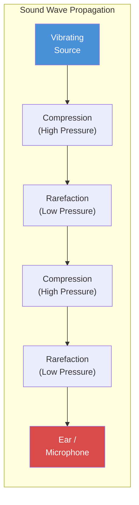
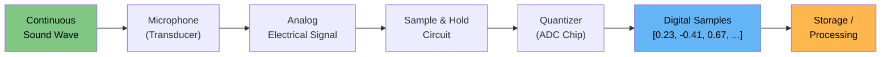
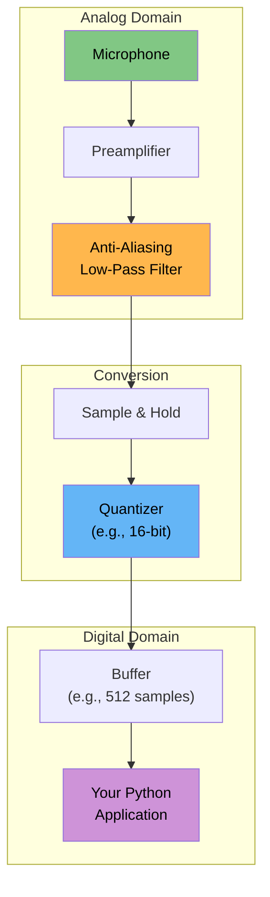
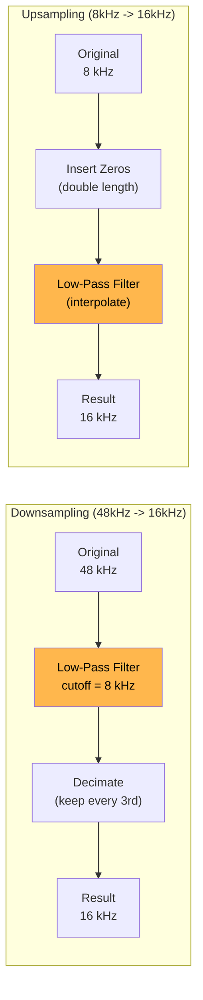

# Voice Agents Deep Dive -- Part 1: Audio Fundamentals -- Sound, Signals, and Digital Audio for Developers

---

**Series:** Building Voice Agents -- A Developer's Deep Dive from Audio Fundamentals to Production
**Part:** 1 of 20 (Audio Foundations)
**Audience:** Developers with Python experience who want to build voice-powered AI agents from the ground up
**Reading time:** ~50 minutes

---

## Recap of Part 0

In Part 0 we mapped out the entire landscape of voice agent development -- from raw audio capture all the way to production deployment. We introduced the voice pipeline architecture (ASR, NLU, Dialog Management, TTS) and set up our Python development environment with the core libraries we will use throughout this series. Now it is time to dive into the deepest foundation layer: **audio itself**. Before you can build anything that listens or speaks, you need to truly understand what sound is, how computers represent it, and how to manipulate it programmatically. This part will give you that foundation.

---

## Table of Contents

1. [What Sound Is](#1-what-sound-is)
2. [Analog to Digital Conversion](#2-analog-to-digital-conversion)
3. [Sample Rates](#3-sample-rates)
4. [Bit Depth and Quantization](#4-bit-depth-and-quantization)
5. [Audio Formats Deep Dive](#5-audio-formats-deep-dive)
6. [Recording Audio in Python](#6-recording-audio-in-python)
7. [Playing Audio](#7-playing-audio)
8. [Reading and Writing Audio Files](#8-reading-and-writing-audio-files)
9. [Audio Manipulation from Scratch](#9-audio-manipulation-from-scratch)
10. [Resampling](#10-resampling)
11. [Mono vs Stereo](#11-mono-vs-stereo)
12. [Project: Audio Recorder with Waveform Visualization](#12-project-audio-recorder-with-waveform-visualization)
13. [Vocabulary Cheat Sheet](#13-vocabulary-cheat-sheet)
14. [What's Next](#14-whats-next)

---

## 1. What Sound Is

### 1.1 Pressure Waves

Sound is a **mechanical wave** -- a disturbance that propagates through a medium (air, water, solids) as oscillations of pressure. When a guitar string vibrates, it pushes and pulls on air molecules surrounding it, creating regions of **compression** (high pressure) and **rarefaction** (low pressure) that radiate outward at approximately 343 meters per second in air at room temperature.



These pressure variations are what a microphone converts into electrical signals, and what a speaker converts back into pressure waves. The entire voice agent pipeline begins and ends with these physical phenomena.

### 1.2 The Four Properties of Sound

Every sound wave can be described by four fundamental properties:

| Property | Physical Meaning | Perceptual Equivalent | Unit |
|----------|-----------------|----------------------|------|
| **Frequency** | Oscillations per second | Pitch (high/low) | Hertz (Hz) |
| **Amplitude** | Maximum displacement from rest | Loudness (loud/quiet) | Pascals or dB |
| **Phase** | Position within a cycle at time t=0 | (Not directly perceived alone) | Degrees or radians |
| **Waveform Shape** | Shape of the oscillation | Timbre (tone quality) | -- |

**Frequency** determines pitch. The human ear can detect frequencies from roughly 20 Hz (a deep rumble) to 20,000 Hz (a piercing whistle). Human speech primarily occupies the range of 85 Hz to 8,000 Hz, with fundamental frequencies of male voices around 85-180 Hz and female voices around 165-255 Hz.

**Amplitude** determines loudness. We measure amplitude in **decibels (dB)**, a logarithmic scale where every 6 dB roughly doubles the perceived loudness. Normal conversation is about 60 dB SPL (Sound Pressure Level), while a whisper is around 30 dB SPL.

**Phase** describes where in its cycle a wave is at any given moment. While a single phase shift is inaudible on its own, phase relationships between multiple waves create constructive and destructive interference -- critical for beamforming in microphone arrays and noise cancellation.

**Waveform shape** (timbre) is what makes a violin sound different from a trumpet playing the same note at the same volume. It arises from the unique combination of **harmonics** (integer multiples of the fundamental frequency) that each sound source produces.

### 1.3 Implementing a Sine Wave Generator

Let us build our first piece of audio code -- a generator for pure tones (sine waves):

```python
"""
sine_wave_generator.py
Generate, visualize, and play pure tones at different frequencies.
"""

import numpy as np
import matplotlib.pyplot as plt

# --- Configuration ---
SAMPLE_RATE = 44100       # Samples per second (CD quality)
DURATION = 2.0            # Duration in seconds
AMPLITUDE = 0.5           # Peak amplitude (0.0 to 1.0)


def generate_sine_wave(
    frequency: float,
    duration: float = DURATION,
    sample_rate: int = SAMPLE_RATE,
    amplitude: float = AMPLITUDE,
    phase: float = 0.0,
) -> np.ndarray:
    """
    Generate a pure sine wave.

    Parameters
    ----------
    frequency : float
        Frequency in Hz.
    duration : float
        Duration in seconds.
    sample_rate : int
        Samples per second.
    amplitude : float
        Peak amplitude (0.0 to 1.0). Values above 1.0 will clip.
    phase : float
        Initial phase in radians.

    Returns
    -------
    np.ndarray
        1-D array of float64 samples in the range [-amplitude, +amplitude].
    """
    t = np.linspace(0, duration, int(sample_rate * duration), endpoint=False)
    signal = amplitude * np.sin(2 * np.pi * frequency * t + phase)
    return signal


def visualize_waveform(
    signal: np.ndarray,
    sample_rate: int = SAMPLE_RATE,
    title: str = "Waveform",
    duration_ms: float = 20.0,
) -> None:
    """Plot the first `duration_ms` milliseconds of a waveform."""
    samples_to_show = int(sample_rate * duration_ms / 1000)
    t_ms = np.arange(samples_to_show) / sample_rate * 1000

    plt.figure(figsize=(12, 4))
    plt.plot(t_ms, signal[:samples_to_show], linewidth=0.8, color="#2196F3")
    plt.xlabel("Time (ms)")
    plt.ylabel("Amplitude")
    plt.title(title)
    plt.grid(True, alpha=0.3)
    plt.tight_layout()
    plt.show()


# --- Generate tones at different frequencies ---
frequencies = {
    "Sub-bass (60 Hz)": 60,
    "Male voice fundamental (120 Hz)": 120,
    "Middle C / C4 (261.63 Hz)": 261.63,
    "A4 Concert pitch (440 Hz)": 440,
    "Female voice upper range (1000 Hz)": 1000,
    "Sibilance range (4000 Hz)": 4000,
}

fig, axes = plt.subplots(len(frequencies), 1, figsize=(14, 3 * len(frequencies)))

for idx, (label, freq) in enumerate(frequencies.items()):
    wave = generate_sine_wave(freq, duration=0.02)  # 20 ms for visualization
    t_ms = np.arange(len(wave)) / SAMPLE_RATE * 1000

    axes[idx].plot(t_ms, wave, linewidth=0.8)
    axes[idx].set_title(f"{label}", fontsize=11)
    axes[idx].set_ylabel("Amplitude")
    axes[idx].grid(True, alpha=0.3)
    axes[idx].set_xlim(0, 20)

axes[-1].set_xlabel("Time (ms)")
plt.tight_layout()
plt.savefig("sine_waves_comparison.png", dpi=150)
plt.show()


# --- Play the tones (requires sounddevice) ---
try:
    import sounddevice as sd

    print("Playing tones at different frequencies...\n")
    for label, freq in frequencies.items():
        wave = generate_sine_wave(freq, duration=1.0)
        print(f"  Playing: {label}")
        sd.play(wave.astype(np.float32), samplerate=SAMPLE_RATE)
        sd.wait()

except ImportError:
    print("Install sounddevice to play audio: pip install sounddevice")
```

> **Key Insight:** Notice that higher frequencies pack more oscillations into the same time window. At 4,000 Hz you get 80 full cycles in 20 ms, while at 60 Hz you get barely more than one cycle. This is why higher frequencies require higher sample rates to capture accurately -- a theme we will return to repeatedly.

### 1.4 Combining Waves: Superposition

Real-world sounds are never pure sine waves. They are **sums of many sine waves** at different frequencies, amplitudes, and phases. This principle -- called **superposition** -- is the foundation of all audio signal processing.

```python
"""
wave_superposition.py
Demonstrate how complex sounds are built from simple sine waves.
"""

import numpy as np
import matplotlib.pyplot as plt

SAMPLE_RATE = 44100


def build_complex_wave(
    fundamentals: list[tuple[float, float, float]],
    duration: float = 0.02,
    sample_rate: int = SAMPLE_RATE,
) -> np.ndarray:
    """
    Build a complex wave from a list of (frequency, amplitude, phase) tuples.

    Parameters
    ----------
    fundamentals : list of (freq_hz, amplitude, phase_rad)
    duration : float
    sample_rate : int

    Returns
    -------
    np.ndarray
        The summed waveform.
    """
    t = np.linspace(0, duration, int(sample_rate * duration), endpoint=False)
    signal = np.zeros_like(t)
    for freq, amp, phase in fundamentals:
        signal += amp * np.sin(2 * np.pi * freq * t + phase)
    return signal


# --- Build a "square-ish" wave from odd harmonics ---
fundamental = 220  # A3
harmonics = [(fundamental * (2 * k + 1), 1.0 / (2 * k + 1), 0.0) for k in range(8)]

fig, axes = plt.subplots(4, 1, figsize=(14, 10))

for idx, n_harmonics in enumerate([1, 3, 5, 8]):
    wave = build_complex_wave(harmonics[:n_harmonics])
    t_ms = np.arange(len(wave)) / SAMPLE_RATE * 1000
    axes[idx].plot(t_ms, wave, linewidth=0.8, color="#FF5722")
    axes[idx].set_title(f"{n_harmonics} harmonic(s) summed", fontsize=11)
    axes[idx].set_ylabel("Amplitude")
    axes[idx].grid(True, alpha=0.3)

axes[-1].set_xlabel("Time (ms)")
plt.tight_layout()
plt.savefig("wave_superposition.png", dpi=150)
plt.show()
```

> **Key Insight:** A square wave is the sum of all odd harmonics (1st, 3rd, 5th, ...) with amplitudes that decrease as 1/n. This is the foundation of **Fourier analysis**, which we will explore deeply in Part 2. Every sound -- your voice, music, noise -- can be decomposed into a unique recipe of sine waves.

---

## 2. Analog to Digital Conversion

### 2.1 The Bridge Between Physical and Digital

Sound in the real world is **continuous** -- the air pressure varies smoothly and uninterruptedly. Computers, however, work with **discrete numbers**. The process of converting a continuous analog signal into a sequence of discrete digital values is called **Analog-to-Digital Conversion (ADC)**, and it involves two key steps:

1. **Sampling** -- measuring the signal's amplitude at regular intervals
2. **Quantization** -- rounding each measurement to the nearest representable digital value



### 2.2 The Sampling Theorem (Nyquist-Shannon)

The **Nyquist-Shannon Sampling Theorem** is arguably the most important theorem in all of digital audio. It states:

> **A continuous signal can be perfectly reconstructed from its samples if the sampling rate is at least twice the highest frequency present in the signal.**

This critical threshold -- **twice the maximum frequency** -- is called the **Nyquist rate**. The highest frequency that can be represented at a given sample rate is called the **Nyquist frequency** (equal to half the sample rate).

$$f_{Nyquist} = \frac{f_{sample}}{2}$$

For example:
- At 44,100 Hz sample rate, Nyquist frequency = 22,050 Hz (above human hearing)
- At 16,000 Hz sample rate, Nyquist frequency = 8,000 Hz (captures most speech)
- At 8,000 Hz sample rate, Nyquist frequency = 4,000 Hz (telephone quality)

### 2.3 Aliasing: What Happens When You Break the Rules

When you sample a signal at a rate lower than the Nyquist rate, something insidious happens: high-frequency components **masquerade as lower frequencies**. This phenomenon is called **aliasing**, and it produces artifacts that cannot be removed after the fact.

Think of it like a movie camera filming a spinning wheel. If the wheel spins faster than half the frame rate, it appears to spin backward or at the wrong speed. The same thing happens with audio frequencies.

```python
"""
aliasing_demonstration.py
Visually demonstrate aliasing when the Nyquist criterion is violated.
"""

import numpy as np
import matplotlib.pyplot as plt


def demonstrate_aliasing():
    """Show what happens when a signal is under-sampled."""
    # The true signal: a 5 Hz sine wave
    true_frequency = 5  # Hz
    duration = 1.0  # second

    # "Continuous" signal (very high sample rate for plotting)
    t_continuous = np.linspace(0, duration, 10000, endpoint=False)
    signal_continuous = np.sin(2 * np.pi * true_frequency * t_continuous)

    # --- Case 1: Proper sampling (well above Nyquist) ---
    sample_rate_good = 40  # 40 Hz >> 2 * 5 Hz = 10 Hz
    t_good = np.arange(0, duration, 1 / sample_rate_good)
    samples_good = np.sin(2 * np.pi * true_frequency * t_good)

    # --- Case 2: Exactly at Nyquist (borderline) ---
    sample_rate_nyquist = 10  # Exactly 2 * 5 Hz
    t_nyquist = np.arange(0, duration, 1 / sample_rate_nyquist)
    samples_nyquist = np.sin(2 * np.pi * true_frequency * t_nyquist)

    # --- Case 3: Below Nyquist (aliasing!) ---
    sample_rate_bad = 7  # Below 2 * 5 Hz = 10 Hz
    t_bad = np.arange(0, duration, 1 / sample_rate_bad)
    samples_bad = np.sin(2 * np.pi * true_frequency * t_bad)

    # The aliased frequency: |f_true - f_sample| = |5 - 7| = 2 Hz
    alias_freq = abs(true_frequency - sample_rate_bad)
    alias_signal = np.sin(2 * np.pi * alias_freq * t_continuous)

    # --- Plotting ---
    fig, axes = plt.subplots(3, 1, figsize=(14, 10))

    # Good sampling
    axes[0].plot(t_continuous, signal_continuous, "b-", alpha=0.4, label="Original 5 Hz")
    axes[0].stem(t_good, samples_good, linefmt="g-", markerfmt="go", basefmt="g-",
                 label=f"Sampled at {sample_rate_good} Hz")
    axes[0].set_title(f"Proper Sampling: {sample_rate_good} Hz (Nyquist = {sample_rate_good//2} Hz > {true_frequency} Hz)")
    axes[0].legend()
    axes[0].grid(True, alpha=0.3)

    # Nyquist boundary
    axes[1].plot(t_continuous, signal_continuous, "b-", alpha=0.4, label="Original 5 Hz")
    axes[1].stem(t_nyquist, samples_nyquist, linefmt="y-", markerfmt="yo", basefmt="y-",
                 label=f"Sampled at {sample_rate_nyquist} Hz")
    axes[1].set_title(f"At Nyquist: {sample_rate_nyquist} Hz (Nyquist = {sample_rate_nyquist//2} Hz = {true_frequency} Hz)")
    axes[1].legend()
    axes[1].grid(True, alpha=0.3)

    # Under-sampling (aliasing)
    axes[2].plot(t_continuous, signal_continuous, "b-", alpha=0.4, label="Original 5 Hz")
    axes[2].plot(t_continuous, alias_signal, "r--", alpha=0.6, label=f"Alias at {alias_freq} Hz")
    axes[2].stem(t_bad, samples_bad, linefmt="r-", markerfmt="ro", basefmt="r-",
                 label=f"Sampled at {sample_rate_bad} Hz")
    axes[2].set_title(f"ALIASING: {sample_rate_bad} Hz (Nyquist = {sample_rate_bad/2} Hz < {true_frequency} Hz)")
    axes[2].legend()
    axes[2].grid(True, alpha=0.3)

    for ax in axes:
        ax.set_xlabel("Time (s)")
        ax.set_ylabel("Amplitude")

    plt.tight_layout()
    plt.savefig("aliasing_demo.png", dpi=150)
    plt.show()

    print(f"True frequency:    {true_frequency} Hz")
    print(f"Sample rate:       {sample_rate_bad} Hz")
    print(f"Nyquist frequency: {sample_rate_bad / 2} Hz")
    print(f"Aliased frequency: {alias_freq} Hz  (appears as {alias_freq} Hz instead of {true_frequency} Hz!)")


demonstrate_aliasing()
```

> **Key Insight for Voice Agents:** Aliasing is the reason every ADC (and every digital sample rate converter) includes an **anti-aliasing filter** -- a low-pass filter that removes all frequencies above the Nyquist frequency *before* sampling. When you resample speech from 44.1 kHz to 16 kHz for a speech recognition model, you must apply an anti-aliasing filter first, or high-frequency artifacts will corrupt the lower frequencies and degrade recognition accuracy.

### 2.4 The ADC Pipeline in Practice

In a real voice agent, the ADC pipeline looks like this:



Every stage matters:
- The **preamplifier** boosts the microphone's weak signal to a usable level
- The **anti-aliasing filter** prevents aliasing artifacts
- The **sample & hold** circuit freezes the analog value long enough for the quantizer to measure it
- The **quantizer** converts the held voltage to a digital number
- The **buffer** collects samples into chunks (frames) for efficient processing

---

## 3. Sample Rates

### 3.1 Why Different Sample Rates Exist

Not all audio applications need the same fidelity. Higher sample rates capture more frequency content but produce more data. The choice of sample rate is always a trade-off between **quality** and **efficiency**.

| Sample Rate | Nyquist Freq | Primary Use Case | Data Rate (16-bit mono) |
|------------|-------------|-----------------|------------------------|
| **8,000 Hz** | 4,000 Hz | Telephony (G.711, GSM) | 16 KB/s |
| **11,025 Hz** | 5,512 Hz | Low-quality speech | 22 KB/s |
| **16,000 Hz** | 8,000 Hz | Speech recognition (Whisper, etc.) | 32 KB/s |
| **22,050 Hz** | 11,025 Hz | AM radio, podcasts | 44 KB/s |
| **44,100 Hz** | 22,050 Hz | CD quality music | 88 KB/s |
| **48,000 Hz** | 24,000 Hz | Professional video/broadcast | 96 KB/s |
| **96,000 Hz** | 48,000 Hz | Hi-res audio production | 192 KB/s |

### 3.2 Why 44,100 Hz Specifically?

The CD standard sample rate of 44,100 Hz has a fascinating origin. Human hearing extends to roughly 20,000 Hz, so the Nyquist rate requires at least 40,000 Hz. The extra 4,100 Hz provides headroom for the anti-aliasing filter's transition band (no filter cuts off perfectly sharply). The specific number 44,100 was also chosen because it is divisible by many small integers (2, 3, 5, 7), which made it compatible with both NTSC and PAL video frame rates for early digital recording on video tape.

### 3.3 Why 16,000 Hz for Speech Recognition

Most speech recognition models, including OpenAI's Whisper, expect audio at **16,000 Hz**. This is not arbitrary:

- Human speech fundamental frequencies range from ~85 Hz to ~255 Hz
- The most important formant frequencies (vowel shapes) extend to about 4,000 Hz
- Consonant energy (especially fricatives like /s/, /f/) extends to about 8,000 Hz
- 16,000 Hz captures up to 8,000 Hz -- covering virtually all speech-relevant information
- Higher frequencies add noise and computational cost without improving recognition

### 3.4 Comparing Audio at Different Sample Rates

```python
"""
sample_rate_comparison.py
Demonstrate the quality impact of different sample rates on speech-like audio.
"""

import numpy as np
import matplotlib.pyplot as plt

try:
    import sounddevice as sd
    HAS_SOUNDDEVICE = True
except ImportError:
    HAS_SOUNDDEVICE = False

try:
    import librosa
    HAS_LIBROSA = True
except ImportError:
    HAS_LIBROSA = False


def create_speech_like_signal(
    duration: float = 2.0,
    sample_rate: int = 48000,
) -> np.ndarray:
    """
    Create a synthetic speech-like signal with multiple frequency components.
    Real speech has formants -- resonant frequencies that define vowel sounds.
    We simulate this with a few sine waves at typical formant frequencies.
    """
    t = np.linspace(0, duration, int(sample_rate * duration), endpoint=False)

    # Fundamental frequency (male voice)
    f0 = 120
    signal = 0.3 * np.sin(2 * np.pi * f0 * t)

    # First formant (F1) -- typically 300-800 Hz for vowels
    signal += 0.25 * np.sin(2 * np.pi * 500 * t)

    # Second formant (F2) -- typically 800-2500 Hz
    signal += 0.2 * np.sin(2 * np.pi * 1800 * t)

    # Third formant (F3) -- typically 2500-3500 Hz
    signal += 0.15 * np.sin(2 * np.pi * 2800 * t)

    # Fricative-like high-frequency energy (sibilance)
    signal += 0.08 * np.sin(2 * np.pi * 6000 * t)

    # Very high frequency content (above 8 kHz -- lost at 16 kHz sample rate)
    signal += 0.05 * np.sin(2 * np.pi * 10000 * t)
    signal += 0.03 * np.sin(2 * np.pi * 15000 * t)

    # Normalize to prevent clipping
    signal = signal / np.max(np.abs(signal)) * 0.8

    return signal


def downsample_naive(signal: np.ndarray, original_sr: int, target_sr: int) -> np.ndarray:
    """
    Naive downsampling by decimation (NO anti-aliasing filter).
    This will produce aliasing artifacts!
    """
    ratio = original_sr / target_sr
    indices = np.round(np.arange(0, len(signal), ratio)).astype(int)
    indices = indices[indices < len(signal)]
    return signal[indices]


def downsample_proper(signal: np.ndarray, original_sr: int, target_sr: int) -> np.ndarray:
    """
    Proper downsampling using librosa (includes anti-aliasing filter).
    """
    if HAS_LIBROSA:
        return librosa.resample(signal, orig_sr=original_sr, target_sr=target_sr)
    else:
        # Fallback: use scipy
        from scipy.signal import resample
        num_samples = int(len(signal) * target_sr / original_sr)
        return resample(signal, num_samples)


# --- Generate the reference signal at 48 kHz ---
original_sr = 48000
speech_signal = create_speech_like_signal(duration=2.0, sample_rate=original_sr)

# --- Downsample to various rates ---
target_rates = [44100, 22050, 16000, 8000]
downsampled = {}

for target_sr in target_rates:
    downsampled[target_sr] = downsample_proper(speech_signal, original_sr, target_sr)
    data_rate_kbps = target_sr * 16 / 8 / 1024  # 16-bit mono, KB/s
    print(f"  {target_sr:>6} Hz -> {len(downsampled[target_sr]):>7} samples "
          f"({data_rate_kbps:.1f} KB/s)")

# --- Visualize frequency content at each rate ---
fig, axes = plt.subplots(len(target_rates) + 1, 1, figsize=(14, 3 * (len(target_rates) + 1)))

# Original
from scipy.fft import fft, fftfreq

N = len(speech_signal)
yf = np.abs(fft(speech_signal))[:N // 2]
xf = fftfreq(N, 1 / original_sr)[:N // 2]
axes[0].plot(xf, yf, linewidth=0.5, color="#2196F3")
axes[0].set_title(f"Original: {original_sr} Hz (Nyquist = {original_sr // 2} Hz)")
axes[0].set_ylabel("Magnitude")
axes[0].set_xlim(0, 24000)
axes[0].grid(True, alpha=0.3)

for idx, target_sr in enumerate(target_rates, 1):
    sig = downsampled[target_sr]
    N = len(sig)
    yf = np.abs(fft(sig))[:N // 2]
    xf = fftfreq(N, 1 / target_sr)[:N // 2]
    axes[idx].plot(xf, yf, linewidth=0.5, color="#FF5722")
    axes[idx].set_title(f"Resampled: {target_sr} Hz (Nyquist = {target_sr // 2} Hz)")
    axes[idx].set_ylabel("Magnitude")
    axes[idx].set_xlim(0, 24000)
    axes[idx].grid(True, alpha=0.3)
    # Draw Nyquist line
    axes[idx].axvline(x=target_sr / 2, color="red", linestyle="--", alpha=0.5,
                      label=f"Nyquist = {target_sr // 2} Hz")
    axes[idx].legend()

axes[-1].set_xlabel("Frequency (Hz)")
plt.tight_layout()
plt.savefig("sample_rate_comparison.png", dpi=150)
plt.show()

# --- Play each version ---
if HAS_SOUNDDEVICE:
    print("\nPlaying at different sample rates:")
    print("  (Listen for quality differences, especially in high frequencies)\n")

    for sr_label, sig, sr in [("48000 Hz (original)", speech_signal, original_sr)] + \
                               [(f"{sr} Hz", downsampled[sr], sr) for sr in target_rates]:
        print(f"  Playing: {sr_label}")
        sd.play(sig.astype(np.float32), samplerate=sr)
        sd.wait()
```

> **Key Insight:** When building voice agents, you almost always want to work at **16,000 Hz** for the speech-processing pipeline. Record at whatever rate your hardware provides (often 44,100 or 48,000 Hz), then immediately resample to 16,000 Hz before passing audio to your ASR model. This reduces memory, bandwidth, and computation by 3x compared to 48 kHz, with zero loss of speech recognition accuracy.

---

## 4. Bit Depth and Quantization

### 4.1 What Bit Depth Means

While sample rate determines how often we measure the signal, **bit depth** determines how precisely we measure each sample. Bit depth defines the number of discrete amplitude levels available:

| Bit Depth | Levels | Dynamic Range | Typical Use |
|-----------|--------|--------------|-------------|
| **8-bit** | 256 | ~48 dB | Early games, telephony |
| **16-bit** | 65,536 | ~96 dB | CD audio, speech processing |
| **24-bit** | 16,777,216 | ~144 dB | Professional recording |
| **32-bit float** | ~4.3 billion | ~1,528 dB (theoretical) | Internal processing, ML models |

The **dynamic range** in decibels is calculated as:

$$DR = 20 \times \log_{10}(2^{n}) \approx 6.02 \times n \text{ dB}$$

Where *n* is the number of bits. This means each additional bit adds approximately 6 dB of dynamic range.

### 4.2 Quantization Noise

When we round a continuous value to the nearest discrete level, we introduce **quantization error** -- the difference between the true value and the quantized value. This error manifests as noise, called **quantization noise**.

For a properly dithered signal, the **Signal-to-Quantization-Noise Ratio (SQNR)** is:

$$SQNR = 6.02 \times n + 1.76 \text{ dB}$$

At 16 bits: SQNR = 98.09 dB -- meaning the noise floor is about 98 dB below the signal. This is why 16-bit audio sounds essentially perfect for most applications.

At 8 bits: SQNR = 49.92 dB -- the noise floor is only about 50 dB below the signal, which is clearly audible as a grainy, harsh texture.

### 4.3 Implementing Quantization from Scratch

```python
"""
quantization_demo.py
Quantize a signal to different bit depths and measure the quality impact.
"""

import numpy as np
import matplotlib.pyplot as plt


def quantize_signal(signal: np.ndarray, bit_depth: int) -> np.ndarray:
    """
    Quantize a floating-point signal to a given bit depth.

    Parameters
    ----------
    signal : np.ndarray
        Input signal with values in [-1.0, 1.0].
    bit_depth : int
        Target bit depth (e.g., 8, 16, 24).

    Returns
    -------
    np.ndarray
        Quantized signal (still float, but with only 2^bit_depth distinct values).
    """
    # Number of quantization levels
    levels = 2 ** bit_depth

    # Scale to integer range, round, then scale back
    # For signed audio: range is [-2^(n-1), 2^(n-1) - 1]
    scale = levels / 2
    quantized = np.round(signal * scale) / scale

    # Clip to valid range
    quantized = np.clip(quantized, -1.0, 1.0)

    return quantized


def calculate_snr(original: np.ndarray, quantized: np.ndarray) -> float:
    """
    Calculate the Signal-to-Noise Ratio between original and quantized signals.

    Returns
    -------
    float
        SNR in decibels.
    """
    noise = original - quantized
    signal_power = np.mean(original ** 2)
    noise_power = np.mean(noise ** 2)

    if noise_power == 0:
        return float("inf")

    snr_db = 10 * np.log10(signal_power / noise_power)
    return snr_db


# --- Generate a test signal ---
SAMPLE_RATE = 44100
duration = 0.05  # 50 ms for visualization
t = np.linspace(0, duration, int(SAMPLE_RATE * duration), endpoint=False)

# A rich signal with multiple harmonics
signal = (
    0.5 * np.sin(2 * np.pi * 440 * t)
    + 0.3 * np.sin(2 * np.pi * 880 * t)
    + 0.15 * np.sin(2 * np.pi * 1320 * t)
    + 0.08 * np.sin(2 * np.pi * 1760 * t)
)
signal = signal / np.max(np.abs(signal)) * 0.9  # Normalize

# --- Quantize to different bit depths ---
bit_depths = [2, 4, 8, 16]

fig, axes = plt.subplots(len(bit_depths) + 1, 1, figsize=(14, 3 * (len(bit_depths) + 1)))
t_ms = t * 1000

# Plot original
axes[0].plot(t_ms, signal, linewidth=0.8, color="#2196F3")
axes[0].set_title("Original (64-bit float)", fontsize=11)
axes[0].set_ylabel("Amplitude")
axes[0].grid(True, alpha=0.3)

print("Quantization Quality Comparison")
print("=" * 55)
print(f"{'Bit Depth':>10} {'Levels':>10} {'SNR (dB)':>12} {'Theoretical':>14}")
print("-" * 55)

for idx, bits in enumerate(bit_depths, 1):
    quantized = quantize_signal(signal, bits)
    snr = calculate_snr(signal, quantized)
    theoretical_snr = 6.02 * bits + 1.76

    print(f"{bits:>10} {2**bits:>10,} {snr:>12.2f} {theoretical_snr:>14.2f}")

    axes[idx].plot(t_ms, quantized, linewidth=0.8, color="#FF5722")
    axes[idx].set_title(f"{bits}-bit ({2**bits} levels) -- SNR: {snr:.1f} dB", fontsize=11)
    axes[idx].set_ylabel("Amplitude")
    axes[idx].grid(True, alpha=0.3)

    # Overlay the quantization error
    error = signal - quantized
    ax_err = axes[idx].twinx()
    ax_err.plot(t_ms, error, linewidth=0.3, color="red", alpha=0.5)
    ax_err.set_ylabel("Error", color="red", fontsize=8)
    ax_err.tick_params(axis="y", labelcolor="red", labelsize=7)

axes[-1].set_xlabel("Time (ms)")
plt.tight_layout()
plt.savefig("quantization_comparison.png", dpi=150)
plt.show()

# --- Quantization noise spectrum ---
print("\n\nQuantization Noise Analysis")
print("=" * 55)

fig2, axes2 = plt.subplots(2, 2, figsize=(14, 8))

for idx, bits in enumerate(bit_depths):
    ax = axes2[idx // 2][idx % 2]
    quantized = quantize_signal(signal, bits)
    noise = signal - quantized

    # Compute noise spectrum
    N = len(noise)
    noise_spectrum = np.abs(np.fft.fft(noise))[:N // 2]
    freqs = np.fft.fftfreq(N, 1 / SAMPLE_RATE)[:N // 2]

    ax.plot(freqs, 20 * np.log10(noise_spectrum + 1e-10), linewidth=0.5, color="red")
    ax.set_title(f"{bits}-bit Quantization Noise Spectrum")
    ax.set_xlabel("Frequency (Hz)")
    ax.set_ylabel("Magnitude (dB)")
    ax.grid(True, alpha=0.3)
    ax.set_xlim(0, SAMPLE_RATE / 2)

plt.tight_layout()
plt.savefig("quantization_noise_spectrum.png", dpi=150)
plt.show()
```

> **Key Insight:** For voice agents, **16-bit** PCM is the standard working format. It provides 96 dB of dynamic range -- more than enough for any voice application. When interfacing with machine learning models, you will typically convert to **32-bit float** (values in [-1.0, 1.0]) for numerical stability during processing, then convert back to 16-bit for storage or playback.

---

## 5. Audio Formats Deep Dive

### 5.1 The Landscape of Audio Formats

Audio formats fall into three categories:

1. **Uncompressed** -- raw samples, no data reduction (WAV/PCM, AIFF)
2. **Lossless compressed** -- mathematically reversible compression (FLAC, ALAC)
3. **Lossy compressed** -- perceptually driven compression, irreversible (MP3, AAC, Opus, Vorbis)

Additionally, telephony uses specialized **companding** codecs (mu-law, A-law) that are technically lossy but designed specifically for voice.

### 5.2 Format Comparison

| Format | Type | Compression Ratio | Latency | Quality | Voice Agent Use Case |
|--------|------|-------------------|---------|---------|---------------------|
| **WAV/PCM** | Uncompressed | 1:1 | Zero | Perfect | Local processing, recording |
| **FLAC** | Lossless | ~2:1 | Low | Perfect | Archival storage |
| **MP3** | Lossy | ~10:1 | Medium | Good | Podcast distribution |
| **OGG/Vorbis** | Lossy | ~10:1 | Medium | Good | Web streaming |
| **Opus** | Lossy | ~12:1 | **Very Low** | Excellent | **Real-time voice (WebRTC)** |
| **AAC** | Lossy | ~10:1 | Medium | Very Good | Apple ecosystem |
| **mu-law** | Companded | ~2:1 | Zero | Adequate | Traditional telephony |
| **A-law** | Companded | ~2:1 | Zero | Adequate | European telephony |

### 5.3 WAV/PCM: The Foundation

WAV (Waveform Audio File Format) is the most straightforward audio format. It is essentially a RIFF container wrapping raw PCM (Pulse Code Modulation) data. The file structure is:

```
WAV File Structure:
+------------------+
| RIFF Header      |  12 bytes: "RIFF" + file size + "WAVE"
+------------------+
| fmt  Chunk       |  24 bytes: format tag, channels, sample rate,
|                  |            byte rate, block align, bits per sample
+------------------+
| data Chunk       |  8 bytes header + raw PCM samples
|  [sample 1]      |
|  [sample 2]      |
|  [sample 3]      |
|  ...             |
+------------------+
```

### 5.4 Opus: The King of Real-Time Voice

For voice agents, **Opus** is the most important lossy codec. Designed specifically for interactive real-time communication, it offers:

- **Algorithmic latency as low as 2.5 ms** (compared to ~100 ms for MP3)
- Bitrates from 6 kbit/s (narrowband voice) to 510 kbit/s (full-band stereo music)
- Seamless switching between SILK (voice-optimized) and CELT (music-optimized) modes
- Built into WebRTC, making it the default for browser-based voice agents
- Open, royalty-free standard

### 5.5 mu-law and A-law Companding

Traditional telephony uses **companding** (compressing + expanding) codecs that allocate more quantization levels to quiet sounds and fewer to loud sounds, following the observation that speech amplitude is approximately logarithmically distributed.

**mu-law** (used in North America and Japan):

$$F(x) = \text{sgn}(x) \cdot \frac{\ln(1 + \mu|x|)}{\ln(1 + \mu)}$$

where $\mu = 255$ for the standard 8-bit encoding.

**A-law** (used in Europe and most other regions):

$$F(x) = \text{sgn}(x) \cdot \begin{cases} \frac{A|x|}{1 + \ln(A)} & |x| < \frac{1}{A} \\ \frac{1 + \ln(A|x|)}{1 + \ln(A)} & \frac{1}{A} \leq |x| \leq 1 \end{cases}$$

where $A = 87.6$.

### 5.6 Working with Audio Formats in Python

```python
"""
audio_formats.py
Read, write, and compare different audio formats.
"""

import numpy as np
import os
import struct

try:
    import soundfile as sf
    HAS_SOUNDFILE = True
except ImportError:
    HAS_SOUNDFILE = False

try:
    from pydub import AudioSegment
    HAS_PYDUB = True
except ImportError:
    HAS_PYDUB = False


def generate_test_signal(duration: float = 3.0, sample_rate: int = 44100) -> np.ndarray:
    """Generate a test signal with speech-like characteristics."""
    t = np.linspace(0, duration, int(sample_rate * duration), endpoint=False)
    signal = (
        0.4 * np.sin(2 * np.pi * 150 * t)            # Fundamental
        + 0.3 * np.sin(2 * np.pi * 500 * t)           # F1
        + 0.2 * np.sin(2 * np.pi * 1800 * t)          # F2
        + 0.1 * np.sin(2 * np.pi * 3200 * t)          # F3
        + 0.05 * np.random.randn(len(t))               # Breath noise
    )
    signal = signal / np.max(np.abs(signal)) * 0.8
    return signal.astype(np.float32)


# =====================================================
# Method 1: Using soundfile (recommended for WAV/FLAC)
# =====================================================
if HAS_SOUNDFILE:
    signal = generate_test_signal()
    sr = 44100

    # --- Write WAV (16-bit PCM) ---
    sf.write("test_pcm16.wav", signal, sr, subtype="PCM_16")
    print(f"WAV PCM-16:  {os.path.getsize('test_pcm16.wav'):>10,} bytes")

    # --- Write WAV (24-bit PCM) ---
    sf.write("test_pcm24.wav", signal, sr, subtype="PCM_24")
    print(f"WAV PCM-24:  {os.path.getsize('test_pcm24.wav'):>10,} bytes")

    # --- Write WAV (32-bit float) ---
    sf.write("test_float32.wav", signal, sr, subtype="FLOAT")
    print(f"WAV Float32: {os.path.getsize('test_float32.wav'):>10,} bytes")

    # --- Write FLAC ---
    sf.write("test.flac", signal, sr)
    print(f"FLAC:        {os.path.getsize('test.flac'):>10,} bytes")

    # --- Write OGG/Vorbis ---
    sf.write("test.ogg", signal, sr)
    print(f"OGG/Vorbis:  {os.path.getsize('test.ogg'):>10,} bytes")

    # --- Read back and verify ---
    data_back, sr_back = sf.read("test_pcm16.wav")
    print(f"\nRead back: {len(data_back)} samples at {sr_back} Hz")
    print(f"Data type: {data_back.dtype}")
    print(f"Value range: [{data_back.min():.4f}, {data_back.max():.4f}]")


# =====================================================
# Method 2: Using pydub (good for MP3 and format conversion)
# =====================================================
if HAS_PYDUB:
    # Convert WAV to MP3 (requires ffmpeg)
    try:
        audio = AudioSegment.from_wav("test_pcm16.wav")

        # Export at different MP3 bitrates
        for bitrate in ["32k", "64k", "128k", "192k", "320k"]:
            filename = f"test_{bitrate}.mp3"
            audio.export(filename, format="mp3", bitrate=bitrate)
            print(f"MP3 {bitrate:>4}:   {os.path.getsize(filename):>10,} bytes")
    except Exception as e:
        print(f"MP3 export requires ffmpeg: {e}")


# =====================================================
# Manual mu-law encoding/decoding
# =====================================================
def mu_law_encode(signal: np.ndarray, mu: int = 255) -> np.ndarray:
    """
    Apply mu-law companding to a signal.

    Parameters
    ----------
    signal : np.ndarray
        Input signal in [-1.0, 1.0].
    mu : int
        Compression parameter (255 for standard telephony).

    Returns
    -------
    np.ndarray
        Compressed signal in [-1.0, 1.0].
    """
    return np.sign(signal) * np.log1p(mu * np.abs(signal)) / np.log1p(mu)


def mu_law_decode(signal: np.ndarray, mu: int = 255) -> np.ndarray:
    """Reverse mu-law companding."""
    return np.sign(signal) * (1.0 / mu) * ((1.0 + mu) ** np.abs(signal) - 1.0)


# Demonstrate mu-law
import matplotlib.pyplot as plt

x = np.linspace(-1, 1, 1000)
fig, axes = plt.subplots(1, 2, figsize=(14, 5))

# Transfer function
for mu_val in [0, 5, 25, 100, 255]:
    if mu_val == 0:
        y = x  # Linear (no companding)
        label = "Linear (no companding)"
    else:
        y = mu_law_encode(x, mu=mu_val)
        label = f"mu = {mu_val}"
    axes[0].plot(x, y, label=label)

axes[0].set_xlabel("Input Amplitude")
axes[0].set_ylabel("Output Amplitude")
axes[0].set_title("mu-law Companding Transfer Function")
axes[0].legend()
axes[0].grid(True, alpha=0.3)
axes[0].set_aspect("equal")

# Show effect on quiet vs loud parts
test_signal = generate_test_signal(duration=0.02, sample_rate=44100) * 0.1  # Quiet signal
t_ms = np.arange(len(test_signal)) / 44100 * 1000

compressed = mu_law_encode(test_signal, mu=255)
axes[1].plot(t_ms, test_signal, alpha=0.7, label="Original (quiet)")
axes[1].plot(t_ms, compressed, alpha=0.7, label="mu-law compressed")
axes[1].set_xlabel("Time (ms)")
axes[1].set_ylabel("Amplitude")
axes[1].set_title("mu-law Boosts Quiet Signals")
axes[1].legend()
axes[1].grid(True, alpha=0.3)

plt.tight_layout()
plt.savefig("mu_law_demo.png", dpi=150)
plt.show()
```

> **Key Insight:** For voice agent pipelines, you will encounter WAV/PCM for local processing, Opus for real-time streaming (especially over WebRTC), and mu-law/A-law when integrating with traditional telephony systems via SIP/PSTN gateways. Know all three; the format mismatch between systems is one of the most common sources of bugs in voice agent deployments.

---

## 6. Recording Audio in Python

### 6.1 The Two Main Libraries

Python offers two primary libraries for audio recording:

1. **sounddevice** -- Pythonic, NumPy-native, built on PortAudio. Recommended for most use cases.
2. **pyaudio** -- Lower-level, callback-based, also built on PortAudio. More control, more complexity.

### 6.2 Recording with sounddevice (Recommended)

```python
"""
recording_sounddevice.py
Record audio from the microphone using sounddevice.
"""

import numpy as np
import sounddevice as sd
import soundfile as sf
import sys


# =====================================================
# List available audio devices
# =====================================================
def list_audio_devices():
    """Print all available audio devices with their properties."""
    print("Available Audio Devices:")
    print("=" * 80)
    devices = sd.query_devices()
    for i, dev in enumerate(devices):
        direction = ""
        if dev["max_input_channels"] > 0:
            direction += "IN"
        if dev["max_output_channels"] > 0:
            direction += "/OUT" if direction else "OUT"

        default_marker = ""
        if i == sd.default.device[0]:
            default_marker += " [DEFAULT INPUT]"
        if i == sd.default.device[1]:
            default_marker += " [DEFAULT OUTPUT]"

        print(f"  [{i:>2}] {dev['name']:<45} {direction:<7} "
              f"SR={dev['default_samplerate']:.0f} Hz "
              f"(in={dev['max_input_channels']}, out={dev['max_output_channels']})"
              f"{default_marker}")
    print()


list_audio_devices()


# =====================================================
# Approach 1: Simple blocking recording
# =====================================================
def record_blocking(
    duration: float = 5.0,
    sample_rate: int = 16000,
    channels: int = 1,
    device: int | None = None,
) -> np.ndarray:
    """
    Record audio using a simple blocking call.
    The function blocks until recording is complete.

    Parameters
    ----------
    duration : float
        Recording duration in seconds.
    sample_rate : int
        Sample rate in Hz.
    channels : int
        Number of channels (1 for mono, 2 for stereo).
    device : int or None
        Audio device index. None for default.

    Returns
    -------
    np.ndarray
        Recorded audio with shape (n_samples, channels).
    """
    print(f"Recording {duration}s of audio at {sample_rate} Hz...")
    audio = sd.rec(
        frames=int(duration * sample_rate),
        samplerate=sample_rate,
        channels=channels,
        dtype=np.float32,
        device=device,
    )
    sd.wait()  # Block until recording finishes
    print("Recording complete.")
    return audio


# =====================================================
# Approach 2: Streaming recording with callback
# =====================================================
class StreamingRecorder:
    """
    Record audio using a callback-based stream.
    This is the approach you will use in voice agents because it allows
    real-time processing of audio as it arrives.
    """

    def __init__(
        self,
        sample_rate: int = 16000,
        channels: int = 1,
        block_size: int = 1024,
        device: int | None = None,
    ):
        self.sample_rate = sample_rate
        self.channels = channels
        self.block_size = block_size
        self.device = device
        self.recording = False
        self.audio_buffer: list[np.ndarray] = []

    def _audio_callback(self, indata, frames, time_info, status):
        """Called by sounddevice for each audio block."""
        if status:
            print(f"Audio callback status: {status}", file=sys.stderr)
        if self.recording:
            self.audio_buffer.append(indata.copy())

    def start(self):
        """Start recording."""
        self.audio_buffer = []
        self.recording = True
        self.stream = sd.InputStream(
            samplerate=self.sample_rate,
            channels=self.channels,
            blocksize=self.block_size,
            dtype=np.float32,
            device=self.device,
            callback=self._audio_callback,
        )
        self.stream.start()
        print(f"Recording started (SR={self.sample_rate}, "
              f"channels={self.channels}, block={self.block_size})")

    def stop(self) -> np.ndarray:
        """Stop recording and return the audio data."""
        self.recording = False
        self.stream.stop()
        self.stream.close()

        if not self.audio_buffer:
            return np.array([], dtype=np.float32)

        audio = np.concatenate(self.audio_buffer, axis=0)
        duration = len(audio) / self.sample_rate
        print(f"Recording stopped. Captured {duration:.2f}s ({len(audio)} samples)")
        return audio

    def get_current_buffer(self) -> np.ndarray:
        """Get the audio recorded so far without stopping."""
        if not self.audio_buffer:
            return np.array([], dtype=np.float32)
        return np.concatenate(self.audio_buffer, axis=0)


# =====================================================
# Usage example
# =====================================================
if __name__ == "__main__":
    import time

    # --- Blocking recording ---
    audio = record_blocking(duration=3.0, sample_rate=16000, channels=1)
    sf.write("recording_blocking.wav", audio, 16000)
    print(f"Saved to recording_blocking.wav ({audio.shape})\n")

    # --- Streaming recording ---
    recorder = StreamingRecorder(sample_rate=16000, channels=1, block_size=512)
    recorder.start()

    print("Recording for 3 seconds...")
    time.sleep(3.0)

    audio = recorder.stop()
    sf.write("recording_streaming.wav", audio, 16000)
    print(f"Saved to recording_streaming.wav ({audio.shape})")
```

### 6.3 Recording with PyAudio (Alternative)

```python
"""
recording_pyaudio.py
Record audio using PyAudio (lower-level alternative).
"""

import numpy as np
import wave
import struct

try:
    import pyaudio
    HAS_PYAUDIO = True
except ImportError:
    HAS_PYAUDIO = False
    print("PyAudio not installed. Install with: pip install pyaudio")


if HAS_PYAUDIO:

    class PyAudioRecorder:
        """Record audio using PyAudio with callback-based approach."""

        FORMAT = pyaudio.paInt16
        SAMPLE_WIDTH = 2  # bytes per sample for paInt16

        def __init__(
            self,
            sample_rate: int = 16000,
            channels: int = 1,
            chunk_size: int = 1024,
            device_index: int | None = None,
        ):
            self.sample_rate = sample_rate
            self.channels = channels
            self.chunk_size = chunk_size
            self.device_index = device_index
            self.frames: list[bytes] = []
            self.pa = pyaudio.PyAudio()

        def _callback(self, in_data, frame_count, time_info, status_flags):
            """PyAudio callback -- receives raw bytes."""
            self.frames.append(in_data)
            return (None, pyaudio.paContinue)

        def list_devices(self):
            """List available input devices."""
            print("PyAudio Input Devices:")
            for i in range(self.pa.get_device_count()):
                info = self.pa.get_device_info_by_index(i)
                if info["maxInputChannels"] > 0:
                    print(f"  [{i}] {info['name']} "
                          f"(inputs={info['maxInputChannels']}, "
                          f"SR={info['defaultSampleRate']:.0f})")

        def record(self, duration: float) -> np.ndarray:
            """Record for a fixed duration, return as numpy array."""
            self.frames = []

            stream = self.pa.open(
                format=self.FORMAT,
                channels=self.channels,
                rate=self.sample_rate,
                input=True,
                input_device_index=self.device_index,
                frames_per_buffer=self.chunk_size,
                stream_callback=self._callback,
            )

            print(f"Recording {duration}s...")
            stream.start_stream()

            import time
            time.sleep(duration)

            stream.stop_stream()
            stream.close()

            # Convert raw bytes to numpy array
            raw_data = b"".join(self.frames)
            audio = np.frombuffer(raw_data, dtype=np.int16).astype(np.float32)
            audio = audio / 32768.0  # Normalize to [-1.0, 1.0]

            print(f"Recorded {len(audio)} samples")
            return audio

        def save_wav(self, filename: str, audio_bytes: bytes | None = None):
            """Save recorded frames to a WAV file."""
            if audio_bytes is None:
                audio_bytes = b"".join(self.frames)

            with wave.open(filename, "wb") as wf:
                wf.setnchannels(self.channels)
                wf.setsampwidth(self.SAMPLE_WIDTH)
                wf.setframerate(self.sample_rate)
                wf.writeframes(audio_bytes)
            print(f"Saved to {filename}")

        def __del__(self):
            self.pa.terminate()

    # Usage
    recorder = PyAudioRecorder(sample_rate=16000, channels=1)
    recorder.list_devices()
    audio = recorder.record(duration=3.0)
    recorder.save_wav("pyaudio_recording.wav")
```

> **Key Insight:** For voice agents, always use the **callback-based** (streaming) approach. You need to process audio in real time -- detecting speech onset, streaming to ASR, monitoring volume levels -- and the blocking approach cannot do that. The streaming recorder we built here is the foundation for the Voice Activity Detection (VAD) system we will build in Part 3.

---

## 7. Playing Audio

### 7.1 Playback Methods

Playing audio is the reverse of recording: we send digital samples to a DAC (Digital-to-Analog Converter) which drives a speaker.

```python
"""
audio_playback.py
Different methods for playing audio in Python.
"""

import numpy as np

try:
    import sounddevice as sd
    HAS_SD = True
except ImportError:
    HAS_SD = False

try:
    import soundfile as sf
    HAS_SF = True
except ImportError:
    HAS_SF = False


# =====================================================
# Method 1: Play a numpy array directly
# =====================================================
def play_array(audio: np.ndarray, sample_rate: int = 16000, blocking: bool = True):
    """
    Play audio from a numpy array.

    Parameters
    ----------
    audio : np.ndarray
        Audio samples (float32, range [-1.0, 1.0]).
    sample_rate : int
        Sample rate of the audio.
    blocking : bool
        If True, block until playback finishes.
    """
    if not HAS_SD:
        print("sounddevice not available")
        return

    sd.play(audio.astype(np.float32), samplerate=sample_rate)
    if blocking:
        sd.wait()


# =====================================================
# Method 2: Play from a file
# =====================================================
def play_file(filepath: str, blocking: bool = True):
    """Play an audio file."""
    if not (HAS_SD and HAS_SF):
        print("sounddevice and soundfile required")
        return

    data, sr = sf.read(filepath, dtype="float32")
    print(f"Playing: {filepath} ({len(data)/sr:.2f}s, {sr} Hz, {data.ndim}ch)")
    sd.play(data, samplerate=sr)
    if blocking:
        sd.wait()


# =====================================================
# Method 3: Non-blocking playback with status tracking
# =====================================================
class AudioPlayer:
    """Non-blocking audio player with status tracking."""

    def __init__(self):
        self.stream = None
        self.audio_data = None
        self.position = 0
        self.is_playing = False
        self.sample_rate = None

    def _callback(self, outdata, frames, time_info, status):
        """Callback to feed audio data to the output stream."""
        if status:
            print(f"Playback status: {status}")

        remaining = len(self.audio_data) - self.position
        if remaining == 0:
            outdata[:] = 0
            raise sd.CallbackStop()

        valid_frames = min(frames, remaining)
        outdata[:valid_frames] = self.audio_data[
            self.position : self.position + valid_frames
        ].reshape(-1, 1)
        outdata[valid_frames:] = 0
        self.position += valid_frames

    def play(self, audio: np.ndarray, sample_rate: int = 16000):
        """Start non-blocking playback."""
        self.stop()  # Stop any current playback

        self.audio_data = audio.astype(np.float32).flatten()
        self.position = 0
        self.sample_rate = sample_rate
        self.is_playing = True

        self.stream = sd.OutputStream(
            samplerate=sample_rate,
            channels=1,
            dtype=np.float32,
            callback=self._callback,
            finished_callback=self._on_finished,
        )
        self.stream.start()

    def _on_finished(self):
        self.is_playing = False

    def stop(self):
        """Stop playback."""
        if self.stream is not None:
            self.stream.stop()
            self.stream.close()
            self.stream = None
        self.is_playing = False

    def get_progress(self) -> float:
        """Return playback progress as a fraction (0.0 to 1.0)."""
        if self.audio_data is None or len(self.audio_data) == 0:
            return 0.0
        return self.position / len(self.audio_data)

    def get_elapsed_time(self) -> float:
        """Return elapsed playback time in seconds."""
        if self.sample_rate is None:
            return 0.0
        return self.position / self.sample_rate


# =====================================================
# Usage example
# =====================================================
if __name__ == "__main__":
    import time

    # Generate a test tone
    sr = 44100
    duration = 3.0
    t = np.linspace(0, duration, int(sr * duration), endpoint=False)
    tone = 0.5 * np.sin(2 * np.pi * 440 * t).astype(np.float32)

    # Play with blocking
    print("Playing A4 (440 Hz) for 3 seconds...")
    play_array(tone, sample_rate=sr, blocking=True)

    # Play non-blocking with progress
    player = AudioPlayer()
    player.play(tone, sample_rate=sr)

    while player.is_playing:
        progress = player.get_progress() * 100
        elapsed = player.get_elapsed_time()
        print(f"\r  Progress: {progress:.1f}% ({elapsed:.1f}s)", end="")
        time.sleep(0.1)

    print("\nPlayback complete.")
```

---

## 8. Reading and Writing Audio Files

### 8.1 The Three Libraries You Need

For file I/O, three libraries cover all common cases:

| Library | Best For | Formats | Returns |
|---------|----------|---------|---------|
| **soundfile** | WAV, FLAC, OGG | WAV, FLAC, OGG/Vorbis, RAW | numpy array |
| **librosa** | Analysis + loading | WAV, MP3, OGG (via ffmpeg) | numpy array (mono, float32) |
| **pydub** | Format conversion | All (via ffmpeg) | AudioSegment object |

### 8.2 Comprehensive File I/O

```python
"""
audio_file_io.py
Reading and writing audio files with multiple libraries.
"""

import numpy as np
import os


# =====================================================
# soundfile -- the workhorse
# =====================================================
def soundfile_examples():
    """Demonstrate soundfile read/write capabilities."""
    import soundfile as sf

    # --- Generate test audio ---
    sr = 44100
    duration = 2.0
    t = np.linspace(0, duration, int(sr * duration), endpoint=False)
    audio = (0.5 * np.sin(2 * np.pi * 440 * t)).astype(np.float32)

    # --- Write in different formats and subtypes ---
    formats = {
        "output_pcm16.wav": {"subtype": "PCM_16"},
        "output_pcm24.wav": {"subtype": "PCM_24"},
        "output_pcm32.wav": {"subtype": "PCM_32"},
        "output_float32.wav": {"subtype": "FLOAT"},
        "output.flac": {},
        "output.ogg": {},
    }

    print("Writing files:")
    for filename, kwargs in formats.items():
        sf.write(filename, audio, sr, **kwargs)
        size = os.path.getsize(filename)
        print(f"  {filename:<25} {size:>10,} bytes  ({size/len(audio):.2f} bytes/sample)")

    # --- Read back with different options ---
    print("\nReading files:")

    # Default: returns float64
    data, file_sr = sf.read("output_pcm16.wav")
    print(f"  Default read:     dtype={data.dtype}, shape={data.shape}, sr={file_sr}")

    # Force float32 (recommended for ML)
    data, file_sr = sf.read("output_pcm16.wav", dtype="float32")
    print(f"  Float32 read:     dtype={data.dtype}, range=[{data.min():.4f}, {data.max():.4f}]")

    # Read as raw integers
    data, file_sr = sf.read("output_pcm16.wav", dtype="int16")
    print(f"  Int16 read:       dtype={data.dtype}, range=[{data.min()}, {data.max()}]")

    # Read a specific section (start, stop in frames)
    data, file_sr = sf.read("output_pcm16.wav", start=44100, stop=88200, dtype="float32")
    print(f"  Partial read:     {len(data)} samples (1 second from offset 1s)")

    # Get file info without reading data
    info = sf.info("output_pcm16.wav")
    print(f"\n  File info:")
    print(f"    Duration:    {info.duration:.2f}s")
    print(f"    Sample rate: {info.samplerate} Hz")
    print(f"    Channels:    {info.channels}")
    print(f"    Subtype:     {info.subtype}")
    print(f"    Format:      {info.format}")
    print(f"    Frames:      {info.frames}")


# =====================================================
# librosa -- analysis-oriented loading
# =====================================================
def librosa_examples():
    """Demonstrate librosa's audio loading (analysis-focused)."""
    import librosa

    # --- Load audio (always mono float32 by default) ---
    # librosa automatically resamples to sr=22050 by default!
    audio, sr = librosa.load("output_pcm16.wav", sr=None)  # sr=None preserves original
    print(f"\nlibrosa load (native SR): dtype={audio.dtype}, sr={sr}, len={len(audio)}")

    # Load and resample to 16kHz (common for speech)
    audio_16k, sr_16k = librosa.load("output_pcm16.wav", sr=16000)
    print(f"librosa load (16kHz):     dtype={audio_16k.dtype}, sr={sr_16k}, len={len(audio_16k)}")

    # Load only a portion
    audio_clip, sr_clip = librosa.load("output_pcm16.wav", sr=None,
                                        offset=0.5, duration=1.0)
    print(f"librosa load (clip):      {len(audio_clip)} samples ({len(audio_clip)/sr_clip:.2f}s)")

    # Load stereo (if available)
    audio_stereo, sr_stereo = librosa.load("output_pcm16.wav", sr=None, mono=False)
    print(f"librosa load (stereo):    shape={audio_stereo.shape}")


# =====================================================
# pydub -- format conversion powerhouse
# =====================================================
def pydub_examples():
    """Demonstrate pydub for format conversion and manipulation."""
    from pydub import AudioSegment

    # --- Load from WAV ---
    audio = AudioSegment.from_wav("output_pcm16.wav")
    print(f"\npydub load:")
    print(f"  Duration:     {len(audio)} ms")
    print(f"  Sample rate:  {audio.frame_rate} Hz")
    print(f"  Channels:     {audio.channels}")
    print(f"  Sample width: {audio.sample_width} bytes")
    print(f"  Frame count:  {audio.frame_count()}")

    # --- Convert to different formats ---
    try:
        audio.export("output.mp3", format="mp3", bitrate="128k")
        print(f"\n  MP3 128k: {os.path.getsize('output.mp3'):>10,} bytes")

        audio.export("output_opus.ogg", format="opus", bitrate="64k")
        print(f"  Opus 64k: {os.path.getsize('output_opus.ogg'):>10,} bytes")
    except Exception as e:
        print(f"  Format conversion requires ffmpeg: {e}")

    # --- Convert pydub AudioSegment to numpy array ---
    samples = np.array(audio.get_array_of_samples(), dtype=np.float32)
    samples = samples / (2 ** (audio.sample_width * 8 - 1))  # Normalize
    print(f"\n  As numpy: dtype={samples.dtype}, range=[{samples.min():.4f}, {samples.max():.4f}]")


# =====================================================
# Working with raw PCM bytes
# =====================================================
def raw_pcm_examples():
    """Show how to work with raw PCM bytes (common in streaming APIs)."""

    # Generate some audio
    sr = 16000
    duration = 1.0
    t = np.linspace(0, duration, int(sr * duration), endpoint=False)
    audio_float = (0.5 * np.sin(2 * np.pi * 440 * t)).astype(np.float32)

    # --- Float32 to Int16 bytes (most common for streaming) ---
    audio_int16 = (audio_float * 32767).astype(np.int16)
    pcm_bytes = audio_int16.tobytes()
    print(f"\nRaw PCM conversion:")
    print(f"  Float32 array: {len(audio_float)} samples, {audio_float.nbytes} bytes")
    print(f"  Int16 bytes:   {len(pcm_bytes)} bytes")

    # --- Int16 bytes back to Float32 ---
    recovered_int16 = np.frombuffer(pcm_bytes, dtype=np.int16)
    recovered_float = recovered_int16.astype(np.float32) / 32767.0
    print(f"  Recovered:     {len(recovered_float)} samples")
    print(f"  Max error:     {np.max(np.abs(audio_float - recovered_float)):.6f}")

    # --- Write raw PCM to file (no header) ---
    with open("raw_audio.pcm", "wb") as f:
        f.write(pcm_bytes)

    # --- Read raw PCM from file ---
    with open("raw_audio.pcm", "rb") as f:
        raw = f.read()
    audio_from_raw = np.frombuffer(raw, dtype=np.int16).astype(np.float32) / 32767.0
    print(f"  From file:     {len(audio_from_raw)} samples")


# --- Run all examples ---
if __name__ == "__main__":
    soundfile_examples()
    librosa_examples()
    pydub_examples()
    raw_pcm_examples()
```

> **Key Insight:** When building voice agent APIs, audio data is often transmitted as **raw PCM bytes** (16-bit, 16 kHz, mono) rather than encoded files. Understanding the conversion between numpy arrays and raw bytes -- and the pitfalls of getting the data type or byte order wrong -- will save you hours of debugging silent failures.

---

## 9. Audio Manipulation from Scratch

### 9.1 Why Build Your Own Audio Tools?

Before reaching for a library, it is essential to understand what audio manipulation actually does at the sample level. Every "effect" is just math applied to arrays of numbers. Once you internalize this, debugging audio issues in your voice agent pipeline becomes dramatically easier.

### 9.2 The AudioProcessor Class

```python
"""
audio_processor.py
A comprehensive audio processing toolkit built from scratch.
Every operation works directly on numpy arrays.
"""

import numpy as np
from typing import Optional


class AudioProcessor:
    """
    Audio processing toolkit that operates on numpy arrays.

    All methods expect audio as np.ndarray with values in [-1.0, 1.0]
    and return processed audio in the same format.
    """

    def __init__(self, sample_rate: int = 16000):
        self.sample_rate = sample_rate

    # =========================================================
    # Volume / Gain
    # =========================================================
    def gain(self, audio: np.ndarray, db: float) -> np.ndarray:
        """
        Apply gain in decibels.

        Parameters
        ----------
        audio : np.ndarray
            Input audio signal.
        db : float
            Gain in decibels. Positive = louder, negative = quieter.
            +6 dB approximately doubles perceived loudness.

        Returns
        -------
        np.ndarray
            Gained audio (clipped to [-1.0, 1.0]).
        """
        # Convert dB to linear multiplier: multiplier = 10^(dB/20)
        linear_gain = 10 ** (db / 20.0)
        result = audio * linear_gain
        return np.clip(result, -1.0, 1.0)

    def normalize(self, audio: np.ndarray, target_db: float = -3.0) -> np.ndarray:
        """
        Normalize audio so that the peak reaches the target dB level.

        Parameters
        ----------
        audio : np.ndarray
            Input audio.
        target_db : float
            Target peak level in dB (0 dB = maximum, -3 dB is typical).

        Returns
        -------
        np.ndarray
            Normalized audio.
        """
        peak = np.max(np.abs(audio))
        if peak == 0:
            return audio

        target_linear = 10 ** (target_db / 20.0)
        return audio * (target_linear / peak)

    def rms_normalize(self, audio: np.ndarray, target_db: float = -20.0) -> np.ndarray:
        """
        Normalize audio based on RMS (Root Mean Square) level.
        More perceptually consistent than peak normalization.
        """
        rms = np.sqrt(np.mean(audio ** 2))
        if rms == 0:
            return audio

        target_linear = 10 ** (target_db / 20.0)
        return audio * (target_linear / rms)

    # =========================================================
    # Fades
    # =========================================================
    def fade_in(self, audio: np.ndarray, duration: float) -> np.ndarray:
        """
        Apply a linear fade-in.

        Parameters
        ----------
        audio : np.ndarray
            Input audio.
        duration : float
            Fade duration in seconds.

        Returns
        -------
        np.ndarray
            Audio with fade-in applied.
        """
        fade_samples = int(duration * self.sample_rate)
        fade_samples = min(fade_samples, len(audio))

        result = audio.copy()
        fade_curve = np.linspace(0.0, 1.0, fade_samples)
        result[:fade_samples] *= fade_curve
        return result

    def fade_out(self, audio: np.ndarray, duration: float) -> np.ndarray:
        """Apply a linear fade-out."""
        fade_samples = int(duration * self.sample_rate)
        fade_samples = min(fade_samples, len(audio))

        result = audio.copy()
        fade_curve = np.linspace(1.0, 0.0, fade_samples)
        result[-fade_samples:] *= fade_curve
        return result

    def crossfade(
        self, audio1: np.ndarray, audio2: np.ndarray, duration: float
    ) -> np.ndarray:
        """
        Crossfade between two audio segments.
        The end of audio1 fades out while the beginning of audio2 fades in.
        """
        fade_samples = int(duration * self.sample_rate)
        fade_samples = min(fade_samples, len(audio1), len(audio2))

        # Create fade curves
        fade_out_curve = np.linspace(1.0, 0.0, fade_samples)
        fade_in_curve = np.linspace(0.0, 1.0, fade_samples)

        # Apply crossfade
        overlap = (
            audio1[-fade_samples:] * fade_out_curve
            + audio2[:fade_samples] * fade_in_curve
        )

        # Concatenate: audio1 (without tail) + overlap + audio2 (without head)
        result = np.concatenate([
            audio1[:-fade_samples],
            overlap,
            audio2[fade_samples:],
        ])
        return result

    # =========================================================
    # Mixing and Concatenation
    # =========================================================
    def mix(
        self,
        audio1: np.ndarray,
        audio2: np.ndarray,
        ratio: float = 0.5,
    ) -> np.ndarray:
        """
        Mix two audio signals together.

        Parameters
        ----------
        audio1 : np.ndarray
            First audio signal.
        audio2 : np.ndarray
            Second audio signal.
        ratio : float
            Mixing ratio. 0.0 = only audio1, 1.0 = only audio2,
            0.5 = equal mix.

        Returns
        -------
        np.ndarray
            Mixed audio.
        """
        # Pad the shorter signal with zeros
        max_len = max(len(audio1), len(audio2))
        a1 = np.pad(audio1, (0, max_len - len(audio1)))
        a2 = np.pad(audio2, (0, max_len - len(audio2)))

        mixed = (1 - ratio) * a1 + ratio * a2
        return np.clip(mixed, -1.0, 1.0)

    def concatenate(self, *audios: np.ndarray) -> np.ndarray:
        """Concatenate multiple audio segments end-to-end."""
        return np.concatenate(audios)

    def insert_silence(self, audio: np.ndarray, position: float, duration: float) -> np.ndarray:
        """
        Insert silence at a given position.

        Parameters
        ----------
        audio : np.ndarray
            Input audio.
        position : float
            Insert position in seconds.
        duration : float
            Silence duration in seconds.
        """
        pos_samples = int(position * self.sample_rate)
        silence_samples = int(duration * self.sample_rate)
        silence = np.zeros(silence_samples, dtype=audio.dtype)

        return np.concatenate([
            audio[:pos_samples],
            silence,
            audio[pos_samples:],
        ])

    # =========================================================
    # Time Manipulation
    # =========================================================
    def reverse(self, audio: np.ndarray) -> np.ndarray:
        """Reverse the audio signal."""
        return audio[::-1].copy()

    def speed_change(self, audio: np.ndarray, factor: float) -> np.ndarray:
        """
        Change playback speed without preserving pitch.

        Parameters
        ----------
        audio : np.ndarray
            Input audio.
        factor : float
            Speed factor. 2.0 = double speed (shorter, higher pitch).
            0.5 = half speed (longer, lower pitch).

        Returns
        -------
        np.ndarray
            Speed-adjusted audio.
        """
        # Simple linear interpolation
        indices = np.arange(0, len(audio), factor)
        indices = indices[indices < len(audio) - 1].astype(int)
        return audio[indices]

    def trim_silence(
        self,
        audio: np.ndarray,
        threshold_db: float = -40.0,
        min_silence_ms: float = 100.0,
    ) -> np.ndarray:
        """
        Trim leading and trailing silence from audio.

        Parameters
        ----------
        audio : np.ndarray
            Input audio.
        threshold_db : float
            Silence threshold in dB below peak.
        min_silence_ms : float
            Minimum consecutive silence duration to consider as silence.

        Returns
        -------
        np.ndarray
            Trimmed audio.
        """
        threshold_linear = 10 ** (threshold_db / 20.0)

        # Find first and last non-silent samples
        abs_audio = np.abs(audio)
        non_silent = abs_audio > threshold_linear

        if not np.any(non_silent):
            return audio[:0]  # All silence

        first_non_silent = np.argmax(non_silent)
        last_non_silent = len(audio) - np.argmax(non_silent[::-1]) - 1

        # Add a small margin
        margin = int(0.01 * self.sample_rate)  # 10 ms margin
        start = max(0, first_non_silent - margin)
        end = min(len(audio), last_non_silent + margin)

        return audio[start:end]

    # =========================================================
    # Simple Effects
    # =========================================================
    def add_noise(self, audio: np.ndarray, snr_db: float = 20.0) -> np.ndarray:
        """
        Add white noise at a specified signal-to-noise ratio.

        Parameters
        ----------
        audio : np.ndarray
            Input audio.
        snr_db : float
            Desired signal-to-noise ratio in dB.

        Returns
        -------
        np.ndarray
            Audio with added noise.
        """
        signal_power = np.mean(audio ** 2)
        noise_power = signal_power / (10 ** (snr_db / 10.0))
        noise = np.random.randn(len(audio)) * np.sqrt(noise_power)
        return np.clip(audio + noise, -1.0, 1.0).astype(audio.dtype)

    def simple_echo(
        self, audio: np.ndarray, delay: float = 0.3, decay: float = 0.5
    ) -> np.ndarray:
        """
        Add a simple echo effect.

        Parameters
        ----------
        audio : np.ndarray
            Input audio.
        delay : float
            Echo delay in seconds.
        decay : float
            Echo amplitude multiplier (0.0 to 1.0).
        """
        delay_samples = int(delay * self.sample_rate)
        result = np.zeros(len(audio) + delay_samples, dtype=audio.dtype)
        result[:len(audio)] += audio
        result[delay_samples:delay_samples + len(audio)] += audio * decay
        return np.clip(result, -1.0, 1.0)


# =====================================================
# Usage and demonstration
# =====================================================
if __name__ == "__main__":
    import matplotlib.pyplot as plt

    processor = AudioProcessor(sample_rate=16000)

    # Generate a test signal
    sr = 16000
    duration = 2.0
    t = np.linspace(0, duration, int(sr * duration), endpoint=False)
    original = (
        0.3 * np.sin(2 * np.pi * 440 * t)
        + 0.2 * np.sin(2 * np.pi * 880 * t)
    ).astype(np.float32)

    # Apply various effects
    effects = {
        "Original": original,
        "Gain +12 dB": processor.gain(original, 12.0),
        "Gain -12 dB": processor.gain(original, -12.0),
        "Fade In (0.5s)": processor.fade_in(original, 0.5),
        "Fade Out (0.5s)": processor.fade_out(original, 0.5),
        "Reversed": processor.reverse(original),
        "Speed 2x": processor.speed_change(original, 2.0),
        "Speed 0.5x": processor.speed_change(original, 0.5),
        "Echo": processor.simple_echo(original, 0.2, 0.4),
        "Noisy (SNR=10dB)": processor.add_noise(original, 10.0),
    }

    fig, axes = plt.subplots(len(effects), 1, figsize=(14, 2.5 * len(effects)))

    for idx, (name, audio) in enumerate(effects.items()):
        t_plot = np.arange(len(audio)) / sr
        axes[idx].plot(t_plot, audio, linewidth=0.5)
        axes[idx].set_title(name, fontsize=10)
        axes[idx].set_ylabel("Amp")
        axes[idx].set_xlim(0, max(t_plot))
        axes[idx].grid(True, alpha=0.3)

    axes[-1].set_xlabel("Time (s)")
    plt.tight_layout()
    plt.savefig("audio_effects_demo.png", dpi=150)
    plt.show()
```

> **Key Insight:** Every operation in the `AudioProcessor` class is just arithmetic on numpy arrays. There is no magic. Gain is multiplication. Fading is element-wise multiplication by a ramp. Mixing is weighted addition. Reversal is array slicing. Once you see audio as "just numbers," the entire voice agent pipeline demystifies itself.

---

## 10. Resampling

### 10.1 Why Resampling Matters for Voice Agents

Resampling -- changing the sample rate of audio -- is one of the most common operations in a voice agent pipeline. You will do it constantly:

- Your microphone records at **48,000 Hz** but Whisper expects **16,000 Hz**
- Your telephony gateway delivers audio at **8,000 Hz** but your VAD model expects **16,000 Hz**
- Your TTS engine outputs at **22,050 Hz** but your WebRTC stream needs **48,000 Hz**

Getting resampling wrong introduces subtle bugs: aliasing artifacts that degrade ASR accuracy, or pitch shifts that make your TTS output sound robotic.

### 10.2 The Mechanics of Resampling

Resampling is not as simple as "just drop every Nth sample" (downsampling) or "just repeat each sample N times" (upsampling). Proper resampling requires:

**Downsampling (e.g., 48 kHz to 16 kHz):**
1. Apply a low-pass anti-aliasing filter at the new Nyquist frequency (8 kHz)
2. Decimate (keep every Nth sample)

**Upsampling (e.g., 8 kHz to 16 kHz):**
1. Insert zeros between samples
2. Apply a low-pass interpolation filter to reconstruct smooth intermediate values



### 10.3 Resampling in Practice

```python
"""
resampling.py
Demonstrate proper resampling techniques for voice agent pipelines.
"""

import numpy as np
import matplotlib.pyplot as plt

try:
    import librosa
    HAS_LIBROSA = True
except ImportError:
    HAS_LIBROSA = False

from scipy.signal import resample as scipy_resample, resample_poly, decimate


def resample_comparison(
    audio: np.ndarray,
    original_sr: int,
    target_sr: int,
) -> dict[str, np.ndarray]:
    """
    Compare different resampling methods.

    Returns a dictionary of method_name -> resampled_audio.
    """
    results = {}
    target_length = int(len(audio) * target_sr / original_sr)

    # --- Method 1: Naive decimation (BAD -- causes aliasing) ---
    if target_sr < original_sr:
        ratio = original_sr / target_sr
        indices = np.round(np.arange(0, len(audio), ratio)).astype(int)
        indices = indices[indices < len(audio)]
        results["Naive Decimation (BAD)"] = audio[indices]

    # --- Method 2: scipy.signal.resample (FFT-based) ---
    results["scipy.signal.resample"] = scipy_resample(audio, target_length).astype(
        np.float32
    )

    # --- Method 3: scipy.signal.resample_poly (polyphase filter) ---
    from math import gcd

    g = gcd(original_sr, target_sr)
    up = target_sr // g
    down = original_sr // g
    results["scipy resample_poly"] = resample_poly(audio, up, down).astype(np.float32)

    # --- Method 4: librosa.resample (recommended) ---
    if HAS_LIBROSA:
        results["librosa.resample"] = librosa.resample(
            audio, orig_sr=original_sr, target_sr=target_sr
        ).astype(np.float32)

    return results


# --- Generate a test signal with known frequency content ---
original_sr = 48000
duration = 1.0
t = np.linspace(0, duration, int(original_sr * duration), endpoint=False)

# Signal with energy at 200 Hz, 2000 Hz, 6000 Hz, and 10000 Hz
signal = (
    0.4 * np.sin(2 * np.pi * 200 * t)
    + 0.3 * np.sin(2 * np.pi * 2000 * t)
    + 0.2 * np.sin(2 * np.pi * 6000 * t)
    + 0.1 * np.sin(2 * np.pi * 10000 * t)
).astype(np.float32)

# --- Resample to 16 kHz ---
target_sr = 16000
results = resample_comparison(signal, original_sr, target_sr)

# --- Compare frequency content ---
fig, axes = plt.subplots(len(results) + 1, 1, figsize=(14, 3 * (len(results) + 1)))

# Original spectrum
N = len(signal)
freqs_orig = np.fft.fftfreq(N, 1 / original_sr)[:N // 2]
spectrum_orig = np.abs(np.fft.fft(signal))[:N // 2]
axes[0].plot(freqs_orig, spectrum_orig, linewidth=0.5, color="#2196F3")
axes[0].set_title(f"Original: {original_sr} Hz ({len(signal)} samples)")
axes[0].axvline(x=target_sr / 2, color="red", linestyle="--", alpha=0.5,
                label=f"Target Nyquist = {target_sr // 2} Hz")
axes[0].legend()
axes[0].set_ylabel("Magnitude")
axes[0].grid(True, alpha=0.3)
axes[0].set_xlim(0, original_sr / 2)

for idx, (name, resampled) in enumerate(results.items(), 1):
    N = len(resampled)
    freqs = np.fft.fftfreq(N, 1 / target_sr)[:N // 2]
    spectrum = np.abs(np.fft.fft(resampled))[:N // 2]

    color = "#FF5722" if "BAD" in name else "#4CAF50"
    axes[idx].plot(freqs, spectrum, linewidth=0.5, color=color)
    axes[idx].set_title(f"{name}: {target_sr} Hz ({len(resampled)} samples)")
    axes[idx].set_ylabel("Magnitude")
    axes[idx].grid(True, alpha=0.3)
    axes[idx].set_xlim(0, target_sr / 2)

axes[-1].set_xlabel("Frequency (Hz)")
plt.tight_layout()
plt.savefig("resampling_comparison.png", dpi=150)
plt.show()


# --- Practical utility function for voice agents ---
def resample_for_asr(
    audio: np.ndarray,
    original_sr: int,
    target_sr: int = 16000,
) -> np.ndarray:
    """
    Resample audio for ASR models. This is the function you will call
    hundreds of times in your voice agent pipeline.

    Parameters
    ----------
    audio : np.ndarray
        Input audio (any sample rate).
    original_sr : int
        Original sample rate.
    target_sr : int
        Target sample rate (default: 16000 for Whisper).

    Returns
    -------
    np.ndarray
        Resampled audio at target_sr.
    """
    if original_sr == target_sr:
        return audio

    if HAS_LIBROSA:
        return librosa.resample(audio, orig_sr=original_sr, target_sr=target_sr)
    else:
        # Fallback to scipy
        from math import gcd
        g = gcd(original_sr, target_sr)
        return resample_poly(audio, target_sr // g, original_sr // g).astype(np.float32)


# Example usage
audio_48k = signal  # Our 48 kHz test signal
audio_16k = resample_for_asr(audio_48k, original_sr=48000, target_sr=16000)

print(f"Input:  {len(audio_48k):>8} samples at 48,000 Hz ({len(audio_48k)/48000:.3f}s)")
print(f"Output: {len(audio_16k):>8} samples at 16,000 Hz ({len(audio_16k)/16000:.3f}s)")
print(f"Size reduction: {len(audio_48k)/len(audio_16k):.1f}x")
```

> **Key Insight:** Always use `librosa.resample()` or `scipy.signal.resample_poly()` for resampling in voice agents. Never use naive decimation (dropping samples). The anti-aliasing filter built into these functions prevents frequency aliasing that would otherwise silently corrupt your audio and degrade ASR accuracy. Wrap it in a utility function like `resample_for_asr()` and use it everywhere.

---

## 11. Mono vs Stereo

### 11.1 Channels in Audio

Audio can have one or more **channels**:

- **Mono (1 channel):** A single stream of samples. This is what speech models expect.
- **Stereo (2 channels):** Two streams (left and right), stored as interleaved pairs or separate arrays.
- **Multi-channel:** 5.1 surround (6 channels), 7.1 (8 channels), etc.

For voice agents, you almost always work in **mono**. Speech recognition models expect a single channel, and microphones in voice agent devices typically capture mono audio. However, you will frequently receive stereo audio from web browsers, phone recordings, or media files, so you need to know how to convert.

### 11.2 Channel Manipulation in Python

```python
"""
channel_manipulation.py
Convert between mono and stereo, manipulate audio channels.
"""

import numpy as np
import matplotlib.pyplot as plt

try:
    import soundfile as sf
    HAS_SF = True
except ImportError:
    HAS_SF = False


# =====================================================
# Understanding stereo data layout
# =====================================================
def explain_stereo_layout():
    """Show how stereo audio is organized in memory."""
    sr = 16000
    duration = 0.001  # 1 ms (16 samples at 16 kHz) for illustration
    t = np.linspace(0, duration, int(sr * duration), endpoint=False)

    left = np.sin(2 * np.pi * 440 * t).astype(np.float32)
    right = np.sin(2 * np.pi * 880 * t).astype(np.float32)

    # --- Layout 1: Separate arrays (librosa style) ---
    # Shape: (n_channels, n_samples) = (2, 16)
    stereo_separate = np.stack([left, right])
    print("Separate arrays (librosa/channels-first):")
    print(f"  Shape: {stereo_separate.shape}")
    print(f"  Left:  {stereo_separate[0, :5]}")
    print(f"  Right: {stereo_separate[1, :5]}")

    # --- Layout 2: Interleaved (soundfile style) ---
    # Shape: (n_samples, n_channels) = (16, 2)
    stereo_interleaved = np.column_stack([left, right])
    print(f"\nInterleaved (soundfile/channels-last):")
    print(f"  Shape: {stereo_interleaved.shape}")
    print(f"  Row 0: {stereo_interleaved[0]}  (left_sample_0, right_sample_0)")
    print(f"  Row 1: {stereo_interleaved[1]}  (left_sample_1, right_sample_1)")

    return stereo_interleaved


# =====================================================
# Stereo to Mono conversion
# =====================================================
def stereo_to_mono(stereo: np.ndarray) -> np.ndarray:
    """
    Convert stereo audio to mono by averaging channels.

    Parameters
    ----------
    stereo : np.ndarray
        Stereo audio. Can be:
        - Shape (n_samples, 2): soundfile format (channels-last)
        - Shape (2, n_samples): librosa format (channels-first)

    Returns
    -------
    np.ndarray
        Mono audio with shape (n_samples,).
    """
    if stereo.ndim == 1:
        return stereo  # Already mono

    if stereo.shape[0] == 2 and stereo.shape[1] > 2:
        # Channels-first format: (2, n_samples)
        return np.mean(stereo, axis=0).astype(stereo.dtype)
    elif stereo.shape[1] == 2:
        # Channels-last format: (n_samples, 2)
        return np.mean(stereo, axis=1).astype(stereo.dtype)
    else:
        raise ValueError(f"Unexpected shape for stereo audio: {stereo.shape}")


def stereo_to_mono_left_only(stereo: np.ndarray) -> np.ndarray:
    """Take only the left channel (sometimes better for single-speaker audio)."""
    if stereo.ndim == 1:
        return stereo
    if stereo.shape[0] == 2:
        return stereo[0]
    return stereo[:, 0]


def stereo_to_mono_weighted(
    stereo: np.ndarray, left_weight: float = 0.5, right_weight: float = 0.5
) -> np.ndarray:
    """Convert stereo to mono with custom channel weighting."""
    if stereo.ndim == 1:
        return stereo
    if stereo.shape[0] == 2:
        return (left_weight * stereo[0] + right_weight * stereo[1]).astype(stereo.dtype)
    return (left_weight * stereo[:, 0] + right_weight * stereo[:, 1]).astype(stereo.dtype)


# =====================================================
# Mono to Stereo conversion
# =====================================================
def mono_to_stereo(mono: np.ndarray) -> np.ndarray:
    """Convert mono to stereo by duplicating the channel."""
    if mono.ndim == 2:
        return mono  # Already multi-channel
    return np.column_stack([mono, mono])


def mono_to_stereo_panned(mono: np.ndarray, pan: float = 0.0) -> np.ndarray:
    """
    Convert mono to stereo with panning.

    Parameters
    ----------
    mono : np.ndarray
        Mono audio.
    pan : float
        Pan position: -1.0 = full left, 0.0 = center, +1.0 = full right.
    """
    # Constant-power panning law
    angle = (pan + 1) * np.pi / 4  # Map [-1, 1] to [0, pi/2]
    left_gain = np.cos(angle)
    right_gain = np.sin(angle)
    return np.column_stack([mono * left_gain, mono * right_gain])


# =====================================================
# Split and merge channels
# =====================================================
def split_channels(stereo: np.ndarray) -> tuple[np.ndarray, np.ndarray]:
    """Split stereo audio into separate left and right channels."""
    if stereo.ndim == 1:
        return stereo, stereo
    if stereo.shape[0] == 2:
        return stereo[0], stereo[1]
    return stereo[:, 0], stereo[:, 1]


def merge_channels(left: np.ndarray, right: np.ndarray) -> np.ndarray:
    """Merge two mono channels into stereo."""
    return np.column_stack([left, right])


# =====================================================
# Demonstration
# =====================================================
if __name__ == "__main__":
    sr = 16000
    duration = 1.0
    t = np.linspace(0, duration, int(sr * duration), endpoint=False)

    # Create stereo audio with different content on each channel
    left = (0.5 * np.sin(2 * np.pi * 440 * t)).astype(np.float32)    # A4 on left
    right = (0.5 * np.sin(2 * np.pi * 554.37 * t)).astype(np.float32)  # C#5 on right
    stereo = np.column_stack([left, right])

    # Convert to mono
    mono_avg = stereo_to_mono(stereo)
    mono_left = stereo_to_mono_left_only(stereo)

    # Visualize
    fig, axes = plt.subplots(4, 1, figsize=(14, 10))
    t_ms = t[:800] * 1000  # Show first 50 ms

    axes[0].plot(t_ms, left[:800], color="#2196F3")
    axes[0].set_title("Left Channel (440 Hz)")
    axes[0].set_ylabel("Amplitude")
    axes[0].grid(True, alpha=0.3)

    axes[1].plot(t_ms, right[:800], color="#FF5722")
    axes[1].set_title("Right Channel (554.37 Hz)")
    axes[1].set_ylabel("Amplitude")
    axes[1].grid(True, alpha=0.3)

    axes[2].plot(t_ms, mono_avg[:800], color="#4CAF50")
    axes[2].set_title("Mono (Average of L+R)")
    axes[2].set_ylabel("Amplitude")
    axes[2].grid(True, alpha=0.3)

    axes[3].plot(t_ms, mono_left[:800], color="#9C27B0")
    axes[3].set_title("Mono (Left Only)")
    axes[3].set_ylabel("Amplitude")
    axes[3].grid(True, alpha=0.3)

    axes[-1].set_xlabel("Time (ms)")
    plt.tight_layout()
    plt.savefig("mono_stereo_demo.png", dpi=150)
    plt.show()

    # File I/O example
    if HAS_SF:
        # Save stereo
        sf.write("stereo_test.wav", stereo, sr)

        # Read and convert to mono
        data, file_sr = sf.read("stereo_test.wav")
        print(f"Read stereo:  shape={data.shape}, sr={file_sr}")

        mono = stereo_to_mono(data)
        print(f"Converted:    shape={mono.shape}")

        sf.write("mono_test.wav", mono, sr)
        print("Saved mono version.")
```

> **Key Insight:** Always convert to mono as the first step in your voice agent's audio preprocessing pipeline. ASR models expect mono input. The simplest approach -- averaging both channels -- works well for most cases. If you know the speaker is predominantly on one channel (e.g., in a call recording where each party is on a separate channel), use `stereo_to_mono_left_only()` or the weighted approach instead.

---

## 12. Project: Audio Recorder with Waveform Visualization

### 12.1 Putting It All Together

Now we combine everything from this part into a complete, working application: a real-time audio recorder with live waveform visualization, playback, and file saving. This is a stripped-down version of the kind of audio capture frontend you would build for a voice agent.

### 12.2 The Complete Application

```python
"""
audio_recorder_app.py
A complete audio recorder with real-time waveform visualization.

Requires:
    pip install numpy sounddevice soundfile matplotlib

Usage:
    python audio_recorder_app.py
"""

import numpy as np
import threading
import time
import sys
import os
from dataclasses import dataclass, field
from typing import Optional

try:
    import sounddevice as sd
except ImportError:
    print("ERROR: sounddevice is required. Install with: pip install sounddevice")
    sys.exit(1)

try:
    import soundfile as sf
except ImportError:
    print("ERROR: soundfile is required. Install with: pip install soundfile")
    sys.exit(1)

try:
    import matplotlib.pyplot as plt
    import matplotlib.animation as animation
    HAS_MATPLOTLIB = True
except ImportError:
    HAS_MATPLOTLIB = False
    print("WARNING: matplotlib not found. Visualization disabled.")


# =====================================================
# Configuration
# =====================================================
@dataclass
class RecorderConfig:
    """Configuration for the audio recorder."""
    sample_rate: int = 16000
    channels: int = 1
    block_size: int = 512
    device: Optional[int] = None
    max_duration: float = 60.0  # Maximum recording duration in seconds
    output_format: str = "wav"  # wav, flac, or ogg
    bit_depth: str = "PCM_16"  # PCM_16, PCM_24, or FLOAT


# =====================================================
# Audio Recorder Engine
# =====================================================
class AudioRecorderEngine:
    """
    Core recording engine with callback-based audio capture.
    Thread-safe for use with GUI or visualization.
    """

    def __init__(self, config: RecorderConfig):
        self.config = config
        self.is_recording = False
        self.is_playing = False
        self.audio_buffer: list[np.ndarray] = []
        self.recorded_audio: Optional[np.ndarray] = None
        self.stream: Optional[sd.InputStream] = None
        self.play_stream: Optional[sd.OutputStream] = None

        # Real-time monitoring data
        self._current_block: Optional[np.ndarray] = None
        self._peak_level: float = 0.0
        self._rms_level: float = 0.0
        self._lock = threading.Lock()

    def _recording_callback(self, indata, frames, time_info, status):
        """Audio input callback -- runs in a separate thread."""
        if status:
            print(f"Recording status: {status}", file=sys.stderr)

        block = indata[:, 0] if indata.ndim > 1 else indata.flatten()

        with self._lock:
            self.audio_buffer.append(block.copy())
            self._current_block = block.copy()
            self._peak_level = float(np.max(np.abs(block)))
            self._rms_level = float(np.sqrt(np.mean(block ** 2)))

    def start_recording(self):
        """Start recording from the microphone."""
        if self.is_recording:
            print("Already recording!")
            return

        self.audio_buffer = []
        self.recorded_audio = None
        self.is_recording = True

        self.stream = sd.InputStream(
            samplerate=self.config.sample_rate,
            channels=self.config.channels,
            blocksize=self.config.block_size,
            dtype=np.float32,
            device=self.config.device,
            callback=self._recording_callback,
        )
        self.stream.start()
        print(f"Recording started at {self.config.sample_rate} Hz")

    def stop_recording(self) -> np.ndarray:
        """Stop recording and return the captured audio."""
        if not self.is_recording:
            print("Not recording!")
            return np.array([], dtype=np.float32)

        self.is_recording = False
        if self.stream:
            self.stream.stop()
            self.stream.close()
            self.stream = None

        with self._lock:
            if self.audio_buffer:
                self.recorded_audio = np.concatenate(self.audio_buffer)
            else:
                self.recorded_audio = np.array([], dtype=np.float32)

        duration = len(self.recorded_audio) / self.config.sample_rate
        print(f"Recording stopped: {duration:.2f}s ({len(self.recorded_audio)} samples)")
        return self.recorded_audio

    def play_recording(self):
        """Play back the recorded audio."""
        if self.recorded_audio is None or len(self.recorded_audio) == 0:
            print("Nothing to play!")
            return

        print(f"Playing back {len(self.recorded_audio)/self.config.sample_rate:.2f}s...")
        self.is_playing = True
        sd.play(self.recorded_audio, samplerate=self.config.sample_rate)
        sd.wait()
        self.is_playing = False
        print("Playback complete.")

    def save_recording(self, filename: str) -> str:
        """Save the recorded audio to a file."""
        if self.recorded_audio is None or len(self.recorded_audio) == 0:
            print("Nothing to save!")
            return ""

        # Ensure correct extension
        base, ext = os.path.splitext(filename)
        if not ext:
            filename = f"{base}.{self.config.output_format}"

        sf.write(
            filename,
            self.recorded_audio,
            self.config.sample_rate,
            subtype=self.config.bit_depth,
        )

        file_size = os.path.getsize(filename)
        duration = len(self.recorded_audio) / self.config.sample_rate
        print(f"Saved: {filename} ({file_size:,} bytes, {duration:.2f}s)")
        return filename

    def get_monitoring_data(self) -> dict:
        """Get real-time monitoring data (thread-safe)."""
        with self._lock:
            return {
                "current_block": self._current_block.copy() if self._current_block is not None else None,
                "peak_level": self._peak_level,
                "rms_level": self._rms_level,
                "peak_db": 20 * np.log10(self._peak_level + 1e-10),
                "rms_db": 20 * np.log10(self._rms_level + 1e-10),
                "duration": len(np.concatenate(self.audio_buffer)) / self.config.sample_rate
                    if self.audio_buffer else 0.0,
                "is_recording": self.is_recording,
            }


# =====================================================
# Waveform Visualizer
# =====================================================
class WaveformVisualizer:
    """Real-time waveform display using matplotlib animation."""

    def __init__(self, engine: AudioRecorderEngine, window_seconds: float = 3.0):
        self.engine = engine
        self.window_seconds = window_seconds
        self.window_samples = int(engine.config.sample_rate * window_seconds)

        # Circular buffer for display
        self.display_buffer = np.zeros(self.window_samples, dtype=np.float32)
        self.write_pos = 0

    def _update_buffer(self):
        """Pull new data from the engine into the display buffer."""
        data = self.engine.get_monitoring_data()
        block = data.get("current_block")
        if block is not None and len(block) > 0:
            n = len(block)
            if self.write_pos + n <= self.window_samples:
                self.display_buffer[self.write_pos:self.write_pos + n] = block
            else:
                # Wrap around
                first = self.window_samples - self.write_pos
                self.display_buffer[self.write_pos:] = block[:first]
                self.display_buffer[:n - first] = block[first:]
            self.write_pos = (self.write_pos + n) % self.window_samples

    def show_live(self):
        """Display a live-updating waveform plot."""
        if not HAS_MATPLOTLIB:
            print("matplotlib required for visualization")
            return

        fig, (ax_wave, ax_level) = plt.subplots(
            2, 1, figsize=(12, 6),
            gridspec_kw={"height_ratios": [3, 1]},
        )

        # Waveform plot
        t = np.arange(self.window_samples) / self.engine.config.sample_rate
        (line,) = ax_wave.plot(t, self.display_buffer, linewidth=0.5, color="#2196F3")
        ax_wave.set_ylim(-1.0, 1.0)
        ax_wave.set_xlim(0, self.window_seconds)
        ax_wave.set_ylabel("Amplitude")
        ax_wave.set_title("Live Waveform")
        ax_wave.grid(True, alpha=0.3)

        # Level meter
        level_bar = ax_level.barh(
            ["RMS", "Peak"], [0, 0],
            color=["#4CAF50", "#FF5722"],
            height=0.5,
        )
        ax_level.set_xlim(-60, 0)
        ax_level.set_xlabel("Level (dB)")
        ax_level.set_title("Audio Level")
        ax_level.grid(True, alpha=0.3)

        status_text = ax_wave.text(
            0.02, 0.95, "", transform=ax_wave.transAxes,
            fontsize=10, verticalalignment="top",
            bbox=dict(boxstyle="round", facecolor="wheat", alpha=0.8),
        )

        def update(frame):
            self._update_buffer()
            data = self.engine.get_monitoring_data()

            # Update waveform -- reorder buffer so current write position is at the right
            ordered = np.roll(self.display_buffer, -self.write_pos)
            line.set_ydata(ordered)

            # Update level meter
            rms_db = max(data["rms_db"], -60)
            peak_db = max(data["peak_db"], -60)
            level_bar[0].set_width(rms_db + 60)
            level_bar[1].set_width(peak_db + 60)

            # Update status text
            status = "RECORDING" if data["is_recording"] else "STOPPED"
            dur = data["duration"]
            status_text.set_text(
                f"Status: {status} | Duration: {dur:.1f}s | "
                f"Peak: {peak_db:.1f} dB | RMS: {rms_db:.1f} dB"
            )

            return line, level_bar[0], level_bar[1], status_text

        ani = animation.FuncAnimation(
            fig, update, interval=50, blit=True, cache_frame_data=False
        )
        plt.tight_layout()
        plt.show()


# =====================================================
# Command-Line Interface
# =====================================================
class AudioRecorderApp:
    """Complete audio recorder application with CLI interface."""

    def __init__(self, config: Optional[RecorderConfig] = None):
        self.config = config or RecorderConfig()
        self.engine = AudioRecorderEngine(self.config)

    def run_interactive(self):
        """Run the interactive command-line recorder."""
        print("=" * 60)
        print("  Audio Recorder Application")
        print("=" * 60)
        print(f"  Sample Rate: {self.config.sample_rate} Hz")
        print(f"  Channels:    {self.config.channels}")
        print(f"  Format:      {self.config.output_format} ({self.config.bit_depth})")
        print("=" * 60)
        print()
        print("Commands:")
        print("  [r] Record    [s] Stop    [p] Play")
        print("  [v] Visualize [w] Save    [q] Quit")
        print()

        while True:
            try:
                cmd = input("> ").strip().lower()
            except (EOFError, KeyboardInterrupt):
                break

            if cmd == "r":
                self.engine.start_recording()
            elif cmd == "s":
                self.engine.stop_recording()
            elif cmd == "p":
                threading.Thread(target=self.engine.play_recording, daemon=True).start()
            elif cmd == "v":
                if HAS_MATPLOTLIB and self.engine.is_recording:
                    viz = WaveformVisualizer(self.engine)
                    viz.show_live()
                elif not self.engine.is_recording:
                    print("Start recording first to see live visualization.")
                else:
                    print("matplotlib required for visualization.")
            elif cmd == "w":
                name = input("Filename (without extension): ").strip()
                if name:
                    self.engine.save_recording(name)
            elif cmd == "q":
                if self.engine.is_recording:
                    self.engine.stop_recording()
                print("Goodbye!")
                break
            else:
                print(f"Unknown command: {cmd}")


# =====================================================
# Entry point
# =====================================================
if __name__ == "__main__":
    config = RecorderConfig(
        sample_rate=16000,
        channels=1,
        block_size=512,
        output_format="wav",
        bit_depth="PCM_16",
    )

    app = AudioRecorderApp(config)
    app.run_interactive()
```

### 12.3 Architecture Diagram

```mermaid
flowchart TB
    subgraph "AudioRecorderApp"
        CLI["CLI Interface<br/>Commands: r/s/p/v/w/q"]
    end

    subgraph "AudioRecorderEngine"
        CB["Audio Callback<br/>(separate thread)"]
        BUF["Audio Buffer<br/>(list of np.ndarray)"]
        MON["Monitoring Data<br/>(peak, RMS, duration)"]
        PLAY["Playback<br/>(sd.play)"]
        SAVE["Save to File<br/>(soundfile)"]
    end

    subgraph "WaveformVisualizer"
        DBUF["Display Buffer<br/>(circular)"]
        ANI["matplotlib<br/>Animation"]
    end

    subgraph "Hardware"
        MIC["Microphone<br/>(via PortAudio)"]
        SPK["Speaker<br/>(via PortAudio)"]
    end

    MIC --> CB
    CB --> BUF
    CB --> MON
    BUF --> PLAY --> SPK
    BUF --> SAVE
    MON --> DBUF --> ANI

    CLI --> |"start/stop"| CB
    CLI --> |"play"| PLAY
    CLI --> |"save"| SAVE
    CLI --> |"visualize"| ANI

    style MIC fill:#81C784,color:#000
    style SPK fill:#81C784,color:#000
    style CB fill:#64B5F6,color:#000
    style ANI fill:#CE93D8,color:#000
```



> **Key Insight:** This project demonstrates the fundamental architecture pattern for any voice agent's audio frontend: a **callback-driven recording engine** that runs in a separate thread, accumulates audio in a buffer, and exposes monitoring data for real-time display. In production voice agents, the "visualizer" would be replaced by your VAD, ASR, and dialog management pipeline -- but the audio engine stays exactly the same.

---

## 13. Vocabulary Cheat Sheet

| Term | Definition |
|------|-----------|
| **ADC** | Analog-to-Digital Converter. Hardware that converts continuous electrical signals to discrete digital samples. |
| **Aliasing** | Artifact where high frequencies masquerade as lower frequencies due to insufficient sample rate. |
| **Amplitude** | The magnitude (height) of a sound wave, corresponding to perceived loudness. |
| **Anti-aliasing filter** | A low-pass filter applied before sampling to remove frequencies above the Nyquist frequency. |
| **Bit depth** | The number of bits used to represent each audio sample (e.g., 16-bit = 65,536 levels). |
| **Callback** | A function invoked automatically by the audio system for each block of samples. |
| **Channel** | A single stream of audio data. Mono = 1 channel, Stereo = 2 channels. |
| **Clipping** | Distortion that occurs when a signal exceeds the maximum representable value (flattened peaks). |
| **Companding** | Compression + expansion. A technique (mu-law, A-law) that allocates more precision to quiet sounds. |
| **DAC** | Digital-to-Analog Converter. Converts digital samples back to continuous electrical signals for speakers. |
| **Decibel (dB)** | A logarithmic unit for measuring signal amplitude. +6 dB ~ doubles amplitude; +20 dB = 10x amplitude. |
| **Decimation** | Reducing sample rate by keeping every Nth sample (after proper filtering). |
| **Dynamic range** | The ratio between the loudest and quietest representable signals, measured in dB. |
| **FLAC** | Free Lossless Audio Codec. Lossless compression (perfect reconstruction, ~2:1 ratio). |
| **Formant** | A resonant frequency of the vocal tract that defines vowel sounds. Typically F1 (300-800 Hz), F2 (800-2500 Hz), F3 (2500-3500 Hz). |
| **Frame** | A single sample across all channels. At 16 kHz mono, 1 frame = 1 sample = 2 bytes (16-bit). |
| **Frequency** | The number of oscillations per second, measured in Hertz (Hz). Determines pitch. |
| **Fundamental frequency (F0)** | The lowest frequency component of a sound, determining its perceived pitch. |
| **Harmonics** | Integer multiples of the fundamental frequency (2x, 3x, 4x...) that define timbre. |
| **Interpolation** | Estimating values between known samples when upsampling. |
| **Latency** | The delay between audio input and processing output. Critical for real-time voice agents. |
| **Lossless** | Compression that preserves the exact original data (e.g., FLAC). |
| **Lossy** | Compression that discards some data for smaller file sizes (e.g., MP3, Opus). |
| **Mono** | Single-channel audio. The standard for speech processing. |
| **MP3** | MPEG Audio Layer III. Popular lossy codec, ~10:1 compression, ~100 ms latency. |
| **mu-law** | A companding algorithm used in North American/Japanese telephony (8-bit, 8 kHz). |
| **Normalization** | Scaling audio so that the peak (or RMS) reaches a target level. |
| **Nyquist frequency** | Half the sample rate. The highest frequency that can be accurately represented. |
| **Nyquist rate** | Twice the highest frequency in the signal. The minimum sample rate for accurate capture. |
| **Opus** | Modern, low-latency, high-quality lossy codec. Default for WebRTC voice. 2.5 ms latency. |
| **PCM** | Pulse Code Modulation. Raw, uncompressed digital audio samples. |
| **Phase** | The position within a wave's cycle at a given time, measured in degrees or radians. |
| **Quantization** | The process of mapping continuous amplitude values to discrete levels. |
| **Quantization noise** | Noise introduced by rounding continuous values to discrete quantization levels. |
| **Resampling** | Changing the sample rate of audio (e.g., 48 kHz to 16 kHz). |
| **RMS** | Root Mean Square. A measure of average signal power, more perceptually meaningful than peak. |
| **Sample** | A single measurement of the audio signal's amplitude at a point in time. |
| **Sample rate** | The number of samples captured per second, measured in Hz (e.g., 16,000 Hz). |
| **SNR** | Signal-to-Noise Ratio. The ratio of desired signal power to noise power, in dB. |
| **Stereo** | Two-channel audio (left and right). |
| **Superposition** | The principle that complex waves are sums of simpler waves (sine waves). |
| **Timbre** | The quality of a sound that distinguishes different sources playing the same pitch. Determined by harmonics. |
| **WAV** | Waveform Audio File Format. A container for PCM data with a RIFF header. |

---

## 14. What's Next

In **Part 2: Signal Processing and Feature Extraction**, we will take everything we learned about raw audio and transform it into the **features** that speech models actually consume. We will cover:

- **Fourier Transform** -- decomposing audio into frequency components using DFT, FFT, and STFT
- **Spectrograms** -- visualizing how frequency content changes over time
- **Mel scale and Mel spectrograms** -- mapping frequencies to match human pitch perception
- **MFCCs (Mel-Frequency Cepstral Coefficients)** -- the classic speech feature that powered decades of ASR
- **Log-Mel filterbanks** -- the features that modern neural ASR models (Whisper, Conformer) actually use
- **Windowing functions** -- Hann, Hamming, and why they matter
- **Building a feature extraction pipeline** -- from raw PCM to model-ready tensors
- **Energy, zero-crossing rate, and other time-domain features** for Voice Activity Detection

Part 2 is where the audio fundamentals from this part connect directly to the machine learning pipeline. Every concept we covered here -- sample rates, bit depth, frequency, the Nyquist theorem -- becomes a concrete parameter in the feature extraction code.

> **The bridge from Part 1 to Part 2:** In this part you learned to capture, store, and manipulate audio as arrays of numbers. In Part 2, you will learn to **see inside those numbers** -- to reveal the hidden structure of frequency, time, and pitch that makes speech recognizable.

---

*Next up: **Part 2 -- Signal Processing and Feature Extraction: From Raw Audio to Model-Ready Features***
