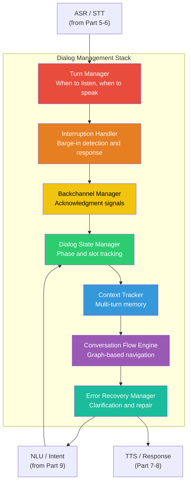
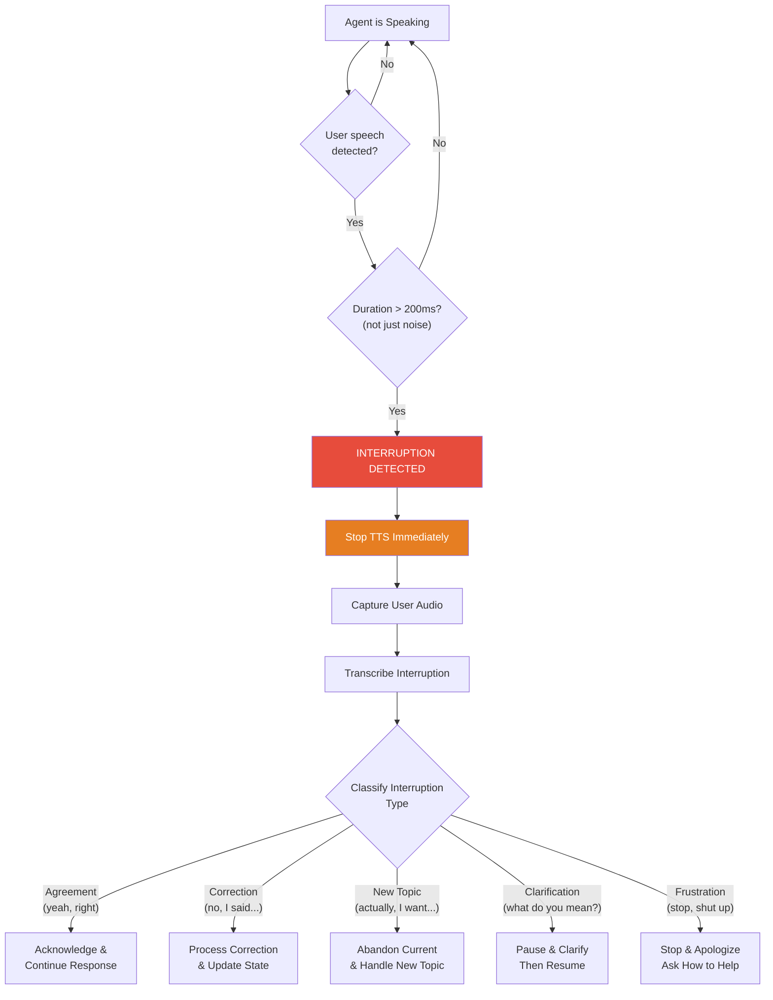
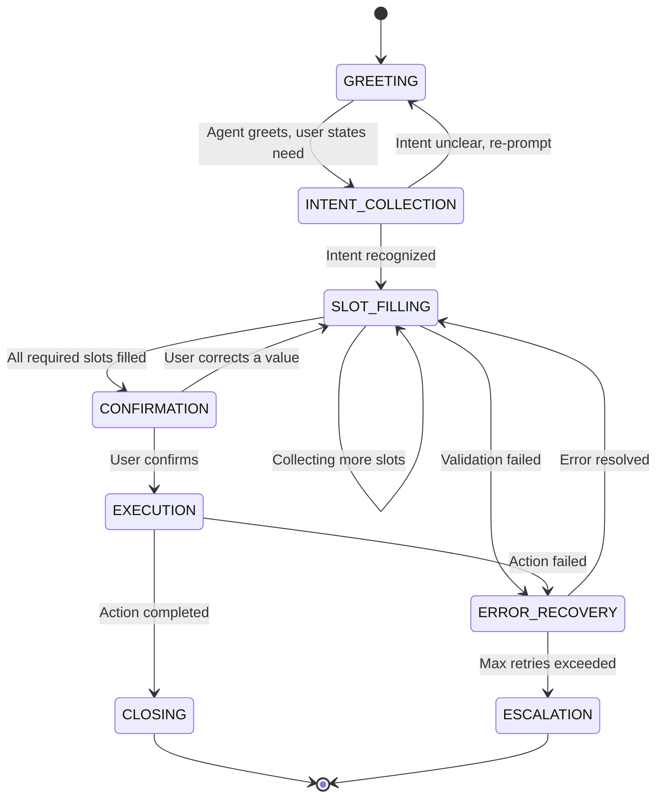
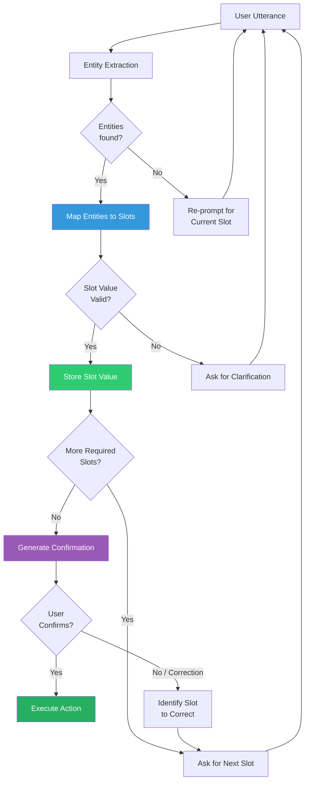
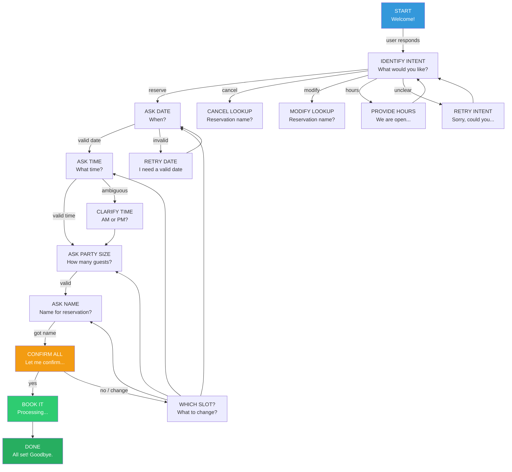
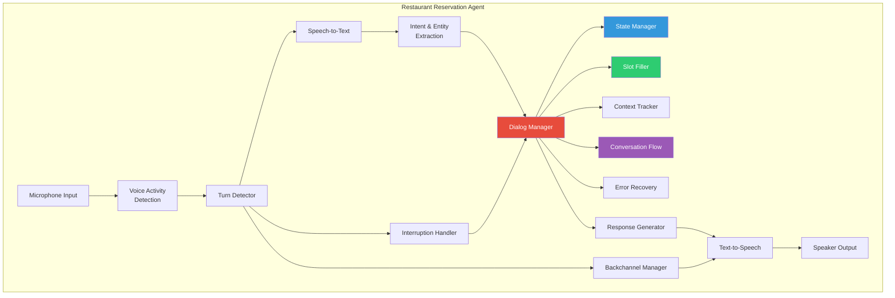

# Voice Agents Deep Dive  Part 10: Dialog Management  Turn-Taking, Interruptions, and Conversation Flow

---

**Series:** Building Voice Agents  A Developer's Deep Dive from Audio Fundamentals to Production
**Part:** 10 of 20 (Dialog Management)
**Audience:** Developers with Python experience who want to build voice-powered AI agents from the ground up
**Reading time:** ~55 minutes

---

## Introduction and Recap

In **Part 9**, we explored **intent recognition and entity extraction**  the twin pillars that let our voice agent understand *what* the user wants and *what details* they provided. We built classifiers that could map raw transcriptions to structured intents and pull out named entities like dates, times, and names.

But here is the uncomfortable truth: **understanding individual utterances is not enough**.

Think about a real conversation. When you call a restaurant to make a reservation, you do not dump all information in a single sentence. You engage in a *dialog*  a back-and-forth exchange where information flows in both directions, mistakes get corrected, clarifications are requested, and both parties track the evolving state of the conversation.

This is where **Dialog Management** enters the picture. It is the orchestration layer that transforms a sequence of isolated understanding events into a coherent, purposeful conversation.

> **Key Insight:** A voice agent without dialog management is like a brilliant translator who can understand every sentence but has no idea how conversations work. They would interrupt at wrong moments, forget what was said two sentences ago, and never know when a conversation is actually finished.

In this part, we will build every component of a production-grade dialog manager: turn-taking detection, interruption handling, backchanneling, state machines, slot filling, error recovery, conversation flow graphs, and multi-turn context tracking. We will tie it all together with a complete **Restaurant Reservation Agent** that handles real conversational complexity.

---

## 1. Why Dialog Management Matters

### 1.1 Voice Is Not Text With Audio

If you have built chatbots before, you might think voice agents are just chatbots with a speech-to-text layer on top. This is dangerously wrong. Here is why:

| Dimension | Text Chat | Voice Conversation |
|---|---|---|
| **Response time** | User waits patiently (seconds to minutes) | User expects response within 300-800ms |
| **Turn boundaries** | Explicit (user presses Enter) | Implicit (silence, prosody, breathing) |
| **Interruptions** | Not possible mid-message | Constant and natural |
| **Corrections** | User can re-read and edit | User must re-speak; mishearing is common |
| **Parallelism** | One message at a time | Overlapping speech is normal |
| **Backchannel** | Typing indicator at best | "Uh-huh", "right", "mm-hmm" expected |
| **Context cues** | Scroll back and re-read | Memory only; no scrollback |
| **Emotion** | Emojis, punctuation | Tone, pace, volume, pitch |
| **Forgiveness** | High (user can re-read) | Low (misheard words cause frustration) |

```python
"""
Demonstration: Why voice dialog is fundamentally different from text chat.

In text chat, the "dialog manager" is trivial:
1. Wait for user message (explicit boundary)
2. Process message
3. Send response
4. Repeat

In voice, every step is ambiguous:
1. When did the user START speaking? (VAD)
2. When did the user STOP speaking? (Turn detection)
3. Did they pause or finish? (Prosodic analysis)
4. Are they interrupting us? (Barge-in detection)
5. Should we acknowledge without interrupting? (Backchannel)
6. How long can we take to respond? (Latency budget)
7. Did we mishear them? (Confidence tracking)
8. Are they still engaged? (Engagement detection)
"""

import time
from dataclasses import dataclass, field
from enum import Enum, auto
from typing import Optional, Callable


class DialogComplexity(Enum):
    """The layers of complexity voice dialog adds over text chat."""
    TURN_BOUNDARY_DETECTION = auto()    # When does user stop/start?
    INTERRUPTION_HANDLING = auto()       # User speaks while agent speaks
    BACKCHANNEL_GENERATION = auto()      # "Uh-huh" acknowledgments
    TIMING_MANAGEMENT = auto()           # Response latency constraints
    ERROR_RECOVERY = auto()              # Mishearing and clarification
    CONTEXT_TRACKING = auto()            # Multi-turn memory
    STATE_MANAGEMENT = auto()            # Conversation phase tracking
    ENGAGEMENT_MONITORING = auto()       # Is the user still there?


@dataclass
class VoiceDialogChallenge:
    """Each challenge that voice dialog management must solve."""
    name: str
    text_chat_difficulty: str   # "trivial", "easy", "moderate"
    voice_difficulty: str       # "moderate", "hard", "very_hard"
    description: str
    example: str


VOICE_CHALLENGES = [
    VoiceDialogChallenge(
        name="Turn Boundaries",
        text_chat_difficulty="trivial",
        voice_difficulty="hard",
        description="Knowing when the user has finished their turn",
        example="User pauses for 500ms  are they thinking or done?"
    ),
    VoiceDialogChallenge(
        name="Interruption Handling",
        text_chat_difficulty="trivial",
        voice_difficulty="very_hard",
        description="User starts speaking while agent is still talking",
        example="Agent: 'Your reservation is at' User: 'Actually wait'"
    ),
    VoiceDialogChallenge(
        name="Response Timing",
        text_chat_difficulty="easy",
        voice_difficulty="hard",
        description="Responding fast enough to feel natural",
        example="More than 1 second of silence feels like the agent is broken"
    ),
    VoiceDialogChallenge(
        name="Error Recovery",
        text_chat_difficulty="moderate",
        voice_difficulty="very_hard",
        description="Handling misrecognition gracefully",
        example="ASR hears 'four people' as 'for people'  slot fill fails"
    ),
]
```

### 1.2 The Dialog Management Stack

Dialog management is not a single component  it is a **stack** of interacting systems. Here is how they layer:



Each layer depends on those below it, and they all communicate in real time. Let us build them one by one.

---

## 2. Turn-Taking in Conversation

### 2.1 How Humans Take Turns

Human conversation is a marvel of coordination. Two people manage to exchange speaking turns with an average gap of only **200 milliseconds**  faster than human reaction time. How?

Researchers have identified four primary cues that signal turn boundaries:

1. **Prosodic cues**: Falling pitch at the end of a statement signals completion. Rising pitch signals a question (and expectation of response).
2. **Silence gaps**: A pause of 200-300ms typically signals a turn boundary. Longer pauses signal the speaker is thinking (not done).
3. **Syntactic completion**: The sentence is grammatically complete.
4. **Gaze and gesture**: The speaker looks at the listener when yielding the floor (not available in voice-only).

```python
"""
Turn-taking detection system.

This module implements silence-based and energy-based turn detection
with configurable thresholds and VAD integration.
"""

import asyncio
import time
import numpy as np
from dataclasses import dataclass, field
from enum import Enum, auto
from typing import Optional, List, Callable, Any
from collections import deque


class TurnState(Enum):
    """Current state of the turn-taking system."""
    IDLE = auto()           # No one is speaking
    USER_SPEAKING = auto()  # User is actively speaking
    USER_PAUSING = auto()   # User has paused (might continue)
    AGENT_SPEAKING = auto() # Agent is actively speaking
    TRANSITION = auto()     # Between turns (gap)


@dataclass
class TurnConfig:
    """Configuration for turn detection thresholds."""
    # Silence detection
    silence_threshold_ms: int = 700       # ms of silence to end turn
    short_pause_threshold_ms: int = 300   # ms for a short pause (not end of turn)

    # Minimum speech duration to count as a valid turn
    min_speech_duration_ms: int = 250     # Ignore very short bursts

    # Energy thresholds
    energy_threshold_db: float = -40.0    # Below this = silence

    # Adaptive threshold settings
    adaptive_enabled: bool = True
    adaptation_rate: float = 0.1          # How fast thresholds adapt

    # VAD settings
    vad_confidence_threshold: float = 0.5

    # Prosodic settings (pitch-based end detection)
    pitch_drop_threshold_hz: float = 30.0   # Hz drop that signals statement end
    pitch_analysis_window_ms: int = 500     # Window for pitch analysis


@dataclass
class TurnEvent:
    """An event emitted by the turn detector."""
    event_type: str          # "turn_start", "turn_end", "pause_start", "pause_end"
    timestamp: float         # Unix timestamp
    duration_ms: float = 0   # Duration of the completed turn or pause
    confidence: float = 1.0  # Confidence in this detection
    metadata: dict = field(default_factory=dict)


class TurnDetector:
    """
    Detects turn boundaries in voice conversation.

    Combines silence detection, energy analysis, and optional VAD
    to determine when the user has finished speaking.

    Usage:
        detector = TurnDetector(TurnConfig())
        detector.on_turn_end = my_callback

        # Feed audio frames continuously
        for frame in audio_stream:
            detector.process_frame(frame)
    """

    def __init__(self, config: Optional[TurnConfig] = None):
        self.config = config or TurnConfig()
        self.state = TurnState.IDLE

        # Timing tracking
        self._speech_start_time: Optional[float] = None
        self._silence_start_time: Optional[float] = None
        self._last_voice_time: Optional[float] = None

        # Energy tracking for adaptive thresholds
        self._energy_history: deque = deque(maxlen=100)
        self._ambient_energy: float = self.config.energy_threshold_db

        # Pitch tracking
        self._pitch_history: deque = deque(maxlen=50)

        # Event callbacks
        self.on_turn_start: Optional[Callable[[TurnEvent], None]] = None
        self.on_turn_end: Optional[Callable[[TurnEvent], None]] = None
        self.on_pause_detected: Optional[Callable[[TurnEvent], None]] = None

        # Event log
        self._events: List[TurnEvent] = []

        # Statistics
        self._turn_count: int = 0
        self._total_speech_ms: float = 0
        self._total_silence_ms: float = 0

    def process_frame(
        self,
        audio_frame: np.ndarray,
        sample_rate: int = 16000,
        vad_result: Optional[float] = None
    ) -> Optional[TurnEvent]:
        """
        Process a single audio frame and detect turn boundaries.

        Args:
            audio_frame: Raw audio samples (numpy array)
            sample_rate: Audio sample rate
            vad_result: Optional VAD confidence (0.0 to 1.0)

        Returns:
            TurnEvent if a boundary was detected, None otherwise
        """
        current_time = time.time()
        frame_duration_ms = len(audio_frame) / sample_rate * 1000

        # Calculate frame energy
        energy_db = self._calculate_energy_db(audio_frame)
        self._energy_history.append(energy_db)

        # Determine if this frame contains speech
        is_speech = self._detect_speech(energy_db, vad_result)

        # Update adaptive threshold
        if self.config.adaptive_enabled:
            self._update_adaptive_threshold(energy_db, is_speech)

        # State machine transitions
        event = self._update_state(is_speech, current_time, frame_duration_ms)

        if event:
            self._events.append(event)
            self._dispatch_event(event)

        return event

    def _calculate_energy_db(self, audio_frame: np.ndarray) -> float:
        """Calculate frame energy in decibels."""
        if len(audio_frame) == 0:
            return -100.0

        # RMS energy
        rms = np.sqrt(np.mean(audio_frame.astype(np.float64) ** 2))

        if rms < 1e-10:
            return -100.0

        # Convert to dB (reference: max int16 value)
        db = 20 * np.log10(rms / 32768.0)
        return db

    def _detect_speech(
        self,
        energy_db: float,
        vad_result: Optional[float]
    ) -> bool:
        """Determine if the current frame contains speech."""
        # If we have VAD result, use it with energy as backup
        if vad_result is not None:
            vad_says_speech = vad_result >= self.config.vad_confidence_threshold
            energy_says_speech = energy_db > self._ambient_energy + 10
            # VAD is primary, energy is secondary confirmation
            return vad_says_speech or (energy_says_speech and vad_result > 0.3)

        # Energy-only detection
        return energy_db > self.config.energy_threshold_db

    def _update_adaptive_threshold(
        self,
        energy_db: float,
        is_speech: bool
    ) -> None:
        """Adapt the silence threshold based on ambient noise."""
        if not is_speech and energy_db > -90:
            # Update ambient noise estimate during non-speech
            rate = self.config.adaptation_rate
            self._ambient_energy = (
                (1 - rate) * self._ambient_energy + rate * energy_db
            )
            # Update energy threshold: ambient + margin
            self.config.energy_threshold_db = self._ambient_energy + 6

    def _update_state(
        self,
        is_speech: bool,
        current_time: float,
        frame_duration_ms: float
    ) -> Optional[TurnEvent]:
        """Update the turn state machine and return any events."""

        if self.state == TurnState.IDLE:
            if is_speech:
                # Speech detected  potential turn start
                self._speech_start_time = current_time
                self._silence_start_time = None
                self.state = TurnState.USER_SPEAKING

                event = TurnEvent(
                    event_type="turn_start",
                    timestamp=current_time,
                    confidence=0.8
                )
                return event

        elif self.state == TurnState.USER_SPEAKING:
            if is_speech:
                # Still speaking  update last voice time
                self._last_voice_time = current_time
                self._total_speech_ms += frame_duration_ms
            else:
                # Silence detected  start silence timer
                self._silence_start_time = current_time
                self.state = TurnState.USER_PAUSING

        elif self.state == TurnState.USER_PAUSING:
            if is_speech:
                # Speech resumed  was just a pause
                silence_duration = (current_time - self._silence_start_time) * 1000
                self._silence_start_time = None
                self._last_voice_time = current_time
                self.state = TurnState.USER_SPEAKING
                self._total_speech_ms += frame_duration_ms

                if silence_duration >= self.config.short_pause_threshold_ms:
                    return TurnEvent(
                        event_type="pause_end",
                        timestamp=current_time,
                        duration_ms=silence_duration
                    )
            else:
                # Still silent  check if turn has ended
                silence_duration_ms = (
                    (current_time - self._silence_start_time) * 1000
                )
                self._total_silence_ms += frame_duration_ms

                # Check for short pause notification
                if (silence_duration_ms >= self.config.short_pause_threshold_ms
                        and silence_duration_ms < self.config.short_pause_threshold_ms + frame_duration_ms):
                    if self.on_pause_detected:
                        pause_event = TurnEvent(
                            event_type="pause_start",
                            timestamp=self._silence_start_time,
                            duration_ms=silence_duration_ms
                        )
                        self.on_pause_detected(pause_event)

                # Check for turn end
                if silence_duration_ms >= self.config.silence_threshold_ms:
                    # Verify minimum speech duration
                    if self._speech_start_time:
                        speech_duration_ms = (
                            (self._last_voice_time - self._speech_start_time) * 1000
                            if self._last_voice_time else 0
                        )
                    else:
                        speech_duration_ms = 0

                    if speech_duration_ms >= self.config.min_speech_duration_ms:
                        # Valid turn end
                        self._turn_count += 1
                        self.state = TurnState.IDLE
                        self._silence_start_time = None

                        return TurnEvent(
                            event_type="turn_end",
                            timestamp=current_time,
                            duration_ms=speech_duration_ms,
                            confidence=min(1.0, silence_duration_ms / 1000),
                            metadata={
                                "turn_number": self._turn_count,
                                "silence_duration_ms": silence_duration_ms,
                                "speech_duration_ms": speech_duration_ms
                            }
                        )
                    else:
                        # Too short  ignore as noise
                        self.state = TurnState.IDLE
                        self._speech_start_time = None
                        self._silence_start_time = None

        elif self.state == TurnState.AGENT_SPEAKING:
            if is_speech:
                # User is trying to speak while agent speaks
                # This is an interruption  handled by InterruptionHandler
                pass

        return None

    def _dispatch_event(self, event: TurnEvent) -> None:
        """Dispatch event to registered callbacks."""
        if event.event_type == "turn_start" and self.on_turn_start:
            self.on_turn_start(event)
        elif event.event_type == "turn_end" and self.on_turn_end:
            self.on_turn_end(event)

    def set_agent_speaking(self, is_speaking: bool) -> None:
        """Notify the turn detector that the agent is speaking."""
        if is_speaking:
            self.state = TurnState.AGENT_SPEAKING
        else:
            self.state = TurnState.IDLE
            self._silence_start_time = None

    def get_statistics(self) -> dict:
        """Return turn-taking statistics."""
        return {
            "total_turns": self._turn_count,
            "total_speech_ms": self._total_speech_ms,
            "total_silence_ms": self._total_silence_ms,
            "speech_ratio": (
                self._total_speech_ms
                / (self._total_speech_ms + self._total_silence_ms)
                if (self._total_speech_ms + self._total_silence_ms) > 0
                else 0
            ),
            "ambient_energy_db": self._ambient_energy,
            "current_state": self.state.name,
            "events_count": len(self._events)
        }

    def reset(self) -> None:
        """Reset the turn detector state."""
        self.state = TurnState.IDLE
        self._speech_start_time = None
        self._silence_start_time = None
        self._last_voice_time = None
        self._events.clear()


# --- Demonstration ---

def demo_turn_detection():
    """Demonstrate turn detection with simulated audio."""
    config = TurnConfig(
        silence_threshold_ms=700,
        min_speech_duration_ms=250,
        energy_threshold_db=-40.0,
        adaptive_enabled=True
    )
    detector = TurnDetector(config)

    # Register callbacks
    def on_start(event: TurnEvent):
        print(f"  [TURN START] at {event.timestamp:.3f}")

    def on_end(event: TurnEvent):
        print(
            f"  [TURN END] duration={event.duration_ms:.0f}ms, "
            f"confidence={event.confidence:.2f}, "
            f"turn #{event.metadata.get('turn_number', '?')}"
        )

    detector.on_turn_start = on_start
    detector.on_turn_end = on_end

    sample_rate = 16000
    frame_size = 480  # 30ms frames

    print("Simulating conversation audio...")
    print()

    # Simulate: 1 second speech, 0.8 second silence, 0.5 second speech
    segments = [
        ("speech", 1.0),
        ("silence", 0.8),
        ("speech", 0.5),
        ("silence", 1.0),
    ]

    for seg_type, duration_sec in segments:
        num_frames = int(duration_sec * sample_rate / frame_size)

        for _ in range(num_frames):
            if seg_type == "speech":
                # Simulate speech: random signal with energy around -20 dB
                frame = np.random.randn(frame_size).astype(np.float32) * 3000
            else:
                # Simulate silence: very low energy
                frame = np.random.randn(frame_size).astype(np.float32) * 10

            detector.process_frame(frame, sample_rate)

    print()
    print("Statistics:", detector.get_statistics())


if __name__ == "__main__":
    demo_turn_detection()
```

### 2.2 Adaptive Silence Thresholds

A fixed silence threshold does not work in the real world. Consider:

- **Noisy environments** (cafe, street): Background noise fills pauses, making silence detection harder.
- **Slow speakers**: Some people pause for 1-2 seconds mid-sentence while thinking.
- **Fast speakers**: Some people barely pause between sentences.

The solution is **adaptive thresholds** that adjust based on the speaker's pattern:

```python
class AdaptiveTurnDetector:
    """
    Turn detector with adaptive thresholds that learn
    from the speaker's patterns over the conversation.
    """

    def __init__(self):
        # Start with default thresholds
        self._base_silence_threshold_ms: float = 700
        self._current_silence_threshold_ms: float = 700

        # Track the speaker's pause patterns
        self._intra_turn_pauses: List[float] = []   # Pauses within turns
        self._inter_turn_gaps: List[float] = []      # Gaps between turns

        # Speaker pace tracking
        self._words_per_minute_estimate: float = 150  # Average
        self._speech_segment_durations: List[float] = []

        # Adaptation parameters
        self._min_threshold_ms: float = 400    # Never go below 400ms
        self._max_threshold_ms: float = 1500   # Never go above 1.5s
        self._adaptation_window: int = 10      # Use last N observations

    def record_intra_turn_pause(self, pause_duration_ms: float) -> None:
        """Record a pause that occurred WITHIN a turn (speaker resumed)."""
        self._intra_turn_pauses.append(pause_duration_ms)
        self._adapt_threshold()

    def record_inter_turn_gap(self, gap_duration_ms: float) -> None:
        """Record the gap between the end of one turn and start of next."""
        self._inter_turn_gaps.append(gap_duration_ms)
        self._adapt_threshold()

    def _adapt_threshold(self) -> None:
        """
        Adapt silence threshold based on observed patterns.

        Strategy: Set threshold between the longest intra-turn pause
        and the shortest inter-turn gap. This creates a boundary that
        separates "thinking pauses" from "turn endings."
        """
        if len(self._intra_turn_pauses) < 3:
            return  # Not enough data to adapt

        # Get recent observations
        recent_pauses = self._intra_turn_pauses[-self._adaptation_window:]
        recent_gaps = self._inter_turn_gaps[-self._adaptation_window:]

        # Find the boundary
        max_pause = np.percentile(recent_pauses, 90) if recent_pauses else 300
        min_gap = np.percentile(recent_gaps, 10) if recent_gaps else 800

        if min_gap > max_pause:
            # Clear separation  set threshold in the middle
            new_threshold = (max_pause + min_gap) / 2
        else:
            # Overlap  use a conservative (longer) threshold
            new_threshold = max(max_pause, min_gap) * 1.2

        # Clamp to bounds
        new_threshold = max(
            self._min_threshold_ms,
            min(self._max_threshold_ms, new_threshold)
        )

        # Smooth the adaptation
        alpha = 0.3
        self._current_silence_threshold_ms = (
            (1 - alpha) * self._current_silence_threshold_ms
            + alpha * new_threshold
        )

    @property
    def silence_threshold_ms(self) -> float:
        """Current adaptive silence threshold."""
        return self._current_silence_threshold_ms

    def get_speaker_profile(self) -> dict:
        """Return a profile of the speaker's conversational timing."""
        return {
            "current_threshold_ms": self._current_silence_threshold_ms,
            "avg_intra_pause_ms": (
                np.mean(self._intra_turn_pauses)
                if self._intra_turn_pauses else 0
            ),
            "avg_inter_gap_ms": (
                np.mean(self._inter_turn_gaps)
                if self._inter_turn_gaps else 0
            ),
            "estimated_wpm": self._words_per_minute_estimate,
            "observations": {
                "intra_pauses": len(self._intra_turn_pauses),
                "inter_gaps": len(self._inter_turn_gaps)
            }
        }
```

> **Practical Tip:** In production, start with a conservative (longer) silence threshold of 800-1000ms for the first few turns, then adapt downward as you learn the speaker's rhythm. A premature turn-end detection is far more disruptive than a slightly delayed one.

---

## 3. Interruption Handling (Barge-In)

### 3.1 Why Interruptions Are the Hardest Voice Problem

Interruption handling  also called **barge-in**  is arguably the single hardest problem in voice agent design. Here is why:

1. **Detection ambiguity**: Is the user interrupting, or is there background noise? A TV? Another person talking nearby?
2. **Timing criticality**: You must stop speaking within ~100ms of detecting an interruption, or the user feels ignored.
3. **State complexity**: When interrupted, what do you do with the partial response? Resume? Restart? Discard?
4. **Transcription challenge**: You must capture what the user said *while* the agent was speaking (echo cancellation required).
5. **Intent ambiguity**: Was the interruption a correction, a new question, an agreement, or frustration?



### 3.2 Building the Interruption Handler

```python
"""
Interruption handling system for voice agents.

Handles barge-in detection, TTS cancellation, and conversation recovery.
"""

import asyncio
import time
from dataclasses import dataclass, field
from enum import Enum, auto
from typing import Optional, List, Callable, Any


class InterruptionType(Enum):
    """Classification of what type of interruption occurred."""
    AGREEMENT = auto()       # "yeah", "right", "okay"
    CORRECTION = auto()      # "no, I said...", "not that..."
    NEW_TOPIC = auto()       # "actually, I want to..."
    CLARIFICATION = auto()   # "what do you mean?", "which one?"
    FRUSTRATION = auto()     # "stop", "shut up", "never mind"
    BACKCHANNEL = auto()     # "uh-huh", "mm-hmm" (not really interruption)
    UNKNOWN = auto()         # Cannot classify


class InterruptionStrategy(Enum):
    """How to handle the interruption."""
    IGNORE = auto()          # Not a real interruption (backchannel)
    CONTINUE = auto()        # Acknowledge and continue current response
    PAUSE_AND_RESUME = auto()  # Pause, handle, then resume
    RESTART = auto()         # Restart current response with new info
    PIVOT = auto()           # Abandon current response, handle new topic
    ESCALATE = auto()        # User is frustrated  special handling


@dataclass
class InterruptionEvent:
    """Details about a detected interruption."""
    timestamp: float
    interruption_type: InterruptionType
    strategy: InterruptionStrategy
    user_transcript: str
    agent_text_spoken_so_far: str
    agent_text_remaining: str
    confidence: float
    response_action: Optional[str] = None


@dataclass
class InterruptionConfig:
    """Configuration for interruption detection and handling."""
    # Detection thresholds
    min_speech_duration_ms: int = 200    # Ignore very short bursts
    detection_delay_ms: int = 100        # Wait this long to confirm

    # TTS cancellation
    cancel_tts_on_interrupt: bool = True
    fade_out_duration_ms: int = 50       # Quick fade-out of agent speech

    # Classification
    agreement_keywords: List[str] = field(default_factory=lambda: [
        "yes", "yeah", "yep", "right", "correct", "okay", "ok",
        "sure", "uh-huh", "mm-hmm", "exactly", "absolutely"
    ])
    frustration_keywords: List[str] = field(default_factory=lambda: [
        "stop", "shut up", "quiet", "enough", "never mind",
        "nevermind", "forget it", "cancel", "hang up"
    ])
    correction_keywords: List[str] = field(default_factory=lambda: [
        "no", "not", "wrong", "actually", "i said", "i meant",
        "correction", "wait"
    ])

    # Recovery
    max_resume_delay_ms: int = 2000  # Max time before resuming abandoned response
    resume_with_context: bool = True  # "As I was saying, ..."


class InterruptionHandler:
    """
    Handles interruptions (barge-in) during agent speech.

    This is the core system for managing the complex case where
    a user starts speaking while the agent is still talking.

    Usage:
        handler = InterruptionHandler(config)
        handler.on_interruption = my_callback

        # While agent is speaking, feed user audio
        while agent.is_speaking():
            frame = get_audio_frame()
            await handler.monitor_for_interruption(frame, agent_state)
    """

    def __init__(self, config: Optional[InterruptionConfig] = None):
        self.config = config or InterruptionConfig()

        # State
        self._is_monitoring: bool = False
        self._potential_interrupt_start: Optional[float] = None
        self._interrupt_audio_buffer: List[np.ndarray] = []
        self._agent_spoken_text: str = ""
        self._agent_remaining_text: str = ""

        # History
        self._interruption_history: List[InterruptionEvent] = []

        # Callbacks
        self.on_interruption: Optional[
            Callable[[InterruptionEvent], Any]
        ] = None
        self.on_tts_cancel: Optional[Callable[[], Any]] = None

    def start_monitoring(
        self,
        agent_full_text: str,
        tts_cancel_callback: Optional[Callable] = None
    ) -> None:
        """Start monitoring for interruptions during agent speech."""
        self._is_monitoring = True
        self._potential_interrupt_start = None
        self._interrupt_audio_buffer.clear()
        self._agent_spoken_text = ""
        self._agent_remaining_text = agent_full_text
        self.on_tts_cancel = tts_cancel_callback

    def stop_monitoring(self) -> None:
        """Stop monitoring (agent finished speaking normally)."""
        self._is_monitoring = False
        self._potential_interrupt_start = None
        self._interrupt_audio_buffer.clear()

    def update_agent_progress(
        self,
        spoken_so_far: str,
        remaining: str
    ) -> None:
        """Update how much of the response has been spoken."""
        self._agent_spoken_text = spoken_so_far
        self._agent_remaining_text = remaining

    async def monitor_for_interruption(
        self,
        audio_frame: np.ndarray,
        is_user_speech: bool,
        vad_confidence: float = 0.0
    ) -> Optional[InterruptionEvent]:
        """
        Check an audio frame for potential interruption.

        Args:
            audio_frame: User's audio frame
            is_user_speech: Whether VAD detects speech
            vad_confidence: VAD confidence score

        Returns:
            InterruptionEvent if an interruption is confirmed
        """
        if not self._is_monitoring:
            return None

        current_time = time.time()

        if is_user_speech and vad_confidence > 0.5:
            # Potential interruption detected
            if self._potential_interrupt_start is None:
                self._potential_interrupt_start = current_time

            # Buffer the audio for later transcription
            self._interrupt_audio_buffer.append(audio_frame.copy())

            # Check if speech has lasted long enough to be real
            speech_duration_ms = (
                (current_time - self._potential_interrupt_start) * 1000
            )

            if speech_duration_ms >= self.config.min_speech_duration_ms:
                # Confirmed interruption!
                return await self._handle_confirmed_interruption(
                    current_time
                )
        else:
            # No speech  reset potential interruption if it was too short
            if self._potential_interrupt_start is not None:
                speech_duration_ms = (
                    (current_time - self._potential_interrupt_start) * 1000
                )
                if speech_duration_ms < self.config.min_speech_duration_ms:
                    # Too short  was probably noise
                    self._potential_interrupt_start = None
                    self._interrupt_audio_buffer.clear()

        return None

    async def _handle_confirmed_interruption(
        self,
        timestamp: float
    ) -> InterruptionEvent:
        """Handle a confirmed interruption."""
        # Step 1: Cancel TTS immediately
        if self.config.cancel_tts_on_interrupt and self.on_tts_cancel:
            await self._cancel_tts()

        # Step 2: Continue capturing audio until user stops speaking
        # (In a real system, this would keep buffering until turn end)

        # Step 3: Transcribe the interruption
        user_transcript = await self._transcribe_interruption()

        # Step 4: Classify the interruption
        interruption_type = self._classify_interruption(user_transcript)

        # Step 5: Determine strategy
        strategy = self._determine_strategy(interruption_type)

        # Step 6: Create event
        event = InterruptionEvent(
            timestamp=timestamp,
            interruption_type=interruption_type,
            strategy=strategy,
            user_transcript=user_transcript,
            agent_text_spoken_so_far=self._agent_spoken_text,
            agent_text_remaining=self._agent_remaining_text,
            confidence=0.85,
        )

        # Step 7: Generate response action
        event.response_action = self._generate_response_action(event)

        # Record in history
        self._interruption_history.append(event)

        # Dispatch callback
        if self.on_interruption:
            self.on_interruption(event)

        # Reset monitoring state
        self._potential_interrupt_start = None
        self._interrupt_audio_buffer.clear()
        self._is_monitoring = False

        return event

    async def _cancel_tts(self) -> None:
        """Cancel TTS playback immediately."""
        if self.on_tts_cancel:
            if asyncio.iscoroutinefunction(self.on_tts_cancel):
                await self.on_tts_cancel()
            else:
                self.on_tts_cancel()

    async def _transcribe_interruption(self) -> str:
        """
        Transcribe the captured interruption audio.

        In production, this would use your ASR engine.
        Here we return a placeholder.
        """
        # Combine buffered audio
        if not self._interrupt_audio_buffer:
            return ""

        combined_audio = np.concatenate(self._interrupt_audio_buffer)

        # In production:
        # transcript = await asr_engine.transcribe(combined_audio)
        # return transcript.text

        # Placeholder for demonstration
        return "[transcribed interruption]"

    def _classify_interruption(self, transcript: str) -> InterruptionType:
        """Classify the type of interruption based on transcript."""
        if not transcript:
            return InterruptionType.UNKNOWN

        lower = transcript.lower().strip()
        words = lower.split()

        # Check for backchannel (not really an interruption)
        backchannel_words = {"uh-huh", "mm-hmm", "mhm", "hmm"}
        if lower in backchannel_words or (len(words) == 1 and words[0] in backchannel_words):
            return InterruptionType.BACKCHANNEL

        # Check for frustration (highest priority)
        for keyword in self.config.frustration_keywords:
            if keyword in lower:
                return InterruptionType.FRUSTRATION

        # Check for correction
        for keyword in self.config.correction_keywords:
            if lower.startswith(keyword) or f" {keyword} " in f" {lower} ":
                return InterruptionType.CORRECTION

        # Check for agreement
        for keyword in self.config.agreement_keywords:
            if lower == keyword or lower.startswith(keyword + " "):
                return InterruptionType.AGREEMENT

        # Check for clarification (question patterns)
        if any(lower.startswith(w) for w in ["what", "which", "how", "when", "where", "why", "who"]):
            return InterruptionType.CLARIFICATION

        # Default: treat as new topic
        return InterruptionType.NEW_TOPIC

    def _determine_strategy(
        self,
        interruption_type: InterruptionType
    ) -> InterruptionStrategy:
        """Determine how to handle this type of interruption."""
        strategy_map = {
            InterruptionType.BACKCHANNEL: InterruptionStrategy.IGNORE,
            InterruptionType.AGREEMENT: InterruptionStrategy.CONTINUE,
            InterruptionType.CORRECTION: InterruptionStrategy.RESTART,
            InterruptionType.NEW_TOPIC: InterruptionStrategy.PIVOT,
            InterruptionType.CLARIFICATION: InterruptionStrategy.PAUSE_AND_RESUME,
            InterruptionType.FRUSTRATION: InterruptionStrategy.ESCALATE,
            InterruptionType.UNKNOWN: InterruptionStrategy.PAUSE_AND_RESUME,
        }
        return strategy_map.get(
            interruption_type, InterruptionStrategy.PAUSE_AND_RESUME
        )

    def _generate_response_action(
        self,
        event: InterruptionEvent
    ) -> str:
        """Generate the appropriate response action for this interruption."""
        if event.strategy == InterruptionStrategy.IGNORE:
            return "continue_speaking"

        elif event.strategy == InterruptionStrategy.CONTINUE:
            return "acknowledge_and_continue"

        elif event.strategy == InterruptionStrategy.PAUSE_AND_RESUME:
            return (
                f"address_clarification_then_resume: "
                f"'{event.agent_text_remaining[:50]}...'"
            )

        elif event.strategy == InterruptionStrategy.RESTART:
            return (
                f"restart_response_with_correction: "
                f"'{event.user_transcript}'"
            )

        elif event.strategy == InterruptionStrategy.PIVOT:
            return (
                f"abandon_current_and_handle: "
                f"'{event.user_transcript}'"
            )

        elif event.strategy == InterruptionStrategy.ESCALATE:
            return "apologize_and_ask_how_to_help"

        return "unknown_action"

    def get_interruption_stats(self) -> dict:
        """Return statistics about interruptions in this conversation."""
        if not self._interruption_history:
            return {"total_interruptions": 0}

        type_counts = {}
        for event in self._interruption_history:
            t = event.interruption_type.name
            type_counts[t] = type_counts.get(t, 0) + 1

        return {
            "total_interruptions": len(self._interruption_history),
            "type_distribution": type_counts,
            "most_common_type": max(type_counts, key=type_counts.get),
            "avg_confidence": np.mean([
                e.confidence for e in self._interruption_history
            ])
        }
```

### 3.3 Interruption Recovery Strategies

What you do *after* detecting an interruption is just as important as detecting it. Here are the five recovery strategies in detail:

```python
class InterruptionRecoveryEngine:
    """
    Handles the recovery phase after an interruption is detected.

    Each strategy generates appropriate agent behavior to maintain
    a natural conversation flow.
    """

    def __init__(self):
        self._recovery_templates = {
            "acknowledge_and_continue": [
                "Got it. {continuation}",
                "Understood. {continuation}",
                "Right. {continuation}",
            ],
            "pause_and_resume": [
                "Sure, {clarification_response}. As I was saying, {continuation}",
                "Of course. {clarification_response}. So, {continuation}",
            ],
            "restart_with_correction": [
                "I apologize. Let me correct that. {corrected_response}",
                "Sorry about that. {corrected_response}",
                "My mistake. {corrected_response}",
            ],
            "pivot_to_new_topic": [
                "Of course. {new_response}",
                "Sure, let me help with that instead. {new_response}",
                "Absolutely. {new_response}",
            ],
            "frustration_recovery": [
                "I'm sorry about that. How can I help you?",
                "I apologize for the inconvenience. What would you like to do?",
                "I understand. Let's start fresh. What do you need?",
            ],
        }

    async def execute_recovery(
        self,
        event: InterruptionEvent,
        dialog_context: dict
    ) -> str:
        """
        Execute the appropriate recovery strategy.

        Returns the text the agent should speak next.
        """
        if event.strategy == InterruptionStrategy.IGNORE:
            # Resume speaking the remaining text
            return event.agent_text_remaining

        elif event.strategy == InterruptionStrategy.CONTINUE:
            template = self._recovery_templates["acknowledge_and_continue"][0]
            return template.format(
                continuation=event.agent_text_remaining
            )

        elif event.strategy == InterruptionStrategy.PAUSE_AND_RESUME:
            # First, address the clarification question
            clarification = await self._generate_clarification(
                event.user_transcript, dialog_context
            )
            template = self._recovery_templates["pause_and_resume"][0]
            return template.format(
                clarification_response=clarification,
                continuation=event.agent_text_remaining
            )

        elif event.strategy == InterruptionStrategy.RESTART:
            # Re-generate the response with the correction applied
            corrected = await self._apply_correction(
                event.user_transcript,
                event.agent_text_spoken_so_far + event.agent_text_remaining,
                dialog_context
            )
            template = self._recovery_templates["restart_with_correction"][0]
            return template.format(corrected_response=corrected)

        elif event.strategy == InterruptionStrategy.PIVOT:
            # Generate entirely new response for the new topic
            new_response = await self._handle_new_topic(
                event.user_transcript, dialog_context
            )
            template = self._recovery_templates["pivot_to_new_topic"][0]
            return template.format(new_response=new_response)

        elif event.strategy == InterruptionStrategy.ESCALATE:
            return self._recovery_templates["frustration_recovery"][0]

        return "I'm sorry, could you please repeat that?"

    async def _generate_clarification(
        self,
        question: str,
        context: dict
    ) -> str:
        """Generate a response to a clarification question."""
        # In production, send to LLM with context
        return f"to answer your question about '{question}'"

    async def _apply_correction(
        self,
        correction: str,
        original_response: str,
        context: dict
    ) -> str:
        """Apply a user correction to regenerate the response."""
        # In production, send to LLM with correction context
        return f"with the correction '{correction}' applied"

    async def _handle_new_topic(
        self,
        new_topic: str,
        context: dict
    ) -> str:
        """Generate a response for a completely new topic."""
        # In production, send to LLM/intent classifier
        return f"regarding '{new_topic}'"
```

---

## 4. Backchanneling

### 4.1 What Is Backchanneling?

**Backchanneling** refers to the short verbal signals a listener provides to indicate they are paying attention, understanding, and encouraging the speaker to continue. In human conversation, these include:

- "Uh-huh"
- "Mm-hmm"
- "Right"
- "Yeah"
- "I see"
- "Okay"
- "Go on"

Without backchanneling, a voice agent feels **dead**  the user speaks for 15 seconds and hears nothing but silence, wondering if the agent is even listening.

```python
"""
Backchannel generation system.

Generates natural acknowledgment signals during user speech
to indicate active listening.
"""

import random
import time
from dataclasses import dataclass, field
from typing import Optional, List
from collections import deque


@dataclass
class BackchannelConfig:
    """Configuration for backchannel generation."""
    # Timing
    min_interval_ms: int = 3000          # Minimum time between backchannels
    max_interval_ms: int = 8000          # Maximum time without a backchannel
    pause_trigger_ms: int = 500          # Inject after this much pause

    # Content
    backchannel_phrases: List[str] = field(default_factory=lambda: [
        "uh-huh",
        "mm-hmm",
        "right",
        "okay",
        "I see",
        "got it",
        "sure",
        "yes",
    ])

    # Frequency
    min_user_speech_before_first_ms: int = 2000  # Wait at least 2s before first

    # Probability (not every pause should get one)
    trigger_probability: float = 0.6     # 60% chance at each opportunity

    # Audio
    backchannel_volume: float = 0.3      # Quieter than normal speech
    backchannel_speed: float = 1.1       # Slightly faster than normal


@dataclass
class BackchannelEvent:
    """A backchannel event to be spoken."""
    phrase: str
    timestamp: float
    volume: float
    speed: float


class BackchannelManager:
    """
    Manages backchannel generation during user speech.

    Monitors user speech patterns and injects natural acknowledgment
    signals at appropriate moments (during pauses, not interrupting).

    Usage:
        manager = BackchannelManager()
        manager.on_backchannel = lambda event: tts.speak(event.phrase)

        # During user speech
        manager.user_speech_update(is_speaking=True, elapsed_ms=500)
        manager.user_pause_detected(pause_duration_ms=600)
    """

    def __init__(self, config: Optional[BackchannelConfig] = None):
        self.config = config or BackchannelConfig()

        # State tracking
        self._user_speech_start: Optional[float] = None
        self._last_backchannel_time: Optional[float] = None
        self._total_user_speech_ms: float = 0
        self._is_user_speaking: bool = False
        self._backchannel_count: int = 0

        # Phrase rotation (avoid repeating the same one)
        self._recent_phrases: deque = deque(maxlen=3)

        # Callback
        self.on_backchannel: Optional[callable] = None

    def user_started_speaking(self) -> None:
        """Called when the user starts a new speech segment."""
        self._user_speech_start = time.time()
        self._is_user_speaking = True

    def user_stopped_speaking(self) -> None:
        """Called when the user stops speaking (turn may not be over)."""
        self._is_user_speaking = False
        if self._user_speech_start:
            elapsed = (time.time() - self._user_speech_start) * 1000
            self._total_user_speech_ms += elapsed

    def user_pause_detected(self, pause_duration_ms: float) -> None:
        """
        Called when a pause is detected in user speech.

        This is a potential backchannel opportunity  the user has paused
        but has not ended their turn.
        """
        current_time = time.time()

        # Check if we should generate a backchannel
        if not self._should_backchannel(current_time, pause_duration_ms):
            return

        # Generate and emit backchannel
        event = self._generate_backchannel(current_time)
        if event and self.on_backchannel:
            self.on_backchannel(event)

    def _should_backchannel(
        self,
        current_time: float,
        pause_duration_ms: float
    ) -> bool:
        """Determine if this is an appropriate moment for a backchannel."""
        # Not enough user speech yet
        if self._total_user_speech_ms < self.config.min_user_speech_before_first_ms:
            return False

        # Pause too short
        if pause_duration_ms < self.config.pause_trigger_ms:
            return False

        # Too soon since last backchannel
        if self._last_backchannel_time:
            since_last_ms = (current_time - self._last_backchannel_time) * 1000
            if since_last_ms < self.config.min_interval_ms:
                return False

        # Random probability check (makes it feel natural)
        if random.random() > self.config.trigger_probability:
            return False

        return True

    def _generate_backchannel(
        self,
        current_time: float
    ) -> Optional[BackchannelEvent]:
        """Generate a backchannel phrase."""
        # Select a phrase we haven't used recently
        available = [
            p for p in self.config.backchannel_phrases
            if p not in self._recent_phrases
        ]

        if not available:
            available = self.config.backchannel_phrases

        phrase = random.choice(available)
        self._recent_phrases.append(phrase)

        # Update state
        self._last_backchannel_time = current_time
        self._backchannel_count += 1

        return BackchannelEvent(
            phrase=phrase,
            timestamp=current_time,
            volume=self.config.backchannel_volume,
            speed=self.config.backchannel_speed
        )

    def reset(self) -> None:
        """Reset for a new conversation."""
        self._user_speech_start = None
        self._last_backchannel_time = None
        self._total_user_speech_ms = 0
        self._is_user_speaking = False
        self._backchannel_count = 0
        self._recent_phrases.clear()

    def get_stats(self) -> dict:
        """Return backchannel statistics."""
        return {
            "total_backchannels": self._backchannel_count,
            "total_user_speech_ms": self._total_user_speech_ms,
            "backchannel_rate_per_minute": (
                self._backchannel_count
                / (self._total_user_speech_ms / 60000)
                if self._total_user_speech_ms > 0
                else 0
            )
        }
```

> **Key Insight:** The art of backchanneling is in the *timing*, not the content. A well-timed "mm-hmm" feels natural. The same phrase at the wrong moment feels robotic or rude. Always inject backchannels during natural pauses, never over the user's speech.

---

## 5. Dialog State Management

### 5.1 The Dialog State Machine

Every goal-oriented conversation follows a pattern of **phases**. A restaurant reservation conversation, for example, progresses through greeting, information gathering, confirmation, and closing. The dialog state manager tracks which phase we are in and what transitions are valid.



```python
"""
Dialog state management system.

Tracks conversation phase, collected information (slots),
and manages transitions between dialog phases.
"""

from enum import Enum
from dataclasses import dataclass, field
from typing import Optional, Any
import time
import copy
import json


class DialogPhase(Enum):
    """Phases of a goal-oriented dialog."""
    GREETING = "greeting"
    INTENT_COLLECTION = "intent_collection"
    SLOT_FILLING = "slot_filling"
    CONFIRMATION = "confirmation"
    EXECUTION = "execution"
    CLOSING = "closing"
    ERROR_RECOVERY = "error_recovery"
    ESCALATION = "escalation"
    FREE_FORM = "free_form"    # User asked something off-topic


@dataclass
class SlotDefinition:
    """Definition of a slot to be filled during conversation."""
    name: str
    description: str
    required: bool = True
    slot_type: str = "string"   # "string", "date", "time", "integer", "phone"
    prompt: str = ""            # How to ask for this slot
    validation_pattern: Optional[str] = None
    examples: list = field(default_factory=list)
    confirmed: bool = False


@dataclass
class DialogState:
    """
    Complete state of the current dialog.

    This is the central data structure that all components
    read from and write to.
    """
    # Current phase
    phase: DialogPhase = DialogPhase.GREETING

    # Intent tracking
    intent: Optional[str] = None
    intent_confidence: float = 0.0

    # Slot tracking
    slots: dict = field(default_factory=dict)
    slot_definitions: dict = field(default_factory=dict)

    # Conversation tracking
    turn_count: int = 0
    error_count: int = 0
    retry_count: int = 0
    max_retries: int = 3

    # Context
    conversation_id: str = ""
    start_time: float = field(default_factory=time.time)
    last_update_time: float = field(default_factory=time.time)

    # History
    turn_history: list = field(default_factory=list)
    phase_history: list = field(default_factory=list)

    # Metadata
    metadata: dict = field(default_factory=dict)

    def get_missing_required_slots(self) -> list:
        """Return list of required slots that are not yet filled."""
        missing = []
        for name, definition in self.slot_definitions.items():
            if definition.required and name not in self.slots:
                missing.append(name)
        return missing

    def get_unconfirmed_slots(self) -> list:
        """Return list of filled but unconfirmed slots."""
        unconfirmed = []
        for name, definition in self.slot_definitions.items():
            if name in self.slots and not definition.confirmed:
                unconfirmed.append(name)
        return unconfirmed

    def all_required_slots_filled(self) -> bool:
        """Check if all required slots have values."""
        return len(self.get_missing_required_slots()) == 0

    def to_dict(self) -> dict:
        """Serialize the state to a dictionary."""
        return {
            "phase": self.phase.value,
            "intent": self.intent,
            "intent_confidence": self.intent_confidence,
            "slots": self.slots.copy(),
            "turn_count": self.turn_count,
            "error_count": self.error_count,
            "conversation_id": self.conversation_id,
            "elapsed_seconds": time.time() - self.start_time,
        }


class DialogStateManager:
    """
    Manages dialog state transitions and slot tracking.

    This is the central coordinator that:
    - Tracks which phase the conversation is in
    - Manages transitions between phases
    - Handles slot filling and validation
    - Maintains conversation history

    Usage:
        manager = DialogStateManager()
        manager.define_slots([...])

        # On each user turn:
        manager.process_turn(user_input, intent, entities)
    """

    def __init__(self, conversation_id: str = ""):
        self.state = DialogState(
            conversation_id=conversation_id or f"conv_{int(time.time())}"
        )

        # Transition rules
        self._valid_transitions: dict = {
            DialogPhase.GREETING: [
                DialogPhase.INTENT_COLLECTION,
                DialogPhase.SLOT_FILLING,  # If intent is clear from greeting
                DialogPhase.FREE_FORM,
            ],
            DialogPhase.INTENT_COLLECTION: [
                DialogPhase.SLOT_FILLING,
                DialogPhase.GREETING,      # Re-prompt
                DialogPhase.FREE_FORM,
            ],
            DialogPhase.SLOT_FILLING: [
                DialogPhase.SLOT_FILLING,  # Continue filling
                DialogPhase.CONFIRMATION,
                DialogPhase.ERROR_RECOVERY,
                DialogPhase.FREE_FORM,
            ],
            DialogPhase.CONFIRMATION: [
                DialogPhase.EXECUTION,
                DialogPhase.SLOT_FILLING,  # Correction
            ],
            DialogPhase.EXECUTION: [
                DialogPhase.CLOSING,
                DialogPhase.ERROR_RECOVERY,
            ],
            DialogPhase.ERROR_RECOVERY: [
                DialogPhase.SLOT_FILLING,
                DialogPhase.ESCALATION,
                DialogPhase.INTENT_COLLECTION,
            ],
            DialogPhase.CLOSING: [],
            DialogPhase.ESCALATION: [],
            DialogPhase.FREE_FORM: [
                DialogPhase.INTENT_COLLECTION,
                DialogPhase.SLOT_FILLING,
            ],
        }

        # State change callbacks
        self._on_phase_change: Optional[callable] = None
        self._on_slot_filled: Optional[callable] = None

    def define_slots(self, slot_definitions: list) -> None:
        """Define the slots for this conversation's task."""
        for slot_def in slot_definitions:
            if isinstance(slot_def, SlotDefinition):
                self.state.slot_definitions[slot_def.name] = slot_def
            elif isinstance(slot_def, dict):
                sd = SlotDefinition(**slot_def)
                self.state.slot_definitions[sd.name] = sd

    def transition_to(self, new_phase: DialogPhase, reason: str = "") -> bool:
        """
        Attempt to transition to a new dialog phase.

        Returns True if the transition was valid and executed.
        """
        current = self.state.phase
        valid_targets = self._valid_transitions.get(current, [])

        if new_phase not in valid_targets:
            print(
                f"Invalid transition: {current.value} -> {new_phase.value}. "
                f"Valid targets: {[t.value for t in valid_targets]}"
            )
            return False

        # Record the transition
        old_phase = self.state.phase
        self.state.phase = new_phase
        self.state.last_update_time = time.time()
        self.state.phase_history.append({
            "from": old_phase.value,
            "to": new_phase.value,
            "reason": reason,
            "timestamp": time.time(),
            "turn": self.state.turn_count
        })

        # Notify callback
        if self._on_phase_change:
            self._on_phase_change(old_phase, new_phase, reason)

        return True

    def fill_slot(
        self,
        slot_name: str,
        value: Any,
        confidence: float = 1.0,
        source: str = "user"
    ) -> bool:
        """
        Fill a slot with a value.

        Returns True if the slot was accepted (valid).
        """
        # Check if slot is defined
        if slot_name not in self.state.slot_definitions:
            print(f"Warning: Slot '{slot_name}' is not defined")
            return False

        slot_def = self.state.slot_definitions[slot_name]

        # Validate the value
        if not self._validate_slot_value(slot_def, value):
            self.state.error_count += 1
            return False

        # Store the value
        self.state.slots[slot_name] = {
            "value": value,
            "confidence": confidence,
            "source": source,
            "timestamp": time.time(),
            "turn": self.state.turn_count
        }

        # Notify callback
        if self._on_slot_filled:
            self._on_slot_filled(slot_name, value, confidence)

        return True

    def _validate_slot_value(
        self,
        slot_def: SlotDefinition,
        value: Any
    ) -> bool:
        """Validate a slot value against its definition."""
        if value is None or value == "":
            return False

        if slot_def.slot_type == "integer":
            try:
                int(value)
            except (ValueError, TypeError):
                return False

        elif slot_def.slot_type == "date":
            # Basic date validation
            if isinstance(value, str):
                # Accept various date formats
                import re
                date_patterns = [
                    r'\d{4}-\d{2}-\d{2}',      # 2024-01-15
                    r'\d{1,2}/\d{1,2}/\d{4}',   # 1/15/2024
                    r'\w+ \d{1,2}',              # January 15
                ]
                if not any(re.match(p, value) for p in date_patterns):
                    # Could still be a natural language date  accept it
                    pass

        elif slot_def.slot_type == "time":
            if isinstance(value, str):
                import re
                time_patterns = [
                    r'\d{1,2}:\d{2}',           # 7:30
                    r'\d{1,2}\s*(am|pm)',        # 7pm
                    r'\d{1,2}:\d{2}\s*(am|pm)', # 7:30 pm
                ]
                if not any(re.match(p, value, re.IGNORECASE) for p in time_patterns):
                    pass  # Accept natural language times

        elif slot_def.slot_type == "phone":
            if isinstance(value, str):
                # Strip non-digits and check length
                digits = ''.join(c for c in value if c.isdigit())
                if len(digits) < 7 or len(digits) > 15:
                    return False

        return True

    def process_turn(
        self,
        user_input: str,
        intent: Optional[str] = None,
        entities: Optional[dict] = None,
        confidence: float = 1.0
    ) -> dict:
        """
        Process a user turn and update dialog state.

        Returns a dict with the recommended next action.
        """
        self.state.turn_count += 1
        self.state.last_update_time = time.time()

        # Record in history
        self.state.turn_history.append({
            "turn": self.state.turn_count,
            "role": "user",
            "text": user_input,
            "intent": intent,
            "entities": entities,
            "phase": self.state.phase.value,
            "timestamp": time.time()
        })

        # Phase-specific processing
        action = self._process_by_phase(
            user_input, intent, entities, confidence
        )

        return action

    def _process_by_phase(
        self,
        user_input: str,
        intent: Optional[str],
        entities: Optional[dict],
        confidence: float
    ) -> dict:
        """Process the turn based on current dialog phase."""

        if self.state.phase == DialogPhase.GREETING:
            return self._handle_greeting(user_input, intent, entities)

        elif self.state.phase == DialogPhase.INTENT_COLLECTION:
            return self._handle_intent_collection(
                user_input, intent, entities, confidence
            )

        elif self.state.phase == DialogPhase.SLOT_FILLING:
            return self._handle_slot_filling(
                user_input, intent, entities
            )

        elif self.state.phase == DialogPhase.CONFIRMATION:
            return self._handle_confirmation(user_input, intent)

        elif self.state.phase == DialogPhase.ERROR_RECOVERY:
            return self._handle_error_recovery(
                user_input, intent, entities
            )

        return {"action": "unknown", "message": "Unexpected dialog state"}

    def _handle_greeting(
        self,
        user_input: str,
        intent: Optional[str],
        entities: Optional[dict]
    ) -> dict:
        """Handle user input during greeting phase."""
        if intent:
            # User stated their intent in the greeting
            self.state.intent = intent
            self.state.intent_confidence = 1.0

            # Extract any entities provided
            if entities:
                for slot_name, value in entities.items():
                    self.fill_slot(slot_name, value)

            # Move to slot filling
            self.transition_to(
                DialogPhase.SLOT_FILLING,
                reason="Intent clear from greeting"
            )

            # Check what slots we still need
            missing = self.state.get_missing_required_slots()
            if missing:
                next_slot = missing[0]
                slot_def = self.state.slot_definitions[next_slot]
                return {
                    "action": "ask_slot",
                    "slot": next_slot,
                    "prompt": slot_def.prompt,
                    "message": slot_def.prompt
                }
            else:
                # All slots filled from greeting!
                self.transition_to(
                    DialogPhase.CONFIRMATION,
                    reason="All slots filled from greeting"
                )
                return {
                    "action": "confirm",
                    "message": self._generate_confirmation_message()
                }

        # No intent detected  ask what they need
        self.transition_to(
            DialogPhase.INTENT_COLLECTION,
            reason="No intent in greeting"
        )
        return {
            "action": "ask_intent",
            "message": "How can I help you today?"
        }

    def _handle_intent_collection(
        self,
        user_input: str,
        intent: Optional[str],
        entities: Optional[dict],
        confidence: float
    ) -> dict:
        """Handle user input during intent collection."""
        if intent and confidence >= 0.7:
            self.state.intent = intent
            self.state.intent_confidence = confidence

            if entities:
                for slot_name, value in entities.items():
                    self.fill_slot(slot_name, value)

            self.transition_to(
                DialogPhase.SLOT_FILLING,
                reason=f"Intent '{intent}' collected"
            )

            missing = self.state.get_missing_required_slots()
            if missing:
                next_slot = missing[0]
                slot_def = self.state.slot_definitions[next_slot]
                return {
                    "action": "ask_slot",
                    "slot": next_slot,
                    "prompt": slot_def.prompt,
                    "message": slot_def.prompt
                }
            else:
                self.transition_to(
                    DialogPhase.CONFIRMATION,
                    reason="All slots filled"
                )
                return {
                    "action": "confirm",
                    "message": self._generate_confirmation_message()
                }

        # Low confidence or no intent
        self.state.retry_count += 1
        if self.state.retry_count >= self.state.max_retries:
            self.transition_to(
                DialogPhase.ERROR_RECOVERY,
                reason="Max retries for intent collection"
            )
            return {
                "action": "error_recovery",
                "message": "I'm having trouble understanding. Could you describe what you'd like to do in a different way?"
            }

        return {
            "action": "ask_intent",
            "message": "I'm not sure I understood. Could you tell me what you'd like to do?"
        }

    def _handle_slot_filling(
        self,
        user_input: str,
        intent: Optional[str],
        entities: Optional[dict]
    ) -> dict:
        """Handle user input during slot filling."""
        # Extract and fill any entities
        if entities:
            for slot_name, value in entities.items():
                self.fill_slot(slot_name, value)

        # Check what is still missing
        missing = self.state.get_missing_required_slots()

        if not missing:
            # All slots filled  move to confirmation
            self.transition_to(
                DialogPhase.CONFIRMATION,
                reason="All required slots filled"
            )
            return {
                "action": "confirm",
                "message": self._generate_confirmation_message()
            }

        # Ask for the next missing slot
        next_slot = missing[0]
        slot_def = self.state.slot_definitions[next_slot]
        return {
            "action": "ask_slot",
            "slot": next_slot,
            "prompt": slot_def.prompt,
            "message": slot_def.prompt
        }

    def _handle_confirmation(
        self,
        user_input: str,
        intent: Optional[str]
    ) -> dict:
        """Handle user input during confirmation."""
        lower = user_input.lower().strip()

        # Check for affirmative
        affirmative_words = [
            "yes", "yeah", "yep", "correct", "right",
            "that's right", "confirm", "sure", "absolutely",
            "perfect", "go ahead", "sounds good"
        ]

        negative_words = [
            "no", "nope", "wrong", "incorrect", "not right",
            "change", "wait", "actually"
        ]

        if any(word in lower for word in affirmative_words):
            # Confirmed  execute
            self.transition_to(
                DialogPhase.EXECUTION,
                reason="User confirmed"
            )
            return {
                "action": "execute",
                "message": "Processing your request..."
            }

        elif any(word in lower for word in negative_words):
            # Needs correction  back to slot filling
            self.transition_to(
                DialogPhase.SLOT_FILLING,
                reason="User wants to correct"
            )
            return {
                "action": "ask_correction",
                "message": "What would you like to change?"
            }

        # Unclear response
        return {
            "action": "re_confirm",
            "message": "I just want to make sure  shall I go ahead with this?"
        }

    def _handle_error_recovery(
        self,
        user_input: str,
        intent: Optional[str],
        entities: Optional[dict]
    ) -> dict:
        """Handle user input during error recovery."""
        self.state.retry_count = 0  # Reset retries

        if intent:
            self.state.intent = intent
            self.transition_to(
                DialogPhase.SLOT_FILLING,
                reason="Intent recovered after error"
            )
            return self._handle_slot_filling(user_input, intent, entities)

        self.state.error_count += 1
        if self.state.error_count >= 5:
            self.transition_to(
                DialogPhase.ESCALATION,
                reason="Too many errors"
            )
            return {
                "action": "escalate",
                "message": "I think it would be best to connect you with a human agent. Please hold."
            }

        return {
            "action": "retry",
            "message": "Let's try again. What would you like to do?"
        }

    def _generate_confirmation_message(self) -> str:
        """Generate a confirmation message summarizing all slots."""
        parts = ["Let me confirm the details:"]

        for name, slot_data in self.state.slots.items():
            if name in self.state.slot_definitions:
                desc = self.state.slot_definitions[name].description
                val = slot_data["value"]
                parts.append(f"  {desc}: {val}")

        parts.append("Is that correct?")
        return "\n".join(parts)

    def get_state_snapshot(self) -> dict:
        """Get a JSON-serializable snapshot of the current state."""
        return self.state.to_dict()
```

---

## 6. Slot Filling for Voice

### 6.1 The Challenge of Voice Slot Filling

Slot filling in voice is harder than in text for several reasons:

1. **ASR errors**: "Four people" might be transcribed as "for people"
2. **Ambiguity**: "Next Friday"  which Friday? Depends on today's date.
3. **Partial information**: "Maybe around 7?"  is that 7:00 AM or PM?
4. **Multiple slots in one utterance**: "Table for four at 7 PM on Friday" contains three slots.
5. **Corrections**: "Actually, make that five people, not four."



### 6.2 Building a Voice-Aware Slot Filler

```python
"""
Voice-aware slot filling system.

Handles the unique challenges of collecting structured information
through voice: ASR errors, ambiguity, corrections, and multi-slot
extraction from single utterances.
"""

import re
import time
from dataclasses import dataclass, field
from typing import Optional, List, Dict, Any, Tuple
from datetime import datetime, timedelta


@dataclass
class SlotValue:
    """A collected slot value with metadata."""
    raw_text: str              # What the user actually said
    normalized_value: Any      # Parsed/normalized value
    confidence: float          # ASR confidence for this segment
    needs_confirmation: bool   # Whether to explicitly confirm
    confirmed: bool = False    # Whether user has confirmed
    attempt_count: int = 1     # How many times we asked for this


@dataclass
class SlotSpec:
    """Specification for a slot to fill."""
    name: str
    description: str
    slot_type: str              # "string", "date", "time", "integer", "phone", "name"
    required: bool = True
    prompt: str = ""            # Primary prompt
    reprompt: str = ""          # Reprompt after failure
    clarification_prompt: str = ""  # Prompt for ambiguous values
    examples: List[str] = field(default_factory=list)
    validation_fn: Optional[str] = None  # Name of validation function
    confirm_threshold: float = 0.8  # Below this confidence, confirm explicitly
    max_attempts: int = 3


class VoiceSlotFiller:
    """
    Intelligent slot filler designed for voice interactions.

    Handles:
    - Multi-slot extraction from single utterances
    - ASR error compensation
    - Explicit confirmation for low-confidence values
    - Correction handling ("No, I said...")
    - Ambiguity resolution ("Did you mean AM or PM?")
    - Graceful reprompting with varied phrasing

    Usage:
        filler = VoiceSlotFiller()
        filler.add_slot(SlotSpec(name="date", ...))
        filler.add_slot(SlotSpec(name="time", ...))

        # Process each user utterance
        result = filler.process_utterance("Friday at 7", entities)
    """

    def __init__(self):
        self._slots: Dict[str, SlotSpec] = {}
        self._values: Dict[str, SlotValue] = {}
        self._current_slot: Optional[str] = None
        self._fill_order: List[str] = []
        self._correction_mode: bool = False
        self._correction_slot: Optional[str] = None

        # Number-word mapping for ASR error compensation
        self._number_words = {
            "one": 1, "two": 2, "three": 3, "four": 4, "five": 5,
            "six": 6, "seven": 7, "eight": 8, "nine": 9, "ten": 10,
            "eleven": 11, "twelve": 12, "fifteen": 15, "twenty": 20,
            "thirty": 30, "fifty": 50, "hundred": 100,
            # Common ASR confusions
            "for": 4, "to": 2, "won": 1, "too": 2, "ate": 8,
            "tree": 3, "sex": 6, "tin": 10,
        }

    def add_slot(self, spec: SlotSpec) -> None:
        """Add a slot specification."""
        self._slots[spec.name] = spec
        self._fill_order.append(spec.name)

    def process_utterance(
        self,
        text: str,
        entities: Optional[Dict[str, Any]] = None,
        asr_confidence: float = 0.9
    ) -> Dict[str, Any]:
        """
        Process a user utterance and extract slot values.

        Returns a dict with:
        - 'filled_slots': list of slot names that were filled
        - 'next_action': what to do next
        - 'message': what to say to the user
        """
        # Check if this is a correction
        if self._is_correction(text):
            return self._handle_correction(text, entities, asr_confidence)

        # Check if this is a confirmation response
        if self._is_pending_confirmation():
            return self._handle_confirmation_response(text)

        # Try to extract multiple slots from this utterance
        filled = self._extract_slots(text, entities, asr_confidence)

        # Determine next action
        return self._determine_next_action(filled)

    def _is_correction(self, text: str) -> bool:
        """Check if the utterance is a correction of a previous value."""
        correction_patterns = [
            r"^no[,.]?\s",
            r"^not\s",
            r"^actually[,.]?\s",
            r"^i said\s",
            r"^i meant\s",
            r"^correction[,:]?\s",
            r"^wait[,.]?\s",
            r"^change\s",
            r"^make (it|that)\s",
        ]
        lower = text.lower().strip()
        return any(re.match(p, lower) for p in correction_patterns)

    def _handle_correction(
        self,
        text: str,
        entities: Optional[Dict[str, Any]],
        asr_confidence: float
    ) -> Dict[str, Any]:
        """Handle a correction utterance."""
        # Strip correction prefix
        lower = text.lower().strip()
        for prefix in ["no ", "not ", "actually ", "i said ", "i meant ",
                       "correction ", "wait ", "change ", "make it ", "make that "]:
            if lower.startswith(prefix):
                corrected_text = text[len(prefix):].strip()
                break
        else:
            corrected_text = text

        # Try to figure out which slot is being corrected
        if entities:
            # If entities were extracted, use them to identify the slot
            for slot_name, value in entities.items():
                if slot_name in self._slots:
                    self._values[slot_name] = SlotValue(
                        raw_text=corrected_text,
                        normalized_value=value,
                        confidence=asr_confidence,
                        needs_confirmation=True,  # Always confirm corrections
                        attempt_count=self._values.get(slot_name, SlotValue("", None, 0, False)).attempt_count + 1
                    )
                    return {
                        "filled_slots": [slot_name],
                        "next_action": "confirm_correction",
                        "message": f"I heard {value} for {self._slots[slot_name].description}. Is that right?"
                    }

        # If we know which slot was being discussed, correct that one
        if self._current_slot and self._current_slot in self._slots:
            slot = self._slots[self._current_slot]
            normalized = self._normalize_value(corrected_text, slot.slot_type)
            if normalized is not None:
                self._values[self._current_slot] = SlotValue(
                    raw_text=corrected_text,
                    normalized_value=normalized,
                    confidence=asr_confidence,
                    needs_confirmation=True,
                    attempt_count=self._values.get(
                        self._current_slot,
                        SlotValue("", None, 0, False)
                    ).attempt_count + 1
                )
                return {
                    "filled_slots": [self._current_slot],
                    "next_action": "confirm_correction",
                    "message": f"Got it, {normalized}. Is that correct?"
                }

        return {
            "filled_slots": [],
            "next_action": "ask_which_slot",
            "message": "I understand you want to make a correction. Which detail would you like to change?"
        }

    def _is_pending_confirmation(self) -> bool:
        """Check if any slot value is waiting for confirmation."""
        return any(
            v.needs_confirmation and not v.confirmed
            for v in self._values.values()
        )

    def _handle_confirmation_response(self, text: str) -> Dict[str, Any]:
        """Handle a yes/no response to a confirmation question."""
        lower = text.lower().strip()
        is_yes = any(w in lower for w in ["yes", "yeah", "correct", "right", "yep", "sure"])
        is_no = any(w in lower for w in ["no", "nope", "wrong", "incorrect"])

        # Find the slot pending confirmation
        pending_slot = None
        for name, value in self._values.items():
            if value.needs_confirmation and not value.confirmed:
                pending_slot = name
                break

        if pending_slot is None:
            return self._determine_next_action([])

        if is_yes:
            self._values[pending_slot].confirmed = True
            self._values[pending_slot].needs_confirmation = False
            return self._determine_next_action([pending_slot])

        elif is_no:
            # Remove the bad value and re-ask
            slot_spec = self._slots[pending_slot]
            del self._values[pending_slot]
            self._current_slot = pending_slot
            return {
                "filled_slots": [],
                "next_action": "re_ask",
                "message": slot_spec.reprompt or f"Sorry about that. {slot_spec.prompt}"
            }

        # Unclear  ask again
        return {
            "filled_slots": [],
            "next_action": "re_confirm",
            "message": "Sorry, I didn't catch that. Was that correct, yes or no?"
        }

    def _extract_slots(
        self,
        text: str,
        entities: Optional[Dict[str, Any]],
        asr_confidence: float
    ) -> List[str]:
        """Extract slot values from an utterance (possibly multiple)."""
        filled = []

        # First, use NLU entities if available
        if entities:
            for slot_name, value in entities.items():
                if slot_name in self._slots and slot_name not in self._values:
                    slot = self._slots[slot_name]
                    normalized = self._normalize_value(value, slot.slot_type)
                    if normalized is not None:
                        needs_confirm = asr_confidence < slot.confirm_threshold
                        self._values[slot_name] = SlotValue(
                            raw_text=str(value),
                            normalized_value=normalized,
                            confidence=asr_confidence,
                            needs_confirmation=needs_confirm
                        )
                        filled.append(slot_name)

        # If no entities, try to fill the current slot from raw text
        if not filled and self._current_slot:
            slot = self._slots[self._current_slot]
            normalized = self._normalize_value(text, slot.slot_type)
            if normalized is not None:
                needs_confirm = asr_confidence < slot.confirm_threshold
                self._values[self._current_slot] = SlotValue(
                    raw_text=text,
                    normalized_value=normalized,
                    confidence=asr_confidence,
                    needs_confirmation=needs_confirm
                )
                filled.append(self._current_slot)

        return filled

    def _normalize_value(
        self,
        value: Any,
        slot_type: str
    ) -> Optional[Any]:
        """Normalize a raw value based on slot type."""
        if value is None:
            return None

        text = str(value).strip().lower()

        if slot_type == "integer":
            return self._normalize_integer(text)
        elif slot_type == "date":
            return self._normalize_date(text)
        elif slot_type == "time":
            return self._normalize_time(text)
        elif slot_type == "phone":
            return self._normalize_phone(text)
        elif slot_type == "name":
            return str(value).strip().title()
        else:
            return str(value).strip()

    def _normalize_integer(self, text: str) -> Optional[int]:
        """Normalize an integer, handling number words and ASR errors."""
        # Try direct parse
        try:
            return int(text)
        except ValueError:
            pass

        # Try number words
        if text in self._number_words:
            return self._number_words[text]

        # Try extracting digits
        digits = re.findall(r'\d+', text)
        if digits:
            return int(digits[0])

        return None

    def _normalize_date(self, text: str) -> Optional[str]:
        """Normalize a date expression to ISO format."""
        today = datetime.now()

        # Relative dates
        relative_dates = {
            "today": today,
            "tomorrow": today + timedelta(days=1),
            "day after tomorrow": today + timedelta(days=2),
        }

        if text in relative_dates:
            return relative_dates[text].strftime("%Y-%m-%d")

        # Day of week
        days = {
            "monday": 0, "tuesday": 1, "wednesday": 2,
            "thursday": 3, "friday": 4, "saturday": 5, "sunday": 6
        }

        for day_name, day_num in days.items():
            if day_name in text:
                current_day = today.weekday()
                days_ahead = day_num - current_day
                if "next" in text:
                    days_ahead += 7
                elif days_ahead <= 0:
                    days_ahead += 7
                target = today + timedelta(days=days_ahead)
                return target.strftime("%Y-%m-%d")

        # Try standard date formats
        for fmt in ["%Y-%m-%d", "%m/%d/%Y", "%m/%d", "%B %d", "%b %d"]:
            try:
                parsed = datetime.strptime(text, fmt)
                if parsed.year == 1900:  # No year provided
                    parsed = parsed.replace(year=today.year)
                return parsed.strftime("%Y-%m-%d")
            except ValueError:
                continue

        # Return raw text if we cannot parse it
        return text if text else None

    def _normalize_time(self, text: str) -> Optional[str]:
        """Normalize a time expression."""
        # Handle common patterns
        patterns = [
            (r'(\d{1,2}):(\d{2})\s*(am|pm)', r'\1:\2 \3'),
            (r'(\d{1,2})\s*(am|pm)', r'\1:00 \2'),
            (r'(\d{1,2}):(\d{2})', r'\1:\2'),
        ]

        for pattern, replacement in patterns:
            match = re.match(pattern, text, re.IGNORECASE)
            if match:
                return re.sub(pattern, replacement, text, flags=re.IGNORECASE).strip()

        # Handle word-based times
        if "noon" in text:
            return "12:00 PM"
        elif "midnight" in text:
            return "12:00 AM"

        # Try to extract just a number (assume PM for restaurant context)
        num_match = re.match(r'^(\d{1,2})$', text)
        if num_match:
            hour = int(num_match.group(1))
            if 1 <= hour <= 12:
                return f"{hour}:00"  # Ambiguous  will need clarification

        return text if text else None

    def _normalize_phone(self, text: str) -> Optional[str]:
        """Normalize a phone number."""
        # Extract digits
        digits = re.sub(r'\D', '', text)

        if len(digits) == 10:
            return f"({digits[:3]}) {digits[3:6]}-{digits[6:]}"
        elif len(digits) == 11 and digits[0] == '1':
            return f"({digits[1:4]}) {digits[4:7]}-{digits[7:]}"
        elif len(digits) >= 7:
            return digits

        return None

    def _determine_next_action(
        self,
        just_filled: List[str]
    ) -> Dict[str, Any]:
        """Determine what to do next based on current slot state."""
        # Check if any filled slot needs confirmation
        for name in just_filled:
            if name in self._values and self._values[name].needs_confirmation:
                self._current_slot = name
                val = self._values[name].normalized_value
                desc = self._slots[name].description
                return {
                    "filled_slots": just_filled,
                    "next_action": "confirm",
                    "message": f"I heard {val} for {desc}. Is that correct?"
                }

        # Find the next unfilled required slot
        for name in self._fill_order:
            spec = self._slots[name]
            if spec.required and name not in self._values:
                self._current_slot = name
                return {
                    "filled_slots": just_filled,
                    "next_action": "ask_slot",
                    "slot": name,
                    "message": spec.prompt
                }

        # All required slots are filled
        self._current_slot = None
        return {
            "filled_slots": just_filled,
            "next_action": "all_filled",
            "message": self._generate_summary()
        }

    def _generate_summary(self) -> str:
        """Generate a summary of all collected slot values."""
        parts = ["Here is what I have:"]
        for name in self._fill_order:
            if name in self._values:
                desc = self._slots[name].description
                val = self._values[name].normalized_value
                parts.append(f"  - {desc}: {val}")
        parts.append("Would you like to confirm or change anything?")
        return "\n".join(parts)

    def get_filled_slots(self) -> Dict[str, Any]:
        """Get all filled slot values."""
        return {
            name: value.normalized_value
            for name, value in self._values.items()
        }

    def get_completion_status(self) -> Dict[str, Any]:
        """Get the status of slot filling."""
        total = len([s for s in self._slots.values() if s.required])
        filled = len([
            n for n, s in self._slots.items()
            if s.required and n in self._values
        ])
        return {
            "total_required": total,
            "filled": filled,
            "remaining": total - filled,
            "completion_pct": filled / total * 100 if total > 0 else 100,
            "missing_slots": [
                n for n, s in self._slots.items()
                if s.required and n not in self._values
            ]
        }
```

---

## 7. Error Recovery Strategies

### 7.1 Types of Errors in Voice Dialog

Errors in voice dialog come in many forms. A robust system must handle all of them gracefully:

| Error Type | Example | Recovery Strategy |
|---|---|---|
| **ASR failure** | "I didn't catch that" | Reprompt with different phrasing |
| **Low confidence** | ASR returns 0.4 confidence | Ask for explicit confirmation |
| **Entity not found** | User said "sometime next week" | Ask for specific date |
| **Invalid value** | Party size = 500 | Inform constraint and re-ask |
| **Disambiguation** | "Smith"  which Smith? | Present options |
| **Out of domain** | "What's the weather?" mid-reservation | Acknowledge and redirect |
| **Silence timeout** | User says nothing for 10 seconds | Gentle re-prompt |
| **Repeated failure** | Same slot fails 3 times | Escalate or offer alternatives |

```python
"""
Error recovery system for voice dialog.

Provides graceful degradation and varied recovery strategies
to keep conversations productive even when things go wrong.
"""

import random
import time
from dataclasses import dataclass, field
from enum import Enum, auto
from typing import Optional, List, Dict, Any


class ErrorType(Enum):
    """Types of errors that can occur in voice dialog."""
    ASR_FAILURE = auto()          # No transcription at all
    LOW_CONFIDENCE = auto()       # ASR produced text but low confidence
    ENTITY_NOT_FOUND = auto()     # Could not extract expected entity
    INVALID_VALUE = auto()        # Entity extracted but fails validation
    DISAMBIGUATION_NEEDED = auto()  # Multiple valid interpretations
    OUT_OF_DOMAIN = auto()        # User asked something off-topic
    SILENCE_TIMEOUT = auto()      # User did not respond
    REPEATED_FAILURE = auto()     # Same error multiple times
    SYSTEM_ERROR = auto()         # Internal system error


@dataclass
class ErrorEvent:
    """Details about an error occurrence."""
    error_type: ErrorType
    timestamp: float
    context: str          # What was being asked
    slot_name: Optional[str] = None
    user_input: Optional[str] = None
    asr_confidence: float = 0.0
    attempt_number: int = 1
    details: str = ""


@dataclass
class RecoveryAction:
    """The recovery action to take."""
    action_type: str       # "reprompt", "confirm", "disambiguate", "escalate", "redirect"
    message: str           # What to say to the user
    escalation_needed: bool = False
    metadata: dict = field(default_factory=dict)


class ErrorRecoveryManager:
    """
    Manages error recovery in voice dialog.

    Provides varied reprompt strategies, escalation logic,
    and graceful fallback for persistent errors.

    Design principles:
    1. Never repeat the exact same prompt twice
    2. Progressively simplify the ask
    3. Offer alternatives before giving up
    4. Always maintain a friendly, patient tone
    5. Know when to escalate to a human

    Usage:
        recovery = ErrorRecoveryManager()
        action = recovery.handle_error(error_event)
        # action.message is what to say to the user
    """

    def __init__(self, max_retries_per_slot: int = 3, max_total_errors: int = 10):
        self._max_retries_per_slot = max_retries_per_slot
        self._max_total_errors = max_total_errors

        # Track errors per slot
        self._slot_error_counts: Dict[str, int] = {}
        self._total_error_count: int = 0
        self._error_history: List[ErrorEvent] = []

        # Reprompt templates (varied phrasing)
        self._reprompt_templates = {
            "date": [
                "What date would you like?",
                "Could you tell me the date?",
                "And the date? For example, 'this Friday' or 'January 15th'.",
                "I need the date for your reservation. When would you like to come in?",
            ],
            "time": [
                "What time works for you?",
                "And what time would you prefer?",
                "What time should I book? For example, '7 PM' or '7:30 in the evening'.",
                "I need the time for your reservation. What time works best?",
            ],
            "party_size": [
                "How many people will be dining?",
                "How many guests?",
                "And how many people in your party?",
                "I need to know the number of guests. How many will be joining?",
            ],
            "name": [
                "What name should the reservation be under?",
                "Could I get a name for the reservation?",
                "And your name, please?",
                "What name would you like on the reservation?",
            ],
            "phone": [
                "What's a good phone number to reach you?",
                "Could I get a phone number?",
                "And a contact number, please?",
                "What phone number should we have on file?",
            ],
            "_default": [
                "Could you please repeat that?",
                "I didn't quite catch that. Could you say it again?",
                "Sorry, could you try again?",
                "I'm having a bit of trouble. Could you rephrase that?",
            ],
        }

        # Confirmation templates
        self._confirmation_templates = [
            "I think you said '{value}'. Is that right?",
            "Just to confirm, did you say '{value}'?",
            "I heard '{value}'. Is that correct?",
        ]

        # Disambiguation templates
        self._disambiguation_templates = [
            "Did you mean {option_a} or {option_b}?",
            "I want to make sure I got that right. Was that {option_a} or {option_b}?",
            "Just to clarify, did you say {option_a} or {option_b}?",
        ]

    def handle_error(self, error: ErrorEvent) -> RecoveryAction:
        """
        Handle an error and return the appropriate recovery action.

        This is the main entry point for error recovery.
        """
        # Record the error
        self._error_history.append(error)
        self._total_error_count += 1

        if error.slot_name:
            self._slot_error_counts[error.slot_name] = (
                self._slot_error_counts.get(error.slot_name, 0) + 1
            )

        # Check for global escalation
        if self._total_error_count >= self._max_total_errors:
            return self._escalate(
                "We seem to be having some difficulty. "
                "Let me connect you with someone who can help."
            )

        # Check for slot-level escalation
        if error.slot_name:
            slot_errors = self._slot_error_counts.get(error.slot_name, 0)
            if slot_errors >= self._max_retries_per_slot:
                return self._offer_alternative(error)

        # Handle by error type
        handler = {
            ErrorType.ASR_FAILURE: self._handle_asr_failure,
            ErrorType.LOW_CONFIDENCE: self._handle_low_confidence,
            ErrorType.ENTITY_NOT_FOUND: self._handle_entity_not_found,
            ErrorType.INVALID_VALUE: self._handle_invalid_value,
            ErrorType.DISAMBIGUATION_NEEDED: self._handle_disambiguation,
            ErrorType.OUT_OF_DOMAIN: self._handle_out_of_domain,
            ErrorType.SILENCE_TIMEOUT: self._handle_silence_timeout,
            ErrorType.REPEATED_FAILURE: self._handle_repeated_failure,
            ErrorType.SYSTEM_ERROR: self._handle_system_error,
        }

        error_handler = handler.get(error.error_type, self._handle_generic)
        return error_handler(error)

    def _handle_asr_failure(self, error: ErrorEvent) -> RecoveryAction:
        """Handle complete ASR failure (no transcription)."""
        prompts = [
            "I'm sorry, I couldn't hear that. Could you please try again?",
            "I didn't catch that. Could you speak a little louder or closer to the microphone?",
            "Sorry, I missed that completely. Please try again.",
        ]
        attempt = min(error.attempt_number - 1, len(prompts) - 1)
        return RecoveryAction(
            action_type="reprompt",
            message=prompts[attempt]
        )

    def _handle_low_confidence(self, error: ErrorEvent) -> RecoveryAction:
        """Handle low ASR confidence by asking for confirmation."""
        if error.user_input:
            template = random.choice(self._confirmation_templates)
            return RecoveryAction(
                action_type="confirm",
                message=template.format(value=error.user_input),
                metadata={"pending_value": error.user_input}
            )
        return self._handle_asr_failure(error)

    def _handle_entity_not_found(self, error: ErrorEvent) -> RecoveryAction:
        """Handle case where expected entity was not found."""
        slot = error.slot_name or "_default"
        templates = self._reprompt_templates.get(
            slot, self._reprompt_templates["_default"]
        )
        attempt = min(error.attempt_number - 1, len(templates) - 1)
        return RecoveryAction(
            action_type="reprompt",
            message=templates[attempt]
        )

    def _handle_invalid_value(self, error: ErrorEvent) -> RecoveryAction:
        """Handle an extracted but invalid value."""
        messages = {
            "party_size": f"I heard '{error.user_input}', but I need a number between 1 and 20. How many guests?",
            "date": f"'{error.user_input}' doesn't seem to be a valid date. Could you give me a specific date, like 'this Friday' or 'March 15th'?",
            "time": f"I couldn't understand the time '{error.user_input}'. Could you give a specific time, like '7 PM'?",
            "phone": f"That doesn't seem to be a valid phone number. Could you give me a 10-digit number?",
        }
        slot = error.slot_name or ""
        message = messages.get(
            slot,
            f"I couldn't use '{error.user_input}'. Could you try again?"
        )
        return RecoveryAction(
            action_type="reprompt",
            message=message,
            metadata={"invalid_value": error.user_input}
        )

    def _handle_disambiguation(self, error: ErrorEvent) -> RecoveryAction:
        """Handle ambiguous input that needs clarification."""
        if "options" in error.details:
            # Assuming details contains comma-separated options
            options = error.details.split(",")
            if len(options) >= 2:
                template = random.choice(self._disambiguation_templates)
                return RecoveryAction(
                    action_type="disambiguate",
                    message=template.format(
                        option_a=options[0].strip(),
                        option_b=options[1].strip()
                    )
                )
        return RecoveryAction(
            action_type="disambiguate",
            message="Could you be more specific? I want to make sure I get this right."
        )

    def _handle_out_of_domain(self, error: ErrorEvent) -> RecoveryAction:
        """Handle off-topic user input."""
        redirect_messages = [
            "That's a great question, but I'm specifically set up to help with reservations. {redirect}",
            "I appreciate the question! I can only help with reservations right now though. {redirect}",
            "I'm not able to help with that, but I can help you with your reservation. {redirect}",
        ]
        redirect = error.context if error.context else "How can I help with your reservation?"
        message = random.choice(redirect_messages).format(redirect=redirect)
        return RecoveryAction(
            action_type="redirect",
            message=message
        )

    def _handle_silence_timeout(self, error: ErrorEvent) -> RecoveryAction:
        """Handle user silence (no response)."""
        prompts = [
            "Are you still there?",
            "I didn't hear anything. Would you like to continue?",
            "It seems like you might need a moment. Take your time, and just let me know when you're ready.",
        ]
        attempt = min(error.attempt_number - 1, len(prompts) - 1)
        return RecoveryAction(
            action_type="reprompt",
            message=prompts[attempt]
        )

    def _handle_repeated_failure(self, error: ErrorEvent) -> RecoveryAction:
        """Handle repeated failures on the same slot."""
        return self._offer_alternative(error)

    def _handle_system_error(self, error: ErrorEvent) -> RecoveryAction:
        """Handle internal system errors."""
        return RecoveryAction(
            action_type="reprompt",
            message="I'm sorry, I had a brief technical issue. Could you please repeat that?"
        )

    def _handle_generic(self, error: ErrorEvent) -> RecoveryAction:
        """Generic error handler."""
        return RecoveryAction(
            action_type="reprompt",
            message="I'm sorry, could you please try again?"
        )

    def _offer_alternative(self, error: ErrorEvent) -> RecoveryAction:
        """Offer an alternative input method after repeated failures."""
        return RecoveryAction(
            action_type="offer_alternative",
            message=(
                "I'm having trouble getting that information. "
                "Would you like me to connect you with a person who can help, "
                "or would you like to try once more?"
            ),
            metadata={"can_escalate": True}
        )

    def _escalate(self, message: str) -> RecoveryAction:
        """Escalate to human agent."""
        return RecoveryAction(
            action_type="escalate",
            message=message,
            escalation_needed=True
        )

    def get_error_summary(self) -> Dict[str, Any]:
        """Get a summary of all errors in this conversation."""
        type_counts = {}
        for error in self._error_history:
            t = error.error_type.name
            type_counts[t] = type_counts.get(t, 0) + 1

        return {
            "total_errors": self._total_error_count,
            "errors_by_type": type_counts,
            "errors_by_slot": dict(self._slot_error_counts),
            "escalation_triggered": any(
                e.error_type == ErrorType.REPEATED_FAILURE
                for e in self._error_history
            )
        }
```

---

## 8. Conversation Flows

### 8.1 Graph-Based Conversation Design

For structured tasks like reservations, appointments, or order placements, conversation flows can be modeled as **directed graphs** where:

- **Nodes** represent conversation states (prompts)
- **Edges** represent transitions (based on user responses)
- **Conditions** on edges determine which path to take

This gives you fine-grained control over the conversation while still allowing flexibility.



### 8.2 Implementing the Conversation Flow Engine

```python
"""
Graph-based conversation flow engine.

Defines conversations as directed graphs with nodes (prompts)
and edges (transitions based on user input).
"""

import time
from dataclasses import dataclass, field
from typing import Optional, List, Dict, Any, Callable
from enum import Enum, auto


class NodeType(Enum):
    """Types of conversation nodes."""
    PROMPT = auto()       # Ask the user something
    PROCESS = auto()      # Process data (no user interaction)
    CONDITION = auto()    # Branch based on condition
    TRANSFER = auto()     # Transfer to another flow
    END = auto()          # End the conversation


@dataclass
class ConversationEdge:
    """An edge (transition) between conversation nodes."""
    target_node: str                     # Name of the target node
    condition: Optional[str] = None      # Condition expression
    intent_match: Optional[str] = None   # Match this intent
    entity_match: Optional[str] = None   # Match this entity
    fallback: bool = False               # Is this the fallback edge?
    priority: int = 0                    # Higher priority edges checked first


@dataclass
class ConversationNode:
    """
    A node in the conversation graph.

    Each node represents a state in the conversation with:
    - A prompt to speak to the user
    - Expected intents/entities
    - Outgoing edges to other nodes
    """
    name: str
    node_type: NodeType = NodeType.PROMPT
    prompt_text: str = ""
    slot_to_fill: Optional[str] = None   # If this node fills a slot
    edges: List[ConversationEdge] = field(default_factory=list)
    on_enter: Optional[str] = None       # Action to run on entering this node
    on_exit: Optional[str] = None        # Action to run on leaving this node
    metadata: dict = field(default_factory=dict)

    def add_edge(
        self,
        target: str,
        condition: Optional[str] = None,
        intent_match: Optional[str] = None,
        entity_match: Optional[str] = None,
        fallback: bool = False,
        priority: int = 0
    ) -> None:
        """Add an outgoing edge to this node."""
        self.edges.append(ConversationEdge(
            target_node=target,
            condition=condition,
            intent_match=intent_match,
            entity_match=entity_match,
            fallback=fallback,
            priority=priority
        ))


class ConversationFlow:
    """
    A directed graph representing a conversation flow.

    Manages the conversation by tracking the current node
    and transitioning based on user input.

    Usage:
        flow = ConversationFlow("restaurant_reservation")

        # Define nodes
        flow.add_node(ConversationNode(
            name="greeting",
            prompt_text="Welcome! How can I help?",
            ...
        ))

        # Navigate
        flow.start()
        response = flow.get_current_prompt()
        flow.process_input(user_input, intent, entities)
    """

    def __init__(self, name: str, start_node: str = "start"):
        self.name = name
        self.start_node_name = start_node
        self._nodes: Dict[str, ConversationNode] = {}
        self._current_node: Optional[str] = None
        self._history: List[Dict[str, Any]] = []
        self._variables: Dict[str, Any] = {}   # Flow-level variables
        self._action_handlers: Dict[str, Callable] = {}

    def add_node(self, node: ConversationNode) -> None:
        """Add a node to the flow."""
        self._nodes[node.name] = node

    def register_action(self, name: str, handler: Callable) -> None:
        """Register an action handler for node on_enter/on_exit."""
        self._action_handlers[name] = handler

    def start(self) -> str:
        """Start the conversation flow. Returns the first prompt."""
        self._current_node = self.start_node_name
        node = self._nodes.get(self._current_node)
        if not node:
            raise ValueError(f"Start node '{self.start_node_name}' not found")

        self._run_action(node.on_enter)
        self._record_history("flow_start", node.name)
        return node.prompt_text

    def get_current_prompt(self) -> str:
        """Get the current node's prompt text."""
        if not self._current_node:
            return ""
        node = self._nodes.get(self._current_node)
        return node.prompt_text if node else ""

    def get_current_node(self) -> Optional[ConversationNode]:
        """Get the current conversation node."""
        if not self._current_node:
            return None
        return self._nodes.get(self._current_node)

    def process_input(
        self,
        user_input: str,
        intent: Optional[str] = None,
        entities: Optional[Dict[str, Any]] = None,
        context: Optional[Dict[str, Any]] = None
    ) -> Dict[str, Any]:
        """
        Process user input and transition to next node.

        Returns:
            Dict with 'prompt' (next prompt text), 'node' (node name),
            'finished' (bool), and any 'slot_filled' info.
        """
        if not self._current_node:
            return {"prompt": "", "node": None, "finished": True}

        current = self._nodes[self._current_node]

        # Fill slot if this node captures one
        slot_result = None
        if current.slot_to_fill and entities:
            if current.slot_to_fill in entities:
                slot_result = {
                    "slot": current.slot_to_fill,
                    "value": entities[current.slot_to_fill]
                }
                self._variables[current.slot_to_fill] = entities[current.slot_to_fill]

        # Find the matching edge
        next_node_name = self._find_matching_edge(
            current, user_input, intent, entities, context
        )

        if next_node_name is None:
            # No matching edge  stay on current node (retry)
            self._record_history("no_match", current.name)
            return {
                "prompt": current.prompt_text,
                "node": current.name,
                "finished": False,
                "slot_filled": slot_result,
                "retry": True
            }

        # Execute transition
        self._run_action(current.on_exit)

        old_node = self._current_node
        self._current_node = next_node_name
        next_node = self._nodes[next_node_name]

        self._run_action(next_node.on_enter)
        self._record_history("transition", next_node_name, {
            "from": old_node,
            "intent": intent,
            "input": user_input
        })

        # Check if conversation is finished
        finished = next_node.node_type == NodeType.END

        # Format prompt with variables
        prompt = self._format_prompt(next_node.prompt_text)

        return {
            "prompt": prompt,
            "node": next_node_name,
            "finished": finished,
            "slot_filled": slot_result,
            "retry": False
        }

    def _find_matching_edge(
        self,
        node: ConversationNode,
        user_input: str,
        intent: Optional[str],
        entities: Optional[Dict[str, Any]],
        context: Optional[Dict[str, Any]]
    ) -> Optional[str]:
        """Find the first matching edge from the current node."""
        # Sort edges by priority (highest first)
        sorted_edges = sorted(node.edges, key=lambda e: -e.priority)
        fallback_edge = None

        for edge in sorted_edges:
            if edge.fallback:
                fallback_edge = edge
                continue

            # Check intent match
            if edge.intent_match and intent:
                if edge.intent_match == intent:
                    return edge.target_node

            # Check entity match
            if edge.entity_match and entities:
                if edge.entity_match in entities:
                    return edge.target_node

            # Check condition
            if edge.condition:
                if self._evaluate_condition(edge.condition, context):
                    return edge.target_node

            # If no specific match criteria, this edge matches everything
            if not edge.intent_match and not edge.entity_match and not edge.condition:
                return edge.target_node

        # Use fallback edge if no other match
        if fallback_edge:
            return fallback_edge.target_node

        return None

    def _evaluate_condition(
        self,
        condition: str,
        context: Optional[Dict[str, Any]]
    ) -> bool:
        """Evaluate a condition expression."""
        merged = {**self._variables}
        if context:
            merged.update(context)

        try:
            return bool(eval(condition, {"__builtins__": {}}, merged))
        except Exception:
            return False

    def _format_prompt(self, prompt: str) -> str:
        """Format a prompt with variable substitution."""
        try:
            return prompt.format(**self._variables)
        except (KeyError, IndexError):
            return prompt

    def _run_action(self, action_name: Optional[str]) -> None:
        """Run a named action if registered."""
        if action_name and action_name in self._action_handlers:
            self._action_handlers[action_name](self._variables)

    def _record_history(
        self,
        event_type: str,
        node: str,
        details: Optional[dict] = None
    ) -> None:
        """Record a history entry."""
        self._history.append({
            "event": event_type,
            "node": node,
            "timestamp": time.time(),
            "details": details or {}
        })

    def jump_to(self, node_name: str) -> str:
        """
        Jump directly to a specific node (for error recovery or free-form escape).
        Returns the new node's prompt.
        """
        if node_name not in self._nodes:
            raise ValueError(f"Node '{node_name}' not found in flow")

        old = self._current_node
        self._current_node = node_name
        node = self._nodes[node_name]

        self._run_action(node.on_enter)
        self._record_history("jump", node_name, {"from": old})

        return self._format_prompt(node.prompt_text)

    def get_flow_state(self) -> Dict[str, Any]:
        """Get the current state of the flow."""
        return {
            "flow_name": self.name,
            "current_node": self._current_node,
            "variables": dict(self._variables),
            "history_length": len(self._history),
            "is_finished": (
                self._nodes[self._current_node].node_type == NodeType.END
                if self._current_node and self._current_node in self._nodes
                else True
            )
        }
```

---

## 9. Multi-Turn Context Tracking

### 9.1 The Context Challenge

Humans constantly use shortcuts in conversation that assume shared context:

- **Anaphora**: "Book *that* one"  which one?
- **Ellipsis**: "And for Saturday too"  what for Saturday?
- **Pronouns**: "Change *it* to 8 PM"  change what?
- **Ordinals**: "The second option"  from a previous list
- **Topic reference**: "Actually, go back to the time"  which conversation point?

A voice agent must maintain a **context model** that tracks these references across turns.

```python
"""
Multi-turn context tracking for voice dialog.

Tracks entities, topics, and references across conversation turns
to resolve anaphora, pronouns, and other contextual references.
"""

import time
from dataclasses import dataclass, field
from typing import Optional, List, Dict, Any, Tuple
from collections import OrderedDict


@dataclass
class ContextEntity:
    """An entity tracked in conversation context."""
    name: str               # Entity value ("Friday", "7 PM", "4")
    entity_type: str        # Entity type ("date", "time", "number")
    turn_introduced: int    # Turn number when first mentioned
    turn_last_referenced: int  # Last turn where it was mentioned
    slot_name: Optional[str] = None  # Associated slot, if any
    salience: float = 1.0   # How "prominent" this entity is right now
    alternatives: List[str] = field(default_factory=list)  # For "the second one"


@dataclass
class TopicFrame:
    """A topic or subtopic in the conversation."""
    topic: str              # Topic name ("date_selection", "time_selection")
    started_at_turn: int
    ended_at_turn: Optional[int] = None
    entities: List[str] = field(default_factory=list)  # Entity names discussed
    is_active: bool = True


class ContextTracker:
    """
    Tracks conversation context across multiple turns.

    Handles:
    - Entity tracking (what was mentioned and when)
    - Salience decay (older entities become less prominent)
    - Anaphora resolution ("that", "it", "the first one")
    - Topic tracking (what are we talking about?)
    - Topic switching and returning
    - List context (resolving ordinals like "the second one")

    Usage:
        tracker = ContextTracker()

        # Each turn, update context
        tracker.new_turn(
            turn_number=1,
            entities={"date": "Friday", "time": "7 PM"},
            topic="slot_filling"
        )

        # Resolve references
        resolved = tracker.resolve_reference("that one")
        resolved = tracker.resolve_reference("the second option")
    """

    def __init__(self, salience_decay_rate: float = 0.7):
        self._entities: OrderedDict[str, ContextEntity] = OrderedDict()
        self._topics: List[TopicFrame] = []
        self._turn_number: int = 0
        self._salience_decay_rate = salience_decay_rate

        # List context (for ordinal resolution)
        self._last_presented_list: List[str] = []
        self._last_list_turn: int = 0

        # Pronoun resolution context
        self._last_discussed_entity: Optional[str] = None
        self._last_discussed_slot: Optional[str] = None

        # Turn-by-turn history for context
        self._turn_contexts: List[Dict[str, Any]] = []

    def new_turn(
        self,
        turn_number: int,
        entities: Optional[Dict[str, str]] = None,
        topic: Optional[str] = None,
        user_text: Optional[str] = None
    ) -> None:
        """
        Update context with information from a new turn.

        Args:
            turn_number: Current turn number
            entities: Entities extracted this turn {type: value}
            topic: Current topic/subtopic
            user_text: Raw user text (for reference tracking)
        """
        self._turn_number = turn_number

        # Decay salience of existing entities
        self._decay_salience()

        # Add new entities
        if entities:
            for entity_type, value in entities.items():
                self._add_entity(value, entity_type, turn_number)

        # Update topic
        if topic:
            self._update_topic(topic, turn_number)

        # Record turn context
        self._turn_contexts.append({
            "turn": turn_number,
            "entities": entities or {},
            "topic": topic,
            "user_text": user_text,
            "timestamp": time.time()
        })

    def _add_entity(
        self,
        value: str,
        entity_type: str,
        turn_number: int
    ) -> None:
        """Add or update an entity in the context."""
        key = f"{entity_type}:{value}"

        if key in self._entities:
            # Update existing entity
            self._entities[key].turn_last_referenced = turn_number
            self._entities[key].salience = 1.0
        else:
            # Add new entity
            self._entities[key] = ContextEntity(
                name=value,
                entity_type=entity_type,
                turn_introduced=turn_number,
                turn_last_referenced=turn_number,
                salience=1.0
            )

        # Update last discussed tracking
        self._last_discussed_entity = key
        self._last_discussed_slot = entity_type

        # Move to end of ordered dict (most recent)
        self._entities.move_to_end(key)

    def _decay_salience(self) -> None:
        """Reduce salience of all entities (older = less salient)."""
        for entity in self._entities.values():
            entity.salience *= self._salience_decay_rate

        # Remove very low salience entities (keep last 20)
        if len(self._entities) > 20:
            to_remove = []
            for key, entity in self._entities.items():
                if entity.salience < 0.05:
                    to_remove.append(key)
            for key in to_remove:
                del self._entities[key]

    def _update_topic(self, topic: str, turn_number: int) -> None:
        """Update the topic tracking."""
        # Close previous active topic if different
        if self._topics and self._topics[-1].is_active:
            if self._topics[-1].topic != topic:
                self._topics[-1].ended_at_turn = turn_number
                self._topics[-1].is_active = False

        # Check if we are returning to a previous topic
        for t in reversed(self._topics):
            if t.topic == topic and not t.is_active:
                # Reopening a previous topic
                t.is_active = True
                t.ended_at_turn = None
                return

        # New topic
        self._topics.append(TopicFrame(
            topic=topic,
            started_at_turn=turn_number
        ))

    def resolve_reference(
        self,
        text: str,
        expected_type: Optional[str] = None
    ) -> Optional[Dict[str, Any]]:
        """
        Resolve a contextual reference to a concrete entity.

        Handles:
        - "it", "that" → most salient entity
        - "the first one", "the second one" → from last list
        - "the date", "the time" → most recent entity of that type
        - "do that again" → last action

        Args:
            text: The reference text to resolve
            expected_type: Expected entity type (helps disambiguation)

        Returns:
            Dict with resolved entity info, or None if cannot resolve
        """
        lower = text.lower().strip()

        # Pronoun resolution: "it", "that", "this"
        if lower in ("it", "that", "this", "that one", "this one"):
            return self._resolve_pronoun(expected_type)

        # Ordinal resolution: "the first one", "the second one"
        ordinal = self._extract_ordinal(lower)
        if ordinal is not None:
            return self._resolve_ordinal(ordinal)

        # Type-specific resolution: "the date", "the time", "the name"
        type_ref = self._extract_type_reference(lower)
        if type_ref:
            return self._resolve_type_reference(type_ref)

        # "same" reference: "same time", "same date"
        if "same" in lower:
            return self._resolve_same_reference(lower, expected_type)

        return None

    def _resolve_pronoun(
        self,
        expected_type: Optional[str]
    ) -> Optional[Dict[str, Any]]:
        """Resolve a pronoun (it, that, this) to the most salient entity."""
        if not self._entities:
            return None

        # If we know the expected type, filter by it
        if expected_type:
            candidates = [
                e for e in self._entities.values()
                if e.entity_type == expected_type
            ]
            if candidates:
                best = max(candidates, key=lambda e: e.salience)
                return {
                    "resolved_value": best.name,
                    "entity_type": best.entity_type,
                    "confidence": min(1.0, best.salience + 0.2),
                    "source": "pronoun_resolution"
                }

        # Otherwise, use the most recently discussed entity
        if self._last_discussed_entity and self._last_discussed_entity in self._entities:
            entity = self._entities[self._last_discussed_entity]
            return {
                "resolved_value": entity.name,
                "entity_type": entity.entity_type,
                "confidence": 0.7,
                "source": "last_discussed"
            }

        # Fall back to highest salience
        best = max(self._entities.values(), key=lambda e: e.salience)
        return {
            "resolved_value": best.name,
            "entity_type": best.entity_type,
            "confidence": 0.5,
            "source": "highest_salience"
        }

    def _extract_ordinal(self, text: str) -> Optional[int]:
        """Extract an ordinal number from text."""
        ordinal_map = {
            "first": 0, "second": 1, "third": 2, "fourth": 3,
            "fifth": 4, "last": -1, "1st": 0, "2nd": 1, "3rd": 2,
            "4th": 3, "5th": 4,
        }
        for word, idx in ordinal_map.items():
            if word in text:
                return idx
        return None

    def _resolve_ordinal(self, index: int) -> Optional[Dict[str, Any]]:
        """Resolve an ordinal reference against the last presented list."""
        if not self._last_presented_list:
            return None

        if index == -1:
            index = len(self._last_presented_list) - 1

        if 0 <= index < len(self._last_presented_list):
            return {
                "resolved_value": self._last_presented_list[index],
                "entity_type": "list_item",
                "confidence": 0.9,
                "source": "ordinal_resolution",
                "index": index
            }
        return None

    def _extract_type_reference(self, text: str) -> Optional[str]:
        """Extract an entity type reference from text."""
        type_keywords = {
            "date": "date",
            "time": "time",
            "name": "name",
            "number": "number",
            "phone": "phone",
            "party size": "party_size",
            "how many": "party_size",
        }
        for keyword, entity_type in type_keywords.items():
            if keyword in text:
                return entity_type
        return None

    def _resolve_type_reference(
        self,
        entity_type: str
    ) -> Optional[Dict[str, Any]]:
        """Resolve a reference to a specific entity type."""
        candidates = [
            e for e in self._entities.values()
            if e.entity_type == entity_type
        ]
        if not candidates:
            return None

        # Return the most recent one
        best = max(candidates, key=lambda e: e.turn_last_referenced)
        return {
            "resolved_value": best.name,
            "entity_type": best.entity_type,
            "confidence": 0.85,
            "source": "type_reference"
        }

    def _resolve_same_reference(
        self,
        text: str,
        expected_type: Optional[str]
    ) -> Optional[Dict[str, Any]]:
        """Resolve 'same X' references."""
        # Try to extract what "same" refers to
        type_ref = self._extract_type_reference(text)
        if type_ref:
            return self._resolve_type_reference(type_ref)
        if expected_type:
            return self._resolve_type_reference(expected_type)
        return None

    def present_list(self, items: List[str]) -> None:
        """Record a list being presented to the user (for ordinal resolution)."""
        self._last_presented_list = items.copy()
        self._last_list_turn = self._turn_number

    def get_active_topic(self) -> Optional[str]:
        """Get the currently active conversation topic."""
        for t in reversed(self._topics):
            if t.is_active:
                return t.topic
        return None

    def get_context_summary(self) -> Dict[str, Any]:
        """Get a summary of current context."""
        active_entities = sorted(
            self._entities.values(),
            key=lambda e: e.salience,
            reverse=True
        )[:5]

        return {
            "active_topic": self.get_active_topic(),
            "top_entities": [
                {
                    "value": e.name,
                    "type": e.entity_type,
                    "salience": round(e.salience, 3)
                }
                for e in active_entities
            ],
            "total_entities_tracked": len(self._entities),
            "total_topics": len(self._topics),
            "turns_processed": self._turn_number,
            "has_list_context": bool(self._last_presented_list)
        }
```

---

## 10. Project: Restaurant Reservation Agent

Now let us bring everything together into a complete **Restaurant Reservation Agent** that uses all the components we have built.

### 10.1 Agent Architecture



### 10.2 Complete Agent Implementation

```python
"""
Complete Restaurant Reservation Voice Agent.

Integrates all dialog management components into a working
voice agent that can take restaurant reservations.

Components used:
- TurnDetector (Section 2)
- InterruptionHandler (Section 3)
- BackchannelManager (Section 4)
- DialogStateManager (Section 5)
- VoiceSlotFiller (Section 6)
- ErrorRecoveryManager (Section 7)
- ConversationFlow (Section 8)
- ContextTracker (Section 9)
"""

import asyncio
import time
import json
from dataclasses import dataclass, field
from typing import Optional, Dict, Any, List
from enum import Enum, auto


# ---- Agent Configuration ----

@dataclass
class AgentConfig:
    """Configuration for the restaurant reservation agent."""
    restaurant_name: str = "The Golden Fork"
    opening_time: str = "11:00 AM"
    closing_time: str = "10:00 PM"
    max_party_size: int = 20
    min_party_size: int = 1
    reservation_days_ahead: int = 30

    # Voice settings
    agent_voice: str = "professional_female"
    speaking_rate: float = 1.0
    silence_threshold_ms: int = 800
    interruption_enabled: bool = True
    backchannel_enabled: bool = True

    # Dialog settings
    max_retries_per_slot: int = 3
    confirmation_required: bool = True
    max_conversation_turns: int = 30


# ---- Simulated ASR/TTS/NLU for demonstration ----

class SimulatedASR:
    """Simulated ASR for demonstration purposes."""

    async def transcribe(self, audio: Any) -> Dict[str, Any]:
        """In production, this would call a real ASR engine."""
        return {"text": "", "confidence": 0.0}


class SimulatedTTS:
    """Simulated TTS for demonstration purposes."""

    def __init__(self):
        self.is_speaking = False
        self._current_text = ""
        self._spoken_so_far = ""

    async def speak(self, text: str) -> None:
        """In production, this would generate and play audio."""
        self.is_speaking = True
        self._current_text = text
        print(f"  Agent: {text}")
        self.is_speaking = False

    async def cancel(self) -> None:
        """Cancel current speech."""
        self.is_speaking = False
        self._current_text = ""

    def get_progress(self) -> tuple:
        """Return (spoken_so_far, remaining)."""
        return self._spoken_so_far, self._current_text


class SimulatedNLU:
    """Simulated NLU for demonstration purposes."""

    def __init__(self):
        self._intent_keywords = {
            "make_reservation": [
                "reservation", "reserve", "book", "table", "booking"
            ],
            "cancel_reservation": [
                "cancel", "remove", "delete"
            ],
            "check_hours": [
                "hours", "open", "close", "when"
            ],
            "greeting": [
                "hello", "hi", "hey", "good morning", "good evening"
            ],
        }

    def analyze(self, text: str) -> Dict[str, Any]:
        """Analyze text for intent and entities."""
        lower = text.lower()
        result = {"intent": None, "confidence": 0.0, "entities": {}}

        # Simple keyword-based intent detection
        for intent, keywords in self._intent_keywords.items():
            for kw in keywords:
                if kw in lower:
                    result["intent"] = intent
                    result["confidence"] = 0.85
                    break

        # Simple entity extraction
        import re

        # Party size
        party_match = re.search(r'(\d+)\s*(people|guests|persons|of us)', lower)
        if party_match:
            result["entities"]["party_size"] = party_match.group(1)

        # Also catch "for X"
        for_match = re.search(r'for\s+(\d+)', lower)
        if for_match and "party_size" not in result["entities"]:
            result["entities"]["party_size"] = for_match.group(1)

        # Time
        time_match = re.search(r'(\d{1,2}(?::\d{2})?\s*(?:am|pm)?)', lower, re.IGNORECASE)
        if time_match:
            result["entities"]["time"] = time_match.group(1)

        # Date (simple patterns)
        date_keywords = [
            "today", "tomorrow", "monday", "tuesday", "wednesday",
            "thursday", "friday", "saturday", "sunday",
            "this friday", "next friday", "this saturday", "next saturday"
        ]
        for dk in date_keywords:
            if dk in lower:
                result["entities"]["date"] = dk
                break

        # Name (after "name is" or "under")
        name_match = re.search(r'(?:name is|under|for)\s+([A-Z][a-z]+(?:\s+[A-Z][a-z]+)?)', text)
        if name_match:
            result["entities"]["name"] = name_match.group(1)

        return result


# ---- The Restaurant Reservation Agent ----

class RestaurantReservationAgent:
    """
    A complete voice agent for restaurant reservations.

    This agent handles the full reservation flow:
    1. Greet the caller
    2. Determine intent (reservation, cancellation, hours, etc.)
    3. Collect reservation details (date, time, party size, name)
    4. Handle corrections and interruptions
    5. Confirm the details
    6. Book the reservation
    7. Close the conversation

    Handles edge cases:
    - Interruptions during agent speech
    - Corrections at any point
    - Low-confidence ASR requiring confirmation
    - Out-of-domain questions
    - Silence timeouts
    - Multiple attempts at filling slots
    - Multi-slot extraction from single utterances

    Usage:
        agent = RestaurantReservationAgent()
        await agent.start()

        # Simulate user turns
        response = await agent.handle_user_input(
            "Hi, I'd like to make a reservation for 4 people"
        )
    """

    def __init__(self, config: Optional[AgentConfig] = None):
        self.config = config or AgentConfig()

        # Core components
        self.asr = SimulatedASR()
        self.tts = SimulatedTTS()
        self.nlu = SimulatedNLU()

        # Dialog management components
        self.state_manager = DialogStateManager()
        self.slot_filler = VoiceSlotFiller()
        self.error_recovery = ErrorRecoveryManager()
        self.context_tracker = ContextTracker()

        # Voice interaction components
        self.turn_detector = TurnDetector(TurnConfig(
            silence_threshold_ms=self.config.silence_threshold_ms
        ))
        self.interruption_handler = InterruptionHandler()
        self.backchannel_manager = BackchannelManager()

        # Setup
        self._setup_slots()
        self._setup_flow()

        # Agent state
        self._is_running = False
        self._turn_count = 0
        self._conversation_log: List[Dict[str, Any]] = []

    def _setup_slots(self) -> None:
        """Configure the slots for restaurant reservation."""
        slot_specs = [
            SlotSpec(
                name="date",
                description="Reservation date",
                slot_type="date",
                required=True,
                prompt="What date would you like the reservation for?",
                reprompt="Could you give me a specific date? For example, 'this Friday' or 'March 15th'.",
                examples=["tomorrow", "this Friday", "March 15th", "next Saturday"],
                max_attempts=3
            ),
            SlotSpec(
                name="time",
                description="Reservation time",
                slot_type="time",
                required=True,
                prompt="And what time would you prefer?",
                reprompt="What time works for you? We are open from {} to {}.".format(
                    "11:00 AM", "10:00 PM"
                ),
                clarification_prompt="Did you mean {value} AM or PM?",
                examples=["7 PM", "7:30 in the evening", "noon"],
                max_attempts=3
            ),
            SlotSpec(
                name="party_size",
                description="Number of guests",
                slot_type="integer",
                required=True,
                prompt="How many people will be dining?",
                reprompt="I need to know how many guests. How many will be in your party?",
                examples=["2", "4", "6"],
                max_attempts=3
            ),
            SlotSpec(
                name="name",
                description="Name for the reservation",
                slot_type="name",
                required=True,
                prompt="What name should the reservation be under?",
                reprompt="Could I get a name for the reservation, please?",
                max_attempts=3
            ),
            SlotSpec(
                name="phone",
                description="Contact phone number",
                slot_type="phone",
                required=False,
                prompt="And a phone number, in case we need to reach you?",
                reprompt="Could you give me a phone number? Just the digits is fine.",
                max_attempts=2
            ),
            SlotSpec(
                name="special_requests",
                description="Special requests",
                slot_type="string",
                required=False,
                prompt="Any special requests? For example, a high chair, outdoor seating, or dietary needs?",
                max_attempts=1
            ),
        ]

        for spec in slot_specs:
            self.slot_filler.add_slot(spec)

        # Also define slots in the state manager
        self.state_manager.define_slots([
            SlotDefinition(
                name=spec.name,
                description=spec.description,
                required=spec.required,
                slot_type=spec.slot_type,
                prompt=spec.prompt
            )
            for spec in slot_specs
        ])

    def _setup_flow(self) -> None:
        """Configure the conversation flow graph."""
        # We use the state manager's phase transitions
        # rather than a separate flow graph for this implementation.
        # The DialogStateManager already handles the flow.
        pass

    async def start(self) -> str:
        """Start the agent and return the greeting."""
        self._is_running = True
        greeting = (
            f"Thank you for calling {self.config.restaurant_name}. "
            f"How can I help you today?"
        )
        await self.tts.speak(greeting)
        self._log_turn("agent", greeting)
        return greeting

    async def handle_user_input(
        self,
        text: str,
        asr_confidence: float = 0.9
    ) -> str:
        """
        Process a user input and generate a response.

        Args:
            text: Transcribed user speech
            asr_confidence: ASR confidence score

        Returns:
            Agent response text
        """
        self._turn_count += 1
        self._log_turn("user", text)

        # Step 1: NLU analysis
        nlu_result = self.nlu.analyze(text)
        intent = nlu_result["intent"]
        entities = nlu_result["entities"]
        confidence = nlu_result["confidence"]

        # Step 2: Update context tracker
        self.context_tracker.new_turn(
            turn_number=self._turn_count,
            entities=entities,
            user_text=text
        )

        # Step 3: Check for special intents
        if intent == "check_hours":
            response = (
                f"We are open from {self.config.opening_time} "
                f"to {self.config.closing_time}, seven days a week. "
                f"Would you like to make a reservation?"
            )
            await self.tts.speak(response)
            self._log_turn("agent", response)
            return response

        # Step 4: Process through dialog state manager
        action = self.state_manager.process_turn(
            user_input=text,
            intent=intent if intent == "make_reservation" else intent,
            entities=entities,
            confidence=confidence
        )

        # Step 5: Process through slot filler
        if self.state_manager.state.phase in (
            DialogPhase.SLOT_FILLING, DialogPhase.GREETING
        ):
            slot_result = self.slot_filler.process_utterance(
                text, entities, asr_confidence
            )

            # Use slot filler's recommended message if it has one
            if slot_result["next_action"] == "all_filled":
                # All slots collected  confirm
                self.state_manager.transition_to(
                    DialogPhase.CONFIRMATION,
                    reason="All slots filled"
                )
                response = self._build_confirmation()
            elif slot_result.get("message"):
                response = slot_result["message"]
            else:
                response = action.get("message", "Could you please continue?")
        elif self.state_manager.state.phase == DialogPhase.CONFIRMATION:
            response = action.get("message", "")

            if action["action"] == "execute":
                # Book the reservation
                response = await self._execute_booking()
        elif self.state_manager.state.phase == DialogPhase.ESCALATION:
            response = action.get(
                "message",
                "Let me connect you with a staff member."
            )
        else:
            response = action.get("message", "How can I help you?")

        # Step 6: Check for errors that need recovery
        if asr_confidence < 0.5 and text:
            error_event = ErrorEvent(
                error_type=ErrorType.LOW_CONFIDENCE,
                timestamp=time.time(),
                context=self.state_manager.state.phase.value,
                user_input=text,
                asr_confidence=asr_confidence,
                attempt_number=self._turn_count
            )
            recovery = self.error_recovery.handle_error(error_event)
            if recovery.escalation_needed:
                response = recovery.message
            elif recovery.action_type == "confirm":
                response = recovery.message

        await self.tts.speak(response)
        self._log_turn("agent", response)
        return response

    def _build_confirmation(self) -> str:
        """Build a natural confirmation message."""
        slots = self.slot_filler.get_filled_slots()

        parts = ["Let me read that back to you."]

        if "name" in slots:
            parts.append(f"A reservation for {slots['name']},")
        if "party_size" in slots:
            parts.append(f"party of {slots['party_size']},")
        if "date" in slots:
            parts.append(f"on {slots['date']},")
        if "time" in slots:
            parts.append(f"at {slots['time']}.")
        if "special_requests" in slots:
            parts.append(f"Special requests: {slots['special_requests']}.")

        parts.append("Does that all sound correct?")

        return " ".join(parts)

    async def _execute_booking(self) -> str:
        """Execute the reservation booking."""
        slots = self.slot_filler.get_filled_slots()

        # In production, this would call your reservation API
        booking_reference = f"RF{int(time.time()) % 100000:05d}"

        self.state_manager.transition_to(
            DialogPhase.CLOSING,
            reason="Booking executed"
        )

        response = (
            f"Your reservation has been confirmed. "
            f"Your booking reference is {booking_reference}. "
            f"We look forward to seeing you"
        )

        if "date" in slots:
            response += f" on {slots['date']}"
        if "time" in slots:
            response += f" at {slots['time']}"
        response += f". Thank you for choosing {self.config.restaurant_name}!"

        return response

    def _log_turn(self, role: str, text: str) -> None:
        """Log a conversation turn."""
        self._conversation_log.append({
            "turn": self._turn_count,
            "role": role,
            "text": text,
            "timestamp": time.time(),
            "phase": self.state_manager.state.phase.value
        })

    def get_conversation_log(self) -> List[Dict[str, Any]]:
        """Return the full conversation log."""
        return self._conversation_log.copy()

    def get_agent_status(self) -> Dict[str, Any]:
        """Get the current status of the agent."""
        return {
            "is_running": self._is_running,
            "turn_count": self._turn_count,
            "dialog_phase": self.state_manager.state.phase.value,
            "intent": self.state_manager.state.intent,
            "slots": self.slot_filler.get_filled_slots(),
            "slot_completion": self.slot_filler.get_completion_status(),
            "context": self.context_tracker.get_context_summary(),
            "errors": self.error_recovery.get_error_summary()
        }


# ---- Demo: Running a Full Conversation ----

async def demo_reservation_conversation():
    """
    Demonstrate a complete restaurant reservation conversation.

    This simulates both sides of the conversation to show
    how all the dialog management components work together.
    """
    print("=" * 60)
    print("Restaurant Reservation Agent Demo")
    print("=" * 60)
    print()

    agent = RestaurantReservationAgent(AgentConfig(
        restaurant_name="The Golden Fork"
    ))

    # Start the conversation
    print("[Conversation Start]")
    print()
    await agent.start()
    print()

    # Simulate user turns
    user_turns = [
        ("Hi, I'd like to make a reservation for 4 people", 0.92),
        ("This Friday", 0.95),
        ("7:30 PM", 0.88),
        ("The name is Johnson", 0.90),
        ("No special requests", 0.85),
        ("Yes, that's correct", 0.93),
    ]

    for user_text, confidence in user_turns:
        print(f"  User: {user_text}")
        response = await agent.handle_user_input(user_text, confidence)
        print()

    # Print final status
    print()
    print("=" * 60)
    print("Agent Status:")
    print(json.dumps(agent.get_agent_status(), indent=2, default=str))
    print("=" * 60)


# Run the demo
if __name__ == "__main__":
    asyncio.run(demo_reservation_conversation())
```

### 10.3 Testing the Agent

Here is a test harness that exercises various conversation paths, including corrections, interruptions, and error recovery:

```python
"""
Test harness for the Restaurant Reservation Agent.

Tests various conversation paths including:
- Happy path (everything works first time)
- Correction path (user corrects a slot)
- Error recovery path (ASR failures)
- Multi-slot utterance
- Out-of-domain question
"""

import asyncio
import json


async def test_happy_path():
    """Test the straightforward reservation flow."""
    print("\n--- Test: Happy Path ---\n")
    agent = RestaurantReservationAgent()
    await agent.start()

    turns = [
        "I'd like to reserve a table",
        "This Saturday",
        "7 PM",
        "4 people",
        "Smith",
        "555-123-4567",
        "No, nothing special",
        "Yes, that's correct",
    ]
    for turn in turns:
        print(f"  User: {turn}")
        await agent.handle_user_input(turn)
        print()

    status = agent.get_agent_status()
    print(f"  Final phase: {status['dialog_phase']}")
    print(f"  Slots: {json.dumps(status['slots'], indent=4)}")


async def test_correction_path():
    """Test the flow where user corrects a previously given value."""
    print("\n--- Test: Correction Path ---\n")
    agent = RestaurantReservationAgent()
    await agent.start()

    turns = [
        "I'd like to make a reservation for 4 people on Friday at 7",
        "Johnson",
        "Actually, make that 6 people, not 4",  # Correction
        "Yes, that's right",
    ]
    for turn in turns:
        print(f"  User: {turn}")
        await agent.handle_user_input(turn)
        print()


async def test_multi_slot():
    """Test extracting multiple slots from a single utterance."""
    print("\n--- Test: Multi-Slot Extraction ---\n")
    agent = RestaurantReservationAgent()
    await agent.start()

    # Provide everything in one utterance
    turns = [
        "I need a table for 4 at 7 PM this Friday under Johnson",
        "Yes, sounds good",
    ]
    for turn in turns:
        print(f"  User: {turn}")
        await agent.handle_user_input(turn)
        print()


async def test_out_of_domain():
    """Test handling an off-topic question mid-conversation."""
    print("\n--- Test: Out of Domain ---\n")
    agent = RestaurantReservationAgent()
    await agent.start()

    turns = [
        "I'd like a reservation",
        "What are your hours?",  # Out of domain
        "Great, how about Friday at 7 for 2",
        "Anderson",
        "Yes, confirm it",
    ]
    for turn in turns:
        print(f"  User: {turn}")
        await agent.handle_user_input(turn)
        print()


async def run_all_tests():
    """Run all test scenarios."""
    await test_happy_path()
    await test_correction_path()
    await test_multi_slot()
    await test_out_of_domain()


if __name__ == "__main__":
    asyncio.run(run_all_tests())
```

---

## Vocabulary Cheat Sheet

| Term | Definition |
|---|---|
| **Barge-in** | When a user starts speaking while the agent is still talking; also called an interruption |
| **Backchannel** | Short verbal signals ("uh-huh", "mm-hmm") indicating active listening without taking a turn |
| **Turn-taking** | The mechanism by which conversation participants alternate between speaking and listening |
| **Prosodic cues** | Speech features like pitch, rhythm, and stress that convey meaning beyond words |
| **End-of-turn detection** | Determining when a speaker has finished their turn, typically via silence duration and prosody |
| **Dialog state** | The complete description of where a conversation currently stands: phase, collected data, history |
| **Slot filling** | The process of collecting specific pieces of structured information through conversation |
| **Slot** | A named parameter that needs to be collected (e.g., date, time, party_size) |
| **Confirmation** | Explicitly verifying a collected value with the user ("Did you say 7 PM?") |
| **Reprompt** | Asking for information again after a failure, typically with different phrasing |
| **Disambiguation** | Resolving ambiguity by presenting specific options ("Did you mean A or B?") |
| **Escalation** | Transferring the conversation to a human agent when the system cannot resolve an issue |
| **Anaphora resolution** | Determining what a pronoun or reference expression refers to ("it", "that one", "the second option") |
| **Salience** | How prominent or "front of mind" an entity is in the current conversation context |
| **Context decay** | The natural decrease in relevance of older entities as new ones are introduced |
| **Dialog phase** | A distinct stage in a goal-oriented conversation (greeting, slot filling, confirmation, etc.) |
| **State transition** | Moving from one dialog phase to another based on conversation events |
| **Conversation flow** | A graph-based representation of possible conversation paths and transitions |
| **Error recovery** | Strategies for gracefully handling misunderstandings, ASR failures, and invalid inputs |
| **Adaptive threshold** | A dynamically adjusting parameter that learns from the speaker's patterns over time |

---

## What's Next

In **Part 11: Voice Agent Memory**, we will tackle how voice agents remember and learn:

- **Short-term memory**: Maintaining context within a single conversation (what we started building here with ContextTracker)
- **Long-term memory**: Remembering user preferences, past interactions, and learned behaviors across conversations
- **Episodic memory**: Recalling specific past conversations ("Last time you booked for 4 on a Friday")
- **Semantic memory**: Building a knowledge graph of facts about the user and domain
- **Memory-augmented dialog**: Using stored memories to personalize responses ("Welcome back! Shall I book your usual table?")
- **Memory storage architectures**: Vector databases, key-value stores, and hybrid approaches for voice agent memory
- **Privacy and retention**: What to remember, what to forget, and how to comply with user data preferences

We will build a memory system that transforms our stateless reservation agent into one that *knows* its callers and improves with every conversation.

---

*Next up: **Part 11  Voice Agent Memory  Short-Term, Long-Term, and Episodic Recall***
