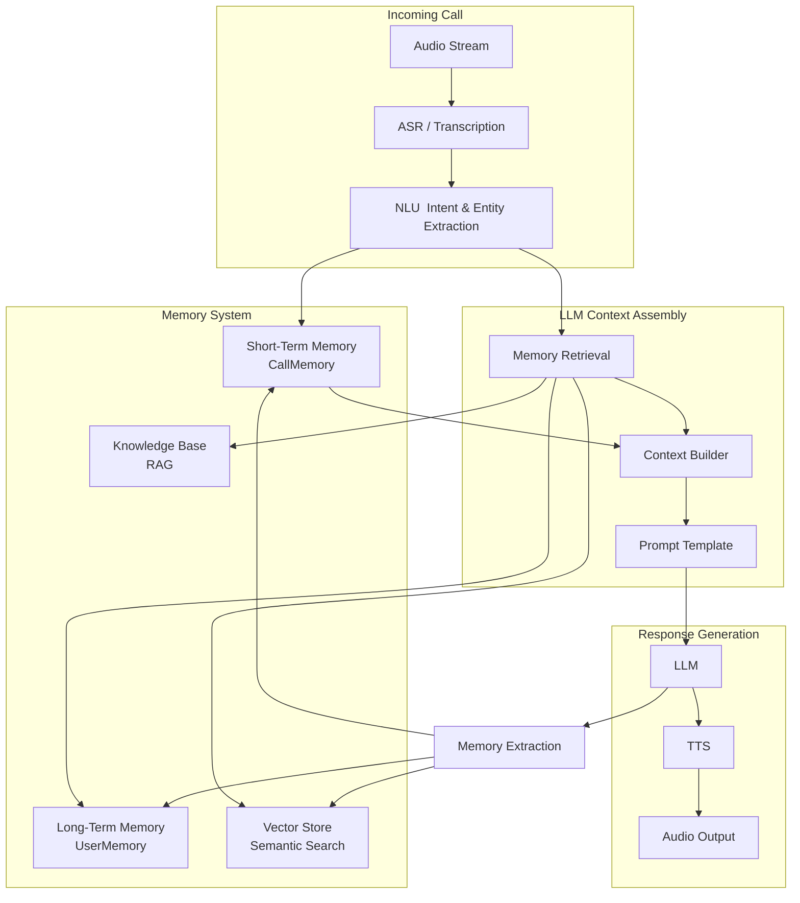
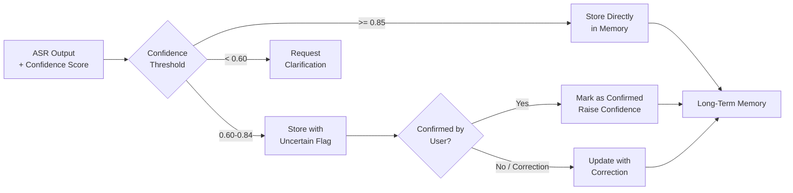
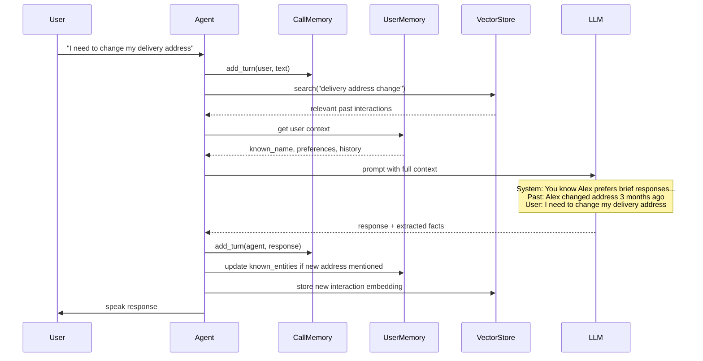
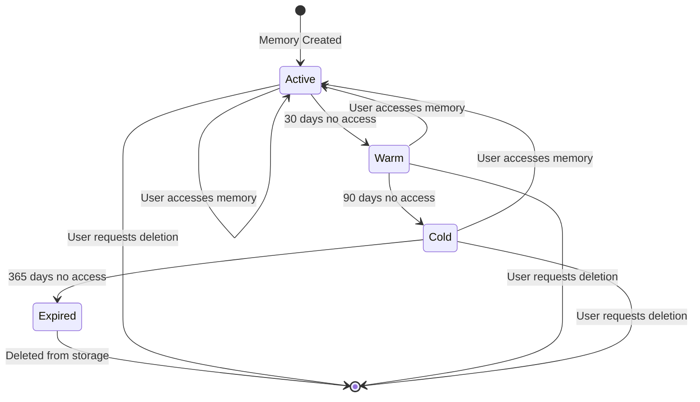
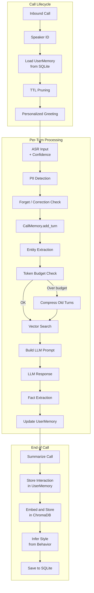

# Voice Agents Deep Dive  Part 11: Voice Agent Memory  Context, Personalization, and Learning

---

**Series:** Building Voice Agents  A Developer's Deep Dive from Audio Fundamentals to Production
**Part:** 11 of 19 (Voice Agent Architecture)
**Audience:** Developers with Python experience who want to build voice-powered AI agents from the ground up
**Reading time:** ~45 minutes

---

## Recap: Part 10  Dialog Management

In Part 10 we built the dialog management layer that gives a voice agent its conversational intelligence. We covered:

- **Slot filling**  systematically collecting required information (name, date, party size) through natural conversation, handling missing or ambiguous values gracefully
- **Turn-taking**  detecting when the user has finished speaking using VAD (Voice Activity Detection) combined with prosodic cues, so the agent neither interrupts prematurely nor waits too long
- **Interruption handling**  barge-in detection that lets users interrupt the agent mid-sentence, immediately halting TTS playback and re-routing dialog state
- **Restaurant reservation agent**  a full end-to-end implementation tying all dialog management concepts together into a working booking system

The dialog manager gave our agent a structured way to conduct goal-oriented conversations. But it had a fundamental blind spot: every call started from zero. The agent had no memory of the user's name, preferences, or past interactions. Today we fix that.

---

## Introduction: The Forgetting Problem

Imagine calling your bank's voice agent. You explain that you prefer to be called "Alex" (not Alexander), that you have a checking account ending in 4521, and that you always call from your home number. The agent handles your request perfectly.

You call back the next day with a follow-up question. The agent greets you with: *"Hello! How can I help you today?"*

It has forgotten everything.

This is not a hypothetical  it is the default behavior of almost every deployed voice agent. Each call is a blank slate. The agent treats a loyal customer of ten years exactly the same as a first-time caller.

> **Key Insight:** Memory is not a nice-to-have feature for voice agents  it is the difference between a phone tree with a language model bolted on and an agent that feels genuinely intelligent.

Human memory operates across multiple timescales:

- **Working memory**  what you are thinking about right now (seconds)
- **Short-term memory**  what happened earlier in the conversation (minutes)
- **Long-term memory**  what you know about a person across many interactions (days, months, years)

Voice agents need all three, and each presents distinct engineering challenges. This article builds each layer from scratch, then assembles them into a voice agent that remembers users across sessions.

---

## 1. Memory Architecture Overview

Before writing code, let us map the full memory system.



The system has four memory stores, each with a different purpose:

| Memory Store | Scope | Storage | Latency | Purpose |
|---|---|---|---|---|
| CallMemory | Current call | RAM | <1ms | Conversation transcript, slots, emotional state |
| UserMemory | Across calls | SQLite/PostgreSQL | 5-50ms | User profile, preferences, history summaries |
| Vector Store | Semantic search | FAISS/ChromaDB | 10-100ms | Find relevant past conversations by meaning |
| Knowledge Base | Domain facts | Vector DB + text | 20-200ms | RAG  retrieve product info, policies, FAQs |

---

## 2. Short-Term Memory: CallMemory

Short-term memory covers everything that happens within a single call. It needs to be fast (RAM-based), structured (so the LLM can use it), and bounded (to stay within the LLM's context window).

### 2.1 The CallMemory Class

```python
# memory/call_memory.py
from __future__ import annotations

import time
from dataclasses import dataclass, field
from enum import Enum
from typing import Any
from uuid import uuid4


class EmotionalState(str, Enum):
    NEUTRAL = "neutral"
    FRUSTRATED = "frustrated"
    HAPPY = "happy"
    CONFUSED = "confused"
    URGENT = "urgent"


@dataclass
class Turn:
    """A single turn in the conversation."""
    turn_id: str = field(default_factory=lambda: str(uuid4()))
    speaker: str = ""          # "user" or "agent"
    text: str = ""
    timestamp: float = field(default_factory=time.time)
    asr_confidence: float = 1.0   # 0.0-1.0, only relevant for user turns
    tokens: int = 0               # approximate token count


@dataclass
class ExtractedEntity:
    """An entity extracted from the conversation."""
    entity_type: str       # e.g. "person_name", "date", "phone_number"
    value: str
    confidence: float      # 0.0-1.0
    turn_id: str           # which turn it came from
    confirmed: bool = False  # has the user confirmed this value?


@dataclass
class CallMemory:
    """
    Short-term memory for a single voice call.

    Stores the full conversation transcript, extracted entities,
    slot values, and emotional state. Manages token budget
    to stay within LLM context window limits.
    """
    call_id: str = field(default_factory=lambda: str(uuid4()))
    user_id: str | None = None
    start_time: float = field(default_factory=time.time)

    # Conversation transcript
    turns: list[Turn] = field(default_factory=list)

    # Extracted entities  keyed by entity_type
    entities: dict[str, ExtractedEntity] = field(default_factory=dict)

    # Slot values for current dialog task
    slots: dict[str, Any] = field(default_factory=dict)

    # Emotional state tracking
    emotional_state: EmotionalState = EmotionalState.NEUTRAL
    frustration_count: int = 0  # how many frustrated signals detected

    # Token budget management
    max_tokens: int = 3000        # budget for conversation history in prompt
    current_token_count: int = 0

    # Compressed summary when transcript gets too long
    compressed_summary: str | None = None
    compression_turn_index: int = 0  # turns before this index are compressed

    def add_turn(self, speaker: str, text: str,
                 asr_confidence: float = 1.0) -> Turn:
        """Add a new turn to the conversation."""
        # Estimate token count (rough: 1 token ~= 4 chars)
        token_estimate = len(text) // 4 + 1

        turn = Turn(
            speaker=speaker,
            text=text,
            asr_confidence=asr_confidence,
            tokens=token_estimate,
        )
        self.turns.append(turn)
        self.current_token_count += token_estimate
        return turn

    def add_entity(self, entity_type: str, value: str,
                   confidence: float, turn_id: str) -> ExtractedEntity:
        """Add or update an extracted entity."""
        entity = ExtractedEntity(
            entity_type=entity_type,
            value=value,
            confidence=confidence,
            turn_id=turn_id,
        )
        # Only overwrite if new value has higher confidence
        if (entity_type not in self.entities or
                confidence > self.entities[entity_type].confidence):
            self.entities[entity_type] = entity
        return entity

    def update_emotional_state(self, new_state: EmotionalState) -> None:
        """Update emotional state, tracking escalation patterns."""
        if new_state == EmotionalState.FRUSTRATED:
            self.frustration_count += 1
        self.emotional_state = new_state

    def set_slot(self, key: str, value: Any) -> None:
        """Set a slot value."""
        self.slots[key] = value

    def get_duration_seconds(self) -> float:
        """Return call duration in seconds."""
        return time.time() - self.start_time

    def get_recent_turns(self, n: int = 10) -> list[Turn]:
        """Return the n most recent turns."""
        return self.turns[-n:]

    def needs_compression(self) -> bool:
        """Check if transcript needs compression to stay in token budget."""
        return self.current_token_count > self.max_tokens * 0.8

    def to_dict(self) -> dict:
        """Serialize to dictionary for storage or prompt injection."""
        return {
            "call_id": self.call_id,
            "user_id": self.user_id,
            "duration_seconds": self.get_duration_seconds(),
            "entities": {k: {"value": v.value, "confidence": v.confidence,
                              "confirmed": v.confirmed}
                         for k, v in self.entities.items()},
            "slots": self.slots,
            "emotional_state": self.emotional_state.value,
            "frustration_count": self.frustration_count,
            "turn_count": len(self.turns),
        }
```

### 2.2 Token Budget Management

A 3000-token context window fills up quickly in a long call. We need a compression strategy that preserves the most important information while discarding verbatim text.

```python
# memory/compression.py
from __future__ import annotations

import asyncio
from openai import AsyncOpenAI
from .call_memory import CallMemory, Turn


COMPRESSION_PROMPT = """You are summarizing a voice call transcript for use as context in an ongoing call.

Compress the following conversation turns into a concise summary (3-5 sentences maximum).
Preserve:
- All factual information (names, numbers, dates, account details)
- The user's primary goal
- Any errors or corrections that were made
- Current emotional state

Do NOT include:
- Greetings and pleasantries
- Filler words and repetitions
- Agent's scripted responses

Conversation to summarize:
{transcript}

Summary:"""


class MemoryCompressor:
    """
    Compresses old conversation turns into a summary
    to stay within the LLM context window budget.
    """

    def __init__(self, client: AsyncOpenAI, model: str = "gpt-4o-mini"):
        self.client = client
        self.model = model

    async def compress(self, memory: CallMemory,
                       keep_recent: int = 6) -> CallMemory:
        """
        Compress old turns in-place.

        Keeps the most recent `keep_recent` turns verbatim.
        Summarizes everything before that into compressed_summary.
        """
        if not memory.needs_compression():
            return memory

        total_turns = len(memory.turns)
        if total_turns <= keep_recent:
            return memory  # Nothing to compress

        turns_to_compress = memory.turns[memory.compression_turn_index:
                                          total_turns - keep_recent]

        if not turns_to_compress:
            return memory

        # Build transcript for compression
        transcript_lines = []
        for turn in turns_to_compress:
            speaker_label = "User" if turn.speaker == "user" else "Agent"
            transcript_lines.append(f"{speaker_label}: {turn.text}")
        transcript = "\n".join(transcript_lines)

        # Prepend existing summary if present
        if memory.compressed_summary:
            transcript = (
                f"[Previous summary: {memory.compressed_summary}]\n\n"
                + transcript
            )

        # Call LLM for compression
        response = await self.client.chat.completions.create(
            model=self.model,
            messages=[
                {
                    "role": "user",
                    "content": COMPRESSION_PROMPT.format(
                        transcript=transcript
                    ),
                }
            ],
            max_tokens=200,
            temperature=0.1,
        )

        new_summary = response.choices[0].message.content.strip()
        memory.compressed_summary = new_summary
        memory.compression_turn_index = total_turns - keep_recent

        # Recalculate token count (only recent turns + summary)
        summary_tokens = len(new_summary) // 4
        recent_tokens = sum(t.tokens for t in memory.turns[-keep_recent:])
        memory.current_token_count = summary_tokens + recent_tokens

        return memory

    def build_transcript_for_prompt(self, memory: CallMemory,
                                    max_recent: int = 10) -> str:
        """
        Build the conversation history string to inject into a prompt.
        Includes compressed summary + recent verbatim turns.
        """
        parts: list[str] = []

        if memory.compressed_summary:
            parts.append(
                f"[Earlier in this call: {memory.compressed_summary}]"
            )

        recent_turns = memory.get_recent_turns(max_recent)
        for turn in recent_turns:
            speaker_label = "User" if turn.speaker == "user" else "Agent"
            confidence_note = ""
            if turn.speaker == "user" and turn.asr_confidence < 0.7:
                confidence_note = " [low ASR confidence]"
            parts.append(f"{speaker_label}{confidence_note}: {turn.text}")

        return "\n".join(parts)
```

---

## 3. Long-Term Memory: UserMemory

Long-term memory persists across calls. It stores what we know about a specific user: their preferences, communication style, past interaction summaries, and any entities they have mentioned repeatedly.

### 3.1 The UserMemory Schema

```python
# memory/user_memory.py
from __future__ import annotations

import json
import time
from dataclasses import dataclass, field
from typing import Any


@dataclass
class CommunicationStyle:
    """How the user prefers to communicate."""
    preferred_pace: str = "normal"       # "slow", "normal", "fast"
    preferred_detail: str = "medium"     # "brief", "medium", "detailed"
    preferred_name: str | None = None    # what to call the user
    formality: str = "neutral"           # "formal", "neutral", "casual"
    language: str = "en-US"


@dataclass
class InteractionSummary:
    """Summary of a single past interaction."""
    call_id: str
    timestamp: float
    duration_seconds: float
    topic: str
    outcome: str           # "resolved", "escalated", "abandoned"
    summary: str           # 2-3 sentence summary
    entities_mentioned: dict[str, str]  # entity_type -> value


@dataclass
class UserMemory:
    """
    Long-term memory for a specific user.
    Persists across calls and sessions.
    """
    user_id: str
    created_at: float = field(default_factory=time.time)
    last_seen: float = field(default_factory=time.time)

    # Identity
    known_name: str | None = None
    phone_number: str | None = None

    # Communication preferences
    communication_style: CommunicationStyle = field(
        default_factory=CommunicationStyle
    )

    # Persistent entities  things the user mentions repeatedly
    # e.g. {"home_city": "Austin", "account_number": "4521"}
    known_entities: dict[str, str] = field(default_factory=dict)

    # Preferences  open-ended key-value store
    # e.g. {"notification_method": "email", "favorite_branch": "downtown"}
    preferences: dict[str, Any] = field(default_factory=dict)

    # Interaction history  most recent N summaries
    interaction_history: list[InteractionSummary] = field(
        default_factory=list
    )
    max_history_entries: int = 20

    # Aggregate stats
    total_calls: int = 0
    total_issues_resolved: int = 0

    def add_interaction(self, summary: InteractionSummary) -> None:
        """Add an interaction summary, pruning old entries."""
        self.interaction_history.append(summary)
        self.total_calls += 1
        if summary.outcome == "resolved":
            self.total_issues_resolved += 1
        # Keep only the most recent entries
        if len(self.interaction_history) > self.max_history_entries:
            self.interaction_history = self.interaction_history[
                -self.max_history_entries:
            ]
        self.last_seen = time.time()

    def update_entity(self, entity_type: str, value: str) -> None:
        """Update a known entity value."""
        self.known_entities[entity_type] = value

    def set_preference(self, key: str, value: Any) -> None:
        """Set a user preference."""
        self.preferences[key] = value

    def get_recent_interactions(self, n: int = 3) -> list[InteractionSummary]:
        """Return n most recent interactions."""
        return self.interaction_history[-n:]

    def days_since_last_call(self) -> float:
        """Return days since last interaction."""
        return (time.time() - self.last_seen) / 86400

    def to_context_string(self) -> str:
        """
        Format user memory as a string for LLM prompt injection.
        Keeps it concise  only the most relevant facts.
        """
        lines: list[str] = []

        if self.known_name:
            lines.append(f"User's preferred name: {self.known_name}")

        style = self.communication_style
        if style.preferred_pace != "normal":
            lines.append(f"Speech pace preference: {style.preferred_pace}")
        if style.preferred_detail != "medium":
            lines.append(f"Detail level preference: {style.preferred_detail}")
        if style.formality != "neutral":
            lines.append(f"Formality: {style.formality}")

        if self.known_entities:
            entity_strs = [f"{k}: {v}"
                           for k, v in self.known_entities.items()]
            lines.append("Known about user: " + "; ".join(entity_strs))

        if self.preferences:
            pref_strs = [f"{k}: {v}"
                         for k, v in self.preferences.items()]
            lines.append("User preferences: " + "; ".join(pref_strs))

        recent = self.get_recent_interactions(2)
        if recent:
            lines.append("Recent interactions:")
            for interaction in recent:
                lines.append(
                    f"  - {interaction.topic} ({interaction.outcome}): "
                    f"{interaction.summary}"
                )

        if self.total_calls > 1:
            lines.append(
                f"Call history: {self.total_calls} calls total, "
                f"{self.total_issues_resolved} resolved"
            )

        return "\n".join(lines) if lines else "New user  no history."

    def to_dict(self) -> dict:
        """Serialize to dict for database storage."""
        return {
            "user_id": self.user_id,
            "created_at": self.created_at,
            "last_seen": self.last_seen,
            "known_name": self.known_name,
            "phone_number": self.phone_number,
            "communication_style": {
                "preferred_pace": self.communication_style.preferred_pace,
                "preferred_detail": self.communication_style.preferred_detail,
                "preferred_name": self.communication_style.preferred_name,
                "formality": self.communication_style.formality,
                "language": self.communication_style.language,
            },
            "known_entities": self.known_entities,
            "preferences": self.preferences,
            "interaction_history": [
                {
                    "call_id": h.call_id,
                    "timestamp": h.timestamp,
                    "duration_seconds": h.duration_seconds,
                    "topic": h.topic,
                    "outcome": h.outcome,
                    "summary": h.summary,
                    "entities_mentioned": h.entities_mentioned,
                }
                for h in self.interaction_history
            ],
            "total_calls": self.total_calls,
            "total_issues_resolved": self.total_issues_resolved,
        }

    @classmethod
    def from_dict(cls, data: dict) -> "UserMemory":
        """Deserialize from dictionary."""
        style_data = data.get("communication_style", {})
        style = CommunicationStyle(
            preferred_pace=style_data.get("preferred_pace", "normal"),
            preferred_detail=style_data.get("preferred_detail", "medium"),
            preferred_name=style_data.get("preferred_name"),
            formality=style_data.get("formality", "neutral"),
            language=style_data.get("language", "en-US"),
        )

        history = [
            InteractionSummary(
                call_id=h["call_id"],
                timestamp=h["timestamp"],
                duration_seconds=h["duration_seconds"],
                topic=h["topic"],
                outcome=h["outcome"],
                summary=h["summary"],
                entities_mentioned=h.get("entities_mentioned", {}),
            )
            for h in data.get("interaction_history", [])
        ]

        obj = cls(user_id=data["user_id"])
        obj.created_at = data.get("created_at", time.time())
        obj.last_seen = data.get("last_seen", time.time())
        obj.known_name = data.get("known_name")
        obj.phone_number = data.get("phone_number")
        obj.communication_style = style
        obj.known_entities = data.get("known_entities", {})
        obj.preferences = data.get("preferences", {})
        obj.interaction_history = history
        obj.total_calls = data.get("total_calls", 0)
        obj.total_issues_resolved = data.get("total_issues_resolved", 0)
        return obj
```

### 3.2 Database Storage

We use SQLite for development and PostgreSQL for production. Both share the same interface.

```python
# memory/storage.py
from __future__ import annotations

import asyncio
import json
import sqlite3
import time
from abc import ABC, abstractmethod
from pathlib import Path

from .user_memory import UserMemory


class MemoryStorage(ABC):
    """Abstract base class for memory storage backends."""

    @abstractmethod
    async def load_user(self, user_id: str) -> UserMemory | None:
        """Load user memory by user_id. Returns None if not found."""

    @abstractmethod
    async def save_user(self, memory: UserMemory) -> None:
        """Persist user memory to storage."""

    @abstractmethod
    async def delete_user(self, user_id: str) -> bool:
        """Delete all memory for a user. Returns True if deleted."""

    @abstractmethod
    async def find_user_by_phone(self, phone: str) -> UserMemory | None:
        """Look up a user by phone number."""


class SQLiteMemoryStorage(MemoryStorage):
    """
    SQLite-backed memory storage.
    Suitable for development, single-server deployments, and testing.
    """

    def __init__(self, db_path: str = "voice_memory.db"):
        self.db_path = db_path
        self._init_db()

    def _get_connection(self) -> sqlite3.Connection:
        conn = sqlite3.connect(self.db_path)
        conn.row_factory = sqlite3.Row
        return conn

    def _init_db(self) -> None:
        """Create tables if they do not exist."""
        with self._get_connection() as conn:
            conn.execute("""
                CREATE TABLE IF NOT EXISTS user_memories (
                    user_id     TEXT PRIMARY KEY,
                    phone       TEXT,
                    data        TEXT NOT NULL,
                    created_at  REAL NOT NULL,
                    updated_at  REAL NOT NULL
                )
            """)
            conn.execute("""
                CREATE INDEX IF NOT EXISTS idx_phone
                ON user_memories (phone)
            """)
            conn.commit()

    async def load_user(self, user_id: str) -> UserMemory | None:
        """Load user memory. Runs DB query in thread pool."""
        loop = asyncio.get_event_loop()
        return await loop.run_in_executor(None, self._load_sync, user_id)

    def _load_sync(self, user_id: str) -> UserMemory | None:
        with self._get_connection() as conn:
            row = conn.execute(
                "SELECT data FROM user_memories WHERE user_id = ?",
                (user_id,)
            ).fetchone()
        if row is None:
            return None
        data = json.loads(row["data"])
        return UserMemory.from_dict(data)

    async def save_user(self, memory: UserMemory) -> None:
        """Save user memory. Runs DB write in thread pool."""
        loop = asyncio.get_event_loop()
        await loop.run_in_executor(None, self._save_sync, memory)

    def _save_sync(self, memory: UserMemory) -> None:
        data_json = json.dumps(memory.to_dict())
        now = time.time()
        with self._get_connection() as conn:
            conn.execute("""
                INSERT INTO user_memories (user_id, phone, data,
                                           created_at, updated_at)
                VALUES (?, ?, ?, ?, ?)
                ON CONFLICT(user_id) DO UPDATE SET
                    phone      = excluded.phone,
                    data       = excluded.data,
                    updated_at = excluded.updated_at
            """, (
                memory.user_id,
                memory.phone_number,
                data_json,
                memory.created_at,
                now,
            ))
            conn.commit()

    async def delete_user(self, user_id: str) -> bool:
        """Delete user memory."""
        loop = asyncio.get_event_loop()
        return await loop.run_in_executor(None, self._delete_sync, user_id)

    def _delete_sync(self, user_id: str) -> bool:
        with self._get_connection() as conn:
            cursor = conn.execute(
                "DELETE FROM user_memories WHERE user_id = ?",
                (user_id,)
            )
            conn.commit()
            return cursor.rowcount > 0

    async def find_user_by_phone(self, phone: str) -> UserMemory | None:
        """Look up user by phone number."""
        loop = asyncio.get_event_loop()
        return await loop.run_in_executor(
            None, self._find_by_phone_sync, phone
        )

    def _find_by_phone_sync(self, phone: str) -> UserMemory | None:
        # Normalize phone  strip non-digits
        normalized = "".join(c for c in phone if c.isdigit())
        with self._get_connection() as conn:
            rows = conn.execute(
                "SELECT user_id, data FROM user_memories WHERE phone LIKE ?",
                (f"%{normalized[-10:]}%",)
            ).fetchall()
        if not rows:
            return None
        # Return first match
        data = json.loads(rows[0]["data"])
        return UserMemory.from_dict(data)
```

### 3.3 Storage Backend Comparison

| Feature | SQLite | PostgreSQL | Redis | DynamoDB |
|---|---|---|---|---|
| Setup complexity | None | Medium | Low | Medium |
| Concurrent writes | Limited | Excellent | Excellent | Excellent |
| Query flexibility | SQL | Full SQL | Limited | Limited |
| Horizontal scale | No | Yes (with pooling) | Yes | Yes |
| Cost | Free | Moderate | Moderate | Pay-per-use |
| Best for | Dev/testing | Production API | Cache layer | Serverless |
| TTL support | Manual | Manual/pg_cron | Native | Native |

---

## 4. Voice-Specific Memory Challenges

Voice introduces memory challenges that text-based agents never face.

### 4.1 ASR Errors Propagating to Memory

When a user says "My name is Meredith" and the ASR transcribes "My name is Meridith," storing that incorrect spelling corrupts long-term memory. We handle this with confidence-weighted storage.



```python
# memory/asr_handler.py
from __future__ import annotations

import re
from dataclasses import dataclass

from .call_memory import CallMemory, ExtractedEntity


# Thresholds for confidence-weighted storage
CONFIDENCE_HIGH = 0.85    # Store directly
CONFIDENCE_MEDIUM = 0.60  # Store but flag as uncertain
CONFIDENCE_LOW = 0.60     # Request clarification


@dataclass
class ASRResult:
    text: str
    confidence: float
    alternatives: list[str]  # other transcription candidates


class ASRMemoryHandler:
    """
    Handles ASR errors and confidence scoring when
    storing entities in memory.
    """

    # Patterns for entity types
    ENTITY_PATTERNS = {
        "person_name": r"\b[A-Z][a-z]+ (?:[A-Z][a-z]+\s?)+",
        "phone_number": r"\b\d{3}[-.\s]?\d{3}[-.\s]?\d{4}\b",
        "email": r"\b[\w.]+@[\w.]+\.\w+\b",
        "date": r"\b(?:january|february|march|april|may|june|july|"
                r"august|september|october|november|december)\s+\d{1,2}"
                r"(?:,?\s+\d{4})?\b",
        "zip_code": r"\b\d{5}(?:-\d{4})?\b",
    }

    def extract_and_store(
        self,
        asr_result: ASRResult,
        memory: CallMemory,
        turn_id: str,
    ) -> list[ExtractedEntity]:
        """
        Extract entities from ASR output and store them
        with confidence-adjusted storage strategy.
        """
        extracted: list[ExtractedEntity] = []

        for entity_type, pattern in self.ENTITY_PATTERNS.items():
            matches = re.findall(pattern, asr_result.text,
                                 re.IGNORECASE)
            for match in matches:
                # Adjust entity confidence by ASR confidence
                # If ASR was uncertain, entities are also uncertain
                entity_confidence = asr_result.confidence * 0.95

                if entity_confidence >= CONFIDENCE_HIGH:
                    # Store directly, no flag needed
                    entity = memory.add_entity(
                        entity_type=entity_type,
                        value=match.strip(),
                        confidence=entity_confidence,
                        turn_id=turn_id,
                    )
                    extracted.append(entity)

                elif entity_confidence >= CONFIDENCE_MEDIUM:
                    # Store but flag for confirmation
                    entity = memory.add_entity(
                        entity_type=entity_type,
                        value=match.strip(),
                        confidence=entity_confidence,
                        turn_id=turn_id,
                    )
                    entity.confirmed = False
                    extracted.append(entity)
                # Below CONFIDENCE_LOW: don't store, trigger clarification

        return extracted

    def detect_correction(self, text: str) -> dict[str, str] | None:
        """
        Detect if the user is correcting a previous statement.
        Returns dict of {entity_type: corrected_value} or None.

        Examples:
          "Actually, my name is Sarah not Sara"
          "No, I said 555-1234, not 555-4321"
          "Wait, I meant the 15th not the 5th"
        """
        correction_triggers = [
            r"actually[,\s]+(?:my|it['\s]s|the)",
            r"no[,\s]+I (?:said|meant)",
            r"wait[,\s]+I (?:said|meant)",
            r"I meant",
            r"not (?:the )?(?:\w+ )+",
            r"let me correct",
            r"I made a mistake",
        ]

        text_lower = text.lower()
        for trigger in correction_triggers:
            if re.search(trigger, text_lower):
                # Flag that a correction was detected
                # In production: use LLM to extract corrected value
                return {"correction_detected": True, "raw_text": text}

        return None

    def apply_correction(
        self,
        memory: CallMemory,
        entity_type: str,
        corrected_value: str,
        turn_id: str,
    ) -> ExtractedEntity:
        """
        Apply a user-confirmed correction to memory.
        Marks the entity as confirmed with high confidence.
        """
        entity = memory.add_entity(
            entity_type=entity_type,
            value=corrected_value,
            confidence=0.99,  # User confirmed  very high confidence
            turn_id=turn_id,
        )
        entity.confirmed = True
        return entity
```

### 4.2 Handling Corrections  "Actually, My Name Is..."

Corrections are a critical edge case. Users frequently notice ASR errors mid-conversation and attempt to fix them. The agent must:

1. Recognize the correction pattern
2. Identify which entity is being corrected
3. Update memory with the new value
4. Acknowledge the correction naturally

> **Key Insight:** When a user corrects the agent, they are not just fixing the current response  they are correcting the memory that will influence all future responses. Treat corrections as high-confidence ground truth.

```python
# In your dialog manager  handling a detected correction
async def handle_correction(
    self,
    user_text: str,
    memory: CallMemory,
    user_memory: UserMemory,
) -> str:
    """
    Process a user correction. Updates both call and user memory.
    Returns acknowledgement text for TTS.
    """
    handler = ASRMemoryHandler()
    correction = handler.detect_correction(user_text)

    if not correction:
        return ""  # Not a correction

    # Use LLM to extract what was corrected
    correction_analysis = await self._extract_correction_with_llm(
        user_text, memory
    )

    if correction_analysis:
        entity_type = correction_analysis["entity_type"]
        new_value = correction_analysis["corrected_value"]

        # Get the last turn id
        last_turn = memory.turns[-1] if memory.turns else None
        turn_id = last_turn.turn_id if last_turn else "correction"

        # Update call memory
        handler.apply_correction(memory, entity_type, new_value, turn_id)

        # Update user memory if it's a persistent entity
        persistent_entities = {
            "person_name", "phone_number", "email", "address"
        }
        if entity_type in persistent_entities:
            user_memory.update_entity(entity_type, new_value)

        return (
            f"Got it, I've updated that. "
            f"So it's {new_value}  is that right?"
        )

    return "I want to make sure I have that right. Could you say it once more?"
```

### 4.3 Speaker Identification for Memory Retrieval

In a multi-user household or shared phone line, the same phone number may belong to multiple people. Speaker identification links audio characteristics to a specific user profile.

```python
# memory/speaker_id.py
from __future__ import annotations

import hashlib
import numpy as np
from dataclasses import dataclass


@dataclass
class VoicePrint:
    """A stored voice embedding for a known user."""
    user_id: str
    embedding: list[float]     # 256-dim speaker embedding
    sample_count: int = 1      # how many samples averaged
    confidence_threshold: float = 0.85


class SpeakerIdentifier:
    """
    Matches incoming audio embeddings to known user voice prints.
    In production, use a dedicated model like pyannote/speaker-diarization.
    """

    def __init__(self, storage: dict[str, VoicePrint] | None = None):
        self.voice_prints: dict[str, VoicePrint] = storage or {}

    def cosine_similarity(self, a: list[float], b: list[float]) -> float:
        """Compute cosine similarity between two embeddings."""
        arr_a = np.array(a)
        arr_b = np.array(b)
        norm_a = np.linalg.norm(arr_a)
        norm_b = np.linalg.norm(arr_b)
        if norm_a == 0 or norm_b == 0:
            return 0.0
        return float(np.dot(arr_a, arr_b) / (norm_a * norm_b))

    def identify(
        self,
        embedding: list[float],
        phone_number: str | None = None,
    ) -> tuple[str | None, float]:
        """
        Try to identify a speaker from their voice embedding.

        Returns (user_id, confidence) or (None, 0.0) if no match.
        Phone number is used as a hint to narrow the search space.
        """
        best_match_id: str | None = None
        best_score: float = 0.0

        for user_id, voice_print in self.voice_prints.items():
            score = self.cosine_similarity(embedding, voice_print.embedding)
            if score > best_score:
                best_score = score
                best_match_id = user_id

        if (best_match_id is not None and
                best_score >= self.voice_prints[best_match_id]
                .confidence_threshold):
            return best_match_id, best_score

        return None, 0.0

    def enroll(self, user_id: str, embedding: list[float]) -> VoicePrint:
        """
        Enroll a new user or update existing voice print.
        Running average of embeddings for robustness.
        """
        if user_id in self.voice_prints:
            existing = self.voice_prints[user_id]
            # Running average
            n = existing.sample_count
            avg = [
                (existing.embedding[i] * n + embedding[i]) / (n + 1)
                for i in range(len(embedding))
            ]
            existing.embedding = avg
            existing.sample_count = n + 1
            return existing

        voice_print = VoicePrint(
            user_id=user_id,
            embedding=embedding,
        )
        self.voice_prints[user_id] = voice_print
        return voice_print
```

---

## 5. Integrating Memory with LLM Context

Now we wire everything together. The `MemoryAugmentedAgent` retrieves relevant memories before each LLM call, builds an enriched context, and extracts new facts from the LLM's response.

### 5.1 Memory Data Flow



### 5.2 The MemoryAugmentedAgent Class

```python
# memory/memory_agent.py
from __future__ import annotations

import json
import time
from dataclasses import dataclass

from openai import AsyncOpenAI

from .call_memory import CallMemory, EmotionalState
from .compression import MemoryCompressor
from .storage import MemoryStorage
from .user_memory import InteractionSummary, UserMemory
from .vector_store import VoiceVectorStore


SYSTEM_PROMPT_TEMPLATE = """You are a helpful voice assistant. You are speaking with {name}.

## What you know about this user:
{user_context}

## Relevant past interactions:
{relevant_history}

## Current call context:
{call_context}

## Guidelines:
- Address the user as {address_as}
- Keep responses {detail_level}  this is a voice call, not a chat
- Speech pace: {pace}
- {formality_instruction}
- If the user mentions new facts about themselves (address, preferences, family members), note them in your response using [MEMORY: entity_type=value] tags so they can be extracted
- Never read out URLs or markdown formatting

## Current conversation:
{transcript}"""


FACT_EXTRACTION_PROMPT = """Extract any new facts mentioned by the user in this conversation turn.
Only extract facts that should be remembered long-term (name, address, preferences, family members, etc.).
Do NOT extract transient information (current weather, today's schedule, what they had for lunch).

User said: "{user_text}"

Return a JSON object with extracted facts, or an empty object if none.
Example: {{"home_city": "Austin", "preferred_name": "Alex", "has_premium_account": true}}
Return only valid JSON."""


@dataclass
class AgentResponse:
    text: str
    extracted_facts: dict[str, str]
    should_update_user_memory: bool


class MemoryAugmentedAgent:
    """
    A voice agent that retrieves and updates memory on every turn.
    """

    def __init__(
        self,
        client: AsyncOpenAI,
        storage: MemoryStorage,
        vector_store: VoiceVectorStore,
        model: str = "gpt-4o",
    ):
        self.client = client
        self.storage = storage
        self.vector_store = vector_store
        self.model = model
        self.compressor = MemoryCompressor(client)

    async def process_turn(
        self,
        user_text: str,
        call_memory: CallMemory,
        user_memory: UserMemory,
        asr_confidence: float = 1.0,
    ) -> AgentResponse:
        """
        Process a single user turn:
        1. Add turn to call memory
        2. Retrieve relevant past interactions
        3. Build enriched prompt
        4. Call LLM
        5. Extract new facts from response
        6. Return response
        """
        # Step 1: Add user turn to call memory
        turn = call_memory.add_turn(
            speaker="user",
            text=user_text,
            asr_confidence=asr_confidence,
        )

        # Step 2: Compress if needed
        if call_memory.needs_compression():
            await self.compressor.compress(call_memory)

        # Step 3: Retrieve semantically relevant past interactions
        relevant_history = await self.vector_store.search(
            query=user_text,
            user_id=user_memory.user_id,
            top_k=3,
        )

        # Step 4: Build the prompt
        prompt = self._build_prompt(
            call_memory=call_memory,
            user_memory=user_memory,
            relevant_history=relevant_history,
        )

        # Step 5: Call LLM
        response = await self.client.chat.completions.create(
            model=self.model,
            messages=prompt,
            max_tokens=300,
            temperature=0.7,
        )
        agent_text = response.choices[0].message.content.strip()

        # Step 6: Add agent turn to call memory
        call_memory.add_turn(speaker="agent", text=agent_text)

        # Step 7: Extract new facts from user's statement
        extracted_facts = await self._extract_facts(user_text)

        # Step 8: Apply extracted facts to user memory
        for key, value in extracted_facts.items():
            if key == "preferred_name":
                user_memory.known_name = value
                user_memory.communication_style.preferred_name = value
            elif key in ("preferred_pace", "preferred_detail", "formality"):
                setattr(user_memory.communication_style, key, value)
            else:
                user_memory.update_entity(key, value)

        return AgentResponse(
            text=agent_text,
            extracted_facts=extracted_facts,
            should_update_user_memory=bool(extracted_facts),
        )

    def _build_prompt(
        self,
        call_memory: CallMemory,
        user_memory: UserMemory,
        relevant_history: list[str],
    ) -> list[dict]:
        """Build the full prompt with memory context."""
        style = user_memory.communication_style
        name = user_memory.known_name or "the user"
        address_as = style.preferred_name or name

        formality_instruction = {
            "formal": "Use formal language and titles.",
            "casual": "Use casual, friendly language.",
            "neutral": "Use professional but approachable language.",
        }.get(style.formality, "Use professional but approachable language.")

        detail_level = {
            "brief": "concise (1-2 sentences per response)",
            "medium": "moderately detailed (2-3 sentences)",
            "detailed": "thorough (explain fully)",
        }.get(style.preferred_detail, "moderately detailed")

        relevant_history_text = (
            "\n".join(f"- {h}" for h in relevant_history)
            if relevant_history
            else "No relevant past interactions found."
        )

        transcript = self.compressor.build_transcript_for_prompt(
            call_memory, max_recent=8
        )

        system_content = SYSTEM_PROMPT_TEMPLATE.format(
            name=name,
            user_context=user_memory.to_context_string(),
            relevant_history=relevant_history_text,
            call_context=(
                f"Emotional state: {call_memory.emotional_state.value}\n"
                f"Call duration: {call_memory.get_duration_seconds():.0f}s\n"
                f"Known slots: {json.dumps(call_memory.slots)}"
            ),
            address_as=address_as,
            detail_level=detail_level,
            pace=style.preferred_pace,
            formality_instruction=formality_instruction,
            transcript=transcript,
        )

        return [
            {"role": "system", "content": system_content},
            {"role": "user", "content": user_memory.known_name or "User"},
        ]

    async def _extract_facts(self, user_text: str) -> dict[str, str]:
        """Use LLM to extract memorable facts from user's statement."""
        try:
            response = await self.client.chat.completions.create(
                model="gpt-4o-mini",  # Use cheaper model for extraction
                messages=[
                    {
                        "role": "user",
                        "content": FACT_EXTRACTION_PROMPT.format(
                            user_text=user_text
                        ),
                    }
                ],
                max_tokens=150,
                temperature=0.0,
                response_format={"type": "json_object"},
            )
            facts_text = response.choices[0].message.content.strip()
            return json.loads(facts_text)
        except (json.JSONDecodeError, Exception):
            return {}

    async def end_call(
        self,
        call_memory: CallMemory,
        user_memory: UserMemory,
        topic: str,
        outcome: str = "resolved",
    ) -> None:
        """
        Called when a call ends. Summarizes the interaction
        and stores it in user long-term memory.
        """
        summary_text = await self._summarize_call(call_memory)

        interaction = InteractionSummary(
            call_id=call_memory.call_id,
            timestamp=time.time(),
            duration_seconds=call_memory.get_duration_seconds(),
            topic=topic,
            outcome=outcome,
            summary=summary_text,
            entities_mentioned={
                k: v.value
                for k, v in call_memory.entities.items()
                if v.confirmed or v.confidence > 0.8
            },
        )

        user_memory.add_interaction(interaction)
        await self.storage.save_user(user_memory)

        # Store interaction in vector store for semantic retrieval
        await self.vector_store.store(
            text=f"Topic: {topic}. {summary_text}",
            user_id=user_memory.user_id,
            metadata={
                "call_id": call_memory.call_id,
                "timestamp": interaction.timestamp,
                "outcome": outcome,
                "topic": topic,
            },
        )

    async def _summarize_call(self, call_memory: CallMemory) -> str:
        """Generate a 2-3 sentence summary of the call."""
        transcript = self.compressor.build_transcript_for_prompt(
            call_memory, max_recent=20
        )
        if call_memory.compressed_summary:
            transcript = (
                f"[Earlier: {call_memory.compressed_summary}]\n"
                + transcript
            )

        response = await self.client.chat.completions.create(
            model="gpt-4o-mini",
            messages=[
                {
                    "role": "user",
                    "content": (
                        "Summarize this voice call in 2-3 sentences. "
                        "Include the main topic, what was resolved, "
                        "and any important facts mentioned.\n\n"
                        f"{transcript}"
                    ),
                }
            ],
            max_tokens=150,
            temperature=0.1,
        )
        return response.choices[0].message.content.strip()
```

---

## 6. Vector-Based Memory (Semantic Search)

Structured databases store facts, but they cannot answer questions like "has this user ever mentioned problems with their router?" Vector search makes past interactions searchable by meaning.

### 6.1 The Vector Store

```python
# memory/vector_store.py
from __future__ import annotations

import json
import time
from dataclasses import dataclass, field
from typing import Any

import chromadb
from chromadb.config import Settings
from openai import AsyncOpenAI


@dataclass
class MemoryDocument:
    """A document stored in the vector store."""
    doc_id: str
    text: str
    user_id: str
    embedding: list[float] = field(default_factory=list)
    metadata: dict[str, Any] = field(default_factory=dict)
    timestamp: float = field(default_factory=time.time)


class VoiceVectorStore:
    """
    Semantic memory store for voice agents.
    Uses ChromaDB with OpenAI embeddings.

    Stores interaction summaries and retrieves
    them by semantic similarity.
    """

    COLLECTION_NAME = "voice_memories"
    EMBEDDING_MODEL = "text-embedding-3-small"

    def __init__(
        self,
        client: AsyncOpenAI,
        persist_directory: str = "./chroma_db",
    ):
        self.client = client
        self.chroma = chromadb.PersistentClient(
            path=persist_directory,
            settings=Settings(anonymized_telemetry=False),
        )
        self.collection = self.chroma.get_or_create_collection(
            name=self.COLLECTION_NAME,
            metadata={"hnsw:space": "cosine"},
        )

    async def _embed(self, text: str) -> list[float]:
        """Generate embedding for text using OpenAI."""
        response = await self.client.embeddings.create(
            model=self.EMBEDDING_MODEL,
            input=text,
        )
        return response.data[0].embedding

    async def store(
        self,
        text: str,
        user_id: str,
        metadata: dict[str, Any] | None = None,
    ) -> str:
        """
        Store a memory document.
        Returns the document ID.
        """
        embedding = await self._embed(text)
        doc_id = f"{user_id}_{int(time.time() * 1000)}"

        meta = {
            "user_id": user_id,
            "timestamp": time.time(),
            **(metadata or {}),
        }

        self.collection.add(
            ids=[doc_id],
            embeddings=[embedding],
            documents=[text],
            metadatas=[meta],
        )
        return doc_id

    async def search(
        self,
        query: str,
        user_id: str,
        top_k: int = 3,
        min_similarity: float = 0.6,
    ) -> list[str]:
        """
        Search for relevant past memories.
        Returns list of relevant text snippets.
        """
        if self.collection.count() == 0:
            return []

        query_embedding = await self._embed(query)

        results = self.collection.query(
            query_embeddings=[query_embedding],
            n_results=min(top_k, self.collection.count()),
            where={"user_id": user_id},
            include=["documents", "distances", "metadatas"],
        )

        relevant: list[str] = []
        documents = results.get("documents", [[]])[0]
        distances = results.get("distances", [[]])[0]

        for doc, distance in zip(documents, distances):
            # ChromaDB cosine distance: 0 = identical, 2 = opposite
            # Convert to similarity: 1 - distance/2
            similarity = 1 - (distance / 2)
            if similarity >= min_similarity:
                relevant.append(doc)

        return relevant

    async def delete_user_memories(self, user_id: str) -> int:
        """Delete all memories for a user. Returns count deleted."""
        results = self.collection.get(
            where={"user_id": user_id},
            include=["documents"],
        )
        ids = results.get("ids", [])
        if ids:
            self.collection.delete(ids=ids)
        return len(ids)

    async def get_user_memory_count(self, user_id: str) -> int:
        """Return number of stored memories for a user."""
        results = self.collection.get(
            where={"user_id": user_id},
            include=[],
        )
        return len(results.get("ids", []))
```

### 6.2 Retrieval Strategies Comparison

| Strategy | Description | Latency | Precision | Best For |
|---|---|---|---|---|
| Exact match (SQL) | Match by user_id + entity_type | <5ms | Perfect | Structured facts |
| BM25 / keyword | TF-IDF style text search | 10-30ms | Good | Known keywords |
| Dense vector (ANN) | Embedding similarity search | 20-100ms | High | Semantic similarity |
| Hybrid (BM25 + dense) | Score fusion of both | 30-150ms | Best | Production systems |
| Re-ranking | LLM re-scores top candidates | 200-500ms | Excellent | High-stakes retrieval |

---

## 7. RAG for Voice Agents

Retrieval-Augmented Generation (RAG) lets a voice agent answer questions about its domain without hallucinating. The key challenge for voice is that retrieved content must be spoken aloud  no markdown, no URLs, no bullet points.

### 7.1 Voice-Friendly Content Formatting

```python
# memory/rag.py
from __future__ import annotations

import re
from dataclasses import dataclass
from typing import Any

import chromadb
from chromadb.config import Settings
from openai import AsyncOpenAI


@dataclass
class KnowledgeChunk:
    """A chunk of knowledge base content."""
    chunk_id: str
    content: str               # Raw text
    voice_content: str         # Voice-formatted version
    source: str                # Document/page source
    topic: str                 # Topic category
    metadata: dict[str, Any]


class VoiceRAGFormatter:
    """
    Converts retrieved text into voice-friendly format.

    Text-to-speech cannot render markdown, URLs, or formatted lists.
    This formatter converts retrieved content for spoken output.
    """

    @staticmethod
    def strip_markdown(text: str) -> str:
        """Remove markdown formatting."""
        # Remove headers
        text = re.sub(r"^#{1,6}\s+", "", text, flags=re.MULTILINE)
        # Remove bold/italic
        text = re.sub(r"\*{1,2}([^*]+)\*{1,2}", r"\1", text)
        text = re.sub(r"_{1,2}([^_]+)_{1,2}", r"\1", text)
        # Remove inline code
        text = re.sub(r"`([^`]+)`", r"\1", text)
        # Remove links  keep text, drop URL
        text = re.sub(r"\[([^\]]+)\]\([^)]+\)", r"\1", text)
        # Remove bare URLs
        text = re.sub(
            r"https?://\S+",
            "our website",
            text,
        )
        # Remove horizontal rules
        text = re.sub(r"^[-*_]{3,}\s*$", "", text, flags=re.MULTILINE)
        return text.strip()

    @staticmethod
    def convert_lists_to_prose(text: str) -> str:
        """Convert bullet lists to speakable prose."""
        lines = text.split("\n")
        result_lines: list[str] = []
        list_items: list[str] = []

        for line in lines:
            stripped = line.strip()
            # Detect bullet points (-, *, bullet, numbered)
            bullet_match = re.match(
                r"^(?:[-*]|\d+[.)]) (.+)$", stripped
            )
            if bullet_match:
                list_items.append(bullet_match.group(1))
            else:
                if list_items:
                    # Convert accumulated list to prose
                    if len(list_items) == 1:
                        result_lines.append(list_items[0])
                    elif len(list_items) == 2:
                        result_lines.append(
                            f"{list_items[0]}, and {list_items[1]}"
                        )
                    else:
                        joined = (
                            ", ".join(list_items[:-1])
                            + f", and {list_items[-1]}"
                        )
                        result_lines.append(joined)
                    list_items = []
                if stripped:
                    result_lines.append(stripped)

        # Handle trailing list
        if list_items:
            if len(list_items) == 1:
                result_lines.append(list_items[0])
            else:
                joined = (
                    ", ".join(list_items[:-1])
                    + f", and {list_items[-1]}"
                )
                result_lines.append(joined)

        return " ".join(result_lines)

    @staticmethod
    def expand_abbreviations(text: str) -> str:
        """Expand common abbreviations for natural speech."""
        expansions = {
            r"\bvs\.\b": "versus",
            r"\betc\.\b": "and so on",
            r"\be\.g\.\b": "for example",
            r"\bi\.e\.\b": "that is",
            r"\bapprox\.\b": "approximately",
            r"\bfig\.\b": "figure",
            r"\bmax\b": "maximum",
            r"\bmin\b": "minimum",
            r"\bno\.\b": "number",
        }
        for pattern, replacement in expansions.items():
            text = re.sub(pattern, replacement, text, flags=re.IGNORECASE)
        return text

    def format_for_voice(self, text: str) -> str:
        """Full pipeline: convert text to voice-friendly format."""
        text = self.strip_markdown(text)
        text = self.convert_lists_to_prose(text)
        text = self.expand_abbreviations(text)
        # Collapse multiple spaces/newlines
        text = re.sub(r"\n+", " ", text)
        text = re.sub(r" {2,}", " ", text)
        return text.strip()


class VoiceKnowledgeBase:
    """
    RAG knowledge base optimized for voice agents.
    Stores and retrieves domain knowledge in voice-friendly format.
    """

    COLLECTION_NAME = "voice_knowledge"

    def __init__(
        self,
        client: AsyncOpenAI,
        persist_directory: str = "./chroma_kb",
    ):
        self.client = client
        self.formatter = VoiceRAGFormatter()
        self.chroma = chromadb.PersistentClient(
            path=persist_directory,
            settings=Settings(anonymized_telemetry=False),
        )
        self.collection = self.chroma.get_or_create_collection(
            name=self.COLLECTION_NAME,
            metadata={"hnsw:space": "cosine"},
        )

    def _chunk_text(
        self,
        text: str,
        chunk_size: int = 300,
        overlap: int = 50,
    ) -> list[str]:
        """
        Chunk text into overlapping segments.
        Smaller chunks work better for voice (concise answers).
        """
        words = text.split()
        chunks: list[str] = []
        start = 0
        while start < len(words):
            end = min(start + chunk_size, len(words))
            chunk = " ".join(words[start:end])
            chunks.append(chunk)
            if end == len(words):
                break
            start += chunk_size - overlap
        return chunks

    async def ingest_document(
        self,
        text: str,
        source: str,
        topic: str,
        metadata: dict[str, Any] | None = None,
    ) -> int:
        """
        Ingest a document into the knowledge base.
        Returns number of chunks stored.
        """
        chunks = self._chunk_text(text)
        ids: list[str] = []
        embeddings: list[list[float]] = []
        documents: list[str] = []
        metadatas: list[dict] = []

        for i, chunk in enumerate(chunks):
            voice_chunk = self.formatter.format_for_voice(chunk)
            chunk_id = f"{source}_{i}"

            # Embed the raw text for better semantic search
            response = await self.client.embeddings.create(
                model="text-embedding-3-small",
                input=chunk,
            )
            embedding = response.data[0].embedding

            ids.append(chunk_id)
            embeddings.append(embedding)
            documents.append(voice_chunk)  # Store voice-formatted version
            metadatas.append({
                "source": source,
                "topic": topic,
                "chunk_index": i,
                **(metadata or {}),
            })

        self.collection.add(
            ids=ids,
            embeddings=embeddings,
            documents=documents,
            metadatas=metadatas,
        )
        return len(chunks)

    async def retrieve(
        self,
        query: str,
        topic_filter: str | None = None,
        top_k: int = 2,
    ) -> list[str]:
        """
        Retrieve relevant knowledge chunks for a query.
        Returns voice-formatted text snippets.
        """
        if self.collection.count() == 0:
            return []

        response = await self.client.embeddings.create(
            model="text-embedding-3-small",
            input=query,
        )
        query_embedding = response.data[0].embedding

        where_filter: dict | None = None
        if topic_filter:
            where_filter = {"topic": topic_filter}

        results = self.collection.query(
            query_embeddings=[query_embedding],
            n_results=min(top_k, self.collection.count()),
            where=where_filter,
            include=["documents", "distances"],
        )

        documents = results.get("documents", [[]])[0]
        distances = results.get("distances", [[]])[0]

        relevant: list[str] = []
        for doc, dist in zip(documents, distances):
            similarity = 1 - (dist / 2)
            if similarity >= 0.55:  # Lower threshold for KB
                relevant.append(doc)

        return relevant
```

---

## 8. Personalization from Memory

Memory enables personalization that makes the agent feel genuinely tailored to each user.

### 8.1 Adapting Speech Style

```python
# memory/personalization.py
from __future__ import annotations

from dataclasses import dataclass

from .user_memory import CommunicationStyle, UserMemory


@dataclass
class SpeechParameters:
    """TTS and response parameters derived from user memory."""
    speaking_rate: float = 1.0      # 0.5 = half speed, 2.0 = double
    pitch: float = 0.0              # semitones offset
    response_max_tokens: int = 150  # shorter for brief users
    use_contractions: bool = True   # formal users prefer no contractions
    greeting: str = "Hello"


class PersonalizationEngine:
    """
    Translates user memory into concrete agent behavior adjustments.
    """

    PACE_TO_RATE = {
        "slow": 0.85,
        "normal": 1.0,
        "fast": 1.15,
    }

    DETAIL_TO_TOKENS = {
        "brief": 80,
        "medium": 150,
        "detailed": 300,
    }

    def get_speech_parameters(
        self, user_memory: UserMemory
    ) -> SpeechParameters:
        """Derive TTS parameters from user communication style."""
        style = user_memory.communication_style

        rate = self.PACE_TO_RATE.get(style.preferred_pace, 1.0)
        max_tokens = self.DETAIL_TO_TOKENS.get(
            style.preferred_detail, 150
        )
        use_contractions = style.formality != "formal"

        # Choose greeting based on familiarity
        if user_memory.total_calls == 0:
            greeting = "Hello"
        elif user_memory.days_since_last_call() > 30:
            greeting = "Welcome back"
        elif user_memory.days_since_last_call() > 7:
            greeting = "Good to hear from you again"
        else:
            greeting = "Hello again"

        return SpeechParameters(
            speaking_rate=rate,
            response_max_tokens=max_tokens,
            use_contractions=use_contractions,
            greeting=greeting,
        )

    def build_personalized_greeting(
        self, user_memory: UserMemory, params: SpeechParameters
    ) -> str:
        """
        Build a personalized opening greeting that acknowledges
        the user's history without being intrusive.
        """
        name = user_memory.communication_style.preferred_name
        name_str = f", {name}" if name else ""
        greeting = params.greeting

        # Reference recent context if appropriate
        recent = user_memory.get_recent_interactions(1)
        context_str = ""
        if recent and user_memory.days_since_last_call() < 7:
            last = recent[0]
            if last.outcome == "resolved":
                context_str = (
                    f" I hope everything worked out with "
                    f"{last.topic.lower()}."
                )
            elif last.outcome == "escalated":
                context_str = (
                    f" Are you calling back about "
                    f"{last.topic.lower()}?"
                )

        return f"{greeting}{name_str}.{context_str} How can I help you today?"

    def infer_style_from_behavior(
        self,
        user_memory: UserMemory,
        avg_user_words_per_turn: float,
        avg_call_duration_minutes: float,
    ) -> None:
        """
        Update communication style based on observed behavior.
        Called at end of call with statistics from call_memory.
        """
        # Users who speak in short bursts prefer brief responses
        if avg_user_words_per_turn < 8:
            user_memory.communication_style.preferred_detail = "brief"
        elif avg_user_words_per_turn > 25:
            user_memory.communication_style.preferred_detail = "detailed"

        # Long calls may indicate confusion  offer more detail next time
        if avg_call_duration_minutes > 10:
            user_memory.set_preference("may_need_more_explanation", True)
```

### 8.2 Proactive Suggestions

```python
# memory/proactive.py
from __future__ import annotations

import time
from dataclasses import dataclass

from .user_memory import UserMemory


@dataclass
class ProactiveSuggestion:
    text: str
    confidence: float
    trigger_reason: str


class ProactiveSuggestionEngine:
    """
    Generates proactive suggestions based on user history.
    Called at the start of each call to preload likely needs.
    """

    def generate_suggestions(
        self, user_memory: UserMemory
    ) -> list[ProactiveSuggestion]:
        """
        Analyze user history and generate relevant suggestions.
        """
        suggestions: list[ProactiveSuggestion] = []
        recent = user_memory.get_recent_interactions(5)

        # Recurring topic detection
        topic_counts: dict[str, int] = {}
        for interaction in recent:
            topic_counts[interaction.topic] = (
                topic_counts.get(interaction.topic, 0) + 1
            )

        for topic, count in topic_counts.items():
            if count >= 2:
                suggestions.append(
                    ProactiveSuggestion(
                        text=(
                            f"I see you've called about {topic.lower()} "
                            f"before. Is that what you're calling about today?"
                        ),
                        confidence=0.6 + (count * 0.1),
                        trigger_reason=f"Recurring topic: {topic} x{count}",
                    )
                )

        # Unresolved issue follow-up
        for interaction in reversed(recent):
            if interaction.outcome == "escalated":
                days_ago = (
                    (time.time() - interaction.timestamp) / 86400
                )
                if days_ago < 7:
                    suggestions.append(
                        ProactiveSuggestion(
                            text=(
                                f"Last time we spoke, we escalated your "
                                f"{interaction.topic.lower()} issue. "
                                f"Would you like an update on that?"
                            ),
                            confidence=0.8,
                            trigger_reason="Unresolved escalation within 7d",
                        )
                    )
                break

        # Sort by confidence descending
        suggestions.sort(key=lambda s: s.confidence, reverse=True)
        return suggestions[:2]  # Return top 2
```

---

## 9. Memory Management and Privacy

### 9.1 TTL (Time-to-Live) for Memories

Not all memories should live forever. Transient information (today's weather complaint, a one-time question) should expire automatically.



```python
# memory/ttl.py
from __future__ import annotations

import time
from dataclasses import dataclass
from enum import Enum

from .storage import MemoryStorage
from .user_memory import UserMemory


class MemoryTemperature(str, Enum):
    ACTIVE = "active"    # Accessed within 30 days
    WARM = "warm"        # 30-90 days
    COLD = "cold"        # 90-365 days
    EXPIRED = "expired"  # >365 days


ENTITY_TTL_DAYS: dict[str, float] = {
    # Long-lived (essentially permanent)
    "person_name": 3650,
    "phone_number": 3650,
    "email": 3650,
    "account_number": 3650,
    # Medium-lived
    "home_address": 365,
    "employer": 365,
    "preferred_name": 3650,
    # Short-lived
    "current_issue": 30,
    "temporary_address": 90,
    "one_time_preference": 60,
}


@dataclass
class TTLManager:
    """Manages time-to-live for memory entries."""

    storage: MemoryStorage

    def get_memory_temperature(
        self, user_memory: UserMemory
    ) -> MemoryTemperature:
        """Determine the 'temperature' of a user's memory."""
        days_inactive = user_memory.days_since_last_call()
        if days_inactive < 30:
            return MemoryTemperature.ACTIVE
        elif days_inactive < 90:
            return MemoryTemperature.WARM
        elif days_inactive < 365:
            return MemoryTemperature.COLD
        else:
            return MemoryTemperature.EXPIRED

    def prune_expired_entities(
        self, user_memory: UserMemory
    ) -> list[str]:
        """
        Remove entities that have exceeded their TTL.
        Returns list of removed entity keys.
        """
        now = time.time()
        removed: list[str] = []

        for entity_type in list(user_memory.known_entities.keys()):
            ttl_days = ENTITY_TTL_DAYS.get(entity_type, 365)
            ttl_seconds = ttl_days * 86400

            # Check if entity was mentioned in recent interactions
            last_seen = self._entity_last_seen(user_memory, entity_type)
            if last_seen and (now - last_seen) > ttl_seconds:
                del user_memory.known_entities[entity_type]
                removed.append(entity_type)

        return removed

    def _entity_last_seen(
        self, user_memory: UserMemory, entity_type: str
    ) -> float | None:
        """Find when an entity was last mentioned in interactions."""
        for interaction in reversed(user_memory.interaction_history):
            if entity_type in interaction.entities_mentioned:
                return interaction.timestamp
        return None

    def prune_old_interactions(
        self,
        user_memory: UserMemory,
        max_age_days: float = 365,
    ) -> int:
        """
        Remove interaction summaries older than max_age_days.
        Returns count removed.
        """
        cutoff = time.time() - (max_age_days * 86400)
        original_count = len(user_memory.interaction_history)
        user_memory.interaction_history = [
            i for i in user_memory.interaction_history
            if i.timestamp > cutoff
        ]
        return original_count - len(user_memory.interaction_history)

    async def run_cleanup(
        self,
        user_memory: UserMemory,
        dry_run: bool = False,
    ) -> dict:
        """
        Run full cleanup pass on a user's memory.
        Returns summary of what was/would be cleaned.
        """
        temp = self.get_memory_temperature(user_memory)
        result = {
            "user_id": user_memory.user_id,
            "temperature": temp.value,
            "entities_removed": [],
            "interactions_removed": 0,
            "action": "none",
        }

        if temp == MemoryTemperature.EXPIRED:
            if not dry_run:
                await self.storage.delete_user(user_memory.user_id)
            result["action"] = "delete_all"
            return result

        if not dry_run:
            result["entities_removed"] = self.prune_expired_entities(
                user_memory
            )
            result["interactions_removed"] = self.prune_old_interactions(
                user_memory
            )
            if result["entities_removed"] or result["interactions_removed"]:
                await self.storage.save_user(user_memory)
                result["action"] = "pruned"

        return result
```

### 9.2 PII Detection and Redaction

```python
# memory/pii.py
from __future__ import annotations

import re
from dataclasses import dataclass


@dataclass
class PIIMatch:
    pii_type: str
    original: str
    redacted: str
    start: int
    end: int


class PIIDetector:
    """
    Detects and redacts PII before storing in memory.
    Prevents sensitive data from persisting unnecessarily.
    """

    # PII patterns  ordered by specificity (most specific first)
    PATTERNS: list[tuple[str, str, str]] = [
        # (name, pattern, replacement)
        ("ssn", r"\b\d{3}-\d{2}-\d{4}\b", "[SSN REDACTED]"),
        ("credit_card",
         r"\b(?:\d{4}[-\s]?){3}\d{4}\b",
         "[CARD REDACTED]"),
        ("bank_account",
         r"\b(?:account|acct)[\s#]*:?\s*\d{6,12}\b",
         "[ACCOUNT REDACTED]"),
        ("dob",
         r"\b(?:born|dob|date of birth)[:\s]+\d{1,2}[/-]\d{1,2}[/-]\d{2,4}\b",
         "[DOB REDACTED]"),
        ("password",
         r"\b(?:password|passwd|pin)[:\s]+\S+\b",
         "[CREDENTIAL REDACTED]"),
        ("email",
         r"\b[\w.+-]+@[\w-]+\.\w+\b",
         "[EMAIL REDACTED]"),
        ("phone",
         r"\b(?:\+?1[-.\s]?)?\(?\d{3}\)?[-.\s]?\d{3}[-.\s]?\d{4}\b",
         "[PHONE REDACTED]"),
    ]

    # Fields that SHOULD keep PII (user explicitly shared for memory)
    EXEMPT_ENTITY_TYPES = {
        "phone_number", "email", "person_name"
    }

    def detect(self, text: str) -> list[PIIMatch]:
        """Detect PII in text. Returns list of matches."""
        matches: list[PIIMatch] = []
        for pii_type, pattern, replacement in self.PATTERNS:
            for match in re.finditer(pattern, text, re.IGNORECASE):
                matches.append(
                    PIIMatch(
                        pii_type=pii_type,
                        original=match.group(),
                        redacted=replacement,
                        start=match.start(),
                        end=match.end(),
                    )
                )
        # Sort by position for non-overlapping replacement
        matches.sort(key=lambda m: m.start)
        return matches

    def redact(self, text: str) -> tuple[str, list[PIIMatch]]:
        """
        Redact PII from text.
        Returns (redacted_text, list_of_matches).
        """
        matches = self.detect(text)
        if not matches:
            return text, []

        result = []
        last_end = 0
        non_overlapping: list[PIIMatch] = []

        # Remove overlapping matches
        for match in matches:
            if match.start >= last_end:
                non_overlapping.append(match)
                last_end = match.end

        last_end = 0
        for match in non_overlapping:
            result.append(text[last_end:match.start])
            result.append(match.redacted)
            last_end = match.end
        result.append(text[last_end:])

        return "".join(result), non_overlapping

    def should_store_entity(
        self,
        entity_type: str,
        value: str,
        user_consented: bool = True,
    ) -> bool:
        """
        Determine whether an entity should be stored in long-term memory.
        Applies consent and sensitivity checks.
        """
        if not user_consented:
            return False

        # Check if value contains sensitive PII that should not persist
        sensitive_types = {"ssn", "credit_card", "bank_account", "password"}
        detected = self.detect(value)
        for match in detected:
            if match.pii_type in sensitive_types:
                return False

        return True
```

### 9.3 User-Requested Deletion ("Forget What I Said")

```python
# memory/forget.py
from __future__ import annotations

import re
from dataclasses import dataclass

from .storage import MemoryStorage
from .user_memory import UserMemory
from .vector_store import VoiceVectorStore


FORGET_TRIGGERS = [
    r"forget (?:what|everything) I (?:said|told you)",
    r"delete my (?:information|data|history|memory)",
    r"don'?t (?:remember|store|save) (?:that|this|anything)",
    r"clear my (?:data|information|history|profile)",
    r"remove my (?:data|information|history)",
    r"I want to (?:be|start) (?:anonymous|fresh|over)",
    r"stop remembering me",
]

PARTIAL_FORGET_TRIGGERS = [
    r"forget (?:my )?(?P<entity>\w[\w\s]*)",
    r"remove (?:my )?(?P<entity>\w[\w\s]*) from (?:your )?memory",
    r"don'?t remember (?:my )?(?P<entity>\w[\w\s]*)",
]


@dataclass
class ForgetRequest:
    request_type: str   # "full" or "partial"
    entity_hint: str | None = None
    confirmed: bool = False


class ForgetHandler:
    """
    Handles user requests to delete their memory.
    Supports full deletion and targeted entity removal.
    """

    def detect_forget_request(self, text: str) -> ForgetRequest | None:
        """
        Detect if the user is requesting memory deletion.
        Returns ForgetRequest or None.
        """
        text_lower = text.lower()

        # Check for full deletion triggers
        for pattern in FORGET_TRIGGERS:
            if re.search(pattern, text_lower):
                return ForgetRequest(request_type="full")

        # Check for partial deletion
        for pattern in PARTIAL_FORGET_TRIGGERS:
            match = re.search(pattern, text_lower)
            if match:
                entity_hint = match.group("entity").strip()
                return ForgetRequest(
                    request_type="partial",
                    entity_hint=entity_hint,
                )

        return None

    async def process_forget_request(
        self,
        request: ForgetRequest,
        user_memory: UserMemory,
        storage: MemoryStorage,
        vector_store: VoiceVectorStore,
    ) -> str:
        """
        Process a confirmed forget request.
        Returns confirmation message for TTS.
        """
        if not request.confirmed:
            if request.request_type == "full":
                return (
                    "I can delete all the information I have about you. "
                    "This includes your name, preferences, and call history. "
                    "This cannot be undone. "
                    "Say 'yes, delete everything' to confirm."
                )
            else:
                return (
                    f"I can remove information about "
                    f"{request.entity_hint} from my memory. "
                    f"Say 'yes, remove it' to confirm."
                )

        user_id = user_memory.user_id

        if request.request_type == "full":
            # Delete from SQL storage
            await storage.delete_user(user_id)
            # Delete from vector store
            await vector_store.delete_user_memories(user_id)
            return (
                "Done. I've deleted all information I had about you. "
                "If we speak again, I'll treat it as our first conversation."
            )

        else:
            # Partial deletion  remove specific entity
            hint = (request.entity_hint or "").lower()
            removed_keys: list[str] = []

            for key in list(user_memory.known_entities.keys()):
                if hint in key.lower() or hint in str(
                    user_memory.known_entities[key]
                ).lower():
                    del user_memory.known_entities[key]
                    removed_keys.append(key)

            if removed_keys:
                await storage.save_user(user_memory)
                return (
                    f"Done. I've removed {', '.join(removed_keys)} "
                    f"from my memory."
                )
            else:
                return (
                    f"I don't seem to have stored anything specific "
                    f"about {request.entity_hint}."
                )
```

---

## 10. Complete Project: Cross-Session Memory Voice Agent

Now we assemble everything into a working voice agent that demonstrates memory across multiple simulated sessions.

### 10.1 Project Structure

```
voice_memory_agent/
├── memory/
│   ├── __init__.py
│   ├── call_memory.py
│   ├── user_memory.py
│   ├── storage.py
│   ├── compression.py
│   ├── vector_store.py
│   ├── rag.py
│   ├── asr_handler.py
│   ├── personalization.py
│   ├── proactive.py
│   ├── ttl.py
│   ├── pii.py
│   └── forget.py
├── agent/
│   ├── __init__.py
│   └── memory_agent.py
├── tests/
│   └── test_memory_agent.py
├── requirements.txt
└── main.py
```

### 10.2 The Full Agent Implementation

```python
# agent/memory_agent.py  Complete orchestrator
from __future__ import annotations

import asyncio
import time
from dataclasses import dataclass, field
from typing import Any
from uuid import uuid4

from openai import AsyncOpenAI

from memory.asr_handler import ASRMemoryHandler, ASRResult
from memory.call_memory import CallMemory, EmotionalState
from memory.compression import MemoryCompressor
from memory.forget import ForgetHandler, ForgetRequest
from memory.personalization import PersonalizationEngine
from memory.pii import PIIDetector
from memory.proactive import ProactiveSuggestionEngine
from memory.storage import SQLiteMemoryStorage
from memory.ttl import TTLManager
from memory.user_memory import UserMemory
from memory.vector_store import VoiceVectorStore


@dataclass
class CallSession:
    """Represents an active call session."""
    session_id: str = field(default_factory=lambda: str(uuid4()))
    call_memory: CallMemory = field(default_factory=CallMemory)
    user_memory: UserMemory | None = None
    pending_forget: ForgetRequest | None = None
    is_active: bool = True
    start_time: float = field(default_factory=time.time)


class VoiceMemoryAgent:
    """
    Full voice agent with cross-session memory.

    Integrates:
    - Short-term call memory
    - Long-term user memory (SQLite)
    - Semantic memory (ChromaDB)
    - PII protection
    - TTL-based memory pruning
    - Personalization
    - Proactive suggestions
    """

    def __init__(
        self,
        openai_api_key: str,
        db_path: str = "voice_memory.db",
        chroma_path: str = "./chroma_db",
    ):
        self.client = AsyncOpenAI(api_key=openai_api_key)
        self.storage = SQLiteMemoryStorage(db_path=db_path)
        self.vector_store = VoiceVectorStore(
            client=self.client,
            persist_directory=chroma_path,
        )
        self.compressor = MemoryCompressor(self.client)
        self.asr_handler = ASRMemoryHandler()
        self.personalization = PersonalizationEngine()
        self.proactive = ProactiveSuggestionEngine()
        self.pii_detector = PIIDetector()
        self.forget_handler = ForgetHandler()
        self.ttl_manager = TTLManager(storage=self.storage)

    async def start_call(
        self,
        phone_number: str | None = None,
        user_id: str | None = None,
    ) -> CallSession:
        """
        Initialize a new call session.
        Loads user memory and generates personalized greeting.
        """
        session = CallSession()
        session.call_memory.call_id = session.session_id

        # Try to identify user
        user_memory: UserMemory | None = None

        if user_id:
            user_memory = await self.storage.load_user(user_id)
        elif phone_number:
            user_memory = await self.storage.find_user_by_phone(
                phone_number
            )

        if user_memory is None:
            # New user
            new_user_id = user_id or str(uuid4())
            user_memory = UserMemory(user_id=new_user_id)
            if phone_number:
                user_memory.phone_number = phone_number

        # Run TTL cleanup on load
        await self.ttl_manager.run_cleanup(user_memory)

        session.user_memory = user_memory
        session.call_memory.user_id = user_memory.user_id

        return session

    async def get_opening_message(self, session: CallSession) -> str:
        """Generate personalized opening message."""
        user_memory = session.user_memory
        if user_memory is None:
            return "Hello! How can I help you today?"

        params = self.personalization.get_speech_parameters(user_memory)
        greeting = self.personalization.build_personalized_greeting(
            user_memory, params
        )

        # Add proactive suggestion if highly confident
        suggestions = self.proactive.generate_suggestions(user_memory)
        if suggestions and suggestions[0].confidence > 0.75:
            greeting += " " + suggestions[0].text

        return greeting

    async def process_user_input(
        self,
        session: CallSession,
        user_text: str,
        asr_confidence: float = 0.95,
    ) -> str:
        """
        Main turn processing loop.

        1. PII check on input
        2. Check for forget requests
        3. Check for corrections
        4. Add to call memory
        5. Retrieve relevant memories
        6. Generate response with full context
        7. Extract and store new facts
        """
        user_memory = session.user_memory
        call_memory = session.call_memory

        if user_memory is None:
            return "I'm sorry, there was an issue loading your profile."

        # Step 1: PII detection on user input
        redacted_text, pii_matches = self.pii_detector.redact(user_text)
        if pii_matches:
            pii_types = list({m.pii_type for m in pii_matches})
            print(
                f"[PII] Detected {pii_types} in user input  "
                f"redacted for storage"
            )

        # Step 2: Check for forget request
        forget_request = self.forget_handler.detect_forget_request(
            user_text
        )
        if forget_request:
            session.pending_forget = forget_request
            return await self.forget_handler.process_forget_request(
                forget_request, user_memory, self.storage, self.vector_store
            )

        # Handle pending forget confirmation
        if session.pending_forget is not None:
            if any(
                phrase in user_text.lower()
                for phrase in ["yes", "confirm", "delete", "remove"]
            ):
                session.pending_forget.confirmed = True
                response = await self.forget_handler.process_forget_request(
                    session.pending_forget,
                    user_memory,
                    self.storage,
                    self.vector_store,
                )
                session.pending_forget = None
                return response
            else:
                session.pending_forget = None
                return "No problem, I'll keep your information as is."

        # Step 3: Check for corrections
        correction = self.asr_handler.detect_correction(user_text)
        if correction:
            correction_response = await self._handle_correction_with_llm(
                user_text, call_memory, user_memory
            )
            if correction_response:
                call_memory.add_turn(
                    speaker="user", text=user_text,
                    asr_confidence=asr_confidence
                )
                call_memory.add_turn(
                    speaker="agent", text=correction_response
                )
                return correction_response

        # Step 4: Add turn to call memory
        asr_result = ASRResult(
            text=user_text,
            confidence=asr_confidence,
            alternatives=[],
        )
        turn = call_memory.add_turn(
            speaker="user",
            text=user_text,
            asr_confidence=asr_confidence,
        )

        # Extract entities from ASR output
        self.asr_handler.extract_and_store(
            asr_result, call_memory, turn.turn_id
        )

        # Step 5: Compress if needed
        if call_memory.needs_compression():
            await self.compressor.compress(call_memory)

        # Step 6: Retrieve relevant memories
        relevant_history = await self.vector_store.search(
            query=user_text,
            user_id=user_memory.user_id,
            top_k=3,
        )

        # Step 7: Generate response
        response_text = await self._generate_response(
            user_text=user_text,
            call_memory=call_memory,
            user_memory=user_memory,
            relevant_history=relevant_history,
        )

        # Add agent turn
        call_memory.add_turn(speaker="agent", text=response_text)

        # Step 8: Extract new facts
        extracted_facts = await self._extract_and_apply_facts(
            user_text, user_memory
        )

        # Step 9: Detect emotional state changes
        self._update_emotional_state(user_text, call_memory)

        # Autosave user memory
        await self.storage.save_user(user_memory)

        return response_text

    async def _generate_response(
        self,
        user_text: str,
        call_memory: CallMemory,
        user_memory: UserMemory,
        relevant_history: list[str],
    ) -> str:
        """Generate LLM response with full memory context."""
        style = user_memory.communication_style
        name = user_memory.known_name or "there"
        address_as = style.preferred_name or name

        history_str = (
            "\n".join(f"- {h}" for h in relevant_history)
            if relevant_history
            else "No relevant past interactions."
        )

        transcript = self.compressor.build_transcript_for_prompt(
            call_memory, max_recent=8
        )

        system_prompt = f"""You are a helpful voice assistant speaking with {name}.

USER PROFILE:
{user_memory.to_context_string()}

RELEVANT PAST INTERACTIONS:
{history_str}

CURRENT CALL STATE:
- Emotional state: {call_memory.emotional_state.value}
- Slots collected: {call_memory.slots}
- Call duration: {call_memory.get_duration_seconds():.0f} seconds

RESPONSE GUIDELINES:
- Address user as: {address_as}
- Keep responses {"brief (1-2 sentences)" if style.preferred_detail == "brief" else "moderately detailed"}
- This is a voice call  no markdown, no lists, no URLs
- If the user mentions new personal information, acknowledge it naturally

CONVERSATION SO FAR:
{transcript}"""

        response = await self.client.chat.completions.create(
            model="gpt-4o",
            messages=[
                {"role": "system", "content": system_prompt},
                {"role": "user", "content": user_text},
            ],
            max_tokens=200,
            temperature=0.7,
        )
        return response.choices[0].message.content.strip()

    async def _extract_and_apply_facts(
        self,
        user_text: str,
        user_memory: UserMemory,
    ) -> dict[str, str]:
        """Extract facts and apply to user memory."""
        try:
            import json
            response = await self.client.chat.completions.create(
                model="gpt-4o-mini",
                messages=[
                    {
                        "role": "user",
                        "content": (
                            "Extract memorable facts from this user statement. "
                            "Return JSON with fact_type: value pairs. "
                            "Only include long-term facts (name, preferences, "
                            "location, etc.). Return {} if nothing to extract.\n\n"
                            f"User said: \"{user_text}\""
                        ),
                    }
                ],
                max_tokens=100,
                temperature=0.0,
                response_format={"type": "json_object"},
            )
            facts = json.loads(
                response.choices[0].message.content.strip()
            )

            for key, value in facts.items():
                if key == "preferred_name":
                    user_memory.known_name = str(value)
                elif key in ("preferred_pace", "preferred_detail",
                             "formality", "language"):
                    setattr(
                        user_memory.communication_style, key, str(value)
                    )
                else:
                    if self.pii_detector.should_store_entity(
                        key, str(value)
                    ):
                        user_memory.update_entity(key, str(value))

            return facts
        except Exception:
            return {}

    def _update_emotional_state(
        self,
        user_text: str,
        call_memory: CallMemory,
    ) -> None:
        """Simple keyword-based emotional state detection."""
        text_lower = user_text.lower()

        frustrated_keywords = [
            "frustrated", "angry", "ridiculous", "unacceptable",
            "useless", "terrible", "awful", "hate", "worst",
            "already told you", "how many times",
        ]
        urgent_keywords = [
            "urgent", "emergency", "asap", "immediately",
            "right now", "critical", "important",
        ]
        happy_keywords = [
            "thank you", "perfect", "great", "wonderful",
            "excellent", "love it", "appreciate",
        ]

        if any(kw in text_lower for kw in frustrated_keywords):
            call_memory.update_emotional_state(EmotionalState.FRUSTRATED)
        elif any(kw in text_lower for kw in urgent_keywords):
            call_memory.update_emotional_state(EmotionalState.URGENT)
        elif any(kw in text_lower for kw in happy_keywords):
            call_memory.update_emotional_state(EmotionalState.HAPPY)

    async def _handle_correction_with_llm(
        self,
        user_text: str,
        call_memory: CallMemory,
        user_memory: UserMemory,
    ) -> str | None:
        """Use LLM to handle a detected correction."""
        try:
            import json
            response = await self.client.chat.completions.create(
                model="gpt-4o-mini",
                messages=[
                    {
                        "role": "user",
                        "content": (
                            "The user is correcting something. "
                            "Extract what is being corrected and the new value. "
                            "Return JSON: {\"entity_type\": \"...\", "
                            "\"corrected_value\": \"...\"} "
                            "or {\"correction_detected\": false} if not applicable.\n\n"
                            f"User said: \"{user_text}\"\n"
                            f"Known entities: "
                            f"{json.dumps({k: v.value for k, v in call_memory.entities.items()})}"
                        ),
                    }
                ],
                max_tokens=100,
                temperature=0.0,
                response_format={"type": "json_object"},
            )
            result = json.loads(
                response.choices[0].message.content.strip()
            )

            if result.get("correction_detected") is False:
                return None

            entity_type = result.get("entity_type")
            corrected_value = result.get("corrected_value")

            if entity_type and corrected_value:
                last_turn = (
                    call_memory.turns[-1] if call_memory.turns else None
                )
                turn_id = (
                    last_turn.turn_id if last_turn else "correction"
                )

                self.asr_handler.apply_correction(
                    call_memory, entity_type, corrected_value, turn_id
                )
                user_memory.update_entity(entity_type, corrected_value)

                return (
                    f"Got it, I've updated that to {corrected_value}. "
                    f"Does that look right?"
                )
        except Exception:
            pass
        return None

    async def end_call(
        self,
        session: CallSession,
        topic: str = "General inquiry",
        outcome: str = "resolved",
    ) -> None:
        """
        End the call session. Summarizes and stores the interaction.
        """
        user_memory = session.user_memory
        if user_memory is None:
            return

        call_memory = session.call_memory

        if call_memory.turns:
            summary_text = await self._summarize_call(call_memory)

            from memory.user_memory import InteractionSummary

            interaction = InteractionSummary(
                call_id=call_memory.call_id,
                timestamp=time.time(),
                duration_seconds=call_memory.get_duration_seconds(),
                topic=topic,
                outcome=outcome,
                summary=summary_text,
                entities_mentioned={
                    k: v.value
                    for k, v in call_memory.entities.items()
                    if v.confirmed or v.confidence > 0.8
                },
            )
            user_memory.add_interaction(interaction)

            await self.vector_store.store(
                text=f"Topic: {topic}. {summary_text}",
                user_id=user_memory.user_id,
                metadata={
                    "call_id": call_memory.call_id,
                    "timestamp": time.time(),
                    "outcome": outcome,
                    "topic": topic,
                },
            )

        # Infer communication style from call behavior
        if call_memory.turns:
            user_turns = [
                t for t in call_memory.turns if t.speaker == "user"
            ]
            if user_turns:
                avg_words = sum(
                    len(t.text.split()) for t in user_turns
                ) / len(user_turns)
                duration_mins = call_memory.get_duration_seconds() / 60
                self.personalization.infer_style_from_behavior(
                    user_memory, avg_words, duration_mins
                )

        await self.storage.save_user(user_memory)
        session.is_active = False

    async def _summarize_call(self, call_memory: CallMemory) -> str:
        """Summarize a call using the LLM."""
        transcript = self.compressor.build_transcript_for_prompt(
            call_memory, max_recent=20
        )
        if call_memory.compressed_summary:
            transcript = (
                f"[Earlier: {call_memory.compressed_summary}]\n"
                + transcript
            )

        response = await self.client.chat.completions.create(
            model="gpt-4o-mini",
            messages=[
                {
                    "role": "user",
                    "content": (
                        "Summarize this voice call in 2-3 sentences. "
                        "Include the main topic, outcome, and important facts.\n\n"
                        + transcript
                    ),
                }
            ],
            max_tokens=150,
            temperature=0.1,
        )
        return response.choices[0].message.content.strip()
```

### 10.3 Test with Simulated Multi-Session Conversations

```python
# tests/test_memory_agent.py
import asyncio
import os
import tempfile
from pathlib import Path

from agent.memory_agent import VoiceMemoryAgent


async def simulate_session_one(
    agent: VoiceMemoryAgent, user_phone: str
) -> str:
    """First call  user introduces themselves."""
    print("\n=== SESSION 1: First Contact ===\n")
    session = await agent.start_call(phone_number=user_phone)

    greeting = await agent.get_opening_message(session)
    print(f"Agent: {greeting}")

    exchanges = [
        (
            "Hi, my name is Sarah Chen and I'm having trouble "
            "with my internet",
            0.95,
        ),
        (
            "It keeps dropping every hour or so, "
            "it's been happening for three days",
            0.92,
        ),
        (
            "My address is 1247 Maple Street in Austin, "
            "that's where the router is",
            0.88,
        ),
        (
            "I prefer to be called Sarah by the way, not Ms. Chen",
            0.96,
        ),
        (
            "Okay that sounds good, thank you for helping me",
            0.97,
        ),
    ]

    for user_text, confidence in exchanges:
        print(f"\nUser: {user_text}")
        response = await agent.process_user_input(
            session, user_text, asr_confidence=confidence
        )
        print(f"Agent: {response}")
        await asyncio.sleep(0.05)

    await agent.end_call(
        session,
        topic="Internet connectivity issues",
        outcome="resolved",
    )

    print(f"\n[Session ended. User ID: {session.user_memory.user_id}]")
    return session.user_memory.user_id


async def simulate_session_two(
    agent: VoiceMemoryAgent,
    user_id: str,
    user_phone: str,
) -> None:
    """Second call  agent recalls the user."""
    print("\n\n=== SESSION 2: Returning User (3 days later) ===\n")
    session = await agent.start_call(
        phone_number=user_phone, user_id=user_id
    )

    greeting = await agent.get_opening_message(session)
    print(f"Agent: {greeting}")

    exchanges = [
        (
            "Hi, the internet is dropping again. Thought it was fixed.",
            0.93,
        ),
        (
            "I moved the router to the bedroom  will that help?",
            0.91,
        ),
        (
            "Actually my name is Sara, not Sarah. One h.",
            0.94,  # Correction!
        ),
        (
            "Yes that's right. Also I prefer slow explanations.",
            0.95,
        ),
        (
            "Great, thank you so much",
            0.98,
        ),
    ]

    for user_text, confidence in exchanges:
        print(f"\nUser: {user_text}")
        response = await agent.process_user_input(
            session, user_text, asr_confidence=confidence
        )
        print(f"Agent: {response}")
        await asyncio.sleep(0.05)

    await agent.end_call(
        session,
        topic="Recurring internet connectivity",
        outcome="resolved",
    )

    # Verify memory was updated
    updated_memory = await agent.storage.load_user(user_id)
    if updated_memory:
        print(
            f"\n[Memory check  known_name: {updated_memory.known_name}]"
        )
        print(
            f"[Memory check  preferred_pace: "
            f"{updated_memory.communication_style.preferred_pace}]"
        )
        print(
            f"[Memory check  total_calls: {updated_memory.total_calls}]"
        )
        print(
            f"[Memory check  known_entities: "
            f"{updated_memory.known_entities}]"
        )


async def simulate_forget_request(
    agent: VoiceMemoryAgent,
    user_id: str,
    user_phone: str,
) -> None:
    """Third call  user requests partial memory deletion."""
    print("\n\n=== SESSION 3: Memory Deletion Request ===\n")
    session = await agent.start_call(
        phone_number=user_phone, user_id=user_id
    )

    greeting = await agent.get_opening_message(session)
    print(f"Agent: {greeting}")

    exchanges = [
        (
            "Please forget my address. I don't want you storing it.",
            0.97,
        ),
        (
            "Yes, remove it",   # Confirmation
            0.99,
        ),
        (
            "That's all, thanks",
            0.98,
        ),
    ]

    for user_text, confidence in exchanges:
        print(f"\nUser: {user_text}")
        response = await agent.process_user_input(
            session, user_text, asr_confidence=confidence
        )
        print(f"Agent: {response}")

    await agent.end_call(
        session, topic="Privacy / memory deletion", outcome="resolved"
    )

    # Verify deletion
    final_memory = await agent.storage.load_user(user_id)
    if final_memory:
        print(
            f"\n[Final memory  known_entities: "
            f"{final_memory.known_entities}]"
        )


async def main() -> None:
    """Run the full multi-session simulation."""
    api_key = os.environ.get("OPENAI_API_KEY", "your-api-key-here")
    user_phone = "+15125550101"

    with tempfile.TemporaryDirectory() as tmpdir:
        db_path = str(Path(tmpdir) / "test_memory.db")
        chroma_path = str(Path(tmpdir) / "chroma_test")

        agent = VoiceMemoryAgent(
            openai_api_key=api_key,
            db_path=db_path,
            chroma_path=chroma_path,
        )

        # Session 1: New user
        user_id = await simulate_session_one(agent, user_phone)

        # Session 2: Returning user (with correction and preference update)
        await simulate_session_two(agent, user_id, user_phone)

        # Session 3: Privacy deletion
        await simulate_forget_request(agent, user_id, user_phone)

        print("\n\n=== SIMULATION COMPLETE ===")


if __name__ == "__main__":
    asyncio.run(main())
```

### 10.4 Requirements File

```
# requirements.txt
openai>=1.30.0
chromadb>=0.5.0
numpy>=1.26.0
pydantic>=2.0.0
aiosqlite>=0.20.0
```

---

## 11. Memory Architecture: Full System Diagram



---

## 12. Vocabulary Cheat Sheet

| Term | Definition |
|---|---|
| CallMemory | In-RAM store for the current call: transcript, entities, slots, emotional state |
| UserMemory | Persistent cross-session store: profile, preferences, interaction history |
| VoicePrint | A speaker embedding used to identify a user from their voice characteristics |
| ASR Confidence | Score (0-1) from the ASR engine indicating how certain it is about a transcription |
| Memory Compression | Summarizing old conversation turns to stay within LLM context window limits |
| Token Budget | Maximum number of tokens allocated for conversation history in an LLM prompt |
| Vector Store | Database that stores text as embeddings and retrieves by semantic similarity |
| Embedding | A dense numerical representation of text that captures semantic meaning |
| Semantic Search | Finding relevant content by meaning similarity, not keyword matching |
| RAG | Retrieval-Augmented Generation  augmenting LLM responses with retrieved facts |
| ChromaDB | Open-source vector database with a Python-native API |
| FAISS | Facebook AI Similarity Search  high-performance embedding similarity library |
| TTL | Time-to-Live  how long a memory entry is retained before automatic deletion |
| PII | Personally Identifiable Information  data that can identify a specific person |
| Memory Temperature | Classification of memory freshness: Active, Warm, Cold, Expired |
| Entity | A named piece of information extracted from conversation (name, date, address) |
| Slot | A dialog management variable that must be filled to complete a task |
| Speaker Diarization | Separating audio into segments by speaker identity |
| Cosine Similarity | Metric for comparing embeddings: 1.0 = identical, 0.0 = orthogonal |
| Proactive Suggestion | Agent-initiated offer based on user history, without the user asking |
| Fact Extraction | LLM-powered identification of memorable facts in user utterances |
| Memory Redaction | Removing or masking sensitive data before storing in memory |
| Interaction Summary | 2-3 sentence LLM-generated summary of a completed call stored in UserMemory |
| Communication Style | User preferences: pace, detail level, formality, preferred name |

---

## 13. Comparison Tables

### Memory Storage Comparison

| Property | RAM (CallMemory) | SQLite | PostgreSQL | ChromaDB | Redis |
|---|---|---|---|---|---|
| Persistence | None | File | Server | File/Server | Optional |
| Query type | Python dict | SQL | SQL | Vector/metadata | Key-value |
| Max scale | 1 server | 1 file | Hundreds of servers | Millions of docs | Cluster |
| Latency | <0.1ms | 1-10ms | 5-50ms | 10-100ms | <1ms |
| Setup | None | None | Medium | Low | Medium |
| Use case | Current call | User profiles | Prod profiles | Semantic search | Session cache |

### Retrieval Strategy Comparison

| Strategy | Latency | Recall | Precision | Implementation |
|---|---|---|---|---|
| Exact SQL match | <5ms | Perfect for structured | Perfect | SELECT WHERE |
| BM25 keyword | 10-30ms | Good | Good | whoosh / rank_bm25 |
| Dense vector (ANN) | 20-100ms | High semantic | Medium-high | ChromaDB / FAISS |
| Hybrid BM25 + dense | 30-150ms | Best | Best | Custom fusion |
| LLM re-ranking | 200-500ms | Highest | Highest | Two-stage pipeline |

### Memory TTL Policy

| Entity Type | Default TTL | Reason |
|---|---|---|
| Person name | 10 years | Core identity |
| Phone number | 10 years | Core identity |
| Email | 10 years | Core identity |
| Home address | 1 year | Changes occasionally |
| Employer | 1 year | Changes occasionally |
| One-time preference | 60 days | May not be recurring |
| Current issue | 30 days | Resolved issues lose relevance |
| Interaction summaries | 1 year | History fades in relevance |

---

## What's Next: Part 12  Voice Agent Frameworks

In Part 12, we move from building everything from scratch to leveraging dedicated voice agent frameworks that handle much of the infrastructure for us.

**LiveKit**  Open-source real-time communications infrastructure with a Python SDK (`livekit-agents`) specifically designed for AI voice agents. We will build a production agent using LiveKit's pipeline architecture, covering room management, track subscriptions, and the agent worker pattern.

**Pipecat**  A framework from Daily.co for building voice and multimodal AI agents. Pipecat's transport-agnostic design lets you swap underlying WebRTC providers while keeping your agent logic intact. We will examine its frame-based pipeline model and built-in VAD, STT, and TTS integrations.

**Vocode**  An open-source library for building voice-based LLM apps, with built-in support for telephony (Twilio, Vonage), STT, TTS, and dialog management. Vocode abstracts the entire telephony stack so you can focus on the conversation.

We will compare all three frameworks on:
- Developer experience and API ergonomics
- Latency characteristics and optimization options
- Cost  self-hosted versus managed cloud
- Telephony integration (SIP, PSTN, WebRTC)
- Community activity and production readiness

> **Preview:** The frameworks in Part 12 solve many of the infrastructure problems we have been solving manually in Parts 1-11. But understanding the fundamentals  how audio pipelines work, how ASR and TTS fit together, how memory must be architected  is exactly what lets you know when to trust the framework and when to bypass it for a custom solution.

---

*This is Part 11 of the "Building Voice Agents  A Developer's Deep Dive" series. Each part builds on the previous, so if memory architecture is new to you, Parts 1-10 are available in the series index.*
