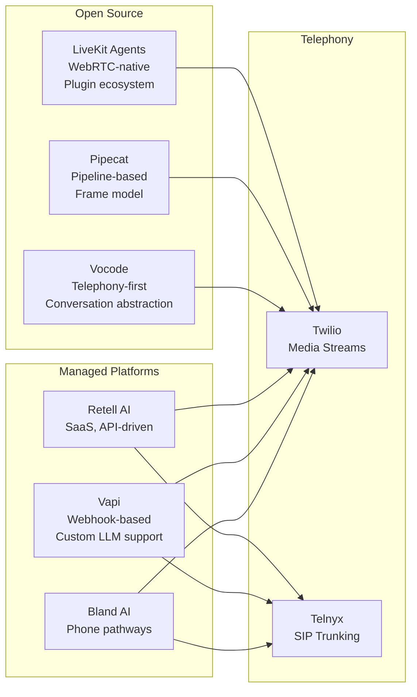
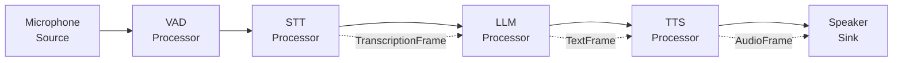
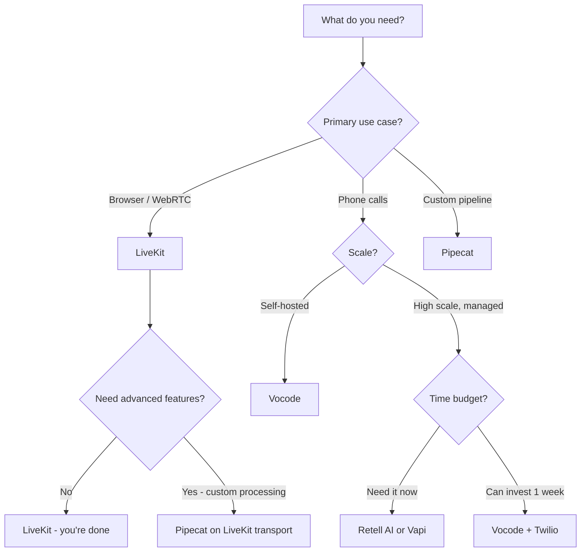

# Voice Agents Deep Dive  Part 12: Voice Agent Frameworks  LiveKit, Pipecat, and Vocode

---

**Series:** Building Voice Agents  A Developer's Deep Dive from Audio Fundamentals to Production
**Part:** 12 of 19 (Voice Agent Frameworks)
**Audience:** Developers with Python experience who want to build voice-powered AI agents from the ground up
**Reading time:** ~45 minutes

---

In Part 11, we built voice agents with persistent memory  agents that remember users across sessions, extract facts from conversation, and retrieve relevant context using vector search. Our agents are now genuinely intelligent.

But we've been building everything from scratch: the WebSocket server, the audio pipeline, the session management, the streaming logic. In production, teams don't do this. They use frameworks.

Today we explore the three major open-source voice agent frameworks, compare them honestly, and build the same agent in each so you can make an informed choice.

> **When to use a framework**: If your team is building a product, use a framework. If you're learning or need exotic customizations that frameworks don't support, build from scratch. The frameworks in this part represent thousands of engineering hours  don't reinvent them without good reason.

---

## Section 1: The Framework Landscape



| Framework | Best For | Control | Latency | Learning Curve |
|-----------|----------|---------|---------|----------------|
| **LiveKit** | WebRTC, browser, real-time | High | Very Low | Medium |
| **Pipecat** | Custom pipelines, full control | Very High | Low | High |
| **Vocode** | Telephony, self-hosted | High | Medium | Medium |
| **Retell AI** | Quick deployment | Low | Low | Very Low |
| **Vapi** | Custom LLM integration | Medium | Low | Low |
| **Bland AI** | Outbound phone campaigns | Low | Low | Very Low |

---

## Section 2: LiveKit Agents

LiveKit is a real-time communication infrastructure company. Their Agents framework builds on top of LiveKit's WebRTC infrastructure to provide a clean Python API for building voice agents.

### Core Concepts

- **Room**: A virtual space where participants connect (like a WebRTC call)
- **Participant**: A user, phone caller, or agent in a room
- **Track**: An audio or video stream from a participant
- **Agent Worker**: A process that handles agent logic for one room
- **Plugin**: A swappable component for STT, LLM, or TTS

```python
"""
livekit_voice_agent.py  Complete LiveKit voice agent example.

Install: pip install livekit-agents livekit-plugins-openai livekit-plugins-deepgram
"""
import asyncio
import logging
from dotenv import load_dotenv
import os

load_dotenv()

from livekit.agents import (
    AutoSubscribe,
    JobContext,
    JobProcess,
    WorkerOptions,
    cli,
    llm,
)
from livekit.agents.voice_assistant import VoiceAssistant
from livekit.plugins import deepgram, openai, silero


logger = logging.getLogger("voice-agent")


def prewarm(proc: JobProcess):
    """
    Pre-warm resources before a call arrives.
    This runs once when the worker starts, not per call.
    Saves 500-1000ms on first call.
    """
    proc.userdata["vad"] = silero.VAD.load()


async def entrypoint(ctx: JobContext):
    """
    Called for each new room/call that the worker handles.
    This is the main agent logic.
    """
    logger.info(f"Joining room: {ctx.room.name}")

    # Connect to the LiveKit room
    await ctx.connect(auto_subscribe=AutoSubscribe.AUDIO_ONLY)

    # Wait for a participant to join
    participant = await ctx.wait_for_participant()
    logger.info(f"Participant joined: {participant.identity}")

    # Build the voice assistant pipeline
    assistant = VoiceAssistant(
        vad=ctx.proc.userdata["vad"],           # Voice Activity Detection
        stt=deepgram.STT(model="nova-2"),        # Speech-to-Text
        llm=openai.LLM(model="gpt-4o-mini"),    # Language Model
        tts=openai.TTS(voice="alloy"),           # Text-to-Speech
        chat_ctx=llm.ChatContext().append(
            role="system",
            text=(
                "You are a helpful voice assistant. "
                "Keep responses brief and conversational. "
                "Avoid using markdown or lists  speak naturally."
            ),
        ),
    )

    # Start the assistant in the room
    assistant.start(ctx.room, participant)

    # Greet the user
    await assistant.say(
        "Hello! I'm your voice assistant. How can I help you today?",
        allow_interruptions=True,
    )

    # The agent runs until the call ends (participant leaves or agent exits)
    await asyncio.sleep(float("inf"))


if __name__ == "__main__":
    # Run the worker  it will listen for new rooms to join
    cli.run_app(
        WorkerOptions(
            entrypoint_fnc=entrypoint,
            prewarm_fnc=prewarm,
        )
    )
```

### LiveKit with Function Calling

```python
"""
livekit_with_tools.py  LiveKit agent with function calling.
"""
import asyncio
import json
from livekit.agents import AutoSubscribe, JobContext, WorkerOptions, cli, llm
from livekit.agents.voice_assistant import VoiceAssistant
from livekit.plugins import deepgram, openai, silero


# Define callable functions
async def get_weather(location: str) -> str:
    """Get weather for a location (demo)."""
    # In production: call real weather API
    return f"The weather in {location} is sunny with a high of 72°F."


async def check_order_status(order_id: str) -> str:
    """Check the status of an order (demo)."""
    # In production: query your database/API
    statuses = {
        "12345": "shipped, arriving tomorrow",
        "67890": "processing, ships in 2 days",
    }
    status = statuses.get(order_id, "not found")
    return f"Order {order_id} is {status}."


# Build function context for the LLM
def create_function_context() -> llm.FunctionContext:
    """Create a function context with available tools."""

    fnc_ctx = llm.FunctionContext()

    @fnc_ctx.ai_callable(description="Get the current weather for a location")
    async def weather(location: llm.TypeInfo(description="City name") = ""):
        return await get_weather(location)

    @fnc_ctx.ai_callable(description="Check the status of an order by its ID")
    async def order_status(
        order_id: llm.TypeInfo(description="The order ID number") = ""
    ):
        return await check_order_status(order_id)

    return fnc_ctx


async def entrypoint(ctx: JobContext):
    """Agent with function calling capabilities."""
    await ctx.connect(auto_subscribe=AutoSubscribe.AUDIO_ONLY)
    participant = await ctx.wait_for_participant()

    fnc_ctx = create_function_context()

    assistant = VoiceAssistant(
        vad=silero.VAD.load(),
        stt=deepgram.STT(model="nova-2"),
        llm=openai.LLM(model="gpt-4o-mini"),
        tts=openai.TTS(voice="alloy"),
        fnc_ctx=fnc_ctx,  # Attach functions
        chat_ctx=llm.ChatContext().append(
            role="system",
            text=(
                "You are a helpful voice assistant with access to tools. "
                "You can check weather and order status. Keep responses brief."
            ),
        ),
    )

    assistant.start(ctx.room, participant)
    await assistant.say("Hi! I can check weather or order status. What do you need?")
    await asyncio.sleep(float("inf"))
```

### LiveKit Multi-Participant Setup

```python
"""
livekit_conference.py  Multi-participant room with an AI agent.
"""
import asyncio
import logging
from livekit.agents import AutoSubscribe, JobContext, WorkerOptions, cli, llm
from livekit.agents.voice_assistant import VoiceAssistant
from livekit.plugins import deepgram, openai, silero

logger = logging.getLogger("conference-agent")


async def entrypoint(ctx: JobContext):
    """Conference agent that handles multiple participants."""
    await ctx.connect(auto_subscribe=AutoSubscribe.AUDIO_ONLY)

    # Track all participants
    participants = {}

    @ctx.room.on("participant_connected")
    def on_participant_connected(participant):
        logger.info(f"Participant joined: {participant.identity}")
        participants[participant.sid] = participant

    @ctx.room.on("participant_disconnected")
    def on_participant_disconnected(participant):
        logger.info(f"Participant left: {participant.identity}")
        participants.pop(participant.sid, None)

    # Wait for first participant
    first_participant = await ctx.wait_for_participant()

    assistant = VoiceAssistant(
        vad=silero.VAD.load(),
        stt=deepgram.STT(model="nova-2"),
        llm=openai.LLM(model="gpt-4o"),
        tts=openai.TTS(voice="nova"),
        chat_ctx=llm.ChatContext().append(
            role="system",
            text="You are a meeting assistant. Track action items and decisions.",
        ),
    )

    assistant.start(ctx.room)
    await assistant.say("Meeting assistant ready. I'll help track action items.")

    await asyncio.sleep(float("inf"))
```

---

## Section 3: Pipecat

Pipecat takes a different philosophy: everything is a **Frame** flowing through a **Pipeline** of **Processors**. This gives you maximum flexibility  you can insert any processing step anywhere.



### Core Pipecat Concepts

```python
"""
pipecat_concepts.py  Understanding Pipecat's frame model.
"""
from dataclasses import dataclass
from typing import Optional
import asyncio


# Frames are the unit of data flowing through a Pipecat pipeline
@dataclass
class AudioRawFrame:
    """Raw audio bytes from microphone or TTS."""
    audio: bytes
    sample_rate: int
    num_channels: int


@dataclass
class TranscriptionFrame:
    """Transcribed text from STT."""
    text: str
    user_id: str
    timestamp: float
    language: Optional[str] = None


@dataclass
class LLMFullResponseStartFrame:
    """Signals the start of an LLM response."""
    pass


@dataclass
class TextFrame:
    """A piece of text to be synthesized or displayed."""
    text: str


@dataclass
class EndFrame:
    """Signals end of conversation."""
    pass


# Processors receive frames and emit new frames
class BaseProcessor:
    """Base class for all Pipecat processors."""

    def __init__(self):
        self._next_processor = None

    def link(self, processor: "BaseProcessor") -> "BaseProcessor":
        """Chain processors: a.link(b).link(c)"""
        self._next_processor = processor
        return processor

    async def process_frame(self, frame) -> None:
        """Process a frame. Override in subclasses."""
        await self._emit(frame)

    async def _emit(self, frame) -> None:
        """Emit a frame to the next processor."""
        if self._next_processor:
            await self._next_processor.process_frame(frame)
```

### Complete Pipecat Agent

```python
"""
pipecat_agent.py  Full Pipecat voice agent.

Install: pip install pipecat-ai pipecat-ai[openai] pipecat-ai[deepgram]
"""
import asyncio
import aiohttp
from pipecat.pipeline.pipeline import Pipeline
from pipecat.pipeline.runner import PipelineRunner
from pipecat.pipeline.task import PipelineParams, PipelineTask
from pipecat.processors.aggregators.openai_llm_context import (
    OpenAILLMContext,
    OpenAILLMContextAggregator,
)
from pipecat.services.deepgram import DeepgramSTTService, LiveOptions
from pipecat.services.elevenlabs import ElevenLabsTTSService
from pipecat.services.openai import OpenAILLMService
from pipecat.transports.local.audio import LocalAudioTransport
from pipecat.vad.silero import SileroVADAnalyzer
from pipecat.vad.vad_analyzer import VADParams


async def run_voice_agent():
    """Run a Pipecat voice agent with local audio I/O."""

    # Set up local audio (microphone input, speaker output)
    transport = LocalAudioTransport(
        params=LocalAudioTransport.InputParams(
            audio_in_enabled=True,
            audio_out_enabled=True,
            vad_enabled=True,
            vad_analyzer=SileroVADAnalyzer(params=VADParams(stop_secs=0.5)),
        )
    )

    # Initialize services
    stt = DeepgramSTTService(
        api_key="YOUR_DEEPGRAM_KEY",
        live_options=LiveOptions(
            model="nova-2",
            language="en-US",
            smart_format=True,
        ),
    )

    llm = OpenAILLMService(
        api_key="YOUR_OPENAI_KEY",
        model="gpt-4o-mini",
    )

    tts = ElevenLabsTTSService(
        api_key="YOUR_ELEVENLABS_KEY",
        voice_id="21m00Tcm4TlvDq8ikWAM",  # Rachel voice
        model="eleven_turbo_v2_5",
    )

    # Set up LLM context with system prompt
    messages = [
        {
            "role": "system",
            "content": (
                "You are a helpful voice assistant. "
                "Be conversational and concise. "
                "Never use markdown  speak naturally."
            ),
        }
    ]
    context = OpenAILLMContext(messages)
    context_aggregator = llm.create_context_aggregator(context)

    # Build the pipeline
    pipeline = Pipeline([
        transport.input(),              # Audio input from microphone
        stt,                            # Speech-to-text
        context_aggregator.user(),      # Add user text to context
        llm,                            # LLM reasoning
        tts,                            # Text-to-speech
        transport.output(),             # Audio output to speaker
        context_aggregator.assistant(), # Add agent response to context
    ])

    # Run the pipeline
    task = PipelineTask(
        pipeline,
        params=PipelineParams(allow_interruptions=True),
    )

    @transport.event_handler("on_client_connected")
    async def on_connected(transport, client):
        # Greet on connection
        await task.queue_frames([
            context_aggregator.user().get_context_frame(),
        ])
        await llm.say("Hello! How can I help you today?")

    runner = PipelineRunner()
    await runner.run(task)


if __name__ == "__main__":
    asyncio.run(run_voice_agent())
```

### Building a Custom Pipecat Processor

The power of Pipecat is adding custom processors. Here's a sentiment analysis processor that sits between STT and LLM:

```python
"""
pipecat_custom_processor.py  Custom sentiment processor for Pipecat.
"""
from pipecat.processors.frame_processor import FrameProcessor
from pipecat.frames.frames import (
    Frame,
    TranscriptionFrame,
    TextFrame,
    SystemFrame,
)
import asyncio


class SentimentTaggingProcessor(FrameProcessor):
    """
    Custom processor that tags user transcriptions with sentiment.
    Sits between STT and LLM in the pipeline.
    Injects sentiment context into the conversation.
    """

    SENTIMENT_RULES = [
        (["angry", "frustrated", "horrible", "terrible", "awful", "worst"], "negative_high"),
        (["upset", "annoyed", "disappointed", "bad", "wrong"], "negative_mild"),
        (["great", "excellent", "perfect", "love", "amazing", "wonderful"], "positive"),
        (["confused", "unclear", "don't understand", "what do you mean"], "confused"),
    ]

    async def process_frame(self, frame: Frame, direction) -> None:
        """Intercept transcription frames and tag them with sentiment."""
        if isinstance(frame, TranscriptionFrame):
            text_lower = frame.text.lower()
            sentiment = "neutral"

            for keywords, label in self.SENTIMENT_RULES:
                if any(kw in text_lower for kw in keywords):
                    sentiment = label
                    break

            # If negative, inject a system note for the LLM
            if "negative" in sentiment:
                await self.push_frame(SystemFrame(
                    text=f"[User sentiment: {sentiment}. Be extra empathetic and solution-focused.]"
                ), direction)
            elif sentiment == "confused":
                await self.push_frame(SystemFrame(
                    text="[User seems confused. Simplify your explanation.]"
                ), direction)

        # Always pass the original frame through
        await self.push_frame(frame, direction)


class MemoryInjectionProcessor(FrameProcessor):
    """
    Processor that injects user memory context before each LLM call.
    Retrieves relevant memories and prepends them as a system message.
    """

    def __init__(self, user_id: str, memory_store):
        super().__init__()
        self.user_id = user_id
        self.memory_store = memory_store

    async def process_frame(self, frame: Frame, direction) -> None:
        if isinstance(frame, TranscriptionFrame):
            # Retrieve relevant memories
            memories = self.memory_store.search(self.user_id, frame.text, top_k=3)
            if memories:
                memory_text = "User context: " + "; ".join(m[0] for m in memories[:3])
                await self.push_frame(SystemFrame(text=memory_text), direction)

        await self.push_frame(frame, direction)


# Usage in a pipeline:
# pipeline = Pipeline([
#     transport.input(),
#     stt,
#     SentimentTaggingProcessor(),    # Custom: add sentiment
#     MemoryInjectionProcessor(user_id, memory_store),  # Custom: inject memory
#     context_aggregator.user(),
#     llm,
#     tts,
#     transport.output(),
# ])
```

---

## Section 4: Vocode

Vocode was one of the first open-source voice agent frameworks and has deep telephony integration. It takes a higher-level approach  you define a conversation, not a pipeline.

```python
"""
vocode_agent.py  Complete Vocode voice agent with telephony.

Install: pip install vocode
"""
import asyncio
from vocode.streaming.agent.chat_gpt_agent import ChatGPTAgent
from vocode.streaming.models.agent import ChatGPTAgentConfig
from vocode.streaming.models.message import BaseMessage
from vocode.streaming.models.synthesizer import AzureSynthesizerConfig
from vocode.streaming.models.transcriber import DeepgramTranscriberConfig, DeepgramEndpointingConfig
from vocode.streaming.telephony.config_manager.redis_config_manager import RedisConfigManager
from vocode.streaming.telephony.server.base import InboundCallConfig, TelephonyServer


# Configuration
TWILIO_ACCOUNT_SID = "YOUR_TWILIO_ACCOUNT_SID"
TWILIO_AUTH_TOKEN = "YOUR_TWILIO_AUTH_TOKEN"
TWILIO_PHONE_NUMBER = "+15551234567"
BASE_URL = "https://your-server.ngrok.io"


async def run_vocode_telephony_server():
    """Run a Vocode telephony server for handling inbound calls."""

    config_manager = RedisConfigManager()

    # Define the agent behavior
    agent_config = ChatGPTAgentConfig(
        openai_api_key="YOUR_OPENAI_KEY",
        initial_message=BaseMessage(text="Thank you for calling. How can I help?"),
        prompt_preamble=(
            "You are a helpful customer service agent. "
            "Keep responses brief and focused. "
            "Ask one question at a time."
        ),
        model_name="gpt-4o-mini",
        generate_responses=True,
        max_tokens=150,
    )

    # Define STT (Deepgram)
    transcriber_config = DeepgramTranscriberConfig.from_telephone_input_device(
        api_key="YOUR_DEEPGRAM_KEY",
        endpointing_config=DeepgramEndpointingConfig(
            time_cutoff_seconds=0.4,
        ),
    )

    # Define TTS (Azure)
    synthesizer_config = AzureSynthesizerConfig.from_telephone_output_device(
        azure_speech_key="YOUR_AZURE_SPEECH_KEY",
        azure_speech_region="eastus",
        voice_name="en-US-JennyNeural",
    )

    # Create the telephony server
    telephony_server = TelephonyServer(
        base_url=BASE_URL,
        config_manager=config_manager,
        inbound_call_configs=[
            InboundCallConfig(
                url="/inbound_call",
                agent_config=agent_config,
                transcriber_config=transcriber_config,
                synthesizer_config=synthesizer_config,
            )
        ],
        twilio_config={
            "account_sid": TWILIO_ACCOUNT_SID,
            "auth_token": TWILIO_AUTH_TOKEN,
        },
    )

    # Start the server (FastAPI-based)
    import uvicorn
    uvicorn.run(telephony_server.app, host="0.0.0.0", port=3000)


if __name__ == "__main__":
    asyncio.run(run_vocode_telephony_server())
```

### Vocode Outbound Calling

```python
"""
vocode_outbound.py  Make outbound calls with Vocode.
"""
import asyncio
from vocode.streaming.telephony.outbound_call import OutboundCall
from vocode.streaming.models.agent import ChatGPTAgentConfig
from vocode.streaming.models.message import BaseMessage
from vocode.streaming.models.synthesizer import ElevenLabsSynthesizerConfig
from vocode.streaming.models.transcriber import DeepgramTranscriberConfig


async def make_outbound_call(phone_number: str, customer_name: str):
    """Make an outbound call using Vocode."""

    call = OutboundCall(
        base_url="https://your-server.ngrok.io",
        to_phone=phone_number,
        from_phone="+15551234567",
        config_manager=None,  # Use in-memory config
        agent_config=ChatGPTAgentConfig(
            openai_api_key="YOUR_OPENAI_KEY",
            initial_message=BaseMessage(
                text=f"Hello {customer_name}, this is a courtesy call from Acme Corp. "
                     "I'm calling about your recent order. Do you have a moment?"
            ),
            prompt_preamble=(
                f"You are calling {customer_name} about their order. "
                "Be polite, brief, and professional. "
                "Confirm order details and check if they have questions."
            ),
            model_name="gpt-4o-mini",
        ),
        synthesizer_config=ElevenLabsSynthesizerConfig.from_telephone_output_device(
            api_key="YOUR_ELEVENLABS_KEY",
            voice_id="21m00Tcm4TlvDq8ikWAM",
        ),
        transcriber_config=DeepgramTranscriberConfig.from_telephone_input_device(
            api_key="YOUR_DEEPGRAM_KEY",
        ),
    )

    await call.start()
    print(f"Outbound call initiated to {phone_number}")
```

---

## Section 5: Managed Platforms Comparison

| Platform | Pricing | Custom LLM | Custom Voice | Phone | WebRTC | Self-Host |
|----------|---------|------------|--------------|-------|--------|-----------|
| **Retell AI** | Per minute | Yes (webhook) | Yes | Yes | Yes | No |
| **Vapi** | Per minute | Yes | Yes | Yes | Yes | No |
| **Bland AI** | Per minute | Pathways | Limited | Yes | No | No |
| **ElevenLabs Conversational** | Per minute | Yes | Yes (voice library) | Via Twilio | Yes | No |

### Retell AI  Quick Start

```python
"""
retell_agent.py  Build a voice agent with Retell AI's API.
"""
import httpx
import asyncio
from fastapi import FastAPI, Request
from fastapi.responses import JSONResponse
import uvicorn

app = FastAPI()

RETELL_API_KEY = "key_xxxxxxxxxxxxxxxxxxxxxxxx"


async def create_retell_agent():
    """Create a new agent on Retell AI's platform."""
    async with httpx.AsyncClient() as client:
        resp = await client.post(
            "https://api.retellai.com/create-agent",
            headers={
                "Authorization": f"Bearer {RETELL_API_KEY}",
                "Content-Type": "application/json",
            },
            json={
                "agent_name": "Customer Support Bot",
                "voice_id": "11labs-Adrian",
                "response_engine": {
                    "type": "retell-llm",
                    "llm_id": "llm_xxxxxxxx",
                },
                "language": "en-US",
                "interruption_sensitivity": 1,
            },
        )
        resp.raise_for_status()
        agent = resp.json()
        print(f"Created agent: {agent['agent_id']}")
        return agent["agent_id"]


@app.post("/retell-webhook")
async def retell_webhook(request: Request):
    """Webhook that Retell calls during conversations."""
    data = await request.json()
    event = data.get("event")

    if event == "call_started":
        return JSONResponse({"response": "Hello! How can I help you today?"})

    elif event == "agent_response":
        # Custom LLM endpoint  generate response
        transcript = data.get("transcript", [])
        last_user_message = ""
        for msg in reversed(transcript):
            if msg.get("role") == "user":
                last_user_message = msg.get("content", "")
                break

        # Generate response (in production: call your LLM)
        response = f"You said: {last_user_message}. Let me help you with that."

        return JSONResponse({"response": response})

    elif event == "call_ended":
        call_id = data.get("call_id")
        print(f"Call ended: {call_id}")
        return JSONResponse({"status": "ok"})

    return JSONResponse({"status": "unknown event"})
```

### Vapi  Custom LLM Integration

```python
"""
vapi_custom_llm.py  Vapi with a custom LLM server.
"""
from fastapi import FastAPI, Request
from fastapi.responses import StreamingResponse
import httpx
import json

app = FastAPI()


@app.post("/vapi/chat/completions")
async def vapi_llm_endpoint(request: Request):
    """
    Custom LLM endpoint for Vapi.
    Vapi calls this like the OpenAI API format.
    """
    data = await request.json()
    messages = data.get("messages", [])
    stream = data.get("stream", False)

    # Add custom business logic before calling LLM
    system_context = "You are a helpful voice assistant for Acme Corp. "

    # Call OpenAI (or your own model)
    async with httpx.AsyncClient(timeout=30) as client:
        resp = await client.post(
            "https://api.openai.com/v1/chat/completions",
            headers={"Authorization": "Bearer YOUR_OPENAI_KEY"},
            json={
                "model": "gpt-4o-mini",
                "messages": [
                    {"role": "system", "content": system_context},
                    *messages,
                ],
                "max_tokens": 150,
                "stream": stream,
            },
        )
        resp.raise_for_status()

    if stream:
        async def stream_response():
            async for line in resp.aiter_lines():
                if line:
                    yield line + "\n"

        return StreamingResponse(stream_response(), media_type="text/event-stream")

    return resp.json()
```

---

## Section 6: Build the Same Agent in 3 Frameworks

To make the comparison concrete, here's a simple FAQ agent built in all three:

**The agent**: Answers questions about a fictional "TechCorp" product. Has 3 FAQs. Says "I don't know" for anything else.

### LiveKit Version

```python
"""
faq_livekit.py  FAQ agent with LiveKit.
"""
import asyncio
from livekit.agents import AutoSubscribe, JobContext, WorkerOptions, cli, llm
from livekit.agents.voice_assistant import VoiceAssistant
from livekit.plugins import deepgram, openai, silero

FAQ_KNOWLEDGE = """
Q: What is TechCorp Pro?
A: TechCorp Pro is our flagship project management software for teams of 10 to 500 people.

Q: How much does it cost?
A: TechCorp Pro costs $29 per user per month, billed annually. Monthly billing is available at $35 per user.

Q: Is there a free trial?
A: Yes, we offer a 14-day free trial with no credit card required. All features are included.
"""

async def entrypoint(ctx: JobContext):
    await ctx.connect(auto_subscribe=AutoSubscribe.AUDIO_ONLY)
    participant = await ctx.wait_for_participant()

    assistant = VoiceAssistant(
        vad=silero.VAD.load(),
        stt=deepgram.STT(model="nova-2"),
        llm=openai.LLM(model="gpt-4o-mini"),
        tts=openai.TTS(voice="alloy"),
        chat_ctx=llm.ChatContext().append(
            role="system",
            text=(
                "You are a TechCorp support agent. Answer only using the FAQ below. "
                "If the question isn't in the FAQ, say you don't have that information. "
                "Keep answers to 1-2 sentences.\n\n"
                f"FAQ:\n{FAQ_KNOWLEDGE}"
            ),
        ),
    )
    assistant.start(ctx.room, participant)
    await assistant.say("Hi! I can answer questions about TechCorp Pro. What would you like to know?")
    await asyncio.sleep(float("inf"))
```

### Pipecat Version

```python
"""
faq_pipecat.py  FAQ agent with Pipecat.
"""
import asyncio
from pipecat.pipeline.pipeline import Pipeline
from pipecat.pipeline.runner import PipelineRunner
from pipecat.pipeline.task import PipelineParams, PipelineTask
from pipecat.processors.aggregators.openai_llm_context import OpenAILLMContext, OpenAILLMContextAggregator
from pipecat.services.deepgram import DeepgramSTTService
from pipecat.services.openai import OpenAILLMService, OpenAITTSService
from pipecat.transports.local.audio import LocalAudioTransport
from pipecat.vad.silero import SileroVADAnalyzer

FAQ_SYSTEM_PROMPT = """You are a TechCorp support agent. FAQ:
- TechCorp Pro: flagship project management software for 10-500 person teams
- Pricing: $29/user/month annually, $35/user/month monthly
- Trial: 14-day free trial, no credit card required
Answer only from the FAQ. Say "I don't have that information" for other questions."""

async def run_pipecat_faq():
    transport = LocalAudioTransport(
        params=LocalAudioTransport.InputParams(
            audio_in_enabled=True, audio_out_enabled=True,
            vad_enabled=True, vad_analyzer=SileroVADAnalyzer(),
        )
    )
    stt = DeepgramSTTService(api_key="YOUR_KEY")
    llm = OpenAILLMService(api_key="YOUR_KEY", model="gpt-4o-mini")
    tts = OpenAITTSService(api_key="YOUR_KEY", voice="alloy")

    messages = [{"role": "system", "content": FAQ_SYSTEM_PROMPT}]
    context = OpenAILLMContext(messages)
    aggregator = llm.create_context_aggregator(context)

    pipeline = Pipeline([
        transport.input(), stt, aggregator.user(), llm, tts, transport.output(), aggregator.assistant()
    ])
    task = PipelineTask(pipeline, params=PipelineParams(allow_interruptions=True))
    await PipelineRunner().run(task)
```

### Vocode Version

```python
"""
faq_vocode.py  FAQ agent with Vocode (telephony).
"""
from vocode.streaming.models.agent import ChatGPTAgentConfig
from vocode.streaming.models.message import BaseMessage

FAQ_PROMPT = """You are a TechCorp support agent. FAQ:
- TechCorp Pro: flagship project management software for 10-500 person teams
- Pricing: $29/user/month annually, $35/user/month monthly
- Trial: 14-day free trial, no credit card required
Answer only from FAQ. Say you don't have information for other questions."""

def create_faq_agent_config() -> ChatGPTAgentConfig:
    return ChatGPTAgentConfig(
        openai_api_key="YOUR_KEY",
        initial_message=BaseMessage(
            text="Thank you for calling TechCorp. How can I help you today?"
        ),
        prompt_preamble=FAQ_PROMPT,
        model_name="gpt-4o-mini",
        max_tokens=100,
    )
```

---

## Section 7: Framework Selection Guide



| Need | Best Choice | Why |
|------|-------------|-----|
| Browser-based voice agent | LiveKit | WebRTC native, React SDK, low latency |
| Phone call agent (fast) | Retell AI or Vapi | Managed, 10-min setup |
| Phone call agent (custom) | Vocode + Twilio | Self-hosted, full control |
| Custom ML models in pipeline | Pipecat | Frame model is ideal for custom processors |
| Multi-participant calls | LiveKit | Built for rooms and participants |
| Cheapest at scale | Vocode + self-hosted ASR/TTS | No per-minute API fees |
| Emotion/sentiment in pipeline | Pipecat | Easy to add custom processors |

---

## Section 8: Migrating Between Frameworks

When you need to switch frameworks, the extract-adapter pattern minimizes rework:

```python
"""
framework_adapter.py  Framework-agnostic voice agent core.
"""
from abc import ABC, abstractmethod
from dataclasses import dataclass
from typing import AsyncGenerator
import asyncio


@dataclass
class VoiceTurn:
    user_text: str
    agent_response: str
    audio_bytes: bytes


class VoiceAgentCore(ABC):
    """
    Framework-agnostic voice agent logic.
    Implement this once, adapt to any framework.
    """

    @abstractmethod
    async def on_user_speech(self, text: str, session_id: str) -> str:
        """Handle user speech and return agent response text."""
        pass

    @abstractmethod
    async def on_call_start(self, session_id: str) -> str:
        """Return greeting message."""
        pass

    @abstractmethod
    async def on_call_end(self, session_id: str) -> None:
        """Clean up session."""
        pass


class LiveKitAdapter:
    """Adapts VoiceAgentCore to LiveKit."""

    def __init__(self, core: VoiceAgentCore):
        self.core = core

    async def create_entrypoint(self):
        """Returns a LiveKit entrypoint function."""
        from livekit.agents import AutoSubscribe, JobContext
        from livekit.agents.voice_assistant import VoiceAssistant
        from livekit.plugins import silero

        core = self.core

        async def entrypoint(ctx: JobContext):
            await ctx.connect(auto_subscribe=AutoSubscribe.AUDIO_ONLY)
            participant = await ctx.wait_for_participant()
            session_id = ctx.room.name

            greeting = await core.on_call_start(session_id)
            # Set up LiveKit assistant here...
            await asyncio.sleep(float("inf"))

        return entrypoint


class PipecatAdapter:
    """Adapts VoiceAgentCore to Pipecat."""

    def __init__(self, core: VoiceAgentCore):
        self.core = core

    def create_custom_llm_processor(self):
        """Creates a Pipecat processor that calls our core agent."""
        from pipecat.processors.frame_processor import FrameProcessor

        core = self.core

        class CoreAgentProcessor(FrameProcessor):
            async def process_frame(self, frame, direction):
                # Route transcript frames to our core agent
                from pipecat.frames.frames import TranscriptionFrame, TextFrame
                if isinstance(frame, TranscriptionFrame):
                    response = await core.on_user_speech(frame.text, "session")
                    await self.push_frame(TextFrame(text=response), direction)
                else:
                    await self.push_frame(frame, direction)

        return CoreAgentProcessor()
```

---

## Section 9: Observability and Debugging in Each Framework

Frameworks abstract away complexity  but when something goes wrong, you need to see inside them. Here's how to instrument each framework for production observability.

### LiveKit Events and Hooks

```python
"""
livekit_observability.py  Full observability setup for a LiveKit agent.
"""
import asyncio
import logging
import time
from dataclasses import dataclass, field
from typing import Optional
from livekit.agents import AutoSubscribe, JobContext, WorkerOptions, cli, llm
from livekit.agents.voice_assistant import VoiceAssistant
from livekit.plugins import deepgram, openai, silero

logger = logging.getLogger("voice-agent.livekit")


@dataclass
class LiveKitCallMetrics:
    """Metrics collected during a LiveKit call."""
    session_id: str
    start_time: float = field(default_factory=time.time)
    asr_count: int = 0
    asr_total_latency_ms: float = 0.0
    llm_count: int = 0
    llm_total_latency_ms: float = 0.0
    tts_count: int = 0
    tts_total_latency_ms: float = 0.0
    interruptions: int = 0
    transcript: list[dict] = field(default_factory=list)

    def avg_asr_latency_ms(self) -> float:
        return self.asr_total_latency_ms / self.asr_count if self.asr_count else 0

    def avg_llm_latency_ms(self) -> float:
        return self.llm_total_latency_ms / self.llm_count if self.llm_count else 0

    def summary(self) -> dict:
        return {
            "session_id": self.session_id,
            "duration_seconds": round(time.time() - self.start_time, 1),
            "turns": self.asr_count,
            "avg_asr_ms": round(self.avg_asr_latency_ms(), 0),
            "avg_llm_ms": round(self.avg_llm_latency_ms(), 0),
            "interruptions": self.interruptions,
        }


async def entrypoint_with_observability(ctx: JobContext):
    """LiveKit agent with full observability hooks."""
    session_id = ctx.room.name
    metrics = LiveKitCallMetrics(session_id=session_id)
    logger.info(f"[{session_id}] Starting agent")

    await ctx.connect(auto_subscribe=AutoSubscribe.AUDIO_ONLY)
    participant = await ctx.wait_for_participant()

    assistant = VoiceAssistant(
        vad=silero.VAD.load(),
        stt=deepgram.STT(model="nova-2"),
        llm=openai.LLM(model="gpt-4o-mini"),
        tts=openai.TTS(voice="alloy"),
        chat_ctx=llm.ChatContext().append(
            role="system",
            text="You are a helpful voice assistant. Be concise.",
        ),
    )

    # --- Observability hooks ---

    @assistant.on("user_speech_committed")
    def on_user_speech(user_msg: llm.ChatMessage):
        """Called when ASR produces a final transcript."""
        logger.info(f"[{session_id}] User: {user_msg.content[:80]}")
        metrics.transcript.append({"role": "user", "text": user_msg.content})
        metrics.asr_count += 1

    @assistant.on("agent_speech_committed")
    def on_agent_speech(agent_msg: llm.ChatMessage):
        """Called when the agent finishes speaking a response."""
        logger.info(f"[{session_id}] Agent: {agent_msg.content[:80]}")
        metrics.transcript.append({"role": "agent", "text": agent_msg.content})

    @assistant.on("agent_speech_interrupted")
    def on_interrupted():
        """Called when the user interrupts the agent."""
        logger.warning(f"[{session_id}] Interruption detected")
        metrics.interruptions += 1

    @ctx.room.on("participant_disconnected")
    def on_participant_left(participant):
        """Called when the user hangs up."""
        logger.info(f"[{session_id}] Call ended. Summary: {metrics.summary()}")
        # In production: write metrics to database
        _flush_metrics(metrics)

    assistant.start(ctx.room, participant)
    await assistant.say("Hello! How can I help you today?", allow_interruptions=True)
    await asyncio.sleep(float("inf"))


def _flush_metrics(metrics: LiveKitCallMetrics) -> None:
    """Write call metrics to persistent storage."""
    import json
    summary = metrics.summary()
    logger.info(f"Call metrics: {json.dumps(summary)}")
    # In production: asyncio.create_task(db.insert_call_metrics(summary))
```

### Pipecat Pipeline Debugging

Pipecat's frame model makes it easy to add a debug processor anywhere in the pipeline:

```python
"""
pipecat_debug.py  Debug processor for Pipecat pipelines.
"""
import logging
import time
from pipecat.processors.frame_processor import FrameProcessor
from pipecat.frames.frames import (
    Frame,
    AudioRawFrame,
    TranscriptionFrame,
    TextFrame,
    LLMFullResponseStartFrame,
    LLMFullResponseEndFrame,
    TTSStartedFrame,
    TTSStoppedFrame,
    UserStartedSpeakingFrame,
    UserStoppedSpeakingFrame,
)

logger = logging.getLogger("pipecat.debug")


class PipelineDebugProcessor(FrameProcessor):
    """
    Insert this processor anywhere in a Pipecat pipeline to log
    every frame that passes through. Indispensable for debugging.

    Usage:
        pipeline = Pipeline([
            transport.input(),
            stt,
            PipelineDebugProcessor("after-stt"),    # Log here
            context_aggregator.user(),
            llm,
            PipelineDebugProcessor("after-llm"),    # And here
            tts,
            transport.output(),
        ])
    """

    def __init__(self, label: str = "debug", log_audio: bool = False):
        super().__init__()
        self.label = label
        self.log_audio = log_audio
        self._llm_start: Optional[float] = None
        self._tts_start: Optional[float] = None

    async def process_frame(self, frame: Frame, direction) -> None:
        frame_type = type(frame).__name__

        if isinstance(frame, AudioRawFrame):
            if self.log_audio:
                logger.debug(f"[{self.label}] AudioRawFrame: {len(frame.audio)} bytes")
            # Don't log audio by default  too noisy

        elif isinstance(frame, UserStartedSpeakingFrame):
            logger.info(f"[{self.label}] >>> User started speaking")

        elif isinstance(frame, UserStoppedSpeakingFrame):
            logger.info(f"[{self.label}] >>> User stopped speaking")

        elif isinstance(frame, TranscriptionFrame):
            logger.info(f"[{self.label}] Transcription: '{frame.text}'")

        elif isinstance(frame, LLMFullResponseStartFrame):
            self._llm_start = time.perf_counter()
            logger.info(f"[{self.label}] LLM response starting...")

        elif isinstance(frame, LLMFullResponseEndFrame):
            if self._llm_start:
                elapsed = (time.perf_counter() - self._llm_start) * 1000
                logger.info(f"[{self.label}] LLM complete in {elapsed:.0f}ms")

        elif isinstance(frame, TextFrame):
            logger.info(f"[{self.label}] TextFrame: '{frame.text[:60]}'")

        elif isinstance(frame, TTSStartedFrame):
            self._tts_start = time.perf_counter()
            logger.info(f"[{self.label}] TTS synthesis starting...")

        elif isinstance(frame, TTSStoppedFrame):
            if self._tts_start:
                elapsed = (time.perf_counter() - self._tts_start) * 1000
                logger.info(f"[{self.label}] TTS complete in {elapsed:.0f}ms")

        else:
            logger.debug(f"[{self.label}] Frame: {frame_type}")

        # Always pass frame through unchanged
        await self.push_frame(frame, direction)


class LatencyMeasurementProcessor(FrameProcessor):
    """
    Measures end-to-end latency: time from user stopping speaking
    to first audio byte of agent response.
    """

    def __init__(self):
        super().__init__()
        self._user_stopped_time: Optional[float] = None
        self._first_audio_time: Optional[float] = None
        self.latency_samples: list[float] = []

    async def process_frame(self, frame: Frame, direction) -> None:
        if isinstance(frame, UserStoppedSpeakingFrame):
            self._user_stopped_time = time.perf_counter()
            self._first_audio_time = None

        elif isinstance(frame, AudioRawFrame) and self._user_stopped_time:
            if not self._first_audio_time:
                self._first_audio_time = time.perf_counter()
                latency_ms = (self._first_audio_time - self._user_stopped_time) * 1000
                self.latency_samples.append(latency_ms)
                logger.info(f"E2E latency: {latency_ms:.0f}ms")
                self._user_stopped_time = None  # Reset for next turn

        await self.push_frame(frame, direction)

    def report(self) -> dict:
        if not self.latency_samples:
            return {"samples": 0}
        samples = sorted(self.latency_samples)
        p95_idx = int(len(samples) * 0.95)
        return {
            "samples": len(samples),
            "avg_ms": round(sum(samples) / len(samples), 0),
            "p50_ms": round(samples[len(samples) // 2], 0),
            "p95_ms": round(samples[p95_idx], 0),
            "min_ms": round(samples[0], 0),
            "max_ms": round(samples[-1], 0),
        }
```

### Common Framework Issues and Fixes

```
Issue: Agent cuts off mid-sentence
  Cause:  VAD `stop_secs` too low (0.3s = hair-trigger, 0.8s = too slow)
  Fix:    SileroVADAnalyzer(params=VADParams(stop_secs=0.5))  start here
  Rule:   If users have accents, go 0.6-0.7s. Fast conversational: 0.4-0.5s

Issue: Agent speaks over the user
  Cause:  TTS playing while user has started speaking (interruption not configured)
  Fix:    PipelineTask(allow_interruptions=True) in Pipecat
          VoiceAssistant(allow_interruptions=True) in LiveKit

Issue: First response is slow (3+ seconds)
  Cause:  Model loading on first call (Silero VAD, Whisper, etc.)
  Fix:    LiveKit: use prewarm_fnc to load models at worker startup
          Pipecat: instantiate models outside the async function

Issue: Transcription drifts (words wrong, misheard often)
  Cause:  Wrong ASR model for use case
  Fix:    Deepgram nova-2 (conversational); nova-2-medical (healthcare)
          Try `smart_format=True` and `punctuate=True`

Issue: Pipecat pipeline blocks (frames stop flowing)
  Cause:  A custom processor is not calling `await self.push_frame(frame, direction)`
  Fix:    Every processor MUST push every frame it receives, even unhandled types

Issue: LiveKit room disconnects immediately
  Cause:  Worker exits before call is handled (missing `await asyncio.sleep(inf)`)
  Fix:    Add `await asyncio.sleep(float("inf"))` at end of entrypoint

Issue: High CPU usage on voice worker
  Cause:  Audio processing (VAD, resampling) is CPU-intensive
  Fix:    Pin one CPU core per worker; use uvloop; limit concurrent calls per worker
```

---

## Section 10: ElevenLabs Conversational AI

ElevenLabs launched their own conversational AI platform in 2024. It offers a managed pipeline with their industry-leading TTS voices, making it worth considering alongside Retell AI and Vapi.

```python
"""
elevenlabs_conversational.py  ElevenLabs Conversational AI integration.

ElevenLabs provides a WebSocket-based conversational AI API that handles
the full pipeline: STT → LLM → ElevenLabs TTS, with their premium voices.
"""
import asyncio
import json
import base64
import websockets
import httpx
from typing import Optional, AsyncGenerator


ELEVENLABS_API_KEY = "your_key_here"
AGENT_ID = "your_agent_id"   # Created in ElevenLabs dashboard


async def create_elevenlabs_agent(
    name: str,
    system_prompt: str,
    first_message: str,
    voice_id: str = "21m00Tcm4TlvDq8ikWAM",  # Rachel
) -> str:
    """Create an ElevenLabs conversational agent via API."""
    async with httpx.AsyncClient() as client:
        resp = await client.post(
            "https://api.elevenlabs.io/v1/convai/agents/create",
            headers={
                "xi-api-key": ELEVENLABS_API_KEY,
                "Content-Type": "application/json",
            },
            json={
                "name": name,
                "conversation_config": {
                    "agent": {
                        "prompt": {
                            "prompt": system_prompt,
                        },
                        "first_message": first_message,
                        "language": "en",
                    },
                    "tts": {
                        "voice_id": voice_id,
                        "model_id": "eleven_turbo_v2_5",
                        "optimize_streaming_latency": 4,  # Max optimization
                    },
                    "asr": {
                        "quality": "high",
                        "user_input_audio_format": "pcm_16000",
                    },
                },
            },
        )
        resp.raise_for_status()
        agent = resp.json()
        return agent["agent_id"]


async def run_elevenlabs_conversation(
    agent_id: str,
    audio_input_stream: AsyncGenerator[bytes, None],
):
    """
    Run a real-time conversation with an ElevenLabs agent.
    Sends audio in, receives audio out over WebSocket.
    """
    url = f"wss://api.elevenlabs.io/v1/convai/conversation?agent_id={agent_id}"

    async with websockets.connect(
        url,
        additional_headers={"xi-api-key": ELEVENLABS_API_KEY},
    ) as ws:
        print("Connected to ElevenLabs Conversational AI")

        # Start conversation
        await ws.send(json.dumps({
            "type": "conversation_initiation_client_data",
            "conversation_config_override": {
                "agent": {
                    "prompt": {
                        "prompt": "You are a helpful assistant."
                    }
                }
            }
        }))

        # Wait for conversation started confirmation
        init_msg = json.loads(await ws.recv())
        conversation_id = init_msg.get("conversation_id")
        print(f"Conversation started: {conversation_id}")

        # Concurrently send audio and receive responses
        async def send_audio():
            async for audio_chunk in audio_input_stream:
                await ws.send(json.dumps({
                    "user_audio_chunk": base64.b64encode(audio_chunk).decode(),
                }))

        async def receive_responses():
            async for message in ws:
                data = json.loads(message)
                msg_type = data.get("type")

                if msg_type == "audio":
                    # Agent speaking  play this audio
                    audio_bytes = base64.b64decode(data["audio_event"]["audio_base_64"])
                    yield audio_bytes

                elif msg_type == "agent_response":
                    text = data.get("agent_response_event", {}).get("agent_response", "")
                    print(f"Agent: {text}")

                elif msg_type == "user_transcript":
                    text = data.get("user_transcription_event", {}).get("user_transcript", "")
                    print(f"User: {text}")

                elif msg_type == "interruption":
                    print("User interrupted agent")

                elif msg_type == "ping":
                    # Respond to keep-alive ping
                    await ws.send(json.dumps({
                        "type": "pong",
                        "event_id": data.get("ping_event", {}).get("event_id"),
                    }))

        await asyncio.gather(send_audio(), receive_responses())


# ElevenLabs vs Vapi vs Retell comparison:
# - ElevenLabs: Best voice quality, their own TTS is the selling point
#               Limited custom LLM support compared to Vapi
# - Vapi:       Most flexible LLM integration (OpenAI-compatible endpoint)
#               Good voice selection, solid SDKs
# - Retell:     Easiest setup, strong outbound calling features
#               Less LLM flexibility
```

### When to Choose ElevenLabs Conversational

| Factor | Choose ElevenLabs | Choose Vapi | Choose Retell |
|--------|-------------------|-------------|---------------|
| Voice quality is top priority | ✓ | | |
| Need specific custom LLM endpoint | | ✓ | |
| Outbound call campaigns | | | ✓ |
| WebRTC browser integration | ✓ | ✓ | |
| Phone call integration (inbound) | ✓ via Twilio | ✓ | ✓ |
| Fastest setup | | | ✓ |
| SDK quality | ✓ | ✓ | |

---

## Section 11: Production Configuration Management

Production voice agents need proper configuration  not hardcoded API keys.

```python
"""
config.py  Production configuration for voice agent frameworks.
"""
import os
from dataclasses import dataclass, field
from typing import Optional
from enum import Enum


class STTEngine(str, Enum):
    DEEPGRAM = "deepgram"
    WHISPER_CLOUD = "whisper_cloud"
    AZURE_SPEECH = "azure_speech"
    GOOGLE_SPEECH = "google_speech"


class LLMEngine(str, Enum):
    GPT4O_MINI = "gpt-4o-mini"
    GPT4O = "gpt-4o"
    CLAUDE_HAIKU = "claude-haiku-4-5-20251001"
    CLAUDE_SONNET = "claude-sonnet-4-6"


class TTSEngine(str, Enum):
    OPENAI = "openai"
    ELEVENLABS = "elevenlabs"
    AZURE = "azure"
    GOOGLE = "google"


@dataclass
class VoiceAgentConfig:
    """
    Complete configuration for a voice agent framework deployment.
    Loaded from environment variables  never hardcode secrets.
    """

    # STT
    stt_engine: STTEngine = STTEngine.DEEPGRAM
    deepgram_api_key: str = ""
    deepgram_model: str = "nova-2"
    stt_language: str = "en-US"

    # LLM
    llm_engine: LLMEngine = LLMEngine.GPT4O_MINI
    openai_api_key: str = ""
    anthropic_api_key: str = ""
    llm_max_tokens: int = 200
    llm_temperature: float = 0.7

    # TTS
    tts_engine: TTSEngine = TTSEngine.OPENAI
    elevenlabs_api_key: str = ""
    elevenlabs_voice_id: str = "21m00Tcm4TlvDq8ikWAM"
    openai_tts_voice: str = "alloy"

    # VAD
    vad_stop_secs: float = 0.5
    vad_start_secs: float = 0.2

    # Infrastructure
    redis_url: str = "redis://localhost:6379"
    database_url: str = ""
    max_concurrent_calls: int = 50
    call_timeout_minutes: int = 30

    # Observability
    prometheus_port: int = 8001
    log_level: str = "INFO"
    sentry_dsn: str = ""

    @classmethod
    def from_env(cls) -> "VoiceAgentConfig":
        """Load configuration from environment variables."""
        return cls(
            # STT
            stt_engine=STTEngine(os.getenv("STT_ENGINE", "deepgram")),
            deepgram_api_key=os.environ["DEEPGRAM_API_KEY"],
            deepgram_model=os.getenv("DEEPGRAM_MODEL", "nova-2"),
            stt_language=os.getenv("STT_LANGUAGE", "en-US"),

            # LLM
            llm_engine=LLMEngine(os.getenv("LLM_ENGINE", "gpt-4o-mini")),
            openai_api_key=os.getenv("OPENAI_API_KEY", ""),
            anthropic_api_key=os.getenv("ANTHROPIC_API_KEY", ""),
            llm_max_tokens=int(os.getenv("LLM_MAX_TOKENS", "200")),

            # TTS
            tts_engine=TTSEngine(os.getenv("TTS_ENGINE", "openai")),
            elevenlabs_api_key=os.getenv("ELEVENLABS_API_KEY", ""),
            elevenlabs_voice_id=os.getenv("ELEVENLABS_VOICE_ID", "21m00Tcm4TlvDq8ikWAM"),
            openai_tts_voice=os.getenv("OPENAI_TTS_VOICE", "alloy"),

            # VAD
            vad_stop_secs=float(os.getenv("VAD_STOP_SECS", "0.5")),

            # Infrastructure
            redis_url=os.getenv("REDIS_URL", "redis://localhost:6379"),
            database_url=os.getenv("DATABASE_URL", ""),
            max_concurrent_calls=int(os.getenv("MAX_CONCURRENT_CALLS", "50")),

            # Observability
            prometheus_port=int(os.getenv("PROMETHEUS_PORT", "8001")),
            log_level=os.getenv("LOG_LEVEL", "INFO"),
            sentry_dsn=os.getenv("SENTRY_DSN", ""),
        )

    def validate(self) -> list[str]:
        """Validate configuration and return list of errors."""
        errors = []

        if self.stt_engine == STTEngine.DEEPGRAM and not self.deepgram_api_key:
            errors.append("DEEPGRAM_API_KEY required when STT_ENGINE=deepgram")

        if self.llm_engine in (LLMEngine.GPT4O_MINI, LLMEngine.GPT4O) and not self.openai_api_key:
            errors.append("OPENAI_API_KEY required for GPT models")

        if self.llm_engine in (LLMEngine.CLAUDE_HAIKU, LLMEngine.CLAUDE_SONNET) and not self.anthropic_api_key:
            errors.append("ANTHROPIC_API_KEY required for Claude models")

        if self.tts_engine == TTSEngine.ELEVENLABS and not self.elevenlabs_api_key:
            errors.append("ELEVENLABS_API_KEY required when TTS_ENGINE=elevenlabs")

        if self.vad_stop_secs < 0.3 or self.vad_stop_secs > 1.5:
            errors.append(f"VAD_STOP_SECS={self.vad_stop_secs} is unusual (expected 0.3-1.5)")

        return errors


def build_livekit_agent_from_config(config: VoiceAgentConfig):
    """Build a LiveKit VoiceAssistant from a config object."""
    from livekit.plugins import deepgram, openai, silero
    from livekit.agents.voice_assistant import VoiceAssistant
    from livekit.agents import llm as lk_llm

    # STT
    if config.stt_engine == STTEngine.DEEPGRAM:
        stt = deepgram.STT(api_key=config.deepgram_api_key, model=config.deepgram_model)
    else:
        raise ValueError(f"STT engine not yet supported: {config.stt_engine}")

    # LLM
    if config.llm_engine in (LLMEngine.GPT4O_MINI, LLMEngine.GPT4O):
        llm = openai.LLM(api_key=config.openai_api_key, model=config.llm_engine.value)
    else:
        raise ValueError(f"LLM engine not yet supported in LiveKit: {config.llm_engine}")

    # TTS
    if config.tts_engine == TTSEngine.OPENAI:
        tts = openai.TTS(api_key=config.openai_api_key, voice=config.openai_tts_voice)
    elif config.tts_engine == TTSEngine.ELEVENLABS:
        from livekit.plugins import elevenlabs
        tts = elevenlabs.TTS(
            api_key=config.elevenlabs_api_key,
            voice_id=config.elevenlabs_voice_id,
        )
    else:
        raise ValueError(f"TTS engine not yet supported: {config.tts_engine}")

    # VAD
    from pipecat.vad.vad_analyzer import VADParams
    vad = silero.VAD.load()

    return VoiceAssistant(
        vad=vad,
        stt=stt,
        llm=llm,
        tts=tts,
    )
```

---

## Section 12: Testing Framework-Based Agents

Testing voice agents without running real audio is possible with the right approach.

### Unit Testing Custom Pipecat Processors

```python
"""
test_pipecat_processors.py  Unit tests for custom Pipecat processors.
"""
import pytest
import asyncio
from unittest.mock import AsyncMock, MagicMock
from pipecat.frames.frames import (
    TranscriptionFrame,
    SystemFrame,
    TextFrame,
    Frame,
)

# From your agent code:
# from pipecat_custom_processor import SentimentTaggingProcessor


class TestSentimentTaggingProcessor:
    """Unit tests for the SentimentTaggingProcessor."""

    @pytest.fixture
    def processor(self):
        from pipecat_custom_processor import SentimentTaggingProcessor
        proc = SentimentTaggingProcessor()
        proc.push_frame = AsyncMock()
        return proc

    @pytest.mark.asyncio
    async def test_neutral_sentiment_no_injection(self, processor):
        """Neutral user speech should not inject system messages."""
        frame = TranscriptionFrame(
            text="What are your business hours?",
            user_id="user_1",
            timestamp=0.0,
        )

        await processor.process_frame(frame, "downstream")

        # Should push original frame but no SystemFrame
        calls = processor.push_frame.call_args_list
        pushed_types = [type(call.args[0]).__name__ for call in calls]
        assert "SystemFrame" not in pushed_types
        assert "TranscriptionFrame" in pushed_types

    @pytest.mark.asyncio
    async def test_negative_sentiment_injects_system_frame(self, processor):
        """Angry user speech should inject a system guidance frame."""
        frame = TranscriptionFrame(
            text="This is terrible! I'm so frustrated with your service!",
            user_id="user_1",
            timestamp=0.0,
        )

        await processor.process_frame(frame, "downstream")

        # Should push SystemFrame BEFORE the TranscriptionFrame
        calls = processor.push_frame.call_args_list
        assert len(calls) == 2
        assert isinstance(calls[0].args[0], SystemFrame)
        assert "negative" in calls[0].args[0].text.lower()
        assert isinstance(calls[1].args[0], TranscriptionFrame)

    @pytest.mark.asyncio
    async def test_confused_user_injects_simplify_hint(self, processor):
        """Confused user speech should inject a simplification hint."""
        frame = TranscriptionFrame(
            text="I don't understand what you mean by that",
            user_id="user_1",
            timestamp=0.0,
        )

        await processor.process_frame(frame, "downstream")

        calls = processor.push_frame.call_args_list
        system_calls = [c for c in calls if isinstance(c.args[0], SystemFrame)]
        assert len(system_calls) == 1
        assert "simplif" in system_calls[0].args[0].text.lower()

    @pytest.mark.asyncio
    async def test_non_transcription_frame_passes_through(self, processor):
        """Non-TranscriptionFrame should pass through unchanged."""
        frame = TextFrame(text="some text")
        await processor.process_frame(frame, "downstream")

        processor.push_frame.assert_called_once_with(frame, "downstream")


class TestLiveKitFunctionContext:
    """Test LiveKit function calling logic without a real room."""

    @pytest.mark.asyncio
    async def test_get_weather_returns_string(self):
        """Test the weather function returns a string for any location."""
        from livekit_with_tools import get_weather
        result = await get_weather("London")
        assert isinstance(result, str)
        assert "London" in result

    @pytest.mark.asyncio
    async def test_order_status_known_order(self):
        """Test order status lookup for a known order."""
        from livekit_with_tools import check_order_status
        result = await check_order_status("12345")
        assert "12345" in result
        assert isinstance(result, str)

    @pytest.mark.asyncio
    async def test_order_status_unknown_order(self):
        """Test order status lookup for an unknown order."""
        from livekit_with_tools import check_order_status
        result = await check_order_status("99999")
        assert "not found" in result


class TestVoiceAgentCore:
    """Test framework-agnostic agent core logic."""

    @pytest.mark.asyncio
    async def test_faq_agent_returns_answer_for_known_question(self):
        """FAQ agent should answer known questions from FAQ."""
        # Mock a simple agent core that uses FAQ lookup
        from framework_adapter import VoiceAgentCore

        class FAQAgent(VoiceAgentCore):
            FAQ = {
                "price": "TechCorp Pro costs $29 per user per month.",
                "trial": "We offer a 14-day free trial.",
            }

            async def on_user_speech(self, text: str, session_id: str) -> str:
                text_lower = text.lower()
                for keyword, answer in self.FAQ.items():
                    if keyword in text_lower:
                        return answer
                return "I don't have information about that."

            async def on_call_start(self, session_id: str) -> str:
                return "Hello! How can I help?"

            async def on_call_end(self, session_id: str) -> None:
                pass

        agent = FAQAgent()
        response = await agent.on_user_speech("What is the price?", "test_session")
        assert "$29" in response

    @pytest.mark.asyncio
    async def test_faq_agent_returns_fallback_for_unknown(self):
        """FAQ agent should return fallback for unknown questions."""
        class SimpleAgent:
            async def on_user_speech(self, text: str, session_id: str) -> str:
                if "price" in text.lower():
                    return "It costs $29/month."
                return "I don't have information about that."

        agent = SimpleAgent()
        response = await agent.on_user_speech("What is the weather?", "s1")
        assert "don't have" in response
```

### Integration Testing with Simulated Audio

```python
"""
integration_test.py  Integration test for a full agent pipeline
without real audio hardware.
"""
import asyncio
import pytest
import numpy as np
from unittest.mock import patch, AsyncMock


def generate_silence(duration_seconds: float = 0.5, sample_rate: int = 16000) -> bytes:
    """Generate silent audio bytes for testing."""
    num_samples = int(duration_seconds * sample_rate)
    silent_audio = np.zeros(num_samples, dtype=np.int16)
    return silent_audio.tobytes()


def generate_tone(
    frequency: float = 440.0,
    duration_seconds: float = 0.3,
    sample_rate: int = 16000,
) -> bytes:
    """Generate a pure tone audio bytes for testing."""
    t = np.linspace(0, duration_seconds, int(duration_seconds * sample_rate))
    tone = (np.sin(2 * np.pi * frequency * t) * 32767 * 0.5).astype(np.int16)
    return tone.tobytes()


class TestAgentPipelineIntegration:
    """Integration tests that verify the full pipeline logic."""

    @pytest.mark.asyncio
    async def test_turn_completes_with_mocked_services(self):
        """
        Test a full agent turn (STT → LLM → TTS) with mocked services.
        Verifies the pipeline orchestration without hitting real APIs.
        """
        # Mock STT
        mock_stt_result = "What are your business hours?"

        # Mock LLM
        mock_llm_response = "We're open Monday through Friday, 9 AM to 5 PM."

        # Mock TTS (returns audio bytes)
        mock_audio_bytes = generate_tone(frequency=300, duration_seconds=1.0)

        async def mock_transcribe(audio: bytes) -> str:
            return mock_stt_result

        async def mock_generate(messages: list) -> str:
            return mock_llm_response

        async def mock_synthesize(text: str) -> bytes:
            return mock_audio_bytes

        # Run a simulated turn
        audio_input = generate_tone(frequency=440, duration_seconds=0.3)

        transcript = await mock_transcribe(audio_input)
        response_text = await mock_generate([
            {"role": "system", "content": "You are helpful."},
            {"role": "user", "content": transcript},
        ])
        response_audio = await mock_synthesize(response_text)

        # Verify pipeline executed correctly
        assert transcript == mock_stt_result
        assert "Monday" in response_text
        assert len(response_audio) > 0
        assert isinstance(response_audio, bytes)

    @pytest.mark.asyncio
    async def test_interruption_handling(self):
        """Test that interruptions cancel in-progress TTS."""
        cancelled = False
        tts_completed = False

        async def slow_tts(text: str) -> bytes:
            nonlocal tts_completed
            try:
                await asyncio.sleep(2.0)  # Simulate slow TTS
                tts_completed = True
                return b"audio_data"
            except asyncio.CancelledError:
                nonlocal cancelled
                cancelled = True
                raise

        # Start TTS
        tts_task = asyncio.create_task(slow_tts("A very long response..."))

        # Simulate user interruption after 0.1s
        await asyncio.sleep(0.1)
        tts_task.cancel()

        try:
            await tts_task
        except asyncio.CancelledError:
            pass

        assert cancelled, "TTS should have been cancelled"
        assert not tts_completed, "TTS should not have completed"
```

---

## Vocabulary Cheat Sheet

| Term | Definition |
|------|-----------|
| **LiveKit Room** | A virtual WebRTC space where participants and agents connect |
| **LiveKit Track** | An audio or video stream from a participant in a room |
| **LiveKit Worker** | A process that handles agent logic for one or more rooms |
| **Pipecat Frame** | The unit of data flowing through a Pipecat pipeline |
| **Pipecat Processor** | A component that transforms frames in a pipeline |
| **Pipecat Pipeline** | A chain of processors from audio input to audio output |
| **Vocode Conversation** | High-level abstraction for a complete voice conversation |
| **Plugin** | A swappable component (STT, LLM, TTS) in LiveKit Agents |
| **SileroVAD** | Open-source voice activity detection model from Silero AI |
| **Managed platform** | A SaaS voice agent service (Retell, Vapi) that handles infrastructure |
| **Self-hosted** | Running voice agent infrastructure on your own servers |
| **TTFA** | Time to First Audio  key latency metric for voice agents |
| **prewarm** | Loading models before a call arrives to reduce first-call latency |
| **Interruption** | User speaking while agent is still talking (barge-in) |
| **Frame model** | Pipecat's architecture where all data flows as typed Frame objects |

---

## What's Next

In **Part 13: Phone Call Agents**, we go deep on the specifics of handling real phone calls:

- **Twilio Media Streams**  raw audio over WebSocket for real-time processing
- **TwiML**  XML-based call control for building complex IVR flows
- **Outbound dialing**  campaigns, answering machine detection, do-not-call compliance
- **DTMF handling**  keypad input as a fallback when speech fails
- **Warm and cold transfers**  handing calls off to human agents with context
- **Full project**: Complete inbound + outbound phone agent

By the end of Part 13, you'll have a working phone agent that can answer real calls.

---

*Part 12 of 19  Building Voice Agents: A Developer's Deep Dive*
