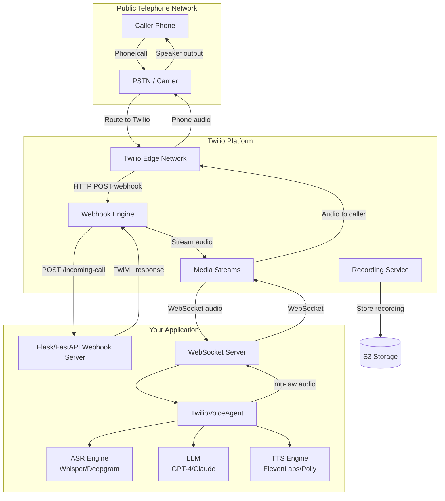
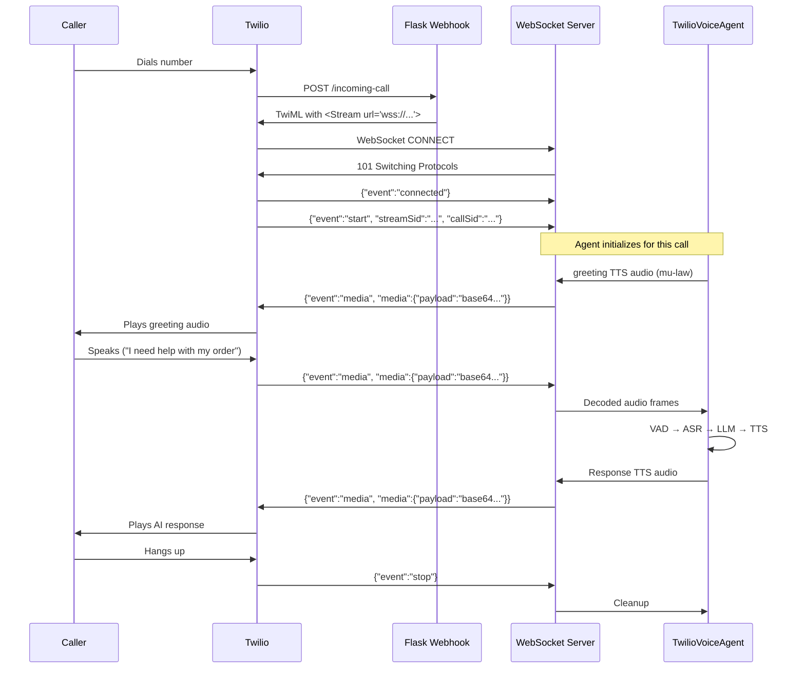
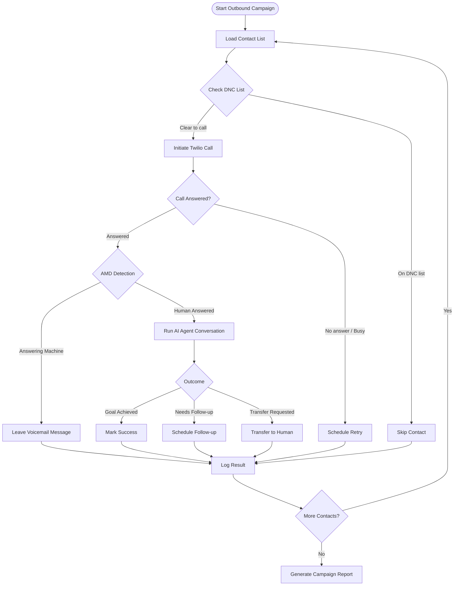
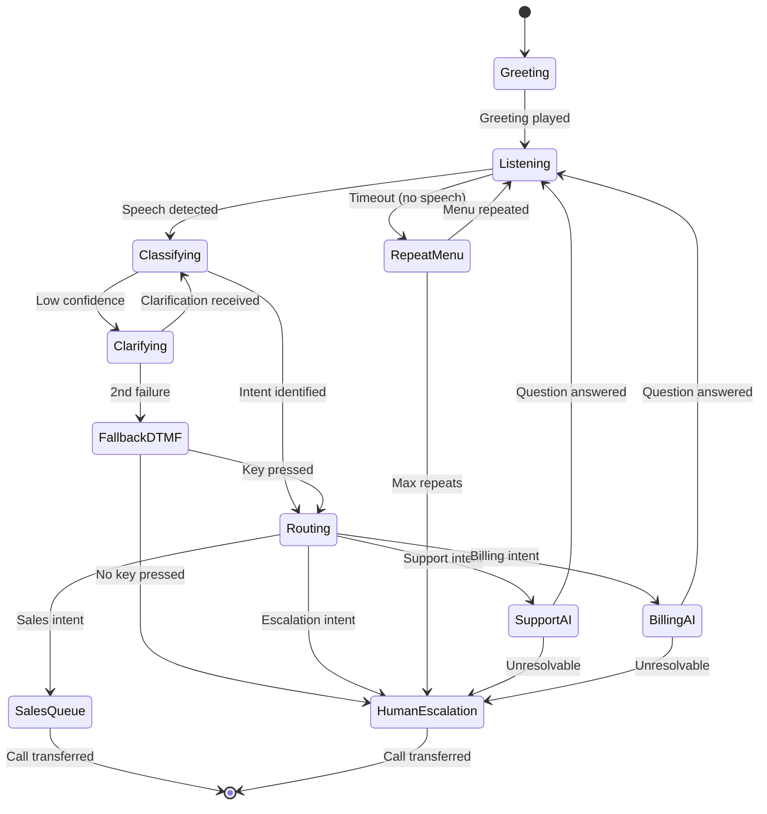
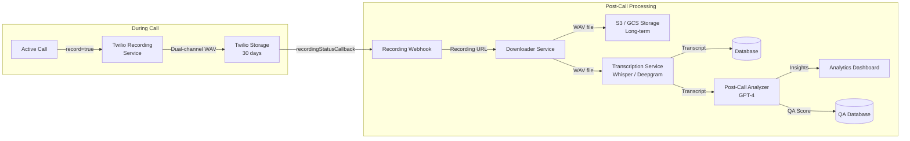

# Voice Agents Deep Dive  Part 13: Phone Call Agents  Twilio, SIP, and Telephony Integration

---

**Series:** Building Voice Agents  A Developer's Deep Dive from Audio Fundamentals to Production
**Part:** 13 of 19 (Voice Agent Frameworks)
**Audience:** Developers with Python experience who want to build voice-powered AI agents from the ground up
**Reading time:** ~45 minutes

---

## Introduction and Recap

In **Part 12**, we surveyed the major voice agent frameworks  **LiveKit**, **Pipecat**, **Vocode**, and the growing ecosystem of managed platforms. We saw how each framework makes different trade-offs between developer control and operational convenience, and we built agents on top of each one to understand how the abstractions feel in practice.

Those frameworks all assumed one thing: **a WebRTC or WebSocket connection** from a browser or app client. The audio arrived as clean PCM streams, latency was typically under 200 ms, and the user was sitting in front of a screen.

Now we enter a different world entirely.

**Phone calls.**

When a voice agent answers a phone, everything changes. The audio arrives as compressed mu-law (G.711) at 8 kHz. Latency budgets tighten to under 500 ms end-to-end or callers hang up. There is no visual feedback. Callers may be on poor cellular connections, driving, or elderly users unfamiliar with AI. And the legal stakes rise sharply  recording a call without disclosure can expose a company to multi-million-dollar class action lawsuits.

This part is the complete guide to phone call agents. We will cover **Twilio Voice** in depth, build inbound and outbound agents, handle DTMF menus, implement call transfer patterns, design AI-powered IVR, manage recordings, and address compliance from the first line of code. By the end, you will have a production-ready phone agent scaffold that handles real phone calls.

---

## Vocabulary Cheat Sheet

Before diving in, let us define the telephony terms that appear throughout this article.

| Term | Definition |
|---|---|
| **PSTN** | Public Switched Telephone Network  the global circuit-switched telephone infrastructure |
| **SIP** | Session Initiation Protocol  the signaling protocol used to set up VoIP calls |
| **TwiML** | Twilio Markup Language  XML instructions that tell Twilio how to handle a call |
| **AMD** | Answering Machine Detection  algorithm to detect if a human or voicemail answered |
| **DTMF** | Dual-Tone Multi-Frequency  the tones generated when pressing phone keypad digits |
| **Mu-law / G.711** | The audio codec used over telephone networks  8 kHz, 8-bit, ~64 kbps |
| **IVR** | Interactive Voice Response  automated phone menu system |
| **Warm Transfer** | Transferring a call after briefing the receiving agent about the caller |
| **Cold Transfer** | Blind transfer  caller is sent to another number without briefing |
| **TCPA** | Telephone Consumer Protection Act  US federal law governing auto-dialed calls |
| **PBX** | Private Branch Exchange  internal telephone switching system for a business |
| **WebRTC** | Web Real-Time Communication  browser-based peer-to-peer audio/video |
| **Codec** | Encoder/decoder for audio compression (G.711, G.729, Opus, etc.) |
| **TTS** | Text-to-Speech  converting text to spoken audio |
| **ASR** | Automatic Speech Recognition  converting spoken audio to text |
| **Media Stream** | Twilio's WebSocket service for real-time raw audio access |
| **Conference Bridge** | A shared audio channel where multiple parties can join the same call |
| **NLU** | Natural Language Understanding  extracting intent and entities from text |
| **Escalation** | Routing a call from AI to a human agent |

---

## 1. Phone Call Agents vs Chat Agents  What Is Fundamentally Different

Before writing a single line of code, we need to understand *why* phone calls demand a different engineering approach. The differences are not cosmetic. They touch every layer of the stack.

### 1.1 The Five Core Differences

```python
"""
phone_vs_chat_constraints.py

Demonstrates the fundamental differences between phone call agents
and web/app chat agents. This is a reference module  not intended
to run standalone, but to document the engineering constraints.
"""

from dataclasses import dataclass
from enum import Enum
from typing import Optional


class ChannelType(Enum):
    PHONE_PSTN = "phone_pstn"
    PHONE_VOIP = "phone_voip"
    WEB_CHAT = "web_chat"
    APP_CHAT = "app_chat"
    WEBRTC = "webrtc"


@dataclass
class ChannelConstraints:
    """Engineering constraints for different voice/chat channels."""
    channel: ChannelType

    # Audio constraints
    sample_rate_hz: int           # Audio sample rate
    bit_depth: int                # Bits per sample
    codec: str                    # Audio codec
    audio_bandwidth_kbps: float   # Available audio bandwidth

    # Latency constraints (milliseconds)
    max_acceptable_latency_ms: int    # Beyond this, users notice
    critical_latency_ms: int          # Beyond this, users hang up / leave
    typical_network_jitter_ms: int

    # User experience constraints
    has_visual_feedback: bool     # Can user see anything?
    can_retry_easily: bool        # Can user re-read or re-listen?
    expects_hold_music: bool      # Does channel support hold patterns?
    dtmf_available: bool          # Can user press keys as fallback?

    # Legal constraints
    recording_requires_disclosure: bool
    ai_disclosure_required: bool       # Some jurisdictions require this
    do_not_call_applies: bool

    # Technical constraints
    max_call_duration_minutes: Optional[int]
    supports_file_transfer: bool
    connection_reliability: str   # "high", "medium", "low"


# Define constraints for each channel
CHANNEL_CONSTRAINTS = {
    ChannelType.PHONE_PSTN: ChannelConstraints(
        channel=ChannelType.PHONE_PSTN,
        sample_rate_hz=8000,          # 8 kHz  telephone quality
        bit_depth=8,                  # 8-bit mu-law encoding
        codec="G.711 mu-law",
        audio_bandwidth_kbps=64.0,
        max_acceptable_latency_ms=300,
        critical_latency_ms=500,      # Users hang up after ~500ms silence
        typical_network_jitter_ms=20,
        has_visual_feedback=False,
        can_retry_easily=False,       # No scrollback; user must re-speak
        expects_hold_music=True,
        dtmf_available=True,
        recording_requires_disclosure=True,
        ai_disclosure_required=True,  # Growing legal requirement
        do_not_call_applies=True,     # TCPA in US
        max_call_duration_minutes=60, # Twilio limit; also user patience
        supports_file_transfer=False,
        connection_reliability="medium",
    ),
    ChannelType.WEBRTC: ChannelConstraints(
        channel=ChannelType.WEBRTC,
        sample_rate_hz=48000,         # 48 kHz  high quality
        bit_depth=16,
        codec="Opus",
        audio_bandwidth_kbps=32.0,    # Opus is very efficient
        max_acceptable_latency_ms=500,
        critical_latency_ms=2000,     # Users more patient on web
        typical_network_jitter_ms=10,
        has_visual_feedback=True,     # Browser UI available
        can_retry_easily=True,
        expects_hold_music=False,
        dtmf_available=False,
        recording_requires_disclosure=True,
        ai_disclosure_required=False, # Varies; less strict currently
        do_not_call_applies=False,
        max_call_duration_minutes=None,
        supports_file_transfer=True,
        connection_reliability="high",
    ),
    ChannelType.WEB_CHAT: ChannelConstraints(
        channel=ChannelType.WEB_CHAT,
        sample_rate_hz=0,             # Text only
        bit_depth=0,
        codec="none",
        audio_bandwidth_kbps=0.0,
        max_acceptable_latency_ms=2000,
        critical_latency_ms=10000,
        typical_network_jitter_ms=0,
        has_visual_feedback=True,
        can_retry_easily=True,
        expects_hold_music=False,
        dtmf_available=False,
        recording_requires_disclosure=False,
        ai_disclosure_required=False,
        do_not_call_applies=False,
        max_call_duration_minutes=None,
        supports_file_transfer=True,
        connection_reliability="high",
    ),
}


def print_channel_comparison():
    """Print a comparison of engineering constraints across channels."""
    phone = CHANNEL_CONSTRAINTS[ChannelType.PHONE_PSTN]
    webrtc = CHANNEL_CONSTRAINTS[ChannelType.WEBRTC]
    chat = CHANNEL_CONSTRAINTS[ChannelType.WEB_CHAT]

    print("=== Channel Constraint Comparison ===\n")
    print(f"{'Constraint':<35} {'PSTN Phone':<20} {'WebRTC':<20} {'Web Chat':<15}")
    print("-" * 90)
    print(f"{'Sample Rate':<35} {phone.sample_rate_hz} Hz{'':<13} {webrtc.sample_rate_hz} Hz{'':<11} {'N/A':<15}")
    print(f"{'Codec':<35} {phone.codec:<20} {webrtc.codec:<20} {'N/A':<15}")
    print(f"{'Critical Latency':<35} {phone.critical_latency_ms} ms{'':<15} {webrtc.critical_latency_ms} ms{'':<13} {'10000 ms':<15}")
    print(f"{'Visual Feedback':<35} {str(phone.has_visual_feedback):<20} {str(webrtc.has_visual_feedback):<20} {str(chat.has_visual_feedback):<15}")
    print(f"{'Recording Disclosure':<35} {str(phone.recording_requires_disclosure):<20} {str(webrtc.recording_requires_disclosure):<20} {str(chat.recording_requires_disclosure):<15}")
    print(f"{'TCPA/DNC Applies':<35} {str(phone.do_not_call_applies):<20} {str(webrtc.do_not_call_applies):<20} {str(chat.do_not_call_applies):<15}")
    print(f"{'DTMF Fallback':<35} {str(phone.dtmf_available):<20} {str(webrtc.dtmf_available):<20} {str(chat.dtmf_available):<15}")


if __name__ == "__main__":
    print_channel_comparison()
```

### 1.2 The Latency Budget Problem

The latency budget for phone calls is brutally tight. A caller who hears more than 500 ms of silence after finishing a sentence assumes the call dropped and hangs up. This means every component in the pipeline  ASR, LLM inference, TTS synthesis, and audio encoding  must complete within that window.

```
Caller speaks → [Audio transmission] → ASR → LLM → TTS → [Audio transmission] → Caller hears
                      ~50ms           ~200ms ~150ms ~100ms       ~50ms
                                                         Total: ~550ms (tight!)
```

The 8 kHz mu-law codec used on PSTN actually *helps* with transmission latency (smaller packets), but it hurts ASR accuracy because modern speech models are trained on higher-quality audio. You will typically need to upsample before feeding to ASR systems.

### 1.3 PSTN Audio Quality Constraints

```python
"""
audio_conversion.py

Utilities for converting between telephone-quality audio (8kHz mu-law G.711)
and standard PCM audio used by ASR/TTS systems.
"""

import audioop
import struct
import numpy as np
from typing import Union


# G.711 mu-law encoding table (standard 255-segment companding law)
MULAW_BIAS = 0x84
MULAW_CLIP = 32635


def pcm16_to_mulaw(pcm_data: bytes) -> bytes:
    """
    Convert 16-bit PCM audio to 8-bit mu-law (G.711).

    This is the format Twilio Media Streams sends and receives.
    Input: 16-bit signed PCM, any sample rate
    Output: 8-bit mu-law encoded bytes

    Args:
        pcm_data: Raw 16-bit PCM bytes (little-endian signed integers)

    Returns:
        8-bit mu-law encoded bytes (half the size of input)
    """
    return audioop.lin2ulaw(pcm_data, 2)


def mulaw_to_pcm16(mulaw_data: bytes) -> bytes:
    """
    Convert 8-bit mu-law (G.711) to 16-bit PCM audio.

    Use this to decode audio received from Twilio Media Streams
    before feeding to ASR systems.

    Args:
        mulaw_data: 8-bit mu-law encoded bytes from Twilio

    Returns:
        16-bit signed PCM bytes (double the size of input)
    """
    return audioop.ulaw2lin(mulaw_data, 2)


def resample_audio(
    audio_data: bytes,
    source_rate: int,
    target_rate: int,
    sample_width: int = 2
) -> bytes:
    """
    Resample audio from source_rate to target_rate.

    Common use cases:
    - 8000 Hz -> 16000 Hz: Upsample PSTN audio for Whisper/Deepgram ASR
    - 22050 Hz -> 8000 Hz: Downsample TTS output for PSTN delivery
    - 44100 Hz -> 8000 Hz: Downsample high-quality audio for telephony

    Args:
        audio_data: Raw PCM bytes
        source_rate: Original sample rate in Hz
        target_rate: Desired sample rate in Hz
        sample_width: Bytes per sample (2 for 16-bit PCM)

    Returns:
        Resampled PCM bytes
    """
    if source_rate == target_rate:
        return audio_data

    resampled, _ = audioop.ratecv(
        audio_data,
        sample_width,
        1,          # mono
        source_rate,
        target_rate,
        None        # state (None for first call)
    )
    return resampled


def prepare_audio_for_asr(mulaw_bytes: bytes, target_rate: int = 16000) -> np.ndarray:
    """
    Full pipeline: mu-law -> PCM16 -> resample -> float32 numpy array.

    This prepares raw Twilio audio for feeding to Whisper, Deepgram,
    or any other ASR system that expects 16kHz float32 audio.

    Args:
        mulaw_bytes: Raw mu-law bytes from Twilio Media Stream
        target_rate: Target sample rate for ASR (default 16000 for Whisper)

    Returns:
        Float32 numpy array normalized to [-1.0, 1.0]
    """
    # Step 1: Decode mu-law to 16-bit PCM at 8kHz
    pcm_8k = mulaw_to_pcm16(mulaw_bytes)

    # Step 2: Resample to target rate (typically 16kHz)
    pcm_target = resample_audio(pcm_8k, 8000, target_rate)

    # Step 3: Convert bytes to numpy int16 array
    samples = np.frombuffer(pcm_target, dtype=np.int16)

    # Step 4: Normalize to float32 [-1.0, 1.0]
    float_samples = samples.astype(np.float32) / 32768.0

    return float_samples


def prepare_tts_for_phone(
    tts_audio: np.ndarray,
    source_rate: int = 22050
) -> bytes:
    """
    Full pipeline: float32 TTS output -> 8kHz mu-law for phone delivery.

    Most TTS engines output at 22050 Hz or 24000 Hz. This converts
    that output to the format Twilio expects for Media Streams.

    Args:
        tts_audio: Float32 numpy array from TTS engine
        source_rate: Sample rate of TTS output

    Returns:
        8-bit mu-law bytes ready for Twilio Media Stream
    """
    # Step 1: Convert float32 to int16
    int16_samples = (tts_audio * 32767).astype(np.int16)
    pcm_bytes = int16_samples.tobytes()

    # Step 2: Resample to 8kHz (PSTN telephone rate)
    pcm_8k = resample_audio(pcm_bytes, source_rate, 8000)

    # Step 3: Encode as mu-law
    mulaw_bytes = pcm16_to_mulaw(pcm_8k)

    return mulaw_bytes


if __name__ == "__main__":
    # Demo: simulate round-trip conversion
    # Create a 440 Hz sine wave (1 second at 16kHz, simulating ASR input)
    sample_rate = 16000
    duration = 1.0
    t = np.linspace(0, duration, int(sample_rate * duration))
    sine_wave = (np.sin(2 * np.pi * 440 * t) * 0.5).astype(np.float32)

    # Simulate TTS output -> phone encoding
    phone_audio = prepare_tts_for_phone(sine_wave, source_rate=16000)
    print(f"TTS output (16kHz float32): {len(sine_wave)} samples")
    print(f"Phone mu-law (8kHz): {len(phone_audio)} bytes")
    print(f"Compression ratio: {len(sine_wave) * 4 / len(phone_audio):.1f}x")

    # Simulate phone reception -> ASR decoding
    asr_ready = prepare_audio_for_asr(phone_audio, target_rate=16000)
    print(f"ASR-ready audio (16kHz float32): {len(asr_ready)} samples")
```

---

## 2. Twilio Voice Deep Dive

Twilio is the dominant CPaaS (Communications Platform as a Service) for voice agents. It abstracts away carrier interconnects, PSTN complexity, and global number provisioning behind a clean REST API and WebSocket interface.

### 2.1 Architecture Overview



### 2.2 Account Setup and Phone Number Provisioning

```python
"""
twilio_setup.py

Utilities for Twilio account setup, phone number provisioning,
and webhook configuration. Run this once to set up your account.

Requirements:
    pip install twilio python-dotenv
"""

import os
from typing import Optional
from dotenv import load_dotenv
from twilio.rest import Client
from twilio.base.exceptions import TwilioRestException

load_dotenv()

# Load credentials from environment
TWILIO_ACCOUNT_SID = os.environ["TWILIO_ACCOUNT_SID"]
TWILIO_AUTH_TOKEN = os.environ["TWILIO_AUTH_TOKEN"]
TWILIO_PHONE_NUMBER = os.environ.get("TWILIO_PHONE_NUMBER", "")

# Your publicly accessible webhook URL (use ngrok for local dev)
# Example: https://abc123.ngrok.io
WEBHOOK_BASE_URL = os.environ["WEBHOOK_BASE_URL"]


def get_twilio_client() -> Client:
    """Create and return an authenticated Twilio client."""
    return Client(TWILIO_ACCOUNT_SID, TWILIO_AUTH_TOKEN)


def provision_phone_number(
    area_code: str = "415",
    country: str = "US",
    voice_capable: bool = True,
    sms_capable: bool = False,
) -> str:
    """
    Search for and purchase an available phone number.

    Args:
        area_code: Desired area code for the number
        country: ISO 3166-1 alpha-2 country code
        voice_capable: Require voice capability
        sms_capable: Require SMS capability

    Returns:
        The purchased phone number in E.164 format (e.g., +14155552671)
    """
    client = get_twilio_client()

    # Search for available numbers
    print(f"Searching for available {country} numbers in area code {area_code}...")

    available = client.available_phone_numbers(country) \
        .local \
        .list(
            area_code=area_code,
            voice_enabled=voice_capable,
            sms_enabled=sms_capable,
            limit=5
        )

    if not available:
        raise ValueError(f"No numbers available in area code {area_code}")

    # Purchase the first available number
    number = available[0]
    print(f"Found: {number.phone_number} ({number.friendly_name})")

    purchased = client.incoming_phone_numbers.create(
        phone_number=number.phone_number,
        voice_url=f"{WEBHOOK_BASE_URL}/incoming-call",
        voice_method="POST",
        status_callback=f"{WEBHOOK_BASE_URL}/call-status",
        status_callback_method="POST",
    )

    print(f"Purchased: {purchased.phone_number} (SID: {purchased.sid})")
    return purchased.phone_number


def configure_webhook(
    phone_number: str,
    voice_url: str,
    status_callback_url: Optional[str] = None,
) -> None:
    """
    Configure webhook URLs for an existing phone number.

    Args:
        phone_number: Phone number in E.164 format
        voice_url: URL for incoming call webhook
        status_callback_url: URL for call status events
    """
    client = get_twilio_client()

    # Find the phone number SID
    numbers = client.incoming_phone_numbers.list(phone_number=phone_number)
    if not numbers:
        raise ValueError(f"Phone number {phone_number} not found in account")

    number_sid = numbers[0].sid

    # Update webhook configuration
    update_params = {
        "voice_url": voice_url,
        "voice_method": "POST",
    }
    if status_callback_url:
        update_params["status_callback"] = status_callback_url
        update_params["status_callback_method"] = "POST"

    client.incoming_phone_numbers(number_sid).update(**update_params)
    print(f"Configured webhooks for {phone_number}")
    print(f"  Voice URL: {voice_url}")
    if status_callback_url:
        print(f"  Status Callback: {status_callback_url}")


def list_phone_numbers() -> list:
    """List all phone numbers in the account."""
    client = get_twilio_client()
    numbers = client.incoming_phone_numbers.list()

    print(f"Account has {len(numbers)} phone number(s):\n")
    for num in numbers:
        print(f"  {num.phone_number}")
        print(f"    SID: {num.sid}")
        print(f"    Voice URL: {num.voice_url}")
        print(f"    Status Callback: {num.status_callback}")
        print()

    return numbers


if __name__ == "__main__":
    import sys

    if len(sys.argv) > 1 and sys.argv[1] == "provision":
        area_code = sys.argv[2] if len(sys.argv) > 2 else "415"
        number = provision_phone_number(area_code=area_code)
        print(f"\nAdd to your .env file:\nTWILIO_PHONE_NUMBER={number}")
    else:
        list_phone_numbers()
```

### 2.3 TwiML Reference  The Call Flow Language

TwiML (Twilio Markup Language) is the XML dialect that tells Twilio what to do with a call. Every webhook response must return valid TwiML.

| Verb | Purpose | Key Attributes |
|---|---|---|
| `<Say>` | Speak text using Twilio TTS | `voice`, `language`, `loop` |
| `<Gather>` | Collect DTMF input or speech | `input`, `timeout`, `numDigits`, `action` |
| `<Record>` | Record the call or a message | `maxLength`, `action`, `transcribe` |
| `<Dial>` | Connect to another number/agent | `callerId`, `timeout`, `record` |
| `<Redirect>` | Redirect to another TwiML URL | (body = URL) |
| `<Hangup>` | End the call | (no attributes) |
| `<Pause>` | Silence for N seconds | `length` |
| `<Play>` | Play an audio file | `loop` (body = URL) |
| `<Queue>` | Place caller in a queue | `waitUrl`, `action` |
| `<Conference>` | Join a conference room | `muted`, `beep`, `record` |
| `<Stream>` | Start a Media Stream | `url`, `track` |
| `<Refer>` | SIP REFER transfer | (advanced SIP use) |

```python
"""
twiml_builder.py

Helper classes for building TwiML responses programmatically.
Wraps the official twilio library with convenience methods.

Requirements:
    pip install twilio
"""

from twilio.twiml.voice_response import (
    VoiceResponse,
    Gather,
    Dial,
    Conference,
    Start,
    Stream,
)
from typing import Optional, List


class TwiMLBuilder:
    """
    Fluent builder for TwiML voice responses.

    Provides a clean API for the most common call flow patterns
    used in voice agent implementations.
    """

    def __init__(self):
        self.response = VoiceResponse()

    def say(
        self,
        text: str,
        voice: str = "Polly.Joanna",
        language: str = "en-US",
    ) -> "TwiMLBuilder":
        """Add a <Say> verb with Amazon Polly voice."""
        self.response.say(text, voice=voice, language=language)
        return self

    def gather_speech(
        self,
        action_url: str,
        prompt: str,
        timeout: int = 3,
        speech_timeout: str = "auto",
        language: str = "en-US",
        voice: str = "Polly.Joanna",
    ) -> "TwiMLBuilder":
        """
        Add a <Gather> that collects speech input.

        The gathered speech transcription is POSTed to action_url
        as the 'SpeechResult' parameter.
        """
        gather = Gather(
            input="speech",
            action=action_url,
            timeout=timeout,
            speech_timeout=speech_timeout,
            language=language,
        )
        gather.say(prompt, voice=voice)
        self.response.append(gather)
        return self

    def gather_dtmf(
        self,
        action_url: str,
        prompt: str,
        num_digits: Optional[int] = None,
        timeout: int = 5,
        voice: str = "Polly.Joanna",
    ) -> "TwiMLBuilder":
        """
        Add a <Gather> that collects DTMF key presses.

        Gathered digits are POSTed to action_url as 'Digits' parameter.
        """
        kwargs = {
            "input": "dtmf",
            "action": action_url,
            "timeout": timeout,
        }
        if num_digits:
            kwargs["num_digits"] = num_digits

        gather = Gather(**kwargs)
        gather.say(prompt, voice=voice)
        self.response.append(gather)
        return self

    def gather_hybrid(
        self,
        action_url: str,
        prompt: str,
        timeout: int = 3,
        voice: str = "Polly.Joanna",
    ) -> "TwiMLBuilder":
        """
        Add a <Gather> accepting both speech AND DTMF.

        Whichever arrives first (speech transcription or digit press)
        is POSTed to action_url. Useful for IVR menus where callers
        can say "sales" or press "1".
        """
        gather = Gather(
            input="speech dtmf",
            action=action_url,
            timeout=timeout,
            speech_timeout="auto",
        )
        gather.say(prompt, voice=voice)
        self.response.append(gather)
        return self

    def start_media_stream(
        self,
        websocket_url: str,
        track: str = "both_tracks",
    ) -> "TwiMLBuilder":
        """
        Start a Media Stream to receive/send raw audio over WebSocket.

        Args:
            websocket_url: wss:// URL for your WebSocket server
            track: "inbound_track", "outbound_track", or "both_tracks"
        """
        start = Start()
        stream = Stream(url=websocket_url, track=track)
        start.append(stream)
        self.response.append(start)
        return self

    def dial_number(
        self,
        number: str,
        caller_id: Optional[str] = None,
        timeout: int = 30,
        record: bool = False,
    ) -> "TwiMLBuilder":
        """Add a <Dial> to transfer to a phone number."""
        dial = Dial(
            caller_id=caller_id,
            timeout=timeout,
            record="record-from-answer" if record else "do-not-record",
        )
        dial.number(number)
        self.response.append(dial)
        return self

    def dial_conference(
        self,
        room_name: str,
        muted: bool = False,
        beep: bool = True,
        record: bool = False,
    ) -> "TwiMLBuilder":
        """Add a <Dial><Conference> to join a conference room."""
        dial = Dial()
        dial.conference(
            room_name,
            muted=muted,
            beep="true" if beep else "false",
            record="record-from-start" if record else "do-not-record",
        )
        self.response.append(dial)
        return self

    def redirect(self, url: str) -> "TwiMLBuilder":
        """Redirect call to another TwiML URL."""
        self.response.redirect(url)
        return self

    def pause(self, seconds: int = 1) -> "TwiMLBuilder":
        """Add silence."""
        self.response.pause(length=seconds)
        return self

    def hangup(self) -> "TwiMLBuilder":
        """End the call."""
        self.response.hangup()
        return self

    def build(self) -> str:
        """Return the TwiML as a string."""
        return str(self.response)


# Example usage
if __name__ == "__main__":
    # Build a simple greeting + speech gather
    twiml = (
        TwiMLBuilder()
        .say("Hello! Thank you for calling Acme Support.")
        .gather_speech(
            action_url="/handle-speech",
            prompt="How can I help you today?",
            timeout=5,
        )
        .say("Sorry, I didn't catch that. Please try again.")
        .redirect("/incoming-call")
        .build()
    )
    print(twiml)
```

### 2.4 Inbound Call Handling with Flask

```python
"""
inbound_webhook.py

Flask webhook server for handling inbound Twilio calls.
This handles the initial webhook that fires when a call arrives.

Requirements:
    pip install flask twilio python-dotenv

Environment variables required:
    TWILIO_ACCOUNT_SID
    TWILIO_AUTH_TOKEN
    WEBHOOK_BASE_URL
    WEBSOCKET_URL  (wss:// URL for your media stream server)
"""

import os
import logging
from flask import Flask, request, Response
from twilio.twiml.voice_response import VoiceResponse
from twilio.request_validator import RequestValidator
from functools import wraps

from twiml_builder import TwiMLBuilder

logging.basicConfig(level=logging.INFO)
logger = logging.getLogger(__name__)

app = Flask(__name__)

TWILIO_AUTH_TOKEN = os.environ["TWILIO_AUTH_TOKEN"]
WEBHOOK_BASE_URL = os.environ["WEBHOOK_BASE_URL"]
WEBSOCKET_URL = os.environ["WEBSOCKET_URL"]  # wss://yourserver.com/media-stream

validator = RequestValidator(TWILIO_AUTH_TOKEN)


def validate_twilio_request(f):
    """
    Decorator to validate that requests come from Twilio.

    Twilio signs every webhook request with your auth token.
    Always validate in production to prevent spoofed calls.
    """
    @wraps(f)
    def decorated(*args, **kwargs):
        # Get the full URL that Twilio sent the request to
        url = request.url

        # Get POST parameters
        post_vars = request.form.to_dict()

        # Get Twilio signature from header
        signature = request.headers.get("X-Twilio-Signature", "")

        # Validate
        if not validator.validate(url, post_vars, signature):
            logger.warning(f"Invalid Twilio signature for request to {url}")
            return Response("Forbidden", status=403)

        return f(*args, **kwargs)
    return decorated


@app.route("/incoming-call", methods=["POST"])
@validate_twilio_request
def incoming_call():
    """
    Handle an incoming phone call.

    Twilio POSTs to this URL when someone calls your Twilio number.
    We respond with TwiML that starts a Media Stream.

    Twilio provides these parameters:
    - CallSid: Unique identifier for this call
    - From: Caller's phone number
    - To: Your Twilio number that was called
    - CallStatus: Current call status
    - Direction: "inbound" or "outbound-api"
    """
    call_sid = request.form.get("CallSid")
    caller = request.form.get("From", "Unknown")
    called = request.form.get("To", "Unknown")

    logger.info(f"Incoming call: {call_sid} from {caller} to {called}")

    # Build TwiML response:
    # 1. Say a brief greeting while we spin up the AI
    # 2. Start a Media Stream to our WebSocket server
    # 3. Keep the call alive with a long pause (agent speaks via stream)
    twiml = VoiceResponse()

    # Optional: brief hold while agent initializes
    # twiml.pause(length=1)

    # Start the media stream for real-time audio
    start = twiml.start()
    start.stream(
        url=f"{WEBSOCKET_URL}/media-stream/{call_sid}",
        track="both_tracks",  # Receive both caller and agent audio
    )

    # Keep the call alive  agent will speak via the stream
    # This pause needs to be long enough to cover the entire conversation
    twiml.pause(length=300)  # 5 minutes max; hangup ends it earlier

    return Response(str(twiml), content_type="application/xml")


@app.route("/call-status", methods=["POST"])
def call_status():
    """
    Receive call status callbacks from Twilio.

    Called when call status changes: initiated, ringing, answered,
    completed, busy, failed, no-answer, canceled.
    """
    call_sid = request.form.get("CallSid")
    status = request.form.get("CallStatus")
    duration = request.form.get("CallDuration", "0")

    logger.info(f"Call {call_sid} status: {status} (duration: {duration}s)")

    # In production: update database, trigger post-call processing, etc.
    if status == "completed":
        logger.info(f"Call {call_sid} completed after {duration} seconds")
        # Trigger async post-call analysis here

    return Response("OK", status=200)


@app.route("/handle-speech", methods=["POST"])
@validate_twilio_request
def handle_speech():
    """
    Handle speech gathered by a <Gather> verb.

    Called when caller speaks during a <Gather input="speech"> block.
    Twilio transcribes the speech and provides it as SpeechResult.
    """
    speech = request.form.get("SpeechResult", "")
    confidence = request.form.get("Confidence", "0")
    call_sid = request.form.get("CallSid")

    logger.info(f"Speech from {call_sid}: '{speech}' (confidence: {confidence})")

    if not speech:
        # No speech detected  re-prompt
        twiml = (
            TwiMLBuilder()
            .say("I'm sorry, I didn't hear anything.")
            .gather_speech(
                action_url=f"{WEBHOOK_BASE_URL}/handle-speech",
                prompt="How can I help you today?",
            )
            .hangup()
            .build()
        )
    else:
        # In a real agent, process speech with LLM here
        # For now, echo back
        twiml = (
            TwiMLBuilder()
            .say(f"You said: {speech}. Let me help you with that.")
            .gather_speech(
                action_url=f"{WEBHOOK_BASE_URL}/handle-speech",
                prompt="Is there anything else I can help you with?",
            )
            .hangup()
            .build()
        )

    return Response(twiml, content_type="application/xml")


if __name__ == "__main__":
    app.run(host="0.0.0.0", port=5000, debug=False)
```

### 2.5 Twilio Media Streams  Real-Time Audio over WebSocket

The Media Streams feature is what makes real AI voice agents possible on Twilio. Instead of relying on Twilio's built-in TTS/ASR, you receive raw audio over a WebSocket and send back synthesized speech.



```python
"""
media_stream_server.py

WebSocket server that handles Twilio Media Streams.
Receives raw mu-law audio from Twilio and sends back AI-generated responses.

Requirements:
    pip install fastapi uvicorn websockets twilio openai deepgram-sdk
    pip install numpy scipy python-dotenv

Run with:
    uvicorn media_stream_server:app --host 0.0.0.0 --port 8000
"""

import asyncio
import base64
import json
import logging
import os
from typing import Dict, Optional

import numpy as np
from fastapi import FastAPI, WebSocket, WebSocketDisconnect
from fastapi.responses import Response

from audio_conversion import mulaw_to_pcm16, pcm16_to_mulaw, resample_audio

logging.basicConfig(level=logging.INFO)
logger = logging.getLogger(__name__)

app = FastAPI()


class CallSession:
    """
    Manages state for a single active phone call.

    One CallSession is created per WebSocket connection (per call).
    It buffers incoming audio, runs VAD, sends to ASR when speech ends,
    processes with LLM, synthesizes with TTS, and streams back to caller.
    """

    def __init__(self, websocket: WebSocket, call_sid: str, stream_sid: str):
        self.websocket = websocket
        self.call_sid = call_sid
        self.stream_sid = stream_sid

        # Audio buffering
        self.audio_buffer: list = []          # Raw mu-law chunks
        self.silence_frames: int = 0          # Consecutive silent frames
        self.is_speaking: bool = False        # VAD state

        # VAD parameters
        self.silence_threshold_frames = 20    # ~400ms at 50fps
        self.min_speech_frames = 5            # Ignore noise < 100ms

        # Conversation state
        self.conversation_history = []
        self.system_prompt = (
            "You are a helpful customer service AI for Acme Corp. "
            "Keep responses brief  under 30 words  since this is a phone call. "
            "Be warm, professional, and efficient. "
            "If you cannot help with something, offer to transfer to a human agent."
        )

        logger.info(f"CallSession created for {call_sid}")

    async def send_audio(self, mulaw_bytes: bytes) -> None:
        """Send mu-law audio to caller via Twilio Media Stream."""
        payload = base64.b64encode(mulaw_bytes).decode("utf-8")
        message = {
            "event": "media",
            "streamSid": self.stream_sid,
            "media": {"payload": payload},
        }
        await self.websocket.send_text(json.dumps(message))

    async def send_text_as_speech(self, text: str) -> None:
        """Synthesize text to speech and send to caller."""
        logger.info(f"Agent speaking: {text!r}")

        # In production, use ElevenLabs, Polly, or similar
        # Here we use a placeholder that returns silent audio
        mulaw_audio = await self._synthesize_speech(text)

        # Send in chunks matching Twilio's expected frame size
        chunk_size = 160  # 20ms at 8kHz
        for i in range(0, len(mulaw_audio), chunk_size):
            chunk = mulaw_audio[i:i + chunk_size]
            await self.send_audio(chunk)
            await asyncio.sleep(0.02)  # 20ms pacing

    async def _synthesize_speech(self, text: str) -> bytes:
        """
        Synthesize speech using TTS engine.

        Replace this with your actual TTS implementation:
        - ElevenLabs: elevenlabs.generate()
        - Amazon Polly: polly.synthesize_speech()
        - Google Cloud TTS: texttospeech.synthesize_speech()

        Returns mu-law encoded bytes at 8kHz.
        """
        try:
            import openai
            client = openai.OpenAI()

            # OpenAI TTS outputs PCM at 24kHz
            response = client.audio.speech.create(
                model="tts-1",
                voice="alloy",
                input=text,
                response_format="pcm",
            )

            pcm_24k = response.content  # 16-bit PCM at 24kHz

            # Downsample to 8kHz for telephone
            pcm_8k = resample_audio(pcm_24k, 24000, 8000)

            # Encode as mu-law
            mulaw = pcm16_to_mulaw(pcm_8k)
            return mulaw

        except Exception as e:
            logger.error(f"TTS error: {e}")
            # Return 1 second of silence as fallback
            return bytes([0xFF] * 800)  # mu-law silence

    async def _transcribe_audio(self, mulaw_audio: bytes) -> str:
        """
        Transcribe audio buffer using ASR.

        Returns transcribed text, or empty string if no speech detected.
        """
        try:
            import openai
            import tempfile

            # Convert mu-law to 16kHz PCM WAV for Whisper
            pcm_8k = mulaw_to_pcm16(mulaw_audio)
            pcm_16k = resample_audio(pcm_8k, 8000, 16000)

            # Write to temp WAV file
            with tempfile.NamedTemporaryFile(suffix=".wav", delete=False) as f:
                # Write minimal WAV header
                import wave
                import io
                wav_buffer = io.BytesIO()
                with wave.open(wav_buffer, "wb") as wav:
                    wav.setnchannels(1)
                    wav.setsampwidth(2)
                    wav.setframerate(16000)
                    wav.writeframes(pcm_16k)
                wav_bytes = wav_buffer.getvalue()
                f.write(wav_bytes)
                temp_path = f.name

            client = openai.OpenAI()
            with open(temp_path, "rb") as audio_file:
                transcript = client.audio.transcriptions.create(
                    model="whisper-1",
                    file=audio_file,
                    language="en",
                )

            os.unlink(temp_path)
            return transcript.text.strip()

        except Exception as e:
            logger.error(f"ASR error: {e}")
            return ""

    async def _get_llm_response(self, user_text: str) -> str:
        """Get response from LLM based on conversation history."""
        try:
            import openai
            client = openai.OpenAI()

            # Add user message to history
            self.conversation_history.append({
                "role": "user",
                "content": user_text,
            })

            # Build messages for API
            messages = [
                {"role": "system", "content": self.system_prompt},
            ] + self.conversation_history[-10:]  # Keep last 10 turns

            response = client.chat.completions.create(
                model="gpt-4o-mini",
                messages=messages,
                max_tokens=100,  # Keep responses brief for phone
                temperature=0.7,
            )

            assistant_text = response.choices[0].message.content

            # Add to history
            self.conversation_history.append({
                "role": "assistant",
                "content": assistant_text,
            })

            return assistant_text

        except Exception as e:
            logger.error(f"LLM error: {e}")
            return "I apologize, I'm having trouble understanding. Could you repeat that?"

    async def process_audio_chunk(self, mulaw_chunk: bytes) -> None:
        """
        Process an incoming audio chunk with simple energy-based VAD.

        This is a simplified VAD. In production, use WebRTC VAD or
        Silero VAD for better accuracy.
        """
        # Decode to PCM for energy calculation
        pcm = mulaw_to_pcm16(mulaw_chunk)
        samples = np.frombuffer(pcm, dtype=np.int16)

        # Calculate RMS energy
        rms = np.sqrt(np.mean(samples.astype(np.float32) ** 2))
        energy_threshold = 500  # Tune based on your noise floor

        is_voice = rms > energy_threshold

        if is_voice:
            self.is_speaking = True
            self.silence_frames = 0
            self.audio_buffer.append(mulaw_chunk)
        else:
            if self.is_speaking:
                self.silence_frames += 1
                self.audio_buffer.append(mulaw_chunk)  # Include trailing silence

                if self.silence_frames >= self.silence_threshold_frames:
                    # End of speech detected
                    if len(self.audio_buffer) >= self.min_speech_frames:
                        await self._handle_complete_utterance()

                    self.audio_buffer = []
                    self.silence_frames = 0
                    self.is_speaking = False

    async def _handle_complete_utterance(self) -> None:
        """Process a complete spoken utterance end-to-end."""
        # Concatenate all audio chunks
        full_audio = b"".join(self.audio_buffer)
        logger.info(f"Processing utterance: {len(full_audio)} bytes of audio")

        # Step 1: ASR
        text = await self._transcribe_audio(full_audio)
        if not text:
            logger.info("No speech detected in buffer")
            return

        logger.info(f"Caller said: {text!r}")

        # Step 2: LLM
        response_text = await self._get_llm_response(text)
        logger.info(f"Agent response: {response_text!r}")

        # Step 3: TTS + send audio
        await self.send_text_as_speech(response_text)

    async def greet(self) -> None:
        """Send initial greeting to caller."""
        await self.send_text_as_speech(
            "Hello! Thank you for calling Acme Support. "
            "I'm an AI assistant. How can I help you today?"
        )


# Active call sessions
active_sessions: Dict[str, CallSession] = {}


@app.websocket("/media-stream/{call_sid}")
async def media_stream_endpoint(websocket: WebSocket, call_sid: str):
    """
    WebSocket endpoint for Twilio Media Streams.

    Twilio connects here after we include <Stream> in our TwiML response.
    All audio for the call flows through this connection.
    """
    await websocket.accept()
    logger.info(f"WebSocket connected for call {call_sid}")

    session: Optional[CallSession] = None

    try:
        async for raw_message in websocket.iter_text():
            message = json.loads(raw_message)
            event_type = message.get("event")

            if event_type == "connected":
                logger.info(f"Media stream connected: protocol={message.get('protocol')}")

            elif event_type == "start":
                stream_sid = message["streamSid"]
                start_data = message.get("start", {})

                logger.info(f"Stream started: streamSid={stream_sid}")
                logger.info(f"  Call SID: {start_data.get('callSid')}")
                logger.info(f"  Tracks: {start_data.get('tracks')}")

                # Create session for this call
                session = CallSession(websocket, call_sid, stream_sid)
                active_sessions[call_sid] = session

                # Greet the caller
                asyncio.create_task(session.greet())

            elif event_type == "media":
                if session is None:
                    continue

                media_data = message.get("media", {})
                track = media_data.get("track", "inbound")

                # Only process inbound track (caller's audio)
                if track == "inbound":
                    payload = base64.b64decode(media_data["payload"])
                    await session.process_audio_chunk(payload)

            elif event_type == "stop":
                logger.info(f"Stream stopped for call {call_sid}")
                if call_sid in active_sessions:
                    del active_sessions[call_sid]
                break

            elif event_type == "mark":
                # Twilio sends marks when we ask for playback synchronization
                logger.debug(f"Mark received: {message.get('mark', {}).get('name')}")

    except WebSocketDisconnect:
        logger.info(f"WebSocket disconnected for call {call_sid}")
    except Exception as e:
        logger.error(f"Error in media stream for {call_sid}: {e}", exc_info=True)
    finally:
        if call_sid in active_sessions:
            del active_sessions[call_sid]
        logger.info(f"Session cleaned up for {call_sid}")
```

---

## 3. The Complete TwilioVoiceAgent Class

Now let us assemble all the pieces into a production-grade `TwilioVoiceAgent` that integrates ASR, LLM, and TTS in a clean, testable class.

```python
"""
twilio_voice_agent.py

Production-grade TwilioVoiceAgent class.
Integrates Deepgram ASR, OpenAI GPT-4, and ElevenLabs TTS
for real-time phone conversation.

Requirements:
    pip install deepgram-sdk openai elevenlabs twilio fastapi uvicorn
    pip install numpy scipy python-dotenv aiohttp
"""

import asyncio
import base64
import json
import logging
import os
import time
from collections import deque
from dataclasses import dataclass, field
from enum import Enum
from typing import AsyncGenerator, Callable, Dict, List, Optional

import numpy as np

from audio_conversion import (
    mulaw_to_pcm16,
    pcm16_to_mulaw,
    resample_audio,
    prepare_audio_for_asr,
)

logger = logging.getLogger(__name__)


class AgentState(Enum):
    IDLE = "idle"
    LISTENING = "listening"
    PROCESSING = "processing"
    SPEAKING = "speaking"
    TRANSFERRING = "transferring"
    ENDED = "ended"


@dataclass
class ConversationTurn:
    """A single turn in the conversation."""
    role: str           # "user" or "assistant"
    content: str
    timestamp: float = field(default_factory=time.time)
    audio_duration_ms: Optional[int] = None


@dataclass
class AgentConfig:
    """Configuration for TwilioVoiceAgent."""
    # Identity
    agent_name: str = "Acme AI Assistant"
    company_name: str = "Acme Corp"

    # AI disclosure (required in many jurisdictions)
    disclose_ai: bool = True
    ai_disclosure_text: str = (
        "Just so you know, you're speaking with an AI assistant. "
        "I can help with most questions or connect you with a human agent."
    )

    # System prompt
    system_prompt: str = (
        "You are a helpful customer service AI. "
        "Keep responses under 25 words  this is a phone call. "
        "Be warm and professional. If the user needs human assistance, "
        "say 'I'll transfer you to a human agent.'"
    )

    # ASR settings
    asr_provider: str = "deepgram"  # "deepgram" or "openai_whisper"
    asr_language: str = "en-US"

    # LLM settings
    llm_model: str = "gpt-4o-mini"
    llm_temperature: float = 0.7
    llm_max_tokens: int = 100
    max_history_turns: int = 20

    # TTS settings
    tts_provider: str = "openai"  # "openai", "elevenlabs", "polly"
    tts_voice: str = "alloy"

    # VAD settings
    vad_energy_threshold: float = 600.0
    vad_silence_frames: int = 25    # ~500ms at 50fps
    vad_min_speech_frames: int = 8  # ~160ms minimum utterance

    # Behavior
    transfer_phrase: str = "transfer you to a human"
    max_conversation_turns: int = 50
    no_input_timeout_s: float = 10.0

    # Transfer number (for escalation)
    transfer_number: Optional[str] = None


class TwilioVoiceAgent:
    """
    Complete voice agent for Twilio phone calls.

    Handles the full pipeline:
    - Receives mu-law audio from Twilio Media Streams
    - VAD to detect speech boundaries
    - ASR to transcribe speech
    - LLM to generate response
    - TTS to synthesize response
    - Sends mu-law audio back to Twilio

    One instance is created per active call.

    Usage:
        agent = TwilioVoiceAgent(config, send_audio_callback)
        await agent.start()
        # Feed audio: await agent.on_audio(mulaw_bytes)
        # Clean up: await agent.stop()
    """

    def __init__(
        self,
        config: AgentConfig,
        send_audio_fn: Callable[[bytes], asyncio.coroutine],
        call_sid: str,
        stream_sid: str,
        transfer_fn: Optional[Callable[[str], asyncio.coroutine]] = None,
    ):
        self.config = config
        self.send_audio_fn = send_audio_fn
        self.call_sid = call_sid
        self.stream_sid = stream_sid
        self.transfer_fn = transfer_fn

        # State
        self.state = AgentState.IDLE
        self.conversation: List[ConversationTurn] = []

        # Audio buffering
        self.audio_buffer: List[bytes] = []
        self.silence_frame_count: int = 0
        self.speech_frame_count: int = 0

        # Timing
        self.call_start_time = time.time()
        self.last_input_time = time.time()
        self.turn_count = 0

        # Tasks
        self._no_input_task: Optional[asyncio.Task] = None
        self._processing_lock = asyncio.Lock()

        logger.info(f"TwilioVoiceAgent initialized for call {call_sid}")

    async def start(self) -> None:
        """Start the agent  called when Media Stream begins."""
        self.state = AgentState.IDLE
        self.call_start_time = time.time()

        # Send greeting
        await self._greet()

        # Start no-input watchdog
        self._no_input_task = asyncio.create_task(self._no_input_watchdog())

    async def stop(self) -> None:
        """Stop the agent  called when call ends or stream stops."""
        self.state = AgentState.ENDED

        if self._no_input_task:
            self._no_input_task.cancel()

        duration = time.time() - self.call_start_time
        logger.info(
            f"Call {self.call_sid} ended. "
            f"Duration: {duration:.1f}s, Turns: {self.turn_count}"
        )

    async def on_audio(self, mulaw_chunk: bytes) -> None:
        """
        Process an incoming audio chunk from Twilio.

        Called for every audio packet received from the Media Stream.
        At 8kHz with 20ms frames, this is called ~50 times per second.
        """
        if self.state in (AgentState.SPEAKING, AgentState.TRANSFERRING, AgentState.ENDED):
            return  # Ignore input while we're speaking or transferring

        # Simple energy-based VAD
        pcm = mulaw_to_pcm16(mulaw_chunk)
        samples = np.frombuffer(pcm, dtype=np.int16).astype(np.float32)
        rms = np.sqrt(np.mean(samples ** 2))

        is_voice = rms > self.config.vad_energy_threshold

        if is_voice:
            if self.state == AgentState.IDLE:
                self.state = AgentState.LISTENING
                logger.debug(f"[{self.call_sid}] Speech start detected")

            self.speech_frame_count += 1
            self.silence_frame_count = 0
            self.audio_buffer.append(mulaw_chunk)
            self.last_input_time = time.time()

        else:
            if self.state == AgentState.LISTENING:
                self.silence_frame_count += 1
                self.audio_buffer.append(mulaw_chunk)  # Include trailing silence

                if self.silence_frame_count >= self.config.vad_silence_frames:
                    # End of speech
                    if self.speech_frame_count >= self.config.vad_min_speech_frames:
                        # Enough speech to process
                        audio_data = b"".join(self.audio_buffer)
                        self.audio_buffer = []
                        self.silence_frame_count = 0
                        self.speech_frame_count = 0
                        self.state = AgentState.PROCESSING

                        # Process asynchronously
                        asyncio.create_task(self._handle_utterance(audio_data))
                    else:
                        # Too short  noise or false trigger
                        self.audio_buffer = []
                        self.silence_frame_count = 0
                        self.speech_frame_count = 0
                        self.state = AgentState.IDLE

    async def _greet(self) -> None:
        """Send the initial greeting to the caller."""
        greeting_parts = []

        greeting_parts.append(
            f"Hello! Thank you for calling {self.config.company_name}."
        )

        if self.config.disclose_ai:
            greeting_parts.append(self.config.ai_disclosure_text)

        greeting_parts.append("How can I help you today?")

        greeting = " ".join(greeting_parts)
        await self._speak(greeting, turn_role="assistant")

    async def _handle_utterance(self, audio_data: bytes) -> None:
        """Full pipeline: audio -> ASR -> LLM -> TTS -> audio."""
        async with self._processing_lock:
            if self.state == AgentState.ENDED:
                return

            self.turn_count += 1

            # Check conversation limits
            if self.turn_count > self.config.max_conversation_turns:
                await self._speak("I'm sorry, we've reached our conversation limit. Goodbye!")
                self.state = AgentState.ENDED
                return

            try:
                # Step 1: ASR
                logger.info(f"[{self.call_sid}] Transcribing audio ({len(audio_data)} bytes)...")
                t0 = time.time()
                user_text = await self._transcribe(audio_data)
                asr_latency = (time.time() - t0) * 1000

                if not user_text:
                    logger.info(f"[{self.call_sid}] No speech detected")
                    self.state = AgentState.IDLE
                    return

                logger.info(f"[{self.call_sid}] ASR ({asr_latency:.0f}ms): {user_text!r}")

                # Add to conversation
                self.conversation.append(ConversationTurn(role="user", content=user_text))

                # Step 2: LLM
                t1 = time.time()
                response_text = await self._generate_response(user_text)
                llm_latency = (time.time() - t1) * 1000
                logger.info(f"[{self.call_sid}] LLM ({llm_latency:.0f}ms): {response_text!r}")

                # Check for transfer intent
                if self._should_transfer(response_text):
                    await self._handle_transfer(response_text)
                    return

                # Step 3: TTS + send
                t2 = time.time()
                await self._speak(response_text, turn_role="assistant")
                tts_latency = (time.time() - t2) * 1000

                total_latency = asr_latency + llm_latency + tts_latency
                logger.info(
                    f"[{self.call_sid}] Latencies: "
                    f"ASR={asr_latency:.0f}ms, "
                    f"LLM={llm_latency:.0f}ms, "
                    f"TTS={tts_latency:.0f}ms, "
                    f"Total={total_latency:.0f}ms"
                )

                self.state = AgentState.IDLE

            except Exception as e:
                logger.error(f"[{self.call_sid}] Pipeline error: {e}", exc_info=True)
                await self._speak("I'm sorry, I encountered an error. Please hold.")
                self.state = AgentState.IDLE

    async def _transcribe(self, mulaw_audio: bytes) -> str:
        """Transcribe audio using configured ASR provider."""
        if self.config.asr_provider == "deepgram":
            return await self._transcribe_deepgram(mulaw_audio)
        elif self.config.asr_provider == "openai_whisper":
            return await self._transcribe_whisper(mulaw_audio)
        else:
            raise ValueError(f"Unknown ASR provider: {self.config.asr_provider}")

    async def _transcribe_deepgram(self, mulaw_audio: bytes) -> str:
        """Transcribe with Deepgram (recommended for telephony  supports mu-law)."""
        import aiohttp

        api_key = os.environ["DEEPGRAM_API_KEY"]

        # Deepgram can accept mu-law directly with encoding parameter
        params = {
            "model": "nova-2-phonecall",  # Optimized for telephone audio
            "encoding": "mulaw",
            "sample_rate": "8000",
            "channels": "1",
            "punctuate": "true",
            "diarize": "false",
        }

        query_string = "&".join(f"{k}={v}" for k, v in params.items())
        url = f"https://api.deepgram.com/v1/listen?{query_string}"

        headers = {
            "Authorization": f"Token {api_key}",
            "Content-Type": "audio/mulaw",
        }

        async with aiohttp.ClientSession() as session:
            async with session.post(url, data=mulaw_audio, headers=headers) as resp:
                if resp.status != 200:
                    logger.error(f"Deepgram error: {resp.status}")
                    return ""

                result = await resp.json()

                try:
                    transcript = (
                        result["results"]["channels"][0]
                        ["alternatives"][0]["transcript"]
                    )
                    return transcript.strip()
                except (KeyError, IndexError):
                    return ""

    async def _transcribe_whisper(self, mulaw_audio: bytes) -> str:
        """Transcribe with OpenAI Whisper."""
        import openai
        import io
        import wave
        import tempfile

        # Convert mu-law to 16kHz WAV for Whisper
        pcm_8k = mulaw_to_pcm16(mulaw_audio)
        pcm_16k = resample_audio(pcm_8k, 8000, 16000)

        wav_buffer = io.BytesIO()
        with wave.open(wav_buffer, "wb") as wav_file:
            wav_file.setnchannels(1)
            wav_file.setsampwidth(2)
            wav_file.setframerate(16000)
            wav_file.writeframes(pcm_16k)
        wav_buffer.seek(0)
        wav_buffer.name = "audio.wav"

        client = openai.AsyncOpenAI()
        transcript = await client.audio.transcriptions.create(
            model="whisper-1",
            file=wav_buffer,
            language="en",
        )
        return transcript.text.strip()

    async def _generate_response(self, user_text: str) -> str:
        """Generate LLM response with conversation history."""
        import openai

        client = openai.AsyncOpenAI()

        # Build messages
        messages = [{"role": "system", "content": self.config.system_prompt}]

        # Add recent history
        recent = self.conversation[-self.config.max_history_turns:]
        for turn in recent:
            messages.append({"role": turn.role, "content": turn.content})

        response = await client.chat.completions.create(
            model=self.config.llm_model,
            messages=messages,
            max_tokens=self.config.llm_max_tokens,
            temperature=self.config.llm_temperature,
        )

        text = response.choices[0].message.content
        self.conversation.append(ConversationTurn(role="assistant", content=text))
        return text

    async def _speak(self, text: str, turn_role: str = "assistant") -> None:
        """Synthesize text to speech and send to caller."""
        self.state = AgentState.SPEAKING

        try:
            mulaw_audio = await self._synthesize(text)

            # Send in 20ms chunks with pacing
            chunk_size = 160  # 20ms at 8kHz mu-law
            for i in range(0, len(mulaw_audio), chunk_size):
                chunk = mulaw_audio[i:i + chunk_size]
                await self.send_audio_fn(chunk)
                await asyncio.sleep(0.018)  # Slightly under 20ms for smoothness

        finally:
            if self.state == AgentState.SPEAKING:
                self.state = AgentState.IDLE

    async def _synthesize(self, text: str) -> bytes:
        """Synthesize speech using configured TTS provider."""
        if self.config.tts_provider == "openai":
            return await self._synthesize_openai(text)
        elif self.config.tts_provider == "elevenlabs":
            return await self._synthesize_elevenlabs(text)
        else:
            raise ValueError(f"Unknown TTS provider: {self.config.tts_provider}")

    async def _synthesize_openai(self, text: str) -> bytes:
        """Synthesize with OpenAI TTS."""
        import openai

        client = openai.AsyncOpenAI()
        response = await client.audio.speech.create(
            model="tts-1",
            voice=self.config.tts_voice,
            input=text,
            response_format="pcm",
            speed=1.05,  # Slightly faster for phone
        )

        pcm_24k = response.content
        pcm_8k = resample_audio(pcm_24k, 24000, 8000)
        return pcm16_to_mulaw(pcm_8k)

    async def _synthesize_elevenlabs(self, text: str) -> bytes:
        """Synthesize with ElevenLabs (higher quality)."""
        import aiohttp

        api_key = os.environ["ELEVENLABS_API_KEY"]
        voice_id = os.environ.get("ELEVENLABS_VOICE_ID", "21m00Tcm4TlvDq8ikWAM")

        url = f"https://api.elevenlabs.io/v1/text-to-speech/{voice_id}"

        payload = {
            "text": text,
            "model_id": "eleven_turbo_v2",  # Lowest latency model
            "voice_settings": {
                "stability": 0.5,
                "similarity_boost": 0.75,
                "style": 0.0,
                "use_speaker_boost": True,
            },
            "output_format": "pcm_22050",
        }

        headers = {
            "xi-api-key": api_key,
            "Content-Type": "application/json",
        }

        async with aiohttp.ClientSession() as session:
            async with session.post(url, json=payload, headers=headers) as resp:
                pcm_22k = await resp.read()

        pcm_8k = resample_audio(pcm_22k, 22050, 8000)
        return pcm16_to_mulaw(pcm_8k)

    def _should_transfer(self, response_text: str) -> bool:
        """Detect if LLM response indicates a transfer should happen."""
        transfer_phrases = [
            "transfer you to a human",
            "connect you with a human",
            "transfer you to an agent",
            "connect you with an agent",
            "transfer you to our team",
        ]
        text_lower = response_text.lower()
        return any(phrase in text_lower for phrase in transfer_phrases)

    async def _handle_transfer(self, response_text: str) -> None:
        """Handle call transfer to human agent."""
        self.state = AgentState.TRANSFERRING

        # Speak the transition message
        await self._speak(
            "Please hold while I connect you with a human agent. "
            "I'll share our conversation summary with them."
        )

        if self.transfer_fn:
            # Generate conversation summary for warm transfer
            summary = await self._generate_summary()
            await self.transfer_fn(summary)

        logger.info(f"[{self.call_sid}] Transfer initiated")

    async def _generate_summary(self) -> str:
        """Generate a brief summary of the conversation for transfer."""
        if not self.conversation:
            return "New caller with no prior conversation."

        import openai
        client = openai.AsyncOpenAI()

        history_text = "\n".join(
            f"{t.role.title()}: {t.content}"
            for t in self.conversation[-10:]
        )

        response = await client.chat.completions.create(
            model="gpt-4o-mini",
            messages=[
                {
                    "role": "system",
                    "content": "Summarize this call in 2-3 sentences for a human agent handoff.",
                },
                {"role": "user", "content": history_text},
            ],
            max_tokens=100,
        )

        return response.choices[0].message.content

    async def _no_input_watchdog(self) -> None:
        """
        Monitor for extended silence and handle appropriately.

        If caller goes silent for too long, check in with them.
        """
        while self.state != AgentState.ENDED:
            await asyncio.sleep(2.0)

            if self.state == AgentState.IDLE:
                elapsed = time.time() - self.last_input_time

                if elapsed > self.config.no_input_timeout_s:
                    logger.info(f"[{self.call_sid}] No input timeout")
                    await self._speak(
                        "Are you still there? I'm here to help whenever you're ready."
                    )
                    self.last_input_time = time.time()

    def get_call_summary(self) -> Dict:
        """Return a summary of this call for logging/analytics."""
        return {
            "call_sid": self.call_sid,
            "duration_s": time.time() - self.call_start_time,
            "turn_count": self.turn_count,
            "final_state": self.state.value,
            "conversation": [
                {"role": t.role, "content": t.content}
                for t in self.conversation
            ],
        }
```

---

## 4. Outbound Calling Agent

An outbound calling agent dials customers proactively  for appointment reminders, surveys, or follow-ups. Outbound calling has additional requirements: answering machine detection (AMD), do-not-call compliance, and handling call rejection gracefully.

### 4.1 Outbound Call Flow



```python
"""
outbound_dialer.py

OutboundDialer class for making AI-driven outbound phone calls.
Handles AMD, retry logic, rate limiting, and DNC compliance.

Requirements:
    pip install twilio python-dotenv aiohttp asyncio
"""

import asyncio
import logging
import os
import time
from dataclasses import dataclass, field
from enum import Enum
from typing import Dict, List, Optional, Set
from datetime import datetime, timedelta

from twilio.rest import Client
from twilio.base.exceptions import TwilioRestException

logger = logging.getLogger(__name__)


class CallOutcome(Enum):
    SUCCESS = "success"
    NO_ANSWER = "no_answer"
    BUSY = "busy"
    FAILED = "failed"
    VOICEMAIL = "voicemail"
    HUMAN_COMPLETED = "human_completed"
    DNC_SKIP = "dnc_skip"
    MAX_RETRIES = "max_retries"


@dataclass
class Contact:
    """A contact to be called."""
    phone_number: str           # E.164 format: +12125551234
    name: str = ""
    metadata: Dict = field(default_factory=dict)

    # Call tracking
    attempt_count: int = 0
    last_attempt_time: Optional[float] = None
    outcome: Optional[CallOutcome] = None
    call_sid: Optional[str] = None


@dataclass
class DialerConfig:
    """Configuration for OutboundDialer."""
    # Your Twilio number
    caller_id: str = ""

    # Webhook URLs
    webhook_base_url: str = ""

    # AMD settings
    enable_amd: bool = True
    amd_timeout_ms: int = 3000      # How long to wait for AMD
    amd_speech_threshold: int = 2400
    amd_silence_threshold: int = 1200

    # Retry settings
    max_attempts: int = 3
    retry_delay_minutes: int = 60   # Wait between retries

    # Rate limiting
    max_concurrent_calls: int = 5
    calls_per_minute: int = 10

    # Calling hours (local time of contact  simplified to UTC here)
    calling_hours_start: int = 9   # 9 AM
    calling_hours_end: int = 20    # 8 PM

    # Voicemail message URL
    voicemail_twiml_url: str = ""


class DoNotCallList:
    """
    Manages the Do-Not-Call registry.

    In production, this would integrate with:
    - National DNC Registry (scrubbing service)
    - Your internal opt-out database
    - State-level DNC registries
    """

    def __init__(self):
        self._numbers: Set[str] = set()
        self._load_from_env()

    def _load_from_env(self):
        """Load DNC numbers from environment (simplified)."""
        dnc_str = os.environ.get("DNC_NUMBERS", "")
        if dnc_str:
            for num in dnc_str.split(","):
                self._numbers.add(num.strip())

    def add(self, phone_number: str) -> None:
        """Add a number to the DNC list."""
        normalized = self._normalize(phone_number)
        self._numbers.add(normalized)
        logger.info(f"Added {normalized} to DNC list")

    def is_blocked(self, phone_number: str) -> bool:
        """Check if a number is on the DNC list."""
        return self._normalize(phone_number) in self._numbers

    def _normalize(self, number: str) -> str:
        """Normalize phone number to E.164 format."""
        # Strip everything except digits and leading +
        digits = "".join(c for c in number if c.isdigit())
        if len(digits) == 10:
            return f"+1{digits}"
        elif len(digits) == 11 and digits.startswith("1"):
            return f"+{digits}"
        return f"+{digits}"


class OutboundDialer:
    """
    Manages outbound AI phone call campaigns.

    Usage:
        config = DialerConfig(
            caller_id="+14155551234",
            webhook_base_url="https://yourapp.com",
            enable_amd=True,
        )
        dialer = OutboundDialer(config)

        contacts = [
            Contact("+12125559876", name="Alice Smith"),
            Contact("+13105558765", name="Bob Jones"),
        ]

        results = await dialer.run_campaign(contacts, campaign_name="Q4 Survey")
    """

    def __init__(self, config: DialerConfig):
        self.config = config
        self.client = Client(
            os.environ["TWILIO_ACCOUNT_SID"],
            os.environ["TWILIO_AUTH_TOKEN"],
        )
        self.dnc = DoNotCallList()

        self._active_calls: Dict[str, Contact] = {}  # call_sid -> Contact
        self._semaphore = asyncio.Semaphore(config.max_concurrent_calls)
        self._call_times: List[float] = []  # For rate limiting

    async def run_campaign(
        self,
        contacts: List[Contact],
        campaign_name: str = "Campaign",
    ) -> Dict:
        """
        Run a complete outbound calling campaign.

        Returns:
            Campaign results summary
        """
        logger.info(f"Starting campaign '{campaign_name}' with {len(contacts)} contacts")
        start_time = time.time()

        tasks = [self._call_contact(contact) for contact in contacts]
        await asyncio.gather(*tasks)

        # Compile results
        results = {
            "campaign_name": campaign_name,
            "total_contacts": len(contacts),
            "duration_s": time.time() - start_time,
            "outcomes": {},
        }

        for outcome in CallOutcome:
            count = sum(1 for c in contacts if c.outcome == outcome)
            if count > 0:
                results["outcomes"][outcome.value] = count

        logger.info(f"Campaign complete: {results}")
        return results

    async def _call_contact(self, contact: Contact) -> None:
        """Call a single contact, with retries."""
        # Check DNC
        if self.dnc.is_blocked(contact.phone_number):
            logger.info(f"Skipping {contact.phone_number}  on DNC list")
            contact.outcome = CallOutcome.DNC_SKIP
            return

        # Check calling hours
        if not self._is_calling_hours():
            logger.info(f"Outside calling hours  skipping {contact.phone_number}")
            contact.outcome = CallOutcome.NO_ANSWER
            return

        # Attempt calls with retries
        for attempt in range(self.config.max_attempts):
            contact.attempt_count = attempt + 1

            if attempt > 0:
                # Wait between retries
                delay = self.config.retry_delay_minutes * 60
                logger.info(f"Waiting {delay}s before retry {attempt + 1} for {contact.phone_number}")
                await asyncio.sleep(delay)

            outcome = await self._make_call(contact)
            contact.outcome = outcome

            if outcome not in (CallOutcome.NO_ANSWER, CallOutcome.BUSY, CallOutcome.FAILED):
                break  # Don't retry successful outcomes

        if contact.outcome in (CallOutcome.NO_ANSWER, CallOutcome.BUSY, CallOutcome.FAILED):
            contact.outcome = CallOutcome.MAX_RETRIES

    async def _make_call(self, contact: Contact) -> CallOutcome:
        """Make a single outbound call attempt."""
        async with self._semaphore:
            await self._enforce_rate_limit()

            logger.info(
                f"Calling {contact.phone_number} "
                f"(attempt {contact.attempt_count}/{self.config.max_attempts})"
            )

            try:
                call_params = {
                    "to": contact.phone_number,
                    "from_": self.config.caller_id,
                    "url": f"{self.config.webhook_base_url}/outbound-call",
                    "status_callback": f"{self.config.webhook_base_url}/call-status",
                    "status_callback_event": ["answered", "completed"],
                    "status_callback_method": "POST",
                    "timeout": 30,  # Seconds to ring before no-answer
                }

                if self.config.enable_amd:
                    call_params["machine_detection"] = "Enable"
                    call_params["machine_detection_timeout"] = self.config.amd_timeout_ms
                    call_params["machine_detection_speech_threshold"] = self.config.amd_speech_threshold
                    call_params["machine_detection_speech_end_threshold"] = self.config.amd_silence_threshold
                    call_params["async_amd"] = "true"
                    call_params["async_amd_status_callback"] = (
                        f"{self.config.webhook_base_url}/amd-callback"
                    )

                call = self.client.calls.create(**call_params)
                contact.call_sid = call.sid
                contact.last_attempt_time = time.time()

                logger.info(f"Call initiated: SID={call.sid}")

                # Wait for call completion (poll status)
                outcome = await self._wait_for_completion(call.sid)
                return outcome

            except TwilioRestException as e:
                logger.error(f"Twilio error calling {contact.phone_number}: {e}")
                return CallOutcome.FAILED

    async def _wait_for_completion(self, call_sid: str, timeout_s: int = 300) -> CallOutcome:
        """
        Poll Twilio for call status until completion.

        In production, use status callbacks instead of polling.
        """
        start = time.time()

        while time.time() - start < timeout_s:
            await asyncio.sleep(3)

            try:
                call = self.client.calls(call_sid).fetch()
                status = call.status

                if status == "completed":
                    answered_by = getattr(call, "answered_by", None)
                    if answered_by == "machine_start":
                        return CallOutcome.VOICEMAIL
                    return CallOutcome.HUMAN_COMPLETED

                elif status in ("busy", "no-answer"):
                    return CallOutcome.NO_ANSWER if status == "no-answer" else CallOutcome.BUSY

                elif status == "failed":
                    return CallOutcome.FAILED

                # Still in progress
                logger.debug(f"Call {call_sid} status: {status}")

            except TwilioRestException as e:
                logger.error(f"Error fetching call status: {e}")
                return CallOutcome.FAILED

        logger.warning(f"Call {call_sid} timed out waiting for completion")
        return CallOutcome.FAILED

    async def _enforce_rate_limit(self) -> None:
        """Enforce maximum calls per minute."""
        now = time.time()
        # Remove timestamps older than 60 seconds
        self._call_times = [t for t in self._call_times if now - t < 60]

        if len(self._call_times) >= self.config.calls_per_minute:
            # Wait until oldest call timestamp is > 60s ago
            oldest = self._call_times[0]
            wait_time = 60 - (now - oldest) + 0.1
            logger.info(f"Rate limit: waiting {wait_time:.1f}s")
            await asyncio.sleep(wait_time)

        self._call_times.append(time.time())

    def _is_calling_hours(self) -> bool:
        """Check if current time is within allowed calling hours."""
        current_hour = datetime.utcnow().hour
        return self.config.calling_hours_start <= current_hour < self.config.calling_hours_end

    def add_to_dnc(self, phone_number: str) -> None:
        """Add a number to the Do-Not-Call list."""
        self.dnc.add(phone_number)
```

---

## 5. DTMF Tone Handling

DTMF (Dual-Tone Multi-Frequency) tones are the sounds generated when pressing phone keypad buttons. Even in AI voice agents, DTMF support is essential as a fallback for users who cannot or will not use voice input (noisy environments, speech disorders, non-English speakers).

```python
"""
dtmf_handler.py

DTMF detection and menu handling for voice agents.
Supports both pure DTMF menus and hybrid voice+DTMF inputs.

Requirements:
    pip install flask twilio
"""

from flask import Flask, request, Response
from twilio.twiml.voice_response import VoiceResponse, Gather
from typing import Callable, Dict, Optional


class DTMFMenu:
    """
    Declarative DTMF menu builder.

    Creates phone menus where callers can press keys to navigate.
    Supports hybrid mode where callers can also speak their choice.

    Usage:
        menu = DTMFMenu("main_menu")
        menu.add_option("1", "Sales", handler=handle_sales)
        menu.add_option("2", "Support", handler=handle_support)
        menu.add_option("0", "Speak to a person", handler=handle_transfer)
        menu.set_fallback(handler=handle_invalid)
    """

    def __init__(
        self,
        menu_id: str,
        prompt: str = "",
        timeout: int = 5,
        max_attempts: int = 3,
        allow_speech: bool = True,
    ):
        self.menu_id = menu_id
        self.prompt = prompt
        self.timeout = timeout
        self.max_attempts = max_attempts
        self.allow_speech = allow_speech

        self._options: Dict[str, Dict] = {}
        self._fallback_handler: Optional[Callable] = None
        self._speech_handler: Optional[Callable] = None

    def add_option(
        self,
        digit: str,
        label: str,
        handler: Optional[Callable] = None,
        redirect_url: Optional[str] = None,
    ) -> "DTMFMenu":
        """Add a DTMF option to the menu."""
        self._options[digit] = {
            "label": label,
            "handler": handler,
            "redirect_url": redirect_url,
        }
        return self

    def set_fallback(self, handler: Callable) -> "DTMFMenu":
        """Set handler for invalid input or timeout."""
        self._fallback_handler = handler
        return self

    def set_speech_handler(self, handler: Callable) -> "DTMFMenu":
        """Set handler for free-form speech input."""
        self._speech_handler = handler
        return self

    def build_prompt(self) -> str:
        """Build the spoken prompt listing all options."""
        if self.prompt:
            return self.prompt

        parts = ["Please select from the following options."]
        for digit, option in self._options.items():
            parts.append(f"Press {digit} for {option['label']}.")

        if self.allow_speech:
            parts.append("Or simply say what you need.")

        return " ".join(parts)

    def build_twiml(self, action_url: str, attempt: int = 1) -> str:
        """Build TwiML for this menu."""
        response = VoiceResponse()

        input_types = "dtmf"
        if self.allow_speech:
            input_types = "speech dtmf"

        gather = Gather(
            input=input_types,
            action=action_url,
            timeout=self.timeout,
            speech_timeout="auto" if self.allow_speech else None,
            num_digits=1,
        )
        gather.say(self.build_prompt(), voice="Polly.Joanna")
        response.append(gather)

        # If gather times out (no input)
        if attempt < self.max_attempts:
            response.say(
                "I didn't receive your selection.",
                voice="Polly.Joanna",
            )
            response.redirect(f"{action_url}?attempt={attempt + 1}")
        else:
            response.say(
                "I'm sorry, I was unable to understand your selection. "
                "Let me connect you with a human agent.",
                voice="Polly.Joanna",
            )
            if self._fallback_handler:
                # Fallback handler generates its own TwiML
                pass

        return str(response)

    def handle_input(self, digits: str = "", speech: str = "") -> Optional[Dict]:
        """
        Route DTMF/speech input to the appropriate handler.

        Returns the matched option dict, or None if no match.
        """
        # Check DTMF first
        if digits and digits in self._options:
            return self._options[digits]

        # Check speech with simple keyword matching
        if speech and self.allow_speech and self._speech_handler:
            speech_lower = speech.lower()
            for digit, option in self._options.items():
                if option["label"].lower() in speech_lower:
                    return option

            # No keyword match  pass to speech handler
            return {"handler": self._speech_handler, "label": "speech_fallback"}

        return None


# Flask routes for DTMF handling
app = Flask(__name__)
WEBHOOK_BASE = os.environ.get("WEBHOOK_BASE_URL", "https://yourapp.com")


def build_main_menu() -> DTMFMenu:
    """Build the main IVR menu."""
    menu = DTMFMenu(
        menu_id="main",
        timeout=5,
        allow_speech=True,
    )
    menu.add_option("1", "Sales")
    menu.add_option("2", "Technical support")
    menu.add_option("3", "Billing and accounts")
    menu.add_option("4", "Check order status")
    menu.add_option("0", "Speak with a human agent")
    return menu


@app.route("/ivr/main", methods=["POST"])
def ivr_main():
    """Main IVR entry point."""
    attempt = int(request.args.get("attempt", "1"))
    menu = build_main_menu()
    twiml = menu.build_twiml(
        action_url=f"{WEBHOOK_BASE}/ivr/main-handler",
        attempt=attempt,
    )
    return Response(twiml, content_type="application/xml")


@app.route("/ivr/main-handler", methods=["POST"])
def ivr_main_handler():
    """Handle input from the main IVR menu."""
    digits = request.form.get("Digits", "")
    speech = request.form.get("SpeechResult", "")

    menu = build_main_menu()
    option = menu.handle_input(digits=digits, speech=speech)

    response = VoiceResponse()

    if option is None:
        # No valid input
        response.say("I'm sorry, that's not a valid option.", voice="Polly.Joanna")
        response.redirect(f"{WEBHOOK_BASE}/ivr/main?attempt=1")

    elif digits == "1" or (speech and "sales" in speech.lower()):
        response.say(
            "Connecting you to our sales team. Please hold.",
            voice="Polly.Joanna",
        )
        dial = response.dial()
        dial.number(os.environ.get("SALES_NUMBER", "+15005550006"))

    elif digits == "2" or (speech and "support" in speech.lower()):
        response.redirect(f"{WEBHOOK_BASE}/ivr/support")

    elif digits == "3" or (speech and "billing" in speech.lower()):
        response.redirect(f"{WEBHOOK_BASE}/ivr/billing")

    elif digits == "4" or (speech and "order" in speech.lower()):
        response.redirect(f"{WEBHOOK_BASE}/ivr/order-status")

    elif digits == "0" or (speech and "human" in speech.lower()):
        response.say(
            "Transferring you to a human agent now. Please hold.",
            voice="Polly.Joanna",
        )
        dial = response.dial(timeout=30)
        dial.number(os.environ.get("AGENT_NUMBER", "+15005550006"))

    else:
        response.say("I'm sorry, I didn't understand.", voice="Polly.Joanna")
        response.redirect(f"{WEBHOOK_BASE}/ivr/main?attempt=1")

    return Response(str(response), content_type="application/xml")
```

---

## 6. Call Transfer Patterns

Call transfers are a critical feature of any production phone agent. There are three main patterns, each with different trade-offs.

### 6.1 Transfer Pattern Comparison

| Pattern | Description | Caller Experience | Use Case |
|---|---|---|---|
| **Cold Transfer** | Blind transfer  caller is sent directly to new number | Caller may need to re-explain | Low-priority transfers, simple routing |
| **Warm Transfer** | AI briefs human agent before connecting | Seamless  agent knows context | High-value customers, complex issues |
| **Conference Bridge** | Three-way call: AI + human + caller | AI can stay and assist human | Training, compliance monitoring |
| **SIP REFER** | Native SIP transfer (no media relay) | Technically seamless | VoIP-to-VoIP environments |
| **Queue Transfer** | Put in ACD queue with position updates | Caller knows wait time | Call center integration |

```python
"""
call_transfer.py

Implements cold transfer, warm transfer, and conference bridge
patterns for Twilio voice agents.

Requirements:
    pip install flask twilio openai python-dotenv
"""

import os
import logging
from flask import Flask, request, Response
from twilio.rest import Client
from twilio.twiml.voice_response import VoiceResponse, Dial, Conference

logger = logging.getLogger(__name__)
app = Flask(__name__)

TWILIO_ACCOUNT_SID = os.environ["TWILIO_ACCOUNT_SID"]
TWILIO_AUTH_TOKEN = os.environ["TWILIO_AUTH_TOKEN"]
WEBHOOK_BASE = os.environ["WEBHOOK_BASE_URL"]

client = Client(TWILIO_ACCOUNT_SID, TWILIO_AUTH_TOKEN)


class CallTransferManager:
    """
    Manages different call transfer patterns.

    Handles cold transfers, warm transfers, and conference bridges
    with context handoff for warm transfers.
    """

    def __init__(self):
        self.client = Client(TWILIO_ACCOUNT_SID, TWILIO_AUTH_TOKEN)

        # Store call context for warm transfers
        # In production: use Redis or database
        self._call_contexts: dict = {}

    def store_context(self, call_sid: str, context: dict) -> None:
        """Store conversation context for a call (used in warm transfers)."""
        self._call_contexts[call_sid] = context

    def get_context(self, call_sid: str) -> dict:
        """Retrieve stored context for a call."""
        return self._call_contexts.get(call_sid, {})

    def cold_transfer(self, call_sid: str, transfer_to: str) -> str:
        """
        Perform a cold (blind) transfer.

        The caller is transferred directly to transfer_to without
        any context being shared. The original call ends.

        Args:
            call_sid: The Twilio Call SID to transfer
            transfer_to: Phone number or SIP URI to transfer to

        Returns:
            TwiML XML string for the transfer
        """
        response = VoiceResponse()
        response.say(
            "Please hold while I transfer your call.",
            voice="Polly.Joanna",
        )
        dial = response.dial(timeout=30, hangup_on_star=False)
        dial.number(transfer_to)

        logger.info(f"Cold transfer: {call_sid} -> {transfer_to}")
        return str(response)

    def warm_transfer_initiate(
        self,
        call_sid: str,
        transfer_to: str,
        conversation_summary: str,
        caller_name: str = "Customer",
    ) -> None:
        """
        Initiate a warm transfer.

        Process:
        1. Put caller on hold with music
        2. Call the human agent
        3. Brief the agent with conversation summary
        4. Connect caller and agent

        Args:
            call_sid: The active call SID
            transfer_to: Human agent's phone number
            conversation_summary: AI summary of conversation so far
            caller_name: Caller's name if known
        """
        # Step 1: Move caller to a conference (on hold)
        conference_name = f"transfer_{call_sid}"

        # Modify the live call to join a conference room
        # This puts them on hold while we call the agent
        self.client.calls(call_sid).update(
            url=f"{WEBHOOK_BASE}/transfer/hold-conference?room={conference_name}",
            method="POST",
        )

        # Step 2: Dial the human agent
        agent_call = self.client.calls.create(
            to=transfer_to,
            from_=os.environ["TWILIO_PHONE_NUMBER"],
            url=f"{WEBHOOK_BASE}/transfer/brief-agent"
                f"?room={conference_name}"
                f"&summary={conversation_summary[:200]}"  # URL-safe truncation
                f"&caller={caller_name}",
            method="POST",
        )

        logger.info(
            f"Warm transfer initiated: {call_sid} -> {transfer_to} "
            f"(agent call: {agent_call.sid})"
        )

    def conference_bridge_join(self, conference_name: str, muted: bool = False) -> str:
        """
        Generate TwiML to join a conference bridge.

        Args:
            conference_name: Name of the conference room
            muted: Whether to join muted (for monitoring)

        Returns:
            TwiML for joining the conference
        """
        response = VoiceResponse()
        dial = response.dial()
        dial.conference(
            conference_name,
            muted=muted,
            beep="false",
            wait_url="https://twimlets.com/holdmusic?Bucket=com.twilio.music.classical",
            record="record-from-start",
        )
        return str(response)


transfer_manager = CallTransferManager()


@app.route("/transfer/hold-conference", methods=["POST"])
def hold_conference():
    """Place caller in a waiting conference room (on hold)."""
    conference_name = request.args.get("room", "default")
    return Response(
        transfer_manager.conference_bridge_join(conference_name),
        content_type="application/xml",
    )


@app.route("/transfer/brief-agent", methods=["POST"])
def brief_agent():
    """
    Brief the human agent before connecting to caller.

    Agent hears a summary, then can press any key to connect.
    """
    conference_name = request.args.get("room", "default")
    summary = request.args.get("summary", "No summary available.")
    caller = request.args.get("caller", "Customer")

    response = VoiceResponse()
    response.say(
        f"You have an incoming transfer from {caller}. "
        f"Summary: {summary}. "
        f"Press any key to connect with the caller.",
        voice="Polly.Joanna",
    )

    gather = response.gather(
        num_digits=1,
        action=f"{WEBHOOK_BASE}/transfer/connect-agent?room={conference_name}",
        timeout=10,
    )

    # If agent doesn't press anything, connect anyway
    response.redirect(
        f"{WEBHOOK_BASE}/transfer/connect-agent?room={conference_name}"
    )

    return Response(str(response), content_type="application/xml")


@app.route("/transfer/connect-agent", methods=["POST"])
def connect_agent():
    """Connect the agent to the caller's conference room."""
    conference_name = request.args.get("room", "default")
    return Response(
        transfer_manager.conference_bridge_join(conference_name, muted=False),
        content_type="application/xml",
    )
```

---

## 7. AI-Powered IVR  AIInteractiveVoiceResponse

Traditional IVR systems force callers through rigid menus. AI IVR understands natural language and routes calls intelligently.

### 7.1 IVR State Machine



```python
"""
ai_ivr.py

AIInteractiveVoiceResponse  NLU-powered IVR system.
Routes calls based on natural language understanding rather than
rigid menu trees.

Requirements:
    pip install flask twilio openai python-dotenv
"""

import os
import json
import logging
from enum import Enum
from typing import Dict, List, Optional, Tuple
from dataclasses import dataclass

from flask import Flask, request, Response, session
from twilio.twiml.voice_response import VoiceResponse, Gather

logger = logging.getLogger(__name__)
app = Flask(__name__)
app.secret_key = os.environ.get("FLASK_SECRET_KEY", "dev-secret-change-in-prod")

WEBHOOK_BASE = os.environ["WEBHOOK_BASE_URL"]


class IVRIntent(Enum):
    SALES = "sales"
    SUPPORT = "support"
    BILLING = "billing"
    ORDER_STATUS = "order_status"
    SPEAK_HUMAN = "speak_human"
    UNKNOWN = "unknown"


@dataclass
class IVRRoute:
    """Defines routing for a detected intent."""
    intent: IVRIntent
    display_name: str
    handler_url: str
    requires_account: bool = False
    transfer_number: Optional[str] = None


# Routing table
IVR_ROUTES: Dict[IVRIntent, IVRRoute] = {
    IVRIntent.SALES: IVRRoute(
        intent=IVRIntent.SALES,
        display_name="Sales",
        handler_url="/ivr/ai/sales",
        transfer_number=os.environ.get("SALES_NUMBER"),
    ),
    IVRIntent.SUPPORT: IVRRoute(
        intent=IVRIntent.SUPPORT,
        display_name="Technical Support",
        handler_url="/ivr/ai/support",
    ),
    IVRIntent.BILLING: IVRRoute(
        intent=IVRIntent.BILLING,
        display_name="Billing",
        handler_url="/ivr/ai/billing",
        requires_account=True,
    ),
    IVRIntent.ORDER_STATUS: IVRRoute(
        intent=IVRIntent.ORDER_STATUS,
        display_name="Order Status",
        handler_url="/ivr/ai/order-status",
        requires_account=True,
    ),
    IVRIntent.SPEAK_HUMAN: IVRRoute(
        intent=IVRIntent.SPEAK_HUMAN,
        display_name="Human Agent",
        handler_url="/ivr/ai/transfer-human",
        transfer_number=os.environ.get("AGENT_NUMBER"),
    ),
}


class NLURouter:
    """
    NLU-based intent classifier for IVR routing.

    Uses GPT-4 to classify caller intent from natural speech.
    Returns confidence score and suggested route.
    """

    CLASSIFICATION_PROMPT = """You are an IVR routing assistant. Classify the caller's intent.

Available intents:
- sales: Interested in buying products or services, pricing inquiries
- support: Technical problems, product issues, troubleshooting
- billing: Payment questions, invoices, account charges
- order_status: Checking on an order, shipping, delivery
- speak_human: Explicitly requesting a human agent
- unknown: Cannot determine intent

Respond with JSON only:
{
  "intent": "intent_name",
  "confidence": 0.0-1.0,
  "summary": "brief summary of caller need"
}"""

    async def classify(self, speech_text: str) -> Tuple[IVRIntent, float, str]:
        """
        Classify caller intent from speech.

        Returns:
            Tuple of (intent, confidence, summary)
        """
        import openai
        client = openai.AsyncOpenAI()

        response = await client.chat.completions.create(
            model="gpt-4o-mini",
            messages=[
                {"role": "system", "content": self.CLASSIFICATION_PROMPT},
                {"role": "user", "content": f'Caller said: "{speech_text}"'},
            ],
            response_format={"type": "json_object"},
            temperature=0.1,  # Low temperature for consistent classification
            max_tokens=100,
        )

        result = json.loads(response.choices[0].message.content)

        intent_str = result.get("intent", "unknown")
        confidence = float(result.get("confidence", 0.0))
        summary = result.get("summary", "")

        try:
            intent = IVRIntent(intent_str)
        except ValueError:
            intent = IVRIntent.UNKNOWN

        logger.info(f"NLU: '{speech_text}' -> {intent.value} ({confidence:.2f})  {summary}")
        return intent, confidence, summary


class AIInteractiveVoiceResponse:
    """
    AI-powered IVR that understands natural language.

    Instead of "Press 1 for sales, press 2 for support",
    callers can say anything and the system routes appropriately.
    """

    CONFIDENCE_THRESHOLD = 0.7  # Minimum confidence to route

    def __init__(self):
        self.router = NLURouter()

    def build_greeting_twiml(self) -> str:
        """Build the opening greeting with speech gather."""
        response = VoiceResponse()

        gather = Gather(
            input="speech dtmf",
            action=f"{WEBHOOK_BASE}/ivr/ai/classify",
            timeout=5,
            speech_timeout="auto",
            language="en-US",
            num_digits=1,
        )
        gather.say(
            "Hello! Thank you for calling Acme Corp. "
            "I'm an AI assistant. Tell me what you need today, "
            "or press 1 for sales, 2 for support, 3 for billing, "
            "or 0 for a human agent.",
            voice="Polly.Joanna",
            language="en-US",
        )
        response.append(gather)

        # Timeout fallback
        response.say("I didn't hear anything. Let me repeat the options.", voice="Polly.Joanna")
        response.redirect(f"{WEBHOOK_BASE}/ivr/ai/start")

        return str(response)

    def build_clarify_twiml(self, first_attempt: bool = True) -> str:
        """Ask for clarification when intent is unclear."""
        response = VoiceResponse()

        if first_attempt:
            prompt = (
                "I want to make sure I connect you with the right team. "
                "Could you tell me a bit more about what you need today?"
            )
        else:
            prompt = (
                "I'm having trouble understanding. "
                "Would you like Sales, Support, Billing, or a Human agent?"
            )

        gather = Gather(
            input="speech dtmf",
            action=f"{WEBHOOK_BASE}/ivr/ai/classify?clarifying=true",
            timeout=5,
            speech_timeout="auto",
            num_digits=1,
        )
        gather.say(prompt, voice="Polly.Joanna")
        response.append(gather)

        # Final fallback: transfer to human
        response.redirect(f"{WEBHOOK_BASE}/ivr/ai/transfer-human")
        return str(response)

    def handle_dtmf_input(self, digits: str) -> str:
        """Handle direct DTMF key presses."""
        dtmf_map = {
            "1": IVRIntent.SALES,
            "2": IVRIntent.SUPPORT,
            "3": IVRIntent.BILLING,
            "4": IVRIntent.ORDER_STATUS,
            "0": IVRIntent.SPEAK_HUMAN,
        }

        intent = dtmf_map.get(digits, IVRIntent.UNKNOWN)

        if intent == IVRIntent.UNKNOWN:
            return self.build_clarify_twiml(first_attempt=False)

        route = IVR_ROUTES.get(intent)
        return self._build_route_twiml(route)

    def _build_route_twiml(self, route: IVRRoute) -> str:
        """Build TwiML to route caller to their destination."""
        response = VoiceResponse()

        if route.transfer_number:
            response.say(
                f"Let me connect you with our {route.display_name} team. Please hold.",
                voice="Polly.Joanna",
            )
            dial = response.dial(timeout=30)
            dial.number(route.transfer_number)
        else:
            response.redirect(f"{WEBHOOK_BASE}{route.handler_url}")

        return str(response)


ivr = AIInteractiveVoiceResponse()


@app.route("/ivr/ai/start", methods=["POST", "GET"])
def ivr_start():
    """IVR entry point."""
    return Response(ivr.build_greeting_twiml(), content_type="application/xml")


@app.route("/ivr/ai/classify", methods=["POST"])
def ivr_classify():
    """Classify caller intent and route."""
    import asyncio

    digits = request.form.get("Digits", "")
    speech = request.form.get("SpeechResult", "")
    clarifying = request.args.get("clarifying", "false") == "true"
    call_sid = request.form.get("CallSid", "")

    # Handle DTMF first
    if digits:
        return Response(ivr.handle_dtmf_input(digits), content_type="application/xml")

    if not speech:
        twiml = ivr.build_clarify_twiml(first_attempt=not clarifying)
        return Response(twiml, content_type="application/xml")

    # Run async NLU classification
    loop = asyncio.new_event_loop()
    intent, confidence, summary = loop.run_until_complete(
        ivr.router.classify(speech)
    )
    loop.close()

    if confidence < ivr.CONFIDENCE_THRESHOLD and not clarifying:
        # Not confident enough  ask for clarification
        return Response(ivr.build_clarify_twiml(first_attempt=True), content_type="application/xml")

    if confidence < ivr.CONFIDENCE_THRESHOLD or intent == IVRIntent.UNKNOWN:
        # Still unclear  transfer to human
        route = IVR_ROUTES[IVRIntent.SPEAK_HUMAN]
    else:
        route = IVR_ROUTES.get(intent, IVR_ROUTES[IVRIntent.SPEAK_HUMAN])

    # Store context for handoff
    # session['ivr_context'] = {'intent': intent.value, 'summary': summary}

    twiml = ivr._build_route_twiml(route)
    return Response(twiml, content_type="application/xml")
```

---

## 8. Call Recording and Transcription

Every production phone agent needs reliable call recording for quality assurance, compliance, and training. Twilio makes recording straightforward, but managing recordings at scale requires care.

### 8.1 Recording Architecture



```python
"""
call_recording.py

Call recording management: enabling recording, handling completion
webhooks, downloading to S3, and triggering post-call analysis.

Requirements:
    pip install twilio boto3 openai aiohttp python-dotenv flask
"""

import asyncio
import logging
import os
from dataclasses import dataclass
from typing import Optional
from urllib.parse import urljoin

import aiohttp
import boto3
from flask import Flask, request, Response
from twilio.rest import Client

logger = logging.getLogger(__name__)
app = Flask(__name__)


@dataclass
class RecordingConfig:
    """Configuration for call recording."""
    enabled: bool = True

    # Recording mode
    # "record-from-answer": Start after call is answered
    # "record-from-ringing": Include ring time
    record_mode: str = "record-from-answer"

    # Track selection
    # "mono": Mix both speakers into one track
    # "dual": Separate tracks for caller and agent
    recording_channels: str = "dual"

    # Where to send the recording when done
    recording_status_callback: str = ""

    # S3 storage
    s3_bucket: str = ""
    s3_prefix: str = "recordings/"

    # Transcription
    auto_transcribe: bool = True
    transcription_provider: str = "deepgram"  # or "openai_whisper"

    # Post-call analysis
    auto_analyze: bool = True


class CallRecordingManager:
    """
    Manages call recording lifecycle from activation to post-call analysis.
    """

    def __init__(self, config: RecordingConfig):
        self.config = config
        self.twilio = Client(
            os.environ["TWILIO_ACCOUNT_SID"],
            os.environ["TWILIO_AUTH_TOKEN"],
        )
        self.s3 = boto3.client(
            "s3",
            aws_access_key_id=os.environ.get("AWS_ACCESS_KEY_ID"),
            aws_secret_access_key=os.environ.get("AWS_SECRET_ACCESS_KEY"),
            region_name=os.environ.get("AWS_REGION", "us-east-1"),
        )

    def start_recording(self, call_sid: str) -> str:
        """
        Start recording an active call.

        Can be called on an already-active call to start recording mid-call.
        Returns the recording SID.
        """
        recording = self.twilio.calls(call_sid).recordings.create(
            recording_channels=self.config.recording_channels,
            recording_status_callback=(
                self.config.recording_status_callback or
                f"{os.environ['WEBHOOK_BASE_URL']}/recording-complete"
            ),
            recording_status_callback_method="POST",
            recording_status_callback_event=["completed"],
        )

        logger.info(f"Started recording {recording.sid} for call {call_sid}")
        return recording.sid

    def stop_recording(self, call_sid: str, recording_sid: str) -> None:
        """Stop an active recording."""
        self.twilio.calls(call_sid).recordings(recording_sid).update(
            status="stopped"
        )
        logger.info(f"Stopped recording {recording_sid}")

    async def download_recording(
        self,
        recording_sid: str,
        recording_url: str,
    ) -> str:
        """
        Download a completed recording from Twilio to S3.

        Returns the S3 URL of the stored recording.
        """
        account_sid = os.environ["TWILIO_ACCOUNT_SID"]
        auth_token = os.environ["TWILIO_AUTH_TOKEN"]

        download_url = f"{recording_url}.wav"

        async with aiohttp.ClientSession() as session:
            async with session.get(
                download_url,
                auth=aiohttp.BasicAuth(account_sid, auth_token),
            ) as resp:
                if resp.status != 200:
                    raise ValueError(f"Failed to download recording: {resp.status}")

                audio_data = await resp.read()

        # Upload to S3
        s3_key = f"{self.config.s3_prefix}{recording_sid}.wav"

        self.s3.put_object(
            Bucket=self.config.s3_bucket,
            Key=s3_key,
            Body=audio_data,
            ContentType="audio/wav",
            ServerSideEncryption="AES256",
            Metadata={
                "recording_sid": recording_sid,
                "source": "twilio",
            },
        )

        s3_url = f"s3://{self.config.s3_bucket}/{s3_key}"
        logger.info(f"Recording {recording_sid} stored at {s3_url}")
        return s3_url

    async def transcribe_recording(
        self,
        recording_sid: str,
        recording_url: str,
    ) -> str:
        """
        Transcribe a recording using Deepgram.

        Returns the full transcript as text.
        """
        account_sid = os.environ["TWILIO_ACCOUNT_SID"]
        auth_token = os.environ["TWILIO_AUTH_TOKEN"]
        deepgram_key = os.environ["DEEPGRAM_API_KEY"]

        download_url = f"{recording_url}.wav"

        async with aiohttp.ClientSession() as session:
            async with session.get(
                download_url,
                auth=aiohttp.BasicAuth(account_sid, auth_token),
            ) as resp:
                audio_data = await resp.read()

            params = {
                "model": "nova-2",
                "punctuate": "true",
                "diarize": "true",
                "multichannel": "true",
                "channels": "2",
                "smart_format": "true",
            }
            query_string = "&".join(f"{k}={v}" for k, v in params.items())
            dg_url = f"https://api.deepgram.com/v1/listen?{query_string}"

            async with session.post(
                dg_url,
                data=audio_data,
                headers={
                    "Authorization": f"Token {deepgram_key}",
                    "Content-Type": "audio/wav",
                },
            ) as resp:
                result = await resp.json()

        try:
            channels = result["results"]["channels"]

            transcript_parts = []
            for i, channel in enumerate(channels):
                speaker = "Caller" if i == 0 else "Agent"
                alternatives = channel.get("alternatives", [{}])
                words = alternatives[0].get("words", [])

                for word_info in words:
                    transcript_parts.append({
                        "speaker": speaker,
                        "word": word_info.get("word", ""),
                        "start": word_info.get("start", 0),
                        "end": word_info.get("end", 0),
                        "confidence": word_info.get("confidence", 0),
                    })

            transcript_parts.sort(key=lambda x: x["start"])

            lines = []
            current_speaker = None
            current_line = []

            for part in transcript_parts:
                if part["speaker"] != current_speaker:
                    if current_line:
                        lines.append(f"[{current_speaker}]: {' '.join(current_line)}")
                    current_speaker = part["speaker"]
                    current_line = [part["word"]]
                else:
                    current_line.append(part["word"])

            if current_line:
                lines.append(f"[{current_speaker}]: {' '.join(current_line)}")

            return "\n".join(lines)

        except (KeyError, IndexError) as e:
            logger.error(f"Failed to parse Deepgram transcript: {e}")
            return ""

    async def analyze_call(self, transcript: str, call_sid: str) -> dict:
        """
        Perform post-call analysis using GPT-4.

        Extracts summary, sentiment, issue category, resolution status,
        QA score, and action items.
        """
        import openai
        import json

        client = openai.AsyncOpenAI()

        analysis_prompt = """Analyze this customer service call transcript and return JSON with:
{
  "summary": "2-3 sentence call summary",
  "sentiment": "positive|neutral|negative",
  "sentiment_score": -1.0 to 1.0,
  "issue_category": "billing|technical|sales|general|complaint|other",
  "resolution_status": "resolved|partial|unresolved|escalated",
  "qa_score": 0-100,
  "qa_notes": "specific quality observations",
  "action_items": ["list", "of", "follow-up", "items"],
  "call_outcome": "brief outcome description",
  "agent_performance": {
    "empathy": 0-10,
    "accuracy": 0-10,
    "efficiency": 0-10,
    "professionalism": 0-10
  }
}"""

        response = await client.chat.completions.create(
            model="gpt-4o",
            messages=[
                {"role": "system", "content": analysis_prompt},
                {"role": "user", "content": f"Transcript:\n\n{transcript}"},
            ],
            response_format={"type": "json_object"},
            temperature=0.2,
        )

        analysis = json.loads(response.choices[0].message.content)
        analysis["call_sid"] = call_sid
        logger.info(f"Analysis complete for {call_sid}: {analysis.get('resolution_status')}")
        return analysis

    async def process_completed_recording(
        self,
        recording_sid: str,
        recording_url: str,
        call_sid: str,
    ) -> dict:
        """
        Full post-call processing pipeline:
        1. Download recording to S3
        2. Transcribe
        3. Analyze
        4. Return complete result
        """
        results = {"recording_sid": recording_sid, "call_sid": call_sid}

        s3_url = await self.download_recording(recording_sid, recording_url)
        results["s3_url"] = s3_url

        if self.config.auto_transcribe:
            transcript = await self.transcribe_recording(recording_sid, recording_url)
            results["transcript"] = transcript

            if self.config.auto_analyze and transcript:
                analysis = await self.analyze_call(transcript, call_sid)
                results["analysis"] = analysis

        return results


recording_manager = CallRecordingManager(
    RecordingConfig(
        s3_bucket=os.environ.get("S3_RECORDINGS_BUCKET", "my-recordings"),
        auto_transcribe=True,
        auto_analyze=True,
    )
)


@app.route("/recording-complete", methods=["POST"])
def recording_complete():
    """
    Webhook called when a Twilio recording is complete.
    Triggers download, transcription, and analysis.
    """
    recording_sid = request.form.get("RecordingSid")
    recording_url = request.form.get("RecordingUrl")
    call_sid = request.form.get("CallSid")
    recording_status = request.form.get("RecordingStatus")
    duration = request.form.get("RecordingDuration", "0")

    logger.info(
        f"Recording complete: {recording_sid} "
        f"(call: {call_sid}, status: {recording_status}, duration: {duration}s)"
    )

    if recording_status == "completed":
        asyncio.create_task(
            recording_manager.process_completed_recording(
                recording_sid=recording_sid,
                recording_url=recording_url,
                call_sid=call_sid,
            )
        )

    return Response("OK", status=200)
```

---

## 9. Compliance  TCPA, AI Disclosure, and Consent

Compliance is not optional. Phone call agents operate in one of the most heavily regulated communication channels in the United States and globally. A single compliance failure can result in multi-million-dollar class action lawsuits.

> **Key Insight:** The Telephone Consumer Protection Act (TCPA) allows plaintiffs to recover $500-$1,500 per *individual* violation. A single illegal outbound calling campaign to 10,000 people without consent can expose a company to up to $15 million in statutory damages  and class actions multiply this further.

### 9.1 Compliance by Jurisdiction

| Jurisdiction | Regulation | AI Disclosure Required | Recording Consent | Do-Not-Call | Auto-Dialer Rules |
|---|---|---|---|---|---|
| **United States** | TCPA, FTC TSR | Emerging (state level) | One-party (federal), two-party in some states | National DNC Registry + state lists | Prior written consent for cell phones; prior express consent for landlines |
| **California** | CCPA + TCPA | Pending (SB 1019) | Two-party (all-party) consent required | CA DNC list | Same as federal + stricter enforcement |
| **European Union** | GDPR, ePrivacy | Not mandated but recommended | Two-party consent for recording | GDPR opt-in required | Explicit consent required for marketing calls |
| **United Kingdom** | PECR + UK GDPR | Not mandated | One-party (but industry code recommends disclosure) | TPS (Telephone Preference Service) | Soft opt-in for existing customers only |
| **Canada** | CASL, CCTS | Not mandated | One-party | National DNCL | Express or implied consent |
| **Australia** | Spam Act, Privacy Act | Not mandated | One-party | ACMA DNC Register | Consent required; time restrictions apply |

### 9.2 One-Party vs Two-Party Consent States (US)

| State | Consent Requirement | Notes |
|---|---|---|
| California | All-party (two-party) | Strictest in US; violators face criminal penalties |
| Florida | All-party | Applies to calls with reasonable expectation of privacy |
| Illinois | All-party | Eavesdropping Act; some exceptions for business calls |
| Maryland | All-party | |
| Massachusetts | All-party | |
| Michigan | All-party | |
| New Hampshire | All-party | |
| Oregon | All-party | |
| Pennsylvania | All-party | |
| Washington | All-party | |
| All other US states | One-party | One participant can consent to recording |

```python
"""
compliance.py

Compliance management for phone call agents.
Handles TCPA compliance, recording disclosures, AI disclosure,
consent tracking, and DNC list management.

IMPORTANT: This code provides technical implementation support.
Always consult qualified legal counsel for compliance guidance.

Requirements:
    pip install twilio python-dotenv
"""

import logging
import os
import re
from dataclasses import dataclass, field
from datetime import datetime, timezone
from enum import Enum
from typing import Dict, List, Optional, Set

logger = logging.getLogger(__name__)


class ConsentType(Enum):
    """Types of consent for TCPA compliance."""
    PRIOR_EXPRESS_WRITTEN = "prior_express_written"
    PRIOR_EXPRESS = "prior_express"
    IMPLIED = "implied"
    NONE = "none"


class CallPurpose(Enum):
    """Purpose of the call (determines consent requirements)."""
    MARKETING = "marketing"
    INFORMATIONAL = "informational"
    TRANSACTIONAL = "transactional"
    EMERGENCY = "emergency"


@dataclass
class ConsentRecord:
    """Record of consent obtained from a contact."""
    phone_number: str
    consent_type: ConsentType
    obtained_at: datetime
    obtained_via: str
    ip_address: Optional[str] = None
    recording_url: Optional[str] = None
    opt_out_at: Optional[datetime] = None
    notes: str = ""


class ComplianceManager:
    """
    Manages compliance for phone call operations.

    Handles TCPA consent verification, recording consent tracking,
    AI disclosure injection, DNC list management, call time restrictions,
    and state-specific requirements.

    LEGAL DISCLAIMER: This is technical implementation only.
    Consult qualified legal counsel for compliance advice.
    """

    ALL_PARTY_CONSENT_STATES = {
        "CA", "FL", "IL", "MD", "MA", "MI", "NH", "OR", "PA", "WA"
    }

    TCPA_START_HOUR = 8
    TCPA_END_HOUR = 21

    def __init__(self):
        self._consent_records: Dict[str, ConsentRecord] = {}
        self._dnc_list: Set[str] = set()
        self._company_dnc_list: Set[str] = set()

    def check_tcpa_compliance(
        self,
        phone_number: str,
        call_purpose: CallPurpose,
        is_cell_phone: bool = True,
    ) -> tuple[bool, str]:
        """
        Check if a call is TCPA compliant.

        Returns:
            (is_compliant, reason)
        """
        normalized = self._normalize_number(phone_number)

        if normalized in self._dnc_list:
            return False, "Number on National DNC Registry"

        if normalized in self._company_dnc_list:
            return False, "Number on company internal DNC list"

        consent = self._consent_records.get(normalized)

        if is_cell_phone:
            if call_purpose == CallPurpose.MARKETING:
                if not consent or consent.consent_type != ConsentType.PRIOR_EXPRESS_WRITTEN:
                    return False, "Marketing calls to cell phones require prior express written consent"

            elif call_purpose == CallPurpose.INFORMATIONAL:
                if not consent or consent.consent_type not in (
                    ConsentType.PRIOR_EXPRESS,
                    ConsentType.PRIOR_EXPRESS_WRITTEN,
                ):
                    return False, "Informational auto-dialed calls to cell phones require prior express consent"

        if consent and consent.opt_out_at:
            return False, f"Contact opted out on {consent.opt_out_at.date()}"

        return True, "Compliant"

    def get_recording_disclosure(
        self,
        caller_state: Optional[str] = None,
        is_two_party_state: bool = False,
    ) -> str:
        """Get the appropriate recording disclosure text."""
        needs_two_party = (
            is_two_party_state or
            (caller_state and caller_state.upper() in self.ALL_PARTY_CONSENT_STATES)
        )

        if needs_two_party:
            return (
                "Please be advised that this call is being recorded for "
                "quality assurance and training purposes. "
                "By continuing this call, you consent to being recorded."
            )
        else:
            return (
                "This call may be recorded for quality assurance and training purposes."
            )

    def get_ai_disclosure(self, company_name: str = "us") -> str:
        """Get AI disclosure text."""
        return (
            f"Hello! You've reached {company_name}. "
            f"I'm an AI assistant. I can help with most questions, "
            f"or connect you with a human agent if needed."
        )

    def get_full_opening_disclosure(
        self,
        company_name: str,
        caller_state: Optional[str] = None,
        record_call: bool = True,
    ) -> str:
        """Build a complete opening disclosure combining all required elements."""
        parts = []

        parts.append(
            f"Hello! Thank you for calling {company_name}. "
            f"You are speaking with an AI assistant."
        )

        if record_call:
            recording_disclosure = self.get_recording_disclosure(
                caller_state=caller_state
            )
            parts.append(recording_disclosure)

        parts.append("How can I help you today?")

        return " ".join(parts)

    def record_opt_out(self, phone_number: str, method: str = "verbal") -> None:
        """
        Record a DNC opt-out request.

        TCPA requires honoring opt-out requests within 30 days.
        The opt-out must remain effective for 5 years.
        """
        normalized = self._normalize_number(phone_number)
        self._company_dnc_list.add(normalized)

        if normalized in self._consent_records:
            self._consent_records[normalized].opt_out_at = datetime.now(timezone.utc)

        logger.info(
            f"Opt-out recorded for {normalized} via {method}. "
            f"Added to company DNC list."
        )

    def detect_opt_out_phrase(self, speech_text: str) -> bool:
        """
        Detect if caller is requesting to opt out during a call.

        Checks for common opt-out phrases that should trigger
        immediate honoring of the request.
        """
        opt_out_phrases = [
            r"\bstop\b",
            r"\bopt.?out\b",
            r"\bunsubscribe\b",
            r"\bdo not call\b",
            r"\bdon'?t call\b",
            r"\bremove.{0,10}list\b",
            r"\bnever call\b",
            r"\bstop calling\b",
            r"\btake me off\b",
        ]

        text_lower = speech_text.lower()
        for pattern in opt_out_phrases:
            if re.search(pattern, text_lower):
                return True

        return False

    def record_consent(
        self,
        phone_number: str,
        consent_type: ConsentType,
        obtained_via: str,
        ip_address: Optional[str] = None,
    ) -> ConsentRecord:
        """Record consent obtained from a contact."""
        normalized = self._normalize_number(phone_number)

        record = ConsentRecord(
            phone_number=normalized,
            consent_type=consent_type,
            obtained_at=datetime.now(timezone.utc),
            obtained_via=obtained_via,
            ip_address=ip_address,
        )

        self._consent_records[normalized] = record
        logger.info(f"Consent recorded for {normalized}: {consent_type.value}")
        return record

    def _normalize_number(self, number: str) -> str:
        """Normalize to E.164 format."""
        digits = "".join(c for c in number if c.isdigit())
        if len(digits) == 10:
            return f"+1{digits}"
        elif len(digits) == 11 and digits.startswith("1"):
            return f"+{digits}"
        return f"+{digits}"
```

---

## 10. Cost Management

Phone agent costs can surprise teams used to zero-marginal-cost web applications. Understanding the cost structure is essential for business viability.

### 10.1 Cost Breakdown by Component

| Component | Provider | Unit | Cost | Notes |
|---|---|---|---|---|
| **Phone number** | Twilio | Per month | $1.15/month | US local number |
| **Inbound call** | Twilio | Per minute | $0.0085/min | US inbound |
| **Outbound call** | Twilio | Per minute | $0.014/min | US outbound |
| **Media Streams** | Twilio | Per minute | $0.004/min | WebSocket audio streaming |
| **ASR (Deepgram)** | Deepgram | Per minute | $0.0043/min | Nova-2 pre-recorded |
| **ASR (Whisper)** | OpenAI | Per minute | $0.006/min | Whisper-1 |
| **LLM (GPT-4o)** | OpenAI | Per 1M tokens | $5 input/$15 output | ~100 tokens per turn |
| **LLM (GPT-4o-mini)** | OpenAI | Per 1M tokens | $0.15 input/$0.60 output | Good for simple routing |
| **TTS (OpenAI)** | OpenAI | Per 1M chars | $15/1M (tts-1) | ~50 chars per response |
| **TTS (ElevenLabs)** | ElevenLabs | Per 1K chars | $0.18/1K | Turbo tier |
| **Recording storage** | Twilio | Per min stored | $0.0025/min | First 30 days free |
| **S3 storage** | AWS | Per GB/month | $0.023/GB | Long-term recording archive |
| **Transcription** | Deepgram | Per hour | $0.258/hr | Pre-recorded batch |

### 10.2 Cost Per Minute Analysis

A typical 5-minute customer service call with an AI agent costs roughly:

| Item | Calculation | Cost |
|---|---|---|
| Inbound call (5 min) | 5 x $0.0085 | $0.043 |
| Media Streams (5 min) | 5 x $0.004 | $0.020 |
| ASR  Deepgram (5 min) | 5 x $0.0043 | $0.022 |
| LLM  GPT-4o-mini (10 turns x 150 tokens) | 1,500 tokens at blended rate | $0.001 |
| TTS  OpenAI (10 responses x 50 chars) | 500 chars at $15/1M | $0.008 |
| Recording storage (1 month) | 5 min x $0.0025 | $0.013 |
| **Total per call** | | **~$0.107** |

> **Key Insight:** At ~$0.11 per call, an AI phone agent costs roughly 5-10x less than a human agent handling the same call (human agents typically cost $0.50-$1.50 per minute all-in with overhead). The business case is compelling, but only if call resolution quality is maintained.

```python
"""
cost_tracker.py

Real-time cost tracking for phone agent calls.
Tracks per-call costs and generates budget alerts.

Requirements:
    pip install python-dotenv
"""

import logging
import time
from dataclasses import dataclass, field
from typing import Dict, List, Optional

logger = logging.getLogger(__name__)


@dataclass
class CostRates:
    """Per-unit cost rates (USD)."""
    inbound_per_minute: float = 0.0085
    outbound_per_minute: float = 0.014
    media_streams_per_minute: float = 0.004
    recording_per_minute: float = 0.0025
    deepgram_per_minute: float = 0.0043
    whisper_per_minute: float = 0.006
    gpt4o_input_per_million: float = 5.0
    gpt4o_output_per_million: float = 15.0
    gpt4o_mini_input_per_million: float = 0.15
    gpt4o_mini_output_per_million: float = 0.60
    openai_tts_per_million_chars: float = 15.0
    elevenlabs_per_thousand_chars: float = 0.18


@dataclass
class CallCostAccumulator:
    """Tracks costs for a single call."""
    call_sid: str
    start_time: float = field(default_factory=time.time)
    call_duration_s: float = 0.0
    asr_duration_s: float = 0.0
    llm_input_tokens: int = 0
    llm_output_tokens: int = 0
    tts_characters: int = 0
    is_outbound: bool = False
    has_recording: bool = False
    has_media_stream: bool = True
    llm_model: str = "gpt-4o-mini"
    asr_provider: str = "deepgram"
    tts_provider: str = "openai"

    def add_llm_usage(self, input_tokens: int, output_tokens: int) -> None:
        """Record LLM token usage from an API response."""
        self.llm_input_tokens += input_tokens
        self.llm_output_tokens += output_tokens

    def add_tts_chars(self, text: str) -> None:
        """Record TTS character usage."""
        self.tts_characters += len(text)

    def calculate_cost(self, rates: CostRates) -> Dict[str, float]:
        """Calculate total cost breakdown for this call."""
        duration_min = self.call_duration_s / 60.0
        costs = {}

        if self.is_outbound:
            costs["twilio_voice"] = duration_min * rates.outbound_per_minute
        else:
            costs["twilio_voice"] = duration_min * rates.inbound_per_minute

        if self.has_media_stream:
            costs["media_streams"] = duration_min * rates.media_streams_per_minute

        if self.has_recording:
            costs["recording"] = duration_min * rates.recording_per_minute

        asr_duration_min = self.asr_duration_s / 60.0
        if self.asr_provider == "deepgram":
            costs["asr"] = asr_duration_min * rates.deepgram_per_minute
        else:
            costs["asr"] = asr_duration_min * rates.whisper_per_minute

        if "gpt-4o-mini" in self.llm_model:
            input_cost = (self.llm_input_tokens / 1_000_000) * rates.gpt4o_mini_input_per_million
            output_cost = (self.llm_output_tokens / 1_000_000) * rates.gpt4o_mini_output_per_million
        else:
            input_cost = (self.llm_input_tokens / 1_000_000) * rates.gpt4o_input_per_million
            output_cost = (self.llm_output_tokens / 1_000_000) * rates.gpt4o_output_per_million
        costs["llm"] = input_cost + output_cost

        if self.tts_provider == "openai":
            costs["tts"] = (self.tts_characters / 1_000_000) * rates.openai_tts_per_million_chars
        else:
            costs["tts"] = (self.tts_characters / 1_000) * rates.elevenlabs_per_thousand_chars

        costs["total"] = sum(v for k, v in costs.items() if k != "total")
        return costs


class CostTracker:
    """
    Tracks costs across all active and completed calls.
    Provides real-time cost monitoring and budget alerting.
    """

    def __init__(
        self,
        rates: Optional[CostRates] = None,
        daily_budget_usd: float = 100.0,
        per_call_budget_usd: float = 1.0,
    ):
        self.rates = rates or CostRates()
        self.daily_budget_usd = daily_budget_usd
        self.per_call_budget_usd = per_call_budget_usd
        self._active_calls: Dict[str, CallCostAccumulator] = {}
        self._completed_calls: List[Dict] = []
        self._daily_total: float = 0.0

    def start_call(self, call_sid: str, is_outbound: bool = False) -> CallCostAccumulator:
        """Start tracking a new call."""
        acc = CallCostAccumulator(call_sid=call_sid, is_outbound=is_outbound)
        self._active_calls[call_sid] = acc
        return acc

    def end_call(self, call_sid: str, duration_s: float) -> Dict:
        """Finalize cost tracking for a completed call."""
        if call_sid not in self._active_calls:
            return {}

        acc = self._active_calls.pop(call_sid)
        acc.call_duration_s = duration_s

        costs = acc.calculate_cost(self.rates)
        self._completed_calls.append(costs)
        self._daily_total += costs["total"]

        logger.info(
            f"Call {call_sid} cost: ${costs['total']:.4f} "
            f"(voice: ${costs.get('twilio_voice', 0):.4f}, "
            f"llm: ${costs.get('llm', 0):.4f}, "
            f"tts: ${costs.get('tts', 0):.4f})"
        )

        if costs["total"] > self.per_call_budget_usd:
            logger.warning(
                f"Call {call_sid} exceeded per-call budget: "
                f"${costs['total']:.4f} > ${self.per_call_budget_usd:.4f}"
            )

        if self._daily_total > self.daily_budget_usd:
            logger.error(
                f"Daily budget exceeded: ${self._daily_total:.2f} > ${self.daily_budget_usd:.2f}"
            )

        return costs

    def get_daily_summary(self) -> Dict:
        """Get cost summary for today."""
        return {
            "total_cost_usd": self._daily_total,
            "total_calls": len(self._completed_calls),
            "average_cost_per_call": (
                self._daily_total / len(self._completed_calls)
                if self._completed_calls else 0
            ),
            "budget_remaining": max(0, self.daily_budget_usd - self._daily_total),
            "budget_utilization_pct": (self._daily_total / self.daily_budget_usd) * 100,
        }
```

---

## 11. Complete Project  Production Phone Agent

Now we assemble everything into a complete, production-ready phone agent application. This integrates Flask for webhooks, FastAPI and WebSockets for media streams, and the `TwilioVoiceAgent` class.

### 11.1 Complete Application Architecture

```mermaid
graph TB
    subgraph "Entry Points"
        NGROK[ngrok / Load Balancer]
    end

    subgraph "Flask App (Port 5000)"
        FLASK_INCOMING[/incoming-call/]
        FLASK_STATUS[/call-status/]
        FLASK_RECORDING[/recording-complete/]
        FLASK_OUTBOUND[/outbound-call/]
        FLASK_IVR[/ivr/*]
        FLASK_TRANSFER[/transfer/*]
    end

    subgraph "FastAPI App (Port 8000)"
        WS_MEDIA[WebSocket\n/media-stream/call_sid]
    end

    subgraph "Core Services"
        AGENT_POOL[Agent Pool\ncall_sid to TwilioVoiceAgent]
        COMPLIANCE[ComplianceManager]
        COST_TRACKER[CostTracker]
        RECORDING_MGR[RecordingManager]
    end

    subgraph "AI Pipeline"
        DEEPGRAM[Deepgram ASR]
        GPT4[OpenAI GPT-4o]
        ELEVENLABS[ElevenLabs TTS]
    end

    subgraph "Storage"
        REDIS[(Redis\nSession State)]
        S3[(S3\nRecordings)]
        POSTGRES[(PostgreSQL\nCall Logs)]
    end

    NGROK --> FLASK_INCOMING
    NGROK --> WS_MEDIA
    FLASK_INCOMING --> AGENT_POOL
    WS_MEDIA --> AGENT_POOL
    AGENT_POOL --> DEEPGRAM
    AGENT_POOL --> GPT4
    AGENT_POOL --> ELEVENLABS
    AGENT_POOL --> COMPLIANCE
    AGENT_POOL --> COST_TRACKER
    FLASK_RECORDING --> RECORDING_MGR
    RECORDING_MGR --> S3
    RECORDING_MGR --> POSTGRES
    AGENT_POOL --> REDIS
```

```python
"""
phone_agent_app.py

Complete production phone agent application.
Combines Flask webhooks + FastAPI WebSocket server.

Run with:
    # Terminal 1: Flask (webhooks)
    python phone_agent_app.py flask

    # Terminal 2: FastAPI (media streams)
    python phone_agent_app.py fastapi

    # Development (both together):
    python phone_agent_app.py dev

Requirements:
    pip install flask fastapi uvicorn twilio openai deepgram-sdk
    pip install elevenlabs boto3 aiohttp numpy scipy python-dotenv
"""

import asyncio
import base64
import json
import logging
import os
import sys
import threading
from typing import Dict, Optional

import numpy as np
from dotenv import load_dotenv

load_dotenv()

logging.basicConfig(
    level=logging.INFO,
    format="%(asctime)s [%(levelname)s] %(name)s: %(message)s",
)
logger = logging.getLogger(__name__)

TWILIO_ACCOUNT_SID = os.environ["TWILIO_ACCOUNT_SID"]
TWILIO_AUTH_TOKEN = os.environ["TWILIO_AUTH_TOKEN"]
TWILIO_PHONE_NUMBER = os.environ["TWILIO_PHONE_NUMBER"]
WEBHOOK_BASE_URL = os.environ["WEBHOOK_BASE_URL"]
WEBSOCKET_URL = os.environ["WEBSOCKET_URL"]
COMPANY_NAME = os.environ.get("COMPANY_NAME", "Acme Corp")

# ─────────────────────────────────────────────────────────────────────────────
# Flask Webhook Server
# ─────────────────────────────────────────────────────────────────────────────

from flask import Flask, request, Response
from twilio.twiml.voice_response import VoiceResponse, Start, Stream
from twilio.request_validator import RequestValidator

flask_app = Flask(__name__)
twilio_validator = RequestValidator(TWILIO_AUTH_TOKEN)


def twiml_response(xml: str) -> Response:
    return Response(xml, content_type="application/xml")


@flask_app.route("/incoming-call", methods=["POST"])
def incoming_call():
    """Handle inbound calls  start Media Stream to our agent."""
    call_sid = request.form.get("CallSid", "unknown")
    caller = request.form.get("From", "Unknown")
    caller_state = request.form.get("FromState", "")

    logger.info(f"Incoming call: {call_sid} from {caller} (state: {caller_state})")

    response = VoiceResponse()

    start = Start()
    start.stream(
        url=f"{WEBSOCKET_URL}/media-stream/{call_sid}",
        track="both_tracks",
    )
    response.append(start)

    # Keep call alive  agent speaks via stream
    response.pause(length=300)

    return twiml_response(str(response))


@flask_app.route("/outbound-call", methods=["POST"])
def outbound_call():
    """TwiML for outbound calls after answering."""
    call_sid = request.form.get("CallSid", "unknown")
    answered_by = request.form.get("AnsweredBy", "unknown")

    logger.info(f"Outbound call {call_sid} answered by: {answered_by}")

    response = VoiceResponse()

    if answered_by in ("machine_start", "machine_end_beep", "machine_end_silence"):
        response.say(
            f"Hello, this is {COMPANY_NAME}. We're calling about your recent inquiry. "
            f"Please call us back at your earliest convenience. Thank you, goodbye.",
            voice="Polly.Joanna",
        )
        response.hangup()
    else:
        start = Start()
        start.stream(
            url=f"{WEBSOCKET_URL}/media-stream/{call_sid}",
            track="both_tracks",
        )
        response.append(start)
        response.pause(length=300)

    return twiml_response(str(response))


@flask_app.route("/call-status", methods=["POST"])
def call_status():
    """Receive call status updates from Twilio."""
    call_sid = request.form.get("CallSid")
    status = request.form.get("CallStatus")
    duration = request.form.get("CallDuration", "0")
    direction = request.form.get("Direction", "unknown")

    logger.info(
        f"Call status: {call_sid} [{direction}] -> {status} "
        f"(duration: {duration}s)"
    )

    return Response("OK", status=200)


@flask_app.route("/recording-complete", methods=["POST"])
def recording_complete_webhook():
    """Handle recording completion from Twilio."""
    recording_sid = request.form.get("RecordingSid")
    recording_url = request.form.get("RecordingUrl")
    call_sid = request.form.get("CallSid")
    status = request.form.get("RecordingStatus")

    logger.info(f"Recording complete: {recording_sid} for call {call_sid} ({status})")

    if status == "completed" and recording_url:
        logger.info(f"Recording URL: {recording_url}.wav")

    return Response("OK", status=200)


@flask_app.route("/health", methods=["GET"])
def health():
    """Health check endpoint."""
    return Response(
        json.dumps({"status": "healthy", "service": "phone-agent-webhooks"}),
        content_type="application/json",
    )


# ─────────────────────────────────────────────────────────────────────────────
# FastAPI WebSocket Server (Media Streams)
# ─────────────────────────────────────────────────────────────────────────────

from fastapi import FastAPI, WebSocket, WebSocketDisconnect
from fastapi.responses import JSONResponse

fastapi_app = FastAPI(title="Phone Agent Media Stream Server")

agent_sessions: Dict[str, "AgentSession"] = {}


class AgentSession:
    """
    Lightweight session wrapper that runs the AI pipeline in the WebSocket context.
    """

    def __init__(self, websocket: WebSocket, call_sid: str, stream_sid: str):
        self.websocket = websocket
        self.call_sid = call_sid
        self.stream_sid = stream_sid
        self.state = "active"
        self.audio_buffer = []
        self.silence_frames = 0
        self.speech_frames = 0
        self.is_speaking = False
        self.conversation = []
        self.is_processing = False
        self.vad_energy_threshold = 600
        self.silence_threshold = 25
        self.min_speech_frames = 5

    async def send_audio(self, mulaw_bytes: bytes) -> None:
        """Send mu-law audio to Twilio."""
        payload = base64.b64encode(mulaw_bytes).decode()
        await self.websocket.send_text(json.dumps({
            "event": "media",
            "streamSid": self.stream_sid,
            "media": {"payload": payload},
        }))

    async def on_audio_chunk(self, mulaw_data: bytes) -> None:
        """Process incoming audio chunk with VAD."""
        if self.is_processing:
            return

        import audioop
        pcm = audioop.ulaw2lin(mulaw_data, 2)
        samples = np.frombuffer(pcm, dtype=np.int16).astype(np.float32)
        rms = float(np.sqrt(np.mean(samples ** 2))) if len(samples) > 0 else 0.0

        is_voice = rms > self.vad_energy_threshold

        if is_voice:
            self.is_speaking = True
            self.silence_frames = 0
            self.speech_frames += 1
            self.audio_buffer.append(mulaw_data)
        elif self.is_speaking:
            self.silence_frames += 1
            self.audio_buffer.append(mulaw_data)

            if self.silence_frames >= self.silence_threshold:
                if self.speech_frames >= self.min_speech_frames:
                    audio = b"".join(self.audio_buffer)
                    self.audio_buffer = []
                    self.speech_frames = 0
                    self.silence_frames = 0
                    self.is_speaking = False
                    self.is_processing = True
                    asyncio.create_task(self._process(audio))
                else:
                    self.audio_buffer = []
                    self.speech_frames = 0
                    self.silence_frames = 0
                    self.is_speaking = False

    async def _process(self, audio_data: bytes) -> None:
        """Run ASR -> LLM -> TTS pipeline."""
        try:
            text = await self._asr(audio_data)
            if not text:
                return

            logger.info(f"[{self.call_sid}] User: {text!r}")
            self.conversation.append({"role": "user", "content": text})

            response = await self._llm()
            logger.info(f"[{self.call_sid}] Agent: {response!r}")
            self.conversation.append({"role": "assistant", "content": response})

            await self._tts(response)

        except Exception as e:
            logger.error(f"[{self.call_sid}] Pipeline error: {e}", exc_info=True)
        finally:
            self.is_processing = False

    async def _asr(self, mulaw_audio: bytes) -> str:
        """Transcribe audio with Deepgram."""
        import aiohttp
        key = os.environ.get("DEEPGRAM_API_KEY", "")
        if not key:
            return ""

        url = (
            "https://api.deepgram.com/v1/listen"
            "?model=nova-2-phonecall&encoding=mulaw&sample_rate=8000"
            "&channels=1&punctuate=true"
        )
        headers = {
            "Authorization": f"Token {key}",
            "Content-Type": "audio/mulaw",
        }
        async with aiohttp.ClientSession() as session:
            async with session.post(url, data=mulaw_audio, headers=headers) as resp:
                if resp.status != 200:
                    return ""
                result = await resp.json()

        try:
            return result["results"]["channels"][0]["alternatives"][0]["transcript"].strip()
        except (KeyError, IndexError):
            return ""

    async def _llm(self) -> str:
        """Get LLM response."""
        import openai

        client = openai.AsyncOpenAI()
        messages = [
            {
                "role": "system",
                "content": (
                    f"You are a helpful AI assistant for {COMPANY_NAME}. "
                    "Keep responses under 25 words  this is a phone call. "
                    "If the caller needs human help, say 'I'll transfer you to a human agent.'"
                ),
            }
        ] + self.conversation[-20:]

        response = await client.chat.completions.create(
            model="gpt-4o-mini",
            messages=messages,
            max_tokens=100,
            temperature=0.7,
        )
        return response.choices[0].message.content

    async def _tts(self, text: str) -> None:
        """Synthesize and stream TTS audio."""
        import audioop
        import openai

        client = openai.AsyncOpenAI()
        response = await client.audio.speech.create(
            model="tts-1",
            voice="alloy",
            input=text,
            response_format="pcm",
            speed=1.05,
        )
        pcm_24k = response.content

        pcm_8k, _ = audioop.ratecv(pcm_24k, 2, 1, 24000, 8000, None)
        mulaw = audioop.lin2ulaw(pcm_8k, 2)

        chunk_size = 160
        for i in range(0, len(mulaw), chunk_size):
            chunk = mulaw[i:i + chunk_size]
            await self.send_audio(chunk)
            await asyncio.sleep(0.018)

    async def greet(self) -> None:
        """Send greeting."""
        await self._tts(
            f"Hello! Thank you for calling {COMPANY_NAME}. "
            "I'm an AI assistant. How can I help you today?"
        )


@fastapi_app.websocket("/media-stream/{call_sid}")
async def media_stream(websocket: WebSocket, call_sid: str):
    """Handle Twilio Media Stream WebSocket connection."""
    await websocket.accept()
    logger.info(f"Media stream connected: {call_sid}")

    session: Optional[AgentSession] = None

    try:
        async for raw_msg in websocket.iter_text():
            msg = json.loads(raw_msg)
            event = msg.get("event")

            if event == "connected":
                logger.info(f"Stream connected: {msg.get('protocol')}")

            elif event == "start":
                stream_sid = msg["streamSid"]
                session = AgentSession(websocket, call_sid, stream_sid)
                agent_sessions[call_sid] = session
                asyncio.create_task(session.greet())

            elif event == "media":
                if session and msg.get("media", {}).get("track") == "inbound":
                    payload = base64.b64decode(msg["media"]["payload"])
                    await session.on_audio_chunk(payload)

            elif event == "stop":
                logger.info(f"Stream stopped: {call_sid}")
                break

    except WebSocketDisconnect:
        logger.info(f"WebSocket disconnected: {call_sid}")
    finally:
        agent_sessions.pop(call_sid, None)
        logger.info(f"Session cleaned up: {call_sid}")


@fastapi_app.get("/health")
async def fastapi_health():
    return JSONResponse({"status": "healthy", "active_calls": len(agent_sessions)})


# ─────────────────────────────────────────────────────────────────────────────
# Entry Points
# ─────────────────────────────────────────────────────────────────────────────

def run_flask(port: int = 5000):
    """Run the Flask webhook server."""
    flask_app.run(host="0.0.0.0", port=port, debug=False)


def run_fastapi(port: int = 8000):
    """Run the FastAPI WebSocket server."""
    import uvicorn
    uvicorn.run(fastapi_app, host="0.0.0.0", port=port, log_level="info")


if __name__ == "__main__":
    mode = sys.argv[1] if len(sys.argv) > 1 else "dev"

    if mode == "flask":
        run_flask()
    elif mode == "fastapi":
        run_fastapi()
    elif mode == "dev":
        flask_thread = threading.Thread(target=run_flask, daemon=True)
        flask_thread.start()
        logger.info("Flask running on port 5000")
        logger.info("FastAPI running on port 8000")
        run_fastapi()
```

### 11.2 Environment Configuration

```bash
# .env.example  Environment variables for phone agent
# Copy to .env and fill in your values.
# Never commit .env to version control.

# Twilio
TWILIO_ACCOUNT_SID=ACxxxxxxxxxxxxxxxxxxxxxxxxxxxxxxxx
TWILIO_AUTH_TOKEN=your_auth_token_here
TWILIO_PHONE_NUMBER=+14155551234

# Webhook URLs (use ngrok for local dev)
WEBHOOK_BASE_URL=https://your-ngrok-subdomain.ngrok.io
WEBSOCKET_URL=wss://your-ngrok-subdomain.ngrok.io

# AI Services
OPENAI_API_KEY=sk-...
DEEPGRAM_API_KEY=your_deepgram_key
ELEVENLABS_API_KEY=your_elevenlabs_key
ELEVENLABS_VOICE_ID=21m00Tcm4TlvDq8ikWAM

# Business Config
COMPANY_NAME=Acme Corp
SALES_NUMBER=+15005550001
SUPPORT_NUMBER=+15005550002
AGENT_NUMBER=+15005550003

# AWS (for recording storage)
AWS_ACCESS_KEY_ID=your_aws_key
AWS_SECRET_ACCESS_KEY=your_aws_secret
AWS_REGION=us-east-1
S3_RECORDINGS_BUCKET=your-recordings-bucket

# Flask
FLASK_SECRET_KEY=generate-a-strong-random-secret-here

# DNC List (comma-separated)
DNC_NUMBERS=+15005551234,+15005555678
```

### 11.3 Local Development Setup

```python
"""
local_dev_setup.py

Script for setting up local development environment with ngrok.
Automatically configures Twilio webhooks to point to your ngrok URL.

Requirements:
    pip install twilio requests python-dotenv pyngrok
"""

import os
import sys
import time
from dotenv import load_dotenv, set_key
from twilio.rest import Client

load_dotenv()


def start_ngrok_tunnels():
    """Start ngrok tunnels for Flask (5000) and FastAPI (8000)."""
    try:
        from pyngrok import ngrok

        ngrok_token = os.environ.get("NGROK_AUTH_TOKEN")
        if ngrok_token:
            ngrok.set_auth_token(ngrok_token)

        flask_tunnel = ngrok.connect(5000, "http")
        fastapi_tunnel = ngrok.connect(8000, "http")

        flask_url = flask_tunnel.public_url.replace("http://", "https://")
        fastapi_url = fastapi_tunnel.public_url.replace("http://", "https://")
        fastapi_ws = fastapi_url.replace("https://", "wss://")

        print(f"Flask webhook URL:  {flask_url}")
        print(f"FastAPI WS URL:     {fastapi_ws}")

        return flask_url, fastapi_ws

    except ImportError:
        print("pyngrok not installed. Install with: pip install pyngrok")
        sys.exit(1)


def configure_twilio_webhooks(flask_url: str) -> None:
    """Update Twilio phone number to point to ngrok URL."""
    client = Client(
        os.environ["TWILIO_ACCOUNT_SID"],
        os.environ["TWILIO_AUTH_TOKEN"],
    )
    phone_number = os.environ["TWILIO_PHONE_NUMBER"]

    numbers = client.incoming_phone_numbers.list(phone_number=phone_number)
    if not numbers:
        print(f"Phone number {phone_number} not found!")
        return

    number_sid = numbers[0].sid
    client.incoming_phone_numbers(number_sid).update(
        voice_url=f"{flask_url}/incoming-call",
        status_callback=f"{flask_url}/call-status",
    )

    print(f"Twilio webhooks configured:")
    print(f"  Voice URL: {flask_url}/incoming-call")


def update_env_file(flask_url: str, fastapi_ws: str) -> None:
    """Update .env with new ngrok URLs."""
    env_file = ".env"
    set_key(env_file, "WEBHOOK_BASE_URL", flask_url)
    set_key(env_file, "WEBSOCKET_URL", fastapi_ws)
    print("Updated .env with new URLs")


if __name__ == "__main__":
    print("Starting local development setup...")

    flask_url, fastapi_ws = start_ngrok_tunnels()
    update_env_file(flask_url, fastapi_ws)
    configure_twilio_webhooks(flask_url)

    print("\n=== Development environment ready ===")
    print(f"Call your Twilio number: {os.environ.get('TWILIO_PHONE_NUMBER', 'N/A')}")
    print("Press Ctrl+C to stop\n")

    try:
        while True:
            time.sleep(1)
    except KeyboardInterrupt:
        print("\nShutting down ngrok tunnels...")
        from pyngrok import ngrok
        ngrok.kill()
```

---

## 12. Production Deployment Considerations

### 12.1 Scaling for Concurrent Calls

Twilio supports up to 250 concurrent calls per account by default (higher limits available by request). Your WebSocket server must handle that concurrency:

```python
"""
production_config.py

Production configuration and scaling guidance for phone agents.
Documents gunicorn and uvicorn deployment configuration.
"""

# gunicorn.conf.py  for Flask webhook server
# Place in project root as gunicorn.conf.py

GUNICORN_CONFIG = """
bind = "0.0.0.0:5000"
workers = 4               # 2x CPU cores for I/O-bound Flask
worker_class = "sync"     # Sync workers fine for webhook server
timeout = 30
keepalive = 5
max_requests = 1000       # Restart workers after N requests
max_requests_jitter = 100
"""

# uvicorn command for FastAPI WebSocket server:
# uvicorn phone_agent_app:fastapi_app \\
#   --host 0.0.0.0 \\
#   --port 8000 \\
#   --workers 1 \\       # WebSocket state is per-process
#   --loop uvloop \\     # Fastest event loop
#   --http h11 \\
#   --log-level info

DOCKER_COMPOSE_YAML = """
version: '3.8'

services:
  flask-webhooks:
    build: .
    command: gunicorn phone_agent_app:flask_app -c gunicorn.conf.py
    ports:
      - "5000:5000"
    env_file:
      - .env

  fastapi-media:
    build: .
    command: uvicorn phone_agent_app:fastapi_app --host 0.0.0.0 --port 8000 --loop uvloop
    ports:
      - "8000:8000"
    env_file:
      - .env
    deploy:
      resources:
        limits:
          memory: 2G
        reservations:
          memory: 512M

  redis:
    image: redis:7-alpine
    ports:
      - "6379:6379"
"""

print("Production config reference loaded.")
print("Deploy Flask with gunicorn, FastAPI with uvicorn.")
print("Use Redis for cross-process session state if scaling WebSocket workers.")
```

### 12.2 Reliability Patterns

| Pattern | Implementation | Purpose |
|---|---|---|
| **Circuit breaker** | Stop calling AI if error rate > 20% | Prevent cascade failures |
| **Graceful degradation** | Fall back to DTMF if ASR fails | Maintain service during outages |
| **Retry with backoff** | Retry LLM calls 2x with 100ms backoff | Handle transient API errors |
| **Health checks** | /health endpoints on both servers | Enable load balancer routing |
| **Session affinity** | Route same call_sid to same WS worker | Maintain WebSocket state |
| **Dead letter queue** | Store failed recordings for retry | Prevent data loss |
| **Rate limit monitoring** | Track Twilio API rate limits | Avoid 429 errors mid-call |
| **Webhook validation** | Validate Twilio signatures | Prevent request forgery |

---

## 13. Testing Phone Agents

Phone agents are harder to test than web applications because they involve real-time audio, telephony infrastructure, and human-in-the-loop interactions. Here is a systematic testing approach:

```python
"""
phone_agent_tests.py

Test suite for phone agent components.
Uses mocks for Twilio and AI services to enable fast unit testing.

Requirements:
    pip install pytest pytest-asyncio httpx
"""

import asyncio
import base64
import json
import unittest
from unittest.mock import AsyncMock, MagicMock, patch

import numpy as np
import pytest


class TestAudioConversion(unittest.TestCase):
    """Test audio conversion utilities."""

    def test_mulaw_roundtrip(self):
        """Verify mu-law encode/decode preserves approximate audio content."""
        import audioop

        sample_rate = 8000
        duration = 0.1
        t = np.linspace(0, duration, int(sample_rate * duration))
        original = (np.sin(2 * np.pi * 440 * t) * 16000).astype(np.int16)
        original_bytes = original.tobytes()

        mulaw = audioop.lin2ulaw(original_bytes, 2)
        decoded = audioop.ulaw2lin(mulaw, 2)

        decoded_samples = np.frombuffer(decoded, dtype=np.int16).astype(np.float32)
        original_float = original.astype(np.float32)

        correlation = np.corrcoef(original_float, decoded_samples)[0, 1]
        self.assertGreater(correlation, 0.99)

    def test_resample_preserves_duration(self):
        """Verify resampling changes sample count but preserves duration."""
        import audioop

        source_rate = 8000
        target_rate = 16000
        duration_s = 0.5

        source_samples = int(source_rate * duration_s)
        original = np.zeros(source_samples, dtype=np.int16).tobytes()

        resampled, _ = audioop.ratecv(original, 2, 1, source_rate, target_rate, None)
        resampled_samples = len(resampled) // 2

        expected_samples = int(target_rate * duration_s)
        self.assertAlmostEqual(resampled_samples, expected_samples, delta=10)


class TestTwiMLBuilder(unittest.TestCase):
    """Test TwiML generation."""

    def test_gather_speech_builds_valid_twiml(self):
        """Verify Gather verb with speech input generates correct TwiML."""
        from twilio.twiml.voice_response import VoiceResponse, Gather

        response = VoiceResponse()
        gather = Gather(
            input="speech",
            action="/handle-speech",
            timeout=5,
            speech_timeout="auto",
        )
        gather.say("How can I help you?")
        response.append(gather)

        twiml = str(response)
        self.assertIn("<Gather", twiml)
        self.assertIn('input="speech"', twiml)
        self.assertIn('action="/handle-speech"', twiml)
        self.assertIn("How can I help you?", twiml)

    def test_media_stream_twiml(self):
        """Verify Media Stream TwiML is correctly formed."""
        from twilio.twiml.voice_response import VoiceResponse, Start, Stream

        response = VoiceResponse()
        start = Start()
        start.stream(url="wss://example.com/stream/call123", track="both_tracks")
        response.append(start)
        response.pause(length=300)

        twiml = str(response)
        self.assertIn("<Start>", twiml)
        self.assertIn("<Stream", twiml)
        self.assertIn("wss://example.com/stream/call123", twiml)
        self.assertIn("<Pause", twiml)


class TestComplianceManager(unittest.TestCase):
    """Test compliance functionality."""

    def setUp(self):
        # Import inline to avoid module-level dependency
        import sys
        import types

        # Create a minimal compliance module for testing
        self.ALL_PARTY_CONSENT_STATES = {
            "CA", "FL", "IL", "MD", "MA", "MI", "NH", "OR", "PA", "WA"
        }

    def test_opt_out_phrases_detected(self):
        """Verify common opt-out phrases are detected."""
        import re

        opt_out_patterns = [
            r"\bstop\b",
            r"\bopt.?out\b",
            r"\bunsubscribe\b",
            r"\bdo not call\b",
            r"\bdon'?t call\b",
            r"\bstop calling\b",
        ]

        def detect_opt_out(text: str) -> bool:
            text_lower = text.lower()
            for pattern in opt_out_patterns:
                if re.search(pattern, text_lower):
                    return True
            return False

        self.assertTrue(detect_opt_out("please stop calling me"))
        self.assertTrue(detect_opt_out("I want to opt out"))
        self.assertTrue(detect_opt_out("don't call me anymore"))
        self.assertFalse(detect_opt_out("I need help with my account"))

    def test_two_party_state_identification(self):
        """Verify two-party consent states are correctly identified."""
        two_party_states = self.ALL_PARTY_CONSENT_STATES
        self.assertIn("CA", two_party_states)
        self.assertIn("FL", two_party_states)
        self.assertNotIn("TX", two_party_states)
        self.assertNotIn("NY", two_party_states)

    def test_phone_number_normalization(self):
        """Test various phone number formats normalize to E.164."""
        def normalize(number: str) -> str:
            digits = "".join(c for c in number if c.isdigit())
            if len(digits) == 10:
                return f"+1{digits}"
            elif len(digits) == 11 and digits.startswith("1"):
                return f"+{digits}"
            return f"+{digits}"

        self.assertEqual(normalize("(415) 555-1234"), "+14155551234")
        self.assertEqual(normalize("415-555-1234"), "+14155551234")
        self.assertEqual(normalize("4155551234"), "+14155551234")
        self.assertEqual(normalize("14155551234"), "+14155551234")
        self.assertEqual(normalize("+14155551234"), "+14155551234")


class TestCostCalculation(unittest.TestCase):
    """Test cost tracking calculations."""

    def test_five_minute_call_cost(self):
        """Verify cost calculation for a typical 5-minute call."""
        # Simulate a 5-minute inbound call with GPT-4o-mini
        duration_s = 300.0
        duration_min = duration_s / 60.0

        rates = {
            "inbound": 0.0085,
            "media_streams": 0.004,
            "deepgram": 0.0043,
            "gpt4o_mini_input": 0.15 / 1_000_000,
            "gpt4o_mini_output": 0.60 / 1_000_000,
            "openai_tts": 15.0 / 1_000_000,
        }

        costs = {
            "twilio_voice": duration_min * rates["inbound"],
            "media_streams": duration_min * rates["media_streams"],
            "asr": duration_min * rates["deepgram"],
            "llm": (1000 * rates["gpt4o_mini_input"]) + (500 * rates["gpt4o_mini_output"]),
            "tts": 500 * rates["openai_tts"],
        }
        total = sum(costs.values())

        # Should be in range $0.05-$0.20 for a 5-minute call
        self.assertGreater(total, 0.05)
        self.assertLess(total, 0.20)


if __name__ == "__main__":
    unittest.main(verbosity=2)
```

---

## 14. SIP Trunking and Advanced Telephony

While Twilio handles most use cases, some organizations need direct SIP integration for lower cost, higher control, or integration with existing PBX systems.

### 14.1 When to Use SIP vs Twilio

| Scenario | Recommendation |
|---|---|
| Starting out, small volume | Twilio  pay as you go, no infrastructure |
| > 1M minutes/month | SIP Trunking  significantly lower per-minute rates |
| Existing PBX/call center | SIP trunk to your existing infrastructure |
| Ultra-low latency needed | SIP directly to carrier  fewer hops |
| Global phone number inventory | Twilio  150+ countries managed for you |
| Custom codec requirements | SIP  full codec negotiation control |
| HIPAA compliance | Twilio has BAA; SIP gives full data control |

```python
"""
sip_config.py

SIP trunk configuration helpers for organizations integrating
with existing telephony infrastructure or self-hosted carriers.

This is a configuration reference  actual SIP implementation
requires Asterisk, FreeSWITCH, or equivalent PBX.
"""

from dataclasses import dataclass, field
from typing import List, Optional


@dataclass
class SIPTrunkConfig:
    """
    Configuration for a SIP trunk connection.

    A SIP trunk connects your application server to a carrier
    or to Twilio's Elastic SIP Trunking service.
    """
    provider: str
    domain: str
    username: str
    password: str
    outbound_proxy: Optional[str] = None
    codec_preference: List[str] = field(
        default_factory=lambda: ["PCMU", "PCMA", "G729", "opus"]
    )

    def to_pjsip_endpoint_config(self) -> str:
        """
        Generate Asterisk pjsip.conf configuration snippet.

        Add output to /etc/asterisk/pjsip.conf on your Asterisk server.
        """
        codec_str = ",".join(c.lower() for c in self.codec_preference)

        return f"""
; SIP Trunk: {self.provider}
; Auto-generated configuration

[{self.provider}-transport]
type=transport
protocol=udp
bind=0.0.0.0

[{self.provider}-auth]
type=auth
auth_type=userpass
username={self.username}
password={self.password}

[{self.provider}-registration]
type=registration
transport={self.provider}-transport
outbound_auth={self.provider}-auth
server_uri=sip:{self.domain}
client_uri=sip:{self.username}@{self.domain}
registration_terminate_on_reload=yes
retry_interval=60

[{self.provider}]
type=endpoint
transport={self.provider}-transport
context=from-trunk
disallow=all
allow={codec_str}
outbound_auth={self.provider}-auth
aors={self.provider}
from_domain={self.domain}
rtp_symmetric=yes
force_rport=yes
direct_media=no
trust_id_inbound=yes

[{self.provider}]
type=aor
contact=sip:{self.domain}
qualify_frequency=60

[{self.provider}]
type=identify
endpoint={self.provider}
match={self.outbound_proxy or self.domain}
"""

    def to_dialplan_snippet(self) -> str:
        """
        Generate Asterisk extensions.conf snippet for inbound calls.

        This routes inbound calls to an AGI script (your Python AI agent).
        """
        return f"""
; Inbound calls from {self.provider} trunk
[from-trunk]
exten => _X.,1,NoOp(Inbound from {self.provider}: ${{CALLERID(num)}} -> ${{EXTEN}})
same => n,Answer()
same => n,Wait(1)
same => n,AGI(ai_agent.agi,${{CALLERID(num)}},${{EXTEN}})
same => n,Hangup()
"""


# Example: Twilio Elastic SIP Trunking
TWILIO_SIP_CONFIG = SIPTrunkConfig(
    provider="twilio-elastic",
    domain="your-trunk.pstn.twilio.com",
    username="your-sip-username",
    password="your-sip-password",
    codec_preference=["PCMU", "PCMA"],  # G.711 only on Twilio SIP
)

# Example: Vonage (Nexmo) SIP Trunk
VONAGE_SIP_CONFIG = SIPTrunkConfig(
    provider="vonage",
    domain="sip.nexmo.com",
    username="your-vonage-username",
    password="your-vonage-password",
    outbound_proxy="sip.nexmo.com",
)

if __name__ == "__main__":
    print(TWILIO_SIP_CONFIG.to_pjsip_endpoint_config())
    print(TWILIO_SIP_CONFIG.to_dialplan_snippet())
```

---

## Common Pitfalls and Solutions

The following issues are the most common problems developers encounter when building phone agents for the first time.

**1. High Latency (> 800ms response time)**

The most common cause is sequential rather than parallel processing. Start TTS synthesis as soon as the first sentence of the LLM response is available, rather than waiting for the complete response. Use streaming LLM APIs and pipe the stream directly into a TTS streaming endpoint. For Deepgram, use their streaming WebSocket API rather than the REST endpoint to shave 100-200ms off ASR latency.

**2. Audio Choppy or Glitchy**

Chunk size mismatch is usually the culprit. Twilio expects 20ms audio frames (160 bytes of mu-law at 8kHz). Send audio in exactly 160-byte chunks with 20ms pacing between chunks. Do not send large audio blobs at once  Twilio's jitter buffer cannot absorb them gracefully.

**3. Caller Audio Not Being Received**

Check that you are subscribing to `"inbound_track"` or `"both_tracks"` in your `<Stream>` TwiML. Confirm you are filtering for `track == "inbound"` in your WebSocket handler. Outbound track is the audio your agent sends back to the caller  inbound is the caller's audio coming to you.

**4. Recording Webhook Never Fires**

Recording status callbacks are asynchronous and may take 30-120 seconds after call end. Ensure your `recordingStatusCallback` URL is publicly accessible (not localhost) and that the callback event list includes `"completed"`. Check Twilio's webhook debugger in the console for delivery failures.

**5. AI Disclosure Missed on Some Calls**

Build disclosure into the greeting at the session level rather than relying on individual developers to include it in their prompts. Make it a non-optional first action in `AgentSession.greet()`. Log every call where disclosure was and was not delivered for audit purposes.

**6. Calls Drop After Exactly 5 Minutes**

You have a `<Pause length="300">` that expires. Twilio will hang up once the pause completes and there are no further instructions. Increase to `<Pause length="3600">` for hour-long call support. Alternatively, implement a `<Redirect>` before the pause expires that reloads the same TwiML URL.

**7. DTMF Not Detected During Speech Gather**

When using `<Gather input="speech dtmf">`, DTMF tones generated during speech processing can be missed. Add `finish_on_key=""` (empty string) to prevent single keypress from ending the gather prematurely, or use separate `<Gather input="dtmf">` with a short timeout after speech gather fails.

---

## Key Insights Summary

> **The most important optimization you can make to a phone agent is latency reduction, not quality improvement. A 95%-accurate response in 400ms beats a 99%-accurate response in 900ms  the caller has already started re-speaking.**

> **Always disclose AI proactively. Users who discover mid-conversation that they are talking to an AI feel deceived. Users who are told upfront generally accept it and adapt quickly. The disclosure overhead (3-5 seconds) is worth the trust it builds.**

> **DTMF fallback is not optional. Some callers are in noisy environments, have speech difficulties, or simply prefer pressing keys. A voice-only agent that fails for 10% of users is a broken product, not a voice agent.**

> **Design for the call ending unexpectedly at any moment. WebSocket connections drop, carriers time out, users hang up mid-sentence. Every session must clean up gracefully and persist whatever state was accumulated to enable continuity if the caller calls back.**

> **The 8kHz telephone codec is your enemy for ASR quality. Always upsample to 16kHz before feeding to ASR models. Deepgram's nova-2-phonecall model is specifically trained on telephone audio and handles the quality degradation better than general-purpose models.**

---

## What's Next  Part 14: Multi-Language and Emotion Detection

In **Part 14**, we leave the telephony layer and go deep into two capabilities that dramatically increase the reach and quality of voice agents: **multi-language support** and **emotion detection**.

The challenges we will tackle include:

**Multi-language voice agents** are not simply "use a different ASR model." Language affects everything:
- Turn-taking norms differ significantly  Japanese and English have very different pause expectations, and an agent calibrated for English will constantly interrupt Japanese speakers
- Politeness registers matter  Korean and Japanese require matching the caller's formality level
- Number and date formats vary enough to cause serious misunderstandings in transactional calls
- Mixed-language speech (Spanglish, Hinglish, Taglish) requires per-utterance language identification, not session-level selection

**Emotion detection in voice** goes far beyond sentiment analysis of transcripts. We will process:
- Prosodic features: pitch trajectory, speaking rate, energy envelope, voice jitter and shimmer
- Spectral features: MFCCs, chroma, spectral centroid
- Acoustic models trained on emotional speech datasets (RAVDESS, CREMA-D, MSP-Podcast)
- Real-time frustration detection that triggers human escalation before the caller hangs up
- Empathy injection  dynamically adapting agent tone and response style to match caller emotional state

We will build in Part 14:
- A multilingual `LanguageRouter` that detects language per utterance and routes to the appropriate ASR and TTS pipeline
- A real-time `EmotionAnalyzer` using librosa feature extraction combined with a lightweight sklearn classifier
- An `EmpathyAdapter` that modulates LLM system prompts based on detected emotion state
- Full integration with the `TwilioVoiceAgent` built in this part

Part 14 will also cover the EU AI Act's emerging requirements around emotion recognition in AI systems  a compliance consideration already relevant for enterprise voice agent deployments in Europe.

---

## Vocabulary Cheat Sheet  Extended Reference

A complete reference of all telephony and telephony-adjacent terms used throughout this part.

| Term | Full Form | Definition |
|---|---|---|
| **PSTN** | Public Switched Telephone Network | The global legacy telephone network built on circuit switching |
| **SIP** | Session Initiation Protocol | Application-layer protocol for multimedia session setup |
| **TwiML** | Twilio Markup Language | Twilio's XML dialect for describing call behavior |
| **AMD** | Answering Machine Detection | Algorithm analyzing speech patterns to determine if human or machine answered |
| **DTMF** | Dual-Tone Multi-Frequency | Signaling using pairs of audio frequencies for keypad input |
| **IVR** | Interactive Voice Response | Automated telephony system that interacts via voice and DTMF |
| **PBX** | Private Branch Exchange | Telephone switch within an enterprise |
| **CPaaS** | Communications Platform as a Service | Cloud-based communications APIs (Twilio, Vonage, etc.) |
| **G.711** |  | ITU-T codec for PSTN audio: 8kHz, 8-bit, 64kbps |
| **Mu-law** |  | G.711 variant used in North America and Japan |
| **A-law** |  | G.711 variant used in Europe and rest of world |
| **G.729** |  | Low-bandwidth speech codec: 8kHz, 8kbps |
| **Opus** |  | Modern WebRTC codec: 8-48kHz, 6-510kbps |
| **WebRTC** | Web Real-Time Communication | Browser API for peer-to-peer audio/video |
| **RTP** | Real-time Transport Protocol | Network protocol for delivering audio/video over IP |
| **SRTP** | Secure Real-time Transport Protocol | Encrypted RTP |
| **SDP** | Session Description Protocol | Format for describing multimedia sessions |
| **ICE** | Interactive Connectivity Establishment | Framework for peer-to-peer connections through NAT |
| **STUN** | Session Traversal Utilities for NAT | Protocol to discover public IP behind NAT |
| **TURN** | Traversal Using Relays around NAT | Relay service for when NAT traversal fails |
| **AGI** | Asterisk Gateway Interface | Interface for external programs to control Asterisk |
| **ACD** | Automatic Call Distributor | System routing calls to available agents |
| **CTI** | Computer Telephony Integration | Technology linking phone systems with computers |
| **ANI** | Automatic Number Identification | Caller's phone number delivered to called party |
| **DNIS** | Dialed Number Identification Service | Number dialed by caller (identifies product/service) |
| **TCPA** | Telephone Consumer Protection Act | US law restricting unsolicited calls and texts |
| **FTC TSR** | Federal Trade Commission Telemarketing Sales Rule | US telemarketing regulations |
| **DNC** | Do Not Call | Registry of numbers that cannot receive unsolicited calls |
| **CASL** | Canada's Anti-Spam Legislation | Canadian law governing commercial communications |
| **PECR** | Privacy and Electronic Communications Regulations | UK law governing electronic marketing |
| **Warm Transfer** |  | Transferring a call after briefing the receiving party |
| **Cold Transfer** |  | Blind transfer with no briefing of receiving party |
| **Conference Bridge** |  | Audio conference where multiple parties join the same call |
| **SIP REFER** |  | SIP method for transferring a call without media relaying |
| **QA Score** | Quality Assurance Score | Numerical rating of agent performance on a call |
| **CSAT** | Customer Satisfaction | Post-call measure of customer satisfaction |
| **AHT** | Average Handle Time | Average duration of a call including hold and wrap-up |
| **FCR** | First Call Resolution | Percentage of calls resolved without follow-up |
| **Jitter** |  | Variation in packet arrival delay  high jitter causes choppy audio |
| **MOS** | Mean Opinion Score | ITU-T 1-5 scale for audio quality assessment |
| **Media Stream** |  | Twilio's WebSocket service for real-time raw audio access |
| **E.164** |  | International telephone numbering standard (e.g., +14155551234) |
| **CNAM** | Caller Name | Database lookup providing caller's name alongside their number |
| **LNP** | Local Number Portability | Ability to keep number when changing carriers |
| **DID** | Direct Inward Dialing | Individual phone number that routes to a specific extension |

---

## Series Navigation

| Part | Topic | Status |
|---|---|---|
| Part 1 | Audio Fundamentals | Complete |
| Part 2 | Microphone Input and Audio Capture | Complete |
| Part 3 | Voice Activity Detection | Complete |
| Part 4 | Automatic Speech Recognition | Complete |
| Part 5 | Text-to-Speech Synthesis | Complete |
| Part 6 | Building Your First Voice Agent | Complete |
| Part 7 | Streaming and Low-Latency Pipelines | Complete |
| Part 8 | Wake Word Detection | Complete |
| Part 9 | Intent Recognition and Entity Extraction | Complete |
| Part 10 | Dialog Management | Complete |
| Part 11 | Memory and Context Management | Complete |
| Part 12 | Voice Agent Frameworks | Complete |
| **Part 13** | **Phone Call Agents  Twilio, SIP, Telephony** | **You are here** |
| Part 14 | Multi-Language and Emotion Detection | Coming Next |
| Part 15 | Multimodal Voice Agents | Upcoming |
| Part 16 | Voice Agent Security | Upcoming |
| Part 17 | Observability and Monitoring | Upcoming |
| Part 18 | Production Scaling | Upcoming |
| Part 19 | Future of Voice Agents | Upcoming |

---

*Part 13 of 19  Building Voice Agents: A Developer's Deep Dive from Audio Fundamentals to Production*

*Published: March 2026*
