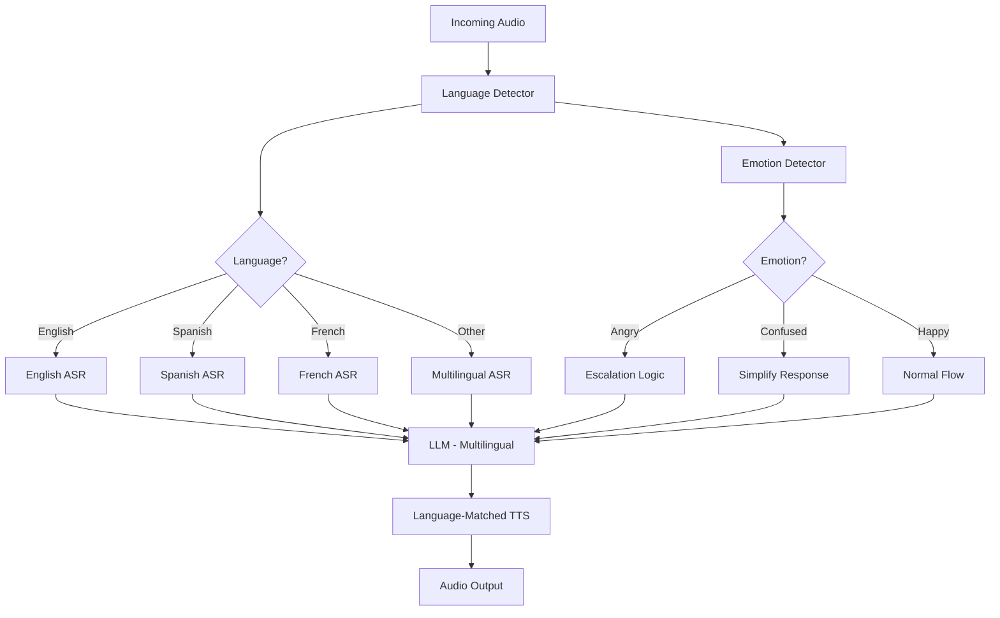
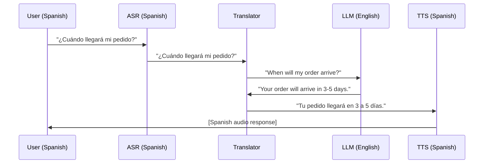
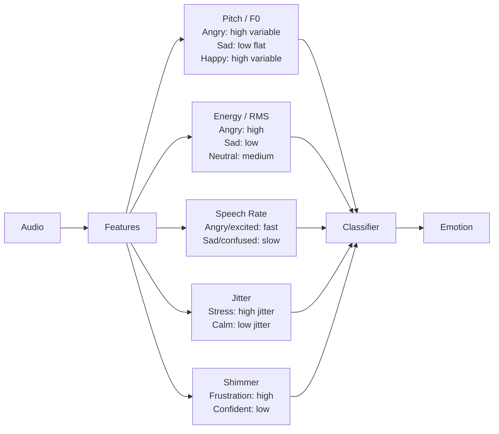

# Voice Agents Deep Dive  Part 14: Multi-Language and Emotion  Building Human-Like Voice Agents

---

**Series:** Building Voice Agents  A Developer's Deep Dive from Audio Fundamentals to Production
**Part:** 14 of 19 (Advanced Voice Features)
**Audience:** Developers with Python experience who want to build voice-powered AI agents from the ground up
**Reading time:** ~45 minutes

---

In Part 13, we built phone call agents  answering inbound calls, making outbound calls, handling DTMF, and integrating with Twilio's Media Streams for real-time audio. Our agents could talk on the phone. But they could only talk in one language, with no awareness of the human emotions flowing through the conversation.

Today we fix that. We'll build voice agents that detect what language someone is speaking and respond in kind, switch languages mid-conversation, and actually understand whether the person they're talking to is frustrated, confused, happy, or angry  and adapt accordingly.

By the end of this part, you'll have built an emotion-aware multilingual voice agent that feels genuinely human.

---

## Why Multi-Language Matters

The global voice AI market isn't English-first. A customer support agent deployed in Latin America will get calls in Spanish, Portuguese, and regional dialects. A healthcare voice bot in Switzerland might need German, French, Italian, and Romansh. A hotel booking agent in Southeast Asia could hear Thai, Malay, and Bahasa Indonesia in a single call.

> **The key insight**: Language detection isn't a nice-to-have. If your agent responds in English to someone who opened in Spanish, the call ends immediately. Language matching is table stakes for global deployment.

Here's what we're building today:



---

## Section 1: Language Detection from Audio

### The Whisper Language Detector

OpenAI Whisper has built-in language detection. It was trained on 680,000 hours of multilingual audio and can identify 99 languages from just a few seconds of speech.

```python
"""
language_detector.py  Detect spoken language from audio using Whisper.
"""
import numpy as np
import whisper
import time
from dataclasses import dataclass
from typing import Optional
import threading
import hashlib


@dataclass
class LanguageDetectionResult:
    language: str
    confidence: float
    all_probabilities: dict[str, float]
    detection_time_ms: float


class WhisperLanguageDetector:
    """
    Detect spoken language from audio using Whisper's built-in language
    identification. Uses the first 30 seconds (or less) of audio.
    """

    # Map Whisper language codes to BCP-47 tags
    LANGUAGE_MAP = {
        "en": "en-US",
        "es": "es-ES",
        "fr": "fr-FR",
        "de": "de-DE",
        "pt": "pt-BR",
        "it": "it-IT",
        "nl": "nl-NL",
        "ru": "ru-RU",
        "zh": "zh-CN",
        "ja": "ja-JP",
        "ko": "ko-KR",
        "ar": "ar-SA",
        "hi": "hi-IN",
        "tr": "tr-TR",
        "pl": "pl-PL",
        "th": "th-TH",
    }

    def __init__(self, model_size: str = "base"):
        """Load Whisper model. 'base' is fast enough for detection."""
        print(f"Loading Whisper {model_size} for language detection...")
        self.model = whisper.load_model(model_size)
        self._cache: dict[str, LanguageDetectionResult] = {}
        self._lock = threading.Lock()

    def detect(
        self,
        audio: np.ndarray,
        sample_rate: int = 16000,
        min_confidence: float = 0.5,
    ) -> LanguageDetectionResult:
        """
        Detect language from audio array.

        Args:
            audio: Audio as float32 numpy array, 16kHz mono
            sample_rate: Sample rate (must be 16000 for Whisper)
            min_confidence: Minimum confidence to trust detection

        Returns:
            LanguageDetectionResult with detected language and probabilities
        """
        # Cache based on audio hash (useful for repeated calls with same audio)
        audio_hash = hashlib.md5(audio.tobytes()).hexdigest()[:16]
        with self._lock:
            if audio_hash in self._cache:
                return self._cache[audio_hash]

        start = time.perf_counter()

        # Whisper expects float32, 16kHz, mono
        if sample_rate != 16000:
            import librosa
            audio = librosa.resample(audio, orig_sr=sample_rate, target_sr=16000)

        # Use first 30 seconds max (Whisper's context window)
        audio_segment = audio[: 30 * 16000]

        # Run language detection
        audio_padded = whisper.pad_or_trim(audio_segment)
        mel = whisper.log_mel_spectrogram(audio_padded).to(self.model.device)

        _, probs = self.model.detect_language(mel)

        elapsed_ms = (time.perf_counter() - start) * 1000

        # Get top language
        top_lang = max(probs, key=probs.get)
        confidence = probs[top_lang]

        # Fall back to English if confidence is too low
        if confidence < min_confidence:
            top_lang = "en"
            confidence = probs.get("en", 0.5)

        result = LanguageDetectionResult(
            language=self.LANGUAGE_MAP.get(top_lang, f"{top_lang}-XX"),
            confidence=confidence,
            all_probabilities={
                self.LANGUAGE_MAP.get(k, k): v
                for k, v in sorted(probs.items(), key=lambda x: -x[1])[:10]
            },
            detection_time_ms=elapsed_ms,
        )

        with self._lock:
            self._cache[audio_hash] = result

        return result

    def detect_from_file(self, audio_path: str) -> LanguageDetectionResult:
        """Detect language from an audio file."""
        import soundfile as sf
        audio, sr = sf.read(audio_path)
        if audio.ndim > 1:
            audio = audio.mean(axis=1)  # Convert to mono
        return self.detect(audio.astype(np.float32), sample_rate=sr)


# Demo
if __name__ == "__main__":
    import sounddevice as sd

    detector = WhisperLanguageDetector(model_size="base")

    print("Recording 5 seconds... Speak in any language!")
    audio = sd.rec(5 * 16000, samplerate=16000, channels=1, dtype="float32")
    sd.wait()
    audio = audio.flatten()

    result = detector.detect(audio)
    print(f"\nDetected language: {result.language}")
    print(f"Confidence: {result.confidence:.1%}")
    print(f"Detection time: {result.detection_time_ms:.0f}ms")
    print(f"\nTop languages:")
    for lang, prob in list(result.all_probabilities.items())[:5]:
        bar = "█" * int(prob * 30)
        print(f"  {lang}: {bar} {prob:.1%}")
```

### Fast First-Utterance Detection

For real-time voice agents, we can't wait for the full Whisper detection on every turn. The trick is to detect language from the very first utterance and cache it for the session:

```python
"""
session_language_manager.py  Manage language detection across a voice session.
"""
import asyncio
from dataclasses import dataclass, field
from typing import Optional
import numpy as np


@dataclass
class LanguageSession:
    session_id: str
    detected_language: Optional[str] = None
    detection_confidence: float = 0.0
    confirmed: bool = False
    turn_count: int = 0
    language_history: list[str] = field(default_factory=list)

    @property
    def is_language_known(self) -> bool:
        return self.detected_language is not None and self.detection_confidence > 0.7


class SessionLanguageManager:
    """
    Manages language detection across a voice session.
    Detects on first utterance, confirms on second, then locks in.
    """

    def __init__(self, detector: WhisperLanguageDetector, default_language: str = "en-US"):
        self.detector = detector
        self.default_language = default_language
        self.sessions: dict[str, LanguageSession] = {}

    def get_or_create_session(self, session_id: str) -> LanguageSession:
        if session_id not in self.sessions:
            self.sessions[session_id] = LanguageSession(session_id=session_id)
        return self.sessions[session_id]

    async def process_audio(
        self, session_id: str, audio: np.ndarray, sample_rate: int = 16000
    ) -> str:
        """
        Process audio for a session turn. Returns the detected/confirmed language.
        """
        session = self.get_or_create_session(session_id)
        session.turn_count += 1

        # Already confirmed  don't re-detect
        if session.confirmed:
            return session.detected_language

        # Run detection in thread pool to avoid blocking
        loop = asyncio.get_event_loop()
        result = await loop.run_in_executor(
            None, lambda: self.detector.detect(audio, sample_rate)
        )

        session.language_history.append(result.language)

        # Confirm after 2 consistent detections
        if len(session.language_history) >= 2:
            if session.language_history[-1] == session.language_history[-2]:
                session.detected_language = result.language
                session.detection_confidence = result.confidence
                session.confirmed = True
                print(f"[Session {session_id}] Language confirmed: {result.language}")
            else:
                # Inconsistent  use higher confidence
                session.detected_language = result.language
                session.detection_confidence = result.confidence
        else:
            session.detected_language = result.language
            session.detection_confidence = result.confidence

        return session.detected_language or self.default_language

    def force_language(self, session_id: str, language: str) -> None:
        """Allow agent to override detected language (user preference)."""
        session = self.get_or_create_session(session_id)
        session.detected_language = language
        session.confirmed = True
        print(f"[Session {session_id}] Language forced to: {language}")

    def clear_session(self, session_id: str) -> None:
        self.sessions.pop(session_id, None)
```

---

## Section 2: Multilingual ASR Comparison

Different ASR engines have different multilingual strengths. Here's how they compare:

| Engine | Languages | Auto-Detect | Streaming | Best For |
|--------|-----------|-------------|-----------|----------|
| Whisper large-v3 | 99 | Yes | Via faster-whisper | Local, accuracy |
| Deepgram Nova-2 | 36 | Via `detect_language` | Yes | Cloud, low latency |
| AssemblyAI Universal-2 | 99 | Yes | Yes | Accuracy + features |
| Google STT | 125+ | Yes | Yes | Wide language support |
| Azure Speech | 100+ | Yes | Yes | Enterprise, SSML |

```python
"""
multilingual_asr.py  Unified multilingual ASR interface.
"""
import asyncio
import httpx
from abc import ABC, abstractmethod
from dataclasses import dataclass
from typing import AsyncGenerator
import numpy as np


@dataclass
class ASRResult:
    text: str
    language: str
    confidence: float
    is_final: bool
    words: list[dict] = None  # word-level timestamps if available


class MultilingualASREngine(ABC):
    """Abstract base for multilingual ASR engines."""

    @abstractmethod
    async def transcribe(
        self, audio: np.ndarray, language: str, sample_rate: int = 16000
    ) -> ASRResult:
        """Transcribe audio in a given language."""
        pass

    @abstractmethod
    async def stream_transcribe(
        self, audio_chunks: AsyncGenerator[np.ndarray, None], language: str
    ) -> AsyncGenerator[ASRResult, None]:
        """Stream transcription for real-time audio."""
        pass


class DeepgramMultilingualASR(MultilingualASREngine):
    """Deepgram Nova-2 multilingual ASR."""

    # Map BCP-47 to Deepgram language codes
    LANGUAGE_MAP = {
        "en-US": "en-US",
        "es-ES": "es",
        "fr-FR": "fr",
        "de-DE": "de",
        "pt-BR": "pt-BR",
        "it-IT": "it",
        "nl-NL": "nl",
        "ru-RU": "ru",
        "zh-CN": "zh-CN",
        "ja-JP": "ja",
        "ko-KR": "ko",
        "hi-IN": "hi",
        "ar-SA": "ar",
        "tr-TR": "tr",
        "pl-PL": "pl",
    }

    def __init__(self, api_key: str):
        self.api_key = api_key
        self.base_url = "https://api.deepgram.com/v1"

    async def transcribe(
        self, audio: np.ndarray, language: str, sample_rate: int = 16000
    ) -> ASRResult:
        """Transcribe audio via Deepgram REST API."""
        dg_lang = self.LANGUAGE_MAP.get(language, language.split("-")[0])

        # Convert float32 to int16 PCM
        audio_int16 = (audio * 32767).astype(np.int16)
        audio_bytes = audio_int16.tobytes()

        params = {
            "model": "nova-2",
            "language": dg_lang,
            "smart_format": "true",
            "punctuate": "true",
            "diarize": "false",
        }

        headers = {
            "Authorization": f"Token {self.api_key}",
            "Content-Type": "audio/raw;encoding=linear16;sample_rate=16000;channels=1",
        }

        async with httpx.AsyncClient(timeout=30) as client:
            response = await client.post(
                f"{self.base_url}/listen",
                params=params,
                headers=headers,
                content=audio_bytes,
            )
            response.raise_for_status()
            data = response.json()

        transcript = data["results"]["channels"][0]["alternatives"][0]
        return ASRResult(
            text=transcript["transcript"],
            language=language,
            confidence=transcript.get("confidence", 0.9),
            is_final=True,
            words=transcript.get("words"),
        )

    async def stream_transcribe(
        self, audio_chunks: AsyncGenerator[np.ndarray, None], language: str
    ) -> AsyncGenerator[ASRResult, None]:
        """Stream transcription via Deepgram WebSocket."""
        import websockets
        import json

        dg_lang = self.LANGUAGE_MAP.get(language, language.split("-")[0])
        ws_url = (
            f"wss://api.deepgram.com/v1/listen"
            f"?model=nova-2&language={dg_lang}&smart_format=true"
            f"&interim_results=true&endpointing=300"
        )

        async with websockets.connect(
            ws_url, extra_headers={"Authorization": f"Token {self.api_key}"}
        ) as ws:
            async def send_audio():
                async for chunk in audio_chunks:
                    audio_int16 = (chunk * 32767).astype(np.int16)
                    await ws.send(audio_int16.tobytes())
                # Send close message
                await ws.send(json.dumps({"type": "CloseStream"}))

            # Run sender concurrently
            send_task = asyncio.create_task(send_audio())

            try:
                async for message in ws:
                    data = json.loads(message)
                    if data.get("type") == "Results":
                        channel = data["channel"]["alternatives"][0]
                        if channel["transcript"]:
                            yield ASRResult(
                                text=channel["transcript"],
                                language=language,
                                confidence=channel.get("confidence", 0.9),
                                is_final=data.get("is_final", False),
                            )
            finally:
                send_task.cancel()


class WhisperMultilingualASR(MultilingualASREngine):
    """Local Whisper multilingual ASR (via faster-whisper)."""

    def __init__(self, model_size: str = "medium"):
        from faster_whisper import WhisperModel
        print(f"Loading faster-whisper {model_size}...")
        self.model = WhisperModel(model_size, device="cpu", compute_type="int8")

    async def transcribe(
        self, audio: np.ndarray, language: str, sample_rate: int = 16000
    ) -> ASRResult:
        """Transcribe audio with Whisper (runs in thread pool)."""
        lang_code = language.split("-")[0]  # "en-US" → "en"

        loop = asyncio.get_event_loop()

        def _transcribe():
            segments, info = self.model.transcribe(
                audio,
                language=lang_code,
                beam_size=5,
                vad_filter=True,
            )
            text = " ".join(seg.text.strip() for seg in segments)
            return text, info.language_probability

        text, confidence = await loop.run_in_executor(None, _transcribe)

        return ASRResult(
            text=text,
            language=language,
            confidence=confidence,
            is_final=True,
        )

    async def stream_transcribe(
        self, audio_chunks: AsyncGenerator[np.ndarray, None], language: str
    ) -> AsyncGenerator[ASRResult, None]:
        """Buffer chunks and transcribe in sliding windows."""
        buffer = []
        buffer_duration = 0
        chunk_duration_s = 2.0  # Transcribe every 2 seconds
        sample_rate = 16000

        async for chunk in audio_chunks:
            buffer.append(chunk)
            buffer_duration += len(chunk) / sample_rate

            if buffer_duration >= chunk_duration_s:
                audio_segment = np.concatenate(buffer)
                result = await self.transcribe(audio_segment, language, sample_rate)
                if result.text.strip():
                    yield result
                # Keep last 0.5s for overlap
                overlap_samples = int(0.5 * sample_rate)
                buffer = [audio_segment[-overlap_samples:]]
                buffer_duration = overlap_samples / sample_rate
```

---

## Section 3: The Multilingual Agent

Now let's build an agent that detects language on the first turn and routes to the right ASR/TTS models:

```python
"""
multilingual_agent.py  Voice agent that detects and responds in any language.
"""
import asyncio
from dataclasses import dataclass, field
from typing import Optional
import numpy as np


@dataclass
class MultilingualConfig:
    supported_languages: list[str] = field(default_factory=lambda: [
        "en-US", "es-ES", "fr-FR", "de-DE", "pt-BR", "it-IT"
    ])
    default_language: str = "en-US"
    detection_model: str = "base"  # Whisper model for detection
    asr_backend: str = "deepgram"  # "deepgram" or "whisper"
    tts_backend: str = "openai"  # "openai", "elevenlabs", "xtts"
    allow_code_switching: bool = True  # Detect language per-turn


class MultilingualAgent:
    """
    Voice agent that automatically detects and responds in the user's language.
    Supports language switching mid-conversation.
    """

    # System prompts per language
    SYSTEM_PROMPTS = {
        "en-US": "You are a helpful voice assistant. Keep responses brief and conversational.",
        "es-ES": "Eres un asistente de voz útil. Mantén las respuestas breves y conversacionales.",
        "fr-FR": "Vous êtes un assistant vocal utile. Gardez les réponses brèves et conversationnelles.",
        "de-DE": "Sie sind ein hilfreicher Sprachassistent. Halten Sie Antworten kurz und gesprächig.",
        "pt-BR": "Você é um assistente de voz útil. Mantenha as respostas breves e conversacionais.",
        "it-IT": "Sei un assistente vocale utile. Mantieni le risposte brevi e colloquiali.",
    }

    def __init__(
        self,
        config: MultilingualConfig,
        asr: MultilingualASREngine,
        language_detector: WhisperLanguageDetector,
        session_manager: SessionLanguageManager,
        openai_api_key: str,
        tts_api_key: str,
    ):
        self.config = config
        self.asr = asr
        self.language_detector = language_detector
        self.session_manager = session_manager
        self.openai_api_key = openai_api_key
        self.tts_api_key = tts_api_key
        self.conversation_history: dict[str, list[dict]] = {}

    async def process_turn(
        self,
        session_id: str,
        audio: np.ndarray,
        sample_rate: int = 16000,
    ) -> tuple[str, bytes]:
        """
        Process one turn of conversation.

        Returns:
            (response_text, audio_bytes) for the agent's response
        """
        # Step 1: Detect language
        language = await self.session_manager.process_audio(
            session_id, audio, sample_rate
        )
        print(f"[{session_id}] Language: {language}")

        # Step 2: Transcribe in detected language
        asr_result = await self.asr.transcribe(audio, language, sample_rate)
        user_text = asr_result.text.strip()
        print(f"[{session_id}] User ({language}): {user_text}")

        if not user_text:
            # Handle silence
            silence_responses = {
                "en-US": "I didn't catch that. Could you repeat?",
                "es-ES": "No te escuché. ¿Puedes repetir?",
                "fr-FR": "Je n'ai pas entendu. Pouvez-vous répéter ?",
                "de-DE": "Ich habe das nicht gehört. Können Sie wiederholen?",
                "pt-BR": "Não entendi. Pode repetir?",
                "it-IT": "Non ho sentito. Puoi ripetere?",
            }
            response_text = silence_responses.get(language, silence_responses["en-US"])
            audio_bytes = await self._synthesize(response_text, language)
            return response_text, audio_bytes

        # Step 3: Check for language switch request
        language_switch = self._detect_language_switch_request(user_text, language)
        if language_switch:
            self.session_manager.force_language(session_id, language_switch)
            language = language_switch

        # Step 4: Get LLM response
        response_text = await self._get_llm_response(
            session_id, user_text, language
        )
        print(f"[{session_id}] Agent ({language}): {response_text}")

        # Step 5: Synthesize response in same language
        audio_bytes = await self._synthesize(response_text, language)

        return response_text, audio_bytes

    def _detect_language_switch_request(
        self, text: str, current_language: str
    ) -> Optional[str]:
        """Detect explicit language switch requests."""
        text_lower = text.lower()

        switch_phrases = {
            "en-US": ["speak english", "in english", "english please"],
            "es-ES": ["habla español", "en español", "español por favor"],
            "fr-FR": ["parle français", "en français", "français s'il vous plaît"],
            "de-DE": ["sprich deutsch", "auf deutsch", "deutsch bitte"],
            "pt-BR": ["fale português", "em português", "português por favor"],
            "it-IT": ["parla italiano", "in italiano", "italiano per favore"],
        }

        for lang, phrases in switch_phrases.items():
            if lang != current_language:
                for phrase in phrases:
                    if phrase in text_lower:
                        print(f"Language switch requested: {current_language} → {lang}")
                        return lang

        return None

    async def _get_llm_response(
        self,
        session_id: str,
        user_text: str,
        language: str,
    ) -> str:
        """Get response from LLM in the detected language."""
        import httpx

        if session_id not in self.conversation_history:
            self.conversation_history[session_id] = []

        history = self.conversation_history[session_id]
        system_prompt = self.SYSTEM_PROMPTS.get(language, self.SYSTEM_PROMPTS["en-US"])

        # Add language instruction to system prompt
        lang_instruction = f"\nIMPORTANT: Always respond in {language} language only."
        system_prompt += lang_instruction

        messages = [{"role": "system", "content": system_prompt}]
        messages.extend(history[-10:])  # Last 5 turns
        messages.append({"role": "user", "content": user_text})

        async with httpx.AsyncClient(timeout=30) as client:
            response = await client.post(
                "https://api.openai.com/v1/chat/completions",
                headers={"Authorization": f"Bearer {self.openai_api_key}"},
                json={
                    "model": "gpt-4o-mini",
                    "messages": messages,
                    "max_tokens": 150,  # Keep voice responses brief
                    "temperature": 0.7,
                },
            )
            response.raise_for_status()
            data = response.json()

        response_text = data["choices"][0]["message"]["content"].strip()

        # Update history
        history.append({"role": "user", "content": user_text})
        history.append({"role": "assistant", "content": response_text})

        return response_text

    async def _synthesize(self, text: str, language: str) -> bytes:
        """Synthesize speech in the target language."""
        import httpx

        # Map language to OpenAI voice (OpenAI TTS is multilingual)
        # All voices support multilingual output
        voice_map = {
            "en-US": "alloy",
            "es-ES": "nova",
            "fr-FR": "shimmer",
            "de-DE": "echo",
            "pt-BR": "nova",
            "it-IT": "shimmer",
        }
        voice = voice_map.get(language, "alloy")

        async with httpx.AsyncClient(timeout=30) as client:
            response = await client.post(
                "https://api.openai.com/v1/audio/speech",
                headers={"Authorization": f"Bearer {self.tts_api_key}"},
                json={
                    "model": "tts-1",
                    "input": text,
                    "voice": voice,
                    "response_format": "mp3",
                },
            )
            response.raise_for_status()
            return response.content
```

---

## Section 4: Multilingual TTS  Choosing the Right Engine

| TTS Engine | Languages | Voice Cloning | Streaming | Quality | Notes |
|------------|-----------|---------------|-----------|---------|-------|
| OpenAI TTS | 50+ (auto) | No | Yes | High | All 6 voices multilingual |
| ElevenLabs Multilingual v2 | 29 | Yes | Yes | Very High | Best quality |
| XTTS v2 | 75+ | Yes | Yes | High | Open-source |
| Azure Neural TTS | 400+ voices | Custom Neural Voice | Yes | High | Most languages |
| Google Cloud TTS | 380+ voices | No (WaveNet) | Yes | High | Widest coverage |

```python
"""
multilingual_tts_router.py  Route TTS requests to best engine per language.
"""
import asyncio
from abc import ABC, abstractmethod
import httpx


class TTSEngine(ABC):
    @abstractmethod
    async def synthesize(self, text: str, language: str, voice_id: Optional[str] = None) -> bytes:
        pass


class OpenAITTSEngine(TTSEngine):
    """OpenAI TTS  automatically multilingual."""

    VOICE_BY_LANGUAGE = {
        "en-US": "alloy", "en-GB": "echo",
        "es-ES": "nova", "es-MX": "nova",
        "fr-FR": "shimmer", "de-DE": "echo",
        "pt-BR": "nova", "it-IT": "shimmer",
        "zh-CN": "alloy", "ja-JP": "alloy",
        "ko-KR": "nova", "ar-SA": "echo",
    }

    def __init__(self, api_key: str):
        self.api_key = api_key

    async def synthesize(self, text: str, language: str, voice_id: Optional[str] = None) -> bytes:
        voice = voice_id or self.VOICE_BY_LANGUAGE.get(language, "alloy")
        async with httpx.AsyncClient(timeout=30) as client:
            resp = await client.post(
                "https://api.openai.com/v1/audio/speech",
                headers={"Authorization": f"Bearer {self.api_key}"},
                json={"model": "tts-1", "input": text, "voice": voice, "response_format": "mp3"},
            )
            resp.raise_for_status()
            return resp.content


class ElevenLabsMultilingualTTS(TTSEngine):
    """ElevenLabs Multilingual v2  highest quality."""

    def __init__(self, api_key: str, default_voice_id: str = "21m00Tcm4TlvDq8ikWAM"):
        self.api_key = api_key
        self.default_voice_id = default_voice_id

    async def synthesize(self, text: str, language: str, voice_id: Optional[str] = None) -> bytes:
        vid = voice_id or self.default_voice_id
        async with httpx.AsyncClient(timeout=30) as client:
            resp = await client.post(
                f"https://api.elevenlabs.io/v1/text-to-speech/{vid}",
                headers={"xi-api-key": self.api_key},
                json={
                    "text": text,
                    "model_id": "eleven_multilingual_v2",
                    "voice_settings": {"stability": 0.5, "similarity_boost": 0.75},
                },
            )
            resp.raise_for_status()
            return resp.content


class MultilingualTTSRouter:
    """Route TTS to best engine based on language and quality requirements."""

    def __init__(
        self,
        openai_engine: OpenAITTSEngine,
        elevenlabs_engine: Optional[ElevenLabsMultilingualTTS] = None,
        prefer_quality: bool = False,
    ):
        self.openai = openai_engine
        self.elevenlabs = elevenlabs_engine
        self.prefer_quality = prefer_quality

        # Languages where ElevenLabs multilingual v2 excels
        self.elevenlabs_preferred = {
            "en-US", "es-ES", "fr-FR", "de-DE", "pt-BR", "it-IT",
            "pl-PL", "hi-IN", "ar-SA", "nl-NL", "tr-TR",
        }

    async def synthesize(self, text: str, language: str) -> bytes:
        """Route to best TTS engine for the language."""
        if (
            self.prefer_quality
            and self.elevenlabs
            and language in self.elevenlabs_preferred
        ):
            try:
                return await self.elevenlabs.synthesize(text, language)
            except Exception as e:
                print(f"ElevenLabs failed ({e}), falling back to OpenAI")

        return await self.openai.synthesize(text, language)
```

---

## Section 5: Real-Time Translation Pipeline

Sometimes you need an agent that translates between languages  like a customer speaking Spanish to an English-speaking support team:



```python
"""
translation_pipeline.py  Real-time speech-to-speech translation.
"""
import asyncio
import httpx
from dataclasses import dataclass


@dataclass
class TranslationResult:
    original_text: str
    translated_text: str
    source_language: str
    target_language: str
    translation_time_ms: float


class RealTimeTranslator:
    """Translate text between languages using GPT-4o-mini (fast + cheap)."""

    def __init__(self, api_key: str):
        self.api_key = api_key
        # Cache for common phrases
        self._cache: dict[tuple, str] = {}

    async def translate(
        self,
        text: str,
        source_language: str,
        target_language: str,
        preserve_tone: bool = True,
    ) -> TranslationResult:
        """Translate text, preserving conversational tone and emotion."""
        import time

        # Check cache
        cache_key = (text, source_language, target_language)
        if cache_key in self._cache:
            return TranslationResult(
                original_text=text,
                translated_text=self._cache[cache_key],
                source_language=source_language,
                target_language=target_language,
                translation_time_ms=0.0,
            )

        start = time.perf_counter()

        tone_instruction = (
            "Preserve the speaker's tone, emotion, and formality level. "
            "If they sound frustrated, keep that in the translation. "
            "Keep it natural and spoken, not written."
            if preserve_tone
            else ""
        )

        prompt = (
            f"Translate the following from {source_language} to {target_language}. "
            f"{tone_instruction} "
            f"Return ONLY the translation, nothing else.\n\n"
            f"Text: {text}"
        )

        async with httpx.AsyncClient(timeout=10) as client:
            resp = await client.post(
                "https://api.openai.com/v1/chat/completions",
                headers={"Authorization": f"Bearer {self.api_key}"},
                json={
                    "model": "gpt-4o-mini",
                    "messages": [{"role": "user", "content": prompt}],
                    "max_tokens": 200,
                    "temperature": 0.3,
                },
            )
            resp.raise_for_status()
            data = resp.json()

        translated = data["choices"][0]["message"]["content"].strip()
        elapsed_ms = (time.perf_counter() - start) * 1000

        # Cache the result
        self._cache[cache_key] = translated

        return TranslationResult(
            original_text=text,
            translated_text=translated,
            source_language=source_language,
            target_language=target_language,
            translation_time_ms=elapsed_ms,
        )


class SpeechToSpeechTranslationAgent:
    """
    Full speech-to-speech translation agent.
    User speaks in their language → agent responds in their language
    → internal processing in a different language.
    """

    def __init__(
        self,
        asr: MultilingualASREngine,
        translator: RealTimeTranslator,
        llm_language: str,  # Language the LLM thinks in (usually English)
        tts_router: MultilingualTTSRouter,
        openai_api_key: str,
    ):
        self.asr = asr
        self.translator = translator
        self.llm_language = llm_language
        self.tts_router = tts_router
        self.openai_api_key = openai_api_key
        self.conversation_history: list[dict] = []

    async def process_turn(
        self,
        audio: np.ndarray,
        user_language: str,
        sample_rate: int = 16000,
    ) -> tuple[str, bytes]:
        """Process one turn with translation."""

        # 1. Transcribe in user's language
        asr_result = await self.asr.transcribe(audio, user_language, sample_rate)
        user_text = asr_result.text

        # 2. Translate to LLM language if different
        if user_language != self.llm_language:
            translation = await self.translator.translate(
                user_text, user_language, self.llm_language
            )
            llm_input = translation.translated_text
        else:
            llm_input = user_text

        # 3. Get LLM response in LLM language
        llm_response = await self._call_llm(llm_input)

        # 4. Translate response back to user's language
        if user_language != self.llm_language:
            response_translation = await self.translator.translate(
                llm_response, self.llm_language, user_language
            )
            response_text = response_translation.translated_text
        else:
            response_text = llm_response

        # 5. Synthesize in user's language
        audio_bytes = await self.tts_router.synthesize(response_text, user_language)

        return response_text, audio_bytes

    async def _call_llm(self, text: str) -> str:
        """Call LLM in LLM language."""
        self.conversation_history.append({"role": "user", "content": text})

        async with httpx.AsyncClient(timeout=30) as client:
            resp = await client.post(
                "https://api.openai.com/v1/chat/completions",
                headers={"Authorization": f"Bearer {self.openai_api_key}"},
                json={
                    "model": "gpt-4o-mini",
                    "messages": [
                        {"role": "system", "content": "You are a helpful voice assistant. Keep responses brief."},
                        *self.conversation_history[-10:],
                    ],
                    "max_tokens": 150,
                },
            )
            resp.raise_for_status()
            data = resp.json()

        response = data["choices"][0]["message"]["content"].strip()
        self.conversation_history.append({"role": "assistant", "content": response})
        return response
```

---

## Section 6: Emotion Detection from Voice

Now the exciting part  detecting how someone feels from their voice, not just what they say.

### The Acoustic Features of Emotion

Human emotion manifests in voice through measurable acoustic properties:



```python
"""
emotion_features.py  Extract acoustic features for emotion detection.
"""
import numpy as np
import librosa
from dataclasses import dataclass
from typing import Optional


@dataclass
class AcousticFeatures:
    """Acoustic features extracted from speech audio."""
    # Pitch (fundamental frequency)
    pitch_mean: float          # Average pitch in Hz
    pitch_std: float           # Pitch variability
    pitch_range: float         # Max - Min pitch
    pitch_slope: float         # Overall trend (rising/falling)

    # Energy
    energy_mean: float         # Average RMS energy
    energy_std: float          # Energy variability
    energy_max: float          # Peak energy

    # Speech rate
    speech_rate: float         # Syllables per second (approximate)
    pause_ratio: float         # Proportion of signal that is silence

    # Voice quality
    jitter: float              # Pitch perturbation (cycle-to-cycle variation)
    shimmer: float             # Amplitude perturbation
    hnr: float                 # Harmonics-to-Noise Ratio

    # Spectral features
    spectral_centroid_mean: float  # Brightness of sound
    mfcc_features: np.ndarray      # 13 MFCCs


class AcousticFeatureExtractor:
    """Extract emotion-relevant acoustic features from speech."""

    def __init__(self, sample_rate: int = 16000):
        self.sample_rate = sample_rate

    def extract(self, audio: np.ndarray) -> AcousticFeatures:
        """Extract all acoustic features from audio array."""
        sr = self.sample_rate

        # --- Pitch (F0) extraction ---
        # librosa's yin algorithm for fundamental frequency
        f0, voiced_flag, _ = librosa.pyin(
            audio,
            fmin=librosa.note_to_hz("C2"),  # ~65 Hz
            fmax=librosa.note_to_hz("C7"),  # ~2093 Hz
            sr=sr,
        )

        # Only use voiced frames
        voiced_f0 = f0[voiced_flag & ~np.isnan(f0)]
        if len(voiced_f0) == 0:
            voiced_f0 = np.array([0.0])

        pitch_mean = float(np.mean(voiced_f0))
        pitch_std = float(np.std(voiced_f0))
        pitch_range = float(np.ptp(voiced_f0)) if len(voiced_f0) > 1 else 0.0

        # Pitch slope: linear trend
        if len(voiced_f0) > 1:
            x = np.arange(len(voiced_f0))
            pitch_slope = float(np.polyfit(x, voiced_f0, 1)[0])
        else:
            pitch_slope = 0.0

        # --- Energy (RMS) ---
        rms = librosa.feature.rms(y=audio, frame_length=512, hop_length=256)[0]
        energy_mean = float(np.mean(rms))
        energy_std = float(np.std(rms))
        energy_max = float(np.max(rms))

        # --- Speech rate (approximate via zero-crossing) ---
        # Count syllable nuclei via energy peaks
        zcr = librosa.feature.zero_crossing_rate(audio)[0]
        speech_rate = float(np.mean(zcr) * sr / 2)  # Approximate

        # Pause ratio (proportion of low-energy frames)
        silence_threshold = 0.01
        pause_ratio = float(np.mean(rms < silence_threshold))

        # --- Jitter and Shimmer (manual calculation) ---
        # Jitter: average absolute F0 difference between consecutive periods
        if len(voiced_f0) > 1:
            period_diffs = np.abs(np.diff(1.0 / (voiced_f0 + 1e-8)))
            jitter = float(np.mean(period_diffs) / np.mean(1.0 / (voiced_f0 + 1e-8)))
        else:
            jitter = 0.0

        # Shimmer: average absolute amplitude difference
        if len(rms) > 1:
            amp_diffs = np.abs(np.diff(rms))
            shimmer = float(np.mean(amp_diffs) / (np.mean(rms) + 1e-8))
        else:
            shimmer = 0.0

        # HNR: Harmonics-to-Noise Ratio (approximation)
        # Higher HNR = cleaner voiced speech
        if energy_mean > 0.01:
            hnr = float(20 * np.log10(energy_mean / (energy_std + 1e-8)))
        else:
            hnr = 0.0

        # --- Spectral features ---
        spectral_centroid = librosa.feature.spectral_centroid(y=audio, sr=sr)[0]
        spectral_centroid_mean = float(np.mean(spectral_centroid))

        # --- MFCCs ---
        mfccs = librosa.feature.mfcc(y=audio, sr=sr, n_mfcc=13)
        mfcc_features = np.mean(mfccs, axis=1)

        return AcousticFeatures(
            pitch_mean=pitch_mean,
            pitch_std=pitch_std,
            pitch_range=pitch_range,
            pitch_slope=pitch_slope,
            energy_mean=energy_mean,
            energy_std=energy_std,
            energy_max=energy_max,
            speech_rate=speech_rate,
            pause_ratio=pause_ratio,
            jitter=jitter,
            shimmer=shimmer,
            hnr=hnr,
            spectral_centroid_mean=spectral_centroid_mean,
            mfcc_features=mfcc_features,
        )
```

---

## Section 7: The Emotion Classifier

```python
"""
emotion_detector.py  Classify emotion from acoustic features.
"""
import numpy as np
from dataclasses import dataclass
from enum import Enum
from typing import Optional
import time


class Emotion(Enum):
    ANGRY = "angry"
    FRUSTRATED = "frustrated"
    SAD = "sad"
    HAPPY = "happy"
    EXCITED = "excited"
    CONFUSED = "confused"
    NEUTRAL = "neutral"
    FEARFUL = "fearful"


@dataclass
class EmotionResult:
    primary_emotion: Emotion
    confidence: float
    all_scores: dict[Emotion, float]
    valence: float       # -1 (negative) to +1 (positive)
    arousal: float       # 0 (calm) to 1 (activated)
    detection_time_ms: float


class RuleBasedEmotionDetector:
    """
    Rule-based emotion detection from acoustic features.
    Works without training data. Use this as a baseline before
    training a neural model.
    """

    def detect(self, features: AcousticFeatures) -> EmotionResult:
        """Classify emotion from acoustic features using heuristic rules."""
        start = time.perf_counter()
        scores = {emotion: 0.0 for emotion in Emotion}

        # Normalize features to [0, 1] range (approximate norms)
        pitch_norm = min(features.pitch_mean / 300.0, 1.0)       # 300 Hz = high
        pitch_var_norm = min(features.pitch_std / 100.0, 1.0)    # High variability
        energy_norm = min(features.energy_mean / 0.1, 1.0)        # High energy
        speech_rate_norm = min(features.speech_rate / 0.15, 1.0)  # Fast speech
        jitter_norm = min(features.jitter / 0.05, 1.0)            # High jitter = stress

        # ANGRY: high pitch, high energy, high speech rate, high jitter
        scores[Emotion.ANGRY] = (
            0.3 * pitch_norm
            + 0.3 * energy_norm
            + 0.2 * speech_rate_norm
            + 0.2 * jitter_norm
        )

        # FRUSTRATED: medium-high energy, high jitter, low speech rate
        scores[Emotion.FRUSTRATED] = (
            0.2 * pitch_norm
            + 0.3 * energy_norm
            + 0.1 * (1 - speech_rate_norm)  # Slower (exasperated)
            + 0.4 * jitter_norm
        )

        # HAPPY: high pitch, high variability, medium-high energy, fast rate
        scores[Emotion.HAPPY] = (
            0.3 * pitch_norm
            + 0.3 * pitch_var_norm
            + 0.2 * energy_norm
            + 0.2 * speech_rate_norm
        )

        # EXCITED: very high energy, very fast speech, high pitch variability
        scores[Emotion.EXCITED] = (
            0.2 * pitch_var_norm
            + 0.4 * energy_norm
            + 0.4 * speech_rate_norm
        )

        # SAD: low pitch, low energy, slow speech, low variability
        scores[Emotion.SAD] = (
            0.3 * (1 - pitch_norm)
            + 0.3 * (1 - energy_norm)
            + 0.2 * (1 - speech_rate_norm)
            + 0.2 * (1 - pitch_var_norm)
        )

        # CONFUSED: rising pitch (questions), slow speech, low energy
        rising_pitch = max(0.0, features.pitch_slope / 50.0)
        scores[Emotion.CONFUSED] = (
            0.4 * min(rising_pitch, 1.0)
            + 0.3 * (1 - speech_rate_norm)
            + 0.3 * (1 - energy_norm)
        )

        # NEUTRAL: everything medium
        deviation = (
            abs(pitch_norm - 0.5)
            + abs(energy_norm - 0.5)
            + abs(speech_rate_norm - 0.5)
        ) / 3.0
        scores[Emotion.NEUTRAL] = 1.0 - deviation

        # Normalize to sum to 1.0
        total = sum(scores.values())
        if total > 0:
            scores = {e: v / total for e, v in scores.items()}

        # Find primary emotion
        primary = max(scores, key=scores.get)
        confidence = scores[primary]

        # Compute valence and arousal
        valence = (
            scores[Emotion.HAPPY] * 1.0
            + scores[Emotion.EXCITED] * 0.8
            + scores[Emotion.NEUTRAL] * 0.0
            + scores[Emotion.CONFUSED] * -0.3
            + scores[Emotion.FRUSTRATED] * -0.7
            + scores[Emotion.SAD] * -0.8
            + scores[Emotion.ANGRY] * -1.0
        )

        arousal = (
            scores[Emotion.ANGRY] * 1.0
            + scores[Emotion.EXCITED] * 0.9
            + scores[Emotion.HAPPY] * 0.6
            + scores[Emotion.FRUSTRATED] * 0.5
            + scores[Emotion.CONFUSED] * 0.3
            + scores[Emotion.NEUTRAL] * 0.2
            + scores[Emotion.SAD] * 0.1
        )

        elapsed_ms = (time.perf_counter() - start) * 1000

        return EmotionResult(
            primary_emotion=primary,
            confidence=confidence,
            all_scores=scores,
            valence=valence,
            arousal=arousal,
            detection_time_ms=elapsed_ms,
        )


class NeuralEmotionDetector:
    """
    Neural emotion detector using SpeechBrain's pre-trained model.
    More accurate than rule-based, requires ~200MB model download.
    """

    def __init__(self):
        from speechbrain.pretrained import EncoderClassifier
        self.classifier = EncoderClassifier.from_hparams(
            source="speechbrain/emotion-recognition-wav2vec2-IEMOCAP",
            savedir="/tmp/speechbrain_emotion",
        )

    def detect_from_file(self, audio_path: str) -> EmotionResult:
        """Detect emotion from an audio file."""
        import torch
        import torchaudio
        import time

        start = time.perf_counter()
        out_prob, score, index, text_lab = self.classifier.classify_file(audio_path)

        # SpeechBrain IEMOCAP model outputs: ang, hap, neu, sad
        label_map = {
            "ang": Emotion.ANGRY,
            "hap": Emotion.HAPPY,
            "neu": Emotion.NEUTRAL,
            "sad": Emotion.SAD,
        }

        probs = out_prob[0].numpy()
        labels = ["ang", "hap", "neu", "sad"]

        scores = {}
        for label, prob in zip(labels, probs):
            emotion = label_map.get(label, Emotion.NEUTRAL)
            scores[emotion] = float(prob)

        primary = max(scores, key=scores.get)
        confidence = scores[primary]

        elapsed_ms = (time.perf_counter() - start) * 1000

        return EmotionResult(
            primary_emotion=primary,
            confidence=confidence,
            all_scores=scores,
            valence=scores.get(Emotion.HAPPY, 0) - scores.get(Emotion.ANGRY, 0) - scores.get(Emotion.SAD, 0),
            arousal=scores.get(Emotion.ANGRY, 0) + scores.get(Emotion.HAPPY, 0) * 0.6,
            detection_time_ms=elapsed_ms,
        )
```

---

## Section 8: Emotion Tracking Across the Conversation

Detecting a single emotion is useful. Tracking emotion trends over the whole conversation is powerful  it lets the agent notice when things are getting worse:

```python
"""
emotion_tracker.py  Track emotion trends across conversation turns.
"""
from collections import deque
from dataclasses import dataclass, field
import numpy as np
from typing import Optional


@dataclass
class EmotionTrend:
    current_emotion: Emotion
    average_valence: float      # Rolling average
    average_arousal: float
    trend_direction: str        # "improving", "worsening", "stable"
    consecutive_negative: int   # How many turns of negative emotion
    escalation_score: float     # 0-1, how urgently to escalate


class EmotionTracker:
    """
    Track emotional state across conversation turns.
    Detects escalating frustration and triggers interventions.
    """

    def __init__(self, window_size: int = 5, escalation_threshold: float = 0.7):
        self.window_size = window_size
        self.escalation_threshold = escalation_threshold
        self.emotion_history: deque[EmotionResult] = deque(maxlen=window_size)
        self.turn_count = 0

    def update(self, emotion: EmotionResult) -> EmotionTrend:
        """Update tracker with new emotion detection result."""
        self.emotion_history.append(emotion)
        self.turn_count += 1

        if not self.emotion_history:
            return EmotionTrend(
                current_emotion=Emotion.NEUTRAL,
                average_valence=0.0,
                average_arousal=0.3,
                trend_direction="stable",
                consecutive_negative=0,
                escalation_score=0.0,
            )

        # Rolling averages
        valences = [e.valence for e in self.emotion_history]
        arousals = [e.arousal for e in self.emotion_history]
        avg_valence = float(np.mean(valences))
        avg_arousal = float(np.mean(arousals))

        # Trend direction
        if len(valences) >= 3:
            recent_avg = np.mean(valences[-2:])
            earlier_avg = np.mean(valences[:-2])
            if recent_avg > earlier_avg + 0.1:
                trend = "improving"
            elif recent_avg < earlier_avg - 0.1:
                trend = "worsening"
            else:
                trend = "stable"
        else:
            trend = "stable"

        # Count consecutive negative emotions
        consecutive_neg = 0
        for e in reversed(list(self.emotion_history)):
            if e.valence < -0.3:
                consecutive_neg += 1
            else:
                break

        # Escalation score: combination of current negativity and trend
        escalation_score = max(0.0, min(1.0,
            -avg_valence * 0.4
            + avg_arousal * 0.3
            + (consecutive_neg / self.window_size) * 0.3
        ))

        return EmotionTrend(
            current_emotion=emotion.primary_emotion,
            average_valence=avg_valence,
            average_arousal=avg_arousal,
            trend_direction=trend,
            consecutive_negative=consecutive_neg,
            escalation_score=escalation_score,
        )

    @property
    def should_escalate(self) -> bool:
        """Return True if the situation warrants escalating to a human."""
        if not self.emotion_history:
            return False
        trend = self.update(self.emotion_history[-1])
        return trend.escalation_score >= self.escalation_threshold

    def reset(self) -> None:
        """Reset tracker for new conversation."""
        self.emotion_history.clear()
        self.turn_count = 0
```

---

## Section 9: Sentiment-Aware Responses

Now we wire emotion detection into the agent's response generation:

```python
"""
sentiment_aware_agent.py  Voice agent that adapts responses to detected emotion.
"""
import asyncio
from dataclasses import dataclass
from typing import Optional
import httpx


@dataclass
class AgentTone:
    name: str
    system_prompt_addition: str
    max_tokens: int
    temperature: float


class SentimentAwareAgent:
    """
    Voice agent that adjusts its tone and behavior based on detected emotion.
    Escalates to human agents when frustration reaches critical levels.
    """

    TONES = {
        Emotion.ANGRY: AgentTone(
            name="de-escalating",
            system_prompt_addition=(
                "The user seems angry. Be extra calm, empathetic, and concise. "
                "Acknowledge their frustration immediately. Don't be defensive. "
                "Focus on resolving their issue quickly. Never argue. "
                "Start your response with an empathetic acknowledgment."
            ),
            max_tokens=100,
            temperature=0.3,
        ),
        Emotion.FRUSTRATED: AgentTone(
            name="supportive",
            system_prompt_addition=(
                "The user seems frustrated. Be patient, clear, and helpful. "
                "Break down your explanation into simple steps. "
                "Acknowledge that this is inconvenient."
            ),
            max_tokens=120,
            temperature=0.5,
        ),
        Emotion.SAD: AgentTone(
            name="empathetic",
            system_prompt_addition=(
                "The user seems sad or distressed. Be warm, gentle, and supportive. "
                "Take extra time with them. Show genuine care."
            ),
            max_tokens=150,
            temperature=0.6,
        ),
        Emotion.CONFUSED: AgentTone(
            name="clarifying",
            system_prompt_addition=(
                "The user seems confused. Explain things very clearly and simply. "
                "Offer to repeat or rephrase. Use simple language, no jargon. "
                "Check if they understood."
            ),
            max_tokens=150,
            temperature=0.5,
        ),
        Emotion.HAPPY: AgentTone(
            name="friendly",
            system_prompt_addition=(
                "The user is in a good mood. Match their positive energy. "
                "Be warm and engaging."
            ),
            max_tokens=150,
            temperature=0.8,
        ),
        Emotion.EXCITED: AgentTone(
            name="enthusiastic",
            system_prompt_addition=(
                "The user is excited! Match their enthusiasm while staying helpful."
            ),
            max_tokens=150,
            temperature=0.8,
        ),
        Emotion.NEUTRAL: AgentTone(
            name="standard",
            system_prompt_addition="",
            max_tokens=150,
            temperature=0.7,
        ),
    }

    def __init__(
        self,
        feature_extractor: AcousticFeatureExtractor,
        emotion_detector: RuleBasedEmotionDetector,
        emotion_tracker: EmotionTracker,
        openai_api_key: str,
        escalation_callback=None,
    ):
        self.feature_extractor = feature_extractor
        self.emotion_detector = emotion_detector
        self.emotion_tracker = emotion_tracker
        self.openai_api_key = openai_api_key
        self.escalation_callback = escalation_callback
        self.conversation_history: list[dict] = []
        self.base_system_prompt = (
            "You are a helpful voice assistant. Keep responses brief, "
            "conversational, and under 2 sentences unless more detail is needed."
        )

    async def process_turn(
        self,
        audio: np.ndarray,
        transcript: str,
        sample_rate: int = 16000,
    ) -> tuple[str, Emotion, bool]:
        """
        Process one turn with emotion awareness.

        Returns:
            (response_text, detected_emotion, should_escalate)
        """
        # 1. Extract features and detect emotion
        features = self.feature_extractor.extract(audio)
        emotion_result = self.emotion_detector.detect(features)
        trend = self.emotion_tracker.update(emotion_result)

        print(f"Emotion: {emotion_result.primary_emotion.value} "
              f"(confidence: {emotion_result.confidence:.0%})")
        print(f"Valence: {emotion_result.valence:+.2f}, Arousal: {emotion_result.arousal:.2f}")
        print(f"Escalation score: {trend.escalation_score:.2f}")

        # 2. Check escalation threshold
        if trend.escalation_score >= 0.7:
            print("⚠️ Escalation threshold reached")
            if self.escalation_callback:
                await self.escalation_callback(
                    transcript,
                    emotion_result,
                    trend,
                    self.conversation_history,
                )
            return (
                self._get_escalation_message(emotion_result.primary_emotion),
                emotion_result.primary_emotion,
                True,
            )

        # 3. Get tone-adapted response
        tone = self.TONES.get(emotion_result.primary_emotion, self.TONES[Emotion.NEUTRAL])
        response = await self._call_llm(transcript, tone)

        return response, emotion_result.primary_emotion, False

    def _get_escalation_message(self, emotion: Emotion) -> str:
        """Get a message explaining that we're escalating to a human."""
        messages = {
            Emotion.ANGRY: (
                "I completely understand your frustration, and I sincerely apologize. "
                "I'm connecting you with a specialist right now who can resolve this immediately."
            ),
            Emotion.FRUSTRATED: (
                "I can tell this has been difficult, and I'm sorry for the trouble. "
                "Let me connect you with someone who can give this the full attention it deserves."
            ),
            Emotion.SAD: (
                "I'm so sorry you're going through this. Let me connect you with "
                "a team member who can provide more personal support."
            ),
        }
        return messages.get(
            emotion,
            "Let me connect you with a specialist who can help you further."
        )

    async def _call_llm(self, user_text: str, tone: AgentTone) -> str:
        """Call LLM with emotion-adapted system prompt."""
        system_prompt = self.base_system_prompt
        if tone.system_prompt_addition:
            system_prompt += f"\n\n{tone.system_prompt_addition}"

        self.conversation_history.append({"role": "user", "content": user_text})

        async with httpx.AsyncClient(timeout=30) as client:
            resp = await client.post(
                "https://api.openai.com/v1/chat/completions",
                headers={"Authorization": f"Bearer {self.openai_api_key}"},
                json={
                    "model": "gpt-4o-mini",
                    "messages": [
                        {"role": "system", "content": system_prompt},
                        *self.conversation_history[-10:],
                    ],
                    "max_tokens": tone.max_tokens,
                    "temperature": tone.temperature,
                },
            )
            resp.raise_for_status()

        response = resp.json()["choices"][0]["message"]["content"].strip()
        self.conversation_history.append({"role": "assistant", "content": response})
        return response
```

---

## Section 10: Speech Rate and Pace Adaptation

```python
"""
pace_adapter.py  Detect speech rate and adapt agent response pace.
"""
import re
import numpy as np


class SpeechRateAnalyzer:
    """
    Analyze speech rate from transcript and audio duration.
    Detects fast (frustrated/excited) vs slow (confused/sad) speaking.
    """

    def __init__(self):
        self.history: list[float] = []

    def analyze(self, transcript: str, audio_duration_seconds: float) -> dict:
        """
        Analyze speech rate from transcript and duration.

        Returns dict with:
        - words_per_minute: WPM
        - classification: 'very_slow' | 'slow' | 'normal' | 'fast' | 'very_fast'
        - ssml_rate: SSML rate attribute for agent response
        """
        words = len(transcript.split())
        if audio_duration_seconds <= 0:
            return {"words_per_minute": 0, "classification": "normal", "ssml_rate": "medium"}

        wpm = (words / audio_duration_seconds) * 60.0
        self.history.append(wpm)

        # Classification thresholds (typical speech: 120-180 WPM)
        if wpm < 80:
            classification = "very_slow"
            ssml_rate = "slow"
        elif wpm < 120:
            classification = "slow"
            ssml_rate = "slow"
        elif wpm < 180:
            classification = "normal"
            ssml_rate = "medium"
        elif wpm < 220:
            classification = "fast"
            ssml_rate = "fast"
        else:
            classification = "very_fast"
            ssml_rate = "fast"

        return {
            "words_per_minute": round(wpm, 1),
            "classification": classification,
            "ssml_rate": ssml_rate,
            "average_wpm": round(np.mean(self.history), 1),
        }


class PaceAdaptingTTS:
    """
    Adapt TTS speech rate to match user's speaking pace.
    Uses SSML prosody control.
    """

    def __init__(self, openai_api_key: str):
        self.api_key = openai_api_key
        self.rate_analyzer = SpeechRateAnalyzer()

    def wrap_with_ssml_rate(self, text: str, ssml_rate: str) -> str:
        """Wrap text in SSML prosody tags for rate control."""
        if ssml_rate == "medium":
            return text  # No SSML needed for default rate

        rate_map = {
            "slow": "85%",
            "fast": "115%",
        }
        rate_value = rate_map.get(ssml_rate, "100%")
        return f'<speak><prosody rate="{rate_value}">{text}</prosody></speak>'

    async def synthesize_paced(
        self,
        text: str,
        user_transcript: str,
        audio_duration: float,
    ) -> tuple[bytes, dict]:
        """
        Synthesize speech adapted to user's pace.
        Returns (audio_bytes, rate_analysis).
        """
        import httpx

        rate_info = self.rate_analyzer.analyze(user_transcript, audio_duration)
        ssml_text = self.wrap_with_ssml_rate(text, rate_info["ssml_rate"])

        async with httpx.AsyncClient(timeout=30) as client:
            resp = await client.post(
                "https://api.openai.com/v1/audio/speech",
                headers={"Authorization": f"Bearer {self.api_key}"},
                json={
                    "model": "tts-1",
                    "input": ssml_text,
                    "voice": "alloy",
                    "response_format": "mp3",
                },
            )
            resp.raise_for_status()

        return resp.content, rate_info
```

---

## Section 11: Putting It All Together  The Emotion-Aware Multilingual Agent

```python
"""
emotion_multilingual_agent.py  Complete emotion-aware multilingual voice agent.
"""
import asyncio
import numpy as np
from dataclasses import dataclass, field
from typing import Optional, Callable


@dataclass
class AgentConfig:
    supported_languages: list[str] = field(default_factory=lambda: [
        "en-US", "es-ES", "fr-FR", "de-DE", "pt-BR"
    ])
    default_language: str = "en-US"
    escalation_threshold: float = 0.7
    openai_api_key: str = ""
    deepgram_api_key: str = ""
    elevenlabs_api_key: str = ""


class EmotionAwareMultilingualAgent:
    """
    Production-ready voice agent with:
    - Automatic language detection and switching
    - Real-time emotion detection
    - Sentiment-adaptive responses
    - Automatic escalation on frustration
    - Pace-adapted speech synthesis
    """

    def __init__(self, config: AgentConfig, escalation_callback: Optional[Callable] = None):
        self.config = config

        # Language detection
        self.lang_detector = WhisperLanguageDetector(model_size="base")
        self.session_lang_manager = SessionLanguageManager(
            self.lang_detector, config.default_language
        )

        # ASR
        self.asr = DeepgramMultilingualASR(api_key=config.deepgram_api_key)

        # Emotion pipeline
        self.feature_extractor = AcousticFeatureExtractor()
        self.emotion_detector = RuleBasedEmotionDetector()
        self.emotion_tracker = EmotionTracker(
            window_size=5,
            escalation_threshold=config.escalation_threshold
        )

        # TTS
        self.tts_router = MultilingualTTSRouter(
            openai_engine=OpenAITTSEngine(config.openai_api_key),
            elevenlabs_engine=ElevenLabsMultilingualTTS(config.elevenlabs_api_key) if config.elevenlabs_api_key else None,
            prefer_quality=bool(config.elevenlabs_api_key),
        )
        self.pace_adapter = PaceAdaptingTTS(config.openai_api_key)

        # Sentiment-aware response generation
        self.sentiment_agent = SentimentAwareAgent(
            feature_extractor=self.feature_extractor,
            emotion_detector=self.emotion_detector,
            emotion_tracker=self.emotion_tracker,
            openai_api_key=config.openai_api_key,
            escalation_callback=escalation_callback,
        )

        self.sessions: dict[str, dict] = {}

    async def process_call_turn(
        self,
        session_id: str,
        audio: np.ndarray,
        sample_rate: int = 16000,
    ) -> dict:
        """
        Process one turn of a phone/voice call.

        Returns a dict with:
        - language: detected language
        - transcript: user's speech
        - emotion: detected emotion
        - response_text: agent's response
        - audio_bytes: synthesized audio
        - escalated: whether to transfer to human
        - rate_info: speech rate analysis
        """
        # Initialize session
        if session_id not in self.sessions:
            self.sessions[session_id] = {
                "turn_count": 0,
                "language": None,
            }

        session = self.sessions[session_id]
        session["turn_count"] += 1

        # Step 1: Detect language
        language = await self.session_lang_manager.process_audio(
            session_id, audio, sample_rate
        )
        session["language"] = language

        # Step 2: Transcribe
        asr_result = await self.asr.transcribe(audio, language, sample_rate)
        transcript = asr_result.text

        # Step 3: Analyze speech rate
        audio_duration = len(audio) / sample_rate
        rate_info = self.pace_adapter.rate_analyzer.analyze(transcript, audio_duration)

        # Step 4: Get emotion-aware response
        response_text, emotion, escalated = await self.sentiment_agent.process_turn(
            audio, transcript, sample_rate
        )

        # Step 5: Synthesize with pace adaptation
        audio_bytes = await self.tts_router.synthesize(response_text, language)

        return {
            "session_id": session_id,
            "turn": session["turn_count"],
            "language": language,
            "transcript": transcript,
            "emotion": emotion.value,
            "response_text": response_text,
            "audio_bytes": audio_bytes,
            "escalated": escalated,
            "rate_info": rate_info,
        }

    def reset_session(self, session_id: str) -> None:
        """Clean up session data after call ends."""
        self.sessions.pop(session_id, None)
        self.session_lang_manager.clear_session(session_id)
        self.emotion_tracker.reset()
```

---

## Section 12: Project  Testing the Full Agent

```python
"""
test_multilingual_emotion_agent.py  Test the complete agent with simulated scenarios.
"""
import asyncio
import numpy as np
import soundfile as sf
from pathlib import Path


async def simulate_angry_spanish_customer():
    """Simulate an angry Spanish-speaking customer."""
    print("\n" + "="*60)
    print("SCENARIO: Angry Spanish customer")
    print("="*60)

    config = AgentConfig(
        supported_languages=["en-US", "es-ES", "fr-FR"],
        default_language="en-US",
        escalation_threshold=0.65,
        openai_api_key="your-openai-key",
        deepgram_api_key="your-deepgram-key",
    )

    escalated_flag = {"escalated": False}

    async def on_escalation(transcript, emotion, trend, history):
        escalated_flag["escalated"] = True
        print(f"\n🚨 ESCALATION TRIGGERED")
        print(f"   Emotion: {emotion.primary_emotion.value}")
        print(f"   Escalation score: {trend.escalation_score:.2f}")
        print(f"   Consecutive negative turns: {trend.consecutive_negative}")

    agent = EmotionAwareMultilingualAgent(config, escalation_callback=on_escalation)

    # Simulate 3 turns with increasing frustration
    turns = [
        ("Mi pedido llegó dañado y nadie me ayuda", "frustrated"),
        ("¡Llevo una semana esperando y no pasa nada!", "angry"),
        ("¡Esto es una vergüenza! ¡Quiero hablar con un supervisor ahora mismo!", "very_angry"),
    ]

    for i, (spanish_text, emotion_level) in enumerate(turns, 1):
        print(f"\n--- Turn {i} ---")
        print(f"User (simulated {emotion_level}): {spanish_text}")

        # In production, this would be real audio from microphone/Twilio
        # For testing, we generate synthetic audio (silence with metadata)
        audio = np.random.randn(16000 * 3).astype(np.float32) * 0.05  # 3s of low-energy noise

        # Mock the ASR to return our Spanish text
        result = await agent.process_call_turn("test_session_es", audio)

        print(f"Language: {result['language']}")
        print(f"Emotion: {result['emotion']}")
        print(f"Speech rate: {result['rate_info']['words_per_minute']} WPM")
        print(f"Escalated: {result['escalated']}")

        if result["escalated"]:
            print(f"\n✅ Transferring to human agent...")
            break


async def test_language_switching():
    """Test automatic language detection across multiple languages."""
    print("\n" + "="*60)
    print("SCENARIO: Multi-language detection test")
    print("="*60)

    detector = WhisperLanguageDetector(model_size="base")

    # Test with audio files if available
    test_cases = [
        ("test_audio/english.wav", "en-US"),
        ("test_audio/spanish.wav", "es-ES"),
        ("test_audio/french.wav", "fr-FR"),
    ]

    for audio_path, expected_lang in test_cases:
        if Path(audio_path).exists():
            result = detector.detect_from_file(audio_path)
            status = "✅" if result.language == expected_lang else "❌"
            print(f"{status} {audio_path}: {result.language} "
                  f"(expected {expected_lang}, confidence: {result.confidence:.1%})")
        else:
            print(f"⚠️  Skipping {audio_path} (file not found)")


async def main():
    """Run all test scenarios."""
    print("Testing Emotion-Aware Multilingual Voice Agent")
    print("=" * 60)

    await test_language_switching()
    await simulate_angry_spanish_customer()


if __name__ == "__main__":
    asyncio.run(main())
```

---

## Vocabulary Cheat Sheet

| Term | Definition |
|------|-----------|
| **Code-switching** | Switching between languages mid-conversation ("Hola, I need help with my account") |
| **BCP-47** | Language tag format: `language-REGION` (e.g., `es-ES`, `pt-BR`) |
| **Prosody** | The rhythm, stress, and intonation patterns of speech |
| **Valence** | Emotional positivity/negativity scale: -1 (very negative) to +1 (very positive) |
| **Arousal** | Emotional activation/intensity: 0 (calm) to 1 (highly activated) |
| **Jitter** | Cycle-to-cycle variation in pitch period; increases with stress/illness |
| **Shimmer** | Cycle-to-cycle variation in amplitude; correlates with voice quality |
| **HNR** | Harmonics-to-Noise Ratio; higher = cleaner, more pleasant voice |
| **F0** | Fundamental frequency; the primary pitch frequency of the voice |
| **MFCC** | Mel-Frequency Cepstral Coefficients; compact acoustic feature vectors |
| **Acoustic model** | ML model that maps audio features to phonemes/words |
| **Language model** | Model that predicts word sequences (used in ASR) |
| **De-escalation** | Techniques to calm an angry/frustrated person |
| **Escalation** | Transferring call to human agent when AI can't resolve the issue |
| **SSML prosody** | XML markup to control speech rate, pitch, and emphasis in TTS |
| **Speaker diarization** | Identifying "who spoke when" in multi-speaker audio |
| **Tonal language** | Language where pitch changes word meaning (Mandarin, Thai, Vietnamese) |
| **Nova-2** | Deepgram's latest and most accurate ASR model (as of 2024) |
| **XTTS v2** | Coqui's open-source multilingual voice cloning TTS model (75+ languages) |

---

## What's Next

In **Part 15: Advanced Voice Features**, we go beyond language and emotion to build capabilities that make voice agents truly production-grade:

- **Speaker verification**  voiceprint-based authentication (ECAPA-TDNN, TitaNet)
- **Anti-spoofing**  detecting replay attacks and deepfake audio
- **Multi-modal agents**  voice + screen + vision in a single agent
- **Proactive agents**  scheduled outbound calls and event-triggered conversations
- **Voice commerce**  order taking, payment flows, and PCI DSS compliance

By the end of Part 15, your voice agent will be able to authenticate callers by voice, see images users share, and proactively reach out to users when events occur  taking it far beyond a simple question-answering bot.

---

*Part 14 of 19  Building Voice Agents: A Developer's Deep Dive*
