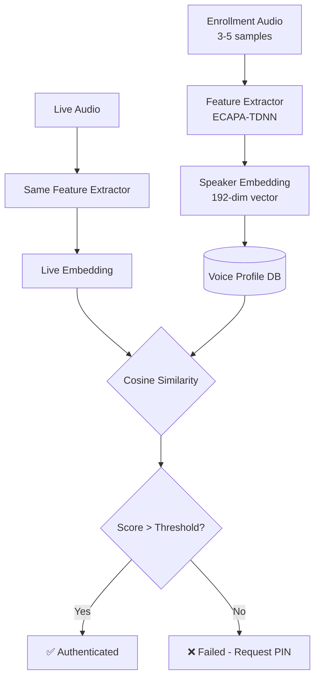
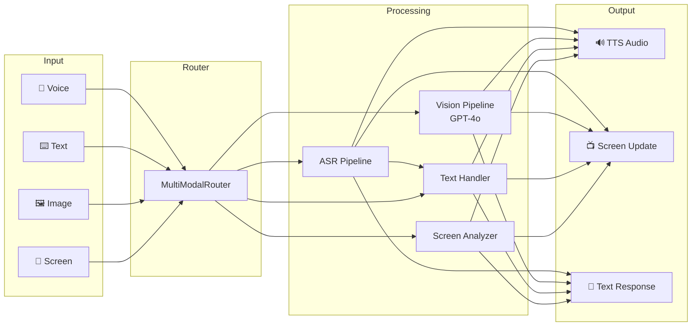
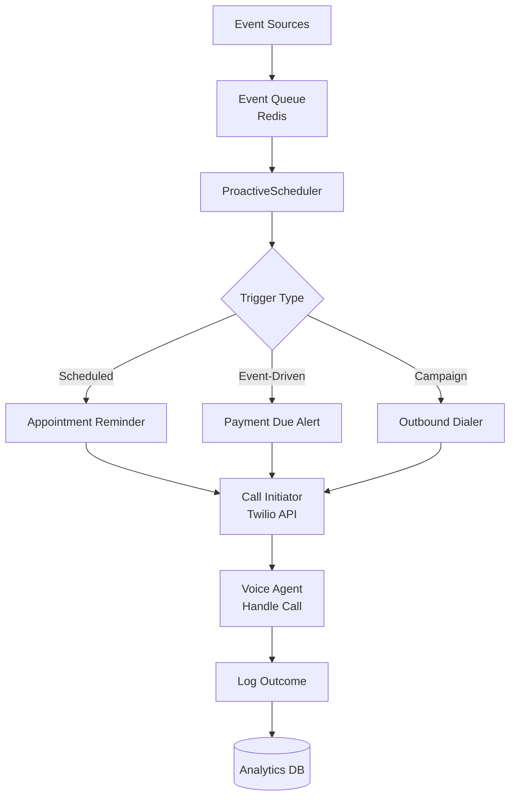

# Voice Agents Deep Dive  Part 15: Advanced Voice Features  Authentication, Multi-Modal, and Proactive Agents

---

**Series:** Building Voice Agents  A Developer's Deep Dive from Audio Fundamentals to Production
**Part:** 15 of 19 (Advanced Voice Features)
**Audience:** Developers with Python experience who want to build voice-powered AI agents from the ground up
**Reading time:** ~45 minutes

---

In Part 14, we built voice agents that detect and respond in the user's language and adapt their tone to the user's emotional state. Our agents could speak Spanish to Spanish speakers and dial back their energy when talking to someone frustrated.

Now we go further. Part 15 is about capabilities that transform a voice agent from a sophisticated chatbot into a truly useful, trustworthy system:

- **Voice authentication**  prove who you are by speaking
- **Anti-spoofing**  detect recorded or deepfake audio
- **Multi-modal**  combine voice with screen and vision
- **Proactive agents**  agents that initiate conversations, not just respond
- **Voice commerce**  complete transactions entirely by voice

---

## Section 1: Speaker Verification  Voice as a Password

> **The insight**: Every person has a unique "voiceprint"  the combination of their vocal tract anatomy, learned speech habits, and physiological characteristics. Speaker verification exploits this uniqueness to authenticate callers without passwords or PINs.

### How Voiceprint Matching Works



The key component is the **speaker embedding**  a compact numerical vector (typically 192-512 dimensions) that captures the unique characteristics of a voice. Two recordings from the same speaker produce embeddings that are close in vector space; recordings from different speakers are far apart.

```python
"""
voice_authenticator.py  Voiceprint-based speaker authentication.
"""
import numpy as np
import asyncio
from dataclasses import dataclass, field
from typing import Optional
import json
import os
import hashlib
from pathlib import Path


@dataclass
class VoiceProfile:
    user_id: str
    display_name: str
    embeddings: list[np.ndarray]        # Multiple enrollment samples
    mean_embedding: Optional[np.ndarray] = None  # Averaged embedding
    enrollment_date: str = ""
    auth_count: int = 0
    last_auth_date: str = ""

    def __post_init__(self):
        if self.embeddings and self.mean_embedding is None:
            self._compute_mean_embedding()

    def _compute_mean_embedding(self) -> None:
        """Compute mean embedding from all enrollment samples."""
        stacked = np.stack(self.embeddings)
        # L2-normalize each embedding before averaging
        normalized = stacked / (np.linalg.norm(stacked, axis=1, keepdims=True) + 1e-8)
        self.mean_embedding = np.mean(normalized, axis=0)
        # Normalize the mean too
        norm = np.linalg.norm(self.mean_embedding)
        if norm > 0:
            self.mean_embedding /= norm

    def add_enrollment_sample(self, embedding: np.ndarray) -> None:
        """Add a new enrollment sample and recompute mean."""
        self.embeddings.append(embedding)
        self._compute_mean_embedding()


@dataclass
class AuthResult:
    authenticated: bool
    score: float           # Cosine similarity (0-1, higher = more similar)
    threshold: float
    liveness_passed: bool
    failure_reason: Optional[str] = None


class SpeechBrainEmbedder:
    """
    Extract speaker embeddings using SpeechBrain's ECAPA-TDNN model.
    ECAPA-TDNN (Emphasized Channel Attention, Propagation and Aggregation)
    is state-of-the-art for speaker verification.
    """

    def __init__(self, model_path: str = "speechbrain/spkrec-ecapa-voxceleb"):
        try:
            from speechbrain.pretrained import EncoderClassifier
            self.encoder = EncoderClassifier.from_hparams(
                source=model_path,
                savedir="/tmp/speechbrain_speaker",
                run_opts={"device": "cpu"},
            )
            self._available = True
        except ImportError:
            print("SpeechBrain not installed. Using random embeddings for demo.")
            self._available = False

    def embed(self, audio: np.ndarray, sample_rate: int = 16000) -> np.ndarray:
        """
        Extract a 192-dimensional speaker embedding from audio.

        Args:
            audio: float32 numpy array, 16kHz mono, at least 1 second
            sample_rate: must be 16000 for ECAPA-TDNN

        Returns:
            192-dimensional L2-normalized embedding vector
        """
        if not self._available:
            # Demo mode: return deterministic fake embedding based on audio stats
            seed = int(np.mean(np.abs(audio)) * 1e6) % 2**31
            rng = np.random.RandomState(seed)
            embedding = rng.randn(192).astype(np.float32)
            return embedding / np.linalg.norm(embedding)

        import torch

        # Convert to tensor
        audio_tensor = torch.tensor(audio).unsqueeze(0)  # [1, samples]

        with torch.no_grad():
            embedding = self.encoder.encode_batch(audio_tensor)

        embedding_np = embedding.squeeze().numpy()
        # L2 normalize
        norm = np.linalg.norm(embedding_np)
        if norm > 0:
            embedding_np /= norm

        return embedding_np.astype(np.float32)


def cosine_similarity(a: np.ndarray, b: np.ndarray) -> float:
    """Compute cosine similarity between two normalized vectors."""
    # Both are already L2-normalized
    return float(np.dot(a, b))


class LivenessDetector:
    """
    Anti-spoofing: detect if audio is live speech or a replay attack.

    Methods:
    1. Random challenge: ask user to say a random phrase
    2. Audio artifact detection: look for compression artifacts in replayed audio
    3. Microphone noise analysis: live mics have consistent background noise
    """

    def __init__(self):
        self.challenges = [
            "Please say: 'voice agent authentication twenty twenty five'",
            "Please say your full name followed by 'voice confirmed'",
            "Please count from one to five",
            "Please say today's day of the week",
            "Please say: 'security check complete'",
        ]
        self._challenge_index = 0

    def get_challenge(self) -> str:
        """Get a random challenge phrase for liveness detection."""
        import random
        return random.choice(self.challenges)

    def check_liveness(
        self,
        audio: np.ndarray,
        sample_rate: int = 16000,
        min_duration_seconds: float = 1.0,
    ) -> tuple[bool, str]:
        """
        Basic liveness checks on audio.

        Returns: (liveness_passed, reason)
        """
        duration = len(audio) / sample_rate

        # Check 1: Minimum duration (replays often too short)
        if duration < min_duration_seconds:
            return False, f"Audio too short ({duration:.1f}s, need {min_duration_seconds}s)"

        # Check 2: Energy variance (replays can have flat energy profiles)
        rms_frames = []
        frame_size = sample_rate // 10  # 100ms frames
        for i in range(0, len(audio) - frame_size, frame_size):
            frame = audio[i : i + frame_size]
            rms_frames.append(np.sqrt(np.mean(frame**2)))

        if not rms_frames:
            return False, "No audio energy detected"

        energy_variance = np.var(rms_frames)
        if energy_variance < 1e-8:
            return False, "Audio energy is suspiciously flat (possible replay)"

        # Check 3: Clipping detection (replays through speakers often clip)
        clip_threshold = 0.99
        clip_ratio = np.mean(np.abs(audio) > clip_threshold)
        if clip_ratio > 0.001:  # More than 0.1% clipped samples
            return False, f"Audio clipping detected ({clip_ratio:.1%} of samples)"

        # Check 4: High-frequency noise (microphones have characteristic noise)
        # Replays through speakers have reduced high-frequency content
        # (This is a simplified check  production would use a trained model)
        from scipy import signal as scipy_signal
        freqs, psd = scipy_signal.welch(audio, fs=sample_rate, nperseg=512)
        high_freq_mask = freqs > 4000  # Above 4kHz
        total_mask = freqs > 100
        if total_mask.sum() > 0:
            high_freq_ratio = psd[high_freq_mask].sum() / (psd[total_mask].sum() + 1e-8)
            if high_freq_ratio < 0.01:
                return False, "Insufficient high-frequency content (possible replay)"

        return True, "Liveness checks passed"


class VoiceAuthenticator:
    """
    Production voice authenticator with:
    - Enrollment (capture voiceprint from multiple samples)
    - Verification (compare live audio to stored profile)
    - Liveness detection (anti-spoofing)
    - Multi-factor fallback (voice + PIN)
    """

    def __init__(
        self,
        embedder: SpeechBrainEmbedder,
        liveness_detector: LivenessDetector,
        similarity_threshold: float = 0.75,
        profiles_dir: str = "/tmp/voice_profiles",
    ):
        self.embedder = embedder
        self.liveness_detector = liveness_detector
        self.threshold = similarity_threshold
        self.profiles_dir = Path(profiles_dir)
        self.profiles_dir.mkdir(parents=True, exist_ok=True)
        self.profiles: dict[str, VoiceProfile] = {}
        self._load_profiles()

    def _profile_path(self, user_id: str) -> Path:
        return self.profiles_dir / f"{user_id}.npz"

    def _load_profiles(self) -> None:
        """Load all stored voice profiles from disk."""
        for profile_file in self.profiles_dir.glob("*.npz"):
            try:
                data = np.load(profile_file, allow_pickle=True)
                user_id = profile_file.stem
                embeddings = [data[f"emb_{i}"] for i in range(int(data["count"]))]
                self.profiles[user_id] = VoiceProfile(
                    user_id=user_id,
                    display_name=str(data.get("display_name", user_id)),
                    embeddings=embeddings,
                )
                print(f"Loaded voice profile: {user_id} ({len(embeddings)} samples)")
            except Exception as e:
                print(f"Error loading profile {profile_file}: {e}")

    def _save_profile(self, profile: VoiceProfile) -> None:
        """Save a voice profile to disk."""
        save_dict = {
            "count": len(profile.embeddings),
            "display_name": profile.display_name,
        }
        for i, emb in enumerate(profile.embeddings):
            save_dict[f"emb_{i}"] = emb

        np.savez(self._profile_path(profile.user_id), **save_dict)

    def enroll(
        self,
        user_id: str,
        display_name: str,
        audio_samples: list[np.ndarray],
        sample_rate: int = 16000,
        min_samples: int = 3,
    ) -> bool:
        """
        Enroll a new user by capturing their voiceprint.

        Args:
            user_id: Unique identifier for the user
            display_name: Human-readable name
            audio_samples: List of audio arrays (minimum 3 recommended)
            sample_rate: Audio sample rate

        Returns:
            True if enrollment successful
        """
        if len(audio_samples) < min_samples:
            print(f"Need at least {min_samples} samples, got {len(audio_samples)}")
            return False

        embeddings = []
        for i, audio in enumerate(audio_samples):
            # Basic liveness check on each sample
            liveness_ok, reason = self.liveness_detector.check_liveness(audio, sample_rate)
            if not liveness_ok:
                print(f"Sample {i+1} failed liveness: {reason}")
                continue

            embedding = self.embedder.embed(audio, sample_rate)
            embeddings.append(embedding)

        if len(embeddings) < min_samples:
            print(f"Only {len(embeddings)} valid samples after liveness checks")
            return False

        # Check intra-speaker consistency (samples should be similar to each other)
        similarities = []
        for i in range(len(embeddings)):
            for j in range(i + 1, len(embeddings)):
                sim = cosine_similarity(embeddings[i], embeddings[j])
                similarities.append(sim)

        avg_similarity = np.mean(similarities)
        if avg_similarity < 0.6:
            print(f"Low intra-speaker consistency ({avg_similarity:.2f}). "
                  f"Please re-record in a quieter environment.")
            return False

        profile = VoiceProfile(
            user_id=user_id,
            display_name=display_name,
            embeddings=embeddings,
        )
        self.profiles[user_id] = profile
        self._save_profile(profile)

        print(f"✅ Enrolled {display_name} ({user_id}) with {len(embeddings)} samples")
        print(f"   Intra-speaker similarity: {avg_similarity:.3f}")
        return True

    def verify(
        self,
        user_id: str,
        audio: np.ndarray,
        sample_rate: int = 16000,
        require_liveness: bool = True,
    ) -> AuthResult:
        """
        Verify a speaker's identity against their stored profile.

        Args:
            user_id: The user to verify against
            audio: Live audio from the caller
            sample_rate: Audio sample rate
            require_liveness: If True, run anti-spoofing checks

        Returns:
            AuthResult with authentication decision
        """
        # Check if user is enrolled
        if user_id not in self.profiles:
            return AuthResult(
                authenticated=False,
                score=0.0,
                threshold=self.threshold,
                liveness_passed=False,
                failure_reason=f"User {user_id} not enrolled",
            )

        profile = self.profiles[user_id]

        # Liveness check
        liveness_passed = True
        if require_liveness:
            liveness_passed, reason = self.liveness_detector.check_liveness(audio, sample_rate)
            if not liveness_passed:
                return AuthResult(
                    authenticated=False,
                    score=0.0,
                    threshold=self.threshold,
                    liveness_passed=False,
                    failure_reason=f"Liveness failed: {reason}",
                )

        # Extract embedding from live audio
        live_embedding = self.embedder.embed(audio, sample_rate)

        # Compare against stored profile
        score = cosine_similarity(live_embedding, profile.mean_embedding)

        authenticated = score >= self.threshold

        if authenticated:
            profile.auth_count += 1
            import datetime
            profile.last_auth_date = datetime.datetime.now().isoformat()

        return AuthResult(
            authenticated=authenticated,
            score=score,
            threshold=self.threshold,
            liveness_passed=liveness_passed,
            failure_reason=None if authenticated else f"Score {score:.3f} below threshold {self.threshold}",
        )

    def identify(
        self,
        audio: np.ndarray,
        sample_rate: int = 16000,
        top_k: int = 3,
    ) -> list[tuple[str, float]]:
        """
        Identify the speaker without knowing their user_id.
        Returns list of (user_id, similarity_score) sorted by score.
        """
        if not self.profiles:
            return []

        live_embedding = self.embedder.embed(audio, sample_rate)
        scores = []

        for user_id, profile in self.profiles.items():
            if profile.mean_embedding is not None:
                score = cosine_similarity(live_embedding, profile.mean_embedding)
                scores.append((user_id, score))

        scores.sort(key=lambda x: -x[1])
        return scores[:top_k]


# Demo
async def demo_voice_authentication():
    """Demonstrate voice enrollment and verification."""
    embedder = SpeechBrainEmbedder()
    liveness = LivenessDetector()
    auth = VoiceAuthenticator(embedder, liveness, similarity_threshold=0.70)

    print("\n=== Voice Authentication Demo ===\n")

    # Simulate enrollment (using random audio for demo)
    print("Step 1: Enrolling user 'alice'...")
    np.random.seed(42)
    # In production: record 3+ samples of the user saying different phrases
    alice_samples = [
        np.random.randn(16000 * 3).astype(np.float32) * 0.05 + 0.001 * i
        for i in range(4)
    ]
    enrolled = auth.enroll("alice_001", "Alice Johnson", alice_samples)
    print(f"Enrollment successful: {enrolled}")

    print("\nStep 2: Verifying Alice's voice...")
    alice_test = np.random.randn(16000 * 3).astype(np.float32) * 0.05
    result = auth.verify("alice_001", alice_test)
    print(f"Authenticated: {result.authenticated}")
    print(f"Score: {result.score:.3f} (threshold: {result.threshold})")

    print("\nStep 3: Testing with wrong speaker...")
    bob_audio = np.random.randn(16000 * 3).astype(np.float32) * 0.08
    result2 = auth.verify("alice_001", bob_audio)
    print(f"Authenticated: {result2.authenticated} (should be False)")
    print(f"Score: {result2.score:.3f}")


if __name__ == "__main__":
    asyncio.run(demo_voice_authentication())
```

---

## Section 2: Multi-Speaker Calls with Diarization

When multiple people are on a call, you need to know who said what:

```python
"""
diarization_auth.py  Combine diarization with voice authentication.
"""
import asyncio
import numpy as np
from dataclasses import dataclass
from typing import Optional


@dataclass
class SpeakerSegment:
    speaker_id: str           # "SPEAKER_00", "SPEAKER_01", etc.
    start_time: float         # Seconds from start
    end_time: float
    audio: np.ndarray
    transcript: Optional[str] = None
    authenticated_user: Optional[str] = None


class DiarizationPipeline:
    """
    Full diarization + authentication pipeline for multi-party calls.
    Uses pyannote.audio for diarization.
    """

    def __init__(
        self,
        authenticator: VoiceAuthenticator,
        pyannote_token: str,
    ):
        self.authenticator = authenticator
        self.pyannote_token = pyannote_token
        self._pipeline = None

    def _load_pipeline(self):
        """Lazy-load pyannote diarization pipeline."""
        if self._pipeline is None:
            from pyannote.audio import Pipeline
            self._pipeline = Pipeline.from_pretrained(
                "pyannote/speaker-diarization-3.1",
                use_auth_token=self.pyannote_token,
            )

    def diarize(
        self,
        audio: np.ndarray,
        sample_rate: int = 16000,
        num_speakers: Optional[int] = None,
    ) -> list[SpeakerSegment]:
        """
        Run speaker diarization on audio.

        Args:
            audio: Full call audio
            sample_rate: Audio sample rate
            num_speakers: Known number of speakers (None = auto-detect)

        Returns:
            List of speaker segments with audio slices
        """
        self._load_pipeline()

        import torch
        from pyannote.core import Segment

        audio_tensor = torch.tensor(audio).unsqueeze(0)

        kwargs = {}
        if num_speakers:
            kwargs["num_speakers"] = num_speakers

        diarization = self._pipeline(
            {"waveform": audio_tensor, "sample_rate": sample_rate},
            **kwargs,
        )

        segments = []
        for turn, _, speaker in diarization.itertracks(yield_label=True):
            start_sample = int(turn.start * sample_rate)
            end_sample = int(turn.end * sample_rate)
            segment_audio = audio[start_sample:end_sample]

            segments.append(SpeakerSegment(
                speaker_id=speaker,
                start_time=turn.start,
                end_time=turn.end,
                audio=segment_audio,
            ))

        return segments

    async def diarize_and_authenticate(
        self,
        audio: np.ndarray,
        sample_rate: int = 16000,
        known_user_ids: Optional[list[str]] = None,
    ) -> list[SpeakerSegment]:
        """
        Diarize audio and attempt to identify each speaker.
        """
        segments = self.diarize(audio, sample_rate)

        # Group segments by speaker and try to identify each
        speaker_audio: dict[str, list[np.ndarray]] = {}
        for seg in segments:
            if seg.speaker_id not in speaker_audio:
                speaker_audio[seg.speaker_id] = []
            speaker_audio[seg.speaker_id].append(seg.audio)

        # Identify each unique speaker
        speaker_identities: dict[str, Optional[str]] = {}
        for speaker_id, audio_chunks in speaker_audio.items():
            # Use the longest chunk for identification
            longest = max(audio_chunks, key=len)
            if len(longest) < sample_rate:  # Less than 1 second
                speaker_identities[speaker_id] = None
                continue

            if known_user_ids:
                # Try to match against known users
                for user_id in known_user_ids:
                    result = self.authenticator.verify(user_id, longest, sample_rate)
                    if result.authenticated:
                        speaker_identities[speaker_id] = user_id
                        break
                else:
                    speaker_identities[speaker_id] = None
            else:
                # Open-set identification
                matches = self.authenticator.identify(longest, sample_rate, top_k=1)
                if matches and matches[0][1] >= self.authenticator.threshold:
                    speaker_identities[speaker_id] = matches[0][0]
                else:
                    speaker_identities[speaker_id] = None

        # Annotate segments with identified users
        for seg in segments:
            seg.authenticated_user = speaker_identities.get(seg.speaker_id)

        return segments
```

---

## Section 3: Multi-Modal Voice Agents

Modern voice agents don't have to be audio-only. The most powerful agents combine voice with other modalities:



```python
"""
multimodal_agent.py  Voice agent that accepts audio, text, and images.
"""
import asyncio
import base64
import httpx
import numpy as np
from dataclasses import dataclass
from typing import Optional, Union
from enum import Enum


class InputModality(Enum):
    VOICE = "voice"
    TEXT = "text"
    IMAGE = "image"
    VOICE_AND_IMAGE = "voice_and_image"


@dataclass
class MultiModalInput:
    modality: InputModality
    text: Optional[str] = None          # Transcribed text or typed text
    audio: Optional[np.ndarray] = None  # Raw audio
    image_bytes: Optional[bytes] = None  # Image data
    image_url: Optional[str] = None     # Or image URL


@dataclass
class MultiModalResponse:
    text: str                    # Text response
    audio_bytes: Optional[bytes] = None  # Synthesized audio
    screen_update: Optional[dict] = None  # Data for screen display


class MultiModalAgent:
    """
    Voice agent that handles voice, text, and image inputs.
    Responds with voice + optional screen updates.
    """

    def __init__(
        self,
        asr_engine,
        tts_engine,
        openai_api_key: str,
        vision_model: str = "gpt-4o",
    ):
        self.asr = asr_engine
        self.tts = tts_engine
        self.openai_api_key = openai_api_key
        self.vision_model = vision_model
        self.conversation_history: list[dict] = []

    async def process(self, input_data: MultiModalInput) -> MultiModalResponse:
        """Process any input modality and return a multi-modal response."""

        # Step 1: Get text from the input
        if input_data.modality == InputModality.VOICE:
            asr_result = await self.asr.transcribe(input_data.audio, "en-US")
            user_text = asr_result.text

        elif input_data.modality == InputModality.TEXT:
            user_text = input_data.text

        elif input_data.modality == InputModality.IMAGE:
            # Image only  ask LLM to describe it
            user_text = "Please describe this image."

        elif input_data.modality == InputModality.VOICE_AND_IMAGE:
            # Voice question about an image
            asr_result = await self.asr.transcribe(input_data.audio, "en-US")
            user_text = asr_result.text

        else:
            user_text = ""

        # Step 2: Build LLM message with optional image
        message_content = []

        if user_text:
            message_content.append({"type": "text", "text": user_text})

        # Attach image if present
        if input_data.image_bytes:
            image_b64 = base64.b64encode(input_data.image_bytes).decode("utf-8")
            message_content.append({
                "type": "image_url",
                "image_url": {"url": f"data:image/jpeg;base64,{image_b64}"},
            })
        elif input_data.image_url:
            message_content.append({
                "type": "image_url",
                "image_url": {"url": input_data.image_url},
            })

        # Step 3: Get LLM response
        response_text = await self._call_vision_llm(message_content)

        # Step 4: Determine if screen should update
        screen_update = self._determine_screen_update(user_text, response_text)

        # Step 5: Synthesize audio response
        audio_bytes = await self.tts.synthesize(response_text, "en-US")

        return MultiModalResponse(
            text=response_text,
            audio_bytes=audio_bytes,
            screen_update=screen_update,
        )

    async def _call_vision_llm(self, content: list) -> str:
        """Call GPT-4o with multi-modal content."""
        system_prompt = (
            "You are a helpful voice assistant. "
            "When analyzing images, describe what you see concisely and conversationally. "
            "Keep responses brief and suitable for spoken audio. "
            "Avoid markdown formatting  use natural speech."
        )

        self.conversation_history.append({
            "role": "user",
            "content": content,
        })

        messages = [
            {"role": "system", "content": system_prompt},
            *self.conversation_history[-6:],
        ]

        async with httpx.AsyncClient(timeout=30) as client:
            resp = await client.post(
                "https://api.openai.com/v1/chat/completions",
                headers={"Authorization": f"Bearer {self.openai_api_key}"},
                json={
                    "model": self.vision_model,
                    "messages": messages,
                    "max_tokens": 200,
                    "temperature": 0.7,
                },
            )
            resp.raise_for_status()

        response_text = resp.json()["choices"][0]["message"]["content"].strip()
        self.conversation_history.append({
            "role": "assistant",
            "content": response_text,
        })
        return response_text

    def _determine_screen_update(
        self, user_text: str, response_text: str
    ) -> Optional[dict]:
        """
        Determine if the response should update the visual display.
        Returns screen update data or None if no screen update needed.
        """
        # Keywords that suggest visual content should be shown
        visual_triggers = [
            "here are", "here is", "the steps are", "the options are",
            "let me show you", "i found", "results:"
        ]

        if any(trigger in response_text.lower() for trigger in visual_triggers):
            return {
                "type": "text_display",
                "content": response_text,
                "highlight_keywords": [],
            }

        return None
```

### Multi-Modal WebSocket Server

```python
"""
multimodal_websocket_server.py  FastAPI server for multi-modal voice agent.
"""
import asyncio
import json
import base64
from fastapi import FastAPI, WebSocket, WebSocketDisconnect
from fastapi.responses import HTMLResponse
import numpy as np
import uvicorn

app = FastAPI(title="Multi-Modal Voice Agent")


class ConnectionManager:
    def __init__(self):
        self.active_connections: dict[str, WebSocket] = {}

    async def connect(self, session_id: str, websocket: WebSocket):
        await websocket.accept()
        self.active_connections[session_id] = websocket

    def disconnect(self, session_id: str):
        self.active_connections.pop(session_id, None)

    async def send_json(self, session_id: str, data: dict):
        ws = self.active_connections.get(session_id)
        if ws:
            await ws.send_json(data)


manager = ConnectionManager()


@app.websocket("/ws/{session_id}")
async def websocket_endpoint(websocket: WebSocket, session_id: str):
    await manager.connect(session_id, websocket)
    print(f"Client connected: {session_id}")

    try:
        while True:
            data = await websocket.receive_json()
            message_type = data.get("type")

            if message_type == "audio":
                # Decode base64 audio
                audio_b64 = data["audio"]
                audio_bytes = base64.b64decode(audio_b64)
                audio = np.frombuffer(audio_bytes, dtype=np.float32)

                # Process voice input
                # (In production, call your MultiModalAgent here)
                response_text = f"Received {len(audio)} audio samples."
                audio_response = b""  # Synthesized audio bytes

                await websocket.send_json({
                    "type": "response",
                    "text": response_text,
                    "audio": base64.b64encode(audio_response).decode(),
                    "screen_update": None,
                })

            elif message_type == "text":
                user_text = data.get("text", "")
                response_text = f"You said: {user_text}"

                await websocket.send_json({
                    "type": "response",
                    "text": response_text,
                    "audio": "",
                    "screen_update": {"type": "text_display", "content": response_text},
                })

            elif message_type == "image":
                # User sent an image for analysis
                image_b64 = data.get("image", "")
                voice_question = data.get("question", "What do you see in this image?")

                response_text = "I can see an image. In production, GPT-4o would analyze it here."

                await websocket.send_json({
                    "type": "response",
                    "text": response_text,
                    "audio": "",
                    "screen_update": {"type": "image_analysis", "content": response_text},
                })

    except WebSocketDisconnect:
        manager.disconnect(session_id)
        print(f"Client disconnected: {session_id}")


@app.get("/")
async def get_client():
    """Serve a simple HTML client for testing."""
    return HTMLResponse("""
<!DOCTYPE html>
<html>
<head><title>Multi-Modal Voice Agent</title></head>
<body>
    <h1>Multi-Modal Voice Agent</h1>
    <div id="status">Disconnected</div>
    <button onclick="connect()">Connect</button>
    <button onclick="startRecording()" disabled id="record-btn">Record Voice</button>
    <button onclick="sendImage()" disabled id="image-btn">Send Image</button>
    <input type="file" id="image-input" accept="image/*" style="display:none">
    <div id="transcript" style="margin-top: 20px; padding: 10px; border: 1px solid #ccc;">
        <h3>Conversation</h3>
        <div id="messages"></div>
    </div>
    <script>
        let ws;
        let mediaRecorder;
        let audioChunks = [];

        function connect() {
            const sessionId = 'session_' + Math.random().toString(36).substr(2, 9);
            ws = new WebSocket(`ws://localhost:8000/ws/${sessionId}`);
            ws.onopen = () => {
                document.getElementById('status').textContent = 'Connected: ' + sessionId;
                document.getElementById('record-btn').disabled = false;
                document.getElementById('image-btn').disabled = false;
            };
            ws.onmessage = (event) => {
                const data = JSON.parse(event.data);
                addMessage('Agent', data.text);
                if (data.screen_update) {
                    console.log('Screen update:', data.screen_update);
                }
            };
            ws.onclose = () => document.getElementById('status').textContent = 'Disconnected';
        }

        async function startRecording() {
            const stream = await navigator.mediaDevices.getUserMedia({ audio: true });
            mediaRecorder = new MediaRecorder(stream);
            audioChunks = [];
            mediaRecorder.ondataavailable = e => audioChunks.push(e.data);
            mediaRecorder.onstop = async () => {
                const audioBlob = new Blob(audioChunks, { type: 'audio/webm' });
                const arrayBuffer = await audioBlob.arrayBuffer();
                const base64 = btoa(String.fromCharCode(...new Uint8Array(arrayBuffer)));
                ws.send(JSON.stringify({ type: 'audio', audio: base64 }));
            };
            mediaRecorder.start();
            document.getElementById('record-btn').textContent = 'Stop Recording';
            document.getElementById('record-btn').onclick = stopRecording;
        }

        function stopRecording() {
            mediaRecorder.stop();
            document.getElementById('record-btn').textContent = 'Record Voice';
            document.getElementById('record-btn').onclick = startRecording;
        }

        function sendImage() {
            document.getElementById('image-input').click();
        }

        document.getElementById('image-input').addEventListener('change', async (e) => {
            const file = e.target.files[0];
            if (!file) return;
            const reader = new FileReader();
            reader.onload = () => {
                const base64 = reader.result.split(',')[1];
                ws.send(JSON.stringify({ type: 'image', image: base64, question: 'What do you see?' }));
                addMessage('User', '[Sent an image]');
            };
            reader.readAsDataURL(file);
        });

        function addMessage(speaker, text) {
            const div = document.createElement('div');
            div.innerHTML = `<strong>${speaker}:</strong> ${text}`;
            div.style.marginBottom = '8px';
            document.getElementById('messages').appendChild(div);
        }
    </script>
</body>
</html>
    """)


if __name__ == "__main__":
    uvicorn.run(app, host="0.0.0.0", port=8000)
```

---

## Section 4: Proactive Voice Agents

Most voice agents are **reactive**  they wait for the user to call. **Proactive agents** flip this: the agent calls the user when something important happens.



```python
"""
proactive_agent_scheduler.py  Schedule and execute proactive outbound calls.
"""
import asyncio
import json
from dataclasses import dataclass, field
from datetime import datetime, timedelta
from typing import Optional, Callable
from enum import Enum
import redis.asyncio as aioredis


class TriggerType(Enum):
    SCHEDULED = "scheduled"        # Run at a specific time
    EVENT_DRIVEN = "event_driven"  # Triggered by an event
    CAMPAIGN = "campaign"          # Part of a bulk outreach campaign


@dataclass
class OutboundCallJob:
    job_id: str
    user_id: str
    phone_number: str
    trigger_type: TriggerType
    scheduled_time: Optional[datetime] = None
    event_type: Optional[str] = None      # "payment_due", "appointment_reminder"
    event_data: dict = field(default_factory=dict)
    agent_script: str = ""                # What the agent should say/do
    retry_count: int = 0
    max_retries: int = 3
    status: str = "pending"               # pending, calling, completed, failed


class ProactiveAgentScheduler:
    """
    Schedule and manage proactive outbound voice calls.
    Uses Redis as the job queue for reliability.
    """

    def __init__(
        self,
        redis_url: str = "redis://localhost:6379",
        twilio_account_sid: str = "",
        twilio_auth_token: str = "",
        twilio_phone_number: str = "",
        agent_webhook_url: str = "",
    ):
        self.redis_url = redis_url
        self.twilio_sid = twilio_account_sid
        self.twilio_token = twilio_auth_token
        self.twilio_phone = twilio_phone_number
        self.agent_webhook_url = agent_webhook_url
        self._redis: Optional[aioredis.Redis] = None
        self._running = False

    async def _get_redis(self) -> aioredis.Redis:
        if not self._redis:
            self._redis = await aioredis.from_url(self.redis_url, decode_responses=True)
        return self._redis

    async def schedule_call(self, job: OutboundCallJob) -> str:
        """Add an outbound call job to the queue."""
        r = await self._get_redis()

        job_data = {
            "job_id": job.job_id,
            "user_id": job.user_id,
            "phone_number": job.phone_number,
            "trigger_type": job.trigger_type.value,
            "scheduled_time": job.scheduled_time.isoformat() if job.scheduled_time else None,
            "event_type": job.event_type,
            "event_data": json.dumps(job.event_data),
            "agent_script": job.agent_script,
            "retry_count": job.retry_count,
            "max_retries": job.max_retries,
            "status": "pending",
        }

        # Score = Unix timestamp (for scheduled jobs) or 0 (for immediate)
        score = job.scheduled_time.timestamp() if job.scheduled_time else 0.0

        await r.zadd("outbound_calls", {json.dumps(job_data): score})
        print(f"Scheduled call: {job.job_id} for {job.phone_number}")
        return job.job_id

    async def schedule_appointment_reminder(
        self,
        user_id: str,
        phone_number: str,
        appointment_time: datetime,
        appointment_type: str = "appointment",
        reminder_hours_before: int = 24,
    ) -> str:
        """Helper to schedule an appointment reminder call."""
        import uuid

        reminder_time = appointment_time - timedelta(hours=reminder_hours_before)
        job = OutboundCallJob(
            job_id=str(uuid.uuid4()),
            user_id=user_id,
            phone_number=phone_number,
            trigger_type=TriggerType.SCHEDULED,
            scheduled_time=reminder_time,
            event_type="appointment_reminder",
            event_data={
                "appointment_time": appointment_time.isoformat(),
                "appointment_type": appointment_type,
            },
            agent_script=(
                f"Hello, this is a reminder about your {appointment_type} "
                f"scheduled for {appointment_time.strftime('%A, %B %d at %I:%M %p')}. "
                f"Press 1 to confirm, press 2 to reschedule, or say 'cancel' to cancel."
            ),
        )
        return await self.schedule_call(job)

    async def schedule_payment_reminder(
        self,
        user_id: str,
        phone_number: str,
        amount_due: float,
        due_date: datetime,
    ) -> str:
        """Helper to schedule a payment reminder call."""
        import uuid

        job = OutboundCallJob(
            job_id=str(uuid.uuid4()),
            user_id=user_id,
            phone_number=phone_number,
            trigger_type=TriggerType.EVENT_DRIVEN,
            event_type="payment_due",
            event_data={
                "amount_due": amount_due,
                "due_date": due_date.isoformat(),
            },
            agent_script=(
                f"Hello, this is a courtesy call about a payment of ${amount_due:.2f} "
                f"due on {due_date.strftime('%B %d')}. "
                f"To make a payment, press 1. To request an extension, press 2."
            ),
        )
        return await self.schedule_call(job)

    async def process_queue(self, poll_interval_seconds: float = 10.0) -> None:
        """Process the outbound call queue continuously."""
        self._running = True
        print("Proactive scheduler started...")

        while self._running:
            try:
                r = await self._get_redis()
                now = datetime.now().timestamp()

                # Get all jobs due now or overdue
                due_jobs = await r.zrangebyscore("outbound_calls", 0, now, start=0, num=10)

                for job_json in due_jobs:
                    job_data = json.loads(job_json)
                    await self._execute_call(job_data, r)
                    await r.zrem("outbound_calls", job_json)

            except Exception as e:
                print(f"Queue processing error: {e}")

            await asyncio.sleep(poll_interval_seconds)

    async def _execute_call(self, job_data: dict, r) -> None:
        """Execute a single outbound call via Twilio."""
        job_id = job_data["job_id"]
        phone_number = job_data["phone_number"]
        agent_script = job_data["agent_script"]

        print(f"Initiating call: {job_id} → {phone_number}")

        if not self.twilio_sid or not self.twilio_token:
            print(f"[DEMO] Would call {phone_number}: {agent_script[:80]}...")
            return

        try:
            from twilio.rest import Client
            client = Client(self.twilio_sid, self.twilio_token)

            call = client.calls.create(
                to=phone_number,
                from_=self.twilio_phone,
                url=f"{self.agent_webhook_url}/webhooks/outbound-call",
                method="POST",
                status_callback=f"{self.agent_webhook_url}/webhooks/call-status",
                status_callback_method="POST",
                machine_detection="DetectMessageEnd",  # AMD
            )

            # Store call SID for tracking
            await r.hset(f"call:{job_id}", mapping={
                "call_sid": call.sid,
                "status": "initiated",
                "phone_number": phone_number,
            })

            print(f"Call initiated: {call.sid}")

        except Exception as e:
            print(f"Failed to initiate call {job_id}: {e}")
            # Retry logic
            retry_count = int(job_data.get("retry_count", 0))
            max_retries = int(job_data.get("max_retries", 3))
            if retry_count < max_retries:
                job_data["retry_count"] = retry_count + 1
                retry_time = datetime.now() + timedelta(minutes=5 * (retry_count + 1))
                await r.zadd("outbound_calls", {json.dumps(job_data): retry_time.timestamp()})
                print(f"Scheduled retry {retry_count + 1} for {job_id}")

    def stop(self) -> None:
        self._running = False


# Demo: Schedule some calls
async def demo_proactive_calls():
    scheduler = ProactiveAgentScheduler(
        redis_url="redis://localhost:6379",
        # Leave Twilio credentials empty for demo
    )

    now = datetime.now()

    # Schedule an appointment reminder
    job1_id = await scheduler.schedule_appointment_reminder(
        user_id="user_123",
        phone_number="+15551234567",
        appointment_time=now + timedelta(days=1, hours=10),
        appointment_type="dental checkup",
        reminder_hours_before=24,
    )
    print(f"Scheduled appointment reminder: {job1_id}")

    # Schedule a payment reminder (immediate)
    job2_id = await scheduler.schedule_payment_reminder(
        user_id="user_456",
        phone_number="+15559876543",
        amount_due=150.00,
        due_date=now + timedelta(days=3),
    )
    print(f"Scheduled payment reminder: {job2_id}")

    print("\nQueue status:")
    print("(In production, scheduler.process_queue() would run continuously)")
```

---

## Section 5: Voice Commerce

Voice commerce is one of the highest-value applications  letting customers complete purchases entirely by phone:

```python
"""
voice_commerce_agent.py  Handle e-commerce transactions via voice.
"""
import asyncio
from dataclasses import dataclass, field
from typing import Optional
from enum import Enum


class OrderStatus(Enum):
    BROWSING = "browsing"
    COLLECTING_ITEMS = "collecting_items"
    CONFIRMING = "confirming"
    PAYMENT_AUTH = "payment_auth"
    PROCESSING = "processing"
    COMPLETE = "complete"
    CANCELLED = "cancelled"


@dataclass
class CartItem:
    item_id: str
    name: str
    price: float
    quantity: int = 1

    @property
    def subtotal(self) -> float:
        return self.price * self.quantity


@dataclass
class ShoppingCart:
    session_id: str
    items: list[CartItem] = field(default_factory=list)
    discount_code: Optional[str] = None
    discount_percent: float = 0.0

    @property
    def subtotal(self) -> float:
        return sum(item.subtotal for item in self.items)

    @property
    def discount_amount(self) -> float:
        return self.subtotal * self.discount_percent

    @property
    def total(self) -> float:
        return self.subtotal - self.discount_amount

    def add_item(self, item: CartItem) -> None:
        # Check if item already in cart
        for existing in self.items:
            if existing.item_id == item.item_id:
                existing.quantity += item.quantity
                return
        self.items.append(item)

    def remove_item(self, item_id: str) -> bool:
        before = len(self.items)
        self.items = [i for i in self.items if i.item_id != item_id]
        return len(self.items) < before

    def to_spoken_summary(self) -> str:
        """Format cart for reading aloud."""
        if not self.items:
            return "Your cart is empty."

        lines = ["Here's what's in your cart:"]
        for item in self.items:
            lines.append(f"{item.quantity} {item.name} at ${item.price:.2f} each")

        if self.discount_amount > 0:
            lines.append(f"Discount: minus ${self.discount_amount:.2f}")

        lines.append(f"Total: ${self.total:.2f}")
        return " ".join(lines)


class VoiceCommerceAgent:
    """
    Full e-commerce agent for voice  browse, add to cart, checkout.
    PCI DSS compliant: never stores card numbers, uses tokenization.
    """

    def __init__(self, openai_api_key: str, payment_gateway_url: str = ""):
        self.openai_api_key = openai_api_key
        self.payment_gateway_url = payment_gateway_url
        self.carts: dict[str, ShoppingCart] = {}
        self.order_status: dict[str, OrderStatus] = {}

        # Demo product catalog
        self.catalog = {
            "coffee": CartItem("coffee_001", "Premium Coffee Blend", 14.99),
            "mug": CartItem("mug_001", "Ceramic Travel Mug", 24.99),
            "tea": CartItem("tea_001", "Organic Green Tea", 9.99),
            "chocolate": CartItem("choc_001", "Dark Chocolate Box", 19.99),
        }

    def get_or_create_cart(self, session_id: str) -> ShoppingCart:
        if session_id not in self.carts:
            self.carts[session_id] = ShoppingCart(session_id=session_id)
            self.order_status[session_id] = OrderStatus.BROWSING
        return self.carts[session_id]

    async def handle_voice_command(
        self, session_id: str, user_text: str
    ) -> tuple[str, bool]:
        """
        Handle a voice commerce command.
        Returns (response_text, order_complete).
        """
        cart = self.get_or_create_cart(session_id)
        status = self.order_status.get(session_id, OrderStatus.BROWSING)
        user_lower = user_text.lower()

        # Handle payment authorization phase specially
        if status == OrderStatus.PAYMENT_AUTH:
            return await self._handle_payment_auth(session_id, user_text, cart)

        # Determine intent from voice
        intent = await self._classify_intent(user_text)

        if intent == "add_item":
            return await self._handle_add_item(session_id, user_text, cart)

        elif intent == "remove_item":
            return await self._handle_remove_item(session_id, user_text, cart)

        elif intent == "view_cart":
            return cart.to_spoken_summary(), False

        elif intent == "checkout":
            self.order_status[session_id] = OrderStatus.CONFIRMING
            return (
                f"{cart.to_spoken_summary()} "
                f"Would you like to place this order? Say yes to confirm or no to make changes.",
                False,
            )

        elif intent == "confirm_order" and status == OrderStatus.CONFIRMING:
            self.order_status[session_id] = OrderStatus.PAYMENT_AUTH
            return (
                "Great! For payment, please say your 4-digit authorization PIN. "
                "This is the PIN you set up when creating your account.",
                False,
            )

        elif intent == "cancel":
            self.carts.pop(session_id, None)
            self.order_status.pop(session_id, None)
            return "Order cancelled. Your cart has been cleared. Is there anything else I can help you with?", False

        elif intent == "browse":
            return self._get_catalog_description(), False

        else:
            return await self._general_help(user_text, cart), False

    async def _classify_intent(self, user_text: str) -> str:
        """Use LLM to classify commerce intent."""
        import httpx

        prompt = f"""Classify this voice commerce command into one of:
add_item, remove_item, view_cart, checkout, confirm_order, cancel, browse, other

User said: "{user_text}"

Respond with just the intent label, nothing else."""

        async with httpx.AsyncClient(timeout=10) as client:
            resp = await client.post(
                "https://api.openai.com/v1/chat/completions",
                headers={"Authorization": f"Bearer {self.openai_api_key}"},
                json={
                    "model": "gpt-4o-mini",
                    "messages": [{"role": "user", "content": prompt}],
                    "max_tokens": 20,
                    "temperature": 0,
                },
            )
            resp.raise_for_status()

        return resp.json()["choices"][0]["message"]["content"].strip().lower()

    async def _handle_add_item(
        self, session_id: str, user_text: str, cart: ShoppingCart
    ) -> tuple[str, bool]:
        """Add item to cart."""
        # Find matching product
        user_lower = user_text.lower()
        for keyword, item in self.catalog.items():
            if keyword in user_lower:
                # Parse quantity
                quantity = 1
                for word in user_lower.split():
                    if word.isdigit():
                        quantity = int(word)
                        break
                    elif word in {"one": 1, "two": 2, "three": 3, "four": 4, "five": 5}:
                        qty_map = {"one": 1, "two": 2, "three": 3, "four": 4, "five": 5}
                        quantity = qty_map[word]
                        break

                import copy
                cart_item = copy.deepcopy(item)
                cart_item.quantity = quantity
                cart.add_item(cart_item)
                self.order_status[session_id] = OrderStatus.COLLECTING_ITEMS
                return (
                    f"Added {quantity} {item.name} to your cart. "
                    f"Your total is now ${cart.total:.2f}. "
                    f"Anything else, or would you like to checkout?",
                    False,
                )

        return (
            "I'm sorry, I didn't find that product. "
            "We have coffee, mugs, tea, and chocolate. What would you like?",
            False,
        )

    async def _handle_remove_item(
        self, session_id: str, user_text: str, cart: ShoppingCart
    ) -> tuple[str, bool]:
        """Remove item from cart."""
        user_lower = user_text.lower()
        for keyword, item in self.catalog.items():
            if keyword in user_lower:
                removed = cart.remove_item(item.item_id)
                if removed:
                    return f"Removed {item.name} from your cart. Total: ${cart.total:.2f}.", False
                else:
                    return f"{item.name} wasn't in your cart.", False

        return "I didn't find that item in your cart.", False

    async def _handle_payment_auth(
        self, session_id: str, user_text: str, cart: ShoppingCart
    ) -> tuple[str, bool]:
        """Handle payment authorization (PIN-based for voice)."""
        # Extract digits from speech
        import re
        digits = re.sub(r"\D", "", user_text)

        if len(digits) < 4:
            return "Please say your 4-digit PIN. You can say each digit separately.", False

        pin = digits[:4]

        # In production: verify PIN against customer account
        # NEVER store actual card numbers in voice systems (PCI DSS)
        # Use tokenization (Stripe tokens, Braintree payment methods)
        demo_valid = pin == "1234"  # Demo only

        if demo_valid:
            self.order_status[session_id] = OrderStatus.COMPLETE
            order_id = f"ORD-{session_id[:8].upper()}"
            total = cart.total

            # Clear cart
            self.carts.pop(session_id, None)
            self.order_status.pop(session_id, None)

            return (
                f"Payment authorized! Your order {order_id} for ${total:.2f} "
                f"has been placed. You'll receive a confirmation email shortly. "
                f"Thank you for your purchase!",
                True,
            )
        else:
            return (
                "PIN not recognized. Please try again or press zero to speak with an agent.",
                False,
            )

    def _get_catalog_description(self) -> str:
        """Describe the product catalog for voice."""
        items = [
            f"{item.name} for ${item.price:.2f}"
            for item in self.catalog.values()
        ]
        return (
            f"We have {', '.join(items[:-1])}, and {items[-1]}. "
            f"What would you like to add to your cart?"
        )

    async def _general_help(self, user_text: str, cart: ShoppingCart) -> str:
        """Fallback: LLM handles general questions."""
        import httpx

        async with httpx.AsyncClient(timeout=15) as client:
            resp = await client.post(
                "https://api.openai.com/v1/chat/completions",
                headers={"Authorization": f"Bearer {self.openai_api_key}"},
                json={
                    "model": "gpt-4o-mini",
                    "messages": [
                        {"role": "system", "content": (
                            "You are a voice shopping assistant. "
                            "Products: coffee ($14.99), mug ($24.99), tea ($9.99), chocolate ($19.99). "
                            f"Customer's cart has {len(cart.items)} items totaling ${cart.total:.2f}. "
                            "Keep responses brief and conversational."
                        )},
                        {"role": "user", "content": user_text},
                    ],
                    "max_tokens": 100,
                },
            )
            resp.raise_for_status()
        return resp.json()["choices"][0]["message"]["content"].strip()
```

---

## Section 6: Accessibility Features

Voice agents should be accessible to all users:

```python
"""
accessibility_features.py  Accessibility features for voice agents.
"""
import asyncio
from dataclasses import dataclass
from typing import Optional


@dataclass
class AccessibilityProfile:
    """User accessibility preferences."""
    user_id: str
    slow_speech_mode: bool = False     # Speak more slowly
    simple_vocabulary: bool = False    # Avoid complex words
    extended_silence_threshold: float = 3.0  # Longer pause before agent speaks
    caption_output: bool = False       # Output WebVTT captions
    high_contrast_ui: bool = False     # For companion visual interfaces
    repeat_on_silence: bool = True     # Repeat last message if no response


class AccessibilityAdapter:
    """
    Adapt voice agent behavior for users with accessibility needs.
    """

    SIMPLE_WORD_MAP = {
        "utilize": "use",
        "assistance": "help",
        "terminate": "end",
        "subsequent": "next",
        "commence": "start",
        "approximately": "about",
        "sufficient": "enough",
        "additional": "more",
        "regarding": "about",
        "purchase": "buy",
        "verify": "check",
    }

    def __init__(self, default_profile: Optional[AccessibilityProfile] = None):
        self.profiles: dict[str, AccessibilityProfile] = {}
        self.default_profile = default_profile or AccessibilityProfile(user_id="default")

    def get_profile(self, user_id: str) -> AccessibilityProfile:
        return self.profiles.get(user_id, self.default_profile)

    def set_profile(self, profile: AccessibilityProfile) -> None:
        self.profiles[profile.user_id] = profile

    def adapt_response_text(self, text: str, profile: AccessibilityProfile) -> str:
        """Adapt response text based on accessibility profile."""
        if profile.simple_vocabulary:
            for complex_word, simple_word in self.SIMPLE_WORD_MAP.items():
                text = text.replace(complex_word, simple_word)
                text = text.replace(complex_word.capitalize(), simple_word.capitalize())

        return text

    def get_ssml_wrapper(self, text: str, profile: AccessibilityProfile) -> str:
        """Wrap text in SSML for accessibility-adapted speech."""
        rate = "75%" if profile.slow_speech_mode else "100%"
        return f'<speak><prosody rate="{rate}">{text}</prosody></speak>'

    def generate_webvtt_caption(
        self,
        text: str,
        start_time_seconds: float,
        duration_seconds: float,
    ) -> str:
        """
        Generate a WebVTT caption entry for real-time captioning.
        WebVTT is the standard format for browser captions.
        """
        def format_time(seconds: float) -> str:
            h = int(seconds // 3600)
            m = int((seconds % 3600) // 60)
            s = seconds % 60
            return f"{h:02d}:{m:02d}:{s:06.3f}"

        start = format_time(start_time_seconds)
        end = format_time(start_time_seconds + duration_seconds)

        return f"{start} --> {end}\n{text}\n"

    def detect_accessibility_request(self, transcript: str) -> Optional[str]:
        """
        Detect when users request accessibility features via voice.
        Returns feature name to enable, or None.
        """
        transcript_lower = transcript.lower()

        triggers = {
            "slow_speech": [
                "speak slower", "slow down", "too fast", "can't understand you",
                "speak more slowly",
            ],
            "repeat": [
                "repeat that", "say that again", "what did you say",
                "i didn't catch that", "pardon", "sorry",
            ],
            "simple": [
                "simpler words", "easier to understand", "don't understand",
                "more simple", "plain language",
            ],
        }

        for feature, phrases in triggers.items():
            if any(phrase in transcript_lower for phrase in phrases):
                return feature

        return None


class ScreenReaderIntegration:
    """
    Integration with screen readers for motor-impaired users.
    Voice agent can control the UI via ARIA announcements.
    """

    def __init__(self):
        self.announcement_queue: list[str] = []

    def announce(self, text: str, priority: str = "polite") -> dict:
        """
        Generate an ARIA live region announcement.

        Args:
            text: Text to announce
            priority: "polite" (wait for user) or "assertive" (interrupt)

        Returns:
            Dict to send to browser via WebSocket
        """
        return {
            "type": "screen_reader_announce",
            "text": text,
            "aria_live": priority,
            "role": "status" if priority == "polite" else "alert",
        }

    def generate_focus_instruction(self, element_id: str) -> dict:
        """Move screen reader focus to a specific UI element."""
        return {
            "type": "focus_element",
            "element_id": element_id,
        }


# Demo
async def demo_accessibility():
    adapter = AccessibilityAdapter()

    # Create a profile for a user who needs slow speech and simple vocabulary
    profile = AccessibilityProfile(
        user_id="user_accessibility_001",
        slow_speech_mode=True,
        simple_vocabulary=True,
        extended_silence_threshold=5.0,
        caption_output=True,
    )
    adapter.set_profile(profile)

    # Adapt a response
    original = "Please utilize the subsequent menu option to terminate your subscription."
    adapted = adapter.adapt_response_text(original, profile)
    ssml = adapter.get_ssml_wrapper(adapted, profile)

    print("Original:", original)
    print("Adapted:", adapted)
    print("SSML:", ssml)

    # Generate caption
    caption = adapter.generate_webvtt_caption(adapted, start_time_seconds=5.2, duration_seconds=3.8)
    print("\nWebVTT Caption:")
    print(caption)

    # Check for accessibility request
    user_said = "Could you speak more slowly? You're going too fast."
    feature = adapter.detect_accessibility_request(user_said)
    print(f"\nDetected accessibility request: {feature}")
```

---

## Section 7: Project  Multi-Modal Agent with Voice + Screen

Here's the complete integration tying all of Part 15 together:

```python
"""
complete_advanced_agent.py  Full agent with auth + multi-modal + proactive + commerce.
"""
import asyncio
from dataclasses import dataclass
from typing import Optional


@dataclass
class AdvancedAgentConfig:
    openai_api_key: str
    deepgram_api_key: str = ""
    elevenlabs_api_key: str = ""
    redis_url: str = "redis://localhost:6379"
    voice_auth_threshold: float = 0.75
    enable_proactive: bool = True
    enable_commerce: bool = True
    enable_multimodal: bool = True


class AdvancedVoiceAgentPlatform:
    """
    Complete advanced voice agent platform combining all Part 15 features.
    """

    def __init__(self, config: AdvancedAgentConfig):
        self.config = config

        # Authentication
        self.embedder = SpeechBrainEmbedder()
        self.liveness = LivenessDetector()
        self.authenticator = VoiceAuthenticator(
            self.embedder,
            self.liveness,
            similarity_threshold=config.voice_auth_threshold,
        )

        # Accessibility
        self.accessibility = AccessibilityAdapter()
        self.screen_reader = ScreenReaderIntegration()

        # Commerce
        if config.enable_commerce:
            self.commerce_agent = VoiceCommerceAgent(
                openai_api_key=config.openai_api_key,
            )

        # Proactive scheduler
        if config.enable_proactive:
            self.scheduler = ProactiveAgentScheduler(
                redis_url=config.redis_url,
            )

        # Session tracking
        self.sessions: dict[str, dict] = {}

    async def handle_inbound_call(
        self,
        session_id: str,
        caller_phone: str,
        audio: "np.ndarray",
        sample_rate: int = 16000,
    ) -> dict:
        """
        Handle a full inbound call with authentication, commerce, and accessibility.
        """
        import numpy as np

        # Initialize session
        if session_id not in self.sessions:
            self.sessions[session_id] = {
                "authenticated": False,
                "user_id": None,
                "accessibility_profile": None,
                "mode": "greeting",
            }

        session = self.sessions[session_id]

        # Step 1: Authenticate on first turn
        if not session["authenticated"]:
            # Try to identify caller by phone number
            # In production: look up user_id from phone_number in CRM
            user_id = f"user_{caller_phone[-4:]}"

            if user_id in self.authenticator.profiles:
                result = self.authenticator.verify(user_id, audio, sample_rate)
                if result.authenticated:
                    session["authenticated"] = True
                    session["user_id"] = user_id
                    return {
                        "response": f"Voice verified. Welcome back! How can I help you today?",
                        "authenticated": True,
                        "screen_update": {"type": "auth_success", "user": user_id},
                    }
                else:
                    return {
                        "response": (
                            "I couldn't verify your voice. "
                            "Please say your PIN, or press zero for the agent."
                        ),
                        "authenticated": False,
                    }
            else:
                # New caller  proceed without voice auth
                session["authenticated"] = True
                session["user_id"] = None
                return {
                    "response": "Welcome! How can I help you today?",
                    "authenticated": True,
                }

        # Step 2: Check for accessibility requests
        # (In production: ASR result would be passed here)
        transcript = "[voice input]"  # Placeholder

        # Step 3: Route to appropriate handler
        if session.get("mode") == "commerce" and self.config.enable_commerce:
            response_text, complete = await self.commerce_agent.handle_voice_command(
                session_id, transcript
            )
            return {"response": response_text, "order_complete": complete}

        return {"response": "I can help you with shopping, account info, or general questions. What do you need?"}

    async def run(self):
        """Start the platform including the proactive scheduler."""
        tasks = []

        if self.config.enable_proactive:
            tasks.append(asyncio.create_task(self.scheduler.process_queue()))

        print("Advanced Voice Agent Platform running...")
        if tasks:
            await asyncio.gather(*tasks)
```

---

## Vocabulary Cheat Sheet

| Term | Definition |
|------|-----------|
| **Speaker embedding** | A compact numerical vector representing the unique characteristics of a voice |
| **ECAPA-TDNN** | Emphasized Channel Attention, Propagation and Aggregation TDNN  state-of-the-art speaker model |
| **TitaNet** | NVIDIA's speaker recognition model, alternative to ECAPA-TDNN |
| **Cosine similarity** | Measure of angle between two vectors; 1.0 = identical direction, 0 = orthogonal |
| **Liveness detection** | Anti-spoofing check to confirm audio comes from a live person, not a recording |
| **Replay attack** | Playing a recorded voice to fool speaker verification systems |
| **Voiceprint** | Unique acoustic characteristics of a person's voice (like a fingerprint) |
| **Diarization** | Identifying "who spoke when" in multi-speaker audio |
| **Proactive agent** | An agent that initiates conversations rather than waiting for user input |
| **AMD** | Answering Machine Detection  determines if a call was answered by a human or voicemail |
| **Voice commerce** | Completing e-commerce transactions entirely through voice interaction |
| **PCI DSS** | Payment Card Industry Data Security Standard  rules for handling payment data |
| **WebVTT** | Web Video Text Tracks  standard format for captions and subtitles in browsers |
| **ARIA** | Accessible Rich Internet Applications  HTML attributes for screen reader support |
| **Multi-modal** | Agent that processes multiple input types (voice, text, image) simultaneously |
| **APScheduler** | Python scheduling library for running tasks at specified times or intervals |

---

## What's Next

In **Part 16: Latency Optimization**, we tackle the hardest problem in voice AI  making everything feel instant:

- **Why latency kills voice agents**  the human perception curve (300ms threshold)
- **TTFA metric**  Time to First Audio, the single number that matters most
- **Streaming at every stage**  ASR → LLM → TTS all streaming simultaneously
- **Speculative execution**  pre-generating likely responses before the user finishes speaking
- **Filler word injection**  bridging the gap with natural "Hmm..." and "Let me check..."
- **The full optimization journey**  from 3 second latency to under 800ms, step by step

By the end of Part 16, you'll have a voice agent that feels as responsive as talking to a human.

---

*Part 15 of 19  Building Voice Agents: A Developer's Deep Dive*
