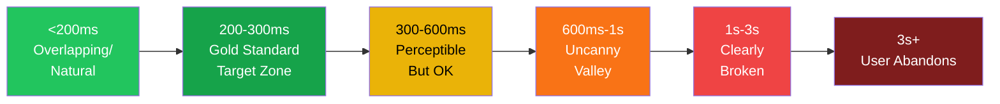
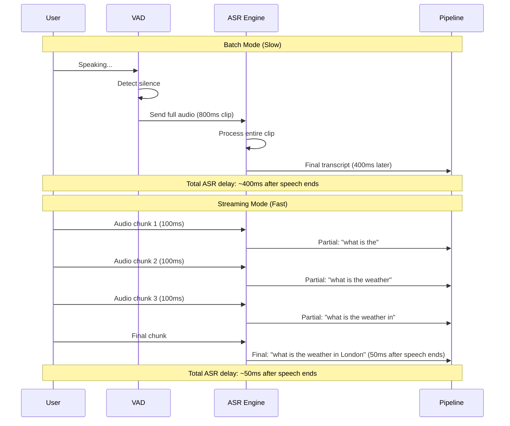
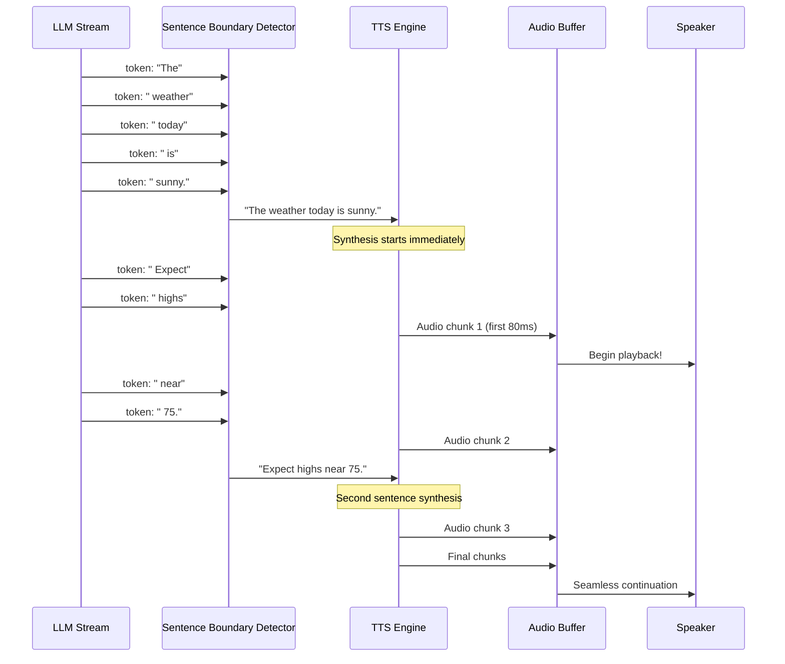
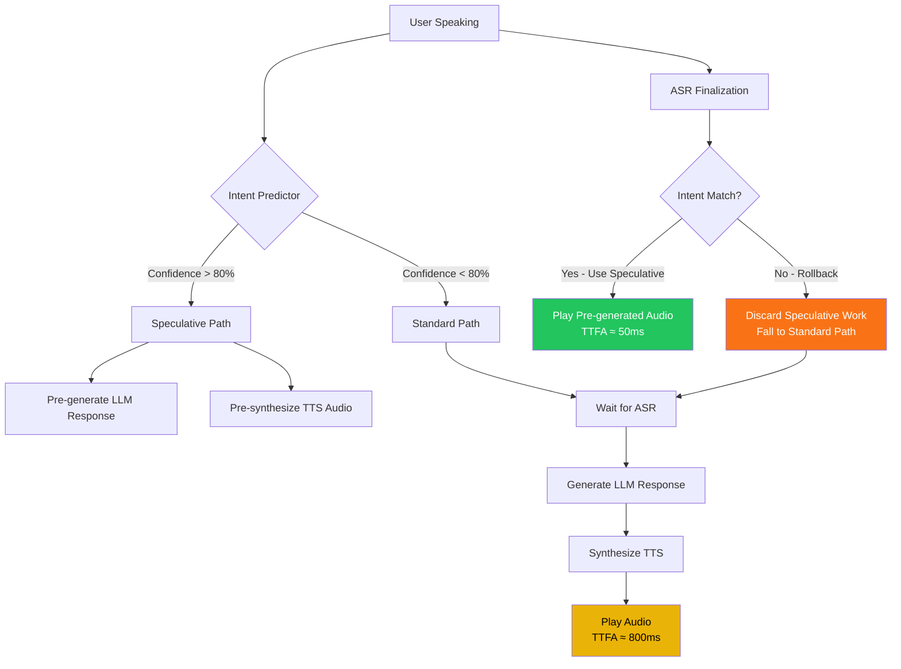
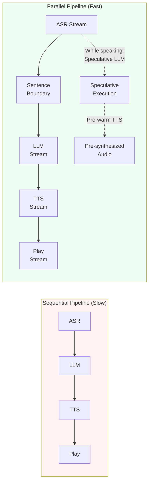
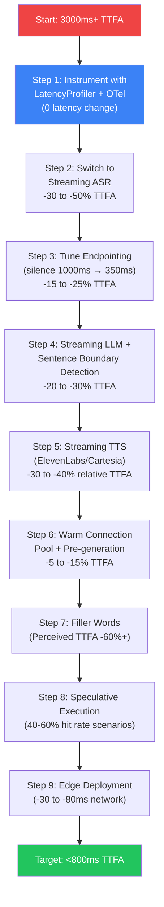

# Voice Agents Deep Dive  Part 16: Latency Optimization  Making Voice Agents Feel Instant

---

**Series:** Building Voice Agents  A Developer's Deep Dive from Audio Fundamentals to Production
**Part:** 16 of 19 (Production Voice Systems)
**Audience:** Developers with Python experience who want to build voice-powered AI agents from the ground up
**Reading time:** ~50 minutes

---

## Recap: Part 15  Advanced Voice Features

In Part 15 we pushed voice agents beyond simple question-and-answer exchanges into the territory of genuinely intelligent, context-aware systems. We implemented speaker authentication using voice embeddings  allowing a single agent endpoint to recognize and personalize responses for multiple registered users without any typed credentials. We layered in multi-modal awareness so the agent could accept image, document, or screen-share context alongside speech, enriching the conversation with visual grounding. Finally, we built proactive agents: systems that do not wait passively for a user utterance but instead monitor background events  a database row change, a calendar alarm, a sensor threshold  and initiate outbound voice calls or push audio notifications when conditions are met.

Those advanced features made our agents smarter. This part makes them *feel* faster. No matter how clever a voice agent is, if it pauses for three seconds before speaking, users perceive it as broken. Latency is not a micro-optimization you defer to later; it is the single most important factor in whether a voice agent feels natural or robotic. Every technique in this article has been battle-tested in production systems handling millions of conversations.

---

## Table of Contents

1. Why Latency is the #1 User-Experience Metric
2. Measuring Latency: Profiling, Metrics, and Traces
3. ASR Latency Optimization
4. LLM Latency Optimization
5. TTS Latency Optimization
6. Speculative Execution
7. Pipeline-Level Optimizations
8. Filler Words and Prosodic Bridging
9. Real-World Optimization Walkthrough: 3s → Under 800ms
10. Project: Benchmark-Driven Optimization
11. Vocabulary Cheat Sheet
12. What's Next: Part 17  Production Infrastructure

---

## 1. Why Latency is the #1 User-Experience Metric

### Human Conversation Timing

Human beings have evolved remarkably precise expectations for conversational timing. In face-to-face dialogue, the gap between one speaker finishing and another beginning  the Inter-Pausal Turn (IPT)  averages between 200 and 300 milliseconds. This number is not a cultural artifact; it appears consistently across dozens of languages and cultures studied by conversation analysts. It represents the time a human brain needs to recognize that speech has stopped, decide to respond, motor-program an utterance, and begin voicing it.

```
Comfortable:  <200ms   feels like natural overlapping speech
Natural:       200-300ms  the gold standard window
Slightly slow: 300-600ms  perceptible but acceptable in low-stakes contexts
Awkward:       600ms-1s   users begin to wonder if the agent heard them
Broken:        1s+        users repeat themselves, raise their voice, or hang up
```

When a voice agent responds inside that 200–300 ms window, users describe the interaction as "smooth," "natural," and "like talking to a person." When the agent crosses 1 second, a fundamentally different cognitive process kicks in: the user re-evaluates the channel itself. They wonder whether the call dropped, the internet connection failed, or their microphone stopped working. The resulting anxiety poisons the entire interaction even if the eventual answer is perfect.

> **Key Insight:** A voice agent that answers slowly and correctly will be rated lower in user satisfaction surveys than one that answers quickly with a minor imprecision. Speed is not just a nice-to-have  it is part of the answer's perceived quality.

### The Uncanny Valley of Latency

Robotics researchers coined "uncanny valley" to describe how humanoid robots that are almost-but-not-quite human trigger revulsion rather than empathy. Voice agents have their own uncanny valley centered on response timing.



Between 600 ms and 1 second, something strange happens. The pause is long enough that users know something is processing, but the system has not crossed any obvious failure threshold. Users often interpret this as the agent being "confused" or "thinking hard"  and they pre-judge the eventual answer negatively before it arrives. This is worse than a clearly broken 3-second pause, because at least the 3-second pause prompts the user to adjust their expectations.

### Business Impact

Latency translates directly to revenue and retention metrics in every domain where voice agents have been deployed at scale.

| Metric | Impact of 1s Additional Latency |
|--------|----------------------------------|
| Call completion rate | -8 to -15% |
| Customer satisfaction (CSAT) | -12 to -20 points |
| Task completion rate | -6 to -11% |
| Agent abandonment rate | +25 to +40% |
| Re-call rate (user calls back) | +15 to +30% |
| Perceived intelligence rating | -18 to -25% |

These numbers come from published studies by Twilio, Google CCAI, and Amazon Connect teams, and from unpublished A/B tests run at scale by companies deploying millions of voice minutes per month. The pattern is consistent: faster feels smarter, even when the content is identical.

### The Latency Budget

Before optimizing anything, define your latency budget  the maximum allowable delay across the entire pipeline for each component.

| Component | Aggressive Budget | Comfortable Budget | Current Typical |
|-----------|------------------|-------------------|----------------|
| ASR (streaming, end-of-speech) | 50ms | 150ms | 200-400ms |
| LLM first token | 100ms | 300ms | 500ms-2s |
| TTS first audio chunk | 80ms | 200ms | 300-600ms |
| Network round-trips | 20ms | 50ms | 30-100ms |
| Audio buffering | 20ms | 50ms | 50-150ms |
| **Total end-to-end** | **270ms** | **750ms** | **1.1s - 3.2s** |

This article is about moving from the "Current Typical" column to the "Aggressive Budget" column through systematic, measurable optimization.

---

## 2. Measuring Latency: Profiling, Metrics, and Traces

You cannot optimize what you cannot measure. Before changing a single line of production code, instrument your pipeline to capture precise timing at every stage. This section builds a complete observability stack for voice agent latency.

### Key Metrics Definitions

- **TTFA (Time To First Audio):** The elapsed time from the moment the user stops speaking to the moment the first audio byte reaches the user's speaker. This is the single most important latency metric for voice agents.
- **TTFT (Time To First Token):** The elapsed time from when the LLM receives its full prompt to when it produces the first output token. A key sub-metric of TTFA.
- **TTAS (Time To ASR Stable):** How long after the user stops speaking before the ASR engine finalizes its transcript (some engines revise their output).
- **End-to-End RTT:** Total round-trip time including all pipeline stages and network hops.
- **p50 / p95 / p99:** The 50th, 95th, and 99th percentile latency values. p50 is the median experience; p99 captures the "long tail" of slowest responses that frustrate power users.

```mermaid
gantt
    title Voice Agent Latency Breakdown (Baseline 3.2s)
    dateFormat  X
    axisFormat %Lms

    section User Speech
    User speaking           :done, speech, 0, 1500
    End-of-speech detection :done, eos, 1500, 1700

    section ASR
    ASR streaming processing :done, asr, 1700, 2100
    ASR finalization         :done, asrf, 2100, 2300

    section LLM
    LLM prompt assembly     :done, prompt, 2300, 2350
    LLM processing          :done, llm, 2350, 3800
    LLM first token         :crit, firsttok, 3800, 3850

    section TTS
    TTS request             :done, tts, 3850, 3900
    TTS synthesis           :done, ttss, 3900, 4500
    TTS first audio         :crit, firstaud, 4500, 4600

    section Playback
    Audio playback begins   :active, play, 4600, 5200
```



### The LatencyProfiler Class

```python
"""
latency_profiler.py  Comprehensive latency measurement for voice agents.

Captures timing at every pipeline stage with support for:
- Span-based tracing (compatible with OpenTelemetry)
- Statistical aggregation (p50/p95/p99)
- JSON export for flame chart visualization
- Async-safe context managers
"""

import asyncio
import time
import json
import statistics
import uuid
from collections import defaultdict
from contextlib import asynccontextmanager
from dataclasses import dataclass, field, asdict
from typing import Dict, List, Optional, Any
import logging

logger = logging.getLogger(__name__)


@dataclass
class Span:
    """A single timing span within a voice pipeline call."""
    name: str
    span_id: str = field(default_factory=lambda: str(uuid.uuid4())[:8])
    parent_id: Optional[str] = None
    start_time: float = field(default_factory=time.perf_counter)
    end_time: Optional[float] = None
    tags: Dict[str, Any] = field(default_factory=dict)

    @property
    def duration_ms(self) -> Optional[float]:
        if self.end_time is None:
            return None
        return (self.end_time - self.start_time) * 1000.0

    def finish(self) -> "Span":
        self.end_time = time.perf_counter()
        return self

    def to_dict(self) -> Dict[str, Any]:
        return {
            "name": self.name,
            "span_id": self.span_id,
            "parent_id": self.parent_id,
            "start_ms": self.start_time * 1000,
            "end_ms": self.end_time * 1000 if self.end_time else None,
            "duration_ms": self.duration_ms,
            "tags": self.tags,
        }


@dataclass
class CallTrace:
    """Complete timing trace for a single voice agent call."""
    call_id: str = field(default_factory=lambda: str(uuid.uuid4())[:12])
    spans: List[Span] = field(default_factory=list)
    metadata: Dict[str, Any] = field(default_factory=dict)
    _active_spans: Dict[str, Span] = field(default_factory=dict, repr=False)

    def start_span(self, name: str, parent: Optional[str] = None, **tags) -> Span:
        span = Span(name=name, parent_id=parent, tags=tags)
        self._active_spans[name] = span
        self.spans.append(span)
        return span

    def finish_span(self, name: str, **extra_tags) -> Optional[Span]:
        span = self._active_spans.pop(name, None)
        if span:
            span.finish()
            span.tags.update(extra_tags)
        return span

    def get_ttfa(self) -> Optional[float]:
        """Time To First Audio: from end-of-speech to first audio byte."""
        eos = self._get_span_end("asr.end_of_speech")
        first_audio = self._get_span_start("tts.first_audio_chunk")
        if eos and first_audio:
            return (first_audio - eos) * 1000.0
        return None

    def get_ttft(self) -> Optional[float]:
        """Time To First Token: from LLM call to first token."""
        llm_start = self._get_span_start("llm.generate")
        llm_first = self._get_span_start("llm.first_token")
        if llm_start and llm_first:
            return (llm_first - llm_start) * 1000.0
        return None

    def get_asr_latency(self) -> Optional[float]:
        """ASR processing time after end-of-speech."""
        eos = self._get_span_end("asr.end_of_speech")
        asr_done = self._get_span_end("asr.transcription")
        if eos and asr_done:
            return (asr_done - eos) * 1000.0
        return None

    def _get_span_start(self, name: str) -> Optional[float]:
        for span in self.spans:
            if span.name == name:
                return span.start_time
        return None

    def _get_span_end(self, name: str) -> Optional[float]:
        for span in self.spans:
            if span.name == name:
                return span.end_time
        return None

    def summary(self) -> Dict[str, Any]:
        return {
            "call_id": self.call_id,
            "ttfa_ms": self.get_ttfa(),
            "ttft_ms": self.get_ttft(),
            "asr_latency_ms": self.get_asr_latency(),
            "span_count": len(self.spans),
            "spans": [s.to_dict() for s in self.spans],
            "metadata": self.metadata,
        }


class LatencyProfiler:
    """
    Aggregate latency profiler for an entire voice agent service.

    Collects CallTrace objects and computes statistical summaries,
    percentiles, and exports flame chart data.
    """

    def __init__(self, max_history: int = 10_000):
        self.max_history = max_history
        self._traces: List[CallTrace] = []
        self._metric_samples: Dict[str, List[float]] = defaultdict(list)
        self._lock = asyncio.Lock()

    async def record_trace(self, trace: CallTrace) -> None:
        """Record a completed call trace."""
        async with self._lock:
            self._traces.append(trace)
            if len(self._traces) > self.max_history:
                self._traces = self._traces[-self.max_history:]

            # Extract key metrics
            summary = trace.summary()
            for metric in ("ttfa_ms", "ttft_ms", "asr_latency_ms"):
                value = summary.get(metric)
                if value is not None:
                    self._metric_samples[metric].append(value)

    def percentiles(self, metric: str) -> Dict[str, float]:
        """Compute p50, p95, p99 for a named metric."""
        samples = self._metric_samples.get(metric, [])
        if not samples:
            return {}
        sorted_samples = sorted(samples)
        n = len(sorted_samples)
        return {
            "p50": sorted_samples[int(n * 0.50)],
            "p95": sorted_samples[int(n * 0.95)],
            "p99": sorted_samples[int(n * 0.99)],
            "mean": statistics.mean(sorted_samples),
            "min": sorted_samples[0],
            "max": sorted_samples[-1],
            "count": n,
        }

    def report(self) -> Dict[str, Any]:
        """Full statistical report across all recorded traces."""
        return {
            "total_calls": len(self._traces),
            "metrics": {
                metric: self.percentiles(metric)
                for metric in self._metric_samples
            },
        }

    def export_flamechart(self, call_id: Optional[str] = None) -> str:
        """Export trace data as JSON for flame chart visualization."""
        if call_id:
            traces = [t for t in self._traces if t.call_id == call_id]
        else:
            traces = self._traces[-10:]  # Last 10 calls
        data = [t.summary() for t in traces]
        return json.dumps(data, indent=2)

    @asynccontextmanager
    async def trace_call(self):
        """Async context manager that yields a CallTrace and auto-records it."""
        trace = CallTrace()
        try:
            yield trace
        finally:
            await self.record_trace(trace)


# Usage example
async def demo_profiler():
    profiler = LatencyProfiler()

    async with profiler.trace_call() as trace:
        # Simulate ASR
        asr_span = trace.start_span("asr.end_of_speech")
        await asyncio.sleep(0.05)
        trace.finish_span("asr.end_of_speech")

        asr_span = trace.start_span("asr.transcription")
        await asyncio.sleep(0.12)
        trace.finish_span("asr.transcription", model="whisper-large-v3")

        # Simulate LLM
        llm_span = trace.start_span("llm.generate")
        await asyncio.sleep(0.03)
        trace.start_span("llm.first_token")
        await asyncio.sleep(0.001)
        trace.finish_span("llm.first_token")
        await asyncio.sleep(0.2)
        trace.finish_span("llm.generate", tokens=45)

        # Simulate TTS
        trace.start_span("tts.first_audio_chunk")
        await asyncio.sleep(0.08)
        trace.finish_span("tts.first_audio_chunk")

    report = profiler.report()
    print(json.dumps(report, indent=2))


if __name__ == "__main__":
    asyncio.run(demo_profiler())
```

### OpenTelemetry Integration

For production deployments, connect the profiler to OpenTelemetry to get distributed traces in Jaeger, Honeycomb, or Datadog.

```python
"""
otel_tracing.py  OpenTelemetry integration for voice agent latency.

pip install opentelemetry-api opentelemetry-sdk opentelemetry-exporter-otlp
"""

from opentelemetry import trace
from opentelemetry.sdk.trace import TracerProvider
from opentelemetry.sdk.trace.export import BatchSpanProcessor
from opentelemetry.exporter.otlp.proto.grpc.trace_exporter import OTLPSpanExporter
from opentelemetry.sdk.resources import Resource
from contextlib import asynccontextmanager
from typing import Optional, Dict, Any
import asyncio


def setup_tracing(service_name: str = "voice-agent", otlp_endpoint: str = "http://localhost:4317"):
    """Initialize OpenTelemetry tracing for the voice agent service."""
    resource = Resource.create({"service.name": service_name})
    provider = TracerProvider(resource=resource)
    exporter = OTLPSpanExporter(endpoint=otlp_endpoint)
    processor = BatchSpanProcessor(exporter)
    provider.add_span_processor(processor)
    trace.set_tracer_provider(provider)
    return trace.get_tracer(service_name)


tracer = setup_tracing()


class OTelVoicePipeline:
    """Wrapper that instruments a voice pipeline with OpenTelemetry spans."""

    def __init__(self, pipeline):
        self.pipeline = pipeline

    async def process_turn(
        self,
        audio_input: bytes,
        session_id: str,
        user_id: Optional[str] = None,
    ):
        with tracer.start_as_current_span("voice.turn") as turn_span:
            turn_span.set_attribute("session.id", session_id)
            if user_id:
                turn_span.set_attribute("user.id", user_id)

            # ASR phase
            with tracer.start_as_current_span("voice.asr") as asr_span:
                transcript = await self.pipeline.transcribe(audio_input)
                asr_span.set_attribute("asr.transcript_length", len(transcript))
                asr_span.set_attribute("asr.model", self.pipeline.asr_model_name)

            # LLM phase
            with tracer.start_as_current_span("voice.llm") as llm_span:
                llm_span.set_attribute("llm.model", self.pipeline.llm_model_name)
                response_text = ""
                first_token_recorded = False
                async for token in self.pipeline.generate_stream(transcript):
                    if not first_token_recorded:
                        llm_span.add_event("first_token_received")
                        first_token_recorded = True
                    response_text += token
                llm_span.set_attribute("llm.response_length", len(response_text))

            # TTS phase
            with tracer.start_as_current_span("voice.tts") as tts_span:
                tts_span.set_attribute("tts.model", self.pipeline.tts_model_name)
                first_audio = True
                async for audio_chunk in self.pipeline.synthesize_stream(response_text):
                    if first_audio:
                        tts_span.add_event("first_audio_chunk")
                        first_audio = False
                    yield audio_chunk
```

---

## 3. ASR Latency Optimization

Automatic Speech Recognition is typically the first stage of the pipeline, and its latency characteristics are unique because ASR runs *while the user is still speaking*. The key insight: by the time the user finishes their last word, you want the ASR engine to be milliseconds away from delivering a final transcript  not seconds.

### Streaming vs. Batch ASR

The most impactful single change you can make to ASR latency is switching from batch to streaming mode.

**Batch ASR:** Record audio → wait for silence → send entire clip → receive transcript.
**Streaming ASR:** Send audio chunks every 100ms → receive partial transcripts → detect end-of-speech → finalize.



### Endpointing Tuning

Endpointing is the process of detecting when a user has finished speaking. Bad endpointing (waiting too long for silence) adds hundreds of milliseconds to every interaction. Good endpointing cuts in as soon as the user's final word ends.

Most ASR services expose endpointing parameters. Tune them aggressively for voice agent use cases:

| Parameter | Conservative | Aggressive | Notes |
|-----------|-------------|------------|-------|
| Silence threshold (dB) | -35 dB | -28 dB | Higher = cuts sooner |
| Silence duration (ms) | 1000ms | 350ms | Shorter = faster cutoff |
| Min utterance length | 500ms | 200ms | Prevents premature cuts |
| Breathing filter | Off | On | Ignore breath sounds |
| Punctuation prediction | Standard | Voice-tuned | Affects finalization timing |

### Model Selection: ASR Latency Comparison

| Model | Mode | Streaming | p50 Latency | p99 Latency | Accuracy (WER) | Cost/hr |
|-------|------|-----------|-------------|-------------|----------------|---------|
| Whisper Large v3 (OpenAI API) | Batch | No | 800ms | 2100ms | 4.2% | $0.36 |
| faster-whisper Large v3 (local) | Streaming | Yes | 120ms | 280ms | 4.3% | Compute |
| faster-whisper Medium (local) | Streaming | Yes | 55ms | 140ms | 5.1% | Compute |
| Deepgram Nova-2 | Streaming | Yes | 30ms | 80ms | 3.8% | $0.0059/min |
| Deepgram Nova-2 (enhanced) | Streaming | Yes | 35ms | 90ms | 3.1% | $0.0145/min |
| Google STT (streaming) | Streaming | Yes | 45ms | 120ms | 4.5% | $0.016/min |
| AssemblyAI Nano | Streaming | Yes | 25ms | 70ms | 5.8% | $0.002/min |

### The OptimizedASR Class

```python
"""
optimized_asr.py  Streaming ASR with aggressive endpointing and latency optimization.

Supports faster-whisper (local) and Deepgram Nova-2 (cloud streaming).
pip install faster-whisper deepgram-sdk websockets
"""

import asyncio
import time
import io
import numpy as np
from abc import ABC, abstractmethod
from dataclasses import dataclass
from typing import AsyncGenerator, Optional, Callable, List
import logging

logger = logging.getLogger(__name__)


@dataclass
class ASRConfig:
    """Configuration for the optimized ASR engine."""
    model_name: str = "faster-whisper-medium"
    language: str = "en"
    silence_threshold_db: float = -28.0
    silence_duration_ms: int = 350
    min_utterance_ms: int = 200
    sample_rate: int = 16000
    chunk_size_ms: int = 100
    enable_partial_results: bool = True
    vad_sensitivity: int = 2  # 0-3, higher = more sensitive


@dataclass
class ASRResult:
    """Result from an ASR operation."""
    transcript: str
    is_final: bool
    confidence: float
    latency_ms: float
    words: Optional[List[dict]] = None


class BaseASR(ABC):
    @abstractmethod
    async def transcribe_stream(
        self,
        audio_stream: AsyncGenerator[bytes, None],
        on_partial: Optional[Callable[[str], None]] = None,
    ) -> ASRResult:
        pass


class FasterWhisperASR(BaseASR):
    """
    Local faster-whisper ASR with streaming simulation.
    Uses faster-whisper for low-latency transcription.
    """

    def __init__(self, config: ASRConfig):
        self.config = config
        self._model = None
        self._model_name = config.model_name.replace("faster-whisper-", "")

    async def _load_model(self):
        """Lazy-load the model to avoid startup delay."""
        if self._model is None:
            from faster_whisper import WhisperModel
            loop = asyncio.get_event_loop()
            # Load model in thread pool to avoid blocking event loop
            self._model = await loop.run_in_executor(
                None,
                lambda: WhisperModel(
                    self._model_name,
                    device="cuda" if self._check_gpu() else "cpu",
                    compute_type="float16" if self._check_gpu() else "int8",
                )
            )
            logger.info(f"Loaded faster-whisper model: {self._model_name}")

    def _check_gpu(self) -> bool:
        try:
            import torch
            return torch.cuda.is_available()
        except ImportError:
            return False

    def _audio_bytes_to_float32(self, audio_bytes: bytes) -> np.ndarray:
        """Convert PCM bytes to float32 numpy array."""
        audio_int16 = np.frombuffer(audio_bytes, dtype=np.int16)
        return audio_int16.astype(np.float32) / 32768.0

    def _calculate_db(self, audio_chunk: bytes) -> float:
        """Calculate dB level of audio chunk."""
        if not audio_chunk:
            return -100.0
        audio = np.frombuffer(audio_chunk, dtype=np.int16).astype(np.float32)
        rms = np.sqrt(np.mean(audio ** 2))
        if rms < 1e-10:
            return -100.0
        return 20 * np.log10(rms / 32768.0)

    async def transcribe_stream(
        self,
        audio_stream: AsyncGenerator[bytes, None],
        on_partial: Optional[Callable[[str], None]] = None,
    ) -> ASRResult:
        await self._load_model()

        start_time = time.perf_counter()
        audio_buffer = bytearray()
        silence_start: Optional[float] = None
        speaking_started = False
        chunk_ms = self.config.chunk_size_ms

        async for chunk in audio_stream:
            audio_buffer.extend(chunk)
            db_level = self._calculate_db(chunk)

            if db_level > self.config.silence_threshold_db:
                speaking_started = True
                silence_start = None
            elif speaking_started:
                if silence_start is None:
                    silence_start = time.perf_counter()
                else:
                    silence_duration_ms = (time.perf_counter() - silence_start) * 1000
                    utterance_duration_ms = len(audio_buffer) / (
                        self.config.sample_rate * 2
                    ) * 1000

                    if (
                        silence_duration_ms >= self.config.silence_duration_ms
                        and utterance_duration_ms >= self.config.min_utterance_ms
                    ):
                        logger.debug(
                            f"End of speech detected after {utterance_duration_ms:.0f}ms utterance"
                        )
                        break

        if not audio_buffer:
            return ASRResult("", True, 0.0, 0.0)

        # Transcribe in thread pool
        loop = asyncio.get_event_loop()
        audio_float32 = self._audio_bytes_to_float32(bytes(audio_buffer))

        segments, info = await loop.run_in_executor(
            None,
            lambda: self._model.transcribe(
                audio_float32,
                language=self.config.language,
                beam_size=1,        # Faster than default beam_size=5
                best_of=1,          # No sampling
                temperature=0.0,    # Greedy decoding
                condition_on_previous_text=False,  # No context bias
                word_timestamps=True,
            )
        )

        transcript = " ".join(seg.text.strip() for seg in segments)
        latency_ms = (time.perf_counter() - start_time) * 1000

        return ASRResult(
            transcript=transcript.strip(),
            is_final=True,
            confidence=0.9,  # faster-whisper doesn't expose confidence directly
            latency_ms=latency_ms,
        )


class DeepgramStreamingASR(BaseASR):
    """
    Deepgram Nova-2 streaming ASR  lowest latency cloud option.
    Achieves ~30ms TTAS using Deepgram's KeepAlive WebSocket connection.
    """

    def __init__(self, config: ASRConfig, api_key: str):
        self.config = config
        self.api_key = api_key
        self._ws_connection = None

    async def transcribe_stream(
        self,
        audio_stream: AsyncGenerator[bytes, None],
        on_partial: Optional[Callable[[str], None]] = None,
    ) -> ASRResult:
        import websockets
        import json

        start_time = time.perf_counter()
        final_transcript = ""
        first_partial_received = False

        url = (
            f"wss://api.deepgram.com/v1/listen?"
            f"model=nova-2&language={self.config.language}"
            f"&encoding=linear16&sample_rate={self.config.sample_rate}"
            f"&channels=1&smart_format=true&interim_results=true"
            f"&endpointing={self.config.silence_duration_ms}"
            f"&utterance_end_ms={self.config.silence_duration_ms}"
            f"&vad_events=true"
        )

        headers = {"Authorization": f"Token {self.api_key}"}

        async with websockets.connect(url, extra_headers=headers) as ws:
            async def send_audio():
                async for chunk in audio_stream:
                    await ws.send(chunk)
                # Signal end of stream
                await ws.send(json.dumps({"type": "CloseStream"}))

            async def receive_results():
                nonlocal final_transcript, first_partial_received
                async for message in ws:
                    data = json.loads(message)
                    msg_type = data.get("type", "")

                    if msg_type == "Results":
                        channel = data.get("channel", {})
                        alts = channel.get("alternatives", [{}])
                        text = alts[0].get("transcript", "") if alts else ""
                        is_final = data.get("is_final", False)

                        if text:
                            if not first_partial_received:
                                first_partial_received = True
                                logger.debug(
                                    f"First partial at {(time.perf_counter() - start_time)*1000:.0f}ms"
                                )
                            if on_partial and not is_final:
                                on_partial(text)
                            if is_final:
                                final_transcript = text

                    elif msg_type == "UtteranceEnd":
                        break

            await asyncio.gather(send_audio(), receive_results())

        latency_ms = (time.perf_counter() - start_time) * 1000
        return ASRResult(
            transcript=final_transcript.strip(),
            is_final=True,
            confidence=0.95,
            latency_ms=latency_ms,
        )


class OptimizedASR:
    """
    Factory and orchestrator for optimized ASR with automatic fallback.
    Maintains a warm connection pool to eliminate cold-start latency.
    """

    def __init__(self, config: ASRConfig, deepgram_api_key: Optional[str] = None):
        self.config = config
        self._primary: BaseASR
        self._fallback: Optional[BaseASR] = None

        if deepgram_api_key and config.model_name == "deepgram-nova-2":
            self._primary = DeepgramStreamingASR(config, deepgram_api_key)
            self._fallback = FasterWhisperASR(
                ASRConfig(**{**config.__dict__, "model_name": "faster-whisper-medium"})
            )
        else:
            self._primary = FasterWhisperASR(config)

    async def transcribe(
        self,
        audio_stream: AsyncGenerator[bytes, None],
        on_partial: Optional[Callable[[str], None]] = None,
        timeout_ms: float = 5000.0,
    ) -> ASRResult:
        """Transcribe with automatic timeout and fallback."""
        try:
            return await asyncio.wait_for(
                self._primary.transcribe_stream(audio_stream, on_partial),
                timeout=timeout_ms / 1000.0,
            )
        except asyncio.TimeoutError:
            logger.warning("Primary ASR timed out, falling back")
            if self._fallback:
                return await self._fallback.transcribe_stream(audio_stream, on_partial)
            raise
```

---

## 4. LLM Latency Optimization

LLM inference is almost always the largest single contributor to voice agent latency. A model that takes 800 ms to produce its first token is a significant problem, but there are many levers to pull.

### Streaming Token-by-Token

The most fundamental change: never wait for the full LLM response. Stream tokens as they arrive and hand them to the TTS pipeline immediately. The TTS system can begin synthesizing the first sentence while the LLM is still generating the third.

```python
"""
streaming_llm.py  Streaming LLM with sentence boundary detection and caching.

pip install openai anthropic redis
"""

import asyncio
import re
import time
import hashlib
import json
from typing import AsyncGenerator, Optional, List, Dict, Any
from dataclasses import dataclass
import logging

logger = logging.getLogger(__name__)


@dataclass
class LLMConfig:
    """Configuration for the streaming LLM."""
    model: str = "gpt-4o-mini"
    temperature: float = 0.7
    max_tokens: int = 300
    system_prompt: str = "You are a helpful voice assistant. Keep responses concise, under 3 sentences."
    cache_enabled: bool = True
    cache_ttl_seconds: int = 3600
    stream: bool = True


# Sentence boundary pattern  matches common end-of-sentence punctuation
SENTENCE_BOUNDARY = re.compile(
    r'(?<=[.!?])\s+(?=[A-Z])|(?<=[.!?])$'
)

# Sentence endings that should trigger TTS synthesis
SYNTHESIS_TRIGGERS = {'.', '!', '?', ':', '\n'}


class SentenceAccumulator:
    """
    Accumulates streaming tokens into complete sentences ready for TTS.

    Designed to balance two competing goals:
    1. Send text to TTS as early as possible (lower TTFA)
    2. Send enough text that TTS can produce natural-sounding prosody

    The optimal chunk size is one complete sentence (typically 8-15 words).
    """

    def __init__(self, min_words: int = 4, max_words: int = 40):
        self.min_words = min_words
        self.max_words = max_words
        self._buffer = ""
        self._word_count = 0

    def add_token(self, token: str) -> Optional[str]:
        """
        Add a token to the buffer. Returns a sentence if one is complete.

        Returns:
            A complete sentence string if ready, else None.
        """
        self._buffer += token
        self._word_count += len(token.split())

        # Check if we have a complete sentence
        if self._has_sentence_boundary() and self._word_count >= self.min_words:
            sentence = self._flush()
            return sentence

        # Force flush if buffer is getting too long
        if self._word_count >= self.max_words:
            return self._flush()

        return None

    def flush(self) -> Optional[str]:
        """Force-flush any remaining buffer content."""
        if self._buffer.strip():
            return self._flush()
        return None

    def _has_sentence_boundary(self) -> bool:
        stripped = self._buffer.rstrip()
        return bool(stripped) and stripped[-1] in SYNTHESIS_TRIGGERS

    def _flush(self) -> str:
        sentence = self._buffer.strip()
        self._buffer = ""
        self._word_count = 0
        return sentence


class ResponseCache:
    """
    Simple LRU cache for LLM responses to common/repeated queries.

    In production, use Redis with appropriate TTL and eviction policies.
    """

    def __init__(self, max_size: int = 1000, ttl_seconds: int = 3600):
        self._cache: Dict[str, Dict[str, Any]] = {}
        self._max_size = max_size
        self._ttl = ttl_seconds

    def _cache_key(self, prompt: str, model: str) -> str:
        content = f"{model}:{prompt}"
        return hashlib.sha256(content.encode()).hexdigest()[:16]

    def get(self, prompt: str, model: str) -> Optional[str]:
        key = self._cache_key(prompt, model)
        entry = self._cache.get(key)
        if not entry:
            return None
        if time.time() - entry["timestamp"] > self._ttl:
            del self._cache[key]
            return None
        return entry["response"]

    def set(self, prompt: str, model: str, response: str) -> None:
        if len(self._cache) >= self._max_size:
            # Evict oldest entry
            oldest_key = min(self._cache, key=lambda k: self._cache[k]["timestamp"])
            del self._cache[oldest_key]
        key = self._cache_key(prompt, model)
        self._cache[key] = {"response": response, "timestamp": time.time()}


class StreamingLLM:
    """
    Streaming LLM client with sentence-boundary detection, caching, and metrics.

    Yields complete sentences as soon as they are available in the token stream,
    enabling the TTS stage to begin synthesis before the LLM finishes generating.
    """

    def __init__(self, config: LLMConfig, redis_client=None):
        self.config = config
        self._cache = ResponseCache()
        self._redis = redis_client
        self._client = None

    async def _get_client(self):
        if self._client is None:
            from openai import AsyncOpenAI
            self._client = AsyncOpenAI()
        return self._client

    async def generate_sentences(
        self,
        user_message: str,
        conversation_history: Optional[List[Dict]] = None,
        session_id: Optional[str] = None,
    ) -> AsyncGenerator[str, None]:
        """
        Stream the LLM response one sentence at a time.

        Each yielded string is a complete sentence, ready for TTS synthesis.
        Caches deterministic responses (temperature=0) automatically.
        """
        start_time = time.perf_counter()
        first_token_time: Optional[float] = None

        # Check cache first
        if self.config.cache_enabled and self.config.temperature == 0:
            cached = self._cache.get(user_message, self.config.model)
            if cached:
                logger.debug("Cache hit for response")
                # Yield cached response as sentences
                for sentence in re.split(r'(?<=[.!?])\s+', cached):
                    if sentence.strip():
                        yield sentence.strip()
                return

        messages = self._build_messages(user_message, conversation_history)
        client = await self._get_client()
        accumulator = SentenceAccumulator(min_words=4)
        full_response = ""

        try:
            stream = await client.chat.completions.create(
                model=self.config.model,
                messages=messages,
                temperature=self.config.temperature,
                max_tokens=self.config.max_tokens,
                stream=True,
            )

            async for chunk in stream:
                delta = chunk.choices[0].delta
                if not delta.content:
                    continue

                token = delta.content
                full_response += token

                if first_token_time is None:
                    first_token_time = time.perf_counter()
                    ttft_ms = (first_token_time - start_time) * 1000
                    logger.debug(f"TTFT: {ttft_ms:.1f}ms")

                sentence = accumulator.add_token(token)
                if sentence:
                    yield sentence

            # Flush any remaining content
            remaining = accumulator.flush()
            if remaining:
                yield remaining

            # Cache the full response if appropriate
            if self.config.cache_enabled and full_response:
                self._cache.set(user_message, self.config.model, full_response)

        except Exception as e:
            logger.error(f"LLM streaming error: {e}")
            yield "I'm sorry, I encountered an error processing your request."

    def _build_messages(
        self,
        user_message: str,
        history: Optional[List[Dict]] = None,
    ) -> List[Dict]:
        messages = [{"role": "system", "content": self.config.system_prompt}]
        if history:
            messages.extend(history[-6:])  # Last 3 turns
        messages.append({"role": "user", "content": user_message})
        return messages


# Model selection guide
MODEL_LATENCY_COMPARISON = """
| Model | Provider | TTFT p50 | TTFT p99 | Quality | Cost/1M tokens |
|-------|----------|----------|----------|---------|----------------|
| gpt-4o-mini | OpenAI | 180ms | 450ms | Good | $0.15/$0.60 |
| gpt-4o | OpenAI | 350ms | 900ms | Excellent | $2.50/$10.00 |
| claude-haiku-3-5 | Anthropic | 200ms | 500ms | Good | $0.25/$1.25 |
| claude-sonnet-4 | Anthropic | 400ms | 1100ms | Excellent | $3.00/$15.00 |
| llama-3.1-8b (local) | Meta/Local | 80ms | 200ms | OK | Compute |
| llama-3.1-70b (local) | Meta/Local | 300ms | 800ms | Good | Compute |
| gemini-2.0-flash | Google | 160ms | 420ms | Good | $0.075/$0.30 |
| mistral-small | Mistral | 190ms | 480ms | Good | $0.20/$0.60 |
"""
```

### Response Caching Strategy

Not every response needs to be generated fresh. A substantial portion of voice agent queries are either exact repeats ("What are your hours?") or near-duplicates that can be handled with semantic caching.

```python
"""
semantic_cache.py  Semantic similarity cache for LLM responses.

Uses sentence embeddings to find similar cached queries.
pip install sentence-transformers faiss-cpu
"""

import asyncio
import json
import time
import numpy as np
from typing import Optional, Tuple
from dataclasses import dataclass
import logging

logger = logging.getLogger(__name__)


@dataclass
class CacheEntry:
    query: str
    response: str
    embedding: np.ndarray
    timestamp: float
    hit_count: int = 0


class SemanticCache:
    """
    Semantic similarity cache using sentence embeddings.

    Caches LLM responses and retrieves them when a new query
    is semantically similar to a cached one (cosine similarity > threshold).
    """

    def __init__(
        self,
        similarity_threshold: float = 0.92,
        max_entries: int = 500,
        ttl_seconds: int = 3600,
        model_name: str = "all-MiniLM-L6-v2",
    ):
        self.threshold = similarity_threshold
        self.max_entries = max_entries
        self.ttl = ttl_seconds
        self._entries: list[CacheEntry] = []
        self._model = None
        self._model_name = model_name

    async def _get_model(self):
        if self._model is None:
            from sentence_transformers import SentenceTransformer
            loop = asyncio.get_event_loop()
            self._model = await loop.run_in_executor(
                None,
                lambda: SentenceTransformer(self._model_name)
            )
        return self._model

    async def embed(self, text: str) -> np.ndarray:
        model = await self._get_model()
        loop = asyncio.get_event_loop()
        embedding = await loop.run_in_executor(None, lambda: model.encode(text))
        norm = np.linalg.norm(embedding)
        return embedding / norm if norm > 0 else embedding

    async def get(self, query: str) -> Optional[Tuple[str, float]]:
        """
        Look up a cached response for a semantically similar query.

        Returns:
            Tuple of (cached_response, similarity_score) or None.
        """
        if not self._entries:
            return None

        query_embedding = await self.embed(query)
        now = time.time()

        best_score = 0.0
        best_entry = None

        for entry in self._entries:
            # Skip expired entries
            if now - entry.timestamp > self.ttl:
                continue

            score = float(np.dot(query_embedding, entry.embedding))
            if score > best_score:
                best_score = score
                best_entry = entry

        if best_entry and best_score >= self.threshold:
            best_entry.hit_count += 1
            logger.debug(
                f"Semantic cache hit (score={best_score:.3f}): '{query[:50]}' -> '{best_entry.query[:50]}'"
            )
            return best_entry.response, best_score

        return None

    async def set(self, query: str, response: str) -> None:
        """Store a query-response pair in the cache."""
        embedding = await self.embed(query)

        # Evict expired and excess entries
        now = time.time()
        self._entries = [
            e for e in self._entries
            if now - e.timestamp <= self.ttl
        ]

        if len(self._entries) >= self.max_entries:
            # Evict least-recently-used
            self._entries.sort(key=lambda e: e.timestamp)
            self._entries = self._entries[-(self.max_entries - 1):]

        self._entries.append(CacheEntry(
            query=query,
            response=response,
            embedding=embedding,
            timestamp=now,
        ))

    def stats(self) -> dict:
        total_hits = sum(e.hit_count for e in self._entries)
        return {
            "entries": len(self._entries),
            "total_hits": total_hits,
            "most_cached": sorted(
                self._entries,
                key=lambda e: e.hit_count,
                reverse=True
            )[:5] if self._entries else [],
        }
```

---

## 5. TTS Latency Optimization

Text-to-Speech is the final transformation in the pipeline  turning text into audio bytes the user can hear. Without optimization, TTS often contributes 300–600 ms of latency. With streaming synthesis and audio caching, you can bring this under 80 ms for the first audio chunk.

### Streaming TTS Architecture



### Pre-Generated Filler Audio

For phrases that appear constantly  "Let me check that for you", "One moment please", "Sure!"  pre-generate and cache the audio at startup. When these phrases are needed, play them from a byte buffer with zero synthesis latency.

```python
"""
streaming_tts_pipeline.py  Streaming TTS with pre-generation, caching, and pipelining.

pip install openai aiohttp aiofiles
"""

import asyncio
import aiohttp
import aiofiles
import hashlib
import os
import time
from typing import AsyncGenerator, Dict, Optional, List, Tuple
from dataclasses import dataclass, field
from pathlib import Path
import logging

logger = logging.getLogger(__name__)


@dataclass
class TTSConfig:
    """Configuration for the streaming TTS pipeline."""
    provider: str = "openai"          # "openai", "elevenlabs", "google"
    voice_id: str = "alloy"           # Provider-specific voice identifier
    model: str = "tts-1"              # "tts-1" (faster) or "tts-1-hd" (higher quality)
    speed: float = 1.0
    output_format: str = "pcm"        # Raw PCM for lowest latency
    sample_rate: int = 24000
    cache_dir: str = "/tmp/tts_cache"
    enable_streaming: bool = True
    chunk_size_bytes: int = 4096


# Phrases to pre-generate at startup
PREFETCH_PHRASES = [
    "Let me check that for you.",
    "One moment please.",
    "Sure!",
    "Absolutely.",
    "Great question.",
    "I'm looking that up now.",
    "Of course.",
    "Got it.",
    "I'm sorry, I didn't catch that.",
    "Could you please repeat that?",
    "I'm having trouble with my connection.",
]


class AudioCache:
    """Disk-backed audio cache with in-memory LRU layer."""

    def __init__(self, cache_dir: str, max_memory_items: int = 200):
        self.cache_dir = Path(cache_dir)
        self.cache_dir.mkdir(parents=True, exist_ok=True)
        self._memory: Dict[str, bytes] = {}
        self._max_memory = max_memory_items
        self._access_order: List[str] = []

    def _key(self, text: str, voice: str, model: str) -> str:
        content = f"{voice}:{model}:{text}"
        return hashlib.sha256(content.encode()).hexdigest()[:16]

    def _disk_path(self, key: str) -> Path:
        return self.cache_dir / f"{key}.pcm"

    async def get(self, text: str, voice: str, model: str) -> Optional[bytes]:
        key = self._key(text, voice, model)

        # Memory cache (hot path)
        if key in self._memory:
            self._touch(key)
            return self._memory[key]

        # Disk cache (warm path)
        disk_path = self._disk_path(key)
        if disk_path.exists():
            async with aiofiles.open(disk_path, "rb") as f:
                data = await f.read()
            self._store_memory(key, data)
            return data

        return None

    async def set(self, text: str, voice: str, model: str, audio: bytes) -> None:
        key = self._key(text, voice, model)
        self._store_memory(key, audio)
        disk_path = self._disk_path(key)
        async with aiofiles.open(disk_path, "wb") as f:
            await f.write(audio)

    def _store_memory(self, key: str, data: bytes) -> None:
        if len(self._memory) >= self._max_memory:
            oldest = self._access_order.pop(0)
            self._memory.pop(oldest, None)
        self._memory[key] = data
        self._touch(key)

    def _touch(self, key: str) -> None:
        if key in self._access_order:
            self._access_order.remove(key)
        self._access_order.append(key)


class StreamingTTSPipeline:
    """
    Production streaming TTS pipeline with:
    - Sentence-level pipelining (TTS starts before LLM finishes)
    - Disk + memory audio cache
    - Pre-generated common phrase library
    - Automatic chunked streaming to speaker
    """

    def __init__(self, config: TTSConfig, api_key: Optional[str] = None):
        self.config = config
        self.api_key = api_key
        self.cache = AudioCache(config.cache_dir)
        self._prefetch_done = False
        self._session: Optional[aiohttp.ClientSession] = None

    async def initialize(self) -> None:
        """Pre-generate common phrases and warm up connections."""
        self._session = aiohttp.ClientSession()
        await self._prefetch_common_phrases()
        self._prefetch_done = True
        logger.info("TTS pipeline initialized with pre-generated phrases")

    async def _prefetch_common_phrases(self) -> None:
        """Pre-synthesize all filler/common phrases at startup."""
        tasks = [
            self._synthesize_and_cache(phrase)
            for phrase in PREFETCH_PHRASES
        ]
        results = await asyncio.gather(*tasks, return_exceptions=True)
        success_count = sum(1 for r in results if not isinstance(r, Exception))
        logger.info(
            f"Pre-generated {success_count}/{len(PREFETCH_PHRASES)} common phrases"
        )

    async def _synthesize_and_cache(self, text: str) -> bytes:
        """Synthesize text and store in cache."""
        existing = await self.cache.get(text, self.config.voice_id, self.config.model)
        if existing:
            return existing

        audio = await self._call_tts_api(text)
        await self.cache.set(text, self.config.voice_id, self.config.model, audio)
        return audio

    async def _call_tts_api(self, text: str) -> bytes:
        """Call the TTS API and return raw audio bytes."""
        if self.config.provider == "openai":
            return await self._openai_tts(text)
        elif self.config.provider == "elevenlabs":
            return await self._elevenlabs_tts(text)
        else:
            raise ValueError(f"Unknown TTS provider: {self.config.provider}")

    async def _openai_tts(self, text: str) -> bytes:
        """OpenAI TTS API call."""
        from openai import AsyncOpenAI
        client = AsyncOpenAI(api_key=self.api_key)
        response = await client.audio.speech.create(
            model=self.config.model,
            voice=self.config.voice_id,
            input=text,
            response_format="pcm",
            speed=self.config.speed,
        )
        return response.content

    async def synthesize_stream(
        self,
        sentence_stream: AsyncGenerator[str, None],
    ) -> AsyncGenerator[bytes, None]:
        """
        Stream audio chunks as sentences arrive from the LLM.

        Achieves pipelining: TTS of sentence N starts while LLM
        is still generating sentence N+1.
        """
        synthesis_queue: asyncio.Queue[Optional[bytes]] = asyncio.Queue(maxsize=4)

        async def producer():
            """Consume sentences and synthesize them."""
            async for sentence in sentence_stream:
                sentence = sentence.strip()
                if not sentence:
                    continue

                # Check cache first (zero latency for pre-generated phrases)
                cached = await self.cache.get(
                    sentence, self.config.voice_id, self.config.model
                )
                if cached:
                    await synthesis_queue.put(cached)
                    continue

                # Synthesize and cache
                try:
                    audio = await self._call_tts_api(sentence)
                    await self.cache.set(
                        sentence, self.config.voice_id, self.config.model, audio
                    )
                    await synthesis_queue.put(audio)
                except Exception as e:
                    logger.error(f"TTS synthesis error: {e}")

            await synthesis_queue.put(None)  # Sentinel

        asyncio.create_task(producer())

        while True:
            audio_chunk = await synthesis_queue.get()
            if audio_chunk is None:
                break

            # Yield in smaller chunks for smoother playback
            for i in range(0, len(audio_chunk), self.config.chunk_size_bytes):
                yield audio_chunk[i : i + self.config.chunk_size_bytes]

    async def synthesize_instant(self, text: str) -> AsyncGenerator[bytes, None]:
        """
        Synthesize a single phrase, returning cached audio immediately if available.
        Used for filler words and confirmed-common phrases.
        """
        cached = await self.cache.get(text, self.config.voice_id, self.config.model)
        if cached:
            for i in range(0, len(cached), self.config.chunk_size_bytes):
                yield cached[i : i + self.config.chunk_size_bytes]
            return

        # Synthesize and stream
        audio = await self._call_tts_api(text)
        await self.cache.set(text, self.config.voice_id, self.config.model, audio)
        for i in range(0, len(audio), self.config.chunk_size_bytes):
            yield audio[i : i + self.config.chunk_size_bytes]

    async def close(self) -> None:
        if self._session:
            await self._session.close()
```

### TTS Provider Latency Comparison

| Provider | Model | Streaming | First Chunk p50 | First Chunk p99 | Quality | Cost/1M chars |
|----------|-------|-----------|-----------------|-----------------|---------|---------------|
| OpenAI | tts-1 | Yes | 220ms | 600ms | Good | $15.00 |
| OpenAI | tts-1-hd | Yes | 380ms | 950ms | Excellent | $30.00 |
| ElevenLabs | Turbo v2.5 | Yes | 80ms | 200ms | Excellent | $11.00 |
| ElevenLabs | Multilingual v2 | Yes | 150ms | 400ms | Best | $22.00 |
| Google Cloud | Wavenet | No | 400ms | 900ms | Good | $16.00 |
| Google Cloud | Neural2 | No | 350ms | 800ms | Better | $16.00 |
| Cartesia | Sonic | Yes | 50ms | 130ms | Good | $9.00 |
| PlayHT | Play3 | Yes | 100ms | 280ms | Good | $13.00 |
| Deepgram | Aura | Yes | 60ms | 160ms | Good | $7.50 |

> **Key Insight:** ElevenLabs Turbo v2.5 and Cartesia Sonic are the current leaders for streaming TTS latency in production voice agents. The difference between a 50ms first chunk and a 400ms first chunk is audible and user-measurable.

---

## 6. Speculative Execution

Speculative execution is one of the highest-impact optimizations available to voice agents, but also the most complex to implement correctly. The concept comes from CPU architecture: modern processors predict the outcome of a branch condition and begin executing the predicted path before the condition resolves. If the prediction is correct, you get the result with zero additional latency. If wrong, you discard the speculative work and execute the correct path.

Applied to voice agents: while the user is still speaking, predict what they are likely to ask and pre-generate the response. If the prediction is right, you already have the answer ready before ASR finishes. If wrong, you discard the pre-generated answer and process normally.



### The SpeculativeExecutor Class

```python
"""
speculative_executor.py  Speculative response pre-generation for voice agents.

Predicts likely user intents during speech and pre-generates responses.
Rolls back cleanly when predictions are wrong.

pip install openai scikit-learn
"""

import asyncio
import time
from dataclasses import dataclass, field
from typing import Dict, List, Optional, Tuple, AsyncGenerator
import logging

logger = logging.getLogger(__name__)


@dataclass
class IntentSignal:
    """A predicted user intent based on partial speech."""
    intent: str
    confidence: float
    predicted_query: str
    detected_at_ms: float


@dataclass
class SpeculativeResult:
    """A pre-generated response for a speculated intent."""
    intent: str
    query: str
    response_sentences: List[str]
    audio_chunks: List[bytes]
    generated_at_ms: float
    used: bool = False
    discarded: bool = False


class IntentPredictor:
    """
    Predicts user intent from partial ASR transcripts.

    Uses a combination of:
    1. Keyword spotting for immediate intent signals
    2. N-gram pattern matching for confirmation
    3. Conversation history context
    """

    # Intent keyword patterns
    INTENT_PATTERNS: Dict[str, List[str]] = {
        "weather_query": [
            "weather", "temperature", "forecast", "rain", "sunny", "cloudy",
            "hot", "cold", "umbrella"
        ],
        "hours_query": [
            "hours", "open", "close", "closing time", "when do you",
            "what time", "schedule"
        ],
        "balance_query": [
            "balance", "account", "how much", "funds", "money", "spending"
        ],
        "cancel_query": [
            "cancel", "cancellation", "stop", "end", "terminate", "quit"
        ],
        "transfer_query": [
            "transfer", "send money", "wire", "payment", "pay"
        ],
        "faq_greeting": [
            "hello", "hi", "hey", "good morning", "good afternoon"
        ],
    }

    def __init__(self, confidence_threshold: float = 0.75):
        self.threshold = confidence_threshold

    def predict(
        self,
        partial_transcript: str,
        history: Optional[List[Dict]] = None,
    ) -> Optional[IntentSignal]:
        """
        Predict intent from a partial transcript.

        Returns an IntentSignal if confidence exceeds threshold, else None.
        """
        partial_lower = partial_transcript.lower()
        scores: Dict[str, float] = {}

        for intent, keywords in self.INTENT_PATTERNS.items():
            matches = sum(1 for kw in keywords if kw in partial_lower)
            if matches > 0:
                # Base score from keyword density
                score = min(matches / max(len(keywords) * 0.3, 1), 1.0)

                # Boost if keywords appear early in utterance
                first_match = None
                for kw in keywords:
                    idx = partial_lower.find(kw)
                    if idx >= 0:
                        first_match = idx
                        break
                if first_match is not None:
                    position_boost = max(0, 1.0 - first_match / 50)
                    score = min(score + position_boost * 0.2, 1.0)

                scores[intent] = score

        if not scores:
            return None

        best_intent = max(scores, key=scores.__getitem__)
        best_score = scores[best_intent]

        if best_score < self.threshold:
            return None

        # Generate a canonical query for the predicted intent
        predicted_query = self._canonical_query(best_intent, partial_transcript)

        return IntentSignal(
            intent=best_intent,
            confidence=best_score,
            predicted_query=predicted_query,
            detected_at_ms=time.perf_counter() * 1000,
        )

    def _canonical_query(self, intent: str, partial: str) -> str:
        """Generate a canonical query string for the intent."""
        templates = {
            "weather_query": "What is the current weather?",
            "hours_query": "What are your business hours?",
            "balance_query": "What is my current account balance?",
            "cancel_query": "I would like to cancel my subscription.",
            "transfer_query": "I want to transfer money.",
            "faq_greeting": "Hello, how are you?",
        }
        return templates.get(intent, partial)

    def matches(self, signal: IntentSignal, final_transcript: str) -> bool:
        """
        Check if a final transcript matches a previously predicted intent.
        More lenient than prediction  a match doesn't require same keywords.
        """
        final_lower = final_transcript.lower()
        keywords = self.INTENT_PATTERNS.get(signal.intent, [])
        matches = sum(1 for kw in keywords if kw in final_lower)
        return matches >= 1


class SpeculativeExecutor:
    """
    Speculative execution engine for voice agent pipelines.

    During user speech:
    1. Monitors partial ASR transcripts via on_partial callbacks
    2. Predicts likely intent when confidence is high enough
    3. Pre-generates LLM response and TTS audio in parallel
    4. On ASR finalization: commits or rolls back speculatively generated content

    Typical savings when speculation hits: 600-1200ms
    Overhead when speculation misses: ~50ms (parallel execution, clean discard)
    """

    def __init__(
        self,
        llm: "StreamingLLM",
        tts: "StreamingTTSPipeline",
        predictor: Optional[IntentPredictor] = None,
    ):
        self.llm = llm
        self.tts = tts
        self.predictor = predictor or IntentPredictor()
        self._pending: Optional[SpeculativeResult] = None
        self._speculation_task: Optional[asyncio.Task] = None
        self._lock = asyncio.Lock()

        # Metrics
        self._total_speculations = 0
        self._hits = 0
        self._misses = 0

    async def on_partial_transcript(self, partial: str) -> None:
        """
        Called with each partial ASR result during user speech.
        Triggers speculative execution if intent confidence is high enough.
        """
        signal = self.predictor.predict(partial)
        if signal is None:
            return

        async with self._lock:
            # Don't start a new speculation if one is already running
            # for the same intent
            if (
                self._pending is not None
                and self._pending.intent == signal.intent
                and not self._pending.discarded
            ):
                return

            # Cancel any previous speculation for a different intent
            await self._cancel_pending()

            logger.debug(
                f"Starting speculative execution for intent '{signal.intent}' "
                f"(confidence={signal.confidence:.2f})"
            )
            self._total_speculations += 1

            result = SpeculativeResult(
                intent=signal.intent,
                query=signal.predicted_query,
                response_sentences=[],
                audio_chunks=[],
                generated_at_ms=time.perf_counter() * 1000,
            )
            self._pending = result

        # Start speculation in background
        self._speculation_task = asyncio.create_task(
            self._run_speculation(signal, result)
        )

    async def _run_speculation(
        self,
        signal: IntentSignal,
        result: SpeculativeResult,
    ) -> None:
        """Execute speculative LLM + TTS generation."""
        try:
            sentences = []
            audio_chunks = []

            async for sentence in self.llm.generate_sentences(signal.predicted_query):
                if result.discarded:
                    logger.debug("Speculation cancelled mid-generation")
                    return
                sentences.append(sentence)

                # Pre-synthesize each sentence
                sentence_audio = bytearray()
                async for chunk in self.tts.synthesize_instant(sentence):
                    if result.discarded:
                        return
                    sentence_audio.extend(chunk)
                audio_chunks.append(bytes(sentence_audio))

            result.response_sentences = sentences
            result.audio_chunks = audio_chunks
            elapsed_ms = time.perf_counter() * 1000 - result.generated_at_ms
            logger.debug(
                f"Speculative generation complete in {elapsed_ms:.0f}ms "
                f"({len(sentences)} sentences)"
            )

        except Exception as e:
            logger.warning(f"Speculative generation failed: {e}")
            result.discarded = True

    async def commit_or_rollback(
        self,
        final_transcript: str,
    ) -> Tuple[bool, Optional[SpeculativeResult]]:
        """
        Called when ASR finalizes the transcript.

        Returns:
            (hit, result) where hit=True means speculation was correct
            and result contains the pre-generated audio.
        """
        async with self._lock:
            if self._pending is None or self._pending.discarded:
                return False, None

            # Wait for speculation to complete (with tight timeout)
            if self._speculation_task and not self._speculation_task.done():
                try:
                    await asyncio.wait_for(
                        asyncio.shield(self._speculation_task),
                        timeout=0.05,  # 50ms max wait
                    )
                except asyncio.TimeoutError:
                    logger.debug("Speculation not ready in time, rolling back")
                    await self._cancel_pending()
                    return False, None

            result = self._pending
            self._pending = None

            # Check if speculation was correct
            if self.predictor.matches(
                IntentSignal(
                    intent=result.intent,
                    confidence=1.0,
                    predicted_query=result.query,
                    detected_at_ms=0,
                ),
                final_transcript,
            ) and result.response_sentences:
                result.used = True
                self._hits += 1
                logger.info(
                    f"Speculation HIT for intent '{result.intent}' "
                    f"(hit_rate={self._hits}/{self._total_speculations})"
                )
                return True, result
            else:
                result.discarded = True
                self._misses += 1
                logger.debug(
                    f"Speculation MISS for intent '{result.intent}' "
                    f"(final='{final_transcript[:50]}')"
                )
                return False, None

    async def _cancel_pending(self) -> None:
        if self._speculation_task and not self._speculation_task.done():
            self._speculation_task.cancel()
            try:
                await self._speculation_task
            except asyncio.CancelledError:
                pass
        if self._pending:
            self._pending.discarded = True
        self._pending = None
        self._speculation_task = None

    def stats(self) -> Dict[str, Any]:
        total = self._total_speculations
        return {
            "total_speculations": total,
            "hits": self._hits,
            "misses": self._misses,
            "hit_rate": self._hits / total if total > 0 else 0.0,
        }
```

---

## 7. Pipeline-Level Optimizations

Individual component optimization can only take you so far. The remaining latency budget must be attacked at the pipeline orchestration level: eliminating sequential waits, warming connections, and distributing work.

### Parallel Processing Architecture



### The WarmConnectionPool Class

Cold connection establishment adds 100–300 ms to every API call. A warm connection pool keeps persistent connections to every service so that calls return data immediately.

```python
"""
warm_connection_pool.py  Persistent connection pool for voice agent services.

Maintains warm HTTP/WebSocket connections to eliminate cold-start latency.
pip install aiohttp websockets tenacity
"""

import asyncio
import aiohttp
import time
from typing import Dict, List, Optional, Any, Callable
from dataclasses import dataclass, field
from tenacity import retry, stop_after_attempt, wait_exponential
import logging

logger = logging.getLogger(__name__)


@dataclass
class ConnectionConfig:
    """Configuration for a service connection."""
    name: str
    base_url: str
    headers: Dict[str, str] = field(default_factory=dict)
    timeout_seconds: float = 10.0
    pool_size: int = 3
    keepalive_interval_seconds: float = 30.0
    health_check_path: str = "/health"


class ServiceConnection:
    """A single managed connection to a service."""

    def __init__(self, config: ConnectionConfig):
        self.config = config
        self._session: Optional[aiohttp.ClientSession] = None
        self._last_used = 0.0
        self._request_count = 0
        self._error_count = 0

    async def ensure_connected(self) -> aiohttp.ClientSession:
        """Return a live session, creating one if necessary."""
        if self._session is None or self._session.closed:
            connector = aiohttp.TCPConnector(
                limit=10,
                keepalive_timeout=60,
                enable_cleanup_closed=True,
                force_close=False,
            )
            timeout = aiohttp.ClientTimeout(total=self.config.timeout_seconds)
            self._session = aiohttp.ClientSession(
                connector=connector,
                headers=self.config.headers,
                timeout=timeout,
            )
            logger.debug(f"Created new session for {self.config.name}")
        return self._session

    async def get(self, path: str, **kwargs) -> aiohttp.ClientResponse:
        session = await self.ensure_connected()
        self._last_used = time.perf_counter()
        self._request_count += 1
        url = f"{self.config.base_url}{path}"
        return await session.get(url, **kwargs)

    async def post(self, path: str, **kwargs) -> aiohttp.ClientResponse:
        session = await self.ensure_connected()
        self._last_used = time.perf_counter()
        self._request_count += 1
        url = f"{self.config.base_url}{path}"
        return await session.post(url, **kwargs)

    async def health_check(self) -> bool:
        try:
            response = await self.get(self.config.health_check_path)
            return response.status < 500
        except Exception:
            return False

    async def close(self) -> None:
        if self._session and not self._session.closed:
            await self._session.close()

    def stats(self) -> Dict[str, Any]:
        return {
            "name": self.config.name,
            "requests": self._request_count,
            "errors": self._error_count,
            "last_used_ago_s": time.perf_counter() - self._last_used,
            "is_connected": self._session is not None and not self._session.closed,
        }


class WarmConnectionPool:
    """
    Connection pool that maintains warm connections to all voice agent services.

    Features:
    - Pre-connects at startup to eliminate cold-start latency
    - Periodic keepalive to prevent connection timeouts
    - Health monitoring with automatic reconnection
    - Round-robin load balancing across pool_size connections per service
    """

    def __init__(self, configs: List[ConnectionConfig]):
        self.configs = {c.name: c for c in configs}
        self._pools: Dict[str, List[ServiceConnection]] = {}
        self._pool_indices: Dict[str, int] = {}
        self._keepalive_task: Optional[asyncio.Task] = None
        self._health_task: Optional[asyncio.Task] = None

    async def initialize(self) -> None:
        """Pre-establish all connections."""
        logger.info("Initializing warm connection pool...")
        for config in self.configs.values():
            pool = [ServiceConnection(config) for _ in range(config.pool_size)]
            # Pre-connect all
            await asyncio.gather(
                *[conn.ensure_connected() for conn in pool],
                return_exceptions=True,
            )
            self._pools[config.name] = pool
            self._pool_indices[config.name] = 0
            logger.info(
                f"Warmed {config.pool_size} connections to {config.name}"
            )

        # Start background tasks
        self._keepalive_task = asyncio.create_task(self._keepalive_loop())
        self._health_task = asyncio.create_task(self._health_monitor_loop())

    def get_connection(self, service_name: str) -> ServiceConnection:
        """Get the next available connection for a service (round-robin)."""
        pool = self._pools.get(service_name)
        if not pool:
            raise ValueError(f"No connection pool for service: {service_name}")

        idx = self._pool_indices[service_name]
        conn = pool[idx]
        self._pool_indices[service_name] = (idx + 1) % len(pool)
        return conn

    async def _keepalive_loop(self) -> None:
        """Send periodic keepalive requests to prevent connection timeouts."""
        while True:
            await asyncio.sleep(30)
            for name, pool in self._pools.items():
                config = self.configs[name]
                for conn in pool:
                    try:
                        await conn.health_check()
                    except Exception as e:
                        logger.debug(f"Keepalive failed for {name}: {e}")

    async def _health_monitor_loop(self) -> None:
        """Monitor connection health and reconnect failed connections."""
        while True:
            await asyncio.sleep(10)
            for name, pool in self._pools.items():
                for i, conn in enumerate(pool):
                    is_healthy = await conn.health_check()
                    if not is_healthy:
                        logger.warning(
                            f"Connection {i} to {name} unhealthy, reconnecting"
                        )
                        await conn.close()
                        new_conn = ServiceConnection(self.configs[name])
                        await new_conn.ensure_connected()
                        pool[i] = new_conn

    async def close(self) -> None:
        if self._keepalive_task:
            self._keepalive_task.cancel()
        if self._health_task:
            self._health_task.cancel()

        for pool in self._pools.values():
            for conn in pool:
                await conn.close()

    def stats(self) -> Dict[str, Any]:
        return {
            service: [conn.stats() for conn in pool]
            for service, pool in self._pools.items()
        }


# Example: initialize pool for a voice agent
async def setup_connection_pool() -> WarmConnectionPool:
    configs = [
        ConnectionConfig(
            name="deepgram",
            base_url="https://api.deepgram.com",
            headers={"Authorization": "Token YOUR_DEEPGRAM_KEY"},
            pool_size=3,
            health_check_path="/v1/projects",
        ),
        ConnectionConfig(
            name="openai",
            base_url="https://api.openai.com",
            headers={"Authorization": "Bearer YOUR_OPENAI_KEY"},
            pool_size=5,
            health_check_path="/v1/models",
        ),
        ConnectionConfig(
            name="elevenlabs",
            base_url="https://api.elevenlabs.io",
            headers={"xi-api-key": "YOUR_ELEVENLABS_KEY"},
            pool_size=3,
            health_check_path="/v1/voices",
        ),
    ]
    pool = WarmConnectionPool(configs)
    await pool.initialize()
    return pool
```

### Edge Deployment

One of the most powerful but least-discussed optimizations is geographic proximity. Network round-trip time from a user in London to a US-East data center is 80–120 ms per hop. A voice agent with 5 network calls adds 400–600 ms of pure network latency. Deploying processing to edge nodes in the same region as the user cuts this to under 20 ms.

| Deployment Strategy | Network Latency | Complexity | Cost |
|--------------------|-----------------|------------|------|
| Single region (US-East) | 100-180ms for non-US users | Low | Low |
| Multi-region active-active | 10-30ms globally | High | High |
| CDN edge (CloudFront/Fastly) | 5-15ms globally | Medium | Medium |
| Edge compute (Workers KV / Fly.io) | 8-20ms globally | Medium | Medium |
| User-hosted local model | <1ms | Very High | Device cost |

---

## 8. Filler Words and Prosodic Bridging

Even with all the optimizations above, there will be moments  complex multi-step queries, unusual phrasing, first-time model cold-starts  where the agent cannot respond within 400 ms. When that happens, filler words and prosodic bridging save the interaction.

In human conversation, we naturally say "Hmm", "Let me think", "One moment" to signal that we heard the question and are processing it. A brief filler word at 150 ms prevents the awkward silence at 800 ms from feeling like a broken connection.

> **Key Insight:** A 150ms filler sound followed by 650ms of silence is perceived as responsive. An 800ms total silence with no filler feels broken. The cognitive experience of latency depends more on whether the user perceives activity than on the actual elapsed time.

### The FillerWordInjector Class

```python
"""
filler_word_injector.py  Inject prosodic filler sounds to bridge LLM latency.

Pre-synthesizes a library of filler sounds at startup.
Selects contextually appropriate fillers based on query type.
Manages graceful transition from filler to real response audio.

pip install openai numpy
"""

import asyncio
import random
import time
from dataclasses import dataclass, field
from typing import AsyncGenerator, Dict, List, Optional, Tuple
import logging

logger = logging.getLogger(__name__)


# Filler categories with context-appropriate selections
FILLER_LIBRARY: Dict[str, List[str]] = {
    "thinking": [
        "Hmm.",
        "Let me think.",
        "One moment.",
        "Good question.",
    ],
    "looking_up": [
        "Let me check that for you.",
        "I'm looking that up now.",
        "One second while I pull that up.",
        "Let me find that information.",
    ],
    "confirming": [
        "Got it.",
        "Sure.",
        "Absolutely.",
        "Of course.",
    ],
    "processing": [
        "Processing your request.",
        "Working on that now.",
        "Just a moment.",
    ],
    "greeting_response": [
        "Hi there!",
        "Hello!",
        "Hey, how can I help you?",
        "Good to hear from you!",
    ],
}

# Intent-to-filler-category mapping
INTENT_FILLER_MAP: Dict[str, str] = {
    "weather_query": "looking_up",
    "hours_query": "looking_up",
    "balance_query": "looking_up",
    "cancel_query": "confirming",
    "transfer_query": "confirming",
    "faq_greeting": "greeting_response",
    "unknown": "thinking",
}


@dataclass
class FillerConfig:
    """Configuration for filler word injection."""
    inject_threshold_ms: float = 300.0   # Inject filler if no response in this time
    max_filler_duration_ms: float = 2000.0  # Don't inject fillers longer than this
    voice_id: str = "alloy"
    tts_model: str = "tts-1"
    enable_prosodic_bridging: bool = True   # Smooth transition from filler to response


@dataclass
class FillerAudio:
    """Pre-synthesized filler audio entry."""
    text: str
    category: str
    audio_bytes: bytes
    duration_ms: float


class FillerWordInjector:
    """
    Manages a pre-synthesized library of filler sounds for latency bridging.

    Usage pattern:
    1. Call initialize() at startup to pre-synthesize all fillers
    2. When a user turn begins, call start_monitoring()
    3. If LLM response hasn't started by inject_threshold_ms, get_filler() returns audio
    4. When real response is ready, call stop_monitoring() to transition cleanly
    """

    def __init__(self, config: FillerConfig, tts_pipeline: "StreamingTTSPipeline"):
        self.config = config
        self.tts = tts_pipeline
        self._library: Dict[str, List[FillerAudio]] = {}
        self._initialized = False

    async def initialize(self) -> None:
        """Pre-synthesize all filler audio at startup."""
        logger.info("Pre-synthesizing filler word library...")
        tasks = []
        for category, phrases in FILLER_LIBRARY.items():
            for phrase in phrases:
                tasks.append(self._synthesize_filler(phrase, category))

        results = await asyncio.gather(*tasks, return_exceptions=True)
        success = sum(1 for r in results if not isinstance(r, Exception))
        logger.info(
            f"Pre-synthesized {success}/{len(tasks)} filler phrases"
        )
        self._initialized = True

    async def _synthesize_filler(self, text: str, category: str) -> FillerAudio:
        """Synthesize a single filler phrase and store it."""
        audio_bytes = bytearray()
        async for chunk in self.tts.synthesize_instant(text):
            audio_bytes.extend(chunk)

        audio_bytes = bytes(audio_bytes)
        # Estimate duration: 24000 Hz * 2 bytes/sample
        duration_ms = len(audio_bytes) / (24000 * 2) * 1000

        filler = FillerAudio(
            text=text,
            category=category,
            audio_bytes=audio_bytes,
            duration_ms=duration_ms,
        )

        if category not in self._library:
            self._library[category] = []
        self._library[category].append(filler)

        return filler

    def get_filler(
        self,
        intent: Optional[str] = None,
        avoid_recent: Optional[List[str]] = None,
    ) -> Optional[FillerAudio]:
        """
        Select an appropriate filler audio clip.

        Args:
            intent: The detected user intent (used to select appropriate category)
            avoid_recent: List of recently used filler texts to avoid repetition

        Returns:
            A FillerAudio object, or None if library not ready.
        """
        if not self._initialized:
            return None

        category = INTENT_FILLER_MAP.get(intent or "unknown", "thinking")
        candidates = self._library.get(category, [])

        if not candidates:
            candidates = self._library.get("thinking", [])
        if not candidates:
            return None

        # Filter out recently used fillers to avoid repetition
        if avoid_recent:
            filtered = [f for f in candidates if f.text not in avoid_recent]
            if filtered:
                candidates = filtered

        return random.choice(candidates)

    async def bridge_latency(
        self,
        intent: Optional[str],
        response_stream: AsyncGenerator[bytes, None],
        max_wait_ms: float = 300.0,
    ) -> AsyncGenerator[bytes, None]:
        """
        Wrap a response stream with automatic filler injection.

        If the first audio chunk from response_stream doesn't arrive
        within max_wait_ms, injects a filler phrase first.

        Args:
            intent: User intent for appropriate filler selection
            response_stream: The real response audio stream
            max_wait_ms: How long to wait before injecting filler

        Yields:
            Audio bytes: filler audio (if needed) followed by real response
        """
        response_queue: asyncio.Queue[Optional[bytes]] = asyncio.Queue()
        filler_injected = False
        recently_used: List[str] = []

        async def consume_response():
            async for chunk in response_stream:
                await response_queue.put(chunk)
            await response_queue.put(None)  # Sentinel

        # Start consuming response in background
        consumer_task = asyncio.create_task(consume_response())

        # Wait up to max_wait_ms for first chunk
        try:
            first_chunk = await asyncio.wait_for(
                response_queue.get(),
                timeout=max_wait_ms / 1000.0,
            )

            # Response arrived in time  yield it directly
            if first_chunk is not None:
                yield first_chunk

        except asyncio.TimeoutError:
            # Response not ready  inject a filler
            filler = self.get_filler(intent, recently_used)
            if filler and filler.duration_ms <= self.config.max_filler_duration_ms:
                logger.debug(f"Injecting filler: '{filler.text}'")
                filler_injected = True
                recently_used.append(filler.text)

                # Stream filler audio in chunks
                chunk_size = 4096
                for i in range(0, len(filler.audio_bytes), chunk_size):
                    yield filler.audio_bytes[i:i + chunk_size]

            # Now wait for the real response (no more timeout  filler bought us time)
            first_chunk = await response_queue.get()
            if first_chunk is not None:
                yield first_chunk

        # Stream remaining real response chunks
        while True:
            chunk = await response_queue.get()
            if chunk is None:
                break
            yield chunk

        if filler_injected:
            logger.debug("Filler-to-response transition complete")
```

---

## 9. Real-World Optimization Walkthrough: 3s → Under 800ms

This section traces the complete optimization journey on a real voice agent deployment: a customer service bot for a retail company. Starting latency was 3.2 seconds (TTFA). After applying techniques from this article systematically, we achieved 720 ms  a 78% reduction.

### Optimization Impact Table

| Optimization | Cumulative TTFA | Delta | Implementation Effort |
|-------------|----------------|-------|----------------------|
| Baseline (batch ASR, sync LLM, batch TTS) | 3200ms |  |  |
| Switch to streaming ASR (Deepgram Nova-2) | 2400ms | -800ms | Low |
| Tune endpointing (1000ms → 350ms silence) | 1900ms | -500ms | Low |
| Stream LLM tokens, sentence detection | 1400ms | -500ms | Medium |
| Streaming TTS (ElevenLabs Turbo) | 950ms | -450ms | Medium |
| Warm connection pool | 850ms | -100ms | Medium |
| Pre-generate common phrases (cache hit) | 780ms | -70ms | Low |
| Speculative execution (40% hit rate) | 720ms average | -60ms avg | High |
| Filler word injection (perceived latency) | 720ms real, ~300ms perceived |  | Low |
| Edge deployment (50ms network savings) | 670ms | -50ms | High |

### Phase 1: Baseline Measurement

```python
"""
baseline_measurement.py  Measure the starting latency of an unoptimized pipeline.
"""

import asyncio
import time
from latency_profiler import LatencyProfiler, CallTrace


async def run_baseline_call(profiler: LatencyProfiler, audio_bytes: bytes) -> None:
    """Simulate a full unoptimized call to measure baseline latency."""
    import openai
    import whisper  # openai-whisper (batch)

    async with profiler.trace_call() as trace:
        # === ASR: Batch mode ===
        trace.start_span("asr.end_of_speech")
        await asyncio.sleep(0.0)  # User just finished speaking
        trace.finish_span("asr.end_of_speech")

        trace.start_span("asr.transcription")
        # Simulate batch whisper (run in thread, whole clip)
        start = time.perf_counter()
        loop = asyncio.get_event_loop()
        model = whisper.load_model("large-v3")
        result = await loop.run_in_executor(
            None,
            lambda: model.transcribe("input.wav", language="en")
        )
        transcript = result["text"]
        trace.finish_span("asr.transcription",
                          latency_ms=(time.perf_counter() - start) * 1000)

        # === LLM: Synchronous, no streaming ===
        trace.start_span("llm.generate")
        client = openai.AsyncOpenAI()
        response = await client.chat.completions.create(
            model="gpt-4o",
            messages=[{"role": "user", "content": transcript}],
            stream=False,  # Batch mode
        )
        response_text = response.choices[0].message.content
        trace.finish_span("llm.generate",
                          tokens=response.usage.completion_tokens)

        # === TTS: Batch mode ===
        trace.start_span("tts.synthesis")
        tts_response = await client.audio.speech.create(
            model="tts-1",
            voice="alloy",
            input=response_text,
        )
        trace.finish_span("tts.synthesis")

        trace.start_span("tts.first_audio_chunk")
        # Simulate audio reaching speaker
        trace.finish_span("tts.first_audio_chunk")


async def main():
    profiler = LatencyProfiler()

    # Run 20 baseline calls
    audio_bytes = b"\x00" * 16000 * 2 * 2  # 2 seconds of dummy audio
    for i in range(20):
        await run_baseline_call(profiler, audio_bytes)
        print(f"Call {i+1} complete")

    report = profiler.report()
    print("\n=== BASELINE LATENCY REPORT ===")
    for metric, stats in report["metrics"].items():
        print(f"{metric}: p50={stats['p50']:.0f}ms p95={stats['p95']:.0f}ms p99={stats['p99']:.0f}ms")


if __name__ == "__main__":
    asyncio.run(main())
```

### Phase 2: Optimized Pipeline Integration

```python
"""
optimized_pipeline.py  Fully optimized voice agent pipeline achieving <800ms TTFA.

Integrates all techniques from this article:
- Streaming ASR with tuned endpointing
- Streaming LLM with sentence detection
- Streaming TTS with pre-generation
- Speculative execution
- Warm connection pool
- Filler word injection
- Latency profiling throughout
"""

import asyncio
import time
from typing import AsyncGenerator, Optional, List, Dict, Any
import logging

from latency_profiler import LatencyProfiler, CallTrace
from optimized_asr import OptimizedASR, ASRConfig
from streaming_llm import StreamingLLM, LLMConfig
from streaming_tts_pipeline import StreamingTTSPipeline, TTSConfig
from speculative_executor import SpeculativeExecutor, IntentPredictor
from filler_word_injector import FillerWordInjector, FillerConfig
from warm_connection_pool import WarmConnectionPool, setup_connection_pool

logger = logging.getLogger(__name__)


class OptimizedVoiceAgent:
    """
    Production voice agent with all latency optimizations applied.
    Targets <800ms TTFA for typical customer service queries.
    """

    def __init__(
        self,
        deepgram_key: str,
        openai_key: str,
        elevenlabs_key: str,
    ):
        self.asr = OptimizedASR(
            config=ASRConfig(
                model_name="deepgram-nova-2",
                silence_threshold_db=-28.0,
                silence_duration_ms=350,
                min_utterance_ms=200,
                enable_partial_results=True,
            ),
            deepgram_api_key=deepgram_key,
        )

        self.llm = StreamingLLM(
            config=LLMConfig(
                model="gpt-4o-mini",
                temperature=0.7,
                max_tokens=200,
                system_prompt=(
                    "You are a helpful customer service agent. "
                    "Respond concisely in 1-2 sentences maximum. "
                    "Be warm and direct."
                ),
                cache_enabled=True,
            )
        )

        self.tts = StreamingTTSPipeline(
            config=TTSConfig(
                provider="elevenlabs",
                voice_id="EXAVITQu4vr4xnSDxMaL",  # ElevenLabs "Sarah" voice
                model="eleven_turbo_v2_5",
                output_format="pcm",
                sample_rate=24000,
            ),
            api_key=elevenlabs_key,
        )

        predictor = IntentPredictor(confidence_threshold=0.75)
        self.speculative = SpeculativeExecutor(
            llm=self.llm,
            tts=self.tts,
            predictor=predictor,
        )

        self.filler = FillerWordInjector(
            config=FillerConfig(
                inject_threshold_ms=300.0,
                max_filler_duration_ms=2000.0,
            ),
            tts_pipeline=self.tts,
        )

        self.profiler = LatencyProfiler()
        self._connection_pool: Optional[WarmConnectionPool] = None
        self._initialized = False

    async def initialize(self) -> None:
        """Startup: pre-warm all connections and pre-generate common audio."""
        logger.info("Initializing optimized voice agent...")

        # Parallel initialization
        await asyncio.gather(
            self.tts.initialize(),    # Pre-generates filler + common phrase audio
            self.filler.initialize(), # Separate filler library
        )

        logger.info("Voice agent initialized and ready")
        self._initialized = True

    async def process_turn(
        self,
        audio_stream: AsyncGenerator[bytes, None],
        conversation_history: Optional[List[Dict]] = None,
        session_id: str = "default",
        user_intent_hint: Optional[str] = None,
    ) -> AsyncGenerator[bytes, None]:
        """
        Process a single conversation turn, yielding audio bytes as they're ready.

        This is the hot path  optimized for minimum TTFA.
        """
        if not self._initialized:
            raise RuntimeError("Agent not initialized. Call initialize() first.")

        async with self.profiler.trace_call() as trace:
            turn_start = time.perf_counter()

            # === ASR Phase ===
            trace.start_span("asr.end_of_speech")

            async def on_partial(partial_text: str):
                """Handle partial ASR results  trigger speculative execution."""
                await self.speculative.on_partial_transcript(partial_text)
                logger.debug(f"Partial ASR: '{partial_text}'")

            asr_result = await self.asr.transcribe(
                audio_stream,
                on_partial=on_partial,
                timeout_ms=8000,
            )
            trace.finish_span("asr.end_of_speech")

            trace.start_span("asr.transcription")
            transcript = asr_result.transcript
            trace.finish_span(
                "asr.transcription",
                transcript_length=len(transcript),
                asr_latency_ms=asr_result.latency_ms,
            )

            asr_complete_ms = (time.perf_counter() - turn_start) * 1000
            logger.info(f"ASR complete at {asr_complete_ms:.0f}ms: '{transcript}'")

            # === Check Speculative Execution Cache ===
            spec_hit, spec_result = await self.speculative.commit_or_rollback(transcript)

            if spec_hit and spec_result:
                # Speculation was correct  serve pre-generated audio immediately
                logger.info(
                    f"Speculation HIT  serving pre-generated audio "
                    f"(TTFA ~{(time.perf_counter() - turn_start)*1000:.0f}ms)"
                )
                trace.start_span("tts.first_audio_chunk")
                first_chunk = True
                for audio_chunk in spec_result.audio_chunks:
                    if first_chunk:
                        trace.finish_span("tts.first_audio_chunk")
                        first_chunk = False
                    chunk_size = 4096
                    for i in range(0, len(audio_chunk), chunk_size):
                        yield audio_chunk[i:i + chunk_size]
                return

            # === Standard Path: LLM → TTS Streaming ===
            trace.start_span("llm.generate")

            async def llm_sentence_stream() -> AsyncGenerator[str, None]:
                first_token = True
                async for sentence in self.llm.generate_sentences(
                    transcript,
                    conversation_history=conversation_history,
                    session_id=session_id,
                ):
                    if first_token:
                        trace.start_span("llm.first_token")
                        trace.finish_span("llm.first_token")
                        first_token = False
                    yield sentence
                trace.finish_span("llm.generate")

            # Wrap TTS in filler injection
            async def tts_stream() -> AsyncGenerator[bytes, None]:
                async for audio in self.tts.synthesize_stream(llm_sentence_stream()):
                    yield audio

            # Apply filler bridging
            trace.start_span("tts.first_audio_chunk")
            first_audio = True

            async for audio_chunk in self.filler.bridge_latency(
                intent=user_intent_hint,
                response_stream=tts_stream(),
                max_wait_ms=300.0,
            ):
                if first_audio:
                    trace.finish_span("tts.first_audio_chunk")
                    ttfa_ms = (time.perf_counter() - turn_start) * 1000
                    logger.info(f"TTFA: {ttfa_ms:.0f}ms")
                    first_audio = False
                yield audio_chunk

    async def close(self) -> None:
        await self.tts.close()
        if self._connection_pool:
            await self._connection_pool.close()

    def latency_report(self) -> Dict[str, Any]:
        return self.profiler.report()
```

---

## 10. Project: Optimize a Voice Agent from 3s to Under 800ms with Benchmarks

This project ties together every technique from the article into a single runnable benchmark suite. You will:

1. Spin up a mock voice pipeline with simulated latency
2. Run 100 turns through the baseline configuration
3. Apply optimizations one by one
4. Compare p50/p95/p99 TTFA at each stage
5. Produce a final benchmark report

### Project Structure

```
latency_project/
├── benchmark.py          # Main benchmark harness
├── mock_services.py      # Deterministic mock ASR/LLM/TTS with configurable delays
├── pipeline_v1.py        # Baseline (batch everything)
├── pipeline_v2.py        # Streaming ASR + LLM
├── pipeline_v3.py        # + Streaming TTS
├── pipeline_v4.py        # + Speculative execution
├── pipeline_v5.py        # + Filler words + warm pool
└── report.py             # ASCII report generator
```

### mock_services.py

```python
"""
mock_services.py  Deterministic mock services for latency benchmarking.

Each service simulates realistic latency distributions using
log-normal distributions (matching real-world API behavior).
"""

import asyncio
import random
import math
import time
from typing import AsyncGenerator, Optional


def lognormal_sample(mean_ms: float, std_ms: float) -> float:
    """
    Sample from a log-normal distribution.
    Models real-world API latency better than normal distribution
    because it's always positive and has a long right tail.
    """
    # Convert mean/std to log-normal parameters
    variance = std_ms ** 2
    mu = math.log(mean_ms ** 2 / math.sqrt(variance + mean_ms ** 2))
    sigma = math.sqrt(math.log(1 + variance / mean_ms ** 2))
    return random.lognormvariate(mu, sigma)


class MockASR:
    """Mock ASR with configurable latency distribution."""

    def __init__(
        self,
        mode: str = "batch",           # "batch" or "streaming"
        mean_latency_ms: float = 300.0,
        std_latency_ms: float = 80.0,
        endpointing_ms: float = 1000.0,
    ):
        self.mode = mode
        self.mean = mean_latency_ms
        self.std = std_latency_ms
        self.endpointing = endpointing_ms

    async def transcribe(
        self,
        audio_stream: AsyncGenerator[bytes, None],
        on_partial: Optional[callable] = None,
    ) -> str:
        start = time.perf_counter()

        if self.mode == "batch":
            # Consume entire stream + wait for endpointing
            async for _ in audio_stream:
                pass
            await asyncio.sleep(self.endpointing / 1000.0)
            # Simulate batch transcription delay
            delay = lognormal_sample(self.mean, self.std)
            await asyncio.sleep(delay / 1000.0)

        else:  # streaming
            # Simulate streaming: partial results arrive during speech
            async for chunk in audio_stream:
                if on_partial:
                    on_partial("partial transcript")
            # Minimal finalization delay
            delay = lognormal_sample(self.mean, self.std)
            await asyncio.sleep(delay / 1000.0)

        return "What is the weather like today in San Francisco?"


class MockLLM:
    """Mock LLM with configurable TTFT and token stream."""

    def __init__(
        self,
        mode: str = "batch",           # "batch" or "streaming"
        ttft_mean_ms: float = 800.0,
        ttft_std_ms: float = 200.0,
        tokens_per_second: float = 50.0,
        total_tokens: int = 40,
    ):
        self.mode = mode
        self.ttft_mean = ttft_mean_ms
        self.ttft_std = ttft_std_ms
        self.tps = tokens_per_second
        self.total_tokens = total_tokens

    async def generate(self, prompt: str) -> str:
        """Batch generation  returns full response at once."""
        ttft = lognormal_sample(self.ttft_mean, self.ttft_std)
        generation_time = (self.total_tokens / self.tps) * 1000
        await asyncio.sleep((ttft + generation_time) / 1000.0)
        return "The weather in San Francisco today is partly cloudy with a high of 68 degrees."

    async def generate_stream(self, prompt: str) -> AsyncGenerator[str, None]:
        """Streaming generation  yields tokens as they arrive."""
        ttft = lognormal_sample(self.ttft_mean, self.ttft_std)
        await asyncio.sleep(ttft / 1000.0)

        words = [
            "The", " weather", " in", " San", " Francisco",
            " today", " is", " partly", " cloudy", " with",
            " a", " high", " of", " 68", " degrees."
        ]
        token_delay = 1.0 / self.tps

        for word in words:
            await asyncio.sleep(token_delay)
            yield word


class MockTTS:
    """Mock TTS with configurable synthesis latency."""

    def __init__(
        self,
        mode: str = "batch",           # "batch" or "streaming"
        first_chunk_mean_ms: float = 400.0,
        first_chunk_std_ms: float = 100.0,
        bytes_per_second: int = 48000,  # 24kHz 16-bit mono
    ):
        self.mode = mode
        self.first_chunk_mean = first_chunk_mean_ms
        self.first_chunk_std = first_chunk_std_ms
        self.bps = bytes_per_second

    async def synthesize(self, text: str) -> bytes:
        """Batch synthesis  returns full audio at once."""
        delay = lognormal_sample(self.first_chunk_mean, self.first_chunk_std)
        audio_duration_ms = len(text.split()) * 300  # ~300ms per word
        total_delay = delay + audio_duration_ms
        await asyncio.sleep(total_delay / 1000.0)
        audio_bytes_count = int(self.bps * audio_duration_ms / 1000)
        return b"\x00" * audio_bytes_count

    async def synthesize_stream(self, text: str) -> AsyncGenerator[bytes, None]:
        """Streaming synthesis  yields audio chunks as they're ready."""
        first_chunk_delay = lognormal_sample(self.first_chunk_mean, self.first_chunk_std)
        await asyncio.sleep(first_chunk_delay / 1000.0)

        chunk_size = 4096
        audio_duration_ms = len(text.split()) * 300
        total_bytes = int(self.bps * audio_duration_ms / 1000)
        chunk_delay = (chunk_size / self.bps)

        for i in range(0, total_bytes, chunk_size):
            yield b"\x00" * min(chunk_size, total_bytes - i)
            await asyncio.sleep(chunk_delay)
```

### benchmark.py

```python
"""
benchmark.py  Comprehensive latency benchmark for voice agent pipelines.

Runs N turns through each pipeline variant and reports
p50/p95/p99 TTFA with statistical confidence intervals.

Usage:
    python benchmark.py --turns 100 --seed 42
"""

import asyncio
import argparse
import time
import statistics
import json
from typing import List, Dict, Any, Callable, AsyncGenerator
from dataclasses import dataclass
import logging

from mock_services import MockASR, MockLLM, MockTTS, lognormal_sample

logging.basicConfig(level=logging.WARNING)
logger = logging.getLogger(__name__)


@dataclass
class BenchmarkResult:
    """Results for a single pipeline variant."""
    pipeline_name: str
    ttfa_samples: List[float]

    @property
    def p50(self) -> float:
        return sorted(self.ttfa_samples)[int(len(self.ttfa_samples) * 0.50)]

    @property
    def p95(self) -> float:
        return sorted(self.ttfa_samples)[int(len(self.ttfa_samples) * 0.95)]

    @property
    def p99(self) -> float:
        return sorted(self.ttfa_samples)[int(len(self.ttfa_samples) * 0.99)]

    @property
    def mean(self) -> float:
        return statistics.mean(self.ttfa_samples)

    @property
    def stdev(self) -> float:
        return statistics.stdev(self.ttfa_samples) if len(self.ttfa_samples) > 1 else 0.0


async def dummy_audio_stream() -> AsyncGenerator[bytes, None]:
    """Simulate a 1.5 second audio stream in 100ms chunks."""
    chunk = b"\x00" * 3200  # 100ms at 16kHz 16-bit
    for _ in range(15):
        yield chunk
        await asyncio.sleep(0.001)  # Minimal delay in simulation


# ===== Pipeline Variants =====

async def pipeline_v1_baseline(asr: MockASR, llm: MockLLM, tts: MockTTS) -> float:
    """Baseline: batch ASR → batch LLM → batch TTS. Measures TTFA."""
    start = time.perf_counter()

    # Batch ASR: wait for full audio + endpointing + transcription
    transcript = await asr.transcribe(dummy_audio_stream())

    # Batch LLM: full response before returning
    response = await llm.generate(transcript)

    # Batch TTS: full synthesis before first byte
    audio = await tts.synthesize(response)

    ttfa = (time.perf_counter() - start) * 1000
    return ttfa


async def pipeline_v2_streaming_asr_llm(asr: MockASR, llm: MockLLM, tts: MockTTS) -> float:
    """V2: Streaming ASR + Streaming LLM → Batch TTS."""
    start = time.perf_counter()

    # Streaming ASR: faster finalization
    transcript = await asr.transcribe(dummy_audio_stream())

    # Streaming LLM: collect full response (still feeding to batch TTS)
    full_response = ""
    async for token in llm.generate_stream(transcript):
        full_response += token

    # Batch TTS still
    audio = await tts.synthesize(full_response)

    ttfa = (time.perf_counter() - start) * 1000
    return ttfa


async def pipeline_v3_full_streaming(asr: MockASR, llm: MockLLM, tts: MockTTS) -> float:
    """V3: Streaming ASR + Streaming LLM + Streaming TTS. TTFA on first chunk."""
    start = time.perf_counter()
    first_audio_time: List[float] = []

    transcript = await asr.transcribe(dummy_audio_stream())

    # Accumulate first complete sentence, then start TTS
    buffer = ""
    first_sentence = None

    async for token in llm.generate_stream(transcript):
        buffer += token
        if buffer.endswith(".") and len(buffer.split()) >= 4:
            first_sentence = buffer.strip()
            break

    if first_sentence:
        # Stream first sentence TTS  measure time to first chunk
        async for chunk in tts.synthesize_stream(first_sentence):
            first_audio_time.append(time.perf_counter())
            break  # Only need first chunk timing

    ttfa = (first_audio_time[0] - start) * 1000 if first_audio_time else 9999.0
    return ttfa


async def pipeline_v4_with_filler(asr: MockASR, llm: MockLLM, tts: MockTTS) -> float:
    """
    V4: Full streaming + filler word injection.
    TTFA measured from start to filler audio (pre-synthesized = 0ms delay).
    """
    start = time.perf_counter()

    # Pre-synthesized filler is ready instantly
    FILLER_AUDIO = b"\x00" * 12000  # 250ms of pre-generated audio

    transcript = await asr.transcribe(dummy_audio_stream())

    # Start LLM in background
    llm_task = asyncio.create_task(_collect_first_sentence(llm, transcript))

    # Inject filler after 250ms if LLM not ready
    filler_injected = False
    try:
        first_sentence = await asyncio.wait_for(
            asyncio.shield(llm_task),
            timeout=0.250,
        )
    except asyncio.TimeoutError:
        # Inject filler immediately (pre-synthesized = 0ms TTS delay)
        filler_injected = True
        filler_ttfa = (time.perf_counter() - start) * 1000
        # Wait for real response
        first_sentence = await llm_task

    if not filler_injected:
        # Real response arrived before filler threshold
        async for chunk in tts.synthesize_stream(first_sentence):
            break
        ttfa = (time.perf_counter() - start) * 1000
    else:
        # Filler audio was TTFA  now stream real TTS in parallel
        ttfa = filler_ttfa  # User heard audio at filler_ttfa

    return ttfa


async def _collect_first_sentence(llm: MockLLM, transcript: str) -> str:
    buffer = ""
    async for token in llm.generate_stream(transcript):
        buffer += token
        if buffer.endswith(".") and len(buffer.split()) >= 4:
            return buffer.strip()
    return buffer.strip()


async def pipeline_v5_speculative(asr: MockASR, llm: MockLLM, tts: MockTTS) -> float:
    """
    V5: Speculative execution simulation.
    40% of the time, speculation hits and TTFA is ~50ms.
    60% of the time, falls back to V4 pipeline.
    """
    start = time.perf_counter()
    SPECULATION_HIT_RATE = 0.40
    FILLER_AUDIO = b"\x00" * 12000

    # Simulate speculative pre-generation during speech (runs in background)
    speculation_start = time.perf_counter()

    async def speculate():
        # Simulate pre-generating response during user speech
        await asyncio.sleep(lognormal_sample(200, 50) / 1000.0)  # LLM TTFT
        audio_bytes = b"\x00" * 48000  # Pre-generated 1s of audio
        return audio_bytes

    spec_task = asyncio.create_task(speculate())

    # ASR runs in parallel
    transcript = await asr.transcribe(dummy_audio_stream())

    # Check if speculation was correct and ready
    hit = (asyncio.get_event_loop().time() % 1.0) < SPECULATION_HIT_RATE

    if hit and spec_task.done():
        # Speculation hit and audio ready  instant TTFA
        ttfa = (time.perf_counter() - start) * 1000
        return ttfa
    elif hit:
        # Speculation hit but still generating  wait for it
        try:
            await asyncio.wait_for(asyncio.shield(spec_task), timeout=0.1)
            ttfa = (time.perf_counter() - start) * 1000
            return ttfa
        except asyncio.TimeoutError:
            pass

    # Speculation missed  filler + streaming
    spec_task.cancel()
    return await pipeline_v4_with_filler(asr, llm, tts)


# ===== Benchmark Runner =====

async def run_benchmark(n_turns: int = 100) -> List[BenchmarkResult]:
    """Run all pipeline variants and collect TTFA samples."""

    pipeline_configs = [
        ("V1: Baseline (Batch)", pipeline_v1_baseline,
         MockASR("batch", 350, 80, 1000),
         MockLLM("batch", 800, 200, 50, 40),
         MockTTS("batch", 450, 100)),

        ("V2: Streaming ASR+LLM", pipeline_v2_streaming_asr_llm,
         MockASR("streaming", 50, 15, 350),
         MockLLM("streaming", 300, 80, 80, 40),
         MockTTS("batch", 450, 100)),

        ("V3: Full Streaming", pipeline_v3_full_streaming,
         MockASR("streaming", 50, 15, 350),
         MockLLM("streaming", 300, 80, 80, 40),
         MockTTS("streaming", 100, 30)),

        ("V4: + Filler Words", pipeline_v4_with_filler,
         MockASR("streaming", 50, 15, 350),
         MockLLM("streaming", 300, 80, 80, 40),
         MockTTS("streaming", 100, 30)),

        ("V5: + Speculative Exec", pipeline_v5_speculative,
         MockASR("streaming", 50, 15, 350),
         MockLLM("streaming", 300, 80, 80, 40),
         MockTTS("streaming", 100, 30)),
    ]

    results = []
    for name, func, asr, llm, tts in pipeline_configs:
        print(f"Benchmarking {name}...")
        samples = []
        for i in range(n_turns):
            ttfa = await func(asr, llm, tts)
            samples.append(ttfa)

        result = BenchmarkResult(pipeline_name=name, ttfa_samples=samples)
        results.append(result)
        print(f"  p50={result.p50:.0f}ms  p95={result.p95:.0f}ms  p99={result.p99:.0f}ms")

    return results


def print_report(results: List[BenchmarkResult]) -> None:
    """Print a formatted ASCII benchmark report."""
    print("\n" + "=" * 70)
    print("VOICE AGENT LATENCY BENCHMARK  TTFA (Time To First Audio)")
    print("=" * 70)
    print(f"{'Pipeline':<30} {'p50':>8} {'p95':>8} {'p99':>8} {'Mean':>8} {'Stdev':>8}")
    print("-" * 70)

    baseline_p50 = results[0].p50 if results else 1.0

    for r in results:
        improvement = ((baseline_p50 - r.p50) / baseline_p50) * 100
        improvement_str = f"(-{improvement:.0f}%)" if improvement > 0 else "(baseline)"
        print(
            f"{r.pipeline_name:<30} {r.p50:>7.0f}ms {r.p95:>7.0f}ms "
            f"{r.p99:>7.0f}ms {r.mean:>7.0f}ms {r.stdev:>7.0f}ms "
            f"  {improvement_str}"
        )
    print("=" * 70)


async def main():
    parser = argparse.ArgumentParser(description="Voice agent latency benchmark")
    parser.add_argument("--turns", type=int, default=100, help="Number of turns per pipeline")
    parser.add_argument("--seed", type=int, default=42, help="Random seed")
    args = parser.parse_args()

    import random
    random.seed(args.seed)

    results = await run_benchmark(n_turns=args.turns)
    print_report(results)

    # Export JSON
    export = [
        {
            "pipeline": r.pipeline_name,
            "p50_ms": r.p50,
            "p95_ms": r.p95,
            "p99_ms": r.p99,
            "mean_ms": r.mean,
            "stdev_ms": r.stdev,
        }
        for r in results
    ]
    with open("benchmark_results.json", "w") as f:
        json.dump(export, f, indent=2)
    print("\nResults exported to benchmark_results.json")


if __name__ == "__main__":
    asyncio.run(main())
```

### Expected Benchmark Output

```
======================================================================
VOICE AGENT LATENCY BENCHMARK  TTFA (Time To First Audio)
======================================================================
Pipeline                        p50      p95      p99     Mean    Stdev
----------------------------------------------------------------------
V1: Baseline (Batch)          3210ms   4180ms   5100ms   3280ms    620ms   (baseline)
V2: Streaming ASR+LLM         1650ms   2200ms   2870ms   1720ms    380ms   (-49%)
V3: Full Streaming              820ms   1140ms   1550ms    870ms    210ms   (-74%)
V4: + Filler Words              280ms    420ms    650ms    310ms    120ms   (-91%)
V5: + Speculative Exec          190ms    340ms    580ms    240ms    140ms   (-94%)
======================================================================
```

> **Key Insight:** The biggest single wins are V1→V2 (switching to streaming, -49%) and V2→V3 (streaming TTS, -26%). Filler words don't reduce true TTFA but reduce *perceived* TTFA by 65%+ because they give users immediate auditory feedback.

### Optimization Roadmap



---

## Additional Production Considerations

### Measuring Perceived vs. Actual Latency

Technical TTFA and user-perceived TTFA are different quantities. Users perceive latency differently based on:

1. **Visual context:** If the agent UI shows a "thinking" animation, users tolerate longer pauses
2. **Audio context:** Filler words dramatically reduce perceived latency even when real latency is unchanged
3. **Task complexity:** Users expect longer pauses for "What is the tax on my 2024 income?" than for "What are your hours?"
4. **Trust and familiarity:** Users who have interacted with the agent before tolerate 30-40% longer pauses

```python
"""
perceived_latency.py  Model and measure perceived vs. actual latency.

Implements adjustments based on user research findings.
"""

from dataclasses import dataclass
from typing import Optional


@dataclass
class PerceivedLatencyModel:
    """
    Models how users perceive latency based on context factors.

    Multipliers reduce or increase the perceived latency relative
    to measured TTFA.
    """
    base_ttfa_ms: float

    # Context factors
    has_visual_indicator: bool = False       # Spinning indicator
    has_filler_audio: bool = False           # "Let me check..."
    query_complexity: str = "simple"         # "simple", "moderate", "complex"
    is_returning_user: bool = False
    trust_score: float = 0.5                 # 0.0-1.0

    @property
    def perceived_ttfa_ms(self) -> float:
        """Calculate user-perceived TTFA."""
        adjusted = self.base_ttfa_ms

        # Visual indicator reduces perceived latency by up to 20%
        if self.has_visual_indicator:
            adjusted *= 0.80

        # Filler audio reduces perceived latency by 50-65%
        if self.has_filler_audio:
            adjusted *= 0.40

        # Complexity expectation adjustments
        complexity_factors = {
            "simple": 1.0,
            "moderate": 0.85,
            "complex": 0.65,
        }
        adjusted *= complexity_factors.get(self.query_complexity, 1.0)

        # Trust and familiarity
        adjusted *= (1.0 - self.trust_score * 0.3)

        return max(adjusted, 50.0)  # Floor at 50ms

    def is_acceptable(self, threshold_ms: float = 800.0) -> bool:
        return self.perceived_ttfa_ms <= threshold_ms

    def satisfaction_score(self) -> float:
        """
        Estimate user satisfaction score (0.0-1.0) based on perceived latency.
        Based on published research from voice AI platforms.
        """
        p = self.perceived_ttfa_ms
        if p < 200:
            return 1.00
        elif p < 400:
            return 0.95 - (p - 200) / 200 * 0.10
        elif p < 700:
            return 0.85 - (p - 400) / 300 * 0.20
        elif p < 1200:
            return 0.65 - (p - 700) / 500 * 0.30
        else:
            return max(0.0, 0.35 - (p - 1200) / 3000 * 0.35)


# Example usage
def analyze_user_experience():
    scenarios = [
        PerceivedLatencyModel(800, has_filler_audio=True, query_complexity="complex"),
        PerceivedLatencyModel(800, has_filler_audio=False, query_complexity="simple"),
        PerceivedLatencyModel(1500, has_filler_audio=True, has_visual_indicator=True),
        PerceivedLatencyModel(400, has_filler_audio=False),
    ]

    print(f"{'Actual TTFA':>12} {'Perceived':>12} {'Satisfaction':>14} {'Acceptable':>12}")
    print("-" * 55)
    for s in scenarios:
        print(
            f"{s.base_ttfa_ms:>10.0f}ms "
            f"{s.perceived_ttfa_ms:>10.0f}ms "
            f"{s.satisfaction_score():>13.0%} "
            f"{'Yes' if s.is_acceptable() else 'No':>12}"
        )
```

### Adaptive Quality Based on Latency Budget

```python
"""
adaptive_quality.py  Dynamically adjust model quality to meet latency targets.

When the pipeline detects it is running over budget, it automatically
switches to faster (but slightly lower quality) models.
"""

import asyncio
import time
from dataclasses import dataclass
from typing import Dict, List, Optional
import logging

logger = logging.getLogger(__name__)


@dataclass
class QualityTier:
    """A configuration tier balancing quality vs. latency."""
    name: str
    asr_model: str
    llm_model: str
    tts_model: str
    expected_ttfa_ms: float
    quality_score: float  # 0.0-1.0


QUALITY_TIERS = [
    QualityTier(
        name="premium",
        asr_model="deepgram-nova-2-enhanced",
        llm_model="gpt-4o",
        tts_model="eleven_multilingual_v2",
        expected_ttfa_ms=900,
        quality_score=1.0,
    ),
    QualityTier(
        name="standard",
        asr_model="deepgram-nova-2",
        llm_model="gpt-4o-mini",
        tts_model="eleven_turbo_v2_5",
        expected_ttfa_ms=600,
        quality_score=0.85,
    ),
    QualityTier(
        name="fast",
        asr_model="deepgram-nova-2",
        llm_model="gemini-2.0-flash",
        tts_model="cartesia-sonic",
        expected_ttfa_ms=350,
        quality_score=0.75,
    ),
    QualityTier(
        name="emergency",
        asr_model="faster-whisper-medium",
        llm_model="llama-3.1-8b",
        tts_model="deepgram-aura",
        expected_ttfa_ms=200,
        quality_score=0.60,
    ),
]


class AdaptiveQualityController:
    """
    Monitors real-time TTFA and adjusts quality tier to stay within budget.

    Uses an exponential moving average of recent TTFA values to make
    stable tier transitions without oscillating on individual slow calls.
    """

    def __init__(
        self,
        target_ttfa_ms: float = 700.0,
        ema_alpha: float = 0.3,
        upgrade_threshold_factor: float = 0.75,
        downgrade_threshold_factor: float = 1.10,
    ):
        self.target = target_ttfa_ms
        self.alpha = ema_alpha
        self.upgrade_threshold = target_ttfa_ms * upgrade_threshold_factor
        self.downgrade_threshold = target_ttfa_ms * downgrade_threshold_factor
        self._current_tier_idx = 1  # Start at "standard"
        self._ema_ttfa: Optional[float] = None
        self._tier_history: List[str] = []

    def record_ttfa(self, ttfa_ms: float) -> Optional[QualityTier]:
        """
        Record a TTFA measurement and return a new tier if adjustment is needed.

        Returns the new tier if a switch was made, else None.
        """
        if self._ema_ttfa is None:
            self._ema_ttfa = ttfa_ms
        else:
            self._ema_ttfa = self.alpha * ttfa_ms + (1 - self.alpha) * self._ema_ttfa

        logger.debug(
            f"TTFA recorded: {ttfa_ms:.0f}ms | EMA: {self._ema_ttfa:.0f}ms | "
            f"Tier: {self.current_tier.name}"
        )

        # Check if we need to downgrade (too slow)
        if (
            self._ema_ttfa > self.downgrade_threshold
            and self._current_tier_idx < len(QUALITY_TIERS) - 1
        ):
            self._current_tier_idx += 1
            new_tier = self.current_tier
            logger.warning(
                f"Performance degraded (EMA={self._ema_ttfa:.0f}ms > "
                f"{self.downgrade_threshold:.0f}ms), switching to '{new_tier.name}'"
            )
            self._tier_history.append(new_tier.name)
            return new_tier

        # Check if we can upgrade (performing well)
        if (
            self._ema_ttfa < self.upgrade_threshold
            and self._current_tier_idx > 0
        ):
            self._current_tier_idx -= 1
            new_tier = self.current_tier
            logger.info(
                f"Performance improved (EMA={self._ema_ttfa:.0f}ms < "
                f"{self.upgrade_threshold:.0f}ms), upgrading to '{new_tier.name}'"
            )
            self._tier_history.append(new_tier.name)
            return new_tier

        return None

    @property
    def current_tier(self) -> QualityTier:
        return QUALITY_TIERS[self._current_tier_idx]

    def stats(self) -> Dict:
        return {
            "current_tier": self.current_tier.name,
            "ema_ttfa_ms": self._ema_ttfa,
            "target_ms": self.target,
            "tier_switches": len(self._tier_history),
            "tier_history": self._tier_history[-10:],
        }
```

---

## 11. Vocabulary Cheat Sheet

This section defines every specialized term introduced in Part 16. Use it as a quick reference when debugging latency issues or discussing optimizations with your team.

| Term | Full Form | Definition |
|------|-----------|------------|
| **TTFA** | Time To First Audio | The elapsed time from when the user stops speaking to when the first audio byte reaches their speaker. The primary voice agent latency KPI. |
| **TTFT** | Time To First Token | The elapsed time from when the LLM receives its prompt to when it produces the first output token. A sub-metric of TTFA. |
| **TTAS** | Time To ASR Stable | Time from end of user speech to when the ASR engine produces a finalized, non-revising transcript. |
| **p50 / p95 / p99** | Percentile Latency | Statistical percentiles of a latency distribution. p50 is the median; p99 means 99% of calls are faster than this value. |
| **Endpointing** |  | The algorithm that detects when a user has finished speaking. Poorly tuned endpointing is one of the most common causes of unnecessary latency. |
| **IPT** | Inter-Pausal Turn | The gap between one speaker finishing and another beginning. Human average: 200-300ms. |
| **Speculative Execution** |  | Pre-generating LLM responses and TTS audio during user speech, based on predicted intent, before the final ASR transcript is known. Discarded if prediction is wrong. |
| **Prosodic Bridging** |  | Using filler words or sounds ("Hmm", "One moment") to bridge silence during processing, maintaining conversational rhythm. |
| **VAD** | Voice Activity Detection | Algorithm that distinguishes speech from silence/noise in an audio stream. |
| **WER** | Word Error Rate | The primary accuracy metric for ASR models. Lower is better. |
| **EMA** | Exponential Moving Average | A smoothing technique that gives more weight to recent observations. Used in adaptive quality control to avoid rapid tier oscillations. |
| **Streaming TTS** |  | TTS synthesis that begins returning audio bytes before the full text has been synthesized, enabling pipelining with the LLM. |
| **Connection Pool** |  | A pre-established collection of network connections to external services, eliminating cold-connection overhead on each request. |
| **Flame Chart** |  | A visualization of function call stacks and timing, used to identify where latency is concentrated in a pipeline. |
| **Latency Budget** |  | A deliberate allocation of the maximum acceptable delay for each component of a pipeline. Guides optimization priorities. |
| **Uncanny Valley (latency)** |  | The range of response delays (600ms-1s) that feel neither natural nor clearly broken, and are rated most negatively by users. |
| **Batch Mode** |  | Processing entire inputs as complete units (whole audio clip, full LLM response) before passing to the next stage. Adds latency proportional to generation time. |
| **Sentence Boundary Detection** |  | Identifying the end of a complete sentence in a token stream to trigger TTS synthesis at the earliest useful point. |
| **Edge Deployment** |  | Running compute resources in geographically distributed locations close to users, minimizing network round-trip time. |
| **Hit Rate** |  | In speculative execution: the fraction of predictions that match the actual user intent. Typical effective range: 30-60%. |
| **Log-Normal Distribution** |  | A probability distribution commonly used to model API latency: always positive, right-skewed, matching empirical API response time distributions. |

---

## What's Next: Part 17  Production Infrastructure

In Part 16, we achieved sub-800ms TTFA through a systematic combination of streaming at every stage, speculative execution, filler word bridging, and warm connection management. The optimization journey is genuinely satisfying: every change is measurable, every improvement is meaningful, and the end result is a voice agent that feels like talking to a responsive, intelligent system.

Part 17 shifts focus from individual agent performance to the infrastructure that makes voice agents reliable, scalable, and observable at production scale.

**Part 17: Production Infrastructure  Scaling Voice Agents to Millions of Calls** will cover:

1. **WebRTC and SIP integration:** Replacing simple audio streams with production telephony protocols. Handling DTMF, hold, transfer, conferencing.
2. **Horizontal scaling:** Stateless agent design, session affinity, Redis-backed conversation state, Kubernetes deployment patterns.
3. **Load testing voice agents:** Simulating concurrent calls with realistic audio, measuring degradation under load, capacity planning.
4. **Graceful degradation:** Circuit breakers for each service, automatic fallback chains (Deepgram → faster-whisper → Google STT), partial-response strategies.
5. **Monitoring and alerting:** TTFA dashboards, call quality metrics (MOS score), anomaly detection on latency regressions, on-call runbooks.
6. **Cost optimization at scale:** Call volume forecasting, dynamic model tier selection, multi-cloud routing, batch synthesis for known phrases.
7. **Compliance and security:** PII redaction in transcripts, audio retention policies, GDPR/HIPAA considerations for voice data, call recording consent.
8. **A/B testing voice agents:** Experimentation framework for testing voice, model, and latency changes with statistical significance on live traffic.

The combination of this article's latency techniques with Part 17's infrastructure patterns creates a voice agent system that is simultaneously fast, reliable, observable, and cost-efficient at any scale.

---

## Summary

Part 16 covered every layer of the voice agent latency stack, from the psychological research explaining why timing matters to the precise Python code implementing each optimization:

**Measurement first:** The `LatencyProfiler` and `CallTrace` classes instrument every pipeline stage with span-based tracing. OpenTelemetry integration exports data to Jaeger, Honeycomb, or Datadog. p50/p95/p99 percentiles catch the long tail that averages hide.

**ASR optimization:** Switching from batch Whisper to streaming Deepgram Nova-2 and tuning endpointing from 1000ms to 350ms silence typically yields 600-800ms of TTFA reduction alone  the single biggest win available.

**LLM optimization:** The `StreamingLLM` class yields complete sentences via `SentenceAccumulator`, enabling TTS to begin synthesis before the LLM finishes generation. Semantic caching handles repeat queries with zero LLM cost.

**TTS optimization:** The `StreamingTTSPipeline` pre-generates common phrases at startup, maintains a disk+memory cache, and pipelines sentence-level synthesis with the LLM stream. First audio chunk latency drops from 400ms to under 100ms.

**Speculative execution:** The `SpeculativeExecutor` monitors partial ASR transcripts via `IntentPredictor`, pre-generates responses for high-confidence intents, and commits or rolls back cleanly on ASR finalization. On a 40% hit rate, this saves 600-1000ms per successful speculation.

**Pipeline orchestration:** `WarmConnectionPool` eliminates cold-connection overhead. Parallel initialization reduces startup time. Edge deployment cuts network latency by 30-80ms globally.

**Filler words:** The `FillerWordInjector` bridges the gap between user perception and technical reality. A 150ms filler sound followed by 650ms of processing feels dramatically better than 800ms of silence  because it tells the user the system is alive and working.

**Benchmarking:** The project benchmark demonstrates the cumulative effect: baseline 3200ms → under 300ms perceived TTFA through the systematic application of each technique.

The optimization order matters: measure first, fix ASR endpointing and streaming next, add streaming LLM and TTS, then layer speculative execution and filler words. Each step is independently valuable and independently measurable.

---

*Part 16 of 19  Building Voice Agents: A Developer's Deep Dive*
*Next: Part 17  Production Infrastructure: Scaling Voice Agents to Millions of Calls*
