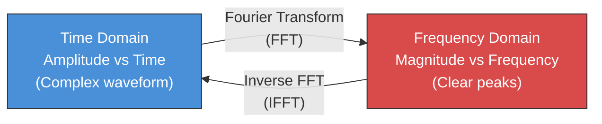
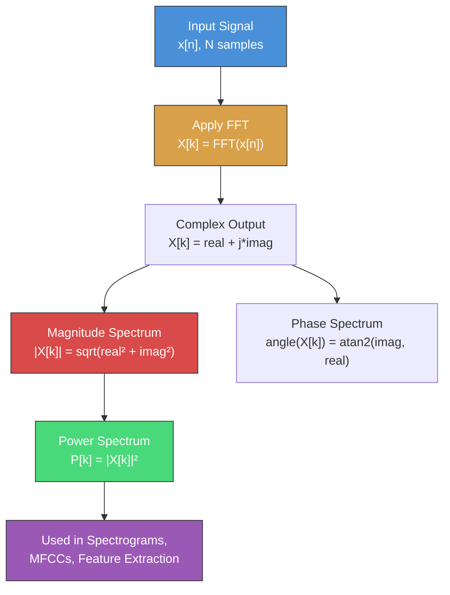
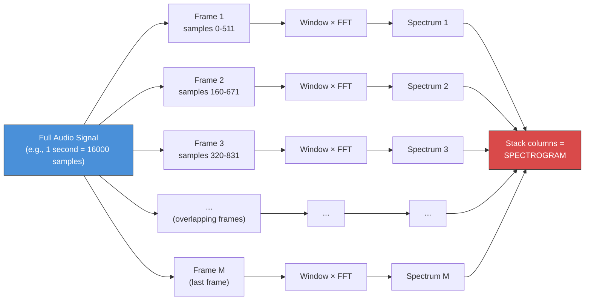
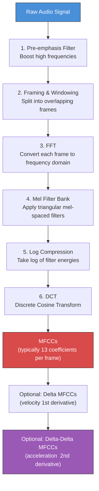

# Voice Agents Deep Dive  Part 2: Audio Signal Processing  Spectrograms, MFCCs, and Feature Extraction

---

**Series:** Building Voice Agents  A Developer's Deep Dive from Audio Fundamentals to Production
**Part:** 2 of 20 (Signal Processing)
**Audience:** Developers with Python experience who want to build voice-powered AI agents from the ground up
**Reading time:** ~55 minutes

---

## Table of Contents

1. [Recap of Part 1](#recap-of-part-1)
2. [Time Domain vs Frequency Domain](#time-domain-vs-frequency-domain)
3. [The Fourier Transform](#the-fourier-transform)
4. [Short-Time Fourier Transform (STFT)](#short-time-fourier-transform-stft)
5. [Spectrograms](#spectrograms)
6. [The Mel Scale](#the-mel-scale)
7. [Mel-Frequency Cepstral Coefficients (MFCCs)](#mel-frequency-cepstral-coefficients-mfccs)
8. [Filter Banks](#filter-banks)
9. [Audio Filtering](#audio-filtering)
10. [Noise Reduction](#noise-reduction)
11. [Voice Activity Detection (VAD)](#voice-activity-detection-vad)
12. [Project: Build a Voice Activity Detector](#project-build-a-voice-activity-detector)
13. [Vocabulary Cheat Sheet](#vocabulary-cheat-sheet)
14. [What's Next](#whats-next)

---

## Recap of Part 1

In Part 1 we built a solid foundation in audio fundamentals. We learned that **sound is a pressure wave** traveling through a medium, that **sampling** converts continuous analog signals into discrete digital values, and that the **Nyquist theorem** tells us we need at least twice the highest frequency to faithfully reconstruct a signal. We explored sample rates, bit depth, audio formats, and wrote Python code to generate, load, and manipulate raw audio.

All of that work happened in the **time domain**  we plotted amplitude on the y-axis and time on the x-axis. But here is the problem: when a human speaks, the raw waveform is an incomprehensible tangle of overlapping frequencies. To build voice agents that actually understand speech, we need to decompose that tangle into its constituent frequencies. That is the job of **signal processing**, and it is the subject of this entire article.

> **Key insight from Part 1:** Digital audio is just an array of numbers. Everything we do in signal processing is math on arrays. If you can multiply and sum arrays, you can do signal processing.

By the end of this article you will be able to:

- Convert audio from the time domain to the frequency domain using the Fourier Transform
- Build spectrograms that visualize how frequencies change over time
- Extract MFCCs  the classic feature representation used in speech recognition for decades
- Implement noise reduction and voice activity detection from scratch
- Understand every step well enough to debug real-world audio pipelines

Let us begin.

---

## Time Domain vs Frequency Domain

### The Core Insight

Every audio signal can be viewed from two complementary perspectives:

| Perspective | X-Axis | Y-Axis | What It Shows |
|---|---|---|---|
| **Time Domain** | Time (seconds) | Amplitude | How loud the signal is at each moment |
| **Frequency Domain** | Frequency (Hz) | Magnitude | How much energy exists at each frequency |

Think of it this way. You are at a concert and a band plays a chord  guitar, bass, and keyboard all sounding simultaneously. In the **time domain**, your microphone records a single, complex waveform that is the sum of all those instruments. It is nearly impossible to look at that waveform and say "the guitar is playing A4 at 440 Hz."

But in the **frequency domain**, that same chord becomes a set of clear, distinct peaks  one at the bass frequency, one at the guitar frequency, one at the keyboard frequency. The **Fourier Transform** is the mathematical tool that converts one view into the other.



> **Analogy:** The Fourier Transform is like a prism splitting white light into a rainbow. White light (the time-domain waveform) contains all colors (frequencies) mixed together. The prism (FFT) separates them so you can see each color (frequency) individually.

### Seeing It in Code

Let us make this concrete. We will generate a "chord"  three sine waves at different frequencies added together  and look at it from both perspectives.

```python
import numpy as np
import matplotlib.pyplot as plt

# --- Parameters ---
sample_rate = 16000   # 16 kHz (common for speech)
duration = 0.1        # 100 ms of audio (enough to see the pattern)

# Time array
t = np.linspace(0, duration, int(sample_rate * duration), endpoint=False)

# --- Generate individual "notes" ---
freq_1 = 200   # Low tone  (like a bass note)
freq_2 = 500   # Mid tone  (like a vowel formant)
freq_3 = 1200  # High tone (like a consonant frequency)

sine_1 = 0.6 * np.sin(2 * np.pi * freq_1 * t)
sine_2 = 1.0 * np.sin(2 * np.pi * freq_2 * t)
sine_3 = 0.4 * np.sin(2 * np.pi * freq_3 * t)

# --- The "chord" is the sum of all three ---
chord = sine_1 + sine_2 + sine_3

# --- Plot Time Domain ---
fig, axes = plt.subplots(2, 1, figsize=(14, 8))

# Waveform (time domain)
axes[0].plot(t * 1000, chord, color='steelblue', linewidth=0.8)
axes[0].set_xlabel('Time (ms)')
axes[0].set_ylabel('Amplitude')
axes[0].set_title('Time Domain  The "Chord" Waveform (Complex!)')
axes[0].grid(True, alpha=0.3)

# --- Compute FFT (Frequency Domain) ---
N = len(chord)
fft_result = np.fft.fft(chord)
frequencies = np.fft.fftfreq(N, d=1/sample_rate)

# We only need the positive half (signal is real-valued)
positive_mask = frequencies >= 0
freqs_positive = frequencies[positive_mask]
magnitude = np.abs(fft_result[positive_mask]) * 2 / N  # Normalize

# Spectrum (frequency domain)
axes[1].plot(freqs_positive, magnitude, color='crimson', linewidth=0.8)
axes[1].set_xlabel('Frequency (Hz)')
axes[1].set_ylabel('Magnitude')
axes[1].set_title('Frequency Domain  Clear Peaks at 200, 500, and 1200 Hz')
axes[1].set_xlim(0, 2000)
axes[1].grid(True, alpha=0.3)

# Annotate the peaks
for freq, amp in [(200, 0.6), (500, 1.0), (1200, 0.4)]:
    axes[1].annotate(f'{freq} Hz', xy=(freq, amp), fontsize=10,
                     ha='center', va='bottom', fontweight='bold',
                     arrowprops=dict(arrowstyle='->', color='black'),
                     xytext=(freq, amp + 0.15))

plt.tight_layout()
plt.savefig('time_vs_frequency_domain.png', dpi=150, bbox_inches='tight')
plt.show()
```

**What you will see:**

- **Top plot (time domain):** A messy, complex waveform. You cannot easily tell which frequencies are present just by looking at it.
- **Bottom plot (frequency domain):** Three sharp peaks at exactly 200 Hz, 500 Hz, and 1200 Hz  the frequencies we mixed together. Crystal clear.

This is the power of frequency-domain analysis. For speech processing, we need this power because human speech is a mixture of many frequencies that change rapidly over time.

### Why Both Domains Matter for Voice Agents

| Task | Domain | Why |
|---|---|---|
| Voice Activity Detection | Time domain | Energy envelope is easy to compute from amplitude |
| Pitch detection | Frequency domain | Fundamental frequency appears as a peak |
| Speaker identification | Frequency domain | Each voice has a unique spectral "fingerprint" |
| Noise removal | Frequency domain | Noise often occupies specific frequency bands |
| Speech recognition | Both (via spectrograms) | Features like MFCCs use time-frequency representations |

---

## The Fourier Transform

### Intuition: What Does It Actually Do?

The Fourier Transform answers one question: **"How much of each frequency is present in this signal?"**

Imagine you have a signal and you want to know if it contains a 440 Hz component. The Fourier Transform does the following:

1. Generate a pure 440 Hz sine wave
2. Multiply it element-by-element with your signal
3. Sum all the products

If your signal contains a 440 Hz component, the products will tend to be positive (the waves align) and the sum will be large. If it does not contain 440 Hz, the products will cancel out and the sum will be near zero.

The Fourier Transform repeats this process for every possible frequency, giving you a complete picture of the signal's frequency content.

### The DFT Formula

The **Discrete Fourier Transform (DFT)** for a signal of N samples is:

$$X[k] = \sum_{n=0}^{N-1} x[n] \cdot e^{-j \cdot 2\pi \cdot k \cdot n / N}$$

Where:
- **x[n]** is the input signal (N samples)
- **X[k]** is the output (frequency bin k)
- **k** ranges from 0 to N-1 (each k corresponds to a frequency)
- **e^{-j...}** is Euler's formula: cos(...) - j*sin(...)

In plain English: for each output frequency bin k, we multiply the signal by a complex sinusoid at that frequency and sum everything up.

### Implementing DFT from Scratch

```python
import numpy as np
import time

def dft_from_scratch(signal):
    """
    Compute the Discrete Fourier Transform from scratch.

    This is O(N^2)  slow but educational.
    For production, always use np.fft.fft which is O(N log N).

    Parameters
    ----------
    signal : np.ndarray
        Input signal (1D array of real or complex values).

    Returns
    -------
    np.ndarray
        Complex-valued DFT output. Length equals len(signal).
    """
    N = len(signal)
    X = np.zeros(N, dtype=complex)

    for k in range(N):
        for n in range(N):
            # e^{-j * 2pi * k * n / N} = cos(...) - j*sin(...)
            angle = -2.0 * np.pi * k * n / N
            X[k] += signal[n] * (np.cos(angle) + 1j * np.sin(angle))

    return X


def dft_vectorized(signal):
    """
    Vectorized DFT  still O(N^2) but much faster than the loop version.
    Uses NumPy broadcasting to eliminate the inner loop.
    """
    N = len(signal)
    n = np.arange(N)
    k = n.reshape(-1, 1)  # Column vector

    # Build the full matrix of complex exponentials
    # Shape: (N, N)  each row k contains e^{-j*2pi*k*n/N} for all n
    W = np.exp(-2j * np.pi * k * n / N)

    # Matrix multiplication: X = W @ x
    return W @ signal


# --- Test with our chord signal ---
sample_rate = 16000
duration = 0.05  # Short signal for DFT (it's slow!)
t = np.linspace(0, duration, int(sample_rate * duration), endpoint=False)
test_signal = (0.6 * np.sin(2 * np.pi * 200 * t) +
               1.0 * np.sin(2 * np.pi * 500 * t) +
               0.4 * np.sin(2 * np.pi * 1200 * t))

# --- Compare: Our DFT vs NumPy FFT ---
start = time.perf_counter()
our_dft = dft_vectorized(test_signal)
dft_time = time.perf_counter() - start

start = time.perf_counter()
numpy_fft = np.fft.fft(test_signal)
fft_time = time.perf_counter() - start

# Check they match
max_diff = np.max(np.abs(our_dft - numpy_fft))
print(f"Max difference between our DFT and NumPy FFT: {max_diff:.2e}")
print(f"Our DFT time:   {dft_time*1000:.2f} ms")
print(f"NumPy FFT time: {fft_time*1000:.4f} ms")
print(f"FFT is {dft_time/fft_time:.0f}x faster!")

# Typical output:
# Max difference between our DFT and NumPy FFT: 1.42e-10
# Our DFT time:   45.23 ms
# NumPy FFT time: 0.0312 ms
# FFT is 1450x faster!
```

> **Takeaway:** The DFT and FFT produce identical results. The FFT is just a clever algorithm (Cooley-Tukey, 1965) that exploits symmetry to reduce O(N^2) to O(N log N). For N = 16000, that is 16000^2 = 256 million operations vs 16000 * 14 = 224,000 operations. Always use `np.fft.fft` in practice.

### Magnitude and Phase

The FFT output is **complex-valued**. Each complex number has two components:

```python
import numpy as np

# Compute FFT of our test signal
fft_result = np.fft.fft(test_signal)

# --- Magnitude: HOW MUCH of each frequency ---
magnitude = np.abs(fft_result)

# --- Phase: WHERE in its cycle each frequency starts ---
phase = np.angle(fft_result)  # In radians

print(f"FFT output shape: {fft_result.shape}")
print(f"FFT output dtype: {fft_result.dtype}")
print(f"First 5 values:   {fft_result[:5]}")
print(f"Magnitude[0:5]:   {magnitude[:5]}")
print(f"Phase[0:5]:       {phase[:5]}")
```

| Component | Formula | What It Tells You | Used In |
|---|---|---|---|
| **Magnitude** | `abs(X[k])` or `sqrt(real^2 + imag^2)` | How much energy at frequency k | Spectrograms, MFCCs, most features |
| **Phase** | `angle(X[k])` or `atan2(imag, real)` | Starting position of the sinusoid | Reconstruction, some advanced features |

> **For speech processing, we almost always use only the magnitude.** Human perception is far more sensitive to spectral magnitude than phase. This is why spectrograms (which show magnitude) are so useful.

### Visualizing the Full FFT Pipeline



### Frequency Resolution and the Uncertainty Principle

There is a fundamental tradeoff in signal processing:

- **Longer window** (more samples in the FFT) = **better frequency resolution** but **worse time resolution**
- **Shorter window** (fewer samples) = **better time resolution** but **worse frequency resolution**

```python
import numpy as np
import matplotlib.pyplot as plt

sample_rate = 16000
duration = 0.5
t = np.linspace(0, duration, int(sample_rate * duration), endpoint=False)

# Signal: two close frequencies (440 Hz and 460 Hz)
signal = np.sin(2 * np.pi * 440 * t) + np.sin(2 * np.pi * 460 * t)

fig, axes = plt.subplots(1, 3, figsize=(18, 5))

for i, n_samples in enumerate([256, 1024, 4096]):
    segment = signal[:n_samples]
    fft_result = np.fft.fft(segment)
    freqs = np.fft.fftfreq(n_samples, d=1/sample_rate)

    positive = freqs >= 0
    axes[i].plot(freqs[positive], np.abs(fft_result[positive]) * 2 / n_samples,
                 color='steelblue', linewidth=0.8)
    axes[i].set_xlim(350, 550)
    axes[i].set_title(f'N = {n_samples}\n'
                      f'Freq resolution: {sample_rate/n_samples:.1f} Hz\n'
                      f'Time window: {n_samples/sample_rate*1000:.1f} ms')
    axes[i].set_xlabel('Frequency (Hz)')
    axes[i].set_ylabel('Magnitude')
    axes[i].grid(True, alpha=0.3)
    axes[i].axvline(440, color='red', linestyle='--', alpha=0.5, label='440 Hz')
    axes[i].axvline(460, color='green', linestyle='--', alpha=0.5, label='460 Hz')
    axes[i].legend()

plt.suptitle('Frequency Resolution vs Window Size', fontsize=14, fontweight='bold')
plt.tight_layout()
plt.savefig('frequency_resolution.png', dpi=150, bbox_inches='tight')
plt.show()
```

**What you will see:**
- **N = 256** (16 ms window): The two peaks at 440 and 460 Hz blur into a single broad lump. Frequency resolution is 62.5 Hz  far too coarse.
- **N = 1024** (64 ms window): You start to see two peaks emerging, but they are not fully separated.
- **N = 4096** (256 ms window): Two distinct, sharp peaks. Frequency resolution is 3.9 Hz  plenty to resolve a 20 Hz gap.

This tradeoff is exactly why we need the **Short-Time Fourier Transform**  it lets us choose a compromise.

---

## Short-Time Fourier Transform (STFT)

### Why FFT Alone Is Not Enough for Speech

Speech is a **non-stationary** signal  its frequency content changes rapidly over time. Consider saying the word "hello":

- "h"  mostly high-frequency noise (fricative)
- "eh"  strong low-frequency formants (vowel)
- "l"  mid-frequency resonance (liquid)
- "oh"  different low-frequency formants (vowel)

If you take a single FFT of the entire word, you get the average frequency content across the whole utterance. You lose all information about *when* each sound occurs. For speech recognition, we need to know both *what* frequencies are present and *when* they appear.

The solution: **divide the signal into short overlapping frames and compute the FFT of each frame separately.** This is the STFT.

### The STFT Algorithm



**Key Parameters:**

| Parameter | Typical Value | Description |
|---|---|---|
| **Frame length (n_fft)** | 512 or 1024 samples (32-64 ms at 16 kHz) | How many samples per frame |
| **Hop length** | 160 or 256 samples (10-16 ms) | How far to advance between frames |
| **Window function** | Hann or Hamming | Applied to each frame before FFT |
| **Overlap** | 75% typical | `1 - hop_length/frame_length` |

### Window Functions  Why We Need Them

When we chop a signal into frames, we create artificial discontinuities at the frame boundaries. These discontinuities cause **spectral leakage**  fake frequencies appear in the FFT output.

**Window functions** solve this by smoothly tapering each frame to zero at the edges:

```python
import numpy as np
import matplotlib.pyplot as plt

frame_length = 512

# --- Different window functions ---
windows = {
    'Rectangular (no window)': np.ones(frame_length),
    'Hann': np.hanning(frame_length),
    'Hamming': np.hamming(frame_length),
    'Blackman': np.blackman(frame_length),
}

fig, axes = plt.subplots(2, 2, figsize=(14, 10))

for ax, (name, window) in zip(axes.flatten(), windows.items()):
    # Time-domain shape
    ax.plot(window, color='steelblue', linewidth=1.5)
    ax.set_title(name, fontsize=12, fontweight='bold')
    ax.set_xlabel('Sample')
    ax.set_ylabel('Amplitude')
    ax.set_ylim(-0.1, 1.1)
    ax.grid(True, alpha=0.3)

plt.suptitle('Window Functions for STFT', fontsize=14, fontweight='bold')
plt.tight_layout()
plt.savefig('window_functions.png', dpi=150, bbox_inches='tight')
plt.show()
```

**Which window to use?**

| Window | Main Lobe Width | Side Lobe Level | Best For |
|---|---|---|---|
| **Rectangular** | Narrowest | Highest (-13 dB) | Never use for speech (too much leakage) |
| **Hann** | Medium | Low (-31 dB) | General audio analysis, spectrograms |
| **Hamming** | Medium | Medium (-42 dB) | Speech processing (MFCCs), classic choice |
| **Blackman** | Widest | Lowest (-58 dB) | When you need very low leakage |

> **Rule of thumb for voice agents:** Use **Hann** for spectrograms and general analysis. Use **Hamming** for MFCC extraction.

### Implementing STFT from Scratch

```python
import numpy as np

def stft_from_scratch(signal, frame_length=512, hop_length=160, window='hann'):
    """
    Compute the Short-Time Fourier Transform from scratch.

    Parameters
    ----------
    signal : np.ndarray
        Input audio signal (1D).
    frame_length : int
        Number of samples per frame (also the FFT size).
    hop_length : int
        Number of samples to advance between frames.
    window : str
        Window function to apply ('hann', 'hamming', 'rectangular').

    Returns
    -------
    stft_matrix : np.ndarray
        Complex STFT matrix, shape (n_freq_bins, n_frames).
        n_freq_bins = frame_length // 2 + 1 (positive frequencies only).
    """
    # Choose window function
    if window == 'hann':
        win = np.hanning(frame_length)
    elif window == 'hamming':
        win = np.hamming(frame_length)
    elif window == 'rectangular':
        win = np.ones(frame_length)
    else:
        raise ValueError(f"Unknown window: {window}")

    # Pad signal so we don't lose the end
    pad_length = frame_length // 2
    padded = np.pad(signal, (pad_length, pad_length), mode='reflect')

    # Calculate number of frames
    n_frames = 1 + (len(padded) - frame_length) // hop_length

    # Number of positive frequency bins
    n_freq_bins = frame_length // 2 + 1

    # Allocate output matrix
    stft_matrix = np.zeros((n_freq_bins, n_frames), dtype=complex)

    for frame_idx in range(n_frames):
        # Extract frame
        start = frame_idx * hop_length
        frame = padded[start : start + frame_length]

        # Apply window
        windowed_frame = frame * win

        # Compute FFT (keep only positive frequencies)
        spectrum = np.fft.rfft(windowed_frame)

        # Store in matrix
        stft_matrix[:, frame_idx] = spectrum

    return stft_matrix


# --- Test it ---
sample_rate = 16000
duration = 1.0
t = np.linspace(0, duration, int(sample_rate * duration), endpoint=False)

# Chirp signal: frequency increases from 200 Hz to 2000 Hz over 1 second
# Great for testing because we KNOW the frequency should increase over time
chirp = np.sin(2 * np.pi * (200 * t + (2000 - 200) / (2 * duration) * t**2))

# Compute STFT
stft_result = stft_from_scratch(chirp, frame_length=512, hop_length=160)

print(f"Signal length: {len(chirp)} samples")
print(f"STFT shape: {stft_result.shape}")
print(f"  - Frequency bins: {stft_result.shape[0]}")
print(f"  - Time frames: {stft_result.shape[1]}")
print(f"  - Frequency resolution: {sample_rate / 512:.1f} Hz per bin")
print(f"  - Time resolution: {160 / sample_rate * 1000:.1f} ms per frame")
```

### Hop Length and Overlap Tradeoffs

The **hop length** controls how much the frames overlap:

```python
import numpy as np
import matplotlib.pyplot as plt

frame_length = 512

# Different hop lengths and their implications
configs = [
    (512, "No overlap (hop = frame)"),
    (256, "50% overlap"),
    (160, "~69% overlap (common for speech)"),
    (128, "75% overlap"),
]

fig, axes = plt.subplots(len(configs), 1, figsize=(14, 12))

sample_rate = 16000
signal_length = 3200  # 200 ms

for ax, (hop, label) in zip(axes, configs):
    n_frames = 1 + (signal_length - frame_length) // hop
    overlap_pct = (1 - hop / frame_length) * 100

    for i in range(min(n_frames, 8)):  # Show up to 8 frames
        start = i * hop
        end = start + frame_length
        # Draw each frame as a colored rectangle
        ax.barh(0, frame_length, left=start, height=0.8,
                alpha=0.3, color=plt.cm.tab10(i % 10),
                edgecolor='black', linewidth=0.5)
        ax.text(start + frame_length / 2, 0, f'F{i}',
                ha='center', va='center', fontsize=8)

    ax.set_xlim(0, signal_length)
    ax.set_title(f'{label} | hop={hop} | overlap={overlap_pct:.0f}% | '
                 f'{n_frames} frames for {signal_length} samples')
    ax.set_xlabel('Sample index')
    ax.set_yticks([])

plt.suptitle('Effect of Hop Length on Frame Overlap', fontsize=14, fontweight='bold')
plt.tight_layout()
plt.savefig('hop_length_overlap.png', dpi=150, bbox_inches='tight')
plt.show()
```

**Guidelines for voice agents:**

| Scenario | Frame Length | Hop Length | Why |
|---|---|---|---|
| **Real-time VAD** | 256 (16 ms) | 128 (8 ms) | Low latency needed |
| **MFCC extraction** | 400-512 (25-32 ms) | 160 (10 ms) | Standard for ASR |
| **Spectrogram display** | 1024 (64 ms) | 256 (16 ms) | Good frequency resolution |
| **Music analysis** | 2048 (128 ms) | 512 (32 ms) | Needs fine frequency detail |

---

## Spectrograms

### The Visual Representation of Audio

A **spectrogram** is a 2D image where:
- **X-axis** = time
- **Y-axis** = frequency
- **Color/intensity** = magnitude (how loud that frequency is at that moment)

It is the single most important visualization in audio processing. When experienced audio engineers or speech scientists look at audio, they look at spectrograms  not waveforms.

```python
import numpy as np
import librosa
import librosa.display
import matplotlib.pyplot as plt

# --- Generate a more interesting signal ---
# Simulate speech-like signal: sequence of different frequencies over time
sample_rate = 16000
duration = 2.0
t = np.linspace(0, duration, int(sample_rate * duration), endpoint=False)

# Create segments with different frequency content
signal = np.zeros_like(t)

# Segment 1 (0-0.5s): Low frequency "vowel-like" (200 + 400 Hz)
mask1 = t < 0.5
signal[mask1] = (np.sin(2 * np.pi * 200 * t[mask1]) +
                 0.7 * np.sin(2 * np.pi * 400 * t[mask1]))

# Segment 2 (0.5-1.0s): Mid frequency (800 + 1200 Hz)
mask2 = (t >= 0.5) & (t < 1.0)
signal[mask2] = (np.sin(2 * np.pi * 800 * t[mask2]) +
                 0.5 * np.sin(2 * np.pi * 1200 * t[mask2]))

# Segment 3 (1.0-1.5s): High frequency "fricative-like" (2500 + 4000 Hz)
mask3 = (t >= 1.0) & (t < 1.5)
signal[mask3] = (0.3 * np.sin(2 * np.pi * 2500 * t[mask3]) +
                 0.3 * np.sin(2 * np.pi * 4000 * t[mask3]))

# Segment 4 (1.5-2.0s): Chirp (frequency sweep)
mask4 = t >= 1.5
t_chirp = t[mask4] - 1.5
signal[mask4] = np.sin(2 * np.pi * (300 * t_chirp + 3000 * t_chirp**2))

# Add a little noise
signal += 0.05 * np.random.randn(len(signal))

# --- Compute and plot spectrogram ---
fig, axes = plt.subplots(3, 1, figsize=(14, 12))

# 1. Waveform
axes[0].plot(t, signal, color='steelblue', linewidth=0.3)
axes[0].set_xlabel('Time (s)')
axes[0].set_ylabel('Amplitude')
axes[0].set_title('Waveform (Time Domain)  Hard to interpret!')
axes[0].grid(True, alpha=0.3)

# 2. Linear-scale spectrogram
S = librosa.stft(signal, n_fft=1024, hop_length=256)
S_db = librosa.amplitude_to_db(np.abs(S), ref=np.max)

img = librosa.display.specshow(S_db, sr=sample_rate, hop_length=256,
                                x_axis='time', y_axis='linear',
                                ax=axes[1], cmap='magma')
axes[1].set_title('Linear-Frequency Spectrogram')
axes[1].set_ylabel('Frequency (Hz)')
fig.colorbar(img, ax=axes[1], format='%+2.0f dB')

# 3. Log-scale spectrogram (better for speech)
img2 = librosa.display.specshow(S_db, sr=sample_rate, hop_length=256,
                                 x_axis='time', y_axis='log',
                                 ax=axes[2], cmap='magma')
axes[2].set_title('Log-Frequency Spectrogram (Better for Speech!)')
axes[2].set_ylabel('Frequency (Hz)')
fig.colorbar(img2, ax=axes[2], format='%+2.0f dB')

plt.tight_layout()
plt.savefig('spectrogram_types.png', dpi=150, bbox_inches='tight')
plt.show()
```

### Types of Spectrograms

```python
import numpy as np
import librosa
import librosa.display
import matplotlib.pyplot as plt

# Load a real speech sample (or use our synthetic signal)
sample_rate = 16000
duration = 2.0
t = np.linspace(0, duration, int(sample_rate * duration), endpoint=False)

# More realistic: simulate a vowel with harmonics + noise
f0 = 150  # Fundamental frequency (male voice)
harmonics = sum(
    (1.0 / (k + 1)) * np.sin(2 * np.pi * f0 * (k + 1) * t)
    for k in range(15)
)
noise = 0.1 * np.random.randn(len(t))
signal = harmonics + noise

fig, axes = plt.subplots(2, 2, figsize=(16, 12))

# --- 1. Amplitude Spectrogram ---
S = np.abs(librosa.stft(signal, n_fft=1024, hop_length=256))
S_db = librosa.amplitude_to_db(S, ref=np.max)
librosa.display.specshow(S_db, sr=sample_rate, hop_length=256,
                          x_axis='time', y_axis='linear',
                          ax=axes[0, 0], cmap='magma')
axes[0, 0].set_title('Amplitude Spectrogram (dB)')

# --- 2. Power Spectrogram ---
S_power = S ** 2
S_power_db = librosa.power_to_db(S_power, ref=np.max)
librosa.display.specshow(S_power_db, sr=sample_rate, hop_length=256,
                          x_axis='time', y_axis='linear',
                          ax=axes[0, 1], cmap='magma')
axes[0, 1].set_title('Power Spectrogram (dB)')

# --- 3. Mel Spectrogram ---
S_mel = librosa.feature.melspectrogram(y=signal, sr=sample_rate,
                                        n_fft=1024, hop_length=256,
                                        n_mels=128)
S_mel_db = librosa.power_to_db(S_mel, ref=np.max)
librosa.display.specshow(S_mel_db, sr=sample_rate, hop_length=256,
                          x_axis='time', y_axis='mel',
                          ax=axes[1, 0], cmap='magma')
axes[1, 0].set_title('Mel Spectrogram (Most Used in Speech!)')

# --- 4. Log-Mel Spectrogram ---
librosa.display.specshow(S_mel_db, sr=sample_rate, hop_length=256,
                          x_axis='time', y_axis='mel',
                          ax=axes[1, 1], cmap='viridis')
axes[1, 1].set_title('Log-Mel Spectrogram (viridis colormap)')

for ax in axes.flatten():
    ax.set_xlabel('Time (s)')

plt.suptitle('Four Types of Spectrograms', fontsize=14, fontweight='bold')
plt.tight_layout()
plt.savefig('spectrogram_comparison.png', dpi=150, bbox_inches='tight')
plt.show()
```

**Which spectrogram for voice agents?**

| Type | Formula | Use Case |
|---|---|---|
| **Linear spectrogram** | `abs(STFT)` | General audio analysis |
| **Power spectrogram** | `abs(STFT)^2` | Energy analysis |
| **Mel spectrogram** | Mel filter bank applied to power spectrogram | Speech recognition input (Whisper, DeepSpeech) |
| **Log-mel spectrogram** | `log(mel spectrogram)` | Most common input to modern ASR models |

> **The mel spectrogram is the workhorse of modern speech processing.** OpenAI's Whisper, Google's speech models, and most production ASR systems take mel spectrograms as input. Understanding how they work is essential.

---

## The Mel Scale

### Why Human Hearing Is Logarithmic

Human hearing does not perceive frequencies linearly. The difference between 100 Hz and 200 Hz sounds like a large jump (an octave). But the difference between 5000 Hz and 5100 Hz  the same 100 Hz gap  sounds tiny.

This is because our **cochlea** (the spiral-shaped organ in the inner ear) maps frequencies logarithmically. Low frequencies get a lot of "real estate" on the basilar membrane, while high frequencies are compressed together.

The **mel scale** is a perceptual scale that approximates this logarithmic behavior:

$$m = 2595 \cdot \log_{10}\left(1 + \frac{f}{700}\right)$$

And the inverse:

$$f = 700 \cdot \left(10^{m/2595} - 1\right)$$

### Implementing the Mel Scale

```python
import numpy as np
import matplotlib.pyplot as plt

def hz_to_mel(freq_hz):
    """Convert frequency in Hz to mel scale."""
    return 2595.0 * np.log10(1.0 + freq_hz / 700.0)

def mel_to_hz(freq_mel):
    """Convert mel scale to frequency in Hz."""
    return 700.0 * (10.0 ** (freq_mel / 2595.0) - 1.0)


# --- Plot mel vs linear frequency ---
freqs_hz = np.linspace(0, 8000, 1000)
freqs_mel = hz_to_mel(freqs_hz)

fig, axes = plt.subplots(1, 2, figsize=(14, 5))

# Mel vs Hz
axes[0].plot(freqs_hz, freqs_mel, color='steelblue', linewidth=2)
axes[0].set_xlabel('Frequency (Hz)')
axes[0].set_ylabel('Mel')
axes[0].set_title('Hz to Mel Conversion')
axes[0].grid(True, alpha=0.3)

# Annotate key points
key_freqs = [100, 500, 1000, 2000, 4000, 8000]
for f in key_freqs:
    m = hz_to_mel(f)
    axes[0].plot(f, m, 'ro', markersize=6)
    axes[0].annotate(f'{f} Hz -> {m:.0f} mel',
                     xy=(f, m), fontsize=8,
                     xytext=(10, 5), textcoords='offset points')

# Show equal mel spacing maps to unequal Hz spacing
n_filters = 10
mel_min = hz_to_mel(0)
mel_max = hz_to_mel(8000)
mel_points = np.linspace(mel_min, mel_max, n_filters + 2)
hz_points = mel_to_hz(mel_points)

axes[1].eventplot([hz_points], orientation='horizontal',
                   colors='steelblue', linewidths=2)
axes[1].set_xlabel('Frequency (Hz)')
axes[1].set_title('Equal Mel Spacing -> Unequal Hz Spacing')
axes[1].set_xlim(0, 8500)
axes[1].set_yticks([])
axes[1].grid(True, alpha=0.3, axis='x')

# Show the Hz values
for i, (hz, mel) in enumerate(zip(hz_points, mel_points)):
    axes[1].annotate(f'{hz:.0f} Hz', xy=(hz, 1), fontsize=8,
                     rotation=45, ha='left', va='bottom')

plt.suptitle('The Mel Scale  Matching Human Hearing Perception',
             fontsize=14, fontweight='bold')
plt.tight_layout()
plt.savefig('mel_scale.png', dpi=150, bbox_inches='tight')
plt.show()

# --- Print comparison table ---
print("\nFrequency Comparison:")
print(f"{'Hz':>8} {'Mel':>8} {'Perceived gap from previous':>30}")
print("-" * 50)
prev_mel = 0
for f in [100, 200, 400, 800, 1600, 3200, 6400]:
    m = hz_to_mel(f)
    print(f"{f:>8} {m:>8.1f} {m - prev_mel:>30.1f} mel")
    prev_mel = m
```

**Output:**
```
Frequency Comparison:
      Hz      Mel     Perceived gap from previous
--------------------------------------------------
     100    150.5                          150.5 mel
     200    283.2                          132.7 mel
     400    508.5                          225.3 mel
     800    907.8                          399.3 mel
    1600   1573.4                          665.6 mel
    3200   2539.1                          965.7 mel
    6400   3829.1                         1290.0 mel
```

> **Notice:** Doubling the frequency does NOT double the mel value. The mel scale compresses high frequencies relative to low frequencies, just like human hearing. This is why mel spectrograms put more detail in the low-frequency region where speech formants live.

### Why This Matters for Voice Agents

Speech contains most of its useful information in the range of **80 Hz to 4000 Hz**. The fundamental frequency of a human voice is typically:
- **Male:** 85-180 Hz
- **Female:** 165-255 Hz
- **Children:** 250-400 Hz

The formant frequencies that distinguish vowels are in the range of **200-3000 Hz**. By using the mel scale, we concentrate our analysis on the frequency range that matters most for understanding speech, giving better resolution where it counts.

---

## Mel-Frequency Cepstral Coefficients (MFCCs)

### The Classic Speech Feature

**MFCCs** have been the dominant feature representation in speech processing for over 30 years. Even today, with deep learning models that can work directly from raw audio or mel spectrograms, MFCCs remain widely used for:

- Speaker verification systems
- Keyword spotting on edge devices
- Audio classification
- As a baseline feature set in research

The name sounds intimidating but the process is logical. Let us break it down step by step.

### The MFCC Pipeline



### Step 1: Pre-emphasis Filter

High frequencies in speech tend to have lower energy than low frequencies. The **pre-emphasis filter** boosts high frequencies to balance the spectrum, improving the signal-to-noise ratio for subsequent analysis.

```python
import numpy as np

def pre_emphasis(signal, coefficient=0.97):
    """
    Apply pre-emphasis filter to boost high frequencies.

    Formula: y[n] = x[n] - coefficient * x[n-1]

    This is a simple first-order high-pass filter.
    Typical coefficient: 0.95 to 0.97.

    Parameters
    ----------
    signal : np.ndarray
        Input audio signal.
    coefficient : float
        Pre-emphasis coefficient (0.95-0.97 typical).

    Returns
    -------
    np.ndarray
        Pre-emphasized signal.
    """
    # y[n] = x[n] - coeff * x[n-1]
    # First sample stays the same
    return np.append(signal[0], signal[1:] - coefficient * signal[:-1])


# --- Demonstrate ---
sample_rate = 16000
duration = 0.1
t = np.linspace(0, duration, int(sample_rate * duration), endpoint=False)

# Signal with both low and high frequency components
signal = (1.0 * np.sin(2 * np.pi * 200 * t) +   # Strong low freq
          0.2 * np.sin(2 * np.pi * 3000 * t))     # Weak high freq

emphasized = pre_emphasis(signal, coefficient=0.97)

# Compare spectra
import matplotlib.pyplot as plt

fig, axes = plt.subplots(1, 2, figsize=(14, 5))

for ax, sig, title in [(axes[0], signal, 'Before Pre-emphasis'),
                         (axes[1], emphasized, 'After Pre-emphasis')]:
    N = len(sig)
    freqs = np.fft.rfftfreq(N, d=1/sample_rate)
    magnitude = np.abs(np.fft.rfft(sig)) * 2 / N
    ax.plot(freqs, magnitude, color='steelblue', linewidth=1)
    ax.set_xlabel('Frequency (Hz)')
    ax.set_ylabel('Magnitude')
    ax.set_title(title)
    ax.grid(True, alpha=0.3)
    ax.set_xlim(0, 5000)

plt.suptitle('Pre-emphasis Boosts High Frequencies', fontsize=14, fontweight='bold')
plt.tight_layout()
plt.savefig('pre_emphasis.png', dpi=150, bbox_inches='tight')
plt.show()
```

### Step 2: Framing and Windowing

We already covered this in the STFT section. For MFCCs, the typical parameters are:

- **Frame length:** 25 ms (400 samples at 16 kHz)
- **Hop length:** 10 ms (160 samples at 16 kHz)
- **Window:** Hamming

```python
import numpy as np

def frame_signal(signal, frame_length, hop_length):
    """
    Split a signal into overlapping frames.

    Parameters
    ----------
    signal : np.ndarray
        Input signal.
    frame_length : int
        Number of samples per frame.
    hop_length : int
        Number of samples between frame starts.

    Returns
    -------
    np.ndarray
        Framed signal, shape (n_frames, frame_length).
    """
    # Pad signal to ensure we get complete frames
    n_frames = 1 + (len(signal) - frame_length) // hop_length

    # Pad the end if necessary
    pad_length = (n_frames - 1) * hop_length + frame_length - len(signal)
    if pad_length > 0:
        signal = np.pad(signal, (0, pad_length), mode='constant')

    # Create frames using stride tricks (efficient, no copying)
    indices = (np.arange(frame_length)[np.newaxis, :] +
               np.arange(n_frames)[:, np.newaxis] * hop_length)

    return signal[indices]


def apply_window(frames, window_type='hamming'):
    """Apply a window function to each frame."""
    frame_length = frames.shape[1]

    if window_type == 'hamming':
        window = np.hamming(frame_length)
    elif window_type == 'hann':
        window = np.hanning(frame_length)
    else:
        window = np.ones(frame_length)

    return frames * window


# --- Demo ---
sample_rate = 16000
frame_length_ms = 25    # 25 ms
hop_length_ms = 10      # 10 ms
frame_length = int(sample_rate * frame_length_ms / 1000)  # 400 samples
hop_length = int(sample_rate * hop_length_ms / 1000)       # 160 samples

print(f"Frame length: {frame_length_ms} ms = {frame_length} samples")
print(f"Hop length:   {hop_length_ms} ms = {hop_length} samples")
print(f"Overlap:      {(1 - hop_length/frame_length)*100:.0f}%")

# Create some test signal (1 second)
t = np.linspace(0, 1.0, sample_rate, endpoint=False)
test_signal = np.sin(2 * np.pi * 440 * t)

frames = frame_signal(test_signal, frame_length, hop_length)
windowed = apply_window(frames, window_type='hamming')

print(f"\nSignal length: {len(test_signal)} samples")
print(f"Number of frames: {frames.shape[0]}")
print(f"Samples per frame: {frames.shape[1]}")
```

### Step 3: FFT of Each Frame

```python
import numpy as np

def compute_power_spectrum(windowed_frames, n_fft=512):
    """
    Compute the power spectrum of each frame.

    Parameters
    ----------
    windowed_frames : np.ndarray
        Windowed frames, shape (n_frames, frame_length).
    n_fft : int
        FFT size (should be >= frame_length, often next power of 2).

    Returns
    -------
    np.ndarray
        Power spectrum, shape (n_frames, n_fft // 2 + 1).
    """
    # Compute FFT of each frame
    # np.fft.rfft returns only positive frequencies (real input)
    fft_result = np.fft.rfft(windowed_frames, n=n_fft, axis=1)

    # Power spectrum = |FFT|^2 / N
    power_spectrum = (np.abs(fft_result) ** 2) / n_fft

    return power_spectrum


# --- Demo ---
n_fft = 512  # Next power of 2 >= 400

power_spec = compute_power_spectrum(windowed, n_fft=n_fft)
print(f"Windowed frames shape: {windowed.shape}")
print(f"Power spectrum shape:  {power_spec.shape}")
print(f"  - {power_spec.shape[0]} frames")
print(f"  - {power_spec.shape[1]} frequency bins")
print(f"  - Frequency resolution: {sample_rate / n_fft:.1f} Hz per bin")
```

### Step 4: Mel Filter Bank

This is the key step that bridges the linear frequency axis to the perceptual mel scale. We create a set of **triangular filters** spaced according to the mel scale, and apply them to the power spectrum.

```python
import numpy as np

def create_mel_filter_bank(n_filters, n_fft, sample_rate, f_min=0, f_max=None):
    """
    Create a bank of triangular mel-spaced filters.

    Parameters
    ----------
    n_filters : int
        Number of mel filters (typically 26 or 40).
    n_fft : int
        FFT size.
    sample_rate : int
        Audio sample rate in Hz.
    f_min : float
        Minimum frequency in Hz.
    f_max : float
        Maximum frequency in Hz (defaults to sample_rate / 2).

    Returns
    -------
    np.ndarray
        Filter bank matrix, shape (n_filters, n_fft // 2 + 1).
    """
    if f_max is None:
        f_max = sample_rate / 2

    # Convert min/max frequencies to mel
    mel_min = hz_to_mel(f_min)
    mel_max = hz_to_mel(f_max)

    # Create n_filters + 2 equally spaced points in mel scale
    # (+2 because each triangular filter needs a left, center, and right point)
    mel_points = np.linspace(mel_min, mel_max, n_filters + 2)
    hz_points = mel_to_hz(mel_points)

    # Convert Hz points to FFT bin indices
    bin_points = np.floor((n_fft + 1) * hz_points / sample_rate).astype(int)

    # Number of positive frequency bins
    n_freq_bins = n_fft // 2 + 1

    # Build the filter bank
    filter_bank = np.zeros((n_filters, n_freq_bins))

    for m in range(n_filters):
        # Left edge
        f_left = bin_points[m]
        # Center
        f_center = bin_points[m + 1]
        # Right edge
        f_right = bin_points[m + 2]

        # Rising slope (left to center)
        for k in range(f_left, f_center):
            if f_center != f_left:  # Avoid division by zero
                filter_bank[m, k] = (k - f_left) / (f_center - f_left)

        # Falling slope (center to right)
        for k in range(f_center, f_right):
            if f_right != f_center:  # Avoid division by zero
                filter_bank[m, k] = (f_right - k) / (f_right - f_center)

    return filter_bank


# --- Visualize the filter bank ---
import matplotlib.pyplot as plt

n_filters = 26
n_fft = 512
sample_rate = 16000

filter_bank = create_mel_filter_bank(n_filters, n_fft, sample_rate)

fig, ax = plt.subplots(figsize=(14, 6))
freqs = np.linspace(0, sample_rate / 2, n_fft // 2 + 1)

for i in range(n_filters):
    ax.plot(freqs, filter_bank[i], linewidth=1)

ax.set_xlabel('Frequency (Hz)')
ax.set_ylabel('Filter Weight')
ax.set_title(f'Mel Filter Bank ({n_filters} filters)')
ax.grid(True, alpha=0.3)
plt.tight_layout()
plt.savefig('mel_filter_bank.png', dpi=150, bbox_inches='tight')
plt.show()

print(f"Filter bank shape: {filter_bank.shape}")
print(f"  - {filter_bank.shape[0]} filters")
print(f"  - {filter_bank.shape[1]} frequency bins")
```

> **Notice how the filters are narrow and closely spaced at low frequencies, and wide and spread apart at high frequencies.** This is the mel scale at work  more resolution where human hearing is most sensitive.

### Step 5: Log Compression

After applying the mel filter bank to the power spectrum, we take the logarithm. This mimics the human ear's logarithmic perception of loudness (the difference between 0.001 and 0.01 watts feels similar to the difference between 1 and 10 watts).

```python
import numpy as np

def apply_mel_filter_bank(power_spectrum, filter_bank):
    """
    Apply mel filter bank to power spectrum.

    Parameters
    ----------
    power_spectrum : np.ndarray
        Power spectrum, shape (n_frames, n_fft // 2 + 1).
    filter_bank : np.ndarray
        Mel filter bank, shape (n_filters, n_fft // 2 + 1).

    Returns
    -------
    np.ndarray
        Mel-scaled energies, shape (n_frames, n_filters).
    """
    # Matrix multiplication: each frame's spectrum dot each filter
    mel_energies = power_spectrum @ filter_bank.T

    # Replace zeros with small value to avoid log(0)
    mel_energies = np.maximum(mel_energies, np.finfo(float).eps)

    return mel_energies


def log_compression(mel_energies):
    """Apply log compression to mel energies."""
    return np.log(mel_energies)


# --- Demo ---
mel_energies = apply_mel_filter_bank(power_spec, filter_bank)
log_mel_energies = log_compression(mel_energies)

print(f"Power spectrum shape: {power_spec.shape}")
print(f"Mel energies shape:   {mel_energies.shape}")
print(f"Log mel energies shape: {log_mel_energies.shape}")
print(f"  - {log_mel_energies.shape[0]} frames")
print(f"  - {log_mel_energies.shape[1]} mel filter outputs")
```

### Step 6: Discrete Cosine Transform (DCT)

The final step is the **DCT**, which compresses the 26 (or 40) log-mel energies into a smaller set of coefficients. We typically keep only the first 13 coefficients.

**Why DCT?** The mel filter bank outputs are correlated (neighboring filters overlap). The DCT decorrelates them, concentrating the most important information into the first few coefficients. This is similar to how JPEG compression uses the DCT on image blocks.

```python
import numpy as np
from scipy.fft import dct

def compute_mfcc(log_mel_energies, n_mfcc=13):
    """
    Compute MFCCs using the Discrete Cosine Transform.

    Parameters
    ----------
    log_mel_energies : np.ndarray
        Log mel energies, shape (n_frames, n_filters).
    n_mfcc : int
        Number of MFCCs to return (typically 13).

    Returns
    -------
    np.ndarray
        MFCCs, shape (n_frames, n_mfcc).
    """
    # Apply DCT-II (the "standard" DCT)
    # Keep only the first n_mfcc coefficients
    mfccs = dct(log_mel_energies, type=2, axis=1, norm='ortho')[:, :n_mfcc]
    return mfccs


# --- Compute MFCCs ---
n_mfcc = 13
mfccs = compute_mfcc(log_mel_energies, n_mfcc=n_mfcc)

print(f"Log mel energies shape: {log_mel_energies.shape}")
print(f"MFCCs shape: {mfccs.shape}")
print(f"  - {mfccs.shape[0]} frames")
print(f"  - {mfccs.shape[1]} coefficients per frame")
```

### The Complete MFCC Pipeline from Scratch

Now let us put it all together in one clean function:

```python
import numpy as np
from scipy.fft import dct

def extract_mfcc_from_scratch(signal, sample_rate=16000, n_mfcc=13,
                                n_filters=26, n_fft=512,
                                frame_length_ms=25, hop_length_ms=10,
                                pre_emph_coeff=0.97):
    """
    Extract MFCCs from an audio signal  implemented entirely from scratch.

    Parameters
    ----------
    signal : np.ndarray
        Input audio signal (1D array).
    sample_rate : int
        Sample rate in Hz.
    n_mfcc : int
        Number of MFCC coefficients to return.
    n_filters : int
        Number of mel filters.
    n_fft : int
        FFT size.
    frame_length_ms : float
        Frame length in milliseconds.
    hop_length_ms : float
        Hop length in milliseconds.
    pre_emph_coeff : float
        Pre-emphasis coefficient.

    Returns
    -------
    np.ndarray
        MFCCs, shape (n_frames, n_mfcc).
    """
    # Step 1: Pre-emphasis
    emphasized = pre_emphasis(signal, coefficient=pre_emph_coeff)

    # Step 2: Framing and windowing
    frame_length = int(sample_rate * frame_length_ms / 1000)
    hop_length = int(sample_rate * hop_length_ms / 1000)
    frames = frame_signal(emphasized, frame_length, hop_length)
    windowed = apply_window(frames, window_type='hamming')

    # Step 3: Power spectrum
    power_spec = compute_power_spectrum(windowed, n_fft=n_fft)

    # Step 4: Mel filter bank
    mel_fb = create_mel_filter_bank(n_filters, n_fft, sample_rate)
    mel_energies = apply_mel_filter_bank(power_spec, mel_fb)

    # Step 5: Log compression
    log_mel = log_compression(mel_energies)

    # Step 6: DCT
    mfccs = compute_mfcc(log_mel, n_mfcc=n_mfcc)

    return mfccs


# --- Compare our implementation with librosa ---
import librosa

# Generate test signal
sample_rate = 16000
duration = 1.0
t = np.linspace(0, duration, int(sample_rate * duration), endpoint=False)
test_signal = (np.sin(2 * np.pi * 200 * t) +
               0.5 * np.sin(2 * np.pi * 500 * t) +
               0.3 * np.sin(2 * np.pi * 1200 * t))

# Our implementation
our_mfccs = extract_mfcc_from_scratch(test_signal, sample_rate=sample_rate)

# Librosa implementation
librosa_mfccs = librosa.feature.mfcc(y=test_signal, sr=sample_rate,
                                      n_mfcc=13, n_fft=512,
                                      hop_length=160, n_mels=26).T

print(f"Our MFCCs shape:     {our_mfccs.shape}")
print(f"Librosa MFCCs shape: {librosa_mfccs.shape}")
print(f"\nFirst frame comparison:")
print(f"Ours:    {our_mfccs[0, :5]}")
print(f"Librosa: {librosa_mfccs[0, :5]}")
print(f"\nNote: Values may differ slightly due to implementation details")
print(f"(padding, normalization, etc.) but the shapes should match.")
```

### Visualizing MFCCs

```python
import matplotlib.pyplot as plt
import librosa
import librosa.display
import numpy as np

# Generate a more complex signal (simulate speech)
sample_rate = 16000
duration = 2.0
t = np.linspace(0, duration, int(sample_rate * duration), endpoint=False)

# Simulate changing speech sounds
signal = np.zeros_like(t)
for i, (start, end, f0) in enumerate([
    (0.0, 0.5, 150), (0.5, 1.0, 250),
    (1.0, 1.5, 180), (1.5, 2.0, 300)
]):
    mask = (t >= start) & (t < end)
    for h in range(1, 8):
        signal[mask] += (1.0/h) * np.sin(2 * np.pi * f0 * h * t[mask])

signal += 0.05 * np.random.randn(len(signal))

# Extract MFCCs using librosa
mfccs = librosa.feature.mfcc(y=signal, sr=sample_rate, n_mfcc=13,
                              n_fft=512, hop_length=160)

fig, axes = plt.subplots(3, 1, figsize=(14, 10))

# Waveform
axes[0].plot(t, signal, color='steelblue', linewidth=0.3)
axes[0].set_title('Waveform')
axes[0].set_ylabel('Amplitude')

# Mel spectrogram
S_mel = librosa.feature.melspectrogram(y=signal, sr=sample_rate,
                                        n_fft=512, hop_length=160)
S_mel_db = librosa.power_to_db(S_mel, ref=np.max)
librosa.display.specshow(S_mel_db, sr=sample_rate, hop_length=160,
                          x_axis='time', y_axis='mel',
                          ax=axes[1], cmap='magma')
axes[1].set_title('Mel Spectrogram')

# MFCCs
librosa.display.specshow(mfccs, sr=sample_rate, hop_length=160,
                          x_axis='time', ax=axes[2], cmap='coolwarm')
axes[2].set_title('MFCCs (13 coefficients)')
axes[2].set_ylabel('MFCC Coefficient')

plt.tight_layout()
plt.savefig('mfcc_visualization.png', dpi=150, bbox_inches='tight')
plt.show()
```

### Delta and Delta-Delta Features

In practice, MFCCs are often augmented with their **first and second derivatives** (deltas and delta-deltas), which capture how the features change over time:

```python
import numpy as np
import librosa

def compute_deltas(features, width=2):
    """
    Compute delta (derivative) features.

    Uses the formula:
    delta[t] = sum_{n=1}^{N} n * (features[t+n] - features[t-n])
               / (2 * sum_{n=1}^{N} n^2)

    Parameters
    ----------
    features : np.ndarray
        Input features, shape (n_frames, n_features).
    width : int
        Number of frames on each side for computation.

    Returns
    -------
    np.ndarray
        Delta features, same shape as input.
    """
    n_frames, n_features = features.shape
    denominator = 2 * sum(n**2 for n in range(1, width + 1))

    # Pad the features at the edges
    padded = np.pad(features, ((width, width), (0, 0)), mode='edge')

    deltas = np.zeros_like(features)
    for t in range(n_frames):
        for n in range(1, width + 1):
            deltas[t] += n * (padded[t + width + n] - padded[t + width - n])
        deltas[t] /= denominator

    return deltas


# --- Demo ---
sample_rate = 16000
t = np.linspace(0, 1.0, sample_rate, endpoint=False)
signal = np.sin(2 * np.pi * 440 * t)

# Extract base MFCCs
mfccs = extract_mfcc_from_scratch(signal, sample_rate=sample_rate, n_mfcc=13)

# Compute deltas
delta_mfccs = compute_deltas(mfccs)
delta_delta_mfccs = compute_deltas(delta_mfccs)

# Stack: 13 MFCCs + 13 deltas + 13 delta-deltas = 39 features per frame
full_features = np.hstack([mfccs, delta_mfccs, delta_delta_mfccs])

print(f"MFCCs shape:         {mfccs.shape}")
print(f"Delta MFCCs shape:   {delta_mfccs.shape}")
print(f"Delta-Delta shape:   {delta_delta_mfccs.shape}")
print(f"Full features shape: {full_features.shape}")
print(f"  -> {full_features.shape[1]} features per frame")
print(f"  -> {full_features.shape[0]} frames total")
```

> **The classic 39-dimensional MFCC feature vector** (13 static + 13 delta + 13 delta-delta) was the standard input for speech recognition systems like HMM-GMM models for decades. Even today, many lightweight systems use this representation.

---

## Filter Banks

### Triangular Mel Filter Banks in Detail

We already built the mel filter bank as part of the MFCC pipeline. Let us look more closely at how these filters work and why they are shaped the way they are.

```python
import numpy as np
import matplotlib.pyplot as plt

def visualize_filter_bank_detailed(n_filters=26, n_fft=512,
                                     sample_rate=16000):
    """
    Create a detailed visualization of the mel filter bank,
    showing how each filter captures energy in a specific frequency band.
    """
    filter_bank = create_mel_filter_bank(n_filters, n_fft, sample_rate)
    freqs = np.linspace(0, sample_rate / 2, n_fft // 2 + 1)

    fig, axes = plt.subplots(3, 1, figsize=(14, 12))

    # --- 1. All filters overlaid ---
    for i in range(n_filters):
        color = plt.cm.viridis(i / n_filters)
        axes[0].plot(freqs, filter_bank[i], color=color, linewidth=1)
    axes[0].set_title(f'All {n_filters} Mel Filters')
    axes[0].set_xlabel('Frequency (Hz)')
    axes[0].set_ylabel('Weight')
    axes[0].grid(True, alpha=0.3)

    # --- 2. Zoom into low frequencies (more filters, narrow) ---
    for i in range(min(8, n_filters)):
        color = plt.cm.tab10(i)
        axes[1].fill_between(freqs, filter_bank[i], alpha=0.3, color=color)
        axes[1].plot(freqs, filter_bank[i], color=color, linewidth=1.5,
                     label=f'Filter {i}')
    axes[1].set_xlim(0, 2000)
    axes[1].set_title('Low-Frequency Filters (Narrow, Closely Spaced)')
    axes[1].set_xlabel('Frequency (Hz)')
    axes[1].set_ylabel('Weight')
    axes[1].legend(fontsize=8)
    axes[1].grid(True, alpha=0.3)

    # --- 3. Zoom into high frequencies (fewer filters, wide) ---
    for i in range(max(0, n_filters - 6), n_filters):
        color = plt.cm.tab10(i % 10)
        axes[2].fill_between(freqs, filter_bank[i], alpha=0.3, color=color)
        axes[2].plot(freqs, filter_bank[i], color=color, linewidth=1.5,
                     label=f'Filter {i}')
    axes[2].set_xlim(4000, sample_rate / 2)
    axes[2].set_title('High-Frequency Filters (Wide, Spread Apart)')
    axes[2].set_xlabel('Frequency (Hz)')
    axes[2].set_ylabel('Weight')
    axes[2].legend(fontsize=8)
    axes[2].grid(True, alpha=0.3)

    plt.tight_layout()
    plt.savefig('mel_filter_bank_detailed.png', dpi=150, bbox_inches='tight')
    plt.show()


visualize_filter_bank_detailed()
```

### How Filters Are Applied

Each triangular filter acts as a **weighted sum** over a range of frequency bins. When we multiply the power spectrum by a filter and sum, we get a single number representing the total energy in that frequency band.

```python
import numpy as np
import matplotlib.pyplot as plt

# Demonstrate how one filter extracts energy
sample_rate = 16000
n_fft = 512
n_filters = 26

# Create a test spectrum with energy at specific frequencies
freqs = np.linspace(0, sample_rate / 2, n_fft // 2 + 1)
spectrum = np.zeros(n_fft // 2 + 1)

# Add peaks at 300 Hz, 800 Hz, and 2000 Hz
for f_peak in [300, 800, 2000]:
    idx = int(f_peak / (sample_rate / 2) * (n_fft // 2))
    spectrum[max(0, idx-3):idx+4] = 1.0  # Wide peak

# Get filter bank
fb = create_mel_filter_bank(n_filters, n_fft, sample_rate)

# Compute energy for each filter
energies = spectrum @ fb.T

fig, axes = plt.subplots(2, 1, figsize=(14, 8))

# Spectrum with filters overlaid
axes[0].plot(freqs, spectrum, 'k-', linewidth=2, label='Power Spectrum')
for i in range(n_filters):
    color = plt.cm.viridis(i / n_filters)
    axes[0].fill_between(freqs, fb[i] * spectrum.max(), alpha=0.15, color=color)
axes[0].set_xlabel('Frequency (Hz)')
axes[0].set_ylabel('Power')
axes[0].set_title('Power Spectrum with Mel Filters Overlaid')
axes[0].grid(True, alpha=0.3)

# Filter energies (bar chart)
axes[1].bar(range(n_filters), energies, color='steelblue', alpha=0.8)
axes[1].set_xlabel('Mel Filter Index')
axes[1].set_ylabel('Energy')
axes[1].set_title('Energy Captured by Each Mel Filter')
axes[1].grid(True, alpha=0.3, axis='y')

plt.tight_layout()
plt.savefig('filter_application.png', dpi=150, bbox_inches='tight')
plt.show()
```

---

## Audio Filtering

### Low-Pass, High-Pass, and Band-Pass Filters

Audio filters selectively pass or reject certain frequency ranges. They are essential for preprocessing audio before feature extraction.

```python
import numpy as np
from scipy import signal
import matplotlib.pyplot as plt

def design_and_apply_filter(audio, sample_rate, filter_type, cutoff,
                             order=5):
    """
    Design and apply a Butterworth filter.

    Parameters
    ----------
    audio : np.ndarray
        Input audio signal.
    sample_rate : int
        Sample rate in Hz.
    filter_type : str
        'lowpass', 'highpass', or 'bandpass'.
    cutoff : float or tuple
        Cutoff frequency in Hz. For bandpass, provide (low, high).
    order : int
        Filter order (higher = sharper cutoff, but more ringing).

    Returns
    -------
    np.ndarray
        Filtered audio signal.
    """
    nyquist = sample_rate / 2

    if filter_type == 'bandpass':
        normalized_cutoff = (cutoff[0] / nyquist, cutoff[1] / nyquist)
    else:
        normalized_cutoff = cutoff / nyquist

    # Design Butterworth filter
    b, a = signal.butter(order, normalized_cutoff, btype=filter_type)

    # Apply filter (filtfilt for zero-phase filtering)
    filtered = signal.filtfilt(b, a, audio)

    return filtered


# --- Demo: Apply different filters to speech-like signal ---
sample_rate = 16000
duration = 1.0
t = np.linspace(0, duration, int(sample_rate * duration), endpoint=False)

# Create signal with low, mid, and high frequency content
audio = (1.0 * np.sin(2 * np.pi * 150 * t) +     # Low (voice fundamental)
         0.8 * np.sin(2 * np.pi * 800 * t) +     # Mid (formant)
         0.3 * np.sin(2 * np.pi * 4000 * t) +    # High (fricative)
         0.1 * np.random.randn(len(t)))            # Noise

# Apply filters
lowpass = design_and_apply_filter(audio, sample_rate, 'lowpass', 1000)
highpass = design_and_apply_filter(audio, sample_rate, 'highpass', 1000)
bandpass = design_and_apply_filter(audio, sample_rate, 'bandpass', (300, 3400))

# --- Plot results ---
fig, axes = plt.subplots(4, 2, figsize=(16, 16))

signals = [
    (audio, 'Original Signal'),
    (lowpass, 'Low-Pass (< 1000 Hz)'),
    (highpass, 'High-Pass (> 1000 Hz)'),
    (bandpass, 'Band-Pass (300-3400 Hz)  Telephone bandwidth'),
]

for i, (sig, title) in enumerate(signals):
    # Time domain
    axes[i, 0].plot(t[:800], sig[:800], color='steelblue', linewidth=0.8)
    axes[i, 0].set_title(f'{title}  Waveform')
    axes[i, 0].set_xlabel('Time (s)')
    axes[i, 0].set_ylabel('Amplitude')
    axes[i, 0].grid(True, alpha=0.3)

    # Frequency domain
    N = len(sig)
    freqs = np.fft.rfftfreq(N, d=1/sample_rate)
    magnitude = np.abs(np.fft.rfft(sig)) * 2 / N
    axes[i, 1].plot(freqs, magnitude, color='crimson', linewidth=0.8)
    axes[i, 1].set_title(f'{title}  Spectrum')
    axes[i, 1].set_xlabel('Frequency (Hz)')
    axes[i, 1].set_ylabel('Magnitude')
    axes[i, 1].set_xlim(0, 6000)
    axes[i, 1].grid(True, alpha=0.3)

plt.tight_layout()
plt.savefig('audio_filtering.png', dpi=150, bbox_inches='tight')
plt.show()
```

### When to Use Each Filter Type

| Filter Type | What It Does | Voice Agent Use Cases |
|---|---|---|
| **Low-pass** | Removes high frequencies | Anti-aliasing before downsampling; removing hiss |
| **High-pass** | Removes low frequencies | Removing DC offset, rumble, hum (50/60 Hz) |
| **Band-pass** | Keeps a specific range | Telephone speech (300-3400 Hz); isolating voice band |
| **Band-stop (Notch)** | Removes a specific range | Removing 50/60 Hz power line hum |

> **Practical tip for voice agents:** A band-pass filter from **80 Hz to 7600 Hz** is a good default preprocessing step. It removes low-frequency rumble and high-frequency noise while keeping all useful speech information.

---

## Noise Reduction

### Why Noise Reduction Matters

Real-world audio is noisy. Users speak to voice agents in cars, cafes, offices, and outdoors. Background noise degrades ASR accuracy significantly. Even the best speech recognition model will struggle with heavy noise.

The goal of noise reduction is to **estimate the noise spectrum and subtract it from the signal**, leaving (mostly) clean speech behind.

### Spectral Subtraction  From Scratch

**Spectral subtraction** is the simplest and most intuitive noise reduction method:

1. Estimate the noise spectrum (from silent segments)
2. Subtract it from the noisy speech spectrum
3. Reconstruct the audio

```python
import numpy as np
import matplotlib.pyplot as plt

def spectral_subtraction(noisy_signal, sample_rate=16000, n_fft=512,
                          hop_length=160, noise_frames=10,
                          oversubtraction=1.0, floor=0.01):
    """
    Simple spectral subtraction for noise reduction.

    Parameters
    ----------
    noisy_signal : np.ndarray
        Noisy input signal.
    sample_rate : int
        Sample rate.
    n_fft : int
        FFT size.
    hop_length : int
        Hop length for STFT.
    noise_frames : int
        Number of initial frames to use for noise estimation.
        Assumes the first few frames are noise-only.
    oversubtraction : float
        Factor to multiply noise estimate (> 1 = more aggressive).
    floor : float
        Spectral floor to avoid negative/zero magnitudes.

    Returns
    -------
    np.ndarray
        Denoised signal.
    """
    # Compute STFT of noisy signal
    window = np.hanning(n_fft)
    n_frames = 1 + (len(noisy_signal) - n_fft) // hop_length
    n_freq_bins = n_fft // 2 + 1

    stft = np.zeros((n_freq_bins, n_frames), dtype=complex)
    for i in range(n_frames):
        start = i * hop_length
        frame = noisy_signal[start:start + n_fft]
        if len(frame) < n_fft:
            frame = np.pad(frame, (0, n_fft - len(frame)))
        stft[:, i] = np.fft.rfft(frame * window)

    # Get magnitude and phase
    magnitude = np.abs(stft)
    phase = np.angle(stft)

    # Estimate noise spectrum from first few frames
    noise_estimate = np.mean(magnitude[:, :noise_frames], axis=1, keepdims=True)

    # Subtract noise (with oversubtraction factor)
    clean_magnitude = magnitude - oversubtraction * noise_estimate

    # Apply spectral floor (avoid negative values)
    clean_magnitude = np.maximum(clean_magnitude, floor * noise_estimate)

    # Reconstruct using original phase
    clean_stft = clean_magnitude * np.exp(1j * phase)

    # Inverse STFT (overlap-add)
    output_length = (n_frames - 1) * hop_length + n_fft
    output = np.zeros(output_length)
    window_sum = np.zeros(output_length)

    for i in range(n_frames):
        start = i * hop_length
        frame = np.fft.irfft(clean_stft[:, i])
        output[start:start + n_fft] += frame * window
        window_sum[start:start + n_fft] += window ** 2

    # Normalize by window sum
    window_sum = np.maximum(window_sum, 1e-8)
    output /= window_sum

    return output[:len(noisy_signal)]


# --- Demo ---
sample_rate = 16000
duration = 2.0
t = np.linspace(0, duration, int(sample_rate * duration), endpoint=False)

# Clean speech (simulated with harmonics)
clean = np.zeros_like(t)
speech_mask = (t >= 0.3) & (t < 1.8)  # Speech starts at 0.3s
for h in range(1, 10):
    clean[speech_mask] += (1.0/h) * np.sin(2 * np.pi * 150 * h * t[speech_mask])

# Add noise
noise = 0.3 * np.random.randn(len(t))
noisy = clean + noise

# Apply spectral subtraction
denoised = spectral_subtraction(noisy, sample_rate=sample_rate,
                                 noise_frames=15, oversubtraction=2.0)

# --- Visualize ---
fig, axes = plt.subplots(3, 1, figsize=(14, 10))

for ax, sig, title in [(axes[0], clean, 'Clean Speech'),
                         (axes[1], noisy, 'Noisy Speech (SNR ~10 dB)'),
                         (axes[2], denoised, 'After Spectral Subtraction')]:
    ax.plot(t, sig, color='steelblue', linewidth=0.3)
    ax.set_title(title)
    ax.set_xlabel('Time (s)')
    ax.set_ylabel('Amplitude')
    ax.grid(True, alpha=0.3)

plt.tight_layout()
plt.savefig('spectral_subtraction.png', dpi=150, bbox_inches='tight')
plt.show()
```

### Using the noisereduce Library

For production use, the `noisereduce` library provides a more sophisticated approach:

```python
import numpy as np

# pip install noisereduce
import noisereduce as nr

# --- Using noisereduce ---
sample_rate = 16000
duration = 2.0
t = np.linspace(0, duration, int(sample_rate * duration), endpoint=False)

# Create noisy signal
clean = np.zeros_like(t)
speech_mask = (t >= 0.3) & (t < 1.8)
for h in range(1, 10):
    clean[speech_mask] += (1.0/h) * np.sin(2 * np.pi * 150 * h * t[speech_mask])
noise = 0.3 * np.random.randn(len(t))
noisy = clean + noise

# Method 1: Stationary noise reduction
# Best when noise is constant (e.g., fan, hum)
reduced_stationary = nr.reduce_noise(
    y=noisy,
    sr=sample_rate,
    stationary=True,
    prop_decrease=0.75,  # How much to reduce noise (0-1)
)

# Method 2: Non-stationary noise reduction
# Best when noise varies (e.g., crowd, music)
reduced_nonstationary = nr.reduce_noise(
    y=noisy,
    sr=sample_rate,
    stationary=False,
    prop_decrease=0.75,
)

# Method 3: With a noise sample
# Provide a segment of pure noise for better estimation
noise_sample = noisy[:int(0.3 * sample_rate)]  # First 0.3s is noise-only
reduced_with_sample = nr.reduce_noise(
    y=noisy,
    sr=sample_rate,
    y_noise=noise_sample,
    prop_decrease=0.85,
)

print("Noise reduction complete!")
print(f"Original signal power:  {np.mean(noisy**2):.4f}")
print(f"Stationary reduced:     {np.mean(reduced_stationary**2):.4f}")
print(f"Non-stationary reduced: {np.mean(reduced_nonstationary**2):.4f}")
print(f"With noise sample:      {np.mean(reduced_with_sample**2):.4f}")
```

### Noise Reduction Comparison Table

| Method | Complexity | Quality | Latency | Best For |
|---|---|---|---|---|
| **Spectral subtraction** | Low | Fair (musical noise artifacts) | Low | Simple preprocessing, educational |
| **Wiener filter** | Medium | Good | Low | Real-time systems |
| **noisereduce (stationary)** | Medium | Good | Medium | Consistent background noise |
| **noisereduce (non-stationary)** | High | Very good | Higher | Variable noise environments |
| **RNNoise** | Medium | Excellent | Very low | Real-time voice chat |
| **Deep learning (DTLN, etc.)** | High | Excellent | Variable | Production voice agents |

---

## Voice Activity Detection (VAD)

### What Is VAD?

**Voice Activity Detection** answers a simple question: **"Is someone speaking right now?"**

This sounds trivial but it is one of the most critical components in a voice agent pipeline:

- **Saves compute:** Only run expensive ASR when speech is present
- **Reduces false triggers:** Prevents the agent from trying to transcribe background noise
- **Enables turn-taking:** Determines when the user has finished speaking
- **Segments audio:** Breaks continuous audio into utterances

### Energy-Based VAD

The simplest approach: speech frames have more energy (amplitude) than silence frames.

```python
import numpy as np

class EnergyVAD:
    """
    Voice Activity Detection based on frame energy.

    Simple but effective for clean audio.
    Struggles in noisy environments.
    """

    def __init__(self, sample_rate=16000, frame_length_ms=25,
                 hop_length_ms=10, energy_threshold=None):
        self.sample_rate = sample_rate
        self.frame_length = int(sample_rate * frame_length_ms / 1000)
        self.hop_length = int(sample_rate * hop_length_ms / 1000)
        self.energy_threshold = energy_threshold

    def compute_energy(self, signal):
        """Compute short-time energy for each frame."""
        frames = frame_signal(signal, self.frame_length, self.hop_length)
        energy = np.sum(frames ** 2, axis=1) / self.frame_length
        return energy

    def detect(self, signal):
        """
        Detect voice activity in the signal.

        Returns
        -------
        np.ndarray
            Boolean array, True where speech is detected.
        """
        energy = self.compute_energy(signal)

        if self.energy_threshold is None:
            # Auto-threshold: use the median energy as baseline
            # and set threshold at 10x the baseline
            baseline = np.median(energy)
            self.energy_threshold = baseline * 10

        return energy > self.energy_threshold

    def get_speech_segments(self, signal):
        """
        Get start and end times of speech segments.

        Returns
        -------
        list of tuples
            List of (start_time, end_time) in seconds.
        """
        is_speech = self.detect(signal)

        segments = []
        in_speech = False
        start = 0

        for i, speech in enumerate(is_speech):
            if speech and not in_speech:
                start = i * self.hop_length / self.sample_rate
                in_speech = True
            elif not speech and in_speech:
                end = i * self.hop_length / self.sample_rate
                segments.append((start, end))
                in_speech = False

        if in_speech:
            end = len(signal) / self.sample_rate
            segments.append((start, end))

        return segments
```

### Zero-Crossing Rate VAD

The **zero-crossing rate (ZCR)** counts how many times the signal crosses zero per frame. Speech typically has a lower ZCR than noise.

```python
import numpy as np

class ZeroCrossingVAD:
    """
    Voice Activity Detection based on zero-crossing rate.

    Voiced speech has a lower ZCR than unvoiced noise.
    Often combined with energy for better accuracy.
    """

    def __init__(self, sample_rate=16000, frame_length_ms=25,
                 hop_length_ms=10, zcr_threshold=None):
        self.sample_rate = sample_rate
        self.frame_length = int(sample_rate * frame_length_ms / 1000)
        self.hop_length = int(sample_rate * hop_length_ms / 1000)
        self.zcr_threshold = zcr_threshold

    def compute_zcr(self, signal):
        """Compute zero-crossing rate for each frame."""
        frames = frame_signal(signal, self.frame_length, self.hop_length)

        # Count zero crossings in each frame
        # A zero crossing occurs when adjacent samples have different signs
        signs = np.sign(frames)
        sign_changes = np.abs(np.diff(signs, axis=1))
        zcr = np.sum(sign_changes > 0, axis=1) / self.frame_length

        return zcr

    def detect(self, signal):
        """Detect voice activity based on ZCR."""
        zcr = self.compute_zcr(signal)

        if self.zcr_threshold is None:
            # Voiced speech typically has ZCR < 0.1
            self.zcr_threshold = 0.15

        # Speech has LOWER ZCR than noise (for voiced sounds)
        return zcr < self.zcr_threshold
```

### Spectral Flatness VAD

**Spectral flatness** measures how "tone-like" vs "noise-like" a signal is. Speech (especially vowels) has low spectral flatness (peaked spectrum), while noise has high spectral flatness (flat spectrum).

```python
import numpy as np

class SpectralVAD:
    """
    Voice Activity Detection based on spectral flatness.

    Spectral flatness = geometric mean / arithmetic mean of spectrum.
    - Close to 1.0 = noise-like (flat spectrum)
    - Close to 0.0 = tone-like (peaked spectrum, speech)
    """

    def __init__(self, sample_rate=16000, frame_length_ms=25,
                 hop_length_ms=10, n_fft=512,
                 flatness_threshold=None):
        self.sample_rate = sample_rate
        self.frame_length = int(sample_rate * frame_length_ms / 1000)
        self.hop_length = int(sample_rate * hop_length_ms / 1000)
        self.n_fft = n_fft
        self.flatness_threshold = flatness_threshold

    def compute_spectral_flatness(self, signal):
        """Compute spectral flatness for each frame."""
        frames = frame_signal(signal, self.frame_length, self.hop_length)
        windowed = apply_window(frames, window_type='hann')

        # Compute power spectrum
        power = np.abs(np.fft.rfft(windowed, n=self.n_fft, axis=1)) ** 2
        power = np.maximum(power, 1e-10)  # Avoid log(0)

        # Spectral flatness = exp(mean(log(x))) / mean(x)
        # = geometric mean / arithmetic mean
        log_power = np.log(power)
        geometric_mean = np.exp(np.mean(log_power, axis=1))
        arithmetic_mean = np.mean(power, axis=1)

        flatness = geometric_mean / (arithmetic_mean + 1e-10)
        return flatness

    def detect(self, signal):
        """Detect voice activity based on spectral flatness."""
        flatness = self.compute_spectral_flatness(signal)

        if self.flatness_threshold is None:
            self.flatness_threshold = 0.3

        # Speech has LOW flatness (peaked spectrum)
        return flatness < self.flatness_threshold
```

### Production VAD Tools

For production voice agents, use these battle-tested libraries:

```python
# --- WebRTC VAD (Google's lightweight VAD) ---
# pip install webrtcvad
import webrtcvad

def webrtc_vad_detect(audio_bytes, sample_rate=16000, aggressiveness=2):
    """
    Use WebRTC VAD for voice activity detection.

    Parameters
    ----------
    audio_bytes : bytes
        Raw 16-bit PCM audio data.
    sample_rate : int
        Must be 8000, 16000, 32000, or 48000.
    aggressiveness : int
        0-3. Higher = more aggressive at filtering non-speech.

    Returns
    -------
    list of bool
        True for each 10/20/30 ms frame where speech is detected.
    """
    vad = webrtcvad.Vad(aggressiveness)

    # WebRTC VAD requires 10, 20, or 30 ms frames
    frame_duration_ms = 30
    frame_length = int(sample_rate * frame_duration_ms / 1000) * 2  # 2 bytes per sample

    results = []
    for i in range(0, len(audio_bytes) - frame_length + 1, frame_length):
        frame = audio_bytes[i:i + frame_length]
        is_speech = vad.is_speech(frame, sample_rate)
        results.append(is_speech)

    return results


# --- Silero VAD (Neural network-based, much more accurate) ---
# pip install silero-vad torch torchaudio
import torch

def silero_vad_detect(audio_tensor, sample_rate=16000):
    """
    Use Silero VAD for high-accuracy voice activity detection.

    Silero VAD is a lightweight neural network that runs in real-time
    and is far more accurate than energy-based methods.
    """
    # Load the model
    model, utils = torch.hub.load(
        repo_or_dir='snakers4/silero-vad',
        model='silero_vad',
        force_reload=False
    )

    (get_speech_timestamps, save_audio, read_audio,
     VADIterator, collect_chunks) = utils

    # Get speech timestamps
    speech_timestamps = get_speech_timestamps(
        audio_tensor,
        model,
        sampling_rate=sample_rate,
        threshold=0.5,           # Speech probability threshold
        min_speech_duration_ms=250,   # Min speech segment length
        min_silence_duration_ms=100,  # Min silence to split segments
    )

    return speech_timestamps


# Example usage (conceptual):
# timestamps = silero_vad_detect(audio_tensor)
# Output: [{'start': 1200, 'end': 4800}, {'start': 6400, 'end': 12000}]
# These are sample indices where speech was detected
```

---

## Project: Build a Voice Activity Detector

### Combining Multiple Features

The best approach for a from-scratch VAD is to combine multiple features. Let us build a complete system:

```python
import numpy as np
import matplotlib.pyplot as plt

class VoiceActivityDetector:
    """
    A complete Voice Activity Detector that combines:
    1. Short-time energy
    2. Zero-crossing rate
    3. Spectral flatness

    Includes smoothing to avoid rapid on/off switching.
    """

    def __init__(self, sample_rate=16000, frame_length_ms=25,
                 hop_length_ms=10, n_fft=512):
        """
        Initialize the VAD.

        Parameters
        ----------
        sample_rate : int
            Audio sample rate in Hz.
        frame_length_ms : float
            Frame length in milliseconds.
        hop_length_ms : float
            Hop length in milliseconds.
        n_fft : int
            FFT size for spectral analysis.
        """
        self.sample_rate = sample_rate
        self.frame_length = int(sample_rate * frame_length_ms / 1000)
        self.hop_length = int(sample_rate * hop_length_ms / 1000)
        self.n_fft = n_fft

        # Thresholds (will be calibrated)
        self.energy_threshold = None
        self.zcr_threshold = 0.15
        self.flatness_threshold = 0.3

        # Smoothing parameters
        self.hangover_frames = 8     # Keep speech active for N frames after drop
        self.min_speech_frames = 5   # Minimum speech segment length
        self.min_silence_frames = 10 # Minimum silence segment length

    def _compute_features(self, signal):
        """Compute all features for each frame."""
        frames = frame_signal(signal, self.frame_length, self.hop_length)
        windowed = apply_window(frames, window_type='hamming')

        # 1. Short-time energy (normalized)
        energy = np.sum(frames ** 2, axis=1) / self.frame_length

        # 2. Zero-crossing rate
        signs = np.sign(frames)
        sign_changes = np.abs(np.diff(signs, axis=1))
        zcr = np.sum(sign_changes > 0, axis=1) / self.frame_length

        # 3. Spectral flatness
        power = np.abs(np.fft.rfft(windowed, n=self.n_fft, axis=1)) ** 2
        power = np.maximum(power, 1e-10)
        log_power = np.log(power)
        geometric_mean = np.exp(np.mean(log_power, axis=1))
        arithmetic_mean = np.mean(power, axis=1)
        flatness = geometric_mean / (arithmetic_mean + 1e-10)

        return energy, zcr, flatness

    def _calibrate_thresholds(self, energy, zcr, flatness,
                                noise_frames=20):
        """
        Auto-calibrate thresholds from the first few (assumed silent) frames.
        """
        noise_energy = np.mean(energy[:noise_frames])
        self.energy_threshold = noise_energy * 10  # 10x noise floor

        noise_zcr = np.mean(zcr[:noise_frames])
        self.zcr_threshold = min(noise_zcr * 0.8, 0.2)

        noise_flatness = np.mean(flatness[:noise_frames])
        self.flatness_threshold = noise_flatness * 0.7

    def _smooth_decisions(self, decisions):
        """
        Apply smoothing to VAD decisions to avoid flickering.

        Uses hangover scheme:
        - Keep speech active for hangover_frames after energy drops
        - Remove speech segments shorter than min_speech_frames
        - Remove silence segments shorter than min_silence_frames
        """
        smoothed = decisions.copy()

        # --- Hangover: extend speech segments ---
        hangover_counter = 0
        for i in range(len(smoothed)):
            if smoothed[i]:
                hangover_counter = self.hangover_frames
            elif hangover_counter > 0:
                smoothed[i] = True
                hangover_counter -= 1

        # --- Remove short speech segments ---
        in_speech = False
        start = 0
        for i in range(len(smoothed)):
            if smoothed[i] and not in_speech:
                start = i
                in_speech = True
            elif not smoothed[i] and in_speech:
                if i - start < self.min_speech_frames:
                    smoothed[start:i] = False
                in_speech = False

        # --- Remove short silence segments (merge nearby speech) ---
        in_silence = False
        start = 0
        for i in range(len(smoothed)):
            if not smoothed[i] and not in_silence:
                start = i
                in_silence = True
            elif smoothed[i] and in_silence:
                if i - start < self.min_silence_frames:
                    smoothed[start:i] = True
                in_silence = False

        return smoothed

    def detect(self, signal, calibrate=True, noise_frames=20):
        """
        Perform voice activity detection on the input signal.

        Parameters
        ----------
        signal : np.ndarray
            Input audio signal.
        calibrate : bool
            If True, auto-calibrate thresholds from initial frames.
        noise_frames : int
            Number of initial frames assumed to be noise (for calibration).

        Returns
        -------
        dict with keys:
            'decisions': np.ndarray of bool (per frame)
            'energy': np.ndarray (per frame)
            'zcr': np.ndarray (per frame)
            'flatness': np.ndarray (per frame)
            'segments': list of (start_sec, end_sec) tuples
        """
        # Compute features
        energy, zcr, flatness = self._compute_features(signal)

        # Calibrate if needed
        if calibrate:
            self._calibrate_thresholds(energy, zcr, flatness, noise_frames)

        # Make per-feature decisions
        energy_decision = energy > self.energy_threshold
        zcr_decision = zcr < self.zcr_threshold       # Speech = low ZCR
        flatness_decision = flatness < self.flatness_threshold  # Speech = low flatness

        # Combine: require energy AND at least one of (zcr, flatness)
        raw_decisions = energy_decision & (zcr_decision | flatness_decision)

        # Smooth
        smoothed = self._smooth_decisions(raw_decisions)

        # Extract segments
        segments = []
        in_speech = False
        start = 0
        for i, is_speech in enumerate(smoothed):
            if is_speech and not in_speech:
                start = i * self.hop_length / self.sample_rate
                in_speech = True
            elif not is_speech and in_speech:
                end = i * self.hop_length / self.sample_rate
                segments.append((round(start, 3), round(end, 3)))
                in_speech = False
        if in_speech:
            end = len(signal) / self.sample_rate
            segments.append((round(start, 3), round(end, 3)))

        return {
            'decisions': smoothed,
            'energy': energy,
            'zcr': zcr,
            'flatness': flatness,
            'segments': segments,
        }

    def visualize(self, signal, result=None):
        """
        Visualize the VAD result with all features.

        Parameters
        ----------
        signal : np.ndarray
            Input audio signal.
        result : dict or None
            Output from detect(). If None, will run detect().
        """
        if result is None:
            result = self.detect(signal)

        n_frames = len(result['decisions'])
        frame_times = np.arange(n_frames) * self.hop_length / self.sample_rate
        t = np.arange(len(signal)) / self.sample_rate

        fig, axes = plt.subplots(5, 1, figsize=(16, 16), sharex=True)

        # 1. Waveform with speech regions highlighted
        axes[0].plot(t, signal, color='steelblue', linewidth=0.3)
        for start, end in result['segments']:
            axes[0].axvspan(start, end, alpha=0.3, color='green')
        axes[0].set_title('Waveform with Detected Speech Regions')
        axes[0].set_ylabel('Amplitude')
        axes[0].grid(True, alpha=0.3)

        # 2. Energy
        axes[1].plot(frame_times, result['energy'], color='orange', linewidth=0.8)
        if self.energy_threshold:
            axes[1].axhline(self.energy_threshold, color='red', linestyle='--',
                           label=f'Threshold: {self.energy_threshold:.4f}')
        axes[1].set_title('Short-Time Energy')
        axes[1].set_ylabel('Energy')
        axes[1].legend()
        axes[1].grid(True, alpha=0.3)

        # 3. Zero-Crossing Rate
        axes[2].plot(frame_times, result['zcr'], color='purple', linewidth=0.8)
        axes[2].axhline(self.zcr_threshold, color='red', linestyle='--',
                        label=f'Threshold: {self.zcr_threshold:.3f}')
        axes[2].set_title('Zero-Crossing Rate')
        axes[2].set_ylabel('ZCR')
        axes[2].legend()
        axes[2].grid(True, alpha=0.3)

        # 4. Spectral Flatness
        axes[3].plot(frame_times, result['flatness'], color='teal', linewidth=0.8)
        axes[3].axhline(self.flatness_threshold, color='red', linestyle='--',
                        label=f'Threshold: {self.flatness_threshold:.3f}')
        axes[3].set_title('Spectral Flatness')
        axes[3].set_ylabel('Flatness')
        axes[3].legend()
        axes[3].grid(True, alpha=0.3)

        # 5. VAD Decision
        axes[4].fill_between(frame_times, result['decisions'].astype(float),
                             step='mid', alpha=0.5, color='green', label='Speech')
        axes[4].set_title('VAD Decision (Green = Speech)')
        axes[4].set_ylabel('Speech?')
        axes[4].set_xlabel('Time (s)')
        axes[4].set_ylim(-0.1, 1.1)
        axes[4].legend()
        axes[4].grid(True, alpha=0.3)

        plt.tight_layout()
        plt.savefig('vad_complete.png', dpi=150, bbox_inches='tight')
        plt.show()


# ==========================================
# --- FULL DEMO ---
# ==========================================

# Create a realistic test signal with speech and silence
sample_rate = 16000
duration = 5.0
t = np.linspace(0, duration, int(sample_rate * duration), endpoint=False)

signal = np.zeros_like(t)

# Background noise (always present)
signal += 0.02 * np.random.randn(len(t))

# Speech segment 1: 0.5s to 1.5s
mask1 = (t >= 0.5) & (t < 1.5)
for h in range(1, 12):
    signal[mask1] += (0.5/h) * np.sin(2 * np.pi * 150 * h * t[mask1])

# Speech segment 2: 2.0s to 3.5s
mask2 = (t >= 2.0) & (t < 3.5)
for h in range(1, 10):
    signal[mask2] += (0.6/h) * np.sin(2 * np.pi * 200 * h * t[mask2])

# Speech segment 3: 4.0s to 4.5s (short utterance)
mask3 = (t >= 4.0) & (t < 4.5)
for h in range(1, 8):
    signal[mask3] += (0.4/h) * np.sin(2 * np.pi * 180 * h * t[mask3])

# --- Run VAD ---
vad = VoiceActivityDetector(sample_rate=sample_rate)
result = vad.detect(signal, noise_frames=30)

print("Detected speech segments:")
for i, (start, end) in enumerate(result['segments']):
    print(f"  Segment {i+1}: {start:.2f}s - {end:.2f}s "
          f"(duration: {end-start:.2f}s)")

# Visualize
vad.visualize(signal, result)
```

**Expected output:**
```
Detected speech segments:
  Segment 1: 0.50s - 1.50s (duration: 1.00s)
  Segment 2: 2.00s - 3.50s (duration: 1.50s)
  Segment 3: 4.00s - 4.50s (duration: 0.50s)
```

### VAD Performance Summary

| Method | Accuracy (clean) | Accuracy (noisy) | Latency | Complexity |
|---|---|---|---|---|
| **Energy only** | Good | Poor | Very low | Trivial |
| **Energy + ZCR** | Good | Fair | Very low | Low |
| **Energy + ZCR + Flatness** (ours) | Very good | Fair | Low | Low |
| **WebRTC VAD** | Good | Good | Very low | Low |
| **Silero VAD** | Excellent | Excellent | Low | Medium |

> **Recommendation for production voice agents:** Use **Silero VAD** for accuracy or **WebRTC VAD** for minimal latency. Our from-scratch implementation is excellent for learning and lightweight applications.

---

## Vocabulary Cheat Sheet

| Term | Definition |
|---|---|
| **Time Domain** | Signal represented as amplitude over time |
| **Frequency Domain** | Signal represented as magnitude over frequency |
| **Fourier Transform** | Mathematical operation that converts a signal from time domain to frequency domain |
| **DFT** | Discrete Fourier Transform  Fourier Transform for sampled (discrete) signals |
| **FFT** | Fast Fourier Transform  efficient O(N log N) algorithm for computing the DFT |
| **STFT** | Short-Time Fourier Transform  FFT applied to overlapping frames of a signal |
| **Spectrogram** | 2D visualization showing frequency content over time (output of STFT magnitude) |
| **Mel Scale** | Perceptual frequency scale that approximates human hearing's logarithmic response |
| **Mel Spectrogram** | Spectrogram with frequency axis warped to the mel scale using triangular filter banks |
| **MFCCs** | Mel-Frequency Cepstral Coefficients  compact feature representation derived from mel spectrogram via DCT |
| **Cepstrum** | The spectrum of the log spectrum (inverse FFT of log magnitude spectrum) |
| **DCT** | Discrete Cosine Transform  used to decorrelate mel filter bank energies in MFCC computation |
| **Window Function** | Smooth taper (Hann, Hamming) applied to frames before FFT to reduce spectral leakage |
| **Spectral Leakage** | Artifacts in FFT output caused by discontinuities at frame boundaries |
| **Frame Length (n_fft)** | Number of samples per analysis frame (typically 25-64 ms) |
| **Hop Length** | Number of samples between frame starts; controls time resolution and overlap |
| **Pre-emphasis** | High-pass filter applied before feature extraction to boost high frequencies |
| **Power Spectrum** | Squared magnitude of the FFT output; represents energy at each frequency |
| **Filter Bank** | Set of overlapping bandpass filters (typically triangular) used to aggregate spectral energy |
| **Spectral Flatness** | Ratio of geometric to arithmetic mean of spectrum; measures how noise-like a signal is |
| **Zero-Crossing Rate (ZCR)** | Number of times a signal crosses zero per unit time; lower for voiced speech |
| **VAD** | Voice Activity Detection  determining whether speech is present in an audio frame |
| **Spectral Subtraction** | Noise reduction method that estimates and subtracts the noise spectrum from the signal |
| **Hangover Scheme** | VAD smoothing technique that extends detected speech segments to avoid premature cutoff |
| **Formant** | Resonant frequency of the vocal tract; formants define vowel identity |
| **Nyquist Frequency** | Half the sample rate; the maximum frequency that can be represented in sampled audio |
| **Butterworth Filter** | A type of signal filter designed for maximally flat passband frequency response |
| **Delta Features** | First derivative of features over time; captures rate of change |
| **Delta-Delta Features** | Second derivative; captures acceleration of feature change |

---

## What's Next

In **Part 3: Speech Recognition  From HMMs to Transformers**, we will take the features we have learned to extract  spectrograms, MFCCs, and mel filter banks  and feed them into actual speech recognition systems. We will cover:

- **Hidden Markov Models (HMMs)**  the classic statistical approach that dominated ASR for 30 years
- **CTC (Connectionist Temporal Classification)**  the loss function that made end-to-end ASR possible
- **Attention mechanisms and Transformers**  how modern models like Whisper and Wav2Vec 2.0 work
- **Building a simple speech recognizer** using pre-trained models
- **Evaluating ASR accuracy** with Word Error Rate (WER) and Character Error Rate (CER)

The signal processing knowledge from this article is your foundation. Every ASR system  from 1990s HMMs to 2024's state-of-the-art Transformers  relies on the concepts we covered today: spectrograms, mel scaling, and careful feature extraction. You now understand what goes in. In Part 3, you will understand what comes out.

---

*This is Part 2 of a 20-part series on Building Voice Agents from Scratch. Each article builds on the previous one, taking you from raw audio fundamentals all the way to deploying production-ready voice agents.*
