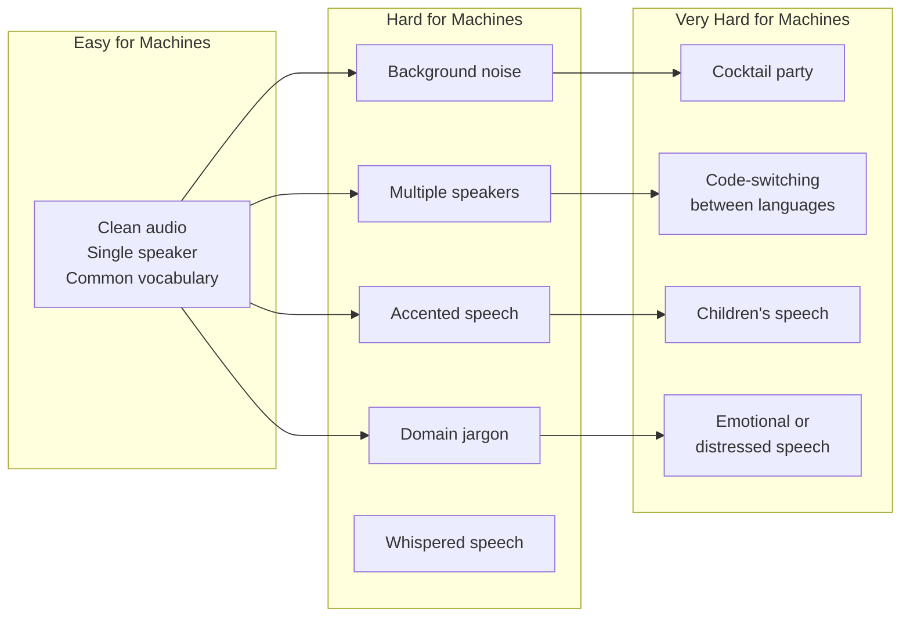
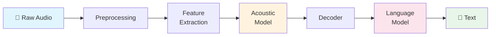
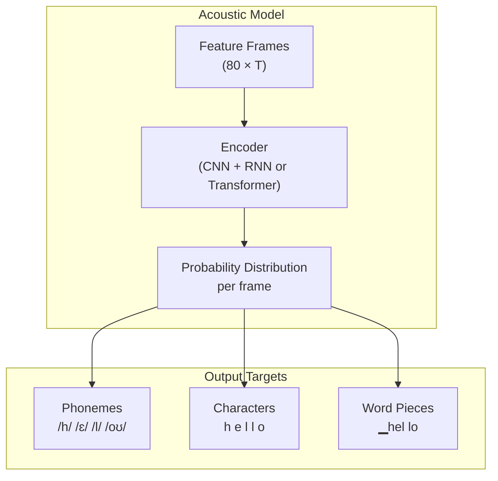
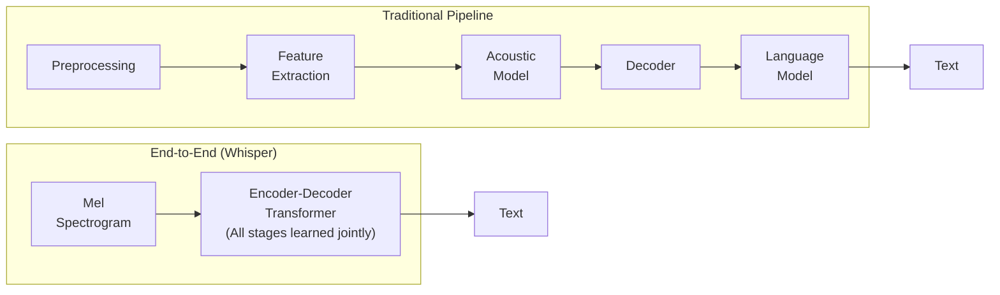
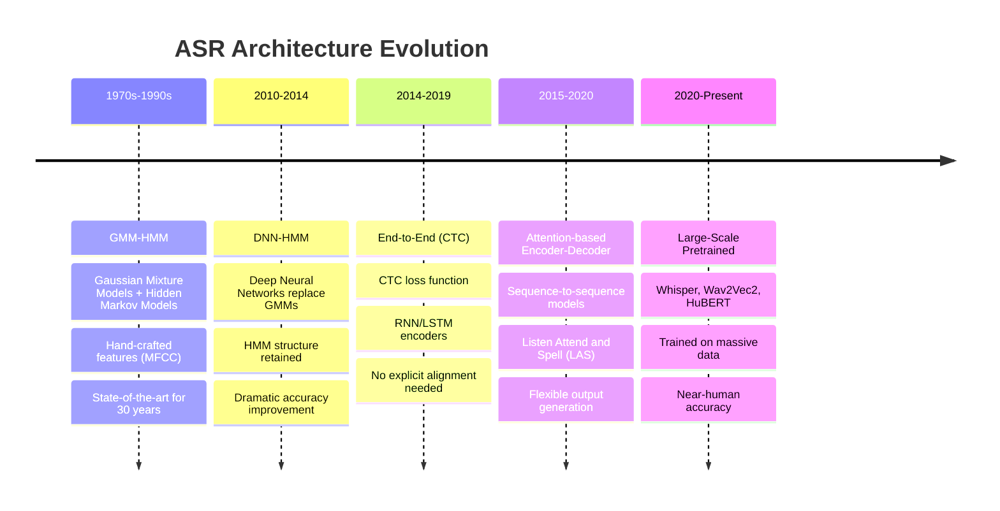
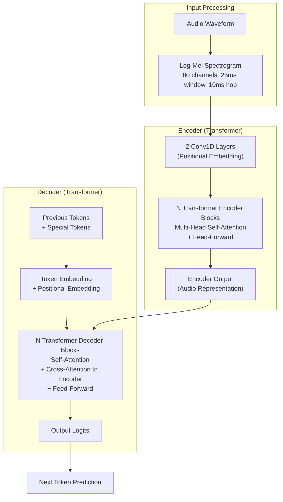
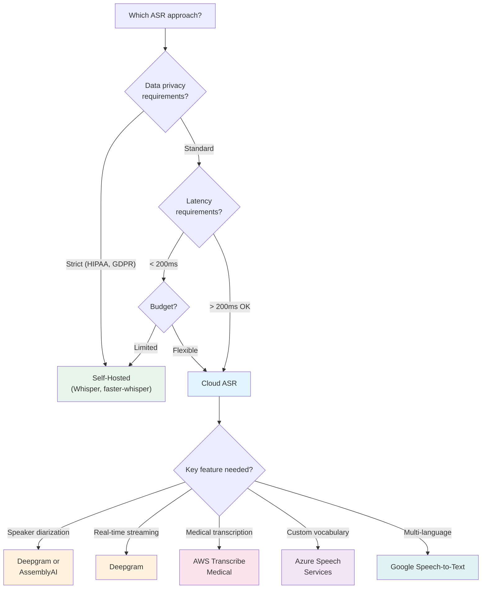
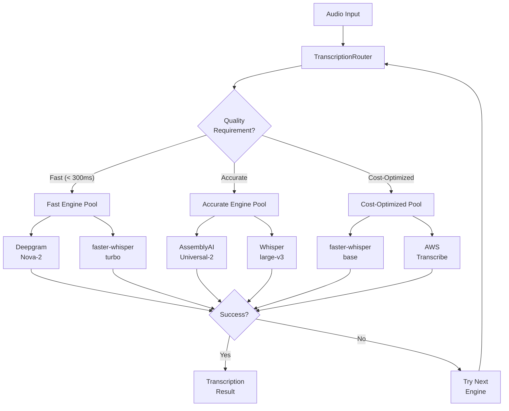

# Voice Agents Deep Dive  Part 3: Speech Recognition  From Sound Waves to Text

---

**Series:** Building Voice Agents  A Developer's Deep Dive from Audio Fundamentals to Production
**Part:** 3 of 20 (Speech Recognition)
**Audience:** Developers with Python experience who want to build voice-powered AI agents from the ground up
**Reading time:** ~55 minutes

---

## Table of Contents

1. [Recap of Part 2](#recap-of-part-2)
2. [How Humans Recognize Speech](#how-humans-recognize-speech)
3. [The ASR Pipeline](#the-asr-pipeline)
4. [Traditional ASR Overview](#traditional-asr-overview)
5. [OpenAI Whisper Deep Dive](#openai-whisper-deep-dive)
6. [Cloud ASR Services](#cloud-asr-services)
7. [Word Error Rate (WER)](#word-error-rate-wer)
8. [Building a Multi-Engine Transcription Service](#building-a-multi-engine-transcription-service)
9. [Vocabulary Cheat Sheet](#vocabulary-cheat-sheet)
10. [What's Next  Part 4](#whats-next--part-4-real-time-asr-and-streaming-pipelines)

---

## Recap of Part 2

In **Part 2**, we explored the fascinating world of **digital audio fundamentals**  the hidden physics and mathematics that underpin every voice agent. We learned how sound travels as longitudinal pressure waves through air, how microphones convert those pressure variations into electrical signals, and how **Analog-to-Digital Converters (ADCs)** sample and quantize those signals into discrete numbers a computer can process. We implemented our own audio recording pipeline, visualized waveforms, and built spectrograms using the **Fast Fourier Transform (FFT)**.

We also explored **Mel-Frequency Cepstral Coefficients (MFCCs)**  the feature representation that bridges the gap between raw audio and machine learning models. By the end of Part 2, you had a working pipeline that could:

1. Record audio from a microphone
2. Visualize the waveform and spectrogram
3. Extract MFCC features suitable for speech recognition

Now comes the moment of truth. We have features  numbers that describe what the audio *sounds like*. But how do we turn those numbers into **words**? That is the domain of **Automatic Speech Recognition (ASR)**, and it is one of the hardest problems in all of artificial intelligence.

> **Where we are in the pipeline:**
> Microphone → ADC → Digital Audio → **Feature Extraction** → **[ASR] → Text** → NLU → Agent Logic → TTS → Speaker

Let us begin.

---

## How Humans Recognize Speech

Before we dive into algorithms and neural networks, it is worth pausing to appreciate just how *remarkable* human speech recognition truly is  and why replicating it in machines has been one of computing's greatest challenges for over 70 years.

### The Miracle You Perform Every Day

Right now, if someone spoke to you, your brain would:

1. **Separate their voice** from background noise (air conditioning, traffic, music)
2. **Segment a continuous stream** of sound into individual words  even though there are no "spaces" in spoken language
3. **Handle massive variation**  the same word sounds completely different depending on who says it, how fast they speak, their accent, their emotional state, and what words surround it
4. **Resolve ambiguity** in real time  "recognize speech" and "wreck a nice beach" are acoustically nearly identical
5. **Fill in missing information**  you can understand someone even if you miss half the words, because your brain uses context, grammar, and world knowledge to reconstruct the message

You do all of this in **under 200 milliseconds**, while simultaneously planning your response, reading body language, and sipping coffee. Your brain makes it feel effortless, but the underlying computation is staggeringly complex.

### The Cocktail Party Problem

Imagine you are at a crowded party. Dozens of conversations overlap. Music plays. Glasses clink. Yet you can **focus on a single speaker** and follow their words almost perfectly. If someone across the room says your name, you instantly notice  even though you were not consciously listening to them.

This is the **cocktail party problem**, first described by Colin Cherry in 1953. It remains one of the hardest unsolved problems in audio processing. Humans solve it effortlessly using a combination of:

- **Binaural processing**  using tiny differences in arrival time and volume between your two ears to locate sound sources in 3D space
- **Spectral segregation**  each voice has a unique frequency profile (timbre), and your auditory cortex separates overlapping sources by their spectral signatures
- **Top-down prediction**  your brain predicts what the speaker is likely to say next and uses those predictions to filter out noise
- **Visual cues**  lip reading contributes significantly to speech perception (the McGurk effect demonstrates this dramatically)

For machines, separating overlapping speakers remains extremely difficult. Modern **source separation** models (like Meta's Demucs or Google's VoiceFilter) have made impressive progress, but they still fall far short of human performance in noisy, multi-speaker environments.

### Coarticulation  Why Words Blur Together

When you say the word "don't," the "d" sound at the beginning is already shaped by the "oh" vowel that follows it. When you say "boot," your lips start rounding for the "oo" *before* you finish the "b." This phenomenon is called **coarticulation**  the sounds in speech are not produced as isolated, discrete units. They blend, overlap, and influence each other.

This means that:

- The acoustic realization of a phoneme depends heavily on its **context** (what comes before and after)
- There are no clean boundaries between phonemes, syllables, or words in the speech signal
- The same phoneme can sound dramatically different depending on its neighbors

```
Example of coarticulation:

"did you" → often pronounced "didju" or "didjə"
"want to" → often pronounced "wanna"
"going to" → often pronounced "gonna"
"let me"  → often pronounced "lemme"
```

For an ASR system, this means you cannot simply build a dictionary of "what each phoneme sounds like" and match against it. The system must learn the complex, context-dependent ways that sounds interact.

### Accents and Dialects

The word "water" is pronounced differently in:

| Region | Approximate Pronunciation |
|--------|--------------------------|
| American (General) | "wah-ter" or "wah-der" |
| British (RP) | "woh-tah" |
| Australian | "woh-tah" (different vowel quality) |
| Scottish | "wah-ter" (rhotic 'r', dental 't') |
| Indian English | "vah-ter" or "waa-tar" |
| South African | "woh-tah" (distinct vowel shift) |

And these are just *regional* variations. Within each region, there are further variations based on socioeconomic background, age, gender, and individual speaking habits. An ASR system must handle **all** of this variation while still mapping to the same word "water."

### Homophones and Ambiguity

Speech recognition is not just an acoustic problem  it is fundamentally a **language understanding** problem. Consider:

| Phrase | Alternative |
|--------|------------|
| "I scream" | "ice cream" |
| "recognize speech" | "wreck a nice beach" |
| "four candles" | "fork handles" |
| "their / there / they're" | Acoustically identical |
| "to / too / two" | Acoustically identical |
| "a tax" | "attacks" |
| "the stuffy nose" | "the stuff he knows" |

Without understanding the **context**  the topic of conversation, the grammar of the sentence, the likelihood of different word sequences  an ASR system has no way to choose the correct interpretation.

> **Key Insight:** Speech recognition is not just "pattern matching on audio." It requires integrating acoustic evidence with linguistic knowledge  phonetics, phonology, morphology, syntax, semantics, and pragmatics. This is why modern ASR systems are so large and complex: they must implicitly learn all of these levels of language.

### The Performance Gap

Despite decades of progress, machine speech recognition still lags behind human performance in many scenarios:



In clean, controlled conditions (quiet room, close microphone, standard accent, common vocabulary), modern ASR systems achieve **Word Error Rates (WER)** below 5%  approaching or sometimes matching human transcriptionist performance. But in the messy real world of voice agents  where users speak in noisy environments, with diverse accents, using domain-specific vocabulary  error rates can climb to 15-30% or higher.

Understanding this gap is critical for voice agent developers. You cannot simply plug in an ASR engine and assume it will work perfectly. You must design your system to **handle errors gracefully**, provide opportunities for correction, and optimize for your specific use case.

---

## The ASR Pipeline

Now that we understand *why* speech recognition is hard, let us examine *how* modern systems tackle it. At the highest level, every ASR system transforms audio into text through a series of processing stages.

### The Classic Pipeline



Let us walk through each stage:

### Stage 1  Preprocessing

Before any recognition happens, the raw audio signal must be cleaned up:

```python
import numpy as np
from scipy import signal
from scipy.io import wavfile


def preprocess_audio(
    audio: np.ndarray,
    sample_rate: int = 16000,
    target_sample_rate: int = 16000,
) -> np.ndarray:
    """
    Preprocess raw audio for ASR.

    Steps:
    1. Resample to target sample rate (most ASR models expect 16kHz)
    2. Convert to mono if stereo
    3. Normalize amplitude
    4. Apply pre-emphasis filter
    5. Remove DC offset
    6. Trim silence from beginning and end
    """
    # Step 1: Resample if necessary
    if sample_rate != target_sample_rate:
        num_samples = int(len(audio) * target_sample_rate / sample_rate)
        audio = signal.resample(audio, num_samples)

    # Step 2: Convert to mono
    if audio.ndim > 1:
        audio = np.mean(audio, axis=1)

    # Step 3: Normalize to [-1, 1]
    max_val = np.max(np.abs(audio))
    if max_val > 0:
        audio = audio / max_val

    # Step 4: Remove DC offset
    audio = audio - np.mean(audio)

    # Step 5: Pre-emphasis filter (boost high frequencies)
    # This compensates for the natural roll-off of speech at high frequencies
    pre_emphasis_coeff = 0.97
    audio = np.append(audio[0], audio[1:] - pre_emphasis_coeff * audio[:-1])

    # Step 6: Trim silence (simple energy-based approach)
    audio = trim_silence(audio, threshold=0.01)

    return audio


def trim_silence(
    audio: np.ndarray,
    threshold: float = 0.01,
    frame_length: int = 512,
) -> np.ndarray:
    """Remove silence from beginning and end of audio."""
    # Calculate energy of each frame
    num_frames = len(audio) // frame_length
    energies = np.array([
        np.sqrt(np.mean(audio[i * frame_length:(i + 1) * frame_length] ** 2))
        for i in range(num_frames)
    ])

    # Find first and last frames above threshold
    active_frames = np.where(energies > threshold)[0]

    if len(active_frames) == 0:
        return audio  # Return original if all silence

    start = active_frames[0] * frame_length
    end = (active_frames[-1] + 1) * frame_length

    return audio[start:end]
```

> **Why pre-emphasis?** Human speech naturally has more energy at low frequencies than high frequencies. The pre-emphasis filter (`y[n] = x[n] - 0.97 * x[n-1]`) boosts high-frequency components, which carry important information for distinguishing consonants. This simple step measurably improves ASR accuracy.

### Stage 2  Feature Extraction

We covered this in detail in Part 2. The two most common feature representations for ASR are:

| Feature | Dimensions | Use Case |
|---------|-----------|----------|
| **Mel Spectrogram** | 80-128 mel bins × T frames | Modern neural ASR (Whisper, Wav2Vec2) |
| **MFCC** | 13-40 coefficients × T frames | Traditional ASR, some neural systems |
| **Filter Banks (fbank)** | 40-80 filters × T frames | Many neural ASR systems |
| **Raw Waveform** | 1 × samples | Wav2Vec2, HuBERT (learn their own features) |

```python
import librosa
import numpy as np


def extract_features(
    audio: np.ndarray,
    sample_rate: int = 16000,
    feature_type: str = "mel_spectrogram",
    n_mels: int = 80,
    n_mfcc: int = 13,
    n_fft: int = 400,       # 25ms window at 16kHz
    hop_length: int = 160,   # 10ms hop at 16kHz
) -> np.ndarray:
    """
    Extract features from preprocessed audio.

    Args:
        audio: Preprocessed audio signal
        sample_rate: Sample rate in Hz
        feature_type: One of 'mel_spectrogram', 'mfcc', 'fbank'
        n_mels: Number of mel filter banks
        n_mfcc: Number of MFCC coefficients
        n_fft: FFT window size
        hop_length: Hop length between frames

    Returns:
        Feature matrix of shape (n_features, n_frames)
    """
    if feature_type == "mel_spectrogram":
        features = librosa.feature.melspectrogram(
            y=audio,
            sr=sample_rate,
            n_fft=n_fft,
            hop_length=hop_length,
            n_mels=n_mels,
        )
        # Convert to log scale (dB)
        features = librosa.power_to_db(features, ref=np.max)

    elif feature_type == "mfcc":
        features = librosa.feature.mfcc(
            y=audio,
            sr=sample_rate,
            n_mfcc=n_mfcc,
            n_fft=n_fft,
            hop_length=hop_length,
            n_mels=n_mels,
        )

    elif feature_type == "fbank":
        # Mel filter bank energies (before DCT)
        mel_spec = librosa.feature.melspectrogram(
            y=audio,
            sr=sample_rate,
            n_fft=n_fft,
            hop_length=hop_length,
            n_mels=n_mels,
        )
        features = np.log(mel_spec + 1e-8)

    else:
        raise ValueError(f"Unknown feature type: {feature_type}")

    return features


# Example: Extract features from a sample
if __name__ == "__main__":
    # Load audio
    audio, sr = librosa.load("sample.wav", sr=16000)

    # Extract different feature types
    mel = extract_features(audio, sr, "mel_spectrogram")
    mfcc = extract_features(audio, sr, "mfcc")
    fbank = extract_features(audio, sr, "fbank")

    print(f"Mel spectrogram shape: {mel.shape}")    # (80, T)
    print(f"MFCC shape: {mfcc.shape}")               # (13, T)
    print(f"Filter bank shape: {fbank.shape}")        # (80, T)
```

### Stage 3  Acoustic Model

The acoustic model is the core of the ASR system. It takes features as input and produces a probability distribution over possible linguistic units (phonemes, characters, or word pieces) for each frame of audio.



We will explore acoustic model architectures in detail in the Traditional ASR section below.

### Stage 4  Decoder

The decoder takes the frame-level probability distributions from the acoustic model and produces the most likely sequence of words. This is a **search problem**  finding the best path through an enormous space of possibilities.

Common decoding strategies:

| Strategy | Description | Speed | Accuracy |
|----------|------------|-------|----------|
| **Greedy** | Pick the most probable token at each step | Fastest | Lowest |
| **Beam Search** | Maintain top-K hypotheses at each step | Moderate | Good |
| **Beam Search + LM** | Beam search with language model rescoring | Slower | Best |
| **CTC Beam Search** | Beam search specialized for CTC outputs | Moderate | Good |

### Stage 5  Language Model

The language model assigns probabilities to word sequences, helping the decoder choose between acoustically similar alternatives. For example:

- P("recognize speech") >> P("wreck a nice beach")  because "recognize speech" is a far more common phrase
- P("I scream when scared") >> P("ice cream when scared")  context resolves ambiguity

Language models range from simple **n-gram** models (count-based probabilities of word sequences) to massive **neural language models** (transformers that understand deep context).

### Modern End-to-End Systems

Modern ASR systems like **Whisper** collapse many of these stages into a single neural network:



The advantage of end-to-end systems is that all components are **trained together** to optimize a single objective: producing the correct text. The disadvantage is that they require enormous amounts of training data and compute.

---

## Traditional ASR Overview

To understand modern ASR, it helps to know where we came from. The history of ASR is a story of steadily replacing hand-crafted components with learned ones.

### Evolution Timeline



### Hidden Markov Models (HMMs)  The Foundation

For nearly 30 years, **Hidden Markov Models** were the dominant approach to speech recognition. While they have been largely superseded by neural networks, understanding HMMs gives you crucial intuition about the structure of the ASR problem.

#### The Core Idea

An HMM models speech as a sequence of **hidden states** (phonemes or sub-phoneme units) that produce **observable outputs** (acoustic features). The "hidden" part is that we cannot directly observe which phoneme is being spoken at any given moment  we can only observe the acoustic features and must *infer* the hidden state sequence.

```
Hidden states:  [silence] → [/h/] → [/ɛ/] → [/l/] → [/oʊ/] → [silence]
                    ↓          ↓        ↓        ↓        ↓          ↓
Observations:   [features] [features] [features] [features] [features] [features]
```

#### Key Components of an HMM

1. **States (S):** A finite set of hidden states (e.g., phoneme sub-states)
2. **Transition Probabilities (A):** The probability of moving from one state to another
3. **Emission Probabilities (B):** The probability of observing a particular feature vector in a given state
4. **Initial State Distribution (π):** The probability of starting in each state

```python
import numpy as np
from dataclasses import dataclass


@dataclass
class HMM:
    """
    A simple Hidden Markov Model for speech recognition concepts.

    This is a conceptual implementation to illustrate the principles.
    Production HMM-based ASR systems use highly optimized implementations.
    """
    n_states: int
    n_observations: int

    # Transition probability matrix: A[i][j] = P(state_j | state_i)
    transition_probs: np.ndarray = None    # Shape: (n_states, n_states)

    # Emission probability matrix: B[i][k] = P(obs_k | state_i)
    emission_probs: np.ndarray = None      # Shape: (n_states, n_observations)

    # Initial state distribution: pi[i] = P(state_i at t=0)
    initial_probs: np.ndarray = None       # Shape: (n_states,)

    def __post_init__(self):
        if self.transition_probs is None:
            # Random initialization (rows sum to 1)
            self.transition_probs = np.random.dirichlet(
                np.ones(self.n_states), size=self.n_states
            )
        if self.emission_probs is None:
            self.emission_probs = np.random.dirichlet(
                np.ones(self.n_observations), size=self.n_states
            )
        if self.initial_probs is None:
            self.initial_probs = np.random.dirichlet(np.ones(self.n_states))

    def viterbi(self, observations: list[int]) -> tuple[list[int], float]:
        """
        Find the most likely state sequence using the Viterbi algorithm.

        This is the core decoding algorithm in HMM-based ASR:
        Given a sequence of observations (acoustic features),
        find the most likely sequence of hidden states (phonemes).

        Args:
            observations: List of observation indices

        Returns:
            Tuple of (best state sequence, log probability)
        """
        T = len(observations)

        # Viterbi table: viterbi[t][s] = max log-prob of ending in state s at time t
        viterbi_table = np.full((T, self.n_states), -np.inf)

        # Backpointer table for tracing the best path
        backpointer = np.zeros((T, self.n_states), dtype=int)

        # Initialization (t = 0)
        for s in range(self.n_states):
            if self.initial_probs[s] > 0 and self.emission_probs[s, observations[0]] > 0:
                viterbi_table[0, s] = (
                    np.log(self.initial_probs[s])
                    + np.log(self.emission_probs[s, observations[0]])
                )

        # Recursion (t = 1 to T-1)
        for t in range(1, T):
            for s in range(self.n_states):
                if self.emission_probs[s, observations[t]] == 0:
                    continue

                # Find the best previous state
                for s_prev in range(self.n_states):
                    if self.transition_probs[s_prev, s] == 0:
                        continue
                    score = (
                        viterbi_table[t - 1, s_prev]
                        + np.log(self.transition_probs[s_prev, s])
                        + np.log(self.emission_probs[s, observations[t]])
                    )
                    if score > viterbi_table[t, s]:
                        viterbi_table[t, s] = score
                        backpointer[t, s] = s_prev

        # Termination: find the best final state
        best_final_state = np.argmax(viterbi_table[T - 1])
        best_score = viterbi_table[T - 1, best_final_state]

        # Backtrace to find the best path
        best_path = [0] * T
        best_path[T - 1] = best_final_state
        for t in range(T - 2, -1, -1):
            best_path[t] = backpointer[t + 1, best_path[t + 1]]

        return best_path, best_score

    def forward(self, observations: list[int]) -> float:
        """
        Compute the total probability of an observation sequence
        using the Forward algorithm.

        This is used during training to evaluate how well the model
        explains the observed data.
        """
        T = len(observations)

        # Forward table: alpha[t][s] = P(o_1...o_t, state_t = s)
        alpha = np.zeros((T, self.n_states))

        # Initialization
        for s in range(self.n_states):
            alpha[0, s] = (
                self.initial_probs[s]
                * self.emission_probs[s, observations[0]]
            )

        # Recursion
        for t in range(1, T):
            for s in range(self.n_states):
                alpha[t, s] = self.emission_probs[s, observations[t]] * np.sum(
                    alpha[t - 1, :] * self.transition_probs[:, s]
                )

        # Total probability
        return np.sum(alpha[T - 1, :])


# Example: A tiny HMM for recognizing "hello"
def demo_hmm():
    """Demonstrate HMM concepts with a tiny example."""

    # States represent sub-phoneme units
    states = ["silence", "h", "eh", "l", "oh", "silence_end"]
    n_states = len(states)

    # Observations are quantized acoustic feature indices
    # (In reality, GMMs model continuous features)
    n_obs = 10  # 10 possible observation symbols

    # Define transition probabilities (left-to-right HMM)
    # Each state can either stay in itself or move to the next state
    A = np.zeros((n_states, n_states))
    for i in range(n_states - 1):
        A[i, i] = 0.6      # Self-loop (stay in current phoneme)
        A[i, i + 1] = 0.4  # Transition to next phoneme
    A[-1, -1] = 1.0        # Final state is absorbing

    # Create the HMM
    hmm = HMM(
        n_states=n_states,
        n_observations=n_obs,
        transition_probs=A,
    )

    # Simulate some observations
    observations = [0, 1, 1, 3, 3, 5, 5, 7, 7, 9]

    # Decode using Viterbi
    best_path, score = hmm.viterbi(observations)

    print("Observation sequence:", observations)
    print("Best state sequence:", [states[s] for s in best_path])
    print(f"Log probability: {score:.4f}")


demo_hmm()
```

> **Why left-to-right?** Speech is inherently sequential  you do not go back and re-pronounce earlier phonemes. HMMs for speech use a **left-to-right** topology where states can only transition to themselves (self-loop, to model variable duration) or to the next state. You never jump backward.

#### GMM-HMM: The Classic Pairing

In the classic GMM-HMM system:

- The **HMM** models the temporal structure of speech (sequence of phonemes)
- **Gaussian Mixture Models (GMMs)** model the emission probabilities  the distribution of acoustic features within each state

```python
from scipy.stats import multivariate_normal


class GaussianMixture:
    """
    A simple Gaussian Mixture Model for modeling emission probabilities.

    In GMM-HMM ASR, each HMM state has its own GMM that models
    the distribution of acoustic feature vectors in that state.
    """

    def __init__(self, n_components: int, n_features: int):
        self.n_components = n_components
        self.n_features = n_features

        # Mixture weights (sum to 1)
        self.weights = np.ones(n_components) / n_components

        # Mean of each Gaussian component
        self.means = np.random.randn(n_components, n_features)

        # Covariance of each component (diagonal for efficiency)
        self.covariances = np.ones((n_components, n_features))

    def log_likelihood(self, x: np.ndarray) -> float:
        """Compute log P(x | this GMM)."""
        log_probs = []
        for k in range(self.n_components):
            log_prob = (
                np.log(self.weights[k])
                + multivariate_normal.logpdf(
                    x, mean=self.means[k], cov=np.diag(self.covariances[k])
                )
            )
            log_probs.append(log_prob)

        # Log-sum-exp for numerical stability
        max_log_prob = max(log_probs)
        return max_log_prob + np.log(
            sum(np.exp(lp - max_log_prob) for lp in log_probs)
        )


# In a full GMM-HMM system, each HMM state has its own GMM:
# state "h"  -> GMM with 16-64 Gaussian components
# state "eh" -> GMM with 16-64 Gaussian components
# state "l"  -> GMM with 16-64 Gaussian components
# ...
```

### DNN-HMM: Neural Networks Enter the Picture

Around 2010-2012, researchers discovered that replacing GMMs with **Deep Neural Networks (DNNs)** for emission probability estimation dramatically improved accuracy:

```
GMM-HMM → DNN-HMM
         ↑
  The only change: replace GMMs with a neural network
  that predicts P(state | features) for each frame
```

The DNN takes acoustic features (e.g., a window of MFCC frames) and outputs a probability distribution over HMM states. This was trained using the **cross-entropy loss**  the same loss used in modern classification networks.

The key insight: DNNs can learn much more complex, nonlinear decision boundaries than GMMs, leading to better discrimination between similar-sounding phonemes.

### CTC  Connectionist Temporal Classification

**CTC** (Connectionist Temporal Classification), introduced by Alex Graves in 2006, was a breakthrough that enabled **end-to-end** ASR training without requiring pre-aligned training data.

#### The Alignment Problem

The fundamental challenge in ASR training is that the input and output have **different lengths**:

```
Input:  100 frames of audio features (10ms per frame = 1 second of speech)
Output: "hello" = 5 characters

How do you align 100 input frames to 5 output characters?
```

In GMM-HMM systems, this alignment was obtained through a complex, multi-stage process called **forced alignment**. CTC eliminates this requirement.

#### How CTC Works

CTC introduces a special **blank token** (denoted `ε` or `-`) and defines a many-to-one mapping from frame-level predictions to output sequences:

```
Frame predictions:  h h h - e e - l l l - l - o o o
After collapsing:   h       e     l       l   o
After removing -:   h e l l o
Result:            "hello"
```

The rules are:
1. Collapse consecutive repeated characters into one
2. Remove all blank tokens

This means many different frame-level paths can produce the same output:

```
Path 1: h h h - e e - l l l - l - o o o → "hello"
Path 2: - h - e - - l - - l - o - - - - → "hello"
Path 3: h - - - e - l - - - l o - - - - → "hello"
```

CTC computes the **total probability** of the target sequence by summing over ALL valid paths:

```
P("hello") = P(path_1) + P(path_2) + P(path_3) + ... (all valid paths)
```

#### CTC Implementation

```python
import torch
import torch.nn as nn


class CTCASRModel(nn.Module):
    """
    A simple CTC-based ASR model.

    Architecture: Feature Extraction → Encoder (BiLSTM) → Linear → CTC Loss
    """

    def __init__(
        self,
        input_dim: int = 80,       # Mel spectrogram features
        hidden_dim: int = 512,
        num_layers: int = 4,
        vocab_size: int = 29,      # 26 letters + space + apostrophe + CTC blank
    ):
        super().__init__()

        # Bidirectional LSTM encoder
        self.encoder = nn.LSTM(
            input_size=input_dim,
            hidden_size=hidden_dim,
            num_layers=num_layers,
            batch_first=True,
            bidirectional=True,
            dropout=0.2,
        )

        # Linear projection to vocabulary size
        # (hidden_dim * 2 because bidirectional)
        self.classifier = nn.Linear(hidden_dim * 2, vocab_size)

        # CTC loss (blank token is index 0 by default)
        self.ctc_loss = nn.CTCLoss(blank=0, zero_infinity=True)

    def forward(self, features: torch.Tensor) -> torch.Tensor:
        """
        Forward pass.

        Args:
            features: (batch, time, input_dim) - mel spectrogram features

        Returns:
            Log probabilities: (batch, time, vocab_size)
        """
        # Encode
        encoder_out, _ = self.encoder(features)

        # Project to vocabulary
        logits = self.classifier(encoder_out)

        # Log softmax for CTC loss
        log_probs = torch.log_softmax(logits, dim=-1)

        return log_probs

    def compute_loss(
        self,
        features: torch.Tensor,
        targets: torch.Tensor,
        feature_lengths: torch.Tensor,
        target_lengths: torch.Tensor,
    ) -> torch.Tensor:
        """
        Compute CTC loss.

        The beauty of CTC: we do NOT need to know the alignment
        between input frames and output characters. CTC marginalizes
        over ALL possible alignments.

        Args:
            features: (batch, max_time, input_dim)
            targets: (batch, max_target_len) - character indices
            feature_lengths: (batch,) - actual length of each feature sequence
            target_lengths: (batch,) - actual length of each target sequence
        """
        log_probs = self.forward(features)

        # CTC expects (time, batch, vocab_size)
        log_probs = log_probs.permute(1, 0, 2)

        loss = self.ctc_loss(
            log_probs,
            targets,
            feature_lengths,
            target_lengths,
        )

        return loss

    def greedy_decode(self, features: torch.Tensor) -> list[str]:
        """
        Simple greedy CTC decoding.

        1. Take argmax at each timestep
        2. Remove consecutive duplicates
        3. Remove blank tokens
        """
        # Character vocabulary (index 0 = blank)
        vocab = [
            "",   # CTC blank
            "a", "b", "c", "d", "e", "f", "g", "h", "i", "j",
            "k", "l", "m", "n", "o", "p", "q", "r", "s", "t",
            "u", "v", "w", "x", "y", "z", " ", "'",
        ]

        log_probs = self.forward(features)

        # Greedy: take argmax at each timestep
        predictions = torch.argmax(log_probs, dim=-1)  # (batch, time)

        decoded_texts = []
        for pred in predictions:
            # Remove consecutive duplicates
            collapsed = []
            prev = -1
            for token_id in pred.tolist():
                if token_id != prev:
                    collapsed.append(token_id)
                    prev = token_id

            # Remove blanks and convert to characters
            text = "".join(
                vocab[token_id] for token_id in collapsed if token_id != 0
            )
            decoded_texts.append(text)

        return decoded_texts


# Training example
def train_ctc_model():
    """Example training loop for CTC ASR."""
    model = CTCASRModel(
        input_dim=80,
        hidden_dim=512,
        num_layers=4,
        vocab_size=29,
    )

    optimizer = torch.optim.Adam(model.parameters(), lr=3e-4)

    # Simulated training batch
    batch_size = 4
    max_time = 200        # 200 frames = 2 seconds at 10ms/frame
    max_target_len = 30   # Maximum 30 characters in transcription

    # Random features and targets (in practice, from a real dataset)
    features = torch.randn(batch_size, max_time, 80)
    targets = torch.randint(1, 29, (batch_size, max_target_len))
    feature_lengths = torch.full((batch_size,), max_time, dtype=torch.long)
    target_lengths = torch.randint(5, max_target_len, (batch_size,), dtype=torch.long)

    # Training step
    model.train()
    optimizer.zero_grad()

    loss = model.compute_loss(features, targets, feature_lengths, target_lengths)
    loss.backward()

    # Gradient clipping (important for RNN training)
    torch.nn.utils.clip_grad_norm_(model.parameters(), max_norm=5.0)

    optimizer.step()

    print(f"CTC Loss: {loss.item():.4f}")

    # Greedy decode
    model.eval()
    with torch.no_grad():
        texts = model.greedy_decode(features[:1])
        print(f"Decoded text: '{texts[0]}'")


train_ctc_model()
```

> **Key Insight:** CTC was revolutionary because it eliminated the need for frame-level alignment labels. Before CTC, training an ASR model required first running a GMM-HMM system to generate alignments  a complex and error-prone bootstrapping process. CTC allowed training directly from (audio, text) pairs.

### Attention-Based Encoder-Decoder for ASR

The **attention mechanism** (Bahdanau et al., 2014) and the **sequence-to-sequence** framework (Sutskever et al., 2014) opened up another approach to end-to-end ASR. Instead of independently classifying each frame (like CTC), attention-based models learn to **focus on relevant parts of the input** while generating each output token.

The seminal paper **"Listen, Attend and Spell" (LAS)** by Chan et al., 2015, demonstrated this approach for ASR:

```python
import torch
import torch.nn as nn
import torch.nn.functional as F


class AttentionASR(nn.Module):
    """
    Simplified Listen, Attend, and Spell (LAS) model.

    Components:
    1. Listener (Encoder): Processes audio features
    2. Attention: Learns where to focus in the audio
    3. Speller (Decoder): Generates text character by character
    """

    def __init__(
        self,
        input_dim: int = 80,
        encoder_dim: int = 256,
        decoder_dim: int = 512,
        attention_dim: int = 128,
        vocab_size: int = 31,    # 26 letters + space + ' + <sos> + <eos> + <pad>
        encoder_layers: int = 3,
    ):
        super().__init__()

        # Listener (Encoder): Pyramidal BiLSTM
        # Reduces temporal resolution by 2x at each layer
        self.encoder = nn.LSTM(
            input_size=input_dim,
            hidden_size=encoder_dim,
            num_layers=encoder_layers,
            batch_first=True,
            bidirectional=True,
            dropout=0.1,
        )

        encoder_output_dim = encoder_dim * 2  # Bidirectional

        # Attention mechanism (Bahdanau / additive attention)
        self.attention_query = nn.Linear(decoder_dim, attention_dim)
        self.attention_key = nn.Linear(encoder_output_dim, attention_dim)
        self.attention_score = nn.Linear(attention_dim, 1)

        # Speller (Decoder): LSTM
        self.decoder = nn.LSTMCell(
            input_size=vocab_size + encoder_output_dim,  # Previous token + context
            hidden_size=decoder_dim,
        )

        # Output projection
        self.output_projection = nn.Linear(
            decoder_dim + encoder_output_dim, vocab_size
        )

        self.vocab_size = vocab_size
        self.decoder_dim = decoder_dim

    def compute_attention(
        self,
        decoder_hidden: torch.Tensor,    # (batch, decoder_dim)
        encoder_outputs: torch.Tensor,    # (batch, time, encoder_dim*2)
    ) -> tuple[torch.Tensor, torch.Tensor]:
        """
        Compute attention weights and context vector.

        Returns:
            context: (batch, encoder_dim*2) - weighted sum of encoder outputs
            weights: (batch, time) - attention weights
        """
        # Query from decoder
        query = self.attention_query(decoder_hidden)          # (batch, attention_dim)
        query = query.unsqueeze(1)                            # (batch, 1, attention_dim)

        # Keys from encoder
        keys = self.attention_key(encoder_outputs)            # (batch, time, attention_dim)

        # Attention scores
        scores = self.attention_score(
            torch.tanh(query + keys)
        ).squeeze(-1)                                         # (batch, time)

        # Attention weights (softmax)
        weights = F.softmax(scores, dim=-1)                   # (batch, time)

        # Context vector (weighted sum of encoder outputs)
        context = torch.bmm(
            weights.unsqueeze(1),                             # (batch, 1, time)
            encoder_outputs                                    # (batch, time, encoder_dim*2)
        ).squeeze(1)                                          # (batch, encoder_dim*2)

        return context, weights

    def forward(
        self,
        features: torch.Tensor,
        targets: torch.Tensor = None,
        max_decode_length: int = 100,
    ) -> torch.Tensor:
        """
        Forward pass with teacher forcing during training.

        Args:
            features: (batch, time, input_dim) - mel spectrogram
            targets: (batch, max_target_len) - target character indices
            max_decode_length: Maximum decoding length for inference
        """
        batch_size = features.size(0)

        # Encode
        encoder_outputs, _ = self.encoder(features)  # (batch, time, encoder_dim*2)

        # Initialize decoder state
        h = torch.zeros(batch_size, self.decoder_dim, device=features.device)
        c = torch.zeros(batch_size, self.decoder_dim, device=features.device)

        # Start with <sos> token
        sos_index = self.vocab_size - 3  # Assuming <sos> is at this index
        prev_token = torch.full(
            (batch_size,), sos_index, dtype=torch.long, device=features.device
        )

        # Determine decode length
        if targets is not None:
            decode_length = targets.size(1)
        else:
            decode_length = max_decode_length

        # Collect outputs
        outputs = []
        attention_weights = []

        for t in range(decode_length):
            # One-hot encode previous token
            prev_onehot = F.one_hot(
                prev_token, num_classes=self.vocab_size
            ).float()  # (batch, vocab_size)

            # Compute attention
            context, weights = self.compute_attention(h, encoder_outputs)
            attention_weights.append(weights)

            # Decoder input: concatenate previous token and context
            decoder_input = torch.cat([prev_onehot, context], dim=-1)

            # Decoder step
            h, c = self.decoder(decoder_input, (h, c))

            # Output projection
            output = self.output_projection(torch.cat([h, context], dim=-1))
            outputs.append(output)

            # Teacher forcing: use ground truth as next input during training
            if targets is not None and self.training:
                prev_token = targets[:, t]
            else:
                prev_token = output.argmax(dim=-1)

        outputs = torch.stack(outputs, dim=1)  # (batch, decode_len, vocab_size)

        return outputs
```

> **CTC vs. Attention: Complementary Strengths**
> - **CTC** makes *independent* predictions at each frame  fast and simple, but cannot model output dependencies (e.g., language patterns)
> - **Attention** generates outputs *autoregressively*  can model output dependencies, but slower and prone to alignment errors
> - Modern systems like Whisper use attention-based encoder-decoder with various techniques to get the best of both worlds

---

## OpenAI Whisper Deep Dive

In September 2022, OpenAI released **Whisper**, a speech recognition model that fundamentally changed the landscape of ASR. Whisper demonstrated that with enough data and a simple, well-established architecture, you could achieve remarkable accuracy across languages, accents, and acoustic conditions.

### What Made Whisper Special

Whisper's breakthrough was not architectural innovation  it used a standard encoder-decoder Transformer. The innovation was in **scale and training approach**:

1. **680,000 hours** of labeled audio data from the internet (compared to ~1,000-10,000 hours for most prior models)
2. **Multitask training**  the same model performs transcription, translation, language identification, and timestamp prediction
3. **Weakly supervised**  much of the training data was automatically labeled (not human-verified), but the sheer volume compensated for noise
4. **Multilingual**  trained on 99 languages simultaneously

### Architecture

Whisper uses a standard **Transformer encoder-decoder** architecture:



#### The Special Token Protocol

One of Whisper's elegant design choices is its use of **special tokens** to control behavior:

```
<|startoftranscript|> <|en|> <|transcribe|> <|notimestamps|> Hello, how are you? <|endoftext|>
```

| Token | Purpose |
|-------|---------|
| `<\|startoftranscript\|>` | Signals start of a new transcription |
| `<\|en\|>`, `<\|fr\|>`, etc. | Language tag (detected or specified) |
| `<\|transcribe\|>` | Task: transcribe speech in its original language |
| `<\|translate\|>` | Task: translate speech to English |
| `<\|notimestamps\|>` | Do not include timestamps |
| `<\|0.00\|>`, `<\|0.02\|>`, etc. | Timestamp tokens (30ms precision) |
| `<\|endoftext\|>` | Signals end of transcription |

This clever design allows a single model to handle multiple tasks by simply changing the prompt tokens.

### Model Sizes

| Model | Parameters | English-only | Multilingual | Relative Speed | VRAM Required | WER (en) |
|-------|-----------|:------------:|:------------:|:--------------:|:-------------:|:--------:|
| `tiny` | 39M | `tiny.en` | `tiny` | ~32x | ~1 GB | ~12% |
| `base` | 74M | `base.en` | `base` | ~16x | ~1 GB | ~10% |
| `small` | 244M | `small.en` | `small` | ~6x | ~2 GB | ~7% |
| `medium` | 769M | `medium.en` | `medium` | ~2x | ~5 GB | ~5.5% |
| `large-v3` | 1550M |  | `large-v3` | 1x | ~10 GB | ~4.2% |
| `turbo` | 809M |  | `turbo` | ~8x | ~6 GB | ~4.5% |

> **Choosing a model size:** For real-time voice agents, `turbo` offers the best balance of accuracy and speed. For offline batch processing where accuracy is paramount, `large-v3` is the best choice. For resource-constrained environments (edge devices, mobile), `base` or `small` are practical options.

### Basic Usage

```python
import whisper
import json


def basic_transcription():
    """Basic Whisper transcription with all output fields."""

    # Load model (downloads automatically on first use)
    # Options: tiny, base, small, medium, large-v3, turbo
    model = whisper.load_model("base")

    # Transcribe
    result = model.transcribe("audio.wav")

    # The result dictionary contains:
    print("=== Transcription Result ===")
    print(f"Text: {result['text']}")
    print(f"Language: {result['language']}")

    # Segments contain detailed information
    print(f"\nNumber of segments: {len(result['segments'])}")

    for i, segment in enumerate(result["segments"]):
        print(f"\n--- Segment {i} ---")
        print(f"  ID: {segment['id']}")
        print(f"  Start: {segment['start']:.2f}s")
        print(f"  End: {segment['end']:.2f}s")
        print(f"  Text: {segment['text']}")
        print(f"  Avg Log Prob: {segment['avg_logprob']:.4f}")
        print(f"  No Speech Prob: {segment['no_speech_prob']:.4f}")
        print(f"  Compression Ratio: {segment['compression_ratio']:.2f}")

    return result


def transcribe_with_options():
    """Transcription with various options."""

    model = whisper.load_model("base")

    result = model.transcribe(
        "audio.wav",

        # Language options
        language="en",          # Force English (skip auto-detection)

        # Decoding options
        temperature=0.0,        # Greedy decoding (most deterministic)
        beam_size=5,            # Beam search width
        best_of=5,              # Number of candidates when temperature > 0

        # Behavior options
        fp16=True,              # Use FP16 (faster on GPU)

        # Prompt for context (helps with domain-specific terms)
        initial_prompt="This is a technical discussion about Kubernetes and Docker.",

        # VAD filter (skip silent segments)
        no_speech_threshold=0.6,

        # Output options
        word_timestamps=False,  # We will cover this next

        # Compression ratio filter (detect hallucinations)
        compression_ratio_threshold=2.4,
        logprob_threshold=-1.0,
    )

    print(result["text"])
    return result


basic_transcription()
```

### Whisper with Timestamps

Whisper can provide both **segment-level** and **word-level** timestamps, which are essential for many voice agent applications (like displaying subtitles, aligning with video, or tracking conversation flow).

```python
import whisper
from dataclasses import dataclass


@dataclass
class WordTimestamp:
    """A single word with its timing information."""
    word: str
    start: float
    end: float
    probability: float


def transcribe_with_word_timestamps():
    """Get word-level timestamps from Whisper."""

    model = whisper.load_model("base")

    # Enable word-level timestamps
    result = model.transcribe(
        "audio.wav",
        word_timestamps=True,
    )

    print("=== Word-Level Timestamps ===\n")

    all_words: list[WordTimestamp] = []

    for segment in result["segments"]:
        print(f"Segment [{segment['start']:.2f}s - {segment['end']:.2f}s]:")
        print(f"  Text: {segment['text']}")

        if "words" in segment:
            for word_info in segment["words"]:
                word = WordTimestamp(
                    word=word_info["word"].strip(),
                    start=word_info["start"],
                    end=word_info["end"],
                    probability=word_info["probability"],
                )
                all_words.append(word)

                # Color-code by confidence
                confidence = "HIGH" if word.probability > 0.8 else (
                    "MED" if word.probability > 0.5 else "LOW"
                )

                print(
                    f"    [{word.start:6.2f}s - {word.end:6.2f}s] "
                    f"{word.word:<15s} (confidence: {word.probability:.2f} {confidence})"
                )
        print()

    return all_words


def format_as_srt(result: dict, output_path: str = "subtitles.srt") -> str:
    """
    Convert Whisper output to SRT subtitle format.

    Useful for voice agent applications that display transcriptions
    alongside audio/video.
    """
    srt_content = []

    for i, segment in enumerate(result["segments"], start=1):
        # Format timestamps as HH:MM:SS,mmm
        start_time = format_srt_timestamp(segment["start"])
        end_time = format_srt_timestamp(segment["end"])
        text = segment["text"].strip()

        srt_content.append(f"{i}")
        srt_content.append(f"{start_time} --> {end_time}")
        srt_content.append(text)
        srt_content.append("")  # Blank line separator

    srt_string = "\n".join(srt_content)

    with open(output_path, "w", encoding="utf-8") as f:
        f.write(srt_string)

    print(f"Saved SRT subtitles to {output_path}")
    return srt_string


def format_srt_timestamp(seconds: float) -> str:
    """Convert seconds to SRT timestamp format HH:MM:SS,mmm."""
    hours = int(seconds // 3600)
    minutes = int((seconds % 3600) // 60)
    secs = int(seconds % 60)
    millis = int((seconds % 1) * 1000)
    return f"{hours:02d}:{minutes:02d}:{secs:02d},{millis:03d}"


transcribe_with_word_timestamps()
```

### Language Detection

Whisper can automatically detect the language of the audio, which is useful for multilingual voice agents:

```python
import whisper
import torch


def detect_language(audio_path: str, model_name: str = "base") -> dict:
    """
    Detect the language of an audio file using Whisper.

    Returns a dictionary of language probabilities.
    """
    model = whisper.load_model(model_name)

    # Load and pad/trim audio to 30 seconds
    audio = whisper.load_audio(audio_path)
    audio = whisper.pad_or_trim(audio)

    # Create log-mel spectrogram
    mel = whisper.log_mel_spectrogram(audio).to(model.device)

    # Detect language
    _, probs = model.detect_language(mel)

    # Sort by probability
    sorted_langs = sorted(probs.items(), key=lambda x: x[1], reverse=True)

    print("=== Language Detection Results ===\n")
    print(f"Most likely language: {sorted_langs[0][0]} ({sorted_langs[0][1]:.2%})")
    print(f"\nTop 10 languages:")

    for lang_code, prob in sorted_langs[:10]:
        bar = "█" * int(prob * 50)
        print(f"  {lang_code}: {prob:7.2%} {bar}")

    return dict(sorted_langs)


def multilingual_transcription(audio_path: str) -> dict:
    """
    Transcribe audio with automatic language detection and optional translation.
    """
    model = whisper.load_model("base")

    # First, detect language
    lang_probs = detect_language(audio_path)
    detected_lang = max(lang_probs, key=lang_probs.get)

    # Transcribe in original language
    result_transcribe = model.transcribe(
        audio_path,
        task="transcribe",  # Keep original language
    )

    print(f"\nOriginal ({detected_lang}): {result_transcribe['text']}")

    # If not English, also translate to English
    if detected_lang != "en":
        result_translate = model.transcribe(
            audio_path,
            task="translate",  # Translate to English
        )
        print(f"English translation: {result_translate['text']}")

        return {
            "language": detected_lang,
            "original": result_transcribe["text"],
            "english": result_translate["text"],
        }

    return {
        "language": "en",
        "original": result_transcribe["text"],
    }


# Example usage
detect_language("audio.wav")
```

### faster-whisper  Production-Grade Optimization

The original Whisper implementation is straightforward but not optimized for production use. **faster-whisper** uses **CTranslate2**  an optimized inference engine  to achieve 4x faster transcription with 2x less memory:

```python
from faster_whisper import WhisperModel
import time


def faster_whisper_basic():
    """Basic usage of faster-whisper for production ASR."""

    # Load model with CTranslate2 optimization
    # compute_type options:
    #   "float32" - highest accuracy, most memory
    #   "float16" - good accuracy, less memory (GPU)
    #   "int8"    - fast, small, slight accuracy loss
    #   "int8_float16" - balanced (GPU)
    model = WhisperModel(
        "base",
        device="cuda",          # or "cpu"
        compute_type="float16", # or "int8" for even faster
    )

    start_time = time.time()

    # Transcribe - returns a generator of segments
    segments, info = model.transcribe(
        "audio.wav",
        beam_size=5,
        language="en",
        vad_filter=True,          # Voice Activity Detection filter
        vad_parameters=dict(
            min_silence_duration_ms=500,  # Minimum silence to split
        ),
    )

    print(f"Detected language: {info.language} (probability: {info.language_probability:.2f})")
    print(f"Audio duration: {info.duration:.2f}s")

    # Iterate through segments (generator - processes on demand)
    full_text = []
    for segment in segments:
        print(f"[{segment.start:.2f}s -> {segment.end:.2f}s] {segment.text}")
        full_text.append(segment.text)

    elapsed = time.time() - start_time
    rtf = elapsed / info.duration  # Real-Time Factor

    print(f"\nTranscription time: {elapsed:.2f}s")
    print(f"Real-Time Factor: {rtf:.2f}x")
    print(f"Speed: {1/rtf:.1f}x faster than real-time")

    return " ".join(full_text)


def faster_whisper_with_word_timestamps():
    """Word-level timestamps with faster-whisper."""

    model = WhisperModel("base", device="cuda", compute_type="float16")

    segments, info = model.transcribe(
        "audio.wav",
        word_timestamps=True,
    )

    for segment in segments:
        print(f"\nSegment: [{segment.start:.2f}s - {segment.end:.2f}s]")

        for word in segment.words:
            print(
                f"  [{word.start:.2f}s - {word.end:.2f}s] "
                f"{word.word} (p={word.probability:.2f})"
            )


def faster_whisper_batched():
    """
    Process multiple audio files efficiently with faster-whisper.

    For voice agent applications that need to process
    recorded conversations in bulk.
    """
    from pathlib import Path

    model = WhisperModel("base", device="cuda", compute_type="float16")

    audio_dir = Path("audio_files")
    results = {}

    total_audio_duration = 0.0
    total_processing_time = 0.0

    for audio_file in sorted(audio_dir.glob("*.wav")):
        start = time.time()

        segments, info = model.transcribe(
            str(audio_file),
            beam_size=5,
            vad_filter=True,
        )

        # Collect all segments
        text_parts = []
        for segment in segments:
            text_parts.append(segment.text)

        full_text = " ".join(text_parts).strip()
        elapsed = time.time() - start

        results[audio_file.name] = {
            "text": full_text,
            "duration": info.duration,
            "processing_time": elapsed,
            "language": info.language,
        }

        total_audio_duration += info.duration
        total_processing_time += elapsed

        print(f"{audio_file.name}: {full_text[:80]}...")

    print(f"\nTotal audio: {total_audio_duration:.1f}s")
    print(f"Total processing: {total_processing_time:.1f}s")
    print(f"Overall RTF: {total_processing_time/total_audio_duration:.2f}x")

    return results


faster_whisper_basic()
```

### Fine-Tuning Whisper on Custom Data

For voice agents deployed in specific domains (medical, legal, technical), fine-tuning Whisper on domain-specific data can significantly reduce errors on specialized vocabulary:

```python
"""
Fine-tuning OpenAI Whisper using Hugging Face Transformers.

Use cases:
- Improving accuracy for specific accents
- Teaching domain-specific vocabulary (medical, legal, technical)
- Adapting to noisy environments specific to your deployment
- Supporting low-resource languages
"""

import torch
from dataclasses import dataclass
from typing import Any
from datasets import load_dataset, Audio
from transformers import (
    WhisperProcessor,
    WhisperForConditionalGeneration,
    Seq2SeqTrainingArguments,
    Seq2SeqTrainer,
)
import evaluate


def prepare_dataset():
    """
    Prepare a dataset for Whisper fine-tuning.

    This example uses the Common Voice dataset, but you can
    substitute your own dataset with audio + transcription pairs.
    """
    # Load the processor (tokenizer + feature extractor)
    processor = WhisperProcessor.from_pretrained(
        "openai/whisper-base",
        language="en",
        task="transcribe",
    )

    # Load dataset (example: Common Voice English)
    # Replace with your custom dataset
    dataset = load_dataset(
        "mozilla-foundation/common_voice_11_0",
        "en",
        split="train[:1000]",  # Small subset for demonstration
        trust_remote_code=True,
    )

    # Resample audio to 16kHz (Whisper's expected sample rate)
    dataset = dataset.cast_column("audio", Audio(sampling_rate=16000))

    def prepare_example(example: dict) -> dict:
        """Process a single example for training."""
        audio = example["audio"]

        # Extract mel spectrogram features
        inputs = processor.feature_extractor(
            audio["array"],
            sampling_rate=audio["sampling_rate"],
            return_tensors="pt",
        )

        # Tokenize the transcription
        labels = processor.tokenizer(
            example["sentence"],
            return_tensors="pt",
        )

        example["input_features"] = inputs.input_features[0]
        example["labels"] = labels.input_ids[0]

        return example

    # Process all examples
    dataset = dataset.map(
        prepare_example,
        remove_columns=dataset.column_names,
    )

    return dataset, processor


@dataclass
class DataCollatorSpeechSeq2Seq:
    """
    Custom data collator for Whisper fine-tuning.

    Handles padding of both input features and labels.
    """
    processor: Any

    def __call__(self, features: list[dict]) -> dict:
        # Pad input features
        input_features = [
            {"input_features": f["input_features"]} for f in features
        ]
        batch = self.processor.feature_extractor.pad(
            input_features, return_tensors="pt"
        )

        # Pad labels
        label_features = [{"input_ids": f["labels"]} for f in features]
        labels_batch = self.processor.tokenizer.pad(
            label_features, return_tensors="pt"
        )

        # Replace padding token ID with -100 (ignored by loss)
        labels = labels_batch["input_ids"].masked_fill(
            labels_batch.attention_mask.ne(1), -100
        )

        # Remove BOS token if present (Whisper adds it during generation)
        if (labels[:, 0] == self.processor.tokenizer.bos_token_id).all():
            labels = labels[:, 1:]

        batch["labels"] = labels
        return batch


def fine_tune_whisper():
    """Fine-tune Whisper on custom data."""

    # Prepare dataset
    dataset, processor = prepare_dataset()

    # Split into train and eval
    dataset = dataset.train_test_split(test_size=0.1)

    # Load pre-trained model
    model = WhisperForConditionalGeneration.from_pretrained("openai/whisper-base")

    # Configure for English transcription
    model.config.forced_decoder_ids = None
    model.config.suppress_tokens = []
    model.generation_config.language = "en"
    model.generation_config.task = "transcribe"

    # Data collator
    data_collator = DataCollatorSpeechSeq2Seq(processor=processor)

    # Evaluation metric
    wer_metric = evaluate.load("wer")

    def compute_metrics(pred) -> dict:
        pred_ids = pred.predictions
        label_ids = pred.label_ids

        # Replace -100 with pad token for decoding
        label_ids[label_ids == -100] = processor.tokenizer.pad_token_id

        # Decode predictions and references
        pred_str = processor.tokenizer.batch_decode(
            pred_ids, skip_special_tokens=True
        )
        label_str = processor.tokenizer.batch_decode(
            label_ids, skip_special_tokens=True
        )

        wer = wer_metric.compute(
            predictions=pred_str, references=label_str
        )

        return {"wer": wer}

    # Training arguments
    training_args = Seq2SeqTrainingArguments(
        output_dir="./whisper-finetuned",
        per_device_train_batch_size=8,
        gradient_accumulation_steps=2,
        learning_rate=1e-5,
        warmup_steps=500,
        max_steps=4000,
        fp16=True,
        evaluation_strategy="steps",
        eval_steps=500,
        save_steps=500,
        logging_steps=25,
        generation_max_length=225,
        predict_with_generate=True,
        load_best_model_at_end=True,
        metric_for_best_model="wer",
        greater_is_better=False,
        report_to=["tensorboard"],
    )

    # Create trainer
    trainer = Seq2SeqTrainer(
        model=model,
        args=training_args,
        train_dataset=dataset["train"],
        eval_dataset=dataset["test"],
        data_collator=data_collator,
        compute_metrics=compute_metrics,
        processing_class=processor.feature_extractor,
    )

    # Train!
    print("Starting fine-tuning...")
    trainer.train()

    # Save the fine-tuned model
    trainer.save_model("./whisper-finetuned-final")
    processor.save_pretrained("./whisper-finetuned-final")

    print("Fine-tuning complete!")
    print(f"Model saved to ./whisper-finetuned-final")


# To run fine-tuning:
# fine_tune_whisper()
```

> **Fine-tuning tips for voice agents:**
> - Start with `whisper-base` or `whisper-small`  they fine-tune faster and the relative improvement is often larger than with bigger models
> - You need surprisingly little data  even 1-2 hours of domain-specific audio can make a noticeable difference
> - Use a low learning rate (1e-5 to 5e-5) to avoid catastrophic forgetting
> - Always evaluate on a held-out test set that represents your real-world distribution
> - Consider using **LoRA** (Low-Rank Adaptation) for parameter-efficient fine-tuning if memory is limited

---

## Cloud ASR Services

While Whisper is an excellent open-source option, production voice agents often benefit from **cloud ASR services** that offer managed infrastructure, specialized features (diarization, keyword boosting, content moderation), and guaranteed uptime. Let us survey the major players and see how to integrate them.

### Choosing Between Self-Hosted and Cloud ASR



### Deepgram (Nova-2)

**Deepgram** has become a favorite among voice agent developers for its combination of speed, accuracy, and developer experience. Their **Nova-2** model offers some of the lowest latencies available in cloud ASR.

```python
import asyncio
import json
from deepgram import (
    DeepgramClient,
    PrerecordedOptions,
    LiveTranscriptionEvents,
    LiveOptions,
)


# ---- Batch (Pre-recorded) Transcription ----

def deepgram_batch_transcription(audio_path: str, api_key: str) -> dict:
    """
    Transcribe a pre-recorded audio file using Deepgram.

    Features demonstrated:
    - Smart formatting (punctuation, capitalization)
    - Speaker diarization
    - Keyword boosting
    - Utterance detection
    """
    client = DeepgramClient(api_key)

    with open(audio_path, "rb") as audio_file:
        buffer_data = audio_file.read()

    payload = {"buffer": buffer_data}

    options = PrerecordedOptions(
        model="nova-2",
        language="en",
        smart_format=True,       # Auto-punctuation and capitalization
        diarize=True,            # Speaker identification
        utterances=True,         # Split into utterances
        paragraphs=True,         # Group into paragraphs
        keywords=["Kubernetes:2", "Docker:1.5"],  # Keyword boosting with weight
        punctuate=True,
        profanity_filter=False,
    )

    response = client.listen.rest.v("1").transcribe_file(payload, options)

    result = response.to_dict()

    # Extract the transcript
    transcript = result["results"]["channels"][0]["alternatives"][0]["transcript"]
    print(f"Transcript: {transcript}")

    # Extract speaker-labeled utterances
    if "utterances" in result["results"]:
        print("\n=== Speaker Utterances ===")
        for utterance in result["results"]["utterances"]:
            speaker = utterance.get("speaker", "?")
            text = utterance["transcript"]
            start = utterance["start"]
            end = utterance["end"]
            confidence = utterance["confidence"]
            print(f"  Speaker {speaker} [{start:.2f}s - {end:.2f}s] ({confidence:.2f}): {text}")

    # Extract word-level details
    words = result["results"]["channels"][0]["alternatives"][0]["words"]
    print(f"\nTotal words: {len(words)}")
    for word_info in words[:10]:  # First 10 words
        print(
            f"  '{word_info['word']}' "
            f"[{word_info['start']:.2f}s-{word_info['end']:.2f}s] "
            f"speaker={word_info.get('speaker', '?')} "
            f"confidence={word_info['confidence']:.3f}"
        )

    return result


# ---- Real-Time Streaming Transcription ----

async def deepgram_streaming(api_key: str):
    """
    Real-time streaming transcription with Deepgram.

    This is ideal for voice agents that need to process
    speech as the user is still talking.
    """
    client = DeepgramClient(api_key)

    # Create a live transcription connection
    connection = client.listen.asyncwebsocket.v("1")

    # Track transcription state
    transcript_parts = []

    async def on_message(self, result, **kwargs):
        """Handle incoming transcription results."""
        sentence = result.channel.alternatives[0].transcript

        if len(sentence) == 0:
            return

        if result.is_final:
            transcript_parts.append(sentence)
            print(f"[FINAL]   {sentence}")
        else:
            # Interim results - useful for showing real-time feedback
            print(f"[INTERIM] {sentence}", end="\r")

    async def on_metadata(self, metadata, **kwargs):
        """Handle metadata events."""
        print(f"Metadata: request_id={metadata.request_id}")

    async def on_error(self, error, **kwargs):
        """Handle error events."""
        print(f"Error: {error}")

    # Register event handlers
    connection.on(LiveTranscriptionEvents.Transcript, on_message)
    connection.on(LiveTranscriptionEvents.Metadata, on_metadata)
    connection.on(LiveTranscriptionEvents.Error, on_error)

    # Configure streaming options
    options = LiveOptions(
        model="nova-2",
        language="en",
        encoding="linear16",
        sample_rate=16000,
        channels=1,
        smart_format=True,
        interim_results=True,     # Get results before utterance is complete
        endpointing=300,          # Silence duration (ms) to trigger final result
        vad_events=True,          # Voice Activity Detection events
    )

    # Start the connection
    if await connection.start(options) is False:
        print("Failed to connect to Deepgram")
        return

    print("Connected to Deepgram. Streaming audio...")

    # In a real application, you would stream audio from a microphone
    # Here we simulate by reading from a file in chunks
    chunk_size = 4096  # bytes

    with open("audio.wav", "rb") as audio_file:
        # Skip WAV header (44 bytes)
        audio_file.read(44)

        while True:
            data = audio_file.read(chunk_size)
            if not data:
                break
            await connection.send(data)
            await asyncio.sleep(0.1)  # Simulate real-time pacing

    # Signal end of audio
    await connection.finish()

    full_transcript = " ".join(transcript_parts)
    print(f"\nFull transcript: {full_transcript}")

    return full_transcript


# Example usage:
# deepgram_batch_transcription("audio.wav", "your-api-key")
# asyncio.run(deepgram_streaming("your-api-key"))
```

### AssemblyAI (Universal-2)

**AssemblyAI** offers excellent accuracy with strong post-processing features like speaker diarization, content safety detection, sentiment analysis, and entity recognition:

```python
import assemblyai as aai


def assemblyai_transcription(audio_path: str, api_key: str) -> dict:
    """
    Transcribe audio using AssemblyAI with advanced features.

    Features demonstrated:
    - Speaker diarization (who said what)
    - Sentiment analysis per utterance
    - Entity detection
    - Content safety labels
    - Auto chapters
    """
    aai.settings.api_key = api_key

    # Configure transcription with all features
    config = aai.TranscriptionConfig(
        language_code="en",
        speaker_labels=True,          # Speaker diarization
        speakers_expected=2,          # Optional: hint for number of speakers
        sentiment_analysis=True,      # Sentiment per sentence
        entity_detection=True,        # Detect entities (names, dates, etc.)
        auto_chapters=True,           # Automatic chapter generation
        content_safety=True,          # Detect sensitive content
        iab_categories=True,          # Topic categorization
        word_boost=["Kubernetes", "Docker", "microservices"],  # Keyword boosting
        boost_param="high",           # Boost strength
        punctuate=True,
        format_text=True,
    )

    transcriber = aai.Transcriber()
    transcript = transcriber.transcribe(audio_path, config=config)

    if transcript.status == aai.TranscriptStatus.error:
        print(f"Transcription error: {transcript.error}")
        return None

    # Full text
    print(f"Text: {transcript.text}")

    # Speaker-labeled utterances
    print("\n=== Speaker Diarization ===")
    for utterance in transcript.utterances:
        print(f"  Speaker {utterance.speaker}: {utterance.text}")
        print(f"    [{utterance.start / 1000:.2f}s - {utterance.end / 1000:.2f}s]")
        print(f"    Confidence: {utterance.confidence:.3f}")

    # Sentiment analysis
    if transcript.sentiment_analysis:
        print("\n=== Sentiment Analysis ===")
        for result in transcript.sentiment_analysis:
            print(f"  [{result.sentiment}] {result.text}")
            print(f"    Confidence: {result.confidence:.3f}")

    # Entity detection
    if transcript.entities:
        print("\n=== Entities Detected ===")
        for entity in transcript.entities:
            print(f"  {entity.entity_type}: '{entity.text}'")

    # Auto chapters
    if transcript.chapters:
        print("\n=== Auto Chapters ===")
        for chapter in transcript.chapters:
            print(f"  [{chapter.start / 1000:.1f}s - {chapter.end / 1000:.1f}s]")
            print(f"  Headline: {chapter.headline}")
            print(f"  Summary: {chapter.summary}")
            print()

    return {
        "text": transcript.text,
        "utterances": [
            {
                "speaker": u.speaker,
                "text": u.text,
                "start": u.start,
                "end": u.end,
            }
            for u in transcript.utterances
        ],
    }


def assemblyai_realtime(api_key: str):
    """
    Real-time transcription with AssemblyAI.

    Uses WebSocket streaming for low-latency results.
    """
    aai.settings.api_key = api_key

    def on_data(transcript: aai.RealtimeTranscript):
        if not transcript.text:
            return

        if isinstance(transcript, aai.RealtimeFinalTranscript):
            print(f"[FINAL]   {transcript.text}")
        else:
            print(f"[PARTIAL] {transcript.text}", end="\r")

    def on_error(error: aai.RealtimeError):
        print(f"Error: {error}")

    transcriber = aai.RealtimeTranscriber(
        sample_rate=16000,
        on_data=on_data,
        on_error=on_error,
        encoding=aai.AudioEncoding.pcm_s16le,
    )

    transcriber.connect()

    # Stream audio from microphone (using pyaudio or sounddevice)
    # In production, you would connect this to your audio capture pipeline
    print("Streaming... (Ctrl+C to stop)")

    # Example: stream from file
    chunk_size = 3200  # 100ms of 16kHz 16-bit mono audio

    with open("audio.raw", "rb") as f:
        while True:
            data = f.read(chunk_size)
            if not data:
                break
            transcriber.stream(data)

    transcriber.close()


# Example usage:
# assemblyai_transcription("audio.wav", "your-api-key")
```

### Google Cloud Speech-to-Text

**Google Speech-to-Text** offers strong multilingual support, custom vocabulary adaptation, and integration with the broader Google Cloud ecosystem:

```python
from google.cloud import speech_v1 as speech


def google_speech_batch(audio_path: str) -> str:
    """
    Batch transcription using Google Cloud Speech-to-Text.

    Requires GOOGLE_APPLICATION_CREDENTIALS environment variable.
    """
    client = speech.SpeechClient()

    with open(audio_path, "rb") as audio_file:
        content = audio_file.read()

    audio = speech.RecognitionAudio(content=content)

    config = speech.RecognitionConfig(
        encoding=speech.RecognitionConfig.AudioEncoding.LINEAR16,
        sample_rate_hertz=16000,
        language_code="en-US",
        enable_automatic_punctuation=True,
        enable_word_time_offsets=True,       # Word timestamps
        enable_word_confidence=True,          # Per-word confidence
        model="latest_long",                  # Best for long-form audio
        use_enhanced=True,                    # Enhanced model
        speech_contexts=[
            speech.SpeechContext(
                phrases=["Kubernetes", "Docker", "microservices"],
                boost=10.0,
            )
        ],
        diarization_config=speech.SpeakerDiarizationConfig(
            enable_speaker_diarization=True,
            min_speaker_count=2,
            max_speaker_count=4,
        ),
    )

    response = client.recognize(config=config, audio=audio)

    for result in response.results:
        alternative = result.alternatives[0]
        print(f"Transcript: {alternative.transcript}")
        print(f"Confidence: {alternative.confidence:.3f}")

        for word_info in alternative.words:
            print(
                f"  '{word_info.word}' "
                f"[{word_info.start_time.total_seconds():.2f}s - "
                f"{word_info.end_time.total_seconds():.2f}s] "
                f"speaker={word_info.speaker_tag} "
                f"confidence={word_info.confidence:.3f}"
            )

    return response.results[0].alternatives[0].transcript


def google_speech_streaming():
    """
    Streaming recognition with Google Cloud Speech-to-Text.

    Provides real-time interim and final results.
    """
    client = speech.SpeechClient()

    config = speech.RecognitionConfig(
        encoding=speech.RecognitionConfig.AudioEncoding.LINEAR16,
        sample_rate_hertz=16000,
        language_code="en-US",
        enable_automatic_punctuation=True,
    )

    streaming_config = speech.StreamingRecognitionConfig(
        config=config,
        interim_results=True,     # Get interim results
        single_utterance=False,   # Continue listening after silence
    )

    def audio_generator():
        """Generate audio chunks from a file (simulating microphone)."""
        chunk_size = 3200  # 100ms of 16kHz 16-bit mono

        with open("audio.raw", "rb") as f:
            while True:
                data = f.read(chunk_size)
                if not data:
                    break
                yield speech.StreamingRecognizeRequest(audio_content=data)

    requests = audio_generator()
    responses = client.streaming_recognize(streaming_config, requests)

    for response in responses:
        for result in response.results:
            if result.is_final:
                print(f"[FINAL]   {result.alternatives[0].transcript}")
                print(f"          Confidence: {result.alternatives[0].confidence:.3f}")
            else:
                print(f"[INTERIM] {result.alternatives[0].transcript}", end="\r")


# Example usage:
# google_speech_batch("audio.wav")
# google_speech_streaming()
```

### Azure Speech Services

**Azure Speech Services** offers strong enterprise features including custom speech models, pronunciation assessment, and real-time translation:

```python
import azure.cognitiveservices.speech as speechsdk


def azure_speech_batch(audio_path: str, key: str, region: str) -> str:
    """
    Batch transcription using Azure Speech Services.

    Features:
    - Custom speech models for domain adaptation
    - Pronunciation assessment
    - Real-time translation
    """
    speech_config = speechsdk.SpeechConfig(
        subscription=key,
        region=region,
    )

    speech_config.speech_recognition_language = "en-US"
    speech_config.request_word_level_timestamps()
    speech_config.enable_dictation()

    # Use audio file as input
    audio_config = speechsdk.AudioConfig(filename=audio_path)

    # Create recognizer
    recognizer = speechsdk.SpeechRecognizer(
        speech_config=speech_config,
        audio_config=audio_config,
    )

    # Continuous recognition for long audio
    all_results = []
    done = False

    def on_recognized(evt):
        result = evt.result
        if result.reason == speechsdk.ResultReason.RecognizedSpeech:
            all_results.append(result.text)
            print(f"[RECOGNIZED] {result.text}")

            # Access detailed results via JSON
            detailed = result.properties.get(
                speechsdk.PropertyId.SpeechServiceResponse_JsonResult
            )
            if detailed:
                import json
                details = json.loads(detailed)
                # Word-level timestamps available in details

    def on_canceled(evt):
        nonlocal done
        print(f"Canceled: {evt.reason}")
        done = True

    def on_stopped(evt):
        nonlocal done
        print("Session stopped")
        done = True

    recognizer.recognized.connect(on_recognized)
    recognizer.canceled.connect(on_canceled)
    recognizer.session_stopped.connect(on_stopped)

    # Start continuous recognition
    recognizer.start_continuous_recognition()

    # Wait for completion
    import time
    while not done:
        time.sleep(0.5)

    recognizer.stop_continuous_recognition()

    return " ".join(all_results)


# Example usage:
# azure_speech_batch("audio.wav", "your-key", "eastus")
```

### AWS Transcribe

**AWS Transcribe** excels in specialized domains with dedicated models for medical transcription and call analytics:

```python
import boto3
import time
import json


def aws_transcribe_batch(
    audio_uri: str,
    job_name: str,
    region: str = "us-east-1",
) -> dict:
    """
    Batch transcription using AWS Transcribe.

    Features:
    - Medical transcription
    - Call analytics
    - Custom vocabulary
    - Content redaction (PII)
    """
    client = boto3.client("transcribe", region_name=region)

    # Start transcription job
    client.start_transcription_job(
        TranscriptionJobName=job_name,
        Media={"MediaFileUri": audio_uri},
        MediaFormat="wav",
        LanguageCode="en-US",
        Settings={
            "ShowSpeakerLabels": True,
            "MaxSpeakerLabels": 4,
            "ShowAlternatives": True,
            "MaxAlternatives": 3,
            "VocabularyName": "my-custom-vocab",  # Optional
        },
        ContentRedaction={
            "RedactionType": "PII",
            "RedactionOutput": "redacted_and_unredacted",
            "PiiEntityTypes": [
                "CREDIT_DEBIT_NUMBER",
                "SSN",
                "PHONE",
                "EMAIL",
                "ADDRESS",
            ],
        },
    )

    # Poll for completion
    while True:
        response = client.get_transcription_job(
            TranscriptionJobName=job_name
        )
        status = response["TranscriptionJob"]["TranscriptionJobStatus"]

        if status in ["COMPLETED", "FAILED"]:
            break

        print(f"Status: {status}...")
        time.sleep(5)

    if status == "FAILED":
        reason = response["TranscriptionJob"].get("FailureReason", "Unknown")
        print(f"Transcription failed: {reason}")
        return None

    # Get the transcript
    transcript_uri = response["TranscriptionJob"]["Transcript"]["TranscriptFileUri"]

    # Download and parse the transcript
    import urllib.request
    with urllib.request.urlopen(transcript_uri) as url:
        transcript_data = json.loads(url.read().decode())

    # Extract text
    transcript_text = transcript_data["results"]["transcripts"][0]["transcript"]
    print(f"Transcript: {transcript_text}")

    # Extract speaker segments
    if "speaker_labels" in transcript_data["results"]:
        segments = transcript_data["results"]["speaker_labels"]["segments"]
        for segment in segments:
            speaker = segment["speaker_label"]
            start = float(segment["start_time"])
            end = float(segment["end_time"])
            items_text = " ".join(
                item["alternatives"][0]["content"]
                for item in segment["items"]
                if item["type"] == "pronunciation"
            )
            print(f"  {speaker} [{start:.2f}s - {end:.2f}s]: {items_text}")

    return transcript_data


# Example usage:
# aws_transcribe_batch("s3://bucket/audio.wav", "my-job-001")
```

### Cloud ASR Comparison

| Feature | Deepgram Nova-2 | AssemblyAI Universal-2 | Google STT | Azure Speech | AWS Transcribe |
|---------|:---------------:|:---------------------:|:----------:|:------------:|:--------------:|
| **WER (English)** | ~8.4% | ~8.6% | ~10.2% | ~9.8% | ~11.3% |
| **Latency (streaming)** | ~200ms | ~300ms | ~300ms | ~250ms | ~500ms |
| **Cost per minute** | $0.0043 | $0.0065 | $0.006 | $0.005 | $0.004 |
| **Streaming** | Yes | Yes | Yes | Yes | Yes |
| **Languages** | 30+ | 18+ | 125+ | 100+ | 30+ |
| **Speaker Diarization** | Yes | Yes | Yes | Yes | Yes |
| **Custom Vocabulary** | Keyword Boost | Word Boost | Speech Contexts | Custom Speech | Custom Vocab |
| **Content Safety** | No | Yes | No | Content Mod | PII Redaction |
| **Sentiment Analysis** | No | Yes | No | No | Call Analytics |
| **Best For** | Low-latency agents | Analytics-heavy | Multi-language | Enterprise | AWS ecosystem |

> **Note:** WER values, costs, and latency figures are approximate and vary based on audio quality, domain, accent, and specific API plan. Always benchmark with your own data before choosing a provider.

> **Practical Advice for Voice Agents:** For most voice agent projects, start with **Deepgram** (best latency) or **AssemblyAI** (best analysis features). If you need strict data privacy or want to avoid per-minute costs, use **faster-whisper** self-hosted. Consider cloud services when you need features like speaker diarization or content safety without building them yourself.

---

## Word Error Rate (WER)

**Word Error Rate (WER)** is the standard metric for evaluating ASR system accuracy. Understanding WER is essential for benchmarking, comparing systems, and monitoring your voice agent's performance in production.

### The Definition

WER measures the minimum number of word-level edits needed to transform the ASR output (hypothesis) into the correct text (reference):

```
WER = (Substitutions + Insertions + Deletions) / Total Words in Reference
```

Where:
- **Substitutions (S):** Words that were replaced with the wrong word
- **Insertions (I):** Extra words that the ASR added
- **Deletions (D):** Words in the reference that the ASR missed

### Computing WER from Scratch

```python
import numpy as np


def word_error_rate(reference: str, hypothesis: str) -> dict:
    """
    Compute Word Error Rate (WER) from scratch using dynamic programming.

    This implements the minimum edit distance algorithm at the word level,
    which is equivalent to the Levenshtein distance between word sequences.

    Args:
        reference: The correct transcription (ground truth)
        hypothesis: The ASR system's output

    Returns:
        Dictionary with WER and detailed error breakdown
    """
    # Tokenize into words (lowercase for fair comparison)
    ref_words = reference.lower().strip().split()
    hyp_words = hypothesis.lower().strip().split()

    n = len(ref_words)
    m = len(hyp_words)

    # Dynamic programming matrix
    # dp[i][j] = minimum edits to transform ref_words[:i] into hyp_words[:j]
    dp = np.zeros((n + 1, m + 1), dtype=int)

    # Base cases
    for i in range(n + 1):
        dp[i][0] = i  # Deleting all reference words
    for j in range(m + 1):
        dp[0][j] = j  # Inserting all hypothesis words

    # Fill the matrix
    for i in range(1, n + 1):
        for j in range(1, m + 1):
            if ref_words[i - 1] == hyp_words[j - 1]:
                dp[i][j] = dp[i - 1][j - 1]  # Match: no edit needed
            else:
                dp[i][j] = min(
                    dp[i - 1][j - 1] + 1,  # Substitution
                    dp[i - 1][j] + 1,        # Deletion
                    dp[i][j - 1] + 1,         # Insertion
                )

    # Backtrace to find the actual edits
    substitutions = 0
    insertions = 0
    deletions = 0

    i, j = n, m
    alignment = []

    while i > 0 or j > 0:
        if i > 0 and j > 0 and ref_words[i - 1] == hyp_words[j - 1]:
            alignment.append(("match", ref_words[i - 1], hyp_words[j - 1]))
            i -= 1
            j -= 1
        elif i > 0 and j > 0 and dp[i][j] == dp[i - 1][j - 1] + 1:
            alignment.append(("substitution", ref_words[i - 1], hyp_words[j - 1]))
            substitutions += 1
            i -= 1
            j -= 1
        elif i > 0 and dp[i][j] == dp[i - 1][j] + 1:
            alignment.append(("deletion", ref_words[i - 1], "***"))
            deletions += 1
            i -= 1
        elif j > 0 and dp[i][j] == dp[i][j - 1] + 1:
            alignment.append(("insertion", "***", hyp_words[j - 1]))
            insertions += 1
            j -= 1

    alignment.reverse()

    # Calculate WER
    total_errors = substitutions + insertions + deletions
    wer = total_errors / n if n > 0 else 0.0

    return {
        "wer": wer,
        "wer_percent": wer * 100,
        "substitutions": substitutions,
        "insertions": insertions,
        "deletions": deletions,
        "total_errors": total_errors,
        "reference_length": n,
        "hypothesis_length": m,
        "alignment": alignment,
    }


def display_wer_result(result: dict):
    """Pretty-print WER results with alignment visualization."""

    print("=" * 70)
    print(f"Word Error Rate: {result['wer_percent']:.1f}%")
    print(f"  Substitutions: {result['substitutions']}")
    print(f"  Insertions:    {result['insertions']}")
    print(f"  Deletions:     {result['deletions']}")
    print(f"  Total Errors:  {result['total_errors']}")
    print(f"  Reference Words: {result['reference_length']}")
    print("=" * 70)

    # Show alignment
    print("\nAlignment:")
    print(f"  {'Type':<15} {'Reference':<20} {'Hypothesis':<20}")
    print(f"  {'-'*15} {'-'*20} {'-'*20}")

    for edit_type, ref_word, hyp_word in result["alignment"]:
        marker = ""
        if edit_type == "substitution":
            marker = " [SUB]"
        elif edit_type == "insertion":
            marker = " [INS]"
        elif edit_type == "deletion":
            marker = " [DEL]"

        print(f"  {edit_type:<15} {ref_word:<20} {hyp_word:<20}{marker}")


# Examples with real-world transcription errors
def demo_wer():
    """Demonstrate WER with realistic examples."""

    examples = [
        {
            "name": "Good transcription",
            "reference": "The quick brown fox jumps over the lazy dog",
            "hypothesis": "The quick brown fox jumps over the lazy dog",
        },
        {
            "name": "Minor errors",
            "reference": "I want to book a flight to San Francisco",
            "hypothesis": "I want to book a flight to San Fransisco",
        },
        {
            "name": "Homophone confusion",
            "reference": "Their car is parked over there",
            "hypothesis": "There car is parked over their",
        },
        {
            "name": "Noisy environment",
            "reference": "Please schedule a meeting for three o'clock tomorrow",
            "hypothesis": "Please schedule meeting for three clock tomorrow",
        },
        {
            "name": "Domain-specific vocabulary",
            "reference": "The patient has bilateral pneumothorax requiring chest tubes",
            "hypothesis": "The patient has by lateral new motor ax requiring chest tubes",
        },
    ]

    for example in examples:
        print(f"\n{'#' * 70}")
        print(f"Example: {example['name']}")
        print(f"Reference:  {example['reference']}")
        print(f"Hypothesis: {example['hypothesis']}")

        result = word_error_rate(example["reference"], example["hypothesis"])
        display_wer_result(result)


demo_wer()
```

### WER Limitations and Alternatives

While WER is the standard metric, it has important limitations:

| Limitation | Example | Better Metric |
|-----------|---------|---------------|
| All errors weighted equally | "the" vs. "a" same as "buy" vs. "sell" | Weighted WER |
| Does not capture semantic similarity | "automobile" vs. "car" is an error | Semantic distance |
| Sensitive to normalization | "Dr." vs. "Doctor" counted as error | Normalized WER |
| Does not measure downstream impact | Small WER change may not affect NLU | Task-specific metrics |

```python
def normalized_word_error_rate(reference: str, hypothesis: str) -> float:
    """
    Compute WER with text normalization.

    Normalization helps avoid penalizing inconsequential differences
    like "Dr." vs "Doctor" or "1st" vs "first".
    """
    import re

    def normalize_text(text: str) -> str:
        """Normalize text for fair WER comparison."""
        text = text.lower()

        # Expand common contractions
        contractions = {
            "don't": "do not",
            "won't": "will not",
            "can't": "cannot",
            "i'm": "i am",
            "i'll": "i will",
            "i've": "i have",
            "it's": "it is",
            "that's": "that is",
            "there's": "there is",
            "they're": "they are",
            "we're": "we are",
            "you're": "you are",
            "isn't": "is not",
            "aren't": "are not",
            "wasn't": "was not",
            "weren't": "were not",
            "hasn't": "has not",
            "haven't": "have not",
            "hadn't": "had not",
            "doesn't": "does not",
            "didn't": "did not",
            "couldn't": "could not",
            "shouldn't": "should not",
            "wouldn't": "would not",
        }
        for contraction, expansion in contractions.items():
            text = text.replace(contraction, expansion)

        # Expand abbreviations
        abbreviations = {
            "dr.": "doctor",
            "mr.": "mister",
            "mrs.": "missus",
            "ms.": "miss",
            "st.": "street",
            "ave.": "avenue",
        }
        for abbr, full in abbreviations.items():
            text = text.replace(abbr, full)

        # Remove punctuation
        text = re.sub(r"[^\w\s]", "", text)

        # Collapse whitespace
        text = re.sub(r"\s+", " ", text).strip()

        return text

    normalized_ref = normalize_text(reference)
    normalized_hyp = normalize_text(hypothesis)

    result = word_error_rate(normalized_ref, normalized_hyp)
    return result["wer"]


# Example: normalization makes a difference
ref = "Dr. Smith said, 'I can't believe it's already 3 o'clock.'"
hyp = "Doctor Smith said I cannot believe it is already three o'clock"

raw_wer = word_error_rate(ref, hyp)["wer"]
norm_wer = normalized_word_error_rate(ref, hyp)

print(f"Raw WER:        {raw_wer:.1%}")    # Higher due to punctuation and formatting
print(f"Normalized WER: {norm_wer:.1%}")    # Lower  the meaning is actually captured well
```

---

## Building a Multi-Engine Transcription Service

In production voice agents, relying on a single ASR engine is risky. Different engines excel in different conditions, and having fallback options ensures reliability. Let us build a **multi-engine transcription service** that supports multiple backends with intelligent routing.

### Architecture



### Implementation

```python
"""
Multi-Engine Transcription Service for Production Voice Agents.

Features:
- Support for multiple ASR backends
- Automatic fallback on failure
- Quality routing (fast vs. accurate vs. cost-optimized)
- Cost tracking and budget enforcement
- Confidence-based result validation
- Caching for repeated transcriptions
"""

import asyncio
import hashlib
import time
from abc import ABC, abstractmethod
from dataclasses import dataclass, field
from enum import Enum
from pathlib import Path
from typing import Optional


class TranscriptionQuality(Enum):
    """Quality tiers for ASR routing."""
    FAST = "fast"            # Lowest latency, good accuracy
    ACCURATE = "accurate"    # Best accuracy, higher latency
    BALANCED = "balanced"    # Balance of speed and accuracy
    COST_OPTIMIZED = "cost"  # Cheapest option


@dataclass
class TranscriptionResult:
    """Result from a transcription engine."""
    text: str
    engine: str
    confidence: float
    language: str
    duration_seconds: float
    processing_time_seconds: float
    word_timestamps: Optional[list[dict]] = None
    segments: Optional[list[dict]] = None
    cost_cents: float = 0.0
    metadata: dict = field(default_factory=dict)

    @property
    def real_time_factor(self) -> float:
        """Processing time / audio duration."""
        if self.duration_seconds > 0:
            return self.processing_time_seconds / self.duration_seconds
        return 0.0

    @property
    def words_per_minute(self) -> float:
        """Estimated speaking rate."""
        word_count = len(self.text.split())
        if self.duration_seconds > 0:
            return word_count / (self.duration_seconds / 60)
        return 0.0


class ASREngine(ABC):
    """Abstract base class for ASR engines."""

    def __init__(self, name: str, cost_per_minute: float, priority: int = 0):
        self.name = name
        self.cost_per_minute = cost_per_minute
        self.priority = priority
        self._total_cost = 0.0
        self._total_requests = 0
        self._total_errors = 0

    @abstractmethod
    async def transcribe(
        self,
        audio_path: str,
        language: str = "en",
        **kwargs,
    ) -> TranscriptionResult:
        """Transcribe an audio file."""
        pass

    @property
    def error_rate(self) -> float:
        """Historical error rate for this engine."""
        if self._total_requests == 0:
            return 0.0
        return self._total_errors / self._total_requests

    def record_success(self, cost: float):
        self._total_requests += 1
        self._total_cost += cost

    def record_failure(self):
        self._total_requests += 1
        self._total_errors += 1


class WhisperEngine(ASREngine):
    """Local Whisper (faster-whisper) ASR engine."""

    def __init__(
        self,
        model_size: str = "base",
        device: str = "cuda",
        compute_type: str = "float16",
    ):
        # Local inference is essentially free
        super().__init__(
            name=f"whisper-{model_size}",
            cost_per_minute=0.0,
            priority=1,
        )
        self.model_size = model_size
        self.device = device
        self.compute_type = compute_type
        self._model = None

    def _load_model(self):
        """Lazy-load the model on first use."""
        if self._model is None:
            from faster_whisper import WhisperModel
            self._model = WhisperModel(
                self.model_size,
                device=self.device,
                compute_type=self.compute_type,
            )
        return self._model

    async def transcribe(
        self,
        audio_path: str,
        language: str = "en",
        **kwargs,
    ) -> TranscriptionResult:
        """Transcribe using local faster-whisper."""
        model = self._load_model()
        start_time = time.time()

        # Run in executor to avoid blocking the event loop
        loop = asyncio.get_event_loop()
        segments, info = await loop.run_in_executor(
            None,
            lambda: model.transcribe(
                audio_path,
                language=language,
                beam_size=5,
                vad_filter=True,
                word_timestamps=kwargs.get("word_timestamps", False),
            ),
        )

        # Collect segments
        text_parts = []
        all_segments = []
        all_words = []

        for segment in segments:
            text_parts.append(segment.text.strip())
            all_segments.append({
                "start": segment.start,
                "end": segment.end,
                "text": segment.text.strip(),
            })

            if hasattr(segment, "words") and segment.words:
                for word in segment.words:
                    all_words.append({
                        "word": word.word,
                        "start": word.start,
                        "end": word.end,
                        "probability": word.probability,
                    })

        processing_time = time.time() - start_time
        full_text = " ".join(text_parts)

        # Estimate confidence from language probability
        confidence = info.language_probability if info.language_probability else 0.8

        self.record_success(0.0)

        return TranscriptionResult(
            text=full_text,
            engine=self.name,
            confidence=confidence,
            language=info.language,
            duration_seconds=info.duration,
            processing_time_seconds=processing_time,
            word_timestamps=all_words if all_words else None,
            segments=all_segments,
            cost_cents=0.0,
        )


class DeepgramEngine(ASREngine):
    """Deepgram cloud ASR engine."""

    def __init__(self, api_key: str):
        super().__init__(
            name="deepgram-nova2",
            cost_per_minute=0.43,  # cents per minute
            priority=2,
        )
        self.api_key = api_key

    async def transcribe(
        self,
        audio_path: str,
        language: str = "en",
        **kwargs,
    ) -> TranscriptionResult:
        """Transcribe using Deepgram API."""
        from deepgram import DeepgramClient, PrerecordedOptions

        start_time = time.time()

        client = DeepgramClient(self.api_key)

        with open(audio_path, "rb") as f:
            buffer_data = f.read()

        options = PrerecordedOptions(
            model="nova-2",
            language=language,
            smart_format=True,
            diarize=kwargs.get("diarize", False),
            punctuate=True,
        )

        response = client.listen.rest.v("1").transcribe_file(
            {"buffer": buffer_data}, options
        )

        result_dict = response.to_dict()
        processing_time = time.time() - start_time

        channel = result_dict["results"]["channels"][0]
        alternative = channel["alternatives"][0]

        duration = result_dict["metadata"]["duration"]
        cost = (duration / 60) * self.cost_per_minute

        self.record_success(cost)

        return TranscriptionResult(
            text=alternative["transcript"],
            engine=self.name,
            confidence=alternative["confidence"],
            language=language,
            duration_seconds=duration,
            processing_time_seconds=processing_time,
            cost_cents=cost,
            word_timestamps=[
                {
                    "word": w["word"],
                    "start": w["start"],
                    "end": w["end"],
                    "probability": w["confidence"],
                }
                for w in alternative.get("words", [])
            ],
        )


class TranscriptionService:
    """
    Multi-engine transcription service with intelligent routing.

    Usage:
        service = TranscriptionService()
        service.add_engine(WhisperEngine("base"))
        service.add_engine(DeepgramEngine("api-key"))

        result = await service.transcribe(
            "audio.wav",
            quality=TranscriptionQuality.FAST,
        )
    """

    def __init__(
        self,
        max_budget_cents_per_day: float = 1000.0,
        cache_enabled: bool = True,
    ):
        self.engines: dict[str, ASREngine] = {}
        self.engine_quality_map: dict[TranscriptionQuality, list[str]] = {
            TranscriptionQuality.FAST: [],
            TranscriptionQuality.ACCURATE: [],
            TranscriptionQuality.BALANCED: [],
            TranscriptionQuality.COST_OPTIMIZED: [],
        }
        self.max_budget_cents_per_day = max_budget_cents_per_day
        self._daily_cost = 0.0
        self._cache: dict[str, TranscriptionResult] = {}
        self.cache_enabled = cache_enabled

    def add_engine(
        self,
        engine: ASREngine,
        quality_tiers: Optional[list[TranscriptionQuality]] = None,
    ):
        """Register an ASR engine with the service."""
        self.engines[engine.name] = engine

        if quality_tiers is None:
            # Auto-assign based on engine characteristics
            if engine.cost_per_minute == 0:
                quality_tiers = [
                    TranscriptionQuality.COST_OPTIMIZED,
                    TranscriptionQuality.BALANCED,
                ]
            elif engine.cost_per_minute < 0.5:
                quality_tiers = [
                    TranscriptionQuality.FAST,
                    TranscriptionQuality.BALANCED,
                ]
            else:
                quality_tiers = [
                    TranscriptionQuality.ACCURATE,
                ]

        for tier in quality_tiers:
            self.engine_quality_map[tier].append(engine.name)

    def _get_audio_hash(self, audio_path: str) -> str:
        """Generate a hash of the audio file for caching."""
        with open(audio_path, "rb") as f:
            return hashlib.md5(f.read()).hexdigest()

    def _select_engines(
        self,
        quality: TranscriptionQuality,
    ) -> list[ASREngine]:
        """
        Select engines for the given quality tier,
        sorted by priority and historical error rate.
        """
        engine_names = self.engine_quality_map.get(quality, [])

        if not engine_names:
            # Fallback to all engines
            engine_names = list(self.engines.keys())

        engines = [self.engines[name] for name in engine_names]

        # Sort by: lower error rate first, then higher priority
        engines.sort(key=lambda e: (e.error_rate, -e.priority))

        return engines

    async def transcribe(
        self,
        audio_path: str,
        quality: TranscriptionQuality = TranscriptionQuality.BALANCED,
        language: str = "en",
        fallback: bool = True,
        min_confidence: float = 0.5,
        **kwargs,
    ) -> TranscriptionResult:
        """
        Transcribe audio with automatic engine selection and fallback.

        Args:
            audio_path: Path to the audio file
            quality: Desired quality tier
            language: Language code
            fallback: Whether to try other engines on failure
            min_confidence: Minimum confidence to accept result
            **kwargs: Additional options passed to engines

        Returns:
            TranscriptionResult from the best available engine
        """
        # Check cache
        if self.cache_enabled:
            cache_key = f"{self._get_audio_hash(audio_path)}_{quality.value}_{language}"
            if cache_key in self._cache:
                cached = self._cache[cache_key]
                cached.metadata["from_cache"] = True
                return cached

        # Select engines in priority order
        engines = self._select_engines(quality)

        if not engines:
            raise RuntimeError("No ASR engines configured")

        last_error = None

        for engine in engines:
            # Budget check
            if self._daily_cost + engine.cost_per_minute > self.max_budget_cents_per_day:
                print(f"Skipping {engine.name}: budget limit reached")
                continue

            try:
                result = await engine.transcribe(
                    audio_path, language=language, **kwargs
                )

                # Validate result
                if result.confidence < min_confidence:
                    print(
                        f"{engine.name}: Low confidence ({result.confidence:.2f}), "
                        f"trying next engine..."
                    )
                    if fallback:
                        continue
                    # If no fallback, return the low-confidence result anyway

                # Track cost
                self._daily_cost += result.cost_cents

                # Cache result
                if self.cache_enabled:
                    self._cache[cache_key] = result

                return result

            except Exception as e:
                last_error = e
                engine.record_failure()
                print(f"{engine.name} failed: {e}")

                if not fallback:
                    raise

        raise RuntimeError(
            f"All ASR engines failed. Last error: {last_error}"
        )

    async def transcribe_with_comparison(
        self,
        audio_path: str,
        language: str = "en",
        engines: Optional[list[str]] = None,
    ) -> dict[str, TranscriptionResult]:
        """
        Transcribe with multiple engines and compare results.

        Useful for evaluating ASR accuracy on your specific domain.
        """
        if engines is None:
            engines = list(self.engines.keys())

        tasks = {
            name: self.engines[name].transcribe(audio_path, language)
            for name in engines
            if name in self.engines
        }

        results = {}
        for name, task in tasks.items():
            try:
                results[name] = await task
            except Exception as e:
                print(f"{name} failed: {e}")

        # Print comparison
        print("\n=== ASR Engine Comparison ===\n")
        for name, result in results.items():
            print(f"Engine: {result.engine}")
            print(f"  Text: {result.text[:100]}...")
            print(f"  Confidence: {result.confidence:.3f}")
            print(f"  Processing Time: {result.processing_time_seconds:.2f}s")
            print(f"  RTF: {result.real_time_factor:.3f}x")
            print(f"  Cost: ${result.cost_cents / 100:.4f}")
            print()

        return results

    def get_usage_report(self) -> dict:
        """Get a usage report for all engines."""
        report = {
            "daily_cost_cents": self._daily_cost,
            "budget_remaining_cents": self.max_budget_cents_per_day - self._daily_cost,
            "engines": {},
        }

        for name, engine in self.engines.items():
            report["engines"][name] = {
                "total_requests": engine._total_requests,
                "total_errors": engine._total_errors,
                "error_rate": f"{engine.error_rate:.1%}",
                "total_cost_cents": engine._total_cost,
            }

        return report


# ---- Example Usage ----

async def demo_multi_engine():
    """Demonstrate the multi-engine transcription service."""

    # Create the service
    service = TranscriptionService(
        max_budget_cents_per_day=500.0,
    )

    # Register engines
    service.add_engine(
        WhisperEngine("turbo", device="cuda", compute_type="float16"),
        quality_tiers=[TranscriptionQuality.FAST, TranscriptionQuality.BALANCED],
    )

    service.add_engine(
        WhisperEngine("large-v3", device="cuda", compute_type="float16"),
        quality_tiers=[TranscriptionQuality.ACCURATE],
    )

    service.add_engine(
        WhisperEngine("base", device="cpu", compute_type="int8"),
        quality_tiers=[TranscriptionQuality.COST_OPTIMIZED],
    )

    # Uncomment to add cloud engines:
    # service.add_engine(
    #     DeepgramEngine("your-api-key"),
    #     quality_tiers=[TranscriptionQuality.FAST],
    # )

    # Transcribe with different quality tiers
    print("=== Fast Transcription ===")
    result_fast = await service.transcribe(
        "audio.wav",
        quality=TranscriptionQuality.FAST,
    )
    print(f"Engine: {result_fast.engine}")
    print(f"Text: {result_fast.text}")
    print(f"Time: {result_fast.processing_time_seconds:.2f}s")

    print("\n=== Accurate Transcription ===")
    result_accurate = await service.transcribe(
        "audio.wav",
        quality=TranscriptionQuality.ACCURATE,
    )
    print(f"Engine: {result_accurate.engine}")
    print(f"Text: {result_accurate.text}")
    print(f"Time: {result_accurate.processing_time_seconds:.2f}s")

    # Usage report
    print("\n=== Usage Report ===")
    report = service.get_usage_report()
    print(f"Daily cost: ${report['daily_cost_cents'] / 100:.4f}")
    print(f"Budget remaining: ${report['budget_remaining_cents'] / 100:.2f}")

    for name, stats in report["engines"].items():
        print(f"\n  {name}:")
        print(f"    Requests: {stats['total_requests']}")
        print(f"    Error rate: {stats['error_rate']}")
        print(f"    Cost: ${stats['total_cost_cents'] / 100:.4f}")


# Run the demo:
# asyncio.run(demo_multi_engine())
```

> **Production Best Practices:**
> - Always implement **circuit breakers**  if an engine fails N times in a row, stop trying it for a cooldown period
> - Use **health checks** to verify engine availability before routing traffic
> - Log every transcription with its engine, confidence, latency, and cost for monitoring and optimization
> - Consider running multiple engines in parallel for critical use cases and using **consensus voting** (majority wins) for maximum accuracy
> - Set up **alerting** on WER degradation by periodically evaluating against a test set

---

## Vocabulary Cheat Sheet

| Term | Definition |
|------|-----------|
| **ASR** | Automatic Speech Recognition  converting spoken audio into written text |
| **Acoustic Model** | The component of an ASR system that maps audio features to linguistic units (phonemes, characters, or word pieces) |
| **Attention Mechanism** | A neural network technique that learns to focus on relevant parts of the input sequence when generating each output token |
| **Beam Search** | A decoding algorithm that maintains the top-K most probable hypotheses at each step, exploring multiple paths simultaneously |
| **Blank Token** | A special token in CTC that represents "no output" at a given frame, enabling variable-length alignment |
| **Coarticulation** | The phenomenon where adjacent speech sounds influence each other's acoustic realization |
| **Cocktail Party Problem** | The challenge of separating and recognizing a single speaker's voice in a noisy, multi-speaker environment |
| **CTC** | Connectionist Temporal Classification  a loss function that enables training ASR without pre-aligned data by marginalizing over all possible alignments |
| **CTranslate2** | An optimized inference engine for Transformer models, used by faster-whisper to accelerate Whisper |
| **Decoder** | The component that searches for the most likely word sequence given frame-level acoustic scores |
| **Diarization** | The task of determining "who spoke when" in a multi-speaker audio recording |
| **DNN-HMM** | A hybrid ASR architecture that uses deep neural networks for emission probabilities within an HMM framework |
| **Emission Probability** | In an HMM, the probability of observing a particular feature vector given the current hidden state |
| **Encoder-Decoder** | A neural network architecture with an encoder that processes input and a decoder that generates output, connected by attention |
| **End-to-End ASR** | ASR systems that directly map audio to text in a single neural network, without separate acoustic model, language model, and decoder |
| **faster-whisper** | A CTranslate2-based reimplementation of Whisper that provides 4x speedup and 2x memory reduction |
| **Feature Extraction** | Converting raw audio into compact numerical representations (mel spectrograms, MFCCs) suitable for machine learning |
| **Fine-tuning** | Adapting a pre-trained model to a specific domain by continuing training on domain-specific data |
| **Forced Alignment** | The process of determining the exact time boundaries of each word or phoneme in an audio recording given its transcript |
| **GMM** | Gaussian Mixture Model  a probabilistic model that represents a distribution as a weighted sum of Gaussian components |
| **Greedy Decoding** | The simplest decoding strategy that selects the most probable token at each timestep |
| **HMM** | Hidden Markov Model  a statistical model where the system transitions between hidden states that produce observable outputs |
| **Homophone** | Words that sound the same but have different meanings and/or spellings (e.g., "their" / "there" / "they're") |
| **Hypothesis** | The ASR system's output text, as opposed to the reference (correct) text |
| **Keyword Boosting** | A technique to increase the probability of recognizing specific domain terms by biasing the decoder |
| **Language Model** | A model that assigns probabilities to word sequences, used to resolve acoustic ambiguity |
| **LoRA** | Low-Rank Adaptation  a parameter-efficient fine-tuning technique that adds small trainable matrices to frozen model weights |
| **Mel Spectrogram** | A time-frequency representation of audio where frequencies are mapped to the perceptual mel scale |
| **Multitask Training** | Training a single model to perform multiple tasks simultaneously (e.g., transcription, translation, language ID) |
| **Nova-2** | Deepgram's latest ASR model, known for low latency and high accuracy |
| **Phoneme** | The smallest unit of sound that distinguishes meaning in a language (e.g., /b/ and /p/ in "bat" vs. "pat") |
| **Pre-emphasis** | A preprocessing filter that boosts high-frequency components in speech to compensate for natural spectral roll-off |
| **Real-Time Factor (RTF)** | Processing time divided by audio duration  RTF < 1 means faster than real-time |
| **Reference** | The correct (ground truth) transcription, used to evaluate ASR accuracy |
| **Seq2Seq** | Sequence-to-sequence  a framework where a model transforms one sequence (audio) into another (text) |
| **Speaker Diarization** | See Diarization |
| **Streaming ASR** | ASR that provides results incrementally as audio arrives, rather than waiting for the complete recording |
| **Teacher Forcing** | A training technique where the model receives ground truth tokens as input to the decoder, rather than its own predictions |
| **Transition Probability** | In an HMM, the probability of moving from one hidden state to another |
| **Universal-2** | AssemblyAI's latest ASR model, known for strong accuracy and built-in analysis features |
| **VAD** | Voice Activity Detection  determining which parts of an audio signal contain speech vs. silence or noise |
| **Viterbi Algorithm** | A dynamic programming algorithm for finding the most likely sequence of hidden states in an HMM |
| **Weakly Supervised** | Training with labels that may contain noise or errors, relying on data volume to overcome label quality issues |
| **WER** | Word Error Rate  the standard metric for ASR accuracy, measuring (substitutions + insertions + deletions) / reference words |
| **Whisper** | OpenAI's open-source ASR model trained on 680K hours of multilingual audio, known for robustness and multilingual support |
| **Word Pieces** | Sub-word tokenization units used by modern models (e.g., "playing" might be tokenized as "play" + "##ing") |

---

## What's Next -- Part 4: Real-Time ASR and Streaming Pipelines

In this part, we built a comprehensive understanding of **Automatic Speech Recognition**  from the fundamental challenges of human speech perception to production-ready transcription services. We explored the evolution from GMM-HMMs through CTC to modern Transformer-based models like Whisper, and we surveyed the cloud ASR landscape.

But everything we have built so far operates in **batch mode**  we give it a complete audio file and wait for the full transcription. For a voice agent that holds real-time conversations, this is not sufficient. Users expect to be heard and responded to *while they are still speaking*.

In **Part 4: Real-Time ASR and Streaming Pipelines**, we will tackle the challenge of making ASR truly real-time:

- **Streaming ASR architectures**  how to process audio incrementally as it arrives
- **Voice Activity Detection (VAD)**  detecting when the user starts and stops speaking, and the critical concept of "endpointing"
- **WebSocket streaming protocols**  connecting your voice agent to streaming ASR services
- **Partial results and interim hypotheses**  showing the user what you are hearing in real-time
- **Turn-taking and barge-in detection**  knowing when the user wants to interrupt the agent
- **Latency optimization**  achieving sub-300ms response times from speech to first token
- **Building a complete streaming ASR pipeline**  from microphone to real-time text with code you can run

The jump from batch to streaming is where voice agents come alive. See you in Part 4.

---

*Next up: **Part 4  Real-Time ASR and Streaming Pipelines**  Making your voice agent truly conversational.*
