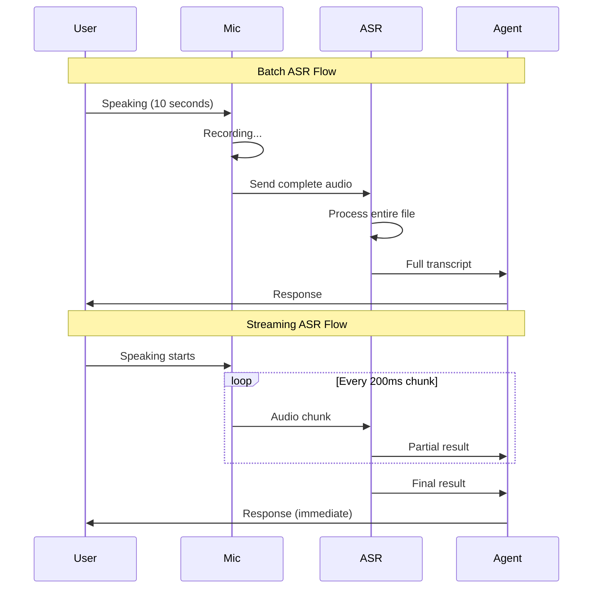
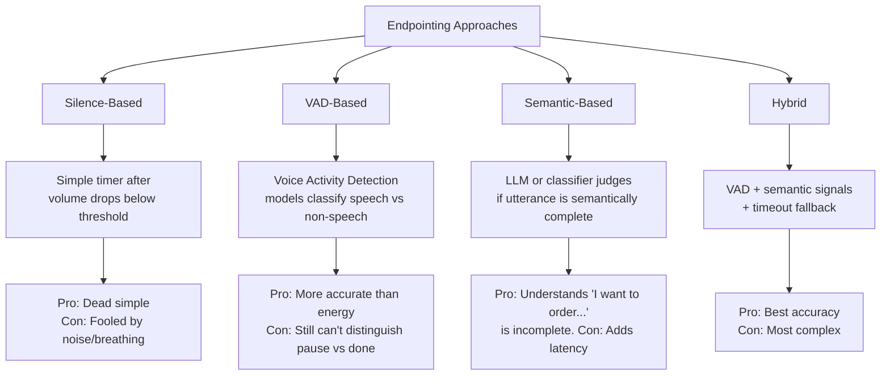
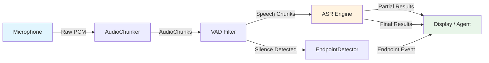
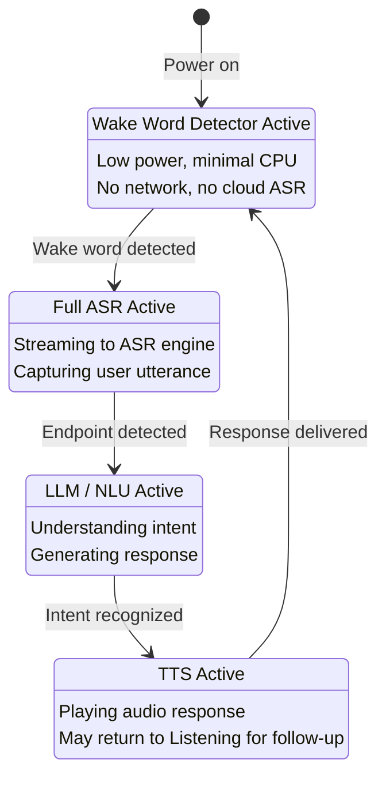
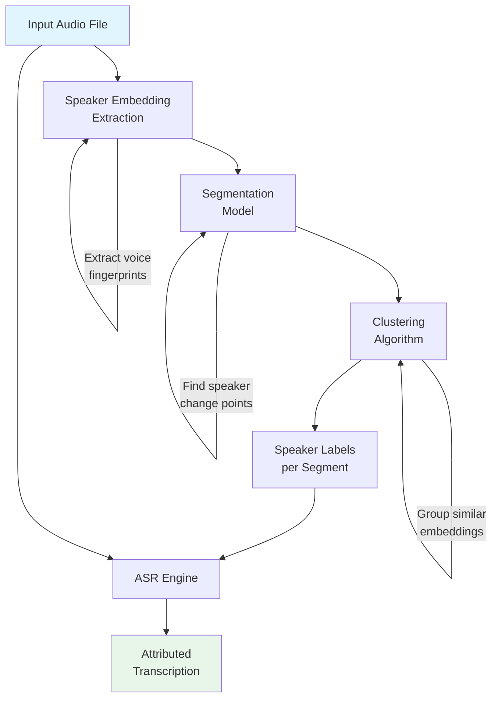
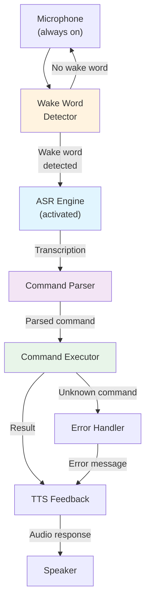

# Voice Agents Deep Dive  Part 4: Real-Time ASR  Streaming Transcription and Wake Word Detection

---

**Series:** Building Voice Agents  A Developer's Deep Dive from Audio Fundamentals to Production
**Part:** 4 of 20 (Real-Time ASR)
**Audience:** Developers with Python experience who want to build voice-powered AI agents from the ground up
**Reading time:** ~50 minutes

---

## Table of Contents

1. [Recap of Part 3](#recap-of-part-3)
2. [Batch vs Streaming ASR](#batch-vs-streaming-asr)
3. [Chunked Audio Processing](#chunked-audio-processing)
4. [Endpointing / End-of-Utterance Detection](#endpointing--end-of-utterance-detection)
5. [Building a Real-Time Transcription Pipeline](#building-a-real-time-transcription-pipeline)
6. [Streaming with Deepgram](#streaming-with-deepgram)
7. [Streaming with faster-whisper](#streaming-with-faster-whisper)
8. [Wake Word / Keyword Detection](#wake-word--keyword-detection)
9. [Speaker Diarization](#speaker-diarization)
10. [Noise-Robust ASR](#noise-robust-asr)
11. [Project: Voice Command System](#project-voice-command-system)
12. [Vocabulary Cheat Sheet](#vocabulary-cheat-sheet)
13. [What's Next](#whats-next)

---

## Recap of Part 3

In Part 3, we explored the fundamentals of Automatic Speech Recognition  how acoustic models map audio features to phonemes, how language models help disambiguate between candidate transcriptions, and how you can run both cloud-based and local ASR engines. We built a batch transcription pipeline that reads a complete audio file, sends it to an ASR engine, and returns a full transcript.

That approach works perfectly when you already have a recorded file  podcasts, voicemails, meeting recordings. But voice **agents** do not have the luxury of waiting for the user to finish speaking, uploading a file, and then starting to think. They need to listen, understand, and respond in real time. The moment a user says "Hey, turn on the lights," the agent should already be processing "turn on the lights" before the silence at the end even arrives.

This part is where we cross the bridge from **offline** speech recognition to **online** (real-time, streaming) speech recognition  and it changes everything about how we architect our audio pipelines.

> **Key insight:** Batch ASR is a *file processing* problem. Streaming ASR is a *systems engineering* problem. The model might be exactly the same; the plumbing around it is completely different.

---

## Batch vs Streaming ASR

### The Fundamental Difference

At its core, the difference is simple:

| Aspect | Batch ASR | Streaming ASR |
|--------|-----------|---------------|
| **Input** | Complete audio file | Continuous audio stream |
| **Processing** | After recording finishes | While recording is happening |
| **Output** | Full transcript at once | Partial results → final results |
| **Latency** | Seconds to minutes | Milliseconds to low seconds |
| **Use case** | Transcription services | Voice assistants, live captions |
| **Complexity** | Low | High |
| **Accuracy** | Higher (full context available) | Slightly lower (limited lookahead) |

### Why Real-Time Changes Everything

Consider a 10-second utterance: "What's the weather like in San Francisco tomorrow morning?"

**Batch flow:**
1. User speaks for 10 seconds
2. Recording stops
3. Entire audio sent to ASR (network + processing time: ~2-5 seconds)
4. Full transcript returned
5. Agent processes intent
6. Agent responds

**Total latency from end-of-speech to response start:** 3-8 seconds.

**Streaming flow:**
1. User starts speaking
2. After 200ms: partial result → "What's"
3. After 600ms: partial result → "What's the weather"
4. After 1.2s: partial result → "What's the weather like in"
5. After 2.0s: partial result → "What's the weather like in San Francisco"
6. After 2.5s: partial result → "What's the weather like in San Francisco tomorrow"
7. After 3.0s: **final result** → "What's the weather like in San Francisco tomorrow morning?"
8. Agent already started processing at step 5 (speculative execution)
9. Agent responds almost immediately after speech ends

**Total latency from end-of-speech to response start:** 0.3-1 second.

That difference  from 5+ seconds to under 1 second  is the difference between a clunky voice interface and one that feels magical.



### Partial vs Final Results

In streaming ASR, you receive two types of results:

- **Partial (interim) results**: The ASR engine's best guess so far, which may change as more audio arrives. These are marked `is_final=False`.
- **Final results**: The ASR engine has committed to a transcription for a segment of audio. These will not change. Marked `is_final=True`.

Why do partial results change? Because ASR models use context. The phrase "I need to" might be partially transcribed as "I need two" until the model hears the rest of the sentence and corrects itself. This self-correction is a feature, not a bug  it is the model incorporating more acoustic and language context.

```python
# Example of how partial results evolve over time
partial_results_over_time = [
    {"text": "I",              "is_final": False, "time": 0.2},
    {"text": "I need",         "is_final": False, "time": 0.5},
    {"text": "I need two",     "is_final": False, "time": 0.8},  # "two" vs "to"
    {"text": "I need to go",   "is_final": False, "time": 1.2},  # corrected!
    {"text": "I need to go to the",      "is_final": False, "time": 1.6},
    {"text": "I need to go to the store", "is_final": True,  "time": 2.0},  # committed
]
```

> **Practical note:** In a voice agent, you typically display partial results to give the user feedback ("I hear you"), but only act on final results. Acting on partial results can cause the agent to start responding to something the user hasn't finished saying.

---

## Chunked Audio Processing

### The Need for Chunks

A microphone produces a continuous stream of audio samples  thousands per second (typically 16,000 for speech). You cannot send each individual sample to an ASR engine; the overhead would be enormous. Instead, you collect samples into **chunks** and process each chunk as a unit.

The chunk size determines the fundamental tradeoff:
- **Small chunks** (10-50ms): Lower latency, higher overhead, more network calls
- **Large chunks** (200-500ms): Higher latency, lower overhead, better context for the model
- **Typical sweet spot**: 100-200ms chunks (1,600-3,200 samples at 16kHz)

### Audio Chunker Implementation

```python
import numpy as np
from typing import Generator, Optional, Callable
from dataclasses import dataclass, field
import time
import threading
import queue


@dataclass
class AudioChunk:
    """Represents a chunk of audio data with metadata."""
    data: np.ndarray
    sample_rate: int
    chunk_index: int
    timestamp_start: float  # seconds from stream start
    timestamp_end: float
    is_speech: Optional[bool] = None  # set by VAD if available

    @property
    def duration_ms(self) -> float:
        """Duration of this chunk in milliseconds."""
        return (len(self.data) / self.sample_rate) * 1000

    @property
    def rms_energy(self) -> float:
        """Root mean square energy  simple loudness measure."""
        return float(np.sqrt(np.mean(self.data.astype(np.float64) ** 2)))

    def to_bytes(self, dtype: str = "int16") -> bytes:
        """Convert to raw bytes for transmission."""
        if self.data.dtype != np.dtype(dtype):
            # Scale float [-1, 1] to int16 range
            if np.issubdtype(self.data.dtype, np.floating):
                scaled = (self.data * 32767).astype(np.int16)
                return scaled.tobytes()
        return self.data.tobytes()


class AudioChunker:
    """
    Splits a continuous audio stream into processable chunks.

    Supports configurable chunk sizes, optional overlap between chunks
    (useful for models that need context at boundaries), and real-time
    chunking from a microphone stream.

    Parameters
    ----------
    chunk_duration_ms : int
        Duration of each chunk in milliseconds. Default 200ms.
    overlap_ms : int
        Overlap between consecutive chunks in milliseconds. Default 0.
        Non-zero overlap helps avoid cutting words at chunk boundaries.
    sample_rate : int
        Audio sample rate in Hz. Default 16000.
    """

    def __init__(
        self,
        chunk_duration_ms: int = 200,
        overlap_ms: int = 0,
        sample_rate: int = 16000,
    ):
        self.chunk_duration_ms = chunk_duration_ms
        self.overlap_ms = overlap_ms
        self.sample_rate = sample_rate

        # Calculate sizes in samples
        self.chunk_size = int(sample_rate * chunk_duration_ms / 1000)
        self.overlap_size = int(sample_rate * overlap_ms / 1000)
        self.step_size = self.chunk_size - self.overlap_size

        if self.step_size <= 0:
            raise ValueError(
                f"Overlap ({overlap_ms}ms) must be less than "
                f"chunk duration ({chunk_duration_ms}ms)"
            )

        # Internal buffer for accumulating samples
        self._buffer = np.array([], dtype=np.float32)
        self._chunk_index = 0
        self._total_samples = 0

    def feed(self, audio_data: np.ndarray) -> list[AudioChunk]:
        """
        Feed audio data into the chunker and get back complete chunks.

        Parameters
        ----------
        audio_data : np.ndarray
            Raw audio samples to process.

        Returns
        -------
        list[AudioChunk]
            Zero or more complete chunks extracted from the buffer.
        """
        # Append new data to buffer
        self._buffer = np.concatenate([self._buffer, audio_data])
        chunks = []

        # Extract as many complete chunks as possible
        while len(self._buffer) >= self.chunk_size:
            chunk_data = self._buffer[:self.chunk_size].copy()

            timestamp_start = self._total_samples / self.sample_rate
            timestamp_end = (self._total_samples + self.chunk_size) / self.sample_rate

            chunk = AudioChunk(
                data=chunk_data,
                sample_rate=self.sample_rate,
                chunk_index=self._chunk_index,
                timestamp_start=timestamp_start,
                timestamp_end=timestamp_end,
            )
            chunks.append(chunk)

            # Advance buffer by step_size (chunk_size - overlap)
            self._buffer = self._buffer[self.step_size:]
            self._total_samples += self.step_size
            self._chunk_index += 1

        return chunks

    def flush(self) -> Optional[AudioChunk]:
        """
        Flush remaining samples as a final (potentially shorter) chunk.

        Call this when the audio stream ends to get any remaining data.
        """
        if len(self._buffer) == 0:
            return None

        # Pad to full chunk size with zeros (silence)
        padded = np.zeros(self.chunk_size, dtype=np.float32)
        padded[:len(self._buffer)] = self._buffer

        timestamp_start = self._total_samples / self.sample_rate
        timestamp_end = timestamp_start + (len(self._buffer) / self.sample_rate)

        chunk = AudioChunk(
            data=padded,
            sample_rate=self.sample_rate,
            chunk_index=self._chunk_index,
            timestamp_start=timestamp_start,
            timestamp_end=timestamp_end,
        )

        self._buffer = np.array([], dtype=np.float32)
        self._chunk_index += 1

        return chunk

    def reset(self):
        """Reset the chunker state for a new stream."""
        self._buffer = np.array([], dtype=np.float32)
        self._chunk_index = 0
        self._total_samples = 0

    @staticmethod
    def from_file(
        filepath: str,
        chunk_duration_ms: int = 200,
        overlap_ms: int = 0,
    ) -> Generator[AudioChunk, None, None]:
        """
        Read an audio file and yield chunks  simulates streaming from a file.

        Useful for testing streaming pipelines with recorded audio.
        """
        import soundfile as sf

        data, sample_rate = sf.read(filepath, dtype="float32")

        # Convert stereo to mono if needed
        if data.ndim > 1:
            data = data.mean(axis=1)

        chunker = AudioChunker(chunk_duration_ms, overlap_ms, sample_rate)

        # Feed the entire file in small increments to simulate streaming
        feed_size = int(sample_rate * 0.05)  # Feed 50ms at a time
        for i in range(0, len(data), feed_size):
            segment = data[i:i + feed_size]
            chunks = chunker.feed(segment)
            for chunk in chunks:
                yield chunk
                # Simulate real-time playback speed
                time.sleep(0.05)

        # Flush remaining
        final = chunker.flush()
        if final is not None:
            yield final


# --- Usage Example ---

def demo_chunker():
    """Demonstrate chunking with overlap."""
    chunker = AudioChunker(
        chunk_duration_ms=200,
        overlap_ms=50,
        sample_rate=16000,
    )

    print(f"Chunk size: {chunker.chunk_size} samples")
    print(f"Overlap: {chunker.overlap_size} samples")
    print(f"Step size: {chunker.step_size} samples")

    # Simulate microphone feeding 1 second of audio in 100ms bursts
    for i in range(10):
        # Generate a 100ms burst of samples (simulating mic input)
        burst = np.random.randn(1600).astype(np.float32) * 0.1
        chunks = chunker.feed(burst)

        for chunk in chunks:
            print(
                f"  Chunk {chunk.chunk_index}: "
                f"{chunk.timestamp_start:.3f}s - {chunk.timestamp_end:.3f}s "
                f"({chunk.duration_ms:.0f}ms, RMS={chunk.rms_energy:.4f})"
            )

    # Flush at end
    final = chunker.flush()
    if final:
        print(f"  Final chunk {final.chunk_index}: {final.duration_ms:.0f}ms (padded)")


if __name__ == "__main__":
    demo_chunker()
```

### Understanding Overlap

Why would you overlap chunks? Consider a word spoken right at the boundary between two chunks. Without overlap, the first half of the word is in chunk N and the second half is in chunk N+1. Neither chunk has enough context to recognize the word reliably.

With, say, 50ms of overlap, chunk N+1 starts 50ms *before* where chunk N ended. That repeated audio gives the ASR model enough acoustic context to properly recognize boundary words.

```
Without overlap (chunk_duration=200ms):
[----Chunk 0----][----Chunk 1----][----Chunk 2----]
0ms            200ms           400ms           600ms

With 50ms overlap (chunk_duration=200ms, overlap=50ms):
[----Chunk 0----]
              [----Chunk 1----]
                            [----Chunk 2----]
0ms     150ms  200ms  300ms  350ms  450ms  500ms  600ms
         ^--- overlap zone ---^
```

The tradeoff: overlap means you process some audio twice, increasing compute cost. For most voice agent applications, 0-50ms overlap is sufficient.

---

## Endpointing / End-of-Utterance Detection

### The Problem

In a batch pipeline, the user clicks "stop recording" or the file ends. The boundary is explicit. In a streaming pipeline, the microphone is always on  you need to automatically detect when the user has finished speaking an utterance so you can:

1. Commit the final transcription
2. Send it to the language model for processing
3. Generate a response

This is called **endpointing** or **end-of-utterance (EOU) detection**, and getting it right is one of the hardest problems in voice agent design:

- **Too aggressive** (short timeout): You cut the user off mid-sentence during a natural pause. "I want to order... [ENDPOINT!]"  the agent starts responding before the user says what they want to order.
- **Too conservative** (long timeout): The user finishes speaking and waits... and waits... for the agent to realize they are done. The conversation feels sluggish.

### Approaches to Endpointing



### Implementation: Endpoint Detector

```python
import numpy as np
import time
from enum import Enum
from dataclasses import dataclass
from typing import Optional, Callable
from collections import deque


class EndpointReason(Enum):
    """Why endpointing was triggered."""
    SILENCE_TIMEOUT = "silence_timeout"
    VAD_SILENCE = "vad_silence"
    MAX_DURATION = "max_duration"
    MANUAL = "manual"


@dataclass
class EndpointEvent:
    """Represents a detected endpoint."""
    reason: EndpointReason
    timestamp: float  # when the endpoint was detected
    speech_duration: float  # how long the user was speaking
    silence_duration: float  # how long silence preceded the endpoint
    confidence: float  # 0-1, how confident we are this is a real endpoint


class EndpointDetector:
    """
    Detects when a user has finished speaking an utterance.

    Combines multiple signals:
    1. Energy-based silence detection (fast, simple)
    2. VAD-based detection (more accurate)
    3. Maximum duration cutoff (safety net)
    4. Adaptive timeout based on speech patterns

    Parameters
    ----------
    silence_timeout_ms : int
        Milliseconds of silence before triggering endpoint. Default 700ms.
    energy_threshold : float
        RMS energy below this is considered silence. Default 0.01.
        Will be auto-calibrated if calibrate() is called.
    max_utterance_duration_s : float
        Maximum utterance length before forced endpoint. Default 30s.
    min_speech_duration_ms : int
        Minimum speech duration before endpoint can trigger. Default 200ms.
        Prevents triggering on short noises.
    vad_model : optional
        A Voice Activity Detection model instance. If provided, uses
        model-based detection instead of simple energy thresholding.
    adaptive : bool
        If True, adjusts silence_timeout based on speech rate. Faster
        speakers get shorter timeouts. Default True.
    """

    def __init__(
        self,
        silence_timeout_ms: int = 700,
        energy_threshold: float = 0.01,
        max_utterance_duration_s: float = 30.0,
        min_speech_duration_ms: int = 200,
        vad_model=None,
        adaptive: bool = True,
    ):
        self.base_silence_timeout_ms = silence_timeout_ms
        self.silence_timeout_ms = silence_timeout_ms
        self.energy_threshold = energy_threshold
        self.max_utterance_duration_s = max_utterance_duration_s
        self.min_speech_duration_ms = min_speech_duration_ms
        self.vad_model = vad_model
        self.adaptive = adaptive

        # State tracking
        self._is_speaking = False
        self._speech_start_time: Optional[float] = None
        self._last_speech_time: Optional[float] = None
        self._silence_start_time: Optional[float] = None
        self._total_speech_duration = 0.0

        # Adaptive tracking
        self._recent_utterance_durations: deque = deque(maxlen=10)
        self._recent_pause_durations: deque = deque(maxlen=20)

        # Calibration
        self._noise_floor: Optional[float] = None
        self._calibration_samples: list[float] = []

    def calibrate(self, ambient_audio: np.ndarray, sample_rate: int = 16000):
        """
        Calibrate the energy threshold based on ambient noise.

        Record 1-2 seconds of silence/ambient noise and pass it here.
        The threshold will be set to 2x the ambient noise floor.
        """
        # Calculate RMS of short windows
        window_size = int(sample_rate * 0.02)  # 20ms windows
        energies = []
        for i in range(0, len(ambient_audio) - window_size, window_size):
            window = ambient_audio[i:i + window_size]
            rms = float(np.sqrt(np.mean(window.astype(np.float64) ** 2)))
            energies.append(rms)

        self._noise_floor = np.mean(energies)
        # Set threshold to 2x noise floor (with a minimum)
        self.energy_threshold = max(self._noise_floor * 2.0, 0.005)
        print(
            f"Calibrated: noise_floor={self._noise_floor:.5f}, "
            f"threshold={self.energy_threshold:.5f}"
        )

    def process_chunk(self, chunk) -> Optional[EndpointEvent]:
        """
        Process an audio chunk and check for endpoint.

        Parameters
        ----------
        chunk : AudioChunk
            The audio chunk to process.

        Returns
        -------
        Optional[EndpointEvent]
            An EndpointEvent if endpoint detected, None otherwise.
        """
        current_time = time.time()

        # Determine if this chunk contains speech
        if self.vad_model is not None:
            is_speech = self._vad_detect(chunk)
        else:
            is_speech = self._energy_detect(chunk)

        chunk.is_speech = is_speech

        # State machine transitions
        if is_speech:
            if not self._is_speaking:
                # Transition: silence → speech
                self._is_speaking = True
                self._speech_start_time = current_time
                self._silence_start_time = None

            self._last_speech_time = current_time

            # Check max duration
            if self._speech_start_time is not None:
                speech_duration = current_time - self._speech_start_time
                if speech_duration > self.max_utterance_duration_s:
                    return self._create_endpoint(
                        EndpointReason.MAX_DURATION,
                        current_time,
                        confidence=0.9,
                    )

        else:  # silence
            if self._is_speaking:
                if self._silence_start_time is None:
                    # Transition: speech → silence (start counting)
                    self._silence_start_time = current_time

                # Check if silence has exceeded timeout
                silence_duration_ms = (current_time - self._silence_start_time) * 1000

                # Only endpoint if we have had enough speech
                if self._speech_start_time is not None:
                    speech_duration_ms = (
                        (self._last_speech_time or current_time)
                        - self._speech_start_time
                    ) * 1000

                    if speech_duration_ms >= self.min_speech_duration_ms:
                        timeout = self._get_adaptive_timeout()
                        if silence_duration_ms >= timeout:
                            return self._create_endpoint(
                                EndpointReason.VAD_SILENCE
                                if self.vad_model
                                else EndpointReason.SILENCE_TIMEOUT,
                                current_time,
                                confidence=min(
                                    silence_duration_ms / (timeout * 1.5), 1.0
                                ),
                            )

        return None

    def _energy_detect(self, chunk) -> bool:
        """Simple energy-based speech detection."""
        rms = float(np.sqrt(np.mean(chunk.data.astype(np.float64) ** 2)))
        return rms > self.energy_threshold

    def _vad_detect(self, chunk) -> bool:
        """Model-based voice activity detection."""
        # This would use the actual VAD model
        # Example with silero-vad:
        #   confidence = self.vad_model(chunk.data, chunk.sample_rate)
        #   return confidence > 0.5
        #
        # Falling back to energy detection as placeholder:
        return self._energy_detect(chunk)

    def _get_adaptive_timeout(self) -> float:
        """
        Adjust silence timeout based on observed speech patterns.

        If the user speaks in short, quick bursts, use a shorter timeout.
        If they speak in long, deliberate phrases with pauses, use a longer one.
        """
        if not self.adaptive or len(self._recent_pause_durations) < 3:
            return self.silence_timeout_ms

        # Use the 75th percentile of recent pause durations
        pauses = sorted(self._recent_pause_durations)
        p75_idx = int(len(pauses) * 0.75)
        typical_pause_ms = pauses[p75_idx] * 1000

        # Timeout should be notably longer than typical within-utterance pauses
        adapted = max(
            typical_pause_ms * 2.0,  # 2x typical pause
            self.base_silence_timeout_ms * 0.5,  # minimum: half of base
        )
        adapted = min(adapted, self.base_silence_timeout_ms * 2.0)  # cap at 2x base

        return adapted

    def _create_endpoint(
        self,
        reason: EndpointReason,
        current_time: float,
        confidence: float,
    ) -> EndpointEvent:
        """Create an endpoint event and reset state."""
        speech_duration = 0.0
        if self._speech_start_time and self._last_speech_time:
            speech_duration = self._last_speech_time - self._speech_start_time

        silence_duration = 0.0
        if self._silence_start_time:
            silence_duration = current_time - self._silence_start_time

        # Track for adaptive timeout
        if speech_duration > 0:
            self._recent_utterance_durations.append(speech_duration)

        event = EndpointEvent(
            reason=reason,
            timestamp=current_time,
            speech_duration=speech_duration,
            silence_duration=silence_duration,
            confidence=confidence,
        )

        # Reset state for next utterance
        self._is_speaking = False
        self._speech_start_time = None
        self._last_speech_time = None
        self._silence_start_time = None

        return event

    def force_endpoint(self) -> Optional[EndpointEvent]:
        """Manually trigger an endpoint (e.g., user pressed a button)."""
        if self._is_speaking or self._speech_start_time is not None:
            return self._create_endpoint(
                EndpointReason.MANUAL,
                time.time(),
                confidence=1.0,
            )
        return None

    def reset(self):
        """Reset all state."""
        self._is_speaking = False
        self._speech_start_time = None
        self._last_speech_time = None
        self._silence_start_time = None
        self._total_speech_duration = 0.0


# --- Usage Example ---

def demo_endpoint_detection():
    """Demonstrate endpoint detection with simulated audio."""
    detector = EndpointDetector(
        silence_timeout_ms=600,
        energy_threshold=0.02,
        min_speech_duration_ms=200,
    )

    chunker = AudioChunker(chunk_duration_ms=100, sample_rate=16000)

    # Simulate: 1s speech, 0.3s pause, 0.5s speech, 0.8s silence (endpoint!)
    segments = [
        ("speech", 1.0),
        ("silence", 0.3),  # pause  should NOT trigger endpoint
        ("speech", 0.5),
        ("silence", 0.8),  # long silence  SHOULD trigger endpoint
    ]

    for segment_type, duration_s in segments:
        n_samples = int(16000 * duration_s)
        if segment_type == "speech":
            audio = np.random.randn(n_samples).astype(np.float32) * 0.1
        else:
            audio = np.random.randn(n_samples).astype(np.float32) * 0.001

        chunks = chunker.feed(audio)
        for chunk in chunks:
            event = detector.process_chunk(chunk)
            if event:
                print(
                    f"ENDPOINT detected at {chunk.timestamp_end:.2f}s "
                    f"(reason={event.reason.value}, "
                    f"speech={event.speech_duration:.2f}s, "
                    f"silence={event.silence_duration:.2f}s, "
                    f"confidence={event.confidence:.2f})"
                )


if __name__ == "__main__":
    demo_endpoint_detection()
```

### Silence Duration Tradeoffs

The choice of silence timeout has a massive impact on user experience:

| Timeout | Effect | Best For |
|---------|--------|----------|
| 200-400ms | Very aggressive, often cuts off | Quick commands: "lights on" |
| 500-700ms | Good balance for commands | Voice assistants, smart speakers |
| 800-1200ms | Comfortable for conversation | Conversational AI, interviews |
| 1500ms+ | Very conservative, feels slow | Dictation, accessibility |

> **Production tip:** Many voice agents use a **two-tier** timeout: a shorter timeout (400ms) when the utterance looks semantically complete ("turn off the lights"), and a longer timeout (1000ms) when it looks incomplete ("I want to order..."). This requires coupling ASR with lightweight NLU, but dramatically improves UX.

---

## Building a Real-Time Transcription Pipeline

Now let us connect the pieces: microphone capture, chunking, VAD, ASR, and display  into a complete real-time transcription system.

### Architecture Overview



### The Realtime Transcriber

```python
import numpy as np
import threading
import queue
import time
import sys
from typing import Optional, Callable
from dataclasses import dataclass, field
from enum import Enum


class TranscriptionResultType(Enum):
    PARTIAL = "partial"
    FINAL = "final"
    ENDPOINT = "endpoint"


@dataclass
class TranscriptionResult:
    """A single transcription result from the pipeline."""
    text: str
    result_type: TranscriptionResultType
    confidence: float = 0.0
    timestamp_start: float = 0.0
    timestamp_end: float = 0.0
    words: list = field(default_factory=list)  # word-level timestamps


class RealtimeTranscriber:
    """
    End-to-end real-time transcription pipeline.

    Captures audio from the microphone, processes it through a configurable
    ASR engine, and delivers partial and final transcription results.

    Architecture:
        Microphone → AudioBuffer → Chunker → VAD → ASR → Callback

    Three threads:
        1. Audio capture thread (fills buffer)
        2. Processing thread (chunking + VAD + ASR)
        3. Main thread (receives results via callback or queue)

    Parameters
    ----------
    asr_engine : object
        ASR engine with a `transcribe_chunk(audio, sample_rate)` method.
    sample_rate : int
        Audio sample rate. Default 16000.
    chunk_duration_ms : int
        Chunk size for ASR processing. Default 200ms.
    on_partial : callable, optional
        Callback for partial transcription results.
    on_final : callable, optional
        Callback for final (committed) transcription results.
    on_endpoint : callable, optional
        Callback for endpoint detection events.
    """

    def __init__(
        self,
        asr_engine=None,
        sample_rate: int = 16000,
        chunk_duration_ms: int = 200,
        on_partial: Optional[Callable] = None,
        on_final: Optional[Callable] = None,
        on_endpoint: Optional[Callable] = None,
    ):
        self.asr_engine = asr_engine
        self.sample_rate = sample_rate
        self.chunk_duration_ms = chunk_duration_ms

        # Callbacks
        self.on_partial = on_partial or self._default_on_partial
        self.on_final = on_final or self._default_on_final
        self.on_endpoint = on_endpoint or self._default_on_endpoint

        # Components
        self.chunker = AudioChunker(
            chunk_duration_ms=chunk_duration_ms,
            sample_rate=sample_rate,
        )
        self.endpoint_detector = EndpointDetector(
            silence_timeout_ms=700,
            min_speech_duration_ms=200,
        )

        # Thread-safe audio queue
        self._audio_queue: queue.Queue = queue.Queue()
        self._result_queue: queue.Queue = queue.Queue()

        # Control flags
        self._is_running = False
        self._capture_thread: Optional[threading.Thread] = None
        self._process_thread: Optional[threading.Thread] = None

        # Transcription state
        self._current_partial = ""
        self._committed_text = ""
        self._all_finals: list[str] = []

    def start(self):
        """Start the real-time transcription pipeline."""
        if self._is_running:
            return

        self._is_running = True
        self.chunker.reset()
        self.endpoint_detector.reset()

        # Start capture thread
        self._capture_thread = threading.Thread(
            target=self._capture_loop, daemon=True
        )
        self._capture_thread.start()

        # Start processing thread
        self._process_thread = threading.Thread(
            target=self._process_loop, daemon=True
        )
        self._process_thread.start()

        print("Real-time transcription started. Speak into your microphone...")

    def stop(self):
        """Stop the pipeline gracefully."""
        self._is_running = False

        if self._capture_thread:
            self._capture_thread.join(timeout=2.0)
        if self._process_thread:
            self._process_thread.join(timeout=2.0)

        print("\nTranscription stopped.")
        print(f"Full transcript: {' '.join(self._all_finals)}")

    def _capture_loop(self):
        """
        Audio capture thread  reads from microphone and queues data.

        Uses PyAudio for cross-platform microphone access.
        """
        try:
            import pyaudio

            p = pyaudio.PyAudio()
            stream = p.open(
                format=pyaudio.paFloat32,
                channels=1,
                rate=self.sample_rate,
                input=True,
                frames_per_buffer=int(self.sample_rate * 0.05),  # 50ms buffer
            )

            while self._is_running:
                try:
                    raw_data = stream.read(
                        int(self.sample_rate * 0.05),
                        exception_on_overflow=False,
                    )
                    audio_array = np.frombuffer(raw_data, dtype=np.float32)
                    self._audio_queue.put(audio_array)
                except OSError:
                    continue

            stream.stop_stream()
            stream.close()
            p.terminate()

        except ImportError:
            print("PyAudio not installed. Simulating microphone input...")
            self._simulate_microphone()

    def _simulate_microphone(self):
        """Simulate microphone input for testing without hardware."""
        while self._is_running:
            # Generate 50ms of simulated audio
            n_samples = int(self.sample_rate * 0.05)
            # Alternate between "speech" and "silence" for demo
            t = time.time() % 4
            if t < 2:
                audio = np.random.randn(n_samples).astype(np.float32) * 0.05
            else:
                audio = np.random.randn(n_samples).astype(np.float32) * 0.001
            self._audio_queue.put(audio)
            time.sleep(0.05)

    def _process_loop(self):
        """
        Processing thread  chunks audio, runs VAD and ASR.
        """
        speech_buffer = np.array([], dtype=np.float32)

        while self._is_running:
            try:
                audio_data = self._audio_queue.get(timeout=0.1)
            except queue.Empty:
                continue

            # Feed to chunker
            chunks = self.chunker.feed(audio_data)

            for chunk in chunks:
                # Check for endpoint
                endpoint_event = self.endpoint_detector.process_chunk(chunk)

                if chunk.is_speech:
                    # Accumulate speech audio
                    speech_buffer = np.concatenate([speech_buffer, chunk.data])

                    # Run ASR on accumulated speech (partial result)
                    if self.asr_engine and len(speech_buffer) > 0:
                        partial_text = self.asr_engine.transcribe_chunk(
                            speech_buffer, self.sample_rate
                        )
                        if partial_text:
                            result = TranscriptionResult(
                                text=partial_text,
                                result_type=TranscriptionResultType.PARTIAL,
                                timestamp_start=chunk.timestamp_start,
                                timestamp_end=chunk.timestamp_end,
                            )
                            self.on_partial(result)
                            self._current_partial = partial_text

                if endpoint_event:
                    # Commit the current transcription as final
                    if self._current_partial:
                        final_result = TranscriptionResult(
                            text=self._current_partial,
                            result_type=TranscriptionResultType.FINAL,
                            confidence=endpoint_event.confidence,
                            timestamp_end=chunk.timestamp_end,
                        )
                        self.on_final(final_result)
                        self._all_finals.append(self._current_partial)
                        self._current_partial = ""

                    # Reset speech buffer for next utterance
                    speech_buffer = np.array([], dtype=np.float32)
                    self.on_endpoint(endpoint_event)

    # --- Default callbacks ---

    @staticmethod
    def _default_on_partial(result: TranscriptionResult):
        """Display partial result with overwriting (carriage return)."""
        sys.stdout.write(f"\r  [partial] {result.text}       ")
        sys.stdout.flush()

    @staticmethod
    def _default_on_final(result: TranscriptionResult):
        """Display final result on a new line."""
        print(f"\n  [FINAL] {result.text} (confidence: {result.confidence:.2f})")

    @staticmethod
    def _default_on_endpoint(event):
        """Log endpoint detection."""
        print(f"  --- endpoint: {event.reason.value} ---")


class SimpleASREngine:
    """
    Placeholder ASR engine for testing the pipeline.

    In production, replace with Whisper, Deepgram, Google STT, etc.
    """

    def transcribe_chunk(self, audio: np.ndarray, sample_rate: int) -> str:
        """
        'Transcribe' audio chunk. This is a placeholder that returns
        a description of what it heard rather than actual transcription.
        """
        duration = len(audio) / sample_rate
        rms = float(np.sqrt(np.mean(audio.astype(np.float64) ** 2)))

        if rms > 0.02:
            return f"[speech: {duration:.1f}s, energy={rms:.3f}]"
        return ""


# --- Usage ---

def run_realtime_transcription():
    """Run the real-time transcription pipeline."""
    engine = SimpleASREngine()

    transcriber = RealtimeTranscriber(
        asr_engine=engine,
        sample_rate=16000,
        chunk_duration_ms=200,
    )

    try:
        transcriber.start()
        # Keep running until Ctrl+C
        while True:
            time.sleep(0.1)
    except KeyboardInterrupt:
        transcriber.stop()


if __name__ == "__main__":
    run_realtime_transcription()
```

### Word-by-Word Display

A polished voice agent does not just dump complete sentences. It shows words appearing one by one, just like live captions on TV. Here is a helper that creates that effect:

```python
import sys
import time
from typing import Optional


class LiveTranscriptDisplay:
    """
    Displays transcription results with word-by-word animation.

    Handles the complexities of partial result overwriting:
    - Partial results replace each other on the same line
    - Final results get "committed" and move to a new line
    - Supports colored output for partial vs final text
    """

    COLORS = {
        "partial": "\033[90m",   # gray
        "final": "\033[97m",     # white
        "correction": "\033[93m",  # yellow
        "reset": "\033[0m",
    }

    def __init__(self, use_colors: bool = True):
        self.use_colors = use_colors
        self._last_partial = ""
        self._committed_lines: list[str] = []
        self._last_partial_word_count = 0

    def show_partial(self, text: str):
        """Update the current partial transcription."""
        if self.use_colors:
            display = f"{self.COLORS['partial']}{text}{self.COLORS['reset']}"
        else:
            display = text

        # Use carriage return to overwrite previous partial
        sys.stdout.write(f"\r  >> {display}     ")
        sys.stdout.flush()

        # Detect corrections (fewer words than before = model revised)
        current_words = len(text.split())
        if current_words < self._last_partial_word_count and self.use_colors:
            # The model corrected itself  could highlight this
            pass
        self._last_partial_word_count = current_words
        self._last_partial = text

    def commit(self, text: str, confidence: float = 1.0):
        """Commit a final transcription result."""
        if self.use_colors:
            color = self.COLORS["final"]
            reset = self.COLORS["reset"]
        else:
            color = ""
            reset = ""

        # Clear the partial line and write the final text
        sys.stdout.write(f"\r  {color}>> {text}{reset}")
        if confidence < 0.8:
            sys.stdout.write(f"  [low confidence: {confidence:.2f}]")
        sys.stdout.write("\n")
        sys.stdout.flush()

        self._committed_lines.append(text)
        self._last_partial = ""
        self._last_partial_word_count = 0

    def get_full_transcript(self) -> str:
        """Return all committed text as a single string."""
        return " ".join(self._committed_lines)

    def clear(self):
        """Clear the display state."""
        self._committed_lines.clear()
        self._last_partial = ""
        self._last_partial_word_count = 0
```

---

## Streaming with Deepgram

[Deepgram](https://deepgram.com/) is one of the most popular cloud ASR services for real-time streaming. It uses a WebSocket-based protocol: you open a connection, stream audio bytes, and receive JSON results back in real time.

### Why Deepgram for Streaming

- **Low latency**: Purpose-built for real-time (often under 300ms)
- **WebSocket protocol**: Bidirectional, no polling needed
- **Partial results**: Built-in interim results support
- **Endpointing**: Server-side endpointing built in
- **Multiple languages**: 30+ languages supported
- **Competitive pricing**: Pay per audio second

### Deepgram Streaming Client

```python
import asyncio
import json
import base64
import time
from typing import Optional, Callable, AsyncGenerator
from dataclasses import dataclass

# Note: Install with `pip install websockets pyaudio numpy`
try:
    import websockets
except ImportError:
    print("Install websockets: pip install websockets")

try:
    import pyaudio
except ImportError:
    print("Install pyaudio: pip install pyaudio")

import numpy as np


@dataclass
class DeepgramConfig:
    """Configuration for Deepgram streaming ASR."""
    api_key: str
    model: str = "nova-2"           # Deepgram's latest model
    language: str = "en-US"
    sample_rate: int = 16000
    encoding: str = "linear16"       # 16-bit PCM
    channels: int = 1
    interim_results: bool = True     # enable partial results
    punctuate: bool = True           # add punctuation
    endpointing: int = 500          # ms of silence for endpoint
    utterance_end_ms: int = 1000     # ms to finalize utterance
    vad_events: bool = True          # receive VAD events
    smart_format: bool = True        # smart formatting (numbers, etc)

    @property
    def websocket_url(self) -> str:
        """Build the Deepgram WebSocket URL with query parameters."""
        base = "wss://api.deepgram.com/v1/listen"
        params = [
            f"model={self.model}",
            f"language={self.language}",
            f"sample_rate={self.sample_rate}",
            f"encoding={self.encoding}",
            f"channels={self.channels}",
            f"interim_results={'true' if self.interim_results else 'false'}",
            f"punctuate={'true' if self.punctuate else 'false'}",
            f"endpointing={self.endpointing}",
            f"utterance_end_ms={self.utterance_end_ms}",
            f"vad_events={'true' if self.vad_events else 'false'}",
            f"smart_format={'true' if self.smart_format else 'false'}",
        ]
        return f"{base}?{'&'.join(params)}"


class DeepgramStreamingClient:
    """
    WebSocket-based streaming ASR client for Deepgram.

    Handles the full lifecycle:
    1. Open WebSocket connection with auth
    2. Stream audio from microphone
    3. Receive and parse transcription results
    4. Handle keepalive and connection management
    5. Graceful shutdown

    Usage:
        client = DeepgramStreamingClient(config)
        await client.run(on_partial=..., on_final=...)
    """

    def __init__(self, config: DeepgramConfig):
        self.config = config
        self._ws: Optional[websockets.WebSocketClientProtocol] = None
        self._is_running = False

    async def run(
        self,
        on_partial: Optional[Callable] = None,
        on_final: Optional[Callable] = None,
        on_utterance_end: Optional[Callable] = None,
        on_vad_event: Optional[Callable] = None,
        duration_s: Optional[float] = None,
    ):
        """
        Run the streaming transcription pipeline.

        Parameters
        ----------
        on_partial : callable, optional
            Called with partial transcription text.
        on_final : callable, optional
            Called with final transcription text.
        on_utterance_end : callable, optional
            Called when an utterance ends.
        on_vad_event : callable, optional
            Called on VAD events (speech start/end).
        duration_s : float, optional
            Run for this many seconds then stop. None = run until cancelled.
        """
        headers = {"Authorization": f"Token {self.config.api_key}"}

        print(f"Connecting to Deepgram ({self.config.model})...")

        async with websockets.connect(
            self.config.websocket_url,
            extra_headers=headers,
            ping_interval=20,
            ping_timeout=10,
        ) as ws:
            self._ws = ws
            self._is_running = True
            print("Connected. Listening...")

            # Run sender and receiver concurrently
            sender_task = asyncio.create_task(self._send_audio(ws, duration_s))
            receiver_task = asyncio.create_task(
                self._receive_results(
                    ws, on_partial, on_final, on_utterance_end, on_vad_event
                )
            )

            # Wait for either to complete (sender finishes on timeout/stop)
            done, pending = await asyncio.wait(
                [sender_task, receiver_task],
                return_when=asyncio.FIRST_COMPLETED,
            )

            # Cancel remaining tasks
            for task in pending:
                task.cancel()
                try:
                    await task
                except asyncio.CancelledError:
                    pass

            # Send close message to Deepgram
            try:
                await ws.send(json.dumps({"type": "CloseStream"}))
            except Exception:
                pass

        self._is_running = False
        print("\nDisconnected from Deepgram.")

    async def _send_audio(
        self,
        ws: websockets.WebSocketClientProtocol,
        duration_s: Optional[float],
    ):
        """Send audio from microphone to Deepgram via WebSocket."""
        p = pyaudio.PyAudio()
        stream = p.open(
            format=pyaudio.paInt16,  # Deepgram expects 16-bit PCM
            channels=self.config.channels,
            rate=self.config.sample_rate,
            input=True,
            frames_per_buffer=int(self.config.sample_rate * 0.1),  # 100ms
        )

        start_time = time.time()

        try:
            while self._is_running:
                # Check duration limit
                if duration_s and (time.time() - start_time) > duration_s:
                    break

                # Read audio from microphone (non-blocking with asyncio)
                data = await asyncio.get_event_loop().run_in_executor(
                    None,
                    lambda: stream.read(
                        int(self.config.sample_rate * 0.1),
                        exception_on_overflow=False,
                    ),
                )

                # Send raw bytes to Deepgram
                await ws.send(data)

        except asyncio.CancelledError:
            pass
        finally:
            stream.stop_stream()
            stream.close()
            p.terminate()

    async def _receive_results(
        self,
        ws: websockets.WebSocketClientProtocol,
        on_partial: Optional[Callable],
        on_final: Optional[Callable],
        on_utterance_end: Optional[Callable],
        on_vad_event: Optional[Callable],
    ):
        """Receive and parse transcription results from Deepgram."""
        try:
            async for message in ws:
                data = json.loads(message)
                msg_type = data.get("type", "")

                if msg_type == "Results":
                    self._handle_results(data, on_partial, on_final)

                elif msg_type == "UtteranceEnd":
                    if on_utterance_end:
                        on_utterance_end()

                elif msg_type == "SpeechStarted":
                    if on_vad_event:
                        on_vad_event("speech_started", data)

                elif msg_type == "Metadata":
                    # Connection metadata  log for debugging
                    request_id = data.get("request_id", "unknown")
                    print(f"  [metadata] request_id={request_id}")

                elif msg_type == "Error":
                    print(f"  [error] {data.get('description', 'Unknown error')}")

        except asyncio.CancelledError:
            pass
        except websockets.exceptions.ConnectionClosed:
            print("  [info] WebSocket connection closed")

    def _handle_results(
        self,
        data: dict,
        on_partial: Optional[Callable],
        on_final: Optional[Callable],
    ):
        """Parse a Results message from Deepgram."""
        channel = data.get("channel", {})
        alternatives = channel.get("alternatives", [])

        if not alternatives:
            return

        best = alternatives[0]
        transcript = best.get("transcript", "").strip()
        confidence = best.get("confidence", 0.0)
        is_final = data.get("is_final", False)

        if not transcript:
            return

        if is_final:
            if on_final:
                on_final(transcript, confidence)
            else:
                print(f"\n  [FINAL] {transcript} ({confidence:.2f})")
        else:
            if on_partial:
                on_partial(transcript)
            else:
                import sys
                sys.stdout.write(f"\r  [partial] {transcript}     ")
                sys.stdout.flush()

    def stop(self):
        """Signal the client to stop."""
        self._is_running = False


# --- Usage ---

async def run_deepgram_streaming():
    """
    Run Deepgram streaming ASR.

    Set your API key as an environment variable:
        export DEEPGRAM_API_KEY="your-key-here"
    """
    import os

    api_key = os.environ.get("DEEPGRAM_API_KEY", "")
    if not api_key:
        print("Set DEEPGRAM_API_KEY environment variable first.")
        print("Get a free key at https://console.deepgram.com/")
        return

    config = DeepgramConfig(
        api_key=api_key,
        model="nova-2",
        language="en-US",
        interim_results=True,
        endpointing=500,
    )

    client = DeepgramStreamingClient(config)

    finals = []

    def handle_partial(text):
        import sys
        sys.stdout.write(f"\r  >> {text}     ")
        sys.stdout.flush()

    def handle_final(text, confidence):
        print(f"\n  [FINAL] {text} (confidence: {confidence:.2f})")
        finals.append(text)

    def handle_utterance_end():
        print("  --- utterance end ---")

    try:
        await client.run(
            on_partial=handle_partial,
            on_final=handle_final,
            on_utterance_end=handle_utterance_end,
            duration_s=30,  # run for 30 seconds
        )
    except KeyboardInterrupt:
        client.stop()

    print(f"\nFull transcript: {' '.join(finals)}")


if __name__ == "__main__":
    asyncio.run(run_deepgram_streaming())
```

> **Cost note:** Deepgram's pay-per-use model charges per second of audio processed. For a voice agent that is always listening, costs can add up. This is one reason wake word detection (covered below) is essential: you only start streaming to the cloud ASR after the wake word triggers.

---

## Streaming with faster-whisper

If you prefer to keep everything local  for privacy, cost, or offline operation  **faster-whisper** is an excellent choice. It is a CTranslate2-based reimplementation of OpenAI's Whisper that runs 4-8x faster than the original.

### The Challenge of Local Streaming

Whisper was designed as a **batch** model: it takes up to 30 seconds of audio and produces a transcript. It was not designed for streaming. To make it work in a streaming context, we use a **sliding window** approach:

1. Accumulate audio in a buffer
2. When enough audio has accumulated (e.g., every 2-3 seconds), run Whisper on the buffer
3. Display the new portion of the transcript
4. Continue accumulating

This gives us "near-real-time" rather than true streaming, with latency of 1-3 seconds depending on configuration.

### faster-whisper Streaming Implementation

```python
import numpy as np
import threading
import queue
import time
import sys
from typing import Optional
from dataclasses import dataclass


@dataclass
class WhisperStreamConfig:
    """Configuration for faster-whisper streaming."""
    model_size: str = "base"         # tiny, base, small, medium, large-v3
    device: str = "auto"             # auto, cpu, cuda
    compute_type: str = "int8"       # float16, int8, int8_float16
    language: str = "en"
    beam_size: int = 5
    min_chunk_duration_s: float = 1.0   # minimum audio before transcribing
    max_buffer_duration_s: float = 30.0  # maximum buffer before forced reset
    overlap_duration_s: float = 0.5     # overlap for context continuity
    vad_filter: bool = True             # use Silero VAD to skip silence
    sample_rate: int = 16000


class FasterWhisperStreamer:
    """
    Near-real-time streaming transcription with faster-whisper.

    Uses a sliding window approach since Whisper is a batch model.
    Accumulates audio, periodically runs transcription on the buffer,
    and outputs new text as it appears.

    Parameters
    ----------
    config : WhisperStreamConfig
        Configuration for the model and streaming behavior.
    """

    def __init__(self, config: WhisperStreamConfig):
        self.config = config
        self._model = None
        self._audio_buffer = np.array([], dtype=np.float32)
        self._is_running = False
        self._audio_queue: queue.Queue = queue.Queue()
        self._last_transcript = ""
        self._committed_text = ""
        self._all_segments: list[str] = []

    def _load_model(self):
        """Load the faster-whisper model."""
        from faster_whisper import WhisperModel

        print(f"Loading faster-whisper model '{self.config.model_size}'...")
        start = time.time()

        self._model = WhisperModel(
            self.config.model_size,
            device=self.config.device,
            compute_type=self.config.compute_type,
        )

        elapsed = time.time() - start
        print(f"Model loaded in {elapsed:.1f}s")

    def start(self):
        """Start the streaming transcription pipeline."""
        if self._model is None:
            self._load_model()

        self._is_running = True
        self._audio_buffer = np.array([], dtype=np.float32)
        self._last_transcript = ""

        # Start audio capture thread
        capture_thread = threading.Thread(target=self._capture_audio, daemon=True)
        capture_thread.start()

        # Process in main thread (or could be another thread)
        print("Listening... (Ctrl+C to stop)")
        self._process_loop()

    def _capture_audio(self):
        """Capture audio from microphone in a background thread."""
        try:
            import pyaudio

            p = pyaudio.PyAudio()
            stream = p.open(
                format=pyaudio.paFloat32,
                channels=1,
                rate=self.config.sample_rate,
                input=True,
                frames_per_buffer=int(self.config.sample_rate * 0.1),
            )

            while self._is_running:
                raw = stream.read(
                    int(self.config.sample_rate * 0.1),
                    exception_on_overflow=False,
                )
                audio = np.frombuffer(raw, dtype=np.float32)
                self._audio_queue.put(audio)

            stream.stop_stream()
            stream.close()
            p.terminate()
        except ImportError:
            print("PyAudio not available. Using simulated input.")
            self._simulate_input()

    def _simulate_input(self):
        """Simulate microphone input for testing."""
        while self._is_running:
            n_samples = int(self.config.sample_rate * 0.1)
            audio = np.random.randn(n_samples).astype(np.float32) * 0.01
            self._audio_queue.put(audio)
            time.sleep(0.1)

    def _process_loop(self):
        """Main processing loop  accumulate audio and transcribe."""
        last_transcribe_time = time.time()

        try:
            while self._is_running:
                # Drain the audio queue into the buffer
                while not self._audio_queue.empty():
                    try:
                        audio = self._audio_queue.get_nowait()
                        self._audio_buffer = np.concatenate(
                            [self._audio_buffer, audio]
                        )
                    except queue.Empty:
                        break

                buffer_duration = len(self._audio_buffer) / self.config.sample_rate
                time_since_last = time.time() - last_transcribe_time

                # Transcribe when we have enough audio
                should_transcribe = (
                    buffer_duration >= self.config.min_chunk_duration_s
                    and time_since_last >= self.config.min_chunk_duration_s
                )

                if should_transcribe:
                    self._transcribe_buffer()
                    last_transcribe_time = time.time()

                    # Reset buffer if too long (keep overlap for context)
                    if buffer_duration > self.config.max_buffer_duration_s:
                        overlap_samples = int(
                            self.config.overlap_duration_s * self.config.sample_rate
                        )
                        self._audio_buffer = self._audio_buffer[-overlap_samples:]
                        self._committed_text += " " + self._last_transcript
                        self._last_transcript = ""

                time.sleep(0.05)  # small sleep to prevent busy-waiting

        except KeyboardInterrupt:
            self._is_running = False

    def _transcribe_buffer(self):
        """Run faster-whisper on the current audio buffer."""
        if self._model is None or len(self._audio_buffer) == 0:
            return

        try:
            segments, info = self._model.transcribe(
                self._audio_buffer,
                language=self.config.language,
                beam_size=self.config.beam_size,
                vad_filter=self.config.vad_filter,
                vad_parameters=dict(
                    min_silence_duration_ms=500,
                    speech_pad_ms=200,
                ),
            )

            # Collect all segment texts
            full_text = ""
            for segment in segments:
                full_text += segment.text

            full_text = full_text.strip()

            if full_text and full_text != self._last_transcript:
                # Find what is new since last transcription
                new_text = self._find_new_text(self._last_transcript, full_text)
                self._last_transcript = full_text

                # Display
                sys.stdout.write(f"\r  >> {full_text}     ")
                sys.stdout.flush()

        except Exception as e:
            print(f"\n  [error] Transcription failed: {e}")

    @staticmethod
    def _find_new_text(previous: str, current: str) -> str:
        """Find text in current that was not in previous."""
        if not previous:
            return current

        # Simple approach: if current starts with previous, return the rest
        if current.startswith(previous):
            return current[len(previous):].strip()

        # Otherwise, return the full current text (model revised)
        return current

    def stop(self):
        """Stop the streaming pipeline."""
        self._is_running = False
        print(f"\nFinal transcript: {self._committed_text} {self._last_transcript}")

    def get_transcript(self) -> str:
        """Return the full transcript so far."""
        return f"{self._committed_text} {self._last_transcript}".strip()


# --- Usage ---

def run_faster_whisper_streaming():
    """Run local streaming transcription with faster-whisper."""
    config = WhisperStreamConfig(
        model_size="base",      # use "tiny" for fastest, "small" for better accuracy
        device="auto",
        compute_type="int8",    # use "float16" on GPU
        language="en",
        min_chunk_duration_s=2.0,  # transcribe every 2 seconds
    )

    streamer = FasterWhisperStreamer(config)

    try:
        streamer.start()
    except KeyboardInterrupt:
        streamer.stop()


if __name__ == "__main__":
    run_faster_whisper_streaming()
```

### Batch vs Streaming Model Comparison

| Feature | Deepgram (Cloud Streaming) | faster-whisper (Local) |
|---------|---------------------------|----------------------|
| **True streaming** | Yes (WebSocket) | No (sliding window) |
| **Latency** | 200-500ms | 1-3 seconds |
| **Partial results** | Native support | Emulated via re-transcription |
| **Accuracy** | Very good (Nova-2) | Excellent (Whisper large-v3) |
| **Cost** | ~$0.0043/min | Free (compute cost only) |
| **Privacy** | Cloud-based | Fully local |
| **Offline** | No | Yes |
| **GPU required** | No (cloud) | Recommended for large models |
| **Setup complexity** | API key only | Model download + dependencies |

> **Architecture decision:** Many production voice agents use a **hybrid approach**: a small local model (Whisper tiny/base) for immediate partial results and responsiveness, backed by a cloud model (Deepgram/Google) for higher-accuracy final transcription. The local model provides instant feedback while the cloud model provides the authoritative result.

---

## Wake Word / Keyword Detection

### What Is Wake Word Detection?

Every time you say "Hey Siri," "Alexa," or "OK Google," you are triggering a **wake word detector**. This is a lightweight, always-on model that listens continuously for a specific keyword or phrase. Only when the wake word is detected does the full (and expensive) ASR pipeline activate.

Why not just run full ASR all the time?

- **Cost**: Cloud ASR charges per audio-second. Streaming 24/7 would be extremely expensive.
- **Bandwidth**: Continuously uploading audio requires constant network I/O.
- **Privacy**: Users do not want every word they say sent to a cloud server.
- **Compute**: Even local ASR models consume significant CPU/GPU resources.
- **Battery**: On mobile/embedded devices, full ASR drains the battery rapidly.

A wake word detector solves all of these problems. It is a tiny model (often < 1MB) that runs on the edge device, consuming minimal resources. Only when it triggers do you spin up the full pipeline.



### Wake Word Detection with Porcupine (Picovoice)

[Porcupine](https://picovoice.ai/platform/porcupine/) by Picovoice is one of the most popular commercial wake word engines. It is fast, accurate, and runs fully on-device with no cloud dependency.

**Key features:**
- Pre-built wake words: "Porcupine," "Bumblebee," "Alexa," "Hey Google," etc.
- Custom wake words: Train your own via Picovoice Console
- Cross-platform: Python, C, Java, Swift, Kotlin, JavaScript
- Tiny footprint: < 2MB model, < 1% CPU on modern devices

```python
import struct
import time
from typing import Optional, Callable

# pip install pvporcupine pyaudio
import pvporcupine


class PorcupineWakeWord:
    """
    Wake word detection using Picovoice Porcupine.

    Listens for a specific wake word and triggers a callback.

    Parameters
    ----------
    access_key : str
        Picovoice access key (free tier available at console.picovoice.ai).
    keywords : list[str]
        Built-in keywords to detect. Options include:
        "porcupine", "bumblebee", "alexa", "hey google",
        "hey siri", "jarvis", "ok google", "picovoice",
        "computer", "terminator"
    keyword_paths : list[str], optional
        Paths to custom .ppn keyword files (trained via Picovoice Console).
    sensitivities : list[float], optional
        Detection sensitivity per keyword (0.0 - 1.0).
        Higher = more detections but more false positives.
    on_wake : callable, optional
        Callback when wake word is detected. Receives keyword index.
    """

    def __init__(
        self,
        access_key: str,
        keywords: Optional[list[str]] = None,
        keyword_paths: Optional[list[str]] = None,
        sensitivities: Optional[list[float]] = None,
        on_wake: Optional[Callable] = None,
    ):
        self.access_key = access_key
        self.on_wake = on_wake or self._default_on_wake

        # Initialize Porcupine
        init_kwargs = {"access_key": access_key}

        if keyword_paths:
            init_kwargs["keyword_paths"] = keyword_paths
            n_keywords = len(keyword_paths)
        elif keywords:
            init_kwargs["keywords"] = keywords
            n_keywords = len(keywords)
        else:
            init_kwargs["keywords"] = ["porcupine"]
            n_keywords = 1

        if sensitivities:
            init_kwargs["sensitivities"] = sensitivities
        else:
            init_kwargs["sensitivities"] = [0.5] * n_keywords

        self._porcupine = pvporcupine.create(**init_kwargs)
        self._keywords = keywords or ["custom"]
        self._is_running = False

        print(
            f"Porcupine initialized: "
            f"sample_rate={self._porcupine.sample_rate}, "
            f"frame_length={self._porcupine.frame_length}"
        )

    def listen(self, duration_s: Optional[float] = None):
        """
        Start listening for the wake word.

        Parameters
        ----------
        duration_s : float, optional
            Listen for this many seconds. None = listen until stop() called.
        """
        import pyaudio

        p = pyaudio.PyAudio()
        stream = p.open(
            format=pyaudio.paInt16,
            channels=1,
            rate=self._porcupine.sample_rate,
            input=True,
            frames_per_buffer=self._porcupine.frame_length,
        )

        self._is_running = True
        start_time = time.time()
        print(f"Listening for wake word: {self._keywords}...")

        try:
            while self._is_running:
                if duration_s and (time.time() - start_time) > duration_s:
                    break

                # Read exactly one frame of audio
                pcm = stream.read(
                    self._porcupine.frame_length,
                    exception_on_overflow=False,
                )
                pcm_unpacked = struct.unpack_from(
                    "h" * self._porcupine.frame_length, pcm
                )

                # Process through Porcupine
                keyword_index = self._porcupine.process(pcm_unpacked)

                if keyword_index >= 0:
                    keyword = (
                        self._keywords[keyword_index]
                        if keyword_index < len(self._keywords)
                        else f"keyword_{keyword_index}"
                    )
                    self.on_wake(keyword_index, keyword)

        except KeyboardInterrupt:
            pass
        finally:
            stream.stop_stream()
            stream.close()
            p.terminate()
            print("Wake word detection stopped.")

    def stop(self):
        """Stop listening."""
        self._is_running = False

    def cleanup(self):
        """Release Porcupine resources."""
        if self._porcupine:
            self._porcupine.delete()
            self._porcupine = None

    @staticmethod
    def _default_on_wake(keyword_index: int, keyword: str):
        """Default wake word callback."""
        print(f"\n*** Wake word detected: '{keyword}' (index={keyword_index}) ***")

    def __enter__(self):
        return self

    def __exit__(self, *args):
        self.cleanup()


# --- Usage ---

def demo_porcupine():
    """Demo Porcupine wake word detection."""
    import os

    access_key = os.environ.get("PICOVOICE_ACCESS_KEY", "")
    if not access_key:
        print("Set PICOVOICE_ACCESS_KEY environment variable.")
        print("Get a free key at https://console.picovoice.ai/")
        return

    def on_wake(index, keyword):
        print(f"\n>>> WAKE WORD: '{keyword}'  activating voice agent...")
        # Here you would start your ASR pipeline

    with PorcupineWakeWord(
        access_key=access_key,
        keywords=["jarvis", "computer"],
        sensitivities=[0.6, 0.6],
        on_wake=on_wake,
    ) as detector:
        detector.listen(duration_s=60)


if __name__ == "__main__":
    demo_porcupine()
```

### Wake Word Detection with OpenWakeWord (Open Source)

[OpenWakeWord](https://github.com/dscripka/openWakeWord) is a fully open-source alternative. It uses small neural networks trained on synthetic speech data and supports custom wake words without a commercial license.

```python
import numpy as np
import time
from typing import Optional, Callable
from collections import deque


class OpenWakeWordDetector:
    """
    Open-source wake word detection using OpenWakeWord.

    Supports multiple pre-trained wake words and custom models.

    Pre-trained models include:
    - "hey_jarvis"
    - "alexa"
    - "hey_mycroft"
    - "timer" / "weather" (command words)

    Parameters
    ----------
    model_names : list[str]
        Names of pre-trained models to load.
    custom_model_paths : list[str], optional
        Paths to custom .onnx or .tflite model files.
    threshold : float
        Detection threshold (0-1). Default 0.5.
    on_detect : callable, optional
        Callback when wake word is detected.
    """

    def __init__(
        self,
        model_names: Optional[list[str]] = None,
        custom_model_paths: Optional[list[str]] = None,
        threshold: float = 0.5,
        on_detect: Optional[Callable] = None,
    ):
        from openwakeword import Model as OWWModel

        self.threshold = threshold
        self.on_detect = on_detect or self._default_on_detect

        # Load models
        model_kwargs = {}
        if model_names:
            model_kwargs["wakeword_models"] = model_names
        if custom_model_paths:
            model_kwargs["custom_model_paths"] = custom_model_paths

        self._model = OWWModel(**model_kwargs)
        self._is_running = False

        # Track recent detections to avoid repeats
        self._last_detection_time: dict[str, float] = {}
        self._cooldown_s = 2.0  # minimum seconds between detections

        print(f"OpenWakeWord loaded models: {list(self._model.models.keys())}")

    def listen(self, duration_s: Optional[float] = None):
        """Listen for wake words from the microphone."""
        import pyaudio

        p = pyaudio.PyAudio()

        # OpenWakeWord expects 16kHz, 16-bit, mono, 1280-sample chunks
        chunk_size = 1280
        stream = p.open(
            format=pyaudio.paInt16,
            channels=1,
            rate=16000,
            input=True,
            frames_per_buffer=chunk_size,
        )

        self._is_running = True
        start_time = time.time()
        print("Listening for wake words...")

        try:
            while self._is_running:
                if duration_s and (time.time() - start_time) > duration_s:
                    break

                # Read audio chunk
                audio_bytes = stream.read(chunk_size, exception_on_overflow=False)
                audio_array = np.frombuffer(audio_bytes, dtype=np.int16)

                # Run prediction
                predictions = self._model.predict(audio_array)

                # Check each model's prediction
                for model_name, score in predictions.items():
                    if score > self.threshold:
                        # Check cooldown to avoid rapid-fire detections
                        now = time.time()
                        last_time = self._last_detection_time.get(model_name, 0)
                        if (now - last_time) > self._cooldown_s:
                            self._last_detection_time[model_name] = now
                            self.on_detect(model_name, score)

        except KeyboardInterrupt:
            pass
        finally:
            stream.stop_stream()
            stream.close()
            p.terminate()

    def process_chunk(self, audio_chunk: np.ndarray) -> dict[str, float]:
        """
        Process a single audio chunk and return detection scores.

        Useful when integrating with an existing audio pipeline
        rather than using the built-in microphone listener.

        Parameters
        ----------
        audio_chunk : np.ndarray
            1280 samples of 16-bit 16kHz mono audio.

        Returns
        -------
        dict[str, float]
            Model name → detection score mapping.
        """
        return self._model.predict(audio_chunk)

    def stop(self):
        """Stop listening."""
        self._is_running = False

    @staticmethod
    def _default_on_detect(model_name: str, score: float):
        print(f"\n*** Wake word '{model_name}' detected (score={score:.3f}) ***")


# --- Usage ---

def demo_openwakeword():
    """Demo OpenWakeWord detection."""
    detector = OpenWakeWordDetector(
        model_names=["hey_jarvis"],
        threshold=0.5,
    )

    def on_wake(name, score):
        print(f"\n>>> Detected '{name}' with confidence {score:.3f}")
        print(">>> Activating voice agent...")

    detector.on_detect = on_wake
    detector.listen(duration_s=60)


if __name__ == "__main__":
    demo_openwakeword()
```

### Building a Custom Wake Word Detector

For full control, you can build your own wake word detector using a small convolutional neural network (CNN). The key insight: wake word detection is a **binary classification** problem on short audio windows  "does this 1-2 second window contain the wake word or not?"

```python
import numpy as np
import torch
import torch.nn as nn
import torch.optim as optim
from torch.utils.data import Dataset, DataLoader
import torchaudio
from typing import Optional
from pathlib import Path


class MelSpectrogramExtractor:
    """Extract mel spectrogram features for wake word detection."""

    def __init__(
        self,
        sample_rate: int = 16000,
        n_mels: int = 40,
        n_fft: int = 512,
        hop_length: int = 160,   # 10ms at 16kHz
        win_length: int = 400,   # 25ms at 16kHz
        window_duration_s: float = 1.5,
    ):
        self.sample_rate = sample_rate
        self.window_duration_s = window_duration_s
        self.window_samples = int(sample_rate * window_duration_s)

        self.mel_transform = torchaudio.transforms.MelSpectrogram(
            sample_rate=sample_rate,
            n_mels=n_mels,
            n_fft=n_fft,
            hop_length=hop_length,
            win_length=win_length,
        )

    def extract(self, audio: torch.Tensor) -> torch.Tensor:
        """
        Extract mel spectrogram from audio.

        Parameters
        ----------
        audio : torch.Tensor
            1D audio tensor, shape (samples,).

        Returns
        -------
        torch.Tensor
            Log mel spectrogram, shape (1, n_mels, time_frames).
        """
        # Ensure correct length
        if len(audio) < self.window_samples:
            audio = torch.nn.functional.pad(
                audio, (0, self.window_samples - len(audio))
            )
        elif len(audio) > self.window_samples:
            audio = audio[:self.window_samples]

        # Compute mel spectrogram
        mel = self.mel_transform(audio)
        # Log scale
        log_mel = torch.log(mel + 1e-9)
        # Add channel dimension: (n_mels, time) → (1, n_mels, time)
        return log_mel.unsqueeze(0)


class WakeWordCNN(nn.Module):
    """
    Small CNN for wake word detection.

    Architecture: 3 conv blocks → global average pooling → classifier.
    Designed to be tiny (< 100K parameters) for edge deployment.
    """

    def __init__(self, n_mels: int = 40, n_time_frames: int = 149):
        super().__init__()

        self.features = nn.Sequential(
            # Block 1: (1, 40, 149) → (16, 20, 74)
            nn.Conv2d(1, 16, kernel_size=3, stride=1, padding=1),
            nn.BatchNorm2d(16),
            nn.ReLU(),
            nn.MaxPool2d(2),

            # Block 2: (16, 20, 74) → (32, 10, 37)
            nn.Conv2d(16, 32, kernel_size=3, stride=1, padding=1),
            nn.BatchNorm2d(32),
            nn.ReLU(),
            nn.MaxPool2d(2),

            # Block 3: (32, 10, 37) → (64, 5, 18)
            nn.Conv2d(32, 64, kernel_size=3, stride=1, padding=1),
            nn.BatchNorm2d(64),
            nn.ReLU(),
            nn.MaxPool2d(2),
        )

        # Global average pooling → single 64-dim vector
        self.global_pool = nn.AdaptiveAvgPool2d(1)

        self.classifier = nn.Sequential(
            nn.Flatten(),
            nn.Linear(64, 32),
            nn.ReLU(),
            nn.Dropout(0.3),
            nn.Linear(32, 1),
            nn.Sigmoid(),
        )

    def forward(self, x: torch.Tensor) -> torch.Tensor:
        """
        Forward pass.

        Parameters
        ----------
        x : torch.Tensor
            Mel spectrogram, shape (batch, 1, n_mels, time_frames).

        Returns
        -------
        torch.Tensor
            Detection probability, shape (batch, 1).
        """
        x = self.features(x)
        x = self.global_pool(x)
        x = self.classifier(x)
        return x


class WakeWordDataset(Dataset):
    """
    Dataset for wake word training.

    Expects a directory structure:
        data_dir/
            positive/    # audio clips containing the wake word
                clip001.wav
                clip002.wav
            negative/    # audio clips NOT containing the wake word
                clip001.wav
                clip002.wav

    Applies data augmentation: noise injection, time shift, volume change.
    """

    def __init__(
        self,
        data_dir: str,
        feature_extractor: MelSpectrogramExtractor,
        augment: bool = True,
    ):
        self.feature_extractor = feature_extractor
        self.augment = augment
        self.samples: list[tuple[str, int]] = []

        data_path = Path(data_dir)

        # Load positive samples (label = 1)
        pos_dir = data_path / "positive"
        if pos_dir.exists():
            for f in pos_dir.glob("*.wav"):
                self.samples.append((str(f), 1))

        # Load negative samples (label = 0)
        neg_dir = data_path / "negative"
        if neg_dir.exists():
            for f in neg_dir.glob("*.wav"):
                self.samples.append((str(f), 0))

        print(
            f"Dataset: {len(self.samples)} samples "
            f"({sum(1 for _, l in self.samples if l == 1)} positive, "
            f"{sum(1 for _, l in self.samples if l == 0)} negative)"
        )

    def __len__(self) -> int:
        return len(self.samples)

    def __getitem__(self, idx: int) -> tuple[torch.Tensor, torch.Tensor]:
        filepath, label = self.samples[idx]

        # Load audio
        waveform, sr = torchaudio.load(filepath)
        if waveform.shape[0] > 1:
            waveform = waveform.mean(dim=0, keepdim=True)
        waveform = waveform.squeeze(0)

        # Resample if needed
        if sr != self.feature_extractor.sample_rate:
            resampler = torchaudio.transforms.Resample(
                sr, self.feature_extractor.sample_rate
            )
            waveform = resampler(waveform)

        # Augment
        if self.augment:
            waveform = self._augment(waveform)

        # Extract features
        features = self.feature_extractor.extract(waveform)

        return features, torch.tensor([label], dtype=torch.float32)

    @staticmethod
    def _augment(waveform: torch.Tensor) -> torch.Tensor:
        """Apply random augmentations."""
        # Random volume change (0.7x to 1.3x)
        volume_factor = 0.7 + np.random.random() * 0.6
        waveform = waveform * volume_factor

        # Random noise injection
        if np.random.random() < 0.5:
            noise = torch.randn_like(waveform) * 0.005
            waveform = waveform + noise

        # Random time shift (up to 200ms)
        max_shift = int(16000 * 0.2)
        shift = np.random.randint(-max_shift, max_shift)
        waveform = torch.roll(waveform, shift)

        return waveform


class CustomWakeWordDetector:
    """
    End-to-end custom wake word detector.

    Train a small CNN on positive (wake word) and negative (everything else)
    audio samples, then use it for real-time detection.

    Usage:
        detector = CustomWakeWordDetector()
        detector.train("./training_data", epochs=50)
        detector.listen()  # real-time detection from microphone
    """

    def __init__(self, model_path: Optional[str] = None):
        self.feature_extractor = MelSpectrogramExtractor()
        self.model = WakeWordCNN()
        self.device = torch.device("cuda" if torch.cuda.is_available() else "cpu")
        self.model.to(self.device)

        if model_path and Path(model_path).exists():
            self.model.load_state_dict(
                torch.load(model_path, map_location=self.device)
            )
            self.model.eval()
            print(f"Loaded wake word model from {model_path}")

        # Count parameters
        n_params = sum(p.numel() for p in self.model.parameters())
        print(f"Model size: {n_params:,} parameters ({n_params * 4 / 1024:.1f} KB)")

    def train(
        self,
        data_dir: str,
        epochs: int = 50,
        batch_size: int = 32,
        learning_rate: float = 0.001,
        save_path: str = "wake_word_model.pt",
    ):
        """Train the wake word model."""
        dataset = WakeWordDataset(
            data_dir, self.feature_extractor, augment=True
        )

        # Split into train/val
        train_size = int(0.8 * len(dataset))
        val_size = len(dataset) - train_size
        train_set, val_set = torch.utils.data.random_split(
            dataset, [train_size, val_size]
        )

        train_loader = DataLoader(
            train_set, batch_size=batch_size, shuffle=True
        )
        val_loader = DataLoader(
            val_set, batch_size=batch_size, shuffle=False
        )

        criterion = nn.BCELoss()
        optimizer = optim.Adam(self.model.parameters(), lr=learning_rate)
        scheduler = optim.lr_scheduler.ReduceLROnPlateau(
            optimizer, patience=5, factor=0.5
        )

        self.model.train()
        best_val_acc = 0.0

        for epoch in range(epochs):
            # Training
            train_loss = 0.0
            train_correct = 0
            train_total = 0

            for features, labels in train_loader:
                features = features.to(self.device)
                labels = labels.to(self.device)

                optimizer.zero_grad()
                outputs = self.model(features)
                loss = criterion(outputs, labels)
                loss.backward()
                optimizer.step()

                train_loss += loss.item()
                predictions = (outputs > 0.5).float()
                train_correct += (predictions == labels).sum().item()
                train_total += labels.size(0)

            # Validation
            val_loss = 0.0
            val_correct = 0
            val_total = 0

            self.model.eval()
            with torch.no_grad():
                for features, labels in val_loader:
                    features = features.to(self.device)
                    labels = labels.to(self.device)
                    outputs = self.model(features)
                    loss = criterion(outputs, labels)

                    val_loss += loss.item()
                    predictions = (outputs > 0.5).float()
                    val_correct += (predictions == labels).sum().item()
                    val_total += labels.size(0)
            self.model.train()

            train_acc = train_correct / max(train_total, 1)
            val_acc = val_correct / max(val_total, 1)

            scheduler.step(val_loss)

            if (epoch + 1) % 5 == 0:
                print(
                    f"Epoch {epoch+1}/{epochs}: "
                    f"train_loss={train_loss/len(train_loader):.4f}, "
                    f"train_acc={train_acc:.3f}, "
                    f"val_acc={val_acc:.3f}"
                )

            if val_acc > best_val_acc:
                best_val_acc = val_acc
                torch.save(self.model.state_dict(), save_path)

        print(f"Training complete. Best val accuracy: {best_val_acc:.3f}")
        print(f"Model saved to {save_path}")

    @torch.no_grad()
    def detect(self, audio: np.ndarray) -> float:
        """
        Run detection on an audio window.

        Parameters
        ----------
        audio : np.ndarray
            1.5 seconds of 16kHz audio.

        Returns
        -------
        float
            Detection probability (0-1).
        """
        self.model.eval()
        waveform = torch.from_numpy(audio).float()
        features = self.feature_extractor.extract(waveform)
        features = features.unsqueeze(0).to(self.device)  # add batch dim
        prob = self.model(features).item()
        return prob

    def listen(
        self,
        threshold: float = 0.85,
        on_detect: Optional[Callable] = None,
        duration_s: Optional[float] = None,
    ):
        """
        Real-time wake word detection from microphone.

        Uses a sliding window with 50% overlap for continuous monitoring.
        """
        import pyaudio

        on_detect = on_detect or (
            lambda p: print(f"\n*** WAKE WORD detected (prob={p:.3f}) ***")
        )

        sample_rate = self.feature_extractor.sample_rate
        window_samples = self.feature_extractor.window_samples
        step_samples = window_samples // 2  # 50% overlap

        p = pyaudio.PyAudio()
        stream = p.open(
            format=pyaudio.paFloat32,
            channels=1,
            rate=sample_rate,
            input=True,
            frames_per_buffer=step_samples,
        )

        buffer = np.zeros(window_samples, dtype=np.float32)
        start_time = time.time()
        cooldown_until = 0.0

        print(f"Listening (threshold={threshold})... Ctrl+C to stop.")

        try:
            while True:
                if duration_s and (time.time() - start_time) > duration_s:
                    break

                # Read new audio
                raw = stream.read(step_samples, exception_on_overflow=False)
                new_audio = np.frombuffer(raw, dtype=np.float32)

                # Shift buffer and append new audio
                buffer = np.roll(buffer, -step_samples)
                buffer[-step_samples:] = new_audio

                # Run detection
                prob = self.detect(buffer)

                now = time.time()
                if prob > threshold and now > cooldown_until:
                    on_detect(prob)
                    cooldown_until = now + 2.0  # 2-second cooldown

        except KeyboardInterrupt:
            pass
        finally:
            stream.stop_stream()
            stream.close()
            p.terminate()
```

### False Positive / False Negative Tradeoffs

Wake word detection faces a fundamental tradeoff, visualized by the **ROC curve** (Receiver Operating Characteristic):

| Metric | Definition | Impact |
|--------|-----------|--------|
| **True Positive Rate (TPR)** | % of actual wake words correctly detected | Higher = fewer missed activations |
| **False Positive Rate (FPR)** | % of non-wake-words incorrectly flagged | Lower = fewer phantom activations |
| **Threshold** | Detection score cutoff | Higher = fewer false positives, more false negatives |

The sensitivity (or threshold) setting controls where you sit on this curve:

| Setting | Threshold | FPR | TPR | User Experience |
|---------|-----------|-----|-----|-----------------|
| Very sensitive | 0.3 | High (~5%) | ~99% | Activates on random speech. Annoying. |
| Balanced | 0.5-0.6 | Medium (~1%) | ~95% | Good default for most applications |
| Conservative | 0.8+ | Low (~0.1%) | ~85% | Requires clear, deliberate wake word |

> **Production insight:** Most commercial devices (Alexa, Google Home) operate at very low FPR (< 0.5 false activations per day) even if it means occasionally missing a genuine wake word. Users find false activations far more annoying than having to repeat themselves.

---

## Speaker Diarization

### What Is Diarization?

**Speaker diarization** answers the question "who spoke when?" Given a multi-speaker audio recording, diarization segments the audio into speaker turns and labels each segment with a speaker identity (Speaker A, Speaker B, etc.).

This is essential for:
- **Meeting transcription**: Attributing each sentence to the correct participant
- **Multi-user voice agents**: Distinguishing between family members talking to a smart speaker
- **Call center analytics**: Separating agent speech from customer speech
- **Podcast transcription**: Labeling host vs guest

### Diarization with pyannote.audio

[pyannote.audio](https://github.com/pyannote/pyannote-audio) is the leading open-source speaker diarization toolkit. It provides state-of-the-art neural diarization pipelines.

```python
import torch
import numpy as np
from typing import Optional
from dataclasses import dataclass
from pathlib import Path


@dataclass
class DiarizedSegment:
    """A segment of audio attributed to a specific speaker."""
    speaker: str
    start: float        # seconds
    end: float          # seconds
    text: str = ""      # filled in by ASR

    @property
    def duration(self) -> float:
        return self.end - self.start

    def __repr__(self) -> str:
        return (
            f"[{self.start:.1f}s - {self.end:.1f}s] "
            f"{self.speaker}: {self.text}"
        )


class SpeakerDiarizer:
    """
    Speaker diarization using pyannote.audio.

    Identifies who spoke when in an audio recording, then combines
    with ASR results to produce attributed transcriptions.

    Prerequisites:
        pip install pyannote.audio
        Accept user agreement at https://huggingface.co/pyannote/speaker-diarization-3.1
        Set HF_TOKEN environment variable with your Hugging Face token.

    Parameters
    ----------
    hf_token : str
        Hugging Face authentication token.
    device : str
        "cpu" or "cuda". Default auto-detects.
    min_speakers : int, optional
        Minimum expected number of speakers.
    max_speakers : int, optional
        Maximum expected number of speakers.
    """

    def __init__(
        self,
        hf_token: str,
        device: Optional[str] = None,
        min_speakers: Optional[int] = None,
        max_speakers: Optional[int] = None,
    ):
        from pyannote.audio import Pipeline

        self.device = device or ("cuda" if torch.cuda.is_available() else "cpu")
        self.min_speakers = min_speakers
        self.max_speakers = max_speakers

        print("Loading pyannote speaker diarization pipeline...")
        self._pipeline = Pipeline.from_pretrained(
            "pyannote/speaker-diarization-3.1",
            use_auth_token=hf_token,
        )
        self._pipeline.to(torch.device(self.device))
        print(f"Diarization pipeline loaded (device={self.device})")

    def diarize(self, audio_path: str) -> list[DiarizedSegment]:
        """
        Run speaker diarization on an audio file.

        Parameters
        ----------
        audio_path : str
            Path to the audio file.

        Returns
        -------
        list[DiarizedSegment]
            Time-stamped speaker segments.
        """
        # Run diarization
        diarization_kwargs = {}
        if self.min_speakers is not None:
            diarization_kwargs["min_speakers"] = self.min_speakers
        if self.max_speakers is not None:
            diarization_kwargs["max_speakers"] = self.max_speakers

        diarization = self._pipeline(audio_path, **diarization_kwargs)

        # Convert to our format
        segments = []
        for turn, _, speaker in diarization.itertracks(yield_label=True):
            segments.append(
                DiarizedSegment(
                    speaker=speaker,
                    start=turn.start,
                    end=turn.end,
                )
            )

        # Merge consecutive segments from the same speaker
        merged = self._merge_consecutive(segments)

        print(
            f"Diarization complete: {len(merged)} segments, "
            f"{len(set(s.speaker for s in merged))} speakers"
        )
        return merged

    @staticmethod
    def _merge_consecutive(
        segments: list[DiarizedSegment],
        gap_threshold: float = 0.5,
    ) -> list[DiarizedSegment]:
        """Merge consecutive segments from the same speaker if gap is small."""
        if not segments:
            return []

        merged = [segments[0]]
        for seg in segments[1:]:
            prev = merged[-1]
            if (
                seg.speaker == prev.speaker
                and (seg.start - prev.end) < gap_threshold
            ):
                # Extend previous segment
                merged[-1] = DiarizedSegment(
                    speaker=prev.speaker,
                    start=prev.start,
                    end=seg.end,
                )
            else:
                merged.append(seg)

        return merged

    def diarize_and_transcribe(
        self,
        audio_path: str,
        asr_model=None,
    ) -> list[DiarizedSegment]:
        """
        Run diarization + ASR to produce attributed transcription.

        Each segment gets both a speaker label and transcribed text.
        """
        import soundfile as sf

        # Step 1: Diarize
        segments = self.diarize(audio_path)

        if asr_model is None:
            print("No ASR model provided  returning segments without text.")
            return segments

        # Step 2: Load audio
        audio, sr = sf.read(audio_path, dtype="float32")
        if audio.ndim > 1:
            audio = audio.mean(axis=1)

        # Step 3: Transcribe each segment
        for segment in segments:
            start_sample = int(segment.start * sr)
            end_sample = int(segment.end * sr)
            segment_audio = audio[start_sample:end_sample]

            if len(segment_audio) < sr * 0.1:  # skip very short segments
                segment.text = "[inaudible]"
                continue

            # Transcribe using the ASR model
            try:
                result_segments, _ = asr_model.transcribe(
                    segment_audio,
                    language="en",
                    beam_size=5,
                )
                text = " ".join(s.text for s in result_segments).strip()
                segment.text = text
            except Exception as e:
                segment.text = f"[error: {e}]"

        return segments


# --- Usage ---

def demo_diarization():
    """Demo speaker diarization with attributed transcription."""
    import os

    hf_token = os.environ.get("HF_TOKEN", "")
    if not hf_token:
        print("Set HF_TOKEN environment variable with your Hugging Face token.")
        return

    diarizer = SpeakerDiarizer(
        hf_token=hf_token,
        min_speakers=2,
        max_speakers=5,
    )

    # Diarize a meeting recording
    segments = diarizer.diarize("meeting_recording.wav")

    print("\n--- Diarization Results ---")
    for seg in segments:
        print(f"  [{seg.start:6.1f}s - {seg.end:6.1f}s] {seg.speaker}")

    # With ASR
    try:
        from faster_whisper import WhisperModel

        asr = WhisperModel("base", device="auto", compute_type="int8")
        segments = diarizer.diarize_and_transcribe("meeting_recording.wav", asr)

        print("\n--- Attributed Transcription ---")
        for seg in segments:
            print(f"  {seg.speaker} ({seg.start:.1f}s): {seg.text}")

    except ImportError:
        print("Install faster-whisper for attributed transcription.")


if __name__ == "__main__":
    demo_diarization()
```

### Diarization Pipeline Visualization



---

## Noise-Robust ASR

### Why Preprocessing Matters

Real-world audio is messy. Users speak to voice agents in noisy kitchens, moving cars, crowded offices, and windy outdoor spaces. Without preprocessing, ASR accuracy can drop from 95%+ (clean audio) to below 70% (noisy environments).

A well-designed preprocessing pipeline can recover most of that lost accuracy:

| Environment | Raw WER | With Preprocessing |
|-------------|---------|-------------------|
| Quiet room | 5% | 4% |
| Office chatter | 15% | 8% |
| Moving car | 25% | 12% |
| Crowded restaurant | 35% | 18% |
| Construction noise | 45% | 22% |

> **WER** = Word Error Rate. Lower is better. Calculated as (substitutions + insertions + deletions) / total reference words.

### ASR Preprocessor

```python
import numpy as np
from typing import Optional
from dataclasses import dataclass


@dataclass
class PreprocessorConfig:
    """Configuration for ASR audio preprocessing."""
    sample_rate: int = 16000
    # Noise reduction
    noise_reduce: bool = True
    noise_reduce_strength: float = 1.0  # 0.0-2.0, higher = more aggressive
    # Automatic gain control
    agc_enabled: bool = True
    agc_target_rms: float = 0.1  # target RMS level
    agc_max_gain_db: float = 30.0  # maximum gain in dB
    # High-pass filter (removes low-frequency rumble)
    highpass_enabled: bool = True
    highpass_cutoff_hz: float = 80.0  # remove below 80Hz
    # Resampling
    target_sample_rate: int = 16000  # most ASR models want 16kHz
    # VAD-based trimming
    vad_trim: bool = False  # trim silence from start/end


class ASRPreprocessor:
    """
    Audio preprocessing pipeline for improved ASR accuracy.

    Applies a chain of signal processing steps to clean up audio
    before sending it to the ASR engine.

    Processing chain:
    1. Resample to target rate (if needed)
    2. Convert to mono (if stereo)
    3. High-pass filter (remove rumble)
    4. Noise reduction
    5. Automatic gain control
    6. VAD-based trimming (optional)

    Parameters
    ----------
    config : PreprocessorConfig
        Preprocessing configuration.
    """

    def __init__(self, config: Optional[PreprocessorConfig] = None):
        self.config = config or PreprocessorConfig()
        self._noise_profile: Optional[np.ndarray] = None

    def process(
        self,
        audio: np.ndarray,
        sample_rate: int,
    ) -> tuple[np.ndarray, int]:
        """
        Run the full preprocessing pipeline.

        Parameters
        ----------
        audio : np.ndarray
            Input audio samples.
        sample_rate : int
            Input sample rate.

        Returns
        -------
        tuple[np.ndarray, int]
            Processed audio and output sample rate.
        """
        # Step 1: Convert to mono
        if audio.ndim > 1:
            audio = audio.mean(axis=1)

        # Step 2: Convert to float32 if needed
        if audio.dtype == np.int16:
            audio = audio.astype(np.float32) / 32768.0
        elif audio.dtype == np.int32:
            audio = audio.astype(np.float32) / 2147483648.0

        # Step 3: Resample
        if sample_rate != self.config.target_sample_rate:
            audio = self._resample(audio, sample_rate, self.config.target_sample_rate)
            sample_rate = self.config.target_sample_rate

        # Step 4: High-pass filter
        if self.config.highpass_enabled:
            audio = self._highpass_filter(audio, sample_rate)

        # Step 5: Noise reduction
        if self.config.noise_reduce:
            audio = self._reduce_noise(audio, sample_rate)

        # Step 6: Automatic gain control
        if self.config.agc_enabled:
            audio = self._automatic_gain_control(audio)

        # Step 7: VAD trim
        if self.config.vad_trim:
            audio = self._vad_trim(audio, sample_rate)

        # Clip to prevent overflow
        audio = np.clip(audio, -1.0, 1.0)

        return audio, sample_rate

    def _resample(
        self, audio: np.ndarray, from_rate: int, to_rate: int
    ) -> np.ndarray:
        """Resample audio to target sample rate."""
        try:
            import librosa
            return librosa.resample(audio, orig_sr=from_rate, target_sr=to_rate)
        except ImportError:
            # Fallback: simple linear interpolation (lower quality)
            duration = len(audio) / from_rate
            target_length = int(duration * to_rate)
            indices = np.linspace(0, len(audio) - 1, target_length)
            return np.interp(indices, np.arange(len(audio)), audio).astype(np.float32)

    def _highpass_filter(self, audio: np.ndarray, sample_rate: int) -> np.ndarray:
        """Apply high-pass filter to remove low-frequency noise."""
        try:
            from scipy.signal import butter, sosfilt

            # Design Butterworth high-pass filter
            nyquist = sample_rate / 2
            normalized_cutoff = self.config.highpass_cutoff_hz / nyquist
            sos = butter(4, normalized_cutoff, btype="high", output="sos")
            return sosfilt(sos, audio).astype(np.float32)

        except ImportError:
            # Simple first-order high-pass filter as fallback
            alpha = 1.0 / (
                1.0 + 2.0 * np.pi * self.config.highpass_cutoff_hz / sample_rate
            )
            filtered = np.zeros_like(audio)
            filtered[0] = audio[0]
            for i in range(1, len(audio)):
                filtered[i] = alpha * (filtered[i - 1] + audio[i] - audio[i - 1])
            return filtered

    def _reduce_noise(self, audio: np.ndarray, sample_rate: int) -> np.ndarray:
        """Apply noise reduction using spectral gating."""
        try:
            import noisereduce as nr

            return nr.reduce_noise(
                y=audio,
                sr=sample_rate,
                prop_decrease=self.config.noise_reduce_strength * 0.5,
                stationary=True,
            ).astype(np.float32)

        except ImportError:
            # Fallback: simple spectral subtraction
            return self._simple_spectral_subtraction(audio, sample_rate)

    def _simple_spectral_subtraction(
        self, audio: np.ndarray, sample_rate: int
    ) -> np.ndarray:
        """Basic spectral subtraction for noise reduction."""
        frame_length = int(0.025 * sample_rate)  # 25ms frames
        hop_length = int(0.010 * sample_rate)     # 10ms hop

        # Estimate noise from first 0.5 seconds (assumed to be silence/noise)
        noise_frames = int(0.5 * sample_rate / hop_length)

        # STFT
        n_fft = frame_length
        stft = np.array([
            np.fft.rfft(audio[i:i + n_fft] * np.hanning(n_fft))
            for i in range(0, len(audio) - n_fft, hop_length)
        ])

        magnitude = np.abs(stft)
        phase = np.angle(stft)

        # Estimate noise spectrum from first frames
        if len(magnitude) > noise_frames:
            noise_spectrum = np.mean(magnitude[:noise_frames], axis=0)
        else:
            noise_spectrum = np.mean(magnitude, axis=0) * 0.1

        # Subtract noise (with floor to prevent negative magnitudes)
        strength = self.config.noise_reduce_strength
        cleaned_magnitude = np.maximum(
            magnitude - strength * noise_spectrum, magnitude * 0.05
        )

        # Reconstruct
        cleaned_stft = cleaned_magnitude * np.exp(1j * phase)
        frames = np.array([np.fft.irfft(frame) for frame in cleaned_stft])

        # Overlap-add reconstruction
        output = np.zeros(len(audio), dtype=np.float32)
        for i, frame in enumerate(frames):
            start = i * hop_length
            end = start + len(frame)
            if end <= len(output):
                output[start:end] += frame

        # Normalize
        max_val = np.max(np.abs(output))
        if max_val > 0:
            output = output * (np.max(np.abs(audio)) / max_val)

        return output

    def _automatic_gain_control(self, audio: np.ndarray) -> np.ndarray:
        """Normalize audio to target RMS level."""
        current_rms = float(np.sqrt(np.mean(audio ** 2)))

        if current_rms < 1e-10:  # silence
            return audio

        target_rms = self.config.agc_target_rms
        gain = target_rms / current_rms

        # Limit maximum gain
        max_gain = 10 ** (self.config.agc_max_gain_db / 20)
        gain = min(gain, max_gain)

        return (audio * gain).astype(np.float32)

    def _vad_trim(self, audio: np.ndarray, sample_rate: int) -> np.ndarray:
        """Trim silence from the beginning and end of the audio."""
        frame_length = int(0.02 * sample_rate)  # 20ms frames
        threshold = 0.01  # RMS threshold

        # Find first frame above threshold
        start_idx = 0
        for i in range(0, len(audio) - frame_length, frame_length):
            frame = audio[i:i + frame_length]
            rms = float(np.sqrt(np.mean(frame ** 2)))
            if rms > threshold:
                start_idx = max(0, i - frame_length)  # keep a little before
                break

        # Find last frame above threshold
        end_idx = len(audio)
        for i in range(len(audio) - frame_length, 0, -frame_length):
            frame = audio[i:i + frame_length]
            rms = float(np.sqrt(np.mean(frame ** 2)))
            if rms > threshold:
                end_idx = min(len(audio), i + 2 * frame_length)
                break

        return audio[start_idx:end_idx]

    def estimate_noise_profile(self, noise_audio: np.ndarray):
        """
        Learn the noise profile from a sample of pure noise.
        Call this with a recording of the environment with no speech.
        """
        self._noise_profile = np.abs(np.fft.rfft(noise_audio[:1024]))
        print(f"Noise profile estimated from {len(noise_audio)} samples")


# --- Usage ---

def demo_preprocessing():
    """Demonstrate audio preprocessing for ASR."""
    config = PreprocessorConfig(
        noise_reduce=True,
        noise_reduce_strength=1.0,
        agc_enabled=True,
        agc_target_rms=0.1,
        highpass_enabled=True,
        highpass_cutoff_hz=80,
    )

    preprocessor = ASRPreprocessor(config)

    # Simulate noisy audio (speech + noise)
    duration_s = 3.0
    sample_rate = 16000
    t = np.linspace(0, duration_s, int(sample_rate * duration_s))

    # Simulated "speech" (tone) + noise
    speech = np.sin(2 * np.pi * 440 * t) * 0.05  # quiet signal
    noise = np.random.randn(len(t)).astype(np.float32) * 0.02  # noise
    noisy_audio = (speech + noise).astype(np.float32)

    print(f"Input: RMS={np.sqrt(np.mean(noisy_audio**2)):.4f}")

    # Process
    clean_audio, out_sr = preprocessor.process(noisy_audio, sample_rate)

    print(f"Output: RMS={np.sqrt(np.mean(clean_audio**2)):.4f}")
    print(f"Gain applied: {np.sqrt(np.mean(clean_audio**2)) / np.sqrt(np.mean(noisy_audio**2)):.2f}x")


if __name__ == "__main__":
    demo_preprocessing()
```

---

## Project: Voice Command System

Let us bring everything together into a practical project: a **voice command system** that uses wake word detection, real-time ASR, command parsing, and feedback.

### System Architecture



### Complete Voice Command System

```python
import numpy as np
import threading
import queue
import time
import re
import sys
from typing import Optional, Callable
from dataclasses import dataclass, field
from enum import Enum


# --- Command System ---

@dataclass
class Command:
    """A parsed voice command."""
    name: str
    args: dict = field(default_factory=dict)
    raw_text: str = ""
    confidence: float = 1.0


@dataclass
class CommandResult:
    """Result of executing a command."""
    success: bool
    message: str
    data: dict = field(default_factory=dict)


class CommandParser:
    """
    Parse natural language transcriptions into structured commands.

    Uses pattern matching and keyword extraction. In a production
    system, you might use an LLM or NLU service for this.
    """

    def __init__(self):
        self._patterns: list[tuple[str, str, list[str]]] = []
        self._register_default_patterns()

    def _register_default_patterns(self):
        """Register default command patterns."""
        # (pattern, command_name, arg_names)
        self._patterns = [
            # Timer commands
            (
                r"set (?:a )?timer for (\d+) (minutes?|seconds?|hours?)",
                "set_timer",
                ["duration", "unit"],
            ),
            (
                r"cancel (?:the )?timer",
                "cancel_timer",
                [],
            ),
            # Light commands
            (
                r"turn (on|off) (?:the )?(.*?)(?:\s+lights?)?$",
                "control_light",
                ["action", "room"],
            ),
            (
                r"set (?:the )?(.*?) lights? to (\d+) ?(%|percent)",
                "dim_light",
                ["room", "brightness"],
            ),
            # Weather
            (
                r"what(?:'s| is) the weather (?:like )?(?:in )?(.*?)(?:\?)?$",
                "get_weather",
                ["location"],
            ),
            (
                r"(?:will it|is it going to) rain (?:in )?(.*?)(?:\?)?$",
                "check_rain",
                ["location"],
            ),
            # Volume
            (
                r"(?:set )?volume (?:to )?(\d+)",
                "set_volume",
                ["level"],
            ),
            (
                r"volume (up|down)",
                "adjust_volume",
                ["direction"],
            ),
            # Music
            (
                r"play (.*?) (?:by|from) (.*)",
                "play_music",
                ["song", "artist"],
            ),
            (
                r"play (.*)",
                "play_music",
                ["song"],
            ),
            (
                r"(stop|pause|resume) (?:the )?music",
                "music_control",
                ["action"],
            ),
            # Reminders
            (
                r"remind me to (.*?) (?:in|at) (.*)",
                "set_reminder",
                ["task", "time"],
            ),
            # System
            (
                r"what time is it",
                "get_time",
                [],
            ),
            (
                r"(?:what(?:'s| is) )?today(?:'s)? date",
                "get_date",
                [],
            ),
            (
                r"(?:goodbye|bye|good night|stop listening|go to sleep)",
                "sleep",
                [],
            ),
        ]

    def parse(self, text: str) -> Optional[Command]:
        """
        Parse a text transcription into a Command.

        Returns None if no command pattern matches.
        """
        text_lower = text.lower().strip()

        for pattern, cmd_name, arg_names in self._patterns:
            match = re.search(pattern, text_lower)
            if match:
                args = {}
                for i, arg_name in enumerate(arg_names):
                    if i + 1 <= len(match.groups()):
                        args[arg_name] = match.group(i + 1).strip()

                return Command(
                    name=cmd_name,
                    args=args,
                    raw_text=text,
                )

        return None

    def register_pattern(
        self, pattern: str, command_name: str, arg_names: list[str]
    ):
        """Register a custom command pattern."""
        self._patterns.append((pattern, command_name, arg_names))


class CommandExecutor:
    """
    Execute parsed commands and return results.

    Each command maps to a handler function. Register custom handlers
    for your specific use case.
    """

    def __init__(self):
        self._handlers: dict[str, Callable] = {}
        self._register_default_handlers()

    def _register_default_handlers(self):
        """Register default command handlers."""
        self._handlers = {
            "set_timer": self._handle_set_timer,
            "cancel_timer": self._handle_cancel_timer,
            "control_light": self._handle_control_light,
            "dim_light": self._handle_dim_light,
            "get_weather": self._handle_get_weather,
            "check_rain": self._handle_check_rain,
            "set_volume": self._handle_set_volume,
            "adjust_volume": self._handle_adjust_volume,
            "play_music": self._handle_play_music,
            "music_control": self._handle_music_control,
            "set_reminder": self._handle_set_reminder,
            "get_time": self._handle_get_time,
            "get_date": self._handle_get_date,
            "sleep": self._handle_sleep,
        }

    def execute(self, command: Command) -> CommandResult:
        """Execute a command and return the result."""
        handler = self._handlers.get(command.name)
        if handler:
            try:
                return handler(command)
            except Exception as e:
                return CommandResult(
                    success=False,
                    message=f"Error executing {command.name}: {str(e)}",
                )
        else:
            return CommandResult(
                success=False,
                message=f"Unknown command: {command.name}",
            )

    def register_handler(self, command_name: str, handler: Callable):
        """Register a custom command handler."""
        self._handlers[command_name] = handler

    # --- Default Handlers ---

    @staticmethod
    def _handle_set_timer(cmd: Command) -> CommandResult:
        duration = int(cmd.args.get("duration", 0))
        unit = cmd.args.get("unit", "minutes")
        return CommandResult(
            success=True,
            message=f"Timer set for {duration} {unit}.",
            data={"duration": duration, "unit": unit},
        )

    @staticmethod
    def _handle_cancel_timer(cmd: Command) -> CommandResult:
        return CommandResult(success=True, message="Timer cancelled.")

    @staticmethod
    def _handle_control_light(cmd: Command) -> CommandResult:
        action = cmd.args.get("action", "on")
        room = cmd.args.get("room", "the room")
        return CommandResult(
            success=True,
            message=f"Turning {action} the {room} lights.",
            data={"action": action, "room": room},
        )

    @staticmethod
    def _handle_dim_light(cmd: Command) -> CommandResult:
        room = cmd.args.get("room", "")
        brightness = cmd.args.get("brightness", "50")
        return CommandResult(
            success=True,
            message=f"Setting {room} lights to {brightness} percent.",
        )

    @staticmethod
    def _handle_get_weather(cmd: Command) -> CommandResult:
        location = cmd.args.get("location", "your area")
        return CommandResult(
            success=True,
            message=f"The weather in {location} is currently 72 degrees and sunny.",
            data={"location": location, "temp": 72, "condition": "sunny"},
        )

    @staticmethod
    def _handle_check_rain(cmd: Command) -> CommandResult:
        location = cmd.args.get("location", "your area")
        return CommandResult(
            success=True,
            message=f"No rain is expected in {location} today.",
        )

    @staticmethod
    def _handle_set_volume(cmd: Command) -> CommandResult:
        level = int(cmd.args.get("level", 50))
        return CommandResult(
            success=True,
            message=f"Volume set to {level}.",
        )

    @staticmethod
    def _handle_adjust_volume(cmd: Command) -> CommandResult:
        direction = cmd.args.get("direction", "up")
        return CommandResult(
            success=True,
            message=f"Volume turned {direction}.",
        )

    @staticmethod
    def _handle_play_music(cmd: Command) -> CommandResult:
        song = cmd.args.get("song", "something")
        artist = cmd.args.get("artist", "")
        if artist:
            message = f"Playing {song} by {artist}."
        else:
            message = f"Playing {song}."
        return CommandResult(success=True, message=message)

    @staticmethod
    def _handle_music_control(cmd: Command) -> CommandResult:
        action = cmd.args.get("action", "pause")
        return CommandResult(
            success=True,
            message=f"Music {action}d." if action != "stop" else "Music stopped.",
        )

    @staticmethod
    def _handle_set_reminder(cmd: Command) -> CommandResult:
        task = cmd.args.get("task", "something")
        time_str = cmd.args.get("time", "later")
        return CommandResult(
            success=True,
            message=f"I'll remind you to {task} {time_str}.",
        )

    @staticmethod
    def _handle_get_time(cmd: Command) -> CommandResult:
        from datetime import datetime
        now = datetime.now().strftime("%I:%M %p")
        return CommandResult(success=True, message=f"The time is {now}.")

    @staticmethod
    def _handle_get_date(cmd: Command) -> CommandResult:
        from datetime import datetime
        today = datetime.now().strftime("%A, %B %d, %Y")
        return CommandResult(success=True, message=f"Today is {today}.")

    @staticmethod
    def _handle_sleep(cmd: Command) -> CommandResult:
        return CommandResult(
            success=True,
            message="Goodbye! Going to sleep.",
            data={"action": "sleep"},
        )


class VoiceCommandSystem:
    """
    Complete voice command system.

    Wake Word → Listen → Transcribe → Parse Command → Execute → Respond

    This brings together all the components from this article into
    a working voice agent that can be activated by a wake word,
    understand voice commands, and provide audio feedback.

    Parameters
    ----------
    wake_word : str
        The wake word to listen for.
    asr_engine : object, optional
        ASR engine for transcription. If None, uses a placeholder.
    tts_engine : object, optional
        TTS engine for responses. If None, prints to console.
    """

    class State(Enum):
        SLEEPING = "sleeping"      # only wake word detector active
        LISTENING = "listening"    # ASR active, capturing utterance
        PROCESSING = "processing"  # parsing + executing command
        RESPONDING = "responding"  # playing TTS response

    def __init__(
        self,
        wake_word: str = "computer",
        asr_engine=None,
        tts_engine=None,
    ):
        self.wake_word = wake_word
        self.asr_engine = asr_engine
        self.tts_engine = tts_engine

        self.parser = CommandParser()
        self.executor = CommandExecutor()

        self._state = self.State.SLEEPING
        self._is_running = False
        self._command_history: list[tuple[str, Command, CommandResult]] = []

    def run(self):
        """
        Run the voice command system.

        Main loop:
        1. Sleep: listen for wake word (low power)
        2. Listen: capture user utterance with ASR
        3. Process: parse and execute command
        4. Respond: provide feedback
        5. Return to sleep (or listen for follow-up)
        """
        self._is_running = True
        print(f"Voice Command System active. Say '{self.wake_word}' to begin.")
        print("(In this demo, type commands instead of speaking)\n")

        try:
            while self._is_running:
                if self._state == self.State.SLEEPING:
                    self._sleep_loop()

                elif self._state == self.State.LISTENING:
                    transcription = self._listen_loop()
                    if transcription:
                        self._state = self.State.PROCESSING
                        self._process_and_respond(transcription)
                    else:
                        self._state = self.State.SLEEPING

        except KeyboardInterrupt:
            print("\nShutting down voice command system.")

    def _sleep_loop(self):
        """
        Wait for wake word activation.

        In production, this would use PorcupineWakeWord or
        OpenWakeWordDetector. For this demo, we simulate with
        keyboard input.
        """
        print(f"  [{self._state.value}] Waiting for '{self.wake_word}'...")

        # Simulated wake word detection (replace with actual detector)
        try:
            user_input = input("  > ").strip().lower()
        except EOFError:
            self._is_running = False
            return

        if self.wake_word.lower() in user_input:
            print(f"  *** Wake word '{self.wake_word}' detected! ***")
            self._state = self.State.LISTENING
        elif user_input in ("quit", "exit"):
            self._is_running = False

    def _listen_loop(self) -> Optional[str]:
        """
        Listen for a voice command using ASR.

        Returns the transcribed text, or None if timeout/silence.
        """
        print(f"  [{self._state.value}] Listening for command...")

        # In production, use RealtimeTranscriber here
        # For demo, use keyboard input
        try:
            user_input = input("  command > ").strip()
        except EOFError:
            return None

        if user_input:
            return user_input
        return None

    def _process_and_respond(self, transcription: str):
        """Parse the transcription, execute the command, and respond."""
        print(f"  [{self.State.PROCESSING.value}] Processing: '{transcription}'")

        # Parse
        command = self.parser.parse(transcription)

        if command is None:
            response = f"I didn't understand: '{transcription}'. Could you try again?"
            self._respond(response)
            self._state = self.State.SLEEPING
            return

        print(f"  Parsed command: {command.name} (args={command.args})")

        # Execute
        result = self.executor.execute(command)

        # Track history
        self._command_history.append((transcription, command, result))

        # Respond
        self._respond(result.message)

        # Check for sleep command
        if command.name == "sleep":
            self._is_running = False
            return

        self._state = self.State.SLEEPING

    def _respond(self, message: str):
        """Provide feedback to the user."""
        self._state = self.State.RESPONDING
        print(f"  [{self._state.value}] {message}")

        if self.tts_engine:
            # In production: self.tts_engine.speak(message)
            pass

    def get_history(self) -> list[tuple[str, Command, CommandResult]]:
        """Return command history."""
        return self._command_history


# --- Run the system ---

def main():
    """Run the voice command system demo."""
    system = VoiceCommandSystem(wake_word="computer")

    # Register a custom command
    system.parser.register_pattern(
        r"(?:what(?:'s| is) )?(\d+) (?:plus|\+) (\d+)",
        "calculate_add",
        ["a", "b"],
    )
    system.executor.register_handler(
        "calculate_add",
        lambda cmd: CommandResult(
            success=True,
            message=f"{cmd.args['a']} plus {cmd.args['b']} equals "
                    f"{int(cmd.args['a']) + int(cmd.args['b'])}.",
        ),
    )

    print("=" * 60)
    print("  VOICE COMMAND SYSTEM DEMO")
    print("=" * 60)
    print()
    print("Instructions:")
    print(f"  1. Type '{system.wake_word}' to activate")
    print("  2. Type a command (e.g., 'turn on the kitchen lights')")
    print("  3. Type 'quit' to exit")
    print()
    print("Example commands:")
    print("  - 'set a timer for 5 minutes'")
    print("  - 'turn on the living room lights'")
    print("  - 'what's the weather like in New York'")
    print("  - 'play jazz music'")
    print("  - 'what time is it'")
    print("  - 'volume up'")
    print("  - 'what's 42 plus 17'")
    print("  - 'goodbye'")
    print()

    system.run()

    # Print summary
    print("\n--- Session Summary ---")
    for text, cmd, result in system.get_history():
        status = "OK" if result.success else "FAIL"
        print(f"  [{status}] '{text}' → {cmd.name}: {result.message}")


if __name__ == "__main__":
    main()
```

---

## Vocabulary Cheat Sheet

| Term | Definition |
|------|-----------|
| **Streaming ASR** | Speech recognition that processes audio in real time as it arrives, rather than waiting for a complete recording. |
| **Partial (interim) result** | A tentative transcription that may change as more audio context becomes available. |
| **Final result** | A committed transcription that the ASR engine will not revise further. |
| **Chunking** | Splitting a continuous audio stream into fixed-duration segments (chunks) for processing. |
| **Overlap** | Audio shared between consecutive chunks to prevent word-boundary recognition errors. |
| **Endpointing** | Detecting when a user has finished speaking an utterance, triggering ASR finalization and agent processing. Also called end-of-utterance (EOU) detection. |
| **Silence timeout** | The duration of silence (in milliseconds) after speech before an endpoint is triggered. |
| **Adaptive timeout** | An endpointing strategy that adjusts the silence timeout based on observed speech patterns. |
| **Wake word** | A specific keyword or phrase (e.g., "Hey Siri") that activates a voice agent from its idle/sleeping state. |
| **False positive (wake word)** | The system incorrectly activates when no wake word was spoken. |
| **False negative (wake word)** | The system fails to activate when the wake word was actually spoken. |
| **Sensitivity / threshold** | A configurable parameter that controls the tradeoff between false positives and false negatives. |
| **Speaker diarization** | The process of determining "who spoke when" in a multi-speaker audio recording. |
| **Speaker embedding** | A vector representation of a speaker's voice characteristics, used for speaker identification and clustering. |
| **Spectral subtraction** | A noise reduction technique that estimates and removes the noise spectrum from the speech signal. |
| **Automatic gain control (AGC)** | Normalizing audio volume to a target level, compensating for speakers being too quiet or too loud. |
| **Word Error Rate (WER)** | The standard metric for ASR accuracy: (substitutions + insertions + deletions) / total reference words. Lower is better. |
| **WebSocket** | A communication protocol providing full-duplex (bidirectional) communication over a single TCP connection. Used by streaming ASR services. |
| **Porcupine** | A commercial wake word detection engine by Picovoice, known for accuracy and low resource usage. |
| **OpenWakeWord** | An open-source wake word detection library that uses small neural networks. |
| **pyannote.audio** | An open-source speaker diarization toolkit providing state-of-the-art neural diarization pipelines. |
| **faster-whisper** | A CTranslate2-based reimplementation of OpenAI's Whisper that runs 4-8x faster than the original. |
| **Deepgram** | A cloud ASR service offering WebSocket-based real-time streaming transcription. |
| **Sliding window** | A technique for making batch models work in a streaming context by repeatedly processing overlapping windows of audio. |

---

## What's Next

In **Part 5: Speech Synthesis (TTS)  Giving Your Agent a Voice**, we will cross to the output side of the voice pipeline. Now that our agent can listen, understand, and process commands in real time, it needs to talk back. We will cover:

- **Text-to-Speech fundamentals**: How modern TTS models convert text to natural-sounding audio
- **Cloud TTS services**: Google Cloud TTS, Amazon Polly, ElevenLabs, and OpenAI TTS
- **Local TTS with Coqui/XTTS**: Running speech synthesis entirely on-device
- **Voice cloning**: Creating custom voices from short audio samples
- **Streaming TTS**: Generating audio in real time for low-latency responses
- **Prosody and SSML**: Controlling pitch, speed, emphasis, and emotional expression
- **Project: Conversational agent** that listens (Parts 3-4) and responds (Part 5) with natural speech

The combination of Parts 3-5 gives us a complete **voice I/O loop**: the user speaks, the agent understands, and the agent speaks back. From there, the rest of the series focuses on making that loop smarter, faster, and more capable.

---

*Next up: [Part 5  Speech Synthesis: Giving Your Agent a Voice](./voice-agent-deep-dive-part-5.md)*
