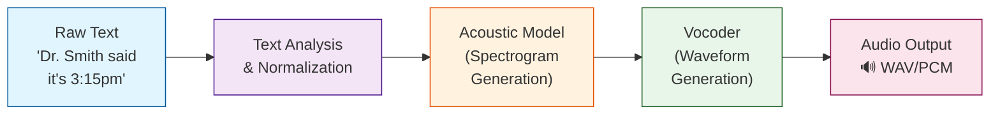
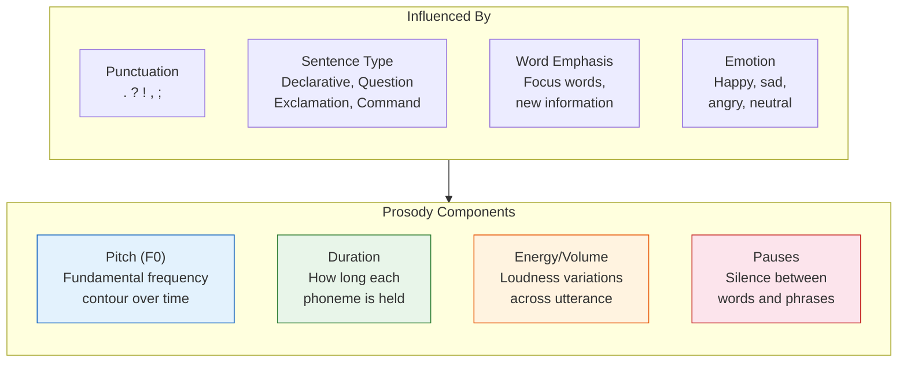
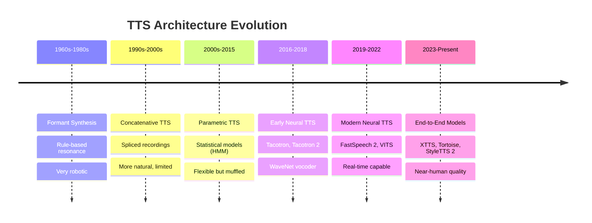
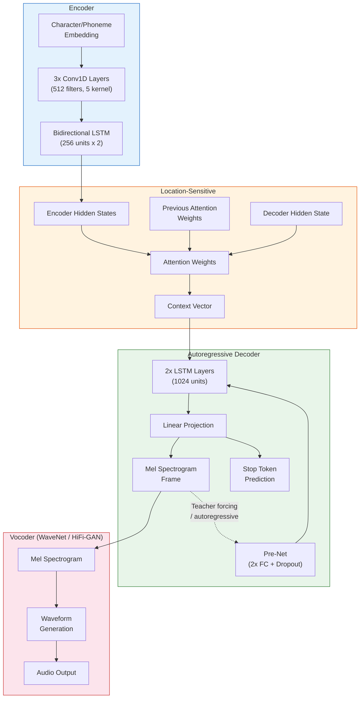
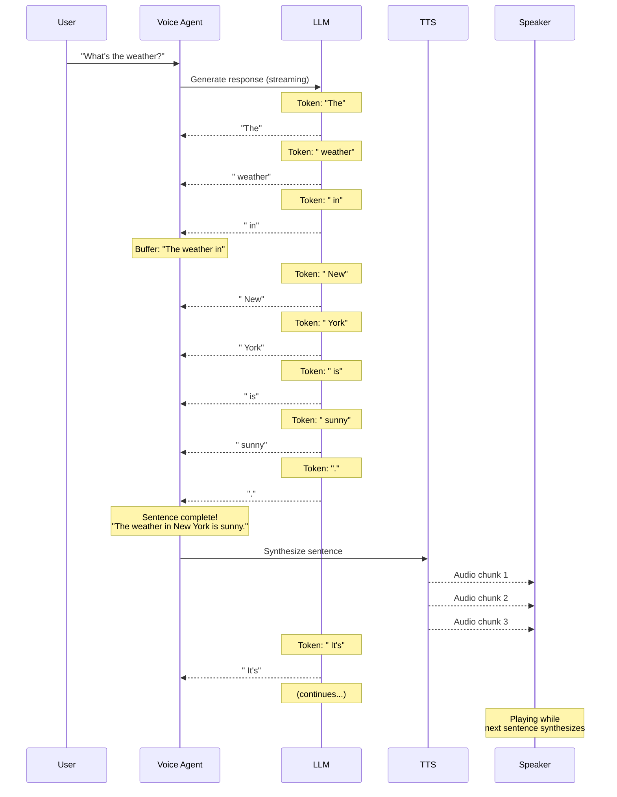

# Voice Agents Deep Dive  Part 5: Speech Synthesis  Teaching Machines to Talk

---

**Series:** Building Voice Agents  A Developer's Deep Dive from Audio Fundamentals to Production
**Part:** 5 of 20 (Speech Synthesis)
**Audience:** Developers with Python experience who want to build voice-powered AI agents from the ground up
**Reading time:** ~55 minutes

---

## Table of Contents

1. [Recap of Part 4](#recap-of-part-4)
2. [How TTS Works  The Complete Pipeline](#how-tts-works--the-complete-pipeline)
3. [TTS Architecture Evolution](#tts-architecture-evolution)
4. [Vocoders  Generating the Actual Waveform](#vocoders--generating-the-actual-waveform)
5. [Production TTS APIs](#production-tts-apis)
6. [Open-Source TTS](#open-source-tts)
7. [SSML Deep Dive  Speech Synthesis Markup Language](#ssml-deep-dive--speech-synthesis-markup-language)
8. [Streaming TTS  Chunk-by-Chunk Audio Generation](#streaming-tts--chunk-by-chunk-audio-generation)
9. [Building a Multi-Engine TTS Service](#building-a-multi-engine-tts-service)
10. [TTS Quality Evaluation](#tts-quality-evaluation)
11. [Vocabulary Cheat Sheet](#vocabulary-cheat-sheet)
12. [What's Next  Part 6](#whats-next--part-6)

---

## Recap of Part 4

In Part 4, we explored **Speech-to-Text (STT)**  the art of converting human speech into written text. We covered the Connectionist Temporal Classification (CTC) loss function, attention-based encoder-decoder architectures, and production STT engines like OpenAI Whisper, Google Speech-to-Text, and Azure Cognitive Services. We learned how to handle real-time transcription with streaming APIs, built a robust transcription pipeline with speaker diarization, and evaluated accuracy using Word Error Rate (WER).

Now we tackle the **opposite direction**: turning text back into speech. Text-to-Speech (TTS) is arguably the most user-facing component of any voice agent  it is literally the voice your users hear. A stilted, robotic voice will undermine even the most brilliant AI reasoning behind it, while a natural, expressive voice creates trust and engagement.

> **Key insight:** TTS is where your voice agent's personality lives. Users will judge your entire system by how it sounds. Invest accordingly.

Let us begin by understanding the full pipeline that transforms a string of characters into a waveform that sounds like a human speaking.

---

## How TTS Works  The Complete Pipeline

At its core, Text-to-Speech synthesis is a pipeline that transforms written text into an audio waveform. While modern end-to-end models blur the boundaries between stages, understanding each stage helps you debug issues, choose the right tools, and optimize for your use case.

### The Four-Stage Pipeline



Let us examine each stage in detail.

### Stage 1: Text Analysis and Normalization

Raw text is messy. Before any acoustic modeling can happen, the system must resolve ambiguities that humans handle effortlessly but machines struggle with.

#### Text Normalization

Text normalization (sometimes called **text preprocessing** or **verbalization**) converts non-standard words into their spoken form:

| Input | Normalized Output | Category |
|-------|-------------------|----------|
| `Dr. Smith` | `Doctor Smith` | Abbreviation |
| `3:15pm` | `three fifteen p m` | Time |
| `$42.50` | `forty-two dollars and fifty cents` | Currency |
| `Jan 3, 2025` | `January third, twenty twenty-five` | Date |
| `123 Main St.` | `one twenty-three Main Street` | Address |
| `I/O` | `eye oh` or `input output` | Acronym |
| `2nd` | `second` | Ordinal |
| `100°F` | `one hundred degrees Fahrenheit` | Measurement |
| `www.example.com` | `double-u double-u double-u dot example dot com` | URL |
| `IEEE` | `eye triple-E` | Specialized acronym |

Here is a Python implementation of a basic text normalizer:

```python
"""
text_normalizer.py
Basic text normalization for TTS preprocessing.
"""

import re
from typing import Optional


class TextNormalizer:
    """
    Normalizes raw text into a form suitable for TTS processing.
    Handles numbers, dates, abbreviations, currencies, and more.
    """

    # Common abbreviations and their spoken forms
    ABBREVIATIONS = {
        "Dr.": "Doctor",
        "Mr.": "Mister",
        "Mrs.": "Missus",
        "Ms.": "Miz",
        "Prof.": "Professor",
        "St.": "Street",
        "Ave.": "Avenue",
        "Blvd.": "Boulevard",
        "Dept.": "Department",
        "govt.": "government",
        "approx.": "approximately",
        "etc.": "etcetera",
        "vs.": "versus",
        "e.g.": "for example",
        "i.e.": "that is",
        "Jr.": "Junior",
        "Sr.": "Senior",
        "Inc.": "Incorporated",
        "Ltd.": "Limited",
        "Corp.": "Corporation",
    }

    # Number words for basic conversion
    ONES = [
        "", "one", "two", "three", "four", "five",
        "six", "seven", "eight", "nine", "ten",
        "eleven", "twelve", "thirteen", "fourteen", "fifteen",
        "sixteen", "seventeen", "eighteen", "nineteen",
    ]
    TENS = [
        "", "", "twenty", "thirty", "forty", "fifty",
        "sixty", "seventy", "eighty", "ninety",
    ]

    ORDINAL_SUFFIXES = {
        "1st": "first", "2nd": "second", "3rd": "third",
        "4th": "fourth", "5th": "fifth", "6th": "sixth",
        "7th": "seventh", "8th": "eighth", "9th": "ninth",
        "10th": "tenth", "11th": "eleventh", "12th": "twelfth",
        "13th": "thirteenth", "20th": "twentieth",
        "21st": "twenty-first", "30th": "thirtieth",
        "31st": "thirty-first",
    }

    def normalize(self, text: str) -> str:
        """
        Apply all normalization rules to the input text.

        Args:
            text: Raw input text to normalize

        Returns:
            Normalized text suitable for TTS
        """
        text = self._expand_abbreviations(text)
        text = self._normalize_currency(text)
        text = self._normalize_time(text)
        text = self._normalize_dates(text)
        text = self._normalize_ordinals(text)
        text = self._normalize_numbers(text)
        text = self._normalize_urls(text)
        text = self._normalize_email(text)
        text = self._clean_whitespace(text)
        return text

    def _expand_abbreviations(self, text: str) -> str:
        """Replace known abbreviations with full spoken forms."""
        for abbrev, expansion in self.ABBREVIATIONS.items():
            text = text.replace(abbrev, expansion)
        return text

    def _normalize_currency(self, text: str) -> str:
        """Convert currency amounts to spoken form."""
        # Match $XX.XX pattern
        def replace_dollars(match):
            dollars = int(match.group(1))
            cents = match.group(2)
            result = self._number_to_words(dollars)
            if cents:
                cents_val = int(cents)
                if cents_val > 0:
                    result += f" dollars and {self._number_to_words(cents_val)} cents"
                else:
                    result += " dollars"
            else:
                result += " dollars"
            return result

        text = re.sub(
            r"\$(\d+)(?:\.(\d{2}))?",
            replace_dollars,
            text,
        )
        return text

    def _normalize_time(self, text: str) -> str:
        """Convert time expressions to spoken form."""
        def replace_time(match):
            hour = int(match.group(1))
            minute = int(match.group(2))
            period = match.group(3) or ""

            if minute == 0:
                result = f"{self._number_to_words(hour)} o'clock"
            elif minute == 30:
                result = f"{self._number_to_words(hour)} thirty"
            elif minute == 15:
                result = f"{self._number_to_words(hour)} fifteen"
            elif minute == 45:
                result = f"{self._number_to_words(hour)} forty-five"
            else:
                if minute < 10:
                    result = f"{self._number_to_words(hour)} oh {self._number_to_words(minute)}"
                else:
                    result = f"{self._number_to_words(hour)} {self._number_to_words(minute)}"

            if period:
                result += f" {period.replace('am', 'A M').replace('pm', 'P M')}"
            return result

        text = re.sub(
            r"(\d{1,2}):(\d{2})\s*(am|pm|AM|PM)?",
            replace_time,
            text,
        )
        return text

    def _normalize_dates(self, text: str) -> str:
        """Convert date expressions to spoken form."""
        months = {
            "Jan": "January", "Feb": "February", "Mar": "March",
            "Apr": "April", "May": "May", "Jun": "June",
            "Jul": "July", "Aug": "August", "Sep": "September",
            "Oct": "October", "Nov": "November", "Dec": "December",
        }
        for abbrev, full in months.items():
            text = text.replace(f"{abbrev} ", f"{full} ")
            text = text.replace(f"{abbrev}.", f"{full}")
        return text

    def _normalize_ordinals(self, text: str) -> str:
        """Convert ordinal numbers (1st, 2nd, 3rd) to words."""
        for ordinal, word in self.ORDINAL_SUFFIXES.items():
            text = re.sub(rf"\b{ordinal}\b", word, text)

        # Generic ordinal pattern
        def replace_ordinal(match):
            num = int(match.group(1))
            if num in range(1, 32):
                return self.ORDINAL_SUFFIXES.get(match.group(0), match.group(0))
            return match.group(0)

        text = re.sub(r"\b(\d+)(st|nd|rd|th)\b", replace_ordinal, text)
        return text

    def _normalize_numbers(self, text: str) -> str:
        """Convert standalone numbers to words."""
        def replace_number(match):
            num = int(match.group(0))
            if num <= 9999:
                return self._number_to_words(num)
            return match.group(0)

        text = re.sub(r"\b\d{1,4}\b", replace_number, text)
        return text

    def _normalize_urls(self, text: str) -> str:
        """Convert URLs to a more speakable form."""
        def replace_url(match):
            url = match.group(0)
            url = url.replace("https://", "")
            url = url.replace("http://", "")
            url = url.replace("www.", "double-u double-u double-u dot ")
            url = url.replace(".", " dot ")
            url = url.replace("/", " slash ")
            return url

        text = re.sub(
            r"https?://[^\s]+",
            replace_url,
            text,
        )
        return text

    def _normalize_email(self, text: str) -> str:
        """Convert email addresses to speakable form."""
        def replace_email(match):
            local, domain = match.group(0).split("@")
            domain = domain.replace(".", " dot ")
            return f"{local} at {domain}"

        text = re.sub(
            r"[a-zA-Z0-9._%+-]+@[a-zA-Z0-9.-]+\.[a-zA-Z]{2,}",
            replace_email,
            text,
        )
        return text

    def _number_to_words(self, n: int) -> str:
        """Convert an integer to its English word representation."""
        if n == 0:
            return "zero"
        if n < 0:
            return "negative " + self._number_to_words(-n)
        if n < 20:
            return self.ONES[n]
        if n < 100:
            tens = self.TENS[n // 10]
            ones = self.ONES[n % 10]
            return f"{tens}-{ones}" if ones else tens
        if n < 1000:
            hundreds = self.ONES[n // 100] + " hundred"
            remainder = n % 100
            if remainder:
                return f"{hundreds} and {self._number_to_words(remainder)}"
            return hundreds
        if n < 10000:
            thousands = self._number_to_words(n // 1000) + " thousand"
            remainder = n % 1000
            if remainder:
                return f"{thousands} {self._number_to_words(remainder)}"
            return thousands
        return str(n)

    def _clean_whitespace(self, text: str) -> str:
        """Remove excess whitespace."""
        text = re.sub(r"\s+", " ", text)
        return text.strip()


# ---------- Demo ----------
if __name__ == "__main__":
    normalizer = TextNormalizer()

    test_cases = [
        "Dr. Smith will see you at 3:15pm on Jan 3, 2025.",
        "The total is $42.50 for 3 items.",
        "Visit https://www.example.com for more info.",
        "Contact us at support@example.com or call ext. 100.",
        "The 2nd floor of 123 Main St. is closed.",
    ]

    for text in test_cases:
        print(f"Input:  {text}")
        print(f"Output: {normalizer.normalize(text)}")
        print()
```

#### Grapheme-to-Phoneme (G2P) Conversion

After normalization, we need to convert written words (**graphemes**) into their pronunciation (**phonemes**). English is notoriously irregular  consider how differently the letters "ough" are pronounced in "though," "through," "rough," "cough," and "thought."

The **International Phonetic Alphabet (IPA)** and **ARPAbet** are two common phoneme representation systems:

| Word | IPA | ARPAbet |
|------|-----|---------|
| hello | /hɛˈloʊ/ | HH AH0 L OW1 |
| world | /wɝːld/ | W ER1 L D |
| synthesis | /ˈsɪnθəsɪs/ | S IH1 N TH AH0 S IH0 S |
| through | /θruː/ | TH R UW1 |
| read (present) | /riːd/ | R IY1 D |
| read (past) | /rɛd/ | R EH1 D |

```python
"""
grapheme_to_phoneme.py
Basic G2P conversion using CMU Pronouncing Dictionary and fallback rules.
"""

from typing import Optional


class GraphemeToPhoneme:
    """
    Converts English words to their phonemic representations.
    Uses the CMU Pronouncing Dictionary with rule-based fallback.
    """

    def __init__(self, cmu_dict_path: Optional[str] = None):
        """
        Initialize the G2P converter.

        Args:
            cmu_dict_path: Path to CMU dict file. If None, uses nltk's copy.
        """
        self.dictionary: dict[str, list[str]] = {}
        self._load_dictionary(cmu_dict_path)

    def _load_dictionary(self, path: Optional[str] = None) -> None:
        """Load the CMU Pronouncing Dictionary."""
        try:
            if path:
                with open(path, "r", encoding="utf-8") as f:
                    for line in f:
                        if line.startswith(";;;"):
                            continue
                        parts = line.strip().split("  ")
                        if len(parts) == 2:
                            word = parts[0].lower()
                            phonemes = parts[1].split()
                            self.dictionary[word] = phonemes
            else:
                # Attempt to use nltk's CMU dict
                try:
                    import nltk
                    from nltk.corpus import cmudict
                    nltk.download("cmudict", quiet=True)
                    for word, phones in cmudict.entries():
                        self.dictionary[word] = phones
                except ImportError:
                    print("Warning: nltk not available. G2P will use fallback rules only.")
        except FileNotFoundError:
            print(f"Warning: CMU dict not found at {path}. Using fallback rules.")

    def convert(self, word: str) -> list[str]:
        """
        Convert a word to its phoneme representation.

        Args:
            word: English word to convert

        Returns:
            List of ARPAbet phoneme strings
        """
        word_lower = word.lower().strip()

        # Look up in dictionary
        if word_lower in self.dictionary:
            return self.dictionary[word_lower]

        # Try without trailing punctuation
        stripped = word_lower.rstrip(".,!?;:")
        if stripped in self.dictionary:
            return self.dictionary[stripped]

        # Fallback to rule-based conversion
        return self._rule_based_g2p(word_lower)

    def _rule_based_g2p(self, word: str) -> list[str]:
        """
        Simple rule-based G2P as fallback.
        This is very basic  production systems use neural G2P models.
        """
        # Simple letter-to-phoneme mapping (very approximate)
        simple_map = {
            "a": "AE1", "b": "B", "c": "K", "d": "D", "e": "EH1",
            "f": "F", "g": "G", "h": "HH", "i": "IH1", "j": "JH",
            "k": "K", "l": "L", "m": "M", "n": "N", "o": "AA1",
            "p": "P", "q": "K W", "r": "R", "s": "S", "t": "T",
            "u": "AH1", "v": "V", "w": "W", "x": "K S", "y": "Y",
            "z": "Z",
        }

        phonemes = []
        i = 0
        while i < len(word):
            # Check for common digraphs
            if i + 1 < len(word):
                digraph = word[i:i + 2]
                if digraph == "th":
                    phonemes.append("TH")
                    i += 2
                    continue
                elif digraph == "sh":
                    phonemes.append("SH")
                    i += 2
                    continue
                elif digraph == "ch":
                    phonemes.append("CH")
                    i += 2
                    continue
                elif digraph == "ng":
                    phonemes.append("NG")
                    i += 2
                    continue

            char = word[i]
            if char in simple_map:
                phonemes.extend(simple_map[char].split())
            i += 1

        return phonemes

    def sentence_to_phonemes(self, sentence: str) -> list[list[str]]:
        """Convert a full sentence to phoneme sequences."""
        words = sentence.split()
        return [self.convert(word) for word in words]


# ---------- Demo ----------
if __name__ == "__main__":
    g2p = GraphemeToPhoneme()

    test_words = ["hello", "world", "synthesis", "through", "python"]
    for word in test_words:
        phonemes = g2p.convert(word)
        print(f"{word:15s} -> {' '.join(phonemes)}")
```

#### Prosody Prediction

**Prosody** refers to the rhythm, stress, and intonation of speech. It is what makes the difference between a question ("You're leaving?") and a statement ("You're leaving."), or between emphasis on different words ("I didn't say HE stole it" vs. "I didn't say he STOLE it").



```python
"""
prosody_predictor.py
A rule-based prosody annotation system for TTS preprocessing.
"""

import re
from dataclasses import dataclass, field
from enum import Enum
from typing import Optional


class SentenceType(Enum):
    """Classification of sentence types for prosody."""
    DECLARATIVE = "declarative"
    QUESTION = "question"
    EXCLAMATION = "exclamation"
    COMMAND = "command"


@dataclass
class ProsodyFeatures:
    """Prosody features for a single word or phoneme group."""
    pitch_modifier: float = 1.0        # Multiplier for base pitch (1.0 = neutral)
    duration_modifier: float = 1.0     # Multiplier for base duration
    energy_modifier: float = 1.0       # Multiplier for volume/energy
    pause_after_ms: int = 0            # Milliseconds of silence after this token
    emphasis: bool = False             # Whether this word is emphasized


@dataclass
class ProsodyAnnotation:
    """Full prosody annotation for a sentence."""
    sentence_type: SentenceType = SentenceType.DECLARATIVE
    word_features: list[tuple[str, ProsodyFeatures]] = field(default_factory=list)
    global_rate: float = 1.0           # Speaking rate multiplier
    global_pitch: float = 1.0         # Global pitch adjustment


class ProsodyPredictor:
    """
    Rule-based prosody prediction for TTS.
    Assigns pitch, duration, energy, and pause annotations.
    """

    # Punctuation-based pause durations (milliseconds)
    PAUSE_MAP = {
        ",": 200,
        ";": 300,
        ":": 300,
        ".": 400,
        "!": 400,
        "?": 400,
        "": 350,
        "...": 500,
        "\n": 500,
    }

    # Function words that typically receive less stress
    FUNCTION_WORDS = {
        "a", "an", "the", "is", "are", "was", "were", "be", "been",
        "being", "have", "has", "had", "do", "does", "did", "will",
        "would", "could", "should", "may", "might", "shall", "can",
        "to", "of", "in", "for", "on", "with", "at", "by", "from",
        "as", "into", "through", "during", "before", "after", "and",
        "but", "or", "nor", "not", "so", "yet", "if", "then", "than",
        "that", "this", "it", "its", "he", "she", "they", "we", "you",
        "me", "him", "her", "them", "us", "my", "your", "his",
    }

    def predict(self, text: str) -> ProsodyAnnotation:
        """
        Predict prosody features for the given text.

        Args:
            text: Input text to annotate with prosody

        Returns:
            ProsodyAnnotation with per-word features
        """
        sentence_type = self._classify_sentence(text)
        words = text.split()
        word_features = []

        for i, word in enumerate(words):
            features = ProsodyFeatures()
            clean_word = word.strip(".,!?;:\"'")
            is_last = i == len(words) - 1

            # Determine stress based on content vs. function words
            if clean_word.lower() in self.FUNCTION_WORDS:
                features.pitch_modifier = 0.95
                features.duration_modifier = 0.85
                features.energy_modifier = 0.9
            else:
                features.pitch_modifier = 1.05
                features.duration_modifier = 1.0
                features.energy_modifier = 1.05

            # Handle ALL CAPS as emphasis
            if clean_word.isupper() and len(clean_word) > 1:
                features.emphasis = True
                features.pitch_modifier = 1.2
                features.duration_modifier = 1.3
                features.energy_modifier = 1.3

            # Handle punctuation-based pauses
            for punct, pause in self.PAUSE_MAP.items():
                if word.endswith(punct):
                    features.pause_after_ms = pause
                    break

            # Question intonation: rise at the end
            if sentence_type == SentenceType.QUESTION and is_last:
                features.pitch_modifier *= 1.3

            # Exclamation: higher energy overall
            if sentence_type == SentenceType.EXCLAMATION:
                features.energy_modifier *= 1.15

            # Sentence-final lengthening
            if is_last:
                features.duration_modifier *= 1.2

            word_features.append((word, features))

        return ProsodyAnnotation(
            sentence_type=sentence_type,
            word_features=word_features,
        )

    def _classify_sentence(self, text: str) -> SentenceType:
        """Classify the sentence type based on punctuation and keywords."""
        text = text.strip()
        if text.endswith("?"):
            return SentenceType.QUESTION
        if text.endswith("!"):
            return SentenceType.EXCLAMATION
        # Simple command detection (starts with verb)
        command_starters = [
            "stop", "go", "run", "tell", "show", "give", "take",
            "open", "close", "turn", "set", "get", "put", "let",
            "please", "do", "don't",
        ]
        first_word = text.split()[0].lower() if text.split() else ""
        if first_word in command_starters:
            return SentenceType.COMMAND
        return SentenceType.DECLARATIVE

    def annotate_for_display(self, text: str) -> str:
        """Create a readable prosody annotation string."""
        annotation = self.predict(text)
        lines = [f"Sentence Type: {annotation.sentence_type.value}"]
        lines.append("-" * 60)
        lines.append(f"{'Word':<15} {'Pitch':>7} {'Duration':>10} {'Energy':>8} {'Pause':>7} {'Emph':>6}")
        lines.append("-" * 60)

        for word, feat in annotation.word_features:
            lines.append(
                f"{word:<15} {feat.pitch_modifier:>7.2f} "
                f"{feat.duration_modifier:>10.2f} "
                f"{feat.energy_modifier:>8.2f} "
                f"{feat.pause_after_ms:>5}ms "
                f"{'  YES' if feat.emphasis else '   no':>6}"
            )

        return "\n".join(lines)


# ---------- Demo ----------
if __name__ == "__main__":
    predictor = ProsodyPredictor()

    sentences = [
        "The quick brown fox jumps over the lazy dog.",
        "Did you finish the report yet?",
        "I didn't say HE stole the money!",
        "Please close the door, turn off the lights, and lock up.",
    ]

    for sentence in sentences:
        print(f"\n>>> {sentence}")
        print(predictor.annotate_for_display(sentence))
        print()
```

> **Developer note:** Production TTS systems use neural prosody models (typically transformer-based) rather than rules. But understanding what prosody entails helps you write better SSML annotations and debug unnatural-sounding output.

---

## TTS Architecture Evolution

The history of TTS is a journey from robotic-sounding spliced recordings to neural models that approach human naturalness. Understanding each generation helps you make informed choices for your voice agent.

### Architecture Timeline



### Detailed Comparison

| Generation | Approach | Quality (MOS) | Latency | Flexibility | Key Limitation |
|-----------|----------|---------------|---------|-------------|----------------|
| **Concatenative** | Splice pre-recorded audio segments | 3.0-3.5 | Fast | Low  needs huge databases | Audible joins, limited expressiveness |
| **Parametric (HMM)** | Statistical models generate speech parameters | 2.5-3.0 | Fast | Medium  parameter control | "Muffled" or "buzzy" quality |
| **Neural (Tacotron)** | Seq2seq model generates spectrograms | 4.0-4.3 | Slow | High  learns from data | Slow inference, attention errors |
| **Neural (FastSpeech 2)** | Non-autoregressive spectrogram generation | 4.0-4.2 | Fast | High  parallel generation | Slightly less expressive |
| **End-to-End (VITS)** | Single model: text to waveform | 4.3-4.5 | Fast | Very high | Training complexity |
| **End-to-End (XTTS)** | Multi-language, voice cloning built in | 4.2-4.5 | Medium | Very high  cross-lingual | Model size |

### Concatenative TTS

The first widely-deployed TTS approach. The idea is simple: record a human speaker saying many sentences, chop the recordings into small units (diphones, triphones, or even half-phones), and stitch them together to form new sentences.

```python
"""
concatenative_tts_demo.py
Conceptual demonstration of concatenative TTS.
This is educational  not a production implementation.
"""

import numpy as np
from dataclasses import dataclass


@dataclass
class AudioUnit:
    """A pre-recorded audio segment (diphone, triphone, etc.)."""
    label: str                  # e.g., "h-eh", "eh-l", "l-ow"
    audio: np.ndarray           # Raw audio samples
    sample_rate: int = 22050
    duration_ms: float = 0.0
    pitch_hz: float = 0.0
    energy: float = 0.0


class ConcatenativeTTS:
    """
    Simplified concatenative TTS using diphone units.
    Demonstrates the concept of unit selection synthesis.
    """

    def __init__(self, unit_database: dict[str, list[AudioUnit]]):
        """
        Args:
            unit_database: Mapping from diphone labels to available audio units.
                           Multiple candidates per diphone enable better selection.
        """
        self.unit_database = unit_database

    def synthesize(
        self,
        phoneme_sequence: list[str],
        target_pitch: float = 150.0,
    ) -> np.ndarray:
        """
        Synthesize speech by selecting and concatenating audio units.

        Args:
            phoneme_sequence: Ordered list of phonemes (e.g., ["HH", "EH", "L", "OW"])
            target_pitch: Target fundamental frequency in Hz

        Returns:
            Concatenated audio waveform as numpy array
        """
        # Convert phonemes to diphone labels
        diphones = self._to_diphones(phoneme_sequence)

        # Select best unit for each diphone (unit selection)
        selected_units = []
        prev_unit = None
        for diphone in diphones:
            candidates = self.unit_database.get(diphone, [])
            if not candidates:
                print(f"Warning: No unit found for diphone '{diphone}'")
                continue

            # Select the unit that minimizes cost
            best_unit = self._select_best_unit(
                candidates, target_pitch, prev_unit
            )
            selected_units.append(best_unit)
            prev_unit = best_unit

        # Concatenate with crossfade smoothing
        return self._concatenate_units(selected_units)

    def _to_diphones(self, phonemes: list[str]) -> list[str]:
        """Convert phoneme sequence to diphone labels."""
        diphones = []
        # Add silence at start and end
        phonemes = ["SIL"] + phonemes + ["SIL"]
        for i in range(len(phonemes) - 1):
            diphone = f"{phonemes[i]}-{phonemes[i+1]}"
            diphones.append(diphone)
        return diphones

    def _select_best_unit(
        self,
        candidates: list[AudioUnit],
        target_pitch: float,
        prev_unit: AudioUnit | None,
    ) -> AudioUnit:
        """
        Select the best audio unit using a cost function.
        Considers target cost (pitch match) and join cost (smoothness).
        """
        best_cost = float("inf")
        best_unit = candidates[0]

        for unit in candidates:
            # Target cost: how well does this unit match desired properties
            target_cost = abs(unit.pitch_hz - target_pitch) / target_pitch

            # Join cost: how smooth is the transition from previous unit
            join_cost = 0.0
            if prev_unit is not None:
                # Pitch discontinuity
                join_cost += abs(unit.pitch_hz - prev_unit.pitch_hz) / 100.0
                # Energy discontinuity
                join_cost += abs(unit.energy - prev_unit.energy)

            total_cost = 0.6 * target_cost + 0.4 * join_cost
            if total_cost < best_cost:
                best_cost = total_cost
                best_unit = unit

        return best_unit

    def _concatenate_units(
        self,
        units: list[AudioUnit],
        crossfade_ms: float = 5.0,
    ) -> np.ndarray:
        """Concatenate audio units with crossfade smoothing."""
        if not units:
            return np.array([], dtype=np.float32)

        # Calculate crossfade in samples
        sr = units[0].sample_rate
        crossfade_samples = int(crossfade_ms * sr / 1000)

        # Simple concatenation with linear crossfade
        result = units[0].audio.copy()
        for unit in units[1:]:
            if len(result) >= crossfade_samples and len(unit.audio) >= crossfade_samples:
                # Apply crossfade
                fade_out = np.linspace(1.0, 0.0, crossfade_samples)
                fade_in = np.linspace(0.0, 1.0, crossfade_samples)

                result[-crossfade_samples:] *= fade_out
                overlap = unit.audio[:crossfade_samples] * fade_in
                result[-crossfade_samples:] += overlap
                result = np.concatenate([result, unit.audio[crossfade_samples:]])
            else:
                result = np.concatenate([result, unit.audio])

        return result
```

### Neural TTS  Tacotron 2 Architecture

**Tacotron 2** (2018) was a breakthrough that made neural TTS practical. It uses an encoder-decoder architecture with attention to generate mel spectrograms from text, which are then converted to audio by a vocoder (originally WaveNet).



### FastSpeech 2  Non-Autoregressive Generation

**FastSpeech 2** solved Tacotron 2's speed problem by using a **non-autoregressive** approach. Instead of generating one spectrogram frame at a time, it generates the entire spectrogram in parallel:

| Feature | Tacotron 2 | FastSpeech 2 |
|---------|-----------|--------------|
| Generation | Autoregressive (sequential) | Non-autoregressive (parallel) |
| Speed | ~0.06x real-time (without vocoder) | ~50x real-time |
| Robustness | Attention errors (skipping, repeating) | Duration predictor eliminates errors |
| Controllability | Limited | Explicit pitch, energy, duration control |
| Training | Needs attention alignment | Needs external duration labels |

### VITS  End-to-End

**VITS** (Variational Inference with adversarial learning for end-to-end Text-to-Speech, 2021) combines the acoustic model and vocoder into a single end-to-end model. It uses variational autoencoders (VAE) and generative adversarial training to produce high-quality audio directly from text.

```python
"""
tts_architecture_comparison.py
Compare different TTS architectures conceptually with timing estimates.
"""

from dataclasses import dataclass
from enum import Enum


class TTSGeneration(Enum):
    """TTS architecture generation."""
    CONCATENATIVE = "concatenative"
    PARAMETRIC = "parametric"
    NEURAL_AR = "neural_autoregressive"     # Tacotron 2
    NEURAL_NAR = "neural_non_autoregressive" # FastSpeech 2
    END_TO_END = "end_to_end"               # VITS


@dataclass
class TTSArchitectureProfile:
    """Profile describing a TTS architecture's characteristics."""
    name: str
    generation: TTSGeneration
    mos_score: float              # Mean Opinion Score (1-5)
    rtf: float                    # Real-time factor (< 1 means faster than real-time)
    model_size_mb: float
    requires_vocoder: bool
    supports_streaming: bool
    voice_cloning: bool
    multi_language: bool
    description: str


# Architecture catalog
ARCHITECTURES = [
    TTSArchitectureProfile(
        name="Festival (Concatenative)",
        generation=TTSGeneration.CONCATENATIVE,
        mos_score=3.2,
        rtf=0.01,
        model_size_mb=500,
        requires_vocoder=False,
        supports_streaming=True,
        voice_cloning=False,
        multi_language=False,
        description="Diphone concatenation with unit selection. Fast but robotic.",
    ),
    TTSArchitectureProfile(
        name="HTS (HMM-based)",
        generation=TTSGeneration.PARAMETRIC,
        mos_score=2.8,
        rtf=0.05,
        model_size_mb=20,
        requires_vocoder=True,
        supports_streaming=True,
        voice_cloning=False,
        multi_language=True,
        description="Statistical parametric synthesis. Small model, muffled quality.",
    ),
    TTSArchitectureProfile(
        name="Tacotron 2",
        generation=TTSGeneration.NEURAL_AR,
        mos_score=4.2,
        rtf=5.0,
        model_size_mb=100,
        requires_vocoder=True,
        supports_streaming=False,
        voice_cloning=False,
        multi_language=False,
        description="Autoregressive neural TTS. High quality but slow inference.",
    ),
    TTSArchitectureProfile(
        name="FastSpeech 2",
        generation=TTSGeneration.NEURAL_NAR,
        mos_score=4.0,
        rtf=0.02,
        model_size_mb=80,
        requires_vocoder=True,
        supports_streaming=True,
        voice_cloning=False,
        multi_language=False,
        description="Non-autoregressive. Fast parallel generation with duration control.",
    ),
    TTSArchitectureProfile(
        name="VITS",
        generation=TTSGeneration.END_TO_END,
        mos_score=4.4,
        rtf=0.1,
        model_size_mb=150,
        requires_vocoder=False,
        supports_streaming=True,
        voice_cloning=False,
        multi_language=True,
        description="End-to-end VAE + GAN. Single model from text to waveform.",
    ),
    TTSArchitectureProfile(
        name="XTTS v2",
        generation=TTSGeneration.END_TO_END,
        mos_score=4.3,
        rtf=0.3,
        model_size_mb=1800,
        requires_vocoder=False,
        supports_streaming=True,
        voice_cloning=True,
        multi_language=True,
        description="Multi-lingual end-to-end with zero-shot voice cloning.",
    ),
]


def print_comparison_table():
    """Print a comparison of all architectures."""
    header = (
        f"{'Architecture':<25} {'MOS':>5} {'RTF':>6} {'Size':>8} "
        f"{'Vocoder':>8} {'Stream':>7} {'Clone':>6} {'Multi':>6}"
    )
    print(header)
    print("-" * len(header))
    for arch in ARCHITECTURES:
        print(
            f"{arch.name:<25} {arch.mos_score:>5.1f} {arch.rtf:>6.2f} "
            f"{arch.model_size_mb:>6.0f}MB "
            f"{'Yes' if arch.requires_vocoder else 'No':>8} "
            f"{'Yes' if arch.supports_streaming else 'No':>7} "
            f"{'Yes' if arch.voice_cloning else 'No':>6} "
            f"{'Yes' if arch.multi_language else 'No':>6}"
        )


if __name__ == "__main__":
    print_comparison_table()
    print()
    for arch in ARCHITECTURES:
        print(f"\n{arch.name}:")
        print(f"  {arch.description}")
```

---

## Vocoders  Generating the Actual Waveform

A **vocoder** (voice encoder/decoder) takes the intermediate representation produced by the acoustic model (typically a mel spectrogram) and converts it into an actual audio waveform. This is the component responsible for the final audio quality you hear.

> **Why a separate vocoder?** Mel spectrograms are a compact representation of audio (typically 80 frequency bins at ~12.5ms intervals), but a waveform at 22,050 Hz has 22,050 samples per second. The vocoder must "fill in" all the fine detail that the spectrogram does not capture.

### Vocoder Comparison

| Vocoder | Type | Quality | Speed (RTF) | Year | Key Innovation |
|---------|------|---------|-------------|------|----------------|
| **Griffin-Lim** | Classical | Low | 0.001 | 1984 | Phase reconstruction from magnitude spectrogram |
| **WaveNet** | Autoregressive | Excellent | 200+ | 2016 | Dilated causal convolutions, sample-by-sample |
| **WaveRNN** | Autoregressive | Very Good | 4-8 | 2018 | Single RNN with subscale prediction |
| **WaveGlow** | Flow-based | Very Good | 0.1 | 2018 | Invertible flow network, parallel |
| **MelGAN** | GAN-based | Good | 0.01 | 2019 | Multi-scale discriminator |
| **HiFi-GAN** | GAN-based | Excellent | 0.003 | 2020 | Multi-period + multi-scale discriminators |
| **UnivNet** | GAN-based | Excellent | 0.005 | 2022 | Location-variable convolutions |
| **Vocos** | GAN-based | Excellent | 0.002 | 2023 | Fourier-based head, very lightweight |

### WaveNet  The Pioneer

**WaveNet** (DeepMind, 2016) was the first neural vocoder to produce truly natural-sounding speech. It generates audio **one sample at a time**, using dilated causal convolutions to capture long-range dependencies.

```python
"""
wavenet_concepts.py
Conceptual demonstration of WaveNet's dilated causal convolutions.
Not a full implementation  illustrates the key architectural ideas.
"""

import numpy as np
from typing import Optional


class DilatedCausalConv1D:
    """
    Conceptual dilated causal convolution layer.
    Demonstrates how WaveNet achieves large receptive fields.
    """

    def __init__(
        self,
        in_channels: int,
        out_channels: int,
        kernel_size: int = 2,
        dilation: int = 1,
    ):
        self.in_channels = in_channels
        self.out_channels = out_channels
        self.kernel_size = kernel_size
        self.dilation = dilation
        self.receptive_field = (kernel_size - 1) * dilation + 1

        # Weights (randomly initialized for demonstration)
        rng = np.random.default_rng(42)
        self.weight = rng.standard_normal(
            (out_channels, in_channels, kernel_size)
        ).astype(np.float32) * 0.01

    def __repr__(self) -> str:
        return (
            f"DilatedCausalConv1D(in={self.in_channels}, out={self.out_channels}, "
            f"kernel={self.kernel_size}, dilation={self.dilation}, "
            f"receptive_field={self.receptive_field})"
        )


class WaveNetBlock:
    """A single residual block in WaveNet."""

    def __init__(self, channels: int, dilation: int):
        self.dilated_conv = DilatedCausalConv1D(
            channels, 2 * channels, kernel_size=2, dilation=dilation
        )
        self.residual_channels = channels
        self.dilation = dilation

    def __repr__(self) -> str:
        return f"WaveNetBlock(channels={self.residual_channels}, dilation={self.dilation})"


class WaveNetArchitecture:
    """
    Describes the WaveNet architecture conceptually.
    Shows how stacking dilated convolutions creates a large receptive field.
    """

    def __init__(
        self,
        num_stacks: int = 3,
        layers_per_stack: int = 10,
        residual_channels: int = 64,
    ):
        self.num_stacks = num_stacks
        self.layers_per_stack = layers_per_stack
        self.residual_channels = residual_channels
        self.blocks: list[WaveNetBlock] = []

        for stack in range(num_stacks):
            for layer in range(layers_per_stack):
                dilation = 2 ** layer  # 1, 2, 4, 8, ..., 512
                self.blocks.append(
                    WaveNetBlock(residual_channels, dilation)
                )

    @property
    def receptive_field(self) -> int:
        """Calculate the total receptive field in samples."""
        # Each stack contributes (2^layers_per_stack - 1)
        per_stack = 2 ** self.layers_per_stack - 1
        return self.num_stacks * per_stack + 1

    @property
    def receptive_field_ms(self) -> float:
        """Receptive field in milliseconds at 22050 Hz."""
        return self.receptive_field / 22050 * 1000

    def describe(self) -> str:
        """Print architecture summary."""
        lines = [
            "WaveNet Architecture Summary",
            "=" * 40,
            f"Stacks:              {self.num_stacks}",
            f"Layers per stack:    {self.layers_per_stack}",
            f"Residual channels:   {self.residual_channels}",
            f"Total blocks:        {len(self.blocks)}",
            f"Receptive field:     {self.receptive_field} samples",
            f"                     {self.receptive_field_ms:.1f} ms",
            f"                     (~{self.receptive_field_ms / 1000:.2f} seconds)",
            "",
            "Dilation pattern per stack:",
        ]

        dilations = [2 ** i for i in range(self.layers_per_stack)]
        lines.append(f"  {dilations}")
        lines.append(f"  Repeated {self.num_stacks} times")

        return "\n".join(lines)


# ---------- Demo ----------
if __name__ == "__main__":
    wavenet = WaveNetArchitecture(
        num_stacks=3,
        layers_per_stack=10,
        residual_channels=64,
    )
    print(wavenet.describe())
    print()
    print("Why WaveNet is slow:")
    print(f"  - Generates one sample at a time (autoregressive)")
    print(f"  - For 1 second of audio at 22050 Hz = 22,050 forward passes")
    print(f"  - Each pass goes through {len(wavenet.blocks)} residual blocks")
    print(f"  - Total operations per second: ~{22050 * len(wavenet.blocks):,}")
```

### HiFi-GAN  The Production Standard

**HiFi-GAN** (2020) is currently the most widely-used vocoder in production TTS systems. It uses **Generative Adversarial Networks** to generate high-fidelity audio at real-time or faster speeds.

The key innovation is using **multiple discriminators** that evaluate the audio at different scales and periods:

```python
"""
hifi_gan_concepts.py
Conceptual overview of HiFi-GAN architecture for developers.
"""

from dataclasses import dataclass


@dataclass
class HiFiGANConfig:
    """Configuration for HiFi-GAN vocoder."""
    # Generator
    upsample_rates: tuple[int, ...] = (8, 8, 2, 2)      # Total: 8*8*2*2 = 256
    upsample_kernel_sizes: tuple[int, ...] = (16, 16, 4, 4)
    resblock_kernel_sizes: tuple[int, ...] = (3, 7, 11)   # Multi-receptive field fusion
    resblock_dilation_sizes: tuple[tuple[int, ...], ...] = (
        (1, 3, 5),
        (1, 3, 5),
        (1, 3, 5),
    )
    initial_channels: int = 512

    # Multi-Period Discriminator
    mpd_periods: tuple[int, ...] = (2, 3, 5, 7, 11)      # Prime numbers

    # Multi-Scale Discriminator
    msd_scales: int = 3                                     # 1x, 2x, 4x downsampled

    @property
    def hop_size(self) -> int:
        """Total upsampling ratio  must match mel spectrogram hop size."""
        result = 1
        for r in self.upsample_rates:
            result *= r
        return result


class HiFiGANArchitectureExplainer:
    """Explains HiFi-GAN architecture decisions for developers."""

    def __init__(self, config: HiFiGANConfig):
        self.config = config

    def explain_generator(self) -> str:
        """Explain the generator architecture."""
        lines = [
            "HiFi-GAN Generator",
            "=" * 50,
            "",
            "The generator upsamples mel spectrograms to audio waveforms.",
            "",
            "Architecture: Transpose convolutions + Multi-Receptive Field Fusion (MRF)",
            "",
            "Upsampling stages:",
        ]

        current_length = 1  # Relative
        for i, (rate, kernel) in enumerate(
            zip(self.config.upsample_rates, self.config.upsample_kernel_sizes)
        ):
            current_length *= rate
            lines.append(
                f"  Stage {i+1}: {rate}x upsample "
                f"(kernel={kernel}) -> {current_length}x original"
            )

        lines.extend([
            "",
            f"Total upsampling: {self.config.hop_size}x",
            f"  Input: 1 mel frame every {self.config.hop_size} audio samples",
            f"  Output: {self.config.hop_size} audio samples per mel frame",
            "",
            "Each stage includes Multi-Receptive Field Fusion blocks:",
            f"  Kernel sizes: {self.config.resblock_kernel_sizes}",
            "  These parallel branches capture patterns at different scales,",
            "  then their outputs are summed.",
        ])
        return "\n".join(lines)

    def explain_discriminators(self) -> str:
        """Explain the discriminator architecture."""
        lines = [
            "HiFi-GAN Discriminators",
            "=" * 50,
            "",
            "Two types of discriminators evaluate generated audio:",
            "",
            "1. Multi-Period Discriminator (MPD):",
            f"   Periods: {self.config.mpd_periods}",
            "   Reshapes 1D audio into 2D by folding at each period.",
            "   Each period captures different periodic structures:",
        ]

        for period in self.config.mpd_periods:
            lines.append(
                f"   - Period {period}: captures patterns every {period} samples "
                f"(~{22050 / period:.0f} Hz at 22050 Hz SR)"
            )

        lines.extend([
            "",
            "2. Multi-Scale Discriminator (MSD):",
            f"   Scales: {self.config.msd_scales}",
            "   Evaluates audio at multiple time resolutions:",
            "   - Scale 1: Raw audio (fine detail)",
            "   - Scale 2: 2x downsampled (medium patterns)",
            "   - Scale 3: 4x downsampled (coarse structure)",
            "",
            "Together, MPD + MSD force the generator to produce audio that is",
            "realistic at every frequency and every time scale.",
        ])
        return "\n".join(lines)

    def explain_training(self) -> str:
        """Explain the training process."""
        return """
HiFi-GAN Training
==================================================

Loss Functions:
  1. Adversarial Loss (GAN loss)
     Generator tries to fool discriminators.
     Discriminators try to distinguish real vs. generated.

  2. Mel Spectrogram Loss (L1)
     Generated audio's mel spectrogram should match target.
     This stabilizes training and improves convergence.

  3. Feature Matching Loss
     Intermediate features from discriminator layers should match.
     Encourages the generator to match real audio statistics.

Training Tips:
  - Train on GPU (A100 recommended, V100 minimum)
  - ~500K steps for good quality (~2-3 days on A100)
  - Learning rate: 2e-4 with exponential decay
  - Batch size: 16-32 segments of ~8192 samples each
"""


# ---------- Demo ----------
if __name__ == "__main__":
    config = HiFiGANConfig()
    explainer = HiFiGANArchitectureExplainer(config)

    print(explainer.explain_generator())
    print()
    print(explainer.explain_discriminators())
    print()
    print(explainer.explain_training())
```

> **Practical takeaway:** Unless you are training your own TTS model, you will rarely interact with the vocoder directly. Modern TTS APIs and libraries bundle the vocoder internally. However, understanding vocoders helps you appreciate why some systems are faster than others and why audio quality varies.

---

## Production TTS APIs

Now let us get practical. These are the TTS APIs you will likely use in production voice agents. We will provide working code for each, then compare them head-to-head.

### OpenAI TTS

OpenAI's TTS API offers two models: `tts-1` (optimized for speed) and `tts-1-hd` (optimized for quality). Six built-in voices are available: `alloy`, `echo`, `fable`, `onyx`, `nova`, and `shimmer`.

```python
"""
openai_tts.py
Complete OpenAI TTS integration with streaming and file output.
"""

import asyncio
import time
from pathlib import Path
from typing import Optional, Literal

from openai import OpenAI, AsyncOpenAI


# Available voices and models
OPENAI_VOICES = ["alloy", "echo", "fable", "onyx", "nova", "shimmer"]
OPENAI_MODELS = ["tts-1", "tts-1-hd"]
OPENAI_FORMATS = ["mp3", "opus", "aac", "flac", "wav", "pcm"]


class OpenAITTS:
    """
    OpenAI Text-to-Speech wrapper with sync and async support.
    """

    def __init__(self, api_key: Optional[str] = None):
        """
        Initialize OpenAI TTS client.

        Args:
            api_key: OpenAI API key. If None, uses OPENAI_API_KEY env var.
        """
        self.client = OpenAI(api_key=api_key)
        self.async_client = AsyncOpenAI(api_key=api_key)

    def synthesize(
        self,
        text: str,
        voice: str = "alloy",
        model: str = "tts-1",
        speed: float = 1.0,
        response_format: str = "mp3",
    ) -> bytes:
        """
        Synthesize speech from text.

        Args:
            text: Text to synthesize (max 4096 characters)
            voice: Voice to use (alloy, echo, fable, onyx, nova, shimmer)
            model: Model to use (tts-1 for speed, tts-1-hd for quality)
            speed: Speed multiplier (0.25 to 4.0)
            response_format: Audio format (mp3, opus, aac, flac, wav, pcm)

        Returns:
            Audio data as bytes
        """
        response = self.client.audio.speech.create(
            model=model,
            voice=voice,
            input=text,
            speed=speed,
            response_format=response_format,
        )
        return response.content

    def synthesize_to_file(
        self,
        text: str,
        output_path: str | Path,
        voice: str = "alloy",
        model: str = "tts-1",
        speed: float = 1.0,
    ) -> Path:
        """
        Synthesize speech and save to a file.

        Args:
            text: Text to synthesize
            output_path: Path to save the audio file
            voice: Voice to use
            model: Model to use
            speed: Speed multiplier

        Returns:
            Path to the saved audio file
        """
        output_path = Path(output_path)
        # Determine format from extension
        suffix = output_path.suffix.lstrip(".")
        response_format = suffix if suffix in OPENAI_FORMATS else "mp3"

        response = self.client.audio.speech.create(
            model=model,
            voice=voice,
            input=text,
            speed=speed,
            response_format=response_format,
        )
        response.stream_to_file(str(output_path))
        return output_path

    def stream(
        self,
        text: str,
        voice: str = "alloy",
        model: str = "tts-1",
        speed: float = 1.0,
        chunk_size: int = 4096,
    ):
        """
        Stream synthesized speech chunk by chunk.

        Yields:
            Chunks of audio data as bytes
        """
        response = self.client.audio.speech.create(
            model=model,
            voice=voice,
            input=text,
            speed=speed,
            response_format="pcm",  # Raw PCM for streaming
        )

        # Stream the response
        for chunk in response.iter_bytes(chunk_size=chunk_size):
            yield chunk

    async def async_synthesize(
        self,
        text: str,
        voice: str = "alloy",
        model: str = "tts-1",
        speed: float = 1.0,
        response_format: str = "mp3",
    ) -> bytes:
        """Async version of synthesize."""
        response = await self.async_client.audio.speech.create(
            model=model,
            voice=voice,
            input=text,
            speed=speed,
            response_format=response_format,
        )
        return response.content

    async def async_synthesize_to_file(
        self,
        text: str,
        output_path: str | Path,
        voice: str = "alloy",
        model: str = "tts-1",
        speed: float = 1.0,
    ) -> Path:
        """Async version of synthesize_to_file."""
        output_path = Path(output_path)
        suffix = output_path.suffix.lstrip(".")
        response_format = suffix if suffix in OPENAI_FORMATS else "mp3"

        response = await self.async_client.audio.speech.create(
            model=model,
            voice=voice,
            input=text,
            speed=speed,
            response_format=response_format,
        )
        # Write to file
        output_path.write_bytes(response.content)
        return output_path


def compare_models_and_voices():
    """Compare quality and latency across models and voices."""
    tts = OpenAITTS()
    test_text = "Hello! This is a test of the OpenAI text to speech API."

    print(f"{'Model':<12} {'Voice':<10} {'Size':>8} {'Time':>8}")
    print("-" * 42)

    for model in OPENAI_MODELS:
        for voice in OPENAI_VOICES:
            start = time.time()
            audio_data = tts.synthesize(
                text=test_text,
                voice=voice,
                model=model,
            )
            elapsed = time.time() - start

            size_kb = len(audio_data) / 1024
            print(f"{model:<12} {voice:<10} {size_kb:>6.1f}KB {elapsed:>6.2f}s")


# ---------- Demo ----------
if __name__ == "__main__":
    tts = OpenAITTS()

    # Basic synthesis
    audio = tts.synthesize("Hello, world! Welcome to voice synthesis.")
    Path("openai_hello.mp3").write_bytes(audio)
    print(f"Saved openai_hello.mp3 ({len(audio)} bytes)")

    # High-quality synthesis to file
    path = tts.synthesize_to_file(
        text="This is the high-definition model speaking.",
        output_path="openai_hd.mp3",
        model="tts-1-hd",
        voice="nova",
    )
    print(f"Saved {path}")

    # Streaming playback
    print("\nStreaming audio chunks:")
    total_bytes = 0
    for chunk in tts.stream("Streaming audio in real time is essential for voice agents."):
        total_bytes += len(chunk)
    print(f"  Received {total_bytes} bytes in stream")
```

### ElevenLabs

ElevenLabs offers some of the highest-quality TTS voices available, with powerful voice cloning and design capabilities.

```python
"""
elevenlabs_tts.py
Complete ElevenLabs TTS integration with voice management and streaming.
"""

import json
import time
from pathlib import Path
from typing import Optional, Iterator
from dataclasses import dataclass

from elevenlabs import ElevenLabs
from elevenlabs.core import ApiError


@dataclass
class VoiceSettings:
    """Voice generation settings for ElevenLabs."""
    stability: float = 0.5          # 0.0 = more variable, 1.0 = more stable
    similarity_boost: float = 0.75  # 0.0 = more creative, 1.0 = closer to original
    style: float = 0.0              # 0.0 = none, 1.0 = exaggerated (v2 models)
    use_speaker_boost: bool = True  # Enhance clarity


@dataclass
class VoiceInfo:
    """Information about an available voice."""
    voice_id: str
    name: str
    category: str       # "premade", "cloned", "generated"
    description: str
    labels: dict


class ElevenLabsTTS:
    """
    ElevenLabs Text-to-Speech wrapper with voice management.
    """

    # Available models
    MODELS = {
        "eleven_multilingual_v2": "Highest quality, multilingual, 29 languages",
        "eleven_turbo_v2_5": "Low latency, multilingual, optimized for speed",
        "eleven_turbo_v2": "Low latency, English only",
        "eleven_monolingual_v1": "Original English model",
    }

    def __init__(self, api_key: Optional[str] = None):
        """
        Initialize ElevenLabs client.

        Args:
            api_key: ElevenLabs API key. If None, uses ELEVEN_API_KEY env var.
        """
        self.client = ElevenLabs(api_key=api_key)

    def list_voices(self) -> list[VoiceInfo]:
        """List all available voices (premade + custom)."""
        response = self.client.voices.get_all()
        voices = []
        for voice in response.voices:
            voices.append(VoiceInfo(
                voice_id=voice.voice_id,
                name=voice.name,
                category=voice.category or "unknown",
                description=voice.description or "",
                labels=voice.labels or {},
            ))
        return voices

    def synthesize(
        self,
        text: str,
        voice_id: str = "21m00Tcm4TlvDq8ikWAM",  # "Rachel" default
        model_id: str = "eleven_multilingual_v2",
        settings: Optional[VoiceSettings] = None,
        output_format: str = "mp3_44100_128",
    ) -> bytes:
        """
        Synthesize speech from text.

        Args:
            text: Text to synthesize
            voice_id: Voice ID to use
            model_id: Model to use
            settings: Voice settings (stability, similarity, etc.)
            output_format: Output format (mp3_44100_128, pcm_16000, etc.)

        Returns:
            Audio data as bytes
        """
        settings = settings or VoiceSettings()

        audio_generator = self.client.text_to_speech.convert(
            voice_id=voice_id,
            text=text,
            model_id=model_id,
            voice_settings={
                "stability": settings.stability,
                "similarity_boost": settings.similarity_boost,
                "style": settings.style,
                "use_speaker_boost": settings.use_speaker_boost,
            },
            output_format=output_format,
        )

        # Collect all chunks
        audio_data = b""
        for chunk in audio_generator:
            audio_data += chunk
        return audio_data

    def synthesize_to_file(
        self,
        text: str,
        output_path: str | Path,
        voice_id: str = "21m00Tcm4TlvDq8ikWAM",
        model_id: str = "eleven_multilingual_v2",
        settings: Optional[VoiceSettings] = None,
    ) -> Path:
        """Synthesize and save to file."""
        output_path = Path(output_path)
        audio_data = self.synthesize(
            text=text,
            voice_id=voice_id,
            model_id=model_id,
            settings=settings,
        )
        output_path.write_bytes(audio_data)
        return output_path

    def stream(
        self,
        text: str,
        voice_id: str = "21m00Tcm4TlvDq8ikWAM",
        model_id: str = "eleven_turbo_v2_5",
        settings: Optional[VoiceSettings] = None,
    ) -> Iterator[bytes]:
        """
        Stream synthesized speech chunk by chunk.
        Uses the turbo model by default for lower latency.

        Yields:
            Audio data chunks as bytes
        """
        settings = settings or VoiceSettings()

        audio_stream = self.client.text_to_speech.convert(
            voice_id=voice_id,
            text=text,
            model_id=model_id,
            voice_settings={
                "stability": settings.stability,
                "similarity_boost": settings.similarity_boost,
                "style": settings.style,
                "use_speaker_boost": settings.use_speaker_boost,
            },
            output_format="pcm_24000",
        )

        for chunk in audio_stream:
            yield chunk

    def find_voice_by_name(self, name: str) -> Optional[VoiceInfo]:
        """Find a voice by name (case-insensitive partial match)."""
        voices = self.list_voices()
        name_lower = name.lower()
        for voice in voices:
            if name_lower in voice.name.lower():
                return voice
        return None


# ---------- Demo ----------
if __name__ == "__main__":
    tts = ElevenLabsTTS()

    # List available voices
    print("Available voices:")
    for voice in tts.list_voices()[:10]:
        print(f"  {voice.name:<20} ({voice.category}) - {voice.voice_id}")

    # Basic synthesis
    audio = tts.synthesize(
        text="Welcome to the ElevenLabs text to speech demo.",
        settings=VoiceSettings(stability=0.7, similarity_boost=0.8),
    )
    Path("elevenlabs_hello.mp3").write_bytes(audio)
    print(f"\nSaved elevenlabs_hello.mp3 ({len(audio)} bytes)")

    # Streaming
    print("\nStreaming audio:")
    total = 0
    for chunk in tts.stream("Streaming is great for real-time voice agents."):
        total += len(chunk)
    print(f"  Streamed {total} bytes")
```

### Azure Neural TTS

Azure offers excellent SSML support and custom neural voice training. It has over 400 neural voices across 140+ languages.

```python
"""
azure_tts.py
Azure Cognitive Services TTS integration with SSML support.
"""

import time
from pathlib import Path
from typing import Optional
from dataclasses import dataclass

try:
    import azure.cognitiveservices.speech as speechsdk
except ImportError:
    speechsdk = None
    print("Install azure-cognitiveservices-speech: pip install azure-cognitiveservices-speech")


@dataclass
class AzureVoice:
    """An Azure Neural TTS voice."""
    name: str           # e.g., "en-US-JennyNeural"
    locale: str         # e.g., "en-US"
    gender: str         # "Female" or "Male"
    style_list: list[str]  # Supported speaking styles


class AzureTTS:
    """
    Azure Cognitive Services Text-to-Speech wrapper.
    Supports SSML, speaking styles, and custom neural voices.
    """

    # Popular neural voices
    POPULAR_VOICES = {
        "jenny": "en-US-JennyNeural",       # Female, warm, many styles
        "guy": "en-US-GuyNeural",            # Male, friendly
        "aria": "en-US-AriaNeural",          # Female, expressive
        "davis": "en-US-DavisNeural",        # Male, calm
        "jane": "en-US-JaneNeural",          # Female, professional
        "jason": "en-US-JasonNeural",        # Male, energetic
        "sara": "en-US-SaraNeural",          # Female, cheerful
        "tony": "en-US-TonyNeural",          # Male, casual
    }

    # Speaking styles available for select voices
    SPEAKING_STYLES = {
        "en-US-JennyNeural": [
            "assistant", "chat", "customerservice", "newscast",
            "angry", "cheerful", "sad", "excited", "friendly",
            "terrified", "shouting", "whispering",
        ],
        "en-US-AriaNeural": [
            "chat", "customerservice", "narration-professional",
            "newscast-casual", "newscast-formal", "cheerful",
            "empathetic", "angry", "sad", "excited", "friendly",
        ],
    }

    def __init__(
        self,
        subscription_key: str,
        region: str = "eastus",
    ):
        """
        Initialize Azure TTS client.

        Args:
            subscription_key: Azure Speech Service subscription key
            region: Azure region (e.g., "eastus", "westus2")
        """
        if speechsdk is None:
            raise ImportError("azure-cognitiveservices-speech not installed")

        self.speech_config = speechsdk.SpeechConfig(
            subscription=subscription_key,
            region=region,
        )

    def synthesize(
        self,
        text: str,
        voice_name: str = "en-US-JennyNeural",
        output_format: str = "Audio16Khz32KBitRateMonoMp3",
    ) -> bytes:
        """
        Synthesize speech from plain text.

        Args:
            text: Text to synthesize
            voice_name: Azure voice name
            output_format: Audio output format

        Returns:
            Audio data as bytes
        """
        self.speech_config.speech_synthesis_voice_name = voice_name

        # Set output format
        format_enum = getattr(
            speechsdk.SpeechSynthesisOutputFormat,
            output_format,
            speechsdk.SpeechSynthesisOutputFormat.Audio16Khz32KBitRateMonoMp3,
        )
        self.speech_config.set_speech_synthesis_output_format(format_enum)

        # Synthesize to memory
        synthesizer = speechsdk.SpeechSynthesizer(
            speech_config=self.speech_config,
            audio_config=None,  # None = output to memory
        )

        result = synthesizer.speak_text_async(text).get()

        if result.reason == speechsdk.ResultReason.SynthesizingAudioCompleted:
            return result.audio_data
        elif result.reason == speechsdk.ResultReason.Canceled:
            cancellation = result.cancellation_details
            raise RuntimeError(
                f"Synthesis canceled: {cancellation.reason}. "
                f"Error: {cancellation.error_details}"
            )
        return b""

    def synthesize_ssml(
        self,
        ssml: str,
        output_format: str = "Audio16Khz32KBitRateMonoMp3",
    ) -> bytes:
        """
        Synthesize speech from SSML markup.

        Args:
            ssml: SSML document string
            output_format: Audio output format

        Returns:
            Audio data as bytes
        """
        format_enum = getattr(
            speechsdk.SpeechSynthesisOutputFormat,
            output_format,
            speechsdk.SpeechSynthesisOutputFormat.Audio16Khz32KBitRateMonoMp3,
        )
        self.speech_config.set_speech_synthesis_output_format(format_enum)

        synthesizer = speechsdk.SpeechSynthesizer(
            speech_config=self.speech_config,
            audio_config=None,
        )

        result = synthesizer.speak_ssml_async(ssml).get()

        if result.reason == speechsdk.ResultReason.SynthesizingAudioCompleted:
            return result.audio_data
        elif result.reason == speechsdk.ResultReason.Canceled:
            cancellation = result.cancellation_details
            raise RuntimeError(
                f"Synthesis canceled: {cancellation.reason}. "
                f"Error: {cancellation.error_details}"
            )
        return b""

    def synthesize_with_style(
        self,
        text: str,
        voice_name: str = "en-US-JennyNeural",
        style: str = "cheerful",
        style_degree: float = 1.0,
        rate: str = "medium",
        pitch: str = "medium",
    ) -> bytes:
        """
        Synthesize with speaking style using SSML.

        Args:
            text: Text to speak
            voice_name: Azure voice name
            style: Speaking style (cheerful, sad, angry, etc.)
            style_degree: Style intensity (0.01 to 2.0)
            rate: Speaking rate (x-slow, slow, medium, fast, x-fast, or %)
            pitch: Pitch (x-low, low, medium, high, x-high, or Hz/%)
        """
        ssml = f"""<speak version="1.0" xmlns="http://www.w3.org/2001/10/synthesis"
    xmlns:mstts="https://www.w3.org/2001/mstts" xml:lang="en-US">
    <voice name="{voice_name}">
        <mstts:express-as style="{style}" styledegree="{style_degree}">
            <prosody rate="{rate}" pitch="{pitch}">
                {text}
            </prosody>
        </mstts:express-as>
    </voice>
</speak>"""
        return self.synthesize_ssml(ssml)


# ---------- Demo ----------
if __name__ == "__main__":
    # Example usage (requires valid Azure credentials)
    tts = AzureTTS(
        subscription_key="YOUR_AZURE_SPEECH_KEY",
        region="eastus",
    )

    # Basic synthesis
    audio = tts.synthesize("Hello from Azure Neural TTS!")
    Path("azure_hello.mp3").write_bytes(audio)

    # Styled synthesis
    audio = tts.synthesize_with_style(
        text="I'm so happy to help you today!",
        style="cheerful",
        style_degree=1.5,
    )
    Path("azure_cheerful.mp3").write_bytes(audio)
```

### Google Cloud TTS

Google Cloud offers three voice tiers: Standard (older), WaveNet (neural), and Neural2/Studio (highest quality).

```python
"""
google_cloud_tts.py
Google Cloud Text-to-Speech integration.
"""

from pathlib import Path
from typing import Optional
from dataclasses import dataclass

try:
    from google.cloud import texttospeech
except ImportError:
    texttospeech = None
    print("Install: pip install google-cloud-texttospeech")


@dataclass
class GoogleVoice:
    """A Google Cloud TTS voice."""
    name: str                   # e.g., "en-US-Neural2-A"
    language_code: str          # e.g., "en-US"
    ssml_gender: str            # "MALE", "FEMALE", "NEUTRAL"
    natural_sample_rate: int    # e.g., 24000


class GoogleCloudTTS:
    """
    Google Cloud Text-to-Speech wrapper.
    Supports Standard, WaveNet, Neural2, and Studio voices.
    """

    # Voice tiers explained
    VOICE_TIERS = {
        "Standard": "Basic neural voices, lowest cost",
        "WaveNet": "DeepMind WaveNet, high quality",
        "Neural2": "Improved neural, lower latency than WaveNet",
        "Studio": "Highest quality, limited languages",
        "Polyglot": "Multi-language support in single voice",
    }

    def __init__(self):
        """Initialize Google Cloud TTS client."""
        if texttospeech is None:
            raise ImportError("google-cloud-texttospeech not installed")
        self.client = texttospeech.TextToSpeechClient()

    def list_voices(
        self,
        language_code: Optional[str] = None,
    ) -> list[GoogleVoice]:
        """List available voices, optionally filtered by language."""
        request = texttospeech.ListVoicesRequest(
            language_code=language_code or "",
        )
        response = self.client.list_voices(request=request)

        voices = []
        for voice in response.voices:
            gender_name = texttospeech.SsmlVoiceGender(voice.ssml_gender).name
            voices.append(GoogleVoice(
                name=voice.name,
                language_code=voice.language_codes[0],
                ssml_gender=gender_name,
                natural_sample_rate=voice.natural_sample_rate_hertz,
            ))
        return voices

    def synthesize(
        self,
        text: str,
        voice_name: str = "en-US-Neural2-A",
        language_code: str = "en-US",
        speaking_rate: float = 1.0,
        pitch: float = 0.0,
        audio_encoding: str = "MP3",
    ) -> bytes:
        """
        Synthesize speech from text.

        Args:
            text: Text to synthesize
            voice_name: Google voice name
            language_code: BCP-47 language code
            speaking_rate: Speed (0.25 to 4.0)
            pitch: Pitch adjustment (-20.0 to 20.0 semitones)
            audio_encoding: Output format (MP3, LINEAR16, OGG_OPUS, MULAW, ALAW)

        Returns:
            Audio data as bytes
        """
        synthesis_input = texttospeech.SynthesisInput(text=text)

        voice_params = texttospeech.VoiceSelectionParams(
            language_code=language_code,
            name=voice_name,
        )

        encoding_enum = getattr(
            texttospeech.AudioEncoding,
            audio_encoding,
            texttospeech.AudioEncoding.MP3,
        )
        audio_config = texttospeech.AudioConfig(
            audio_encoding=encoding_enum,
            speaking_rate=speaking_rate,
            pitch=pitch,
        )

        response = self.client.synthesize_speech(
            input=synthesis_input,
            voice=voice_params,
            audio_config=audio_config,
        )
        return response.audio_content

    def synthesize_ssml(
        self,
        ssml: str,
        voice_name: str = "en-US-Neural2-A",
        language_code: str = "en-US",
        audio_encoding: str = "MP3",
    ) -> bytes:
        """Synthesize speech from SSML."""
        synthesis_input = texttospeech.SynthesisInput(ssml=ssml)

        voice_params = texttospeech.VoiceSelectionParams(
            language_code=language_code,
            name=voice_name,
        )

        audio_config = texttospeech.AudioConfig(
            audio_encoding=getattr(
                texttospeech.AudioEncoding, audio_encoding,
                texttospeech.AudioEncoding.MP3,
            ),
        )

        response = self.client.synthesize_speech(
            input=synthesis_input,
            voice=voice_params,
            audio_config=audio_config,
        )
        return response.audio_content

    def synthesize_to_file(
        self,
        text: str,
        output_path: str | Path,
        **kwargs,
    ) -> Path:
        """Synthesize and save to file."""
        output_path = Path(output_path)
        audio_data = self.synthesize(text, **kwargs)
        output_path.write_bytes(audio_data)
        return output_path


# ---------- Demo ----------
if __name__ == "__main__":
    tts = GoogleCloudTTS()

    # List English voices
    voices = tts.list_voices("en-US")
    print("English US voices:")
    for v in voices[:10]:
        print(f"  {v.name:<30} {v.ssml_gender:<8} {v.natural_sample_rate}Hz")

    # Synthesize
    audio = tts.synthesize(
        text="Hello from Google Cloud Text to Speech!",
        voice_name="en-US-Neural2-A",
    )
    Path("google_hello.mp3").write_bytes(audio)
    print(f"\nSaved google_hello.mp3 ({len(audio)} bytes)")
```

### Amazon Polly

Amazon Polly offers Standard and Neural engines with NTTS (Neural TTS) voices.

```python
"""
amazon_polly_tts.py
Amazon Polly TTS integration with Neural engine support.
"""

from pathlib import Path
from typing import Optional
from dataclasses import dataclass

try:
    import boto3
except ImportError:
    boto3 = None
    print("Install: pip install boto3")


class AmazonPollyTTS:
    """
    Amazon Polly Text-to-Speech wrapper.
    Supports Standard and Neural engines.
    """

    # Popular Neural voices
    NEURAL_VOICES = {
        "en-US": [
            ("Joanna", "Female"), ("Matthew", "Male"),
            ("Ivy", "Female-Child"), ("Kevin", "Male-Child"),
            ("Kendra", "Female"), ("Kimberly", "Female"),
            ("Salli", "Female"), ("Joey", "Male"),
            ("Justin", "Male"), ("Ruth", "Female"),
            ("Stephen", "Male"),
        ],
        "en-GB": [
            ("Amy", "Female"), ("Emma", "Female"), ("Brian", "Male"),
            ("Arthur", "Male"),
        ],
    }

    def __init__(self, region_name: str = "us-east-1"):
        """
        Initialize Amazon Polly client.

        Args:
            region_name: AWS region
        """
        if boto3 is None:
            raise ImportError("boto3 not installed")
        self.client = boto3.client("polly", region_name=region_name)

    def synthesize(
        self,
        text: str,
        voice_id: str = "Joanna",
        engine: str = "neural",
        output_format: str = "mp3",
        sample_rate: str = "24000",
    ) -> bytes:
        """
        Synthesize speech from text.

        Args:
            text: Text to synthesize (max 3000 characters for neural)
            voice_id: Polly voice ID
            engine: "neural" or "standard"
            output_format: "mp3", "ogg_vorbis", or "pcm"
            sample_rate: Sample rate in Hz

        Returns:
            Audio data as bytes
        """
        response = self.client.synthesize_speech(
            Text=text,
            VoiceId=voice_id,
            Engine=engine,
            OutputFormat=output_format,
            SampleRate=sample_rate,
        )
        return response["AudioStream"].read()

    def synthesize_ssml(
        self,
        ssml: str,
        voice_id: str = "Joanna",
        engine: str = "neural",
        output_format: str = "mp3",
    ) -> bytes:
        """Synthesize from SSML markup."""
        response = self.client.synthesize_speech(
            Text=ssml,
            TextType="ssml",
            VoiceId=voice_id,
            Engine=engine,
            OutputFormat=output_format,
        )
        return response["AudioStream"].read()

    def synthesize_to_file(
        self,
        text: str,
        output_path: str | Path,
        **kwargs,
    ) -> Path:
        """Synthesize and save to file."""
        output_path = Path(output_path)
        audio_data = self.synthesize(text, **kwargs)
        output_path.write_bytes(audio_data)
        return output_path

    def list_voices(self, language_code: Optional[str] = None) -> list[dict]:
        """List available voices."""
        params = {}
        if language_code:
            params["LanguageCode"] = language_code

        response = self.client.describe_voices(**params)
        return [
            {
                "id": v["Id"],
                "name": v["Name"],
                "gender": v["Gender"],
                "language": v["LanguageCode"],
                "engines": v.get("SupportedEngines", []),
            }
            for v in response["Voices"]
        ]


# ---------- Demo ----------
if __name__ == "__main__":
    tts = AmazonPollyTTS()

    # Neural synthesis
    audio = tts.synthesize(
        text="Hello from Amazon Polly Neural TTS!",
        voice_id="Joanna",
        engine="neural",
    )
    Path("polly_hello.mp3").write_bytes(audio)
    print(f"Saved polly_hello.mp3 ({len(audio)} bytes)")
```

### Cartesia

Cartesia specializes in ultra-low latency streaming TTS, making it particularly well-suited for real-time voice agents.

```python
"""
cartesia_tts.py
Cartesia TTS integration  optimized for ultra-low latency streaming.
"""

import json
import time
from pathlib import Path
from typing import Optional, Iterator
from dataclasses import dataclass

try:
    from cartesia import Cartesia
except ImportError:
    Cartesia = None
    print("Install: pip install cartesia")


class CartesiaTTS:
    """
    Cartesia Text-to-Speech wrapper.
    Optimized for ultra-low latency voice agent applications.
    """

    def __init__(self, api_key: Optional[str] = None):
        """
        Initialize Cartesia client.

        Args:
            api_key: Cartesia API key
        """
        if Cartesia is None:
            raise ImportError("cartesia not installed")
        self.client = Cartesia(api_key=api_key)

    def list_voices(self) -> list[dict]:
        """List available voices."""
        voices = self.client.voices.list()
        return [
            {
                "id": v["id"],
                "name": v["name"],
                "description": v.get("description", ""),
                "language": v.get("language", "en"),
            }
            for v in voices
        ]

    def synthesize(
        self,
        text: str,
        voice_id: str = "a0e99841-438c-4a64-b679-ae501e7d6091",  # Default voice
        model_id: str = "sonic-english",
        output_format: Optional[dict] = None,
    ) -> bytes:
        """
        Synthesize speech from text.

        Args:
            text: Text to synthesize
            voice_id: Cartesia voice ID
            model_id: Model to use ("sonic-english", "sonic-multilingual")
            output_format: Audio format configuration

        Returns:
            Audio data as bytes
        """
        output_format = output_format or {
            "container": "raw",
            "encoding": "pcm_f32le",
            "sample_rate": 24000,
        }

        audio_data = b""
        for chunk in self.client.tts.bytes(
            model_id=model_id,
            transcript=text,
            voice_id=voice_id,
            output_format=output_format,
        ):
            audio_data += chunk

        return audio_data

    def stream(
        self,
        text: str,
        voice_id: str = "a0e99841-438c-4a64-b679-ae501e7d6091",
        model_id: str = "sonic-english",
    ) -> Iterator[bytes]:
        """
        Stream synthesized speech with ultra-low latency.

        Yields:
            Audio data chunks as bytes
        """
        output_format = {
            "container": "raw",
            "encoding": "pcm_f32le",
            "sample_rate": 24000,
        }

        for chunk in self.client.tts.bytes(
            model_id=model_id,
            transcript=text,
            voice_id=voice_id,
            output_format=output_format,
        ):
            yield chunk

    def measure_latency(self, text: str, **kwargs) -> dict:
        """
        Measure time-to-first-byte and total synthesis time.

        Returns:
            Dictionary with latency measurements
        """
        start = time.time()
        first_chunk_time = None
        total_bytes = 0

        for chunk in self.stream(text, **kwargs):
            if first_chunk_time is None:
                first_chunk_time = time.time()
            total_bytes += len(chunk)

        end = time.time()
        return {
            "time_to_first_byte_ms": (first_chunk_time - start) * 1000 if first_chunk_time else 0,
            "total_time_ms": (end - start) * 1000,
            "total_bytes": total_bytes,
            "text_length": len(text),
        }


# ---------- Demo ----------
if __name__ == "__main__":
    tts = CartesiaTTS()

    # Measure latency
    metrics = tts.measure_latency("Hello from Cartesia!")
    print(f"Time to first byte: {metrics['time_to_first_byte_ms']:.0f}ms")
    print(f"Total time: {metrics['total_time_ms']:.0f}ms")
```

### Production TTS Comparison Table

| Provider | Quality (MOS) | First-Byte Latency | Cost per 1M chars | Voices | Cloning | Streaming | SSML | Languages |
|----------|--------------|--------------------|--------------------|--------|---------|-----------|------|-----------|
| **OpenAI TTS** | 4.2-4.5 | ~300ms | $15 (tts-1) / $30 (hd) | 6 | No | Yes | No | ~50 |
| **ElevenLabs** | 4.5-4.7 | ~250ms | $30-330 (plan-based) | 1000+ | Yes | Yes | No | 29 |
| **Azure Neural** | 4.3-4.5 | ~200ms | $16 | 400+ | Yes (custom) | Yes | Full | 140+ |
| **Google Cloud** | 4.2-4.5 | ~200ms | $4-16 (tier-based) | 300+ | No | Yes | Full | 50+ |
| **Amazon Polly** | 4.0-4.3 | ~150ms | $4-16 | 60+ | No | Yes | Full | 30+ |
| **Cartesia** | 4.3-4.5 | ~100ms | Custom pricing | 30+ | Yes | Yes | No | 10+ |

> **Developer recommendation:** For voice agents prioritizing latency, start with **Cartesia** or **OpenAI TTS** (tts-1). For maximum quality, use **ElevenLabs**. For enterprise features and SSML control, choose **Azure**. For cost optimization at scale, consider **Google Cloud** or **Amazon Polly**.

---

## Open-Source TTS

While commercial APIs offer convenience and quality, open-source TTS models give you full control over your pipeline  no API costs, no data leaving your servers, and the ability to fine-tune for your specific domain. The open-source TTS ecosystem has matured dramatically since 2023.

### Coqui TTS / XTTS

**Coqui TTS** was the most comprehensive open-source TTS toolkit, and its crown jewel  **XTTS v2**  supports 17 languages with zero-shot voice cloning from just a few seconds of reference audio. Although Coqui the company shut down in 2024, the open-source project lives on.

```python
"""
coqui_xtts.py
Complete Coqui TTS / XTTS v2 integration with voice cloning.
"""

import time
import os
from pathlib import Path
from typing import Optional

try:
    from TTS.api import TTS
    from TTS.tts.configs.xtts_config import XttsConfig
    from TTS.tts.models.xtts import Xtts
except ImportError:
    TTS = None
    print("Install: pip install TTS")


class CoquiXTTS:
    """
    Coqui XTTS v2 wrapper with voice cloning and multi-language support.

    Supported languages: en, es, fr, de, it, pt, pl, tr, ru, nl,
                         cs, ar, zh-cn, ja, hu, ko, hi
    """

    SUPPORTED_LANGUAGES = [
        "en", "es", "fr", "de", "it", "pt", "pl", "tr",
        "ru", "nl", "cs", "ar", "zh-cn", "ja", "hu", "ko", "hi",
    ]

    def __init__(
        self,
        model_name: str = "tts_models/multilingual/multi-dataset/xtts_v2",
        device: str = "auto",
    ):
        """
        Initialize XTTS model.

        Args:
            model_name: Model identifier (will be downloaded automatically)
            device: "cpu", "cuda", or "auto" (auto-detect GPU)
        """
        if TTS is None:
            raise ImportError("TTS (Coqui) not installed. Run: pip install TTS")

        if device == "auto":
            import torch
            device = "cuda" if torch.cuda.is_available() else "cpu"

        print(f"Loading XTTS v2 on {device}...")
        start = time.time()
        self.tts = TTS(model_name, gpu=(device == "cuda"))
        elapsed = time.time() - start
        print(f"Model loaded in {elapsed:.1f}s")

        self.device = device

    def synthesize(
        self,
        text: str,
        language: str = "en",
        speaker_wav: Optional[str] = None,
        speaker: Optional[str] = None,
    ) -> list[float]:
        """
        Synthesize speech from text.

        Args:
            text: Text to synthesize
            language: Language code (e.g., "en", "es", "fr")
            speaker_wav: Path to reference audio for voice cloning
            speaker: Name of a built-in speaker (if available)

        Returns:
            Audio samples as list of floats
        """
        kwargs = {
            "text": text,
            "language": language,
        }
        if speaker_wav:
            kwargs["speaker_wav"] = speaker_wav
        if speaker:
            kwargs["speaker"] = speaker

        return self.tts.tts(**kwargs)

    def synthesize_to_file(
        self,
        text: str,
        output_path: str | Path,
        language: str = "en",
        speaker_wav: Optional[str] = None,
        speaker: Optional[str] = None,
    ) -> Path:
        """
        Synthesize speech and save to a WAV file.

        Args:
            text: Text to synthesize
            output_path: Path for output WAV file
            language: Language code
            speaker_wav: Reference audio for voice cloning
            speaker: Built-in speaker name

        Returns:
            Path to the saved file
        """
        output_path = Path(output_path)
        kwargs = {
            "text": text,
            "file_path": str(output_path),
            "language": language,
        }
        if speaker_wav:
            kwargs["speaker_wav"] = speaker_wav
        if speaker:
            kwargs["speaker"] = speaker

        self.tts.tts_to_file(**kwargs)
        return output_path

    def clone_voice(
        self,
        text: str,
        reference_audio: str,
        output_path: str | Path,
        language: str = "en",
    ) -> Path:
        """
        Clone a voice from reference audio and synthesize new text.

        Args:
            text: New text to speak in the cloned voice
            reference_audio: Path to WAV/MP3 file of the target voice (5-30 seconds ideal)
            output_path: Output file path
            language: Language code

        Returns:
            Path to the output file
        """
        output_path = Path(output_path)
        self.tts.tts_to_file(
            text=text,
            file_path=str(output_path),
            speaker_wav=reference_audio,
            language=language,
        )
        return output_path

    def list_models(self) -> list[str]:
        """List all available TTS models."""
        return TTS().list_models()

    def list_speakers(self) -> list[str]:
        """List available built-in speakers for the current model."""
        if hasattr(self.tts, "speakers") and self.tts.speakers:
            return self.tts.speakers
        return []

    def list_languages(self) -> list[str]:
        """List supported languages for the current model."""
        if hasattr(self.tts, "languages") and self.tts.languages:
            return self.tts.languages
        return self.SUPPORTED_LANGUAGES


# ---------- Demo ----------
if __name__ == "__main__":
    xtts = CoquiXTTS(device="auto")

    # Basic synthesis
    xtts.synthesize_to_file(
        text="Hello world! This is XTTS version two speaking.",
        output_path="xtts_hello.wav",
        language="en",
    )
    print("Saved xtts_hello.wav")

    # Multi-language
    xtts.synthesize_to_file(
        text="Bonjour le monde! XTTS parle en francais.",
        output_path="xtts_french.wav",
        language="fr",
    )
    print("Saved xtts_french.wav")

    # Voice cloning (requires a reference audio file)
    if os.path.exists("my_voice.wav"):
        xtts.clone_voice(
            text="This should sound like me!",
            reference_audio="my_voice.wav",
            output_path="xtts_cloned.wav",
        )
        print("Saved xtts_cloned.wav")
```

### Piper TTS

**Piper** is an extremely fast and lightweight TTS engine designed for edge devices and embedded systems. It runs on CPU with minimal resource requirements and supports 30+ languages.

```python
"""
piper_tts.py
Piper TTS integration  fast, lightweight, CPU-friendly.
"""

import subprocess
import json
import wave
from pathlib import Path
from typing import Optional
from dataclasses import dataclass


@dataclass
class PiperVoice:
    """A Piper TTS voice model."""
    name: str
    language: str
    quality: str        # "low", "medium", "high"
    sample_rate: int
    model_path: str
    config_path: str


class PiperTTS:
    """
    Piper TTS wrapper  extremely fast CPU-based TTS.

    Piper uses VITS-based models optimized for fast CPU inference.
    Models are typically 15-60MB and generate speech ~10x faster than real-time on CPU.
    """

    # Popular Piper voices
    RECOMMENDED_VOICES = {
        "en_US-lessac-medium": {
            "language": "en_US",
            "quality": "medium",
            "sample_rate": 22050,
            "description": "Male, American English, good quality/speed balance",
        },
        "en_US-amy-medium": {
            "language": "en_US",
            "quality": "medium",
            "sample_rate": 22050,
            "description": "Female, American English",
        },
        "en_GB-alan-medium": {
            "language": "en_GB",
            "quality": "medium",
            "sample_rate": 22050,
            "description": "Male, British English",
        },
        "en_US-libritts_r-medium": {
            "language": "en_US",
            "quality": "medium",
            "sample_rate": 22050,
            "description": "Multi-speaker, American English",
        },
    }

    def __init__(
        self,
        model_path: str,
        config_path: Optional[str] = None,
        piper_binary: str = "piper",
    ):
        """
        Initialize Piper TTS.

        Args:
            model_path: Path to the .onnx model file
            config_path: Path to the model config JSON (auto-detected if None)
            piper_binary: Path to the piper executable
        """
        self.model_path = Path(model_path)
        self.config_path = Path(config_path) if config_path else self.model_path.with_suffix(".onnx.json")
        self.piper_binary = piper_binary

        # Load config to get sample rate
        self.config = self._load_config()
        self.sample_rate = self.config.get("audio", {}).get("sample_rate", 22050)

    def _load_config(self) -> dict:
        """Load the model configuration."""
        if self.config_path.exists():
            with open(self.config_path, "r") as f:
                return json.load(f)
        return {}

    def synthesize_to_file(
        self,
        text: str,
        output_path: str | Path,
        speaker_id: Optional[int] = None,
        length_scale: float = 1.0,
        noise_scale: float = 0.667,
        noise_w: float = 0.8,
    ) -> Path:
        """
        Synthesize speech to a WAV file using the piper command-line tool.

        Args:
            text: Text to synthesize
            output_path: Output WAV file path
            speaker_id: Speaker ID (for multi-speaker models)
            length_scale: Speaking rate (> 1.0 = slower, < 1.0 = faster)
            noise_scale: Variability of speech (0 = monotone, 1 = varied)
            noise_w: Variability of phoneme durations

        Returns:
            Path to the output WAV file
        """
        output_path = Path(output_path)

        cmd = [
            self.piper_binary,
            "--model", str(self.model_path),
            "--output_file", str(output_path),
            "--length_scale", str(length_scale),
            "--noise_scale", str(noise_scale),
            "--noise_w", str(noise_w),
        ]

        if speaker_id is not None:
            cmd.extend(["--speaker", str(speaker_id)])

        result = subprocess.run(
            cmd,
            input=text,
            capture_output=True,
            text=True,
        )

        if result.returncode != 0:
            raise RuntimeError(f"Piper failed: {result.stderr}")

        return output_path

    def synthesize_to_bytes(
        self,
        text: str,
        **kwargs,
    ) -> bytes:
        """Synthesize speech and return raw WAV bytes."""
        cmd = [
            self.piper_binary,
            "--model", str(self.model_path),
            "--output-raw",
        ]

        result = subprocess.run(
            cmd,
            input=text,
            capture_output=True,
            text=True,
        )

        if result.returncode != 0:
            raise RuntimeError(f"Piper failed: {result.stderr}")

        return result.stdout.encode("latin-1")  # Raw PCM bytes


# ---------- Demo ----------
if __name__ == "__main__":
    # Download a model first:
    # wget https://huggingface.co/rhasspy/piper-voices/resolve/main/en/en_US/lessac/medium/en_US-lessac-medium.onnx
    # wget https://huggingface.co/rhasspy/piper-voices/resolve/main/en/en_US/lessac/medium/en_US-lessac-medium.onnx.json

    print("Piper TTS  Lightweight CPU-based synthesis")
    print("=" * 50)
    print()
    print("Installation:")
    print("  pip install piper-tts")
    print()
    print("Quick usage:")
    print('  echo "Hello world" | piper --model en_US-lessac-medium.onnx --output_file hello.wav')
    print()
    print("Python usage:")
    print("  tts = PiperTTS('en_US-lessac-medium.onnx')")
    print("  tts.synthesize_to_file('Hello world', 'output.wav')")
```

### Bark (by Suno)

**Bark** is a transformer-based text-to-audio model that can generate speech, music, laughter, sighs, and other non-verbal sounds. It is the most expressive open-source TTS model available.

```python
"""
bark_tts.py
Bark TTS integration  expressive speech with laughter, music, and more.
"""

import time
import os
from pathlib import Path
from typing import Optional

try:
    from bark import SAMPLE_RATE, generate_audio, preload_models
    from scipy.io.wavfile import write as write_wav
    import numpy as np
except ImportError:
    SAMPLE_RATE = 24000
    print("Install: pip install git+https://github.com/suno-ai/bark.git scipy")


class BarkTTS:
    """
    Bark TTS wrapper  the most expressive open-source TTS.

    Special capabilities:
    - Laughter: [laughter]
    - Music: ♪ lyrics here ♪
    - Sighs, gasps, hesitations: [sighs], [gasps], um, uh
    - Speaker prompts: Built-in speaker presets
    - Multi-language: Auto-detected from text
    """

    # Built-in speaker presets
    SPEAKER_PRESETS = {
        "en": [f"v2/en_speaker_{i}" for i in range(10)],
        "zh": [f"v2/zh_speaker_{i}" for i in range(10)],
        "fr": [f"v2/fr_speaker_{i}" for i in range(10)],
        "de": [f"v2/de_speaker_{i}" for i in range(10)],
        "hi": [f"v2/hi_speaker_{i}" for i in range(10)],
        "it": [f"v2/it_speaker_{i}" for i in range(10)],
        "ja": [f"v2/ja_speaker_{i}" for i in range(10)],
        "ko": [f"v2/ko_speaker_{i}" for i in range(10)],
        "pl": [f"v2/pl_speaker_{i}" for i in range(10)],
        "pt": [f"v2/pt_speaker_{i}" for i in range(10)],
        "ru": [f"v2/ru_speaker_{i}" for i in range(10)],
        "es": [f"v2/es_speaker_{i}" for i in range(10)],
        "tr": [f"v2/tr_speaker_{i}" for i in range(10)],
    }

    # Expressive tokens
    EXPRESSIVE_MARKERS = {
        "[laughter]": "Inserts laughter",
        "[laughs]": "Inserts laughter (alternate)",
        "[sighs]": "Inserts a sigh",
        "[gasps]": "Inserts a gasp",
        "[clears throat]": "Inserts throat clearing",
        "...": "Inserts hesitation/pause",
        "": "Inserts a dramatic pause",
        "♪": "Wrapping text in ♪ makes it sing",
        "CAPITALIZED": "Adds emphasis (shouting)",
    }

    def __init__(self, use_gpu: bool = True, use_small: bool = False):
        """
        Initialize Bark.

        Args:
            use_gpu: Whether to use GPU acceleration
            use_small: Use smaller models (faster but lower quality)
        """
        if use_small:
            os.environ["SUNO_USE_SMALL_MODELS"] = "True"

        if not use_gpu:
            os.environ["SUNO_OFFLOAD_CPU"] = "True"

        print("Loading Bark models...")
        start = time.time()
        preload_models()
        elapsed = time.time() - start
        print(f"Models loaded in {elapsed:.1f}s")

    def synthesize(
        self,
        text: str,
        speaker_preset: Optional[str] = None,
    ) -> np.ndarray:
        """
        Synthesize expressive speech from text.

        Args:
            text: Text with optional expressive markers
            speaker_preset: Speaker preset (e.g., "v2/en_speaker_0")

        Returns:
            Audio samples as numpy array
        """
        kwargs = {"text_prompt": text}
        if speaker_preset:
            kwargs["history_prompt"] = speaker_preset

        return generate_audio(**kwargs)

    def synthesize_to_file(
        self,
        text: str,
        output_path: str | Path,
        speaker_preset: Optional[str] = None,
    ) -> Path:
        """Synthesize and save to WAV file."""
        output_path = Path(output_path)
        audio = self.synthesize(text, speaker_preset)
        write_wav(str(output_path), SAMPLE_RATE, audio)
        return output_path

    def synthesize_long_text(
        self,
        text: str,
        output_path: str | Path,
        speaker_preset: Optional[str] = None,
        max_chars_per_segment: int = 200,
    ) -> Path:
        """
        Synthesize long text by splitting into segments.
        Bark works best with short segments (< 15 seconds each).

        Args:
            text: Long text to synthesize
            output_path: Output WAV file path
            speaker_preset: Speaker preset
            max_chars_per_segment: Max characters per segment

        Returns:
            Path to the output file
        """
        # Split into sentences
        sentences = self._split_into_sentences(text)

        # Group sentences into segments
        segments = []
        current_segment = ""
        for sentence in sentences:
            if len(current_segment) + len(sentence) > max_chars_per_segment:
                if current_segment:
                    segments.append(current_segment.strip())
                current_segment = sentence
            else:
                current_segment += " " + sentence

        if current_segment.strip():
            segments.append(current_segment.strip())

        # Synthesize each segment
        audio_segments = []
        for i, segment in enumerate(segments):
            print(f"  Generating segment {i+1}/{len(segments)}: {segment[:50]}...")
            audio = self.synthesize(segment, speaker_preset)
            audio_segments.append(audio)

            # Add a small silence between segments
            silence = np.zeros(int(SAMPLE_RATE * 0.3), dtype=np.float32)
            audio_segments.append(silence)

        # Concatenate all segments
        full_audio = np.concatenate(audio_segments)
        output_path = Path(output_path)
        write_wav(str(output_path), SAMPLE_RATE, full_audio)
        return output_path

    def _split_into_sentences(self, text: str) -> list[str]:
        """Split text into sentences."""
        import re
        sentences = re.split(r'(?<=[.!?])\s+', text)
        return [s.strip() for s in sentences if s.strip()]


# ---------- Demo ----------
if __name__ == "__main__":
    bark = BarkTTS(use_gpu=True)

    # Basic speech
    bark.synthesize_to_file(
        "Hello! I am Bark, and I can speak with emotion.",
        "bark_hello.wav",
        speaker_preset="v2/en_speaker_6",
    )

    # Expressive speech with laughter
    bark.synthesize_to_file(
        "That joke was hilarious! [laughter] I can't stop laughing.",
        "bark_laugh.wav",
        speaker_preset="v2/en_speaker_6",
    )

    # Singing
    bark.synthesize_to_file(
        "♪ Twinkle twinkle little star, how I wonder what you are ♪",
        "bark_singing.wav",
    )

    print("Expressive markers you can use:")
    for marker, desc in BarkTTS.EXPRESSIVE_MARKERS.items():
        print(f"  {marker:<25} {desc}")
```

### StyleTTS 2

**StyleTTS 2** achieves near-human quality through style diffusion and adversarial training with large speech language models. It consistently scores above 4.5 MOS in evaluations.

```python
"""
styletts2_tts.py
StyleTTS 2 integration  near-human quality open-source TTS.
"""

from pathlib import Path
from typing import Optional
from dataclasses import dataclass


@dataclass
class StyleTTS2Config:
    """Configuration for StyleTTS 2."""
    model_path: str
    config_path: str
    device: str = "cuda"
    diffusion_steps: int = 5       # More steps = better quality, slower
    embedding_scale: float = 1.0    # Style embedding strength


class StyleTTS2:
    """
    StyleTTS 2 wrapper  near-human quality TTS.

    Key features:
    - Style diffusion for natural prosody variation
    - Adversarial training with WavLM-based discriminator
    - Single-speaker and multi-speaker modes
    - Achieves MOS > 4.5 on LJSpeech
    """

    def __init__(self, config: Optional[StyleTTS2Config] = None):
        """
        Initialize StyleTTS 2.

        Args:
            config: Model configuration. If None, uses default LibriTTS model.
        """
        self.config = config or StyleTTS2Config(
            model_path="Models/LibriTTS/epochs_2nd_00020.pth",
            config_path="Models/LibriTTS/config.yml",
        )
        self._model = None
        self._load_model()

    def _load_model(self):
        """Load the StyleTTS 2 model."""
        try:
            # StyleTTS2 uses a custom loading mechanism
            import yaml
            import torch

            print(f"Loading StyleTTS 2 model from {self.config.model_path}...")
            # Model loading is implementation-specific
            # See: https://github.com/yl4579/StyleTTS2
            self._model = None  # Placeholder for actual model
            print("StyleTTS 2 ready")
        except ImportError as e:
            print(f"StyleTTS 2 dependencies not installed: {e}")
            print("See https://github.com/yl4579/StyleTTS2 for installation")

    def synthesize(
        self,
        text: str,
        reference_audio: Optional[str] = None,
        diffusion_steps: Optional[int] = None,
        alpha: float = 0.3,
        beta: float = 0.7,
    ) -> tuple:
        """
        Synthesize speech with StyleTTS 2.

        Args:
            text: Text to synthesize
            reference_audio: Optional reference audio for style transfer
            diffusion_steps: Number of diffusion steps (overrides config)
            alpha: Weight for reference style (0 = ignore, 1 = full copy)
            beta: Weight for predicted style (0 = none, 1 = full)

        Returns:
            Tuple of (audio_array, sample_rate)
        """
        steps = diffusion_steps or self.config.diffusion_steps

        # In actual implementation, this calls the model's inference method
        # See the StyleTTS 2 repository for full inference code
        print(f"Synthesizing with {steps} diffusion steps, alpha={alpha}, beta={beta}")
        print(f"Text: {text[:80]}...")

        # Placeholder return
        import numpy as np
        return np.zeros(24000, dtype=np.float32), 24000

    def synthesize_to_file(
        self,
        text: str,
        output_path: str | Path,
        **kwargs,
    ) -> Path:
        """Synthesize and save to file."""
        import numpy as np
        from scipy.io.wavfile import write as write_wav

        audio, sr = self.synthesize(text, **kwargs)
        output_path = Path(output_path)
        write_wav(str(output_path), sr, audio)
        return output_path


# ---------- Demo ----------
if __name__ == "__main__":
    print("StyleTTS 2  Near-Human Quality Open-Source TTS")
    print("=" * 50)
    print()
    print("Installation:")
    print("  git clone https://github.com/yl4579/StyleTTS2.git")
    print("  cd StyleTTS2 && pip install -r requirements.txt")
    print()
    print("Key advantages:")
    print("  - MOS score > 4.5 (near-human)")
    print("  - Style diffusion for natural variation")
    print("  - Supports style transfer from reference audio")
    print("  - WavLM-based adversarial training")
```

### Open-Source TTS Comparison Table

| Model | Quality (MOS) | Speed (RTF on GPU) | Model Size | Languages | Voice Cloning | Best For |
|-------|--------------|--------------------:|----------:|-----------|---------------|----------|
| **XTTS v2** | 4.2-4.5 | 0.3x RT | ~1.8 GB | 17 | Yes (zero-shot) | Multi-language + cloning |
| **Piper** | 3.5-4.0 | 10x+ RT (CPU) | 15-60 MB | 30+ | No | Edge/embedded devices |
| **Bark** | 3.8-4.2 | 2-5x slower than RT | ~5 GB | 13 | No (presets only) | Expressive/creative audio |
| **StyleTTS 2** | 4.5-4.7 | 0.5x RT | ~200 MB | 1 (English) | Yes (style transfer) | Maximum single-language quality |
| **VITS** | 4.0-4.3 | 0.1x RT | ~150 MB | Per-model | No | Fast, good quality baseline |
| **Tortoise TTS** | 4.3-4.5 | 10-50x slower than RT | ~3 GB | 1 (English) | Yes (voice cloning) | Highest quality (if latency doesn't matter) |

> **When to choose open-source over commercial:**
> - You need to keep audio data on-premises (HIPAA, GDPR)
> - Your volume makes API costs prohibitive (> 10M characters/month)
> - You need to fine-tune for a specific domain (medical, legal, brand voice)
> - You want to run on edge devices without internet
> - You need full control over the pipeline for research or customization

---

## SSML Deep Dive  Speech Synthesis Markup Language

**SSML (Speech Synthesis Markup Language)** is a W3C standard XML-based markup language that gives you fine-grained control over how TTS engines render text. It is supported by Azure, Google Cloud, and Amazon Polly (but not OpenAI or ElevenLabs, which use their own controls).

### SSML Basics

```xml
<?xml version="1.0" encoding="UTF-8"?>
<speak version="1.0"
       xmlns="http://www.w3.org/2001/10/synthesis"
       xml:lang="en-US">

    <!-- Basic text with pauses -->
    Welcome to our service.
    <break time="500ms"/>
    How can I help you today?

    <!-- Prosody control: rate, pitch, volume -->
    <prosody rate="slow" pitch="+10%" volume="loud">
        This is spoken slowly, with higher pitch, and louder.
    </prosody>

    <!-- Emphasis levels -->
    I <emphasis level="strong">really</emphasis> need your help.

    <!-- Say-as: control pronunciation of special text -->
    Your appointment is on <say-as interpret-as="date" format="mdy">12/25/2025</say-as>.
    The total is <say-as interpret-as="currency">$42.50</say-as>.
    Call us at <say-as interpret-as="telephone">+1-800-555-0123</say-as>.
    The code is <say-as interpret-as="characters">ABC123</say-as>.

    <!-- Phoneme: explicit pronunciation -->
    I have a <phoneme alphabet="ipa" ph="pɪˈkɑːn">pecan</phoneme> pie.

    <!-- Sub: substitution for abbreviations -->
    <sub alias="World Wide Web Consortium">W3C</sub> maintains this standard.

    <!-- Sentence and paragraph structure -->
    <p>
        <s>This is the first sentence.</s>
        <s>This is the second sentence.</s>
    </p>

</speak>
```

### Comprehensive SSML Element Reference

| Element | Purpose | Supported By | Example |
|---------|---------|-------------|---------|
| `<speak>` | Root element | All | `<speak>...</speak>` |
| `<break>` | Insert pause | All | `<break time="500ms"/>` |
| `<prosody>` | Rate, pitch, volume | All | `<prosody rate="fast">...</prosody>` |
| `<emphasis>` | Stress a word | All | `<emphasis level="strong">...</emphasis>` |
| `<say-as>` | Pronunciation hint | All | `<say-as interpret-as="date">...</say-as>` |
| `<phoneme>` | Explicit phonemes | Azure, Google | `<phoneme alphabet="ipa" ph="...">...</phoneme>` |
| `<sub>` | Text substitution | All | `<sub alias="Mister">Mr.</sub>` |
| `<voice>` | Switch voice | Azure, Google | `<voice name="en-US-JennyNeural">...</voice>` |
| `<p>`, `<s>` | Paragraph/sentence | All | `<p><s>Sentence.</s></p>` |
| `<audio>` | Insert audio clip | Azure, Google | `<audio src="chime.wav"/>` |
| `<mark>` | Bookmark for events | Azure | `<mark name="section1"/>` |
| `<mstts:express-as>` | Speaking style | Azure only | `<mstts:express-as style="cheerful">...</mstts:express-as>` |
| `<mstts:silence>` | Fine silence control | Azure only | `<mstts:silence type="Leading" value="200ms"/>` |

### Programmatic SSML Builder

Building SSML by hand is error-prone. Here is a fluent Python builder:

```python
"""
ssml_builder.py
Fluent SSML builder for programmatic speech markup generation.
"""

import html
from typing import Optional, Literal
from dataclasses import dataclass, field


class SSMLBuilder:
    """
    Fluent builder for constructing SSML documents.
    Supports all standard SSML elements plus Azure extensions.

    Usage:
        ssml = (
            SSMLBuilder()
            .text("Hello!")
            .pause(500)
            .prosody("How are you?", rate="slow", pitch="+10%")
            .emphasis("wonderful", level="strong")
            .build()
        )
    """

    def __init__(self, lang: str = "en-US"):
        """
        Initialize SSML builder.

        Args:
            lang: BCP-47 language code for the root element
        """
        self.lang = lang
        self._elements: list[str] = []
        self._voice_name: Optional[str] = None

    def voice(self, name: str) -> "SSMLBuilder":
        """
        Set the voice for the SSML document.

        Args:
            name: Voice name (e.g., "en-US-JennyNeural")
        """
        self._voice_name = name
        return self

    def text(self, content: str) -> "SSMLBuilder":
        """
        Add plain text.

        Args:
            content: Text to speak
        """
        self._elements.append(html.escape(content))
        return self

    def pause(self, ms: int) -> "SSMLBuilder":
        """
        Insert a pause/break.

        Args:
            ms: Pause duration in milliseconds
        """
        self._elements.append(f'<break time="{ms}ms"/>')
        return self

    def break_strength(
        self,
        strength: Literal["none", "x-weak", "weak", "medium", "strong", "x-strong"],
    ) -> "SSMLBuilder":
        """
        Insert a break with relative strength.

        Args:
            strength: Break strength level
        """
        self._elements.append(f'<break strength="{strength}"/>')
        return self

    def prosody(
        self,
        text: str,
        rate: Optional[str] = None,
        pitch: Optional[str] = None,
        volume: Optional[str] = None,
    ) -> "SSMLBuilder":
        """
        Add text with prosody modifications.

        Args:
            text: Text to speak
            rate: Speaking rate (x-slow, slow, medium, fast, x-fast, or %)
            pitch: Pitch adjustment (x-low, low, medium, high, x-high, or +/-%)
            volume: Volume (silent, x-soft, soft, medium, loud, x-loud, or +/-dB)
        """
        attrs = []
        if rate:
            attrs.append(f'rate="{rate}"')
        if pitch:
            attrs.append(f'pitch="{pitch}"')
        if volume:
            attrs.append(f'volume="{volume}"')

        attr_str = " ".join(attrs)
        self._elements.append(
            f'<prosody {attr_str}>{html.escape(text)}</prosody>'
        )
        return self

    def emphasis(
        self,
        text: str,
        level: Literal["strong", "moderate", "reduced", "none"] = "moderate",
    ) -> "SSMLBuilder":
        """
        Add emphasized text.

        Args:
            text: Text to emphasize
            level: Emphasis level
        """
        self._elements.append(
            f'<emphasis level="{level}">{html.escape(text)}</emphasis>'
        )
        return self

    def say_as(
        self,
        text: str,
        interpret_as: str,
        format: Optional[str] = None,
    ) -> "SSMLBuilder":
        """
        Control how specific text is interpreted.

        Args:
            text: Text to interpret
            interpret_as: Interpretation type (date, time, telephone, cardinal,
                         ordinal, characters, spell-out, currency, address)
            format: Format hint (e.g., "mdy" for dates)
        """
        attrs = f'interpret-as="{interpret_as}"'
        if format:
            attrs += f' format="{format}"'
        self._elements.append(
            f'<say-as {attrs}>{html.escape(text)}</say-as>'
        )
        return self

    def phoneme(
        self,
        text: str,
        ph: str,
        alphabet: str = "ipa",
    ) -> "SSMLBuilder":
        """
        Provide explicit phonetic pronunciation.

        Args:
            text: Display text
            ph: Phoneme string
            alphabet: Phonetic alphabet ("ipa" or "x-sampa")
        """
        self._elements.append(
            f'<phoneme alphabet="{alphabet}" ph="{ph}">{html.escape(text)}</phoneme>'
        )
        return self

    def sub(self, text: str, alias: str) -> "SSMLBuilder":
        """
        Substitute text with an alias for pronunciation.

        Args:
            text: Text as written
            alias: How it should be spoken
        """
        self._elements.append(
            f'<sub alias="{html.escape(alias)}">{html.escape(text)}</sub>'
        )
        return self

    def sentence(self, text: str) -> "SSMLBuilder":
        """Wrap text in a sentence element."""
        self._elements.append(f'<s>{html.escape(text)}</s>')
        return self

    def paragraph(self, *sentences: str) -> "SSMLBuilder":
        """Wrap sentences in a paragraph element."""
        inner = "".join(f"<s>{html.escape(s)}</s>" for s in sentences)
        self._elements.append(f"<p>{inner}</p>")
        return self

    def audio(self, src: str) -> "SSMLBuilder":
        """Insert an audio clip."""
        self._elements.append(f'<audio src="{html.escape(src)}"/>')
        return self

    def mark(self, name: str) -> "SSMLBuilder":
        """Insert a bookmark mark."""
        self._elements.append(f'<mark name="{html.escape(name)}"/>')
        return self

    # --- Azure-specific extensions ---

    def express_as(
        self,
        text: str,
        style: str,
        styledegree: float = 1.0,
        role: Optional[str] = None,
    ) -> "SSMLBuilder":
        """
        Azure-specific: Add speaking style expression.

        Args:
            text: Text to speak
            style: Speaking style (cheerful, sad, angry, excited, etc.)
            styledegree: Style intensity (0.01 to 2.0)
            role: Role-play as a character (Girl, Boy, YoungAdultFemale, etc.)
        """
        attrs = f'style="{style}" styledegree="{styledegree}"'
        if role:
            attrs += f' role="{role}"'
        self._elements.append(
            f'<mstts:express-as {attrs}>{html.escape(text)}</mstts:express-as>'
        )
        return self

    def silence(
        self,
        silence_type: Literal["Leading", "Tailing", "Sentenceboundary"],
        value_ms: int,
    ) -> "SSMLBuilder":
        """Azure-specific: Insert fine-grained silence."""
        self._elements.append(
            f'<mstts:silence type="{silence_type}" value="{value_ms}ms"/>'
        )
        return self

    def build(self) -> str:
        """
        Build the final SSML document string.

        Returns:
            Complete SSML XML document as a string
        """
        inner = "\n    ".join(self._elements)

        # Check if we need Azure namespace
        uses_mstts = any("mstts:" in e for e in self._elements)
        mstts_ns = '\n       xmlns:mstts="https://www.w3.org/2001/mstts"' if uses_mstts else ""

        if self._voice_name:
            return (
                f'<speak version="1.0"\n'
                f'       xmlns="http://www.w3.org/2001/10/synthesis"{mstts_ns}\n'
                f'       xml:lang="{self.lang}">\n'
                f'  <voice name="{self._voice_name}">\n'
                f'    {inner}\n'
                f'  </voice>\n'
                f'</speak>'
            )
        else:
            return (
                f'<speak version="1.0"\n'
                f'       xmlns="http://www.w3.org/2001/10/synthesis"{mstts_ns}\n'
                f'       xml:lang="{self.lang}">\n'
                f'    {inner}\n'
                f'</speak>'
            )

    def __str__(self) -> str:
        return self.build()


# ---------- Convenience functions ----------

def greeting_ssml(name: str, voice: str = "en-US-JennyNeural") -> str:
    """Generate a warm greeting SSML."""
    return (
        SSMLBuilder()
        .voice(voice)
        .prosody("Hello!", rate="medium", pitch="+5%")
        .pause(300)
        .text(f"Welcome, {name}.")
        .pause(200)
        .prosody("How can I help you today?", rate="medium", pitch="+3%")
        .build()
    )


def error_ssml(message: str, voice: str = "en-US-JennyNeural") -> str:
    """Generate an empathetic error message SSML."""
    return (
        SSMLBuilder()
        .voice(voice)
        .express_as("I'm sorry about that.", style="empathetic")
        .pause(300)
        .text(message)
        .pause(200)
        .prosody("Let me try to help you with that.", rate="medium")
        .build()
    )


def number_readout_ssml(
    phone: Optional[str] = None,
    date: Optional[str] = None,
    currency: Optional[str] = None,
) -> str:
    """Generate SSML for reading numbers correctly."""
    builder = SSMLBuilder()
    if phone:
        builder.text("Your phone number is ")
        builder.say_as(phone, "telephone")
        builder.pause(300)
    if date:
        builder.text("The date is ")
        builder.say_as(date, "date", format="mdy")
        builder.pause(300)
    if currency:
        builder.text("The amount is ")
        builder.say_as(currency, "currency")
    return builder.build()


# ---------- Demo ----------
if __name__ == "__main__":
    # Build a complex SSML document
    ssml = (
        SSMLBuilder(lang="en-US")
        .voice("en-US-JennyNeural")
        .express_as("Good morning!", style="cheerful", styledegree=1.3)
        .pause(500)
        .text("Your appointment is on ")
        .say_as("03/15/2025", "date", format="mdy")
        .pause(300)
        .text("at ")
        .say_as("2:30 PM", "time")
        .pause(300)
        .prosody("Please arrive 15 minutes early.", rate="slow", pitch="-5%")
        .pause(500)
        .text("If you need to reschedule, call us at ")
        .say_as("+1-800-555-0123", "telephone")
        .pause(200)
        .emphasis("Thank you!", level="moderate")
        .build()
    )

    print("Generated SSML:")
    print(ssml)
    print()

    # Greeting
    print("\nGreeting SSML:")
    print(greeting_ssml("Alice"))
    print()

    # Number readout
    print("\nNumber readout SSML:")
    print(number_readout_ssml(
        phone="+1-555-867-5309",
        date="12/25/2025",
        currency="$1,234.56",
    ))
```

---

## Streaming TTS  Chunk-by-Chunk Audio Generation

In a voice agent, **latency is everything**. Users expect to hear a response within 200-500ms of asking a question. Streaming TTS allows you to begin audio playback before the entire utterance has been synthesized. Combined with streaming LLM responses, this can dramatically reduce perceived latency.

### The Streaming Pipeline



### Streaming TTS Implementation

```python
"""
streaming_tts.py
Complete streaming TTS system with sentence-level pipelining.
"""

import asyncio
import re
import time
from collections import deque
from dataclasses import dataclass, field
from typing import AsyncIterator, Optional, Callable
from enum import Enum


class SentenceSplitStrategy(Enum):
    """How to split text into synthesis chunks."""
    SENTENCE = "sentence"       # Split on sentence boundaries (. ! ?)
    CLAUSE = "clause"           # Split on clause boundaries (, ; :  and . ! ?)
    FIXED_LENGTH = "fixed"      # Split at fixed character count
    ADAPTIVE = "adaptive"       # Adapt based on latency budget


@dataclass
class AudioChunk:
    """A chunk of synthesized audio."""
    audio_data: bytes
    sample_rate: int = 24000
    format: str = "pcm"
    text: str = ""              # The text that was synthesized
    chunk_index: int = 0
    is_final: bool = False
    synthesis_time_ms: float = 0.0


@dataclass
class StreamingConfig:
    """Configuration for streaming TTS."""
    split_strategy: SentenceSplitStrategy = SentenceSplitStrategy.SENTENCE
    max_chunk_chars: int = 200
    min_chunk_chars: int = 20
    latency_budget_ms: float = 500.0    # Target time-to-first-audio
    buffer_sentences: int = 1           # How many sentences to buffer ahead
    prefetch: bool = True               # Pre-synthesize next sentence while playing


class TextChunker:
    """
    Splits incoming text stream into synthesis-ready chunks.
    Handles LLM token-by-token output and produces complete sentences.
    """

    # Sentence-ending patterns
    SENTENCE_ENDINGS = re.compile(r'[.!?]+[\s"\')\]]*')
    CLAUSE_ENDINGS = re.compile(r'[.!?,;:\-]+\s*')

    def __init__(self, strategy: SentenceSplitStrategy = SentenceSplitStrategy.SENTENCE):
        self.strategy = strategy
        self._buffer = ""
        self._chunks: deque[str] = deque()

    def feed(self, token: str) -> Optional[str]:
        """
        Feed a token from the LLM and return a complete chunk if available.

        Args:
            token: A text token from the streaming LLM response

        Returns:
            A complete text chunk ready for synthesis, or None if still buffering
        """
        self._buffer += token

        if self.strategy == SentenceSplitStrategy.SENTENCE:
            return self._split_sentence()
        elif self.strategy == SentenceSplitStrategy.CLAUSE:
            return self._split_clause()
        elif self.strategy == SentenceSplitStrategy.FIXED_LENGTH:
            return self._split_fixed()
        elif self.strategy == SentenceSplitStrategy.ADAPTIVE:
            return self._split_adaptive()
        return None

    def flush(self) -> Optional[str]:
        """Flush any remaining text in the buffer."""
        if self._buffer.strip():
            chunk = self._buffer.strip()
            self._buffer = ""
            return chunk
        return None

    def _split_sentence(self) -> Optional[str]:
        """Split on sentence boundaries."""
        match = self.SENTENCE_ENDINGS.search(self._buffer)
        if match:
            # Found end of sentence
            end_pos = match.end()
            chunk = self._buffer[:end_pos].strip()
            self._buffer = self._buffer[end_pos:]
            if len(chunk) >= 5:  # Minimum meaningful chunk
                return chunk
        return None

    def _split_clause(self) -> Optional[str]:
        """Split on clause boundaries (commas, semicolons, etc.)."""
        match = self.CLAUSE_ENDINGS.search(self._buffer)
        if match:
            end_pos = match.end()
            chunk = self._buffer[:end_pos].strip()
            self._buffer = self._buffer[end_pos:]
            if len(chunk) >= 10:  # Minimum clause length
                return chunk
        return None

    def _split_fixed(self, max_chars: int = 100) -> Optional[str]:
        """Split at fixed character count, trying to break at spaces."""
        if len(self._buffer) >= max_chars:
            # Find last space before limit
            break_pos = self._buffer.rfind(" ", 0, max_chars)
            if break_pos == -1:
                break_pos = max_chars
            chunk = self._buffer[:break_pos].strip()
            self._buffer = self._buffer[break_pos:].lstrip()
            return chunk
        return None

    def _split_adaptive(self) -> Optional[str]:
        """Adaptive splitting based on content."""
        # Try sentence first
        result = self._split_sentence()
        if result:
            return result

        # If buffer is getting long, split at clause boundary
        if len(self._buffer) > 150:
            result = self._split_clause()
            if result:
                return result

        # Emergency split at fixed length
        if len(self._buffer) > 250:
            return self._split_fixed(200)

        return None


class StreamingTTSPipeline:
    """
    Complete streaming TTS pipeline that connects to LLM output
    and produces audio chunks for playback.
    """

    def __init__(
        self,
        synthesize_fn: Callable[[str], bytes],
        config: Optional[StreamingConfig] = None,
    ):
        """
        Initialize the streaming TTS pipeline.

        Args:
            synthesize_fn: Function that takes text and returns audio bytes.
                          This should be a sync function wrapping your TTS API call.
            config: Streaming configuration
        """
        self.synthesize = synthesize_fn
        self.config = config or StreamingConfig()
        self.chunker = TextChunker(self.config.split_strategy)
        self._audio_queue: asyncio.Queue[AudioChunk] = asyncio.Queue()
        self._chunk_index = 0

    async def process_llm_stream(
        self,
        token_stream: AsyncIterator[str],
    ) -> AsyncIterator[AudioChunk]:
        """
        Process a streaming LLM response and yield audio chunks.

        Args:
            token_stream: Async iterator of text tokens from the LLM

        Yields:
            AudioChunk objects ready for playback
        """
        self._chunk_index = 0
        pending_synthesis: list[asyncio.Task] = []

        async for token in token_stream:
            chunk_text = self.chunker.feed(token)

            if chunk_text:
                # Synthesize this chunk
                audio_chunk = await self._synthesize_chunk(chunk_text)
                yield audio_chunk

                # Prefetch: start synthesizing next expected chunk
                if self.config.prefetch and pending_synthesis:
                    done_tasks = [t for t in pending_synthesis if t.done()]
                    for task in done_tasks:
                        pending_synthesis.remove(task)
                        result = task.result()
                        if result:
                            yield result

        # Flush remaining text
        remaining = self.chunker.flush()
        if remaining:
            audio_chunk = await self._synthesize_chunk(remaining, is_final=True)
            yield audio_chunk

    async def _synthesize_chunk(
        self,
        text: str,
        is_final: bool = False,
    ) -> AudioChunk:
        """Synthesize a single text chunk into audio."""
        start = time.time()

        # Run synthesis in thread pool (most TTS calls are blocking)
        loop = asyncio.get_event_loop()
        audio_data = await loop.run_in_executor(
            None,
            self.synthesize,
            text,
        )

        synthesis_time = (time.time() - start) * 1000

        chunk = AudioChunk(
            audio_data=audio_data,
            text=text,
            chunk_index=self._chunk_index,
            is_final=is_final,
            synthesis_time_ms=synthesis_time,
        )
        self._chunk_index += 1
        return chunk


class LatencyTracker:
    """Tracks and reports streaming TTS latency metrics."""

    def __init__(self):
        self.first_token_time: Optional[float] = None
        self.first_audio_time: Optional[float] = None
        self.chunk_times: list[float] = []
        self.start_time: float = 0.0

    def start(self):
        """Mark the start of a new synthesis session."""
        self.start_time = time.time()
        self.first_token_time = None
        self.first_audio_time = None
        self.chunk_times = []

    def on_first_token(self):
        """Mark when the first LLM token arrives."""
        if self.first_token_time is None:
            self.first_token_time = time.time()

    def on_audio_chunk(self):
        """Mark when an audio chunk is ready."""
        now = time.time()
        if self.first_audio_time is None:
            self.first_audio_time = now
        self.chunk_times.append(now)

    def report(self) -> dict:
        """Generate a latency report."""
        now = time.time()
        return {
            "total_time_ms": (now - self.start_time) * 1000,
            "time_to_first_token_ms": (
                (self.first_token_time - self.start_time) * 1000
                if self.first_token_time else None
            ),
            "time_to_first_audio_ms": (
                (self.first_audio_time - self.start_time) * 1000
                if self.first_audio_time else None
            ),
            "llm_to_audio_gap_ms": (
                (self.first_audio_time - self.first_token_time) * 1000
                if self.first_audio_time and self.first_token_time else None
            ),
            "num_chunks": len(self.chunk_times),
            "avg_chunk_interval_ms": (
                sum(
                    (self.chunk_times[i] - self.chunk_times[i-1]) * 1000
                    for i in range(1, len(self.chunk_times))
                ) / (len(self.chunk_times) - 1)
                if len(self.chunk_times) > 1 else 0
            ),
        }


# ---------- Demo ----------
async def demo():
    """Demonstrate the streaming TTS pipeline."""

    # Simulate a TTS synthesis function
    def fake_synthesize(text: str) -> bytes:
        """Simulated TTS  returns fake audio bytes."""
        time.sleep(0.1)  # Simulate ~100ms synthesis time
        return b"\x00" * (len(text) * 100)  # Fake PCM data

    # Simulate an LLM token stream
    async def fake_llm_stream():
        """Simulated LLM streaming response."""
        response = (
            "The weather in New York is sunny today. "
            "Temperatures are around 72 degrees Fahrenheit. "
            "It's a perfect day for a walk in Central Park!"
        )
        # Simulate token-by-token output
        words = response.split(" ")
        for word in words:
            yield word + " "
            await asyncio.sleep(0.03)  # ~30ms per token (typical LLM speed)

    # Create pipeline
    pipeline = StreamingTTSPipeline(
        synthesize_fn=fake_synthesize,
        config=StreamingConfig(
            split_strategy=SentenceSplitStrategy.SENTENCE,
        ),
    )

    # Track latency
    tracker = LatencyTracker()
    tracker.start()

    # Process the stream
    print("Streaming TTS Demo")
    print("=" * 50)

    async for chunk in pipeline.process_llm_stream(fake_llm_stream()):
        tracker.on_audio_chunk()
        print(
            f"  Chunk {chunk.chunk_index}: "
            f"'{chunk.text[:50]}...' "
            f"({len(chunk.audio_data)} bytes, "
            f"{chunk.synthesis_time_ms:.0f}ms synthesis)"
        )

    # Print latency report
    report = tracker.report()
    print(f"\nLatency Report:")
    for key, value in report.items():
        if value is not None:
            if "ms" in key:
                print(f"  {key}: {value:.0f}ms")
            else:
                print(f"  {key}: {value}")


if __name__ == "__main__":
    asyncio.run(demo())
```

> **Latency optimization tips:**
> - Use **sentence-level splitting** for the best quality/latency balance
> - Use the **turbo/speed-optimized** model variant (e.g., OpenAI tts-1 vs. tts-1-hd)
> - **Pre-synthesize** common phrases (greetings, confirmations, error messages)
> - Consider **PCM/raw format** for streaming  no decode overhead on the client
> - Keep synthesis requests **under 200 characters** for fastest turnaround

---

## Building a Multi-Engine TTS Service

In production, you often need to support multiple TTS backends  for fallback resilience, cost optimization, or different quality tiers. Here is a comprehensive multi-engine TTS service:

```python
"""
multi_engine_tts.py
Production-ready multi-engine TTS service with caching, fallback, and cost routing.
"""

import asyncio
import hashlib
import json
import time
from abc import ABC, abstractmethod
from dataclasses import dataclass, field
from enum import Enum
from pathlib import Path
from typing import Optional, Any
from collections import OrderedDict


# ============================================================
# Base Types
# ============================================================

class TTSProvider(Enum):
    """Supported TTS providers."""
    OPENAI = "openai"
    ELEVENLABS = "elevenlabs"
    AZURE = "azure"
    GOOGLE = "google"
    POLLY = "polly"
    CARTESIA = "cartesia"
    COQUI = "coqui"
    PIPER = "piper"


@dataclass
class TTSRequest:
    """A request to synthesize speech."""
    text: str
    voice_id: Optional[str] = None
    language: str = "en"
    speed: float = 1.0
    format: str = "mp3"
    ssml: bool = False              # Whether text is SSML
    priority: str = "normal"        # "low", "normal", "high"
    quality: str = "standard"       # "standard", "high", "ultra"
    cache_key: Optional[str] = None # Custom cache key


@dataclass
class TTSResponse:
    """Response from TTS synthesis."""
    audio_data: bytes
    provider: TTSProvider
    voice_id: str
    sample_rate: int = 24000
    format: str = "mp3"
    synthesis_time_ms: float = 0.0
    cached: bool = False
    cost_estimate: float = 0.0     # Estimated cost in dollars


@dataclass
class ProviderConfig:
    """Configuration for a TTS provider."""
    provider: TTSProvider
    enabled: bool = True
    priority: int = 0               # Lower = higher priority
    max_chars: int = 5000
    cost_per_million_chars: float = 15.0
    quality_tier: str = "standard"  # "standard", "high", "ultra"
    supports_ssml: bool = False
    supports_streaming: bool = True
    default_voice: str = ""
    api_key: Optional[str] = None
    region: Optional[str] = None
    extra: dict = field(default_factory=dict)


# ============================================================
# Provider Interface
# ============================================================

class TTSProviderBackend(ABC):
    """Abstract base class for TTS provider implementations."""

    @abstractmethod
    async def synthesize(self, request: TTSRequest) -> TTSResponse:
        """Synthesize speech from the request."""
        ...

    @abstractmethod
    async def health_check(self) -> bool:
        """Check if the provider is healthy and reachable."""
        ...

    @abstractmethod
    def estimate_cost(self, text: str) -> float:
        """Estimate cost for synthesizing the given text."""
        ...


# ============================================================
# Provider Implementations
# ============================================================

class OpenAITTSBackend(TTSProviderBackend):
    """OpenAI TTS backend implementation."""

    def __init__(self, config: ProviderConfig):
        self.config = config
        self.default_voice = config.default_voice or "alloy"
        self.model = config.extra.get("model", "tts-1")

    async def synthesize(self, request: TTSRequest) -> TTSResponse:
        from openai import AsyncOpenAI

        start = time.time()
        client = AsyncOpenAI(api_key=self.config.api_key)

        response = await client.audio.speech.create(
            model=self.model,
            voice=request.voice_id or self.default_voice,
            input=request.text,
            speed=request.speed,
            response_format=request.format,
        )

        audio_data = response.content
        synthesis_time = (time.time() - start) * 1000

        return TTSResponse(
            audio_data=audio_data,
            provider=TTSProvider.OPENAI,
            voice_id=request.voice_id or self.default_voice,
            format=request.format,
            synthesis_time_ms=synthesis_time,
            cost_estimate=self.estimate_cost(request.text),
        )

    async def health_check(self) -> bool:
        try:
            from openai import AsyncOpenAI
            client = AsyncOpenAI(api_key=self.config.api_key)
            response = await client.audio.speech.create(
                model="tts-1", voice="alloy", input="test",
                response_format="pcm",
            )
            return len(response.content) > 0
        except Exception:
            return False

    def estimate_cost(self, text: str) -> float:
        chars = len(text)
        return chars * self.config.cost_per_million_chars / 1_000_000


class ElevenLabsTTSBackend(TTSProviderBackend):
    """ElevenLabs TTS backend implementation."""

    def __init__(self, config: ProviderConfig):
        self.config = config
        self.default_voice = config.default_voice or "21m00Tcm4TlvDq8ikWAM"
        self.model = config.extra.get("model", "eleven_turbo_v2_5")

    async def synthesize(self, request: TTSRequest) -> TTSResponse:
        from elevenlabs import AsyncElevenLabs

        start = time.time()
        client = AsyncElevenLabs(api_key=self.config.api_key)

        audio_iter = await client.text_to_speech.convert(
            voice_id=request.voice_id or self.default_voice,
            text=request.text,
            model_id=self.model,
        )

        audio_data = b""
        async for chunk in audio_iter:
            audio_data += chunk

        synthesis_time = (time.time() - start) * 1000

        return TTSResponse(
            audio_data=audio_data,
            provider=TTSProvider.ELEVENLABS,
            voice_id=request.voice_id or self.default_voice,
            format="mp3",
            synthesis_time_ms=synthesis_time,
            cost_estimate=self.estimate_cost(request.text),
        )

    async def health_check(self) -> bool:
        try:
            from elevenlabs import AsyncElevenLabs
            client = AsyncElevenLabs(api_key=self.config.api_key)
            voices = await client.voices.get_all()
            return len(voices.voices) > 0
        except Exception:
            return False

    def estimate_cost(self, text: str) -> float:
        chars = len(text)
        return chars * self.config.cost_per_million_chars / 1_000_000


# ============================================================
# Audio Cache
# ============================================================

class TTSCache:
    """
    LRU cache for synthesized audio.
    Caches repeated phrases to avoid redundant API calls.
    """

    def __init__(
        self,
        max_entries: int = 1000,
        max_size_mb: float = 500.0,
        persist_dir: Optional[str] = None,
    ):
        self.max_entries = max_entries
        self.max_size_bytes = int(max_size_mb * 1024 * 1024)
        self.persist_dir = Path(persist_dir) if persist_dir else None
        self._cache: OrderedDict[str, TTSResponse] = OrderedDict()
        self._total_size = 0
        self._hits = 0
        self._misses = 0

        if self.persist_dir:
            self.persist_dir.mkdir(parents=True, exist_ok=True)
            self._load_from_disk()

    def _make_key(self, request: TTSRequest) -> str:
        """Generate a cache key from the request."""
        if request.cache_key:
            return request.cache_key

        key_data = f"{request.text}|{request.voice_id}|{request.language}|{request.speed}|{request.format}"
        return hashlib.sha256(key_data.encode()).hexdigest()[:32]

    def get(self, request: TTSRequest) -> Optional[TTSResponse]:
        """Look up a cached response."""
        key = self._make_key(request)
        if key in self._cache:
            self._hits += 1
            # Move to end (most recently used)
            self._cache.move_to_end(key)
            response = self._cache[key]
            response.cached = True
            return response
        self._misses += 1
        return None

    def put(self, request: TTSRequest, response: TTSResponse) -> None:
        """Store a response in the cache."""
        key = self._make_key(request)
        audio_size = len(response.audio_data)

        # Evict if necessary
        while (
            self._total_size + audio_size > self.max_size_bytes
            or len(self._cache) >= self.max_entries
        ):
            if not self._cache:
                break
            _, evicted = self._cache.popitem(last=False)
            self._total_size -= len(evicted.audio_data)

        self._cache[key] = response
        self._total_size += audio_size

        # Persist to disk if configured
        if self.persist_dir:
            self._save_to_disk(key, response)

    def _save_to_disk(self, key: str, response: TTSResponse) -> None:
        """Save a cache entry to disk."""
        audio_path = self.persist_dir / f"{key}.{response.format}"
        meta_path = self.persist_dir / f"{key}.json"

        audio_path.write_bytes(response.audio_data)
        meta_path.write_text(json.dumps({
            "provider": response.provider.value,
            "voice_id": response.voice_id,
            "sample_rate": response.sample_rate,
            "format": response.format,
        }))

    def _load_from_disk(self) -> None:
        """Load cache entries from disk."""
        if not self.persist_dir or not self.persist_dir.exists():
            return

        for meta_path in self.persist_dir.glob("*.json"):
            key = meta_path.stem
            try:
                meta = json.loads(meta_path.read_text())
                audio_path = self.persist_dir / f"{key}.{meta['format']}"
                if audio_path.exists():
                    response = TTSResponse(
                        audio_data=audio_path.read_bytes(),
                        provider=TTSProvider(meta["provider"]),
                        voice_id=meta["voice_id"],
                        sample_rate=meta.get("sample_rate", 24000),
                        format=meta["format"],
                        cached=True,
                    )
                    self._cache[key] = response
                    self._total_size += len(response.audio_data)
            except (json.JSONDecodeError, KeyError):
                continue

    @property
    def stats(self) -> dict:
        """Return cache statistics."""
        total_requests = self._hits + self._misses
        return {
            "entries": len(self._cache),
            "total_size_mb": self._total_size / (1024 * 1024),
            "max_size_mb": self.max_size_bytes / (1024 * 1024),
            "hits": self._hits,
            "misses": self._misses,
            "hit_rate": self._hits / total_requests if total_requests > 0 else 0.0,
        }


# ============================================================
# Voice Manager
# ============================================================

@dataclass
class VoiceMapping:
    """Maps a logical voice name to provider-specific voice IDs."""
    name: str                           # Logical name (e.g., "assistant", "narrator")
    description: str = ""
    mappings: dict[str, str] = field(default_factory=dict)  # provider -> voice_id


class VoiceManager:
    """
    Manages logical voice names that map to provider-specific voice IDs.
    Allows switching providers without changing application code.
    """

    def __init__(self):
        self._voices: dict[str, VoiceMapping] = {}

    def register_voice(self, voice: VoiceMapping) -> None:
        """Register a voice mapping."""
        self._voices[voice.name] = voice

    def get_voice_id(self, name: str, provider: TTSProvider) -> Optional[str]:
        """Get the provider-specific voice ID for a logical voice name."""
        voice = self._voices.get(name)
        if voice:
            return voice.mappings.get(provider.value)
        return None

    def list_voices(self) -> list[VoiceMapping]:
        """List all registered voices."""
        return list(self._voices.values())


# ============================================================
# Main TTS Service
# ============================================================

class TTSService:
    """
    Production multi-engine TTS service.

    Features:
    - Multiple TTS backend support with automatic fallback
    - Audio caching for repeated phrases
    - Cost-aware routing
    - Voice management with logical names
    - Health monitoring
    - Usage tracking
    """

    def __init__(
        self,
        cache_config: Optional[dict] = None,
    ):
        self._backends: dict[TTSProvider, TTSProviderBackend] = {}
        self._configs: dict[TTSProvider, ProviderConfig] = {}
        self._health_status: dict[TTSProvider, bool] = {}

        # Initialize cache
        cache_config = cache_config or {}
        self.cache = TTSCache(**cache_config)

        # Voice manager
        self.voices = VoiceManager()

        # Usage tracking
        self._usage: dict[str, Any] = {
            "total_requests": 0,
            "total_chars": 0,
            "total_cost": 0.0,
            "by_provider": {},
        }

    def register_provider(
        self,
        config: ProviderConfig,
        backend: TTSProviderBackend,
    ) -> None:
        """
        Register a TTS provider backend.

        Args:
            config: Provider configuration
            backend: Provider backend implementation
        """
        self._backends[config.provider] = backend
        self._configs[config.provider] = config
        self._health_status[config.provider] = True

    async def synthesize(
        self,
        request: TTSRequest,
        preferred_provider: Optional[TTSProvider] = None,
    ) -> TTSResponse:
        """
        Synthesize speech with automatic provider selection and fallback.

        Args:
            request: TTS request
            preferred_provider: Force a specific provider (skips routing)

        Returns:
            TTSResponse with audio data

        Raises:
            RuntimeError: If all providers fail
        """
        # Check cache first
        cached = self.cache.get(request)
        if cached:
            return cached

        # Resolve voice name to voice_id if needed
        if request.voice_id and not request.voice_id.startswith("voice_"):
            # It might be a logical voice name
            pass  # Voice resolution happens per-provider below

        # Determine provider order
        providers = self._get_provider_order(request, preferred_provider)

        last_error = None
        for provider in providers:
            backend = self._backends.get(provider)
            config = self._configs.get(provider)
            if not backend or not config or not config.enabled:
                continue

            # Check health
            if not self._health_status.get(provider, False):
                continue

            # Check character limit
            if len(request.text) > config.max_chars:
                continue

            # Check SSML support
            if request.ssml and not config.supports_ssml:
                continue

            # Resolve voice for this provider
            resolved_request = TTSRequest(
                text=request.text,
                voice_id=self.voices.get_voice_id(
                    request.voice_id or "default", provider
                ) or config.default_voice,
                language=request.language,
                speed=request.speed,
                format=request.format,
                ssml=request.ssml,
                priority=request.priority,
                quality=request.quality,
            )

            try:
                response = await backend.synthesize(resolved_request)
                # Cache the response
                self.cache.put(request, response)
                # Track usage
                self._track_usage(provider, request, response)
                return response
            except Exception as e:
                last_error = e
                self._health_status[provider] = False
                print(f"Provider {provider.value} failed: {e}. Falling back.")
                # Schedule health check recovery
                asyncio.create_task(self._recover_provider(provider))
                continue

        raise RuntimeError(
            f"All TTS providers failed. Last error: {last_error}"
        )

    def _get_provider_order(
        self,
        request: TTSRequest,
        preferred: Optional[TTSProvider],
    ) -> list[TTSProvider]:
        """Determine the order of providers to try."""
        if preferred and preferred in self._backends:
            # Put preferred first, then others sorted by priority
            others = sorted(
                [p for p in self._backends if p != preferred],
                key=lambda p: self._configs[p].priority,
            )
            return [preferred] + others

        # Cost-aware routing for low-priority requests
        if request.priority == "low":
            return sorted(
                self._backends.keys(),
                key=lambda p: self._configs[p].cost_per_million_chars,
            )

        # Quality routing for high-quality requests
        if request.quality == "ultra":
            quality_order = {
                TTSProvider.ELEVENLABS: 0,
                TTSProvider.AZURE: 1,
                TTSProvider.OPENAI: 2,
                TTSProvider.CARTESIA: 3,
                TTSProvider.GOOGLE: 4,
                TTSProvider.POLLY: 5,
            }
            return sorted(
                self._backends.keys(),
                key=lambda p: quality_order.get(p, 99),
            )

        # Default: sort by priority
        return sorted(
            self._backends.keys(),
            key=lambda p: self._configs[p].priority,
        )

    async def _recover_provider(self, provider: TTSProvider, delay: float = 30.0):
        """Attempt to recover a failed provider after a delay."""
        await asyncio.sleep(delay)
        backend = self._backends.get(provider)
        if backend:
            try:
                healthy = await backend.health_check()
                self._health_status[provider] = healthy
                if healthy:
                    print(f"Provider {provider.value} recovered.")
            except Exception:
                self._health_status[provider] = False

    def _track_usage(
        self,
        provider: TTSProvider,
        request: TTSRequest,
        response: TTSResponse,
    ) -> None:
        """Track usage statistics."""
        self._usage["total_requests"] += 1
        self._usage["total_chars"] += len(request.text)
        self._usage["total_cost"] += response.cost_estimate

        provider_key = provider.value
        if provider_key not in self._usage["by_provider"]:
            self._usage["by_provider"][provider_key] = {
                "requests": 0, "chars": 0, "cost": 0.0
            }
        self._usage["by_provider"][provider_key]["requests"] += 1
        self._usage["by_provider"][provider_key]["chars"] += len(request.text)
        self._usage["by_provider"][provider_key]["cost"] += response.cost_estimate

    @property
    def usage_report(self) -> dict:
        """Get usage statistics."""
        return {
            **self._usage,
            "cache_stats": self.cache.stats,
            "provider_health": {
                p.value: healthy
                for p, healthy in self._health_status.items()
            },
        }


# ============================================================
# Factory / Setup Helper
# ============================================================

def create_tts_service(
    openai_key: Optional[str] = None,
    elevenlabs_key: Optional[str] = None,
    cache_dir: Optional[str] = None,
) -> TTSService:
    """
    Create a pre-configured TTSService with common providers.

    Args:
        openai_key: OpenAI API key
        elevenlabs_key: ElevenLabs API key
        cache_dir: Directory for persistent audio cache

    Returns:
        Configured TTSService
    """
    service = TTSService(
        cache_config={
            "max_entries": 5000,
            "max_size_mb": 1000,
            "persist_dir": cache_dir,
        }
    )

    # Register OpenAI
    if openai_key:
        openai_config = ProviderConfig(
            provider=TTSProvider.OPENAI,
            priority=1,
            cost_per_million_chars=15.0,
            default_voice="alloy",
            api_key=openai_key,
            supports_streaming=True,
            extra={"model": "tts-1"},
        )
        service.register_provider(
            openai_config,
            OpenAITTSBackend(openai_config),
        )

    # Register ElevenLabs
    if elevenlabs_key:
        elevenlabs_config = ProviderConfig(
            provider=TTSProvider.ELEVENLABS,
            priority=2,
            cost_per_million_chars=30.0,
            quality_tier="ultra",
            default_voice="21m00Tcm4TlvDq8ikWAM",
            api_key=elevenlabs_key,
            supports_streaming=True,
        )
        service.register_provider(
            elevenlabs_config,
            ElevenLabsTTSBackend(elevenlabs_config),
        )

    # Register default voice mappings
    service.voices.register_voice(VoiceMapping(
        name="assistant",
        description="Primary voice agent voice",
        mappings={
            "openai": "nova",
            "elevenlabs": "21m00Tcm4TlvDq8ikWAM",
            "azure": "en-US-JennyNeural",
            "google": "en-US-Neural2-F",
            "polly": "Joanna",
        },
    ))

    service.voices.register_voice(VoiceMapping(
        name="narrator",
        description="Calm, authoritative narrator voice",
        mappings={
            "openai": "onyx",
            "elevenlabs": "ErXwobaYiN019PkySvjV",
            "azure": "en-US-GuyNeural",
            "google": "en-US-Neural2-D",
            "polly": "Matthew",
        },
    ))

    return service


# ---------- Demo ----------
async def demo():
    """Demonstrate the multi-engine TTS service."""
    print("Multi-Engine TTS Service Demo")
    print("=" * 50)

    # Create service (without real API keys for demo)
    service = TTSService(
        cache_config={"max_entries": 100, "max_size_mb": 50},
    )

    print("\nService created with:")
    print(f"  Cache: {service.cache.stats}")
    print(f"  Registered providers: {list(service._backends.keys())}")
    print(f"  Voice mappings: {[v.name for v in service.voices.list_voices()]}")

    print("\nTo use in production:")
    print("  service = create_tts_service(")
    print('      openai_key="sk-...",')
    print('      elevenlabs_key="xi-...",')
    print('      cache_dir="./tts_cache",')
    print("  )")
    print('  response = await service.synthesize(TTSRequest(text="Hello!"))')


if __name__ == "__main__":
    asyncio.run(demo())
```

---

## TTS Quality Evaluation

How do you know if your TTS output is good? Quality evaluation is critical for choosing providers, tuning parameters, and monitoring production systems.

### Mean Opinion Score (MOS)

The gold standard for TTS evaluation is the **Mean Opinion Score (MOS)**  a subjective rating from human listeners on a 1-5 scale:

| Score | Label | Description |
|-------|-------|-------------|
| 5 | Excellent | Indistinguishable from human speech |
| 4 | Good | Natural sounding, minor imperfections |
| 3 | Fair | Noticeably synthetic, but intelligible |
| 2 | Poor | Clearly robotic, difficult to listen to |
| 1 | Bad | Unintelligible or very unpleasant |

### Automated Quality Metrics

Since human evaluation is expensive and slow, several automated metrics can serve as proxies:

```python
"""
tts_quality.py
TTS quality evaluation metrics  automated and semi-automated.
"""

import numpy as np
from dataclasses import dataclass
from pathlib import Path
from typing import Optional


@dataclass
class QualityReport:
    """Comprehensive TTS quality evaluation report."""
    # Objective metrics
    signal_to_noise_ratio_db: float = 0.0
    spectral_distortion: float = 0.0
    mel_cepstral_distortion: float = 0.0  # MCD  lower is better
    f0_rmse: float = 0.0                  # Pitch accuracy
    voiced_unvoiced_error: float = 0.0    # V/UV classification error
    duration_rmse: float = 0.0            # Timing accuracy

    # Perceptual metrics
    pesq_score: float = 0.0              # Perceptual Evaluation of Speech Quality (1-5)
    stoi_score: float = 0.0             # Short-Time Objective Intelligibility (0-1)
    visqol_score: float = 0.0           # Virtual Speech Quality Objective Listener

    # Prosody metrics
    pitch_correlation: float = 0.0       # Correlation with reference pitch contour
    energy_correlation: float = 0.0      # Correlation with reference energy contour
    speaking_rate_wpm: float = 0.0       # Words per minute

    # Overall
    estimated_mos: float = 0.0           # Predicted MOS from automated metrics


class TTSQualityEvaluator:
    """
    Evaluates TTS output quality using multiple metrics.
    """

    def __init__(self, sample_rate: int = 22050):
        self.sample_rate = sample_rate

    def evaluate(
        self,
        synthesized: np.ndarray,
        reference: Optional[np.ndarray] = None,
    ) -> QualityReport:
        """
        Evaluate TTS output quality.

        Args:
            synthesized: Synthesized audio array
            reference: Optional reference (ground truth) audio for comparison

        Returns:
            QualityReport with all computed metrics
        """
        report = QualityReport()

        # Signal quality
        report.signal_to_noise_ratio_db = self._compute_snr(synthesized)

        # Speaking rate
        report.speaking_rate_wpm = self._estimate_speaking_rate(synthesized)

        if reference is not None:
            # Spectral distortion
            report.mel_cepstral_distortion = self._compute_mcd(synthesized, reference)

            # Pitch metrics
            report.f0_rmse, report.pitch_correlation = self._evaluate_pitch(
                synthesized, reference
            )

        # Intelligibility (using STOI if reference available)
        if reference is not None:
            report.stoi_score = self._compute_stoi(synthesized, reference)

        # Estimate MOS from automated metrics
        report.estimated_mos = self._estimate_mos(report)

        return report

    def _compute_snr(self, audio: np.ndarray) -> float:
        """Compute signal-to-noise ratio in dB."""
        # Simple VAD-based SNR estimation
        frame_size = int(0.025 * self.sample_rate)  # 25ms frames
        hop_size = int(0.010 * self.sample_rate)    # 10ms hop

        energies = []
        for i in range(0, len(audio) - frame_size, hop_size):
            frame = audio[i:i + frame_size]
            energies.append(np.mean(frame ** 2))

        energies = np.array(energies)
        if len(energies) == 0:
            return 0.0

        # Simple threshold for speech vs. silence
        threshold = np.median(energies) * 0.1
        speech_energy = np.mean(energies[energies > threshold])
        noise_energy = np.mean(energies[energies <= threshold]) if np.any(energies <= threshold) else 1e-10

        if noise_energy <= 0:
            noise_energy = 1e-10

        snr = 10 * np.log10(speech_energy / noise_energy)
        return float(snr)

    def _compute_mcd(
        self,
        synthesized: np.ndarray,
        reference: np.ndarray,
    ) -> float:
        """
        Compute Mel Cepstral Distortion (MCD).
        Lower values indicate closer match to reference.

        MCD < 4.0 dB: Very good quality
        MCD 4.0-6.0 dB: Good quality
        MCD > 6.0 dB: Noticeable distortion
        """
        try:
            import librosa

            # Extract MFCCs
            mfcc_synth = librosa.feature.mfcc(
                y=synthesized.astype(np.float32),
                sr=self.sample_rate,
                n_mfcc=13,
            )
            mfcc_ref = librosa.feature.mfcc(
                y=reference.astype(np.float32),
                sr=self.sample_rate,
                n_mfcc=13,
            )

            # Align lengths
            min_len = min(mfcc_synth.shape[1], mfcc_ref.shape[1])
            mfcc_synth = mfcc_synth[:, :min_len]
            mfcc_ref = mfcc_ref[:, :min_len]

            # Compute MCD (excluding c0)
            diff = mfcc_synth[1:] - mfcc_ref[1:]
            mcd = np.mean(np.sqrt(2 * np.sum(diff ** 2, axis=0)))
            return float(mcd)

        except ImportError:
            print("librosa not installed. MCD computation skipped.")
            return 0.0

    def _evaluate_pitch(
        self,
        synthesized: np.ndarray,
        reference: np.ndarray,
    ) -> tuple[float, float]:
        """Evaluate pitch accuracy. Returns (RMSE, correlation)."""
        try:
            import librosa

            f0_synth, _, _ = librosa.pyin(
                synthesized.astype(np.float32),
                fmin=librosa.note_to_hz("C2"),
                fmax=librosa.note_to_hz("C7"),
                sr=self.sample_rate,
            )
            f0_ref, _, _ = librosa.pyin(
                reference.astype(np.float32),
                fmin=librosa.note_to_hz("C2"),
                fmax=librosa.note_to_hz("C7"),
                sr=self.sample_rate,
            )

            # Align and filter NaN
            min_len = min(len(f0_synth), len(f0_ref))
            f0_synth = f0_synth[:min_len]
            f0_ref = f0_ref[:min_len]

            valid = ~(np.isnan(f0_synth) | np.isnan(f0_ref))
            if np.sum(valid) < 10:
                return 0.0, 0.0

            f0_synth_valid = f0_synth[valid]
            f0_ref_valid = f0_ref[valid]

            rmse = float(np.sqrt(np.mean((f0_synth_valid - f0_ref_valid) ** 2)))
            correlation = float(np.corrcoef(f0_synth_valid, f0_ref_valid)[0, 1])

            return rmse, correlation

        except ImportError:
            return 0.0, 0.0

    def _compute_stoi(
        self,
        synthesized: np.ndarray,
        reference: np.ndarray,
    ) -> float:
        """
        Compute Short-Time Objective Intelligibility.
        Returns value between 0 and 1 (higher = better intelligibility).
        """
        try:
            from pystoi import stoi

            # Align lengths
            min_len = min(len(synthesized), len(reference))
            return float(stoi(
                reference[:min_len],
                synthesized[:min_len],
                self.sample_rate,
                extended=False,
            ))
        except ImportError:
            print("pystoi not installed. STOI computation skipped.")
            return 0.0

    def _estimate_speaking_rate(self, audio: np.ndarray) -> float:
        """Estimate speaking rate in approximate words per minute."""
        # Use energy-based syllable counting
        frame_size = int(0.025 * self.sample_rate)
        hop_size = int(0.010 * self.sample_rate)

        energies = []
        for i in range(0, len(audio) - frame_size, hop_size):
            frame = audio[i:i + frame_size]
            energies.append(np.mean(frame ** 2))

        energies = np.array(energies)
        if len(energies) == 0:
            return 0.0

        # Smooth energy contour
        kernel_size = 5
        kernel = np.ones(kernel_size) / kernel_size
        smoothed = np.convolve(energies, kernel, mode="same")

        # Count peaks (approximate syllables)
        threshold = np.mean(smoothed) * 0.3
        peaks = 0
        above = False
        for e in smoothed:
            if e > threshold and not above:
                peaks += 1
                above = True
            elif e < threshold:
                above = False

        # Estimate: ~1.5 syllables per word, compute duration
        duration_sec = len(audio) / self.sample_rate
        if duration_sec < 0.1:
            return 0.0

        words_estimate = peaks / 1.5
        wpm = (words_estimate / duration_sec) * 60

        return float(wpm)

    def _estimate_mos(self, report: QualityReport) -> float:
        """
        Estimate MOS from automated metrics.
        This is a rough heuristic  not a validated model.
        """
        score = 3.0  # Start with a neutral score

        # SNR contribution
        if report.signal_to_noise_ratio_db > 30:
            score += 0.5
        elif report.signal_to_noise_ratio_db > 20:
            score += 0.3
        elif report.signal_to_noise_ratio_db < 10:
            score -= 0.5

        # MCD contribution (only if computed)
        if report.mel_cepstral_distortion > 0:
            if report.mel_cepstral_distortion < 4.0:
                score += 0.5
            elif report.mel_cepstral_distortion < 6.0:
                score += 0.2
            else:
                score -= 0.3

        # STOI contribution
        if report.stoi_score > 0.9:
            score += 0.5
        elif report.stoi_score > 0.7:
            score += 0.2
        elif report.stoi_score > 0 and report.stoi_score < 0.5:
            score -= 0.5

        # Speaking rate (too fast or too slow is bad)
        if 120 < report.speaking_rate_wpm < 180:
            score += 0.2
        elif report.speaking_rate_wpm > 250 or (0 < report.speaking_rate_wpm < 80):
            score -= 0.3

        # Clamp to 1-5 range
        return max(1.0, min(5.0, score))


class ABTestRunner:
    """Run A/B quality comparisons between TTS providers."""

    def __init__(self, evaluator: TTSQualityEvaluator):
        self.evaluator = evaluator

    def compare(
        self,
        audio_a: np.ndarray,
        audio_b: np.ndarray,
        reference: Optional[np.ndarray] = None,
        label_a: str = "System A",
        label_b: str = "System B",
    ) -> str:
        """
        Compare two TTS outputs and produce a report.

        Args:
            audio_a: First TTS output
            audio_b: Second TTS output
            reference: Optional reference audio
            label_a: Label for first system
            label_b: Label for second system

        Returns:
            Formatted comparison report string
        """
        report_a = self.evaluator.evaluate(audio_a, reference)
        report_b = self.evaluator.evaluate(audio_b, reference)

        lines = [
            "TTS Quality Comparison",
            "=" * 60,
            f"{'Metric':<30} {label_a:>12} {label_b:>12}  {'Winner':>8}",
            "-" * 60,
        ]

        metrics = [
            ("SNR (dB)", report_a.signal_to_noise_ratio_db,
             report_b.signal_to_noise_ratio_db, "higher"),
            ("MCD (dB)", report_a.mel_cepstral_distortion,
             report_b.mel_cepstral_distortion, "lower"),
            ("STOI", report_a.stoi_score, report_b.stoi_score, "higher"),
            ("Pitch RMSE (Hz)", report_a.f0_rmse, report_b.f0_rmse, "lower"),
            ("Pitch Correlation", report_a.pitch_correlation,
             report_b.pitch_correlation, "higher"),
            ("Speaking Rate (WPM)", report_a.speaking_rate_wpm,
             report_b.speaking_rate_wpm, "neutral"),
            ("Estimated MOS", report_a.estimated_mos,
             report_b.estimated_mos, "higher"),
        ]

        for name, val_a, val_b, preference in metrics:
            if preference == "higher":
                winner = label_a if val_a > val_b else label_b
            elif preference == "lower":
                winner = label_a if val_a < val_b else label_b
            else:
                winner = ""

            lines.append(f"{name:<30} {val_a:>12.3f} {val_b:>12.3f}  {winner:>8}")

        return "\n".join(lines)


# ---------- Demo ----------
if __name__ == "__main__":
    evaluator = TTSQualityEvaluator(sample_rate=22050)

    # Generate test signals
    duration = 3.0
    sr = 22050
    t = np.linspace(0, duration, int(sr * duration), endpoint=False)

    # Simulate synthesized and reference audio
    reference = np.sin(2 * np.pi * 200 * t) * 0.5
    synthesized = reference + np.random.normal(0, 0.05, len(t))

    report = evaluator.evaluate(synthesized.astype(np.float32), reference.astype(np.float32))
    print("TTS Quality Report")
    print("=" * 40)
    print(f"  SNR:            {report.signal_to_noise_ratio_db:.1f} dB")
    print(f"  MCD:            {report.mel_cepstral_distortion:.2f} dB")
    print(f"  STOI:           {report.stoi_score:.3f}")
    print(f"  Speaking Rate:  {report.speaking_rate_wpm:.0f} WPM")
    print(f"  Estimated MOS:  {report.estimated_mos:.1f}")
```

### MOS Score Reference for Modern TTS

| System | Typical MOS | Context |
|--------|------------|---------|
| Human speech (studio recording) | 4.5-5.0 | Upper bound |
| Human speech (phone quality) | 3.8-4.2 | Telephony reference |
| ElevenLabs Multilingual v2 | 4.4-4.7 | Best commercial |
| StyleTTS 2 | 4.5-4.7 | Best open-source (English) |
| OpenAI tts-1-hd | 4.2-4.5 | Good commercial |
| XTTS v2 | 4.2-4.5 | Best open-source (multilingual) |
| Azure Neural TTS | 4.2-4.5 | Enterprise standard |
| Google Neural2 | 4.0-4.3 | Cloud standard |
| Piper (medium quality) | 3.5-4.0 | Edge/embedded |
| Amazon Polly Neural | 3.8-4.2 | AWS ecosystem |
| Old concatenative TTS | 2.5-3.5 | Legacy systems |

> **Key insight:** Modern neural TTS has reached the point where the best systems are virtually indistinguishable from human speech in controlled tests. The remaining gaps are in **expressiveness**, **consistency across long passages**, and **handling of edge cases** (unusual words, mixed languages, emotional contexts).

---

## Vocabulary Cheat Sheet

| Term | Definition |
|------|-----------|
| **TTS** | Text-to-Speech  converting written text into spoken audio |
| **Vocoder** | The component that converts spectrograms (or other intermediate representations) into audio waveforms |
| **Mel Spectrogram** | A visual representation of audio frequencies on the mel scale; the standard intermediate format in neural TTS |
| **Grapheme** | A written character or letter (e.g., "a", "b", "c") |
| **Phoneme** | A unit of sound in speech (e.g., /k/, /ae/, /t/ in "cat") |
| **G2P** | Grapheme-to-Phoneme conversion  mapping written text to pronunciation |
| **Prosody** | The rhythm, stress, and intonation patterns of speech |
| **F0 (Fundamental Frequency)** | The base pitch of a speaker's voice, measured in Hz |
| **SSML** | Speech Synthesis Markup Language  XML-based control language for TTS |
| **MOS (Mean Opinion Score)** | Subjective human quality rating on a 1-5 scale |
| **MCD (Mel Cepstral Distortion)** | Objective metric measuring spectral distance between synthesized and reference speech |
| **STOI** | Short-Time Objective Intelligibility  metric for speech intelligibility |
| **RTF (Real-Time Factor)** | Ratio of synthesis time to audio duration. RTF < 1 means faster than real-time |
| **Autoregressive** | Generating output one step at a time, where each step depends on previous outputs |
| **Non-autoregressive** | Generating all output in parallel, enabling faster synthesis |
| **WaveNet** | DeepMind's pioneering neural vocoder using dilated causal convolutions |
| **HiFi-GAN** | GAN-based vocoder that is the current production standard for quality and speed |
| **Tacotron 2** | Influential neural TTS model: text to mel spectrogram via attention |
| **FastSpeech 2** | Non-autoregressive TTS model with explicit duration, pitch, and energy prediction |
| **VITS** | End-to-end TTS combining VAE and GAN; text directly to waveform |
| **XTTS** | Coqui's multi-language end-to-end TTS with zero-shot voice cloning |
| **Bark** | Suno's expressive text-to-audio model (speech, music, laughter) |
| **Piper** | Lightweight, fast TTS engine optimized for CPU and edge devices |
| **StyleTTS 2** | Near-human quality TTS using style diffusion and adversarial training |
| **Voice Cloning** | Creating a synthetic copy of a specific person's voice from sample audio |
| **Zero-Shot Voice Cloning** | Cloning a voice from a brief sample without fine-tuning the model |
| **Streaming TTS** | Generating and delivering audio in chunks to reduce perceived latency |
| **Text Normalization** | Converting non-standard text (numbers, dates, abbreviations) into spoken form |
| **Diphone** | A pair of consecutive half-phones, used as the basic unit in concatenative TTS |
| **ARPAbet** | A phonetic notation system for American English used in the CMU Pronouncing Dictionary |
| **IPA** | International Phonetic Alphabet  a standardized system for transcribing speech sounds |
| **PESQ** | Perceptual Evaluation of Speech Quality  ITU standard for audio quality measurement |

---

## What's Next  Part 6

In **Part 6: Voice Cloning and Voice Design**, we will dive deep into one of the most exciting (and ethically complex) capabilities in voice AI:

- **How voice cloning works**  speaker embeddings, speaker encoders, and few-shot adaptation
- **Zero-shot vs. fine-tuned cloning**  tradeoffs between convenience and quality
- **Building a voice cloning pipeline**  from recording a voice sample to generating speech
- **Voice design from scratch**  creating entirely new voices without a reference
- **Emotional and expressive voice control**  making cloned voices convey emotion
- **Ethical considerations**  consent, deepfake detection, legal landscape, and responsible use
- **Production voice cloning**  ElevenLabs Instant Voice Cloning, Azure Custom Neural Voice, Coqui XTTS cloning
- **Speaker verification**  ensuring the right voice is being used

The ability to give your voice agent a unique, consistent, and natural-sounding voice  or to replicate a specific voice with permission  is a powerful differentiator. But with great power comes great responsibility, and we will cover both sides thoroughly.

---

*Next up: **Part 6  Voice Cloning and Voice Design**  Creating, cloning, and customizing voices for your agent.*
