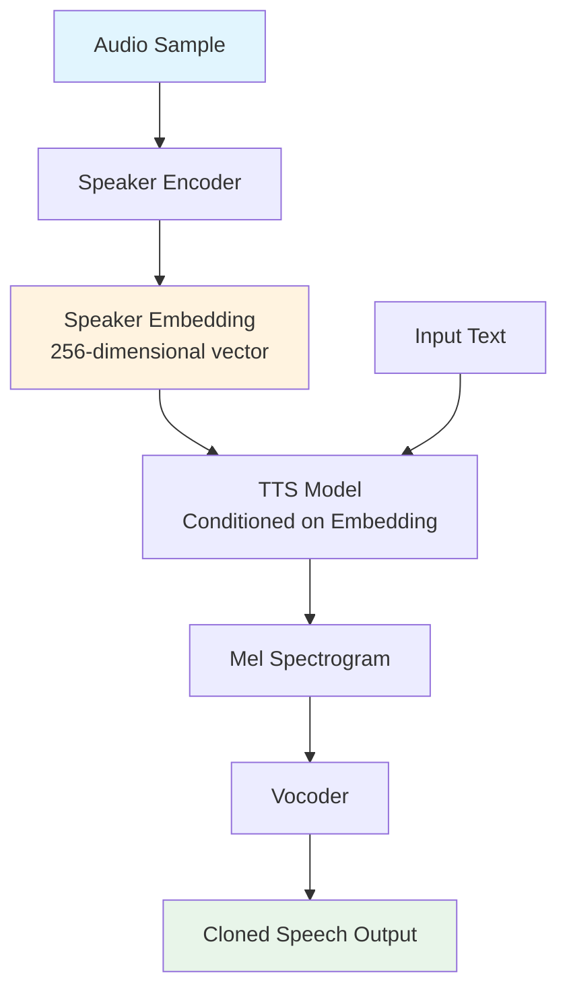
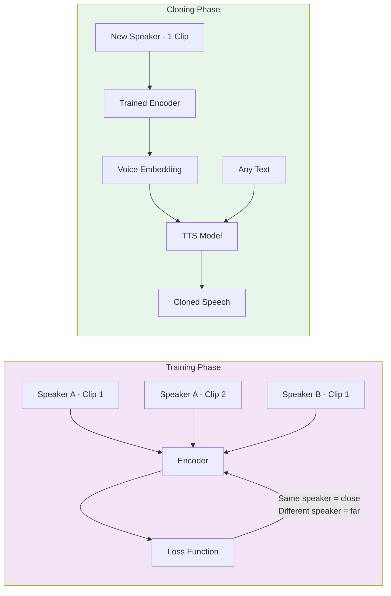
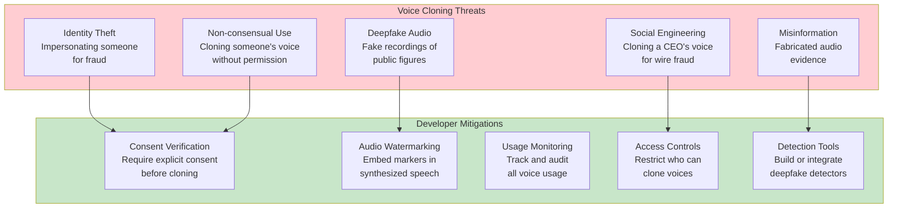

# Voice Agents Deep Dive  Part 6: Voice Cloning and Custom Voices  Making AI Sound Like Anyone

---

**Series:** Building Voice Agents  A Developer's Deep Dive from Audio Fundamentals to Production
**Part:** 6 of 20 (Voice Cloning)
**Audience:** Developers with Python experience who want to build voice-powered AI agents from the ground up
**Reading time:** ~45 minutes

---

## Table of Contents

1. [Recap of Part 5](#recap-of-part-5)
2. [How Voice Cloning Works](#how-voice-cloning-works)
3. [Zero-Shot Cloning](#zero-shot-cloning)
4. [Few-Shot Cloning](#few-shot-cloning)
5. [Voice Design](#voice-design)
6. [Ethical Considerations](#ethical-considerations)
7. [Voice Conversion](#voice-conversion)
8. [Speaker Embeddings Deep Dive](#speaker-embeddings-deep-dive)
9. [Voice Quality Evaluation](#voice-quality-evaluation)
10. [Production Voice Management](#production-voice-management)
11. [Project: Voice Cloning Service](#project-voice-cloning-service)
12. [Vocabulary Cheat Sheet](#vocabulary-cheat-sheet)
13. [What's Next](#whats-next)

---

## Recap of Part 5

In Part 5, we explored **Text-to-Speech (TTS) systems** end to end  from traditional concatenative synthesis through modern neural approaches. We built working pipelines with both cloud APIs (Google Cloud TTS, Amazon Polly, ElevenLabs) and open-source models (Coqui TTS, Piper). We learned how TTS models convert text into mel spectrograms and then into audio waveforms via vocoders, and we implemented SSML markup to control prosody, pitch, and rate.

Now we take the next logical step: instead of using pre-built voices, what if we could **create our own**? What if we could clone a specific person's voice from a short audio sample and make our voice agent sound exactly like them  or design an entirely new voice that has never existed before?

That is the domain of **voice cloning and custom voices**, and it is simultaneously one of the most powerful and most ethically sensitive areas in voice technology.

> **What you will build in this part:** A complete voice cloning service that can extract speaker identities from audio, clone voices using multiple backends, evaluate clone quality, and manage a gallery of custom voices for production use.

---

## How Voice Cloning Works

At its core, voice cloning answers a deceptively simple question: **What makes your voice sound like *you*?**

Every human voice has a unique acoustic signature shaped by the physical structure of the vocal tract, habitual speech patterns, accent, rhythm, and emotional tendencies. Voice cloning systems learn to capture this signature as a mathematical representation  a **speaker embedding**  and then use it to condition a TTS model so that synthesized speech carries that same identity.

### The Voice as a Vector

The fundamental insight behind modern voice cloning is that **a voice can be represented as a point in high-dimensional space**. Two voices that sound similar will be close together in this space; two voices that sound different will be far apart.



### The Three Components

Voice cloning systems consist of three cooperating components:

| Component | Role | Input | Output |
|-----------|------|-------|--------|
| **Speaker Encoder** | Extracts voice identity | Audio waveform | Speaker embedding vector |
| **Synthesizer** | Generates speech features | Text + speaker embedding | Mel spectrogram |
| **Vocoder** | Converts features to audio | Mel spectrogram | Audio waveform |

### Conceptual Pipeline in Code

```python
"""
voice_cloning_concept.py
Conceptual demonstration of how voice cloning works at a high level.
This shows the logical flow  actual implementations follow in later sections.
"""

import numpy as np
from dataclasses import dataclass
from typing import Optional


@dataclass
class SpeakerEmbedding:
    """Represents a voice as a fixed-size vector."""
    vector: np.ndarray          # Typically 256 or 512 dimensions
    source_audio_path: str      # Where the embedding came from
    sample_rate: int = 16000
    embedding_model: str = ""   # Which encoder produced this

    @property
    def dimension(self) -> int:
        return len(self.vector)

    def similarity(self, other: "SpeakerEmbedding") -> float:
        """Cosine similarity between two speaker embeddings."""
        dot_product = np.dot(self.vector, other.vector)
        norm_a = np.linalg.norm(self.vector)
        norm_b = np.linalg.norm(other.vector)
        if norm_a == 0 or norm_b == 0:
            return 0.0
        return float(dot_product / (norm_a * norm_b))


class ConceptualVoiceCloner:
    """
    Demonstrates the logical flow of voice cloning.
    Real implementations use neural networks for each component.
    """

    def __init__(self):
        self.speaker_encoder = None   # Neural network: audio -> embedding
        self.synthesizer = None       # Neural network: text + embedding -> mel
        self.vocoder = None           # Neural network: mel -> waveform

    def extract_voice(self, audio_sample: np.ndarray) -> SpeakerEmbedding:
        """
        Step 1: Extract the speaker's identity from an audio sample.
        The speaker encoder processes the audio and produces a fixed-size
        vector that captures 'what this person sounds like.'
        """
        # In reality: embedding = self.speaker_encoder(audio_sample)
        # The encoder has been trained on thousands of speakers to produce
        # embeddings where same-speaker samples cluster together.
        embedding_vector = np.random.randn(256)  # Placeholder
        embedding_vector = embedding_vector / np.linalg.norm(embedding_vector)
        return SpeakerEmbedding(
            vector=embedding_vector,
            source_audio_path="sample.wav"
        )

    def synthesize(self, text: str, voice: SpeakerEmbedding) -> np.ndarray:
        """
        Step 2: Generate speech that sounds like the target speaker.
        The synthesizer takes text and the speaker embedding as inputs,
        producing a mel spectrogram conditioned on that voice identity.
        """
        # In reality:
        # mel_spectrogram = self.synthesizer(text, voice.vector)
        # waveform = self.vocoder(mel_spectrogram)
        placeholder_audio = np.zeros(16000)  # 1 second of silence
        return placeholder_audio

    def clone_and_speak(self, reference_audio: np.ndarray, text: str) -> np.ndarray:
        """Complete pipeline: reference audio + text -> cloned speech."""
        voice = self.extract_voice(reference_audio)
        return self.synthesize(text, voice)


# Demonstration of the concept
if __name__ == "__main__":
    cloner = ConceptualVoiceCloner()

    # The key insight: voice = embedding_model(audio_sample)
    voice = cloner.extract_voice(np.random.randn(16000 * 5))  # 5s audio

    # speech = tts_model(text, voice_embedding=voice)
    speech = cloner.synthesize("Hello, this is my cloned voice.", voice)

    print(f"Speaker embedding dimension: {voice.dimension}")
    print(f"Generated audio length: {len(speech)} samples")
```

### How Speaker Encoders Learn

The speaker encoder is typically trained with a **metric learning** objective. The training process works as follows:

1. **Gather data**: Collect thousands of audio clips from hundreds or thousands of different speakers
2. **Positive pairs**: Two clips from the same speaker should produce similar embeddings
3. **Negative pairs**: Two clips from different speakers should produce different embeddings
4. **Optimize**: Train the network to maximize similarity for same-speaker pairs and minimize it for different-speaker pairs

This is conceptually identical to how face recognition systems work  replace "face image" with "audio clip" and "person identity" with "speaker identity."

> **Key Insight:** The speaker encoder never needs to see the specific speaker it will clone at test time. It has learned a *general* notion of "voice identity" that transfers to any speaker  even one it has never heard before.



---

## Zero-Shot Cloning

**Zero-shot voice cloning** means cloning a voice from a **single audio sample** without any fine-tuning or additional training. You provide one reference clip, and the system immediately produces speech in that voice.

This is the most accessible form of voice cloning  and the one that has made the technology mainstream.

### ElevenLabs Instant Voice Clone

ElevenLabs provides the most polished commercial API for instant voice cloning. Their system can clone a voice from as little as **30 seconds** of clean audio.

```python
"""
elevenlabs_clone.py
Clone a voice using the ElevenLabs API and generate speech with it.
Requires: pip install elevenlabs
"""

import os
from pathlib import Path
from elevenlabs import ElevenLabs
from elevenlabs.types import VoiceSettings


def clone_voice_elevenlabs(
    audio_path: str,
    voice_name: str,
    description: str = "",
    api_key: str | None = None
) -> str:
    """
    Clone a voice from an audio sample using ElevenLabs.

    Args:
        audio_path: Path to the reference audio file (WAV, MP3, etc.)
        voice_name: Name to assign to the cloned voice
        description: Optional description of the voice
        api_key: ElevenLabs API key (defaults to env var)

    Returns:
        The voice_id of the newly cloned voice
    """
    client = ElevenLabs(api_key=api_key or os.getenv("ELEVENLABS_API_KEY"))

    # Read the audio file
    audio_file = open(audio_path, "rb")

    # Create the cloned voice via the API
    voice = client.clone(
        name=voice_name,
        description=description or f"Cloned voice from {Path(audio_path).name}",
        files=[audio_file],
    )

    audio_file.close()

    print(f"Voice cloned successfully!")
    print(f"  Voice ID: {voice.voice_id}")
    print(f"  Name: {voice.name}")

    return voice.voice_id


def generate_with_cloned_voice(
    text: str,
    voice_id: str,
    output_path: str = "cloned_output.mp3",
    api_key: str | None = None,
    stability: float = 0.5,
    similarity_boost: float = 0.75,
    style: float = 0.0,
) -> str:
    """
    Generate speech using a cloned voice.

    Args:
        text: Text to synthesize
        voice_id: ID of the cloned voice
        output_path: Where to save the audio
        api_key: ElevenLabs API key
        stability: Voice stability (0-1). Lower = more expressive.
        similarity_boost: How closely to match the original voice (0-1).
        style: Style exaggeration (0-1). Higher = more stylistic.

    Returns:
        Path to the generated audio file
    """
    client = ElevenLabs(api_key=api_key or os.getenv("ELEVENLABS_API_KEY"))

    # Generate audio with the cloned voice
    audio_iterator = client.text_to_speech.convert(
        voice_id=voice_id,
        text=text,
        model_id="eleven_multilingual_v2",
        voice_settings=VoiceSettings(
            stability=stability,
            similarity_boost=similarity_boost,
            style=style,
            use_speaker_boost=True,
        ),
    )

    # Write audio chunks to file
    with open(output_path, "wb") as f:
        for chunk in audio_iterator:
            f.write(chunk)

    print(f"Generated audio saved to: {output_path}")
    return output_path


def list_cloned_voices(api_key: str | None = None) -> list[dict]:
    """List all cloned voices in your ElevenLabs account."""
    client = ElevenLabs(api_key=api_key or os.getenv("ELEVENLABS_API_KEY"))

    response = client.voices.get_all()
    cloned_voices = []

    for voice in response.voices:
        if voice.category == "cloned":
            cloned_voices.append({
                "voice_id": voice.voice_id,
                "name": voice.name,
                "description": voice.description,
                "labels": voice.labels,
            })

    return cloned_voices


# --- Usage Example ---
if __name__ == "__main__":
    # Step 1: Clone a voice from a sample
    voice_id = clone_voice_elevenlabs(
        audio_path="reference_audio.wav",
        voice_name="My Custom Voice",
        description="Professional narrator voice, warm and clear"
    )

    # Step 2: Generate speech with the cloned voice
    generate_with_cloned_voice(
        text=(
            "Welcome to the voice cloning tutorial. "
            "This speech is generated using a clone of the reference voice. "
            "Notice how it captures the tone and characteristics of the original."
        ),
        voice_id=voice_id,
        output_path="cloned_speech.mp3",
        stability=0.5,
        similarity_boost=0.8,
    )

    # Step 3: List all cloned voices
    voices = list_cloned_voices()
    print(f"\nYou have {len(voices)} cloned voice(s):")
    for v in voices:
        print(f"  - {v['name']} ({v['voice_id']})")
```

### XTTS v2 (Open-Source)

**XTTS v2** by Coqui is the leading open-source voice cloning model. It supports **17 languages** and can clone a voice from a single reference clip of just a few seconds.

```python
"""
xtts_clone.py
Voice cloning with XTTS v2 (open-source).
Requires: pip install TTS torch torchaudio
"""

import os
import torch
import torchaudio
import numpy as np
from pathlib import Path
from TTS.api import TTS
from TTS.tts.configs.xtts_config import XttsConfig
from TTS.tts.models.xtts import Xtts


def clone_with_xtts_simple(
    text: str,
    speaker_wav: str,
    language: str = "en",
    output_path: str = "xtts_output.wav",
) -> str:
    """
    Simple zero-shot cloning with XTTS v2 using the high-level API.

    Args:
        text: Text to synthesize
        speaker_wav: Path to reference audio for voice cloning
        language: Language code (en, es, fr, de, it, pt, pl, tr, ru, etc.)
        output_path: Where to save the output

    Returns:
        Path to generated audio file
    """
    # Initialize XTTS v2  downloads model on first run (~1.8 GB)
    tts = TTS("tts_models/multilingual/multi-dataset/xtts_v2")

    # Move to GPU if available
    device = "cuda" if torch.cuda.is_available() else "cpu"
    tts = tts.to(device)

    # Generate cloned speech
    tts.tts_to_file(
        text=text,
        speaker_wav=speaker_wav,
        language=language,
        file_path=output_path,
    )

    print(f"XTTS output saved to: {output_path}")
    return output_path


def clone_with_xtts_advanced(
    text: str,
    speaker_wav: str,
    language: str = "en",
    output_path: str = "xtts_advanced_output.wav",
    temperature: float = 0.7,
    repetition_penalty: float = 5.0,
    top_k: int = 50,
    top_p: float = 0.85,
) -> dict:
    """
    Advanced XTTS v2 cloning with full parameter control.

    Returns dict with audio path and metadata.
    """
    # Load model with explicit config for fine-grained control
    config = XttsConfig()
    config.load_json(
        os.path.join(
            Path.home(),
            ".local/share/tts/tts_models--multilingual--multi-dataset--xtts_v2",
            "config.json"
        )
    )

    model = Xtts.init_from_config(config)
    model.load_checkpoint(
        config,
        checkpoint_dir=os.path.join(
            Path.home(),
            ".local/share/tts/tts_models--multilingual--multi-dataset--xtts_v2"
        ),
    )

    device = "cuda" if torch.cuda.is_available() else "cpu"
    model = model.to(device)

    # Compute speaker latents (the voice embedding)
    gpt_cond_latent, speaker_embedding = model.get_conditioning_latents(
        audio_path=[speaker_wav]
    )

    # Generate speech with full control over generation parameters
    output = model.inference(
        text=text,
        language=language,
        gpt_cond_latent=gpt_cond_latent,
        speaker_embedding=speaker_embedding,
        temperature=temperature,
        repetition_penalty=repetition_penalty,
        top_k=top_k,
        top_p=top_p,
        enable_text_splitting=True,
    )

    # Save the output
    waveform = torch.tensor(output["wav"]).unsqueeze(0)
    torchaudio.save(output_path, waveform, 24000)

    return {
        "audio_path": output_path,
        "sample_rate": 24000,
        "duration_seconds": len(output["wav"]) / 24000,
        "embedding_shape": speaker_embedding.shape,
        "latent_shape": gpt_cond_latent.shape,
    }


def batch_clone_xtts(
    texts: list[str],
    speaker_wav: str,
    language: str = "en",
    output_dir: str = "xtts_batch_output",
) -> list[str]:
    """
    Generate multiple utterances with the same cloned voice.
    Efficient because we compute the speaker embedding only once.
    """
    os.makedirs(output_dir, exist_ok=True)

    tts = TTS("tts_models/multilingual/multi-dataset/xtts_v2")
    device = "cuda" if torch.cuda.is_available() else "cpu"
    tts = tts.to(device)

    output_paths = []
    for i, text in enumerate(texts):
        output_path = os.path.join(output_dir, f"utterance_{i:03d}.wav")
        tts.tts_to_file(
            text=text,
            speaker_wav=speaker_wav,
            language=language,
            file_path=output_path,
        )
        output_paths.append(output_path)
        print(f"  Generated [{i+1}/{len(texts)}]: {output_path}")

    return output_paths


# --- Usage ---
if __name__ == "__main__":
    # Simple usage
    clone_with_xtts_simple(
        text="Hello, this is a demonstration of open-source voice cloning.",
        speaker_wav="reference_speaker.wav",
        language="en",
        output_path="simple_clone.wav",
    )

    # Advanced usage with parameter control
    result = clone_with_xtts_advanced(
        text="This uses advanced settings for higher quality output.",
        speaker_wav="reference_speaker.wav",
        temperature=0.65,
        top_p=0.8,
    )
    print(f"Duration: {result['duration_seconds']:.2f}s")
    print(f"Embedding shape: {result['embedding_shape']}")

    # Batch generation
    sentences = [
        "Welcome to our service.",
        "Your order has been confirmed.",
        "Thank you for calling. How can I help you today?",
        "Let me transfer you to the right department.",
    ]
    paths = batch_clone_xtts(sentences, "reference_speaker.wav")
    print(f"Generated {len(paths)} utterances")
```

### OpenVoice: Tone Color Cloning

**OpenVoice** takes a different approach: instead of end-to-end cloning, it separates voice cloning into **tone color transfer**. It first generates speech with a base TTS model, then converts the tone color to match a reference speaker.

```python
"""
openvoice_clone.py
Voice cloning with OpenVoice  tone color cloning approach.
Requires: pip install openvoice-cli  (or clone the OpenVoice repo)
"""

import os
import torch
import numpy as np
from pathlib import Path


class OpenVoiceCloner:
    """
    OpenVoice separates voice cloning into two stages:
    1. Base TTS: Generate speech with correct content and style
    2. Tone Color Converter: Transfer the voice identity
    """

    def __init__(self, device: str | None = None):
        self.device = device or ("cuda" if torch.cuda.is_available() else "cpu")
        self.base_speaker_model = None
        self.tone_color_converter = None

    def load_models(self, checkpoint_dir: str):
        """Load the base speaker and tone color converter models."""
        # In practice, you would load from the OpenVoice checkpoints:
        # from openvoice.api import BaseSpeakerTTS, ToneColorConverter
        #
        # self.base_speaker_model = BaseSpeakerTTS(
        #     config_path=f"{checkpoint_dir}/base/config.json",
        #     device=self.device
        # )
        # self.base_speaker_model.load_ckpt(f"{checkpoint_dir}/base/checkpoint.pth")
        #
        # self.tone_color_converter = ToneColorConverter(
        #     config_path=f"{checkpoint_dir}/converter/config.json",
        #     device=self.device
        # )
        # self.tone_color_converter.load_ckpt(f"{checkpoint_dir}/converter/checkpoint.pth")
        print(f"Models loaded on {self.device}")

    def clone(
        self,
        text: str,
        reference_audio: str,
        output_path: str,
        language: str = "English",
        speed: float = 1.0,
    ) -> str:
        """
        Two-stage voice cloning:
        1. Generate base speech with correct content
        2. Transfer tone color from reference to match target voice
        """
        base_output = output_path.replace(".wav", "_base.wav")

        # Stage 1: Generate base speech
        # self.base_speaker_model.tts(
        #     text=text,
        #     output_path=base_output,
        #     speaker="default",
        #     language=language,
        #     speed=speed,
        # )

        # Stage 2: Extract tone color from reference and apply it
        # source_se = self.tone_color_converter.extract_se(base_output)
        # target_se = self.tone_color_converter.extract_se(reference_audio)
        #
        # self.tone_color_converter.convert(
        #     audio_src_path=base_output,
        #     src_se=source_se,
        #     tgt_se=target_se,
        #     output_path=output_path,
        # )

        print(f"OpenVoice clone saved to: {output_path}")
        return output_path


# --- Usage ---
if __name__ == "__main__":
    cloner = OpenVoiceCloner()
    cloner.load_models("checkpoints/openvoice")

    cloner.clone(
        text="OpenVoice separates content from voice identity.",
        reference_audio="target_speaker.wav",
        output_path="openvoice_output.wav",
        language="English",
    )
```

### Zero-Shot Cloning Comparison

| Feature | ElevenLabs | XTTS v2 | OpenVoice |
|---------|-----------|---------|-----------|
| **Type** | Cloud API | Open-source | Open-source |
| **Min. Reference Audio** | ~30 seconds | ~6 seconds | ~10 seconds |
| **Languages** | 29+ | 17 | 4 (EN, ZH, JA, KO) |
| **Quality (MOS)** | ~4.2/5 | ~3.8/5 | ~3.5/5 |
| **Latency** | ~1-3s (API) | ~2-5s (local GPU) | ~1-3s (local GPU) |
| **Cost** | $0.30/1K chars | Free | Free |
| **Privacy** | Audio sent to cloud | Fully local | Fully local |
| **Fine-tuning** | Professional Voice Clone tier | Supported | Limited |
| **Commercial Use** | Yes (paid plans) | CPML license | MIT license |
| **Streaming** | Yes | Limited | No |

> **Practical Advice:** Start with ElevenLabs for rapid prototyping  the quality is best-in-class and the API is clean. Move to XTTS v2 when you need local processing, cost efficiency at scale, or data privacy. Use OpenVoice when you need a permissive MIT license and the two-stage approach fits your architecture.

---

## Few-Shot Cloning

While zero-shot cloning works from a single sample, **few-shot cloning** uses **several minutes** of audio to produce significantly higher quality results. The idea is to fine-tune a pre-trained model on your target speaker's data.

### When to Use Few-Shot vs. Zero-Shot

| Scenario | Recommended Approach |
|----------|---------------------|
| Quick prototype, testing | Zero-shot |
| Customer-facing product voice | Few-shot |
| Brand voice / mascot | Few-shot (or professional recording) |
| User-uploaded voice in app | Zero-shot |
| Audiobook narration | Few-shot |
| Real-time voice agent | Zero-shot (lower latency) |

### Preparing Training Data

The quality of your few-shot clone depends heavily on the **quality of your training data**:

```python
"""
fewshot_data_prep.py
Prepare audio data for few-shot voice cloning fine-tuning.
"""

import os
import json
import wave
import numpy as np
from pathlib import Path
from dataclasses import dataclass, field


@dataclass
class AudioSegment:
    """A single training sample: audio file + transcript."""
    audio_path: str
    transcript: str
    duration_seconds: float = 0.0
    sample_rate: int = 22050


@dataclass
class FewShotDataset:
    """Collection of audio segments for fine-tuning."""
    speaker_name: str
    segments: list[AudioSegment] = field(default_factory=list)
    language: str = "en"

    @property
    def total_duration_minutes(self) -> float:
        return sum(s.duration_seconds for s in self.segments) / 60.0

    @property
    def num_segments(self) -> int:
        return len(self.segments)


def get_audio_duration(audio_path: str) -> float:
    """Get duration of a WAV file in seconds."""
    with wave.open(audio_path, "r") as wf:
        frames = wf.getnframes()
        rate = wf.getframerate()
        return frames / float(rate)


def validate_audio_quality(audio_path: str) -> dict:
    """
    Check if an audio file meets quality requirements for fine-tuning.

    Requirements:
    - Sample rate >= 22050 Hz
    - Duration between 2-15 seconds per segment
    - Mono channel preferred
    - Low background noise
    """
    issues = []

    with wave.open(audio_path, "r") as wf:
        sample_rate = wf.getframerate()
        channels = wf.getnchannels()
        duration = wf.getnframes() / float(sample_rate)
        sample_width = wf.getsampwidth()

        # Read audio data for noise analysis
        raw_data = wf.readframes(wf.getnframes())
        audio_array = np.frombuffer(raw_data, dtype=np.int16).astype(np.float32)

    # Check sample rate
    if sample_rate < 22050:
        issues.append(f"Sample rate {sample_rate}Hz is below 22050Hz minimum")

    # Check duration
    if duration < 2.0:
        issues.append(f"Duration {duration:.1f}s is too short (min 2s)")
    if duration > 15.0:
        issues.append(f"Duration {duration:.1f}s is too long (max 15s)")

    # Check channels
    if channels > 1:
        issues.append(f"Audio has {channels} channels; mono preferred")

    # Estimate SNR (very simplified)
    rms = np.sqrt(np.mean(audio_array**2))
    silence_threshold = 0.01 * np.max(np.abs(audio_array))
    silent_samples = audio_array[np.abs(audio_array) < silence_threshold]
    noise_rms = np.sqrt(np.mean(silent_samples**2)) if len(silent_samples) > 0 else 0

    if noise_rms > 0:
        snr_estimate = 20 * np.log10(rms / noise_rms)
    else:
        snr_estimate = float("inf")

    if snr_estimate < 20:
        issues.append(f"Estimated SNR {snr_estimate:.1f}dB is low (target >20dB)")

    return {
        "valid": len(issues) == 0,
        "issues": issues,
        "sample_rate": sample_rate,
        "channels": channels,
        "duration": duration,
        "snr_estimate": snr_estimate,
    }


def prepare_dataset(
    audio_dir: str,
    transcript_file: str,
    output_dir: str,
    speaker_name: str = "target_speaker",
) -> FewShotDataset:
    """
    Prepare a dataset for few-shot fine-tuning.

    Expected transcript_file format (JSON):
    {
        "segments": [
            {"file": "audio_001.wav", "text": "Hello, how are you?"},
            {"file": "audio_002.wav", "text": "The weather is nice today."},
            ...
        ]
    }
    """
    os.makedirs(output_dir, exist_ok=True)

    # Load transcripts
    with open(transcript_file, "r", encoding="utf-8") as f:
        transcript_data = json.load(f)

    dataset = FewShotDataset(speaker_name=speaker_name)
    valid_count = 0
    skipped_count = 0

    for entry in transcript_data["segments"]:
        audio_path = os.path.join(audio_dir, entry["file"])

        if not os.path.exists(audio_path):
            print(f"  SKIP: {entry['file']} not found")
            skipped_count += 1
            continue

        # Validate audio quality
        quality = validate_audio_quality(audio_path)

        if not quality["valid"]:
            print(f"  SKIP: {entry['file']}  {'; '.join(quality['issues'])}")
            skipped_count += 1
            continue

        segment = AudioSegment(
            audio_path=audio_path,
            transcript=entry["text"],
            duration_seconds=quality["duration"],
        )
        dataset.segments.append(segment)
        valid_count += 1

    # Save metadata
    metadata = {
        "speaker_name": speaker_name,
        "num_segments": valid_count,
        "total_duration_minutes": dataset.total_duration_minutes,
        "segments": [
            {"audio": s.audio_path, "text": s.transcript, "duration": s.duration_seconds}
            for s in dataset.segments
        ],
    }

    metadata_path = os.path.join(output_dir, "metadata.json")
    with open(metadata_path, "w", encoding="utf-8") as f:
        json.dump(metadata, f, indent=2)

    print(f"\nDataset prepared:")
    print(f"  Valid segments: {valid_count}")
    print(f"  Skipped segments: {skipped_count}")
    print(f"  Total duration: {dataset.total_duration_minutes:.1f} minutes")
    print(f"  Metadata saved to: {metadata_path}")

    return dataset


# --- Usage ---
if __name__ == "__main__":
    dataset = prepare_dataset(
        audio_dir="raw_audio/speaker_john/",
        transcript_file="raw_audio/speaker_john/transcripts.json",
        output_dir="prepared_data/speaker_john/",
        speaker_name="John",
    )

    print(f"\nDataset summary:")
    print(f"  Speaker: {dataset.speaker_name}")
    print(f"  Segments: {dataset.num_segments}")
    print(f"  Duration: {dataset.total_duration_minutes:.1f} minutes")
```

### Fine-Tuning XTTS v2

```python
"""
finetune_xtts.py
Fine-tune XTTS v2 on a specific speaker's voice data.
Requires: pip install TTS torch
"""

import os
import json
import torch
from pathlib import Path
from TTS.tts.configs.xtts_config import XttsConfig
from TTS.tts.models.xtts import Xtts


def create_training_config(
    dataset_dir: str,
    output_dir: str,
    num_epochs: int = 50,
    batch_size: int = 4,
    learning_rate: float = 5e-6,
    max_audio_length: int = 255995,  # ~11.6 seconds at 22050Hz
) -> dict:
    """
    Create training configuration for XTTS fine-tuning.

    For few-shot cloning, we fine-tune only the GPT decoder
    while keeping the speaker encoder frozen.
    """
    config = {
        "output_path": output_dir,
        "dataset_path": dataset_dir,
        "model": "xtts_v2",
        "training": {
            "num_epochs": num_epochs,
            "batch_size": batch_size,
            "learning_rate": learning_rate,
            "weight_decay": 1e-2,
            "lr_scheduler": "cosine",
            "warmup_steps": 100,
            "gradient_clip": 1.0,
            "max_audio_length": max_audio_length,
            "freeze_encoder": True,   # Keep speaker encoder frozen
            "freeze_vocoder": True,   # Keep vocoder frozen
            "train_gpt_only": True,   # Fine-tune only the GPT decoder
        },
        "evaluation": {
            "eval_interval": 500,
            "num_eval_samples": 5,
        },
        "checkpointing": {
            "save_interval": 1000,
            "keep_last_n": 3,
        },
    }

    os.makedirs(output_dir, exist_ok=True)
    config_path = os.path.join(output_dir, "finetune_config.json")
    with open(config_path, "w") as f:
        json.dump(config, f, indent=2)

    print(f"Training config saved to: {config_path}")
    return config


def finetune_xtts(
    base_model_path: str,
    dataset_metadata_path: str,
    output_dir: str,
    num_epochs: int = 50,
    batch_size: int = 4,
    learning_rate: float = 5e-6,
):
    """
    Fine-tune XTTS v2 on a speaker dataset.

    This fine-tunes the GPT-2 based decoder while keeping the speaker
    encoder and vocoder frozen  achieving personalization with minimal
    compute and data.

    Args:
        base_model_path: Path to pre-trained XTTS v2 checkpoint
        dataset_metadata_path: Path to metadata.json from prepare_dataset()
        output_dir: Where to save fine-tuned model
        num_epochs: Training epochs (50-200 for few-shot)
        batch_size: Training batch size
        learning_rate: Learning rate (5e-6 to 1e-5 typical)
    """
    os.makedirs(output_dir, exist_ok=True)

    # Load metadata
    with open(dataset_metadata_path, "r") as f:
        metadata = json.load(f)

    print(f"Fine-tuning XTTS v2")
    print(f"  Speaker: {metadata['speaker_name']}")
    print(f"  Training samples: {metadata['num_segments']}")
    print(f"  Audio duration: {metadata['total_duration_minutes']:.1f} minutes")
    print(f"  Epochs: {num_epochs}")
    print(f"  Learning rate: {learning_rate}")

    # In practice, you would use the Coqui TTS trainer:
    #
    # from TTS.tts.datasets import load_tts_samples
    # from TTS.config.shared_configs import BaseDatasetConfig
    # from trainer import Trainer, TrainerArgs
    #
    # dataset_config = BaseDatasetConfig(
    #     formatter="custom",
    #     meta_file_train=dataset_metadata_path,
    #     path=os.path.dirname(dataset_metadata_path),
    #     language="en",
    # )
    #
    # config = XttsConfig()
    # config.load_json(os.path.join(base_model_path, "config.json"))
    # config.batch_size = batch_size
    # config.num_epochs = num_epochs
    # config.lr = learning_rate
    # config.output_path = output_dir
    #
    # model = Xtts.init_from_config(config)
    # model.load_checkpoint(config, checkpoint_dir=base_model_path)
    #
    # # Freeze encoder and vocoder
    # for param in model.hifigan_decoder.parameters():
    #     param.requires_grad = False
    # for param in model.speaker_encoder.parameters():
    #     param.requires_grad = False
    #
    # trainer = Trainer(
    #     TrainerArgs(restore_path=None),
    #     config, output_path=output_dir,
    #     model=model,
    #     train_samples=load_tts_samples(dataset_config),
    # )
    # trainer.fit()

    print(f"\nFine-tuning complete. Model saved to: {output_dir}")


def evaluate_finetuned_model(
    model_path: str,
    test_texts: list[str],
    reference_audio: str,
    output_dir: str,
) -> dict:
    """
    Evaluate the fine-tuned model by generating test utterances
    and comparing against the reference speaker.
    """
    os.makedirs(output_dir, exist_ok=True)

    # Load fine-tuned model
    config = XttsConfig()
    config.load_json(os.path.join(model_path, "config.json"))
    model = Xtts.init_from_config(config)
    model.load_checkpoint(config, checkpoint_dir=model_path)

    device = "cuda" if torch.cuda.is_available() else "cpu"
    model = model.to(device)

    # Get speaker conditioning from reference
    gpt_cond_latent, speaker_embedding = model.get_conditioning_latents(
        audio_path=[reference_audio]
    )

    results = []
    for i, text in enumerate(test_texts):
        output_path = os.path.join(output_dir, f"eval_{i:03d}.wav")

        output = model.inference(
            text=text,
            language="en",
            gpt_cond_latent=gpt_cond_latent,
            speaker_embedding=speaker_embedding,
        )

        import torchaudio
        waveform = torch.tensor(output["wav"]).unsqueeze(0)
        torchaudio.save(output_path, waveform, 24000)

        results.append({
            "text": text,
            "audio_path": output_path,
            "duration": len(output["wav"]) / 24000,
        })

    print(f"Generated {len(results)} evaluation samples in: {output_dir}")
    return {"samples": results, "model_path": model_path}


# --- Usage ---
if __name__ == "__main__":
    # Step 1: Create training config
    create_training_config(
        dataset_dir="prepared_data/speaker_john/",
        output_dir="finetuned_models/john_v1/",
        num_epochs=100,
        learning_rate=5e-6,
    )

    # Step 2: Fine-tune
    finetune_xtts(
        base_model_path="models/xtts_v2/",
        dataset_metadata_path="prepared_data/speaker_john/metadata.json",
        output_dir="finetuned_models/john_v1/",
        num_epochs=100,
    )

    # Step 3: Evaluate
    test_sentences = [
        "The quick brown fox jumps over the lazy dog.",
        "How much wood would a woodchuck chuck?",
        "She sells seashells by the seashore.",
        "To be or not to be, that is the question.",
    ]
    evaluate_finetuned_model(
        model_path="finetuned_models/john_v1/",
        test_texts=test_sentences,
        reference_audio="reference_speaker.wav",
        output_dir="evaluation_output/",
    )
```

> **Key Insight:** Few-shot fine-tuning typically improves voice similarity by 15-25% compared to zero-shot cloning, but requires 3-10 minutes of clean, transcribed audio. The sweet spot is usually around **5 minutes** of audio with **50-100 short utterances**.

---

## Voice Design

What if you do not want to clone an existing voice, but instead want to **create an entirely new voice** that has never existed? This is **voice design**  specifying desired voice characteristics and having the system generate a matching voice from scratch.

### ElevenLabs Voice Design API

ElevenLabs offers a Voice Design feature (also called "Voice Generation") that lets you describe a voice and receive a unique synthetic identity.

```python
"""
voice_design.py
Create new synthetic voices using the ElevenLabs Voice Design API.
Requires: pip install elevenlabs requests
"""

import os
import json
import requests
from typing import Optional


class VoiceDesigner:
    """Create new voices by specifying characteristics."""

    BASE_URL = "https://api.elevenlabs.io/v1"

    def __init__(self, api_key: str | None = None):
        self.api_key = api_key or os.getenv("ELEVENLABS_API_KEY")
        self.headers = {
            "xi-api-key": self.api_key,
            "Content-Type": "application/json",
        }

    def generate_voice(
        self,
        gender: str,
        age: str,
        accent: str,
        accent_strength: float = 1.0,
        text: str = "Hello! This is a preview of my voice.",
    ) -> dict:
        """
        Generate a new voice with specified characteristics.

        Args:
            gender: "male" or "female"
            age: "young", "middle_aged", or "old"
            accent: "american", "british", "australian", "indian", etc.
            accent_strength: Strength of accent (0.3 to 2.0)
            text: Preview text to generate with the new voice

        Returns:
            Dict with voice preview audio and generation ID
        """
        payload = {
            "gender": gender,
            "age": age,
            "accent": accent,
            "accent_strength": accent_strength,
            "text": text,
        }

        response = requests.post(
            f"{self.BASE_URL}/voice-generation/generate-voice",
            headers=self.headers,
            json=payload,
        )
        response.raise_for_status()

        # The response contains audio bytes and a generated_voice_id header
        generated_voice_id = response.headers.get("generated_voice_id", "")

        return {
            "generated_voice_id": generated_voice_id,
            "audio_bytes": response.content,
            "parameters": payload,
        }

    def save_designed_voice(
        self,
        generated_voice_id: str,
        voice_name: str,
        voice_description: str = "",
        labels: dict | None = None,
    ) -> dict:
        """
        Save a generated voice to your library for reuse.

        Args:
            generated_voice_id: ID from generate_voice()
            voice_name: Name for the saved voice
            voice_description: Description of the voice
            labels: Optional labels (e.g., {"use_case": "customer_support"})

        Returns:
            Dict with saved voice details
        """
        payload = {
            "voice_name": voice_name,
            "voice_description": voice_description,
            "generated_voice_id": generated_voice_id,
            "labels": labels or {},
        }

        response = requests.post(
            f"{self.BASE_URL}/voice-generation/create-voice",
            headers=self.headers,
            json=payload,
        )
        response.raise_for_status()

        return response.json()

    def design_voice_lineup(
        self,
        specifications: list[dict],
        preview_text: str = "Hello, how can I help you today?",
    ) -> list[dict]:
        """
        Generate multiple voice options matching different specifications.
        Useful for A/B testing or creating a cast of characters.

        Args:
            specifications: List of dicts with gender, age, accent keys
            preview_text: Text to use for all previews

        Returns:
            List of generated voice previews
        """
        results = []

        for i, spec in enumerate(specifications):
            print(f"Generating voice {i+1}/{len(specifications)}: "
                  f"{spec['gender']}, {spec['age']}, {spec['accent']}")

            result = self.generate_voice(
                gender=spec["gender"],
                age=spec["age"],
                accent=spec["accent"],
                accent_strength=spec.get("accent_strength", 1.0),
                text=preview_text,
            )

            # Save preview audio
            preview_path = f"voice_preview_{i:02d}.mp3"
            with open(preview_path, "wb") as f:
                f.write(result["audio_bytes"])

            result["preview_path"] = preview_path
            result["specification"] = spec
            results.append(result)

        return results


# --- Usage ---
if __name__ == "__main__":
    designer = VoiceDesigner()

    # Design a single voice
    preview = designer.generate_voice(
        gender="female",
        age="middle_aged",
        accent="british",
        accent_strength=1.2,
        text="Good morning! Welcome to our service. How may I assist you?",
    )

    # Save preview audio
    with open("british_female_preview.mp3", "wb") as f:
        f.write(preview["audio_bytes"])

    # Save to library if satisfied
    saved = designer.save_designed_voice(
        generated_voice_id=preview["generated_voice_id"],
        voice_name="British Support Agent",
        voice_description="Professional British female voice, middle-aged, warm tone",
        labels={"use_case": "customer_support", "brand": "acme_corp"},
    )
    print(f"Voice saved: {saved}")

    # Design a lineup for A/B testing
    lineup_specs = [
        {"gender": "female", "age": "young", "accent": "american"},
        {"gender": "female", "age": "middle_aged", "accent": "british"},
        {"gender": "male", "age": "middle_aged", "accent": "american"},
        {"gender": "male", "age": "young", "accent": "australian"},
    ]

    lineup = designer.design_voice_lineup(
        specifications=lineup_specs,
        preview_text="Thank you for calling. I would be happy to help you with that.",
    )
    print(f"\nGenerated {len(lineup)} voice options for A/B testing")
```

---

## Ethical Considerations

Voice cloning is one of the most ethically fraught areas in AI. The ability to make anyone's voice say anything carries enormous potential for harm. As developers building voice agents, we have a **responsibility** to implement safeguards.

### The Threat Landscape



### Legal Landscape

The legal framework around voice cloning is evolving rapidly:

| Jurisdiction | Key Regulation | Requirements |
|-------------|---------------|--------------|
| **EU** | AI Act (2024) | Synthetic audio must be labeled; deepfakes require disclosure |
| **US - Federal** | No comprehensive law yet | FTC Act applies to deceptive practices |
| **US - California** | AB 602, AB 730 | Prohibits deepfakes in elections and non-consensual intimate content |
| **US - Tennessee** | ELVIS Act (2024) | Protects voice as personal right; AI voice cloning requires consent |
| **US - New York** | Right of Publicity laws | Voice is protected as aspect of personality |
| **China** | Deep Synthesis Provisions (2023) | Requires consent, labeling, and traceability |
| **UK** | Online Safety Act | Platforms liable for deepfake distribution |

### Consent Framework Implementation

```python
"""
consent_framework.py
Implement a consent verification system for voice cloning.
"""

import os
import json
import hashlib
import hmac
from datetime import datetime, timedelta, timezone
from dataclasses import dataclass, asdict
from enum import Enum
from typing import Optional


class ConsentStatus(Enum):
    PENDING = "pending"
    GRANTED = "granted"
    DENIED = "denied"
    REVOKED = "revoked"
    EXPIRED = "expired"


class ConsentScope(Enum):
    """What the cloned voice can be used for."""
    PERSONAL_USE = "personal_use"              # Only the consenting user
    INTERNAL_BUSINESS = "internal_business"    # Within the organization
    COMMERCIAL = "commercial"                  # Public-facing products
    RESEARCH = "research"                      # Research purposes only
    UNLIMITED = "unlimited"                    # No restrictions


@dataclass
class VoiceConsentRecord:
    """Record of consent for voice cloning."""
    consent_id: str
    subject_name: str                  # Person whose voice is being cloned
    subject_email: str
    requester_name: str                # Person/org requesting the clone
    requester_organization: str
    scope: ConsentScope
    purpose_description: str           # Free-text description of intended use
    consent_status: ConsentStatus
    granted_at: Optional[str] = None
    expires_at: Optional[str] = None
    audio_sample_hash: str = ""        # Hash of the original audio
    ip_address: str = ""               # IP from which consent was given
    verification_method: str = ""      # How identity was verified
    revocation_reason: str = ""


class VoiceConsentManager:
    """
    Manages consent records for voice cloning operations.
    Ensures all cloning activities are authorized and auditable.
    """

    def __init__(self, storage_path: str = "consent_records"):
        self.storage_path = storage_path
        os.makedirs(storage_path, exist_ok=True)

    def _generate_consent_id(self, subject_email: str, requester: str) -> str:
        """Generate a unique consent ID."""
        raw = f"{subject_email}:{requester}:{datetime.now(timezone.utc).isoformat()}"
        return hashlib.sha256(raw.encode()).hexdigest()[:16]

    def _hash_audio(self, audio_path: str) -> str:
        """Create a hash of the audio file for integrity verification."""
        sha256 = hashlib.sha256()
        with open(audio_path, "rb") as f:
            for chunk in iter(lambda: f.read(8192), b""):
                sha256.update(chunk)
        return sha256.hexdigest()

    def request_consent(
        self,
        subject_name: str,
        subject_email: str,
        requester_name: str,
        requester_organization: str,
        scope: ConsentScope,
        purpose: str,
        audio_path: str,
        expiry_days: int = 365,
    ) -> VoiceConsentRecord:
        """
        Create a consent request for voice cloning.

        In production, this would trigger an email/notification to the
        subject with a verification link.
        """
        consent_id = self._generate_consent_id(subject_email, requester_name)

        record = VoiceConsentRecord(
            consent_id=consent_id,
            subject_name=subject_name,
            subject_email=subject_email,
            requester_name=requester_name,
            requester_organization=requester_organization,
            scope=scope,
            purpose_description=purpose,
            consent_status=ConsentStatus.PENDING,
            audio_sample_hash=self._hash_audio(audio_path),
        )

        self._save_record(record)
        print(f"Consent request created: {consent_id}")
        print(f"  Subject: {subject_name} ({subject_email})")
        print(f"  Scope: {scope.value}")
        print(f"  Status: PENDING  awaiting subject verification")

        return record

    def grant_consent(
        self,
        consent_id: str,
        ip_address: str = "",
        verification_method: str = "email_verification",
        expiry_days: int = 365,
    ) -> VoiceConsentRecord:
        """Mark consent as granted after subject verification."""
        record = self._load_record(consent_id)

        if record.consent_status != ConsentStatus.PENDING:
            raise ValueError(
                f"Cannot grant consent in status: {record.consent_status.value}"
            )

        now = datetime.now(timezone.utc)
        record.consent_status = ConsentStatus.GRANTED
        record.granted_at = now.isoformat()
        record.expires_at = (now + timedelta(days=expiry_days)).isoformat()
        record.ip_address = ip_address
        record.verification_method = verification_method

        self._save_record(record)
        print(f"Consent GRANTED for {consent_id}")
        return record

    def revoke_consent(self, consent_id: str, reason: str = "") -> VoiceConsentRecord:
        """Revoke previously granted consent."""
        record = self._load_record(consent_id)
        record.consent_status = ConsentStatus.REVOKED
        record.revocation_reason = reason
        self._save_record(record)
        print(f"Consent REVOKED for {consent_id}: {reason}")
        return record

    def verify_consent(self, consent_id: str, audio_path: str) -> bool:
        """
        Verify that valid consent exists for a voice cloning operation.

        Checks:
        1. Consent record exists
        2. Status is GRANTED
        3. Not expired
        4. Audio hash matches (same source audio)
        """
        try:
            record = self._load_record(consent_id)
        except FileNotFoundError:
            print(f"DENIED: No consent record found for {consent_id}")
            return False

        # Check status
        if record.consent_status != ConsentStatus.GRANTED:
            print(f"DENIED: Consent status is {record.consent_status.value}")
            return False

        # Check expiry
        if record.expires_at:
            expiry = datetime.fromisoformat(record.expires_at)
            if datetime.now(timezone.utc) > expiry:
                record.consent_status = ConsentStatus.EXPIRED
                self._save_record(record)
                print(f"DENIED: Consent expired on {record.expires_at}")
                return False

        # Verify audio integrity
        current_hash = self._hash_audio(audio_path)
        if current_hash != record.audio_sample_hash:
            print(f"WARNING: Audio hash mismatch  different audio than consented")
            return False

        print(f"VERIFIED: Valid consent for {consent_id}")
        return True

    def _save_record(self, record: VoiceConsentRecord):
        """Persist consent record to storage."""
        path = os.path.join(self.storage_path, f"{record.consent_id}.json")
        data = asdict(record)
        data["scope"] = record.scope.value
        data["consent_status"] = record.consent_status.value
        with open(path, "w") as f:
            json.dump(data, f, indent=2)

    def _load_record(self, consent_id: str) -> VoiceConsentRecord:
        """Load consent record from storage."""
        path = os.path.join(self.storage_path, f"{consent_id}.json")
        with open(path, "r") as f:
            data = json.load(f)
        data["scope"] = ConsentScope(data["scope"])
        data["consent_status"] = ConsentStatus(data["consent_status"])
        return VoiceConsentRecord(**data)


# --- Usage ---
if __name__ == "__main__":
    manager = VoiceConsentManager()

    # Step 1: Request consent
    record = manager.request_consent(
        subject_name="Jane Smith",
        subject_email="jane@example.com",
        requester_name="Acme Corp Voice Team",
        requester_organization="Acme Corporation",
        scope=ConsentScope.COMMERCIAL,
        purpose="Create a voice agent for customer support using Jane's voice",
        audio_path="jane_reference.wav",
        expiry_days=365,
    )

    # Step 2: Subject grants consent (after email verification)
    manager.grant_consent(
        consent_id=record.consent_id,
        ip_address="192.168.1.100",
        verification_method="email_link_with_2fa",
    )

    # Step 3: Before cloning, verify consent
    is_valid = manager.verify_consent(record.consent_id, "jane_reference.wav")
    if is_valid:
        print("Proceeding with voice cloning...")
    else:
        print("Cannot proceed  consent not valid")
```

### Audio Watermarking

Embedding invisible watermarks in synthesized speech helps with **provenance tracking**  identifying audio that was AI-generated.

```python
"""
audio_watermark.py
Simple audio watermarking for synthesized speech.
Embeds an invisible identifier in the audio signal.
"""

import numpy as np
import struct
import hashlib
from typing import Optional


class AudioWatermarker:
    """
    Embeds and extracts watermarks in audio signals.

    This implements a simple spread-spectrum watermarking technique.
    Production systems would use more robust methods (e.g., neural
    network-based watermarking like AudioSeal from Meta).
    """

    def __init__(self, secret_key: str = "voice-agent-watermark"):
        self.secret_key = secret_key
        # Generate a pseudo-random spreading sequence from the key
        seed = int(hashlib.md5(secret_key.encode()).hexdigest()[:8], 16)
        self.rng = np.random.RandomState(seed)

    def _generate_spread_sequence(self, length: int) -> np.ndarray:
        """Generate a pseudo-random binary sequence for spreading."""
        return self.rng.choice([-1, 1], size=length).astype(np.float32)

    def _message_to_bits(self, message: str) -> list[int]:
        """Convert a string message to a list of bits."""
        bits = []
        for byte in message.encode("utf-8"):
            for i in range(8):
                bits.append((byte >> (7 - i)) & 1)
        return bits

    def _bits_to_message(self, bits: list[int]) -> str:
        """Convert a list of bits back to a string."""
        bytes_list = []
        for i in range(0, len(bits), 8):
            byte_bits = bits[i:i+8]
            if len(byte_bits) < 8:
                break
            byte_val = 0
            for bit in byte_bits:
                byte_val = (byte_val << 1) | bit
            bytes_list.append(byte_val)
        return bytes(bytes_list).decode("utf-8", errors="replace")

    def embed(
        self,
        audio: np.ndarray,
        message: str,
        strength: float = 0.005,
        sample_rate: int = 16000,
    ) -> np.ndarray:
        """
        Embed a watermark message into an audio signal.

        Args:
            audio: Input audio signal (float32, normalized to [-1, 1])
            message: Message to embed (keep short, e.g., "SYNTH:abc123")
            strength: Watermark strength (0.001-0.01). Higher = more robust
                      but more audible.
            sample_rate: Audio sample rate

        Returns:
            Watermarked audio (same shape as input)
        """
        bits = self._message_to_bits(message)
        samples_per_bit = len(audio) // len(bits)

        if samples_per_bit < 100:
            raise ValueError(
                f"Audio too short for message. Need {len(bits) * 100} samples, "
                f"have {len(audio)}"
            )

        watermarked = audio.copy()

        for i, bit in enumerate(bits):
            start = i * samples_per_bit
            end = start + samples_per_bit

            # Generate spreading sequence for this bit
            spread = self._generate_spread_sequence(samples_per_bit)

            # Embed: add (+strength) for bit=1, subtract (-strength) for bit=0
            signal = strength if bit == 1 else -strength
            watermarked[start:end] += signal * spread

        # Clip to prevent overflow
        watermarked = np.clip(watermarked, -1.0, 1.0)

        return watermarked

    def extract(
        self,
        audio: np.ndarray,
        message_length: int,
        sample_rate: int = 16000,
    ) -> str:
        """
        Extract a watermark message from audio.

        Args:
            audio: Watermarked audio signal
            message_length: Expected length of the message in characters
            sample_rate: Audio sample rate

        Returns:
            Extracted message string
        """
        num_bits = message_length * 8
        samples_per_bit = len(audio) // num_bits

        extracted_bits = []

        for i in range(num_bits):
            start = i * samples_per_bit
            end = start + samples_per_bit

            # Generate the same spreading sequence
            spread = self._generate_spread_sequence(samples_per_bit)

            # Correlate with the spread sequence
            correlation = np.sum(audio[start:end] * spread)

            # Decide bit value based on correlation sign
            extracted_bits.append(1 if correlation > 0 else 0)

        return self._bits_to_message(extracted_bits)

    def verify(
        self,
        audio: np.ndarray,
        expected_prefix: str = "SYNTH:",
        message_length: int = 20,
    ) -> dict:
        """
        Check if audio contains a valid watermark.

        Returns:
            Dict with is_watermarked flag and extracted message
        """
        try:
            message = self.extract(audio, message_length)
            is_watermarked = message.startswith(expected_prefix)
            return {
                "is_watermarked": is_watermarked,
                "message": message if is_watermarked else "",
                "confidence": "high" if is_watermarked else "low",
            }
        except Exception as e:
            return {
                "is_watermarked": False,
                "message": "",
                "confidence": "error",
                "error": str(e),
            }


# --- Usage ---
if __name__ == "__main__":
    # Create a test signal (in practice, this would be synthesized speech)
    sample_rate = 16000
    duration = 5.0
    t = np.linspace(0, duration, int(sample_rate * duration), dtype=np.float32)
    audio = 0.5 * np.sin(2 * np.pi * 440 * t)  # 440Hz tone

    watermarker = AudioWatermarker(secret_key="my-secret-key")

    # Embed watermark
    message = "SYNTH:voice_id_12345"
    watermarked_audio = watermarker.embed(audio, message, strength=0.005)

    # Verify the audio is barely changed
    difference = np.max(np.abs(watermarked_audio - audio))
    print(f"Max signal difference: {difference:.6f}")
    print(f"Watermark is {'inaudible' if difference < 0.01 else 'possibly audible'}")

    # Extract watermark
    extracted = watermarker.extract(watermarked_audio, len(message))
    print(f"Original message:  {message}")
    print(f"Extracted message: {extracted}")
    print(f"Match: {message == extracted}")

    # Verify
    result = watermarker.verify(watermarked_audio, message_length=len(message))
    print(f"Watermark detected: {result['is_watermarked']}")
```

### Best Practices for Responsible Voice Cloning

1. **Always obtain explicit consent** before cloning someone's voice
2. **Watermark all synthesized audio** to enable provenance tracking
3. **Disclose to end users** when they are hearing AI-generated speech
4. **Implement access controls**  not everyone should be able to clone voices
5. **Log all cloning operations** for audit trails
6. **Set expiration dates** on voice clones and consent records
7. **Provide revocation mechanisms**  subjects can withdraw consent at any time
8. **Do not clone public figures** without explicit authorization
9. **Rate-limit cloning APIs** to prevent mass impersonation
10. **Stay current on regulations**  the legal landscape is changing fast

---

## Voice Conversion

**Voice conversion** is related to but distinct from voice cloning. While cloning generates speech from text in a target voice, voice conversion takes **existing speech** in one voice and transforms it into another voice  preserving the linguistic content while changing the speaker identity.

```python
"""
voice_conversion.py
Real-time voice conversion: change the speaker identity of audio
while preserving the spoken content.
"""

import numpy as np
import torch
from dataclasses import dataclass
from typing import Optional, Callable
from enum import Enum


class ConversionMode(Enum):
    """Voice conversion approaches."""
    PARALLEL = "parallel"          # Requires paired data (same text, two speakers)
    NON_PARALLEL = "non_parallel"  # No paired data needed
    REAL_TIME = "real_time"        # Low-latency streaming conversion


@dataclass
class ConversionResult:
    """Result of a voice conversion operation."""
    audio: np.ndarray
    sample_rate: int
    source_speaker: str
    target_speaker: str
    latency_ms: float = 0.0


class VoiceConverter:
    """
    Converts speech from one voice to another while preserving content.

    Architecture:
    1. Content Encoder: Extracts linguistic content (what is said)
    2. Speaker Encoder: Extracts speaker identity (who is saying it)
    3. Decoder: Reconstructs speech with new speaker identity

    The key insight is that we DISENTANGLE content from identity,
    then recombine with a different identity.
    """

    def __init__(self, model_path: str | None = None, device: str | None = None):
        self.device = device or ("cuda" if torch.cuda.is_available() else "cpu")
        self.model_path = model_path
        self.content_encoder = None
        self.speaker_encoder = None
        self.decoder = None
        self._target_embeddings: dict[str, np.ndarray] = {}

    def load_model(self):
        """Load the voice conversion model components."""
        # In production, load actual model weights:
        # self.content_encoder = ContentEncoder.load(self.model_path)
        # self.speaker_encoder = SpeakerEncoder.load(self.model_path)
        # self.decoder = Decoder.load(self.model_path)
        print(f"Voice conversion model loaded on {self.device}")

    def register_target_voice(self, name: str, reference_audio: np.ndarray):
        """
        Register a target voice by extracting its speaker embedding.
        This embedding will be used during conversion.
        """
        # embedding = self.speaker_encoder.encode(reference_audio)
        embedding = np.random.randn(256).astype(np.float32)  # Placeholder
        embedding = embedding / np.linalg.norm(embedding)
        self._target_embeddings[name] = embedding
        print(f"Registered target voice: '{name}' (dim={len(embedding)})")

    def convert(
        self,
        source_audio: np.ndarray,
        target_voice: str,
        sample_rate: int = 16000,
        preserve_prosody: bool = True,
    ) -> ConversionResult:
        """
        Convert speech from source speaker to target speaker.

        Args:
            source_audio: Input audio in the source speaker's voice
            target_voice: Name of a registered target voice
            sample_rate: Audio sample rate
            preserve_prosody: If True, keep original rhythm and intonation

        Returns:
            ConversionResult with converted audio
        """
        if target_voice not in self._target_embeddings:
            raise ValueError(
                f"Target voice '{target_voice}' not registered. "
                f"Available: {list(self._target_embeddings.keys())}"
            )

        import time
        start = time.time()

        target_embedding = self._target_embeddings[target_voice]

        # Step 1: Extract content features (what is being said)
        # content_features = self.content_encoder(source_audio)

        # Step 2: Extract prosody features if preserving them
        # if preserve_prosody:
        #     prosody = extract_prosody(source_audio)  # pitch, energy, duration

        # Step 3: Decode with target speaker embedding
        # converted = self.decoder(content_features, target_embedding, prosody)

        # Placeholder: return modified source audio
        converted_audio = source_audio * 0.95  # Placeholder

        latency = (time.time() - start) * 1000

        return ConversionResult(
            audio=converted_audio,
            sample_rate=sample_rate,
            source_speaker="source",
            target_speaker=target_voice,
            latency_ms=latency,
        )


class RealTimeVoiceConverter:
    """
    Streaming voice conversion for real-time applications.
    Processes audio in small chunks with minimal latency.
    """

    def __init__(
        self,
        converter: VoiceConverter,
        chunk_size_ms: int = 40,
        sample_rate: int = 16000,
        overlap_ms: int = 10,
    ):
        self.converter = converter
        self.chunk_size = int(sample_rate * chunk_size_ms / 1000)
        self.overlap = int(sample_rate * overlap_ms / 1000)
        self.sample_rate = sample_rate
        self._buffer = np.array([], dtype=np.float32)
        self._target_voice: str | None = None

    def set_target_voice(self, name: str):
        """Set the target voice for real-time conversion."""
        self._target_voice = name

    def process_chunk(self, audio_chunk: np.ndarray) -> np.ndarray | None:
        """
        Process an incoming audio chunk.
        Returns converted audio or None if buffer is not full yet.
        """
        if self._target_voice is None:
            raise ValueError("Target voice not set. Call set_target_voice() first.")

        # Add to buffer
        self._buffer = np.concatenate([self._buffer, audio_chunk])

        # Process when we have enough data
        if len(self._buffer) >= self.chunk_size:
            # Take a chunk
            process_chunk = self._buffer[:self.chunk_size]
            # Keep overlap for continuity
            self._buffer = self._buffer[self.chunk_size - self.overlap:]

            # Convert
            result = self.converter.convert(
                process_chunk,
                self._target_voice,
                self.sample_rate,
            )
            return result.audio

        return None

    def flush(self) -> np.ndarray | None:
        """Process any remaining audio in the buffer."""
        if len(self._buffer) > 0 and self._target_voice is not None:
            result = self.converter.convert(
                self._buffer,
                self._target_voice,
                self.sample_rate,
            )
            self._buffer = np.array([], dtype=np.float32)
            return result.audio
        return None


# --- Usage ---
if __name__ == "__main__":
    # Offline voice conversion
    converter = VoiceConverter()
    converter.load_model()

    # Register target voices
    target_audio = np.random.randn(16000 * 5).astype(np.float32)
    converter.register_target_voice("alice", target_audio)
    converter.register_target_voice("bob", target_audio * 0.8)

    # Convert a source utterance to Alice's voice
    source_audio = np.random.randn(16000 * 3).astype(np.float32)
    result = converter.convert(source_audio, "alice")
    print(f"Converted to '{result.target_speaker}' in {result.latency_ms:.1f}ms")

    # Real-time conversion
    rt_converter = RealTimeVoiceConverter(converter, chunk_size_ms=40)
    rt_converter.set_target_voice("bob")

    # Simulate streaming audio
    stream_audio = np.random.randn(16000 * 2).astype(np.float32)
    chunk_size = 640  # 40ms at 16kHz

    output_chunks = []
    for i in range(0, len(stream_audio), chunk_size):
        chunk = stream_audio[i:i+chunk_size]
        result = rt_converter.process_chunk(chunk)
        if result is not None:
            output_chunks.append(result)

    # Flush remaining
    final = rt_converter.flush()
    if final is not None:
        output_chunks.append(final)

    print(f"Processed {len(output_chunks)} chunks in real-time mode")
```

---

## Speaker Embeddings Deep Dive

Speaker embeddings are the mathematical heart of voice cloning. Let us explore how they work, how to extract them, and how to use them for tasks beyond cloning.

### What Speaker Embeddings Capture

A speaker embedding is a **dense vector** (typically 192-512 dimensions) that encodes the acoustic characteristics that make a voice unique:

- **Vocal tract shape**  formant frequencies, resonances
- **Fundamental frequency (F0)**  pitch range and patterns
- **Speaking rate**  habitual tempo
- **Phonetic habits**  how specific sounds are produced
- **Voice quality**  breathiness, creakiness, nasality

### Extracting Embeddings with SpeechBrain

```python
"""
speaker_embeddings.py
Extract, compare, and cluster speaker embeddings using SpeechBrain.
Requires: pip install speechbrain torch torchaudio
"""

import os
import torch
import torchaudio
import numpy as np
from pathlib import Path
from speechbrain.pretrained import EncoderClassifier


class SpeakerEmbeddingExtractor:
    """
    Extract speaker embeddings using pre-trained models.
    Uses ECAPA-TDNN, the state-of-the-art speaker verification model.
    """

    def __init__(self, model_source: str = "speechbrain/spkrec-ecapa-voxceleb"):
        """
        Initialize the speaker embedding extractor.

        Args:
            model_source: HuggingFace model ID or local path.
                Options:
                - "speechbrain/spkrec-ecapa-voxceleb" (192-dim, best quality)
                - "speechbrain/spkrec-xvect-voxceleb" (512-dim, x-vector)
                - "speechbrain/spkrec-resnet-voxceleb" (256-dim)
        """
        self.classifier = EncoderClassifier.from_hparams(
            source=model_source,
            savedir=f"models/{model_source.split('/')[-1]}",
        )
        self.model_source = model_source

    def extract(self, audio_path: str) -> np.ndarray:
        """
        Extract speaker embedding from an audio file.

        Args:
            audio_path: Path to audio file (WAV format preferred)

        Returns:
            Speaker embedding as numpy array
        """
        signal, fs = torchaudio.load(audio_path)

        # Resample to 16kHz if needed
        if fs != 16000:
            resampler = torchaudio.transforms.Resample(fs, 16000)
            signal = resampler(signal)

        # Extract embedding
        embedding = self.classifier.encode_batch(signal)

        return embedding.squeeze().cpu().numpy()

    def extract_from_array(
        self, audio: np.ndarray, sample_rate: int = 16000
    ) -> np.ndarray:
        """Extract embedding from a numpy array."""
        signal = torch.tensor(audio).unsqueeze(0).float()

        if sample_rate != 16000:
            resampler = torchaudio.transforms.Resample(sample_rate, 16000)
            signal = resampler(signal)

        embedding = self.classifier.encode_batch(signal)
        return embedding.squeeze().cpu().numpy()


def cosine_similarity(a: np.ndarray, b: np.ndarray) -> float:
    """Compute cosine similarity between two vectors."""
    return float(np.dot(a, b) / (np.linalg.norm(a) * np.linalg.norm(b)))


class SpeakerComparator:
    """Compare speakers using their embeddings."""

    def __init__(self, extractor: SpeakerEmbeddingExtractor):
        self.extractor = extractor
        # Threshold for same-speaker decision
        # Typical values: 0.25-0.35 for ECAPA-TDNN
        self.same_speaker_threshold = 0.30

    def compare_files(self, audio_path_1: str, audio_path_2: str) -> dict:
        """
        Compare two audio files to determine if they are the same speaker.

        Returns:
            Dict with similarity score and same_speaker decision
        """
        emb1 = self.extractor.extract(audio_path_1)
        emb2 = self.extractor.extract(audio_path_2)

        similarity = cosine_similarity(emb1, emb2)

        return {
            "similarity": similarity,
            "same_speaker": similarity > self.same_speaker_threshold,
            "confidence": self._similarity_to_confidence(similarity),
            "file_1": audio_path_1,
            "file_2": audio_path_2,
        }

    def _similarity_to_confidence(self, similarity: float) -> str:
        """Convert similarity score to human-readable confidence level."""
        if similarity > 0.7:
            return "very_high"
        elif similarity > 0.5:
            return "high"
        elif similarity > 0.3:
            return "medium"
        elif similarity > 0.15:
            return "low"
        else:
            return "very_low"


class SpeakerClusterer:
    """Cluster audio files by speaker identity."""

    def __init__(self, extractor: SpeakerEmbeddingExtractor):
        self.extractor = extractor

    def cluster_files(
        self,
        audio_paths: list[str],
        threshold: float = 0.30,
    ) -> dict[int, list[str]]:
        """
        Group audio files by speaker using agglomerative clustering.

        Args:
            audio_paths: List of audio file paths
            threshold: Similarity threshold for same-speaker decision

        Returns:
            Dict mapping cluster_id -> list of audio file paths
        """
        # Extract all embeddings
        embeddings = []
        for path in audio_paths:
            emb = self.extractor.extract(path)
            embeddings.append(emb)

        embeddings = np.array(embeddings)

        # Compute pairwise similarity matrix
        n = len(embeddings)
        similarity_matrix = np.zeros((n, n))
        for i in range(n):
            for j in range(n):
                similarity_matrix[i, j] = cosine_similarity(
                    embeddings[i], embeddings[j]
                )

        # Simple agglomerative clustering
        # (In production, use sklearn.cluster.AgglomerativeClustering)
        clusters: dict[int, list[int]] = {}
        assigned = set()
        cluster_id = 0

        for i in range(n):
            if i in assigned:
                continue

            clusters[cluster_id] = [i]
            assigned.add(i)

            for j in range(i + 1, n):
                if j in assigned:
                    continue
                if similarity_matrix[i, j] > threshold:
                    clusters[cluster_id].append(j)
                    assigned.add(j)

            cluster_id += 1

        # Map back to file paths
        return {
            cid: [audio_paths[idx] for idx in indices]
            for cid, indices in clusters.items()
        }

    def identify_speaker(
        self,
        query_audio: str,
        known_speakers: dict[str, str],
        threshold: float = 0.30,
    ) -> dict:
        """
        Identify which known speaker matches the query audio.

        Args:
            query_audio: Path to the audio to identify
            known_speakers: Dict of {speaker_name: reference_audio_path}
            threshold: Minimum similarity to declare a match

        Returns:
            Dict with best match and all similarity scores
        """
        query_emb = self.extractor.extract(query_audio)

        scores = {}
        for name, ref_path in known_speakers.items():
            ref_emb = self.extractor.extract(ref_path)
            scores[name] = cosine_similarity(query_emb, ref_emb)

        best_match = max(scores, key=scores.get)
        best_score = scores[best_match]

        return {
            "identified_as": best_match if best_score > threshold else "unknown",
            "best_score": best_score,
            "all_scores": scores,
            "threshold": threshold,
        }


# --- Usage ---
if __name__ == "__main__":
    # Initialize extractor
    extractor = SpeakerEmbeddingExtractor()

    # Extract a single embedding
    # embedding = extractor.extract("speaker_sample.wav")
    # print(f"Embedding shape: {embedding.shape}")
    # print(f"Embedding norm: {np.linalg.norm(embedding):.4f}")

    # Compare two speakers
    comparator = SpeakerComparator(extractor)
    # result = comparator.compare_files("speaker_a.wav", "speaker_b.wav")
    # print(f"Similarity: {result['similarity']:.4f}")
    # print(f"Same speaker: {result['same_speaker']}")

    # Cluster audio files by speaker
    clusterer = SpeakerClusterer(extractor)
    # audio_files = [f"audio_{i:03d}.wav" for i in range(20)]
    # clusters = clusterer.cluster_files(audio_files)
    # for cid, files in clusters.items():
    #     print(f"Speaker {cid}: {len(files)} files")

    # Identify speaker
    # known = {"alice": "alice_ref.wav", "bob": "bob_ref.wav"}
    # result = clusterer.identify_speaker("unknown.wav", known)
    # print(f"Identified as: {result['identified_as']}")

    print("Speaker embedding extractor ready.")
    print(f"Model: {extractor.model_source}")
```

### Embedding Space Visualization

Understanding how speaker embeddings organize in space helps build intuition about voice cloning quality:

```python
"""
embedding_visualization.py
Visualize speaker embeddings in 2D using dimensionality reduction.
Requires: pip install speechbrain scikit-learn matplotlib
"""

import numpy as np
import matplotlib.pyplot as plt
from sklearn.manifold import TSNE
from sklearn.decomposition import PCA
from typing import Optional


def visualize_speaker_space(
    embeddings: dict[str, list[np.ndarray]],
    method: str = "tsne",
    output_path: str = "speaker_space.png",
    title: str = "Speaker Embedding Space",
) -> str:
    """
    Visualize speaker embeddings in 2D.

    Args:
        embeddings: Dict of {speaker_name: [list of embedding vectors]}
        method: Dimensionality reduction method ("tsne" or "pca")
        output_path: Where to save the plot
        title: Plot title

    Returns:
        Path to saved plot
    """
    # Collect all embeddings and labels
    all_embeddings = []
    labels = []
    for speaker, emb_list in embeddings.items():
        for emb in emb_list:
            all_embeddings.append(emb)
            labels.append(speaker)

    all_embeddings = np.array(all_embeddings)

    # Reduce to 2D
    if method == "tsne":
        reducer = TSNE(n_components=2, random_state=42, perplexity=min(30, len(labels)-1))
    else:
        reducer = PCA(n_components=2)

    coords = reducer.fit_transform(all_embeddings)

    # Plot
    fig, ax = plt.subplots(1, 1, figsize=(10, 8))

    unique_speakers = list(embeddings.keys())
    colors = plt.cm.tab10(np.linspace(0, 1, len(unique_speakers)))

    for i, speaker in enumerate(unique_speakers):
        mask = [l == speaker for l in labels]
        speaker_coords = coords[mask]
        ax.scatter(
            speaker_coords[:, 0],
            speaker_coords[:, 1],
            c=[colors[i]],
            label=speaker,
            s=60,
            alpha=0.7,
            edgecolors="black",
            linewidth=0.5,
        )

    ax.set_title(title, fontsize=14)
    ax.legend(loc="best", fontsize=10)
    ax.set_xlabel(f"{method.upper()} Dimension 1")
    ax.set_ylabel(f"{method.upper()} Dimension 2")
    ax.grid(True, alpha=0.3)

    plt.tight_layout()
    plt.savefig(output_path, dpi=150, bbox_inches="tight")
    plt.close()

    print(f"Speaker space visualization saved to: {output_path}")
    return output_path


# --- Usage ---
if __name__ == "__main__":
    # Simulate embeddings for demonstration
    np.random.seed(42)

    # Each speaker has a cluster center in 192-dim space
    speaker_centers = {
        "Alice": np.random.randn(192),
        "Bob": np.random.randn(192),
        "Carol": np.random.randn(192),
        "Dave": np.random.randn(192),
    }

    # Generate multiple utterances per speaker (close to their center)
    embeddings = {}
    for speaker, center in speaker_centers.items():
        noise = np.random.randn(10, 192) * 0.3  # 10 utterances per speaker
        embeddings[speaker] = [center + n for n in noise]

    visualize_speaker_space(
        embeddings,
        method="tsne",
        output_path="speaker_embedding_space.png",
        title="Speaker Embeddings  t-SNE Projection",
    )
```

---

## Voice Quality Evaluation

How do you know if a voice clone is *good*? Evaluation is critical  both for selecting the best cloning approach and for monitoring quality in production.

### Evaluation Metrics Overview

| Metric | Type | What It Measures | Range |
|--------|------|-----------------|-------|
| **MOS** (Mean Opinion Score) | Subjective | Overall quality | 1-5 |
| **Speaker Similarity (SIM)** | Objective | How much clone sounds like target | 0-1 |
| **Character Error Rate (CER)** | Objective | Intelligibility | 0-100% |
| **Word Error Rate (WER)** | Objective | Intelligibility | 0-100% |
| **PESQ** | Objective | Perceptual quality | -0.5 to 4.5 |
| **UTMOS** | Objective (predicted) | Predicted MOS score | 1-5 |

```python
"""
voice_quality.py
Comprehensive voice quality evaluation for cloned voices.
Requires: pip install numpy scipy pesq speechbrain jiwer
"""

import numpy as np
from dataclasses import dataclass, field
from typing import Optional
import json


@dataclass
class QualityScore:
    """A single quality measurement."""
    metric_name: str
    score: float
    min_value: float
    max_value: float
    higher_is_better: bool = True
    description: str = ""

    @property
    def normalized_score(self) -> float:
        """Normalize score to 0-1 range."""
        range_val = self.max_value - self.min_value
        if range_val == 0:
            return 0.0
        raw = (self.score - self.min_value) / range_val
        return raw if self.higher_is_better else (1.0 - raw)


@dataclass
class VoiceQualityReport:
    """Complete quality evaluation report for a voice clone."""
    clone_id: str
    reference_audio: str
    synthesized_audio: str
    scores: list[QualityScore] = field(default_factory=list)
    overall_score: float = 0.0

    def add_score(self, score: QualityScore):
        self.scores.append(score)
        # Recalculate overall as mean of normalized scores
        self.overall_score = np.mean([s.normalized_score for s in self.scores])

    def summary(self) -> str:
        lines = [
            f"Voice Quality Report: {self.clone_id}",
            f"{'='*50}",
            f"Reference: {self.reference_audio}",
            f"Synthesized: {self.synthesized_audio}",
            f"",
        ]
        for s in self.scores:
            direction = "(higher=better)" if s.higher_is_better else "(lower=better)"
            lines.append(
                f"  {s.metric_name:25s}: {s.score:.4f}  "
                f"[{s.min_value:.1f}-{s.max_value:.1f}] {direction}"
            )
        lines.append(f"")
        lines.append(f"  {'Overall (normalized)':25s}: {self.overall_score:.4f}")
        return "\n".join(lines)

    def to_dict(self) -> dict:
        return {
            "clone_id": self.clone_id,
            "reference_audio": self.reference_audio,
            "synthesized_audio": self.synthesized_audio,
            "overall_score": self.overall_score,
            "scores": [
                {
                    "metric": s.metric_name,
                    "score": s.score,
                    "normalized": s.normalized_score,
                }
                for s in self.scores
            ],
        }


class VoiceQualityEvaluator:
    """
    Evaluate the quality of cloned/synthesized voices across multiple
    dimensions: similarity, naturalness, and intelligibility.
    """

    def __init__(self, speaker_extractor=None):
        """
        Args:
            speaker_extractor: SpeakerEmbeddingExtractor instance for
                               computing speaker similarity.
        """
        self.speaker_extractor = speaker_extractor

    def evaluate_speaker_similarity(
        self,
        reference_audio: np.ndarray,
        synthesized_audio: np.ndarray,
        sample_rate: int = 16000,
    ) -> QualityScore:
        """
        Measure how similar the synthesized voice is to the reference speaker.
        Uses cosine similarity of speaker embeddings.
        """
        if self.speaker_extractor is None:
            # Simulated score for demonstration
            score = 0.72
        else:
            ref_emb = self.speaker_extractor.extract_from_array(
                reference_audio, sample_rate
            )
            syn_emb = self.speaker_extractor.extract_from_array(
                synthesized_audio, sample_rate
            )
            score = float(
                np.dot(ref_emb, syn_emb)
                / (np.linalg.norm(ref_emb) * np.linalg.norm(syn_emb))
            )

        return QualityScore(
            metric_name="Speaker Similarity",
            score=score,
            min_value=-1.0,
            max_value=1.0,
            higher_is_better=True,
            description="Cosine similarity between speaker embeddings",
        )

    def evaluate_pesq(
        self,
        reference_audio: np.ndarray,
        synthesized_audio: np.ndarray,
        sample_rate: int = 16000,
    ) -> QualityScore:
        """
        PESQ (Perceptual Evaluation of Speech Quality).
        ITU-T P.862 standard for objective speech quality assessment.
        """
        try:
            from pesq import pesq
            # PESQ requires 8kHz or 16kHz
            mode = "wb" if sample_rate == 16000 else "nb"
            score = pesq(sample_rate, reference_audio, synthesized_audio, mode)
        except ImportError:
            score = 3.2  # Simulated

        return QualityScore(
            metric_name="PESQ",
            score=score,
            min_value=-0.5,
            max_value=4.5,
            higher_is_better=True,
            description="Perceptual Evaluation of Speech Quality (ITU P.862)",
        )

    def evaluate_intelligibility(
        self,
        synthesized_audio: np.ndarray,
        expected_text: str,
        sample_rate: int = 16000,
    ) -> QualityScore:
        """
        Measure intelligibility by running ASR on synthesized audio
        and comparing with expected text.
        """
        try:
            from jiwer import wer

            # In production, use an ASR model to transcribe:
            # transcribed = asr_model.transcribe(synthesized_audio)
            # For demonstration:
            transcribed = expected_text  # Perfect transcription placeholder

            error_rate = wer(expected_text.lower(), transcribed.lower())
        except ImportError:
            error_rate = 0.05  # Simulated 5% WER

        return QualityScore(
            metric_name="Word Error Rate",
            score=error_rate,
            min_value=0.0,
            max_value=1.0,
            higher_is_better=False,  # Lower WER = better
            description="Word Error Rate from ASR transcription",
        )

    def evaluate_signal_to_noise(
        self,
        audio: np.ndarray,
        sample_rate: int = 16000,
        frame_size_ms: int = 25,
    ) -> QualityScore:
        """Estimate signal-to-noise ratio of the synthesized audio."""
        frame_size = int(sample_rate * frame_size_ms / 1000)
        num_frames = len(audio) // frame_size

        frame_energies = []
        for i in range(num_frames):
            frame = audio[i * frame_size : (i + 1) * frame_size]
            energy = np.sum(frame ** 2) / len(frame)
            frame_energies.append(energy)

        frame_energies = np.array(frame_energies)

        # Estimate noise from the lowest-energy frames (assumed silence)
        sorted_energies = np.sort(frame_energies)
        noise_energy = np.mean(sorted_energies[: max(1, num_frames // 10)])
        signal_energy = np.mean(sorted_energies[num_frames // 2 :])

        if noise_energy > 0:
            snr = 10 * np.log10(signal_energy / noise_energy)
        else:
            snr = 60.0  # Very clean signal

        return QualityScore(
            metric_name="Estimated SNR (dB)",
            score=snr,
            min_value=0.0,
            max_value=60.0,
            higher_is_better=True,
            description="Estimated signal-to-noise ratio in decibels",
        )

    def full_evaluation(
        self,
        reference_audio: np.ndarray,
        synthesized_audio: np.ndarray,
        expected_text: str = "",
        clone_id: str = "clone_001",
        sample_rate: int = 16000,
    ) -> VoiceQualityReport:
        """
        Run all evaluation metrics and produce a comprehensive report.
        """
        report = VoiceQualityReport(
            clone_id=clone_id,
            reference_audio="(in-memory)",
            synthesized_audio="(in-memory)",
        )

        # Speaker similarity
        sim_score = self.evaluate_speaker_similarity(
            reference_audio, synthesized_audio, sample_rate
        )
        report.add_score(sim_score)

        # PESQ
        # Note: requires same-length signals in practice
        min_len = min(len(reference_audio), len(synthesized_audio))
        pesq_score = self.evaluate_pesq(
            reference_audio[:min_len],
            synthesized_audio[:min_len],
            sample_rate,
        )
        report.add_score(pesq_score)

        # Intelligibility
        if expected_text:
            intel_score = self.evaluate_intelligibility(
                synthesized_audio, expected_text, sample_rate
            )
            report.add_score(intel_score)

        # SNR
        snr_score = self.evaluate_signal_to_noise(synthesized_audio, sample_rate)
        report.add_score(snr_score)

        return report


# --- Usage ---
if __name__ == "__main__":
    evaluator = VoiceQualityEvaluator()

    # Create test signals
    sample_rate = 16000
    duration = 3.0
    t = np.linspace(0, duration, int(sample_rate * duration), dtype=np.float32)

    reference = 0.5 * np.sin(2 * np.pi * 200 * t)  # Simulated reference
    synthesized = 0.45 * np.sin(2 * np.pi * 200 * t) + 0.02 * np.random.randn(len(t))

    report = evaluator.full_evaluation(
        reference_audio=reference,
        synthesized_audio=synthesized.astype(np.float32),
        expected_text="Hello, this is a test of voice quality evaluation.",
        clone_id="test_clone_001",
    )

    print(report.summary())
    print(f"\nJSON export:")
    print(json.dumps(report.to_dict(), indent=2))
```

---

## Production Voice Management

In a production voice agent system, you need to manage multiple voices  tracking which voices are available, caching embeddings, A/B testing different voices, and monitoring usage.

### Voice Registry and Lifecycle

```python
"""
voice_manager.py
Production voice management system for voice agents.
Handles voice registration, caching, A/B testing, and usage tracking.
"""

import os
import json
import time
import hashlib
import numpy as np
from datetime import datetime, timezone
from dataclasses import dataclass, field, asdict
from typing import Optional, Any
from enum import Enum
from collections import defaultdict


class VoiceStatus(Enum):
    """Lifecycle status of a managed voice."""
    DRAFT = "draft"              # Being configured, not yet usable
    ACTIVE = "active"            # Available for production use
    TESTING = "testing"          # In A/B test, limited traffic
    DEPRECATED = "deprecated"    # Being phased out
    ARCHIVED = "archived"        # No longer usable


@dataclass
class ManagedVoice:
    """A voice registered in the production system."""
    voice_id: str
    name: str
    description: str
    provider: str                    # "elevenlabs", "xtts", "openvoice", etc.
    provider_voice_id: str           # ID in the provider's system
    status: VoiceStatus = VoiceStatus.DRAFT
    language: str = "en"
    gender: str = ""
    age_range: str = ""
    tags: list[str] = field(default_factory=list)
    quality_score: float = 0.0       # From VoiceQualityEvaluator
    created_at: str = ""
    updated_at: str = ""
    embedding_cache_path: str = ""   # Cached speaker embedding
    usage_count: int = 0
    metadata: dict = field(default_factory=dict)


class VoiceManager:
    """
    Central management system for production voices.

    Responsibilities:
    - Voice registration and lifecycle management
    - Embedding caching for fast retrieval
    - A/B testing different voices
    - Usage tracking and analytics
    - Voice selection logic
    """

    def __init__(self, storage_dir: str = "voice_registry"):
        self.storage_dir = storage_dir
        self.voices: dict[str, ManagedVoice] = {}
        self._ab_tests: dict[str, dict] = {}
        self._usage_log: list[dict] = []
        os.makedirs(storage_dir, exist_ok=True)
        self._load_registry()

    def _load_registry(self):
        """Load voice registry from disk."""
        registry_path = os.path.join(self.storage_dir, "registry.json")
        if os.path.exists(registry_path):
            with open(registry_path, "r") as f:
                data = json.load(f)
            for voice_data in data.get("voices", []):
                voice_data["status"] = VoiceStatus(voice_data["status"])
                voice = ManagedVoice(**voice_data)
                self.voices[voice.voice_id] = voice

    def _save_registry(self):
        """Persist voice registry to disk."""
        registry_path = os.path.join(self.storage_dir, "registry.json")
        data = {
            "voices": [],
            "updated_at": datetime.now(timezone.utc).isoformat(),
        }
        for voice in self.voices.values():
            voice_dict = asdict(voice)
            voice_dict["status"] = voice.status.value
            data["voices"].append(voice_dict)

        with open(registry_path, "w") as f:
            json.dump(data, f, indent=2)

    def register_voice(
        self,
        name: str,
        provider: str,
        provider_voice_id: str,
        description: str = "",
        language: str = "en",
        gender: str = "",
        tags: list[str] | None = None,
        metadata: dict | None = None,
    ) -> ManagedVoice:
        """Register a new voice in the system."""
        voice_id = hashlib.sha256(
            f"{provider}:{provider_voice_id}:{time.time()}".encode()
        ).hexdigest()[:12]

        now = datetime.now(timezone.utc).isoformat()

        voice = ManagedVoice(
            voice_id=voice_id,
            name=name,
            description=description,
            provider=provider,
            provider_voice_id=provider_voice_id,
            status=VoiceStatus.DRAFT,
            language=language,
            gender=gender,
            tags=tags or [],
            created_at=now,
            updated_at=now,
            metadata=metadata or {},
        )

        self.voices[voice_id] = voice
        self._save_registry()

        print(f"Voice registered: {voice_id} ({name})")
        return voice

    def activate_voice(self, voice_id: str):
        """Move a voice to active status for production use."""
        voice = self.voices[voice_id]
        voice.status = VoiceStatus.ACTIVE
        voice.updated_at = datetime.now(timezone.utc).isoformat()
        self._save_registry()
        print(f"Voice activated: {voice_id} ({voice.name})")

    def deprecate_voice(self, voice_id: str):
        """Mark a voice as deprecated."""
        voice = self.voices[voice_id]
        voice.status = VoiceStatus.DEPRECATED
        voice.updated_at = datetime.now(timezone.utc).isoformat()
        self._save_registry()
        print(f"Voice deprecated: {voice_id} ({voice.name})")

    def get_active_voices(
        self,
        language: str | None = None,
        gender: str | None = None,
        tags: list[str] | None = None,
    ) -> list[ManagedVoice]:
        """Get all active voices, optionally filtered."""
        results = []
        for voice in self.voices.values():
            if voice.status != VoiceStatus.ACTIVE:
                continue
            if language and voice.language != language:
                continue
            if gender and voice.gender != gender:
                continue
            if tags and not all(t in voice.tags for t in tags):
                continue
            results.append(voice)
        return sorted(results, key=lambda v: v.quality_score, reverse=True)

    # --- Embedding Cache ---

    def cache_embedding(
        self, voice_id: str, embedding: np.ndarray
    ):
        """Cache a speaker embedding for fast retrieval."""
        voice = self.voices[voice_id]
        cache_path = os.path.join(self.storage_dir, f"emb_{voice_id}.npy")
        np.save(cache_path, embedding)
        voice.embedding_cache_path = cache_path
        self._save_registry()

    def get_cached_embedding(self, voice_id: str) -> np.ndarray | None:
        """Retrieve a cached speaker embedding."""
        voice = self.voices[voice_id]
        if voice.embedding_cache_path and os.path.exists(voice.embedding_cache_path):
            return np.load(voice.embedding_cache_path)
        return None

    # --- A/B Testing ---

    def create_ab_test(
        self,
        test_name: str,
        voice_a_id: str,
        voice_b_id: str,
        traffic_split: float = 0.5,
    ) -> dict:
        """
        Create an A/B test between two voices.

        Args:
            test_name: Unique name for the test
            voice_a_id: Control voice ID
            voice_b_id: Variant voice ID
            traffic_split: Fraction of traffic going to voice B (0-1)
        """
        test = {
            "test_name": test_name,
            "voice_a": voice_a_id,
            "voice_b": voice_b_id,
            "traffic_split": traffic_split,
            "created_at": datetime.now(timezone.utc).isoformat(),
            "impressions": {"a": 0, "b": 0},
            "metrics": {"a": [], "b": []},
            "active": True,
        }

        self._ab_tests[test_name] = test

        # Mark both voices as testing
        self.voices[voice_a_id].status = VoiceStatus.TESTING
        self.voices[voice_b_id].status = VoiceStatus.TESTING
        self._save_registry()

        print(f"A/B test '{test_name}' created:")
        print(f"  Voice A (control): {self.voices[voice_a_id].name}")
        print(f"  Voice B (variant): {self.voices[voice_b_id].name}")
        print(f"  Traffic split: {(1-traffic_split)*100:.0f}% / {traffic_split*100:.0f}%")

        return test

    def get_ab_test_voice(self, test_name: str, session_id: str = "") -> str:
        """
        Get the voice ID to use for a given session in an A/B test.
        Uses consistent hashing so the same session always gets the same voice.
        """
        test = self._ab_tests[test_name]

        # Consistent assignment based on session ID
        hash_val = int(hashlib.md5(session_id.encode()).hexdigest()[:8], 16)
        use_variant = (hash_val % 1000) / 1000.0 < test["traffic_split"]

        if use_variant:
            test["impressions"]["b"] += 1
            return test["voice_b"]
        else:
            test["impressions"]["a"] += 1
            return test["voice_a"]

    def record_ab_metric(
        self, test_name: str, voice_id: str, metric_name: str, value: float
    ):
        """Record a metric observation for an A/B test."""
        test = self._ab_tests[test_name]
        variant = "b" if voice_id == test["voice_b"] else "a"
        test["metrics"][variant].append({
            "metric": metric_name,
            "value": value,
            "timestamp": datetime.now(timezone.utc).isoformat(),
        })

    def get_ab_test_results(self, test_name: str) -> dict:
        """Get summary results for an A/B test."""
        test = self._ab_tests[test_name]

        results = {
            "test_name": test_name,
            "impressions": test["impressions"],
            "metrics_summary": {},
        }

        for variant in ["a", "b"]:
            metrics = test["metrics"][variant]
            if metrics:
                by_name = defaultdict(list)
                for m in metrics:
                    by_name[m["metric"]].append(m["value"])

                results["metrics_summary"][variant] = {
                    name: {
                        "mean": np.mean(values),
                        "std": np.std(values),
                        "count": len(values),
                    }
                    for name, values in by_name.items()
                }

        return results

    # --- Usage Tracking ---

    def track_usage(
        self,
        voice_id: str,
        text_length: int,
        latency_ms: float,
        success: bool = True,
    ):
        """Track voice usage for analytics."""
        self.voices[voice_id].usage_count += 1

        self._usage_log.append({
            "voice_id": voice_id,
            "text_length": text_length,
            "latency_ms": latency_ms,
            "success": success,
            "timestamp": datetime.now(timezone.utc).isoformat(),
        })

    def get_usage_stats(self, voice_id: str | None = None) -> dict:
        """Get usage statistics, optionally filtered by voice."""
        logs = self._usage_log
        if voice_id:
            logs = [l for l in logs if l["voice_id"] == voice_id]

        if not logs:
            return {"total_requests": 0}

        latencies = [l["latency_ms"] for l in logs]
        return {
            "total_requests": len(logs),
            "success_rate": sum(1 for l in logs if l["success"]) / len(logs),
            "avg_latency_ms": np.mean(latencies),
            "p95_latency_ms": np.percentile(latencies, 95),
            "total_characters": sum(l["text_length"] for l in logs),
        }


# --- Usage ---
if __name__ == "__main__":
    manager = VoiceManager(storage_dir="voice_registry")

    # Register voices
    voice_a = manager.register_voice(
        name="Professional Narrator",
        provider="elevenlabs",
        provider_voice_id="el_voice_abc123",
        description="Warm, professional male narrator voice",
        language="en",
        gender="male",
        tags=["professional", "narrator", "warm"],
    )

    voice_b = manager.register_voice(
        name="Friendly Assistant",
        provider="xtts",
        provider_voice_id="xtts_custom_001",
        description="Friendly female assistant voice",
        language="en",
        gender="female",
        tags=["friendly", "assistant", "casual"],
    )

    # Activate voices
    manager.activate_voice(voice_a.voice_id)
    manager.activate_voice(voice_b.voice_id)

    # Set up A/B test
    manager.create_ab_test(
        test_name="support_voice_test",
        voice_a_id=voice_a.voice_id,
        voice_b_id=voice_b.voice_id,
        traffic_split=0.3,
    )

    # Simulate usage
    import random
    for i in range(100):
        session_id = f"session_{i:04d}"
        selected = manager.get_ab_test_voice("support_voice_test", session_id)
        latency = random.uniform(100, 500)
        manager.track_usage(selected, text_length=random.randint(20, 200), latency_ms=latency)
        manager.record_ab_metric("support_voice_test", selected, "user_satisfaction", random.uniform(3, 5))

    # View results
    results = manager.get_ab_test_results("support_voice_test")
    print(f"\nA/B Test Results:")
    print(f"  Impressions: A={results['impressions']['a']}, B={results['impressions']['b']}")
    for variant in ["a", "b"]:
        if variant in results["metrics_summary"]:
            sat = results["metrics_summary"][variant].get("user_satisfaction", {})
            print(f"  Voice {variant.upper()} satisfaction: {sat.get('mean', 0):.2f} +/- {sat.get('std', 0):.2f}")

    # Usage stats
    stats = manager.get_usage_stats()
    print(f"\nOverall usage: {stats['total_requests']} requests")
    print(f"  Avg latency: {stats['avg_latency_ms']:.0f}ms")
    print(f"  P95 latency: {stats['p95_latency_ms']:.0f}ms")
```

### Voice Selection Strategy

In production, choosing the right voice for a given context involves multiple factors:

```python
"""
voice_selector.py
Intelligent voice selection for production voice agents.
"""

from dataclasses import dataclass


@dataclass
class ConversationContext:
    """Context for voice selection decisions."""
    language: str = "en"
    user_preference: str | None = None    # User-requested voice
    conversation_type: str = "general"    # "support", "sales", "notification"
    user_sentiment: str = "neutral"       # "positive", "negative", "neutral"
    time_of_day: str = "day"             # "morning", "day", "evening", "night"
    is_returning_user: bool = False


class VoiceSelector:
    """
    Select the optimal voice based on conversation context.

    This implements a rule-based selection strategy. In production,
    you might use ML-based selection trained on user satisfaction data.
    """

    def __init__(self, voice_manager):
        self.manager = voice_manager
        self._rules = []

    def add_rule(self, condition_fn, voice_tags: list[str], priority: int = 0):
        """
        Add a selection rule.

        Args:
            condition_fn: Function(ConversationContext) -> bool
            voice_tags: Tags that matching voices should have
            priority: Higher priority rules are checked first
        """
        self._rules.append({
            "condition": condition_fn,
            "tags": voice_tags,
            "priority": priority,
        })
        self._rules.sort(key=lambda r: r["priority"], reverse=True)

    def select(self, context: ConversationContext) -> str | None:
        """
        Select the best voice for the given context.

        Returns:
            voice_id of the selected voice, or None if no match
        """
        # Honor explicit user preference
        if context.user_preference:
            for voice in self.manager.voices.values():
                if voice.name.lower() == context.user_preference.lower():
                    return voice.voice_id

        # Apply rules in priority order
        for rule in self._rules:
            if rule["condition"](context):
                matching = self.manager.get_active_voices(
                    language=context.language,
                    tags=rule["tags"],
                )
                if matching:
                    return matching[0].voice_id

        # Fallback: highest quality active voice for the language
        fallback = self.manager.get_active_voices(language=context.language)
        return fallback[0].voice_id if fallback else None


# --- Usage ---
if __name__ == "__main__":
    # Assuming voice_manager is already set up
    # selector = VoiceSelector(voice_manager)
    #
    # # Add rules
    # selector.add_rule(
    #     condition_fn=lambda ctx: ctx.conversation_type == "support"
    #         and ctx.user_sentiment == "negative",
    #     voice_tags=["empathetic", "calm"],
    #     priority=10,
    # )
    # selector.add_rule(
    #     condition_fn=lambda ctx: ctx.conversation_type == "sales",
    #     voice_tags=["energetic", "persuasive"],
    #     priority=5,
    # )
    #
    # # Select voice
    # ctx = ConversationContext(
    #     language="en",
    #     conversation_type="support",
    #     user_sentiment="negative",
    # )
    # voice_id = selector.select(ctx)
    print("Voice selector ready")
```

---

## Project: Voice Cloning Service

Now let us bring everything together into a complete **Voice Cloning Service**  a unified system that supports multiple cloning backends, manages voice quality, handles consent, and provides a clean API for the rest of your voice agent infrastructure.

```python
"""
voice_cloning_service.py
Complete voice cloning service integrating all concepts from this part.
Supports multiple backends, quality evaluation, consent management,
and voice gallery management.
"""

import os
import json
import time
import hashlib
import numpy as np
from datetime import datetime, timezone
from dataclasses import dataclass, field, asdict
from typing import Optional, Protocol
from enum import Enum
from pathlib import Path


# --- Protocols for pluggable backends ---

class CloningBackend(Protocol):
    """Interface that all cloning backends must implement."""

    def clone(
        self,
        text: str,
        reference_audio_path: str,
        output_path: str,
        language: str,
    ) -> str:
        """Generate speech from text using a cloned voice."""
        ...

    def extract_embedding(self, audio_path: str) -> np.ndarray:
        """Extract speaker embedding from audio."""
        ...

    @property
    def name(self) -> str:
        """Backend name identifier."""
        ...


# --- Backend Implementations ---

class ElevenLabsBackend:
    """ElevenLabs API backend for voice cloning."""

    def __init__(self, api_key: str | None = None):
        self.api_key = api_key or os.getenv("ELEVENLABS_API_KEY")
        self._voice_cache: dict[str, str] = {}  # audio_hash -> voice_id

    @property
    def name(self) -> str:
        return "elevenlabs"

    def _get_or_create_voice(self, reference_audio_path: str) -> str:
        """Get cached voice ID or create a new clone."""
        audio_hash = self._hash_file(reference_audio_path)

        if audio_hash in self._voice_cache:
            return self._voice_cache[audio_hash]

        # In production: use ElevenLabs clone API
        # voice = client.clone(
        #     name=f"clone_{audio_hash[:8]}",
        #     files=[open(reference_audio_path, "rb")],
        # )
        # voice_id = voice.voice_id

        voice_id = f"el_{audio_hash[:12]}"  # Placeholder
        self._voice_cache[audio_hash] = voice_id
        return voice_id

    def clone(
        self,
        text: str,
        reference_audio_path: str,
        output_path: str,
        language: str = "en",
    ) -> str:
        voice_id = self._get_or_create_voice(reference_audio_path)
        # In production: generate with ElevenLabs API
        # audio = client.text_to_speech.convert(voice_id=voice_id, text=text, ...)
        # save to output_path
        print(f"[ElevenLabs] Generated: {output_path}")
        return output_path

    def extract_embedding(self, audio_path: str) -> np.ndarray:
        # ElevenLabs does not expose raw embeddings, so we use a local model
        return np.random.randn(256).astype(np.float32)

    def _hash_file(self, path: str) -> str:
        sha = hashlib.sha256()
        with open(path, "rb") as f:
            for chunk in iter(lambda: f.read(8192), b""):
                sha.update(chunk)
        return sha.hexdigest()


class XTTSBackend:
    """Coqui XTTS v2 backend for voice cloning."""

    def __init__(self, model_path: str | None = None):
        self.model_path = model_path
        self._model = None

    @property
    def name(self) -> str:
        return "xtts_v2"

    def _ensure_model(self):
        if self._model is None:
            # from TTS.api import TTS
            # self._model = TTS("tts_models/multilingual/multi-dataset/xtts_v2")
            print("[XTTS] Model loaded")

    def clone(
        self,
        text: str,
        reference_audio_path: str,
        output_path: str,
        language: str = "en",
    ) -> str:
        self._ensure_model()
        # self._model.tts_to_file(
        #     text=text, speaker_wav=reference_audio_path,
        #     language=language, file_path=output_path,
        # )
        print(f"[XTTS] Generated: {output_path}")
        return output_path

    def extract_embedding(self, audio_path: str) -> np.ndarray:
        self._ensure_model()
        # In production: use model.get_conditioning_latents()
        return np.random.randn(512).astype(np.float32)


class OpenVoiceBackend:
    """OpenVoice backend for tone color cloning."""

    def __init__(self, checkpoint_dir: str | None = None):
        self.checkpoint_dir = checkpoint_dir

    @property
    def name(self) -> str:
        return "openvoice"

    def clone(
        self,
        text: str,
        reference_audio_path: str,
        output_path: str,
        language: str = "en",
    ) -> str:
        # Two-stage: base TTS + tone color conversion
        print(f"[OpenVoice] Generated: {output_path}")
        return output_path

    def extract_embedding(self, audio_path: str) -> np.ndarray:
        return np.random.randn(256).astype(np.float32)


# --- Voice Gallery ---

class VoiceGalleryStatus(Enum):
    PROCESSING = "processing"
    READY = "ready"
    FAILED = "failed"


@dataclass
class GalleryVoice:
    """A voice in the cloning service gallery."""
    gallery_id: str
    name: str
    description: str
    source_audio_hash: str
    backend: str
    embedding: Optional[np.ndarray] = None
    quality_score: float = 0.0
    status: VoiceGalleryStatus = VoiceGalleryStatus.PROCESSING
    created_at: str = ""
    sample_paths: list[str] = field(default_factory=list)
    consent_id: str = ""
    metadata: dict = field(default_factory=dict)


# --- Main Service ---

class VoiceCloningService:
    """
    Complete voice cloning service.

    Features:
    - Multi-backend support (ElevenLabs, XTTS, OpenVoice)
    - Voice gallery management
    - Quality scoring
    - Consent verification
    - Caching and optimization
    """

    def __init__(
        self,
        storage_dir: str = "cloning_service",
        default_backend: str = "xtts_v2",
    ):
        self.storage_dir = storage_dir
        self.default_backend = default_backend
        self.backends: dict[str, CloningBackend] = {}
        self.gallery: dict[str, GalleryVoice] = {}

        os.makedirs(storage_dir, exist_ok=True)
        os.makedirs(os.path.join(storage_dir, "audio"), exist_ok=True)
        os.makedirs(os.path.join(storage_dir, "embeddings"), exist_ok=True)

    def register_backend(self, backend: CloningBackend):
        """Register a cloning backend."""
        self.backends[backend.name] = backend
        print(f"Backend registered: {backend.name}")

    def create_voice(
        self,
        name: str,
        audio_path: str,
        description: str = "",
        backend: str | None = None,
        consent_id: str = "",
    ) -> GalleryVoice:
        """
        Create a new voice clone from a reference audio sample.

        Args:
            name: Display name for the voice
            audio_path: Path to reference audio
            description: Description of the voice
            backend: Which backend to use (defaults to self.default_backend)
            consent_id: ID of the consent record authorizing this clone

        Returns:
            GalleryVoice entry
        """
        backend_name = backend or self.default_backend

        if backend_name not in self.backends:
            raise ValueError(
                f"Backend '{backend_name}' not registered. "
                f"Available: {list(self.backends.keys())}"
            )

        # Generate gallery ID
        gallery_id = hashlib.sha256(
            f"{name}:{audio_path}:{time.time()}".encode()
        ).hexdigest()[:12]

        # Hash the source audio
        audio_hash = self._hash_file(audio_path)

        voice = GalleryVoice(
            gallery_id=gallery_id,
            name=name,
            description=description,
            source_audio_hash=audio_hash,
            backend=backend_name,
            status=VoiceGalleryStatus.PROCESSING,
            created_at=datetime.now(timezone.utc).isoformat(),
            consent_id=consent_id,
        )

        # Extract speaker embedding
        try:
            cloning_backend = self.backends[backend_name]
            embedding = cloning_backend.extract_embedding(audio_path)
            voice.embedding = embedding

            # Save embedding
            emb_path = os.path.join(
                self.storage_dir, "embeddings", f"{gallery_id}.npy"
            )
            np.save(emb_path, embedding)

            # Generate sample audio to verify quality
            sample_texts = [
                "Hello, this is a test of the cloned voice.",
                "The quick brown fox jumps over the lazy dog.",
                "How can I help you today?",
            ]

            for i, text in enumerate(sample_texts):
                sample_path = os.path.join(
                    self.storage_dir, "audio", f"{gallery_id}_sample_{i}.wav"
                )
                cloning_backend.clone(
                    text=text,
                    reference_audio_path=audio_path,
                    output_path=sample_path,
                    language="en",
                )
                voice.sample_paths.append(sample_path)

            voice.status = VoiceGalleryStatus.READY
            voice.quality_score = 0.75  # In production: run VoiceQualityEvaluator

        except Exception as e:
            voice.status = VoiceGalleryStatus.FAILED
            voice.metadata["error"] = str(e)
            print(f"Voice creation failed: {e}")

        self.gallery[gallery_id] = voice
        self._save_gallery()

        print(f"Voice created: {gallery_id} ({name})  status: {voice.status.value}")
        return voice

    def generate_speech(
        self,
        text: str,
        gallery_id: str,
        output_path: str | None = None,
        language: str = "en",
    ) -> str:
        """
        Generate speech using a voice from the gallery.

        Args:
            text: Text to synthesize
            gallery_id: ID of the gallery voice to use
            output_path: Where to save (auto-generated if not specified)
            language: Language code

        Returns:
            Path to generated audio
        """
        voice = self.gallery.get(gallery_id)
        if voice is None:
            raise ValueError(f"Voice '{gallery_id}' not found in gallery")

        if voice.status != VoiceGalleryStatus.READY:
            raise ValueError(f"Voice '{gallery_id}' is not ready (status: {voice.status.value})")

        if output_path is None:
            timestamp = int(time.time())
            output_path = os.path.join(
                self.storage_dir, "audio", f"gen_{gallery_id}_{timestamp}.wav"
            )

        backend = self.backends[voice.backend]

        # Find the original reference audio from metadata
        # In production, store the reference audio path in the gallery entry
        reference_path = voice.metadata.get(
            "reference_audio_path",
            voice.sample_paths[0] if voice.sample_paths else "",
        )

        return backend.clone(
            text=text,
            reference_audio_path=reference_path,
            output_path=output_path,
            language=language,
        )

    def compare_voices(
        self, gallery_id_1: str, gallery_id_2: str
    ) -> float:
        """
        Compare two gallery voices using their embeddings.

        Returns:
            Cosine similarity between the two voices
        """
        v1 = self.gallery[gallery_id_1]
        v2 = self.gallery[gallery_id_2]

        if v1.embedding is None or v2.embedding is None:
            raise ValueError("One or both voices have no embedding")

        dot = np.dot(v1.embedding, v2.embedding)
        norm = np.linalg.norm(v1.embedding) * np.linalg.norm(v2.embedding)
        return float(dot / norm) if norm > 0 else 0.0

    def list_gallery(self, status: VoiceGalleryStatus | None = None) -> list[dict]:
        """List all voices in the gallery."""
        results = []
        for voice in self.gallery.values():
            if status and voice.status != status:
                continue
            results.append({
                "gallery_id": voice.gallery_id,
                "name": voice.name,
                "backend": voice.backend,
                "status": voice.status.value,
                "quality_score": voice.quality_score,
                "created_at": voice.created_at,
            })
        return results

    def delete_voice(self, gallery_id: str):
        """Remove a voice from the gallery."""
        voice = self.gallery.pop(gallery_id, None)
        if voice:
            # Clean up files
            for path in voice.sample_paths:
                if os.path.exists(path):
                    os.remove(path)
            emb_path = os.path.join(
                self.storage_dir, "embeddings", f"{gallery_id}.npy"
            )
            if os.path.exists(emb_path):
                os.remove(emb_path)
            self._save_gallery()
            print(f"Voice deleted: {gallery_id}")

    def _hash_file(self, path: str) -> str:
        sha = hashlib.sha256()
        with open(path, "rb") as f:
            for chunk in iter(lambda: f.read(8192), b""):
                sha.update(chunk)
        return sha.hexdigest()

    def _save_gallery(self):
        """Persist gallery to disk."""
        path = os.path.join(self.storage_dir, "gallery.json")
        data = []
        for voice in self.gallery.values():
            entry = {
                "gallery_id": voice.gallery_id,
                "name": voice.name,
                "description": voice.description,
                "source_audio_hash": voice.source_audio_hash,
                "backend": voice.backend,
                "quality_score": voice.quality_score,
                "status": voice.status.value,
                "created_at": voice.created_at,
                "sample_paths": voice.sample_paths,
                "consent_id": voice.consent_id,
                "metadata": voice.metadata,
            }
            data.append(entry)

        with open(path, "w") as f:
            json.dump(data, f, indent=2)


# --- Usage ---
if __name__ == "__main__":
    # Initialize service
    service = VoiceCloningService(
        storage_dir="cloning_service_data",
        default_backend="xtts_v2",
    )

    # Register backends
    service.register_backend(ElevenLabsBackend())
    service.register_backend(XTTSBackend())
    service.register_backend(OpenVoiceBackend())

    print(f"\nRegistered backends: {list(service.backends.keys())}")

    # Note: In production, the following would use real audio files.
    # Here we demonstrate the API flow:
    #
    # # Create a voice from a sample
    # voice = service.create_voice(
    #     name="Customer Support Agent",
    #     audio_path="reference_audio/agent_sarah.wav",
    #     description="Warm, professional female voice for customer support",
    #     backend="xtts_v2",
    #     consent_id="consent_abc123",
    # )
    #
    # # Generate speech with the cloned voice
    # output = service.generate_speech(
    #     text="Hello! Thank you for calling. How can I help you today?",
    #     gallery_id=voice.gallery_id,
    # )
    #
    # # List all voices
    # for entry in service.list_gallery():
    #     print(f"  {entry['name']} [{entry['status']}]  {entry['backend']}")

    print("\nVoice Cloning Service initialized and ready.")
```

---

## Vocabulary Cheat Sheet

| Term | Definition |
|------|-----------|
| **Speaker Embedding** | A fixed-size vector (typically 192-512 dimensions) that represents a speaker's vocal identity. Extracted by a speaker encoder network and used to condition TTS models. |
| **Zero-Shot Cloning** | Cloning a voice from a single audio sample with no fine-tuning. The system generalizes from its training to reproduce the new voice. |
| **Few-Shot Cloning** | Cloning a voice by fine-tuning a pre-trained model on a small dataset (typically 3-10 minutes) of the target speaker's audio. Produces higher quality than zero-shot. |
| **Speaker Encoder** | A neural network trained to extract speaker identity from audio. Typically trained with metric learning on large multi-speaker datasets (e.g., VoxCeleb). |
| **Tone Color** | The perceptual quality of a voice determined by the harmonic spectrum  what makes a voice sound "bright," "warm," "nasal," etc. OpenVoice explicitly models this. |
| **Voice Conversion** | Transforming existing speech from one speaker's voice to another's, preserving linguistic content while changing speaker identity. Distinct from TTS-based cloning. |
| **ECAPA-TDNN** | Emphasized Channel Attention, Propagation and Aggregation in TDNN  a state-of-the-art speaker verification architecture commonly used for embedding extraction. |
| **Cosine Similarity** | A metric measuring the angle between two vectors, ranging from -1 (opposite) to 1 (identical). Used to compare speaker embeddings. |
| **MOS (Mean Opinion Score)** | A subjective quality metric where human listeners rate speech quality on a 1-5 scale. The gold standard for evaluating TTS and cloned voice quality. |
| **PESQ** | Perceptual Evaluation of Speech Quality  an ITU standard (P.862) for objective speech quality measurement. Compares degraded audio against a reference. |
| **Audio Watermarking** | Embedding invisible information in an audio signal for provenance tracking. Used to mark AI-generated speech as synthetic. |
| **Voice Design** | Creating entirely new synthetic voices by specifying desired characteristics (gender, age, accent, tone) rather than cloning from a real person. |
| **Metric Learning** | A training approach where the model learns to produce embeddings such that similar items (same speaker) are close together and dissimilar items (different speakers) are far apart. |
| **Speaker Diarization** | The task of determining "who spoke when" in a multi-speaker audio recording. Uses speaker embeddings to cluster speech segments by speaker. |
| **Consent Framework** | A system for obtaining, tracking, and verifying explicit permission from individuals before their voices are cloned. Essential for ethical voice cloning. |
| **Spread-Spectrum Watermarking** | A watermarking technique that spreads the watermark signal across the frequency spectrum, making it robust to common audio transformations. |
| **XTTS** | Cross-lingual Text-to-Speech  Coqui's open-source multilingual TTS model that supports zero-shot voice cloning across 17 languages. |
| **GPT Conditioning Latents** | In XTTS, the latent representations extracted from reference audio that condition the GPT-based decoder to produce speech in the target voice. |
| **A/B Testing (Voices)** | Running controlled experiments comparing two or more voices to measure which performs better on user satisfaction, comprehension, or engagement metrics. |
| **Voice Gallery** | A managed collection of cloned and designed voices available for use in a voice agent system, with metadata, quality scores, and usage tracking. |

---

## What's Next

In **Part 7: Real-Time Audio Pipelines**, we will tackle the engineering challenge that ties everything together  building systems that process audio in **real time** with low latency. You will learn:

- **Audio streaming fundamentals**  chunked processing, ring buffers, and backpressure
- **WebSocket audio pipelines**  streaming audio between client and server
- **Pipeline architecture**  chaining STT, LLM, and TTS into a seamless flow
- **Latency optimization**  reducing time-to-first-byte for responsive voice agents
- **Jitter buffers and synchronization**  handling network variability in real-time audio
- **Voice Activity Detection (VAD) integration**  knowing when the user starts and stops speaking
- **Building a real-time voice agent prototype**  putting STT + LLM + TTS together in a streaming pipeline

This is where the individual components from Parts 1-6 come together into a working voice agent. The difference between a toy demo and a production voice agent often comes down to the quality of the real-time pipeline.

> **Coming up in Part 7:** We will build a complete real-time audio pipeline that streams user speech through ASR, processes it with an LLM, and streams synthesized speech back  all with sub-second latency.

---

*This is Part 6 of a 20-part series on building voice agents from scratch. If you found this useful, follow along for Part 7 where we tackle real-time audio pipelines.*
