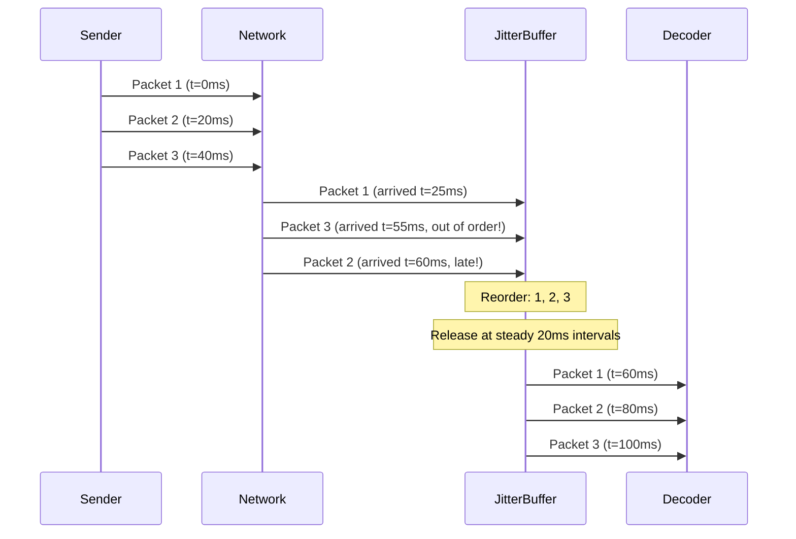
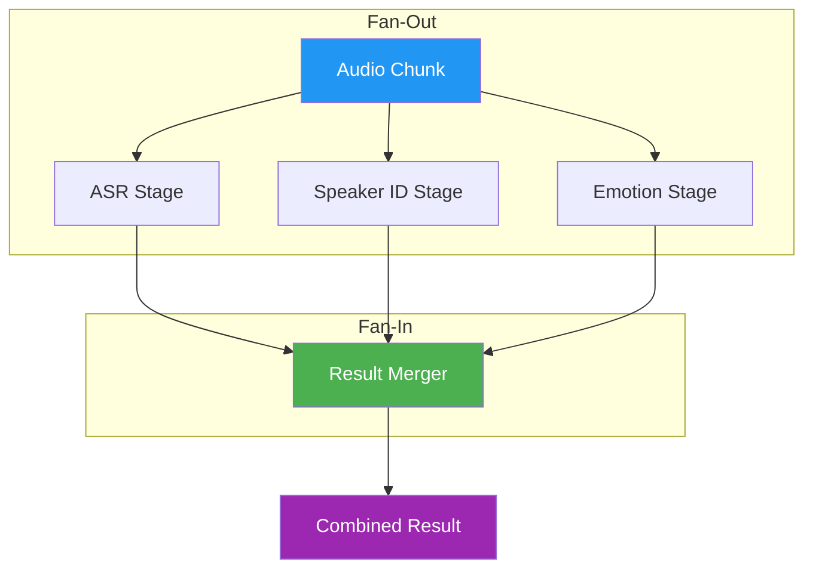
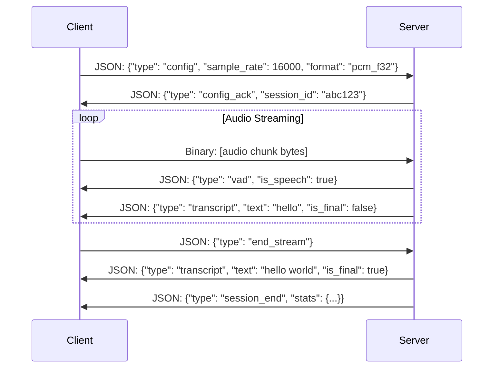
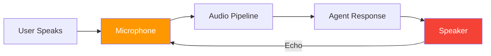

# Voice Agents Deep Dive  Part 7: Real-Time Audio Pipelines  Streaming, Buffers, and WebSockets

---

**Series:** Building Voice Agents  A Developer's Deep Dive from Audio Fundamentals to Production
**Part:** 7 of 20 (Audio Pipelines)
**Audience:** Developers with Python experience who want to build voice-powered AI agents from the ground up
**Reading time:** ~55 minutes

---

## Introduction  From Offline Processing to the Live Wire

In Part 6, we explored Voice Activity Detection (VAD)  the critical gatekeeper that decides when someone is speaking and when they are not. We implemented energy-based, zero-crossing, and neural network-based VAD systems, learned about hangover schemes to prevent choppy segmentation, and built a system that could reliably extract speech segments from continuous audio. All of that work assumed a comfortable scenario: audio files sitting on disk, waiting patiently for us to process them.

**Real-time changes everything.**

When a human speaks to a voice agent, they expect a response in under 500 milliseconds. That is not a soft target  it is a biological expectation baked into decades of conversational habit. Exceed it, and the user starts repeating themselves, talking over the agent, or simply walking away. In this part, we dismantle the batch-processing mindset and rebuild our thinking around **streams, buffers, pipelines, and WebSockets**  the plumbing that makes voice agents feel alive.

We will cover:

- Why real-time audio processing requires fundamentally different architecture than batch processing
- How ring buffers and jitter buffers manage the relentless flow of audio data
- Pipeline design patterns that chain processing stages efficiently
- Asynchronous audio processing with Python's `asyncio`
- WebSocket-based audio streaming for client-server voice agents
- Audio codecs optimized for real-time voice (Opus, G.711, G.722)
- Echo cancellation, noise suppression, and automatic gain control in live pipelines
- A complete real-time audio streaming server project

By the end, you will have a working WebSocket-based audio server that accepts live microphone streams, processes them through a configurable pipeline, and streams results back  the backbone of any production voice agent.

---

## 1. Why Real-Time Is Different

### 1.1 The Batch Processing Comfort Zone

In batch processing, life is simple. You have a file. You read the entire file into memory. You process it. You write the result. If something goes wrong, you start over. Time pressure is measured in minutes or hours, not milliseconds.

```python
# Batch processing  the comfortable way
import wave
import numpy as np

def batch_process(filepath: str) -> np.ndarray:
    """Load entire file, process, return result."""
    with wave.open(filepath, 'rb') as wf:
        frames = wf.readframes(wf.getnframes())
        audio = np.frombuffer(frames, dtype=np.int16).astype(np.float32) / 32768.0

    # We have ALL the data. No rush.
    processed = apply_noise_reduction(audio)
    processed = apply_normalization(processed)
    segments = detect_speech(processed)
    transcription = transcribe(segments)

    return transcription
```

This code makes three assumptions that real-time systems cannot afford:

1. **All data is available upfront**  In real-time, data arrives continuously and unpredictably.
2. **Memory is unlimited**  You cannot buffer an hour-long conversation in RAM.
3. **Time is irrelevant**  The user is waiting. Every millisecond counts.

### 1.2 The Streaming Mindset

Real-time audio processing is a fundamentally different paradigm. Data arrives in small chunks (typically 10–30 ms of audio at a time), must be processed immediately, and results must be produced before the next chunk arrives.

```python
# Real-time processing  the streaming way
import pyaudio
import numpy as np
from typing import Callable

def realtime_process(
    callback: Callable[[np.ndarray], None],
    sample_rate: int = 16000,
    chunk_duration_ms: int = 20
):
    """Process audio in real-time, chunk by chunk."""
    chunk_size = int(sample_rate * chunk_duration_ms / 1000)

    pa = pyaudio.PyAudio()
    stream = pa.open(
        format=pyaudio.paFloat32,
        channels=1,
        rate=sample_rate,
        input=True,
        frames_per_buffer=chunk_size
    )

    try:
        while True:
            # Read exactly one chunk  this blocks until data is ready
            raw = stream.read(chunk_size, exception_on_overflow=False)
            chunk = np.frombuffer(raw, dtype=np.float32)

            # Process THIS chunk NOW  next chunk arrives in 20ms
            callback(chunk)
    except KeyboardInterrupt:
        pass
    finally:
        stream.stop_stream()
        stream.close()
        pa.terminate()
```

> **Key Insight:** In real-time processing, you are not processing data  you are **keeping up with time**. The audio source (microphone, network stream, telephony channel) does not pause because your algorithm is slow. If you fall behind, you either drop data or introduce latency  both are unacceptable.

### 1.3 Latency Budgets

Every voice agent has a **latency budget**  the maximum acceptable delay between the user finishing a sentence and the agent beginning its response. Research consistently shows:

| Delay | User Perception |
|-------|----------------|
| < 200 ms | Imperceptible  feels instant |
| 200–500 ms | Acceptable  natural conversational pause |
| 500–1000 ms | Noticeable  user may start to feel the system is slow |
| 1000–2000 ms | Frustrating  user may repeat themselves |
| > 2000 ms | Unacceptable  user disengages |

The total latency budget must be divided among all processing stages:

```
Total Latency = Audio Capture + Network Transfer + VAD Processing
              + ASR Processing + NLU/Dialog Processing
              + TTS Generation + Network Transfer + Audio Playback
```

A typical budget allocation for a 500 ms target:

| Stage | Budget | Notes |
|-------|--------|-------|
| Audio Capture | 20–30 ms | One chunk of audio |
| Network (up) | 20–50 ms | Depends on connection |
| VAD | 10–20 ms | Must be very fast |
| ASR (streaming) | 100–200 ms | Streaming ASR starts before utterance ends |
| NLU + Dialog | 50–100 ms | LLM inference or rule engine |
| TTS | 50–150 ms | Streaming TTS starts before text is complete |
| Network (down) | 20–50 ms | Depends on connection |
| Audio Playback | 20–30 ms | Buffer fill time |
| **Total** | **290–630 ms** | |

```mermaid
gantt
    title Voice Agent Latency Budget (Target: 500ms)
    dateFormat X
    axisFormat %L ms

    section Upstream
    Audio Capture       :a1, 0, 30
    Network Upload      :a2, 30, 70

    section Processing
    VAD                 :a3, 70, 90
    ASR (streaming)     :a4, 90, 240
    NLU + Dialog        :a5, 240, 330
    TTS Generation      :a6, 330, 430

    section Downstream
    Network Download    :a7, 430, 470
    Audio Playback      :a8, 470, 500
```



> **Key Insight:** The latency budget is not just about making each stage fast  it is about making stages **overlap**. Streaming ASR can start transcribing before the user finishes speaking. Streaming TTS can start generating audio before the full response text is ready. This **pipelining** is the secret to sub-second response times.

### 1.4 Backpressure  When the Pipeline Backs Up

**Backpressure** occurs when a downstream stage cannot keep up with the rate at which an upstream stage produces data. In audio pipelines, this is dangerous because audio is a continuous stream  it does not stop arriving just because your ASR model is running slowly.

```python
import time
import threading
from collections import deque
from typing import Optional


class BackpressureMonitor:
    """
    Monitor queue depths across pipeline stages to detect backpressure.

    When a stage's input queue grows beyond a threshold, it signals that
    the stage is falling behind  a backpressure situation.
    """

    def __init__(self, warning_threshold: int = 50, critical_threshold: int = 100):
        self.warning_threshold = warning_threshold
        self.critical_threshold = critical_threshold
        self.queues: dict[str, deque] = {}
        self.stats: dict[str, dict] = {}
        self._lock = threading.Lock()

    def register_queue(self, stage_name: str, queue: deque) -> None:
        """Register a stage's input queue for monitoring."""
        with self._lock:
            self.queues[stage_name] = queue
            self.stats[stage_name] = {
                'max_depth': 0,
                'warnings': 0,
                'overflows': 0,
                'total_processed': 0,
            }

    def check_all(self) -> dict[str, str]:
        """
        Check all registered queues and return their status.

        Returns:
            Dictionary mapping stage names to status strings:
            'ok', 'warning', or 'critical'.
        """
        statuses = {}
        with self._lock:
            for name, queue in self.queues.items():
                depth = len(queue)
                self.stats[name]['max_depth'] = max(
                    self.stats[name]['max_depth'], depth
                )

                if depth >= self.critical_threshold:
                    statuses[name] = 'critical'
                    self.stats[name]['overflows'] += 1
                elif depth >= self.warning_threshold:
                    statuses[name] = 'warning'
                    self.stats[name]['warnings'] += 1
                else:
                    statuses[name] = 'ok'

        return statuses

    def get_report(self) -> str:
        """Generate a human-readable backpressure report."""
        lines = ["Backpressure Report", "=" * 40]
        with self._lock:
            for name, stats in self.stats.items():
                depth = len(self.queues[name])
                lines.append(
                    f"  {name}: depth={depth}, "
                    f"max={stats['max_depth']}, "
                    f"warnings={stats['warnings']}, "
                    f"overflows={stats['overflows']}"
                )
        return "\n".join(lines)
```

Strategies for handling backpressure:

| Strategy | Description | Trade-off |
|----------|-------------|-----------|
| **Drop oldest** | Discard the oldest unprocessed chunks | Loses historical context |
| **Drop newest** | Discard incoming chunks when full | May miss current speech |
| **Adaptive quality** | Reduce processing quality when behind | Lower accuracy |
| **Backpressure signal** | Tell upstream to slow down | Not always possible with live audio |
| **Dynamic scaling** | Spin up more workers | Adds complexity and cost |

### 1.5 The Fundamental Constraint  You Cannot Buffer Forever

The core tension of real-time audio is this: **buffering improves quality but increases latency**. More buffered audio means better context for noise reduction, better accuracy for VAD, and smoother playback. But every frame you buffer is a frame of delay the user experiences.

```python
def demonstrate_buffer_tradeoff():
    """
    Illustrate the fundamental tension between buffer size and latency.
    """
    sample_rate = 16000
    scenarios = [
        ("Ultra-low latency", 5, "Gaming, live music"),
        ("Low latency", 20, "Voice agents, VoIP"),
        ("Medium latency", 100, "Streaming music"),
        ("High latency", 500, "Podcast processing"),
        ("Batch", 5000, "Offline transcription"),
    ]

    print(f"{'Scenario':<20} {'Buffer (ms)':<15} {'Samples':<10} "
          f"{'Memory (KB)':<12} {'Use Case'}")
    print("-" * 80)

    for name, buffer_ms, use_case in scenarios:
        samples = int(sample_rate * buffer_ms / 1000)
        memory_kb = samples * 4 / 1024  # float32 = 4 bytes per sample
        print(f"{name:<20} {buffer_ms:<15} {samples:<10} "
              f"{memory_kb:<12.1f} {use_case}")


demonstrate_buffer_tradeoff()
```

**Output:**

```
Scenario             Buffer (ms)     Samples    Memory (KB)  Use Case
--------------------------------------------------------------------------------
Ultra-low latency    5               80         0.3          Gaming, live music
Low latency          20              320        1.2          Voice agents, VoIP
Medium latency       100             1600       6.2          Streaming music
High latency         500             8000       31.2         Podcast processing
Batch                5000            80000      312.5        Offline transcription
```

For voice agents, we typically operate in the **20–30 ms chunk size** range, balancing responsiveness with having enough audio per chunk for meaningful processing.

---

## 2. Audio Buffers and Chunks

### 2.1 Understanding Audio Chunks

An audio chunk is a fixed-size segment of audio data, typically representing 10–30 ms of audio. At 16 kHz sample rate with 20 ms chunks, each chunk contains exactly **320 samples** (16000 * 0.020 = 320).

```python
import numpy as np
from dataclasses import dataclass, field
import time


@dataclass
class AudioChunk:
    """
    Represents a single chunk of audio data with metadata.

    Attributes:
        data: The raw audio samples as a numpy array of float32 values,
              normalized to the range [-1.0, 1.0].
        sample_rate: The sample rate in Hz (e.g., 16000).
        timestamp: The wall-clock time when this chunk was captured,
                   as returned by time.time().
        sequence_number: Monotonically increasing sequence number for
                        ordering and detecting dropped chunks.
        channel_count: Number of audio channels (1 for mono, 2 for stereo).
    """
    data: np.ndarray
    sample_rate: int = 16000
    timestamp: float = field(default_factory=time.time)
    sequence_number: int = 0
    channel_count: int = 1

    @property
    def duration_ms(self) -> float:
        """Duration of this chunk in milliseconds."""
        return len(self.data) / self.sample_rate * 1000

    @property
    def sample_count(self) -> int:
        """Number of audio samples in this chunk."""
        return len(self.data)

    @property
    def rms_energy(self) -> float:
        """Root mean square energy of this chunk."""
        return float(np.sqrt(np.mean(self.data ** 2)))

    @property
    def peak_amplitude(self) -> float:
        """Peak absolute amplitude in this chunk."""
        return float(np.max(np.abs(self.data)))

    @property
    def size_bytes(self) -> int:
        """Size of audio data in bytes."""
        return self.data.nbytes

    def to_int16(self) -> np.ndarray:
        """Convert float32 [-1.0, 1.0] to int16 [-32768, 32767]."""
        return (self.data * 32767).astype(np.int16)

    @classmethod
    def from_int16(
        cls,
        data: np.ndarray,
        sample_rate: int = 16000,
        sequence_number: int = 0
    ) -> "AudioChunk":
        """Create an AudioChunk from int16 data."""
        float_data = data.astype(np.float32) / 32768.0
        return cls(
            data=float_data,
            sample_rate=sample_rate,
            sequence_number=sequence_number,
        )

    @classmethod
    def silence(
        cls,
        duration_ms: float,
        sample_rate: int = 16000,
        sequence_number: int = 0
    ) -> "AudioChunk":
        """Create a silent audio chunk of the given duration."""
        num_samples = int(sample_rate * duration_ms / 1000)
        return cls(
            data=np.zeros(num_samples, dtype=np.float32),
            sample_rate=sample_rate,
            sequence_number=sequence_number,
        )

    def __repr__(self) -> str:
        return (
            f"AudioChunk(samples={self.sample_count}, "
            f"duration={self.duration_ms:.1f}ms, "
            f"rms={self.rms_energy:.4f}, "
            f"seq={self.sequence_number})"
        )


# --- Demonstration ---
chunk = AudioChunk(
    data=np.random.randn(320).astype(np.float32) * 0.1,
    sample_rate=16000,
    sequence_number=42,
)
print(chunk)
print(f"  Size: {chunk.size_bytes} bytes")
print(f"  Peak: {chunk.peak_amplitude:.4f}")
```

### 2.2 Ring Buffers  The Workhorse of Real-Time Audio

A **ring buffer** (also called a circular buffer) is a fixed-size buffer that wraps around when it reaches the end. It is the fundamental data structure for real-time audio because:

- It has a **fixed memory footprint**  no dynamic allocation during processing.
- **Writes never block** (oldest data is overwritten if the buffer is full).
- **Reads** always get the most recent data.
- It naturally implements a **sliding window** over the audio stream.

```mermaid
graph LR
    subgraph Ring Buffer capacity=8
        direction LR
        B0["[0] "] --- B1["[1] "] --- B2["[2] "] --- B3["[3]"]
        B3 --- B4["[4] "] --- B5["[5] "] --- B6["[6] "] --- B7["[7]"]
    end

    W["Write Head → [5]"] -.-> B5
    R["Read Head → [2]"] -.-> B2

    style B2 fill:#4CAF50,color:#fff
    style B3 fill:#4CAF50,color:#fff
    style B4 fill:#4CAF50,color:#fff
    style B5 fill:#FFC107,color:#000
```

Here is a production-quality ring buffer for audio chunks:

```python
import threading
import numpy as np
from typing import Optional
import time


class AudioRingBuffer:
    """
    Thread-safe circular buffer for real-time audio processing.

    This buffer stores raw float32 audio samples in a pre-allocated
    numpy array. It supports concurrent reads and writes from
    different threads, which is essential when the audio capture
    thread and the processing thread operate independently.

    The buffer has a fixed capacity measured in samples. When the
    buffer is full and new data is written, the oldest data is
    silently overwritten (overflow). When a read is attempted on
    an empty buffer, the caller can either receive silence
    (underflow) or block until data becomes available.

    Attributes:
        capacity: Maximum number of samples the buffer can hold.
        sample_rate: Sample rate in Hz, used for time calculations.
    """

    def __init__(self, capacity_ms: float, sample_rate: int = 16000):
        """
        Initialize the ring buffer.

        Args:
            capacity_ms: Buffer capacity in milliseconds.
            sample_rate: Audio sample rate in Hz.
        """
        self.sample_rate = sample_rate
        self.capacity = int(sample_rate * capacity_ms / 1000)
        self._buffer = np.zeros(self.capacity, dtype=np.float32)
        self._write_pos = 0
        self._read_pos = 0
        self._count = 0  # Number of samples available to read
        self._lock = threading.Lock()
        self._data_available = threading.Event()
        self._total_written = 0
        self._total_read = 0
        self._overflows = 0
        self._underflows = 0

    @property
    def available(self) -> int:
        """Number of samples available for reading."""
        with self._lock:
            return self._count

    @property
    def free_space(self) -> int:
        """Number of samples that can be written without overflow."""
        with self._lock:
            return self.capacity - self._count

    @property
    def is_empty(self) -> bool:
        """True if no samples are available for reading."""
        with self._lock:
            return self._count == 0

    @property
    def is_full(self) -> bool:
        """True if buffer is at capacity."""
        with self._lock:
            return self._count == self.capacity

    @property
    def fill_ratio(self) -> float:
        """Fraction of buffer currently filled (0.0 to 1.0)."""
        with self._lock:
            return self._count / self.capacity

    def write(self, data: np.ndarray) -> int:
        """
        Write audio samples to the buffer.

        If the buffer does not have enough space, the oldest samples
        are overwritten and the overflow counter is incremented.

        Args:
            data: Numpy array of float32 audio samples to write.

        Returns:
            Number of samples actually written (always equals len(data)).
        """
        samples = np.asarray(data, dtype=np.float32)
        n = len(samples)

        if n == 0:
            return 0

        with self._lock:
            # Check for overflow
            overflow_amount = max(0, (self._count + n) - self.capacity)
            if overflow_amount > 0:
                self._overflows += 1
                # Advance read position past the data that will be overwritten
                self._read_pos = (self._read_pos + overflow_amount) % self.capacity
                self._count -= overflow_amount

            # Write data, handling wrap-around
            if n <= self.capacity:
                # Data fits in buffer (possibly with wrap)
                end_pos = self._write_pos + n
                if end_pos <= self.capacity:
                    # No wrap needed
                    self._buffer[self._write_pos:end_pos] = samples
                else:
                    # Wrap around
                    first_part = self.capacity - self._write_pos
                    self._buffer[self._write_pos:] = samples[:first_part]
                    self._buffer[:n - first_part] = samples[first_part:]
            else:
                # Data larger than buffer  keep only the last capacity samples
                samples = samples[-self.capacity:]
                n = self.capacity
                self._buffer[:] = samples
                self._write_pos = 0
                self._read_pos = 0
                self._count = self.capacity
                self._total_written += len(data)
                self._data_available.set()
                return len(data)

            self._write_pos = (self._write_pos + n) % self.capacity
            self._count += n
            self._total_written += n

        # Signal that data is available for readers
        self._data_available.set()
        return n

    def read(
        self,
        num_samples: int,
        timeout: Optional[float] = None,
        pad_silence: bool = True
    ) -> Optional[np.ndarray]:
        """
        Read audio samples from the buffer.

        Args:
            num_samples: Number of samples to read.
            timeout: Maximum time to wait for data (seconds).
                     None means return immediately.
            pad_silence: If True, pad with zeros when not enough data
                        is available. If False, return None when
                        insufficient data.

        Returns:
            Numpy array of float32 samples, or None if timeout expired
            and pad_silence is False.
        """
        # Wait for data if needed
        if timeout is not None and self.is_empty:
            self._data_available.wait(timeout=timeout)

        with self._lock:
            if self._count == 0:
                self._underflows += 1
                if pad_silence:
                    return np.zeros(num_samples, dtype=np.float32)
                return None

            # Determine how many samples we can actually read
            to_read = min(num_samples, self._count)

            # Read data, handling wrap-around
            end_pos = self._read_pos + to_read
            if end_pos <= self.capacity:
                result = self._buffer[self._read_pos:end_pos].copy()
            else:
                first_part = self.capacity - self._read_pos
                result = np.concatenate([
                    self._buffer[self._read_pos:],
                    self._buffer[:to_read - first_part]
                ])

            self._read_pos = (self._read_pos + to_read) % self.capacity
            self._count -= to_read
            self._total_read += to_read

            # Clear the event if buffer is now empty
            if self._count == 0:
                self._data_available.clear()

            # Pad with silence if we read fewer samples than requested
            if to_read < num_samples and pad_silence:
                self._underflows += 1
                padding = np.zeros(num_samples - to_read, dtype=np.float32)
                result = np.concatenate([result, padding])

        return result

    def peek(self, num_samples: int) -> np.ndarray:
        """
        Read samples without advancing the read position.

        Useful for look-ahead processing where you need to examine
        upcoming data without consuming it.

        Args:
            num_samples: Number of samples to peek at.

        Returns:
            Numpy array of float32 samples (may be zero-padded).
        """
        with self._lock:
            to_peek = min(num_samples, self._count)

            if to_peek == 0:
                return np.zeros(num_samples, dtype=np.float32)

            end_pos = self._read_pos + to_peek
            if end_pos <= self.capacity:
                result = self._buffer[self._read_pos:end_pos].copy()
            else:
                first_part = self.capacity - self._read_pos
                result = np.concatenate([
                    self._buffer[self._read_pos:],
                    self._buffer[:to_peek - first_part]
                ])

            if to_peek < num_samples:
                padding = np.zeros(num_samples - to_peek, dtype=np.float32)
                result = np.concatenate([result, padding])

        return result

    def clear(self) -> None:
        """Discard all buffered data."""
        with self._lock:
            self._write_pos = 0
            self._read_pos = 0
            self._count = 0
            self._data_available.clear()

    def get_stats(self) -> dict:
        """Return buffer statistics for monitoring."""
        with self._lock:
            return {
                'capacity': self.capacity,
                'available': self._count,
                'fill_ratio': self._count / self.capacity,
                'total_written': self._total_written,
                'total_read': self._total_read,
                'overflows': self._overflows,
                'underflows': self._underflows,
            }

    def __repr__(self) -> str:
        stats = self.get_stats()
        return (
            f"AudioRingBuffer(capacity={stats['capacity']}, "
            f"filled={stats['available']}/{stats['capacity']} "
            f"({stats['fill_ratio']:.1%}), "
            f"overflows={stats['overflows']}, "
            f"underflows={stats['underflows']})"
        )


# --- Demonstration ---
def demo_ring_buffer():
    """Show the ring buffer in action."""
    buf = AudioRingBuffer(capacity_ms=100, sample_rate=16000)
    print(f"Created: {buf}")
    print(f"Capacity: {buf.capacity} samples = 100 ms at 16 kHz")
    print()

    # Write 50ms of audio (800 samples)
    audio_50ms = np.random.randn(800).astype(np.float32) * 0.1
    buf.write(audio_50ms)
    print(f"After writing 50ms: {buf}")

    # Read 20ms (320 samples)
    chunk = buf.read(320)
    print(f"Read 20ms chunk: {len(chunk)} samples, rms={np.sqrt(np.mean(chunk**2)):.4f}")
    print(f"After reading 20ms: {buf}")

    # Write more than capacity to trigger overflow
    audio_200ms = np.random.randn(3200).astype(np.float32) * 0.1
    buf.write(audio_200ms)
    print(f"After writing 200ms (overflow): {buf}")

    print(f"\nStats: {buf.get_stats()}")


demo_ring_buffer()
```

### 2.3 Jitter Buffers  Taming Network Chaos

When audio streams over a network, packets do not arrive at perfectly regular intervals. **Network jitter** causes packets to arrive early, late, or out of order. A **jitter buffer** smooths out these irregularities by:

1. Collecting arriving packets.
2. Reordering them by sequence number.
3. Releasing them at a steady rate.
4. Interpolating or generating silence for missing packets.



```python
import heapq
import threading
import time
import numpy as np
from typing import Optional
from dataclasses import dataclass, field


@dataclass(order=True)
class JitterPacket:
    """
    A packet in the jitter buffer, ordered by sequence number.

    The @dataclass(order=True) decorator enables comparison by fields
    in declaration order, so packets are sorted by sequence_number.
    """
    sequence_number: int
    data: np.ndarray = field(compare=False)
    timestamp: float = field(compare=False, default_factory=time.time)
    arrived_at: float = field(compare=False, default_factory=time.time)


class JitterBuffer:
    """
    Adaptive jitter buffer for real-time audio streaming.

    This buffer handles the challenges of network audio:
    - Packets arriving out of order
    - Packets arriving with variable delay (jitter)
    - Lost packets that never arrive

    The buffer maintains an internal heap sorted by sequence number
    and releases packets in order at a steady rate. When packets
    are missing, the buffer can either insert silence or interpolate
    from surrounding packets.

    The buffer dynamically adjusts its target depth based on observed
    jitter: higher jitter leads to deeper buffering (more latency
    but fewer glitches), while low jitter allows shallower buffering
    (less latency).

    Attributes:
        min_depth: Minimum number of packets to buffer before releasing.
        max_depth: Maximum number of packets to hold.
        chunk_duration_ms: Duration of each audio chunk in milliseconds.
        sample_rate: Audio sample rate in Hz.
    """

    def __init__(
        self,
        min_depth: int = 2,
        max_depth: int = 10,
        chunk_duration_ms: float = 20.0,
        sample_rate: int = 16000,
        adaptive: bool = True
    ):
        self.min_depth = min_depth
        self.max_depth = max_depth
        self.chunk_duration_ms = chunk_duration_ms
        self.sample_rate = sample_rate
        self.adaptive = adaptive
        self.chunk_samples = int(sample_rate * chunk_duration_ms / 1000)

        # Internal state
        self._heap: list[JitterPacket] = []
        self._lock = threading.Lock()
        self._next_expected_seq = 0
        self._initialized = False
        self._target_depth = min_depth

        # Jitter tracking for adaptive mode
        self._arrival_times: list[float] = []
        self._jitter_history: list[float] = []
        self._max_jitter_history = 50

        # Statistics
        self._packets_received = 0
        self._packets_released = 0
        self._packets_lost = 0
        self._packets_late = 0
        self._packets_duplicate = 0
        self._interpolations = 0

    def push(self, packet: JitterPacket) -> None:
        """
        Add a packet to the jitter buffer.

        Duplicate and excessively late packets are discarded.

        Args:
            packet: The audio packet to buffer.
        """
        packet.arrived_at = time.time()

        with self._lock:
            self._packets_received += 1

            # Track arrival times for jitter calculation
            self._arrival_times.append(packet.arrived_at)
            if len(self._arrival_times) > 2:
                # Calculate inter-arrival jitter
                intervals = [
                    self._arrival_times[i] - self._arrival_times[i - 1]
                    for i in range(1, len(self._arrival_times))
                ]
                if len(intervals) >= 2:
                    expected_interval = self.chunk_duration_ms / 1000.0
                    jitter = np.std([
                        abs(iv - expected_interval) for iv in intervals[-20:]
                    ])
                    self._jitter_history.append(jitter)
                    if len(self._jitter_history) > self._max_jitter_history:
                        self._jitter_history.pop(0)

                    # Adaptive depth adjustment
                    if self.adaptive and self._jitter_history:
                        avg_jitter = np.mean(self._jitter_history)
                        jitter_packets = int(
                            avg_jitter / (self.chunk_duration_ms / 1000.0)
                        ) + 1
                        self._target_depth = max(
                            self.min_depth,
                            min(self.max_depth, jitter_packets + 1)
                        )

            # Keep arrival time history bounded
            if len(self._arrival_times) > 100:
                self._arrival_times = self._arrival_times[-50:]

            if not self._initialized:
                self._next_expected_seq = packet.sequence_number
                self._initialized = True

            # Discard packets that are too old
            if packet.sequence_number < self._next_expected_seq:
                self._packets_late += 1
                return

            # Check for duplicates
            for existing in self._heap:
                if existing.sequence_number == packet.sequence_number:
                    self._packets_duplicate += 1
                    return

            # Add to heap (sorted by sequence number)
            heapq.heappush(self._heap, packet)

            # Enforce maximum depth  drop oldest if over limit
            while len(self._heap) > self.max_depth:
                dropped = heapq.heappop(self._heap)
                self._packets_lost += 1

    def pull(self) -> Optional[np.ndarray]:
        """
        Pull the next audio chunk from the buffer.

        Returns the next expected packet in sequence order. If the
        next expected packet is missing, generates interpolated audio
        or silence.

        Returns:
            Numpy array of float32 audio samples, or None if buffer
            is not yet deep enough (still filling up).
        """
        with self._lock:
            # Wait until buffer has enough depth
            if len(self._heap) < self._target_depth:
                return None

            if not self._heap:
                return None

            # Check if the next expected packet is available
            if self._heap[0].sequence_number == self._next_expected_seq:
                # Perfect  next packet is ready
                packet = heapq.heappop(self._heap)
                self._next_expected_seq += 1
                self._packets_released += 1
                return packet.data

            elif self._heap[0].sequence_number > self._next_expected_seq:
                # Missing packet  need to conceal the gap
                self._packets_lost += 1
                self._interpolations += 1
                self._next_expected_seq += 1

                # Packet loss concealment: interpolate or use silence
                return self._conceal_loss()

            else:
                # This should not happen (late packets are filtered in push)
                heapq.heappop(self._heap)
                return self.pull()

    def _conceal_loss(self) -> np.ndarray:
        """
        Generate audio to conceal a lost packet.

        Uses simple interpolation if adjacent packets are available,
        otherwise returns silence.
        """
        if self._heap:
            # Use a faded copy of the next available packet
            next_packet = self._heap[0]
            # Apply a gentle fade to mask the discontinuity
            fade = np.linspace(0.3, 1.0, self.chunk_samples, dtype=np.float32)
            return next_packet.data[:self.chunk_samples] * fade
        else:
            # No data available  return silence
            return np.zeros(self.chunk_samples, dtype=np.float32)

    def get_stats(self) -> dict:
        """Return buffer statistics."""
        with self._lock:
            return {
                'depth': len(self._heap),
                'target_depth': self._target_depth,
                'packets_received': self._packets_received,
                'packets_released': self._packets_released,
                'packets_lost': self._packets_lost,
                'packets_late': self._packets_late,
                'packets_duplicate': self._packets_duplicate,
                'interpolations': self._interpolations,
                'loss_rate': (
                    self._packets_lost / max(1, self._packets_received)
                ),
            }

    def __repr__(self) -> str:
        stats = self.get_stats()
        return (
            f"JitterBuffer(depth={stats['depth']}/{stats['target_depth']}, "
            f"received={stats['packets_received']}, "
            f"lost={stats['packets_lost']}, "
            f"loss_rate={stats['loss_rate']:.2%})"
        )


# --- Demonstration ---
def demo_jitter_buffer():
    """Simulate network jitter and show buffer behavior."""
    jbuf = JitterBuffer(
        min_depth=3,
        max_depth=8,
        chunk_duration_ms=20,
        sample_rate=16000,
        adaptive=True,
    )

    print("Simulating 20 packets with network jitter...\n")
    np.random.seed(42)

    # Simulate packets arriving with jitter and some out of order
    packets_in_flight = []
    for seq in range(20):
        data = np.random.randn(320).astype(np.float32) * 0.1
        # Add random network delay (10ms to 80ms)
        delay = np.random.uniform(0.01, 0.08)
        packets_in_flight.append((delay, seq, data))

    # Sort by arrival time (simulating network reordering)
    packets_in_flight.sort(key=lambda x: x[0] + x[1] * 0.02)

    for delay, seq, data in packets_in_flight:
        packet = JitterPacket(
            sequence_number=seq,
            data=data,
            timestamp=seq * 0.02,
        )
        jbuf.push(packet)

        # Try to pull after each push
        output = jbuf.pull()
        if output is not None:
            rms = np.sqrt(np.mean(output ** 2))
            print(f"  Pushed seq={seq:2d}, pulled chunk (rms={rms:.4f})")
        else:
            print(f"  Pushed seq={seq:2d}, buffer filling...")

    # Drain remaining
    print("\nDraining buffer...")
    while True:
        output = jbuf.pull()
        if output is None:
            break
        print(f"  Pulled chunk ({len(output)} samples)")

    print(f"\nFinal stats: {jbuf.get_stats()}")


demo_jitter_buffer()
```

---

## 3. Audio Pipeline Architecture

### 3.1 What Is an Audio Pipeline?

An audio pipeline is a chain of processing stages where audio data flows from a **source** (microphone, file, network) through a series of **processors** (VAD, noise reduction, ASR) to a **sink** (speaker, file, network). Each stage transforms the data and passes it along.

```mermaid
graph LR
    A[Audio Source<br/>Microphone/Network] --> B[Preprocessor<br/>Gain, Noise Filter]
    B --> C[VAD<br/>Speech Detection]
    C --> D[ASR<br/>Speech-to-Text]
    D --> E[NLU<br/>Intent + Entities]
    E --> F[Dialog Manager<br/>Response Logic]
    F --> G[TTS<br/>Text-to-Speech]
    G --> H[Postprocessor<br/>Volume, Effects]
    H --> I[Audio Sink<br/>Speaker/Network]

    style A fill:#2196F3,color:#fff
    style C fill:#4CAF50,color:#fff
    style D fill:#FF9800,color:#fff
    style F fill:#9C27B0,color:#fff
    style G fill:#FF9800,color:#fff
    style I fill:#2196F3,color:#fff
```



The pipeline metaphor is powerful because it enables:

- **Modularity**  Each stage has a single responsibility and can be tested independently.
- **Composability**  Stages can be rearranged, added, or removed without rewriting the pipeline.
- **Parallelism**  Independent stages can run concurrently.
- **Monitoring**  Each stage can report its latency, throughput, and error rate.

### 3.2 Pipeline Stage Interface

Every pipeline stage follows the same contract: it receives data, processes it, and outputs the result.

```python
import threading
import queue
import time
import logging
from abc import ABC, abstractmethod
from typing import Any, Optional, Generic, TypeVar
from dataclasses import dataclass, field
from enum import Enum

logger = logging.getLogger(__name__)

T_in = TypeVar('T_in')
T_out = TypeVar('T_out')


class StageState(Enum):
    """Lifecycle states for a pipeline stage."""
    CREATED = "created"
    STARTING = "starting"
    RUNNING = "running"
    STOPPING = "stopping"
    STOPPED = "stopped"
    ERROR = "error"


@dataclass
class StageMetrics:
    """Performance metrics for a pipeline stage."""
    items_processed: int = 0
    items_dropped: int = 0
    total_processing_time: float = 0.0
    max_processing_time: float = 0.0
    min_processing_time: float = float('inf')
    errors: int = 0
    last_error: Optional[str] = None
    state: StageState = StageState.CREATED

    @property
    def avg_processing_time(self) -> float:
        if self.items_processed == 0:
            return 0.0
        return self.total_processing_time / self.items_processed

    @property
    def avg_processing_time_ms(self) -> float:
        return self.avg_processing_time * 1000


class PipelineStage(ABC):
    """
    Abstract base class for all audio pipeline stages.

    Each stage runs in its own thread, reading from an input queue
    and writing to an output queue. This decouples stages so they
    can operate at different speeds.

    Subclasses must implement the `process` method, which takes
    one input item and returns one output item (or None to drop).
    """

    def __init__(self, name: str, max_queue_size: int = 100):
        self.name = name
        self.input_queue: queue.Queue = queue.Queue(maxsize=max_queue_size)
        self.output_queue: Optional[queue.Queue] = None
        self.metrics = StageMetrics()
        self._thread: Optional[threading.Thread] = None
        self._stop_event = threading.Event()

    @abstractmethod
    def process(self, item: Any) -> Optional[Any]:
        """
        Process a single item.

        Args:
            item: The input data to process.

        Returns:
            Processed output, or None to drop this item.
        """
        ...

    def start(self) -> None:
        """Start the stage's processing thread."""
        if self._thread is not None and self._thread.is_alive():
            return

        self._stop_event.clear()
        self.metrics.state = StageState.STARTING
        self._thread = threading.Thread(
            target=self._run,
            name=f"stage-{self.name}",
            daemon=True,
        )
        self._thread.start()
        self.metrics.state = StageState.RUNNING

    def stop(self, timeout: float = 5.0) -> None:
        """Stop the stage gracefully."""
        self.metrics.state = StageState.STOPPING
        self._stop_event.set()
        if self._thread is not None:
            self._thread.join(timeout=timeout)
        self.metrics.state = StageState.STOPPED

    def _run(self) -> None:
        """Main processing loop (runs in a dedicated thread)."""
        while not self._stop_event.is_set():
            try:
                # Block for up to 100ms waiting for input
                try:
                    item = self.input_queue.get(timeout=0.1)
                except queue.Empty:
                    continue

                # Process the item and measure time
                start_time = time.perf_counter()
                result = self.process(item)
                elapsed = time.perf_counter() - start_time

                # Update metrics
                self.metrics.items_processed += 1
                self.metrics.total_processing_time += elapsed
                self.metrics.max_processing_time = max(
                    self.metrics.max_processing_time, elapsed
                )
                self.metrics.min_processing_time = min(
                    self.metrics.min_processing_time, elapsed
                )

                # Forward result to output queue
                if result is not None and self.output_queue is not None:
                    try:
                        self.output_queue.put_nowait(result)
                    except queue.Full:
                        self.metrics.items_dropped += 1
                        logger.warning(
                            f"Stage '{self.name}': output queue full, "
                            f"dropping item"
                        )

            except Exception as e:
                self.metrics.errors += 1
                self.metrics.last_error = str(e)
                logger.error(f"Stage '{self.name}' error: {e}")

    def feed(self, item: Any) -> bool:
        """
        Feed an item into this stage's input queue.

        Args:
            item: Data to process.

        Returns:
            True if the item was queued, False if queue was full.
        """
        try:
            self.input_queue.put_nowait(item)
            return True
        except queue.Full:
            self.metrics.items_dropped += 1
            return False

    def connect_to(self, next_stage: "PipelineStage") -> None:
        """Connect this stage's output to the next stage's input."""
        self.output_queue = next_stage.input_queue

    def __repr__(self) -> str:
        return (
            f"{self.__class__.__name__}('{self.name}', "
            f"processed={self.metrics.items_processed}, "
            f"avg_time={self.metrics.avg_processing_time_ms:.1f}ms, "
            f"state={self.metrics.state.value})"
        )
```

### 3.3 Building a Complete Audio Pipeline

Now let us assemble stages into a full pipeline with lifecycle management and monitoring:

```python
import queue
import threading
import time
import logging
from typing import Any, Optional

logger = logging.getLogger(__name__)


class AudioPipeline:
    """
    Manages a chain of PipelineStage instances.

    The pipeline connects stages in sequence so that the output
    of stage N feeds into the input of stage N+1. It provides
    lifecycle management (start/stop all stages), monitoring
    (collect metrics from all stages), and a unified feed/collect
    interface.
    """

    def __init__(self, name: str = "audio_pipeline"):
        self.name = name
        self.stages: list[PipelineStage] = []
        self._result_queue: queue.Queue = queue.Queue(maxsize=100)
        self._running = False

    def add_stage(self, stage: PipelineStage) -> "AudioPipeline":
        """
        Append a stage to the pipeline.

        Returns self to allow chaining:
            pipeline.add_stage(vad).add_stage(asr).add_stage(nlu)
        """
        if self.stages:
            # Connect previous stage's output to this stage's input
            self.stages[-1].connect_to(stage)

        self.stages.append(stage)
        return self

    def start(self) -> None:
        """Start all stages in the pipeline."""
        if self._running:
            return

        # Connect last stage's output to the result queue
        if self.stages:
            self.stages[-1].output_queue = self._result_queue

        # Start stages in reverse order (sink first, source last)
        for stage in reversed(self.stages):
            stage.start()
            logger.info(f"Started stage: {stage.name}")

        self._running = True
        logger.info(f"Pipeline '{self.name}' started with {len(self.stages)} stages")

    def stop(self) -> None:
        """Stop all stages gracefully."""
        if not self._running:
            return

        # Stop stages in forward order (source first, sink last)
        for stage in self.stages:
            stage.stop()
            logger.info(f"Stopped stage: {stage.name}")

        self._running = False
        logger.info(f"Pipeline '{self.name}' stopped")

    def feed(self, item: Any) -> bool:
        """Feed data into the first stage of the pipeline."""
        if not self.stages:
            return False
        return self.stages[0].feed(item)

    def collect(self, timeout: Optional[float] = None) -> Optional[Any]:
        """
        Collect a result from the last stage of the pipeline.

        Args:
            timeout: Seconds to wait. None = don't block.

        Returns:
            The processed result, or None if timeout expired.
        """
        try:
            if timeout is None:
                return self._result_queue.get_nowait()
            return self._result_queue.get(timeout=timeout)
        except queue.Empty:
            return None

    def get_metrics(self) -> dict[str, dict]:
        """Collect metrics from all stages."""
        metrics = {}
        for stage in self.stages:
            m = stage.metrics
            metrics[stage.name] = {
                'state': m.state.value,
                'items_processed': m.items_processed,
                'items_dropped': m.items_dropped,
                'avg_time_ms': m.avg_processing_time_ms,
                'max_time_ms': m.max_processing_time * 1000,
                'errors': m.errors,
                'last_error': m.last_error,
            }
        return metrics

    def print_metrics(self) -> None:
        """Print a formatted metrics table."""
        metrics = self.get_metrics()
        print(f"\nPipeline '{self.name}' Metrics")
        print("=" * 80)
        print(
            f"{'Stage':<20} {'State':<10} {'Processed':>10} "
            f"{'Dropped':>8} {'Avg(ms)':>8} {'Max(ms)':>8} {'Errors':>7}"
        )
        print("-" * 80)
        for name, m in metrics.items():
            print(
                f"{name:<20} {m['state']:<10} {m['items_processed']:>10} "
                f"{m['items_dropped']:>8} {m['avg_time_ms']:>8.1f} "
                f"{m['max_time_ms']:>8.1f} {m['errors']:>7}"
            )
        print()

    def __enter__(self) -> "AudioPipeline":
        self.start()
        return self

    def __exit__(self, *args) -> None:
        self.stop()

    def __repr__(self) -> str:
        stage_names = " → ".join(s.name for s in self.stages)
        return f"AudioPipeline('{self.name}': {stage_names})"
```

### 3.4 Example: Building a VAD + Transcription Pipeline

Let us create concrete stages and wire them together:

```python
import numpy as np
import time


class GainNormalizationStage(PipelineStage):
    """Normalize audio chunk amplitude."""

    def __init__(self, target_rms: float = 0.1):
        super().__init__("gain_normalize")
        self.target_rms = target_rms

    def process(self, chunk: AudioChunk) -> Optional[AudioChunk]:
        rms = chunk.rms_energy
        if rms < 1e-6:
            return chunk  # Silence  don't amplify noise

        gain = self.target_rms / rms
        # Limit gain to prevent extreme amplification
        gain = min(gain, 10.0)
        normalized_data = chunk.data * gain

        # Clip to prevent overflow
        normalized_data = np.clip(normalized_data, -1.0, 1.0)

        return AudioChunk(
            data=normalized_data,
            sample_rate=chunk.sample_rate,
            timestamp=chunk.timestamp,
            sequence_number=chunk.sequence_number,
        )


class SimpleVADStage(PipelineStage):
    """Voice Activity Detection stage using energy threshold."""

    def __init__(self, energy_threshold: float = 0.02, hangover_chunks: int = 15):
        super().__init__("vad")
        self.energy_threshold = energy_threshold
        self.hangover_chunks = hangover_chunks
        self._hangover_counter = 0
        self._is_speech = False

    def process(self, chunk: AudioChunk) -> Optional[dict]:
        rms = chunk.rms_energy
        is_active = rms > self.energy_threshold

        if is_active:
            self._hangover_counter = self.hangover_chunks
            self._is_speech = True
        elif self._hangover_counter > 0:
            self._hangover_counter -= 1
        else:
            self._is_speech = False

        # Only forward speech chunks
        if self._is_speech:
            return {
                'chunk': chunk,
                'is_speech': True,
                'energy': rms,
            }
        return None  # Drop silence


class MockASRStage(PipelineStage):
    """
    Simulated ASR stage for demonstration.

    In a real system, this would call a speech-to-text engine like
    Whisper, Vosk, or a cloud API.
    """

    def __init__(self, simulated_latency_ms: float = 50.0):
        super().__init__("asr")
        self.simulated_latency_ms = simulated_latency_ms
        self._buffer: list[np.ndarray] = []
        self._buffer_duration_ms = 0.0

    def process(self, item: dict) -> Optional[dict]:
        chunk = item['chunk']
        self._buffer.append(chunk.data)
        self._buffer_duration_ms += chunk.duration_ms

        # Simulate ASR processing time
        time.sleep(self.simulated_latency_ms / 1000)

        # Emit partial result every 500ms of buffered audio
        if self._buffer_duration_ms >= 500:
            combined = np.concatenate(self._buffer)
            energy = np.sqrt(np.mean(combined ** 2))
            result = {
                'text': f"[speech: {self._buffer_duration_ms:.0f}ms, "
                        f"energy={energy:.3f}]",
                'is_final': False,
                'duration_ms': self._buffer_duration_ms,
                'timestamp': time.time(),
            }
            self._buffer.clear()
            self._buffer_duration_ms = 0.0
            return result

        return None


# --- Wire it all together ---
def demo_pipeline():
    """Demonstrate the audio pipeline with simulated data."""
    pipeline = AudioPipeline("demo_voice_pipeline")
    pipeline.add_stage(GainNormalizationStage(target_rms=0.1))
    pipeline.add_stage(SimpleVADStage(energy_threshold=0.02))
    pipeline.add_stage(MockASRStage(simulated_latency_ms=10))

    print(f"Pipeline: {pipeline}")
    print()

    with pipeline:
        # Generate 2 seconds of simulated audio (100 chunks of 20ms)
        np.random.seed(42)
        for i in range(100):
            # Alternate between speech (loud) and silence (quiet)
            if 20 <= i <= 60:
                # Simulated speech
                amplitude = 0.3
            else:
                # Silence
                amplitude = 0.001

            chunk = AudioChunk(
                data=np.random.randn(320).astype(np.float32) * amplitude,
                sample_rate=16000,
                sequence_number=i,
            )
            pipeline.feed(chunk)
            time.sleep(0.005)  # Simulate real-time arrival

        # Allow processing to complete
        time.sleep(0.5)

        # Collect results
        results = []
        while True:
            result = pipeline.collect()
            if result is None:
                break
            results.append(result)
            print(f"  Result: {result['text']}")

        print(f"\nCollected {len(results)} ASR results")
        pipeline.print_metrics()


demo_pipeline()
```

---

## 4. Pipeline Patterns  Sequential, Parallel, and Conditional

### 4.1 Sequential Pipelines

The simplest pattern: each stage processes data in sequence. This is what we built in Section 3. The data flows through stages one after another, and each stage must complete before the next can begin (for a given chunk).

```python
class SequentialPipeline:
    """
    Process data through stages one at a time, in order.

    This is the simplest pipeline pattern. Each chunk flows through
    stage 1, then stage 2, then stage 3, etc. The total latency is
    the sum of all stage latencies.

    Use when: stages have dependencies on each other's output and
    must execute in a strict order.
    """

    def __init__(self, stages: list[PipelineStage]):
        self.stages = stages
        # Connect in sequence
        for i in range(len(stages) - 1):
            stages[i].connect_to(stages[i + 1])

    def process_sync(self, item: Any) -> Optional[Any]:
        """
        Process an item synchronously through all stages.

        This bypasses the threading model and runs each stage's
        process() method directly. Useful for testing and for
        scenarios where threading overhead is undesirable.
        """
        current = item
        for stage in self.stages:
            if current is None:
                return None
            start = time.perf_counter()
            current = stage.process(current)
            elapsed = time.perf_counter() - start
            stage.metrics.items_processed += 1
            stage.metrics.total_processing_time += elapsed
        return current
```

### 4.2 Parallel Pipelines

When multiple independent processing paths are needed, stages can run in parallel. For example, you might want to run both speech-to-text and speaker identification simultaneously.

```python
import concurrent.futures
import threading
from typing import Callable


class ParallelPipeline:
    """
    Run multiple stages concurrently on the same input.

    Each input item is copied to all parallel stages simultaneously.
    Results from all stages are collected and merged into a single
    output dictionary.

    Use when: you need multiple independent analyses of the same
    audio (e.g., ASR + speaker ID + emotion detection).
    """

    def __init__(
        self,
        stages: list[PipelineStage],
        merge_fn: Optional[Callable[[list[Any]], Any]] = None,
        timeout: float = 1.0,
    ):
        """
        Args:
            stages: List of stages to run in parallel.
            merge_fn: Function to merge results from all stages.
                      If None, results are returned as a dict
                      mapping stage names to their outputs.
            timeout: Maximum seconds to wait for all stages.
        """
        self.stages = stages
        self.merge_fn = merge_fn or self._default_merge
        self.timeout = timeout
        self._executor = concurrent.futures.ThreadPoolExecutor(
            max_workers=len(stages),
            thread_name_prefix="parallel-stage",
        )

    @staticmethod
    def _default_merge(results: list[tuple[str, Any]]) -> dict[str, Any]:
        """Default merge: collect results into a dictionary."""
        return {name: result for name, result in results if result is not None}

    def process(self, item: Any) -> Any:
        """
        Process an item through all stages in parallel.

        Args:
            item: The input data (sent to all stages).

        Returns:
            Merged result from all stages.
        """
        futures = {}
        for stage in self.stages:
            future = self._executor.submit(stage.process, item)
            futures[stage.name] = future

        # Collect results
        results = []
        for name, future in futures.items():
            try:
                result = future.result(timeout=self.timeout)
                results.append((name, result))
            except concurrent.futures.TimeoutError:
                logger.warning(f"Parallel stage '{name}' timed out")
                results.append((name, None))
            except Exception as e:
                logger.error(f"Parallel stage '{name}' failed: {e}")
                results.append((name, None))

        return self.merge_fn(results)

    def shutdown(self) -> None:
        """Shut down the thread pool."""
        self._executor.shutdown(wait=True)


# --- Example parallel stages ---

class EnergyAnalysisStage(PipelineStage):
    """Analyze energy characteristics of audio."""

    def __init__(self):
        super().__init__("energy_analysis")

    def process(self, chunk: AudioChunk) -> dict:
        data = chunk.data
        return {
            'rms': float(np.sqrt(np.mean(data ** 2))),
            'peak': float(np.max(np.abs(data))),
            'crest_factor': float(
                np.max(np.abs(data)) / max(np.sqrt(np.mean(data ** 2)), 1e-10)
            ),
            'zero_crossings': int(np.sum(np.abs(np.diff(np.sign(data))) > 0)),
        }


class PitchEstimationStage(PipelineStage):
    """Estimate fundamental frequency (F0) of audio."""

    def __init__(self, sample_rate: int = 16000):
        super().__init__("pitch_estimation")
        self.sample_rate = sample_rate

    def process(self, chunk: AudioChunk) -> dict:
        data = chunk.data
        # Simple autocorrelation-based pitch estimation
        if np.max(np.abs(data)) < 0.01:
            return {'f0': 0.0, 'confidence': 0.0}

        # Autocorrelation
        corr = np.correlate(data, data, mode='full')
        corr = corr[len(corr) // 2:]

        # Find first peak after the initial decay
        min_lag = int(self.sample_rate / 500)  # 500 Hz max
        max_lag = int(self.sample_rate / 50)   # 50 Hz min

        if max_lag >= len(corr):
            return {'f0': 0.0, 'confidence': 0.0}

        search_region = corr[min_lag:max_lag]
        if len(search_region) == 0:
            return {'f0': 0.0, 'confidence': 0.0}

        peak_idx = np.argmax(search_region) + min_lag
        confidence = corr[peak_idx] / corr[0] if corr[0] > 0 else 0.0
        f0 = self.sample_rate / peak_idx if peak_idx > 0 else 0.0

        return {
            'f0': round(f0, 1),
            'confidence': round(float(confidence), 3),
        }


# --- Demonstration ---
def demo_parallel():
    """Show parallel pipeline processing."""
    energy_stage = EnergyAnalysisStage()
    pitch_stage = PitchEstimationStage()

    parallel = ParallelPipeline(
        stages=[energy_stage, pitch_stage],
        timeout=1.0,
    )

    # Create a test chunk with a 200 Hz tone
    t = np.arange(320) / 16000
    tone = (np.sin(2 * np.pi * 200 * t) * 0.5).astype(np.float32)
    chunk = AudioChunk(data=tone, sample_rate=16000)

    result = parallel.process(chunk)
    print("Parallel processing results:")
    for stage_name, stage_result in result.items():
        print(f"  {stage_name}: {stage_result}")

    parallel.shutdown()


demo_parallel()
```

### 4.3 Conditional Routing

Sometimes you need to route data to different stages based on its content. For example, speech might go to ASR while music might go to a music classifier.

```python
from typing import Callable, Any


class ConditionalRouter(PipelineStage):
    """
    Route items to different downstream stages based on conditions.

    Each route is defined by a predicate function and a target stage.
    Items are sent to the first route whose predicate returns True.
    If no predicate matches, the item is sent to the default route
    (if configured) or dropped.

    Example:
        router = ConditionalRouter("audio_router")
        router.add_route(
            lambda x: x['energy'] > 0.05,
            speech_processing_stage,
            name="speech"
        )
        router.add_route(
            lambda x: x['energy'] <= 0.05,
            silence_handler_stage,
            name="silence"
        )
    """

    def __init__(self, name: str = "router"):
        super().__init__(name)
        self.routes: list[tuple[str, Callable[[Any], bool], PipelineStage]] = []
        self.default_route: Optional[PipelineStage] = None
        self._route_counts: dict[str, int] = {}

    def add_route(
        self,
        predicate: Callable[[Any], bool],
        stage: PipelineStage,
        name: str = "unnamed",
    ) -> "ConditionalRouter":
        """
        Add a routing rule.

        Args:
            predicate: Function that returns True if the item should
                      go to this stage.
            stage: The target stage for matching items.
            name: Human-readable name for this route.

        Returns:
            Self, for chaining.
        """
        self.routes.append((name, predicate, stage))
        self._route_counts[name] = 0
        return self

    def set_default(self, stage: PipelineStage) -> "ConditionalRouter":
        """Set the default route for items that match no predicate."""
        self.default_route = stage
        self._route_counts["default"] = 0
        return self

    def process(self, item: Any) -> Optional[Any]:
        """Route the item to the appropriate stage."""
        for name, predicate, stage in self.routes:
            try:
                if predicate(item):
                    self._route_counts[name] += 1
                    stage.feed(item)
                    return None  # Item has been forwarded
            except Exception as e:
                logger.error(f"Router predicate '{name}' failed: {e}")

        # No route matched  use default
        if self.default_route is not None:
            self._route_counts["default"] = (
                self._route_counts.get("default", 0) + 1
            )
            self.default_route.feed(item)

        return None  # Router does not produce direct output

    def get_route_stats(self) -> dict[str, int]:
        """Return count of items sent to each route."""
        return dict(self._route_counts)
```

### 4.4 Fan-Out and Fan-In Patterns

**Fan-out** sends the same data to multiple stages simultaneously. **Fan-in** collects results from multiple stages into a single stream.



```python
import threading
import queue
from typing import Callable, Any, Optional


class FanOut:
    """
    Distribute input to multiple downstream stages.

    Every item fed to FanOut is forwarded to all registered
    consumer stages.
    """

    def __init__(self, name: str = "fan_out"):
        self.name = name
        self.consumers: list[PipelineStage] = []

    def add_consumer(self, stage: PipelineStage) -> "FanOut":
        """Register a stage to receive all input items."""
        self.consumers.append(stage)
        return self

    def feed(self, item: Any) -> None:
        """Send item to all consumers."""
        for consumer in self.consumers:
            consumer.feed(item)


class FanIn:
    """
    Merge results from multiple upstream stages into a single stream.

    FanIn collects items from the output queues of multiple stages
    and yields them in arrival order through a single output queue.
    """

    def __init__(
        self,
        name: str = "fan_in",
        max_queue_size: int = 100,
    ):
        self.name = name
        self.output_queue: queue.Queue = queue.Queue(maxsize=max_queue_size)
        self.producers: list[PipelineStage] = []
        self._threads: list[threading.Thread] = []
        self._stop_event = threading.Event()

    def add_producer(self, stage: PipelineStage) -> "FanIn":
        """Register a stage whose output should be collected."""
        self.producers.append(stage)
        # Redirect stage output to a monitored queue
        monitored_queue: queue.Queue = queue.Queue(maxsize=100)
        stage.output_queue = monitored_queue
        return self

    def start(self) -> None:
        """Start collector threads for all producers."""
        self._stop_event.clear()
        for i, stage in enumerate(self.producers):
            thread = threading.Thread(
                target=self._collector,
                args=(stage,),
                name=f"fan-in-{self.name}-{i}",
                daemon=True,
            )
            thread.start()
            self._threads.append(thread)

    def _collector(self, stage: PipelineStage) -> None:
        """Collect items from a producer's output queue."""
        while not self._stop_event.is_set():
            try:
                item = stage.output_queue.get(timeout=0.1)
                tagged = {
                    'source': stage.name,
                    'data': item,
                    'timestamp': time.time(),
                }
                try:
                    self.output_queue.put_nowait(tagged)
                except queue.Full:
                    pass  # Drop if downstream is overwhelmed
            except queue.Empty:
                continue

    def collect(self, timeout: Optional[float] = None) -> Optional[dict]:
        """Collect next merged result."""
        try:
            if timeout is None:
                return self.output_queue.get_nowait()
            return self.output_queue.get(timeout=timeout)
        except queue.Empty:
            return None

    def stop(self) -> None:
        """Stop all collector threads."""
        self._stop_event.set()
        for thread in self._threads:
            thread.join(timeout=2.0)
        self._threads.clear()
```

---

## 5. Async Audio Processing with asyncio

### 5.1 Why asyncio for Audio?

Python's `asyncio` is a natural fit for audio pipelines because:

1. **I/O-bound operations dominate**  Waiting for audio from the microphone, network, or API responses is mostly waiting, not computing.
2. **Concurrent connections**  A server handling multiple audio streams needs concurrency, not parallelism.
3. **WebSocket integration**  The `websockets` library is built on asyncio.
4. **Event-driven model**  Audio processing reacts to events (new chunk arrived, speech detected, response ready).

However, asyncio has a critical limitation for audio: **CPU-bound processing blocks the event loop**. Heavy computation (FFT, neural network inference) must be offloaded to a thread pool or process pool.

### 5.2 Async Audio Pipeline

```python
import asyncio
import numpy as np
import time
import logging
from typing import Any, Optional, Callable, AsyncIterator
from abc import ABC, abstractmethod

logger = logging.getLogger(__name__)


class AsyncPipelineStage(ABC):
    """
    Async version of PipelineStage.

    Each stage is an async generator that consumes items from an
    input queue and produces items to an output queue. Stages run
    as asyncio tasks, allowing true concurrency for I/O-bound
    operations and cooperative scheduling for CPU-bound ones.
    """

    def __init__(self, name: str, max_queue_size: int = 100):
        self.name = name
        self.input_queue: asyncio.Queue = asyncio.Queue(maxsize=max_queue_size)
        self.output_queue: Optional[asyncio.Queue] = None
        self._task: Optional[asyncio.Task] = None
        self._items_processed = 0
        self._total_time = 0.0

    @abstractmethod
    async def process(self, item: Any) -> Optional[Any]:
        """Process a single item. Override in subclasses."""
        ...

    async def run(self) -> None:
        """Main processing loop."""
        logger.info(f"Async stage '{self.name}' started")
        try:
            while True:
                item = await self.input_queue.get()

                # Sentinel value to signal shutdown
                if item is None:
                    break

                start = time.perf_counter()
                try:
                    result = await self.process(item)
                except Exception as e:
                    logger.error(f"Async stage '{self.name}' error: {e}")
                    continue

                elapsed = time.perf_counter() - start
                self._items_processed += 1
                self._total_time += elapsed

                if result is not None and self.output_queue is not None:
                    await self.output_queue.put(result)

        except asyncio.CancelledError:
            logger.info(f"Async stage '{self.name}' cancelled")
        finally:
            logger.info(f"Async stage '{self.name}' stopped")

    def start(self) -> None:
        """Start this stage as an asyncio task."""
        self._task = asyncio.create_task(
            self.run(),
            name=f"stage-{self.name}",
        )

    async def stop(self) -> None:
        """Stop this stage gracefully."""
        await self.input_queue.put(None)  # Send sentinel
        if self._task:
            await self._task

    def connect_to(self, next_stage: "AsyncPipelineStage") -> None:
        """Connect output to next stage's input."""
        self.output_queue = next_stage.input_queue

    @property
    def avg_processing_time_ms(self) -> float:
        if self._items_processed == 0:
            return 0.0
        return (self._total_time / self._items_processed) * 1000


class AsyncAudioPipeline:
    """
    Async pipeline manager.

    Manages a chain of AsyncPipelineStage instances, providing
    lifecycle management and a unified interface for feeding
    data and collecting results.
    """

    def __init__(self, name: str = "async_pipeline"):
        self.name = name
        self.stages: list[AsyncPipelineStage] = []
        self._result_queue: asyncio.Queue = asyncio.Queue(maxsize=100)

    def add_stage(self, stage: AsyncPipelineStage) -> "AsyncAudioPipeline":
        """Add a stage to the pipeline."""
        if self.stages:
            self.stages[-1].connect_to(stage)
        self.stages.append(stage)
        return self

    def start(self) -> None:
        """Start all stages."""
        if self.stages:
            self.stages[-1].output_queue = self._result_queue
        for stage in self.stages:
            stage.start()
        logger.info(
            f"Async pipeline '{self.name}' started with "
            f"{len(self.stages)} stages"
        )

    async def stop(self) -> None:
        """Stop all stages gracefully."""
        for stage in self.stages:
            await stage.stop()
        logger.info(f"Async pipeline '{self.name}' stopped")

    async def feed(self, item: Any) -> None:
        """Feed data into the first stage."""
        if self.stages:
            await self.stages[0].input_queue.put(item)

    async def collect(self, timeout: Optional[float] = None) -> Optional[Any]:
        """Collect a result from the last stage."""
        try:
            if timeout is None:
                return self._result_queue.get_nowait()
            return await asyncio.wait_for(
                self._result_queue.get(),
                timeout=timeout,
            )
        except (asyncio.QueueEmpty, asyncio.TimeoutError):
            return None

    async def results(self) -> AsyncIterator[Any]:
        """Async iterator over pipeline results."""
        while True:
            result = await self._result_queue.get()
            if result is None:
                break
            yield result

    def get_metrics(self) -> dict[str, dict]:
        """Collect metrics from all stages."""
        return {
            stage.name: {
                'items_processed': stage._items_processed,
                'avg_time_ms': stage.avg_processing_time_ms,
            }
            for stage in self.stages
        }


# --- Concrete async stages ---

class AsyncGainStage(AsyncPipelineStage):
    """Async gain normalization."""

    def __init__(self, target_rms: float = 0.1):
        super().__init__("async_gain")
        self.target_rms = target_rms

    async def process(self, chunk: AudioChunk) -> Optional[AudioChunk]:
        rms = chunk.rms_energy
        if rms < 1e-6:
            return chunk

        gain = min(self.target_rms / rms, 10.0)
        return AudioChunk(
            data=np.clip(chunk.data * gain, -1.0, 1.0),
            sample_rate=chunk.sample_rate,
            timestamp=chunk.timestamp,
            sequence_number=chunk.sequence_number,
        )


class AsyncVADStage(AsyncPipelineStage):
    """Async Voice Activity Detection."""

    def __init__(self, threshold: float = 0.02, hangover: int = 15):
        super().__init__("async_vad")
        self.threshold = threshold
        self.hangover = hangover
        self._counter = 0
        self._active = False

    async def process(self, chunk: AudioChunk) -> Optional[dict]:
        rms = chunk.rms_energy

        if rms > self.threshold:
            self._counter = self.hangover
            self._active = True
        elif self._counter > 0:
            self._counter -= 1
        else:
            self._active = False

        if self._active:
            return {'chunk': chunk, 'is_speech': True, 'energy': rms}
        return None


class AsyncCPUBoundStage(AsyncPipelineStage):
    """
    Stage that offloads CPU-intensive work to a thread pool.

    This is the pattern to use for heavy computation like FFT,
    neural network inference, or complex audio transformations
    that would otherwise block the event loop.
    """

    def __init__(self, name: str, worker_fn: Callable):
        super().__init__(name)
        self._worker_fn = worker_fn
        self._executor = None

    async def process(self, item: Any) -> Optional[Any]:
        loop = asyncio.get_running_loop()
        # Run CPU-bound work in thread pool to avoid blocking
        result = await loop.run_in_executor(
            self._executor,  # None = default executor
            self._worker_fn,
            item,
        )
        return result


# --- Demonstration ---
async def demo_async_pipeline():
    """Demonstrate the async pipeline."""
    pipeline = AsyncAudioPipeline("demo_async")
    pipeline.add_stage(AsyncGainStage(target_rms=0.1))
    pipeline.add_stage(AsyncVADStage(threshold=0.02))

    pipeline.start()

    # Feed simulated audio
    np.random.seed(42)
    speech_chunks = 0
    for i in range(50):
        amplitude = 0.3 if 10 <= i <= 35 else 0.001
        chunk = AudioChunk(
            data=np.random.randn(320).astype(np.float32) * amplitude,
            sample_rate=16000,
            sequence_number=i,
        )
        await pipeline.feed(chunk)
        await asyncio.sleep(0.01)  # Simulate 10ms arrival rate

    # Collect results
    await asyncio.sleep(0.2)
    results = []
    while True:
        result = await pipeline.collect()
        if result is None:
            break
        results.append(result)

    print(f"Async pipeline: {len(results)} speech chunks detected out of 50")
    print(f"Metrics: {pipeline.get_metrics()}")

    await pipeline.stop()


# Run the async demo
# asyncio.run(demo_async_pipeline())
```

### 5.3 Async Audio Capture

Capturing audio from a microphone in an async context requires bridging the synchronous PyAudio API with asyncio:

```python
import asyncio
import numpy as np
from typing import AsyncIterator, Optional
import logging

logger = logging.getLogger(__name__)


class AsyncAudioCapture:
    """
    Async wrapper around PyAudio for non-blocking audio capture.

    PyAudio's callback-based API is used to capture audio in a
    background thread. Captured chunks are placed into an asyncio
    queue, making them available to async consumers without blocking
    the event loop.
    """

    def __init__(
        self,
        sample_rate: int = 16000,
        channels: int = 1,
        chunk_duration_ms: int = 20,
    ):
        self.sample_rate = sample_rate
        self.channels = channels
        self.chunk_size = int(sample_rate * chunk_duration_ms / 1000)
        self._queue: Optional[asyncio.Queue] = None
        self._pa = None
        self._stream = None
        self._running = False
        self._sequence = 0
        self._loop: Optional[asyncio.AbstractEventLoop] = None

    def _audio_callback(self, in_data, frame_count, time_info, status):
        """
        PyAudio callback  runs in a separate audio thread.

        This is called by PyAudio whenever a new chunk of audio is
        available. We convert it to a float32 numpy array and push
        it to the asyncio queue in a thread-safe manner.
        """
        import pyaudio

        if not self._running:
            return (None, pyaudio.paComplete)

        audio_data = np.frombuffer(in_data, dtype=np.float32)
        chunk = AudioChunk(
            data=audio_data,
            sample_rate=self.sample_rate,
            sequence_number=self._sequence,
        )
        self._sequence += 1

        # Thread-safe put into the asyncio queue
        if self._loop and self._queue:
            self._loop.call_soon_threadsafe(
                self._queue.put_nowait, chunk
            )

        return (None, pyaudio.paContinue)

    async def start(self) -> None:
        """Start capturing audio."""
        import pyaudio

        self._loop = asyncio.get_running_loop()
        self._queue = asyncio.Queue(maxsize=200)
        self._running = True

        self._pa = pyaudio.PyAudio()
        self._stream = self._pa.open(
            format=pyaudio.paFloat32,
            channels=self.channels,
            rate=self.sample_rate,
            input=True,
            frames_per_buffer=self.chunk_size,
            stream_callback=self._audio_callback,
        )
        self._stream.start_stream()
        logger.info(
            f"Audio capture started: {self.sample_rate}Hz, "
            f"chunk={self.chunk_size} samples"
        )

    async def stop(self) -> None:
        """Stop capturing audio."""
        self._running = False
        if self._stream:
            self._stream.stop_stream()
            self._stream.close()
        if self._pa:
            self._pa.terminate()
        logger.info("Audio capture stopped")

    async def read(self) -> AudioChunk:
        """Read the next audio chunk (blocks until available)."""
        return await self._queue.get()

    async def chunks(self) -> AsyncIterator[AudioChunk]:
        """Async iterator over captured audio chunks."""
        while self._running:
            try:
                chunk = await asyncio.wait_for(
                    self._queue.get(), timeout=1.0
                )
                yield chunk
            except asyncio.TimeoutError:
                continue

    async def __aenter__(self) -> "AsyncAudioCapture":
        await self.start()
        return self

    async def __aexit__(self, *args) -> None:
        await self.stop()
```

> **Key Insight:** The bridge between PyAudio's callback thread and asyncio's event loop uses `loop.call_soon_threadsafe()`. This is the correct way to communicate between threads and asyncio  never call `queue.put()` directly from a non-asyncio thread.

---

## 6. WebSocket Audio Streaming

### 6.1 Why WebSockets for Audio?

WebSockets provide a **full-duplex, persistent connection** between client and server  exactly what real-time audio needs. Unlike HTTP, which requires a new request for every exchange, WebSockets keep the connection open so audio can flow continuously in both directions.

Why WebSockets beat the alternatives for voice agents:

| Protocol | Direction | Latency | Persistent | Binary Support | Use Case |
|----------|-----------|---------|------------|----------------|----------|
| HTTP REST | Half-duplex | High | No | Via base64 | File upload/download |
| HTTP SSE | Server-to-client | Medium | Yes | No | Text streaming |
| HTTP/2 | Multiplexed | Medium | Yes | Yes | API calls |
| WebSocket | Full-duplex | Low | Yes | Native | Real-time audio |
| WebRTC | Full-duplex | Lowest | Yes | Native | Peer-to-peer audio |
| gRPC streaming | Full-duplex | Low | Yes | Native | Service-to-service |

For most voice agent architectures, WebSockets hit the sweet spot: low latency, full-duplex, wide browser support, and straightforward implementation.

### 6.2 WebSocket Audio Protocol Design

Before writing code, let us design a simple protocol for exchanging audio over WebSockets. We need to handle two types of messages:

1. **Binary frames**  Raw audio data.
2. **Text frames**  JSON control messages (configuration, results, errors).



### 6.3 WebSocket Audio Server

Here is a complete WebSocket server that accepts audio streams and processes them through our pipeline:

```python
import asyncio
import json
import logging
import time
import uuid
import struct
import numpy as np
from typing import Optional, Any
from dataclasses import dataclass, field

# pip install websockets
import websockets
from websockets.server import WebSocketServerProtocol

logger = logging.getLogger(__name__)


@dataclass
class AudioSession:
    """
    Represents an active audio streaming session.

    Each connected client gets its own session, which tracks
    configuration, statistics, and processing state.
    """
    session_id: str = field(default_factory=lambda: str(uuid.uuid4())[:8])
    sample_rate: int = 16000
    audio_format: str = "pcm_f32"  # pcm_f32, pcm_i16, opus
    channels: int = 1
    chunk_duration_ms: int = 20
    created_at: float = field(default_factory=time.time)

    # Statistics
    chunks_received: int = 0
    bytes_received: int = 0
    chunks_sent: int = 0
    total_audio_duration_ms: float = 0.0
    vad_speech_chunks: int = 0
    transcripts_sent: int = 0

    def get_stats(self) -> dict:
        """Return session statistics."""
        elapsed = time.time() - self.created_at
        return {
            'session_id': self.session_id,
            'duration_s': round(elapsed, 1),
            'chunks_received': self.chunks_received,
            'bytes_received': self.bytes_received,
            'audio_duration_ms': round(self.total_audio_duration_ms, 1),
            'speech_ratio': (
                self.vad_speech_chunks / max(1, self.chunks_received)
            ),
            'transcripts_sent': self.transcripts_sent,
        }


class AudioWebSocketServer:
    """
    WebSocket server for real-time audio streaming.

    Accepts audio streams from clients, processes them through a
    configurable pipeline, and streams results (VAD events,
    transcriptions, responses) back to the client.

    The server handles multiple concurrent connections, each with
    its own session and processing pipeline.

    Usage:
        server = AudioWebSocketServer(host="0.0.0.0", port=8765)
        await server.start()
    """

    def __init__(
        self,
        host: str = "0.0.0.0",
        port: int = 8765,
        max_connections: int = 50,
    ):
        self.host = host
        self.port = port
        self.max_connections = max_connections
        self.sessions: dict[str, AudioSession] = {}
        self._server = None
        self._active_connections = 0

    async def start(self) -> None:
        """Start the WebSocket server."""
        self._server = await websockets.serve(
            self._handle_connection,
            self.host,
            self.port,
            max_size=1_048_576,  # 1 MB max message size
            ping_interval=20,
            ping_timeout=10,
        )
        logger.info(
            f"Audio WebSocket server started on ws://{self.host}:{self.port}"
        )

    async def stop(self) -> None:
        """Stop the WebSocket server."""
        if self._server:
            self._server.close()
            await self._server.wait_closed()
        logger.info("Audio WebSocket server stopped")

    async def _handle_connection(
        self, websocket: WebSocketServerProtocol
    ) -> None:
        """
        Handle a single client connection.

        This coroutine runs for the lifetime of the connection,
        processing incoming audio and sending back results.
        """
        # Enforce connection limit
        if self._active_connections >= self.max_connections:
            await websocket.close(
                1013, "Server at capacity"
            )
            return

        self._active_connections += 1
        session = AudioSession()
        self.sessions[session.session_id] = session
        remote = websocket.remote_address

        logger.info(
            f"New connection from {remote}, "
            f"session={session.session_id}"
        )

        try:
            # Wait for configuration message
            config_msg = await asyncio.wait_for(
                websocket.recv(), timeout=10.0
            )
            if isinstance(config_msg, str):
                config = json.loads(config_msg)
                if config.get('type') == 'config':
                    session.sample_rate = config.get(
                        'sample_rate', 16000
                    )
                    session.audio_format = config.get(
                        'format', 'pcm_f32'
                    )
                    session.channels = config.get('channels', 1)

            # Send config acknowledgment
            await websocket.send(json.dumps({
                'type': 'config_ack',
                'session_id': session.session_id,
                'sample_rate': session.sample_rate,
                'format': session.audio_format,
            }))

            # Initialize per-session processing state
            vad_active = False
            vad_hangover = 0
            energy_threshold = 0.02
            hangover_limit = 15
            audio_buffer: list[np.ndarray] = []
            buffer_duration_ms = 0.0
            sequence = 0

            # Main message loop
            async for message in websocket:
                if isinstance(message, bytes):
                    # Binary frame  audio data
                    audio = self._decode_audio(
                        message, session.audio_format
                    )
                    if audio is None:
                        continue

                    session.chunks_received += 1
                    session.bytes_received += len(message)
                    chunk_duration = len(audio) / session.sample_rate * 1000
                    session.total_audio_duration_ms += chunk_duration

                    # --- Simple VAD ---
                    rms = float(np.sqrt(np.mean(audio ** 2)))
                    is_speech = rms > energy_threshold

                    if is_speech:
                        vad_hangover = hangover_limit
                        if not vad_active:
                            vad_active = True
                            await websocket.send(json.dumps({
                                'type': 'vad',
                                'event': 'speech_start',
                                'timestamp': time.time(),
                            }))
                        session.vad_speech_chunks += 1
                        audio_buffer.append(audio)
                        buffer_duration_ms += chunk_duration
                    elif vad_hangover > 0:
                        vad_hangover -= 1
                        audio_buffer.append(audio)
                        buffer_duration_ms += chunk_duration
                    else:
                        if vad_active:
                            vad_active = False
                            await websocket.send(json.dumps({
                                'type': 'vad',
                                'event': 'speech_end',
                                'timestamp': time.time(),
                                'duration_ms': buffer_duration_ms,
                            }))

                            # Process buffered speech
                            if audio_buffer:
                                combined = np.concatenate(audio_buffer)
                                energy = float(
                                    np.sqrt(np.mean(combined ** 2))
                                )
                                # In production, send to ASR here
                                await websocket.send(json.dumps({
                                    'type': 'transcript',
                                    'text': (
                                        f"[speech segment: "
                                        f"{buffer_duration_ms:.0f}ms, "
                                        f"energy={energy:.3f}]"
                                    ),
                                    'is_final': True,
                                    'duration_ms': buffer_duration_ms,
                                    'sequence': sequence,
                                }))
                                sequence += 1
                                session.transcripts_sent += 1

                            audio_buffer.clear()
                            buffer_duration_ms = 0.0

                    # Send partial transcript during speech
                    if vad_active and buffer_duration_ms >= 500:
                        combined = np.concatenate(audio_buffer)
                        energy = float(np.sqrt(np.mean(combined ** 2)))
                        await websocket.send(json.dumps({
                            'type': 'transcript',
                            'text': (
                                f"[partial: "
                                f"{buffer_duration_ms:.0f}ms, "
                                f"energy={energy:.3f}]"
                            ),
                            'is_final': False,
                            'duration_ms': buffer_duration_ms,
                            'sequence': sequence,
                        }))

                elif isinstance(message, str):
                    # Text frame  control message
                    msg = json.loads(message)
                    msg_type = msg.get('type')

                    if msg_type == 'end_stream':
                        # Flush any remaining audio
                        if audio_buffer:
                            combined = np.concatenate(audio_buffer)
                            energy = float(
                                np.sqrt(np.mean(combined ** 2))
                            )
                            await websocket.send(json.dumps({
                                'type': 'transcript',
                                'text': (
                                    f"[final segment: "
                                    f"{buffer_duration_ms:.0f}ms]"
                                ),
                                'is_final': True,
                                'duration_ms': buffer_duration_ms,
                                'sequence': sequence,
                            }))
                        break

                    elif msg_type == 'ping':
                        await websocket.send(json.dumps({
                            'type': 'pong',
                            'timestamp': time.time(),
                        }))

        except websockets.exceptions.ConnectionClosed as e:
            logger.info(
                f"Connection closed: session={session.session_id}, "
                f"code={e.code}"
            )
        except asyncio.TimeoutError:
            logger.warning(
                f"Config timeout: session={session.session_id}"
            )
        except Exception as e:
            logger.error(
                f"Error in session {session.session_id}: {e}",
                exc_info=True,
            )
        finally:
            # Send session summary
            try:
                await websocket.send(json.dumps({
                    'type': 'session_end',
                    'stats': session.get_stats(),
                }))
            except Exception:
                pass

            self._active_connections -= 1
            del self.sessions[session.session_id]
            logger.info(
                f"Session ended: {session.session_id}, "
                f"stats={session.get_stats()}"
            )

    def _decode_audio(
        self, data: bytes, audio_format: str
    ) -> Optional[np.ndarray]:
        """
        Decode raw bytes into a numpy audio array.

        Args:
            data: Raw audio bytes.
            audio_format: One of 'pcm_f32', 'pcm_i16'.

        Returns:
            Float32 numpy array normalized to [-1.0, 1.0],
            or None if decoding fails.
        """
        try:
            if audio_format == 'pcm_f32':
                return np.frombuffer(data, dtype=np.float32)
            elif audio_format == 'pcm_i16':
                int16_data = np.frombuffer(data, dtype=np.int16)
                return int16_data.astype(np.float32) / 32768.0
            else:
                logger.warning(f"Unknown audio format: {audio_format}")
                return None
        except Exception as e:
            logger.error(f"Audio decode error: {e}")
            return None


# --- Run the server ---
async def run_server():
    """Start the audio WebSocket server."""
    server = AudioWebSocketServer(host="0.0.0.0", port=8765)
    await server.start()
    print(f"Audio WebSocket server running on ws://0.0.0.0:8765")
    print("Press Ctrl+C to stop")

    try:
        await asyncio.Future()  # Run forever
    except asyncio.CancelledError:
        pass
    finally:
        await server.stop()


# To run: asyncio.run(run_server())
```

### 6.4 WebSocket Audio Client

Here is a client that captures audio from the microphone and streams it to the server:

```python
import asyncio
import json
import numpy as np
import logging
from typing import Optional

import websockets

logger = logging.getLogger(__name__)


class AudioWebSocketClient:
    """
    WebSocket client that streams microphone audio to a server
    and receives transcription results back.

    Usage:
        client = AudioWebSocketClient("ws://localhost:8765")
        await client.connect()
        await client.stream_microphone(duration_s=30)
        await client.disconnect()
    """

    def __init__(
        self,
        server_url: str = "ws://localhost:8765",
        sample_rate: int = 16000,
        chunk_duration_ms: int = 20,
        audio_format: str = "pcm_f32",
    ):
        self.server_url = server_url
        self.sample_rate = sample_rate
        self.chunk_duration_ms = chunk_duration_ms
        self.chunk_size = int(sample_rate * chunk_duration_ms / 1000)
        self.audio_format = audio_format
        self._ws: Optional[websockets.WebSocketClientProtocol] = None
        self._session_id: Optional[str] = None
        self._running = False

    async def connect(self) -> None:
        """Connect to the server and send configuration."""
        self._ws = await websockets.connect(
            self.server_url,
            max_size=1_048_576,
        )

        # Send configuration
        await self._ws.send(json.dumps({
            'type': 'config',
            'sample_rate': self.sample_rate,
            'format': self.audio_format,
            'channels': 1,
        }))

        # Wait for acknowledgment
        response = await self._ws.recv()
        config_ack = json.loads(response)
        self._session_id = config_ack.get('session_id')
        logger.info(
            f"Connected to server, session={self._session_id}"
        )

    async def disconnect(self) -> None:
        """Send end_stream and close connection."""
        if self._ws:
            try:
                await self._ws.send(json.dumps({
                    'type': 'end_stream'
                }))
                # Wait for session_end message
                async for message in self._ws:
                    if isinstance(message, str):
                        msg = json.loads(message)
                        if msg.get('type') == 'session_end':
                            print(f"Session stats: {msg.get('stats')}")
                            break
            except Exception:
                pass
            finally:
                await self._ws.close()
                self._ws = None

    async def send_audio(self, audio: np.ndarray) -> None:
        """
        Send an audio chunk to the server.

        Args:
            audio: Float32 numpy array of audio samples.
        """
        if self._ws is None:
            raise RuntimeError("Not connected")

        if self.audio_format == 'pcm_f32':
            data = audio.astype(np.float32).tobytes()
        elif self.audio_format == 'pcm_i16':
            data = (audio * 32767).astype(np.int16).tobytes()
        else:
            raise ValueError(f"Unknown format: {self.audio_format}")

        await self._ws.send(data)

    async def receive_results(self) -> None:
        """
        Background task to receive and display server messages.
        """
        if self._ws is None:
            return

        try:
            async for message in self._ws:
                if isinstance(message, str):
                    msg = json.loads(message)
                    msg_type = msg.get('type')

                    if msg_type == 'vad':
                        event = msg.get('event')
                        print(f"  [VAD] {event}")
                    elif msg_type == 'transcript':
                        text = msg.get('text', '')
                        is_final = msg.get('is_final', False)
                        prefix = "FINAL" if is_final else "partial"
                        print(f"  [{prefix}] {text}")
                    elif msg_type == 'session_end':
                        print(f"  [SESSION END] {msg.get('stats')}")
                        break
                    elif msg_type == 'pong':
                        pass  # Heartbeat response
                    else:
                        print(f"  [UNKNOWN] {msg}")
        except websockets.exceptions.ConnectionClosed:
            logger.info("Connection closed by server")

    async def stream_microphone(self, duration_s: float = 30.0) -> None:
        """
        Stream audio from the microphone to the server.

        This runs two concurrent tasks:
        1. Capture audio from microphone and send to server.
        2. Receive results from server and display them.

        Args:
            duration_s: Maximum streaming duration in seconds.
        """
        import pyaudio

        pa = pyaudio.PyAudio()
        stream = pa.open(
            format=pyaudio.paFloat32,
            channels=1,
            rate=self.sample_rate,
            input=True,
            frames_per_buffer=self.chunk_size,
        )

        self._running = True

        async def send_loop():
            """Capture and send audio chunks."""
            chunks_sent = 0
            max_chunks = int(
                duration_s * 1000 / self.chunk_duration_ms
            )

            while self._running and chunks_sent < max_chunks:
                # Read audio from microphone (blocking I/O)
                raw = stream.read(
                    self.chunk_size,
                    exception_on_overflow=False,
                )
                audio = np.frombuffer(raw, dtype=np.float32)
                await self.send_audio(audio)
                chunks_sent += 1

                # Small yield to allow other tasks to run
                if chunks_sent % 10 == 0:
                    await asyncio.sleep(0)

            self._running = False

        try:
            # Run send and receive concurrently
            send_task = asyncio.create_task(send_loop())
            recv_task = asyncio.create_task(self.receive_results())

            # Wait for send to complete, then cancel receive
            await send_task
            await self.disconnect()
            recv_task.cancel()

        finally:
            stream.stop_stream()
            stream.close()
            pa.terminate()


# --- Usage ---
async def run_client():
    """Connect to server and stream audio."""
    client = AudioWebSocketClient("ws://localhost:8765")
    await client.connect()
    print("Streaming audio for 10 seconds...")
    await client.stream_microphone(duration_s=10)
    print("Done.")


# To run: asyncio.run(run_client())
```

> **Key Insight:** The client runs two concurrent tasks  one for sending audio and one for receiving results. This is the heart of full-duplex communication: audio flows to the server continuously while results flow back independently.

---

## 7. Audio Codecs for Streaming

### 7.1 Why Codecs Matter

Raw PCM audio at 16 kHz mono is 256 kbps (16000 samples/s * 16 bits/sample). Over a network, this adds up fast  especially when serving hundreds of concurrent connections. Audio codecs compress the data, reducing bandwidth at the cost of some CPU time and (potentially) audio quality.

For voice agents, the codec choice affects:

- **Bandwidth**  Lower bitrate means less network load.
- **Latency**  Some codecs add algorithmic delay for better compression.
- **Quality**  Voice intelligibility must remain high.
- **CPU cost**  Encoding/decoding must be fast enough for real-time.
- **Compatibility**  Must work with your infrastructure (WebRTC, telephony, etc.).

### 7.2 Codec Comparison

| Codec | Bitrate (kbps) | Algo Delay (ms) | Quality | Best For | License |
|-------|---------------|-----------------|---------|----------|---------|
| **PCM (raw)** | 128–256 | 0 | Perfect | Local processing, LAN | N/A |
| **Opus** | 6–510 | 2.5–60 | Excellent | WebRTC, VoIP, general streaming | BSD |
| **G.711 mu-law** | 64 | 0.125 | Good | PSTN telephony (North America) | ITU-T |
| **G.711 A-law** | 64 | 0.125 | Good | PSTN telephony (Europe/Int'l) | ITU-T |
| **G.722** | 48–64 | 1.5 | Very Good | Wideband telephony, HD voice | ITU-T |
| **G.729** | 8 | 15 | Acceptable | Low-bandwidth telephony | Licensed |
| **Speex** | 2–44 | 30–34 | Good | Legacy VoIP (superseded by Opus) | BSD |
| **AAC-LD** | 32–128 | 20 | Very Good | Broadcasting, conferencing | Licensed |

### 7.3 G.711 mu-law and A-law  Telephony Standards

G.711 is the bread-and-butter of telephony. It compresses 16-bit linear PCM into 8-bit logarithmic encoding, achieving 2:1 compression with minimal computation.

**mu-law** (used in North America and Japan) and **A-law** (used in Europe and most other regions) differ in their compression curves, but both aim to match human hearing sensitivity  giving more precision to quiet sounds and less to loud ones.

```python
import numpy as np


def encode_mu_law(samples: np.ndarray, mu: int = 255) -> np.ndarray:
    """
    Encode linear PCM samples to mu-law.

    mu-law encoding compresses the dynamic range of the signal
    using a logarithmic curve. This matches human auditory
    perception, which is more sensitive to quiet sounds.

    Args:
        samples: Float32 array in [-1.0, 1.0].
        mu: Compression parameter (255 for standard G.711).

    Returns:
        Uint8 array of mu-law encoded samples.
    """
    # Ensure input is in [-1, 1]
    samples = np.clip(samples, -1.0, 1.0)

    # mu-law compression formula
    sign = np.sign(samples)
    magnitude = np.abs(samples)
    compressed = sign * np.log1p(mu * magnitude) / np.log1p(mu)

    # Quantize to 8 bits (0-255)
    encoded = ((compressed + 1.0) / 2.0 * 255).astype(np.uint8)
    return encoded


def decode_mu_law(encoded: np.ndarray, mu: int = 255) -> np.ndarray:
    """
    Decode mu-law encoded samples back to linear PCM.

    Args:
        encoded: Uint8 array of mu-law samples.
        mu: Compression parameter (must match encoder).

    Returns:
        Float32 array in [-1.0, 1.0].
    """
    # De-quantize from 8 bits
    compressed = encoded.astype(np.float32) / 255.0 * 2.0 - 1.0

    # mu-law expansion formula
    sign = np.sign(compressed)
    magnitude = np.abs(compressed)
    expanded = sign * (np.power(1 + mu, magnitude) - 1) / mu

    return expanded.astype(np.float32)


def encode_a_law(samples: np.ndarray, a: float = 87.6) -> np.ndarray:
    """
    Encode linear PCM samples to A-law.

    A-law is similar to mu-law but uses a different compression
    curve. It is the standard in European telephony (G.711 A-law).

    Args:
        samples: Float32 array in [-1.0, 1.0].
        a: Compression parameter (87.6 for standard G.711).

    Returns:
        Uint8 array of A-law encoded samples.
    """
    samples = np.clip(samples, -1.0, 1.0)
    sign = np.sign(samples)
    magnitude = np.abs(samples)

    # A-law compression (piecewise)
    compressed = np.where(
        magnitude < (1.0 / a),
        a * magnitude / (1 + np.log(a)),
        (1 + np.log(a * magnitude)) / (1 + np.log(a))
    )
    compressed = sign * compressed

    encoded = ((compressed + 1.0) / 2.0 * 255).astype(np.uint8)
    return encoded


def decode_a_law(encoded: np.ndarray, a: float = 87.6) -> np.ndarray:
    """
    Decode A-law encoded samples back to linear PCM.

    Args:
        encoded: Uint8 array of A-law samples.
        a: Compression parameter (must match encoder).

    Returns:
        Float32 array in [-1.0, 1.0].
    """
    compressed = encoded.astype(np.float32) / 255.0 * 2.0 - 1.0
    sign = np.sign(compressed)
    magnitude = np.abs(compressed)

    log_a = np.log(a)
    threshold = 1.0 / (1 + log_a)

    expanded = np.where(
        magnitude < threshold,
        magnitude * (1 + log_a) / a,
        np.exp(magnitude * (1 + log_a) - 1) / a
    )
    expanded = sign * expanded

    return expanded.astype(np.float32)


# --- Demonstration ---
def demo_g711():
    """Compare mu-law and A-law encoding."""
    # Generate a test signal: 200 Hz sine wave
    t = np.arange(16000) / 16000.0  # 1 second
    original = (np.sin(2 * np.pi * 200 * t) * 0.5).astype(np.float32)

    # Encode and decode with mu-law
    mu_encoded = encode_mu_law(original)
    mu_decoded = decode_mu_law(mu_encoded)
    mu_snr = 10 * np.log10(
        np.mean(original ** 2) /
        max(np.mean((original - mu_decoded) ** 2), 1e-10)
    )

    # Encode and decode with A-law
    a_encoded = encode_a_law(original)
    a_decoded = decode_a_law(a_encoded)
    a_snr = 10 * np.log10(
        np.mean(original ** 2) /
        max(np.mean((original - a_decoded) ** 2), 1e-10)
    )

    print("G.711 Codec Comparison")
    print("=" * 50)
    print(f"Original:   {len(original) * 4:>8} bytes (float32)")
    print(f"mu-law:     {len(mu_encoded):>8} bytes (uint8) "
          f" SNR: {mu_snr:.1f} dB  Ratio: 4:1")
    print(f"A-law:      {len(a_encoded):>8} bytes (uint8) "
          f" SNR: {a_snr:.1f} dB  Ratio: 4:1")


demo_g711()
```

### 7.4 Opus  The Modern Standard

Opus is the gold standard for real-time voice coding. It combines the best of SILK (voice optimized, developed by Skype) and CELT (low-latency, general audio) into a single codec that adapts dynamically based on the content.

```python
"""
Opus codec integration for real-time audio.

Requires: pip install opuslib
Note: opuslib requires the system Opus library (libopus).
On Ubuntu: sudo apt install libopus0
On macOS: brew install opus
On Windows: Download from https://opus-codec.org/
"""

import numpy as np
import struct
from typing import Optional


class OpusCodec:
    """
    Wrapper around the Opus codec for voice-optimized encoding.

    Opus supports multiple modes:
    - VOIP: Optimized for voice, lower bitrate
    - Audio: Optimized for music, higher quality
    - Low Delay: Minimum algorithmic delay

    For voice agents, VOIP mode at 16-24 kbps provides excellent
    quality with minimal bandwidth.
    """

    # Opus application modes
    APPLICATION_VOIP = 2048
    APPLICATION_AUDIO = 2049
    APPLICATION_LOWDELAY = 2051

    def __init__(
        self,
        sample_rate: int = 16000,
        channels: int = 1,
        bitrate: int = 24000,
        frame_duration_ms: float = 20.0,
        application: int = 2048,  # VOIP
    ):
        """
        Initialize the Opus codec.

        Args:
            sample_rate: Audio sample rate (8000, 12000, 16000,
                        24000, or 48000).
            channels: Number of channels (1 or 2).
            bitrate: Target bitrate in bits/second.
            frame_duration_ms: Frame duration (2.5, 5, 10, 20,
                              40, or 60 ms).
            application: Opus application mode.
        """
        self.sample_rate = sample_rate
        self.channels = channels
        self.bitrate = bitrate
        self.frame_duration_ms = frame_duration_ms
        self.frame_size = int(sample_rate * frame_duration_ms / 1000)
        self.application = application
        self._encoder = None
        self._decoder = None

    def _ensure_encoder(self):
        """Lazily initialize the encoder."""
        if self._encoder is None:
            try:
                import opuslib
                self._encoder = opuslib.Encoder(
                    self.sample_rate,
                    self.channels,
                    self.application,
                )
                self._encoder.bitrate = self.bitrate
            except ImportError:
                raise ImportError(
                    "opuslib not installed. "
                    "Run: pip install opuslib"
                )

    def _ensure_decoder(self):
        """Lazily initialize the decoder."""
        if self._decoder is None:
            try:
                import opuslib
                self._decoder = opuslib.Decoder(
                    self.sample_rate,
                    self.channels,
                )
            except ImportError:
                raise ImportError(
                    "opuslib not installed. "
                    "Run: pip install opuslib"
                )

    def encode(self, pcm_data: np.ndarray) -> bytes:
        """
        Encode PCM audio to Opus.

        Args:
            pcm_data: Float32 numpy array of audio samples.
                     Length must equal frame_size.

        Returns:
            Opus-encoded bytes.
        """
        self._ensure_encoder()

        if len(pcm_data) != self.frame_size:
            raise ValueError(
                f"Expected {self.frame_size} samples, "
                f"got {len(pcm_data)}"
            )

        # Convert float32 to int16 for Opus
        int16_data = (pcm_data * 32767).astype(np.int16)
        pcm_bytes = int16_data.tobytes()

        return self._encoder.encode(pcm_bytes, self.frame_size)

    def decode(self, opus_data: bytes) -> np.ndarray:
        """
        Decode Opus data to PCM audio.

        Args:
            opus_data: Opus-encoded bytes.

        Returns:
            Float32 numpy array of decoded audio.
        """
        self._ensure_decoder()

        pcm_bytes = self._decoder.decode(opus_data, self.frame_size)
        int16_data = np.frombuffer(pcm_bytes, dtype=np.int16)

        return int16_data.astype(np.float32) / 32768.0

    def get_compression_stats(
        self, original: np.ndarray
    ) -> dict:
        """
        Calculate compression statistics.

        Args:
            original: Original float32 audio.

        Returns:
            Dictionary with compression metrics.
        """
        original_bytes = len(original) * 4  # float32

        # Encode in frames
        total_encoded = 0
        frames = len(original) // self.frame_size

        for i in range(frames):
            frame = original[
                i * self.frame_size:(i + 1) * self.frame_size
            ]
            encoded = self.encode(frame)
            total_encoded += len(encoded)

        ratio = original_bytes / max(total_encoded, 1)

        return {
            'original_bytes': original_bytes,
            'encoded_bytes': total_encoded,
            'compression_ratio': round(ratio, 1),
            'original_kbps': (
                original_bytes * 8 * self.sample_rate /
                len(original) / 1000
            ),
            'encoded_kbps': (
                total_encoded * 8 * self.sample_rate /
                len(original) / 1000
            ),
            'frames': frames,
        }


# --- Codec benchmark ---
def benchmark_codecs():
    """Compare codec performance."""
    print("Audio Codec Benchmark")
    print("=" * 70)
    print(f"{'Codec':<15} {'Original':>10} {'Encoded':>10} "
          f"{'Ratio':>8} {'kbps':>8} {'SNR (dB)':>10}")
    print("-" * 70)

    # Generate 1 second of test audio
    sample_rate = 16000
    t = np.arange(sample_rate) / sample_rate
    # Mix of frequencies simulating voice
    original = (
        0.3 * np.sin(2 * np.pi * 150 * t) +
        0.2 * np.sin(2 * np.pi * 300 * t) +
        0.1 * np.sin(2 * np.pi * 600 * t) +
        0.05 * np.random.randn(sample_rate)
    ).astype(np.float32)

    original_bytes = len(original) * 4  # float32
    original_kbps = original_bytes * 8 / 1000

    # PCM int16 (no compression, just quantization)
    pcm16 = (original * 32767).astype(np.int16)
    pcm16_decoded = pcm16.astype(np.float32) / 32768.0
    pcm16_bytes = len(pcm16) * 2
    pcm16_snr = 10 * np.log10(
        np.mean(original ** 2) /
        max(np.mean((original - pcm16_decoded) ** 2), 1e-10)
    )
    print(f"{'PCM int16':<15} {original_bytes:>10} {pcm16_bytes:>10} "
          f"{original_bytes/pcm16_bytes:>8.1f} "
          f"{pcm16_bytes * 8 / 1000:>8.0f} {pcm16_snr:>10.1f}")

    # mu-law
    mu_encoded = encode_mu_law(original)
    mu_decoded = decode_mu_law(mu_encoded)
    mu_bytes = len(mu_encoded)
    mu_snr = 10 * np.log10(
        np.mean(original ** 2) /
        max(np.mean((original - mu_decoded) ** 2), 1e-10)
    )
    print(f"{'G.711 mu-law':<15} {original_bytes:>10} {mu_bytes:>10} "
          f"{original_bytes/mu_bytes:>8.1f} "
          f"{mu_bytes * 8 / 1000:>8.0f} {mu_snr:>10.1f}")

    # A-law
    a_encoded = encode_a_law(original)
    a_decoded = decode_a_law(a_encoded)
    a_bytes = len(a_encoded)
    a_snr = 10 * np.log10(
        np.mean(original ** 2) /
        max(np.mean((original - a_decoded) ** 2), 1e-10)
    )
    print(f"{'G.711 A-law':<15} {original_bytes:>10} {a_bytes:>10} "
          f"{original_bytes/a_bytes:>8.1f} "
          f"{a_bytes * 8 / 1000:>8.0f} {a_snr:>10.1f}")

    # Opus (if available)
    try:
        codec = OpusCodec(
            sample_rate=16000,
            bitrate=24000,
            frame_duration_ms=20,
        )
        stats = codec.get_compression_stats(original)
        # Measure SNR
        decoded_frames = []
        frame_size = codec.frame_size
        for i in range(len(original) // frame_size):
            frame = original[i * frame_size:(i + 1) * frame_size]
            encoded = codec.encode(frame)
            decoded = codec.decode(encoded)
            decoded_frames.append(decoded)
        decoded_all = np.concatenate(decoded_frames)
        orig_trimmed = original[:len(decoded_all)]
        opus_snr = 10 * np.log10(
            np.mean(orig_trimmed ** 2) /
            max(np.mean((orig_trimmed - decoded_all) ** 2), 1e-10)
        )
        print(
            f"{'Opus 24k':<15} {stats['original_bytes']:>10} "
            f"{stats['encoded_bytes']:>10} "
            f"{stats['compression_ratio']:>8.1f} "
            f"{stats['encoded_kbps']:>8.0f} {opus_snr:>10.1f}"
        )
    except ImportError:
        print(f"{'Opus 24k':<15} {'(opuslib not installed)':>40}")

    print()


benchmark_codecs()
```

---

## 8. Echo Cancellation (AEC)

### 8.1 The Echo Problem

When a voice agent plays audio through a speaker (its response), that audio is picked up by the microphone and sent back to the processing pipeline. Without echo cancellation, the agent hears its own voice and may:

- Trigger VAD on its own speech.
- Transcribe its own output.
- Enter an infinite feedback loop.



### 8.2 How AEC Works

Acoustic Echo Cancellation uses an **adaptive filter** to estimate the echo path (the acoustic transfer function from speaker to microphone) and subtract the estimated echo from the microphone signal.

The basic approach:

1. The agent knows what it is playing through the speaker (the **reference signal**).
2. An adaptive filter models how that signal transforms as it travels through the room to the microphone.
3. The filter's output is subtracted from the microphone signal.
4. The difference is the **cleaned signal**  just the user's voice.

```python
import numpy as np
from typing import Optional


class EchoCanceller:
    """
    Acoustic Echo Cancellation using Normalized LMS (NLMS) adaptive filter.

    The NLMS algorithm adapts the filter coefficients to minimize the
    difference between the predicted echo and the actual echo captured
    by the microphone. It is widely used because it is computationally
    efficient and converges quickly.

    Attributes:
        filter_length: Number of filter taps. Longer filters can model
                      longer echo paths (larger rooms) but require
                      more computation.
        step_size: Adaptation step size (mu). Larger values converge
                  faster but may be unstable. Typical range: 0.1–0.8.
        regularization: Small constant to prevent division by zero.
    """

    def __init__(
        self,
        filter_length: int = 1024,
        step_size: float = 0.3,
        regularization: float = 1e-6,
        sample_rate: int = 16000,
    ):
        """
        Initialize the echo canceller.

        Args:
            filter_length: Number of adaptive filter taps.
                          At 16 kHz, 1024 taps = 64ms of echo path.
            step_size: NLMS adaptation rate (0.0 to 1.0).
            regularization: Numerical stability constant.
            sample_rate: Audio sample rate in Hz.
        """
        self.filter_length = filter_length
        self.step_size = step_size
        self.regularization = regularization
        self.sample_rate = sample_rate

        # Adaptive filter weights
        self._weights = np.zeros(filter_length, dtype=np.float64)

        # Reference signal buffer (what the speaker is playing)
        self._ref_buffer = np.zeros(filter_length, dtype=np.float64)

        # Statistics
        self._frames_processed = 0
        self._total_echo_energy = 0.0
        self._total_residual_energy = 0.0

    def process(
        self,
        microphone: np.ndarray,
        reference: np.ndarray,
    ) -> np.ndarray:
        """
        Cancel echo from the microphone signal.

        Args:
            microphone: Microphone signal (contains user voice + echo).
                       Float32/64 numpy array.
            reference: Reference signal (what the speaker is playing).
                      Float32/64 numpy array. Must be same length
                      as microphone.

        Returns:
            Echo-cancelled signal (approximately just the user's voice).
        """
        assert len(microphone) == len(reference), (
            "Microphone and reference signals must have the same length"
        )

        mic = microphone.astype(np.float64)
        ref = reference.astype(np.float64)
        output = np.zeros_like(mic)

        for i in range(len(mic)):
            # Shift reference buffer and add new sample
            self._ref_buffer = np.roll(self._ref_buffer, 1)
            self._ref_buffer[0] = ref[i]

            # Estimate echo using current filter
            echo_estimate = np.dot(self._weights, self._ref_buffer)

            # Compute error (residual = mic - estimated echo)
            error = mic[i] - echo_estimate
            output[i] = error

            # Update filter weights using NLMS
            power = np.dot(
                self._ref_buffer, self._ref_buffer
            ) + self.regularization
            self._weights += (
                self.step_size * error * self._ref_buffer / power
            )

            # Track statistics
            self._total_echo_energy += echo_estimate ** 2
            self._total_residual_energy += error ** 2

        self._frames_processed += 1
        return output.astype(np.float32)

    def reset(self) -> None:
        """Reset the adaptive filter (e.g., when room acoustics change)."""
        self._weights = np.zeros(
            self.filter_length, dtype=np.float64
        )
        self._ref_buffer = np.zeros(
            self.filter_length, dtype=np.float64
        )

    def get_erle(self) -> float:
        """
        Get Echo Return Loss Enhancement (ERLE) in dB.

        ERLE measures how much echo the canceller is removing.
        Higher is better. Typical values: 20-40 dB.
        """
        if self._total_residual_energy == 0:
            return 0.0
        return 10 * np.log10(
            max(self._total_echo_energy, 1e-10) /
            max(self._total_residual_energy, 1e-10)
        )

    def get_stats(self) -> dict:
        """Return canceller statistics."""
        return {
            'filter_length': self.filter_length,
            'filter_duration_ms': (
                self.filter_length / self.sample_rate * 1000
            ),
            'frames_processed': self._frames_processed,
            'erle_db': round(self.get_erle(), 1),
        }


# --- Demonstration ---
def demo_echo_cancellation():
    """Simulate echo cancellation."""
    sample_rate = 16000
    duration_s = 2.0
    n_samples = int(sample_rate * duration_s)
    t = np.arange(n_samples) / sample_rate

    # Reference signal (what the agent is playing through the speaker)
    reference = (
        0.5 * np.sin(2 * np.pi * 440 * t)
    ).astype(np.float32)

    # Simulated echo path: delay + attenuation + some coloring
    echo_delay_samples = 160  # 10ms delay
    echo_gain = 0.4
    echo = np.zeros_like(reference)
    echo[echo_delay_samples:] = (
        reference[:-echo_delay_samples] * echo_gain
    )

    # User speech (what we want to preserve)
    user_speech = np.zeros_like(reference)
    # User speaks from 0.5s to 1.5s
    speech_start = int(0.5 * sample_rate)
    speech_end = int(1.5 * sample_rate)
    speech_t = np.arange(speech_end - speech_start) / sample_rate
    user_speech[speech_start:speech_end] = (
        0.3 * np.sin(2 * np.pi * 200 * speech_t)
    ).astype(np.float32)

    # Microphone captures user speech + echo
    microphone = user_speech + echo

    # Apply echo cancellation
    aec = EchoCanceller(
        filter_length=512,
        step_size=0.5,
        sample_rate=sample_rate,
    )

    # Process in chunks of 160 samples (10ms)
    chunk_size = 160
    cleaned = np.zeros_like(microphone)
    for i in range(0, len(microphone), chunk_size):
        end = min(i + chunk_size, len(microphone))
        cleaned[i:end] = aec.process(
            microphone[i:end],
            reference[i:end],
        )

    # Measure improvement
    echo_energy = np.mean(echo ** 2)
    mic_energy = np.mean(microphone ** 2)
    cleaned_residual = np.mean(
        (cleaned - user_speech) ** 2
    )

    print("Echo Cancellation Results")
    print("=" * 50)
    print(f"Echo energy:      {echo_energy:.6f}")
    print(f"Mic energy:       {mic_energy:.6f}")
    print(f"Residual energy:  {cleaned_residual:.6f}")
    print(f"ERLE:             {aec.get_erle():.1f} dB")
    print(f"Stats:            {aec.get_stats()}")


demo_echo_cancellation()
```

---

## 9. Noise Suppression in Pipelines

### 9.1 Real-Time Noise Removal

Background noise  keyboard typing, air conditioning, traffic, other people talking  degrades both the user experience and ASR accuracy. Real-time noise suppression removes or attenuates these unwanted sounds while preserving speech.

Modern noise suppression uses neural networks, but spectral subtraction remains a viable lightweight approach for resource-constrained environments.

### 9.2 Spectral Gating Noise Suppression

```python
import numpy as np
from typing import Optional


class SpectralGateNoiseSuppressor:
    """
    Real-time noise suppression using spectral gating.

    This approach works by:
    1. Estimating the noise spectrum during silence.
    2. During speech, subtracting the estimated noise spectrum.
    3. Applying a soft gate that attenuates frequency bins where
       the signal is close to the noise floor.

    This is a lightweight approach suitable for real-time processing.
    For production systems, consider neural network-based approaches
    like RNNoise or DTLN.
    """

    def __init__(
        self,
        sample_rate: int = 16000,
        frame_size: int = 512,
        hop_size: int = 160,
        noise_estimate_frames: int = 20,
        gate_threshold_db: float = -20.0,
        reduction_db: float = -30.0,
    ):
        """
        Args:
            sample_rate: Audio sample rate in Hz.
            frame_size: FFT frame size.
            hop_size: Samples between frames (overlap).
            noise_estimate_frames: Number of initial frames for
                                  noise estimation.
            gate_threshold_db: Threshold relative to noise floor
                              for gating. Bins below this are
                              attenuated.
            reduction_db: Amount of attenuation for gated bins.
        """
        self.sample_rate = sample_rate
        self.frame_size = frame_size
        self.hop_size = hop_size
        self.noise_estimate_frames = noise_estimate_frames
        self.gate_threshold = 10 ** (gate_threshold_db / 20)
        self.reduction = 10 ** (reduction_db / 20)

        # State
        self._noise_spectrum: Optional[np.ndarray] = None
        self._noise_frames: list[np.ndarray] = []
        self._prev_frame = np.zeros(frame_size, dtype=np.float32)
        self._overlap_buffer = np.zeros(frame_size, dtype=np.float32)
        self._frame_count = 0

        # Window function for overlap-add
        self._window = np.hanning(frame_size).astype(np.float32)

    def _estimate_noise(self, spectrum: np.ndarray) -> None:
        """Update noise estimate with a new spectrum."""
        self._noise_frames.append(spectrum)

        if len(self._noise_frames) >= self.noise_estimate_frames:
            # Average noise spectra
            self._noise_spectrum = np.mean(
                self._noise_frames, axis=0
            )

    def process_frame(self, frame: np.ndarray) -> np.ndarray:
        """
        Process a single audio frame for noise suppression.

        Args:
            frame: Audio frame of length frame_size.

        Returns:
            Noise-suppressed audio frame.
        """
        self._frame_count += 1

        # Apply window
        windowed = frame * self._window

        # FFT
        spectrum = np.fft.rfft(windowed)
        magnitude = np.abs(spectrum)
        phase = np.angle(spectrum)

        # Noise estimation phase
        if self._noise_spectrum is None:
            self._estimate_noise(magnitude)
            return frame  # Pass through during estimation

        # Spectral gating
        # Calculate SNR for each frequency bin
        noise_mag = self._noise_spectrum
        snr = magnitude / (noise_mag + 1e-10)

        # Apply soft gate
        gain = np.where(
            snr > self.gate_threshold,
            1.0,  # Pass through: signal above noise
            np.maximum(
                self.reduction,
                (snr / self.gate_threshold) ** 2
            ),
        )

        # Apply gain to spectrum
        cleaned_magnitude = magnitude * gain
        cleaned_spectrum = cleaned_magnitude * np.exp(1j * phase)

        # Inverse FFT
        cleaned_frame = np.fft.irfft(cleaned_spectrum, n=self.frame_size)

        return cleaned_frame.astype(np.float32)

    def process_chunk(self, chunk: np.ndarray) -> np.ndarray:
        """
        Process an audio chunk using overlap-add.

        This handles chunks of arbitrary size by breaking them
        into overlapping frames, processing each frame, and
        recombining them.

        Args:
            chunk: Audio chunk (any length).

        Returns:
            Noise-suppressed audio of the same length.
        """
        # Pad input
        padded = np.concatenate([self._prev_frame, chunk])
        output = np.zeros(len(padded), dtype=np.float32)
        output_count = np.zeros(len(padded), dtype=np.float32)

        # Process overlapping frames
        pos = 0
        while pos + self.frame_size <= len(padded):
            frame = padded[pos:pos + self.frame_size]
            processed = self.process_frame(frame)

            # Overlap-add
            output[pos:pos + self.frame_size] += processed * self._window
            output_count[pos:pos + self.frame_size] += self._window ** 2
            pos += self.hop_size

        # Normalize by window power
        output_count = np.maximum(output_count, 1e-8)
        output /= output_count

        # Save overlap for next chunk
        self._prev_frame = chunk[-self.frame_size:]

        # Return only the new samples (skip the overlap from previous)
        return output[self.frame_size:self.frame_size + len(chunk)]

    def update_noise_estimate(self, noise_chunk: np.ndarray) -> None:
        """
        Manually update noise estimate with a known silence segment.

        Call this during detected silence to continuously adapt
        the noise model.
        """
        pos = 0
        while pos + self.frame_size <= len(noise_chunk):
            frame = noise_chunk[pos:pos + self.frame_size]
            windowed = frame * self._window
            spectrum = np.abs(np.fft.rfft(windowed))
            self._estimate_noise(spectrum)
            pos += self.hop_size


# --- Demonstration ---
def demo_noise_suppression():
    """Show noise suppression in action."""
    sample_rate = 16000
    duration_s = 2.0
    n = int(sample_rate * duration_s)
    t = np.arange(n) / sample_rate

    # Clean speech signal (200 Hz tone as proxy)
    speech = np.zeros(n, dtype=np.float32)
    speech_start = int(0.5 * sample_rate)
    speech_end = int(1.5 * sample_rate)
    speech_t = np.arange(speech_end - speech_start) / sample_rate
    speech[speech_start:speech_end] = (
        0.3 * np.sin(2 * np.pi * 200 * speech_t)
    ).astype(np.float32)

    # Add noise
    noise = np.random.randn(n).astype(np.float32) * 0.05
    noisy = speech + noise

    # Process
    suppressor = SpectralGateNoiseSuppressor(
        sample_rate=sample_rate,
        frame_size=512,
        hop_size=160,
        noise_estimate_frames=15,
    )

    # Process in 20ms chunks
    chunk_size = 320
    cleaned = np.zeros_like(noisy)
    for i in range(0, len(noisy), chunk_size):
        end = min(i + chunk_size, len(noisy))
        chunk = noisy[i:end]
        if len(chunk) == chunk_size:
            result = suppressor.process_chunk(chunk)
            cleaned[i:i + len(result)] = result

    # Measure improvement
    noise_only = noisy[:speech_start]
    cleaned_noise_only = cleaned[:speech_start]

    input_snr = 10 * np.log10(
        np.mean(speech[speech_start:speech_end] ** 2) /
        max(np.mean(noise_only ** 2), 1e-10)
    )
    output_snr = 10 * np.log10(
        np.mean(speech[speech_start:speech_end] ** 2) /
        max(np.mean(cleaned_noise_only ** 2), 1e-10)
    )

    print("Noise Suppression Results")
    print("=" * 50)
    print(f"Input SNR:    {input_snr:.1f} dB")
    print(f"Output SNR:   {output_snr:.1f} dB")
    print(f"Improvement:  {output_snr - input_snr:.1f} dB")


demo_noise_suppression()
```

---

## 10. Automatic Gain Control (AGC)

### 10.1 Why AGC Matters

Users speak at vastly different volumes. One person might whisper from across the room while another shouts into the microphone. Without AGC, your VAD thresholds fail, your ASR struggles, and your audio clips or drowns in noise.

AGC dynamically adjusts the audio level to maintain a consistent target amplitude, regardless of how loud or quiet the input is.

```python
import numpy as np


class AutomaticGainControl:
    """
    Real-time Automatic Gain Control for voice audio.

    This AGC implementation uses a dual time-constant approach:
    - A fast attack time for quickly reducing gain when the signal
      gets too loud (preventing clipping).
    - A slow release time for gradually increasing gain when the
      signal is too quiet (avoiding pumping artifacts).

    The algorithm tracks the signal envelope and adjusts a gain
    factor to keep the RMS level near a target value.

    Attributes:
        target_rms: Desired RMS output level (0.0 to 1.0).
        min_gain_db: Minimum allowed gain in dB.
        max_gain_db: Maximum allowed gain in dB.
        attack_time_ms: Time constant for gain reduction (fast).
        release_time_ms: Time constant for gain increase (slow).
        sample_rate: Audio sample rate in Hz.
    """

    def __init__(
        self,
        target_rms: float = 0.1,
        min_gain_db: float = -20.0,
        max_gain_db: float = 40.0,
        attack_time_ms: float = 5.0,
        release_time_ms: float = 100.0,
        sample_rate: int = 16000,
    ):
        self.target_rms = target_rms
        self.min_gain = 10 ** (min_gain_db / 20)
        self.max_gain = 10 ** (max_gain_db / 20)
        self.sample_rate = sample_rate

        # Smoothing coefficients
        # alpha = 1 - exp(-1 / (time_constant_in_samples))
        attack_samples = attack_time_ms * sample_rate / 1000
        release_samples = release_time_ms * sample_rate / 1000
        self.attack_coeff = 1.0 - np.exp(-1.0 / max(attack_samples, 1))
        self.release_coeff = 1.0 - np.exp(-1.0 / max(release_samples, 1))

        # State
        self._current_gain = 1.0
        self._envelope = 0.0
        self._frames_processed = 0

    def process(self, audio: np.ndarray) -> np.ndarray:
        """
        Apply automatic gain control to an audio chunk.

        Args:
            audio: Float32 numpy array of audio samples.

        Returns:
            Gain-adjusted audio with RMS near target_rms.
        """
        output = np.zeros_like(audio)

        for i in range(len(audio)):
            sample = audio[i]
            abs_sample = abs(sample)

            # Update envelope tracker (peak detector with release)
            if abs_sample > self._envelope:
                self._envelope += self.attack_coeff * (
                    abs_sample - self._envelope
                )
            else:
                self._envelope += self.release_coeff * (
                    abs_sample - self._envelope
                )

            # Calculate desired gain
            if self._envelope > 1e-6:
                desired_gain = self.target_rms / self._envelope
            else:
                desired_gain = self._current_gain  # Hold current

            # Clamp gain to allowed range
            desired_gain = np.clip(
                desired_gain, self.min_gain, self.max_gain
            )

            # Smooth gain transition
            if desired_gain < self._current_gain:
                # Attack: fast reduction
                alpha = self.attack_coeff
            else:
                # Release: slow increase
                alpha = self.release_coeff

            self._current_gain += alpha * (
                desired_gain - self._current_gain
            )

            # Apply gain and clip to prevent overflow
            output[i] = np.clip(
                sample * self._current_gain, -1.0, 1.0
            )

        self._frames_processed += 1
        return output

    @property
    def current_gain_db(self) -> float:
        """Current gain in decibels."""
        return 20 * np.log10(max(self._current_gain, 1e-10))

    def get_stats(self) -> dict:
        """Return AGC statistics."""
        return {
            'current_gain_db': round(self.current_gain_db, 1),
            'current_gain_linear': round(self._current_gain, 3),
            'envelope': round(self._envelope, 6),
            'target_rms': self.target_rms,
            'frames_processed': self._frames_processed,
        }


# --- Demonstration ---
def demo_agc():
    """Show AGC normalizing different volume levels."""
    sample_rate = 16000
    agc = AutomaticGainControl(
        target_rms=0.1,
        attack_time_ms=5,
        release_time_ms=100,
        sample_rate=sample_rate,
    )

    scenarios = [
        ("Whisper (very quiet)", 0.005),
        ("Quiet speaker", 0.02),
        ("Normal speaker", 0.1),
        ("Loud speaker", 0.4),
        ("Shouting (near clipping)", 0.8),
    ]

    print("Automatic Gain Control Demo")
    print("=" * 65)
    print(f"{'Scenario':<30} {'Input RMS':>10} {'Output RMS':>10} "
          f"{'Gain (dB)':>10}")
    print("-" * 65)

    for name, amplitude in scenarios:
        # Reset AGC for each scenario
        agc = AutomaticGainControl(
            target_rms=0.1,
            sample_rate=sample_rate,
        )

        # Generate 0.5s of audio at this amplitude
        t = np.arange(int(0.5 * sample_rate)) / sample_rate
        audio = (
            np.sin(2 * np.pi * 200 * t) * amplitude
        ).astype(np.float32)

        # Process in 20ms chunks
        chunk_size = 320
        output_chunks = []
        for i in range(0, len(audio), chunk_size):
            chunk = audio[i:i + chunk_size]
            output_chunks.append(agc.process(chunk))

        output = np.concatenate(output_chunks)

        input_rms = np.sqrt(np.mean(audio ** 2))
        output_rms = np.sqrt(np.mean(output[-chunk_size:] ** 2))

        print(f"{name:<30} {input_rms:>10.4f} {output_rms:>10.4f} "
              f"{agc.current_gain_db:>10.1f}")


demo_agc()
```

---

## 11. Project: Real-Time Audio Streaming Server

### 11.1 Putting It All Together

Now we combine everything from this part into a single, cohesive project: a real-time audio streaming server that accepts WebSocket connections, processes audio through a configurable pipeline (AGC, noise suppression, VAD, and mock ASR), and streams results back to the client.

```python
"""
Real-Time Audio Streaming Server

A complete WebSocket-based audio processing server that demonstrates
all the concepts from Part 7:
- WebSocket audio streaming (Section 6)
- Audio pipeline architecture (Section 3)
- Ring buffers (Section 2)
- Echo cancellation (Section 8)
- Noise suppression (Section 9)
- Automatic gain control (Section 10)
- Async processing (Section 5)

Run with: python realtime_audio_server.py
Connect with: a WebSocket client at ws://localhost:8765
"""

import asyncio
import json
import logging
import time
import uuid
import numpy as np
from typing import Optional, Any
from dataclasses import dataclass, field
from enum import Enum

import websockets
from websockets.server import WebSocketServerProtocol

# Configure logging
logging.basicConfig(
    level=logging.INFO,
    format='%(asctime)s [%(name)s] %(levelname)s: %(message)s',
)
logger = logging.getLogger("audio_server")


# ---- Pipeline Stage Base ----

class AsyncStage:
    """Lightweight async pipeline stage."""

    def __init__(self, name: str):
        self.name = name
        self.items_processed = 0
        self.total_time = 0.0

    async def process(self, data: dict) -> Optional[dict]:
        """Override in subclasses."""
        return data


# ---- Concrete Stages ----

class AGCStage(AsyncStage):
    """Automatic Gain Control stage."""

    def __init__(self, target_rms: float = 0.1):
        super().__init__("agc")
        self.target_rms = target_rms
        self.gain = 1.0
        self.envelope = 0.0
        self.attack = 0.1
        self.release = 0.005

    async def process(self, data: dict) -> Optional[dict]:
        audio = data['audio']
        output = np.zeros_like(audio)

        for i in range(len(audio)):
            abs_val = abs(audio[i])
            if abs_val > self.envelope:
                self.envelope += self.attack * (abs_val - self.envelope)
            else:
                self.envelope += self.release * (abs_val - self.envelope)

            if self.envelope > 1e-6:
                desired = self.target_rms / self.envelope
                desired = np.clip(desired, 0.1, 100.0)
            else:
                desired = self.gain

            if desired < self.gain:
                self.gain += self.attack * (desired - self.gain)
            else:
                self.gain += self.release * (desired - self.gain)

            output[i] = np.clip(audio[i] * self.gain, -1.0, 1.0)

        data['audio'] = output
        data['agc_gain_db'] = round(
            20 * np.log10(max(self.gain, 1e-10)), 1
        )
        self.items_processed += 1
        return data


class NoiseGateStage(AsyncStage):
    """Simple noise gate for real-time processing."""

    def __init__(
        self,
        threshold: float = 0.015,
        reduction: float = 0.1,
    ):
        super().__init__("noise_gate")
        self.threshold = threshold
        self.reduction = reduction

    async def process(self, data: dict) -> Optional[dict]:
        audio = data['audio']
        rms = float(np.sqrt(np.mean(audio ** 2)))

        if rms < self.threshold:
            data['audio'] = audio * self.reduction
            data['noise_gated'] = True
        else:
            data['noise_gated'] = False

        data['rms'] = rms
        self.items_processed += 1
        return data


class VADStage(AsyncStage):
    """Voice Activity Detection stage."""

    def __init__(
        self,
        energy_threshold: float = 0.02,
        hangover_chunks: int = 15,
    ):
        super().__init__("vad")
        self.energy_threshold = energy_threshold
        self.hangover_chunks = hangover_chunks
        self.hangover_counter = 0
        self.is_speech = False
        self.speech_started_at: Optional[float] = None

    async def process(self, data: dict) -> Optional[dict]:
        rms = data.get('rms', float(
            np.sqrt(np.mean(data['audio'] ** 2))
        ))
        is_active = rms > self.energy_threshold

        prev_speech = self.is_speech

        if is_active:
            self.hangover_counter = self.hangover_chunks
            self.is_speech = True
            if not prev_speech:
                self.speech_started_at = time.time()
        elif self.hangover_counter > 0:
            self.hangover_counter -= 1
        else:
            self.is_speech = False

        data['is_speech'] = self.is_speech
        data['speech_started'] = not prev_speech and self.is_speech
        data['speech_ended'] = prev_speech and not self.is_speech

        if data['speech_ended'] and self.speech_started_at:
            data['speech_duration_ms'] = (
                (time.time() - self.speech_started_at) * 1000
            )
            self.speech_started_at = None

        self.items_processed += 1
        return data


class TranscriptionStage(AsyncStage):
    """
    Simulated transcription stage.

    In production, replace this with a real ASR engine like:
    - Whisper (local or API)
    - Google Speech-to-Text
    - Azure Speech Services
    - Vosk (local, open-source)
    - Deepgram (API)
    """

    def __init__(self):
        super().__init__("transcription")
        self.speech_buffer: list[np.ndarray] = []
        self.buffer_duration_ms = 0.0
        self.sequence = 0

    async def process(self, data: dict) -> Optional[dict]:
        if data.get('is_speech'):
            self.speech_buffer.append(data['audio'])
            chunk_ms = len(data['audio']) / 16000 * 1000
            self.buffer_duration_ms += chunk_ms

        if data.get('speech_ended') and self.speech_buffer:
            combined = np.concatenate(self.speech_buffer)
            energy = float(np.sqrt(np.mean(combined ** 2)))
            duration = self.buffer_duration_ms

            data['transcript'] = {
                'text': (
                    f"[utterance {self.sequence}: "
                    f"{duration:.0f}ms, energy={energy:.3f}]"
                ),
                'is_final': True,
                'duration_ms': duration,
                'sequence': self.sequence,
                'samples': len(combined),
            }
            self.sequence += 1
            self.speech_buffer.clear()
            self.buffer_duration_ms = 0.0

        elif data.get('is_speech') and self.buffer_duration_ms >= 1000:
            # Emit partial result every second
            combined = np.concatenate(self.speech_buffer)
            energy = float(np.sqrt(np.mean(combined ** 2)))
            data['transcript'] = {
                'text': (
                    f"[partial {self.sequence}: "
                    f"{self.buffer_duration_ms:.0f}ms]"
                ),
                'is_final': False,
                'duration_ms': self.buffer_duration_ms,
                'sequence': self.sequence,
            }

        self.items_processed += 1
        return data


# ---- Pipeline ----

class ProcessingPipeline:
    """Chain of async processing stages."""

    def __init__(self):
        self.stages: list[AsyncStage] = []

    def add(self, stage: AsyncStage) -> "ProcessingPipeline":
        self.stages.append(stage)
        return self

    async def process(self, data: dict) -> Optional[dict]:
        current = data
        for stage in self.stages:
            if current is None:
                return None
            start = time.perf_counter()
            current = await stage.process(current)
            stage.total_time += time.perf_counter() - start
        return current

    def get_metrics(self) -> list[dict]:
        return [
            {
                'name': s.name,
                'processed': s.items_processed,
                'avg_ms': (
                    (s.total_time / max(1, s.items_processed)) * 1000
                ),
            }
            for s in self.stages
        ]


# ---- Session ----

@dataclass
class StreamSession:
    """Tracks state for a single client connection."""
    session_id: str = field(
        default_factory=lambda: str(uuid.uuid4())[:8]
    )
    sample_rate: int = 16000
    audio_format: str = "pcm_f32"
    created_at: float = field(default_factory=time.time)
    chunks_received: int = 0
    bytes_received: int = 0
    messages_sent: int = 0
    pipeline: ProcessingPipeline = field(
        default_factory=ProcessingPipeline
    )

    def get_summary(self) -> dict:
        elapsed = time.time() - self.created_at
        return {
            'session_id': self.session_id,
            'duration_s': round(elapsed, 1),
            'chunks_received': self.chunks_received,
            'bytes_received': self.bytes_received,
            'messages_sent': self.messages_sent,
            'pipeline_metrics': self.pipeline.get_metrics(),
        }


# ---- Server ----

class RealtimeAudioServer:
    """
    WebSocket server for real-time audio processing.

    Features:
    - Accepts multiple concurrent audio streams
    - Configurable processing pipeline per session
    - Streams VAD events and transcription results back
    - Graceful connection handling and cleanup
    - Per-session and server-wide metrics

    Usage:
        server = RealtimeAudioServer(host="0.0.0.0", port=8765)
        await server.run()
    """

    def __init__(
        self,
        host: str = "0.0.0.0",
        port: int = 8765,
        max_connections: int = 100,
    ):
        self.host = host
        self.port = port
        self.max_connections = max_connections
        self.sessions: dict[str, StreamSession] = {}
        self._active = 0
        self._total_connections = 0

    def _create_pipeline(self) -> ProcessingPipeline:
        """Create a processing pipeline for a new session."""
        pipeline = ProcessingPipeline()
        pipeline.add(AGCStage(target_rms=0.1))
        pipeline.add(NoiseGateStage(threshold=0.015))
        pipeline.add(VADStage(energy_threshold=0.02, hangover_chunks=15))
        pipeline.add(TranscriptionStage())
        return pipeline

    async def _handle_client(
        self, ws: WebSocketServerProtocol
    ) -> None:
        """Handle a single client connection lifecycle."""
        if self._active >= self.max_connections:
            await ws.close(1013, "Server full")
            return

        self._active += 1
        self._total_connections += 1
        session = StreamSession()
        session.pipeline = self._create_pipeline()
        self.sessions[session.session_id] = session

        remote = ws.remote_address
        logger.info(
            f"Client connected: {remote}, "
            f"session={session.session_id} "
            f"({self._active} active)"
        )

        try:
            # Configuration handshake
            config_msg = await asyncio.wait_for(ws.recv(), timeout=10)
            if isinstance(config_msg, str):
                config = json.loads(config_msg)
                session.sample_rate = config.get('sample_rate', 16000)
                session.audio_format = config.get('format', 'pcm_f32')

            await ws.send(json.dumps({
                'type': 'config_ack',
                'session_id': session.session_id,
                'sample_rate': session.sample_rate,
                'format': session.audio_format,
                'pipeline_stages': [
                    s.name for s in session.pipeline.stages
                ],
            }))

            # Process audio stream
            async for message in ws:
                if isinstance(message, bytes):
                    # Decode audio
                    if session.audio_format == 'pcm_f32':
                        audio = np.frombuffer(
                            message, dtype=np.float32
                        )
                    elif session.audio_format == 'pcm_i16':
                        raw = np.frombuffer(message, dtype=np.int16)
                        audio = raw.astype(np.float32) / 32768.0
                    else:
                        continue

                    session.chunks_received += 1
                    session.bytes_received += len(message)

                    # Process through pipeline
                    result = await session.pipeline.process({
                        'audio': audio,
                        'timestamp': time.time(),
                        'sequence': session.chunks_received,
                    })

                    if result is None:
                        continue

                    # Send events back to client
                    if result.get('speech_started'):
                        await ws.send(json.dumps({
                            'type': 'vad',
                            'event': 'speech_start',
                            'timestamp': time.time(),
                        }))
                        session.messages_sent += 1

                    if result.get('speech_ended'):
                        await ws.send(json.dumps({
                            'type': 'vad',
                            'event': 'speech_end',
                            'timestamp': time.time(),
                            'duration_ms': result.get(
                                'speech_duration_ms', 0
                            ),
                        }))
                        session.messages_sent += 1

                    if 'transcript' in result:
                        await ws.send(json.dumps({
                            'type': 'transcript',
                            **result['transcript'],
                        }))
                        session.messages_sent += 1

                elif isinstance(message, str):
                    msg = json.loads(message)
                    if msg.get('type') == 'end_stream':
                        break
                    elif msg.get('type') == 'get_stats':
                        await ws.send(json.dumps({
                            'type': 'stats',
                            'data': session.get_summary(),
                        }))

        except websockets.exceptions.ConnectionClosed as e:
            logger.info(
                f"Connection closed: {session.session_id}, "
                f"code={e.code}"
            )
        except asyncio.TimeoutError:
            logger.warning(
                f"Timeout: {session.session_id}"
            )
        except Exception as e:
            logger.error(
                f"Error: {session.session_id}: {e}",
                exc_info=True,
            )
        finally:
            try:
                await ws.send(json.dumps({
                    'type': 'session_end',
                    'stats': session.get_summary(),
                }))
            except Exception:
                pass

            self._active -= 1
            del self.sessions[session.session_id]
            logger.info(
                f"Session ended: {session.session_id}, "
                f"stats={session.get_summary()} "
                f"({self._active} active)"
            )

    async def run(self) -> None:
        """Start the server and run forever."""
        async with websockets.serve(
            self._handle_client,
            self.host,
            self.port,
            max_size=1_048_576,
            ping_interval=20,
            ping_timeout=10,
        ):
            logger.info(
                f"Realtime Audio Server running on "
                f"ws://{self.host}:{self.port}"
            )
            logger.info(
                f"Max connections: {self.max_connections}"
            )
            logger.info("Press Ctrl+C to stop")
            await asyncio.Future()  # Run forever

    def get_server_stats(self) -> dict:
        """Get server-wide statistics."""
        return {
            'active_connections': self._active,
            'total_connections': self._total_connections,
            'sessions': {
                sid: s.get_summary()
                for sid, s in self.sessions.items()
            },
        }


# ---- Main entry point ----
if __name__ == "__main__":
    server = RealtimeAudioServer(
        host="0.0.0.0",
        port=8765,
        max_connections=100,
    )
    try:
        asyncio.run(server.run())
    except KeyboardInterrupt:
        print("\nServer stopped.")
```

### 11.2 Testing the Server

You can test the server with a simple Python client or with any WebSocket client tool:

```python
"""
Test client for the Realtime Audio Server.

Sends simulated audio (alternating speech and silence)
and prints the server's responses.
"""

import asyncio
import json
import numpy as np
import websockets


async def test_server(
    url: str = "ws://localhost:8765",
    duration_s: float = 5.0,
):
    """Send test audio to the server and print responses."""

    async with websockets.connect(url) as ws:
        # Configure
        await ws.send(json.dumps({
            'type': 'config',
            'sample_rate': 16000,
            'format': 'pcm_f32',
        }))
        config_ack = json.loads(await ws.recv())
        print(f"Connected: {config_ack}")

        # Receiver task
        async def receive():
            try:
                async for msg in ws:
                    if isinstance(msg, str):
                        data = json.loads(msg)
                        msg_type = data.get('type')
                        if msg_type == 'vad':
                            print(f"  [VAD] {data.get('event')}")
                        elif msg_type == 'transcript':
                            final = "FINAL" if data.get('is_final') else "partial"
                            print(f"  [{final}] {data.get('text')}")
                        elif msg_type == 'session_end':
                            print(f"  [END] {data.get('stats')}")
                            return
            except websockets.exceptions.ConnectionClosed:
                pass

        # Sender task
        async def send():
            chunks_per_second = 50  # 20ms chunks
            total_chunks = int(duration_s * chunks_per_second)

            for i in range(total_chunks):
                # Speech from 1-3s, silence otherwise
                t_sec = i / chunks_per_second
                if 1.0 <= t_sec <= 3.0:
                    amplitude = 0.3
                else:
                    amplitude = 0.002

                audio = np.random.randn(320).astype(np.float32)
                audio *= amplitude
                await ws.send(audio.tobytes())
                await asyncio.sleep(0.02)  # Real-time pace

            await ws.send(json.dumps({'type': 'end_stream'}))

        await asyncio.gather(
            asyncio.create_task(send()),
            asyncio.create_task(receive()),
        )


# asyncio.run(test_server())
```

---

## 12. Vocabulary Cheat Sheet

| Term | Definition |
|------|-----------|
| **Backpressure** | Condition where a downstream component cannot process data as fast as an upstream component produces it, causing queue buildup. |
| **Ring Buffer** | A fixed-size circular buffer where writes wrap around to the beginning when the end is reached, overwriting oldest data. Also called circular buffer. |
| **Jitter Buffer** | A buffer that smooths out variable network delays by reordering packets and releasing them at a steady rate. |
| **Jitter** | Variation in packet arrival times over a network. High jitter causes audio glitches without a jitter buffer. |
| **Latency Budget** | The total allowable delay from user input to system response, divided among processing stages. |
| **Pipeline Stage** | A single processing unit in an audio pipeline that transforms data and passes it to the next stage. |
| **Fan-Out** | A pattern where a single data stream is sent to multiple processing stages simultaneously. |
| **Fan-In** | A pattern where results from multiple processing stages are merged into a single stream. |
| **Backpressure Signal** | A mechanism for a slow consumer to tell a fast producer to reduce its output rate. |
| **Opus** | An open, royalty-free audio codec optimized for interactive speech and music transmission over the Internet. |
| **G.711** | ITU-T standard for logarithmic PCM encoding (mu-law or A-law) used in telephony. Compresses 16-bit to 8-bit. |
| **mu-law** | Logarithmic audio compression standard used in North American and Japanese telephone networks. |
| **A-law** | Logarithmic audio compression standard used in European and international telephone networks. |
| **AEC (Acoustic Echo Cancellation)** | Technology that removes echo caused by audio played through a speaker being captured by a nearby microphone. |
| **NLMS** | Normalized Least Mean Squares  an adaptive filter algorithm used in echo cancellation. |
| **ERLE** | Echo Return Loss Enhancement  a metric (in dB) measuring how much echo an AEC system removes. |
| **AGC (Automatic Gain Control)** | Circuit or algorithm that automatically adjusts audio amplitude to maintain a consistent output level. |
| **Spectral Gating** | Noise suppression technique that attenuates frequency bins where the signal is near or below the estimated noise floor. |
| **Overlap-Add** | A method for processing audio through short-time Fourier transforms by windowing overlapping frames and summing the results. |
| **WebSocket** | A communication protocol providing full-duplex channels over a single TCP connection, ideal for real-time streaming. |
| **Full-Duplex** | Communication where data flows simultaneously in both directions (client-to-server and server-to-client). |
| **PCM (Pulse Code Modulation)** | The standard method of digitally representing sampled analog signals. Raw, uncompressed digital audio. |
| **Envelope** | A smooth curve outlining the extremes of an audio signal, used in AGC and compressor circuits to track signal level. |
| **Attack Time** | The time constant for how quickly a gain control responds to an increase in signal level. |
| **Release Time** | The time constant for how quickly a gain control responds to a decrease in signal level. |
| **Packet Loss Concealment** | Techniques for hiding the effects of lost audio packets (interpolation, repetition, or silence insertion). |

---

## What's Next  Part 8: WebRTC and Telephony Integration

In Part 8, we step beyond WebSockets into the world of **WebRTC** and **telephony**  the two dominant real-world channels for voice agents. We will cover:

- **WebRTC fundamentals**  ICE, STUN, TURN, SDP, and the signaling handshake that establishes peer-to-peer audio connections.
- **Integrating WebRTC with Python**  Using `aiortc` to build WebRTC voice agents that work directly in web browsers.
- **Telephony basics**  SIP, RTP, and how phone calls are routed in modern VoIP networks.
- **Twilio and telephony APIs**  Connecting your voice agent to actual phone numbers so users can call in.
- **Media gateways**  Bridging WebRTC, SIP, and WebSocket worlds.
- **DTMF handling**  Processing touch-tone input for IVR-style interactions.
- **Building a browser-based voice agent**  A complete project where users open a web page, click a button, and talk to your AI agent using WebRTC.

If this part was about building the plumbing, Part 8 is about connecting that plumbing to the outside world  real browsers, real phones, and real users.

---

*Next up: **Part 8  WebRTC and Telephony Integration***
