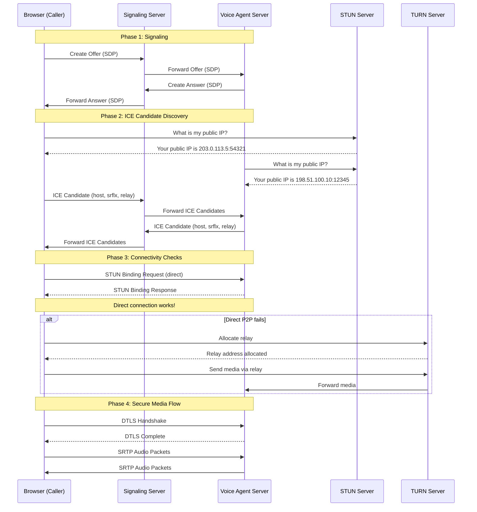
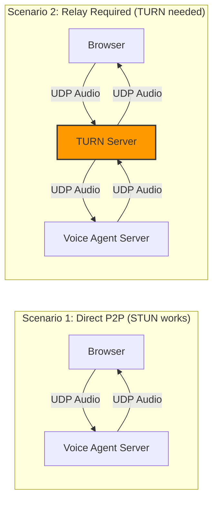
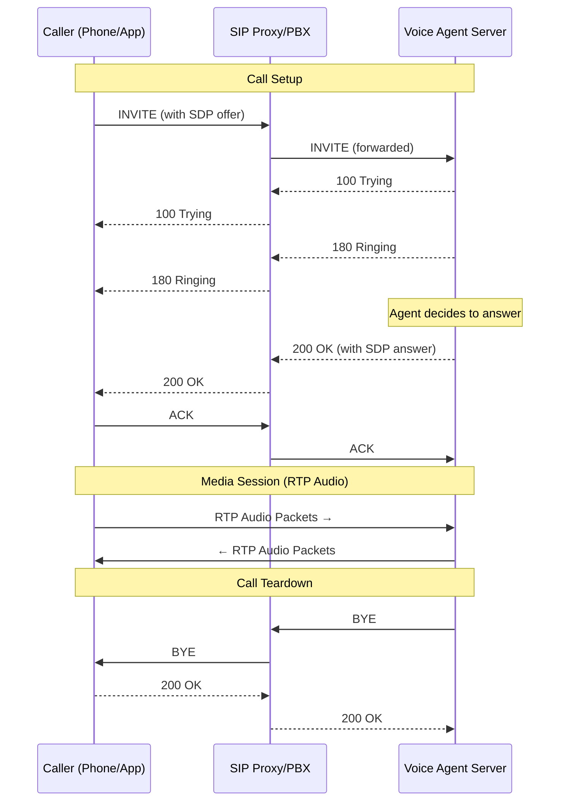
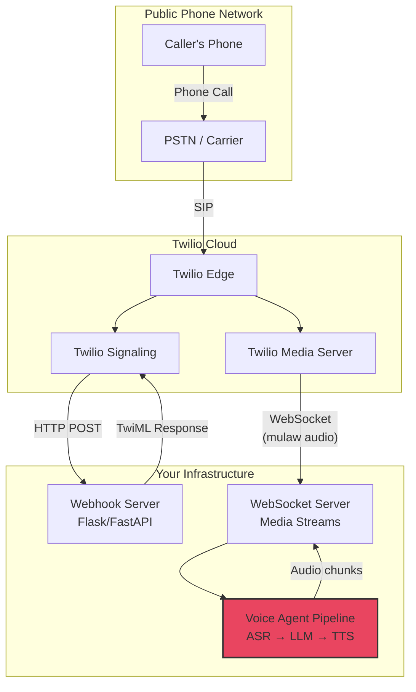
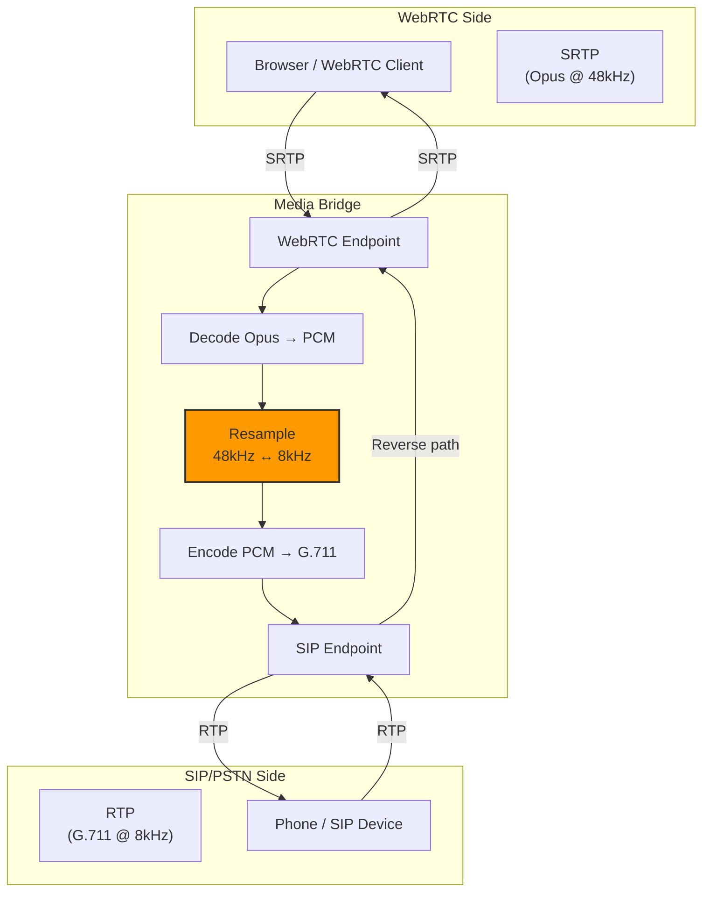
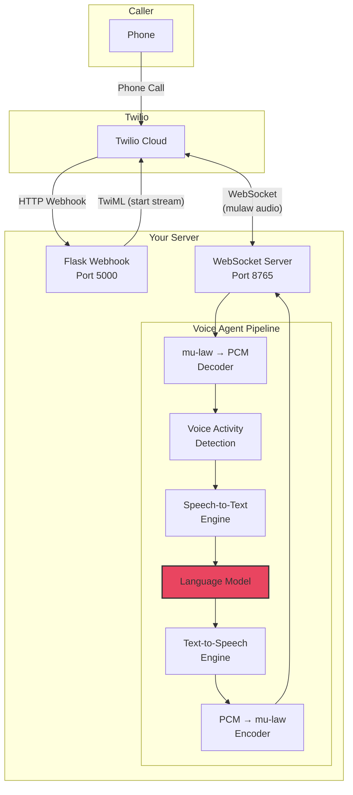

# Voice Agents Deep Dive  Part 8: WebRTC and Telephony  Browser and Phone Call Audio

---

**Series:** Building Voice Agents  A Developer's Deep Dive from Audio Fundamentals to Production
**Part:** 8 of 20 (WebRTC & Telephony)
**Audience:** Developers with Python experience who want to build voice-powered AI agents from the ground up
**Reading time:** ~55 minutes

---

## Table of Contents

1. [Recap of Part 7](#recap-of-part-7)
2. [WebRTC Fundamentals](#webrtc-fundamentals)
3. [WebRTC in Python with aiortc](#webrtc-in-python-with-aiortc)
4. [Browser-Side WebRTC](#browser-side-webrtc)
5. [Telephony Basics for Developers](#telephony-basics-for-developers)
6. [Twilio Voice Integration](#twilio-voice-integration)
7. [Other Telephony Providers](#other-telephony-providers)
8. [Open-Source Telephony  FreeSWITCH and Asterisk](#open-source-telephony--freeswitch-and-asterisk)
9. [Media Bridges  Connecting WebRTC to SIP/PSTN](#media-bridges--connecting-webrtc-to-sippstn)
10. [Project: Phone Call Handler](#project-phone-call-handler)
11. [Vocabulary Cheat Sheet](#vocabulary-cheat-sheet)
12. [What's Next  Part 9](#whats-next--part-9)

---

## Recap of Part 7

In Part 7, we tackled **streaming architecture and real-time audio pipelines**  the backbone that makes voice agents feel instantaneous. We built concurrent pipelines where audio capture, speech recognition, language model inference, and speech synthesis all run simultaneously. We explored backpressure management, chunk-based processing, and pipeline orchestration patterns that keep latency low while maintaining system stability.

We left off with a fully functional streaming pipeline that could process audio in real time. But there was a crucial missing piece: **how does the audio actually get to and from the user?**

That is exactly what Part 8 is about.

> **The big question:** You have a brilliant voice agent pipeline running on your server. A user opens their browser  or picks up their phone. How does their voice reach your server, and how does your agent's voice reach their ear?

The answer involves two very different but equally important technologies:

- **WebRTC**  for browser-based, peer-to-peer real-time communication
- **Telephony (SIP/PSTN)**  for traditional phone calls

By the end of this part, you will be able to accept voice from a web browser and from a phone call, pipe it through your voice agent, and send audio responses back  all in real time.

---

## WebRTC Fundamentals

### What Problem Does WebRTC Solve?

Before WebRTC (Web Real-Time Communication), getting live audio or video from one browser to another required plugins like Flash or Java applets. Developers had to funnel all media through a central server, adding latency, cost, and complexity.

WebRTC changed everything by providing:

1. **Direct peer-to-peer media**  audio and video flow directly between browsers when possible
2. **Built-in codecs**  Opus for audio, VP8/VP9/H.264 for video, no plugins needed
3. **NAT traversal**  mechanisms to punch through firewalls and routers
4. **Encryption by default**  all media is encrypted with DTLS-SRTP
5. **Adaptive quality**  automatic bitrate adjustment based on network conditions

> **Key insight:** WebRTC is not just "video calling in the browser." It is a complete real-time media framework that handles the hardest problems in network programming: NAT traversal, codec negotiation, encryption, and adaptive streaming. For voice agents, it gives us a zero-install path to high-quality, low-latency audio.

### The WebRTC Connection Flow

Establishing a WebRTC connection involves several steps. Let us walk through each one.



### Signaling: The Matchmaker

**Signaling** is the process by which two peers exchange the information they need to establish a connection. WebRTC deliberately does **not** define a signaling protocol  you can use WebSockets, HTTP polling, carrier pigeons, or anything else. The signaling channel carries:

1. **Session Description Protocol (SDP)**  describes what media the peer can send/receive
2. **ICE candidates**  possible network paths to reach the peer

An SDP message looks something like this:

```
v=0
o=- 4567890 2 IN IP4 127.0.0.1
s=-
t=0 0
a=group:BUNDLE audio
m=audio 9 UDP/TLS/RTP/SAVPF 111 103 104
c=IN IP4 0.0.0.0
a=rtpmap:111 opus/48000/2
a=rtpmap:103 ISAC/16000
a=rtpmap:104 ISAC/32000
a=fmtp:111 minptime=10;useinbandfec=1
a=rtcp-mux
a=ice-ufrag:abcd1234
a=ice-pwd:aabbccdd11223344
a=fingerprint:sha-256 AA:BB:CC:DD:...
a=setup:actpass
a=mid:audio
a=sendrecv
```

Let us break down the critical fields:

| SDP Field | Meaning |
|-----------|---------|
| `v=0` | Protocol version |
| `o=- 4567890 2 IN IP4` | Session origin (unique session ID) |
| `m=audio 9 UDP/TLS/RTP/SAVPF 111` | Media line: audio, port 9 (placeholder), protocol, payload types |
| `a=rtpmap:111 opus/48000/2` | Payload type 111 = Opus codec, 48kHz, 2 channels |
| `a=ice-ufrag` / `a=ice-pwd` | ICE credentials for connectivity checks |
| `a=fingerprint:sha-256` | DTLS certificate fingerprint for encryption |
| `a=setup:actpass` | DTLS role negotiation |
| `a=sendrecv` | This peer wants to both send and receive audio |

The **offer/answer model** works like this:

1. **Peer A** creates an **offer** describing what it can do
2. **Peer B** receives the offer and creates an **answer** describing what it accepts
3. Both peers now know the common ground  which codecs to use, encryption parameters, etc.

### STUN Servers: Discovering Your Public Identity

Most devices sit behind a NAT (Network Address Translation) router. Your laptop might have a local IP like `192.168.1.42`, but the outside world sees your router's public IP `203.0.113.5`. A **STUN** (Session Traversal Utilities for NAT) server helps you discover your public IP and port.

```python
"""
Simplified illustration of what a STUN request/response looks like.
In practice, you never implement this yourself  WebRTC libraries handle it.
"""

import struct
import socket
import secrets

# STUN message types
BINDING_REQUEST = 0x0001
BINDING_RESPONSE = 0x0101

# STUN magic cookie (fixed value defined in RFC 5389)
MAGIC_COOKIE = 0x2112A442

# STUN attribute types
MAPPED_ADDRESS = 0x0001
XOR_MAPPED_ADDRESS = 0x0020


def create_stun_binding_request() -> bytes:
    """Create a STUN Binding Request message."""
    # Transaction ID: 96 bits (12 bytes) of randomness
    transaction_id = secrets.token_bytes(12)

    # STUN header: type (2) + length (2) + magic cookie (4) + transaction ID (12)
    header = struct.pack(
        "!HHI",
        BINDING_REQUEST,  # Message type
        0,                # Message length (no attributes)
        MAGIC_COOKIE      # Magic cookie
    )
    return header + transaction_id


def parse_stun_binding_response(data: bytes) -> tuple[str, int]:
    """
    Parse a STUN Binding Response to extract the public IP and port.
    Returns (public_ip, public_port).
    """
    # Parse header
    msg_type, msg_length, magic_cookie = struct.unpack("!HHI", data[:8])
    transaction_id = data[8:20]

    if msg_type != BINDING_RESPONSE:
        raise ValueError(f"Expected Binding Response, got 0x{msg_type:04x}")

    # Parse attributes
    offset = 20
    while offset < 20 + msg_length:
        attr_type, attr_length = struct.unpack("!HH", data[offset:offset + 4])
        attr_value = data[offset + 4:offset + 4 + attr_length]

        if attr_type == XOR_MAPPED_ADDRESS:
            # XOR-MAPPED-ADDRESS: family (1) + port (2) + address (4 or 16)
            _reserved, family = struct.unpack("!BB", attr_value[:2])
            xor_port = struct.unpack("!H", attr_value[2:4])[0]
            port = xor_port ^ (MAGIC_COOKIE >> 16)

            if family == 0x01:  # IPv4
                xor_addr = struct.unpack("!I", attr_value[4:8])[0]
                addr = xor_addr ^ MAGIC_COOKIE
                ip = socket.inet_ntoa(struct.pack("!I", addr))
                return ip, port

        # Move to next attribute (padded to 4-byte boundary)
        offset += 4 + attr_length + (4 - attr_length % 4) % 4

    raise ValueError("No XOR-MAPPED-ADDRESS found in response")


def discover_public_address(stun_server: str = "stun.l.google.com",
                            stun_port: int = 19302) -> tuple[str, int]:
    """
    Send a STUN Binding Request and return our public (IP, port).
    """
    sock = socket.socket(socket.AF_INET, socket.SOCK_DGRAM)
    sock.settimeout(3.0)

    try:
        request = create_stun_binding_request()
        sock.sendto(request, (stun_server, stun_port))
        response, _ = sock.recvfrom(1024)
        return parse_stun_binding_response(response)
    finally:
        sock.close()


# Usage
if __name__ == "__main__":
    public_ip, public_port = discover_public_address()
    print(f"Public address: {public_ip}:{public_port}")
    # Output: Public address: 203.0.113.5:54321
```

> **Why STUN matters for voice agents:** Your voice agent server might be behind a corporate NAT or running in a Docker container with its own network namespace. STUN helps WebRTC discover the real address where your server can receive media packets.

### TURN Servers: The Relay Fallback

Sometimes direct peer-to-peer communication is impossible. Symmetric NATs, strict firewalls, or corporate proxy servers can block direct UDP packets. In these cases, a **TURN** (Traversal Using Relays around NAT) server acts as a relay.



TURN adds latency (every packet makes an extra hop) and costs bandwidth (the relay server handles all media traffic). In production, you want TURN as a fallback, not the primary path.

| Method | Latency | Cost | Success Rate |
|--------|---------|------|-------------|
| Direct P2P (host candidates) | Lowest | Free | ~40% (same network only) |
| STUN (server reflexive) | Low | Free | ~80% |
| TURN UDP relay | Medium | $$ (bandwidth) | ~95% |
| TURN TCP relay | Higher | $$ (bandwidth) | ~99% |
| TURN TLS relay | Highest | $$ (bandwidth) | ~99.5% |

### ICE: The Connectivity Framework

**ICE** (Interactive Connectivity Establishment) is the framework that ties STUN and TURN together. It systematically tries every possible path between two peers and picks the best one.

ICE gathers three types of **candidates**:

1. **Host candidates**  local IP addresses (e.g., `192.168.1.42:54321`)
2. **Server reflexive (srflx) candidates**  public IP discovered via STUN (e.g., `203.0.113.5:54321`)
3. **Relay candidates**  TURN server relay addresses (e.g., `198.51.100.50:3478`)

```python
"""
Illustration of ICE candidate types and their properties.
"""

from dataclasses import dataclass
from enum import Enum


class CandidateType(Enum):
    HOST = "host"           # Local address
    SRFLX = "srflx"        # Server reflexive (STUN)
    RELAY = "relay"         # TURN relay
    PRFLX = "prflx"        # Peer reflexive (discovered during checks)


@dataclass
class ICECandidate:
    """Represents a single ICE candidate."""
    foundation: str          # Groups similar candidates
    component: int           # 1 = RTP, 2 = RTCP
    protocol: str            # "udp" or "tcp"
    priority: int            # Higher = preferred
    ip: str
    port: int
    candidate_type: CandidateType
    related_address: str | None = None   # Base address for srflx/relay
    related_port: int | None = None

    def to_sdp(self) -> str:
        """Convert to SDP a=candidate line format."""
        line = (
            f"candidate:{self.foundation} {self.component} "
            f"{self.protocol} {self.priority} "
            f"{self.ip} {self.port} typ {self.candidate_type.value}"
        )
        if self.related_address:
            line += f" raddr {self.related_address} rport {self.related_port}"
        return line


def calculate_priority(candidate_type: CandidateType,
                       local_preference: int = 65535,
                       component: int = 1) -> int:
    """
    Calculate ICE candidate priority per RFC 8445.

    priority = (2^24) * type_preference +
               (2^8)  * local_preference +
               (2^0)  * (256 - component)
    """
    type_preferences = {
        CandidateType.HOST: 126,
        CandidateType.PRFLX: 110,
        CandidateType.SRFLX: 100,
        CandidateType.RELAY: 0,
    }
    type_pref = type_preferences[candidate_type]
    return (2**24) * type_pref + (2**8) * local_preference + (256 - component)


# Example: gathering candidates
host_candidate = ICECandidate(
    foundation="1",
    component=1,
    protocol="udp",
    priority=calculate_priority(CandidateType.HOST),
    ip="192.168.1.42",
    port=54321,
    candidate_type=CandidateType.HOST,
)

srflx_candidate = ICECandidate(
    foundation="2",
    component=1,
    protocol="udp",
    priority=calculate_priority(CandidateType.SRFLX),
    ip="203.0.113.5",
    port=54321,
    candidate_type=CandidateType.SRFLX,
    related_address="192.168.1.42",
    related_port=54321,
)

relay_candidate = ICECandidate(
    foundation="3",
    component=1,
    protocol="udp",
    priority=calculate_priority(CandidateType.RELAY),
    ip="198.51.100.50",
    port=3478,
    candidate_type=CandidateType.RELAY,
    related_address="203.0.113.5",
    related_port=54321,
)

print("ICE Candidates (highest priority first):")
for candidate in sorted(
    [host_candidate, srflx_candidate, relay_candidate],
    key=lambda c: c.priority,
    reverse=True,
):
    print(f"  [{candidate.candidate_type.value:6s}] "
          f"priority={candidate.priority:>12,d}  "
          f"{candidate.ip}:{candidate.port}")
    print(f"    SDP: a={candidate.to_sdp()}")

# Output:
# ICE Candidates (highest priority first):
#   [host  ] priority= 2,130,706,175  192.168.1.42:54321
#     SDP: a=candidate:1 1 udp 2130706175 192.168.1.42 54321 typ host
#   [srflx ] priority= 1,694,498,559  203.0.113.5:54321
#     SDP: a=candidate:2 1 udp 1694498559 203.0.113.5 54321 typ srflx ...
#   [relay ] priority=      16,777,215  198.51.100.50:3478
#     SDP: a=candidate:3 1 udp 16777215 198.51.100.50 3478 typ relay ...
```

ICE then forms **candidate pairs** (one local candidate + one remote candidate) and performs **connectivity checks**  sending STUN Binding Requests over each pair to see which ones work. The pair with the highest combined priority that successfully completes a check becomes the **selected pair**.

### Media Tracks and Data Channels

Once ICE succeeds and DTLS-SRTP encryption is established, WebRTC provides two types of communication channels:

**Media Tracks** carry audio and video using RTP (Real-time Transport Protocol):

- **Audio tracks**  typically encoded with Opus at 48 kHz
- **Video tracks**  encoded with VP8, VP9, or H.264
- Tracks have direction: `sendonly`, `recvonly`, `sendrecv`, `inactive`

**Data Channels** carry arbitrary data using SCTP (Stream Control Transmission Protocol):

- Ordered or unordered delivery
- Reliable or unreliable (with optional max retransmits)
- Low-latency binary or text data
- Perfect for sending transcripts, metadata, or control messages alongside audio

```python
"""
Conceptual overview of WebRTC media tracks and data channels.
"""

from dataclasses import dataclass, field
from enum import Enum
from typing import Callable


class TrackKind(Enum):
    AUDIO = "audio"
    VIDEO = "video"


class TrackDirection(Enum):
    SEND_RECV = "sendrecv"
    SEND_ONLY = "sendonly"
    RECV_ONLY = "recvonly"
    INACTIVE = "inactive"


@dataclass
class MediaTrack:
    """Represents a WebRTC media track."""
    kind: TrackKind
    track_id: str
    direction: TrackDirection = TrackDirection.SEND_RECV
    enabled: bool = True
    codec: str = "opus"        # For audio
    sample_rate: int = 48000   # For audio
    channels: int = 2          # For audio

    def on_frame(self, callback: Callable):
        """Register callback for incoming frames."""
        self._frame_callback = callback


@dataclass
class DataChannel:
    """Represents a WebRTC data channel."""
    label: str
    channel_id: int | None = None
    ordered: bool = True
    max_retransmits: int | None = None
    max_packet_life_time: int | None = None  # milliseconds
    protocol: str = ""
    negotiated: bool = False
    ready_state: str = "connecting"  # connecting, open, closing, closed

    _message_callbacks: list[Callable] = field(default_factory=list)

    def send(self, data: str | bytes) -> None:
        """Send data through the channel."""
        if self.ready_state != "open":
            raise RuntimeError(f"Channel not open (state: {self.ready_state})")
        # In real implementation, this sends via SCTP
        print(f"[DataChannel '{self.label}'] Sending: {data!r}")

    def on_message(self, callback: Callable) -> None:
        """Register callback for incoming messages."""
        self._message_callbacks.append(callback)


# Example usage for a voice agent:
# 1. Audio track for voice communication
audio_track = MediaTrack(
    kind=TrackKind.AUDIO,
    track_id="voice-agent-audio",
    direction=TrackDirection.SEND_RECV,
    codec="opus",
    sample_rate=48000,
    channels=1,  # Mono for voice
)

# 2. Data channel for transcripts and control
transcript_channel = DataChannel(
    label="transcripts",
    ordered=True,  # We want transcripts in order
)

# 3. Data channel for low-latency events
event_channel = DataChannel(
    label="events",
    ordered=False,          # Speed over ordering
    max_retransmits=0,      # Unreliable = lowest latency
)

print(f"Audio track: {audio_track.codec} @ {audio_track.sample_rate}Hz")
print(f"Transcript channel: ordered={transcript_channel.ordered}")
print(f"Event channel: ordered={event_channel.ordered}, "
      f"max_retransmits={event_channel.max_retransmits}")
```

---

## WebRTC in Python with aiortc

### Why aiortc?

**aiortc** is a Python library that implements WebRTC and ORTC (Object Real-Time Communications). It is built on top of `asyncio`, making it a natural fit for Python voice agent servers. Unlike browser-based WebRTC implementations (written in C++), aiortc is pure Python (with some C extensions for codecs), which means:

- Full control over media processing in Python
- Easy integration with Python ML/AI libraries
- No need for a headless browser
- Direct access to raw audio frames

```bash
# Installation
pip install aiortc aiohttp
```

### Building a WebRTC Voice Server

Let us build a complete WebRTC voice server that accepts browser connections and processes audio.

```python
"""
webrtc_voice_server.py

A complete WebRTC voice server using aiortc.
Accepts browser connections, receives audio, processes it,
and sends audio responses back.
"""

import asyncio
import json
import logging
import uuid
from typing import Any

import numpy as np
from aiohttp import web
from aiortc import (
    MediaStreamTrack,
    RTCConfiguration,
    RTCIceServer,
    RTCPeerConnection,
    RTCSessionDescription,
)
from aiortc.contrib.media import MediaRelay
from av import AudioFrame

logger = logging.getLogger(__name__)


# ---------------------------------------------------------------------------
# Custom Audio Track: processes incoming audio and produces responses
# ---------------------------------------------------------------------------

class AudioProcessorTrack(MediaStreamTrack):
    """
    A MediaStreamTrack that receives audio from the browser,
    processes it, and outputs audio responses.
    """

    kind = "audio"

    def __init__(self, source_track: MediaStreamTrack):
        super().__init__()
        self.source_track = source_track
        self._audio_buffer: list[np.ndarray] = []
        self._response_queue: asyncio.Queue[np.ndarray] = asyncio.Queue()
        self._sample_rate = 48000
        self._channels = 1
        self._samples_per_frame = 960  # 20ms at 48kHz
        self._processing = False

    async def recv(self) -> AudioFrame:
        """
        Called by WebRTC when it needs the next audio frame to send.
        Returns processed/response audio.
        """
        # Get the incoming frame from the remote peer
        incoming_frame = await self.source_track.recv()

        # Convert to numpy for processing
        incoming_audio = self._frame_to_numpy(incoming_frame)

        # Buffer the incoming audio
        self._audio_buffer.append(incoming_audio)

        # Check if we have a response ready
        try:
            response_audio = self._response_queue.get_nowait()
        except asyncio.QueueEmpty:
            # No response ready  send silence
            response_audio = np.zeros(
                self._samples_per_frame, dtype=np.int16
            )

        # Convert numpy back to AudioFrame
        return self._numpy_to_frame(response_audio)

    def _frame_to_numpy(self, frame: AudioFrame) -> np.ndarray:
        """Convert an av.AudioFrame to a numpy array."""
        # Resample to our target format if needed
        resampled = frame.reformat(
            format="s16",
            layout="mono",
            rate=self._sample_rate,
        )
        return np.frombuffer(
            resampled.planes[0], dtype=np.int16
        ).copy()

    def _numpy_to_frame(self, audio: np.ndarray) -> AudioFrame:
        """Convert a numpy array to an av.AudioFrame."""
        frame = AudioFrame(
            format="s16",
            layout="mono",
            samples=len(audio),
        )
        frame.sample_rate = self._sample_rate
        frame.pts = None  # Let aiortc handle timestamps
        frame.planes[0].update(audio.tobytes())
        return frame

    async def process_buffered_audio(self) -> None:
        """
        Background task that processes buffered audio.
        In a real agent, this would run ASR -> LLM -> TTS.
        """
        while True:
            await asyncio.sleep(0.5)  # Process every 500ms

            if not self._audio_buffer:
                continue

            # Concatenate buffered audio
            combined = np.concatenate(self._audio_buffer)
            self._audio_buffer.clear()

            # --- Placeholder for real processing ---
            # In production, you would:
            # 1. Run ASR (speech-to-text) on combined audio
            # 2. Send transcript to LLM for response
            # 3. Run TTS on LLM response
            # 4. Queue the TTS audio for playback
            #
            # For now, we echo the audio back (with a slight modification)
            response = (combined * 0.8).astype(np.int16)

            # Break response into frame-sized chunks
            for i in range(0, len(response), self._samples_per_frame):
                chunk = response[i:i + self._samples_per_frame]
                if len(chunk) < self._samples_per_frame:
                    chunk = np.pad(
                        chunk,
                        (0, self._samples_per_frame - len(chunk)),
                    )
                await self._response_queue.put(chunk)


# ---------------------------------------------------------------------------
# Connection manager: tracks all active peer connections
# ---------------------------------------------------------------------------

class ConnectionManager:
    """Manages WebRTC peer connections."""

    def __init__(self):
        self._connections: dict[str, RTCPeerConnection] = {}
        self._processors: dict[str, AudioProcessorTrack] = {}
        self._tasks: dict[str, asyncio.Task] = {}
        self._relay = MediaRelay()

    async def create_connection(
        self, offer_sdp: str, offer_type: str
    ) -> tuple[str, str, str]:
        """
        Create a new peer connection from a browser offer.
        Returns (connection_id, answer_sdp, answer_type).
        """
        connection_id = str(uuid.uuid4())

        # Configure ICE servers
        config = RTCConfiguration(
            iceServers=[
                RTCIceServer(urls=["stun:stun.l.google.com:19302"]),
                RTCIceServer(urls=["stun:stun1.l.google.com:19302"]),
                # Add TURN server for production:
                # RTCIceServer(
                #     urls=["turn:turn.example.com:3478"],
                #     username="user",
                #     credential="pass",
                # ),
            ]
        )

        pc = RTCPeerConnection(configuration=config)
        self._connections[connection_id] = pc

        # --- Event handlers ---

        @pc.on("connectionstatechange")
        async def on_connection_state_change():
            state = pc.connectionState
            logger.info(
                f"Connection {connection_id}: state={state}"
            )
            if state in ("failed", "closed"):
                await self.close_connection(connection_id)

        @pc.on("track")
        def on_track(track: MediaStreamTrack):
            logger.info(
                f"Connection {connection_id}: "
                f"received {track.kind} track"
            )
            if track.kind == "audio":
                # Create processor that reads from this track
                processor = AudioProcessorTrack(
                    self._relay.subscribe(track)
                )
                self._processors[connection_id] = processor

                # Add our response track to send audio back
                pc.addTrack(processor)

                # Start background processing
                task = asyncio.create_task(
                    processor.process_buffered_audio()
                )
                self._tasks[connection_id] = task

                @track.on("ended")
                async def on_ended():
                    logger.info(
                        f"Connection {connection_id}: track ended"
                    )

        @pc.on("datachannel")
        def on_datachannel(channel):
            logger.info(
                f"Connection {connection_id}: "
                f"data channel '{channel.label}' opened"
            )

            @channel.on("message")
            def on_message(message):
                logger.info(
                    f"Connection {connection_id}: "
                    f"message on '{channel.label}': {message}"
                )
                # Echo back for now
                channel.send(f"Server received: {message}")

        # --- Process the offer ---
        offer = RTCSessionDescription(sdp=offer_sdp, type=offer_type)
        await pc.setRemoteDescription(offer)

        # Create answer
        answer = await pc.createAnswer()
        await pc.setLocalDescription(answer)

        return (
            connection_id,
            pc.localDescription.sdp,
            pc.localDescription.type,
        )

    async def close_connection(self, connection_id: str) -> None:
        """Close and clean up a peer connection."""
        if connection_id in self._tasks:
            self._tasks[connection_id].cancel()
            del self._tasks[connection_id]

        if connection_id in self._processors:
            del self._processors[connection_id]

        if connection_id in self._connections:
            await self._connections[connection_id].close()
            del self._connections[connection_id]
            logger.info(f"Connection {connection_id}: closed")

    async def close_all(self) -> None:
        """Close all connections."""
        ids = list(self._connections.keys())
        for cid in ids:
            await self.close_connection(cid)


# ---------------------------------------------------------------------------
# HTTP server: serves the signaling API and static files
# ---------------------------------------------------------------------------

manager = ConnectionManager()


async def handle_offer(request: web.Request) -> web.Response:
    """Handle WebRTC offer from a browser."""
    body = await request.json()

    connection_id, answer_sdp, answer_type = (
        await manager.create_connection(
            offer_sdp=body["sdp"],
            offer_type=body["type"],
        )
    )

    return web.json_response({
        "connectionId": connection_id,
        "sdp": answer_sdp,
        "type": answer_type,
    })


async def handle_close(request: web.Request) -> web.Response:
    """Close a specific connection."""
    body = await request.json()
    await manager.close_connection(body["connectionId"])
    return web.json_response({"status": "closed"})


async def handle_health(request: web.Request) -> web.Response:
    """Health check endpoint."""
    return web.json_response({
        "status": "healthy",
        "active_connections": len(manager._connections),
    })


async def on_shutdown(app: web.Application) -> None:
    """Cleanup on server shutdown."""
    await manager.close_all()


def create_app() -> web.Application:
    """Create the aiohttp application."""
    app = web.Application()
    app.on_shutdown.append(on_shutdown)

    app.router.add_post("/offer", handle_offer)
    app.router.add_post("/close", handle_close)
    app.router.add_get("/health", handle_health)
    # Serve static files (HTML/JS) from ./static directory
    app.router.add_static("/", "./static", show_index=True)

    return app


if __name__ == "__main__":
    logging.basicConfig(level=logging.INFO)
    app = create_app()
    web.run_app(app, host="0.0.0.0", port=8080)
```

### Understanding the Audio Processing Pipeline

```mermaid
graph LR
    subgraph Browser
        Mic[Microphone] --> AT[Audio Track]
    end

    subgraph "WebRTC Transport"
        AT -->|"Opus/RTP/SRTP"| ICE[ICE Layer]
        ICE -->|"UDP packets"| NET((Network))
    end

    subgraph "Python Server (aiortc)"
        NET --> RECV[recv incoming frame]
        RECV --> NP[Convert to NumPy]
        NP --> BUF[Audio Buffer]
        BUF --> ASR[ASR Processing]
        ASR --> LLM[LLM Response]
        LLM --> TTS[TTS Synthesis]
        TTS --> QUEUE[Response Queue]
        QUEUE --> SEND[AudioFrame out]
    end

    SEND -->|"Opus/RTP/SRTP"| ICE2[ICE Layer]
    ICE2 -->|"UDP packets"| NET2((Network))
    NET2 --> SPK[Browser Speaker]
```



---

## Browser-Side WebRTC

### The Complete Browser Client

The browser side needs JavaScript to capture the microphone, establish the WebRTC connection, and play back audio from the server. Here is a complete, production-ready client.

```html
<!-- static/index.html -->
<!DOCTYPE html>
<html lang="en">
<head>
    <meta charset="UTF-8">
    <meta name="viewport" content="width=device-width, initial-scale=1.0">
    <title>Voice Agent  WebRTC Client</title>
    <style>
        * {
            margin: 0;
            padding: 0;
            box-sizing: border-box;
        }

        body {
            font-family: -apple-system, BlinkMacSystemFont,
                         'Segoe UI', Roboto, sans-serif;
            background: #1a1a2e;
            color: #eee;
            display: flex;
            justify-content: center;
            align-items: center;
            min-height: 100vh;
        }

        .container {
            text-align: center;
            max-width: 600px;
            padding: 2rem;
        }

        h1 {
            margin-bottom: 0.5rem;
            font-size: 1.8rem;
        }

        .subtitle {
            color: #888;
            margin-bottom: 2rem;
        }

        #connectBtn {
            background: #e94560;
            color: white;
            border: none;
            padding: 1rem 2.5rem;
            font-size: 1.2rem;
            border-radius: 50px;
            cursor: pointer;
            transition: all 0.3s;
        }

        #connectBtn:hover {
            background: #c73e54;
            transform: scale(1.05);
        }

        #connectBtn:disabled {
            background: #555;
            cursor: not-allowed;
            transform: none;
        }

        #connectBtn.connected {
            background: #2ecc71;
        }

        .visualizer {
            margin: 2rem auto;
            width: 400px;
            height: 120px;
            background: #16213e;
            border-radius: 12px;
            overflow: hidden;
        }

        #status {
            margin-top: 1rem;
            font-size: 0.9rem;
            color: #888;
        }

        .transcript {
            margin-top: 2rem;
            text-align: left;
            background: #16213e;
            border-radius: 12px;
            padding: 1rem;
            max-height: 300px;
            overflow-y: auto;
        }

        .transcript p {
            margin: 0.5rem 0;
            padding: 0.5rem;
            border-radius: 8px;
        }

        .transcript .user {
            background: rgba(233, 69, 96, 0.2);
        }

        .transcript .agent {
            background: rgba(46, 204, 113, 0.2);
        }
    </style>
</head>
<body>
    <div class="container">
        <h1>Voice Agent</h1>
        <p class="subtitle">WebRTC-powered voice interaction</p>

        <button id="connectBtn" onclick="toggleConnection()">
            Start Talking
        </button>

        <div class="visualizer">
            <canvas id="visualizer" width="400" height="120"></canvas>
        </div>

        <div id="status">Click the button to connect</div>

        <div class="transcript" id="transcript"></div>
    </div>

    <script src="client.js"></script>
</body>
</html>
```

```javascript
// static/client.js

/**
 * WebRTC Voice Agent Client
 *
 * Handles:
 * - Microphone capture via getUserMedia
 * - WebRTC peer connection setup
 * - Offer/answer exchange with signaling server
 * - Audio visualization using Web Audio API
 * - Data channel for transcripts
 */

class VoiceAgentClient {
    constructor() {
        // WebRTC state
        this.peerConnection = null;
        this.connectionId = null;
        this.localStream = null;
        this.dataChannel = null;

        // Audio visualization
        this.audioContext = null;
        this.analyser = null;
        this.animationFrame = null;

        // UI elements
        this.connectBtn = document.getElementById('connectBtn');
        this.statusEl = document.getElementById('status');
        this.transcriptEl = document.getElementById('transcript');
        this.canvas = document.getElementById('visualizer');
        this.canvasCtx = this.canvas.getContext('2d');

        // State
        this.isConnected = false;
    }

    // ------------------------------------------------------------------
    // Connection lifecycle
    // ------------------------------------------------------------------

    async connect() {
        try {
            this.updateStatus('Requesting microphone access...');

            // Step 1: Get microphone access
            this.localStream = await navigator.mediaDevices.getUserMedia({
                audio: {
                    echoCancellation: true,
                    noiseSuppression: true,
                    autoGainControl: true,
                    sampleRate: 48000,
                    channelCount: 1,
                },
                video: false,
            });

            this.updateStatus('Microphone acquired. Setting up connection...');

            // Step 2: Set up audio visualization
            this.setupVisualization();

            // Step 3: Create peer connection
            this.peerConnection = new RTCPeerConnection({
                iceServers: [
                    { urls: 'stun:stun.l.google.com:19302' },
                    { urls: 'stun:stun1.l.google.com:19302' },
                ],
            });

            // Step 4: Set up event handlers
            this.setupPeerConnectionHandlers();

            // Step 5: Add local audio track
            this.localStream.getTracks().forEach(track => {
                this.peerConnection.addTrack(track, this.localStream);
            });

            // Step 6: Create data channel for transcripts
            this.dataChannel = this.peerConnection.createDataChannel(
                'transcripts',
                { ordered: true }
            );
            this.setupDataChannel();

            // Step 7: Create and send offer
            const offer = await this.peerConnection.createOffer();
            await this.peerConnection.setLocalDescription(offer);

            this.updateStatus('Sending offer to server...');

            // Step 8: Send offer to signaling server
            const response = await fetch('/offer', {
                method: 'POST',
                headers: { 'Content-Type': 'application/json' },
                body: JSON.stringify({
                    sdp: this.peerConnection.localDescription.sdp,
                    type: this.peerConnection.localDescription.type,
                }),
            });

            const answer = await response.json();
            this.connectionId = answer.connectionId;

            // Step 9: Set remote description (server's answer)
            await this.peerConnection.setRemoteDescription(
                new RTCSessionDescription({
                    sdp: answer.sdp,
                    type: answer.type,
                })
            );

            this.updateStatus('Connection established! Speak now.');
            this.isConnected = true;
            this.connectBtn.textContent = 'Stop';
            this.connectBtn.classList.add('connected');

        } catch (error) {
            console.error('Connection failed:', error);
            this.updateStatus(`Error: ${error.message}`);
            this.disconnect();
        }
    }

    async disconnect() {
        // Close data channel
        if (this.dataChannel) {
            this.dataChannel.close();
            this.dataChannel = null;
        }

        // Close peer connection
        if (this.peerConnection) {
            this.peerConnection.close();
            this.peerConnection = null;
        }

        // Stop local media tracks
        if (this.localStream) {
            this.localStream.getTracks().forEach(t => t.stop());
            this.localStream = null;
        }

        // Stop visualization
        if (this.animationFrame) {
            cancelAnimationFrame(this.animationFrame);
            this.animationFrame = null;
        }

        // Close audio context
        if (this.audioContext) {
            await this.audioContext.close();
            this.audioContext = null;
        }

        // Notify server
        if (this.connectionId) {
            try {
                await fetch('/close', {
                    method: 'POST',
                    headers: { 'Content-Type': 'application/json' },
                    body: JSON.stringify({
                        connectionId: this.connectionId,
                    }),
                });
            } catch (e) {
                // Server might already be gone
            }
            this.connectionId = null;
        }

        this.isConnected = false;
        this.connectBtn.textContent = 'Start Talking';
        this.connectBtn.classList.remove('connected');
        this.updateStatus('Disconnected');
        this.clearCanvas();
    }

    // ------------------------------------------------------------------
    // Peer connection event handlers
    // ------------------------------------------------------------------

    setupPeerConnectionHandlers() {
        const pc = this.peerConnection;

        pc.oniceconnectionstatechange = () => {
            console.log('ICE state:', pc.iceConnectionState);
            this.updateStatus(
                `ICE: ${pc.iceConnectionState}`
            );
        };

        pc.onconnectionstatechange = () => {
            console.log('Connection state:', pc.connectionState);
            if (pc.connectionState === 'failed' ||
                pc.connectionState === 'disconnected') {
                this.updateStatus('Connection lost. Reconnecting...');
            }
        };

        pc.onicecandidate = (event) => {
            if (event.candidate) {
                console.log(
                    'ICE candidate:',
                    event.candidate.type,
                    event.candidate.address
                );
            }
        };

        // Handle incoming tracks (server's audio response)
        pc.ontrack = (event) => {
            console.log('Received remote track:', event.track.kind);

            if (event.track.kind === 'audio') {
                // Create audio element to play the response
                const audioEl = new Audio();
                audioEl.srcObject = event.streams[0];
                audioEl.autoplay = true;

                // Also connect to analyser for visualization
                if (this.audioContext) {
                    const source =
                        this.audioContext.createMediaStreamSource(
                            event.streams[0]
                        );
                    // You could create a second analyser for
                    // the remote audio here
                }
            }
        };
    }

    // ------------------------------------------------------------------
    // Data channel
    // ------------------------------------------------------------------

    setupDataChannel() {
        this.dataChannel.onopen = () => {
            console.log('Data channel opened');
            this.dataChannel.send(JSON.stringify({
                type: 'hello',
                timestamp: Date.now(),
            }));
        };

        this.dataChannel.onmessage = (event) => {
            console.log('Data channel message:', event.data);

            try {
                const msg = JSON.parse(event.data);
                if (msg.transcript) {
                    this.addTranscript(msg.role, msg.transcript);
                }
            } catch {
                // Plain text message
                this.addTranscript('agent', event.data);
            }
        };

        this.dataChannel.onclose = () => {
            console.log('Data channel closed');
        };
    }

    // ------------------------------------------------------------------
    // Audio visualization (Web Audio API)
    // ------------------------------------------------------------------

    setupVisualization() {
        this.audioContext = new (
            window.AudioContext || window.webkitAudioContext
        )({ sampleRate: 48000 });

        this.analyser = this.audioContext.createAnalyser();
        this.analyser.fftSize = 256;
        this.analyser.smoothingTimeConstant = 0.8;

        // Connect microphone to analyser
        const source = this.audioContext.createMediaStreamSource(
            this.localStream
        );
        source.connect(this.analyser);
        // Note: do NOT connect analyser to destination
        // (that would cause feedback)

        this.drawVisualization();
    }

    drawVisualization() {
        if (!this.analyser) return;

        const bufferLength = this.analyser.frequencyBinCount;
        const dataArray = new Uint8Array(bufferLength);

        const draw = () => {
            this.animationFrame = requestAnimationFrame(draw);
            this.analyser.getByteFrequencyData(dataArray);

            const { width, height } = this.canvas;
            this.canvasCtx.fillStyle = '#16213e';
            this.canvasCtx.fillRect(0, 0, width, height);

            const barWidth = (width / bufferLength) * 2.5;
            let x = 0;

            for (let i = 0; i < bufferLength; i++) {
                const barHeight =
                    (dataArray[i] / 255) * height;

                // Gradient from red to blue based on frequency
                const hue = (i / bufferLength) * 240;
                this.canvasCtx.fillStyle =
                    `hsl(${hue}, 80%, 55%)`;

                this.canvasCtx.fillRect(
                    x,
                    height - barHeight,
                    barWidth,
                    barHeight
                );

                x += barWidth + 1;
            }
        };

        draw();
    }

    clearCanvas() {
        const { width, height } = this.canvas;
        this.canvasCtx.fillStyle = '#16213e';
        this.canvasCtx.fillRect(0, 0, width, height);
    }

    // ------------------------------------------------------------------
    // UI helpers
    // ------------------------------------------------------------------

    updateStatus(message) {
        this.statusEl.textContent = message;
    }

    addTranscript(role, text) {
        const p = document.createElement('p');
        p.className = role;
        p.textContent = `${role === 'user' ? 'You' : 'Agent'}: ${text}`;
        this.transcriptEl.appendChild(p);
        this.transcriptEl.scrollTop =
            this.transcriptEl.scrollHeight;
    }
}

// ------------------------------------------------------------------
// Global instance and toggle function
// ------------------------------------------------------------------

const client = new VoiceAgentClient();

async function toggleConnection() {
    const btn = document.getElementById('connectBtn');
    btn.disabled = true;

    try {
        if (client.isConnected) {
            await client.disconnect();
        } else {
            await client.connect();
        }
    } finally {
        btn.disabled = false;
    }
}
```

### Audio Processing with the Web Audio API

The Web Audio API gives us fine-grained control over audio in the browser. Here are some patterns useful for voice agents.

```javascript
/**
 * Advanced Web Audio API patterns for voice agents.
 */

class AudioProcessor {
    constructor() {
        this.audioContext = null;
        this.processorNode = null;
    }

    /**
     * Voice Activity Detection (VAD) using volume level.
     * Determines if the user is currently speaking.
     */
    createVAD(stream, options = {}) {
        const {
            threshold = -50,        // dB threshold
            smoothing = 0.95,       // Smoothing factor
            onSpeechStart = null,
            onSpeechEnd = null,
            silenceTimeout = 1500,  // ms of silence before "end"
        } = options;

        const ctx = new AudioContext();
        const source = ctx.createMediaStreamSource(stream);
        const analyser = ctx.createAnalyser();
        analyser.fftSize = 512;
        analyser.smoothingTimeConstant = smoothing;
        source.connect(analyser);

        const dataArray = new Float32Array(analyser.fftSize);
        let isSpeaking = false;
        let silenceTimer = null;

        const checkLevel = () => {
            analyser.getFloatTimeDomainData(dataArray);

            // Calculate RMS (Root Mean Square) level
            let sumSquares = 0;
            for (let i = 0; i < dataArray.length; i++) {
                sumSquares += dataArray[i] * dataArray[i];
            }
            const rms = Math.sqrt(sumSquares / dataArray.length);
            const dB = 20 * Math.log10(rms + 1e-10);

            if (dB > threshold) {
                // Sound detected
                if (!isSpeaking) {
                    isSpeaking = true;
                    if (onSpeechStart) onSpeechStart();
                }
                // Reset silence timer
                if (silenceTimer) {
                    clearTimeout(silenceTimer);
                    silenceTimer = null;
                }
            } else if (isSpeaking) {
                // Below threshold but was speaking
                if (!silenceTimer) {
                    silenceTimer = setTimeout(() => {
                        isSpeaking = false;
                        if (onSpeechEnd) onSpeechEnd();
                        silenceTimer = null;
                    }, silenceTimeout);
                }
            }

            requestAnimationFrame(checkLevel);
        };

        checkLevel();

        return {
            destroy: () => {
                ctx.close();
                if (silenceTimer) clearTimeout(silenceTimer);
            },
        };
    }

    /**
     * Audio level meter that returns normalized 0-1 values.
     * Useful for UI indicators.
     */
    createLevelMeter(stream) {
        const ctx = new AudioContext();
        const source = ctx.createMediaStreamSource(stream);
        const analyser = ctx.createAnalyser();
        analyser.fftSize = 256;
        source.connect(analyser);

        const dataArray = new Uint8Array(analyser.frequencyBinCount);

        return {
            getLevel: () => {
                analyser.getByteFrequencyData(dataArray);
                let sum = 0;
                for (let i = 0; i < dataArray.length; i++) {
                    sum += dataArray[i];
                }
                return sum / (dataArray.length * 255);
            },
            destroy: () => ctx.close(),
        };
    }

    /**
     * AudioWorklet-based processor for raw audio access.
     * This runs in a separate thread for better performance.
     */
    async createWorkletProcessor(stream) {
        const ctx = new AudioContext({ sampleRate: 16000 });

        // Register the worklet processor
        await ctx.audioWorklet.addModule('audio-processor.js');

        const source = ctx.createMediaStreamSource(stream);
        const workletNode = new AudioWorkletNode(
            ctx, 'voice-processor'
        );

        // Handle audio data from the worklet
        workletNode.port.onmessage = (event) => {
            const { audioData, timestamp } = event.data;
            // audioData is a Float32Array of raw samples
            console.log(
                `Received ${audioData.length} samples ` +
                `at ${timestamp}`
            );
        };

        source.connect(workletNode);
        // Do NOT connect to destination unless you want playback

        return {
            node: workletNode,
            context: ctx,
            destroy: () => ctx.close(),
        };
    }
}
```

And the AudioWorklet processor that runs in a separate thread:

```javascript
// static/audio-processor.js (AudioWorklet)

/**
 * AudioWorklet processor for capturing raw audio frames.
 * Runs on the audio rendering thread (separate from main thread).
 */
class VoiceProcessor extends AudioWorkletProcessor {
    constructor() {
        super();
        this.bufferSize = 4096;  // Samples to accumulate
        this.buffer = new Float32Array(this.bufferSize);
        this.bufferIndex = 0;
    }

    process(inputs, outputs, parameters) {
        const input = inputs[0];
        if (input.length === 0) return true;

        const channelData = input[0];  // First channel (mono)

        for (let i = 0; i < channelData.length; i++) {
            this.buffer[this.bufferIndex++] = channelData[i];

            if (this.bufferIndex >= this.bufferSize) {
                // Buffer is full  send to main thread
                this.port.postMessage({
                    audioData: this.buffer.slice(),
                    timestamp: currentTime,
                });
                this.bufferIndex = 0;
            }
        }

        return true;  // Keep processor alive
    }
}

registerProcessor('voice-processor', VoiceProcessor);
```

---

## Telephony Basics for Developers

### Demystifying the Phone System

If you have only worked with web technologies, the phone system can seem like an alien world of acronyms. Let us demystify it.

The phone system is actually quite similar to the web in its basic architecture:

| Web Concept | Telephony Equivalent | Purpose |
|------------|---------------------|---------|
| HTTP/HTTPS | **SIP** (Session Initiation Protocol) | Signaling: setting up, modifying, tearing down sessions |
| TCP/UDP data | **RTP** (Real-time Transport Protocol) | Media transport: carrying the actual audio |
| DNS | **E.164** number routing | Finding where to send calls |
| URL | **Phone number** (E.164 format) | Addressing |
| ISP | **Carrier** / **SIP trunk provider** | Network connectivity |
| Web server | **PBX** (Private Branch Exchange) | Call routing and handling |

### The PSTN (Public Switched Telephone Network)

The **PSTN** is the global network of interconnected telephone networks. Think of it as "the internet, but for phone calls." It has evolved over more than a century:

- **1876-1960s:** Analog switches, physical copper wires, human operators
- **1960s-1990s:** Digital switches (SS7 signaling), fiber optic trunks
- **1990s-present:** VoIP (Voice over IP), SIP, convergence with the internet

Today, most of the PSTN backbone runs over IP networks. When you make a "regular phone call," it often travels over the internet for much of its journey, only touching traditional phone infrastructure at the edges.

> **Key insight:** For voice agent developers, the PSTN is just another network interface. You do not need to understand 1960s switching theory. You need to understand SIP (signaling) and RTP (audio transport)  which are just internet protocols.

### SIP (Session Initiation Protocol)

SIP is the HTTP of telephony. It is a text-based protocol used to set up, modify, and tear down communication sessions. A SIP message looks remarkably like an HTTP request:

```
INVITE sip:+15551234567@sip.provider.com SIP/2.0
Via: SIP/2.0/UDP 10.0.0.1:5060;branch=z9hG4bK776asdhds
Max-Forwards: 70
To: <sip:+15551234567@sip.provider.com>
From: <sip:+15559876543@our-server.com>;tag=1928301774
Call-ID: a84b4c76e66710@our-server.com
CSeq: 314159 INVITE
Contact: <sip:agent@10.0.0.1:5060>
Content-Type: application/sdp
Content-Length: 142

v=0
o=agent 2890844526 2890844526 IN IP4 10.0.0.1
s=Voice Agent Call
c=IN IP4 10.0.0.1
t=0 0
m=audio 49170 RTP/AVP 0 8 101
a=rtpmap:0 PCMU/8000
a=rtpmap:8 PCMA/8000
a=rtpmap:101 telephone-event/8000
```

Notice the SDP body  it is the same Session Description Protocol that WebRTC uses. SIP and WebRTC share this common foundation.

### SIP Call Flow



### Key SIP Methods and Responses

| SIP Method | Purpose | HTTP Equivalent |
|-----------|---------|----------------|
| `INVITE` | Initiate a call | `POST` (create resource) |
| `ACK` | Confirm call setup | (no equivalent) |
| `BYE` | End a call | `DELETE` |
| `CANCEL` | Cancel a pending INVITE | (abort request) |
| `REGISTER` | Register location with a registrar | (session/login) |
| `OPTIONS` | Query capabilities | `OPTIONS` |
| `REFER` | Transfer a call | `303 See Other` |
| `INFO` | Send mid-call information | `PUT` (update) |

| SIP Response Code | Meaning | HTTP Equivalent |
|-------------------|---------|----------------|
| `100 Trying` | Request received, processing | `100 Continue` |
| `180 Ringing` | Phone is ringing | (no equivalent) |
| `183 Session Progress` | Early media available | (no equivalent) |
| `200 OK` | Success | `200 OK` |
| `302 Moved Temporarily` | Call forwarded | `302 Found` |
| `401 Unauthorized` | Authentication required | `401 Unauthorized` |
| `404 Not Found` | User/number not found | `404 Not Found` |
| `486 Busy Here` | Callee is busy | `503 Service Unavailable` |
| `487 Request Terminated` | Call was cancelled | `499 Client Closed` |
| `503 Service Unavailable` | Server overloaded | `503 Service Unavailable` |

### RTP (Real-time Transport Protocol)

While SIP handles signaling (setting up and tearing down calls), **RTP** handles the actual audio. RTP runs over UDP and carries audio packets with timing information.

```python
"""
Anatomy of an RTP packet.
This is educational  in practice, libraries handle RTP for you.
"""

import struct
from dataclasses import dataclass


@dataclass
class RTPHeader:
    """RTP packet header (RFC 3550)."""
    version: int = 2           # Always 2
    padding: bool = False      # Padding at end of packet
    extension: bool = False    # Header extension present
    csrc_count: int = 0        # Contributing source count
    marker: bool = False       # Profile-specific marker
    payload_type: int = 0      # Codec identifier
    sequence_number: int = 0   # Increments per packet
    timestamp: int = 0         # Sampling instant
    ssrc: int = 0              # Synchronization source ID

    def to_bytes(self) -> bytes:
        """Serialize the RTP header to bytes."""
        first_byte = (
            (self.version << 6) |
            (int(self.padding) << 5) |
            (int(self.extension) << 4) |
            self.csrc_count
        )
        second_byte = (
            (int(self.marker) << 7) |
            self.payload_type
        )
        return struct.pack(
            "!BBHII",
            first_byte,
            second_byte,
            self.sequence_number,
            self.timestamp,
            self.ssrc,
        )

    @classmethod
    def from_bytes(cls, data: bytes) -> "RTPHeader":
        """Deserialize an RTP header from bytes."""
        first, second, seq, ts, ssrc = struct.unpack(
            "!BBHII", data[:12]
        )
        return cls(
            version=(first >> 6) & 0x03,
            padding=bool((first >> 5) & 0x01),
            extension=bool((first >> 4) & 0x01),
            csrc_count=first & 0x0F,
            marker=bool((second >> 7) & 0x01),
            payload_type=second & 0x7F,
            sequence_number=seq,
            timestamp=ts,
            ssrc=ssrc,
        )


# Common RTP payload types for telephony
RTP_PAYLOAD_TYPES = {
    0: ("PCMU", 8000, 1, "G.711 mu-law (North America)"),
    8: ("PCMA", 8000, 1, "G.711 A-law (Europe/International)"),
    9: ("G722", 8000, 1, "G.722 wideband"),
    18: ("G729", 8000, 1, "G.729 (low bandwidth)"),
    101: ("telephone-event", 8000, 1, "DTMF tones (RFC 4733)"),
    111: ("opus", 48000, 2, "Opus (WebRTC default)"),
}

# Example: Creating an RTP packet with G.711 mu-law audio
header = RTPHeader(
    payload_type=0,        # PCMU
    sequence_number=1,
    timestamp=0,
    ssrc=0x12345678,
)

# 20ms of audio at 8kHz = 160 samples
audio_payload = bytes(160)  # Silence in mu-law

rtp_packet = header.to_bytes() + audio_payload
print(f"RTP packet size: {len(rtp_packet)} bytes")
print(f"  Header: {len(header.to_bytes())} bytes")
print(f"  Payload: {len(audio_payload)} bytes (20ms of PCMU audio)")
# Output:
# RTP packet size: 172 bytes
#   Header: 12 bytes
#   Payload: 160 bytes (20ms of PCMU audio)
```

### Phone Number Provisioning

To receive phone calls, your voice agent needs a phone number. This is called a **DID** (Direct Inward Dialing) number. You can get one from a telephony provider:

```python
"""
Example: Provisioning a phone number with Twilio.
"""

from twilio.rest import Client

# Your Twilio credentials
account_sid = "ACxxxxxxxxxxxxxxxxxxxxxxxxxxxxxxxx"
auth_token = "your_auth_token"

client = Client(account_sid, auth_token)

# Search for available numbers
available_numbers = client.available_phone_numbers("US").local.list(
    area_code="415",     # San Francisco area code
    voice_enabled=True,
    sms_enabled=True,
    limit=5,
)

for number in available_numbers:
    print(f"  {number.phone_number} "
          f"({number.locality}, {number.region})")

# Purchase a number
purchased = client.incoming_phone_numbers.create(
    phone_number="+14155551234",
    voice_url="https://your-server.com/voice/incoming",
    voice_method="POST",
    status_callback="https://your-server.com/voice/status",
)

print(f"Purchased: {purchased.phone_number}")
print(f"SID: {purchased.sid}")
```

---

## Twilio Voice Integration

Twilio is the most popular telephony API for developers. It abstracts away the complexity of the PSTN and gives you HTTP/WebSocket interfaces to make and receive phone calls. For voice agents, Twilio is often the fastest path from "idea" to "working phone call."

### Architecture Overview



### Making Outbound Calls

```python
"""
twilio_outbound.py

Making outbound calls with Twilio.
"""

from twilio.rest import Client
from twilio.twiml.voice_response import VoiceResponse, Gather

# Credentials (use environment variables in production!)
ACCOUNT_SID = "ACxxxxxxxxxxxxxxxxxxxxxxxxxxxxxxxx"
AUTH_TOKEN = "your_auth_token"
TWILIO_NUMBER = "+15559876543"

client = Client(ACCOUNT_SID, AUTH_TOKEN)


def make_simple_call(to_number: str, message: str) -> str:
    """
    Make a simple outbound call that speaks a message.
    Returns the call SID.
    """
    # Create TwiML for what to do when the call connects
    twiml = VoiceResponse()
    twiml.say(message, voice="Polly.Joanna", language="en-US")

    call = client.calls.create(
        to=to_number,
        from_=TWILIO_NUMBER,
        twiml=str(twiml),
        status_callback="https://your-server.com/voice/status",
        status_callback_event=["initiated", "ringing", "answered", "completed"],
    )

    print(f"Call SID: {call.sid}")
    print(f"Status: {call.status}")
    return call.sid


def make_interactive_call(to_number: str) -> str:
    """
    Make an outbound call that uses a webhook for dynamic interaction.
    The webhook URL returns TwiML dynamically.
    """
    call = client.calls.create(
        to=to_number,
        from_=TWILIO_NUMBER,
        url="https://your-server.com/voice/outbound-handler",
        method="POST",
        status_callback="https://your-server.com/voice/status",
    )
    return call.sid


def make_call_with_media_stream(to_number: str) -> str:
    """
    Make a call that connects to a Media Stream WebSocket
    for real-time audio processing.
    """
    twiml = VoiceResponse()
    twiml.say("Please hold while I connect you to our AI assistant.")

    # Start a bidirectional media stream
    start = twiml.start()
    start.stream(
        url="wss://your-server.com/voice/media-stream",
        track="both_tracks",  # Send and receive audio
    )

    # Keep the call alive while the stream is active
    twiml.pause(length=3600)  # Up to 1 hour

    call = client.calls.create(
        to=to_number,
        from_=TWILIO_NUMBER,
        twiml=str(twiml),
    )
    return call.sid


# Example usage
if __name__ == "__main__":
    # Simple announcement call
    make_simple_call(
        "+15551234567",
        "Hello! This is a test call from your voice agent."
    )
```

### Receiving Inbound Calls

When someone calls your Twilio number, Twilio sends an HTTP request to your webhook URL. You respond with **TwiML** (Twilio Markup Language)  XML instructions telling Twilio what to do.

```python
"""
twilio_inbound.py

Handling incoming calls with Flask.
"""

from flask import Flask, request, Response
from twilio.twiml.voice_response import VoiceResponse, Gather, Start, Stream

app = Flask(__name__)


@app.route("/voice/incoming", methods=["POST"])
def handle_incoming_call():
    """
    Webhook handler for incoming calls.
    Twilio POSTs call details and expects TwiML in response.
    """
    # Extract call information from Twilio's POST
    call_sid = request.form.get("CallSid")
    from_number = request.form.get("From")
    to_number = request.form.get("To")
    call_status = request.form.get("CallStatus")

    print(f"Incoming call: {from_number} → {to_number}")
    print(f"  Call SID: {call_sid}")
    print(f"  Status: {call_status}")

    # Build TwiML response
    response = VoiceResponse()

    # Greet the caller
    response.say(
        "Welcome to the AI voice assistant. How can I help you today?",
        voice="Polly.Joanna",
    )

    # Gather speech input from the caller
    gather = Gather(
        input="speech",
        action="/voice/process-speech",
        method="POST",
        speech_timeout="auto",       # Auto-detect end of speech
        language="en-US",
        enhanced=True,               # Use enhanced speech model
        speech_model="phone_call",   # Optimized for phone audio
    )
    gather.say("I'm listening.", voice="Polly.Joanna")
    response.append(gather)

    # If no input received, prompt again
    response.say("I didn't hear anything. Goodbye.")
    response.hangup()

    return Response(str(response), mimetype="text/xml")


@app.route("/voice/process-speech", methods=["POST"])
def process_speech():
    """
    Handle the speech recognition result from Gather.
    """
    speech_result = request.form.get("SpeechResult", "")
    confidence = request.form.get("Confidence", "0")

    print(f"Speech result: '{speech_result}' (confidence: {confidence})")

    response = VoiceResponse()

    if speech_result:
        # In a real app, send to LLM and get response
        ai_response = f"You said: {speech_result}. Let me help you with that."
        response.say(ai_response, voice="Polly.Joanna")

        # Continue the conversation
        gather = Gather(
            input="speech",
            action="/voice/process-speech",
            method="POST",
            speech_timeout="auto",
            language="en-US",
        )
        gather.say("Is there anything else?", voice="Polly.Joanna")
        response.append(gather)
    else:
        response.say("I didn't catch that. Could you repeat?")
        response.redirect("/voice/incoming")

    return Response(str(response), mimetype="text/xml")


@app.route("/voice/incoming-stream", methods=["POST"])
def handle_incoming_with_stream():
    """
    Handle incoming call and connect to a Media Stream
    for real-time audio processing (the preferred approach for voice agents).
    """
    response = VoiceResponse()
    response.say("Connecting you to our AI assistant.", voice="Polly.Joanna")

    # Start bidirectional media stream
    start = Start()
    stream = Stream(url="wss://your-server.com/voice/media-stream")
    stream.parameter(name="call_sid", value=request.form.get("CallSid"))
    stream.parameter(name="caller", value=request.form.get("From"))
    start.append(stream)
    response.append(start)

    # Keep call alive
    response.pause(length=3600)

    return Response(str(response), mimetype="text/xml")


@app.route("/voice/status", methods=["POST"])
def handle_status_callback():
    """Handle call status updates."""
    call_sid = request.form.get("CallSid")
    call_status = request.form.get("CallStatus")
    duration = request.form.get("CallDuration", "0")

    print(f"Call {call_sid}: {call_status} (duration: {duration}s)")
    return "", 204


if __name__ == "__main__":
    app.run(host="0.0.0.0", port=5000, debug=True)
```

### Twilio Media Streams  Raw Audio Access

**Media Streams** is the key to building real voice agents with Twilio. Instead of using TwiML's `<Gather>` for speech recognition (which uses Twilio's built-in ASR), Media Streams gives you the raw audio over a WebSocket. You can then run your own ASR, LLM, and TTS pipeline.

```python
"""
twilio_media_streams.py

Handles Twilio Media Streams WebSocket connections.
Receives raw audio, processes it, and sends audio back.
"""

import asyncio
import base64
import json
import logging
from typing import Any

import numpy as np
import websockets

logger = logging.getLogger(__name__)


class TwilioMediaStreamHandler:
    """
    Handles a single Twilio Media Stream WebSocket connection.

    Twilio Media Streams sends audio as base64-encoded mulaw (G.711)
    at 8kHz mono. Each message contains 20ms of audio (160 samples).
    """

    def __init__(self):
        self.stream_sid: str | None = None
        self.call_sid: str | None = None
        self.websocket: Any = None

        # Audio state
        self._audio_buffer: list[bytes] = []
        self._sequence_number: int = 0

        # Call metadata
        self.custom_parameters: dict[str, str] = {}
        self.tracks: list[str] = []

    async def handle_connection(
        self, websocket: websockets.WebSocketServerProtocol
    ) -> None:
        """Main handler for a WebSocket connection from Twilio."""
        self.websocket = websocket
        logger.info("New Media Stream connection")

        try:
            async for message in websocket:
                data = json.loads(message)
                event_type = data.get("event")

                if event_type == "connected":
                    await self._handle_connected(data)
                elif event_type == "start":
                    await self._handle_start(data)
                elif event_type == "media":
                    await self._handle_media(data)
                elif event_type == "stop":
                    await self._handle_stop(data)
                elif event_type == "mark":
                    await self._handle_mark(data)
                else:
                    logger.warning(f"Unknown event: {event_type}")

        except websockets.exceptions.ConnectionClosed:
            logger.info(f"Media Stream disconnected: {self.stream_sid}")
        finally:
            await self._cleanup()

    async def _handle_connected(self, data: dict) -> None:
        """Handle the 'connected' event  WebSocket is ready."""
        protocol = data.get("protocol", "unknown")
        version = data.get("version", "unknown")
        logger.info(
            f"Media Stream connected: protocol={protocol}, "
            f"version={version}"
        )

    async def _handle_start(self, data: dict) -> None:
        """Handle the 'start' event  stream metadata."""
        start_data = data.get("start", {})
        self.stream_sid = start_data.get("streamSid")
        self.call_sid = start_data.get("callSid")
        self.custom_parameters = start_data.get("customParameters", {})
        self.tracks = start_data.get("tracks", [])

        media_format = start_data.get("mediaFormat", {})
        encoding = media_format.get("encoding", "audio/x-mulaw")
        sample_rate = media_format.get("sampleRate", 8000)
        channels = media_format.get("channels", 1)

        logger.info(
            f"Stream started: sid={self.stream_sid}, "
            f"call={self.call_sid}, "
            f"format={encoding}@{sample_rate}Hz/{channels}ch, "
            f"tracks={self.tracks}"
        )

    async def _handle_media(self, data: dict) -> None:
        """
        Handle the 'media' event  incoming audio chunk.

        The payload is base64-encoded mulaw audio.
        Each chunk is typically 20ms (160 bytes at 8kHz).
        """
        media_data = data.get("media", {})
        track = media_data.get("track", "inbound")
        payload_b64 = media_data.get("payload", "")
        timestamp = media_data.get("timestamp")

        # Decode the audio
        audio_bytes = base64.b64decode(payload_b64)

        # Buffer for processing
        self._audio_buffer.append(audio_bytes)

        # Process when we have enough audio (e.g., 500ms = 25 chunks)
        if len(self._audio_buffer) >= 25:
            await self._process_audio_buffer()

    async def _handle_stop(self, data: dict) -> None:
        """Handle the 'stop' event  stream is ending."""
        stop_data = data.get("stop", {})
        reason = stop_data.get("reason", "unknown")
        logger.info(
            f"Stream stopped: sid={self.stream_sid}, "
            f"reason={reason}"
        )

    async def _handle_mark(self, data: dict) -> None:
        """
        Handle the 'mark' event  a previously sent mark was reached.
        Marks are used to synchronize audio playback.
        """
        mark_data = data.get("mark", {})
        mark_name = mark_data.get("name", "")
        logger.info(f"Mark reached: {mark_name}")

    async def _process_audio_buffer(self) -> None:
        """
        Process accumulated audio through the voice agent pipeline.
        """
        # Combine buffered audio
        combined = b"".join(self._audio_buffer)
        self._audio_buffer.clear()

        # Convert mulaw to PCM for processing
        pcm_audio = self._mulaw_to_pcm(combined)

        # --- Voice Agent Pipeline ---
        # 1. ASR: Convert speech to text
        # transcript = await asr_engine.transcribe(pcm_audio)
        #
        # 2. LLM: Generate response
        # response_text = await llm.generate(transcript)
        #
        # 3. TTS: Convert response to speech
        # response_audio = await tts_engine.synthesize(response_text)
        #
        # 4. Convert back to mulaw and send
        # mulaw_audio = self._pcm_to_mulaw(response_audio)
        # await self._send_audio(mulaw_audio)

        # For demonstration, echo back
        await self._send_audio(combined)

    async def _send_audio(self, mulaw_audio: bytes) -> None:
        """
        Send audio back to Twilio (plays to the caller).
        Audio must be base64-encoded mulaw at 8kHz.
        """
        if not self.websocket or not self.stream_sid:
            return

        # Break audio into 20ms chunks (160 bytes each for mulaw 8kHz)
        chunk_size = 160
        for i in range(0, len(mulaw_audio), chunk_size):
            chunk = mulaw_audio[i:i + chunk_size]
            if len(chunk) < chunk_size:
                # Pad the last chunk with silence (mulaw silence = 0xFF)
                chunk = chunk + bytes([0xFF] * (chunk_size - len(chunk)))

            payload = base64.b64encode(chunk).decode("ascii")

            message = json.dumps({
                "event": "media",
                "streamSid": self.stream_sid,
                "media": {
                    "payload": payload,
                },
            })

            await self.websocket.send(message)

    async def send_mark(self, name: str) -> None:
        """
        Send a mark message. When Twilio reaches this point in the
        audio playback, it will send back a 'mark' event.
        Useful for knowing when the agent finishes speaking.
        """
        if not self.websocket or not self.stream_sid:
            return

        message = json.dumps({
            "event": "mark",
            "streamSid": self.stream_sid,
            "mark": {
                "name": name,
            },
        })
        await self.websocket.send(message)

    async def clear_audio_queue(self) -> None:
        """
        Clear any queued audio on Twilio's side.
        Useful for implementing barge-in (user interrupts the agent).
        """
        if not self.websocket or not self.stream_sid:
            return

        message = json.dumps({
            "event": "clear",
            "streamSid": self.stream_sid,
        })
        await self.websocket.send(message)

    @staticmethod
    def _mulaw_to_pcm(mulaw_bytes: bytes) -> np.ndarray:
        """Convert mu-law encoded bytes to 16-bit PCM."""
        MULAW_BIAS = 33
        MULAW_MAX = 8159

        pcm_samples = []
        for byte in mulaw_bytes:
            # Invert all bits
            byte = ~byte & 0xFF

            sign = (byte & 0x80)
            exponent = (byte >> 4) & 0x07
            mantissa = byte & 0x0F

            sample = (mantissa << (exponent + 3)) + MULAW_BIAS
            sample = sample << (exponent)

            if sign:
                sample = -sample

            # Clamp to 16-bit range
            sample = max(-32768, min(32767, sample))
            pcm_samples.append(sample)

        return np.array(pcm_samples, dtype=np.int16)

    @staticmethod
    def _pcm_to_mulaw(pcm_array: np.ndarray) -> bytes:
        """Convert 16-bit PCM to mu-law encoded bytes."""
        MULAW_BIAS = 0x84
        MULAW_MAX = 0x7FFF
        MULAW_CLIP = 32635

        mulaw_bytes = []
        for sample in pcm_array:
            sample = int(sample)

            sign = 0
            if sample < 0:
                sign = 0x80
                sample = -sample

            sample = min(sample, MULAW_CLIP)
            sample += MULAW_BIAS

            exponent = 7
            for exp_val in [0x4000, 0x2000, 0x1000, 0x0800,
                            0x0400, 0x0200, 0x0100, 0x0080]:
                if sample >= exp_val:
                    break
                exponent -= 1

            mantissa = (sample >> (exponent + 3)) & 0x0F
            mulaw_byte = ~(sign | (exponent << 4) | mantissa) & 0xFF
            mulaw_bytes.append(mulaw_byte)

        return bytes(mulaw_bytes)

    async def _cleanup(self) -> None:
        """Clean up resources when the connection closes."""
        self._audio_buffer.clear()
        logger.info(f"Cleaned up stream {self.stream_sid}")


# ---------------------------------------------------------------------------
# WebSocket server
# ---------------------------------------------------------------------------

async def media_stream_server():
    """Run the WebSocket server for Twilio Media Streams."""

    async def handle_connection(websocket, path):
        handler = TwilioMediaStreamHandler()
        await handler.handle_connection(websocket)

    server = await websockets.serve(
        handle_connection,
        host="0.0.0.0",
        port=8765,
    )

    logger.info("Media Stream WebSocket server running on ws://0.0.0.0:8765")
    await server.wait_closed()


if __name__ == "__main__":
    logging.basicConfig(level=logging.INFO)
    asyncio.run(media_stream_server())
```

### TwiML Quick Reference

TwiML is the XML-based language that controls Twilio call flow. Here are the verbs most relevant to voice agents:

| TwiML Verb | Purpose | Example |
|-----------|---------|---------|
| `<Say>` | Text-to-speech | `<Say voice="Polly.Joanna">Hello</Say>` |
| `<Play>` | Play audio file | `<Play>https://example.com/audio.wav</Play>` |
| `<Gather>` | Collect DTMF or speech | `<Gather input="speech" action="/process">` |
| `<Record>` | Record caller audio | `<Record maxLength="30" action="/recorded">` |
| `<Dial>` | Connect to another number | `<Dial>+15551234567</Dial>` |
| `<Conference>` | Multi-party call | `<Dial><Conference>room1</Conference></Dial>` |
| `<Start><Stream>` | Media Streams | `<Start><Stream url="wss://..."/></Start>` |
| `<Pause>` | Wait silently | `<Pause length="5"/>` |
| `<Redirect>` | Go to another URL | `<Redirect>/voice/next-step</Redirect>` |
| `<Hangup>` | End the call | `<Hangup/>` |
| `<Reject>` | Reject the call | `<Reject reason="busy"/>` |

---

## Other Telephony Providers

Twilio is the most popular but not the only option. Here is a comparison of major telephony API providers relevant to voice agent development.

### Provider Comparison

| Feature | **Twilio** | **Vonage (Nexmo)** | **Plivo** | **SignalWire** | **Telnyx** |
|---------|-----------|-------------------|----------|---------------|-----------|
| **Media Streams (WebSocket)** | Yes | Yes (WebSocket) | No (HTTP callback) | Yes (native) | Yes (WebSocket) |
| **Audio Format** | mulaw 8kHz | L16 16kHz | WAV chunks | mulaw/L16 | mulaw/L16 |
| **Bidirectional Audio** | Yes | Yes | Limited | Yes | Yes |
| **Per-minute pricing (US)** | ~$0.014 inbound, ~$0.014 outbound | ~$0.014 inbound, ~$0.014 outbound | ~$0.010 inbound, ~$0.010 outbound | ~$0.010 inbound, ~$0.010 outbound | ~$0.010 inbound, ~$0.010 outbound |
| **Phone Number (monthly)** | ~$1.15/mo | ~$1.00/mo | ~$0.80/mo | ~$1.00/mo | ~$1.00/mo |
| **SIP Trunking** | Yes | Yes | Yes | Yes (core strength) | Yes |
| **WebRTC SDK** | Yes | Yes | No | Yes | Yes |
| **Programmable IVR** | TwiML | NCCO (JSON) | XML | SWML/LAML | TeXML |
| **Best For** | Broadest ecosystem, docs | Enterprise, global reach | Cost-sensitive, high volume | FreeSWITCH devs, flexibility | Low latency, developer-first |

### Quick Example: Vonage (Nexmo) Voice

```python
"""
vonage_example.py

Handling incoming calls with Vonage (uses NCCO  Nexmo Call Control Objects).
NCCO is JSON-based, unlike Twilio's XML-based TwiML.
"""

from flask import Flask, request, jsonify

app = Flask(__name__)


@app.route("/voice/answer", methods=["GET", "POST"])
def answer_call():
    """
    Vonage calls this URL when a call comes in.
    Return NCCO (JSON array of actions).
    """
    # NCCO: Nexmo Call Control Object
    ncco = [
        {
            "action": "talk",
            "text": "Welcome to the AI assistant. How can I help?",
            "voiceName": "Amy",   # British English voice
            "bargeIn": True,       # Allow caller to interrupt
        },
        {
            "action": "input",
            "type": ["speech"],
            "eventUrl": ["https://your-server.com/voice/speech-input"],
            "speech": {
                "language": "en-US",
                "endOnSilence": 1.5,
                "uuid": [request.args.get("uuid", "")],
            },
        },
    ]
    return jsonify(ncco)


@app.route("/voice/speech-input", methods=["POST"])
def handle_speech_input():
    """Handle speech recognition results from Vonage."""
    data = request.json
    speech = data.get("speech", {})
    results = speech.get("results", [])

    if results:
        transcript = results[0].get("text", "")
        confidence = results[0].get("confidence", 0)
        print(f"Transcript: '{transcript}' (confidence: {confidence})")

        # Generate AI response and continue conversation
        ncco = [
            {
                "action": "talk",
                "text": f"You said: {transcript}. Let me process that.",
                "voiceName": "Amy",
            },
        ]
    else:
        ncco = [
            {
                "action": "talk",
                "text": "I didn't catch that. Could you repeat?",
            },
            {
                "action": "input",
                "type": ["speech"],
                "eventUrl": ["https://your-server.com/voice/speech-input"],
                "speech": {"language": "en-US"},
            },
        ]

    return jsonify(ncco)


@app.route("/voice/websocket", methods=["GET", "POST"])
def vonage_websocket_answer():
    """
    Answer a call and connect to a WebSocket for raw audio.
    Vonage supports sending audio over WebSocket at 16kHz L16.
    """
    ncco = [
        {
            "action": "talk",
            "text": "Connecting you to our AI assistant.",
        },
        {
            "action": "connect",
            "endpoint": [
                {
                    "type": "websocket",
                    "uri": "wss://your-server.com/voice/ws",
                    "content-type": "audio/l16;rate=16000",
                    "headers": {
                        "call_id": request.args.get("uuid", ""),
                    },
                }
            ],
        },
    ]
    return jsonify(ncco)
```

### Quick Example: Telnyx Voice

```python
"""
telnyx_example.py

Telnyx uses TeXML (similar to TwiML) or a REST API with webhooks.
Telnyx is known for low-latency voice and developer-friendly APIs.
"""

from flask import Flask, request, Response

app = Flask(__name__)


@app.route("/voice/telnyx-incoming", methods=["POST"])
def telnyx_incoming():
    """
    Handle incoming Telnyx call webhook.
    Telnyx sends JSON webhooks for call events.
    """
    data = request.json
    event_type = data.get("data", {}).get("event_type", "")

    if event_type == "call.initiated":
        call_control_id = data["data"]["payload"]["call_control_id"]
        # Answer the call
        import requests
        requests.post(
            f"https://api.telnyx.com/v2/calls/{call_control_id}/actions/answer",
            headers={"Authorization": "Bearer YOUR_API_KEY"},
            json={"client_state": "answered"},
        )

    elif event_type == "call.answered":
        call_control_id = data["data"]["payload"]["call_control_id"]
        # Start streaming audio via WebSocket
        import requests
        requests.post(
            f"https://api.telnyx.com/v2/calls/{call_control_id}/actions/streaming_start",
            headers={"Authorization": "Bearer YOUR_API_KEY"},
            json={
                "stream_url": "wss://your-server.com/voice/telnyx-stream",
                "stream_track": "both_tracks",
            },
        )

    return "", 200
```

---

## Open-Source Telephony  FreeSWITCH and Asterisk

If you need full control over your telephony stack  no per-minute fees, no vendor lock-in, complete access to the media path  open-source PBX software is the answer. The two dominant projects are **FreeSWITCH** and **Asterisk**.

### FreeSWITCH vs. Asterisk

| Feature | **FreeSWITCH** | **Asterisk** |
|---------|---------------|-------------|
| **Architecture** | Multi-threaded, modular | Single-threaded event loop |
| **Scalability** | Thousands of concurrent calls | Hundreds of concurrent calls |
| **WebRTC Support** | Native (mod_verto) | Via external module (res_pjsip) |
| **Media Processing** | Built-in, extensible | Built-in, AGI/ARI interfaces |
| **Programming Interface** | ESL (Event Socket Library) | AMI, AGI, ARI |
| **Language** | C | C |
| **Best For** | High-volume, carrier-grade | Small-to-medium PBX, IVR |
| **Learning Curve** | Steeper | Gentler (more documentation) |
| **License** | MPL 1.1 | GPL v2 |

> **For voice agents:** FreeSWITCH is generally the better choice because of its multi-threaded architecture (handles more concurrent AI calls), native WebRTC support, and the ESL interface which makes it easy to control from Python.

### Connecting to FreeSWITCH with ESL

FreeSWITCH's **Event Socket Library (ESL)** lets external programs control FreeSWITCH over a TCP socket. You can answer calls, play audio, record, bridge calls, and receive events  all from Python.

```python
"""
freeswitch_esl.py

Connecting to FreeSWITCH via the Event Socket Library (ESL).
Uses the 'greenswitch' library for async ESL in Python.
"""

import asyncio
import logging
from dataclasses import dataclass

logger = logging.getLogger(__name__)


@dataclass
class ESLEvent:
    """Represents a FreeSWITCH ESL event."""
    event_name: str
    headers: dict[str, str]
    body: str = ""

    @property
    def unique_id(self) -> str | None:
        return self.headers.get("Unique-ID")

    @property
    def caller_id(self) -> str | None:
        return self.headers.get("Caller-Caller-ID-Number")

    @property
    def destination(self) -> str | None:
        return self.headers.get("Caller-Destination-Number")


class FreeSWITCHConnection:
    """
    Manages a connection to FreeSWITCH via ESL (inbound mode).

    In inbound mode, our script connects TO FreeSWITCH.
    In outbound mode, FreeSWITCH connects TO our script.
    """

    def __init__(self, host: str = "127.0.0.1", port: int = 8021,
                 password: str = "ClueCon"):
        self.host = host
        self.port = port
        self.password = password
        self.reader: asyncio.StreamReader | None = None
        self.writer: asyncio.StreamWriter | None = None
        self._event_handlers: dict[str, list] = {}

    async def connect(self) -> None:
        """Connect to FreeSWITCH ESL."""
        self.reader, self.writer = await asyncio.open_connection(
            self.host, self.port
        )

        # Read the auth/request prompt
        auth_request = await self._read_event()
        logger.info(f"FreeSWITCH says: {auth_request}")

        # Authenticate
        await self._send(f"auth {self.password}")
        auth_response = await self._read_event()

        if "Reply-Text" in auth_response and "+OK" in auth_response.get("Reply-Text", ""):
            logger.info("Authenticated with FreeSWITCH")
        else:
            raise ConnectionError("Authentication failed")

    async def subscribe_events(self, *event_names: str) -> None:
        """Subscribe to specific FreeSWITCH events."""
        events = " ".join(event_names)
        await self._send(f"event plain {events}")
        await self._read_event()  # Consume the reply

    async def execute_app(self, uuid: str, app: str,
                          args: str = "") -> None:
        """
        Execute a dialplan application on a channel.
        Examples: answer, playback, record, bridge, hangup
        """
        cmd = f"sendmsg {uuid}\n"
        cmd += f"call-command: execute\n"
        cmd += f"execute-app-name: {app}\n"
        if args:
            cmd += f"execute-app-arg: {args}\n"
        await self._send(cmd)
        await self._read_event()

    async def answer_call(self, uuid: str) -> None:
        """Answer an incoming call."""
        await self.execute_app(uuid, "answer")
        logger.info(f"Answered call: {uuid}")

    async def play_audio(self, uuid: str, file_path: str) -> None:
        """Play an audio file to a channel."""
        await self.execute_app(uuid, "playback", file_path)

    async def start_recording(self, uuid: str,
                               file_path: str) -> None:
        """Start recording a channel to a file."""
        await self.execute_app(uuid, "record_session", file_path)

    async def hangup_call(self, uuid: str,
                           cause: str = "NORMAL_CLEARING") -> None:
        """Hang up a call."""
        await self.execute_app(uuid, "hangup", cause)
        logger.info(f"Hung up call: {uuid}")

    async def bridge_call(self, uuid: str,
                           destination: str) -> None:
        """Bridge a call to another endpoint."""
        await self.execute_app(uuid, "bridge", destination)

    async def send_api(self, command: str) -> str:
        """Send an API command and return the response."""
        await self._send(f"api {command}")
        event = await self._read_event()
        return event.get("body", "")

    async def enable_media_bug(self, uuid: str,
                                ws_url: str) -> None:
        """
        Enable a media bug to stream audio over WebSocket.
        This requires mod_audio_stream or similar module.
        """
        await self.send_api(
            f"uuid_audio_stream {uuid} start {ws_url} mono 8000"
        )

    async def listen_for_events(self) -> None:
        """Main event loop  processes incoming events."""
        while True:
            try:
                event_data = await self._read_event()
                event_name = event_data.get("Event-Name", "")

                if event_name:
                    event = ESLEvent(
                        event_name=event_name,
                        headers=event_data,
                        body=event_data.get("body", ""),
                    )

                    handlers = self._event_handlers.get(event_name, [])
                    for handler in handlers:
                        await handler(event)

            except Exception as e:
                logger.error(f"Event loop error: {e}")
                break

    def on_event(self, event_name: str):
        """Decorator to register an event handler."""
        def decorator(func):
            if event_name not in self._event_handlers:
                self._event_handlers[event_name] = []
            self._event_handlers[event_name].append(func)
            return func
        return decorator

    async def _send(self, message: str) -> None:
        """Send a message to FreeSWITCH."""
        self.writer.write(f"{message}\n\n".encode())
        await self.writer.drain()

    async def _read_event(self) -> dict:
        """Read and parse an ESL event."""
        headers = {}
        while True:
            line = await self.reader.readline()
            line = line.decode().strip()

            if not line:
                break

            if ": " in line:
                key, value = line.split(": ", 1)
                headers[key] = value

        # Read body if Content-Length is specified
        content_length = int(headers.get("Content-Length", 0))
        if content_length > 0:
            body = await self.reader.read(content_length)
            headers["body"] = body.decode()

        return headers


# ---------------------------------------------------------------------------
# Example: Voice agent using FreeSWITCH
# ---------------------------------------------------------------------------

async def run_voice_agent():
    """Example: Connect to FreeSWITCH and handle calls."""
    fs = FreeSWITCHConnection(
        host="127.0.0.1",
        port=8021,
        password="ClueCon",
    )

    await fs.connect()
    await fs.subscribe_events(
        "CHANNEL_CREATE", "CHANNEL_ANSWER",
        "CHANNEL_HANGUP", "DTMF",
    )

    @fs.on_event("CHANNEL_CREATE")
    async def on_new_call(event: ESLEvent):
        uuid = event.unique_id
        caller = event.caller_id
        destination = event.destination

        logger.info(
            f"New call: {caller} → {destination} (UUID: {uuid})"
        )

        # Answer the call
        await fs.answer_call(uuid)

        # Start streaming audio to our voice agent
        await fs.enable_media_bug(
            uuid,
            "ws://localhost:8765/voice-agent"
        )

    @fs.on_event("CHANNEL_HANGUP")
    async def on_hangup(event: ESLEvent):
        uuid = event.unique_id
        cause = event.headers.get("Hangup-Cause", "unknown")
        logger.info(f"Call ended: {uuid}, cause: {cause}")

    @fs.on_event("DTMF")
    async def on_dtmf(event: ESLEvent):
        digit = event.headers.get("DTMF-Digit", "")
        uuid = event.unique_id
        logger.info(f"DTMF: {digit} on call {uuid}")

    # Run the event loop
    await fs.listen_for_events()


if __name__ == "__main__":
    logging.basicConfig(level=logging.INFO)
    asyncio.run(run_voice_agent())
```

### Asterisk ARI (Asterisk REST Interface)

For those who prefer Asterisk, the **ARI** (Asterisk REST Interface) provides a modern REST + WebSocket API for controlling calls.

```python
"""
asterisk_ari.py

Basic Asterisk ARI integration for voice agents.
Uses the ari-py library or direct HTTP/WebSocket calls.
"""

import asyncio
import json
import logging

import aiohttp

logger = logging.getLogger(__name__)


class AsteriskARI:
    """Simple Asterisk ARI client."""

    def __init__(self, base_url: str = "http://localhost:8088",
                 username: str = "asterisk",
                 password: str = "asterisk",
                 app_name: str = "voice-agent"):
        self.base_url = base_url
        self.username = username
        self.password = password
        self.app_name = app_name
        self._auth = aiohttp.BasicAuth(username, password)

    async def answer_channel(self, channel_id: str) -> None:
        """Answer a channel."""
        async with aiohttp.ClientSession(auth=self._auth) as session:
            url = f"{self.base_url}/ari/channels/{channel_id}/answer"
            async with session.post(url) as resp:
                if resp.status == 204:
                    logger.info(f"Answered channel: {channel_id}")
                else:
                    logger.error(
                        f"Failed to answer: {resp.status}"
                    )

    async def play_media(self, channel_id: str,
                          media: str) -> str:
        """
        Play media on a channel.
        media can be: sound:hello-world, recording:name,
                      tone:ring, etc.
        """
        async with aiohttp.ClientSession(auth=self._auth) as session:
            url = (
                f"{self.base_url}/ari/channels/{channel_id}"
                f"/play?media={media}"
            )
            async with session.post(url) as resp:
                data = await resp.json()
                return data.get("id", "")

    async def create_external_media(
        self, channel_id: str
    ) -> dict:
        """
        Create an external media channel for raw audio access.
        This allows streaming audio via RTP.
        """
        async with aiohttp.ClientSession(auth=self._auth) as session:
            url = f"{self.base_url}/ari/channels/externalMedia"
            params = {
                "app": self.app_name,
                "external_host": "127.0.0.1:9999",
                "format": "ulaw",
            }
            async with session.post(url, params=params) as resp:
                return await resp.json()

    async def hangup_channel(self, channel_id: str) -> None:
        """Hang up a channel."""
        async with aiohttp.ClientSession(auth=self._auth) as session:
            url = f"{self.base_url}/ari/channels/{channel_id}"
            async with session.delete(url) as resp:
                logger.info(f"Hung up channel: {channel_id}")

    async def listen_events(self) -> None:
        """Listen for ARI events via WebSocket."""
        ws_url = (
            f"ws://localhost:8088/ari/events"
            f"?api_key={self.username}:{self.password}"
            f"&app={self.app_name}"
        )

        async with aiohttp.ClientSession() as session:
            async with session.ws_connect(ws_url) as ws:
                logger.info("Connected to Asterisk ARI WebSocket")

                async for msg in ws:
                    if msg.type == aiohttp.WSMsgType.TEXT:
                        event = json.loads(msg.data)
                        await self._handle_event(event)

    async def _handle_event(self, event: dict) -> None:
        """Handle an ARI event."""
        event_type = event.get("type", "")

        if event_type == "StasisStart":
            channel = event.get("channel", {})
            channel_id = channel.get("id", "")
            caller = channel.get("caller", {})
            caller_number = caller.get("number", "unknown")

            logger.info(
                f"New call from {caller_number} "
                f"(channel: {channel_id})"
            )

            # Answer and process
            await self.answer_channel(channel_id)
            await self.play_media(
                channel_id, "sound:hello-world"
            )

        elif event_type == "StasisEnd":
            channel_id = event.get("channel", {}).get("id", "")
            logger.info(f"Call ended: {channel_id}")

        elif event_type == "ChannelDtmfReceived":
            digit = event.get("digit", "")
            channel_id = event.get("channel", {}).get("id", "")
            logger.info(f"DTMF {digit} on {channel_id}")
```

---

## Media Bridges  Connecting WebRTC to SIP/PSTN

In many production deployments, you need to bridge between different media transports. A user might connect via WebRTC in their browser, but you need to transfer them to a phone number (SIP/PSTN). Or you might receive a phone call and want to handle it with the same WebRTC-based voice agent infrastructure.

### The Bridge Architecture



### Building a Media Bridge

```python
"""
media_bridge.py

Bridges audio between WebRTC and SIP/PSTN endpoints.
Handles codec transcoding and sample rate conversion.
"""

import asyncio
import logging
from dataclasses import dataclass
from enum import Enum
from typing import Callable

import numpy as np

logger = logging.getLogger(__name__)


class CodecType(Enum):
    OPUS = "opus"       # WebRTC default: 48kHz
    PCMU = "pcmu"       # G.711 mu-law: 8kHz (North America)
    PCMA = "pcma"       # G.711 A-law: 8kHz (International)
    L16 = "l16"         # Linear 16-bit PCM


@dataclass
class AudioFormat:
    """Describes an audio format."""
    codec: CodecType
    sample_rate: int
    channels: int
    bits_per_sample: int = 16


class AudioResampler:
    """
    Resamples audio between different sample rates.
    Uses linear interpolation for simplicity.
    For production, use a proper resampler like libsamplerate.
    """

    @staticmethod
    def resample(audio: np.ndarray, from_rate: int,
                 to_rate: int) -> np.ndarray:
        """Resample audio from one sample rate to another."""
        if from_rate == to_rate:
            return audio

        # Calculate the ratio
        ratio = to_rate / from_rate
        output_length = int(len(audio) * ratio)

        # Linear interpolation
        x_old = np.linspace(0, 1, len(audio))
        x_new = np.linspace(0, 1, output_length)
        resampled = np.interp(x_new, x_old, audio.astype(np.float64))

        return resampled.astype(np.int16)


class CodecTranscoder:
    """Handles codec conversion between WebRTC and SIP formats."""

    @staticmethod
    def pcm_to_mulaw(pcm: np.ndarray) -> bytes:
        """Convert 16-bit PCM to mu-law."""
        MULAW_BIAS = 0x84
        MULAW_CLIP = 32635

        result = bytearray(len(pcm))

        for i, sample in enumerate(pcm):
            sample = int(sample)
            sign = 0x80 if sample < 0 else 0
            if sample < 0:
                sample = -sample
            sample = min(sample, MULAW_CLIP) + MULAW_BIAS

            exponent = 7
            mask = 0x4000
            while exponent > 0:
                if sample >= mask:
                    break
                exponent -= 1
                mask >>= 1

            mantissa = (sample >> (exponent + 3)) & 0x0F
            result[i] = ~(sign | (exponent << 4) | mantissa) & 0xFF

        return bytes(result)

    @staticmethod
    def mulaw_to_pcm(mulaw: bytes) -> np.ndarray:
        """Convert mu-law to 16-bit PCM."""
        EXPONENT_TABLE = [
            0, 132, 396, 924, 1980, 4092, 8316, 16764
        ]

        result = np.zeros(len(mulaw), dtype=np.int16)

        for i, byte in enumerate(mulaw):
            byte = ~byte & 0xFF
            sign = byte & 0x80
            exponent = (byte >> 4) & 0x07
            mantissa = byte & 0x0F

            sample = EXPONENT_TABLE[exponent] + (mantissa << (exponent + 3))

            if sign:
                sample = -sample

            result[i] = max(-32768, min(32767, sample))

        return result


class MediaBridge:
    """
    Bridges audio between a WebRTC endpoint and a SIP endpoint.

    WebRTC side: Opus @ 48kHz stereo (decoded to PCM)
    SIP side: G.711 mu-law @ 8kHz mono

    The bridge handles:
    1. Codec transcoding (Opus ↔ G.711)
    2. Sample rate conversion (48kHz ↔ 8kHz)
    3. Channel mixing (stereo ↔ mono)
    4. Jitter buffering
    5. Packet timing
    """

    def __init__(self):
        self.webrtc_format = AudioFormat(
            codec=CodecType.OPUS,
            sample_rate=48000,
            channels=1,
        )
        self.sip_format = AudioFormat(
            codec=CodecType.PCMU,
            sample_rate=8000,
            channels=1,
        )

        self.resampler = AudioResampler()
        self.transcoder = CodecTranscoder()

        # Jitter buffers
        self._webrtc_to_sip_buffer: asyncio.Queue = asyncio.Queue(
            maxsize=50
        )
        self._sip_to_webrtc_buffer: asyncio.Queue = asyncio.Queue(
            maxsize=50
        )

        self._running = False

    async def start(self) -> None:
        """Start the media bridge."""
        self._running = True
        logger.info("Media bridge started")

        # Start forwarding tasks
        asyncio.create_task(self._forward_webrtc_to_sip())
        asyncio.create_task(self._forward_sip_to_webrtc())

    async def stop(self) -> None:
        """Stop the media bridge."""
        self._running = False
        logger.info("Media bridge stopped")

    async def receive_from_webrtc(self, pcm_audio: np.ndarray) -> None:
        """
        Receive PCM audio from the WebRTC side
        (already decoded from Opus by aiortc).
        """
        try:
            self._webrtc_to_sip_buffer.put_nowait(pcm_audio)
        except asyncio.QueueFull:
            # Drop oldest frame if buffer is full
            try:
                self._webrtc_to_sip_buffer.get_nowait()
            except asyncio.QueueEmpty:
                pass
            self._webrtc_to_sip_buffer.put_nowait(pcm_audio)

    async def receive_from_sip(self, mulaw_audio: bytes) -> None:
        """Receive mu-law audio from the SIP side."""
        # Decode mu-law to PCM
        pcm = self.transcoder.mulaw_to_pcm(mulaw_audio)
        try:
            self._sip_to_webrtc_buffer.put_nowait(pcm)
        except asyncio.QueueFull:
            try:
                self._sip_to_webrtc_buffer.get_nowait()
            except asyncio.QueueEmpty:
                pass
            self._sip_to_webrtc_buffer.put_nowait(pcm)

    async def get_sip_audio(self) -> bytes:
        """Get the next audio chunk to send to the SIP side (mu-law)."""
        pcm = await self._sip_to_webrtc_buffer.get()
        return self.transcoder.pcm_to_mulaw(pcm)

    async def get_webrtc_audio(self) -> np.ndarray:
        """Get the next audio chunk to send to WebRTC (PCM @ 48kHz)."""
        pcm_8k = await self._sip_to_webrtc_buffer.get()
        # Resample 8kHz → 48kHz for WebRTC
        return self.resampler.resample(pcm_8k, 8000, 48000)

    async def _forward_webrtc_to_sip(self) -> None:
        """Forward audio from WebRTC to SIP, transcoding as needed."""
        while self._running:
            try:
                # Get PCM audio at 48kHz from WebRTC
                pcm_48k = await asyncio.wait_for(
                    self._webrtc_to_sip_buffer.get(),
                    timeout=1.0,
                )

                # Resample 48kHz → 8kHz
                pcm_8k = self.resampler.resample(pcm_48k, 48000, 8000)

                # Encode to mu-law
                mulaw = self.transcoder.pcm_to_mulaw(pcm_8k)

                # Send to SIP endpoint (implementation depends on
                # your SIP library)
                # await self.sip_endpoint.send_audio(mulaw)

            except asyncio.TimeoutError:
                continue
            except Exception as e:
                logger.error(f"WebRTC→SIP forwarding error: {e}")

    async def _forward_sip_to_webrtc(self) -> None:
        """Forward audio from SIP to WebRTC, transcoding as needed."""
        while self._running:
            try:
                pcm_8k = await asyncio.wait_for(
                    self._sip_to_webrtc_buffer.get(),
                    timeout=1.0,
                )

                # Resample 8kHz → 48kHz
                pcm_48k = self.resampler.resample(pcm_8k, 8000, 48000)

                # Send to WebRTC endpoint (aiortc will encode to Opus)
                # await self.webrtc_endpoint.send_audio(pcm_48k)

            except asyncio.TimeoutError:
                continue
            except Exception as e:
                logger.error(f"SIP→WebRTC forwarding error: {e}")


# ---------------------------------------------------------------------------
# Example usage
# ---------------------------------------------------------------------------

async def demo_bridge():
    """Demonstrate the media bridge with synthetic audio."""
    bridge = MediaBridge()
    await bridge.start()

    # Simulate WebRTC audio (48kHz, 20ms frame = 960 samples)
    webrtc_frame = np.random.randint(
        -1000, 1000, size=960, dtype=np.int16
    )
    await bridge.receive_from_webrtc(webrtc_frame)

    # Simulate SIP audio (8kHz, 20ms frame = 160 bytes mulaw)
    sip_frame = bytes([0x7F] * 160)
    await bridge.receive_from_sip(sip_frame)

    print("Bridge demo: frames exchanged successfully")

    await bridge.stop()


if __name__ == "__main__":
    asyncio.run(demo_bridge())
```

---

## Project: Phone Call Handler

Now let us bring everything together into a complete **Phone Call Handler**  a system that answers incoming Twilio calls, streams audio through a voice agent pipeline (ASR, LLM, TTS), and speaks the response back to the caller.

### System Architecture



### The Complete Implementation

```python
"""
phone_call_handler.py

Complete phone call handler that:
1. Accepts incoming Twilio calls via webhook
2. Streams audio via Twilio Media Streams
3. Runs ASR → LLM → TTS pipeline
4. Speaks responses back to the caller
5. Handles call lifecycle events

Requirements:
    pip install flask twilio websockets numpy openai
"""

import asyncio
import base64
import json
import logging
import threading
import time
from dataclasses import dataclass, field
from enum import Enum
from typing import Any

import numpy as np
import websockets
from flask import Flask, request, Response
from twilio.twiml.voice_response import VoiceResponse, Start, Stream

logger = logging.getLogger(__name__)


# ---------------------------------------------------------------------------
# Configuration
# ---------------------------------------------------------------------------

@dataclass
class Config:
    """Application configuration."""
    # Server
    flask_host: str = "0.0.0.0"
    flask_port: int = 5000
    ws_host: str = "0.0.0.0"
    ws_port: int = 8765

    # Audio
    sample_rate: int = 8000         # Twilio mulaw is 8kHz
    chunk_duration_ms: int = 20     # 20ms per chunk
    vad_silence_threshold: int = 500  # RMS threshold for silence
    vad_silence_duration: float = 1.5 # Seconds of silence = end of speech

    # External URLs (set via environment or ngrok)
    public_ws_url: str = "wss://your-server.com/media-stream"
    public_webhook_url: str = "https://your-server.com"


config = Config()


# ---------------------------------------------------------------------------
# Audio utilities
# ---------------------------------------------------------------------------

class AudioCodec:
    """Codec conversion utilities for telephony audio."""

    # mu-law decompression table (ITU-T G.711)
    MULAW_DECODE_TABLE = np.array([
        -32124, -31100, -30076, -29052, -28028, -27004, -25980, -24956,
        -23932, -22908, -21884, -20860, -19836, -18812, -17788, -16764,
        -15996, -15484, -14972, -14460, -13948, -13436, -12924, -12412,
        -11900, -11388, -10876, -10364,  -9852,  -9340,  -8828,  -8316,
         -7932,  -7676,  -7420,  -7164,  -6908,  -6652,  -6396,  -6140,
         -5884,  -5628,  -5372,  -5116,  -4860,  -4604,  -4348,  -4092,
         -3900,  -3772,  -3644,  -3516,  -3388,  -3260,  -3132,  -3004,
         -2876,  -2748,  -2620,  -2492,  -2364,  -2236,  -2108,  -1980,
         -1884,  -1820,  -1756,  -1692,  -1628,  -1564,  -1500,  -1436,
         -1372,  -1308,  -1244,  -1180,  -1116,  -1052,   -988,   -924,
          -876,   -844,   -812,   -780,   -748,   -716,   -684,   -652,
          -620,   -588,   -556,   -524,   -492,   -460,   -428,   -396,
          -372,   -356,   -340,   -324,   -308,   -292,   -276,   -260,
          -244,   -228,   -212,   -196,   -180,   -164,   -148,   -132,
          -120,   -112,   -104,    -96,    -88,    -80,    -72,    -64,
           -56,    -48,    -40,    -32,    -24,    -16,     -8,      0,
         32124,  31100,  30076,  29052,  28028,  27004,  25980,  24956,
         23932,  22908,  21884,  20860,  19836,  18812,  17788,  16764,
         15996,  15484,  14972,  14460,  13948,  13436,  12924,  12412,
         11900,  11388,  10876,  10364,   9852,   9340,   8828,   8316,
          7932,   7676,   7420,   7164,   6908,   6652,   6396,   6140,
          5884,   5628,   5372,   5116,   4860,   4604,   4348,   4092,
          3900,   3772,   3644,   3516,   3388,   3260,   3132,   3004,
          2876,   2748,   2620,   2492,   2364,   2236,   2108,   1980,
          1884,   1820,   1756,   1692,   1628,   1564,   1500,   1436,
          1372,   1308,   1244,   1180,   1116,   1052,    988,    924,
           876,    844,    812,    780,    748,    716,    684,    652,
           620,    588,    556,    524,    492,    460,    428,    396,
           372,    356,    340,    324,    308,    292,    276,    260,
           244,    228,    212,    196,    180,    164,    148,    132,
           120,    112,    104,     96,     88,     80,     72,     64,
            56,     48,     40,     32,     24,     16,      8,      0,
    ], dtype=np.int16)

    @classmethod
    def mulaw_decode(cls, mulaw_bytes: bytes) -> np.ndarray:
        """Fast mu-law to PCM conversion using lookup table."""
        indices = np.frombuffer(mulaw_bytes, dtype=np.uint8)
        return cls.MULAW_DECODE_TABLE[indices]

    @staticmethod
    def pcm_to_mulaw_fast(pcm: np.ndarray) -> bytes:
        """Convert PCM to mu-law using the standard algorithm."""
        BIAS = 0x84
        CLIP = 32635

        result = bytearray(len(pcm))
        for i, sample in enumerate(pcm):
            sample = int(sample)
            sign = 0x80 if sample < 0 else 0
            if sample < 0:
                sample = -sample
            sample = min(sample, CLIP) + BIAS

            exponent = 7
            mask = 0x4000
            while exponent > 0 and sample < mask:
                exponent -= 1
                mask >>= 1

            mantissa = (sample >> (exponent + 3)) & 0x0F
            result[i] = ~(sign | (exponent << 4) | mantissa) & 0xFF

        return bytes(result)


# ---------------------------------------------------------------------------
# Voice Activity Detection
# ---------------------------------------------------------------------------

class SimpleVAD:
    """
    Simple energy-based Voice Activity Detection.
    Detects when the user starts and stops speaking.
    """

    def __init__(self, silence_threshold: int = 500,
                 silence_duration: float = 1.5,
                 sample_rate: int = 8000):
        self.silence_threshold = silence_threshold
        self.silence_duration = silence_duration
        self.sample_rate = sample_rate

        self._is_speaking = False
        self._silence_start: float | None = None
        self._speech_buffer: list[np.ndarray] = []

    def process(self, audio: np.ndarray) -> tuple[bool, bool]:
        """
        Process an audio chunk.
        Returns (is_speaking, speech_just_ended).
        """
        rms = np.sqrt(np.mean(audio.astype(np.float64) ** 2))
        speech_just_ended = False

        if rms > self.silence_threshold:
            # Sound detected
            self._is_speaking = True
            self._silence_start = None
            self._speech_buffer.append(audio)
        else:
            if self._is_speaking:
                self._speech_buffer.append(audio)

                if self._silence_start is None:
                    self._silence_start = time.time()
                elif time.time() - self._silence_start > self.silence_duration:
                    # Silence long enough  speech has ended
                    self._is_speaking = False
                    self._silence_start = None
                    speech_just_ended = True

        return self._is_speaking, speech_just_ended

    def get_speech_audio(self) -> np.ndarray | None:
        """Get accumulated speech audio and clear the buffer."""
        if not self._speech_buffer:
            return None
        audio = np.concatenate(self._speech_buffer)
        self._speech_buffer.clear()
        return audio


# ---------------------------------------------------------------------------
# Stub ASR / LLM / TTS engines (replace with real implementations)
# ---------------------------------------------------------------------------

class StubASR:
    """Stub ASR engine. Replace with Whisper, Deepgram, etc."""

    async def transcribe(self, audio: np.ndarray,
                          sample_rate: int = 8000) -> str:
        """Transcribe audio to text."""
        duration = len(audio) / sample_rate
        logger.info(f"[ASR] Transcribing {duration:.1f}s of audio...")

        # In production, send to Whisper/Deepgram/Google STT
        await asyncio.sleep(0.3)  # Simulate processing time
        return "Hello, I need help with my order."


class StubLLM:
    """Stub LLM engine. Replace with OpenAI, Claude, etc."""

    def __init__(self):
        self.system_prompt = (
            "You are a helpful customer service agent. "
            "Keep responses brief and conversational (under 50 words)."
        )
        self.conversation_history: list[dict] = []

    async def generate(self, user_message: str) -> str:
        """Generate a response to the user's message."""
        logger.info(f"[LLM] User said: '{user_message}'")

        self.conversation_history.append({
            "role": "user",
            "content": user_message,
        })

        # In production, call OpenAI/Claude API
        await asyncio.sleep(0.5)  # Simulate processing time
        response = (
            "Of course! I'd be happy to help you with your order. "
            "Could you please provide me with your order number?"
        )

        self.conversation_history.append({
            "role": "assistant",
            "content": response,
        })

        logger.info(f"[LLM] Response: '{response}'")
        return response


class StubTTS:
    """Stub TTS engine. Replace with ElevenLabs, Azure, etc."""

    async def synthesize(self, text: str,
                          sample_rate: int = 8000) -> np.ndarray:
        """Synthesize text to audio."""
        logger.info(f"[TTS] Synthesizing: '{text[:50]}...'")

        # In production, call ElevenLabs/Azure/Google TTS
        await asyncio.sleep(0.3)  # Simulate processing time

        # Generate a simple tone as placeholder
        duration = len(text) * 0.06  # ~60ms per character
        t = np.linspace(0, duration, int(sample_rate * duration))
        audio = (np.sin(2 * np.pi * 440 * t) * 3000).astype(np.int16)

        return audio


# ---------------------------------------------------------------------------
# Phone Call Handler  The main class
# ---------------------------------------------------------------------------

class CallState(Enum):
    CONNECTING = "connecting"
    GREETING = "greeting"
    LISTENING = "listening"
    PROCESSING = "processing"
    SPEAKING = "speaking"
    ENDED = "ended"


@dataclass
class ActiveCall:
    """Tracks state for a single active call."""
    call_sid: str
    stream_sid: str | None = None
    state: CallState = CallState.CONNECTING
    caller_number: str = ""
    websocket: Any = None
    vad: SimpleVAD = field(default_factory=SimpleVAD)
    conversation_turns: int = 0
    start_time: float = field(default_factory=time.time)


class PhoneCallHandler:
    """
    Complete phone call handler that processes Twilio calls.

    Flow:
    1. Twilio webhook → return TwiML to start Media Stream
    2. Media Stream WebSocket connects → receive audio
    3. VAD detects speech → collect utterance
    4. ASR transcribes → text
    5. LLM generates response → text
    6. TTS synthesizes → audio
    7. Send audio back through WebSocket → caller hears response
    8. Repeat from step 3
    """

    def __init__(self):
        self.active_calls: dict[str, ActiveCall] = {}
        self.asr = StubASR()
        self.llm = StubLLM()
        self.tts = StubTTS()
        self.codec = AudioCodec()

    # --- Flask webhook handlers ---

    def handle_incoming_call(self, form_data: dict) -> str:
        """
        Handle an incoming call webhook from Twilio.
        Returns TwiML to start a Media Stream.
        """
        call_sid = form_data.get("CallSid", "")
        from_number = form_data.get("From", "")
        to_number = form_data.get("To", "")

        logger.info(
            f"Incoming call: {from_number} → {to_number} "
            f"(SID: {call_sid})"
        )

        # Track this call
        call = ActiveCall(
            call_sid=call_sid,
            caller_number=from_number,
        )
        self.active_calls[call_sid] = call

        # Build TwiML
        response = VoiceResponse()

        # Brief greeting before stream starts
        response.say(
            "Hello! Welcome to our AI assistant.",
            voice="Polly.Joanna",
        )

        # Start bidirectional media stream
        start = Start()
        stream = Stream(
            url=config.public_ws_url,
        )
        stream.parameter(name="call_sid", value=call_sid)
        stream.parameter(name="caller", value=from_number)
        start.append(stream)
        response.append(start)

        # Keep the call open
        response.pause(length=3600)

        return str(response)

    def handle_status_callback(self, form_data: dict) -> None:
        """Handle call status updates from Twilio."""
        call_sid = form_data.get("CallSid", "")
        status = form_data.get("CallStatus", "")
        duration = form_data.get("CallDuration", "0")

        logger.info(
            f"Call {call_sid}: status={status}, "
            f"duration={duration}s"
        )

        if status in ("completed", "failed", "busy", "no-answer"):
            call = self.active_calls.pop(call_sid, None)
            if call:
                call.state = CallState.ENDED

    # --- WebSocket media stream handler ---

    async def handle_media_stream(
        self,
        websocket: websockets.WebSocketServerProtocol,
    ) -> None:
        """Handle a Twilio Media Stream WebSocket connection."""
        call: ActiveCall | None = None
        stream_sid: str | None = None

        try:
            async for message in websocket:
                data = json.loads(message)
                event = data.get("event")

                if event == "connected":
                    logger.info("Media stream WebSocket connected")

                elif event == "start":
                    start_data = data.get("start", {})
                    stream_sid = start_data.get("streamSid")
                    call_sid = start_data.get(
                        "customParameters", {}
                    ).get("call_sid", "")

                    call = self.active_calls.get(call_sid)
                    if call:
                        call.stream_sid = stream_sid
                        call.websocket = websocket
                        call.state = CallState.LISTENING
                        logger.info(
                            f"Stream started for call {call_sid}"
                        )

                        # Send initial greeting audio
                        await self._send_greeting(call)

                elif event == "media":
                    if call and stream_sid:
                        await self._handle_audio(call, data)

                elif event == "mark":
                    mark_name = data.get("mark", {}).get("name", "")
                    if call and mark_name == "agent_done_speaking":
                        call.state = CallState.LISTENING
                        logger.info("Agent finished speaking")

                elif event == "stop":
                    logger.info(f"Stream stopped: {stream_sid}")
                    if call:
                        call.state = CallState.ENDED

        except websockets.exceptions.ConnectionClosed:
            logger.info("Media stream disconnected")
        finally:
            if call:
                call.state = CallState.ENDED

    async def _handle_audio(self, call: ActiveCall,
                             data: dict) -> None:
        """Process an incoming audio chunk from Twilio."""
        if call.state != CallState.LISTENING:
            return

        media = data.get("media", {})
        payload_b64 = media.get("payload", "")
        mulaw_bytes = base64.b64decode(payload_b64)

        # Decode mu-law to PCM
        pcm_audio = self.codec.mulaw_decode(mulaw_bytes)

        # Run VAD
        is_speaking, speech_ended = call.vad.process(pcm_audio)

        if speech_ended:
            # User finished speaking  process the utterance
            speech_audio = call.vad.get_speech_audio()
            if speech_audio is not None and len(speech_audio) > 800:
                call.state = CallState.PROCESSING
                asyncio.create_task(
                    self._process_utterance(call, speech_audio)
                )

    async def _process_utterance(self, call: ActiveCall,
                                  audio: np.ndarray) -> None:
        """
        Process a complete user utterance through the
        ASR → LLM → TTS pipeline.
        """
        try:
            # Step 1: Speech-to-Text
            transcript = await self.asr.transcribe(
                audio, config.sample_rate
            )
            logger.info(f"User said: '{transcript}'")

            if not transcript.strip():
                call.state = CallState.LISTENING
                return

            # Step 2: LLM Response
            response_text = await self.llm.generate(transcript)

            # Step 3: Text-to-Speech
            response_audio = await self.tts.synthesize(
                response_text, config.sample_rate
            )

            # Step 4: Send audio back to caller
            call.state = CallState.SPEAKING
            await self._send_audio_to_caller(call, response_audio)
            call.conversation_turns += 1

        except Exception as e:
            logger.error(f"Pipeline error: {e}", exc_info=True)
            call.state = CallState.LISTENING

    async def _send_audio_to_caller(self, call: ActiveCall,
                                     pcm_audio: np.ndarray) -> None:
        """Send PCM audio back to the caller via Twilio Media Streams."""
        if not call.websocket or not call.stream_sid:
            return

        # Convert PCM to mu-law
        mulaw_audio = self.codec.pcm_to_mulaw_fast(pcm_audio)

        # Send in 20ms chunks (160 bytes each at 8kHz)
        chunk_size = 160
        for i in range(0, len(mulaw_audio), chunk_size):
            chunk = mulaw_audio[i:i + chunk_size]

            # Pad last chunk if needed
            if len(chunk) < chunk_size:
                chunk = chunk + bytes([0xFF] * (chunk_size - len(chunk)))

            payload = base64.b64encode(chunk).decode("ascii")

            msg = json.dumps({
                "event": "media",
                "streamSid": call.stream_sid,
                "media": {"payload": payload},
            })

            try:
                await call.websocket.send(msg)
            except Exception as e:
                logger.error(f"Send error: {e}")
                return

            # Pace the sending to match real-time playback
            await asyncio.sleep(0.018)  # Slightly less than 20ms

        # Send a mark to know when playback finishes
        mark_msg = json.dumps({
            "event": "mark",
            "streamSid": call.stream_sid,
            "mark": {"name": "agent_done_speaking"},
        })
        await call.websocket.send(mark_msg)

    async def _send_greeting(self, call: ActiveCall) -> None:
        """Send an initial greeting audio to the caller."""
        greeting = "How can I help you today?"
        audio = await self.tts.synthesize(greeting, config.sample_rate)
        await self._send_audio_to_caller(call, audio)

    async def handle_barge_in(self, call: ActiveCall) -> None:
        """
        Handle barge-in: user starts speaking while agent is talking.
        Clear the audio queue and start listening again.
        """
        if call.websocket and call.stream_sid:
            clear_msg = json.dumps({
                "event": "clear",
                "streamSid": call.stream_sid,
            })
            await call.websocket.send(clear_msg)

        call.state = CallState.LISTENING
        logger.info("Barge-in detected, cleared audio queue")


# ---------------------------------------------------------------------------
# Application setup
# ---------------------------------------------------------------------------

handler = PhoneCallHandler()
app = Flask(__name__)


@app.route("/voice/incoming", methods=["POST"])
def incoming_call():
    """Webhook for incoming Twilio calls."""
    twiml = handler.handle_incoming_call(request.form.to_dict())
    return Response(twiml, mimetype="text/xml")


@app.route("/voice/status", methods=["POST"])
def status_callback():
    """Webhook for call status updates."""
    handler.handle_status_callback(request.form.to_dict())
    return "", 204


# ---------------------------------------------------------------------------
# Main entry point
# ---------------------------------------------------------------------------

async def run_websocket_server():
    """Run the WebSocket server for Media Streams."""
    async def ws_handler(websocket, path):
        await handler.handle_media_stream(websocket)

    server = await websockets.serve(
        ws_handler,
        config.ws_host,
        config.ws_port,
    )
    logger.info(
        f"WebSocket server running on "
        f"ws://{config.ws_host}:{config.ws_port}"
    )
    await server.wait_closed()


def run_flask():
    """Run the Flask webhook server in a separate thread."""
    app.run(
        host=config.flask_host,
        port=config.flask_port,
        debug=False,
        use_reloader=False,
    )


if __name__ == "__main__":
    logging.basicConfig(
        level=logging.INFO,
        format="%(asctime)s [%(levelname)s] %(name)s: %(message)s",
    )

    # Run Flask in a background thread
    flask_thread = threading.Thread(target=run_flask, daemon=True)
    flask_thread.start()
    logger.info(
        f"Flask webhook server running on "
        f"http://{config.flask_host}:{config.flask_port}"
    )

    # Run the WebSocket server in the main asyncio loop
    asyncio.run(run_websocket_server())
```

### Testing the Phone Call Handler

To test this locally, you need to expose your local server to the internet so Twilio can reach it. **ngrok** is the standard tool for this:

```bash
# Terminal 1: Start the phone call handler
python phone_call_handler.py

# Terminal 2: Expose both servers via ngrok
ngrok start --all --config ngrok.yml
```

Create an `ngrok.yml` configuration:

```yaml
# ngrok.yml
version: 2
tunnels:
  webhook:
    proto: http
    addr: 5000
  websocket:
    proto: http
    addr: 8765
```

Then configure your Twilio phone number:
1. Go to your Twilio Console
2. Navigate to Phone Numbers
3. Click your number
4. Set "A Call Comes In" webhook to: `https://xxxx.ngrok.io/voice/incoming`
5. Set "Call Status Changes" to: `https://xxxx.ngrok.io/voice/status`

Update `config.public_ws_url` in the code to match your ngrok WebSocket URL.

Now call your Twilio number  you should hear the greeting, and the system will process your speech through the pipeline.

---

## Vocabulary Cheat Sheet

| Term | Definition |
|------|-----------|
| **WebRTC** | Web Real-Time Communication. Browser API and protocol suite for peer-to-peer audio, video, and data communication. |
| **SDP** | Session Description Protocol. Text format describing media capabilities (codecs, IP addresses, ports) exchanged during signaling. |
| **ICE** | Interactive Connectivity Establishment. Framework for finding the best network path between two peers using STUN and TURN. |
| **STUN** | Session Traversal Utilities for NAT. Server that helps a peer discover its public IP address and port. |
| **TURN** | Traversal Using Relays around NAT. Relay server used when direct peer-to-peer connection fails. |
| **DTLS-SRTP** | Datagram Transport Layer Security + Secure Real-time Transport Protocol. Encryption layer for WebRTC media. |
| **Opus** | Open audio codec optimized for interactive speech and music. WebRTC's default audio codec. Supports 8-48 kHz. |
| **PSTN** | Public Switched Telephone Network. The global network of interconnected phone networks. |
| **SIP** | Session Initiation Protocol. Text-based signaling protocol for initiating, modifying, and terminating phone calls (the "HTTP of telephony"). |
| **RTP** | Real-time Transport Protocol. UDP-based protocol for delivering audio and video packets with timestamps and sequence numbers. |
| **G.711** | Standard telephony audio codec. Two variants: mu-law (PCMU, North America) and A-law (PCMA, international). 8 kHz, 64 kbps. |
| **PBX** | Private Branch Exchange. Software or hardware that routes and manages phone calls within an organization. |
| **SIP Trunk** | Virtual connection between your server and the PSTN via a SIP provider. Like an ISP, but for phone calls. |
| **DID** | Direct Inward Dialing. A phone number that routes directly to your system without a human operator. |
| **TwiML** | Twilio Markup Language. XML-based instructions that tell Twilio how to handle a call (say, gather, dial, etc.). |
| **Media Streams** | Twilio feature that provides raw bidirectional audio over WebSocket during a phone call. |
| **mu-law (PCMU)** | Audio encoding standard used in North American phone networks. Compresses 16-bit PCM to 8-bit using logarithmic companding. |
| **ESL** | Event Socket Library. FreeSWITCH's TCP-based interface for external call control. |
| **ARI** | Asterisk REST Interface. Asterisk's modern REST + WebSocket API for building custom telephony applications. |
| **Barge-in** | When a caller interrupts the agent while it is speaking. Requires clearing the audio playback queue. |
| **NCCO** | Nexmo Call Control Object. Vonage's JSON-based equivalent of TwiML for controlling call flow. |
| **Data Channel** | WebRTC feature for sending arbitrary data (text, binary) alongside media tracks, using SCTP. |
| **Signaling** | The process of exchanging connection metadata (SDP, ICE candidates) between peers before media can flow. |
| **NAT** | Network Address Translation. Router feature that maps private IPs to public IPs, complicating direct peer-to-peer connections. |
| **Codec Transcoding** | Converting audio from one codec to another (e.g., Opus to G.711) when bridging between WebRTC and telephony. |
| **aiortc** | Python library implementing WebRTC and ORTC on top of asyncio, enabling WebRTC servers without a browser. |

---

## What's Next  Part 9

In **Part 9: Building Your First Complete Voice Agent**, we bring together everything from Parts 1 through 8 into a single, working voice agent system. You will build:

- A **complete voice agent** that accepts both browser (WebRTC) and phone (Twilio) connections
- A full **ASR + LLM + TTS pipeline** with real implementations (Whisper, OpenAI/Claude, ElevenLabs)
- **Turn-taking logic**  detecting when the user is done speaking and when to start responding
- **Barge-in handling**  letting the user interrupt the agent mid-sentence
- **Conversation state management**  maintaining context across multiple turns
- **Error recovery**  gracefully handling network drops, API failures, and edge cases

Part 9 is where all the building blocks click together into something you can actually demo and deploy. The protocols from this part (WebRTC, SIP, Twilio Media Streams) become the transport layer that connects your agent to the real world.

See you in Part 9.

---

*Next up: **Part 9  Building Your First Complete Voice Agent**  From components to a working system*
