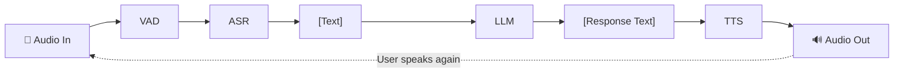
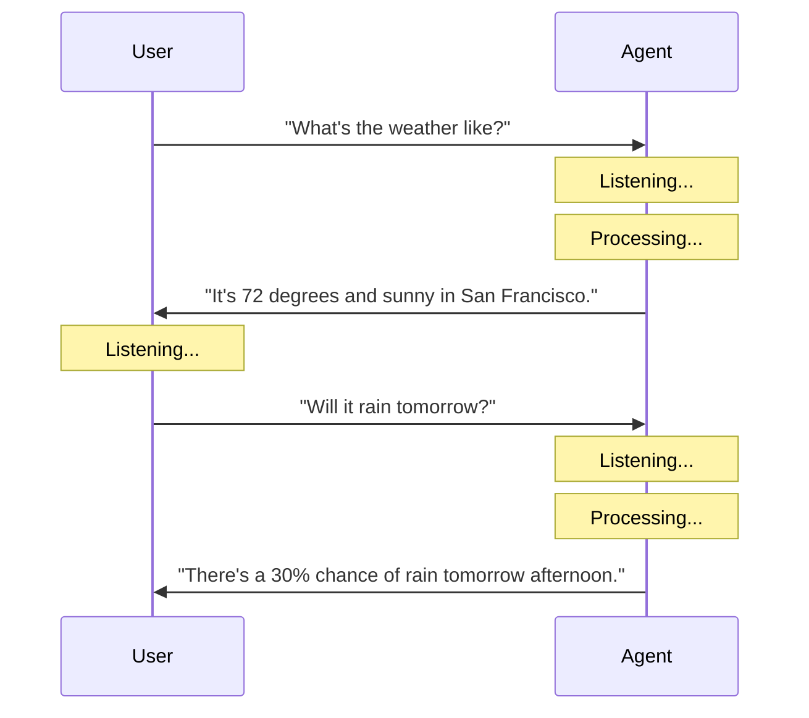
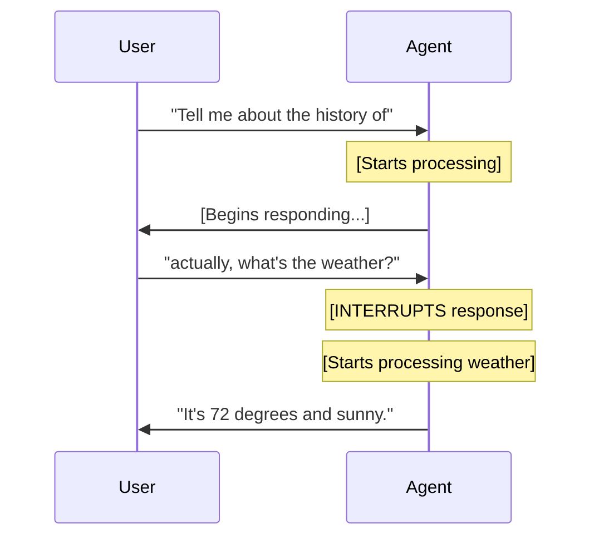
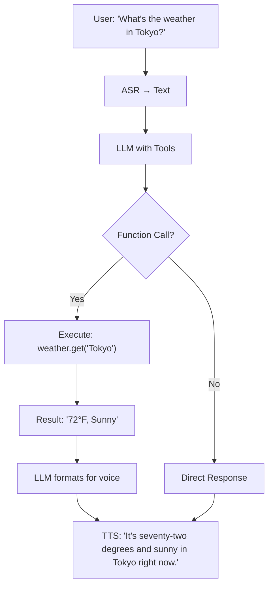
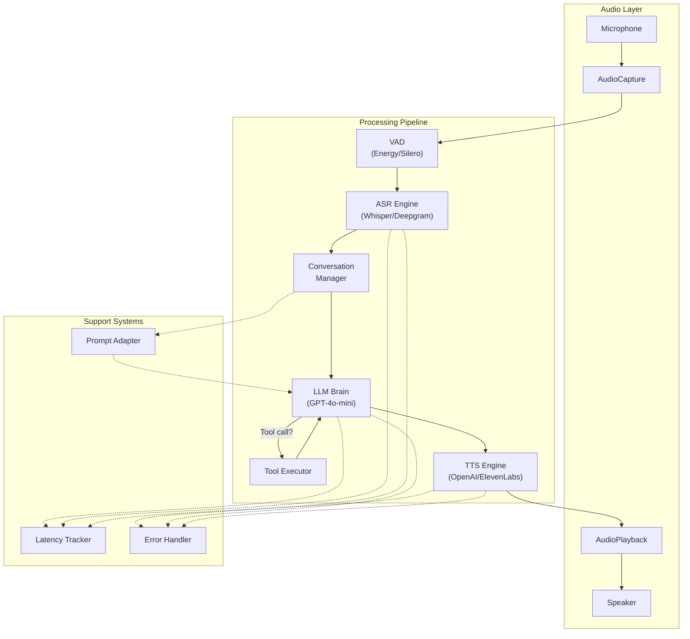

# Voice Agents Deep Dive  Part 9: Your First Voice Agent  ASR + LLM + TTS in a Loop

---

**Series:** Building Voice Agents  A Developer's Deep Dive from Audio Fundamentals to Production
**Part:** 9 of 20 (Voice Agent Core)
**Audience:** Developers with Python experience who want to build voice-powered AI agents from the ground up
**Reading time:** ~55 minutes

---

## Introduction  The Moment Everything Clicks

Welcome to Part 9. This is the part you have been building toward since the very beginning.

Over the last eight parts, you learned how sound becomes numbers (Part 0), how those numbers become spectrograms (Part 1), how speech recognition turns audio into text (Parts 2-4), how voice activity detection knows when someone is talking (Part 5), how text-to-speech brings words back to life as audio (Parts 6-7), and how streaming architectures keep latency low (Part 8). Each piece was interesting on its own, but none of them alone constitutes a **voice agent**.

Today, we wire everything together. By the end of this part, you will have a fully functional voice agent running on your machine  one that listens to your microphone, understands what you say, thinks about a response, and speaks back to you in real time.

> **The whole is greater than the sum of its parts.** A voice agent is not just ASR plus LLM plus TTS. It is the *orchestration*  the timing, the error handling, the conversation flow, and the dozens of small decisions that make the difference between a clunky demo and something that feels genuinely conversational.

Let us begin.

---

## Section 1  What a Voice Agent Actually Is

### 1.1 The Core Loop: Listen, Think, Speak

At its heart, every voice agent follows the same fundamental loop:



This loop has three phases, each corresponding to a human conversational ability:

| Phase | Human Equivalent | Technical Components | Output |
|-------|-----------------|---------------------|--------|
| **Listen** | Hearing and understanding | VAD + ASR | Transcribed text |
| **Think** | Formulating a response | LLM + Function Calling | Response text |
| **Speak** | Talking back | TTS + Audio Playback | Synthesized audio |

### 1.2 Why Orchestration Matters More Than Any Single Component

You could have the best ASR in the world, the smartest LLM, and the most natural-sounding TTS  and still build a terrible voice agent. Here is why:

**Scenario: The Awkward Pause**
```
User: "What time is it?"
[silence... 1 second... 2 seconds... 3 seconds...]
Agent: "The current time is 3:45 PM."
```

Three seconds feels like an eternity in conversation. Humans expect responses within 200-600 milliseconds. The orchestration layer is what determines whether your agent feels responsive or sluggish.

**Scenario: The Interruption Problem**
```
User: "Tell me about the history of"
Agent: [still playing previous response audio]
User: "actually, never mind. What's the weather?"
Agent: [finishes old response, THEN processes the weather question]
```

Without proper interruption handling, the agent feels like talking to a wall.

**Scenario: The Misheard Input**
```
User: "Set a timer for fifteen minutes."
ASR output: "Set a timer for fifty minutes."
Agent: "Timer set for fifty minutes."
User: [frustrated]
```

Error recovery, confirmation strategies, and graceful degradation  these are all orchestration concerns.

### 1.3 Voice Agents vs. Chatbots vs. IVR Systems

Before we build, let us be precise about what we are building:

| Feature | Text Chatbot | IVR System | Voice Agent |
|---------|-------------|------------|-------------|
| Input | Typed text | DTMF tones / limited speech | Natural speech |
| Understanding | Full NLU | Keyword matching | Full NLU + context |
| Response | Text | Pre-recorded audio | Dynamic synthesized speech |
| Turn-taking | Async (user types whenever) | Rigid prompts | Natural conversation flow |
| Latency sensitivity | Low (seconds OK) | Medium | High (sub-second ideal) |
| Error recovery | "I don't understand" | "Press 1 for..." | Contextual clarification |
| State | Session-based | Call flow state machine | Conversation history |

A voice agent combines the intelligence of a modern chatbot with the real-time audio requirements of a phone system.

---

## Section 2  Building Each Component

We will build each component as a standalone class, then wire them together. This modular approach lets you swap implementations (e.g., local Whisper vs. cloud Deepgram) without changing the rest of the system.

### 2.1 Audio Input Capture with VAD

The first component captures audio from the microphone and uses Voice Activity Detection to identify complete utterances.

```python
"""
audio_capture.py  Microphone capture with Voice Activity Detection.

Captures audio from the default microphone, runs VAD to detect
when the user starts and stops speaking, and returns complete
utterances as numpy arrays.
"""

import numpy as np
import threading
import queue
import time
from dataclasses import dataclass, field
from enum import Enum
from typing import Optional, Callable

# We use sounddevice for cross-platform microphone access
import sounddevice as sd


class SpeechState(Enum):
    """Tracks whether the user is currently speaking."""
    SILENCE = "silence"
    SPEAKING = "speaking"
    TRAILING_SILENCE = "trailing_silence"  # Brief pause, might continue


@dataclass
class VADConfig:
    """Configuration for Voice Activity Detection."""
    # Energy threshold for speech detection (RMS amplitude)
    energy_threshold: float = 0.02
    # How long speech must last to be considered real (avoids false triggers)
    min_speech_duration_ms: int = 250
    # How long silence must last after speech to consider the utterance done
    silence_after_speech_ms: int = 700
    # Maximum utterance length before forced cutoff
    max_utterance_duration_s: float = 30.0
    # Frame size for VAD analysis
    frame_duration_ms: int = 30


@dataclass
class Utterance:
    """A complete spoken utterance captured from the microphone."""
    audio: np.ndarray          # Raw audio samples (float32, mono)
    sample_rate: int           # Sample rate in Hz
    duration_s: float          # Duration in seconds
    start_time: float          # When the utterance started (time.time())
    end_time: float            # When the utterance ended
    peak_amplitude: float      # Peak amplitude (useful for debugging)
    rms_energy: float          # Average RMS energy


class EnergyVAD:
    """
    Simple energy-based Voice Activity Detection.

    For production, you would use Silero VAD or WebRTC VAD (see Part 5),
    but energy-based VAD is sufficient for understanding the architecture
    and works without additional model downloads.
    """

    def __init__(self, config: VADConfig):
        self.config = config
        self._adaptive_threshold = config.energy_threshold
        self._noise_floor_samples: list[float] = []
        self._max_noise_samples = 50  # Track last 50 silence frames

    def is_speech(self, frame: np.ndarray) -> bool:
        """Determine if an audio frame contains speech."""
        rms = np.sqrt(np.mean(frame.astype(np.float64) ** 2))

        # Adapt threshold based on ambient noise level
        if rms < self._adaptive_threshold * 0.5:
            self._noise_floor_samples.append(rms)
            if len(self._noise_floor_samples) > self._max_noise_samples:
                self._noise_floor_samples.pop(0)
            noise_floor = np.mean(self._noise_floor_samples)
            # Set threshold to 3x the noise floor, with a minimum
            self._adaptive_threshold = max(
                self.config.energy_threshold,
                noise_floor * 3.0
            )

        return rms > self._adaptive_threshold

    @property
    def current_threshold(self) -> float:
        """Return the current adaptive threshold."""
        return self._adaptive_threshold


class AudioCapture:
    """
    Captures audio from the microphone and yields complete utterances.

    Uses a background thread to continuously read from the microphone,
    applies VAD to detect speech boundaries, and makes complete
    utterances available through a queue.

    Usage:
        capture = AudioCapture(sample_rate=16000)
        capture.start()

        while True:
            utterance = capture.get_utterance(timeout=10.0)
            if utterance:
                print(f"Got {utterance.duration_s:.1f}s of speech")
                process(utterance)

        capture.stop()
    """

    def __init__(
        self,
        sample_rate: int = 16000,
        channels: int = 1,
        vad_config: Optional[VADConfig] = None,
        device: Optional[int] = None,
    ):
        self.sample_rate = sample_rate
        self.channels = channels
        self.vad_config = vad_config or VADConfig()
        self.device = device

        self._vad = EnergyVAD(self.vad_config)
        self._utterance_queue: queue.Queue[Utterance] = queue.Queue(maxsize=10)
        self._is_running = False
        self._stream: Optional[sd.InputStream] = None

        # Internal state for utterance assembly
        self._state = SpeechState.SILENCE
        self._speech_buffer: list[np.ndarray] = []
        self._speech_start_time: float = 0.0
        self._silence_start_time: float = 0.0
        self._frames_of_speech: int = 0

        # Pre-speech buffer: keep a small buffer so we do not clip
        # the beginning of speech
        self._pre_speech_buffer: list[np.ndarray] = []
        self._pre_speech_frames = 10  # ~300ms at 30ms frames

    def start(self) -> None:
        """Start capturing audio from the microphone."""
        if self._is_running:
            return

        self._is_running = True
        frame_samples = int(
            self.sample_rate * self.vad_config.frame_duration_ms / 1000
        )

        self._stream = sd.InputStream(
            samplerate=self.sample_rate,
            channels=self.channels,
            dtype="float32",
            blocksize=frame_samples,
            device=self.device,
            callback=self._audio_callback,
        )
        self._stream.start()

    def stop(self) -> None:
        """Stop capturing audio."""
        self._is_running = False
        if self._stream:
            self._stream.stop()
            self._stream.close()
            self._stream = None

    def get_utterance(self, timeout: Optional[float] = None) -> Optional[Utterance]:
        """
        Get the next complete utterance, blocking up to `timeout` seconds.
        Returns None if no utterance is available within the timeout.
        """
        try:
            return self._utterance_queue.get(timeout=timeout)
        except queue.Empty:
            return None

    def _audio_callback(
        self, indata: np.ndarray, frames: int, time_info, status
    ) -> None:
        """Called by sounddevice for each audio frame."""
        if status:
            # Log audio errors but do not crash
            print(f"Audio status: {status}")

        frame = indata[:, 0].copy()  # Mono, float32
        is_speech = self._vad.is_speech(frame)
        now = time.time()

        if self._state == SpeechState.SILENCE:
            # Maintain a rolling pre-speech buffer
            self._pre_speech_buffer.append(frame)
            if len(self._pre_speech_buffer) > self._pre_speech_frames:
                self._pre_speech_buffer.pop(0)

            if is_speech:
                # Potential speech start
                self._state = SpeechState.SPEAKING
                self._speech_start_time = now
                self._frames_of_speech = 1
                # Include pre-speech buffer to avoid clipping
                self._speech_buffer = list(self._pre_speech_buffer)
                self._speech_buffer.append(frame)
                self._pre_speech_buffer.clear()

        elif self._state == SpeechState.SPEAKING:
            self._speech_buffer.append(frame)

            if is_speech:
                self._frames_of_speech += 1
            else:
                # Speech might be ending
                self._state = SpeechState.TRAILING_SILENCE
                self._silence_start_time = now

            # Check for maximum utterance length
            elapsed = now - self._speech_start_time
            if elapsed >= self.vad_config.max_utterance_duration_s:
                self._finalize_utterance(now)

        elif self._state == SpeechState.TRAILING_SILENCE:
            self._speech_buffer.append(frame)

            if is_speech:
                # Speaker resumed  not done yet
                self._state = SpeechState.SPEAKING
                self._frames_of_speech += 1
            else:
                # Check if silence has lasted long enough
                silence_duration_ms = (now - self._silence_start_time) * 1000
                if silence_duration_ms >= self.vad_config.silence_after_speech_ms:
                    # Check if total speech was long enough
                    speech_duration_ms = (
                        self._frames_of_speech
                        * self.vad_config.frame_duration_ms
                    )
                    if speech_duration_ms >= self.vad_config.min_speech_duration_ms:
                        self._finalize_utterance(now)
                    else:
                        # Too short  probably a noise spike, discard
                        self._reset_state()

    def _finalize_utterance(self, end_time: float) -> None:
        """Package the speech buffer into an Utterance and enqueue it."""
        if not self._speech_buffer:
            self._reset_state()
            return

        audio = np.concatenate(self._speech_buffer)
        duration = len(audio) / self.sample_rate

        utterance = Utterance(
            audio=audio,
            sample_rate=self.sample_rate,
            duration_s=duration,
            start_time=self._speech_start_time,
            end_time=end_time,
            peak_amplitude=float(np.max(np.abs(audio))),
            rms_energy=float(np.sqrt(np.mean(audio.astype(np.float64) ** 2))),
        )

        try:
            self._utterance_queue.put_nowait(utterance)
        except queue.Full:
            # Drop oldest utterance if queue is full
            try:
                self._utterance_queue.get_nowait()
            except queue.Empty:
                pass
            self._utterance_queue.put_nowait(utterance)

        self._reset_state()

    def _reset_state(self) -> None:
        """Reset all state tracking variables."""
        self._state = SpeechState.SILENCE
        self._speech_buffer.clear()
        self._frames_of_speech = 0
        self._speech_start_time = 0.0
        self._silence_start_time = 0.0
```

> **Key design decision:** The `AudioCapture` class uses a callback-based approach rather than a blocking read loop. This ensures we never miss audio frames, even if the main thread is busy processing a previous utterance. The callback writes to a queue, and the main thread reads from that queue at its own pace.

### 2.2 ASR Integration  Speech to Text

Next, we build the ASR engine. We support two backends: local Whisper (for privacy and offline use) and cloud Deepgram (for speed and accuracy).

```python
"""
asr_engine.py  Automatic Speech Recognition engine.

Supports multiple backends:
- Whisper (local, via faster-whisper for speed)
- Deepgram (cloud, for lowest latency)

Each backend implements the same interface so they can be
swapped transparently.
"""

import numpy as np
import time
import io
import wave
from abc import ABC, abstractmethod
from dataclasses import dataclass
from typing import Optional


@dataclass
class TranscriptionResult:
    """Result from ASR transcription."""
    text: str                    # The transcribed text
    confidence: float            # Confidence score (0.0 to 1.0)
    language: Optional[str]      # Detected language code (e.g., "en")
    duration_s: float            # Duration of the audio that was transcribed
    processing_time_s: float     # How long transcription took
    is_partial: bool = False     # Whether this is a partial (interim) result

    @property
    def real_time_factor(self) -> float:
        """Processing time / audio duration. < 1.0 means faster than real-time."""
        if self.duration_s == 0:
            return float("inf")
        return self.processing_time_s / self.duration_s


class ASREngine(ABC):
    """Abstract base class for ASR engines."""

    @abstractmethod
    async def transcribe(
        self,
        audio: np.ndarray,
        sample_rate: int = 16000,
    ) -> TranscriptionResult:
        """
        Transcribe an audio array to text.

        Args:
            audio: Float32 numpy array of audio samples (mono).
            sample_rate: Sample rate of the audio.

        Returns:
            TranscriptionResult with the transcription.
        """
        ...

    @abstractmethod
    def get_name(self) -> str:
        """Return a human-readable name for this engine."""
        ...


class WhisperASR(ASREngine):
    """
    Local ASR using faster-whisper (CTranslate2-based Whisper).

    faster-whisper is ~4x faster than OpenAI's Whisper implementation
    and uses less memory. It runs entirely on your machine.

    Install: pip install faster-whisper
    """

    def __init__(
        self,
        model_size: str = "base.en",
        device: str = "auto",
        compute_type: str = "auto",
    ):
        from faster_whisper import WhisperModel

        self.model_size = model_size
        self.model = WhisperModel(
            model_size,
            device=device,
            compute_type=compute_type,
        )
        print(f"[WhisperASR] Loaded model: {model_size}")

    async def transcribe(
        self,
        audio: np.ndarray,
        sample_rate: int = 16000,
    ) -> TranscriptionResult:
        start_time = time.time()
        duration_s = len(audio) / sample_rate

        # faster-whisper expects float32 audio at 16kHz
        if sample_rate != 16000:
            # Resample if needed (simplified  use librosa for production)
            import librosa
            audio = librosa.resample(
                audio, orig_sr=sample_rate, target_sr=16000
            )

        segments, info = self.model.transcribe(
            audio,
            beam_size=5,
            language="en",
            vad_filter=True,         # Built-in VAD to skip silence
            vad_parameters=dict(
                min_silence_duration_ms=500,
            ),
        )

        # Collect all segments
        text_parts = []
        total_confidence = 0.0
        segment_count = 0

        for segment in segments:
            text_parts.append(segment.text.strip())
            total_confidence += np.exp(segment.avg_log_prob)
            segment_count += 1

        text = " ".join(text_parts).strip()
        avg_confidence = (
            total_confidence / segment_count if segment_count > 0 else 0.0
        )

        processing_time = time.time() - start_time

        return TranscriptionResult(
            text=text,
            confidence=min(avg_confidence, 1.0),
            language=info.language,
            duration_s=duration_s,
            processing_time_s=processing_time,
        )

    def get_name(self) -> str:
        return f"Whisper ({self.model_size})"


class DeepgramASR(ASREngine):
    """
    Cloud ASR using Deepgram's Nova-2 model.

    Deepgram offers very low latency and high accuracy,
    especially for English. Requires an API key.

    Install: pip install deepgram-sdk
    """

    def __init__(self, api_key: str, model: str = "nova-2"):
        from deepgram import DeepgramClient, PrerecordedOptions

        self.client = DeepgramClient(api_key)
        self.model = model
        self._options_class = PrerecordedOptions
        print(f"[DeepgramASR] Initialized with model: {model}")

    async def transcribe(
        self,
        audio: np.ndarray,
        sample_rate: int = 16000,
    ) -> TranscriptionResult:
        start_time = time.time()
        duration_s = len(audio) / sample_rate

        # Convert numpy array to WAV bytes for the API
        wav_bytes = self._numpy_to_wav_bytes(audio, sample_rate)

        # Call Deepgram API
        options = self._options_class(
            model=self.model,
            language="en",
            smart_format=True,   # Adds punctuation and formatting
            utterances=False,
        )

        response = await self.client.listen.asyncrest.v("1").transcribe_file(
            {"buffer": wav_bytes, "mimetype": "audio/wav"},
            options,
        )

        # Extract results
        result = response.results
        transcript = result.channels[0].alternatives[0]
        text = transcript.transcript
        confidence = transcript.confidence

        processing_time = time.time() - start_time

        return TranscriptionResult(
            text=text,
            confidence=confidence,
            language="en",
            duration_s=duration_s,
            processing_time_s=processing_time,
        )

    @staticmethod
    def _numpy_to_wav_bytes(audio: np.ndarray, sample_rate: int) -> bytes:
        """Convert a float32 numpy array to WAV file bytes."""
        # Convert to int16
        audio_int16 = (audio * 32767).astype(np.int16)

        buffer = io.BytesIO()
        with wave.open(buffer, "wb") as wf:
            wf.setnchannels(1)
            wf.setsampwidth(2)  # 16-bit
            wf.setframerate(sample_rate)
            wf.writeframes(audio_int16.tobytes())

        return buffer.getvalue()

    def get_name(self) -> str:
        return f"Deepgram ({self.model})"
```

### 2.3 LLM Integration  The Thinking Brain

The LLM is the brain of our voice agent. It receives transcribed text and generates a response. Crucially, we use **streaming** to get the first tokens as fast as possible.

```python
"""
llm_engine.py  Large Language Model integration for voice agents.

Handles conversation history, system prompts, and streaming
responses. Designed for voice: optimizes for low time-to-first-token
and natural spoken language output.
"""

import time
import asyncio
from dataclasses import dataclass, field
from typing import Optional, AsyncIterator


@dataclass
class LLMResponse:
    """Complete response from the LLM."""
    text: str                     # Full response text
    input_tokens: int             # Tokens in the prompt
    output_tokens: int            # Tokens in the response
    time_to_first_token_s: float  # Latency to first token
    total_time_s: float           # Total generation time
    model: str                    # Model used


@dataclass
class ConversationTurn:
    """A single turn in the conversation."""
    role: str       # "user", "assistant", or "system"
    content: str    # The text content
    timestamp: float = field(default_factory=time.time)


class LLMBrain:
    """
    LLM integration for voice agents.

    Key features:
    - Streaming responses for low latency
    - Conversation history management
    - Voice-optimized system prompts
    - Token counting and cost tracking

    Usage:
        brain = LLMBrain(
            api_key="sk-...",
            model="gpt-4o-mini",
            system_prompt="You are a helpful voice assistant."
        )

        # Streaming usage (preferred for voice)
        async for chunk in brain.think_stream("What's the weather?"):
            print(chunk, end="", flush=True)

        # Non-streaming usage
        response = await brain.think("What's the weather?")
        print(response.text)
    """

    def __init__(
        self,
        api_key: str,
        model: str = "gpt-4o-mini",
        system_prompt: str = "You are a helpful voice assistant.",
        max_history_turns: int = 20,
        max_tokens: int = 300,
        temperature: float = 0.7,
        base_url: Optional[str] = None,
    ):
        from openai import AsyncOpenAI

        self.client = AsyncOpenAI(api_key=api_key, base_url=base_url)
        self.model = model
        self.system_prompt = system_prompt
        self.max_history_turns = max_history_turns
        self.max_tokens = max_tokens
        self.temperature = temperature
        self.history: list[ConversationTurn] = []

    def _build_messages(self, user_text: str) -> list[dict]:
        """Build the messages array for the API call."""
        messages = [{"role": "system", "content": self.system_prompt}]

        # Add conversation history
        for turn in self.history[-(self.max_history_turns * 2):]:
            messages.append({"role": turn.role, "content": turn.content})

        # Add the new user message
        messages.append({"role": "user", "content": user_text})
        return messages

    async def think(self, user_text: str) -> LLMResponse:
        """
        Send user text to the LLM and return the complete response.

        For voice agents, prefer think_stream() instead  it allows
        TTS to start synthesizing before the full response is ready.
        """
        start_time = time.time()
        messages = self._build_messages(user_text)

        response = await self.client.chat.completions.create(
            model=self.model,
            messages=messages,
            max_tokens=self.max_tokens,
            temperature=self.temperature,
        )

        text = response.choices[0].message.content
        total_time = time.time() - start_time

        # Update conversation history
        self.history.append(ConversationTurn(role="user", content=user_text))
        self.history.append(ConversationTurn(role="assistant", content=text))

        return LLMResponse(
            text=text,
            input_tokens=response.usage.prompt_tokens,
            output_tokens=response.usage.completion_tokens,
            time_to_first_token_s=total_time,  # Not available in non-streaming
            total_time_s=total_time,
            model=self.model,
        )

    async def think_stream(self, user_text: str) -> AsyncIterator[str]:
        """
        Stream the LLM response token by token.

        This is the preferred method for voice agents because it
        allows the TTS engine to start synthesizing audio as soon
        as the first sentence is complete, rather than waiting for
        the entire response.

        Yields:
            Individual text chunks as they arrive from the LLM.
        """
        messages = self._build_messages(user_text)

        stream = await self.client.chat.completions.create(
            model=self.model,
            messages=messages,
            max_tokens=self.max_tokens,
            temperature=self.temperature,
            stream=True,
        )

        full_response = []

        async for chunk in stream:
            delta = chunk.choices[0].delta
            if delta.content:
                full_response.append(delta.content)
                yield delta.content

        # Update conversation history after streaming completes
        complete_text = "".join(full_response)
        self.history.append(ConversationTurn(role="user", content=user_text))
        self.history.append(
            ConversationTurn(role="assistant", content=complete_text)
        )

    def clear_history(self) -> None:
        """Clear conversation history."""
        self.history.clear()

    def get_history_summary(self) -> str:
        """Return a brief summary of the conversation so far."""
        if not self.history:
            return "No conversation history."
        turns = len(self.history)
        return f"{turns} turns in conversation history."
```

### 2.4 TTS Integration  Giving the Agent a Voice

The TTS engine converts the LLM's text response back into audio. We support two backends: OpenAI TTS (simple and good quality) and ElevenLabs (highest quality, more voices).

```python
"""
tts_engine.py  Text-to-Speech engine for voice agents.

Supports multiple backends:
- OpenAI TTS (simple, good quality, fast)
- ElevenLabs (highest quality, most natural)

Both support streaming synthesis for low latency.
"""

import numpy as np
import time
import io
import asyncio
from abc import ABC, abstractmethod
from dataclasses import dataclass
from typing import Optional, AsyncIterator


@dataclass
class SynthesisResult:
    """Result from TTS synthesis."""
    audio: np.ndarray           # Audio samples (float32, mono)
    sample_rate: int            # Sample rate
    duration_s: float           # Audio duration
    processing_time_s: float    # How long synthesis took
    characters_synthesized: int # Number of characters in input

    @property
    def real_time_factor(self) -> float:
        """Processing time / audio duration. < 1.0 means faster than real-time."""
        if self.duration_s == 0:
            return float("inf")
        return self.processing_time_s / self.duration_s


@dataclass
class AudioChunk:
    """A chunk of synthesized audio for streaming playback."""
    audio: np.ndarray    # Audio samples
    sample_rate: int     # Sample rate
    is_final: bool       # Whether this is the last chunk


class TTSEngine(ABC):
    """Abstract base class for TTS engines."""

    @abstractmethod
    async def synthesize(self, text: str) -> SynthesisResult:
        """Synthesize text to audio."""
        ...

    @abstractmethod
    async def synthesize_stream(self, text: str) -> AsyncIterator[AudioChunk]:
        """Stream audio chunks as they are synthesized."""
        ...

    @abstractmethod
    def get_name(self) -> str:
        """Return a human-readable name for this engine."""
        ...


class OpenAITTS(TTSEngine):
    """
    TTS using OpenAI's API.

    Voices: alloy, echo, fable, onyx, nova, shimmer
    Models: tts-1 (fast, lower quality), tts-1-hd (slower, higher quality)

    Install: pip install openai
    """

    def __init__(
        self,
        api_key: str,
        voice: str = "nova",
        model: str = "tts-1",
        speed: float = 1.0,
    ):
        from openai import AsyncOpenAI

        self.client = AsyncOpenAI(api_key=api_key)
        self.voice = voice
        self.model = model
        self.speed = speed

    async def synthesize(self, text: str) -> SynthesisResult:
        """Synthesize text to a complete audio array."""
        start_time = time.time()

        response = await self.client.audio.speech.create(
            model=self.model,
            voice=self.voice,
            input=text,
            speed=self.speed,
            response_format="pcm",  # Raw PCM for lowest overhead
        )

        # OpenAI returns 24kHz, 16-bit mono PCM
        audio_bytes = response.content
        audio_int16 = np.frombuffer(audio_bytes, dtype=np.int16)
        audio_float32 = audio_int16.astype(np.float32) / 32768.0

        sample_rate = 24000
        duration = len(audio_float32) / sample_rate
        processing_time = time.time() - start_time

        return SynthesisResult(
            audio=audio_float32,
            sample_rate=sample_rate,
            duration_s=duration,
            processing_time_s=processing_time,
            characters_synthesized=len(text),
        )

    async def synthesize_stream(self, text: str) -> AsyncIterator[AudioChunk]:
        """Stream synthesized audio chunks."""
        response = await self.client.audio.speech.create(
            model=self.model,
            voice=self.voice,
            input=text,
            speed=self.speed,
            response_format="pcm",
        )

        # Process in chunks for streaming playback
        audio_bytes = response.content
        chunk_size = 4800  # 100ms at 24kHz, 16-bit
        sample_rate = 24000

        for i in range(0, len(audio_bytes), chunk_size * 2):  # *2 for 16-bit
            chunk_bytes = audio_bytes[i:i + chunk_size * 2]
            audio_int16 = np.frombuffer(chunk_bytes, dtype=np.int16)
            audio_float32 = audio_int16.astype(np.float32) / 32768.0

            is_final = (i + chunk_size * 2) >= len(audio_bytes)
            yield AudioChunk(
                audio=audio_float32,
                sample_rate=sample_rate,
                is_final=is_final,
            )

    def get_name(self) -> str:
        return f"OpenAI TTS ({self.model}, {self.voice})"


class ElevenLabsTTS(TTSEngine):
    """
    TTS using ElevenLabs API.

    Offers the most natural-sounding voices with fine-grained
    control over style, stability, and similarity.

    Install: pip install elevenlabs
    """

    def __init__(
        self,
        api_key: str,
        voice_id: str = "21m00Tcm4TlvDq8ikWAM",  # "Rachel" voice
        model_id: str = "eleven_turbo_v2",
        stability: float = 0.5,
        similarity_boost: float = 0.75,
        output_sample_rate: int = 24000,
    ):
        from elevenlabs.client import AsyncElevenLabs

        self.client = AsyncElevenLabs(api_key=api_key)
        self.voice_id = voice_id
        self.model_id = model_id
        self.stability = stability
        self.similarity_boost = similarity_boost
        self.output_sample_rate = output_sample_rate

    async def synthesize(self, text: str) -> SynthesisResult:
        """Synthesize text to a complete audio array."""
        start_time = time.time()

        audio_iterator = await self.client.text_to_speech.convert(
            text=text,
            voice_id=self.voice_id,
            model_id=self.model_id,
            voice_settings={
                "stability": self.stability,
                "similarity_boost": self.similarity_boost,
            },
            output_format=f"pcm_{self.output_sample_rate}",
        )

        # Collect all audio chunks
        audio_chunks = []
        async for chunk in audio_iterator:
            audio_chunks.append(chunk)

        audio_bytes = b"".join(audio_chunks)
        audio_int16 = np.frombuffer(audio_bytes, dtype=np.int16)
        audio_float32 = audio_int16.astype(np.float32) / 32768.0

        duration = len(audio_float32) / self.output_sample_rate
        processing_time = time.time() - start_time

        return SynthesisResult(
            audio=audio_float32,
            sample_rate=self.output_sample_rate,
            duration_s=duration,
            processing_time_s=processing_time,
            characters_synthesized=len(text),
        )

    async def synthesize_stream(self, text: str) -> AsyncIterator[AudioChunk]:
        """Stream synthesized audio chunks."""
        audio_iterator = await self.client.text_to_speech.convert(
            text=text,
            voice_id=self.voice_id,
            model_id=self.model_id,
            voice_settings={
                "stability": self.stability,
                "similarity_boost": self.similarity_boost,
            },
            output_format=f"pcm_{self.output_sample_rate}",
        )

        chunks_yielded = 0
        async for chunk_bytes in audio_iterator:
            audio_int16 = np.frombuffer(chunk_bytes, dtype=np.int16)
            audio_float32 = audio_int16.astype(np.float32) / 32768.0
            chunks_yielded += 1

            yield AudioChunk(
                audio=audio_float32,
                sample_rate=self.output_sample_rate,
                is_final=False,  # We cannot know ahead of time
            )

        # Yield a final empty chunk to signal completion
        yield AudioChunk(
            audio=np.array([], dtype=np.float32),
            sample_rate=self.output_sample_rate,
            is_final=True,
        )

    def get_name(self) -> str:
        return f"ElevenLabs ({self.model_id})"
```

### 2.5 Audio Output  Playing Synthesized Speech

The final piece of the audio pipeline is playback. This needs to handle streaming chunks and support interruption.

```python
"""
audio_playback.py  Non-blocking audio playback with interruption support.

Plays synthesized audio through the speakers, supports streaming
chunk-by-chunk playback, and can be interrupted when the user
starts speaking again.
"""

import numpy as np
import threading
import queue
import time
from typing import Optional

import sounddevice as sd


class AudioPlayback:
    """
    Non-blocking audio playback with interruption support.

    Plays audio through the default output device. Supports:
    - Playing a complete audio array
    - Streaming chunk-by-chunk playback
    - Interruption (stop current playback immediately)
    - Volume control

    Usage:
        playback = AudioPlayback(sample_rate=24000)
        playback.start()

        # Play a complete array
        playback.play(audio_array)

        # Or stream chunks
        playback.play_chunk(chunk1)
        playback.play_chunk(chunk2)

        # Interrupt if user starts speaking
        playback.interrupt()

        playback.stop()
    """

    def __init__(
        self,
        sample_rate: int = 24000,
        channels: int = 1,
        buffer_size: int = 50,
        device: Optional[int] = None,
    ):
        self.sample_rate = sample_rate
        self.channels = channels
        self.device = device

        self._chunk_queue: queue.Queue[Optional[np.ndarray]] = queue.Queue(
            maxsize=buffer_size
        )
        self._is_running = False
        self._is_playing = False
        self._play_thread: Optional[threading.Thread] = None
        self._interrupted = threading.Event()
        self._volume = 1.0

    def start(self) -> None:
        """Start the playback system."""
        if self._is_running:
            return
        self._is_running = True
        self._play_thread = threading.Thread(
            target=self._playback_loop, daemon=True
        )
        self._play_thread.start()

    def stop(self) -> None:
        """Stop the playback system."""
        self._is_running = False
        self._interrupted.set()
        # Push a None sentinel to unblock the thread
        try:
            self._chunk_queue.put_nowait(None)
        except queue.Full:
            pass
        if self._play_thread:
            self._play_thread.join(timeout=2.0)

    def play(self, audio: np.ndarray) -> None:
        """
        Play a complete audio array.
        Blocks until playback is complete or interrupted.
        """
        self._interrupted.clear()
        self._is_playing = True

        # Split into chunks for responsive interruption
        chunk_samples = int(self.sample_rate * 0.1)  # 100ms chunks
        for i in range(0, len(audio), chunk_samples):
            if self._interrupted.is_set():
                break
            chunk = audio[i:i + chunk_samples]
            try:
                self._chunk_queue.put(chunk, timeout=1.0)
            except queue.Full:
                break

        self._is_playing = False

    def play_chunk(self, chunk: np.ndarray) -> None:
        """Add a chunk to the playback queue for streaming playback."""
        if self._interrupted.is_set():
            return
        self._is_playing = True
        try:
            self._chunk_queue.put(chunk, timeout=1.0)
        except queue.Full:
            pass

    def interrupt(self) -> None:
        """Immediately stop current playback."""
        self._interrupted.set()
        self._is_playing = False
        # Drain the queue
        while not self._chunk_queue.empty():
            try:
                self._chunk_queue.get_nowait()
            except queue.Empty:
                break

    @property
    def is_playing(self) -> bool:
        """Whether audio is currently being played."""
        return self._is_playing and not self._chunk_queue.empty()

    def set_volume(self, volume: float) -> None:
        """Set playback volume (0.0 to 1.0)."""
        self._volume = max(0.0, min(1.0, volume))

    def _playback_loop(self) -> None:
        """Background thread that plays audio chunks."""
        while self._is_running:
            try:
                chunk = self._chunk_queue.get(timeout=0.5)
            except queue.Empty:
                continue

            if chunk is None:
                continue

            if self._interrupted.is_set():
                continue

            # Apply volume
            chunk = chunk * self._volume

            try:
                sd.play(chunk, self.sample_rate, device=self.device)
                sd.wait()
            except Exception as e:
                print(f"[AudioPlayback] Error: {e}")

        self._is_playing = False
```

---

## Section 3  The Latency Breakdown

Latency is the enemy of natural conversation. Let us measure every stage of our pipeline and understand where time is spent.

### 3.1 Measuring Each Stage

```mermaid
gantt
    title Voice Agent Latency Breakdown (Typical)
    dateFormat X
    axisFormat %L ms

    section Listen
    VAD Detection     :0, 100
    ASR Transcription :100, 700

    section Think
    LLM First Token   :700, 1200
    LLM Complete      :1200, 2200

    section Speak
    TTS First Chunk   :1200, 1500
    TTS Playback      :1500, 3500
```



Here is the detailed breakdown:

| Stage | Typical Latency | Best Case | Worst Case | What Affects It |
|-------|----------------|-----------|------------|-----------------|
| **VAD Detection** | ~100ms | 30ms | 300ms | Frame size, silence threshold |
| **ASR Transcription** | 300-800ms | 100ms | 2000ms | Model size, audio length, hardware |
| **LLM First Token** | 500-1500ms | 200ms | 3000ms | Model size, prompt length, provider |
| **LLM Complete** | 1000-3000ms | 500ms | 10000ms | Response length, model speed |
| **TTS First Chunk** | 200-500ms | 100ms | 1000ms | Provider, voice model, text length |
| **TTS Playback** | Variable | - | - | Response length (not really "latency") |
| **Total to First Audio** | **1100-2900ms** | **430ms** | **6300ms** | Everything above combined |

### 3.2 The Latency Measurement Harness

```python
"""
latency_tracker.py  Precise latency measurement for each pipeline stage.

Tracks timing for every stage of the voice agent pipeline,
computes statistics, and identifies bottlenecks.
"""

import time
from dataclasses import dataclass, field
from typing import Optional
from contextlib import contextmanager
import statistics


@dataclass
class StageTimestamp:
    """Timing data for a single pipeline stage."""
    stage_name: str
    start_time: float
    end_time: float = 0.0

    @property
    def duration_ms(self) -> float:
        return (self.end_time - self.start_time) * 1000


@dataclass
class PipelineLatency:
    """Complete latency breakdown for one agent turn."""
    turn_id: int
    stages: list[StageTimestamp] = field(default_factory=list)
    turn_start: float = 0.0
    turn_end: float = 0.0

    @property
    def total_ms(self) -> float:
        return (self.turn_end - self.turn_start) * 1000

    @property
    def time_to_first_audio_ms(self) -> float:
        """Time from end of user speech to first audio playback."""
        tts_stages = [s for s in self.stages if s.stage_name == "tts_first_chunk"]
        if tts_stages:
            return (tts_stages[0].end_time - self.turn_start) * 1000
        return self.total_ms

    def summary(self) -> str:
        lines = [f"Turn {self.turn_id} Latency Breakdown:"]
        lines.append(f"  {'Stage':<25} {'Duration':>10}")
        lines.append(f"  {'-' * 25} {'-' * 10}")
        for stage in self.stages:
            lines.append(f"  {stage.stage_name:<25} {stage.duration_ms:>8.1f}ms")
        lines.append(f"  {'-' * 25} {'-' * 10}")
        lines.append(f"  {'TOTAL':<25} {self.total_ms:>8.1f}ms")
        lines.append(
            f"  {'Time to first audio':<25} "
            f"{self.time_to_first_audio_ms:>8.1f}ms"
        )
        return "\n".join(lines)


class LatencyTracker:
    """
    Tracks and reports latency across the voice agent pipeline.

    Usage:
        tracker = LatencyTracker()

        tracker.start_turn()

        with tracker.measure("vad"):
            vad_result = vad.detect(audio)

        with tracker.measure("asr"):
            text = asr.transcribe(audio)

        with tracker.measure("llm_first_token"):
            first_token = await llm.get_first_token(text)

        tracker.end_turn()
        print(tracker.latest_turn.summary())
    """

    def __init__(self, max_history: int = 100):
        self._turns: list[PipelineLatency] = []
        self._current_turn: Optional[PipelineLatency] = None
        self._turn_counter = 0
        self._max_history = max_history

    def start_turn(self) -> None:
        """Start timing a new conversation turn."""
        self._turn_counter += 1
        self._current_turn = PipelineLatency(
            turn_id=self._turn_counter,
            turn_start=time.time(),
        )

    def end_turn(self) -> None:
        """Finish timing the current turn."""
        if self._current_turn:
            self._current_turn.turn_end = time.time()
            self._turns.append(self._current_turn)
            if len(self._turns) > self._max_history:
                self._turns.pop(0)
            self._current_turn = None

    @contextmanager
    def measure(self, stage_name: str):
        """Context manager to measure a pipeline stage."""
        stage = StageTimestamp(stage_name=stage_name, start_time=time.time())
        try:
            yield stage
        finally:
            stage.end_time = time.time()
            if self._current_turn:
                self._current_turn.stages.append(stage)

    @property
    def latest_turn(self) -> Optional[PipelineLatency]:
        """Return the most recent completed turn."""
        return self._turns[-1] if self._turns else None

    def get_stage_statistics(self, stage_name: str) -> dict:
        """Get statistics for a specific stage across all turns."""
        durations = []
        for turn in self._turns:
            for stage in turn.stages:
                if stage.stage_name == stage_name:
                    durations.append(stage.duration_ms)

        if not durations:
            return {"count": 0}

        return {
            "count": len(durations),
            "mean_ms": statistics.mean(durations),
            "median_ms": statistics.median(durations),
            "p95_ms": (
                sorted(durations)[int(len(durations) * 0.95)]
                if len(durations) >= 20
                else max(durations)
            ),
            "min_ms": min(durations),
            "max_ms": max(durations),
        }

    def print_statistics(self) -> None:
        """Print latency statistics for all tracked stages."""
        stage_names = set()
        for turn in self._turns:
            for stage in turn.stages:
                stage_names.add(stage.stage_name)

        print(f"\nLatency Statistics ({len(self._turns)} turns)")
        print(f"{'Stage':<25} {'Mean':>8} {'Median':>8} {'P95':>8} {'Min':>8} {'Max':>8}")
        print("-" * 73)

        for name in sorted(stage_names):
            stats = self.get_stage_statistics(name)
            if stats["count"] > 0:
                print(
                    f"{name:<25} "
                    f"{stats['mean_ms']:>7.1f} "
                    f"{stats['median_ms']:>7.1f} "
                    f"{stats['p95_ms']:>7.1f} "
                    f"{stats['min_ms']:>7.1f} "
                    f"{stats['max_ms']:>7.1f}"
                )
```

### 3.3 Optimization Strategies

Here is how to reduce latency at each stage:

**VAD Optimization:**
```python
# Use smaller frame sizes for faster detection
fast_vad_config = VADConfig(
    frame_duration_ms=10,         # 10ms instead of 30ms
    silence_after_speech_ms=500,  # Shorter trailing silence
    min_speech_duration_ms=150,   # Accept shorter utterances
)

# Or use Silero VAD which is more accurate with less tuning
# (See Part 5 for details)
```

**ASR Optimization:**
```python
# Use smaller Whisper models for faster transcription
fast_asr = WhisperASR(
    model_size="tiny.en",   # Fastest, English-only
    device="cuda",          # GPU acceleration
    compute_type="float16", # Half precision for speed
)

# Or use Deepgram for cloud-based speed
# Typical latency: 100-300ms for most utterances
```

**LLM Optimization:**
```python
# Use faster models
fast_brain = LLMBrain(
    model="gpt-4o-mini",    # Faster than gpt-4o
    max_tokens=150,          # Shorter responses = faster
    temperature=0.5,         # Slightly lower = faster convergence
    system_prompt=SHORT_VOICE_PROMPT,  # Shorter prompt = less input tokens
)

# Key insight: The system prompt itself adds latency.
# A 500-token system prompt adds ~50ms vs a 100-token one.
```

**TTS Optimization:**
```python
# Use streaming TTS and start playing as soon as the first chunk arrives
# Use "tts-1" (not "tts-1-hd") for lower latency
# Pre-warm TTS connections

# Sentence-level pipelining: start TTS on the first sentence
# while the LLM is still generating the second sentence
```

---

## Section 4  Turn-Based vs. Full-Duplex Conversation

There are two fundamental conversation models, and the choice between them affects every aspect of your voice agent.

### 4.1 Turn-Based Conversation

In turn-based mode, the user and agent take strict turns. The agent waits for the user to finish speaking, then responds. The user must wait for the agent to finish before speaking again.



**Pros:**
- Simple to implement
- No echo cancellation needed
- Clear conversation boundaries
- Easier to debug

**Cons:**
- Feels robotic  humans do not converse this way
- Cannot handle interruptions
- User must wait for the full response before speaking
- Silence during processing feels unnatural

```python
"""
turn_based_agent.py  Simple turn-based voice agent.

The user speaks, the agent listens until silence, processes,
responds, and then listens again. No overlap.
"""

import asyncio


class TurnBasedAgent:
    """
    Turn-based voice agent  the simplest conversation model.

    Flow: Listen → Process → Speak → Listen → ...

    The agent and user never speak at the same time.
    """

    def __init__(
        self,
        audio_capture,    # AudioCapture instance
        asr_engine,       # ASREngine instance
        llm_brain,        # LLMBrain instance
        tts_engine,       # TTSEngine instance
        audio_playback,   # AudioPlayback instance
    ):
        self.capture = audio_capture
        self.asr = asr_engine
        self.llm = llm_brain
        self.tts = tts_engine
        self.playback = audio_playback

    async def run(self) -> None:
        """Main agent loop."""
        print("Voice agent ready. Start speaking...")
        print("(Press Ctrl+C to stop)\n")

        self.capture.start()
        self.playback.start()

        try:
            while True:
                # Phase 1: LISTEN
                print("[Listening...]")
                utterance = self.capture.get_utterance(timeout=30.0)
                if utterance is None:
                    print("(No speech detected, still listening...)")
                    continue

                print(f"[Heard {utterance.duration_s:.1f}s of speech]")

                # Phase 2: TRANSCRIBE
                result = await self.asr.transcribe(
                    utterance.audio, utterance.sample_rate
                )
                if not result.text.strip():
                    print("[Could not transcribe, listening again...]")
                    continue

                print(f"User: {result.text}")

                # Phase 3: THINK
                response = await self.llm.think(result.text)
                print(f"Agent: {response.text}")

                # Phase 4: SPEAK
                synthesis = await self.tts.synthesize(response.text)
                self.playback.play(synthesis.audio)

                # Small pause before listening again
                await asyncio.sleep(0.3)

        except KeyboardInterrupt:
            print("\nStopping voice agent...")
        finally:
            self.capture.stop()
            self.playback.stop()
```

### 4.2 Full-Duplex Conversation

Full-duplex mode allows both the user and agent to "speak" (or at least process) simultaneously. The agent can be interrupted, and it can start speaking before fully formulating its response.



**Pros:**
- Feels much more natural
- Supports interruptions (barge-in)
- Agent can start speaking sooner via streaming
- Closer to human conversation

**Cons:**
- Much more complex to implement
- Requires echo cancellation or careful audio routing
- Hard to distinguish user interruption from background noise
- State management is more complex

```python
"""
full_duplex_agent.py  Full-duplex voice agent with interruption support.

Allows the user to interrupt the agent mid-response. Uses
concurrent tasks for listening and speaking, with a shared
state machine to coordinate.
"""

import asyncio
from enum import Enum
from typing import Optional


class AgentState(Enum):
    """Current state of the voice agent."""
    IDLE = "idle"                   # Waiting for user input
    LISTENING = "listening"         # User is speaking
    PROCESSING = "processing"      # ASR + LLM working
    SPEAKING = "speaking"          # Agent is speaking
    INTERRUPTED = "interrupted"    # Agent was interrupted


class FullDuplexAgent:
    """
    Full-duplex voice agent with interruption support.

    Key difference from turn-based: the listening loop never stops.
    Even while the agent is speaking, it continues to monitor for
    user speech. If the user starts talking, the agent stops its
    current response immediately.
    """

    def __init__(
        self,
        audio_capture,
        asr_engine,
        llm_brain,
        tts_engine,
        audio_playback,
    ):
        self.capture = audio_capture
        self.asr = asr_engine
        self.llm = llm_brain
        self.tts = tts_engine
        self.playback = audio_playback

        self._state = AgentState.IDLE
        self._current_response_task: Optional[asyncio.Task] = None
        self._state_lock = asyncio.Lock()

    async def _set_state(self, new_state: AgentState) -> None:
        """Thread-safe state transition."""
        async with self._state_lock:
            old_state = self._state
            self._state = new_state
            print(f"  [State: {old_state.value} → {new_state.value}]")

    async def _handle_interruption(self) -> None:
        """Handle user interrupting the agent."""
        # Stop audio playback immediately
        self.playback.interrupt()

        # Cancel the current response task if running
        if self._current_response_task and not self._current_response_task.done():
            self._current_response_task.cancel()
            try:
                await self._current_response_task
            except asyncio.CancelledError:
                pass

        await self._set_state(AgentState.INTERRUPTED)

    async def _process_and_respond(self, user_text: str) -> None:
        """Process user text and speak the response (cancellable)."""
        try:
            await self._set_state(AgentState.PROCESSING)

            # Stream LLM response and TTS together
            sentence_buffer = ""
            full_response = []

            async for chunk in self.llm.think_stream(user_text):
                full_response.append(chunk)
                sentence_buffer += chunk

                # Check for sentence boundaries to start TTS early
                if any(
                    sentence_buffer.rstrip().endswith(p)
                    for p in [".", "!", "?", ":", ";"]
                ):
                    sentence = sentence_buffer.strip()
                    if sentence:
                        await self._set_state(AgentState.SPEAKING)
                        synthesis = await self.tts.synthesize(sentence)
                        self.playback.play_chunk(synthesis.audio)
                    sentence_buffer = ""

            # Handle any remaining text
            remaining = sentence_buffer.strip()
            if remaining:
                synthesis = await self.tts.synthesize(remaining)
                self.playback.play_chunk(synthesis.audio)

            complete_response = "".join(full_response)
            print(f"Agent: {complete_response}")

            await self._set_state(AgentState.IDLE)

        except asyncio.CancelledError:
            print("  [Response cancelled due to interruption]")
            raise

    async def _listening_loop(self) -> None:
        """Continuously listen for user speech."""
        while True:
            utterance = await asyncio.to_thread(
                self.capture.get_utterance, timeout=1.0
            )

            if utterance is None:
                continue

            # If agent is currently speaking, this is an interruption
            if self._state == AgentState.SPEAKING:
                print("[User interrupted!]")
                await self._handle_interruption()

            # Transcribe
            result = await self.asr.transcribe(
                utterance.audio, utterance.sample_rate
            )

            if not result.text.strip():
                continue

            print(f"User: {result.text}")

            # Cancel any existing response and start a new one
            if self._current_response_task and not self._current_response_task.done():
                self._current_response_task.cancel()
                try:
                    await self._current_response_task
                except asyncio.CancelledError:
                    pass

            # Start processing and responding in background
            self._current_response_task = asyncio.create_task(
                self._process_and_respond(result.text)
            )

    async def run(self) -> None:
        """Main agent loop."""
        print("Full-duplex voice agent ready. Start speaking...")
        print("(You can interrupt the agent at any time)")
        print("(Press Ctrl+C to stop)\n")

        self.capture.start()
        self.playback.start()

        try:
            await self._listening_loop()
        except KeyboardInterrupt:
            print("\nStopping voice agent...")
        finally:
            self.capture.stop()
            self.playback.stop()
```

### 4.3 Comparison and When to Use Each

| Aspect | Turn-Based | Full-Duplex |
|--------|-----------|-------------|
| **Complexity** | Low | High |
| **User experience** | Formal, structured | Natural, conversational |
| **Interruption support** | No | Yes |
| **Implementation time** | Hours | Days |
| **Debugging difficulty** | Easy | Hard |
| **Best for** | Kiosks, IVR, demos | Assistants, phone agents |
| **Echo cancellation needed** | No | Yes (or careful audio routing) |
| **State management** | Simple counter | State machine |

> **Practical advice:** Start with turn-based for your first agent. Get it working, measure the latency, understand the failure modes. Then upgrade to full-duplex once the core pipeline is solid. Most production voice agents use full-duplex, but the additional complexity is only worth it once the fundamentals are right.

---

## Section 5  Building the Complete Voice Agent

Now we assemble everything into a unified `VoiceAgent` class that brings together all the components.

### 5.1 The Voice Agent Class

```python
"""
voice_agent.py  Complete voice agent assembling all components.

This is the main class that orchestrates ASR, LLM, and TTS
into a coherent voice conversation experience.
"""

import asyncio
import time
from dataclasses import dataclass, field
from typing import Optional, Callable
from enum import Enum


@dataclass
class AgentConfig:
    """Configuration for the voice agent."""
    # Audio settings
    sample_rate_input: int = 16000    # Microphone sample rate
    sample_rate_output: int = 24000   # Speaker sample rate

    # Behavior settings
    full_duplex: bool = False         # Enable interruption support
    auto_punctuate: bool = True       # Add punctuation to ASR output
    confirmation_threshold: float = 0.4  # Below this, ask for confirmation

    # Timeout settings
    silence_timeout_s: float = 30.0   # How long to wait for speech
    max_response_time_s: float = 15.0 # Max time for LLM + TTS

    # Prompt settings
    system_prompt: str = ""
    greeting: str = ""                # Optional greeting on startup


class VoiceAgent:
    """
    Complete voice agent orchestrating ASR + LLM + TTS.

    This class wires together the individual components from
    Sections 2.1-2.5 into a working voice conversation system.

    Usage:
        agent = VoiceAgent(
            asr_engine=WhisperASR(model_size="base.en"),
            llm_engine=LLMBrain(api_key="sk-...", model="gpt-4o-mini"),
            tts_engine=OpenAITTS(api_key="sk-...", voice="nova"),
            config=AgentConfig(
                system_prompt=VOICE_SYSTEM_PROMPT,
                greeting="Hello! How can I help you today?",
            ),
        )

        await agent.run()
    """

    def __init__(
        self,
        asr_engine,       # ASREngine instance
        llm_engine,       # LLMBrain instance
        tts_engine,       # TTSEngine instance
        config: Optional[AgentConfig] = None,
        on_user_speech: Optional[Callable] = None,
        on_agent_response: Optional[Callable] = None,
    ):
        self.asr = asr_engine
        self.llm = llm_engine
        self.tts = tts_engine
        self.config = config or AgentConfig()

        # Callbacks for external integration
        self._on_user_speech = on_user_speech
        self._on_agent_response = on_agent_response

        # Create audio components
        from audio_capture import AudioCapture, VADConfig
        from audio_playback import AudioPlayback

        self.capture = AudioCapture(
            sample_rate=self.config.sample_rate_input,
            vad_config=VADConfig(),
        )
        self.playback = AudioPlayback(
            sample_rate=self.config.sample_rate_output,
        )

        # Latency tracking
        from latency_tracker import LatencyTracker
        self.latency = LatencyTracker()

        # Conversation metrics
        self._turn_count = 0
        self._total_user_speech_s = 0.0
        self._total_agent_speech_s = 0.0

    async def listen(self) -> Optional[str]:
        """
        Listen for the user to speak and transcribe their utterance.

        Returns:
            The transcribed text, or None if nothing was heard.
        """
        with self.latency.measure("vad_wait"):
            utterance = await asyncio.to_thread(
                self.capture.get_utterance,
                timeout=self.config.silence_timeout_s,
            )

        if utterance is None:
            return None

        self._total_user_speech_s += utterance.duration_s

        with self.latency.measure("asr"):
            result = await self.asr.transcribe(
                utterance.audio, utterance.sample_rate
            )

        if not result.text.strip():
            return None

        # Low confidence? Might want to confirm
        if result.confidence < self.config.confirmation_threshold:
            print(
                f"  [Low confidence: {result.confidence:.2f}] "
                f"Heard: '{result.text}'"
            )

        if self._on_user_speech:
            self._on_user_speech(result.text, result.confidence)

        return result.text

    async def think(self, user_text: str) -> str:
        """
        Process user text through the LLM and return a response.

        Args:
            user_text: The transcribed text from the user.

        Returns:
            The LLM's response text.
        """
        with self.latency.measure("llm"):
            response = await self.llm.think(user_text)

        return response.text

    async def think_and_speak_streaming(self, user_text: str) -> str:
        """
        Stream LLM response directly to TTS for minimum latency.

        This is the key optimization: instead of waiting for the
        complete LLM response, we send sentences to TTS as soon
        as they are complete.

        Returns:
            The complete response text.
        """
        sentence_buffer = ""
        full_response = []
        first_audio_sent = False

        async for chunk in self.llm.think_stream(user_text):
            full_response.append(chunk)
            sentence_buffer += chunk

            # Check for sentence boundary
            sentence_enders = ".!?;:"
            if any(
                sentence_buffer.rstrip().endswith(c) for c in sentence_enders
            ):
                sentence = sentence_buffer.strip()
                if len(sentence) > 3:  # Skip very short fragments
                    stage_name = (
                        "tts_first_chunk" if not first_audio_sent
                        else "tts_subsequent"
                    )
                    with self.latency.measure(stage_name):
                        synthesis = await self.tts.synthesize(sentence)
                        self.playback.play_chunk(synthesis.audio)
                    first_audio_sent = True
                    self._total_agent_speech_s += synthesis.duration_s
                sentence_buffer = ""

        # Handle remaining text
        remaining = sentence_buffer.strip()
        if remaining and len(remaining) > 1:
            synthesis = await self.tts.synthesize(remaining)
            self.playback.play_chunk(synthesis.audio)
            self._total_agent_speech_s += synthesis.duration_s

        complete_text = "".join(full_response)

        if self._on_agent_response:
            self._on_agent_response(complete_text)

        return complete_text

    async def speak(self, text: str) -> None:
        """
        Synthesize and play a text response.

        Use this for non-streaming scenarios (e.g., greetings,
        error messages, confirmations).
        """
        with self.latency.measure("tts"):
            synthesis = await self.tts.synthesize(text)

        self.playback.play(synthesis.audio)
        self._total_agent_speech_s += synthesis.duration_s

    async def run(self) -> None:
        """
        Main agent loop  the heart of the voice agent.

        Runs continuously, listening for user speech, processing
        it through the LLM, and speaking the response.
        """
        print("=" * 60)
        print("  VOICE AGENT")
        print(f"  ASR: {self.asr.get_name()}")
        print(f"  LLM: {self.llm.model}")
        print(f"  TTS: {self.tts.get_name()}")
        print(f"  Mode: {'Full-duplex' if self.config.full_duplex else 'Turn-based'}")
        print("=" * 60)
        print("\nStarting... (Press Ctrl+C to stop)\n")

        self.capture.start()
        self.playback.start()

        try:
            # Play greeting if configured
            if self.config.greeting:
                print(f"Agent: {self.config.greeting}")
                await self.speak(self.config.greeting)

            while True:
                self.latency.start_turn()
                self._turn_count += 1

                # LISTEN
                user_text = await self.listen()
                if user_text is None:
                    self.latency.end_turn()
                    continue

                print(f"\nUser: {user_text}")

                # THINK + SPEAK (streaming for low latency)
                response_text = await self.think_and_speak_streaming(user_text)
                print(f"Agent: {response_text}")

                self.latency.end_turn()

                # Print latency for this turn
                if self.latency.latest_turn:
                    print(f"\n{self.latency.latest_turn.summary()}\n")

        except KeyboardInterrupt:
            print("\n\nStopping voice agent...")
            self._print_session_summary()
        finally:
            self.capture.stop()
            self.playback.stop()

    def _print_session_summary(self) -> None:
        """Print a summary of the conversation session."""
        print("\n" + "=" * 60)
        print("  SESSION SUMMARY")
        print("=" * 60)
        print(f"  Total turns: {self._turn_count}")
        print(f"  User speech: {self._total_user_speech_s:.1f}s")
        print(f"  Agent speech: {self._total_agent_speech_s:.1f}s")

        if self._turn_count > 0:
            print("\n  Latency Statistics:")
            self.latency.print_statistics()
```

### 5.2 Putting It All Together  The Launch Script

```python
"""
main.py  Launch script for the voice agent.

Configures and starts the complete voice agent with your
choice of ASR, LLM, and TTS backends.
"""

import asyncio
import os
from dotenv import load_dotenv

# Load environment variables from .env file
load_dotenv()

# Import our components
from audio_capture import AudioCapture, VADConfig
from asr_engine import WhisperASR, DeepgramASR
from llm_engine import LLMBrain
from tts_engine import OpenAITTS, ElevenLabsTTS
from voice_agent import VoiceAgent, AgentConfig


# ─── Voice-Optimized System Prompt ─────────────────────────
VOICE_SYSTEM_PROMPT = """You are a helpful voice assistant named Echo. \
You are having a real-time spoken conversation with a human.

Key rules for voice interaction:
- Keep responses SHORT: 1-3 sentences maximum
- Use natural spoken language, not written language
- Never use bullet points, markdown formatting, or URLs
- Never use abbreviations that sound awkward when spoken
- Use conversational fillers naturally when appropriate
- Speak numbers as words: say "twenty-three" not "23"
- If you need to spell something, say each letter with pauses
- When unsure, ask a brief clarifying question
- Be warm and conversational, not robotic or formal"""


async def main():
    # ─── Choose your ASR engine ─────────────────────────
    # Option A: Local Whisper (free, private, ~500ms latency)
    asr = WhisperASR(model_size="base.en", device="auto")

    # Option B: Deepgram (cloud, fast, ~200ms latency)
    # asr = DeepgramASR(api_key=os.getenv("DEEPGRAM_API_KEY"))

    # ─── Configure the LLM ─────────────────────────────
    llm = LLMBrain(
        api_key=os.getenv("OPENAI_API_KEY"),
        model="gpt-4o-mini",
        system_prompt=VOICE_SYSTEM_PROMPT,
        max_history_turns=20,
        max_tokens=200,      # Keep responses short for voice
        temperature=0.7,
    )

    # ─── Choose your TTS engine ─────────────────────────
    # Option A: OpenAI TTS (good quality, simple)
    tts = OpenAITTS(
        api_key=os.getenv("OPENAI_API_KEY"),
        voice="nova",
        model="tts-1",      # Use tts-1 for speed, tts-1-hd for quality
    )

    # Option B: ElevenLabs (highest quality)
    # tts = ElevenLabsTTS(
    #     api_key=os.getenv("ELEVENLABS_API_KEY"),
    #     voice_id="21m00Tcm4TlvDq8ikWAM",  # Rachel
    #     model_id="eleven_turbo_v2",
    # )

    # ─── Configure the agent ───────────────────────────
    config = AgentConfig(
        system_prompt=VOICE_SYSTEM_PROMPT,
        greeting="Hello! I'm Echo, your voice assistant. How can I help you today?",
        full_duplex=False,   # Start with turn-based
        silence_timeout_s=30.0,
    )

    # ─── Create and run the agent ──────────────────────
    agent = VoiceAgent(
        asr_engine=asr,
        llm_engine=llm,
        tts_engine=tts,
        config=config,
    )

    await agent.run()


if __name__ == "__main__":
    asyncio.run(main())
```

---

## Section 6  Prompt Engineering for Voice

Voice interaction is fundamentally different from text chat. The prompts that work beautifully in ChatGPT produce terrible results when spoken aloud. This section covers the art and science of crafting prompts specifically for voice.

### 6.1 Why Voice Prompts Are Different

Consider this perfectly good text chatbot response:

```
Here are 5 ways to improve your productivity:

1. **Time blocking**  Allocate specific hours for deep work
2. **The 2-minute rule**  If it takes < 2 min, do it now
3. **Pomodoro Technique**  25 min focus + 5 min break
4. **Digital detox**  Check email only 3x/day
5. **Weekly review**  Reflect every Friday afternoon

For more tips, check out [this guide](https://example.com/productivity).
```

Now imagine hearing this spoken aloud. The numbered list is disorienting without visual structure. The bold markers are meaningless. The URL is absurd to speak. The abbreviation "< 2 min" sounds strange. The entire format collapses when the visual channel is removed.

Here is the same information, optimized for voice:

```
There are a few things that really help with productivity. First, try time
blocking, where you set aside specific hours just for focused work. Also,
if something takes less than two minutes, just do it right away instead of
putting it on a list. And honestly, taking regular breaks helps a lot too.
The Pomodoro method suggests twenty-five minutes of focus followed by a
five-minute break. Would you like me to go deeper on any of these?
```

### 6.2 The Voice Prompt Framework

```python
"""
voice_prompts.py  System prompts optimized for voice interaction.

Contains prompt templates and utilities for crafting effective
voice agent personas.
"""


# ─── Minimal Voice Prompt (for low latency) ────────────────
MINIMAL_VOICE_PROMPT = """\
You are a voice assistant. Keep responses to one or two sentences. \
Use natural spoken language. Never use markdown, lists, or URLs."""


# ─── Standard Voice Prompt ──────────────────────────────────
STANDARD_VOICE_PROMPT = """\
You are a helpful voice assistant named Echo. You are having a \
real-time spoken conversation with a human.

Rules:
- Keep responses SHORT: one to three sentences maximum.
- Use natural spoken language, not written language.
- Never use bullet points, numbered lists, markdown, or URLs.
- Speak numbers as words: say "twenty-three" not "23".
- Use conversational transitions: "Well," "So," "Let me think..."
- If you do not know something, say so briefly.
- End with a question when it helps move the conversation forward."""


# ─── Detailed Voice Prompt (for complex agents) ────────────
DETAILED_VOICE_PROMPT = """\
You are Echo, a friendly and knowledgeable voice assistant. You are \
speaking with a human in real time through a microphone and speaker.

CRITICAL VOICE RULES:
1. LENGTH: Keep every response between one and three sentences. If the \
user asks a complex question, give a brief answer and offer to elaborate.

2. FORMATTING: Never use bullet points, numbered lists, markdown \
formatting, asterisks, URLs, code blocks, or any visual formatting. \
Everything you say will be spoken aloud through a text-to-speech system.

3. NUMBERS AND DATES: Always write numbers as spoken words. Say \
"January third, twenty twenty-five" not "01/03/2025". Say "about \
three hundred and fifty" not "~350". Say "two point five percent" \
not "2.5%".

4. SPELLING: If you need to spell a word, say each letter with a \
pause: "That is spelled S ... T ... R ... E ... A ... M".

5. TONE: Be warm, natural, and conversational. Use casual contractions \
like "I'm", "don't", "it's". Occasionally use filler words like "Well," \
or "So," to sound natural, but do not overdo it.

6. CLARIFICATION: If the speech recognition might have made an error, \
gently confirm: "Just to make sure, did you say [X]?"

7. ERRORS: If you cannot help with something, say so in one sentence \
and suggest what you can help with instead.

8. TURN-TAKING: End responses in a way that makes it clear you are \
done speaking. Avoid trailing off. Either make a statement or ask a \
question."""


# ─── Persona-Specific Prompts ──────────────────────────────
CUSTOMER_SERVICE_PROMPT = """\
You are a customer service agent for Acme Corp. You help customers \
with orders, returns, and product questions over the phone.

Voice rules: Keep responses to one to three sentences. Use professional \
but friendly language. Always confirm order numbers by reading them \
back digit by digit. Never use visual formatting.

When you need to look up information, say "Let me check that for you" \
to fill the pause naturally.

If you cannot resolve an issue, offer to transfer to a specialist."""


RECEPTIONIST_PROMPT = """\
You are a virtual receptionist for Dr. Smith's dental office. You \
help callers schedule appointments, answer questions about services, \
and provide office information.

Voice rules: Be professional and warm. Keep responses brief. Confirm \
dates and times by repeating them back. The office is at one two three \
Main Street, open Monday through Friday, eight AM to five PM.

Available services: cleanings, fillings, crowns, and whitening. \
New patient appointments are sixty minutes. Regular checkups are \
thirty minutes."""
```

### 6.3 Good vs. Bad Voice Prompts  A Comparison

| Scenario | Bad Prompt (Text-Oriented) | Good Prompt (Voice-Oriented) |
|----------|---------------------------|------------------------------|
| Number handling | "Display the result as 42.7%" | "Say the result as forty-two point seven percent" |
| List responses | "Use bullet points for clarity" | "Mention the top two or three items conversationally" |
| Error handling | "Return error code E404" | "Say you could not find that and ask the user to try again" |
| Verbosity | "Be thorough and comprehensive" | "Be brief and offer to elaborate" |
| Formatting | "Use bold for emphasis" | "Use vocal emphasis through word choice" |
| URLs | "Include relevant links" | "Never mention URLs; offer to help directly" |

### 6.4 Dynamic Prompt Adaptation

```python
"""
prompt_adapter.py  Dynamically adjust prompts based on conversation context.

Adapts the system prompt and generation parameters based on
what is happening in the conversation.
"""

from dataclasses import dataclass


@dataclass
class PromptContext:
    """Current conversation context for prompt adaptation."""
    turn_count: int = 0
    last_response_length: int = 0
    user_asked_for_detail: bool = False
    user_seemed_confused: bool = False
    consecutive_short_inputs: int = 0


class PromptAdapter:
    """
    Dynamically adjusts voice prompts based on conversation flow.

    Examples:
    - If the user keeps saying "what?" → simplify language
    - If the user asks "can you explain more?" → allow longer responses
    - If it is the first turn → use a warmer greeting style
    - If responses have been long → remind to be brief
    """

    def __init__(self, base_prompt: str):
        self.base_prompt = base_prompt
        self.context = PromptContext()

    def update_context(self, user_text: str, agent_response: str) -> None:
        """Update context based on the latest exchange."""
        self.context.turn_count += 1
        self.context.last_response_length = len(agent_response.split())

        # Detect confusion signals
        confusion_signals = ["what", "huh", "sorry", "repeat", "again", "what?"]
        if any(signal in user_text.lower() for signal in confusion_signals):
            self.context.user_seemed_confused = True
        else:
            self.context.user_seemed_confused = False

        # Detect detail requests
        detail_signals = [
            "tell me more", "explain", "elaborate", "detail",
            "go on", "more about", "what do you mean",
        ]
        self.context.user_asked_for_detail = any(
            signal in user_text.lower() for signal in detail_signals
        )

        # Track short inputs
        if len(user_text.split()) <= 3:
            self.context.consecutive_short_inputs += 1
        else:
            self.context.consecutive_short_inputs = 0

    def get_adapted_prompt(self) -> str:
        """Return the system prompt with context-appropriate additions."""
        additions = []

        if self.context.user_seemed_confused:
            additions.append(
                "The user seems confused. Use simpler words and shorter "
                "sentences. Offer to clarify."
            )

        if self.context.user_asked_for_detail:
            additions.append(
                "The user wants more detail. You may use up to five "
                "sentences for this response."
            )

        if self.context.last_response_length > 60:
            additions.append(
                "Your last response was too long. This time, keep it "
                "to one or two sentences maximum."
            )

        if self.context.consecutive_short_inputs >= 3:
            additions.append(
                "The user is giving very short responses. They may want "
                "quick answers. Be extra concise."
            )

        if not additions:
            return self.base_prompt

        context_block = " ".join(additions)
        return f"{self.base_prompt}\n\nCurrent context: {context_block}"

    def get_max_tokens(self) -> int:
        """Adjust max tokens based on context."""
        if self.context.user_asked_for_detail:
            return 400  # Allow longer responses
        if self.context.user_seemed_confused:
            return 100  # Force brevity
        if self.context.consecutive_short_inputs >= 3:
            return 100  # Match user's brevity
        return 200  # Default
```

---

## Section 7  Function Calling from Voice

One of the most powerful features of a voice agent is the ability to take actions in the real world  setting timers, checking the weather, controlling smart home devices, or querying databases. This is accomplished through **function calling** (also known as tool use).

### 7.1 The Function Calling Architecture



### 7.2 Defining Voice-Friendly Tools

```python
"""
voice_tools.py  Function definitions for voice agent tool use.

Defines tools that the LLM can call in response to user speech.
Each tool includes a voice-friendly description and handles
formatting results for spoken output.
"""

import json
import time
import asyncio
from dataclasses import dataclass
from typing import Any, Callable, Optional
from datetime import datetime, timedelta


@dataclass
class ToolDefinition:
    """Definition of a tool the voice agent can use."""
    name: str
    description: str
    parameters: dict          # JSON Schema for parameters
    handler: Callable         # Async function to call
    voice_result_template: str  # Template for voice-friendly output


@dataclass
class ToolResult:
    """Result from executing a tool."""
    tool_name: str
    success: bool
    data: Any
    voice_summary: str        # Pre-formatted for TTS
    execution_time_s: float


class VoiceToolkit:
    """
    Collection of tools available to the voice agent.

    Each tool is designed to:
    1. Accept natural language parameters extracted by the LLM
    2. Return results formatted for spoken output
    3. Handle errors gracefully with spoken error messages
    """

    def __init__(self):
        self.tools: dict[str, ToolDefinition] = {}
        self._timers: dict[str, datetime] = {}
        self._reminders: list[dict] = []

        # Register built-in tools
        self._register_builtin_tools()

    def _register_builtin_tools(self) -> None:
        """Register the default set of voice tools."""

        # ─── Timer Tool ─────────────────────────────────
        self.register_tool(ToolDefinition(
            name="set_timer",
            description=(
                "Set a countdown timer. Use when the user asks to set "
                "a timer, alarm, or countdown."
            ),
            parameters={
                "type": "object",
                "properties": {
                    "duration_seconds": {
                        "type": "integer",
                        "description": "Timer duration in seconds",
                    },
                    "label": {
                        "type": "string",
                        "description": "Optional label for the timer",
                    },
                },
                "required": ["duration_seconds"],
            },
            handler=self._handle_set_timer,
            voice_result_template=(
                "Timer set for {duration_spoken}."
            ),
        ))

        # ─── Weather Tool ───────────────────────────────
        self.register_tool(ToolDefinition(
            name="get_weather",
            description=(
                "Get the current weather for a location. Use when the "
                "user asks about weather, temperature, or forecast."
            ),
            parameters={
                "type": "object",
                "properties": {
                    "location": {
                        "type": "string",
                        "description": "City name or location",
                    },
                },
                "required": ["location"],
            },
            handler=self._handle_get_weather,
            voice_result_template=(
                "In {location}, it's currently {temperature} degrees "
                "and {condition}."
            ),
        ))

        # ─── Date/Time Tool ─────────────────────────────
        self.register_tool(ToolDefinition(
            name="get_datetime",
            description=(
                "Get the current date and time. Use when the user asks "
                "what time it is, what day it is, or the current date."
            ),
            parameters={
                "type": "object",
                "properties": {
                    "timezone": {
                        "type": "string",
                        "description": "Timezone (e.g., 'US/Eastern')",
                        "default": "local",
                    },
                },
            },
            handler=self._handle_get_datetime,
            voice_result_template="It's currently {time_spoken} on {date_spoken}.",
        ))

        # ─── Reminder Tool ──────────────────────────────
        self.register_tool(ToolDefinition(
            name="set_reminder",
            description=(
                "Set a reminder for the user. Use when the user asks "
                "to be reminded about something."
            ),
            parameters={
                "type": "object",
                "properties": {
                    "message": {
                        "type": "string",
                        "description": "What to remind the user about",
                    },
                    "delay_minutes": {
                        "type": "integer",
                        "description": "Minutes from now to trigger reminder",
                    },
                },
                "required": ["message", "delay_minutes"],
            },
            handler=self._handle_set_reminder,
            voice_result_template=(
                "I'll remind you to {message} in {delay_spoken}."
            ),
        ))

    def register_tool(self, tool: ToolDefinition) -> None:
        """Register a new tool."""
        self.tools[tool.name] = tool

    def get_tool_schemas(self) -> list[dict]:
        """
        Get OpenAI-compatible tool schemas for all registered tools.

        These are passed to the LLM so it knows what tools are available
        and how to call them.
        """
        schemas = []
        for tool in self.tools.values():
            schemas.append({
                "type": "function",
                "function": {
                    "name": tool.name,
                    "description": tool.description,
                    "parameters": tool.parameters,
                },
            })
        return schemas

    async def execute_tool(
        self, tool_name: str, arguments: dict
    ) -> ToolResult:
        """Execute a tool and return a voice-friendly result."""
        start_time = time.time()

        if tool_name not in self.tools:
            return ToolResult(
                tool_name=tool_name,
                success=False,
                data=None,
                voice_summary=f"Sorry, I don't have a tool called {tool_name}.",
                execution_time_s=time.time() - start_time,
            )

        tool = self.tools[tool_name]

        try:
            result_data = await tool.handler(**arguments)
            voice_summary = tool.voice_result_template.format(**result_data)

            return ToolResult(
                tool_name=tool_name,
                success=True,
                data=result_data,
                voice_summary=voice_summary,
                execution_time_s=time.time() - start_time,
            )

        except Exception as e:
            return ToolResult(
                tool_name=tool_name,
                success=False,
                data={"error": str(e)},
                voice_summary=f"Sorry, I had trouble with that. {str(e)}",
                execution_time_s=time.time() - start_time,
            )

    # ─── Built-in Tool Handlers ─────────────────────────

    async def _handle_set_timer(
        self, duration_seconds: int, label: str = "Timer"
    ) -> dict:
        """Handle setting a timer."""
        end_time = datetime.now() + timedelta(seconds=duration_seconds)
        self._timers[label] = end_time

        # Format duration for speech
        if duration_seconds >= 3600:
            hours = duration_seconds // 3600
            minutes = (duration_seconds % 3600) // 60
            duration_spoken = f"{hours} hour{'s' if hours != 1 else ''}"
            if minutes > 0:
                duration_spoken += f" and {minutes} minute{'s' if minutes != 1 else ''}"
        elif duration_seconds >= 60:
            minutes = duration_seconds // 60
            seconds = duration_seconds % 60
            duration_spoken = f"{minutes} minute{'s' if minutes != 1 else ''}"
            if seconds > 0:
                duration_spoken += f" and {seconds} second{'s' if seconds != 1 else ''}"
        else:
            duration_spoken = f"{duration_seconds} second{'s' if duration_seconds != 1 else ''}"

        return {"duration_spoken": duration_spoken, "label": label}

    async def _handle_get_weather(self, location: str) -> dict:
        """
        Handle weather lookup.

        In production, this would call a real weather API.
        This is a mock for demonstration purposes.
        """
        # Mock weather data  replace with real API call
        mock_weather = {
            "tokyo": {"temperature": "seventy-two", "condition": "sunny"},
            "london": {"temperature": "fifty-five", "condition": "cloudy with light rain"},
            "new york": {"temperature": "sixty-eight", "condition": "partly cloudy"},
            "san francisco": {"temperature": "sixty-three", "condition": "foggy"},
        }

        location_lower = location.lower()
        weather = mock_weather.get(location_lower, {
            "temperature": "sixty-five",
            "condition": "clear",
        })

        return {
            "location": location,
            "temperature": weather["temperature"],
            "condition": weather["condition"],
        }

    async def _handle_get_datetime(
        self, timezone: str = "local"
    ) -> dict:
        """Handle date/time lookup."""
        now = datetime.now()

        # Format time for speech
        hour = now.hour
        minute = now.minute
        period = "AM" if hour < 12 else "PM"
        display_hour = hour if hour <= 12 else hour - 12
        if display_hour == 0:
            display_hour = 12

        if minute == 0:
            time_spoken = f"{display_hour} {period}"
        elif minute < 10:
            time_spoken = f"{display_hour} oh {minute} {period}"
        else:
            time_spoken = f"{display_hour} {minute} {period}"

        # Format date for speech
        months = [
            "January", "February", "March", "April", "May", "June",
            "July", "August", "September", "October", "November", "December",
        ]
        day_suffixes = {1: "st", 2: "nd", 3: "rd", 21: "st", 22: "nd",
                        23: "rd", 31: "st"}
        suffix = day_suffixes.get(now.day, "th")
        date_spoken = f"{months[now.month - 1]} {now.day}{suffix}, {now.year}"

        return {"time_spoken": time_spoken, "date_spoken": date_spoken}

    async def _handle_set_reminder(
        self, message: str, delay_minutes: int
    ) -> dict:
        """Handle setting a reminder."""
        trigger_time = datetime.now() + timedelta(minutes=delay_minutes)
        self._reminders.append({
            "message": message,
            "trigger_time": trigger_time,
        })

        if delay_minutes >= 60:
            hours = delay_minutes // 60
            mins = delay_minutes % 60
            delay_spoken = f"{hours} hour{'s' if hours != 1 else ''}"
            if mins > 0:
                delay_spoken += f" and {mins} minute{'s' if mins != 1 else ''}"
        else:
            delay_spoken = f"{delay_minutes} minute{'s' if delay_minutes != 1 else ''}"

        return {"message": message, "delay_spoken": delay_spoken}
```

### 7.3 Integrating Tools with the LLM

```python
"""
tool_calling_brain.py  LLM brain with function calling support.

Extends the basic LLMBrain to support tool/function calls,
allowing the voice agent to take actions in response to speech.
"""

import json
import time
from typing import Optional, AsyncIterator


class ToolCallingBrain:
    """
    LLM brain that supports function calling for voice agents.

    When the user asks for something actionable (set timer, get weather),
    the LLM generates a tool call instead of a text response. The tool
    is executed, and its result is sent back to the LLM for a
    voice-friendly summary.
    """

    def __init__(
        self,
        api_key: str,
        toolkit,           # VoiceToolkit instance
        model: str = "gpt-4o-mini",
        system_prompt: str = "",
        max_tokens: int = 200,
        temperature: float = 0.7,
    ):
        from openai import AsyncOpenAI

        self.client = AsyncOpenAI(api_key=api_key)
        self.toolkit = toolkit
        self.model = model
        self.system_prompt = system_prompt
        self.max_tokens = max_tokens
        self.temperature = temperature
        self.history: list[dict] = []

    async def think_with_tools(self, user_text: str) -> str:
        """
        Process user text, potentially calling tools.

        Returns the final text response (either direct or after
        tool execution).
        """
        # Build messages
        messages = [{"role": "system", "content": self.system_prompt}]
        messages.extend(self.history[-20:])  # Last 20 messages
        messages.append({"role": "user", "content": user_text})

        # Get tool schemas
        tools = self.toolkit.get_tool_schemas()

        # First LLM call  might return a tool call
        response = await self.client.chat.completions.create(
            model=self.model,
            messages=messages,
            tools=tools if tools else None,
            max_tokens=self.max_tokens,
            temperature=self.temperature,
        )

        choice = response.choices[0]

        # Check if the LLM wants to call a tool
        if choice.finish_reason == "tool_calls" and choice.message.tool_calls:
            tool_call = choice.message.tool_calls[0]
            tool_name = tool_call.function.name
            tool_args = json.loads(tool_call.function.arguments)

            print(f"  [Tool call: {tool_name}({tool_args})]")

            # Execute the tool
            result = await self.toolkit.execute_tool(tool_name, tool_args)
            print(f"  [Tool result: {result.voice_summary}]")

            # Send tool result back to LLM for voice formatting
            messages.append(choice.message.model_dump())
            messages.append({
                "role": "tool",
                "tool_call_id": tool_call.id,
                "content": json.dumps(result.data),
            })

            # Second LLM call  format result for voice
            follow_up = await self.client.chat.completions.create(
                model=self.model,
                messages=messages,
                max_tokens=self.max_tokens,
                temperature=self.temperature,
            )

            final_text = follow_up.choices[0].message.content

        else:
            # No tool call  direct text response
            final_text = choice.message.content

        # Update history
        self.history.append({"role": "user", "content": user_text})
        self.history.append({"role": "assistant", "content": final_text})

        return final_text
```

---

## Section 8  Conversation History Management

Managing conversation history is critical for voice agents. The LLM needs context to understand follow-up questions, but too much history slows down responses and increases costs.

### 8.1 The Conversation Manager

```python
"""
conversation_manager.py  Intelligent conversation history management.

Stores, truncates, and summarizes conversation history to keep
the LLM context window efficient while preserving important context.
"""

import time
from dataclasses import dataclass, field
from typing import Optional
from collections import deque


@dataclass
class ConversationEntry:
    """A single entry in the conversation history."""
    role: str                  # "user" or "assistant"
    content: str               # The text content
    timestamp: float           # When this was said
    token_estimate: int = 0    # Rough token count
    is_important: bool = False # Flag for critical context

    def __post_init__(self):
        if self.token_estimate == 0:
            # Rough estimate: ~4 characters per token for English
            self.token_estimate = len(self.content) // 4 + 1


class ConversationManager:
    """
    Manages conversation history with intelligent truncation.

    Features:
    - Rolling window of recent turns
    - Token budget management
    - Important message pinning
    - Context summarization for long conversations
    - Turn metadata tracking

    The goal: give the LLM enough context to be coherent,
    without wasting tokens on old, irrelevant exchanges.
    """

    def __init__(
        self,
        max_turns: int = 30,
        max_tokens: int = 2000,
        summary_threshold: int = 20,
    ):
        self.max_turns = max_turns
        self.max_tokens = max_tokens
        self.summary_threshold = summary_threshold

        self._entries: deque[ConversationEntry] = deque(maxlen=max_turns * 2)
        self._summary: Optional[str] = None
        self._total_turns = 0

    def add_user_message(
        self, content: str, is_important: bool = False
    ) -> None:
        """Add a user message to the history."""
        self._entries.append(ConversationEntry(
            role="user",
            content=content,
            timestamp=time.time(),
            is_important=is_important,
        ))
        self._total_turns += 1
        self._maybe_summarize()

    def add_assistant_message(
        self, content: str, is_important: bool = False
    ) -> None:
        """Add an assistant message to the history."""
        self._entries.append(ConversationEntry(
            role="assistant",
            content=content,
            timestamp=time.time(),
            is_important=is_important,
        ))

    def get_messages(self, system_prompt: str = "") -> list[dict]:
        """
        Build the messages array for the LLM API call.

        Includes:
        1. System prompt
        2. Summary of old conversation (if available)
        3. Recent conversation turns (within token budget)
        """
        messages = []

        # System prompt
        if system_prompt:
            messages.append({"role": "system", "content": system_prompt})

        # Include conversation summary if we have one
        if self._summary:
            messages.append({
                "role": "system",
                "content": f"Summary of earlier conversation: {self._summary}",
            })

        # Add recent entries within token budget
        token_budget = self.max_tokens
        entries_to_include = []

        # Walk backwards from most recent, collecting entries
        for entry in reversed(self._entries):
            if entry.token_estimate > token_budget and entries_to_include:
                break  # Over budget, stop (but always include at least one)
            entries_to_include.append(entry)
            token_budget -= entry.token_estimate

        # Also include any pinned important messages not already included
        important_entries = [
            e for e in self._entries
            if e.is_important and e not in entries_to_include
        ]
        for entry in important_entries:
            if entry.token_estimate <= token_budget:
                entries_to_include.append(entry)
                token_budget -= entry.token_estimate

        # Reverse to get chronological order
        entries_to_include.reverse()

        for entry in entries_to_include:
            messages.append({
                "role": entry.role,
                "content": entry.content,
            })

        return messages

    def _maybe_summarize(self) -> None:
        """
        Summarize old turns when the history gets long.

        This is called automatically when the turn count exceeds
        the summary threshold. In a full implementation, you would
        use the LLM to generate the summary. Here we use a simple
        extractive approach for demonstration.
        """
        if self._total_turns < self.summary_threshold:
            return

        if self._total_turns % self.summary_threshold != 0:
            return

        # Simple extractive summary: keep the key user requests
        # In production, use the LLM to summarize
        older_entries = list(self._entries)[:len(self._entries) // 2]
        user_messages = [
            e.content for e in older_entries if e.role == "user"
        ]

        if user_messages:
            topics = "; ".join(user_messages[-5:])  # Last 5 user messages
            self._summary = (
                f"The user previously discussed: {topics}"
            )

    def clear(self) -> None:
        """Clear all conversation history."""
        self._entries.clear()
        self._summary = None
        self._total_turns = 0

    @property
    def turn_count(self) -> int:
        """Number of conversation turns."""
        return self._total_turns

    @property
    def token_estimate(self) -> int:
        """Estimated total tokens in current history."""
        return sum(e.token_estimate for e in self._entries)
```

### 8.2 Conversation Patterns for Voice

Voice conversations have unique patterns that the history manager should account for:

```python
"""
voice_conversation_patterns.py  Common voice conversation patterns.

Detects and handles patterns specific to voice interaction,
such as corrections, confirmations, and topic shifts.
"""


class VoicePatternDetector:
    """
    Detects conversation patterns common in voice interaction.

    Voice has unique patterns that text chat does not:
    - Corrections ("No, I said FIFTEEN not FIFTY")
    - Confirmations ("Yes, that's right")
    - Repetition requests ("Can you say that again?")
    - Topic shifts ("Actually, let's talk about something else")
    - Backchannel signals ("uh huh", "okay", "right")
    """

    # Words/phrases that indicate the user is correcting the agent
    CORRECTION_SIGNALS = [
        "no i said", "i meant", "not that", "that's wrong",
        "i didn't say", "correction", "actually i said",
        "no no no", "wrong", "that's not what i said",
    ]

    # Words/phrases that indicate confirmation
    CONFIRMATION_SIGNALS = [
        "yes", "yeah", "correct", "that's right", "exactly",
        "right", "yep", "uh huh", "mm hmm", "sure",
    ]

    # Words/phrases that indicate a repetition request
    REPETITION_SIGNALS = [
        "say that again", "repeat", "what did you say",
        "come again", "one more time", "pardon",
        "i didn't catch", "sorry what",
    ]

    # Words/phrases that indicate a topic shift
    TOPIC_SHIFT_SIGNALS = [
        "actually", "by the way", "anyway",
        "something else", "different question",
        "changing the subject", "new topic",
    ]

    # Backchannel signals (not real requests, just acknowledgments)
    BACKCHANNEL_SIGNALS = [
        "uh huh", "mm hmm", "okay", "oh", "ah",
        "i see", "got it", "alright",
    ]

    @classmethod
    def detect_pattern(cls, user_text: str) -> str:
        """
        Detect the conversation pattern in the user's input.

        Returns one of:
        - "correction": User is correcting a misunderstanding
        - "confirmation": User is confirming something
        - "repetition": User wants something repeated
        - "topic_shift": User is changing the subject
        - "backchannel": User is just acknowledging, not asking
        - "normal": Regular conversational input
        """
        text_lower = user_text.lower().strip()

        for signal in cls.CORRECTION_SIGNALS:
            if signal in text_lower:
                return "correction"

        for signal in cls.REPETITION_SIGNALS:
            if signal in text_lower:
                return "repetition"

        for signal in cls.TOPIC_SHIFT_SIGNALS:
            if signal in text_lower:
                return "topic_shift"

        # Check backchannel (must be short utterance)
        if len(text_lower.split()) <= 3:
            for signal in cls.BACKCHANNEL_SIGNALS:
                if text_lower.startswith(signal) or text_lower == signal:
                    return "backchannel"

        # Check confirmation (must also be short)
        if len(text_lower.split()) <= 4:
            for signal in cls.CONFIRMATION_SIGNALS:
                if text_lower.startswith(signal) or text_lower == signal:
                    return "confirmation"

        return "normal"

    @classmethod
    def should_respond(cls, pattern: str) -> bool:
        """Whether the agent should generate a response for this pattern."""
        # Backchannel signals often do not need a response
        if pattern == "backchannel":
            return False
        return True
```

---

## Section 9  Error Handling and Edge Cases

A voice agent that only works in ideal conditions is not useful. Real-world voice interaction involves noise, accents, mumbling, interruptions, network failures, and countless other challenges.

### 9.1 The Robust Voice Agent

```python
"""
robust_voice_agent.py  Voice agent with comprehensive error handling.

Handles all the things that go wrong in real voice interaction:
ASR failures, LLM timeouts, TTS errors, silence, noise, and more.
"""

import asyncio
import time
from typing import Optional
from enum import Enum


class ErrorType(Enum):
    """Types of errors the voice agent can encounter."""
    ASR_EMPTY = "asr_empty"           # ASR returned empty text
    ASR_LOW_CONFIDENCE = "asr_low"    # ASR confidence below threshold
    ASR_TIMEOUT = "asr_timeout"       # ASR took too long
    LLM_TIMEOUT = "llm_timeout"       # LLM did not respond in time
    LLM_ERROR = "llm_error"           # LLM returned an error
    TTS_ERROR = "tts_error"           # TTS synthesis failed
    SILENCE_TIMEOUT = "silence"       # User has been silent too long
    NOISE_DETECTED = "noise"          # Noise but no speech
    NETWORK_ERROR = "network"         # Network connectivity issue


class RobustVoiceAgent:
    """
    Voice agent with comprehensive error handling and recovery.

    For each type of error, this agent has a strategy:
    - Retry with backoff
    - Graceful degradation (fall back to simpler models)
    - User-friendly error messages
    - Silence handling (prompt the user)
    """

    # Voice-friendly error messages
    ERROR_MESSAGES = {
        ErrorType.ASR_EMPTY: [
            "I didn't quite catch that. Could you say that again?",
            "Sorry, I couldn't hear you clearly. Would you mind repeating that?",
            "I missed that. Can you try again, maybe a bit louder?",
        ],
        ErrorType.ASR_LOW_CONFIDENCE: [
            "I think you said '{text}'. Is that right?",
            "Just to make sure, did you say '{text}'?",
        ],
        ErrorType.LLM_TIMEOUT: [
            "I'm taking a bit longer to think about that. One moment.",
            "Sorry for the delay, let me try that again.",
        ],
        ErrorType.LLM_ERROR: [
            "I ran into a problem. Let me try that again.",
            "Something went wrong on my end. Could you ask me again?",
        ],
        ErrorType.TTS_ERROR: [
            # These are spoken through a fallback TTS, so keep them simple
            "I had trouble speaking. Let me try again.",
        ],
        ErrorType.SILENCE_TIMEOUT: [
            "Are you still there?",
            "I'm still here if you need anything.",
            "Just say something whenever you're ready.",
        ],
    }

    def __init__(
        self,
        asr_engine,
        llm_brain,
        tts_engine,
        audio_capture,
        audio_playback,
        max_retries: int = 2,
        llm_timeout_s: float = 10.0,
        silence_prompt_s: float = 15.0,
        max_consecutive_errors: int = 5,
    ):
        self.asr = asr_engine
        self.llm = llm_brain
        self.tts = tts_engine
        self.capture = audio_capture
        self.playback = audio_playback

        self.max_retries = max_retries
        self.llm_timeout_s = llm_timeout_s
        self.silence_prompt_s = silence_prompt_s
        self.max_consecutive_errors = max_consecutive_errors

        self._error_count = 0
        self._error_message_index: dict[ErrorType, int] = {}
        self._last_speech_time = time.time()

    def _get_error_message(
        self, error_type: ErrorType, **kwargs
    ) -> str:
        """Get a varied error message to avoid sounding repetitive."""
        messages = self.ERROR_MESSAGES.get(error_type, ["Something went wrong."])
        index = self._error_message_index.get(error_type, 0)
        message = messages[index % len(messages)]
        self._error_message_index[error_type] = index + 1
        return message.format(**kwargs)

    async def _safe_transcribe(self, utterance) -> Optional[str]:
        """Transcribe with error handling and retry logic."""
        for attempt in range(self.max_retries + 1):
            try:
                result = await asyncio.wait_for(
                    self.asr.transcribe(utterance.audio, utterance.sample_rate),
                    timeout=5.0,
                )

                if not result.text.strip():
                    if attempt < self.max_retries:
                        continue
                    await self._speak_error(ErrorType.ASR_EMPTY)
                    return None

                if result.confidence < 0.4:
                    # Low confidence  ask for confirmation
                    message = self._get_error_message(
                        ErrorType.ASR_LOW_CONFIDENCE, text=result.text
                    )
                    await self._speak_response(message)
                    # Wait for confirmation
                    confirmation = self.capture.get_utterance(timeout=5.0)
                    if confirmation:
                        conf_result = await self.asr.transcribe(
                            confirmation.audio, confirmation.sample_rate
                        )
                        if any(
                            w in conf_result.text.lower()
                            for w in ["yes", "yeah", "correct", "right"]
                        ):
                            return result.text
                        elif any(
                            w in conf_result.text.lower()
                            for w in ["no", "nope", "wrong"]
                        ):
                            await self._speak_response(
                                "Sorry about that. Please try saying it again."
                            )
                            return None
                    return result.text  # Assume correct if no response

                self._error_count = 0
                return result.text

            except asyncio.TimeoutError:
                if attempt < self.max_retries:
                    continue
                await self._speak_error(ErrorType.ASR_TIMEOUT)
                return None

            except Exception as e:
                print(f"  [ASR Error: {e}]")
                if attempt < self.max_retries:
                    continue
                await self._speak_error(ErrorType.ASR_EMPTY)
                return None

        return None

    async def _safe_think(self, user_text: str) -> Optional[str]:
        """Get LLM response with timeout and error handling."""
        for attempt in range(self.max_retries + 1):
            try:
                response_text = await asyncio.wait_for(
                    self.llm.think(user_text),
                    timeout=self.llm_timeout_s,
                )
                self._error_count = 0
                return response_text.text if hasattr(response_text, 'text') else response_text

            except asyncio.TimeoutError:
                if attempt == 0:
                    # First timeout  let user know we are working on it
                    await self._speak_response(
                        "Let me think about that for a moment."
                    )
                if attempt < self.max_retries:
                    continue
                await self._speak_error(ErrorType.LLM_TIMEOUT)
                return None

            except Exception as e:
                print(f"  [LLM Error: {e}]")
                if attempt < self.max_retries:
                    await asyncio.sleep(0.5)
                    continue
                await self._speak_error(ErrorType.LLM_ERROR)
                return None

        return None

    async def _safe_speak(self, text: str) -> None:
        """Synthesize and play audio with error handling."""
        try:
            synthesis = await self.tts.synthesize(text)
            self.playback.play(synthesis.audio)
        except Exception as e:
            print(f"  [TTS Error: {e}]")
            # Could fall back to a simpler TTS here
            self._error_count += 1

    async def _speak_error(self, error_type: ErrorType, **kwargs) -> None:
        """Speak an error message to the user."""
        self._error_count += 1
        message = self._get_error_message(error_type, **kwargs)
        await self._safe_speak(message)

    async def _speak_response(self, text: str) -> None:
        """Speak a normal response."""
        await self._safe_speak(text)

    async def _check_silence(self) -> bool:
        """Check if the user has been silent too long and prompt them."""
        elapsed = time.time() - self._last_speech_time
        if elapsed >= self.silence_prompt_s:
            await self._speak_error(ErrorType.SILENCE_TIMEOUT)
            self._last_speech_time = time.time()
            return True
        return False

    async def run(self) -> None:
        """Main agent loop with comprehensive error handling."""
        print("Robust voice agent ready.")
        self.capture.start()
        self.playback.start()

        try:
            while True:
                # Check for too many consecutive errors
                if self._error_count >= self.max_consecutive_errors:
                    await self._safe_speak(
                        "I'm having some technical difficulties. "
                        "Let me reset and try again."
                    )
                    self._error_count = 0
                    self.llm.clear_history()
                    await asyncio.sleep(1.0)

                # Listen for speech
                utterance = await asyncio.to_thread(
                    self.capture.get_utterance, timeout=5.0
                )

                if utterance is None:
                    await self._check_silence()
                    continue

                self._last_speech_time = time.time()

                # Transcribe
                user_text = await self._safe_transcribe(utterance)
                if user_text is None:
                    continue

                print(f"User: {user_text}")

                # Think
                response = await self._safe_think(user_text)
                if response is None:
                    continue

                print(f"Agent: {response}")

                # Speak
                await self._safe_speak(response)

        except KeyboardInterrupt:
            print("\nStopping...")
        finally:
            self.capture.stop()
            self.playback.stop()
```

### 9.2 Common Edge Cases and How to Handle Them

| Edge Case | Problem | Solution |
|-----------|---------|----------|
| **Echo loop** | Agent hears its own output through speakers | Use headphones, echo cancellation, or mute mic during playback |
| **Background noise** | TV, music, or traffic triggers VAD | Adaptive energy threshold, neural VAD (Silero), noise gate |
| **Crosstalk** | Another person speaks | Speaker diarization, ignore if not matching expected speaker |
| **Long silence** | User walks away | Prompt after timeout, eventually enter sleep mode |
| **Very long utterance** | User tells a long story | Chunk-based transcription, max utterance timeout |
| **Rapid questions** | User speaks faster than agent can respond | Queue management, skip old responses if new input arrives |
| **Network dropout** | Cloud API becomes unreachable | Fallback to local models, cached responses |
| **Garbled speech** | User speaks with mouth full, etc. | Low confidence detection, polite request to repeat |
| **Non-speech sounds** | Cough, sneeze, laughter | VAD filtering, minimum duration thresholds |
| **Homophones** | "there" vs "their" vs "they're" | Context-aware LLM handles this naturally |

---

## Section 10  Project: Complete Voice Assistant

Let us bring everything together into a fully functioning personal voice assistant that you can run on your machine right now.

### 10.1 The Complete Personal Voice Assistant

```python
"""
personal_assistant.py  Complete personal voice assistant.

A fully functional voice agent that combines all the components
from this article into a working assistant with:
- Multiple ASR/TTS backend options
- Function calling (weather, timer, reminders)
- Conversation history management
- Error handling and graceful degradation
- Configurable persona
- Latency tracking

Requirements:
    pip install sounddevice numpy faster-whisper openai python-dotenv

Usage:
    python personal_assistant.py
"""

import asyncio
import os
import sys
import time
import json
from typing import Optional
from dataclasses import dataclass

# Load environment variables
from dotenv import load_dotenv
load_dotenv()


# ─── Configuration ──────────────────────────────────────────

@dataclass
class AssistantConfig:
    """Configuration for the personal voice assistant."""
    # Identity
    name: str = "Echo"
    greeting: str = ""

    # ASR settings
    asr_backend: str = "whisper"     # "whisper" or "deepgram"
    whisper_model: str = "base.en"   # Whisper model size
    whisper_device: str = "auto"     # "cpu", "cuda", or "auto"

    # LLM settings
    llm_model: str = "gpt-4o-mini"
    llm_max_tokens: int = 200
    llm_temperature: float = 0.7

    # TTS settings
    tts_backend: str = "openai"      # "openai" or "elevenlabs"
    tts_voice: str = "nova"          # OpenAI voice name
    tts_model: str = "tts-1"         # "tts-1" or "tts-1-hd"

    # Behavior
    full_duplex: bool = False
    enable_tools: bool = True
    silence_timeout_s: float = 20.0
    max_retries: int = 2

    # Audio
    input_sample_rate: int = 16000
    output_sample_rate: int = 24000
    input_device: Optional[int] = None
    output_device: Optional[int] = None

    def __post_init__(self):
        if not self.greeting:
            self.greeting = (
                f"Hello! I'm {self.name}, your voice assistant. "
                f"How can I help you today?"
            )


ASSISTANT_SYSTEM_PROMPT = """\
You are {name}, a friendly personal voice assistant. You are having \
a real-time spoken conversation with your user.

Voice interaction rules:
- Keep responses to one to three sentences.
- Use natural, conversational spoken language.
- Never use markdown, bullet points, URLs, or code blocks.
- Say numbers as words: "twenty-three" not "23".
- Use contractions naturally: "I'm", "don't", "it's".
- Be warm and helpful, but concise.
- If unsure, ask a brief clarifying question.
- End responses clearly  do not trail off.

You have access to tools for: setting timers, checking weather, \
getting the current date and time, and setting reminders. \
Use them when appropriate.
"""


# ─── Assistant Builder ──────────────────────────────────────

class PersonalVoiceAssistant:
    """
    Complete personal voice assistant.

    This is the top-level class that creates and configures all
    the components, then runs the voice agent loop.
    """

    def __init__(self, config: Optional[AssistantConfig] = None):
        self.config = config or AssistantConfig()
        self._running = False

        # These will be initialized in setup()
        self.asr = None
        self.llm = None
        self.tts = None
        self.toolkit = None
        self.capture = None
        self.playback = None
        self.conversation = None
        self.latency_tracker = None

    async def setup(self) -> None:
        """Initialize all components."""
        print(f"Setting up {self.config.name}...")

        # ─── ASR Setup ──────────────────────────────
        if self.config.asr_backend == "whisper":
            # Import from our modules (defined earlier in this article)
            # In practice these would be in separate files
            from asr_engine import WhisperASR
            self.asr = WhisperASR(
                model_size=self.config.whisper_model,
                device=self.config.whisper_device,
            )
        elif self.config.asr_backend == "deepgram":
            from asr_engine import DeepgramASR
            api_key = os.getenv("DEEPGRAM_API_KEY")
            if not api_key:
                raise ValueError("DEEPGRAM_API_KEY not set in environment")
            self.asr = DeepgramASR(api_key=api_key)
        else:
            raise ValueError(f"Unknown ASR backend: {self.config.asr_backend}")

        print(f"  ASR: {self.asr.get_name()}")

        # ─── LLM Setup ─────────────────────────────
        api_key = os.getenv("OPENAI_API_KEY")
        if not api_key:
            raise ValueError("OPENAI_API_KEY not set in environment")

        system_prompt = ASSISTANT_SYSTEM_PROMPT.format(
            name=self.config.name
        )

        from llm_engine import LLMBrain
        self.llm = LLMBrain(
            api_key=api_key,
            model=self.config.llm_model,
            system_prompt=system_prompt,
            max_tokens=self.config.llm_max_tokens,
            temperature=self.config.llm_temperature,
        )

        print(f"  LLM: {self.config.llm_model}")

        # ─── TTS Setup ─────────────────────────────
        if self.config.tts_backend == "openai":
            from tts_engine import OpenAITTS
            self.tts = OpenAITTS(
                api_key=api_key,
                voice=self.config.tts_voice,
                model=self.config.tts_model,
            )
        elif self.config.tts_backend == "elevenlabs":
            from tts_engine import ElevenLabsTTS
            el_key = os.getenv("ELEVENLABS_API_KEY")
            if not el_key:
                raise ValueError("ELEVENLABS_API_KEY not set")
            self.tts = ElevenLabsTTS(api_key=el_key)
        else:
            raise ValueError(f"Unknown TTS backend: {self.config.tts_backend}")

        print(f"  TTS: {self.tts.get_name()}")

        # ─── Tools Setup ────────────────────────────
        if self.config.enable_tools:
            from voice_tools import VoiceToolkit
            self.toolkit = VoiceToolkit()
            print(f"  Tools: {len(self.toolkit.tools)} registered")

        # ─── Audio Setup ────────────────────────────
        from audio_capture import AudioCapture, VADConfig
        from audio_playback import AudioPlayback

        self.capture = AudioCapture(
            sample_rate=self.config.input_sample_rate,
            device=self.config.input_device,
        )
        self.playback = AudioPlayback(
            sample_rate=self.config.output_sample_rate,
            device=self.config.output_device,
        )

        # ─── Conversation Manager ───────────────────
        from conversation_manager import ConversationManager
        self.conversation = ConversationManager(
            max_turns=30,
            max_tokens=2000,
        )

        # ─── Latency Tracker ────────────────────────
        from latency_tracker import LatencyTracker
        self.latency_tracker = LatencyTracker()

        print(f"\n{self.config.name} is ready!\n")

    async def run(self) -> None:
        """Run the voice assistant."""
        await self.setup()

        print("=" * 60)
        print(f"  {self.config.name.upper()}  PERSONAL VOICE ASSISTANT")
        print("=" * 60)
        print("  Speak naturally. I'm listening.")
        print("  Say 'goodbye' or press Ctrl+C to stop.")
        print("=" * 60 + "\n")

        self.capture.start()
        self.playback.start()
        self._running = True
        turn_count = 0

        try:
            # Play greeting
            print(f"{self.config.name}: {self.config.greeting}")
            greeting_audio = await self.tts.synthesize(self.config.greeting)
            self.playback.play(greeting_audio.audio)
            await asyncio.sleep(0.5)

            while self._running:
                turn_count += 1
                self.latency_tracker.start_turn()

                # ── LISTEN ──────────────────────────
                utterance = await asyncio.to_thread(
                    self.capture.get_utterance,
                    timeout=self.config.silence_timeout_s,
                )

                if utterance is None:
                    # Silence timeout
                    if turn_count > 1:
                        prompt = "I'm still here if you need anything."
                        print(f"\n{self.config.name}: {prompt}")
                        audio = await self.tts.synthesize(prompt)
                        self.playback.play(audio.audio)
                    self.latency_tracker.end_turn()
                    continue

                # ── TRANSCRIBE ──────────────────────
                with self.latency_tracker.measure("asr"):
                    result = await self.asr.transcribe(
                        utterance.audio, utterance.sample_rate
                    )

                if not result.text.strip():
                    print("  [Empty transcription, skipping]")
                    self.latency_tracker.end_turn()
                    continue

                user_text = result.text.strip()
                print(f"\nYou: {user_text}")

                # Check for exit command
                if any(
                    word in user_text.lower()
                    for word in ["goodbye", "bye bye", "stop", "quit", "exit"]
                ):
                    farewell = "Goodbye! Have a great day!"
                    print(f"{self.config.name}: {farewell}")
                    audio = await self.tts.synthesize(farewell)
                    self.playback.play(audio.audio)
                    break

                # ── THINK ───────────────────────────
                self.conversation.add_user_message(user_text)

                with self.latency_tracker.measure("llm"):
                    if self.config.enable_tools and self.toolkit:
                        from tool_calling_brain import ToolCallingBrain
                        # Use tool-calling variant
                        tool_brain = ToolCallingBrain(
                            api_key=os.getenv("OPENAI_API_KEY"),
                            toolkit=self.toolkit,
                            model=self.config.llm_model,
                            system_prompt=self.llm.system_prompt,
                        )
                        tool_brain.history = [
                            {"role": e.role, "content": e.content}
                            for e in self.conversation._entries
                        ]
                        response_text = await tool_brain.think_with_tools(
                            user_text
                        )
                    else:
                        response = await self.llm.think(user_text)
                        response_text = response.text

                self.conversation.add_assistant_message(response_text)
                print(f"{self.config.name}: {response_text}")

                # ── SPEAK ───────────────────────────
                with self.latency_tracker.measure("tts"):
                    audio = await self.tts.synthesize(response_text)
                    self.playback.play(audio.audio)

                self.latency_tracker.end_turn()

                # Print latency summary
                turn_data = self.latency_tracker.latest_turn
                if turn_data:
                    print(f"  [{turn_data.total_ms:.0f}ms total]")

        except KeyboardInterrupt:
            print(f"\n\n{self.config.name}: Goodbye!")
        finally:
            self._running = False
            self.capture.stop()
            self.playback.stop()

            # Print session statistics
            print("\n" + "=" * 60)
            print("  SESSION STATISTICS")
            print("=" * 60)
            print(f"  Turns: {turn_count}")
            if self.latency_tracker:
                self.latency_tracker.print_statistics()


# ─── Entry Point ────────────────────────────────────────────

async def main():
    """Run the personal voice assistant with default config."""
    config = AssistantConfig(
        name="Echo",
        asr_backend="whisper",
        whisper_model="base.en",
        llm_model="gpt-4o-mini",
        tts_backend="openai",
        tts_voice="nova",
        enable_tools=True,
    )

    assistant = PersonalVoiceAssistant(config)
    await assistant.run()


if __name__ == "__main__":
    asyncio.run(main())
```

### 10.2 Running the Assistant

To run the complete assistant, you need:

**Step 1: Install dependencies**
```bash
pip install sounddevice numpy faster-whisper openai python-dotenv elevenlabs deepgram-sdk
```

**Step 2: Set up environment variables**
```bash
# Create a .env file in your project directory
OPENAI_API_KEY=sk-your-openai-key-here
# Optional, only if using Deepgram:
DEEPGRAM_API_KEY=your-deepgram-key-here
# Optional, only if using ElevenLabs:
ELEVENLABS_API_KEY=your-elevenlabs-key-here
```

**Step 3: Run the assistant**
```bash
python personal_assistant.py
```

**Step 4: Talk to it!**
```
============================================================
  ECHO  PERSONAL VOICE ASSISTANT
============================================================
  Speak naturally. I'm listening.
  Say 'goodbye' or press Ctrl+C to stop.
============================================================

Echo: Hello! I'm Echo, your voice assistant. How can I help you today?

You: What time is it?
  [Tool call: get_datetime({})]
Echo: It's three forty-five PM on Monday, March third.
  [1247ms total]

You: Set a timer for five minutes.
  [Tool call: set_timer({"duration_seconds": 300, "label": "Timer"})]
Echo: Timer set for five minutes. I'll let you know when it's up.
  [1102ms total]

You: What's the weather in Tokyo?
  [Tool call: get_weather({"location": "Tokyo"})]
Echo: In Tokyo, it's currently seventy-two degrees and sunny.
  [1356ms total]

You: Goodbye!
Echo: Goodbye! Have a great day!
```

### 10.3 Architecture Overview



---

## Vocabulary Cheat Sheet

| Term | Definition |
|------|-----------|
| **Barge-in** | When the user starts speaking while the agent is still talking, interrupting the agent's response. |
| **Backchannel** | Short verbal signals like "uh huh," "okay," or "right" that indicate listening without taking a full conversational turn. |
| **Echo cancellation** | Signal processing technique that removes the agent's own audio output from the microphone input, preventing feedback loops. |
| **Full-duplex** | A conversation model where both parties can speak simultaneously, enabling natural interruptions and overlapping speech. |
| **Function calling** | The ability of an LLM to generate structured tool invocations (e.g., setting timers, querying APIs) based on natural language input. |
| **Latency budget** | The total acceptable delay from the end of user speech to the start of agent audio output, typically under two seconds. |
| **Orchestration** | The coordination layer that manages timing, state transitions, error handling, and data flow between ASR, LLM, and TTS components. |
| **Pipeline** | The sequence of processing stages that audio passes through: VAD, ASR, LLM, TTS, and playback. |
| **Pre-speech buffer** | A short rolling buffer of audio kept before VAD detects speech, ensuring the beginning of the utterance is not clipped. |
| **Real-time factor (RTF)** | The ratio of processing time to audio duration. An RTF below one means the system processes faster than real-time. |
| **Sentence-level pipelining** | Starting TTS synthesis on the first complete sentence while the LLM is still generating subsequent sentences. |
| **System prompt** | The initial instruction given to the LLM that defines the agent's persona, behavior rules, and capabilities. |
| **Time to first audio (TTFA)** | The latency from when the user finishes speaking to when the agent's first audio output begins playing. |
| **Tool schema** | A structured description of a function's name, parameters, and types that the LLM uses to generate correct function calls. |
| **Trailing silence** | The brief period of silence after a user stops speaking, used by VAD to determine that the utterance is complete. |
| **Turn-based** | A conversation model where the user and agent strictly alternate, with no overlapping speech allowed. |
| **Utterance** | A complete unit of user speech, bounded by silence on both sides, representing one conversational turn. |
| **Voice persona** | The personality, tone, speaking style, and behavioral characteristics defined for the voice agent through prompting and TTS voice selection. |

---

## What's Next  Part 10: Dialog Management and Conversation Design

In Part 9, we built a working voice agent that can listen, think, and speak. It handles errors, supports function calling, and tracks its own latency. But we have only scratched the surface of how to design *conversations*.

In **Part 10**, we will dive into **dialog management**  the discipline of designing and controlling how conversations flow:

- **Dialog state machines**  Modeling conversations as state graphs with defined transitions, guard conditions, and fallback paths.
- **Slot filling**  How to gather multiple pieces of information from the user across several turns ("What city? What date? How many guests?").
- **Confirmation strategies**  Implicit vs. explicit confirmation, and when to use each.
- **Multi-turn intent resolution**  Handling complex requests that take several exchanges to fully understand.
- **Conversation repair**  What to do when things go wrong mid-dialog (misunderstandings, topic changes, user corrections).
- **Proactive dialog**  When the agent should take initiative rather than just responding to the user.
- **Dialog flow frameworks**  Building reusable conversation patterns for common scenarios like booking, troubleshooting, and information gathering.

Part 10 will take your voice agent from "it works" to "it has meaningful conversations."

---

*Next in the series: **Part 10  Dialog Management and Conversation Design***
